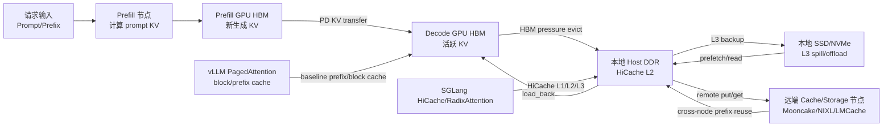
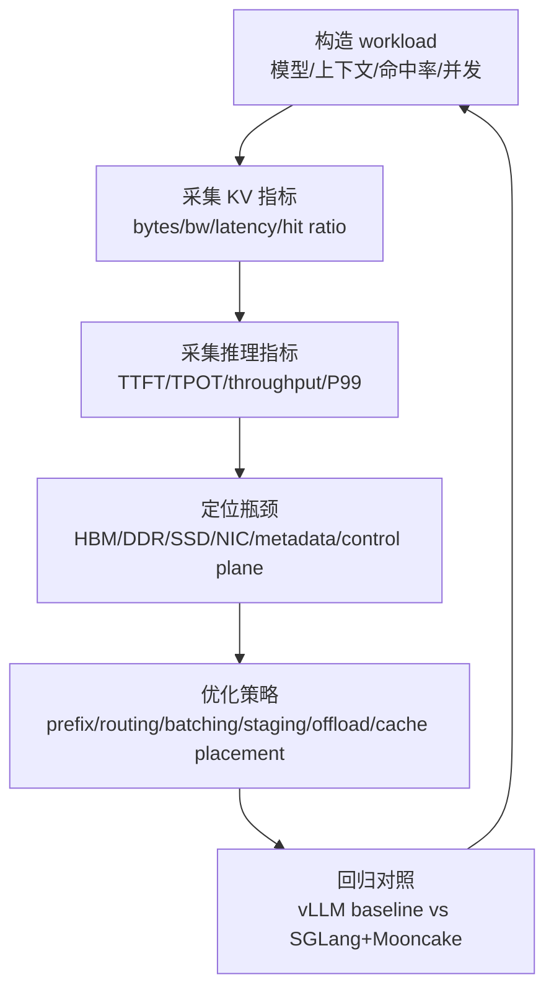

# KVCache 传输实验平台设计与选型建议

本文面向 AI 集群在线推理场景，设计一个覆盖 vLLM、SGLang、Mooncake 等主流推理软件栈的 KVCache 传输实验平台。目标是系统覆盖 PD 分离、设备 HBM 卸载、Host DDR 回填、本地 SSD offload、远端缓存节点、prefix cache 命中与跨节点复用等场景，并采集 KVCache 数据量、带宽、时延、前缀匹配度、TTFT、TPOT 等指标，用于定位瓶颈和指导优化。

公开资料参考：

- Meta Llama 3.1 规格：Llama 3.1 8B/70B/405B 使用 128K context，GQA key/value heads 为 8，层数分别为 32/80/126。
- Qwen3 系列：Qwen3 dense 包括 0.6B/1.7B/4B/8B/14B/32B，MoE 包括 30B-A3B、235B-A22B；Qwen3-VL 支持最高 256K 上下文。
- DeepSeek-V3：671B total、37B active、61 layers、128K context，采用 MLA 与 DeepSeekMoE。
- MiniMax-M1：456B total、45.9B active，hybrid MoE + lightning attention，原生 1M context，并发布 40K/80K thinking budget 版本。
- GLM-4.5：355B total、32B active MoE；GLM-4.5-Air 为 106B 级 compact 版本，面向 agentic/reasoning/coding。
- DeepSeek-V4：截至 2026-06-25 公开资料显示有 V4-Pro 与 V4-Flash 两档，报道规格分别约 1.6T/49B active 和 284B/13B active，支持 1M context；但可复核的 config 细节仍需要以官方模型仓库为准。
- Mooncake 论文描述了 KVCache-centric disaggregated serving，包含 PD 分离、CPU DRAM、SSD 和远端 cache 资源利用。
- Huawei CloudMatrix384 论文描述了 384 Ascend 910C NPU、192 Kunpeng CPU、Unified Bus，以及面向 DeepSeek-R1 的 prefill/decode/cache peer-to-peer 架构。

## 1. 实验目标

实验平台要回答四类问题：

1. 模型维度：不同模型结构下，每 token KVCache 有多大，4K/32K/128K/256K 上下文会产生多少 KVCache 传输量。
2. 链路维度：HBM、Host DDR、本地 SSD、远端缓存节点、Prefill 节点、Decode 节点之间，各链路带宽和时延需要达到什么水平。
3. 业务维度：prefix match 命中率、PD 分离比例、长上下文、并发 batch、输出长度如何影响 TTFT/TPOT。
4. 平台维度：vLLM、SGLang、Mooncake、NIXL、LMCache 等组件在不同硬件栈上的瓶颈分别在哪里。

## 2. KVCache 计算公式

### 2.1 MHA/GQA 模型

对传统 MHA/GQA attention，单 token 的完整模型级 KVCache 大小为：

```text
KV_bytes_per_token = 2 * num_layers * num_kv_heads * head_dim * dtype_bytes
```

其中：

- `2` 表示 K 和 V。
- `num_layers` 是 transformer 层数。
- `num_kv_heads` 是 KV heads，GQA 下通常小于 attention heads。
- `head_dim = hidden_size / num_attention_heads`。
- `dtype_bytes` 通常 BF16/FP16 为 2，FP8 为 1。

TP 并行下，单卡实际持有 KVCache 通常近似为：

```text
KV_bytes_per_token_per_rank ~= KV_bytes_per_token / tp_size
```

但要注意：当 `tp_size > num_kv_heads`、存在 KV head replication、异构 TP 或特殊 backend 时，单卡数据量不一定严格线性缩小，实验平台必须从 runtime 的实际 KV page 分配和 transfer bytes 计数校准。

### 2.2 MLA 模型

DeepSeek-V2/V3/R1 这类 MLA 模型不保存完整 per-head K/V，而保存 latent cache。可按近似公式估算：

```text
MLA_KV_bytes_per_token = num_layers * (kv_lora_rank + qk_rope_head_dim) * dtype_bytes
```

以 DeepSeek-V3/R1 常用公开规格估算：`num_layers=61`，`kv_lora_rank=512`，`qk_rope_head_dim=64`，BF16 下约为：

```text
61 * (512 + 64) * 2 = 70,272 bytes ~= 68.6 KiB/token
```

这也是 DeepSeek 系列长上下文推理中 Latent Cache 显著小于传统 GQA KVCache 的核心原因之一。

## 3. 主流模型规格与 KVCache 规模

下表用于平台初期容量规划。最终实验时应以 Hugging Face `config.json`、官方 model card、SGLang/vLLM 实际 engine config、以及 runtime 记录的 KV page bytes 为准。对于 hybrid attention、MLA、lightning attention、稀疏 attention 等模型，不能只套 MHA/GQA 公式，必须从 runtime 侧采集真实 KV/state page bytes。

| 模型 | 结构 | 层数 | Hidden | Attn heads | KV heads / latent | Context | BF16 KV/token | 4K KV | 32K KV | 128K KV |
|---|---:|---:|---:|---:|---:|---:|---:|---:|---:|---:|
| Mistral-7B / Mixtral-8x7B | GQA/MoE | 32 | 4096 | 32 | 8 KV heads | 32K | 128 KiB | 512 MiB | 4 GiB | 16 GiB |
| Llama-3.1-8B | GQA dense | 32 | 4096 | 32 | 8 KV heads | 128K | 128 KiB | 512 MiB | 4 GiB | 16 GiB |
| Qwen3-32B dense | GQA dense | 64 | 5120 | 40 | 8 KV heads | 128K+ | 256 KiB | 1 GiB | 8 GiB | 32 GiB |
| Llama-3.1-70B | GQA dense | 80 | 8192 | 64 | 8 KV heads | 128K | 320 KiB | 1.25 GiB | 10 GiB | 40 GiB |
| Qwen2.5-72B | GQA dense | 80 | 8192 | 64 | 8 KV heads | 128K | 320 KiB | 1.25 GiB | 10 GiB | 40 GiB |
| Llama-3.1-405B | GQA dense | 126 | 16384 | 128 | 8 KV heads | 128K | 504 KiB | 1.97 GiB | 15.75 GiB | 63 GiB |
| DeepSeek-V3/R1 | MLA MoE | 61 | MLA | MLA | 512+64 latent | 128K | 68.6 KiB | 274 MiB | 2.14 GiB | 8.58 GiB |
| Qwen3-235B-A22B | MoE/GQA | 待 runtime 校准 | 待校准 | 待校准 | 待校准 | 128K+ | 待校准 | 待校准 | 待校准 | 待校准 |
| GLM-4.5 | MoE | 公开总参 355B | 待校准 | 待校准 | 待校准 | 长上下文 | 待校准 | 待校准 | 待校准 | 待校准 |
| GLM-4.5-Air | MoE | 公开总参 106B | 待校准 | 待校准 | 待校准 | 长上下文 | 待校准 | 待校准 | 待校准 | 待校准 |
| MiniMax-M1 | Hybrid MoE + lightning attention | 公开总参 456B | hybrid | hybrid | active 45.9B | 1M | 需实测 | 需实测 | 需实测 | 需实测 |
| MiniMax-M2/M2.5/M2.7 | Sparse MoE | 公开报道为 230B 级及后续版本 | 待校准 | 待校准 | M2 约 10B active | 长上下文/agent | 需实测 | 需实测 | 需实测 | 需实测 |
| DeepSeek-V4-Pro | MLA/DSA/MoE 待确认 | 报道总参 1.6T | 待确认 | 待确认 | active 49B | 1M | 需实测 | 需实测 | 需实测 | 需实测 |
| DeepSeek-V4-Flash | MLA/DSA/MoE 待确认 | 报道总参 284B | 待确认 | 待确认 | active 13B | 1M | 需实测 | 需实测 | 需实测 | 需实测 |

结论：

- 传统 GQA 大模型的 KVCache 规模随层数线性增长，70B/72B 在 32K prompt 下约 10 GiB，128K 下约 40 GiB。
- Llama-405B 这类大 dense 模型即使使用 GQA，128K KVCache 也达到约 63 GiB，每次 PD 传输或 L3 回填都会强烈依赖高速互联。
- DeepSeek-V3/R1 的 MLA latent cache 约 68.6 KiB/token，128K 约 8.58 GiB，比 70B GQA 的 40 GiB 小很多，但 decode batch 很大时仍会迅速占满 HBM。
- MiniMax-M1、GLM-4.5、DeepSeek-V4 这类新一代超大 MoE/hybrid attention 模型，参数规模不等同于 KVCache 规模；KV 传输压力主要由 attention state 布局、context length、page size、TP/PP 切分和 runtime 缓存实现决定。
- 对 1M context 模型，哪怕 KV/token 只有 DeepSeek-V3 级别的约 68.6 KiB，单请求完整 cache 也约 67 GiB；若是 70B GQA 级别的 320 KiB/token，则 1M context 会达到约 312 GiB，必须依赖分层缓存、远端 cache 和高命中 prefix reuse。

## 3.1 超大模型补充分析

| 模型族 | 当前公开定位 | KVCache 实验关注点 | 平台含义 |
|---|---|---|---|
| MiniMax-M1 | 456B total / 45.9B active，hybrid MoE + lightning attention，1M context | 传统 KVCache 与 lightning attention state 的比例；长上下文下 state 是否可分层 offload；thinking budget 对 active context 的影响 | 必须支持 1M context 压测；需要从 runtime hook 采集真实 state bytes，而不是只按 GQA 公式估算 |
| MiniMax-M2/M2.5/M2.7 | 后续开源 MoE/agent 模型，M2 公开报道为 230B 级、10B active | agent 工具调用、多轮长会话、prefix 共享与 cache churn | 适合构造多轮 agent workload，观察 prefix cache 与远端 cache 的生命周期 |
| GLM-4.5 | 355B total / 32B active MoE，面向 agentic/reasoning/coding | 长链路工具调用、代码仓库上下文、thinking/direct 双模式对 KV resident set 的影响 | 需要同时测长 prompt、长 output、工具调用间隔下的 KV 保活策略 |
| GLM-4.5-Air | 106B 级 compact MoE | 中等资源 pod 上复现 GLM-4.5 类 workload | 适合 Ascend A3 单 pod 或 2 pod 原型阶段先跑 |
| DeepSeek-V4-Pro | 公开报道约 1.6T total / 49B active，1M context | MLA/DSA/新 attention state 的真实 bytes/token；1M context 的远端 cache 与 SSD offload | 需要 2-3 个 pod 起步，单 pod 更多用于功能验证 |
| DeepSeek-V4-Flash | 公开报道约 284B total / 13B active，1M context | 低 active 参数但超长 context 下的 KV/state 传输压力 | 适合作为 V4 家族原型压测模型，优先测 PD + L3 restore |
| DeepSeek-Prover-V2-671B | 数学/证明推理模型，671B 级 | 超长 reasoning 输出，KVCache 从 prompt 主导转向 decode 输出累积 | 需要同时观察 TPOT 与 HBM cache 增长，而不只看 TTFT |

这些模型进入实验平台后，建议新增一个 `model_capability_profile.json`，记录每个模型的可复核字段：

```json
{
  "model": "MiniMax-M1",
  "architecture": "hybrid_moe_lightning_attention",
  "params_total": "456B",
  "params_active": "45.9B",
  "context_length": 1000000,
  "attention_state_formula": "runtime_measured",
  "kv_bytes_per_token_runtime": null,
  "notes": "Use runtime page allocation and transfer counters as source of truth."
}
```

## 4. 典型 KVCache 流动场景



需要覆盖的实验场景如下。

| 场景编号 | 场景 | 数据方向 | 主要软件栈 | 关键指标 |
|---|---|---|---|---|
| S1 | 普通单节点推理 | HBM 内部 KV page 分配/释放 | vLLM、SGLang | HBM 使用率、block/page fragmentation、TTFT、TPOT |
| S2 | Prefix cache 命中 | 已有 HBM KV 复用 | vLLM prefix cache、SGLang radix cache | prefix match ratio、saved prefill tokens、TTFT 降幅 |
| S3 | HBM 卸载到 Host DDR | Device HBM -> Host DDR | SGLang HiCache | D2H bytes、D2H bandwidth、evict latency、decode TPOT 抖动 |
| S4 | Host DDR 回填 HBM | Host DDR -> Device HBM | SGLang HiCache | H2D bytes、load_back latency、请求等待时间 |
| S5 | Host DDR 写本地 SSD | DDR -> NVMe SSD | Mooncake SSD offload、NIXL FILE/GDS | write bandwidth、queue depth、tail latency、SSD 放大 |
| S6 | 本地 SSD 回读 | NVMe SSD -> DDR | Mooncake/NIXL | read bandwidth、P99 latency、TTFT 增量 |
| S7 | Host DDR 写远端 cache | DDR -> remote cache node | Mooncake store、NIXL OBJ/FILE、LMCache | RDMA/RoCE 带宽、metadata latency、hit publish latency |
| S8 | 远端 cache 回读 | remote cache node -> DDR | Mooncake/NIXL/LMCache | remote read latency、effective bandwidth、跨节点 prefix reuse |
| S9 | PD 分离传输 | Prefill HBM -> Decode HBM | SGLang disaggregation + Mooncake/NIXL | transfer bytes、RDMA bandwidth、bootstrap latency、decode wait |
| S10 | PD + 本地 HiCache restore | Remote/DDR -> Decode HBM + PD status gate | SGLang decode HiCache | local restore latency、KVReceiver gate time、TTFT |
| S11 | TP 异构 PD | Prefill TP 与 Decode TP 不一致 | SGLang Mooncake slice/staging | 小段数量、batch_transfer 调用数、staging gather/scatter cost |
| S12 | 长上下文混合负载 | 4K/32K/128K 混合 | 全栈 | prefix hit 分布、cache churn、TTFT/TPOT P99 |

## 5. 传输数据量与带宽诉求

### 5.1 基本公式

对一次 KVCache 流动：

```text
transfer_bytes = sum_i(KV_bytes_per_token(model_i) * moved_tokens_i)
effective_bandwidth = transfer_bytes / transfer_latency
required_bandwidth = transfer_bytes / latency_budget
```

对 prefix cache 或远端 cache 命中：

```text
moved_tokens = prompt_tokens * (1 - prefix_match_ratio)
saved_prefill_tokens = prompt_tokens * prefix_match_ratio
```

对 PD 分离：

```text
PD_transfer_bytes = KV_bytes_per_token * transferred_prefill_tokens
```

如果 Decode 节点已经通过本地 HiCache 或远端 cache restore 得到部分 prefix，则：

```text
PD_transfer_bytes ~= KV_bytes_per_token * (prompt_tokens - restored_prefix_tokens)
```

### 5.2 32K KVCache 在不同 latency budget 下的带宽

| 模型 | 32K KV 数据量 | 200ms 预算 | 100ms 预算 | 50ms 预算 |
|---|---:|---:|---:|---:|
| Llama-3.1-8B / Mixtral-8x7B | 4 GiB | 20 GiB/s | 40 GiB/s | 80 GiB/s |
| Qwen3-32B | 8 GiB | 40 GiB/s | 80 GiB/s | 160 GiB/s |
| Llama-3.1-70B / Qwen2.5-72B | 10 GiB | 50 GiB/s | 100 GiB/s | 200 GiB/s |
| Llama-3.1-405B | 15.75 GiB | 78.8 GiB/s | 157.5 GiB/s | 315 GiB/s |
| DeepSeek-V3/R1 MLA | 2.14 GiB | 10.7 GiB/s | 21.4 GiB/s | 42.8 GiB/s |

这些是模型级总数据量。若 TP=8 且 KV 均匀切分，则单卡/单 rank 近似为上表的 `1/8`，但 PD 总链路、远端 cache 节点聚合带宽仍需承载全量数据。

### 5.3 Prefix 命中率对传输量的影响

以 32K prompt 为例：

| 模型 | Prefix hit 0% | Hit 50% | Hit 75% | Hit 90% |
|---|---:|---:|---:|---:|
| Llama-3.1-8B | 4 GiB | 2 GiB | 1 GiB | 410 MiB |
| Qwen3-32B | 8 GiB | 4 GiB | 2 GiB | 819 MiB |
| Llama-3.1-70B | 10 GiB | 5 GiB | 2.5 GiB | 1 GiB |
| Llama-3.1-405B | 15.75 GiB | 7.88 GiB | 3.94 GiB | 1.58 GiB |
| DeepSeek-V3/R1 | 2.14 GiB | 1.07 GiB | 548 MiB | 219 MiB |

结论：

- Prefix match ratio 是 KVCache 传输平台最关键的业务指标之一。
- 长上下文下，把命中率从 50% 提升到 90%，通常比单纯把网络带宽翻倍更有效。
- PD 场景下应区分“prefill 实际计算了多少 token”和“decode 还需要接收多少 KV token”；后者才是 PD transfer bytes。
- 但 prefix match 高不等于 TTFT 一定低：如果命中 KV 不在当前 Decode HBM，而在本地 Host DDR、本地 SSD 或远端 cache 节点，仍然需要执行 restore/load。此时 `prefix_match_ratio` 降低的是重新 prefill 计算量，但会新增一条对时延极敏感的 KVCache 传输链路。

### 5.3.1 Prefix Hit 后的 Restore 时延敏感性

高命中场景下，KVCache 可能处在不同层级；每个层级的命中收益和时延风险不同：

| Prefix 命中位置 | 后续动作 | 典型数据方向 | 时延敏感性 | 关键指标 |
|---|---|---|---|---|
| 当前 Decode HBM | 直接复用 | 无跨层传输 | 最低 | HBM resident hit tokens、page fragmentation |
| 本机 Host DDR | load back 到 HBM | DDR -> HBM | 高 | H2D restore latency、load stream overlap、TTFT 增量 |
| 本机 SSD | 先读到 DDR，再 H2D | SSD -> DDR -> HBM | 很高 | NVMe P99、read bandwidth、DDR staging、TTFT 抖动 |
| 远端 Cache/Storage | 远端读到本机 DDR，再 H2D | Remote -> DDR -> HBM | 极高 | RDMA/RoCE latency、metadata latency、batch get latency、network congestion |
| Prefill 节点已有 KV | PD transfer 到 Decode | Prefill HBM -> Decode HBM | 极高 | PD transfer bytes、bootstrap/status latency、decode wait |

因此，实验平台需要把 prefix 命中拆成两类指标：

```text
logical_prefix_hit_ratio = matched_prefix_tokens / prompt_tokens
local_hbm_hit_ratio = decode_hbm_hit_tokens / prompt_tokens
restore_required_tokens = logical_hit_tokens - decode_hbm_hit_tokens
restore_latency_ms = remote_or_l2_fetch_done_ts - restore_start_ts
ttft_saved_ms = prefill_compute_saved_ms - restore_latency_ms
```

优化目标不是单纯提高 `logical_prefix_hit_ratio`，而是提高“可在 TTFT 预算内完成 restore 的有效命中率”：

```text
effective_prefix_hit_ratio =
  tokens_restored_before_deadline / prompt_tokens
```

对 32K/70B GQA 模型，若 logical prefix hit 为 90%，仍可能有约 9 GiB KV 需要从 DDR/远端 restore 到 Decode 节点；若 TTFT 预算为 100ms，restore 链路仍需要接近 90 GiB/s 的有效聚合带宽。对 1M context 模型，即使仅 10% 命中 KV 需要 restore，也可能是 6.7-31.2 GiB 级别的数据移动，必须单独压测。

### 5.4 1M Context 超大模型压力估算

1M context 模型的主要压力不一定来自参数量，而来自长上下文状态驻留和跨层级迁移。若用不同 KV/state 密度做估算：

| KV/state 密度 | 代表类型 | 1M context 单请求状态量 | 100ms 预算带宽 | 1s 预算带宽 |
|---:|---|---:|---:|---:|
| 68.6 KiB/token | DeepSeek-V3/R1 MLA 级别 | 67 GiB | 670 GiB/s | 67 GiB/s |
| 128 KiB/token | 8B GQA 级别 | 125 GiB | 1.25 TiB/s | 125 GiB/s |
| 320 KiB/token | 70B GQA 级别 | 312 GiB | 3.12 TiB/s | 312 GiB/s |
| 504 KiB/token | 405B GQA 级别 | 492 GiB | 4.92 TiB/s | 492 GiB/s |

因此，MiniMax-M1、DeepSeek-V4 这类 1M context 模型必须重点测试：

1. 实际 runtime KV/state bytes/token，而不是仅使用模型参数量估算。
2. 1M prompt 是否分段 prefill，以及每段 KV/state 何时进入 HBM、DDR、SSD、远端 cache。
3. Prefix hit 90% 以上时，剩余 10% cache 迁移是否仍能满足 TTFT。
4. 远端 cache 是否支持足够大的对象规模、metadata QPS 和批量 get/set。
5. SSD offload 是否只作为冷数据层，避免 1M context 的 TTFT 关键路径被 NVMe P99 拉长。

## 6. 指标采集设计

### 6.1 统一指标

| 指标 | 定义 | 采集点 |
|---|---|---|
| `kv_bytes_total` | 某次传输实际 KV 字节数 | runtime page size、transfer API 参数、Mooncake/NIXL counters |
| `kv_tokens_moved` | 被传输或回填的 token/page 数 | SGLang cache controller、vLLM block manager |
| `kv_transfer_latency_ms` | 单次 KV transfer 从提交到完成 | SGLang worker、Mooncake engine wrapper、NIXL xfer handle |
| `kv_effective_bw_gib_s` | `bytes / latency` | 由上两项计算 |
| `prefix_match_ratio` | matched prefix tokens / prompt tokens | vLLM prefix cache、SGLang radix cache |
| `remote_cache_hit_ratio` | L3/remote 命中 tokens / 查询 tokens | Mooncake store、NIXL、LMCache |
| `hbm_kv_used_bytes` | GPU/NPU HBM 中 KV 占用 | engine memory pool |
| `host_kv_used_bytes` | Host DDR 中 KV 占用 | SGLang HostKVCache、OS memory |
| `ssd_read_write_iops` | NVMe I/O 行为 | iostat、SPDK、vendor tool |
| `nic_tx_rx_bw` | 网络吞吐 | NIC counters、RoCE/IB telemetry |
| `TTFT` | 请求进入到首 token 返回 | serving gateway |
| `TPOT` | decode 阶段每 output token 时间 | serving runtime |

### 6.2 SGLang 采集点

| 模块 | 采集内容 |
|---|---|
| `HiRadixCache.match_prefix()` | prefix 命中长度、设备命中/host 命中/L3 命中 |
| `HiCacheController.write()` | HBM -> DDR pages、D2H latency |
| `HiCacheController.load()` | DDR -> HBM pages、H2D latency |
| `HiCacheController.write_storage()` | DDR -> L3 pages、排队时延、backend set latency |
| `HiCacheController.prefetch()` | L3 -> DDR pages、backend get latency |
| `MooncakeStore.batch_set_v1/v2()` | key 数、bytes、put latency、失败码 |
| `MooncakeStore.batch_get_v1/v2()` | key 数、bytes、get latency、失败码 |
| `MooncakeKVSender.send()` | chunk tokens、是否 last chunk、state/aux 大小 |
| `MooncakeKVManager.transfer_worker()` | queue wait、engine transfer latency、status sync latency |
| `MooncakeTransferEngine.batch_transfer_sync()` | src/dst block 数、bytes、返回码、同步耗时 |

### 6.3 vLLM 采集点

| 模块 | 采集内容 |
|---|---|
| PagedAttention block manager | block alloc/free、fragmentation、active blocks |
| Prefix cache | prefix hit tokens、hit ratio、cache eviction |
| Scheduler | prefill/decode batch size、chunked prefill 行为 |
| Metrics endpoint | TTFT、TPOT、throughput、queue latency |
| Worker/model runner | HBM 使用、KV block size、cache utilization |

vLLM 用于建立 PagedAttention/prefix cache 的基线，SGLang 用于覆盖 HiCache 多层卸载、Mooncake/NIXL PD 传输与远端 KV cache。

### 6.4 Mooncake/NIXL/LMCache 采集点

| 组件 | 采集内容 |
|---|---|
| Mooncake transfer engine | `batch_transfer_sync_write` 调用数、block 数、bytes、latency、错误码 |
| Mooncake store | `batch_is_exist`、`batch_put_from`、`batch_get_into` 的 latency 与返回码 |
| Mooncake metadata/master | segment 数、key 数、metadata QPS、P99 latency |
| NIXL | `initialize_xfer` latency、`transfer` 到 `DONE` latency、poll 次数、ERR 次数 |
| LMCache | `lookup_kv` 命中 tokens、`retrieve_kv/start_load_kv` latency、`store_kv` latency |

## 7. 实验矩阵

### 7.1 模型矩阵

| 档位 | 推荐模型 | 目的 |
|---|---|---|
| Small | Llama-3.1-8B、Qwen3-8B | 快速验证 HBM/DDR/SSD/PD 链路，降低资源成本 |
| Medium | Qwen3-32B、QwQ-32B、Mixtral-8x7B | 覆盖 32B dense、MoE、GQA 中等 KV 压力 |
| Large | Llama-3.1-70B、Qwen2.5-72B | 典型生产级 dense/GQA KV 压力 |
| MLA/MoE | DeepSeek-V3/R1 | 覆盖 MLA latent cache、MoE、PD decode 瓶颈 |
| Extra large | Llama-3.1-405B、Qwen3-235B-A22B | 验证极大模型 KV transfer 和远端 cache 聚合压力 |
| New ultra large | MiniMax-M1、GLM-4.5、DeepSeek-V4-Pro/Flash | 覆盖 1M context、hybrid attention、超大 MoE、agent/reasoning 长链路 |

### 7.2 上下文矩阵

| Prompt 长度 | Output 长度 | 目标 |
|---:|---:|---|
| 1K | 128 | 短请求 baseline，控制面开销占比高 |
| 4K | 256 | 常规 RAG/agent 请求 |
| 16K | 512 | 中长上下文，观察 prefix cache 收益 |
| 32K | 512/1K | KV transfer 主测试点 |
| 64K | 1K | 长上下文 HBM 压力与 offload |
| 128K | 1K/2K | 极限长上下文，远端 cache 与 SSD offload |
| 256K | 2K/4K | Qwen3-VL、MiniMax/GLM/DeepSeek 新模型长上下文中间点 |
| 1M | 4K/8K/80K thinking budget | MiniMax-M1、DeepSeek-V4 等 1M context 压力测试 |

### 7.3 Prefix 命中矩阵

构造共享前缀 workload：

| 命中率 | 构造方式 | 观察点 |
|---:|---|---|
| 0% | 每个请求完全不同 prompt | 最坏传输量、最低复用 |
| 25% | 系统 prompt + 少量共享文档 | 低复用 RAG |
| 50% | 半共享文档/多轮会话 | 中等复用 |
| 75% | 同一文档多 query | 高复用 RAG |
| 90%+ | 固定长文档 + 短 query | cache 系统最佳收益区 |

### 7.4 并发矩阵

| 并发 | 目标 |
|---:|---|
| 1 | 单请求传输 latency baseline |
| 8 | 观察 queue wait 与 batch 合并 |
| 32 | 压测 metadata/QPS 与 HBM 分配 |
| 128 | 压测远端 cache、网络、SSD tail latency |
| 512+ | 只用于服务端吞吐极限和稳定性测试 |

## 8. 原型实验平台架构

### 8.1 最小可用平台

适合先把采集闭环跑通：

```text
1 个 8 卡计算节点或 1 个 Ascend A3 8 卡 pod
角色切分：
  - 4 卡 Prefill
  - 4 卡 Decode
  - 本机 CPU DDR 作为 L2
  - 本机 NVMe SSD 作为 L3 spill
  - 本机 Mooncake/NIXL/LMCache 服务作为远端 cache 的单机模拟
```

优点：部署简单，适合验证指标采集、KV bytes 计算、SGLang/vLLM benchmark、Mooncake store 接口。

不足：无法真实覆盖跨节点 RDMA/RoCE 和 cache node 聚合瓶颈。

### 8.2 推荐原型平台

```text
2-3 个 8 卡 pod / 节点：
  Pod A：Prefill pool
  Pod B：Decode pool
  Pod C：Cache/Storage pool，可选，也可与 A/B 共节点

每个 pod：
  - 8 张 AI 加速卡，优先选择 Ascend A3 8 卡 pod 作为目标平台
  - Host DDR >= 1-2 TB
  - 本地 NVMe SSD >= 15 TB，可提供高队列深度随机读写
  - 200/400/800 GbE RoCE 或 IB 互联
  - PTP/NTP 时间同步
```

推荐原因：

- 两个计算 pod 才能真实测 PD prefill->decode 跨节点传输。
- 第三个 cache pod 可以隔离远端 KV store 的 CPU、DDR、SSD、NIC 瓶颈。
- 8 卡 pod 可以覆盖 TP=8、PP/TP 组合、prefill/decode 静态切分和动态比例切分。
- Ascend A3 8 卡 pod 可作为目标国产 NPU 平台；但为了快速验证 vLLM/SGLang/Mooncake 原生能力，建议保留一套 CUDA/NVIDIA 参考环境做软件功能和性能基线。

### 8.3 软件栈建议

| 层级 | 组件 | 作用 |
|---|---|---|
| 推理框架 baseline | vLLM | PagedAttention、prefix cache、continuous batching baseline |
| 推理框架主测 | SGLang | RadixAttention、HiCache、PD disaggregation、Mooncake/NIXL transfer |
| KV 传输/存储 | Mooncake | PD KV transfer、distributed KV store、SSD offload |
| 备选传输 | NIXL | xfer handle、FILE/GDS/OBJ 后端，对照 Mooncake |
| 备选 cache | LMCache | prefix lookup/retrieve/store，对照远端 cache |
| 观测 | Prometheus + Grafana | 服务指标、KV 指标、节点指标 |
| 硬件 profiling | Nsight/CUPTI 或 Ascend Profiler | GPU/NPU kernel、H2D/D2H、算子与 stream |
| 网络观测 | NIC counters、RoCE/IB telemetry | RDMA 带宽、重传、拥塞、PFC/ECN |
| 存储观测 | iostat、fio、SPDK/vendor 工具 | SSD IOPS、吞吐、P99 |

### 8.4 Ascend A3 8 卡 pod 适配建议

Ascend A3 可作为目标选型，但实验平台应分两阶段建设：

1. CUDA 快速闭环阶段：优先在 NVIDIA/H20/H800/H100/H200 等成熟 CUDA 环境跑通 vLLM、SGLang、Mooncake、NIXL、LMCache 的全场景测试和指标采集。
2. Ascend 目标验证阶段：迁移到 Ascend A3 8 卡 pod，验证 CANN、AscendCL、SGLang/vLLM Ascend backend、Mooncake/NIXL 在 NPU 环境下的功能完整性和性能差异。

Ascend 平台重点验证：

- NPU HBM 容量和带宽对 decode KV residency 的影响。
- NPU/CPU DDR 之间 KV unload/load 的带宽和 stream overlap 能力。
- Pod 内互联对 PD transfer 的支持程度。
- Mooncake/NIXL 是否能在 Ascend 环境使用目标网络和内存注册能力。
- DeepSeek-R1/V3 这类 MLA/MoE 模型在 NPU 上的 decode batch 与 latent cache offload 收益。

## 9. 平台选型建议

### 9.1 推荐结论

| 目标 | 推荐 |
|---|---|
| 快速跑通全功能 | 先用 CUDA/NVIDIA 2 节点或 3 节点参考平台 |
| 面向国产化落地 | 使用 Huawei Ascend A3 8 卡 pod 做目标平台 |
| PD 分离主测框架 | SGLang + Mooncake |
| Prefix cache baseline | vLLM + SGLang 双框架对照 |
| 远端 KV store 主测 | Mooncake store |
| 对照后端 | NIXL、LMCache |
| 核心模型 | Llama-3.1-8B/70B、Qwen3-32B、Qwen2.5-72B、DeepSeek-R1/V3 |
| 超大模型扩展 | MiniMax-M1、GLM-4.5/GLM-4.5-Air、DeepSeek-V4-Pro/Flash、Qwen3-235B-A22B |
| 核心场景 | 32K/128K 长上下文 + 0/50/75/90% prefix hit + PD 跨节点 |
| 超长上下文场景 | 256K/1M context + 高 prefix hit + SSD/远端 cache restore |

### 9.2 硬件能力建议

| 能力 | 建议值 | 原因 |
|---|---:|---|
| Pod 卡数 | 8 卡 | 覆盖 TP=8、prefill/decode 切分、异构 TP |
| Host DDR | 每节点 1-2 TB 起 | 承载 L2 KVCache 与远端 store buffer |
| 本地 NVMe | 每节点 15 TB 起，越高 IOPS 越好 | 覆盖 SSD offload 和 long-context spill |
| 节点网络 | 至少 200Gbps，推荐 400Gbps+ | 32K/70B KV 在 100ms 内传输需要约 100 GiB/s 聚合带宽 |
| 时间同步 | PTP 优先 | 跨节点分解 TTFT、transfer latency、queue wait |
| 遥测 | NIC/NPU/SSD/CPU 全链路 | KVCache 瓶颈通常跨设备，不只在 runtime 内 |

### 9.3 为什么不能只用单框架

- vLLM 更适合作为 PagedAttention/prefix cache 和通用 serving baseline。
- SGLang 当前更适合深入研究 HiCache、PD disaggregation、Mooncake/NIXL KV transfer 细节。
- Mooncake 是 KVCache-centric disaggregated serving 的关键第三方组件，能覆盖 CPU DRAM、SSD、远端 cache 和 PD 传输。
- LMCache/NIXL 用于判断瓶颈是 SGLang 逻辑、Mooncake 实现、还是更底层网络/存储能力。

## 10. 优化闭环



优先优化顺序：

1. Prefix 命中率：提升命中率通常最直接降低 KV transfer bytes。
2. PD 传输路径：优先避免 TP 异构小段传输；必要时启用 staging bulk transfer。
3. HBM residency：根据请求热度、decode batch、上下文长度决定哪些 KV 留在 HBM。
4. L2 DDR 容量：优先把短期可能复用的 KV 留在 Host DDR，减少 SSD/远端读取。
5. L3/远端 cache：优化 metadata QPS、batch get/set、对象粒度和 key 后缀设计。
6. SSD offload：只对长尾/低热 KV 使用，避免把 TTFT 关键路径压到 SSD 随机读。
7. 拓扑调度：让 prefill、decode、cache 节点尽量按 NIC/NUMA/Pod 拓扑就近通信。

## 11. 首批实验清单

| 实验 | 模型 | 场景 | 输出 |
|---|---|---|---|
| E1 | Llama-3.1-8B | 单节点 vLLM vs SGLang prefix cache | prefix hit 对 TTFT 的收益曲线 |
| E2 | Qwen3-32B | SGLang HBM<->DDR unload/load | H2D/D2H 带宽、TPOT 抖动 |
| E3 | Llama-3.1-70B | 32K PD 跨节点 transfer | Mooncake transfer bytes/bw/latency |
| E4 | DeepSeek-R1/V3 | MLA latent cache 长上下文 | latent cache 数据量、decode batch 上限 |
| E5 | Qwen2.5-72B | DDR<->SSD offload | SSD read/write P99 对 TTFT 的影响 |
| E6 | Llama-3.1-70B | 远端 Mooncake store | remote hit ratio、metadata QPS、get latency |
| E7 | Qwen3-32B | TP 一致 vs TP 异构 PD | slice 小段放大与 staging 收益 |
| E8 | 混合模型 | 0/50/75/90% prefix hit | cache placement 策略收益 |
| E9 | MiniMax-M1 | 256K/1M hybrid attention state | runtime state bytes/token、远端 cache restore 成本 |
| E10 | GLM-4.5 / GLM-4.5-Air | agent/reasoning/code workload | thinking/direct 模式下 KV resident set 与 TTFT/TPOT |
| E11 | DeepSeek-V4-Flash | 1M context PD + L3 restore | V4 家族的最小可行压测路径 |
| E12 | DeepSeek-V4-Pro | 多 pod 超大 MoE 压测 | 聚合网络、远端 cache、metadata server 极限 |

## 12. 结论

建议采用“两阶段、双平台、三类后端”的建设方式：

1. 两阶段：先 CUDA 快速闭环，再 Ascend A3 8 卡 pod 目标验证。
2. 双平台：vLLM 做 serving baseline，SGLang 做 HiCache/PD/Mooncake 深度实验平台。
3. 三类后端：Mooncake 主测，NIXL/LMCache 对照，SSD/远端 cache 分别压测。

从 KVCache 数据量看，32K prompt 下，70B GQA 模型一次完整 KV 流动约 10 GiB，若要求 100ms 内完成，需要约 100 GiB/s 聚合带宽；128K 下约 40 GiB，会把 HBM 容量、Host DDR、网络和 SSD 全部推到压力区。DeepSeek-V3/R1 的 MLA latent cache 显著降低单 token KV 大小，但在高并发 decode、长上下文和远端 cache restore 场景下，仍需要重点关注 DDR/HBM 流动、PD 门控和 metadata 延迟。MiniMax-M1、GLM-4.5、DeepSeek-V4 等新一代超大模型进一步把问题推到 256K/1M context：实验平台必须把“实际 runtime KV/state bytes/token”作为一级指标，否则无法准确评估 offload、PD 传输和远端 cache 的真实压力。

因此，实验平台的核心不是单纯堆算力，而是同时具备：足够 HBM、可观测的 Host DDR 层、可控 SSD offload、真实跨节点高速互联、可拆解的 runtime 指标，以及能把 KV bytes 与 TTFT/TPOT 直接关联起来的实验闭环。
