# SGLang KV Cache 卸载、加载与传输流程分析

本文围绕当前仓库中 `python/sglang/srt` 的 KV cache 相关实现，分析在线推理中 KV cache 的卸载、加载、第三方存储协作、Prefill/Decode 节点间传输，以及多种不同用途 KV cache 的共存机制。

核心代码位置：

- `python/sglang/srt/mem_cache/hiradix_cache.py`
- `python/sglang/srt/mem_cache/unified_radix_cache.py`
- `python/sglang/srt/managers/cache_controller.py`
- `python/sglang/srt/mem_cache/hicache_storage.py`
- `python/sglang/srt/mem_cache/storage/*`
- `python/sglang/srt/disaggregation/prefill.py`
- `python/sglang/srt/disaggregation/decode.py`
- `python/sglang/srt/disaggregation/mooncake/conn.py`
- `python/sglang/srt/disaggregation/nixl/conn.py`

## 1. KV Cache 卸载/加载触发场景

SGLang 中需要区分三类动作：

| 动作 | 方向 | 语义 | 主要触发点 |
|---|---|---|---|
| L1 -> L2 备份 | GPU KV pool -> Host KV pool | 将 GPU 上的 KV cache 复制到 CPU/host 内存，节点标记为 `backuped` | `write_through` 命中阈值、`write_back` eviction 前强制备份 |
| L1 eviction | GPU KV pool free | 释放 GPU KV cache 槽位，若有 host 副本则保留 radix 节点 | Scheduler 内存不足、cache eviction、decode 预分配空间不足 |
| L2 -> L1 load back | Host KV pool -> GPU KV pool | prefix 命中 host 层，但 GPU 层缺页时重新加载到 GPU | prefix match 发现 `evicted && backuped` 节点，`init_load_back` |
| L2 -> L3 backup | Host KV pool -> storage backend | 将 host KV page 写入文件/Mooncake/NIXL/HF3FS 等 L3 | L1->L2 写完成 ack 后，`write_backup_storage` |
| L3 -> L2 prefetch | storage backend -> Host KV pool | 根据 token hash 查询 L3 命中，并预取到 host memory | storage backend 启用、prefix L2 命中后仍有 suffix 可查 |
| Prefill -> Decode transfer | Prefill GPU/host KV -> Decode GPU/host KV | PD disaggregation 中跨节点传输 prompt KV | `disaggregation_mode=prefill/decode`，decode 预分配后发 metadata |

### 1.1 L1 -> L2 备份触发

HiCache 的 radix cache 节点同时记录 GPU value 与 host value：

- `node.value`：GPU KV slot indices。
- `node.host_value`：host KV slot indices。
- `node.backuped`：是否已有 host 层副本。
- `node.evicted`：GPU value 是否已被释放。

备份触发策略由 `--hicache-write-policy` 控制：

| 写策略 | 触发逻辑 | 适合场景 |
|---|---|---|
| `write_through` | 命中后尽早写 host，阈值为 1 | 追求后续复用/可卸载稳定性，愿意付出更多 H2D/D2H 带宽 |
| `write_through_selective` | 命中计数达到阈值再写 host，默认阈值更高 | 避免一次性 prefix 污染 host 层 |
| `write_back` | eviction 前若未备份，先同步写 host，再释放 GPU | 最大限度降低写放大，但 eviction 路径更重 |

在 `HiRadixCache._inc_hit_count()` 中，非 `write_back` 模式会在命中次数达到阈值时调用 `write_backup()`。在 `HiRadixCache.evict()` 中，`write_back` 模式会对未备份节点先 `write_backup(write_back=True)`，等待写完成后再执行 GPU eviction。

### 1.2 L2 -> L1 load back 触发

当新请求进行 prefix matching 时，radix tree 可能命中以下层级：

- L1 device hit：`MatchResult.device_indices` 非空。
- L2 host hit：`MatchResult.host_hit_length` 表示 host 层可恢复的 token 数。
- L3 storage hit：在 storage backend 启用时，额外通过 hash 查询得到 storage hit 长度。

加载回 GPU 的入口是 `BasePrefixCache.init_load_back()`，具体实现包括：

- `HiRadixCache.init_load_back()` / `HiRadixCache.load_back()`
- `UnifiedRadixCache.init_load_back()` / `UnifiedRadixCache.load_back()`
- `LMCRadixCache.init_load_back()` 用于 LMCache MP 模式

load back 不是简单同步 memcpy，而是：

1. Radix cache 根据 `best_match_node` 找出需要从 host 加载的 evicted 节点。
2. 调用 `HiCacheController.load(host_indices, node_id)` 分配 GPU KV slot，并登记 load queue。
3. Scheduler 后续调用 `ready_to_load_host_cache()`。
4. `HiCacheController.start_loading()` 在独立 load stream 中逐层 `load_to_device_per_layer()`。
5. layer event 用于让 forward 与 H2D 加载按层协调。

### 1.3 L3 预取触发

当 `--hicache-storage-backend` 不为空时，Scheduler 设置 `enable_hicache_storage=True`。L3 预取有两类入口：

- 普通统一推理：Scheduler 在处理请求时通过 `tree_cache.prefetch_from_storage()` 发起。
- PD decode 侧：`DecodeHiCachePreallocMixin._start_hicache_prefetch()` 在 decode 预分配完成后发起。

预取流程：

1. 根据当前 host 命中节点、suffix token、last hash、prefix keys 构造 `PrefetchOperation`。
2. `HiCacheController.prefetch_thread_func()` 调用 `_storage_hit_query()`。
3. storage backend 执行 `batch_exists()` 或 v2 pool-aware 查询。
4. 若命中 token 数低于 `prefetch_threshold`，撤销预取并释放预分配 host slots。
5. 若收益足够，进入 `_page_transfer()`，通过 `batch_get_v1()` 或 `batch_get()` 从 L3 读入 host memory。
6. 后续 load back 再把 L2 host memory 恢复到 L1 GPU。

## 2. 参与模块

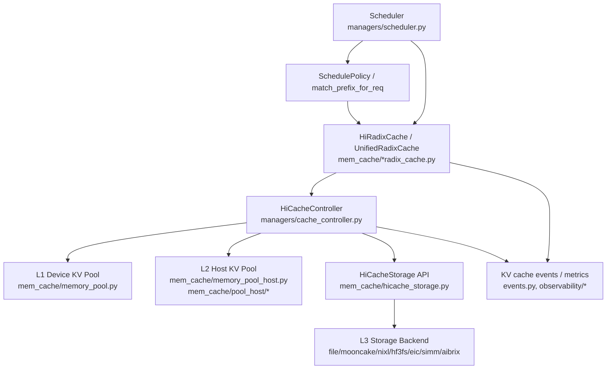
```mermaid
flowchart TB
    Scheduler["Scheduler<br/>managers/scheduler.py"]
    Policy["SchedulePolicy / match_prefix_for_req"]
    Tree["HiRadixCache / UnifiedRadixCache<br/>mem_cache/*radix_cache.py"]
    Controller["HiCacheController<br/>managers/cache_controller.py"]
    DevicePool["L1 Device KV Pool<br/>mem_cache/memory_pool.py"]
    HostPool["L2 Host KV Pool<br/>mem_cache/memory_pool_host.py<br/>mem_cache/pool_host/*"]
    StorageAPI["HiCacheStorage API<br/>mem_cache/hicache_storage.py"]
    StorageBackend["L3 Storage Backend<br/>file/mooncake/nixl/hf3fs/eic/simm/aibrix"]
    Events["KV cache events / metrics<br/>events.py, observability/*"]

    Scheduler --> Policy
    Policy --> Tree
    Scheduler --> Tree
    Tree --> Controller
    Controller --> DevicePool
    Controller --> HostPool
    Controller --> StorageAPI
    StorageAPI --> StorageBackend
    Tree --> Events
    Controller --> Events
```

关键职责如下：

| 模块 | 职责 |
|---|---|
| `Scheduler` | 决定请求准入、batch 调度、是否触发 prefetch/load back、何时检查 HiCache async events |
| `SchedulePolicy` / `match_prefix_for_req` | 对请求 token 序列执行 prefix matching，生成 `MatchResult` |
| `HiRadixCache` / `UnifiedRadixCache` | 管理 radix tree 节点、L1/L2/L3 状态、锁、LRU、eviction、load back |
| `HiCacheController` | 负责真实数据搬运：device<->host、host<->storage、后台线程、ack queue、layer event |
| `HostKVCache` / `memory_pool_host.py` | 持有 host 侧 KV buffer，提供 page meta、flat page、backup/load 操作 |
| `HiCacheStorage` | L3 backend 统一接口，定义 `batch_get_v1/batch_set_v1/batch_get_v2/batch_set_v2` |
| Mooncake/NIXL/HF3FS/AIBrix/EIC/SiMM/file | 第三方或本地 L3 存储实现 |

## 3. 普通在线推理中的卸载/加载时序

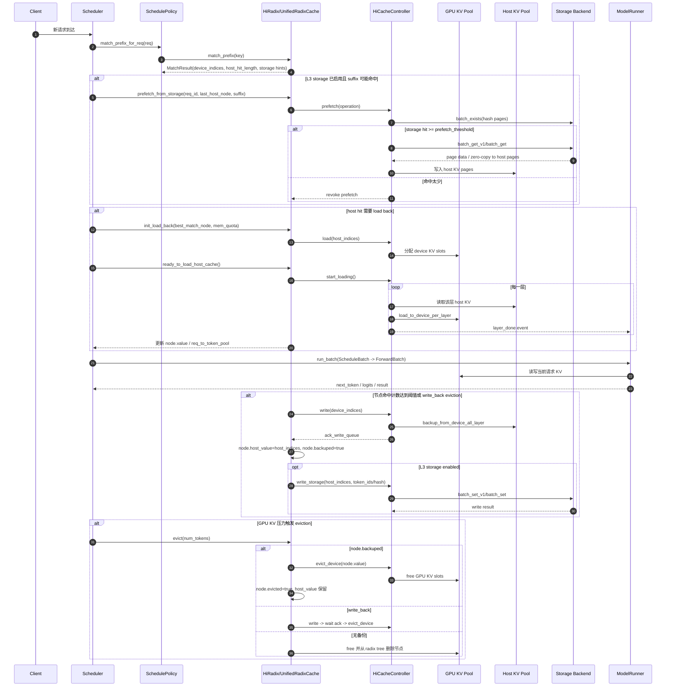
```mermaid
sequenceDiagram
    autonumber
    participant C as Client
    participant S as Scheduler
    participant P as SchedulePolicy
    participant T as HiRadix/UnifiedRadixCache
    participant HC as HiCacheController
    participant L1 as GPU KV Pool
    participant L2 as Host KV Pool
    participant L3 as Storage Backend
    participant R as ModelRunner

    C->>S: 新请求到达
    S->>P: match_prefix_for_req(req)
    P->>T: match_prefix(key)
    T-->>P: MatchResult(device_indices, host_hit_length, storage hints)

    alt L3 storage 已启用且 suffix 可能命中
        S->>T: prefetch_from_storage(req_id, last_host_node, suffix)
        T->>HC: prefetch(operation)
        HC->>L3: batch_exists(hash pages)
        alt storage hit >= prefetch_threshold
            HC->>L3: batch_get_v1/batch_get
            L3-->>HC: page data / zero-copy to host pages
            HC->>L2: 写入 host KV pages
        else 命中太少
            HC-->>T: revoke prefetch
        end
    end

    alt host hit 需要 load back
        S->>T: init_load_back(best_match_node, mem_quota)
        T->>HC: load(host_indices)
        HC->>L1: 分配 device KV slots
        S->>T: ready_to_load_host_cache()
        T->>HC: start_loading()
        loop 每一层
            HC->>L2: 读取该层 host KV
            HC->>L1: load_to_device_per_layer
            HC-->>R: layer_done event
        end
        T-->>S: 更新 node.value / req_to_token_pool
    end

    S->>R: run_batch(ScheduleBatch -> ForwardBatch)
    R->>L1: 读写当前请求 KV
    R-->>S: next_token / logits / result

    alt 节点命中计数达到阈值或 write_back eviction
        T->>HC: write(device_indices)
        HC->>L2: backup_from_device_all_layer
        HC-->>T: ack_write_queue
        T->>T: node.host_value=host_indices, node.backuped=true
        opt L3 storage enabled
            T->>HC: write_storage(host_indices, token_ids/hash)
            HC->>L3: batch_set_v1/batch_set
            L3-->>HC: write result
        end
    end

    alt GPU KV 压力触发 eviction
        S->>T: evict(num_tokens)
        alt node.backuped
            T->>HC: evict_device(node.value)
            HC->>L1: free GPU KV slots
            T->>T: node.evicted=true, host_value 保留
        else write_back
            T->>HC: write -> wait ack -> evict_device
        else 无备份
            T->>L1: free 并从 radix tree 删除节点
        end
    end
```

## 4. SGLang 与第三方模块配合

SGLang 和第三方组件有两类配合：

1. **HiCache L3 storage**：Mooncake、NIXL、HF3FS、AIBrix、EIC、SiMM、file 等作为 L3 KV cache 后端。
2. **PD disaggregation transfer backend**：Mooncake、NIXL、MORI、Ascend、fake 等用于 prefill 节点到 decode 节点的 KV 传输。

### 4.1 L3 Storage 后端抽象

`StorageBackendFactory` 注册的内置后端：

| backend name | 实现类 | 作用 |
|---|---|---|
| `file` | `HiCacheFile` | 本地文件作为 L3 |
| `mooncake` | `MooncakeStore` | Mooncake distributed store / RDMA / 可选 SSD offload |
| `nixl` | `HiCacheNixl` | NIXL FILE/GDS/GDS_MT/3FS/OBJ 等插件 |
| `hf3fs` | `HiCacheHF3FS` | 3FS/HF3FS 文件系统与元数据服务 |
| `aibrix` | `AibrixKVCacheStorage` | AIBrix KVCache |
| `eic` | `EICStorage` | 火山 EIC KVCache |
| `simm` | `HiCacheSiMM` | SiMM 存储后端 |
| `dynamic` | 配置指定 module/class | 外部自定义 `HiCacheStorage` 子类 |

所有后端都需要继承 `HiCacheStorage`，SGLang 只依赖统一接口：

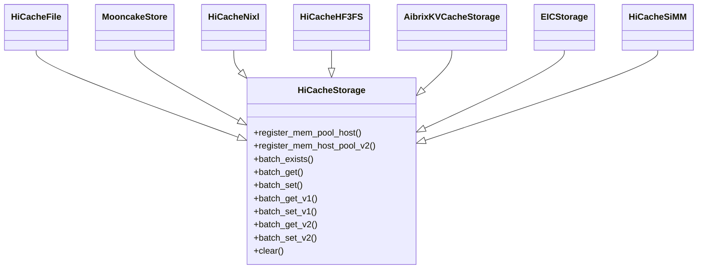
```mermaid
classDiagram
    class HiCacheStorage {
        +register_mem_pool_host()
        +register_mem_host_pool_v2()
        +batch_exists()
        +batch_get()
        +batch_set()
        +batch_get_v1()
        +batch_set_v1()
        +batch_get_v2()
        +batch_set_v2()
        +clear()
    }
    class HiCacheFile
    class MooncakeStore
    class HiCacheNixl
    class HiCacheHF3FS
    class AibrixKVCacheStorage
    class EICStorage
    class HiCacheSiMM

    HiCacheFile --|> HiCacheStorage
    MooncakeStore --|> HiCacheStorage
    HiCacheNixl --|> HiCacheStorage
    HiCacheHF3FS --|> HiCacheStorage
    AibrixKVCacheStorage --|> HiCacheStorage
    EICStorage --|> HiCacheStorage
    HiCacheSiMM --|> HiCacheStorage
```

### 4.2 Mooncake 作为 L3 HiCache Storage

Mooncake L3 存储的配合点：

- `MooncakeStore` 继承 `HiCacheStorage`。
- 初始化时创建 `MooncakeDistributedStore`。
- 配置来源优先级：`--hicache-storage-backend-extra-config`、`SGLANG_HICACHE_MOONCAKE_CONFIG_PATH`、环境变量。
- `setup()` 接入 Mooncake master/metadata/rdma/device/global segment。
- host KV buffer 通过 `register_buffer(ptr, size)` 注册给 Mooncake。
- `batch_set_v1()` 将 host KV page 写入 Mooncake。
- `batch_get_v1()` 将 Mooncake 中的 page 读入 host KV buffer。
- v2 接口支持 `PoolTransfer`，可把 KV、Draft、SWA、Mamba、DSA sidecar pools 作为不同 pool 写入/读取。
- `enable_ssd_offload` 和 `ssd_offload_path` 会转发给 Mooncake，让 Mooncake 将溢出数据 spill 到 SSD。

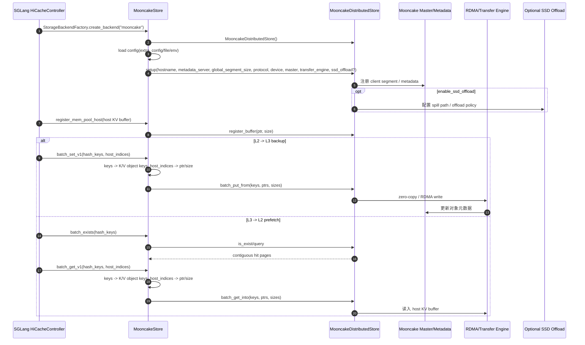
```mermaid
sequenceDiagram
    autonumber
    participant SGL as SGLang HiCacheController
    participant MS as MooncakeStore
    participant MDS as MooncakeDistributedStore
    participant MM as Mooncake Master/Metadata
    participant RDMA as RDMA/Transfer Engine
    participant SSD as Optional SSD Offload

    SGL->>MS: StorageBackendFactory.create_backend("mooncake")
    MS->>MDS: MooncakeDistributedStore()
    MS->>MS: load config(extra_config/file/env)
    MS->>MDS: setup(hostname, metadata_server, global_segment_size, protocol, device, master, transfer_engine, ssd_offload?)
    MDS->>MM: 注册 client segment / metadata
    opt enable_ssd_offload
        MDS->>SSD: 配置 spill path / offload policy
    end
    SGL->>MS: register_mem_pool_host(host KV buffer)
    MS->>MDS: register_buffer(ptr, size)

    alt L2 -> L3 backup
        SGL->>MS: batch_set_v1(hash_keys, host_indices)
        MS->>MS: keys -> K/V object keys, host_indices -> ptr/size
        MS->>MDS: batch_put_from(keys, ptrs, sizes)
        MDS->>RDMA: zero-copy / RDMA write
        RDMA->>MM: 更新对象元数据
    else L3 -> L2 prefetch
        SGL->>MS: batch_exists(hash_keys)
        MS->>MDS: is_exist/query
        MDS-->>MS: contiguous hit pages
        SGL->>MS: batch_get_v1(hash_keys, host_indices)
        MS->>MS: keys -> K/V object keys, host_indices -> ptr/size
        MS->>MDS: batch_get_into(keys, ptrs, sizes)
        MDS->>RDMA: 读入 host KV buffer
    end
```

### 4.3 NIXL 作为 L3 HiCache Storage

NIXL 后端的配合点：

- `HiCacheNixl` 继承 `HiCacheStorage`。
- 使用 `nixl_agent` 与插件后端，插件可为 POSIX、GDS、GDS_MT、3FS、OBJ 等。
- host KV buffer 在 zero-copy 模式下预注册为 DRAM region。
- 如果 host layout 不满足 page alignment 或非 zero-copy，则使用 set/get 两个 bounce buffer。
- storage 侧每次 transfer 注册 file/object target，完成后 deregister/close。
- `batch_get_v1()` 使用 NIXL READ，`batch_set_v1()` 使用 NIXL WRITE。

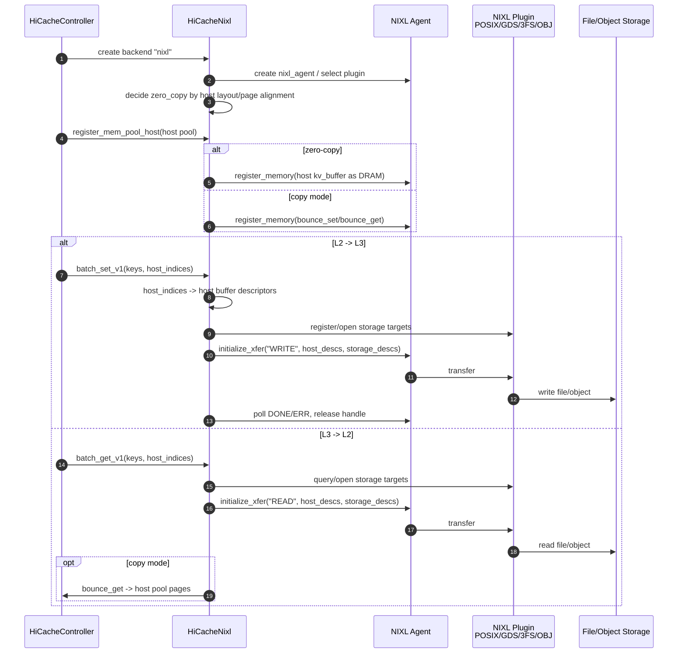
```mermaid
sequenceDiagram
    autonumber
    participant HC as HiCacheController
    participant NX as HiCacheNixl
    participant AG as NIXL Agent
    participant PL as NIXL Plugin<br/>POSIX/GDS/3FS/OBJ
    participant FS as File/Object Storage

    HC->>NX: create backend "nixl"
    NX->>AG: create nixl_agent / select plugin
    NX->>NX: decide zero_copy by host layout/page alignment
    HC->>NX: register_mem_pool_host(host pool)
    alt zero-copy
        NX->>AG: register_memory(host kv_buffer as DRAM)
    else copy mode
        NX->>AG: register_memory(bounce_set/bounce_get)
    end

    alt L2 -> L3
        HC->>NX: batch_set_v1(keys, host_indices)
        NX->>NX: host_indices -> host buffer descriptors
        NX->>PL: register/open storage targets
        NX->>AG: initialize_xfer("WRITE", host_descs, storage_descs)
        AG->>PL: transfer
        PL->>FS: write file/object
        NX->>AG: poll DONE/ERR, release handle
    else L3 -> L2
        HC->>NX: batch_get_v1(keys, host_indices)
        NX->>PL: query/open storage targets
        NX->>AG: initialize_xfer("READ", host_descs, storage_descs)
        AG->>PL: transfer
        PL->>FS: read file/object
        opt copy mode
            NX->>HC: bounce_get -> host pool pages
        end
    end
```

### 4.4 LMCache 集成

LMCache 不是通过 `HiCacheStorage` 工厂注册的 L3 backend，而是作为特殊 radix cache 实现：`LMCRadixCache(RadixCache)`。

两种模式：

- MP 模式：`match_prefix()` 只做 `lookup_kv()`，返回 `host_hit_length`；调度阶段 `init_load_back()` 再 `retrieve_kv()` 到预分配 GPU slot。
- IP 模式：`start_load_kv()` 触发 layerwise 加载，并通过 `LayerTransferCounter.wait_until(layer_id)` 在每层 forward 前推进 `load_kv_layerwise(layer_id)`。

这意味着 LMCache 的“加载”更接近外部 KV service -> GPU pool，而不是 HiCache 的 L3 -> L2 -> L1 两阶段。

## 5. Prefill 节点与 Decode 节点之间的 KV 传输

SGLang 支持 PD disaggregation：prefill 节点负责 prompt prefill，decode 节点负责后续 token decode。二者通过 bootstrap server 与 transfer backend 完成 KV cache 传输。

### 5.1 模块流程图

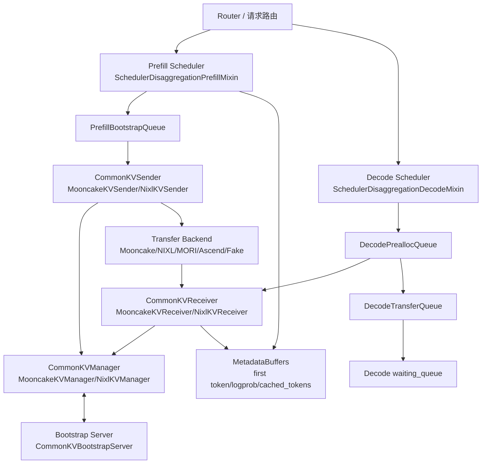
```mermaid
flowchart TB
    Router["Router / 请求路由"]
    PrefillSched["Prefill Scheduler<br/>SchedulerDisaggregationPrefillMixin"]
    DecodeSched["Decode Scheduler<br/>SchedulerDisaggregationDecodeMixin"]
    Boot["Bootstrap Server<br/>CommonKVBootstrapServer"]
    PBQ["PrefillBootstrapQueue"]
    DPQ["DecodePreallocQueue"]
    DTQ["DecodeTransferQueue"]
    Sender["CommonKVSender<br/>MooncakeKVSender/NixlKVSender"]
    Receiver["CommonKVReceiver<br/>MooncakeKVReceiver/NixlKVReceiver"]
    KVManager["CommonKVManager<br/>MooncakeKVManager/NixlKVManager"]
    Backend["Transfer Backend<br/>Mooncake/NIXL/MORI/Ascend/Fake"]
    Meta["MetadataBuffers<br/>first token/logprob/cached_tokens"]
    DecodeWait["Decode waiting_queue"]

    Router --> PrefillSched
    Router --> DecodeSched
    PrefillSched --> PBQ
    DecodeSched --> DPQ
    PBQ --> Sender
    DPQ --> Receiver
    Sender --> KVManager
    Receiver --> KVManager
    KVManager <--> Boot
    Sender --> Backend
    Backend --> Receiver
    PrefillSched --> Meta
    Receiver --> Meta
    DPQ --> DTQ
    DTQ --> DecodeWait
```

### 5.2 PD KV 传输详细时序

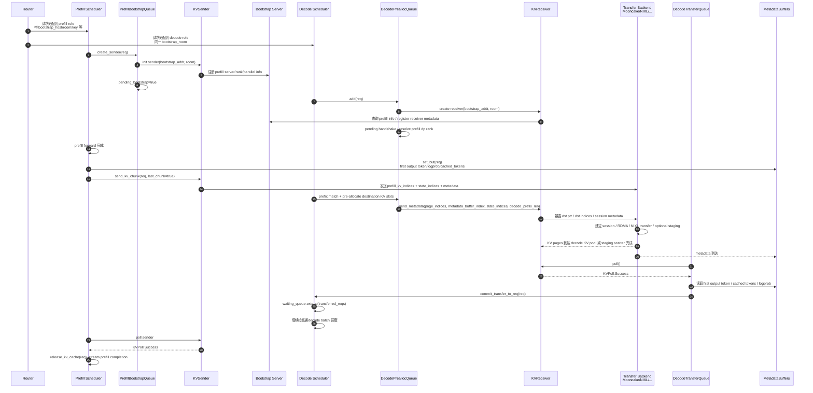
```mermaid
sequenceDiagram
    autonumber
    participant Router as Router
    participant PS as Prefill Scheduler
    participant PBQ as PrefillBootstrapQueue
    participant PKV as KVSender
    participant Boot as Bootstrap Server
    participant DS as Decode Scheduler
    participant DPQ as DecodePreallocQueue
    participant DKV as KVReceiver
    participant B as Transfer Backend<br/>Mooncake/NIXL/...
    participant DTQ as DecodeTransferQueue
    participant Meta as MetadataBuffers

    Router->>PS: 请求分配到 prefill role<br/>带 bootstrap_host/room/key 等
    Router->>DS: 请求分配到 decode role<br/>同一 bootstrap_room

    PS->>PBQ: create_sender(req)
    PBQ->>PKV: init sender(bootstrap_addr, room)
    PKV->>Boot: 注册 prefill server/rank/parallel info
    PBQ->>PBQ: pending_bootstrap=true

    DS->>DPQ: add(req)
    DPQ->>DKV: create receiver(bootstrap_addr, room)
    DKV->>Boot: 查询 prefill info / register receiver metadata
    DPQ->>DPQ: pending handshake / resolve prefill dp rank

    PS->>PS: prefill forward 完成
    PS->>Meta: set_buf(req)<br/>first output token/logprob/cached_tokens
    PS->>PKV: send_kv_chunk(req, last_chunk=true)
    PKV->>B: 发送 prefill_kv_indices + state_indices + metadata

    DS->>DPQ: prefix match + pre-allocate destination KV slots
    DPQ->>DKV: send_metadata(page_indices, metadata_buffer_index, state_indices, decode_prefix_len)
    DKV->>B: 暴露 dst ptr / dst indices / session metadata
    B->>B: 建立 session / RDMA / NIXL transfer / optional staging
    B-->>DKV: KV pages 到达 decode KV pool 或 staging scatter 完成
    B-->>Meta: metadata 到达

    DTQ->>DKV: poll()
    DKV-->>DTQ: KVPoll.Success
    DTQ->>Meta: 读取 first output token / cached tokens / logprob
    DTQ->>DS: commit_transfer_to_req(req)
    DS->>DS: waiting_queue.extend(transferred_reqs)
    DS->>DS: 后续按普通 decode batch 调度

    PS->>PKV: poll sender
    PKV-->>PS: KVPoll.Success
    PS->>PS: release_kv_cache(req), stream prefill completion
```

### 5.3 Mooncake 作为 PD transfer backend

Mooncake PD transfer 与 Mooncake L3 storage 是两套不同集成：

- L3 storage 使用 `MooncakeStore` 和 `MooncakeDistributedStore`。
- PD transfer 使用 `MooncakeKVManager`、`MooncakeKVSender`、`MooncakeKVReceiver` 和 Mooncake transfer engine。

Mooncake PD transfer 关键点：

- `MooncakeKVManager.init_engine()` 获取全局 Mooncake transfer engine。
- `register_buffer_to_engine()` 将 prefill/decode 端 KV buffer、aux buffer、state buffer 批量注册。
- `MooncakeKVSender.send()` 将 KV chunk 放入 transfer queue。
- `MooncakeKVManager.transfer_worker()` 从 queue 中取任务并执行。
- `_send_kvcache_generic()` 按连续 KV index 合并成 transfer blocks。
- `send_kvcache()` 处理 TP size 相同时的完整 page transfer。
- `send_kvcache_slice()` 处理 prefill/decode TP size 不一致时的 head slice transfer。
- `send_aux()` 传输 aux data；在特定配置下可回退 TCP。
- staging buffer 路径用于 gather -> bulk RDMA -> decode scatter，降低异构 TP/head slicing 的碎片传输开销。

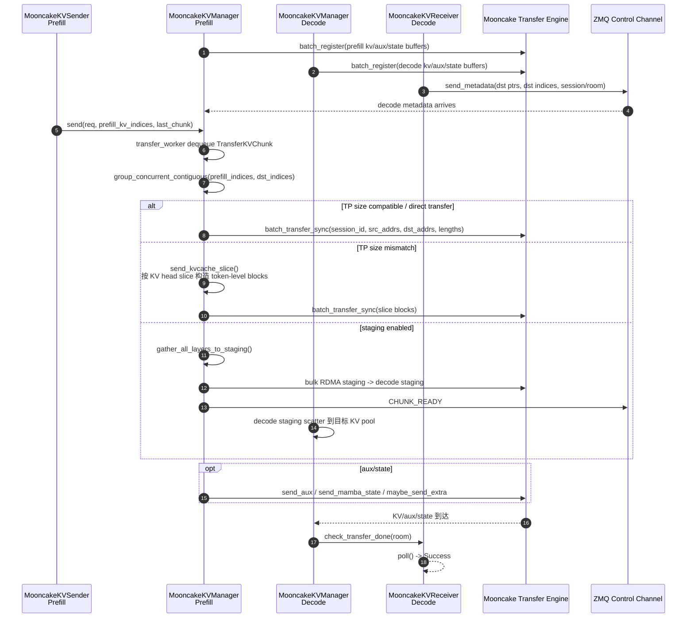
```mermaid
sequenceDiagram
    autonumber
    participant PKV as MooncakeKVSender<br/>Prefill
    participant PM as MooncakeKVManager<br/>Prefill
    participant DM as MooncakeKVManager<br/>Decode
    participant RCV as MooncakeKVReceiver<br/>Decode
    participant TE as Mooncake Transfer Engine
    participant ZMQ as ZMQ Control Channel

    PM->>TE: batch_register(prefill kv/aux/state buffers)
    DM->>TE: batch_register(decode kv/aux/state buffers)
    RCV->>ZMQ: send_metadata(dst ptrs, dst indices, session/room)
    ZMQ-->>PM: decode metadata arrives

    PKV->>PM: send(req, prefill_kv_indices, last_chunk)
    PM->>PM: transfer_worker dequeue TransferKVChunk
    PM->>PM: group_concurrent_contiguous(prefill_indices, dst_indices)

    alt TP size compatible / direct transfer
        PM->>TE: batch_transfer_sync(session_id, src_addrs, dst_addrs, lengths)
    else TP size mismatch
        PM->>PM: send_kvcache_slice()<br/>按 KV head slice 构造 token-level blocks
        PM->>TE: batch_transfer_sync(slice blocks)
    else staging enabled
        PM->>PM: gather_all_layers_to_staging()
        PM->>TE: bulk RDMA staging -> decode staging
        PM->>ZMQ: CHUNK_READY
        DM->>DM: decode staging scatter 到目标 KV pool
    end

    opt aux/state
        PM->>TE: send_aux / send_mamba_state / maybe_send_extra
    end

    TE-->>DM: KV/aux/state 到达
    DM->>RCV: check_transfer_done(room)
    RCV-->>RCV: poll() -> Success
```

### 5.4 NIXL 作为 PD transfer backend

NIXL PD transfer 与 NIXL L3 storage 也是两套实现：

- L3 storage：`HiCacheNixl`。
- PD transfer：`NixlKVManager`、`NixlKVSender`、`NixlKVReceiver`。

PD 路径中 NIXL：

- 初始化 NIXL backend plugin。
- 注册 staging memory、KV tensors、aux tensors、state tensors。
- 根据 prefill/decode TP 拓扑构建 equal TP 或 hetero TP transfer handle。
- 使用 `send_kvcache()`、`send_kvcache_slice()`、`send_kvcache_staged()` 执行传输。
- 通过通知与 status table 判断 room 是否完成。

## 6. Decode 侧 HiCache 与 PD 传输的组合

PD decode 侧可以同时启用 decode radix cache 与 HiCache。其语义是：

- Prefill->Decode transfer 只传 **decode 端缺失的 delta KV**。
- Decode 端若本地 radix cache 已有 L1/L2/L3 prefix，可减少需要跨节点传输的 token。
- L3 命中先预取到 L2，之后 load back 到 L1。
- KVReceiver 的 `Success` 会被 `HiCacheRestoreGatedKVReceiver` gate 住，直到本地 restore READY。

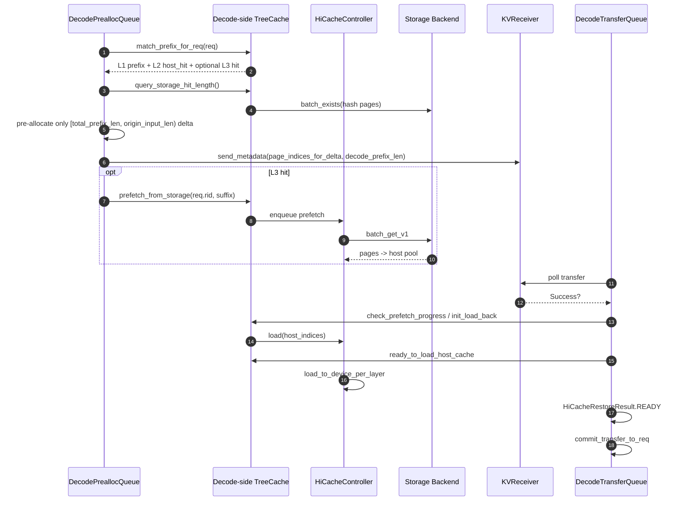
```mermaid
sequenceDiagram
    autonumber
    participant DQ as DecodePreallocQueue
    participant TC as Decode-side TreeCache
    participant HC as HiCacheController
    participant L3 as Storage Backend
    participant RCV as KVReceiver
    participant DTQ as DecodeTransferQueue

    DQ->>TC: match_prefix_for_req(req)
    TC-->>DQ: L1 prefix + L2 host_hit + optional L3 hit
    DQ->>TC: query_storage_hit_length()
    TC->>L3: batch_exists(hash pages)
    DQ->>DQ: pre-allocate only [total_prefix_len, origin_input_len) delta
    DQ->>RCV: send_metadata(page_indices_for_delta, decode_prefix_len)

    opt L3 hit
        DQ->>TC: prefetch_from_storage(req.rid, suffix)
        TC->>HC: enqueue prefetch
        HC->>L3: batch_get_v1
        L3-->>HC: pages -> host pool
    end

    DTQ->>RCV: poll transfer
    RCV-->>DTQ: Success? 
    DTQ->>TC: check_prefetch_progress / init_load_back
    TC->>HC: load(host_indices)
    DTQ->>TC: ready_to_load_host_cache
    HC->>HC: load_to_device_per_layer
    DTQ->>DTQ: HiCacheRestoreResult.READY
    DTQ->>DTQ: commit_transfer_to_req
```

## 7. 多种 KV Cache 共存机制

在线推理中，SGLang 同时处理多种不同用途的 KV/cache-like state。它们不是同一个对象，而是通过 allocator、pool、radix component、storage pool transfer 组合在一起。

### 7.1 主要 KV cache 类型

| 类型 | 代表类/模块 | 用途 | 生命周期 |
|---|---|---|---|
| Full attention KV | `MHATokenToKVPool`, `MLATokenToKVPool`, `ReqToTokenPool` | 标准 Transformer attention KV cache | prefill 写入，decode 增量追加，请求结束后可进入 prefix cache |
| Prefix radix cache | `RadixCache`, `HiRadixCache`, `UnifiedRadixCache` | 复用已计算 prefix，管理 LRU/锁/eviction/load back | 跨请求长期存在 |
| HiCache L2 host cache | `MLATokenToKVPoolHost`, `HostKVCache`, `pool_host/*` | GPU KV 的 CPU/host 副本，用于扩展可复用 prefix 容量 | 跨请求长期存在，受 host memory 限制 |
| HiCache L3 storage cache | `HiCacheStorage` 后端 | host 层之上的持久/分布式/SSD/对象存储 KV | 跨进程/跨实例可复用，受网络/存储限制 |
| SWA KV | `BaseSWAKVPool`, `SWATokenToKVPoolAllocator`, `SWAComponent` | Sliding Window Attention 仅保留窗口 KV | 随窗口滚动，资源需求低于 full KV |
| Mamba/SSM state | `MambaPool`, `MambaRadixCache`, `MambaComponent`, `MambaCheckpointPool` | 线性注意力/SSM recurrent state | 每请求/每 prefix state，不按 token full KV 增长 |
| DeepSeek V4 / DSA / HiSparse cache | `DeepSeekV4TokenToKVPool`, `HiSparseDSATokenToKVPool`, `DeepSeekV4UnifiedKVPool` | DeepSeek 特殊 C4/C128/indexer/SWA-ring cache | 多 pool 共存，部分压缩或稀疏 |
| Draft/speculative KV | `set_draft_kv_pool`, draft host/device pool | Speculative decoding draft model KV | 可跟 target KV 一起 L2/L3 piggyback |
| Multimodal processor/cache | `multimodal_cache.py`, MM pad/hash | 多模态特征/prefix 关联 | 影响 radix key 与 KV reuse |
| PD transfer staging cache | `staging_buffer.py`, Mooncake/NIXL staging | 异构 TP/head slicing 下的临时 gather/scatter buffer | 传输期临时存在 |
| LMCache 外部 KV | `LMCRadixCache` | 外部 KV service/cache | 由 LMCache 管理，SGLang 负责 lookup/retrieve/store 协调 |

### 7.2 共存方式

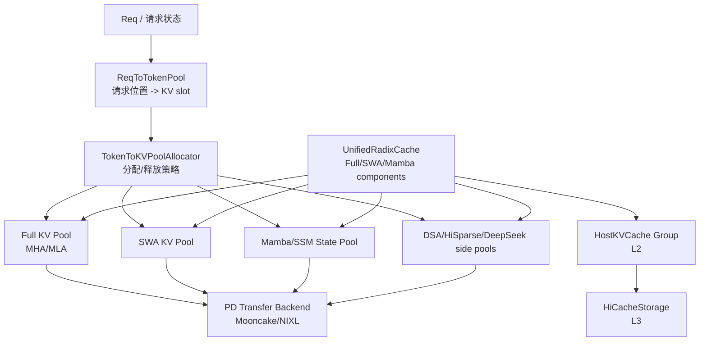
```mermaid
flowchart TB
    Req["Req / 请求状态"]
    ReqToToken["ReqToTokenPool<br/>请求位置 -> KV slot"]
    Alloc["TokenToKVPoolAllocator<br/>分配/释放策略"]
    FullKV["Full KV Pool<br/>MHA/MLA"]
    SWAKV["SWA KV Pool"]
    Mamba["Mamba/SSM State Pool"]
    DSA["DSA/HiSparse/DeepSeek side pools"]
    Tree["UnifiedRadixCache<br/>Full/SWA/Mamba components"]
    Host["HostKVCache Group<br/>L2"]
    Storage["HiCacheStorage<br/>L3"]
    PD["PD Transfer Backend<br/>Mooncake/NIXL"]

    Req --> ReqToToken
    ReqToToken --> Alloc
    Alloc --> FullKV
    Alloc --> SWAKV
    Alloc --> Mamba
    Alloc --> DSA
    Tree --> FullKV
    Tree --> SWAKV
    Tree --> Mamba
    Tree --> DSA
    Tree --> Host
    Host --> Storage
    FullKV --> PD
    SWAKV --> PD
    Mamba --> PD
    DSA --> PD
```

共存的核心机制：

- `ReqToTokenPool` 保存请求维度的 token->slot 映射。
- `TokenToKVPoolAllocator` 隐藏底层 pool 类型差异，提供 `alloc/alloc_extend/free/available_size`。
- `UnifiedRadixCache` 用 component 模型表达 Full、SWA、Mamba 等不同缓存成分。
- `PoolTransfer` 和 `PoolName` 让 L3 storage v2 接口知道一次页面操作还需要哪些 sidecar pool。
- PD transfer 的 `StateType` 让 prefill/decode 传输额外 state：`MAMBA`、`SWA`、`DSA`、`SWA_RING`。
- Draft KV 通过 `HiCacheController.set_draft_kv_pool()` 注册，尽量随 target KV 一起 L2/L3 传输。

### 7.3 不同 KV cache 对硬件资源的诉求

| KV/cache 类型 | 主要资源诉求 | 受限资源 | 关注指标 |
|---|---|---|---|
| Full attention KV | GPU HBM 容量、HBM 带宽、GPU kernel 写入吞吐 | HBM 容量、page fragmentation、allocator 可用页 | decode 吞吐、TTFT、ITL、cache hit rate、OOM/retraction |
| Prefix radix cache L1 | GPU HBM 容量、LRU 管理开销 | evictable/protected token 比例、lock_ref、page_size | prefix hit tokens、GPU hit rate、eviction 成功率 |
| HiCache L2 host | CPU DRAM/pinned memory、PCIe/NVLink/CXL 带宽、CPU NUMA | host memory 容量、D2H/H2D 带宽、注册内存限制 | host hit tokens、load_back latency、D2H/H2D GB/s |
| HiCache L3 storage | RDMA/网络、NVMe/SSD、对象存储、metadata service | 网络带宽/延迟、SSD IOPS、RDMA registered memory、metadata QPS | storage hit tokens、prefetch success、prefetch latency、backend bandwidth |
| Mooncake L3 | RDMA NIC、Mooncake global segment、master/metadata、可选 SSD | RDMA memory registration、global segment size、master 可用性、SSD spill 速度 | batch_get/set latency、offload hit rate、RDMA GB/s、allocation failure |
| NIXL L3 | NIXL plugin、file/object backend、GDS/DirectIO、page-aligned DRAM | 文件系统/对象存储延迟、O_DIRECT alignment、plugin 能力 | READ/WRITE xfer latency、GDS throughput、fallback copy ratio |
| SWA KV | GPU HBM 的窗口容量、SWA allocator | sliding window size、tail allocation 精度 | 窗口内命中率、SWA pool 可用页、decode 稳态吞吐 |
| Mamba/SSM state | request-level state slot、checkpoint pool、可能 int8 压缩 | slot 数、state tensor 大小、copy-on-write 成本 | state hit rate、slot pressure、state load/store latency |
| DSA/HiSparse | 压缩 C4/C128/indexer pools、特殊 kernel/host direct path | 压缩 pool 容量、indexer pool、kernel 支持 | 稀疏命中、压缩比、transfer bytes reduction |
| Draft/speculative KV | target+draft 双 pool，额外 HBM/host/storage | draft pool 容量、L3 backend 是否支持 draft v2 | acceptance rate、draft KV overhead、spec speedup |
| PD transfer KV | RDMA/NVLink/TCP/NIXL/Mooncake transfer、staging buffer | 网络带宽、session 数、staging buffer 大小、TP 异构切片开销 | prefill->decode transfer latency、GB/s、TTFT、transfer failure rate |

### 7.4 业务指标与底层约束的关系

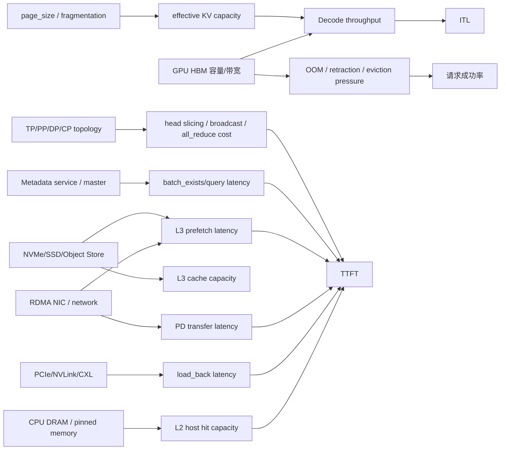
```mermaid
flowchart LR
    HBM["GPU HBM 容量/带宽"] --> Throughput["Decode throughput"]
    HBM --> OOM["OOM / retraction / eviction pressure"]
    HostMem["CPU DRAM / pinned memory"] --> HostHit["L2 host hit capacity"]
    PCIe["PCIe/NVLink/CXL"] --> LoadLatency["load_back latency"]
    RDMA["RDMA NIC / network"] --> TransferLatency["PD transfer latency"]
    RDMA --> L3Latency["L3 prefetch latency"]
    SSD["NVMe/SSD/Object Store"] --> L3Capacity["L3 cache capacity"]
    SSD --> L3Latency
    Metadata["Metadata service / master"] --> HitQuery["batch_exists/query latency"]
    PageSize["page_size / fragmentation"] --> EffectiveCap["effective KV capacity"]
    TP["TP/PP/DP/CP topology"] --> SliceCost["head slicing / broadcast / all_reduce cost"]

    HostHit --> TTFT["TTFT"]
    LoadLatency --> TTFT
    TransferLatency --> TTFT
    L3Latency --> TTFT
    Throughput --> ITL["ITL"]
    OOM --> Reliability["请求成功率"]
    HitQuery --> TTFT
    SliceCost --> TTFT
    EffectiveCap --> Throughput
```

## 8. HBM、DDR、SSD、远端存储之间的流动管理

SGLang 对 KV cache 的跨介质流动采用分层缓存管理模型。可以把在线推理中的 KV cache 介质分成四级：

| 层级 | 介质 | SGLang 抽象 | 典型后端 | 主要作用 |
|---|---|---|---|---|
| L1 | GPU HBM | device KV pool，例如 `MHATokenToKVPool`、`MLATokenToKVPool`、`DeepSeekV4TokenToKVPool` | CUDA/NPU/XPU device memory | 当前 batch forward/decode 必须访问的 KV |
| L2 | 本地 HOST DDR | `HostKVCache` / host KV pool | CPU DRAM、pinned memory、Mooncake host allocator | HBM 扩容、保存可复用 prefix 的 host 副本 |
| L3-local | 本地 SSD / 本地文件系统 | `HiCacheStorage` backend | `file`、NIXL FILE/POSIX/GDS/GDS_MT、Mooncake SSD offload | 进一步扩大容量，降低 DDR 常驻压力 |
| L3-remote | 远端存储节点 / 分布式 KV store / 对象存储 | `HiCacheStorage` backend 或第三方 store client | Mooncake master/store、NIXL OBJ/3FS、HF3FS、AIBrix、EIC、SiMM | 跨实例/跨节点共享或远端持久化 KV page |

### 8.1 控制面与数据面分离

SGLang 的设计重点是把“是否应该搬”和“怎么搬”分开：

- **控制面**：Radix cache 管理 prefix key、节点状态、命中层级、锁、LRU、eviction、load-back eligibility。代表对象是 `HiRadixCache` / `UnifiedRadixCache`。
- **本地数据面**：`HiCacheController` 负责 HBM <-> DDR 的异步复制，维护 `write_queue`、`load_queue`、ack queue、CUDA/device stream 与 layer event。
- **远端/SSD 数据面**：`HiCacheStorage` 后端负责 DDR <-> SSD/远端存储的 page 读写。Mooncake/NIXL/HF3FS/AIBrix/EIC 等都被包装成统一接口。
- **跨节点传输面**：PD disaggregation 使用 `KVManager/KVSender/KVReceiver`，负责 Prefill 节点和 Decode 节点之间的 KV 迁移，不等同于 HiCache L3 存储。

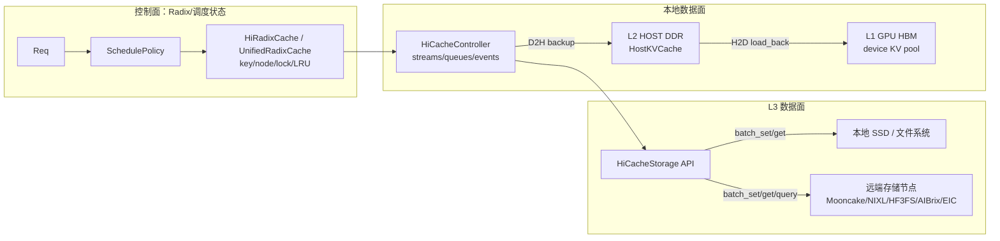
```mermaid
flowchart LR
    subgraph Control["控制面：Radix/调度状态"]
        Req["Req"]
        Tree["HiRadixCache / UnifiedRadixCache<br/>key/node/lock/LRU"]
        Policy["SchedulePolicy"]
    end

    subgraph LocalData["本地数据面"]
        HBM["L1 GPU HBM<br/>device KV pool"]
        DDR["L2 HOST DDR<br/>HostKVCache"]
        Ctrl["HiCacheController<br/>streams/queues/events"]
    end

    subgraph StorageData["L3 数据面"]
        SSD["本地 SSD / 文件系统"]
        Remote["远端存储节点<br/>Mooncake/NIXL/HF3FS/AIBrix/EIC"]
        API["HiCacheStorage API"]
    end

    Req --> Policy --> Tree
    Tree --> Ctrl
    Ctrl -- "D2H backup" --> DDR
    DDR -- "H2D load_back" --> HBM
    Ctrl --> API
    API -- "batch_set/get" --> SSD
    API -- "batch_set/get/query" --> Remote
```

### 8.2 HBM -> HOST DDR：备份与降级

HBM 到 DDR 的流动有两种语义：

1. **备份 backup**：HBM 中仍保留 KV，同时复制一份到 DDR。节点会记录 `host_value` 并在写完成 ack 后标记为 host 可用。
2. **降级 demotion / eviction**：在已有 DDR 副本后释放 HBM KV slot，只保留 radix 节点和 host 副本。后续请求命中该 prefix 时可从 DDR load back。

主要流程：

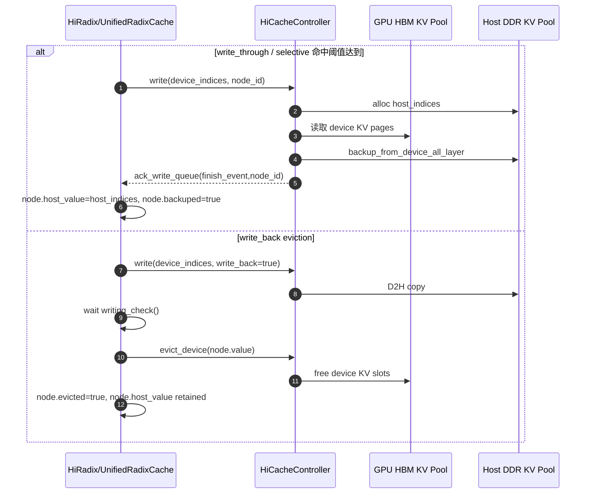
```mermaid
sequenceDiagram
    autonumber
    participant T as HiRadix/UnifiedRadixCache
    participant HC as HiCacheController
    participant HBM as GPU HBM KV Pool
    participant DDR as Host DDR KV Pool

    alt write_through / selective 命中阈值达到
        T->>HC: write(device_indices, node_id)
        HC->>DDR: alloc host_indices
        HC->>HBM: 读取 device KV pages
        HC->>DDR: backup_from_device_all_layer
        HC-->>T: ack_write_queue(finish_event,node_id)
        T->>T: node.host_value=host_indices, node.backuped=true
    else write_back eviction
        T->>HC: write(device_indices, write_back=true)
        HC->>DDR: D2H copy
        T->>T: wait writing_check()
        T->>HC: evict_device(node.value)
        HC->>HBM: free device KV slots
        T->>T: node.evicted=true, node.host_value retained
    end
```

实现细节：

- `HiCacheController.write()` 先在 host pool 分配 `host_indices`，再把操作放入 `write_queue`。
- `start_writing()` 会合并多个 `CacheOperation`，在独立 `write_stream` 中调用 `mem_pool_host.backup_from_device_all_layer()`。
- 写完成不立即同步阻塞主调度循环，而是通过 `ack_write_queue` 和 `finish_event` 延后确认。
- Radix cache 在 `writing_check()` 中统一消费 ack，更新节点状态，并在 L3 启用时触发 `write_backup_storage()`。

### 8.3 HOST DDR -> HBM：加载与恢复

DDR 到 HBM 的流动发生在 prefix 命中 host 层时。它不是按请求文本重新 prefill，而是把 host 上的 KV page 重新恢复到 GPU KV pool。

主要流程：

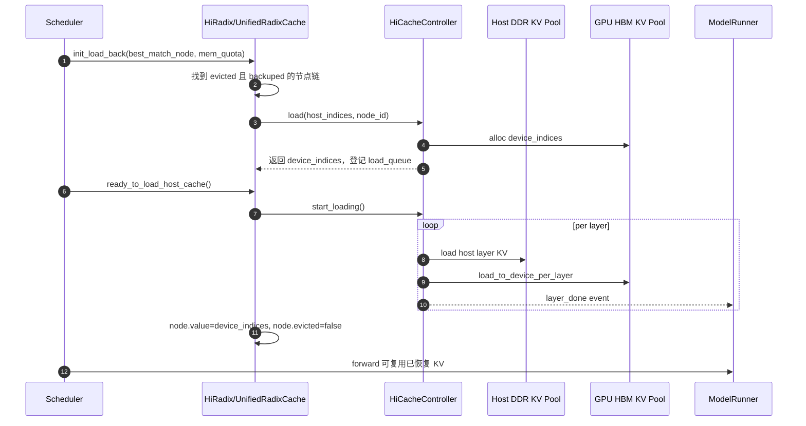
```mermaid
sequenceDiagram
    autonumber
    participant S as Scheduler
    participant T as HiRadix/UnifiedRadixCache
    participant HC as HiCacheController
    participant DDR as Host DDR KV Pool
    participant HBM as GPU HBM KV Pool
    participant R as ModelRunner

    S->>T: init_load_back(best_match_node, mem_quota)
    T->>T: 找到 evicted 且 backuped 的节点链
    T->>HC: load(host_indices, node_id)
    HC->>HBM: alloc device_indices
    HC-->>T: 返回 device_indices，登记 load_queue
    S->>T: ready_to_load_host_cache()
    T->>HC: start_loading()
    loop per layer
        HC->>DDR: load host layer KV
        HC->>HBM: load_to_device_per_layer
        HC-->>R: layer_done event
    end
    T->>T: node.value=device_indices, node.evicted=false
    S->>R: forward 可复用已恢复 KV
```

实现细节：

- `load_back_threshold` 用于过滤太小的 load back，避免为了少量 token 产生过多 H2D 开销。
- `mem_quota` 防止为恢复 host prefix 挤占当前请求或运行中 batch 必须使用的 HBM。
- 若 GPU 空间不足，`load_back()` 会先尝试 `evict()` 释放 evictable cache，再重新分配。
- `LayerDoneCounter` 使 load-back 可以和 forward 以 layer 粒度协作，减少一次性同步等待。

### 8.4 HOST DDR -> 本地 SSD / 远端存储：L3 写入

当 L3 storage backend 启用后，SGLang 会在 L1 -> L2 写完成后，把 host KV page 继续写入 L3。L3 的 key 通常由 page-aligned token hash 生成，并可能带模型名、TP rank、PP rank、pool name 等后缀，避免不同 rank 或不同 sidecar pool 冲突。

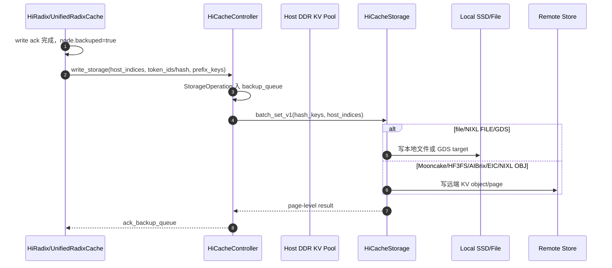
```mermaid
sequenceDiagram
    autonumber
    participant T as HiRadix/UnifiedRadixCache
    participant HC as HiCacheController
    participant DDR as Host DDR KV Pool
    participant API as HiCacheStorage
    participant SSD as Local SSD/File
    participant RS as Remote Store

    T->>T: write ack 完成，node.backuped=true
    T->>HC: write_storage(host_indices, token_ids/hash, prefix_keys)
    HC->>HC: StorageOperation 入 backup_queue
    HC->>API: batch_set_v1(hash_keys, host_indices)
    alt file/NIXL FILE/GDS
        API->>SSD: 写本地文件或 GDS target
    else Mooncake/HF3FS/AIBrix/EIC/NIXL OBJ
        API->>RS: 写远端 KV object/page
    end
    API-->>HC: page-level result
    HC-->>T: ack_backup_queue
```

不同后端的数据面差异：

- `file`：host page 序列化到本地文件，由本地文件 LRU 控制容量。
- `mooncake`：host buffer 注册给 Mooncake，`batch_put_from` 以 zero-copy/RDMA 方式写入 distributed store；开启 SSD offload 时，由 Mooncake 把 DRAM 溢出 spill 到本地 SSD。
- `nixl`：NIXL agent 将 host DRAM region 与 FILE/OBJ/GDS/3FS backend 建立 READ/WRITE transfer，zero-copy 取决于 host layout 与 alignment。
- `hf3fs`：通过 3FS/HF3FS 文件与元数据服务组织 page 存储。
- `aibrix/eic/simm`：作为外部 KVCache 服务或存储系统接入 `HiCacheStorage` 接口。

### 8.5 本地 SSD / 远端存储 -> HOST DDR：L3 预取

L3 不直接进入 GPU HBM。SGLang 的标准路径是先从 L3 预取到 HOST DDR，再通过 L2 -> L1 load back 恢复到 HBM。

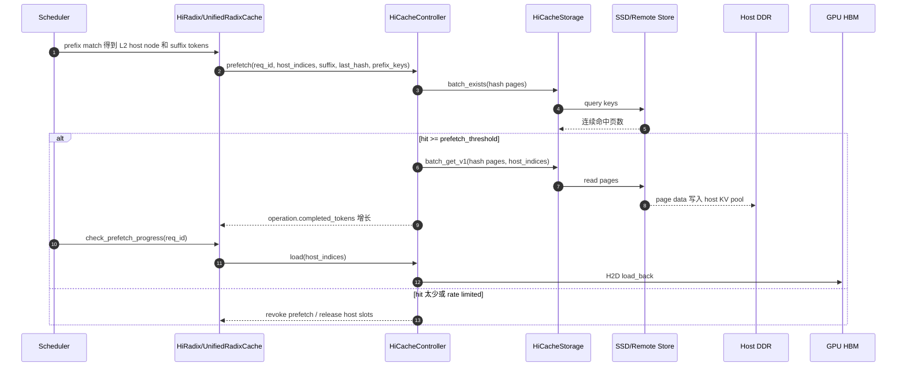
```mermaid
sequenceDiagram
    autonumber
    participant S as Scheduler
    participant T as HiRadix/UnifiedRadixCache
    participant HC as HiCacheController
    participant API as HiCacheStorage
    participant L3 as SSD/Remote Store
    participant DDR as Host DDR
    participant HBM as GPU HBM

    S->>T: prefix match 得到 L2 host node 和 suffix tokens
    T->>HC: prefetch(req_id, host_indices, suffix, last_hash, prefix_keys)
    HC->>API: batch_exists(hash pages)
    API->>L3: query keys
    L3-->>API: 连续命中页数
    alt hit >= prefetch_threshold
        HC->>API: batch_get_v1(hash pages, host_indices)
        API->>L3: read pages
        L3-->>DDR: page data 写入 host KV pool
        HC-->>T: operation.completed_tokens 增长
        S->>T: check_prefetch_progress(req_id)
        T->>HC: load(host_indices)
        HC->>HBM: H2D load_back
    else hit 太少或 rate limited
        HC-->>T: revoke prefetch / release host slots
    end
```

关键管理策略：

- `prefetch_rate_limited()` 根据 `prefetch_tokens_occupied` 限制 L3 预取占用，避免 L3 把 DDR 填满。
- `_storage_hit_query()` 按 page 批量计算 hash 并查询，遇到第一个 miss 就停止，确保只加载连续 prefix。
- 预取低于 `prefetch_threshold` 会撤销，避免远端 I/O 反而拖慢 TTFT。
- 对 TP/CP 分组，预取命中数会做 group reduce，使各 rank 对可用 prefix 长度达成一致。

### 8.6 本地 SSD 与远端存储的关系

SGLang 本身不强制区分“本地 SSD”和“远端存储节点”，而是通过 backend 实现决定实际落点：

| 配置形态 | 数据落点 | SGLang 视角 |
|---|---|---|
| `--hicache-storage-backend file` | 本地磁盘文件 | L3 backend，普通 batch_set/get |
| `--hicache-storage-backend nixl` + FILE/POSIX/GDS | 本地或挂载文件系统，可能走 GDS | L3 backend，NIXL READ/WRITE |
| `--hicache-storage-backend nixl` + OBJ/3FS | 对象存储或远端文件系统 | L3 backend，NIXL plugin 负责远端访问 |
| `--hicache-storage-backend mooncake` | Mooncake distributed store，可能 DRAM + SSD spill | L3 backend，Mooncake 管 master/metadata/segment/offload |
| Mooncake `enable_ssd_offload=true` | Mooncake 节点本地 SSD | SGLang 只传 setup 参数，spill 策略由 Mooncake 执行 |
| `hf3fs/aibrix/eic/simm` | 第三方存储服务或分布式文件系统 | SGLang 只依赖 `HiCacheStorage` 接口 |

也就是说，SGLang 负责：

- 生成 page key。
- 维护 page 是否在 L1/L2/L3 可用。
- 决定何时写、何时查、何时预取。
- 分配 host/GPU slots。

第三方后端负责：

- page key 到实际文件/object/segment 的映射。
- RDMA/GDS/TCP/Object API 等传输细节。
- 远端元数据、一致性、容量管理、SSD spill、backend 内部 eviction。

### 8.7 跨介质流动总览

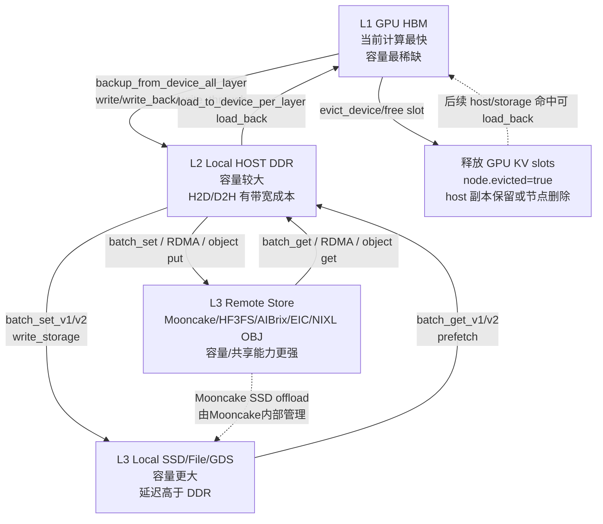
```mermaid
flowchart TB
    HBM["L1 GPU HBM<br/>当前计算最快<br/>容量最稀缺"]
    DDR["L2 Local HOST DDR<br/>容量较大<br/>H2D/D2H 有带宽成本"]
    SSD["L3 Local SSD/File/GDS<br/>容量更大<br/>延迟高于 DDR"]
    Remote["L3 Remote Store<br/>Mooncake/HF3FS/AIBrix/EIC/NIXL OBJ<br/>容量/共享能力更强"]
    Free["释放 GPU KV slots<br/>node.evicted=true<br/>host 副本保留或节点删除"]

    HBM -- "backup_from_device_all_layer<br/>write/write_back/write_through" --> DDR
    DDR -- "load_to_device_per_layer<br/>load_back" --> HBM
    HBM -- "evict_device/free slot" --> Free
    Free -. "后续 host/storage 命中可 load_back" .-> HBM
    DDR -- "batch_set_v1/v2<br/>write_storage" --> SSD
    SSD -- "batch_get_v1/v2<br/>prefetch" --> DDR
    DDR -- "batch_set / RDMA / object put" --> Remote
    Remote -- "batch_get / RDMA / object get" --> DDR
    Remote -. "Mooncake SSD offload<br/>由Mooncake内部管理" .-> SSD
```

这套流动机制最终服务于三个目标：

- **保 HBM**：把非当前计算必须的 KV 从 HBM 降到 DDR/L3，减少 OOM、提高并发。
- **保 TTFT**：对可复用 prefix 先查 L1/L2/L3，避免重复 prefill。
- **保吞吐**：通过阈值、异步 stream、后台线程、prefetch rate limit、page batching 减少搬运对 decode 主路径的干扰。

## 9. 总体结论

SGLang 中 KV cache 的“卸载/加载”不是单一流程，而是三套机制叠加：

1. **HiCache 分层缓存**：L1 GPU、L2 host、L3 storage。它解决在线推理中 prefix reuse 与 GPU HBM 容量之间的矛盾，重点关注 cache hit、load back latency、storage prefetch 成功率和 GPU 内存压力。
2. **PD disaggregation KV transfer**：prefill 节点和 decode 节点分离时，把 prefill 产生的 KV 传给 decode。它解决 prefill/decode 资源解耦问题，重点关注 TTFT、跨节点带宽、transfer failure、staging/slicing 开销。
3. **多类型 KV/state 共存**：Full KV、SWA、Mamba、DSA/HiSparse、Draft KV、LMCache 等通过 allocator、radix component、state transfer、PoolTransfer 组合到统一调度路径中。它解决不同模型架构和推理优化策略的兼容问题，主要受 GPU HBM、host memory、RDMA/NVMe、page size、rank topology 限制。

从设计上看，SGLang 把“状态索引”和“数据搬运”做了分离：

- Radix cache 管节点、锁、LRU、命中层级、业务语义。
- `HiCacheController` 管异步搬运、stream、event、host/storage 队列。
- `HiCacheStorage` 管第三方 L3 读写接口。
- disaggregation 的 `KVManager/KVSender/KVReceiver` 管跨节点 session、metadata、transfer backend。

这种分层让 Mooncake、NIXL、HF3FS、AIBrix 等后端可以以相对清晰的接口接入，同时也使在线推理场景下 GPU cache、host cache、storage cache、跨节点 transfer cache 能够共存。
