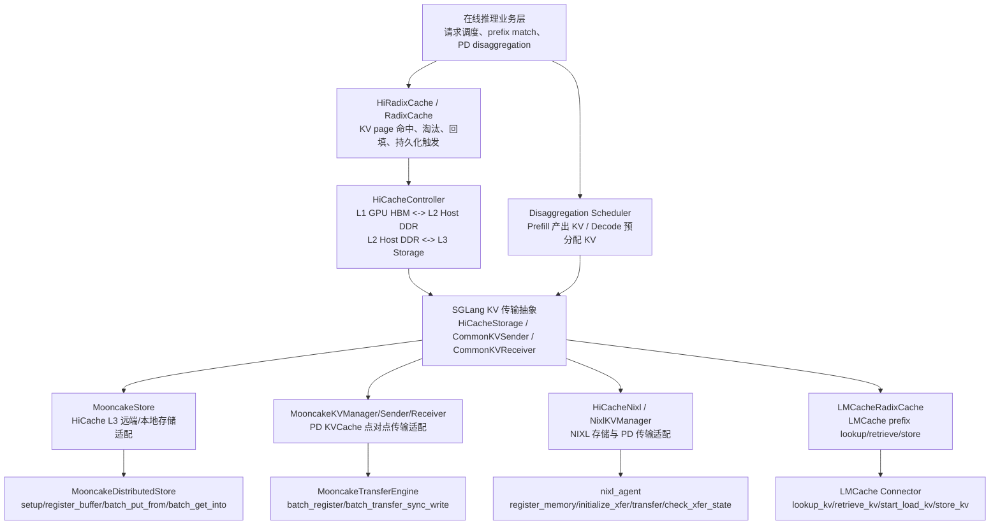
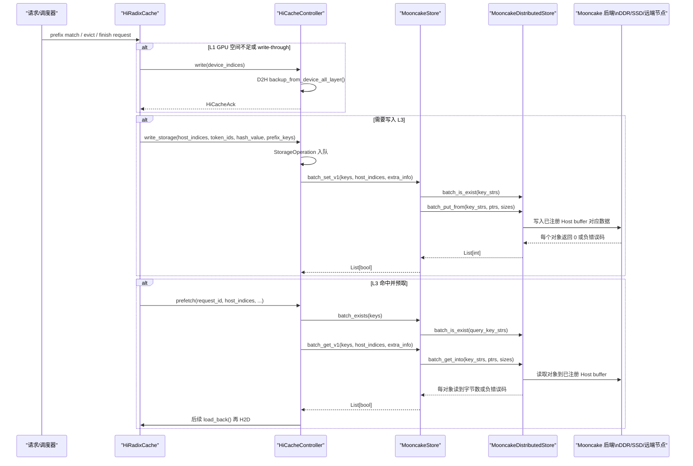
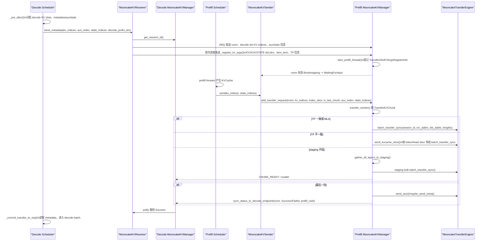

# SGLang KVCache 第三方传输库接口与参数表

本文从自顶向下的软件分层视角，梳理 SGLang 在 KVCache 卸载、加载、远端存储、Prefill/Decode 分离传输中调用 Mooncake 等第三方传输库的实际接口。重点展开 Mooncake 从 SGLang 适配层到最终数据传输原语的路径，并补充 NIXL、LMCache 的同类接口对照。

相关源码入口：

- `python/sglang/srt/mem_cache/hiradix_cache.py`
- `python/sglang/srt/managers/cache_controller.py`
- `python/sglang/srt/mem_cache/storage/mooncake_store/mooncake_store.py`
- `python/sglang/srt/disaggregation/mooncake/conn.py`
- `python/sglang/srt/distributed/device_communicators/mooncake_transfer_engine.py`
- `python/sglang/srt/mem_cache/storage/nixl/hicache_nixl.py`
- `python/sglang/srt/mem_cache/storage/lmcache/lmc_radix_cache.py`

## 1. 分层总览



KVCache 传输在 SGLang 中主要分为三条链路：

1. `GPU HBM <-> Host DDR`：HiCache 的 L1/L2 流动，主要由 SGLang 自己的 `HostKVCache` 和 CUDA stream 完成，不直接调用 Mooncake。
2. `Host DDR <-> L3 Storage`：HiCache L3 后端，Mooncake/NIXL/HF3FS/EIC/SIMM 等实现 `HiCacheStorage` 接口。Mooncake 通过 `MooncakeDistributedStore` 做零拷贝 put/get。
3. `Prefill GPU KV -> Decode GPU KV`：PD 分离传输，Mooncake/NIXL 作为网络传输引擎，SGLang 负责预分配、地址交换、分块、状态机和完成确认。

## 2. Mooncake HiCache L3 存储链路

### 2.1 业务触发链路



### 2.2 SGLang 到 MooncakeStore 的接口表

| 层级 | 接口 | 关键参数 | 返回值 | 调用语义 | 业务约束 |
|---|---|---|---|---|---|
| Radix cache | `HiRadixCache.write_backup_storage(node, backup_len=None)` | `node`: radix 节点；`backup_len`: 可选备份长度 | 无直接返回，触发后台 L3 写 | 异步入队 | 只能在 Host DDR 已有备份页后写 L3；需要维护 `prefix_keys` 和节点 backup 状态 |
| Controller | `HiCacheController.write_storage(host_indices, token_ids, hash_value=None, prefix_keys=None, ...)` | `host_indices`: L2 页索引；`token_ids`: page key 来源；`hash_value`: 可复用 hash key；`prefix_keys`: 前缀上下文 | 写入页数或排队结果 | 异步队列，后台 storage worker 执行 | 写 L3 不阻塞当前 token 计算，但影响后续跨请求/跨实例复用率 |
| Controller | `_page_backup(operation)` | `StorageOperation`，含 host pages、hashes、extra pools | 后台统计成功页 | 同步调用 backend 的 batch set，外层是后台线程 | `STORAGE_BATCH_SIZE` 控制批大小；小批量增加元数据和 RPC 开销，大批量增加尾延迟 |
| Storage 抽象 | `MooncakeStore.batch_set_v1(keys, host_indices, extra_info=None)` | `keys: List[str]`；`host_indices: torch.Tensor`；`extra_info` | `List[bool]`，按逻辑 page 聚合 | 同步调用 Mooncake put，外层由 SGLang 后台线程异步化 | MHA 每页拆为 K/V 两个对象，MLA 一页一个对象；已存在 key 跳过 put |
| Storage 抽象 | `MooncakeStore.batch_get_v1(keys, host_indices, extra_info=None)` | 同上 | `List[bool]` | 同步读取到 Host KV buffer | 是请求 TTFT 关键路径的一部分：prefetch 越慢，越可能退化为重新 prefill |
| Storage 抽象 | `MooncakeStore.batch_exists(keys, extra_info=None)` | `keys: List[str]` | 连续命中 page 数 `int` | 同步元数据查询 | prefix 命中长度取决于连续命中；任一 K/V 对象 miss 即截断 |
| Hybrid v2 | `MooncakeStore.batch_set_v2(transfers, extra_info=None)` | `transfers: List[PoolTransfer]`，携带 pool name、keys、host_indices | `dict[PoolName, List[bool]]` | 同步批量 set | 用于 draft、hybrid/side pools；不同 pool 可产生多个物理对象 |
| Hybrid v2 | `MooncakeStore.batch_get_v2(transfers, extra_info=None)` | 同上 | `dict[PoolName, List[bool]]` | 同步批量 get | 需要 pool 已通过 `register_mem_host_pool_v2()` 注册 |

### 2.3 MooncakeStore 到 Mooncake 原生接口表

| Mooncake 原语 | SGLang 调用位置 | 参数 | 返回值 | 约束与性能含义 |
|---|---|---|---|---|
| `MooncakeDistributedStore()` | `MooncakeStore.__init__` | 无 | store 对象 | Python 绑定对象，后续所有 L3 I/O 从此进入 Mooncake |
| `setup(client_hostname, metadata_server, global_segment_size, local_buffer_size, protocol, device_name, master_server_address, transfer_engine, **setup_kwargs)` | `MooncakeStore.__init__` | `metadata_server` 可为 `P2PHANDSHAKE`；`global_segment_size` 为每 TP 份额；`protocol` 如 `rdma`；`device_name` 选择 IB/EFA/NPU 设备；`transfer_engine` 可复用已初始化 engine；`enable_ssd_offload`、`ssd_offload_path` 可选 | `0` 成功，非 0 失败 | 初始化路径直接决定后续数据平面：RDMA/EFA/TCP、是否 SSD offload、远端 metadata/master 服务可用性 |
| `setup_dummy(required_bytes, local_buffer_size, client_server_address)` | `standalone_storage=True` | 本地 standalone storage 所需容量、local buffer、client server 地址 | `0` 成功 | 要求 `MooncakeHostTensorAllocator`；适合独立存储服务模式 |
| `register_buffer(ptr, size)` | `MooncakeBaseStore.register_buffer()`、`register_mem_pool_host()`、`register_mem_host_pool_v2()` | 已分配 Host KV tensor 的起始地址和字节数 | Mooncake 注册结果 | 零拷贝前提；注册失败会导致 put/get 无法直接访问 Host DDR；注册容量受 RNIC/IOMMU/驱动限制 |
| `put(key, value)` | `warmup()` | 小 key 和 4KB bytes | `0` 成功 | 仅 warmup，验证 engine/store 可用性 |
| `is_exist(key)` | `warmup()` | key | `1` 存在 | 仅 warmup |
| `get(key)` | `warmup()` | key | bytes | 仅 warmup |
| `batch_is_exist(key_strs)` | `_batch_exist()` | `List[str]`，SGLang 已拼接 rank/PP/KV 后缀 | `List[int]`，`1` 表示存在 | 元数据路径；高 QPS prefix 查询会压测 metadata server 或索引服务 |
| `batch_put_from(key_strs, buffer_ptrs, buffer_sizes)` | `_put_batch_zero_copy_impl()` | 每个对象的 key、源 Host 地址、字节数 | `List[int]`，每项 `0` 成功，负值失败 | 零拷贝写入 L3；对 Host DDR 读带宽、RDMA/SSD 写带宽敏感 |
| `batch_get_into(key_strs, buffer_ptrs, buffer_sizes)` | `_get_batch_zero_copy_impl()` | 每个对象的 key、目标 Host 地址、字节数 | `List[int]`，每项为读到字节数，负值失败 | 零拷贝读取到 Host DDR；TTFT 关键路径上更敏感 |
| `batch_put_from_multi_buffers(key_strs, buffer_ptrs, buffer_sizes)` | v2/hybrid multi-buffer | `buffer_ptrs[i]` 可为多个地址片段 | `List[int]` | 用于 DeepSeek V4 C4 等多 buffer 物理布局；减少 SGLang 手工打包 |
| `batch_get_into_multi_buffers(key_strs, buffer_ptrs, buffer_sizes)` | v2/hybrid multi-buffer | 同上 | `List[int]` | 对后端 scatter/gather 能力有要求 |
| `remove_all()` | `MooncakeStore.clear()` | 无 | 无 | 清理存储后端；通常用于测试或生命周期管理 |

### 2.4 Mooncake L3 存储的同步/异步语义

Mooncake 的 `batch_put_from`、`batch_get_into`、`batch_is_exist` 在 SGLang 适配层被当作同步函数使用：调用返回时，SGLang 才根据返回码更新 page 成功/失败状态。SGLang 通过 `HiCacheController` 的 storage 队列和后台线程把这些同步调用从主推理计算路径剥离出来。

这意味着性能瓶颈通常不在 Python 是否异步，而在更底层：

- `batch_exists` 的 metadata 延迟决定能否快速确认 L3 prefix 命中长度。
- `batch_get_into` 的完成时间直接影响 TTFT，因为 Host DDR 中没有数据就无法继续 H2D load_back。
- `batch_put_from` 对当前请求较不敏感，但影响后续命中率；若后台写带宽不足，会导致 L3 备份滞后，进而降低缓存复用。
- 大量 registered buffer 会消耗 RNIC memory registration、IOMMU 映射、Mooncake segment 元数据资源。
- `enable_ssd_offload` 把容量压力下沉到本地 SSD，但同时引入 NVMe 随机读写和文件系统路径瓶颈。

## 3. Mooncake PD Prefill/Decode 传输链路

### 3.1 业务时序



### 3.2 SGLang PD 传输接口表

| 层级 | 接口 | 参数 | 返回值 | 同步/异步语义 | 业务约束 |
|---|---|---|---|---|---|
| Prefill scheduler | `send_kv_chunk(req, last_chunk=False, end_idx=None)` | `req`: 请求对象；`last_chunk`: 是否最后一块；`end_idx`: chunk 截断位置 | 无 | 主线程发起，实际传输入队 | 需要根据 page size、chunked prefill、state backend 计算 `page_indices` 和 `state_indices` |
| Sender 抽象 | `MooncakeKVSender.send(kv_indices, state_indices=None)` | `kv_indices: np.ndarray[int32]`；`state_indices` 可选 | 无 | 入队后返回 | 非最后 chunk 不带 aux；最后 chunk 必须带 `aux_index`，用于 output token/logprob/bootstrap room 等元数据 |
| Manager | `MooncakeKVManager.add_transfer_request(bootstrap_room, kv_indices, index_slice, is_last_chunk, aux_index=None, state_indices=None, trace_ctx=None)` | room、prefill KV 页索引、映射 slice、是否最后块、aux/state | 无 | 放入 shard 后的 `FastQueue` | room 必须未失败且 decode metadata 已到达；按目标 session port sum 分片以便相同目标落同队列 |
| Worker | `transfer_worker(queue, executor, staging_buffer=None, worker_index=0)` | transfer queue、线程池、可选 staging buffer | 常驻线程 | 后台线程同步驱动 Mooncake engine | 一旦某 session transfer 返回非 0，标记 room failed 并同步给 decode |
| Manager | `send_kvcache(session_id, prefill_kv_indices, dst_kv_ptrs, dst_kv_indices, executor)` | Mooncake session、源页、目标 KV 指针列表、目标页、线程池 | `0` 成功，非 0 失败 | 内部同步调用 engine；可按 layer 并发 | TP 一致或 MLA 快路径；会把连续 page 合并为更大 transfer block |
| Manager | `_send_kvcache_generic(session_id, src_data_ptrs, dst_data_ptrs, item_lens, prefill_data_indices, dst_data_indices, executor)` | 源/目标 base ptrs，每层 item_len，页索引映射 | `int` | 默认合并所有层一次 batch transfer；custom mem pool 时 per-layer future 并发 | MHA 拆 K/V，MLA 单 buffer；PP stage 只传当前 stage 的层 |
| Manager | `send_kvcache_slice(session_id, prefill_kv_indices, dst_kv_ptrs, dst_kv_indices, dst_tp_rank, dst_attn_tp_size, dst_kv_item_len, executor)` | 增加目标 TP rank/TP size/item_len | `int` | 多 layer future，每层调用 engine | TP 不一致时按 token/head slice 传输；正确性强，但小 transfer 数量多，TTFT 开销高 |
| Manager | `send_kvcache_staged(...)` / `_do_staging_transfer(...)` | staging buffer、room、chunk、目标 staging 指针和大小 | `int` 或 deferred | GPU gather + bulk RDMA + decode scatter | 用 staging 减少异构 TP slice 的小包数量；受 staging buffer 容量、水位和 scatter 延迟限制 |
| Manager | `send_aux(req, prefill_aux_index, dst_aux_ptrs)` | TransferInfo、prefill aux index、decode aux ptrs | `int` | 同步 RDMA；特定场景走 TCP | 最后一块才发送；aux 包含请求完成所需元数据，失败会导致 decode 不能提交 |
| Manager | `maybe_send_extra(req, state_indices, executor, target_rank_registration_info)` | state indices、目标 state ptr/item_len 等 | `int` | 同步/并发 transfer | Mamba/SWA/DSA 等非标准 attention state 需要额外传输 |
| Decode scheduler | `MooncakeKVReceiver.send_metadata(kv_indices, aux_index=None, state_indices=None, decode_prefix_len=None)` | decode 预分配的 KV 页、aux slot、state slots、prefix len | 无 | ZMQ 发送 metadata 后返回 | prefill 只有收到 metadata 才能知道目标地址；这是 transfer 的启动前置条件 |
| Receiver | `_register_kv_args()` | 无显式参数，打包本 rank KV/AUX/STATE ptrs、item lens、TP 信息、staging 信息 | 无 | ZMQ 发送注册消息 | 地址交换必须先于 RDMA；decode 侧 buffer 必须已注册到 Mooncake engine |
| Receiver/Sender | `poll()` | 无 | `KVPoll` | 轮询状态机 | Decode 只有 Success 后才能 commit；Failed 要抛 `KVTransferError` |

### 3.3 Mooncake Transfer Engine 原语表

| Mooncake engine 原语 | SGLang 调用位置 | 参数 | 返回值 | 约束与性能含义 |
|---|---|---|---|---|
| `engine.initialize(hostname, "P2PHANDSHAKE", protocol, device_name)` | `MooncakeTransferEngine.initialize()` | local session hostname、握手模式、协议、设备名 | `0` 成功 | 协议决定网络数据平面：RDMA/EFA/TCP/Ascend；设备名错误会直接影响带宽或初始化失败 |
| `engine.batch_register(ptrs, sizes)` | `MooncakeKVManager.register_buffer_to_engine()`、staging allocator | GPU KV ptrs、aux ptrs、state ptrs、staging ptrs 及字节数 | engine 返回码 | RDMA 访问远端地址的前提；注册成本高，适合长生命周期 buffer，不适合每请求注册 |
| `engine.batch_deregister(ptrs)` | `deregister_buffer_to_engine()` | 指针列表 | engine 返回码 | 重新初始化或生命周期结束时释放注册资源 |
| `engine.get_session_id()` | `MooncakeKVReceiver.__init__()`、store 复用 transfer engine | 无 | session id string | 作为远端 RDMA session 标识，通过 ZMQ 元数据发送给对端 |
| `engine.batch_transfer_sync_write(session_id, buffers, peer_buffer_addresses, lengths)` | `MooncakeTransferEngine.batch_transfer_sync()` | `session_id`: 目标 decode session；`buffers`: 源地址列表；`peer_buffer_addresses`: 目标地址列表；`lengths`: 每段字节数 | `0` 成功，负值失败 | 同步写远端；SGLang 通过 worker/thread pool 异步化；单次 batch 越大越能摊薄调用和网络 doorbell 开销 |
| `engine.transfer_sync_write(session_id, buffer, peer_buffer_address, length)` | wrapper `transfer_sync()` | 单段源地址、目标地址、长度 | `int` | 当前 KV 主链路使用 batch 版本；单段接口适合小控制数据但效率较低 |
| `engine.send_probe(peer_session_id)` | failed session probe | 远端 session id | `int` | 用于失败 session 恢复探测，不承载 KV 数据 |

## 4. Mooncake 数据传输实现细节

### 4.1 地址与长度如何生成

Mooncake 不理解 KVCache 的 tensor 语义。SGLang 在 `MooncakeKVManager` 中把逻辑页转换为三元组：

```text
(src_addr, dst_addr, length)
```

转换规则如下：

| 场景 | 地址计算 | 传输粒度 | 性能特征 |
|---|---|---|---|
| MLA / TP 一致 | `base_ptr + page_index * item_len` | 连续 page 合并后的 block，跨层 batch | 最优路径，batch 大、调用少 |
| MHA | K/V 分别按层计算 base ptr | K layers + V layers | 对象数量约为 MLA 的 2 倍，但可合并 batch |
| PP | 只取当前 PP stage 的层 ptr | 当前 stage layers | 降低每 rank 传输量，但增加跨 rank 协调 |
| TP 不一致 | page 内按 token/head slice 计算 offset | 每 token slot 的 head slice | 小段数量多，TTFT 容易上升 |
| staging | 先 gather all layers 到 staging buffer，再 bulk RDMA | 每 rank 一段大块 | 降低小包数，但引入 gather/scatter 和 staging 容量约束 |
| aux/state | 按 aux/state item_len 与 index 计算 | 小块 metadata/state | 对延迟敏感，失败会阻塞 decode commit |

### 4.2 完成条件

PD 传输不是 Mooncake 单独决定“请求完成”。SGLang 的完成条件是：

1. Decode 侧发送 metadata，Prefill 侧 `transfer_infos[room]` 收齐 `required_dst_info_num`。
2. Prefill 完成所有 KV chunk 的 `batch_transfer_sync`。
3. 最后一块完成 aux/state 传输。
4. Prefill 对每个目标 decode endpoint 发送 `Success` 或 `Failed`。
5. Decode 侧等待来自所有预期 prefill rank 的响应。
6. 若启用 staging，decode 侧还要等待最后 scatter 完成。
7. 若启用 decode HiCache local restore gate，`KVReceiver` 的 Success 还要等本地 H2D restore 完成后才真正对 scheduler 可见。

因此，Mooncake 的 `batch_transfer_sync_write()` 只是数据面完成；业务层完成还包含控制面、metadata、aux/state、staging scatter、HiCache restore 等门控。

## 5. NIXL 与 LMCache 对照接口

### 5.1 NIXL HiCache 存储接口

| 层级 | 接口 | 参数 | 语义 | 与 Mooncake 差异 |
|---|---|---|---|---|
| SGLang backend | `HiCacheNixl.batch_exists(keys, extra_info=None)` | keys | 调用 `agent.query_memory()` 查询对象存在性 | 返回连续命中页数；FILE/OBJ 后端 query tuple 不同 |
| SGLang backend | `HiCacheNixl.batch_get_v1(keys, host_indices, extra_info=None)` | keys、Host 页索引 | 构造 host/storage desc 后读入 Host buffer | 可 zero-copy，也可 bounce buffer；O_DIRECT 要求页对齐 |
| SGLang backend | `HiCacheNixl.batch_set_v1(keys, host_indices, extra_info=None)` | keys、Host 页索引 | 写入 NIXL storage | 非 zero-copy 模式先 copy 到 direction-specific bounce buffer |
| NIXL 原语 | `agent.get_reg_descs(..., "DRAM")` | Host 地址、长度 | 构造注册描述符 | 注册 Host DRAM region |
| NIXL 原语 | `agent.register_memory(reg_descs)` | reg descs | 注册内存，返回 handle | 长生命周期预注册，避免每次 I/O 注册 |
| NIXL 原语 | `agent.get_xfer_descs([(addr, size, 0), ...], "DRAM")` | Host buffer descs | 构造传输描述符 | 与 storage desc 配对 |
| NIXL 原语 | `agent.initialize_xfer(direction, host_descs, storage_descs, agent_name)` | `direction`: READ/WRITE；host/storage descs | xfer handle | 创建传输请求 |
| NIXL 原语 | `agent.transfer(xfer_handle)` | handle | 初始状态 | 非阻塞启动后轮询 |
| NIXL 原语 | `agent.check_xfer_state(xfer_handle)` | handle | `"DONE"`/`"ERR"` 等 | SGLang 目前 sleep 100us 轮询，缺少事件通知 |
| NIXL 原语 | `agent.release_xfer_handle(xfer_handle)` | handle | 释放请求 | 每次传输结束释放 |

### 5.2 NIXL PD 传输接口

NIXL PD 路径与 Mooncake 的 SGLang 抽象相同，仍是 `CommonKVSender/CommonKVReceiver/CommonKVManager`，但底层不是 `batch_transfer_sync_write()`，而是：

- `agent.initialize_xfer(...)` 创建 xfer。
- `agent.transfer(xfer_handle)` 发起。
- `agent.check_xfer_state(handle)` 在 worker 中轮询。
- `agent.release_xfer_handle(handle)` 清理。

与 Mooncake 的核心差异是：Mooncake 在 SGLang 调用点表现为同步 batch write；NIXL 更显式暴露了 xfer handle 和状态轮询，因此更适合未来做 completion queue、事件通知、分层调度，但当前实现仍存在轮询开销。

### 5.3 LMCache 接口

LMCache 不走 `HiCacheStorage.batch_get_v1/batch_set_v1` 这个 L3 后端接口，而是替换/扩展 radix cache 行为：

| 接口 | 参数 | 触发点 | 语义 | 性能约束 |
|---|---|---|---|---|
| `lmcache_connector.lookup_kv(token_ids, req.rid)` | token 序列、request id | `match_prefix()` | 查询 LMCache 中超过本地 radix 的命中长度 | 命中查询在调度关键路径；慢会增加 prefix match latency |
| `lmcache_connector.release_pending(req.rid)` | request id | lookup 未增益或失败 | 释放 pending read locks | 锁管理错误会影响后续 store/retrieve |
| `lmcache_connector.retrieve_kv(LoadMetadata(...))` | token_ids、slot_mapping、offset、prefix_pad、request_id | MP 模式 `init_load_back()` | 直接把 KV 取回到 GPU slot mapping | SGLang 在 load stream 上执行并等待，影响 TTFT |
| `lmcache_connector.start_load_kv(LoadMetadata(...))` | token_ids、slot_mapping、offset | IP 模式 `_ip_load_back()` | layerwise 异步加载首层，后续由 hook 驱动 | 对 layerwise overlap 能力敏感 |
| `lmcache_connector.store_kv(StoreMetadata(...))` | last_node、token_ids、kv_indices、offset、request_id | request finished | 把完成请求的 KV 写入 LMCache | MP 模式阻塞到 daemon signal；IP 模式在 store stream 异步 |
| `lmcache_connector.end_session(req.rid)` | request id | 请求结束 | 结束 LMCache session | session 生命周期影响资源释放 |

## 6. 接口业务约束归纳

| 约束类型 | Mooncake L3 Storage | Mooncake PD Transfer | NIXL | LMCache |
|---|---|---|---|---|
| 同步/异步 | Mooncake 原语同步；SGLang 后台线程异步化 | `batch_transfer_sync` 同步；SGLang worker/thread pool 异步化 | xfer handle 异步启动，SGLang 轮询等待 | MP retrieve/store 偏同步；IP layerwise 异步 |
| 完成时间敏感性 | `batch_get_into` 高，`batch_put_from` 中等 | 极高，直接影响 decode 启动和 TTFT | 高，轮询间隔影响尾延迟 | lookup/retrieve 高，store 中等 |
| 带宽诉求 | Host DDR <-> RDMA/SSD/远端存储 | GPU/Host registered memory -> 网络 -> 远端 GPU/Host | DRAM/FILE/OBJ 后端相关 | GPU slot 与 LMCache 后端之间 |
| 元数据压力 | key exists 查询、segment 管理 | ZMQ bootstrap、session、room 状态 | query_memory、registry/file manager | prefix lookup、session locks |
| 注册资源 | Host KV buffer 注册到 store | GPU KV/AUX/STATE/staging buffer 注册到 engine | DRAM reg desc/register_memory | 由 LMCache connector 内部管理 |
| 数据布局敏感性 | MHA K/V、MLA、split heads、hybrid pools | MHA/MLA、TP/PP/CP、page size、head slice | zero-copy 布局、页对齐、bounce buffer | chunk_size、prefix_pad、slot_mapping |
| 错误处理 | 每对象返回码聚合为 page bool | 任一 session transfer 失败即 room failed | transfer state `"ERR"` | retrieve/store 返回 tokens 或 connector 异常 |

## 7. 关键性能瓶颈

### 7.1 控制面瓶颈

1. Metadata 查询：`batch_is_exist()`、`query_memory()`、`lookup_kv()` 位于 prefix match 或 prefetch 决策路径，高 QPS 下会成为 TTFT 的前置瓶颈。
2. Bootstrap/ZMQ 状态交换：PD 场景必须完成地址注册、room metadata、aux/status 往返；小请求或短 prefix 下，控制面占比会明显上升。
3. 轮询完成：NIXL 当前 `_xfer_and_wait()` 使用短 sleep 轮询；Mooncake PD 也通过 SGLang 状态机 poll 完成业务门控。缺少硬件/库级 completion notification 会增加 CPU 开销和尾延迟。

### 7.2 数据面瓶颈

1. 小段传输放大：TP 不一致时 `send_kvcache_slice()` 按 token/head slice 生成大量小 transfer，网络 doorbell、PCIe transaction、Python future 调度都会放大。
2. Host DDR 带宽竞争：Mooncake L3 zero-copy get/put 直接读写 Host KV buffer，同时 H2D/D2H backup/load 也使用 Host DDR，容易与 CPU、NIC DMA、NVMe DMA 争用内存带宽。
3. GPU HBM 容量与碎片：KV slots 分配失败会触发 evict/load/write，导致数据在 HBM/DDR/L3 间反复移动。
4. SSD offload 随机 I/O：`enable_ssd_offload` 提升容量，但 L3 miss 回填对 NVMe 随机读、队列深度、文件系统和 page alignment 敏感。
5. RDMA 注册与地址映射：长生命周期注册能降低传输开销，但大模型、多 pool、多 rank 会推高 registered memory 数量和 IOMMU 压力。

### 7.3 并发调度瓶颈

1. `STORAGE_BATCH_SIZE` 太小会增加 RPC/metadata 开销，太大则增加单请求等待和后台队列尾延迟。
2. PD worker 分片按 session port sum 做 shard，目标分布不均时可能出现队列热点。
3. `enable_custom_mem_pool` 时 per-layer 并发可以提高吞吐，但也可能带来更多线程调度和 engine 并发压力。
4. staging 模式降低网络小包，但引入 gather/scatter kernel、staging 水位、buffer 容量和 decode scatter 完成门控。

## 8. 对底层软硬件能力的关键诉求

| 诉求 | 原因 | 直接受益接口 |
|---|---|---|
| 高带宽、低延迟 RDMA/EFA/NVLink/专用互联 | PD transfer 和 L3 远端 get 都在 TTFT 关键路径 | `batch_transfer_sync_write()`、`batch_get_into()` |
| GPUDirect RDMA 或等价 GPU 直通能力 | 减少 GPU KV 到 Host bounce 的路径长度；PD GPU->GPU 更直接 | Mooncake transfer engine GPU buffer 注册与传输 |
| 大容量、稳定的 memory registration 能力 | KV/AUX/STATE/staging/Host pool 都倾向长生命周期注册 | `batch_register()`、`register_buffer()`、NIXL `register_memory()` |
| 高 QPS metadata/index 服务 | Prefix 查询和对象存在性判断是所有传输的前置条件 | `batch_is_exist()`、`query_memory()`、`lookup_kv()` |
| 高 Host DDR 带宽和 NUMA 亲和 | L2 是 HBM 与 L3/网络之间的中转层 | `batch_get_into()`、`batch_put_from()`、H2D/D2H backup/load |
| 高 IOPS NVMe 与可控 tail latency | SSD offload 用容量换延迟，随机读尾延迟会影响 TTFT | Mooncake `enable_ssd_offload`、NIXL FILE/GDS 后端 |
| 批量 scatter/gather 能力 | MHA K/V、hybrid pools、TP slice 都会生成多段地址 | `batch_put_from_multi_buffers()`、`batch_transfer_sync_write()` |
| Completion queue/事件通知 | 减少 CPU poll 和尾延迟，提升并发下稳定性 | NIXL xfer handle、Mooncake 状态通知的未来优化 |
| 拓扑感知调度 | TP/PP/CP、prefill/decode rank、NIC/NUMA/GPU 亲和影响传输路径 | `send_kvcache_slice()`、staging、worker sharding |

## 9. 性能优化方向

1. 优先走 TP 一致或 MLA 快路径，避免 `send_kvcache_slice()` 的 token/head 小段传输放大。
2. 异构 TP 场景优先评估 staging：当序列较长、slice 小包数多时，bulk RDMA 通常更稳定；当序列短或 staging scatter 慢时不一定收益。
3. Mooncake L3 存储应尽量使用长生命周期 registered Host KV buffer，避免请求级注册。
4. 对 `batch_exists` 和 `batch_get_into` 分别监控 P50/P99：前者反映元数据瓶颈，后者反映数据面瓶颈。
5. SSD offload 场景需要独立监控 NVMe queue depth、读写放大、文件系统 tail latency，否则容量扩展会变成 TTFT 抖动。
6. Host DDR 应做 NUMA 亲和：GPU、NIC、NVMe 尽量落在同一 NUMA 域，降低跨 socket 内存流量。
7. 对 PD worker shard 做负载观察：目标 session 分布不均时，单 queue 会成为尾延迟来源。
8. 推动底层库暴露真正异步 completion 或 callback：减少 Python/C++ 轮询，提升高并发下 CPU 效率。

## 10. 结论

SGLang 对 Mooncake 的使用可以概括为两种模式：

1. HiCache L3 存储：SGLang 把逻辑 KV page 映射为 Mooncake object key 和 Host buffer 地址，调用 `batch_is_exist()`、`batch_put_from()`、`batch_get_into()` 完成远端/SSD/分布式存储读写。
2. PD 分离传输：SGLang 负责 decode 侧预分配和地址交换，prefill 侧把 KV page 转换成源/目标地址段，调用 Mooncake transfer engine 的 `batch_transfer_sync_write()` 完成数据平面传输。

真正的集群瓶颈往往不是单个 Python 函数，而是“同步底层原语 + SGLang 队列异步化 + 多级缓存门控”组合后的端到端等待：metadata 查询、registered memory 资源、Host DDR/NIC/NVMe 带宽、TP 异构小包放大、staging gather/scatter、以及完成通知机制，共同决定 KVCache 卸载/加载在在线推理中的 TTFT、吞吐和尾延迟。
