# SGLang 软件设计分析

本文面向当前仓库代码，重点分析 `python/sglang/srt` 服务运行时主线，并补充 `sgl-kernel`、`sgl-model-gateway`、`proto`、`docs` 等外围模块在整体软件框架中的位置。分析维度包括软件设计层次、主要处理模块、消息模块、类继承关系、对象包含关系、模块间交互逻辑与交互信息内容。

## 1. 软件框架总览

SGLang 的核心定位是大模型推理服务运行时。仓库整体可以分为接口入口层、运行时编排层、调度与执行层、模型与算子层、缓存与分布式能力层、观测与运维层、测试与文档层。

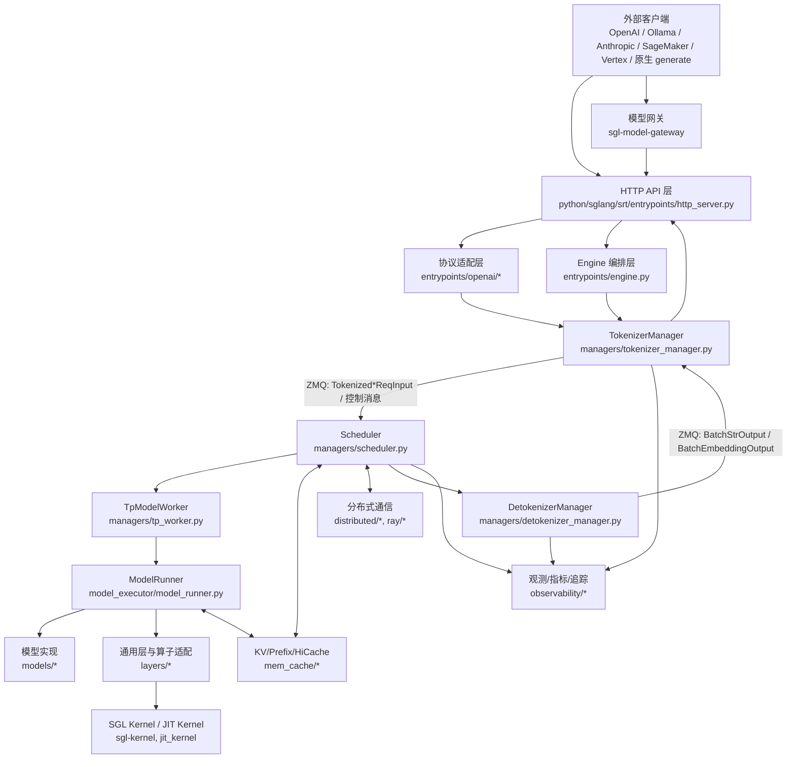

### 1.1 设计层次

| 层次 | 代表模块 | 核心职责 | 关键对象/信息 |
|---|---|---|---|
| API/协议层 | `entrypoints/http_server.py`, `entrypoints/openai/*`, Ollama/Anthropic 适配 | 接收 HTTP/WebSocket 请求，做协议校验、OpenAI 兼容字段转换、流式响应封装 | `ChatCompletionRequest`, `CompletionRequest`, `ResponsesRequest`, `EmbeddingRequest`, SSE chunk |
| 运行时编排层 | `entrypoints/engine.py` | 启动 Tokenizer、Scheduler、Detokenizer 多进程，管理端口、生命周期和管理 API | `Engine`, `ServerArgs`, `PortArgs` |
| 请求预处理层 | `managers/tokenizer_manager.py`, `managers/mm_utils.py`, `multimodal/*` | 文本/多模态输入解析、tokenize、采样参数归一化、LoRA 解析、请求状态维护 | `GenerateReqInput`, `EmbeddingReqInput`, `ReqState`, `SamplingParams` |
| 调度层 | `managers/scheduler.py`, `schedule_batch.py`, `schedule_policy.py` | 动态批处理、prefill/decode 调度、优先级、prefix cache 命中、chunked prefill、请求中止 | `Req`, `ScheduleBatch`, `SchedulePolicy`, `PrefillAdder` |
| 执行层 | `managers/tp_worker.py`, `model_executor/model_runner.py`, `forward_batch_info.py` | 构造 GPU 侧 `ForwardBatch`，执行模型 forward，采样 next token，管理 CUDA graph/attention backend | `TpModelWorker`, `ModelRunner`, `ForwardBatch`, `ModelRunnerOutput` |
| 模型/算子层 | `models/*`, `layers/*`, `sgl-kernel/*`, `jit_kernel/*` | 模型结构、attention/MoE/quantization/sampler 等高性能实现 | `AttentionBackend`, `FusedMoE`, `LogitsProcessor`, sampler |
| 缓存与存储层 | `mem_cache/*`, `disaggregation/*`, `connector/*` | KV cache、Radix prefix cache、HiCache、远端/对象存储连接、PD disaggregation | `BasePrefixCache`, `RadixCache`, `ReqToTokenPool`, `TokenToKVPoolAllocator` |
| 分布式层 | `distributed/*`, `ray/*`, `grpc/*` | TP/PP/DP/EP 进程组、rank 广播、跨节点通信、Ray 部署 | `ParallelState`, device communicators |
| 可观测与运维层 | `observability/*`, `scheduler_components/*`, profile/weight/lora 管理 API | 指标、trace、load snapshot、健康检查、权重热更新、LoRA 动态加载 | `SchedulerMetricsReporter`, `SchedulerLoadInquirer`, `SchedulerWeightUpdaterManager` |

## 2. 主要处理模块

### 2.1 HTTP 与协议适配模块

`http_server.py` 是 FastAPI 服务入口，注册 `/generate`、`/encode`、`/v1/chat/completions`、`/v1/completions`、`/v1/embeddings`、`/v1/responses`、Ollama、Anthropic、SageMaker、Vertex 等接口。

协议适配层的主要设计点：

- OpenAI 协议对象使用 Pydantic `BaseModel` 建模，例如 `CompletionRequest`、`ChatCompletionRequest`、`ResponsesRequest`、`EmbeddingRequest`。
- `OpenAIServingBase` 提供统一模板方法：请求校验、转换内部请求、分流流式/非流式响应、错误响应构造。
- `OpenAIServingChat`、`OpenAIServingCompletion` 等子类覆盖 `_convert_to_internal_request`、`_handle_streaming_request`、`_handle_non_streaming_request` 等方法，把外部协议字段转成内部 `GenerateReqInput` 或 `EmbeddingReqInput`。

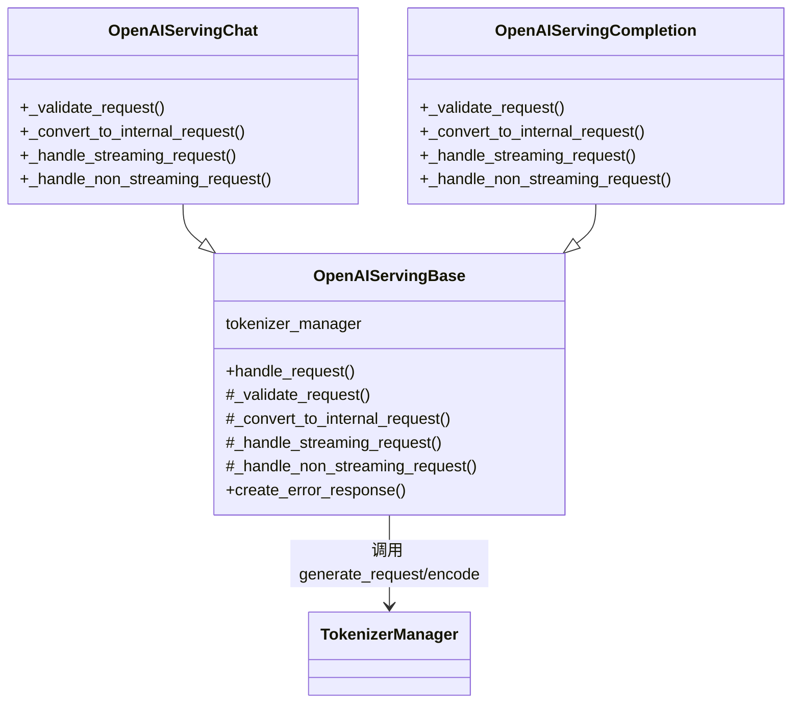

### 2.2 Engine 编排模块

`Engine` 的职责是把服务拆成多个执行实体：

- 主进程：HTTP server、`Engine`、`TokenizerManager`。
- Scheduler 子进程：一个或多个调度进程，按 TP/PP/DP/rank 组织。
- Detokenizer 子进程：接收 token id 输出并增量 decode。

`Engine` 既服务 HTTP 模式，也支持 Python API 直接调用 `generate`、`async_generate`、`encode`、`rerank` 以及权重/LoRA/会话/内存控制类接口。

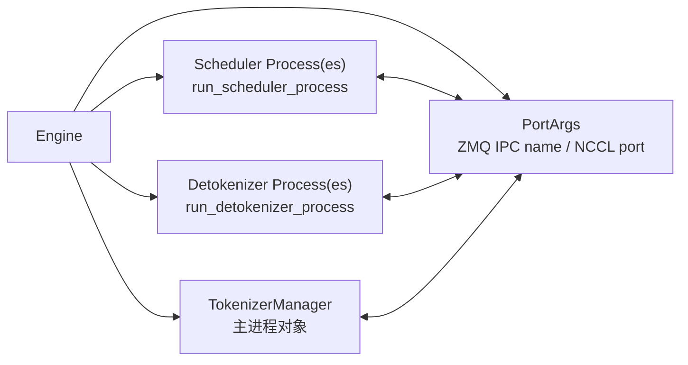

### 2.3 TokenizerManager 请求预处理模块

`TokenizerManager` 是请求进入运行时后的第一个核心对象，主要职责：

- 识别输入形式：文本、token ids、embedding、多模态数据。
- 调用 tokenizer/processor 完成 tokenization 与多模态特征处理。
- 生成内部 tokenized 请求：`TokenizedGenerateReqInput` 或 `TokenizedEmbeddingReqInput`。
- 为流式响应维护 `ReqState`，根据 `rid` 聚合输出 chunk。
- 通过 ZMQ PUSH 把请求发送给 Scheduler，通过 ZMQ PULL 接收 `BatchStrOutput` 或 `BatchEmbeddingOutput`。
- 处理控制类请求：abort、pause/continue generation、flush cache、profile、权重更新、LoRA 加载等。

对象包含关系：

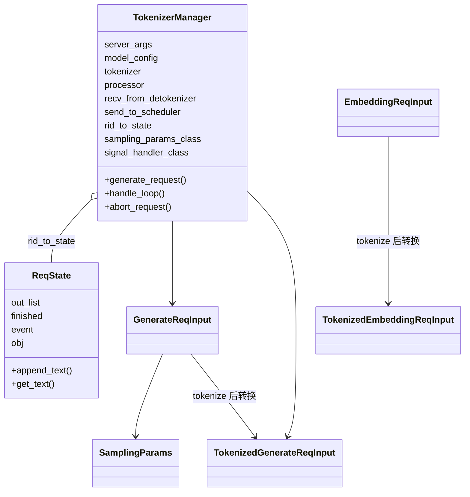

### 2.4 Scheduler 调度模块

`Scheduler` 是运行时的核心处理模块。它在子进程中管理一个 tensor parallel GPU worker，并通过 mixin 扩展 PD disaggregation、pipeline parallel、multiplex、DLLM、MLX overlap 等能力。

`Scheduler` 关键职责：

- 从 Tokenizer/RPC 通道接收请求，并广播到 TP/PP/DP 相关 rank。
- 将 `Tokenized*ReqInput` 转换为调度内部对象 `Req`。
- 维护等待队列、运行 batch、chunked prefill 状态、优先级与超时中止。
- 调用 `SchedulePolicy` 选择下一批 prefill/decode 请求。
- 与 prefix cache/KV cache 协作，完成命中、分配、回收、evict。
- 构造 `ScheduleBatch` 并调用 `TpModelWorker` 执行。
- 将 token id 输出送往 Detokenizer，或将 embedding 输出送回 Tokenizer。
- 管理 profile、metrics、load、KV event、weight update、LoRA overlap loading 等辅助组件。

`Scheduler` 的继承关系：

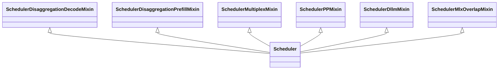

`Scheduler` 的重要包含关系：

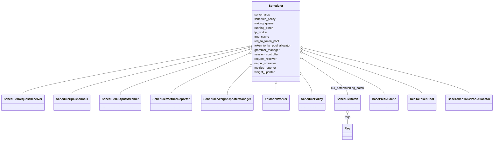

### 2.5 ScheduleBatch 与 Req 模块

`schedule_batch.py` 明确说明了批处理对象的流向：

```text
ScheduleBatch -> ForwardBatch
```

- `ScheduleBatch`：由 Scheduler 管理，保存偏 CPU 侧的调度信息。
- `ForwardBatch`：由 ModelRunner 管理，保存偏 GPU tensor 侧的执行信息，通过 `ForwardBatch.init_new(batch, model_runner)` 从 `ScheduleBatch` 构造。

`Req` 是 Scheduler 内部单请求对象，承载 token ids、采样参数、prefix cache 命中信息、输出 token、finish reason、logprob/multimodal/session/LoRA 等运行时状态。

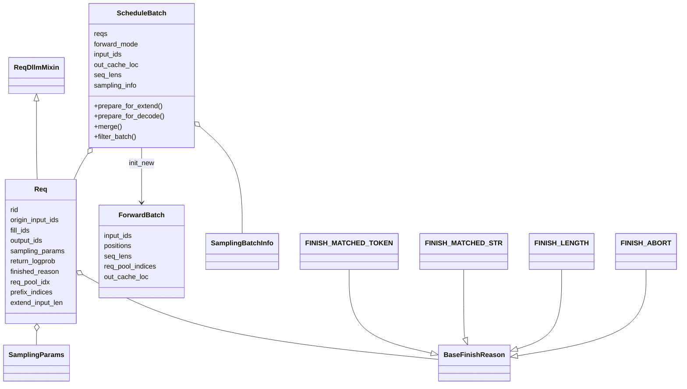

### 2.6 TpModelWorker 与 ModelRunner 执行模块

`TpModelWorker` 是 Scheduler 调用模型执行的门面对象。它持有一个或多个 `ModelRunner`，负责将 `ScheduleBatch` 转成 `ForwardBatch` 后执行 generation 或 embedding。

`ModelRunner` 是模型执行核心，职责包括：

- 加载模型权重：通过 `model_loader` 与 `ModelConfig`。
- 初始化 memory pool、attention backend、CUDA graph、sampler、LoRA manager。
- 执行 `model.forward`。
- 调用 sampler 从 logits 采样 next token。
- 支持权重热更新、LoRA 动态加载、远程实例权重传输、profile hook。

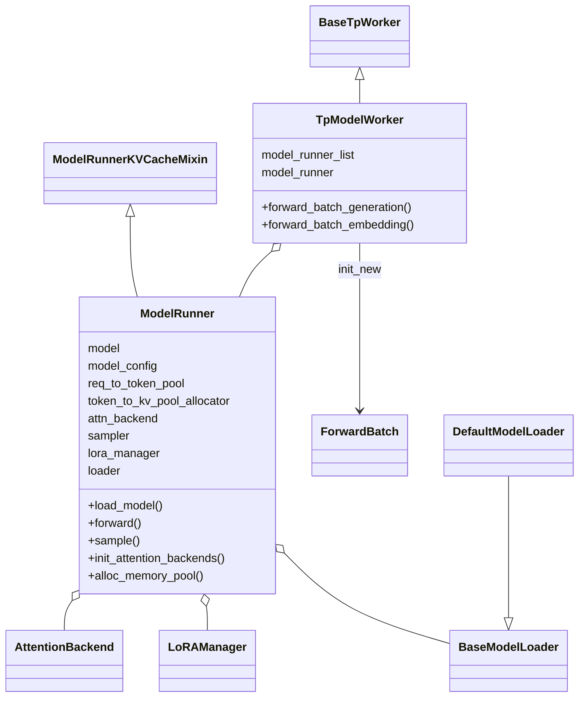

### 2.7 KV Cache / Prefix Cache 模块

缓存模块分成两类关键能力：

- token 到 KV 物理位置的内存池：`ReqToTokenPool`、`MHATokenToKVPool`、`BaseTokenToKVPoolAllocator`。
- prefix 复用索引：`BasePrefixCache`、`RadixCache`、`RadixCacheCpp`、HiCache 相关组件。

`BasePrefixCache` 定义统一接口：

- `match_prefix`：按 radix key 查找前缀命中。
- `cache_finished_req` / `cache_unfinished_req`：请求完成或中间状态写入缓存。
- `evict`：按 token 数释放空间。
- `inc_lock_ref` / `dec_lock_ref`：保护运行中缓存节点。
- `init_load_back`：HiCache/host->device 回填准备。

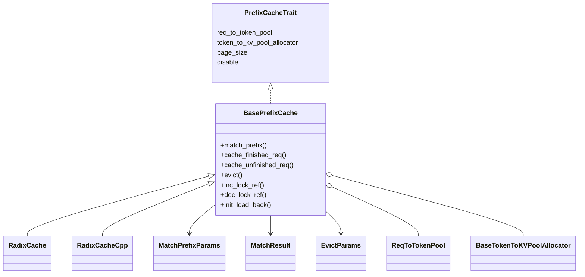

## 3. 消息模块设计

内部消息主要定义在 `managers/io_struct.py`。设计上分为两条基类：

- `BaseReq`：单请求或控制请求，字段包括 `rid` 与 `http_worker_ipc`。
- `BaseBatchReq`：批量请求或批量输出，字段包括 `rids` 与 `http_worker_ipcs`。

```mermaid
classDiagram
    class BaseReq {
        rid
        http_worker_ipc
        +regenerate_rid()
        +_validate_rid_uniqueness()
    }
    class BaseBatchReq {
        rids
        http_worker_ipcs
        +regenerate_rids()
    }
    class GenerateReqInput
    class TokenizedGenerateReqInput
    class EmbeddingReqInput
    class TokenizedEmbeddingReqInput
    class BatchTokenizedGenerateReqInput
    class BatchTokenizedEmbeddingReqInput
    class BatchTokenIDOutput
    class BatchStrOutput
    class BatchEmbeddingOutput
    class AbortReq
    class FlushCacheReqInput
    class UpdateWeightFromDiskReqInput
    class LoadLoRAAdapterReqInput
    class ProfileReq
    class OpenSessionReqInput

    GenerateReqInput --|> BaseReq
    TokenizedGenerateReqInput --|> BaseReq
    EmbeddingReqInput --|> BaseReq
    TokenizedEmbeddingReqInput --|> BaseReq
    AbortReq --|> BaseReq
    FlushCacheReqInput --|> BaseReq
    UpdateWeightFromDiskReqInput --|> BaseReq
    LoadLoRAAdapterReqInput --|> BaseReq
    ProfileReq --|> BaseReq
    OpenSessionReqInput --|> BaseReq
    BatchTokenizedGenerateReqInput --|> BaseBatchReq
    BatchTokenizedEmbeddingReqInput --|> BaseBatchReq
    BatchTokenIDOutput --|> BaseBatchReq
    BatchStrOutput --|> BaseBatchReq
    BatchEmbeddingOutput --|> BaseBatchReq
```

### 3.1 消息信息内容

| 消息类型 | 发送方 -> 接收方 | 关键字段 | 语义 |
|---|---|---|---|
| `GenerateReqInput` | HTTP/OpenAI/Engine -> TokenizerManager | `text`, `input_ids`, `image_data`, `video_data`, `audio_data`, `sampling_params`, `stream`, `lora_path`, `session_params`, `routed_dp_rank` | 原始生成请求，仍可能包含文本、多模态原始数据和外部协议参数 |
| `TokenizedGenerateReqInput` | TokenizerManager -> Scheduler | token ids、多模态特征、采样参数、rid、logprob 配置、LoRA/session/路由信息 | 已 tokenized 的生成请求，是调度层的主要输入 |
| `EmbeddingReqInput` | HTTP/Engine -> TokenizerManager | 文本/token ids/multimodal 输入、embedding 参数 | embedding/classify/rerank 类请求 |
| `TokenizedEmbeddingReqInput` | TokenizerManager -> Scheduler | token ids、多模态特征、rid、pooling/embedding 参数 | 已 tokenized 的 embedding 请求 |
| `BatchTokenized*ReqInput` | TokenizerManager -> Scheduler | `rids`, tokenized request 列表 | 批量请求输入 |
| `BatchTokenIDOutput` | Scheduler -> Detokenizer | `rids`, token ids, finish reason, logprob, hidden states, metrics | generation token id 输出，尚未转文本 |
| `BatchStrOutput` | Detokenizer -> TokenizerManager | `rids`, decoded text, finish reason, meta_info | 已解码文本输出，用于 HTTP/SSE 返回 |
| `BatchEmbeddingOutput` | Scheduler -> TokenizerManager 或 Detokenizer -> TokenizerManager | embedding/classification/rerank 结果、meta_info | 非文本生成类结果 |
| 控制请求 | HTTP/Engine/TokenizerManager -> Scheduler | `AbortReq`, `FlushCacheReqInput`, `ProfileReq`, `UpdateWeights*`, `LoadLoRA*`, `OpenSessionReqInput` | 管理运行时状态、缓存、权重、LoRA、会话、profile |

### 3.2 IPC 通道

Scheduler 的 IPC 通道封装在 `SchedulerIpcChannels` 中：

- `recv_from_tokenizer`：Scheduler rank0 从 TokenizerManager 接收工作请求。
- `recv_from_rpc`：接收 RPC/控制类请求。
- `send_to_tokenizer`：发送可直接返回 Tokenizer 的输出。
- `send_to_detokenizer`：发送 token id 输出给 Detokenizer。
- `send_metrics_from_scheduler`：输出 metrics。

`SchedulerRequestReceiver` 进一步处理接收逻辑：

- rank0 从 ZMQ 非阻塞拉取请求。
- 在 TP/DP attention/CP/PP rank 间 broadcast 或 point-to-point 转发。
- 将工作请求与控制请求分离，减少不必要的全组同步。
- 多模态场景下处理 shared memory feature 的解包时机。

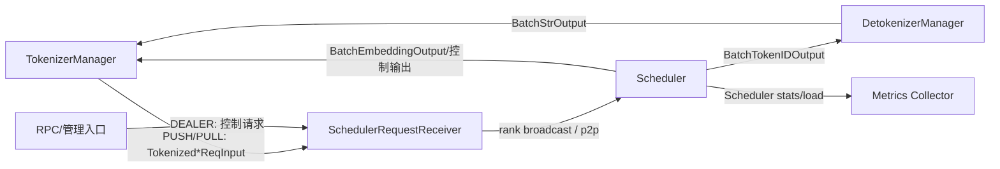

## 4. 模块交互逻辑

### 4.1 文本生成业务流程

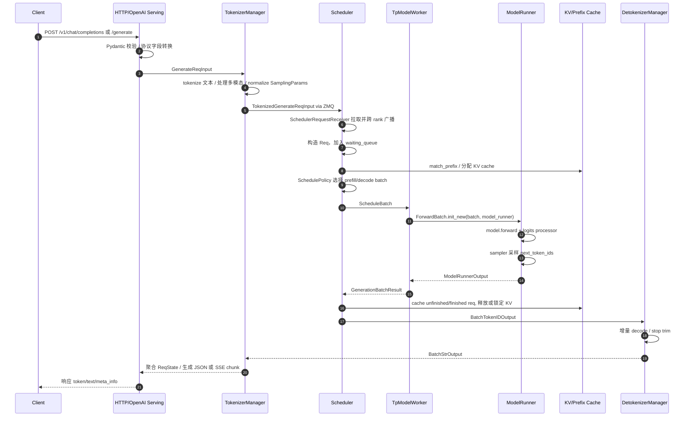

### 4.2 流式响应流程

流式响应的核心是 `rid` 贯穿全链路。TokenizerManager 为每个请求维护 `ReqState`，收到 Detokenizer 的 `BatchStrOutput` 后按 `rid` 更新状态，并让 HTTP 层异步迭代产生 SSE chunk。

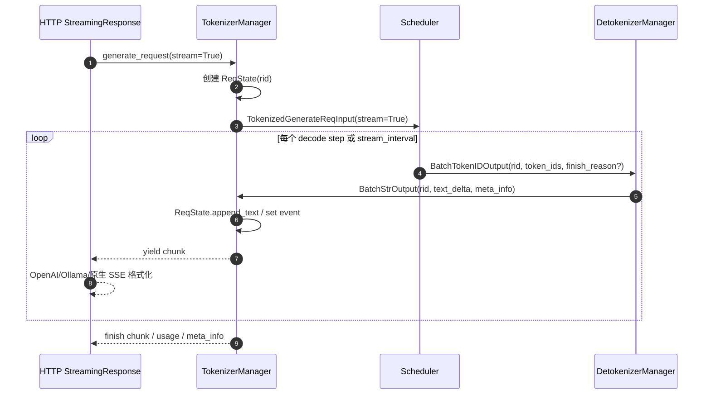

### 4.3 Embedding/Rerank/Classify 流程

Embedding 类请求不需要 Detokenizer 解码文本。Scheduler 执行模型后生成 `BatchEmbeddingOutput`，直接返回 TokenizerManager。

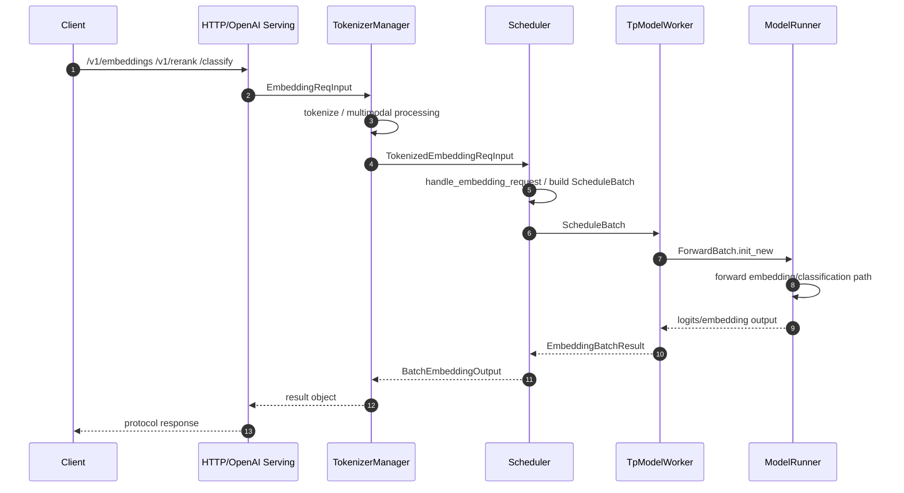

### 4.4 控制类请求流程

控制类请求复用 `BaseReq` 体系，但通常不进入普通 batch 调度，而由 Scheduler 的 `TypeBasedDispatcher` 分发到对应 handler。

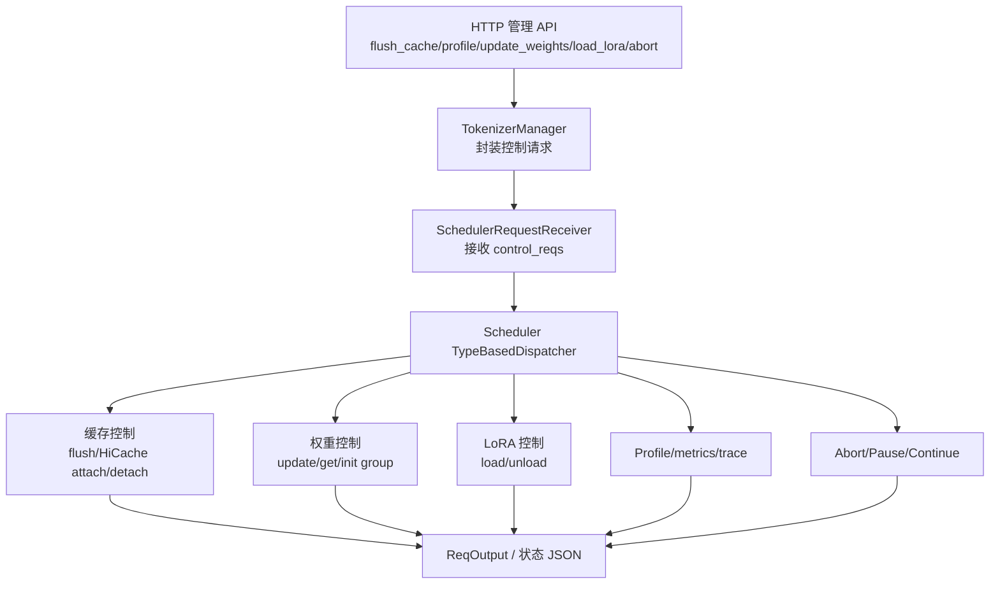

## 5. 软件模块之间交互的信息内容

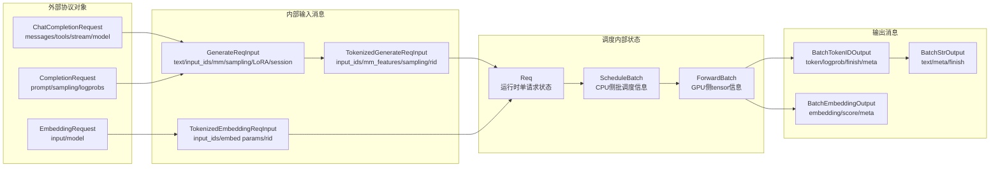

关键转换关系：

1. 外部协议对象到内部输入对象：OpenAI/Ollama/Anthropic 的字段被统一映射到 `GenerateReqInput` 或 `EmbeddingReqInput`。
2. 原始输入到 tokenized 输入：TokenizerManager 将文本、多模态数据、采样参数、LoRA/session/路由信息规范化。
3. tokenized 输入到调度状态：Scheduler 将其转换为 `Req`，再组成 `ScheduleBatch`。
4. 调度状态到执行状态：`ForwardBatch.init_new` 把 CPU 侧 batch 转成 GPU tensor 侧 batch。
5. token 输出到文本输出：Detokenizer 把 `BatchTokenIDOutput` 转成 `BatchStrOutput`。

## 6. 设计特征与架构评价

### 6.1 设计优势

- **协议层与运行时核心解耦**：HTTP/OpenAI/Ollama/Anthropic 等外部协议最终汇入统一内部消息，降低核心调度器对协议细节的依赖。
- **多进程隔离清晰**：Tokenizer、Scheduler、Detokenizer 分离，GPU 调度与 CPU decode 互不阻塞。
- **消息对象集中定义**：`io_struct.py` 统一维护跨进程传输对象，便于新增管理请求和输出类型。
- **调度与执行分层明确**：`ScheduleBatch` 与 `ForwardBatch` 的边界清楚，前者服务调度，后者服务模型执行。
- **扩展能力通过 mixin 和组件组合实现**：Scheduler 通过多个 mixin 支持 disaggregation、PP、multiplex、DLLM 等；内部功能拆成 `scheduler_components` 便于局部演进。
- **缓存抽象较完善**：`BasePrefixCache` 抽象了 prefix match、insert、evict、lock、load-back，支持 RadixCache、HiCache、CPP 实现等多种后端。
- **高性能后端可替换**：attention backend、MoE runner、quantization scheme、kernel/JIT kernel 以注册或适配方式接入。

### 6.2 复杂性与风险点

- **Scheduler 体量较大**：`scheduler.py` 同时承担请求处理、调度策略、缓存协作、执行调用、管理命令、metrics 等职责，虽然已有 `scheduler_components` 拆分，但核心类仍是复杂中心。
- **消息类型数量多**：`BaseReq` 下的控制请求很多，新增消息时需要确保命名约定、dispatcher 注册、跨 rank 广播语义都一致。
- **多 rank 通信路径复杂**：DP attention、TP、CP、PP、disaggregation 会改变请求广播方式，调试时需要同时理解 ZMQ 与 torch distributed。
- **多模态数据跨进程传输成本敏感**：shared memory feature 的 materialize/unlink 时机需要和 rank broadcast 同步，否则容易出现资源生命周期问题。
- **缓存和调度强耦合**：`Req`、`ScheduleBatch`、KV pool、prefix cache 共享较多运行时状态，性能收益高，但对修改者理解成本也高。

## 7. 建议的阅读路径

如果后续需要继续深入代码实现，可按以下路径阅读：

1. `python/sglang/srt/entrypoints/http_server.py`：确认外部 API 如何进入运行时。
2. `python/sglang/srt/entrypoints/openai/serving_base.py` 与 `serving_chat.py`：理解 OpenAI 协议转换。
3. `python/sglang/srt/managers/io_struct.py`：掌握跨进程消息对象。
4. `python/sglang/srt/managers/tokenizer_manager.py`：理解 tokenization、请求状态、流式聚合。
5. `python/sglang/srt/managers/scheduler.py`：理解调度主循环与请求处理。
6. `python/sglang/srt/managers/schedule_batch.py`：理解 `Req -> ScheduleBatch -> ForwardBatch`。
7. `python/sglang/srt/managers/tp_worker.py` 与 `python/sglang/srt/model_executor/model_runner.py`：理解模型执行。
8. `python/sglang/srt/mem_cache/*`：理解 KV/prefix cache 与调度耦合。

## 8. 总结

当前仓库的软件设计可以概括为：以 FastAPI 和多协议适配作为入口，以 `Engine` 启动并编排多进程运行时，以 `TokenizerManager -> Scheduler -> TpModelWorker/ModelRunner -> DetokenizerManager` 作为主业务链路，以 `io_struct.py` 的消息对象和 ZMQ/torch distributed 作为跨模块通信基础，以 KV/prefix cache、attention backend、kernel、LoRA、权重热更新、观测组件支撑生产级推理能力。

从设计层面看，SGLang 的核心抽象边界主要落在三组对象上：

- **消息边界**：外部 Pydantic 协议对象与内部 dataclass 请求对象。
- **调度边界**：`Req` / `ScheduleBatch` 表达 CPU 侧运行时状态。
- **执行边界**：`ForwardBatch` / `ModelRunner` 表达 GPU 侧模型执行状态。

这三组边界共同构成了软件框架的主干，也是理解和扩展该仓库时最重要的结构抓手。
