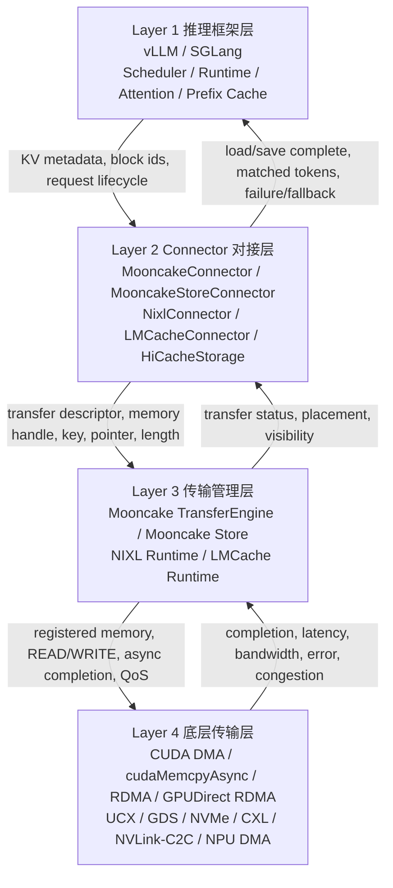
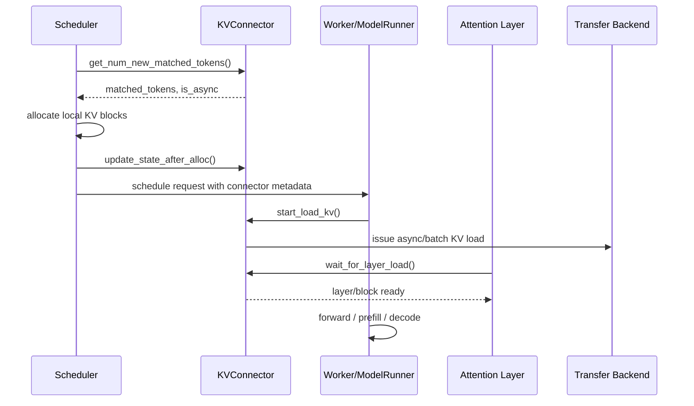
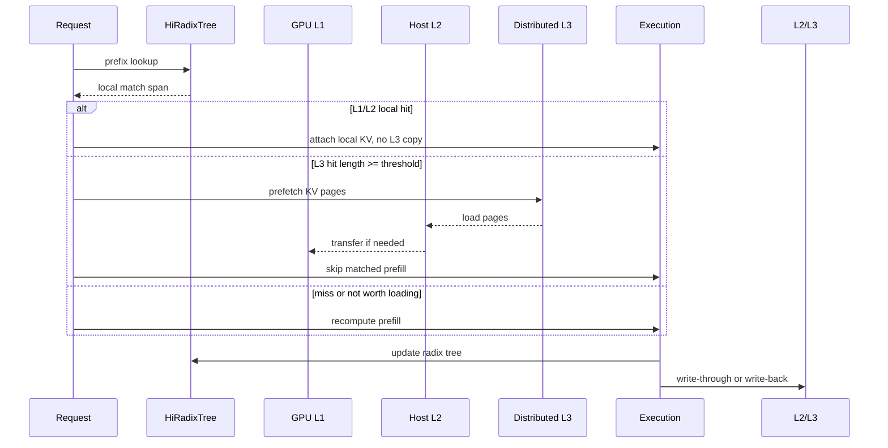
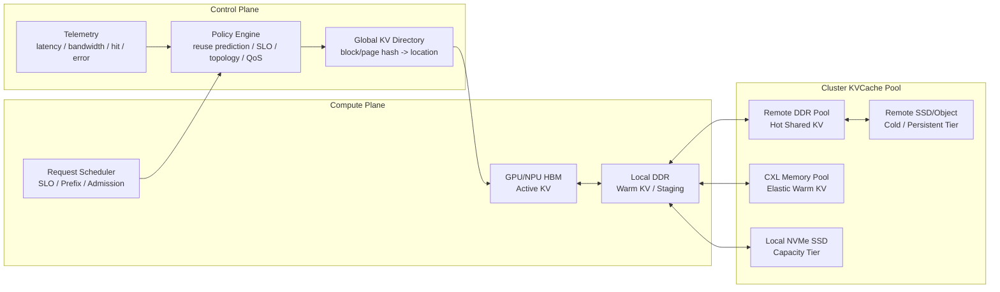
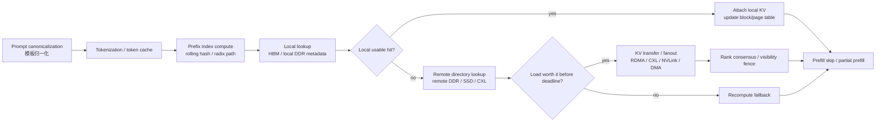
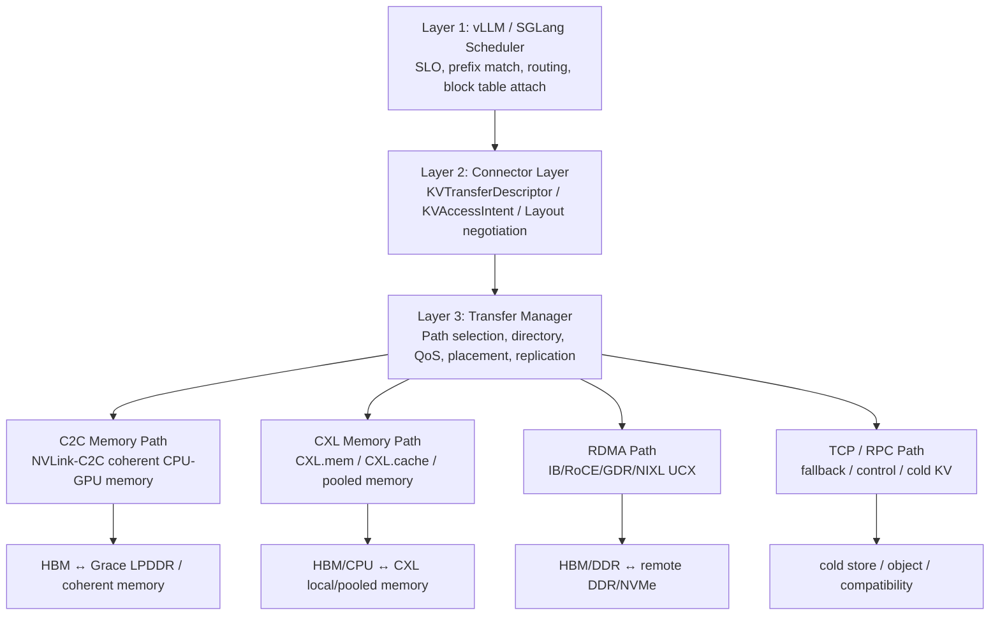

> From: https://chatgpt.com/c/6a3ddc99-7f20-83ea-950a-a57debf3f95b?mweb_fallback=1

# you asked

message time: 2026-06-26 09:57:49

## 围绕KVCache，分析vllm和sglang两个主流在线推理框架

### 重点围绕KVCache在两个主流框架中的管理、传输为重点分析对象；覆盖如下内容：
	* KVCACHE卸载、加载在在线推理流程中的触发时机；
	* 当触发KVCACHE卸载和加载时，单次kvcache的传输单位、传输大小，以及传输方式，譬如当业务层面触发卸载或是加载时，每次传输的单位的kvcache block，每个block的大小可以设置，默认XXXByte，由于每次传输的多个block不连续，因此采用for循环多次调用传输的方式；
	* 底层考虑对接mooncake、mooncakestore、nixl、lmcache等传输方式；

### 软件分析内容的重点方向：
	* 将整个软件自顶向下划分为**四个**部分：
		** vllm、sglang等推理框架
		** mooncakeconnector、mooncakestoreconnector等connector对接层；
		** mooncake、mooncakestore、nixl等传输管理层；
		** 底层传输层，真正负责完成kvcache在CPU-GPU之间，或本地DDR-远端DDR之间的传输；
	* 分析四个层次交互的边界，覆盖：
		** 交互接口
		** 传递的信息格式、内容
	* 四个层次从底向上分析各自的功能特性，覆盖：
		** 下一层向上一层提供了哪些能力
		** 下一层向上一层通过提供哪些接口，从而将自身的功能提供给上一层；

### 基于上述分析，重点技术推演方向

## 推演场景：AI集群中kvcache需要在GPU/NPU、本地DDR、本地SSD、远端DDR、远端SSD之间频繁卸载/加载；

### 以提升kvcache复用率，提升ttft、tpot推理性能指标为目标，重点推演：		
	* 结合KVCACHE加载/卸载在业务层面的触发时机和传输量需求，对底层不同软硬件的能力诉求，譬如DDR时延、DDR带宽、远端DDR访问时延、远端DDR访问带宽、本地SSD访问时延、本地SSD访问带宽；网络访问时延、网络访问带宽等；
	* KVCACHE加载/卸载在不同层次、不同介质存储设备之间流动的业务痛点，譬如频繁kvcache拷贝导致流量风暴、kvcache传输与算子下发多模态前后处理共存导致业务阻塞等。
	* 带有拓扑感知、底层传输形态感知、底层传输质量感知的kvcache的内存管理？
	* 统一kvcache内存池？
	* 上述推演场景仅是示例，需要仿照上述描述，进一步展开深入分析，推演未来高性能kvcache的管理方式是什么。

### 推演技术
	• 结合最新技术栈，譬如Nvlink、cxl、nvidia um、统一内存等。

## 输出报告要求
	• 输出内容详实、专业的分析报告
	• 按照四个软件层次，分别给出各个层次的方案优化、软件实现等需求，按照**层次编号-组件-需求编号**的正式SRS方式，输出需求分析文档；每一条SRS需求具备深刻的问题背景、良好的可执行性、可预期的性能收益；
	• 所有SRS汇总，均服务于未来**低时延高吞吐统一异构kvcache存储集群**这一规划目标；
	• 最后输出报告按照正式报告格式交付，内嵌表格、示意图等专业表达方式。

## GPU/NPU、本端/远端DDR、本端/远端 SSD，这些不同介质、不同位置的存储器如何**协同作用**共同服务好AI推理模型中的KVCACHE的哪些场景下的哪些关键指标？这个问题要深入分析，并基于上述分析推导必要的软硬件能力增强需求。 推演和推导需求的思路就是在不断循环回答这一类问题的同时，找到当前软硬件架构的不足和痛点，从而提取出切实可行的软硬件架构、功能整改需求。

## 作为一名AI集群基础设施专家，你需要给出的既是一份专业的**kvcache管理场景下的业务特点、负载特征、业务规格分析报告，也是一份对未来多层次异构统一KVcache存储池架构的需求分析**。

---

# chatgpt response

我会先把事实边界校准到当前 vLLM/SGLang/Mooncake/NIXL/LMCache 的公开实现，再在此基础上做架构推演和 SRS。重点会把“事实实现”和“未来需求推导”分开，避免把规划能力误写成现有能力。

已经确认几个关键事实点：vLLM 默认 KV block 是 16 tokens；vLLM 0.12 之后为 offloading 优化过跨层连续物理 block，典型模型的单个物理 KV block 从 KB 级提升到约 0.5–2 MB；SGLang HiCache 则明确采用 L1 GPU、L2 Host、L3 分布式存储的三级模型。接下来我会把它们统一到四层软件栈和未来统一 KVCache 存储池需求里。

# 低时延高吞吐统一异构 KVCache 存储集群：vLLM 与 SGLang 软件栈分析及需求规格说明

**分析基准日期：2026-06-26**  
**目标对象：vLLM、SGLang、Mooncake/MooncakeStore、NIXL、LMCache，以及 GPU/NPU、本地/远端 DDR、本地/远端 SSD 组成的多层 KVCache 存储体系**

---

## 0. 核心结论

KVCache 不是普通 tensor 缓存，而是在线推理系统中的**可复用执行状态**。高性能 KVCache 管理的本质不是“把 KV 从 A 拷到 B”，而是持续回答三个问题：

1. **这个 KV 是否值得保留？**
2. **这个 KV 应该放在哪一级介质？**
3. **在当前请求 SLO 约束下，加载它是否比重新 prefill 更划算？**

vLLM 与 SGLang 的技术路线有明显差异：

| 框架 | 当前主线能力 | KVCache 管理风格 | 主要优势 | 主要不足 |
|---|---|---|---|---|
| **vLLM** | PagedAttention、KVConnector、P/D disaggregation、native CPU offload、Mooncake/NIXL/LMCache connector | 以 scheduler/runtime/connector 接口为中心，把 KV 传输抽象成请求级与 block 级生命周期事件 | 接口边界清晰，便于对接 Mooncake、NIXL、LMCache；vLLM 0.12 之后针对 offload 优化了跨层连续物理 block | 原生多级存储仍在演进，拓扑感知、QoS、远端 DDR/SSD 分层策略仍不完整 |
| **SGLang** | RadixAttention、HiCache、L1 GPU/L2 Host/L3 distributed storage、Mooncake/3FS/NIXL/AIBrix/File 后端 | 以 prefix tree + hierarchical cache 为中心，把 KV 作为分层页面对象管理 | 分层缓存模型更直接，L1/L2/L3、prefetch、write-back/write-through 策略较完整 | 与底层传输 QoS、全局拓扑、跨框架统一 descriptor 的标准化仍需增强 |

vLLM 的 `CacheConfig` 中 `DEFAULT_BLOCK_SIZE = 16`，`block_size` 表示以 token 数计的连续 KV cache block；`kv_offloading_size` 非空时启用 KV offload，后端包括 `native` 与 `lmcache`。([docs.vllm.ai](https://docs.vllm.ai/en/stable/api/vllm/config/cache/)) SGLang HiCache 则明确采用 **L1 GPU memory、L2 host memory、L3 distributed storage** 的三级缓存体系，并通过 HiRadixTree 记录 prefix span 及其所在层级。([SGLang Documentation](https://docs.sglang.ai/advanced_features/hicache_design.html))

---

# 1. 第一性原理：KVCache 负载模型与性能目标

## 1.1 KVCache 的业务价值

在 Transformer 解码阶段，KVCache 避免重复计算历史 token 的 Key/Value。Prefill 阶段生成整段 prompt 的 KV；decode 阶段每生成一个 token 追加一小段 KV，并在 attention 中复用历史 KV。Mooncake 论文也将 prefill 与 decode 解耦，核心动机是 prefill compute-intensive、decode memory/latency-sensitive，并利用 CPU DRAM/SSD 存放可复用 KV 以提升整体吞吐和 SLO 达成率。([arXiv](https://arxiv.org/abs/2407.00079))

因此 KVCache 管理直接影响：

| 指标 | 受 KVCache 影响的机制 |
|---|---|
| **TTFT** | prefix KV 命中并成功加载，可跳过部分或全部 prefill |
| **TPOT / TBT** | decode 阶段 HBM KV 布局、cache residency、copy/transfer 干扰会影响每 token 延迟 |
| **吞吐 / goodput** | 复用 KV 减少 prefill 计算，释放 GPU/NPU 算力 |
| **p99 latency** | 远端 KV 拉取、SSD 读取、网络拥塞、队列等待会放大尾延迟 |
| **HBM 利用率** | HBM 中只保留 active/hot KV，可扩大并发 |
| **集群成本** | 用 DDR/SSD/远端内存换 GPU/NPU HBM，可提升单位硬件吞吐 |

---

## 1.2 是否加载 KVCache 的基本判据

KVCache load 并非总是收益为正。正确判据应是：

$$
T_{lookup} + T_{queue} + T_{transfer} + T_{layout} + T_{sync}
<
T_{recompute}
$$

同时还要满足：

$$
T_{load} \leq TTFT\_budget
$$

如果远端 DDR 或 SSD 的加载时间超过重新 prefill，或者加载造成 decode copy engine/NIC 队列阻塞，则应该放弃 load，转为 recompute。

这意味着未来 KVCache 系统必须具备：

| 能力 | 原因 |
|---|---|
| **cache hit 预测** | 命中不等于值得加载 |
| **传输耗时预测** | 需要知道不同介质、路径、拓扑的实时质量 |
| **SLO 感知 admission** | TTFT 预算不足时不能盲目远端拉取 |
| **recompute fallback** | load 排队/失败/超时后需要快速退化 |
| **copy/compute overlap** | 避免 KV transfer 阻塞算子下发和 decode loop |

---

# 2. 四层软件栈划分与边界

## 2.1 四层总览



---

## 2.2 四层边界与交互信息

| 层次 | 上层看到的能力 | 典型接口/事件 | 传递的信息格式 |
|---|---|---|---|
| **Layer 1：推理框架层** | KV 分配、prefix 命中、调度、load/save/offload 触发 | `get_num_new_matched_tokens`、`update_state_after_alloc`、`start_load_kv`、`wait_for_layer_load`、`save_kv_layer`、`wait_for_save`、`request_finished` | request_id、token_ids、block_ids、block_hash、kv_transfer_params、model/TP/rank/dtype/layout |
| **Layer 2：Connector 对接层** | 把框架生命周期事件转成可执行 KV transfer 任务 | MooncakeConnector、NixlConnector、LMCacheConnector、HiCacheStorage backend | local/remote block id、src/dst pointer、length、rank、transfer_id、cache key、priority、timeout |
| **Layer 3：传输管理层** | 分布式 KV 存储、内存注册、远端寻址、batch transfer、placement | Mooncake TransferEngine、Mooncake Store、NIXL agent、LMCache runtime | memory descriptor、metadata、registered region、RDMA/GDS handle、placement decision |
| **Layer 4：底层传输层** | 真实数据搬运 | cudaMemcpyAsync、DMA、RDMA READ/WRITE、GPUDirect RDMA、GDS、NVMe I/O、CXL memory access | device pointer、host pointer、NIC queue pair、file offset、NVMe command、completion queue |

vLLM KVConnector 的 worker 侧 API 已经显式包含注册 KV cache、开始加载、等待逐层加载、保存某层 KV、等待保存完成、查询完成请求等接口；scheduler 侧也有命中 token 计算与 allocation 后状态更新接口。([docs.vllm.ai](https://docs.vllm.ai/en/v0.9.1/api/vllm/distributed/kv_transfer/kv_connector/v1/base.html)) vLLM 还暴露 `prefer_cross_layer_blocks`，表示 connector 更偏好“同一个物理 KV block 持有所有层 KV”的布局，这可以提升传输效率。([vLLM](https://vllm.website.cncfstack.com/api/vllm/distributed/kv_transfer/kv_connector/v1/))

---

# 3. vLLM KVCache 管理与传输分析

## 3.1 vLLM 的 KVCache 基础模型

vLLM 的 PagedAttention 将 KV cache 管理成 block。其文档描述了 `k_cache`、`v_cache` 等张量，PagedAttention kernel 以 block 为单位访问 KV。([docs.vllm.ai](https://docs.vllm.ai/en/latest/design/paged_attention/)) `CacheConfig` 中 `block_size` 是以 token 数计的连续 cache block，默认值为 16。([docs.vllm.ai](https://docs.vllm.ai/en/stable/api/vllm/config/cache/))

需要特别纠正一个常见误区：**KV block 的默认大小不是固定 XXX Byte。**  
固定的是默认 **16 tokens/block**；字节大小取决于模型层数、KV head 数、head_dim、dtype、TP 切分方式、attention 结构、KV layout。

对标准 MHA/GQA 模型，单个逻辑 block 的近似大小为：

$$
B_{block}
=
T_{block}
\times L
\times 2
\times H_{kv,rank}
\times D_{head}
\times Bytes(dtype)
$$

其中：

| 符号 | 含义 |
|---|---|
| $T_{block}$ | block token 数，vLLM 默认 16 |
| $L$ | transformer layer 数 |
| 2 | K 与 V 两份 |
| $H_{kv,rank}$ | 当前 TP rank 上的 KV head 数 |
| $D_{head}$ | head dimension |
| `Bytes(dtype)` | BF16/FP16 为 2，FP8 为 1 |

例如 Llama-3.1-8B BF16，32 层、8 个 KV heads、head_dim 128、block 16 tokens：

$$
16 \times 32 \times 2 \times 8 \times 128 \times 2
=
2,097,152\ Bytes
\approx 2\ MiB
$$

vLLM 官方博客也给出：vLLM 0.12 之后，16-token block 下 Llama-3.1-8B 的新物理 block 约为 2 MB，Llama-3.2-1B 约 0.5 MB，Qwen3-8B 约 1.97 MB。([vLLM](https://vllm.ai/blog/2026-01-08-kv-offloading-connector))

---

## 3.2 vLLM 中 KVCache load/offload 的触发时机

### 3.2.1 Prefix / external KV 命中后的 load

在 vLLM KVConnector 体系中，load 的典型触发链路是：



vLLM 的 MooncakeConnector 在 `get_num_new_matched_tokens` 中会根据 `do_remote_prefill` 判断是否从远端拉取 prompt blocks，并返回已加载 token 数与异步标记。([docs.vllm.ai](https://docs.vllm.ai/en/stable/api/vllm/distributed/kv_transfer/kv_connector/v1/mooncake/mooncake_connector/)) MooncakeConnector 的状态更新逻辑还使用 `kv_transfer_params`、`do_remote_prefill`、`do_remote_decode`，并跟踪 `_reqs_need_recv` 与 `_reqs_need_send`。([docs.vllm.ai](https://docs.vllm.ai/en/stable/api/vllm/distributed/kv_transfer/kv_connector/v1/mooncake/mooncake_connector/))

### 3.2.2 Forward 过程中的 save/offload

KV 保存通常发生在 attention 层完成 KV 生成后。vLLM KVConnector worker API 中有 `save_kv_layer`、`wait_for_save` 等接口，用于在 forward 上下文内保存当前层 KV。([docs.vllm.ai](https://docs.vllm.ai/en/v0.9.1/api/vllm/distributed/kv_transfer/kv_connector/v1/base.html))

但 MooncakeConnector 是一个特殊实现：vLLM 文档显示它并不通过通用 `save_kv_layer` 显式逐层保存，而是 P/D 场景中由 prefill 侧 push KV，内部记录 metrics；P 侧调用 `batch_transfer_sync_write`，而 D 侧更多记录接收失败等状态。([docs.vllm.ai](https://docs.vllm.ai/en/stable/api/vllm/distributed/kv_transfer/kv_connector/v1/mooncake/mooncake_connector/))

### 3.2.3 Request finished 后的异步 send/free

请求结束时，connector 需要决定 KV blocks 是立即释放，还是等待异步发送完成后再释放。MooncakeConnector 的 `request_finished` 文档明确说明：它会判断 block 是否应该现在释放，还是发送到其他 vLLM 实例后再释放。([docs.vllm.ai](https://docs.vllm.ai/en/stable/api/vllm/distributed/kv_transfer/kv_connector/v1/mooncake/mooncake_connector/))

这对未来统一 KVCache 存储池很关键：**free 不应只是 HBM allocator 行为，而应是分布式状态机的一步**。否则可能出现 HBM 泄漏、远端 KV 不一致、或 decode 侧等待远端 KV 时卡死。

---

## 3.3 vLLM 中单次 KVCache 传输单位、大小与方式

### 3.3.1 逻辑单位：KV block

vLLM 框架层的最小管理单位通常是 **block id / KVCacheBlock**。MooncakeConnector 的 `build_connector_meta` 会遍历 scheduled requests，并生成包含 `request_id`、`local_block_ids`、`kv_transfer_params` 的 metadata。([docs.vllm.ai](https://docs.vllm.ai/en/stable/api/vllm/distributed/kv_transfer/kv_connector/v1/mooncake/mooncake_connector/))

### 3.3.2 物理单位：取决于布局

vLLM 0.12 之前，KV 在内存中更接近“layer × K/V × block”的碎片化布局。以 Llama-3.1-8B BF16 为例，单个 layer 的 K 或 V fragment 约：

$$
16 \times 8 \times 128 \times 2 = 32 KiB
$$

如果 K/V × 32 层都分散，则一个逻辑 block 会对应 64 个小 fragment，总大小约 2 MiB，但物理上是多个小 copy。

vLLM 0.12 之后针对 offload 做了重新布局：将每个 KV block 中跨所有层的 K/V 尽量组织成更大的连续物理 block。官方博客指出，DMA 对大块连续传输更友好，而新布局把物理 block 扩大为原来的 `2 × num_layers` 倍，使典型物理 block 达到约 0.5–2 MB。([vLLM](https://vllm.ai/blog/2026-01-08-kv-offloading-connector))

因此不能简单说“每次 for 循环传一个 block”。更准确的表述是：

| 情况 | 传输形态 |
|---|---|
| 旧式分散布局 | 一个逻辑 block 可能拆成多 layer、多 K/V fragment，多 descriptor 或循环 copy |
| 新 cross-layer physical block | 一个逻辑 block 更接近一个大连续物理块，适合 DMA/batch transfer |
| 远端 P/D transfer | connector 根据 block id 生成 src/dst pointer、length、rank、offset，后端可 coalesce/batch |
| prefix 多 block 命中 | 一次业务 load 可能包含多个 block，底层可形成 descriptor list 或 batch transfer |

MooncakeConnector 的 transfer plan 中包含 local/remote TP size、rank、local/remote block length、offset、transfer length、coalesce 等信息，并记录对某个 request 发送了多少 blocks。([docs.vllm.ai](https://docs.vllm.ai/en/stable/api/vllm/distributed/kv_transfer/kv_connector/v1/mooncake/mooncake_connector/))

### 3.3.3 底层传输方式

vLLM native CPU offload 主要依赖 DMA/cudaMemcpyAsync。vLLM 官方博客指出，custom kernel 对小块分散传输可能有优势，但当布局调整为大块连续物理 block 后，DMA 的吞吐重新占优。([vLLM](https://vllm.ai/blog/2026-01-08-kv-offloading-connector))

对远端传输，vLLM 支持 MooncakeConnector 与 NixlConnector。vLLM Mooncake usage guide 中 `kv_role` 可取 `kv_producer`、`kv_consumer`、`kv_both`；`num_workers` 默认 10，`mooncake_protocol` 默认 `rdma`。([docs.vllm.ai](https://docs.vllm.ai/en/stable/features/mooncake_connector_usage/)) NixlConnector 被 vLLM 描述为面向 disaggregated prefill 的高性能 KV transfer connector，支持基于 NIXL 的全异步 send/receive。([docs.vllm.ai](https://docs.vllm.ai/en/stable/features/nixl_connector_usage/))

---

## 3.4 vLLM 对 Mooncake、MooncakeStore、NIXL、LMCache 的对接定位

| 后端 | vLLM 中的位置 | 主要能力 | 适用场景 |
|---|---|---|---|
| **MooncakeConnector** | Layer 2 connector | P/D disaggregation 中 prefill → decode 的 KV block transfer | 远端 prefill、decode 分离、RDMA 环境 |
| **MooncakeStoreConnector** | Layer 2 connector + distributed KV pool | 分布式 KV pool / KV sharing | 多实例共享 prefix、集群级 KV 复用 |
| **NixlConnector** | Layer 2 connector | 异步 KV transfer，底层可接 UCX/GDS 等 | 高性能异步 P/D、跨节点传输 |
| **LMCacheConnector** | Layer 2 connector | KV offload、跨请求/跨 engine 复用、CPU/storage 后端 | 长上下文、agent、多轮共享、CPU/SSD 分层 |

Mooncake 官方仓库说明 SGLang 支持 Mooncake TransferEngine 用于 PD serving，Mooncake Store 可作为 SGLang HiCache 外部后端；vLLM 侧支持 P/D block transfer，并通过 MooncakeStoreConnector 支持分布式 KV pool/sharing。([GitHub](https://github.com/kvcache-ai/Mooncake)) LMCache 论文则将 LMCache 描述为可从 vLLM/SGLang 中抽取和存储 KV cache、跨 engine/query 共享、支持 offloading 与 P/D disaggregation，并通过批量数据移动、计算/I/O pipeline、模块化 connector 提升吞吐。([arXiv](https://arxiv.org/abs/2510.09665?utm_source=chatgpt.com))

---

# 4. SGLang KVCache 管理与传输分析

## 4.1 SGLang 的核心思路：RadixAttention + HiCache

SGLang 的 KVCache 管理更偏“缓存系统”而非单纯 connector。HiCache 将 KV 分成：

| 层级 | 介质 | 作用 |
|---|---|---|
| **L1** | GPU memory | 当前活跃请求和高热 prefix |
| **L2** | Host memory | 本实例 warm KV，避免 HBM 压力 |
| **L3** | Distributed storage | 跨实例共享 KV，扩大容量与复用范围 |

SGLang 文档说明，HiCache 扩展了 RadixAttention，将 L1 GPU、L2 host、L3 distributed storage 集成起来；本地 L1/L2 是 private，L3 是跨实例共享。HiRadixTree 存储 span 及其 location 信息，L3 metadata 可实时查询。([SGLang Documentation](https://docs.sglang.ai/advanced_features/hicache_design.html))

---

## 4.2 SGLang 中 load/offload 的触发时机

SGLang HiCache 的核心流程是：



HiCache 文档指出，本地匹配只遍历 HiRadixTree，不实际拷贝数据；当 L3 hit 长度超过阈值时触发 prefetch，默认阈值为 256 tokens。Prefetch policy 包括 `best_effort`、`wait_complete`、`timeout`，timeout 默认公式包括 base 2s、每 1024 tokens 增加 0.1s、最大 30s。([SGLang Documentation](https://docs.sglang.ai/advanced_features/hicache_design.html))

这体现了 SGLang 的一个重要设计原则：**不是命中就必须阻塞等待，而是根据命中长度和策略决定是否等、等多久、是否退化。**

---

## 4.3 SGLang 中单次传输单位、大小与方式

SGLang HiCache 更强调 **page granularity**。文档指出 L3 以 page 粒度存储和传输 KV；L2 到 L3 可通过传递内存地址和大小实现 zero-copy 语义；内存布局支持 `layer_first`、`page_first`、`page_first_direct`。([SGLang Documentation](https://docs.sglang.ai/advanced_features/hicache_design.html))

其传输大小近似为：

$$
B_{page}
=
T_{page}
\times L
\times 2
\times H_{kv,rank}
\times D_{head}
\times Bytes(dtype)
$$

其中 $T_{page}$ 是 page_size。SGLang 文档没有把所有场景的默认 page_size 固定为一个通用字节值；它强调 page size 会影响 metadata 开销、I/O 粒度和命中率，并提供 `--page-size` 参数。HiCache 参数还包括 `--hicache-ratio`、`--hicache-size`、`--hicache-storage-prefetch-policy`、`--hicache-write-policy`、`--hicache-io-backend`、`--hicache-mem-layout` 等。([SGLang Documentation](https://docs.sglang.ai/advanced_features/hicache_design.html))

SGLang 还对 CPU-GPU transfer 做了优化，包括 layer-wise overlap 与 GPU-assisted I/O kernels；文档称 GPU-assisted I/O kernels 最高可比 CPU 触发的 memcpy 快 3×。([SGLang Documentation](https://docs.sglang.ai/advanced_features/hicache_design.html))

---

## 4.4 SGLang 的 L3 后端生态

HiCache 支持多个 L3 后端，包括 Mooncake、3FS、NIXL、AIBrix KVCache、HiCacheFile 等。([SGLang Documentation](https://docs.sglang.ai/advanced_features/hicache_design.html)) LMSYS 公开材料还报告了 HiCache 在生产和实验场景中的收益：Novita 反馈 TTFT 下降 56%、吞吐翻倍、命中率从 40% 到 80%；Ant Group 反馈命中时 TTFT 相比 recompute 降低 84%；HiCache 评测中最高达到 6× throughput 与 80% TTFT 降低。([LMSYS Org](https://lmsys.org/blog/2025-09-10-sglang-hicache/))

这些数值应理解为**特定工作负载、特定 prefix 复用率、特定系统配置下的收益**，不能泛化为所有推理服务的固定收益。低复用率、短 prompt、远端高尾延迟场景下，L3 KV load 可能反而损害 TTFT。

---

# 5. vLLM 与 SGLang 的对比分析

| 维度 | vLLM | SGLang |
|---|---|---|
| 基础 KV 管理 | PagedAttention block manager | RadixAttention / HiRadixTree |
| 默认粒度 | `block_size=16 tokens`，字节数依模型而定 | page 粒度，`--page-size` 可配置 |
| Offload/load 接口 | KVConnector API 明确，worker/scheduler 分层 | HiCache policy 与 storage backend 结合 |
| CPU offload | vLLM 0.11 引入新 KV offloading 到 CPU，0.12 优化物理 block 布局 | L2 host memory 是 HiCache 原生层级 |
| L3 distributed cache | MooncakeStore、LMCache 等 connector 方向 | HiCache 原生定义 L3 distributed storage |
| 传输布局优化 | vLLM 0.12 从小 fragment 优化为跨层连续物理 block | page_first/page_first_direct，L3 page 传输 |
| P/D disaggregation | MooncakeConnector、NixlConnector | Mooncake TransferEngine、HiCache 可用于 P/D |
| 未来短板 | 多级 tiering、QoS、拓扑感知仍需强化 | 跨框架统一 descriptor、底层 QoS 与全局调度仍需强化 |

vLLM 官方博客显示，vLLM 0.11 引入新的 CPU KV offloading 机制，0.12 之后通过连续物理 block 显著改善 DMA 传输表现；命令行可通过 `--kv_offloading_backend native --kv_offloading_size <size_in_GB>` 启用。([vLLM](https://vllm.ai/blog/2026-01-08-kv-offloading-connector)) SGLang HiCache 则从设计上把 L1/L2/L3 作为一体化 hierarchy，并提供 prefetch、write-back/write-through、memory layout、I/O backend 等策略参数。([SGLang Documentation](https://docs.sglang.ai/advanced_features/hicache_design.html))

---

# 6. 多介质 KVCache 协同：GPU/NPU、本地 DDR、远端 DDR、本地 SSD、远端 SSD

## 6.1 介质角色分工

| 介质 | 最适合承载的 KV | 主要优化指标 | 不适合的场景 |
|---|---|---|---|
| **GPU/NPU HBM** | active decode KV、即将参与 attention 的 hot KV | TPOT/TBT、decode p99 | 大量 inactive session、冷 prefix |
| **本地 DDR** | warm prefix、刚 preempt 的请求、短期复用 KV、HBM staging | TTFT、HBM 容量、preemption recovery | 超大规模跨实例共享 |
| **远端 DDR** | 集群级 hot prefix、公共 system prompt、RAG template、热门 agent trace | TTFT、集群 hit rate、GPU 利用率 | 网络拥塞、低复用、短 prompt |
| **本地 SSD/NVMe** | 长上下文 session、低热但可能复用的历史 KV、batch prefetch 对象 | 成本/容量、goodput | 极短 TTFT critical path |
| **远端 SSD/Object** | 冷 KV、审计/恢复、跨 AZ 低频复用、离线 warmup | 容量、成本、持久性 | 实时 decode 依赖 |
| **CXL memory pool** | 接近 DDR 语义的扩展 warm pool | 容量弹性、host memory pooling | 需要成熟 fabric/QoS/NUMA 感知 |
| **NVLink/NVLink-C2C 域** | scale-up 内 GPU/CPU 高速共享、跨 GPU KV exchange | 高带宽低延迟、减少 PCIe 瓶颈 | 跨机架/跨 AZ |

CXL 2.0 引入 switching、memory pooling、persistent memory 等能力；CXL 3.0/3.x 进一步强调 fabric、peer-to-peer、资源共享等特性。([Compute Express Link -](https://computeexpresslink.org/webinars/introducing-the-compute-express-link-2-0-specification-341/?utm_source=chatgpt.com)) NVIDIA Grace Hopper 通过 NVLink-C2C 连接 CPU 与 GPU，使 GPU 能够以高带宽访问 CPU memory；公开资料中 NVLink-C2C 的双向带宽达到 900 GB/s 量级。([arXiv](https://arxiv.org/html/2408.11556v2?utm_source=chatgpt.com)) 但统一内存或 CXL 并不会自动解决 KVCache 调度问题，CUDA Unified Memory 的 oversubscription、prefetch/advice 收益高度依赖平台和 workload。([arXiv](https://arxiv.org/abs/1910.09598?utm_source=chatgpt.com))

---

## 6.2 不同业务场景下的 KVCache 分层策略

| 场景 | KV 特征 | 推荐层级策略 | 关键指标 |
|---|---|---|---|
| **Chat 多轮对话** | 同一 session prefix 持续增长，短期强复用 | HBM 保留最近 active window；本地 DDR 保留历史 prefix；SSD 保留长尾 | TTFT、TPOT、session continuity |
| **Agent 工作流** | 工具调用、plan、memory、代码上下文重复 | 公共 system/tool schema 放远端 DDR；session 私有 KV 放本地 DDR/SSD | TTFT、吞吐、成本 |
| **RAG 问答** | 检索模板、system prompt 重复，文档 chunk 部分重复 | 热模板 HBM/DDR；热门文档 prefix 远端 DDR；冷文档 SSD | TTFT、GPU 利用率 |
| **长文档总结** | 超长 prompt，单次 prefill 成本高，但复用不确定 | 首次 prefill 后本地 DDR/SSD；高频文档 promotion 到远端 DDR | TTFT、goodput |
| **P/D disaggregation** | P 生成 KV，D 消费 KV，跨节点传输 | P→D 走 RDMA/GDR；D 侧 HBM 只保留 decode-active blocks | TTFT、TBT、网络 p99 |
| **多租户公共 prompt** | system prompt、policy prompt、模板高度重复 | 远端 DDR 多副本 + 本地 DDR warm cache | hit rate、p99 TTFT |
| **低复用短请求** | KV 复用价值低 | 不 offload、不远端拉取，直接 recompute | 避免负收益 |

---

# 7. 当前软硬件架构痛点

## 7.1 传输与算子执行争用

P/D 场景中，KV transfer 常位于 TTFT 关键路径。一些 vLLM 社区 issue 已经指出 P→D KV transfer 位于 TTFT critical path，MultiConnector 缺少 QoS/priority，fan-out 串行化会影响延迟。([GitHub](https://github.com/vllm-project/vllm/issues/46016))

痛点不是单纯“带宽不够”，而是：

- TTFT-critical KV 与后台 write-back 共享 NIC/copy engine；
- prefill KV push 与 decode KV load 互相干扰；
- KV transfer 与 tokenizer、sampler、多模态前后处理、算子下发共享 host runtime；
- 多个 connector 串行 fan-out，导致 p99 放大。

## 7.2 小块碎片化与 descriptor 风暴

vLLM 0.12 之前的小 fragment 布局会让一个逻辑 block 拆成多次小 copy；这会放大 CPU 提交开销、DMA 启动开销、descriptor 数量和同步开销。vLLM 0.12 的 cross-layer physical block 优化正是针对这一问题。([vLLM](https://vllm.ai/blog/2026-01-08-kv-offloading-connector))

SGLang 的 page-first/page-first-direct 则从 page layout 角度减少 L3 page 传输和 metadata 管理成本。([SGLang Documentation](https://docs.sglang.ai/advanced_features/hicache_design.html))

## 7.3 内存注册与远端寻址成本

NIXL 官方资料强调，大块 registered memory 更适合高性能传输，因为 memory registration 涉及 kernel call，成本不可忽视。NIXL 使用 agent、memory descriptor、metadata exchange、READ/WRITE transfer、post/status 等机制组织异步数据移动。([NVIDIA Developer](https://developer.nvidia.com/blog/enhancing-distributed-inference-performance-with-the-nvidia-inference-transfer-library/))

这意味着未来 KVCache 系统必须避免“每个 block 临时注册、临时注销”。正确做法是：

- 预注册大块 HBM/DDR buffer；
- 维护 registration cache；
- 以 offset 描述 KV page/block；
- 批量提交 transfer descriptor；
- 将 descriptor coalescing 下推到 connector/transfer manager。

## 7.4 故障一致性与资源泄漏

社区中已有 MooncakeConnector 相关问题报告，例如 D 侧等待 remote KV 失败后可能导致 HBM block 未释放、decoder stalled；也有并发 PD transfer 下数据损坏的 issue 报告。([GitHub](https://github.com/vllm-project/vllm/issues/35943)) 这些 issue 不能直接泛化为所有版本稳定缺陷，但足以说明：**KVCache transfer 需要显式的一致性、超时、回滚和资源回收协议**。

---

# 8. 未来统一异构 KVCache 存储池架构

## 8.1 目标架构



这个架构不是把所有介质“统一成一块大内存”那么简单，而是建立一个**带 SLO、拓扑、介质特征、传输质量感知的 KV object system**。

---

## 8.2 KVCache 对象模型

统一 KVCache object 至少需要如下 key schema：

```text
KVObjectKey {
  tenant_id,
  model_id,
  tokenizer_hash,
  rope_scaling_config,
  kv_dtype,
  kv_quant_scheme,
  attention_arch,        // MHA / GQA / MLA / sliding-window / hybrid
  tp_strategy,
  pp_stage,
  layer_range,
  block_size_or_page_size,
  layout_version,
  prefix_hash,
  block_hash,
  sequence_offset,
}
```

必须包含 `model_id`、tokenizer、RoPE、dtype、attention 架构和 layout_version，否则可能出现“hash 命中但 KV 语义不兼容”的严重正确性问题。

---

## 8.3 Placement 策略

推荐使用四类分数驱动：

$$
Score = ReuseValue - TransferCost - CapacityCost - InterferenceCost
$$

其中：

| 项 | 含义 |
|---|---|
| `ReuseValue` | 未来命中概率 × 可节省 prefill 时间 |
| `TransferCost` | 介质读取 + 网络 + relayout + sync 时间 |
| `CapacityCost` | 占用 HBM/DDR/SSD 的机会成本 |
| `InterferenceCost` | 对 decode copy engine、NIC、CPU runtime 的干扰 |

策略示例：

| KV 热度 | 放置策略 |
|---|---|
| active decode | HBM |
| 近期 session warm | local DDR |
| 多实例热门 prefix | remote DDR 多副本 |
| 中等复用长上下文 | local SSD |
| 低频复用/恢复用途 | remote SSD/object |
| 高价值但 HBM 不足 | CXL/DDR warm pool |
| TTFT 预算不足且远端拥塞 | recompute，不拉取 |

---

# 9. 正式 SRS 需求分析

以下 SRS 均服务于目标：**低时延高吞吐统一异构 KVCache 存储集群**。这些是面向未来架构的需求，不等同于当前 vLLM/SGLang 已全部具备的能力。

---

## 9.1 Layer 1：推理框架层 SRS

| 需求编号 | 背景/问题 | 需求描述 | 可执行实现 | 预期收益 |
|---|---|---|---|---|
| **1-vLLM/SGLang-SRS-001** | 当前 KV hit 不等于 load 一定收益为正；远端 load 可能超过 recompute | 框架层必须引入 **SLO-aware KV load admission** | scheduler 为每个请求计算 `ttft_budget_ns`、`max_load_bytes`、`load_deadline_ns`、`fallback_recompute`，传给 connector | 降低 p99 TTFT，避免远端低价值 load |
| **1-vLLM/SGLang-SRS-002** | 不同模型 KV block 字节数差异巨大，MLA/GQA/sliding-window 不能用统一公式粗估 | 框架层必须提供 **architecture-aware KV sizing API** | 暴露 `get_kv_block_bytes(model, dtype, tp, layout)`；支持 MHA/GQA/MLA/hybrid attention | 避免 HBM/DDR 过量预留或不足导致 preemption |
| **1-vLLM-SRS-003** | `request_finished`、异步 send/free、remote wait failure 易导致生命周期不一致 | 框架层必须定义统一 KV 生命周期状态机 | `ALLOCATED -> LOADING -> READY -> ACTIVE -> OFFLOADING -> EVICTABLE -> RELEASED/FAILED` | 防止 HBM 泄漏、悬挂引用、重复释放 |
| **1-SGLang-SRS-004** | 固定 page size 难同时优化 metadata、I/O 粒度和 prefix 命中率 | SGLang 应支持 **adaptive page size / hash granularity** | 根据 prompt length、prefix reuse、backend latency 动态选择 32/64/128/256 token page | 提升 L3 hit 质量，降低小对象风暴 |
| **1-Framework-SRS-005** | KV load 与 prefill/decode 串行会直接拉高 TTFT | 框架层必须支持 **layer/page 级 compute-transfer overlap plan** | scheduler 生成 per-layer/page dependency graph；attention 层只等待当前需要的 KV | 降低 TTFT，隐藏 DDR/RDMA/SSD 传输 |
| **1-Framework-SRS-006** | cache 复用高度依赖业务模式，静态 LRU 不足 | 框架层应提供 **KV reuse predictor** | 结合 tenant、prompt template、session、agent trace、prefix hash 统计未来复用概率 | 提升命中率，减少无效 offload/write-back |
| **1-Framework-SRS-007** | 多租户场景中公共 prompt 与私有 prompt 安全边界不同 | 框架层必须支持 **tenant-aware KV isolation** | KV key 包含 tenant/security domain；公共 KV 需显式标记可共享 | 避免跨租户 KV 泄漏，支持安全复用 |

---

## 9.2 Layer 2：Connector 对接层 SRS

| 需求编号 | 背景/问题 | 需求描述 | 可执行实现 | 预期收益 |
|---|---|---|---|---|
| **2-Connector-SRS-001** | Mooncake、NIXL、LMCache、HiCacheStorage descriptor 不统一 | 定义统一 **KVTransferDescriptor** | 字段包括 request_id、kv_key、src_tier、dst_tier、src_addr、dst_addr、length、layout、priority、deadline、checksum | 降低框架适配成本，便于多后端切换 |
| **2-Connector-SRS-002** | P→D transfer 位于 TTFT critical path，缺 QoS 会造成阻塞 | Connector 必须支持 **priority / traffic class / deadline** | 分为 `TTFT_CRITICAL`、`DECODE_CRITICAL`、`BACKGROUND_WRITEBACK`、`PREFETCH` 队列 | 避免后台 offload 干扰前台请求 |
| **2-Connector-SRS-003** | 不同后端 layout 不同，反复 relayout 会抵消 offload 收益 | Connector 必须提供 **layout negotiation API** | `negotiate_layout(model, backend, tier)` 返回 page_first/cross_layer/layer_first 等布局 | 减少 CPU relayout 与小 copy |
| **2-Connector-SRS-004** | 多 block 不连续传输会产生 descriptor 风暴 | Connector 必须支持 **scatter-gather batching and coalescing** | 合并连续 block；限制 descriptor 数；支持 max segment size；批量提交 | 降低 CPU 提交开销和 DMA/RDMA 启动开销 |
| **2-Connector-SRS-005** | 异步 send/free 需要可靠完成语义 | Connector 必须支持 **exactly-once visibility protocol** | transfer_id 幂等；完成后才更新 global directory；失败时回滚 block 状态 | 防止远端读到半写 KV 或本地提前释放 |
| **2-Connector-SRS-006** | 不同后端支持能力差异大 | Connector 必须提供 **capability discovery** | 查询是否支持 RDMA、GDR、GDS、CPU-only、GPU-direct、compression、checksum、CXL tier | 框架可自动选择最佳路径 |
| **2-Connector-SRS-007** | 多 connector 串行 fan-out 会放大 TTFT | Connector 层应支持 **parallel fan-out with bounded concurrency** | 对多个后端并行提交，但按 QoS 和带宽预算限流 | 降低多后端复制尾延迟 |

---

## 9.3 Layer 3：传输管理层 SRS

| 需求编号 | 背景/问题 | 需求描述 | 可执行实现 | 预期收益 |
|---|---|---|---|---|
| **3-Mooncake/NIXL/LMCache-SRS-001** | KV 放置若不感知 GPU-NIC-NUMA 拓扑，会造成跨 NUMA 与 PCIe 绕路 | 传输管理层必须支持 **topology-aware placement** | 建立 GPU/NPU、NIC、NUMA、CXL、SSD 拓扑图；placement 选择最短路径 | 降低传输延迟，提高有效带宽 |
| **3-TransferManager-SRS-002** | vLLM 原生 offload 主要面向 CPU，CPU→SSD/remote tier 仍需统一管理 | 需要 **multi-tier tiering manager** | 支持 HBM、local DDR、remote DDR、local SSD、remote SSD/object 的 promotion/demotion | 扩大 KV 容量，提升长上下文 goodput |
| **3-TransferManager-SRS-003** | 热门 prefix 远端 DDR 单副本会形成热点 | 需要 **hot block replication and anti-herd control** | 根据 QPS 和 p99 latency 自动复制到多个 remote DDR shard；请求侧随机/就近选择 | 避免热点节点拥塞，降低 p99 TTFT |
| **3-TransferManager-SRS-004** | KV transfer 与训练/推理网络流量共享网络 | 需要 **bandwidth budget and congestion control** | 每租户、每链路、每后端设置 token bucket；拥塞时降级到 recompute | 避免 KV 流量风暴 |
| **3-TransferManager-SRS-005** | L3 metadata 查询若在请求关键路径上阻塞，会放大 TTFT | 需要 **global directory with local metadata cache** | prefix hash → location mapping 本地缓存；远端 directory 异步刷新 | 降低 lookup 延迟 |
| **3-TransferManager-SRS-006** | 长上下文 KV 体积大，全部保留成本高 | 需要 **KV compression / quantization policy hook** | 对冷 KV 支持 FP8/int8 或 backend 压缩；热 KV 保持原 dtype | 降低 DDR/SSD 占用和网络带宽 |
| **3-TransferManager-SRS-007** | PD 分离中 P 节点 push 与 D 节点 pull 语义不统一 | 需要 **push/pull dual-mode transfer orchestration** | 同时支持 producer push、consumer pull、directory-mediated rendezvous | 适配不同框架和部署拓扑 |

---

## 9.4 Layer 4：底层传输层 SRS

| 需求编号 | 背景/问题 | 需求描述 | 可执行实现 | 预期收益 |
|---|---|---|---|---|
| **4-Transport-SRS-001** | memory registration 成本高，频繁注册小块会拖垮吞吐 | 底层必须支持 **registration cache** | 预注册大块 HBM/DDR pinned region，以 offset 描述 block/page | 降低 RDMA/GDR setup 开销 |
| **4-Transport-SRS-002** | RDMA/GDR/GDS 完成语义差异会影响正确性 | 底层必须提供 **strong completion and visibility fence** | 明确 local complete、remote visible、durable complete 三类 completion | 防止读到半完成 KV |
| **4-Transport-SRS-003** | KV copy 与 decode kernel 可能争用 GPU copy engine 和 PCIe/NVLink | 底层需要 **copy-engine-aware scheduling** | 前台 decode-critical copy 高优先级；后台 write-back 限速 | 降低 TPOT/TBT 抖动 |
| **4-Transport-SRS-004** | SSD 小文件/小对象读写会产生 metadata 风暴 | SSD 层必须使用 **large object / log-structured KV page layout** | 多 KV page 合并成 segment；维护 page index；顺序写、批量读 | 提升 SSD 吞吐，降低 p99 |
| **4-Transport-SRS-005** | CXL memory pool 如果不暴露 NUMA/latency 信息，会被误用为普通 DDR | CXL 层必须导出 **latency/bandwidth/NUMA telemetry** | 每 CXL pool 暴露实时 p50/p99、带宽、拥塞、距离 | 正确选择 warm tier |
| **4-Transport-SRS-006** | NVLink/NVLink-C2C 可降低 CPU-GPU 边界成本，但需要显式调度 | 底层应支持 **NVLink-aware KV path selection** | scale-up 内优先 NVLink/NVLink-C2C；跨节点走 RDMA/GDR | 降低 PCIe 瓶颈，提升 HBM/DDR 协同 |
| **4-Transport-SRS-007** | 传输层不可观测会导致上层无法决策 | 底层必须提供 **tail-latency telemetry export** | 每 tier、每 link、每 queue 输出 bytes、p50/p95/p99、error、retry | 支撑 SLO-aware admission |

NIXL 的设计已经朝这种抽象发展：它把 CPU/GPU memory 与 storage 抽象成可注册、可描述、可异步 READ/WRITE 的对象，并通过 plugin 支持 UCX、GDS 等后端。([GitHub](https://github.com/ai-dynamo/nixl)) GPUDirect RDMA 允许 GPU 与第三方 PCIe peer device 直接通信，但实际部署还受 PCIe root complex 等拓扑条件影响。([NVIDIA Docs](https://docs.nvidia.com/cuda/gpudirect-rdma/))

---

# 10. 关键软硬件增强需求推导

## 10.1 软件侧必须增强的能力

| 能力 | 必要性 |
|---|---|
| **统一 KV descriptor** | 否则 vLLM/SGLang/Mooncake/NIXL/LMCache 各自定义 key/layout，无法形成统一存储池 |
| **SLO-aware scheduler** | 防止远端 KV load 破坏 TTFT |
| **多级 tiering manager** | HBM、DDR、SSD、remote memory 需要统一 promotion/demotion |
| **拓扑感知 placement** | GPU-NIC-NUMA-CXL-SSD 路径差异巨大 |
| **传输 QoS** | 前台 load、decode-critical copy、后台 write-back 必须隔离 |
| **metadata directory** | 需要快速知道某个 prefix/block/page 在哪里 |
| **failure recovery** | KV transfer 是分布式状态，必须可超时、回滚、重试、降级 |
| **可观测性闭环** | 没有实时带宽/延迟/命中率，无法做正确 admission |

## 10.2 硬件/系统侧必须增强的能力

| 能力 | 目标 |
|---|---|
| **更高 CPU-GPU/NPU 内存通道带宽** | 降低 local DDR warm cache 回填 HBM 的 TTFT |
| **GPU/NPU direct RDMA** | 减少 host bounce buffer |
| **可隔离 copy engine / DMA queue** | 避免 KV transfer 干扰 decode |
| **CXL memory pooling** | 提供比 SSD 更低延迟、比本地 DDR 更弹性的 warm tier |
| **NVMe/GDS direct path** | 支持大粒度 SSD KV page 预取 |
| **NIC QoS / RDMA priority** | 区分 TTFT-critical 与 background write-back |
| **DPU/SmartNIC offload** | 将 metadata、checksum、copy scheduling、replication 下沉 |
| **硬件 telemetry** | 暴露链路拥塞、DMA queue 深度、CXL fabric 延迟 |

---

# 11. 分阶段落地路线

## P0：先做正确性与可观测性

- 统一 KV lifecycle state machine。
- 统一 KVTransferDescriptor。
- 增加 per-tier/per-link telemetry。
- 增加 transfer timeout、fallback recompute、资源回收。
- 区分 foreground load 与 background write-back。

## P1：做 DDR-centric 高价值 warm cache

- HBM 只保留 active/hot KV。
- 本地 DDR 作为第一 offload tier。
- 远端 DDR 作为公共 prompt 和热门 prefix 池。
- 引入 reuse predictor 与 topology-aware placement。
- 传输大块化、coalescing、registration cache。

## P2：扩展到 SSD 与对象存储

- 本地 NVMe 用于长上下文 session KV。
- 远端 SSD/object 用于低频复用与恢复。
- SSD 层使用 log-structured page segment，避免小文件风暴。
- 支持异步 prefetch，不把 cold SSD 读取放入短 TTFT 关键路径。

## P3：进入异构统一 KVCache 存储池

- CXL memory pool 作为 elastic warm tier。
- NVLink-C2C/NVLink scale-up 域作为高带宽 HBM/DDR 协同路径。
- DPU/SmartNIC 处理 checksum、replication、metadata cache。
- 形成跨 vLLM/SGLang 的统一 KV object protocol。

---

# 12. 最终判断

未来高性能 KVCache 管理方式不会是单一的“CPU offload”或“远端 KV store”，而会演进为：

> **SLO-aware、topology-aware、transport-aware、multi-tier heterogeneous KVCache object system。**

它的核心原则是：

1. **少拷贝**：能 local attach 就不 transfer，能复用本地 DDR 就不拉远端。
2. **大块拷贝**：尽量避免 layer/K/V 小 fragment descriptor 风暴。
3. **提前拷贝**：prefetch 与 prefill/decode overlap。
4. **分级拷贝**：HBM、DDR、SSD、remote memory 不能同等对待。
5. **按价值拷贝**：只有 load 成本低于 recompute 且满足 SLO 才加载。
6. **隔离拷贝**：TTFT-critical、decode-critical、background write-back 必须 QoS 隔离。
7. **可回滚拷贝**：远端 load 失败时必须快速 recompute fallback，不能卡死 decode 或泄漏 HBM。

一句话概括：

**vLLM 提供了更清晰的 connector 化工程边界，SGLang 提供了更完整的分层缓存范式；未来统一 KVCache 存储池应吸收二者优势，把 KVCache 从框架内部 block manager 提升为集群级、可调度、可观测、可 QoS 管控的异构内存对象。**

---

# you asked

message time: 2026-06-26 11:00:07

在判断kvcache是否满足前缀匹配场景，实际上**判断**这个动作也是处于关键性能路径上，这里涉及：1）前缀索引计算；2）前缀匹配上的kvcache查找；3）将前缀匹配上的kvcache传递到需要的一张或多张kvcache上。如果整个时间过长，将影响ttft以及前缀命中两个性能指标。围绕如何提高这两个指标，降低综合AI集群的推理运维成本，还有哪些软硬件方案的增强，以及必要的SRS需求补充？

---

# chatgpt response

我会把这次问题拆成“判断路径本身如何变快”和“命中后的 KV 如何更快到达目标卡”两条关键路径，再补充可落地的 SRS。重点会覆盖索引、查找、目录、跨卡分发、硬件 offload、QoS 与观测闭环。

关键判断是：prefix hit 不能只看“能否命中”，而要看“能否在 TTFT budget 内变成 usable hit”。因此后续需求要把命中率拆成 raw hit、usable hit、local hit、abandoned hit，并把查找和传输一并纳入调度。

# KVCache 前缀匹配关键路径优化与 SRS 补充

你的判断是正确的，而且这是 KVCache 系统里最容易被低估的一段关键路径：**prefix cache 的收益不是“命中”产生的，而是“在 TTFT budget 内完成命中判断、KV 定位、KV 加载、block/page attach，并真正跳过 prefill”之后才产生的。**

因此未来统一异构 KVCache 存储池不能只优化“KV 搬运带宽”，还必须优化：



---

## 1. 先修正指标体系：不要只看 cache hit rate

当前很多系统只统计 prefix hit rate，这是不够的。应该拆成四类指标：

| 指标 | 含义 | 为什么重要 |
|---|---|---|
| **Raw prefix hit rate** | 前缀索引上能查到 KV | 容易虚高，只说明“存在” |
| **Usable prefix hit rate** | 查到后能在 TTFT budget 内完成加载和 attach | 真正决定 TTFT |
| **Local usable hit rate** | HBM/本地 DDR 中可直接使用的命中 | 对 TTFT 最有价值 |
| **Abandoned hit rate** | 查到了，但因为远端加载慢、传输拥塞、rank 不一致而放弃 | 反映系统设计缺陷 |

因此未来优化目标应从：

> 提高 cache hit rate

升级为：

> 提高 **usable hit rate** 与 **local usable hit rate**，降低 **prefix decision latency**、**hit-to-ready latency** 和 **abandoned hit rate**。

推荐定义：

$$
T_{prefix\_critical}
=
T_{index}
+
T_{lookup}
+
T_{admission}
+
T_{transfer}
+
T_{attach}
+
T_{rank\_sync}
$$

只有当：

$$
T_{prefix\_critical} < min(TTFT\_budget, T_{recompute\_saved})
$$

命中才有意义。

---

# 2. 当前 vLLM / SGLang 的事实基础

vLLM 的 prefix caching 是 hash-based：每个 KV block 的 hash 由 parent hash、block tokens，以及 LoRA、多模态输入 hash、cache salt 等 extra hash 组成；vLLM 只缓存 full block。vLLM v0.11 之后默认 hash 算法为 `sha256`，也支持 `xxhash` 等更快但非加密安全的算法，且文档明确提示多租户场景需要权衡碰撞和隐私风险。([vLLM](https://docs.vllm.ai/en/stable/design/prefix_caching/))

SGLang 的 HiCache 基于 HiRadixTree：每个节点对应连续 token span 的 KV，并记录该 KV 位于 GPU、本地 CPU、L3 storage 或多个 tier；本地匹配只遍历 HiRadixTree，不实际复制 KV，所以本地匹配非常快。对 L3，它会实时查询后端 metadata；若 L3 命中长度超过阈值，默认 256 tokens，则触发 prefetch，并支持 `best_effort`、`wait_complete`、`timeout` 三种策略。([SGLang Documentation](https://docs.sglang.ai/advanced_features/hicache_design.html))

SGLang HiCache 还针对传输路径做了 page 粒度、`page_first` / `page_first_direct` 布局、zero-copy、compute-transfer overlap，以及 GPU-assisted I/O kernel 优化；文档称 GPU-assisted I/O kernels 相比 baseline transfer 最高可达到 3× 速度提升。([SGLang Documentation](https://docs.sglang.ai/advanced_features/hicache_design.html))

Mooncake Store 与 vLLM 的集成说明了另一个方向：通过 GPUDirect RDMA 直接在 GPU HBM 与 CPU memory 之间搬运 KV block，避免 staging buffer 和 SM copy；同时使用专门 background I/O thread，使 RDMA descriptor 准备与提交不阻塞主 CPU path，避免延迟 GPU kernel launch。([vLLM](https://vllm.ai/blog/2026-05-06-mooncake-store))

---

# 3. 第一性原理分析：为什么“判断动作”会拖垮 TTFT 和命中率

## 3.1 Prefix index computation 的瓶颈

vLLM 的 hash-based prefix caching 需要逐 block 计算 parent hash + block tokens + extra hashes。这个设计有几个成本来源：

1. **序列化成本**：如果 hash 输入由 Python pickle/CBOR 等序列化产生，长 prompt、多模态 prompt、LoRA、多租户 salt 都会增加 CPU overhead。
2. **逐 block 递推成本**：block hash 依赖 parent hash，所以不能完全无依赖并行。
3. **full block 限制**：vLLM 只缓存 full blocks，尾部 partial prefix 不能直接命中，命中 token 数可能低于真实共享 token 数。
4. **多租户安全成本**：salt、extra hash、强 hash 提升安全性，但会增加 hash/serialization 成本。
5. **gateway 与 engine 重复计算**：如果 API gateway、router、engine 各自 tokenization/hash，会形成重复开销。

优化方向不是简单“换成 xxhash”。`xxhash` 的性能更好，但多租户环境下要承担更高碰撞与隔离风险；合理路线是**两级指纹**：

```text id="2gkqsw"
fast_fingerprint = xxhash128(canonical_token_span)
secure_key       = sha256_cbor(model_id, tokenizer_hash, salt, modality_hash, block_tokens)

查找路径：
1. 用 fast_fingerprint 做快速候选定位；
2. 对候选命中执行 secure_key 或 token span 校验；
3. 多租户 / 高安全域默认启用 secure_key；
4. 单租户 / 内部低风险域可允许 fast path。
```

---

## 3.2 Prefix lookup 的瓶颈

查找慢主要来自五类问题：

| 问题 | 表现 |
|---|---|
| **本地 index 锁竞争** | 高并发请求同时读写 hash table / radix tree |
| **远端 directory 查询阻塞** | L3 KV 存在，但 metadata 查找在关键路径上 |
| **metadata 过细** | 每个 block/page 一次 lookup，形成 metadata QPS 风暴 |
| **miss 也很贵** | 大量 remote negative lookup 浪费时间 |
| **路由晚于查找** | 请求先被分配到没有 KV 的实例，再远端拉取 KV，导致 local hit rate 低 |

SGLang 的 local HiRadixTree 匹配之所以快，是因为本地只查 metadata、不拷贝数据；但当进入 L3 时仍需要实时查询 backend metadata。([SGLang Documentation](https://docs.sglang.ai/advanced_features/hicache_design.html)) 这说明未来架构必须把 **L3 metadata 查询从同步关键路径中尽可能移出**。

---

## 3.3 KV hit 到多卡可用的瓶颈

“命中 KV 传递到需要的一张或多张卡”比单卡 load 更复杂：

| 场景 | 主要瓶颈 |
|---|---|
| 单 GPU decode | HBM block attach、layout 兼容、copy engine 干扰 |
| TP 多卡 | 每张卡只需要 rank-local KV shard，但 metadata 必须 rank 一致 |
| PP/P-D 分离 | prefill 节点、decode 节点之间需要跨节点 transfer |
| 多 decode replica | 同一 prefix 可能被多个 decode 实例消费，远端 DDR 会被热点打爆 |
| Agent 多轮跨节点调度 | 上一轮 KV 在 Node A，下一轮请求被路由到 Node B，命中变成远端 load |

vLLM Mooncake Store 的 2026 结果中，agentic workload 通过分布式 KV pool 将 cache hit rate 从 1.7% 提升到 92.2%，P50 TTFT 降低 46×；在 12 到 60 块 GB200 GPU 的 round-robin 跨节点场景中，Mooncake Store 仍能保持超过 95% hit rate。这个结果说明：**跨节点 prefix cache 的价值很大，但必须有高效 datapath 和 cache-aware routing，否则 hit 会变成远端传输负担。**([vLLM](https://vllm.ai/blog/2026-05-06-mooncake-store))

---

# 4. 面向 TTFT 与 usable hit rate 的软硬件增强方案

## 4.1 Prompt canonicalization 与预哈希：从源头提高命中率

很多 prefix miss 并不是 KV 系统能力不足，而是 prompt 形态不稳定：

- system prompt 多一个空格；
- tool schema 字段顺序变化；
- RAG chunk 拼接顺序不稳定；
- 多模态 placeholder 与 image hash 不一致；
- tokenizer 版本或 chat template 版本不一致；
- tenant salt 使用策略不一致。

因此必须在 API gateway / prompt builder 层做 canonicalization：

| 增强项 | 作用 |
|---|---|
| **chat template 固化版本** | 避免模板变更导致 hash 全部失效 |
| **tool schema canonical JSON** | 字段排序、去除无意义空白 |
| **RAG chunk canonical ordering** | 相同文档上下文产生相同 token 序列 |
| **system prompt template ID** | 公共 system prompt 直接映射到预计算 KV |
| **pre-tokenized prompt segment** | 热模板提前 tokenization 与 hash |
| **session-level rolling hash** | 多轮 agent 只增量计算新增部分 |

这类优化通常比底层 RDMA 调优更便宜，因为它直接提高 raw hit rate 和 local hit rate。

---

## 4.2 Hybrid radix-hash index：同时降低查找开销与提升匹配粒度

vLLM 的 block hash 查找适合 O(1) block hit；SGLang 的 RadixAttention/HiRadixTree 适合最长前缀匹配。未来统一 KVCache pool 应采用混合索引：

```text id="to2ntk"
Global Prefix Index
├── Radix span index
│   ├── token-span boundary
│   ├── common prompt / system prompt / session path
│   └── longest prefix match
└── Block/Page hash index
    ├── block/page fingerprint
    ├── exact KV object location
    └── tier + layout + refcount + hotness
```

设计原则：

| 索引层 | 作用 |
|---|---|
| **Radix span index** | 快速找到最长共享 prefix，避免 full-block 约束过粗 |
| **Block/page hash index** | 精确定位可 attach / transfer 的 KV block/page |
| **Fast fingerprint** | 快速候选查找 |
| **Secure hash / token validation** | 防碰撞、防串租户、防错误复用 |
| **Negative cache** | 记录近期 miss，避免重复远端查询 |
| **Bloom filter / Cuckoo filter** | 每个 shard 暴露 compact summary，先判断“可能存在”再查目录 |

---

## 4.3 Cache-aware routing：在调度前提高 local usable hit rate

如果请求已经被调度到没有 KV 的节点，再去远端拉 KV，TTFT 很容易被网络和队列放大。更优策略是：

```text id="gdg5j1"
请求到达 Gateway
    → 计算 canonical prefix fingerprint
    → 查询 lightweight placement summary
    → 优先路由到：
        1. HBM 已有 prefix 的 decode instance
        2. 本地 DDR 已有 prefix 的节点
        3. 同机架 remote DDR hit 的节点
        4. 需要远端拉取但负载低的节点
        5. 直接 recompute 的 prefill 节点
```

vLLM Mooncake Store 后续计划中也明确提到 cache-aware routing：将 router 与 KV cache pool 协同，让后续 turns 被导向已经持有相关 prefix 的实例，在 fallback 到 distributed pool 之前最大化 local cache hit。([vLLM](https://vllm.ai/blog/2026-05-06-mooncake-store))

这对成本降低非常关键：**一次 local hit 省掉的不只是 prefill 计算，还省掉远端 KV 查找、网络传输、CPU descriptor 提交、GPU copy engine 占用和 p99 抖动。**

---

## 4.4 Metadata directory 下沉：让 L3 查询不阻塞主路径

NIXL 的模型中，agent 会注册 memory region，交换 metadata；initiator 发起 transfer 时需要 local/remote buffer descriptors，并基于已交换 metadata 检查 remote address。([GitHub](https://github.com/ai-dynamo/nixl/blob/main/docs/nixl.md)) 这说明远端 KV 系统里 metadata 是一等公民，不应隐藏在 store 后端里。

建议建立三级 metadata directory：

| 层级 | 内容 | 查询目标 |
|---|---|---|
| **L0：request/session cache** | 当前 session 的 rolling prefix hash、上一轮 KV location | 纳秒到微秒级 |
| **L1：node-local directory mirror** | 本节点 HBM/DDR/CXL KV location、hot remote summaries | 微秒级 |
| **L2：cluster directory** | 全局 prefix hash → tier/location/replica/version | 微秒到低毫秒 |
| **L3：cold manifest** | SSD/object 上的 segment index | 仅异步预取，不进短 TTFT critical path |

关键点：**远端 SSD/object manifest 不能进入短请求的同步 TTFT 路径**。它只能服务长上下文、agent session 恢复、或后台 prefetch。

---

## 4.5 KV 多卡分发：从 N 次远端拉取变成一次就近扇出

命中 KV 之后，最容易出现“流量风暴”的场景是多张 decode 卡同时需要同一 prefix：

```text id="h2jbgj"
错误路径：
GPU0 拉 remote DDR
GPU1 拉 remote DDR
GPU2 拉 remote DDR
GPU3 拉 remote DDR
→ 远端 DDR / NIC / switch 热点

推荐路径：
remote DDR → node staging DDR / CXL shared memory / ingress GPU
→ intra-node NVLink / PCIe P2P / local DMA fanout
→ rank-local attach
```

优化策略：

| 策略 | 作用 |
|---|---|
| **rank-local shard transfer** | TP 场景只传每个 rank 需要的 KV shard，不广播全量 KV |
| **node-level staging buffer** | 跨节点只传一次，本节点多 GPU 就地 fanout |
| **CXL shared memory staging** | 同机架多节点通过共享内存语义访问，减少网络 hop |
| **multi-consumer KV handle** | 多请求共享同一 KV object，通过 refcount attach，而非复制 |
| **topology-aware path selection** | 优先 NVLink/NVSwitch/同 NUMA NIC，避免跨 socket 绕路 |
| **background fanout** | 对非 TTFT-critical KV 做异步复制，提升下一轮 local hit |

Mooncake Store 的设计已经展示了 GPUDirect RDMA、multi-RNIC pooling、topology-aware path selection 的价值。([vLLM](https://vllm.ai/blog/2026-05-06-mooncake-store)) 更激进的方向是 CXL shared memory：TraCT 论文提出用 CXL shared memory 同时作为 KV-transfer substrate 和 rack-wide prefix-aware cache，使 GPU 能通过 direct GPU–CXL DMA 写入和获取 KV；但它也指出 CXL Type-3 共享内存缺乏跨节点全局 coherence 和 cross-node atomic，需要软件 lock、visibility flush 和 offset-based shared allocator。([arXiv](https://arxiv.org/html/2512.18194v1))

---

## 4.6 Prefix decision 的硬件 offload

这部分未来非常有价值，因为 prefix 判断路径是 CPU-heavy、metadata-heavy、branch-heavy 的路径。

| 硬件增强 | 适合 offload 的内容 | 预期收益 |
|---|---|---|
| **CPU SIMD / AVX / SVE** | token span hashing、fingerprint batch compare | 降低 index compute latency |
| **DPU / SmartNIC** | remote directory cache、Bloom filter、RDMA descriptor batching、checksum | 降低 CPU overhead 与网络 RTT |
| **CXL memory device** | shared metadata region、hot prefix directory、KV staging pool | 降低远端查询与网络 hop |
| **GPU copy engine / DMA QoS** | TTFT-critical KV copy 优先级 | 降低 TPOT 抖动 |
| **NVLink / NVSwitch / multi-node NVLink** | intra-node / rack 内 KV fanout | 降低多卡重复远端拉取 |
| **NVMe + GDS / SPDK** | 长上下文 KV segment 预取 | 避免 CPU bounce buffer |
| **NPU DMA / HCCS/RDMA path** | NPU HBM 与 host/remote memory 直接搬运 | 对 Ascend/其他 NPU 平台形成等价能力 |

NVIDIA 对 NIXL 的公开说明也强调，disaggregated serving 中 prefill/decode 分离需要高效 KV transfer；长上下文、多轮 agentic workloads 会从 local SSD 和 remote storage 加载 KV，而不是重新 prefill，因此 storage 正在成为 inference workload 的核心组成部分。([NVIDIA Developer](https://developer.nvidia.com/blog/enhancing-distributed-inference-performance-with-the-nvidia-inference-transfer-library/))

---

# 5. 推荐补充的 SRS 需求

下面是对上一版四层 SRS 的补充，专门围绕 **prefix match critical path**、**usable hit rate**、**TTFT** 和 **集群运维成本**。

---

## 5.1 Layer 1：推理框架 / Scheduler / Router 层

| 需求编号 | 背景问题 | 需求描述 | 可执行实现 | 预期收益 |
|---|---|---|---|---|
| **1-Framework-Prefix-001** | prefix 判断本身处于 TTFT 关键路径，当前缺少预算约束 | 框架必须引入 **Prefix Decision Budget API** | 每个请求携带 `prefix_decision_deadline_ns`、`max_lookup_depth`、`max_remote_lookup_ms`、`fallback_policy` | 防止远端查找拖垮 TTFT |
| **1-Framework-Prefix-002** | raw hit 不能代表真实收益 | 框架必须统计 **usable hit rate** | 指标包括 raw hit、usable hit、local usable hit、abandoned hit、hit-to-ready latency | 找到真正影响 TTFT 的瓶颈 |
| **1-Framework-Prefix-003** | prompt 格式微小变化导致 hash miss | 框架/Gateway 必须提供 **Prompt Canonicalization Service** | 固定 chat template version、tool schema canonical JSON、RAG chunk canonical order、tokenizer hash | 提高 raw hit rate |
| **1-Framework-Prefix-004** | 多轮 agent session 每轮重复 tokenization/hash | 框架必须支持 **Session Rolling Prefix State** | 保存上一轮 token_ids、rolling hash、KV location；新一轮只增量计算 suffix | 降低 index compute latency |
| **1-Framework-Prefix-005** | block hash 命中粒度较粗，radix tree 精确但 metadata 复杂 | 框架应支持 **Hybrid Radix-Hash Prefix Index** | radix 负责 longest prefix，block/page hash 负责 KV object 定位 | 提高命中长度，降低 lookup 次数 |
| **1-Framework-Prefix-006** | 路由晚于 cache 查询导致远端 load 过多 | Router 必须支持 **Cache-aware Routing** | Gateway 先计算 prefix fingerprint，按 HBM/DDR/locality score 路由 | 提高 local usable hit rate，降低网络成本 |
| **1-Framework-Prefix-007** | 安全 hash 慢，fast hash 有碰撞风险 | 框架应支持 **Two-stage Hash Verification** | fast fingerprint 查候选，secure hash/token span 校验；多租户默认安全路径 | 兼顾性能与隔离 |
| **1-Framework-Prefix-008** | TP 多 rank 中各 rank prefix 命中长度不一致会导致错误 attach | 框架必须支持 **Rank Consensus for Prefix Length** | 多 rank 对 usable prefix length 做 min-reduction 或 coordinator 决策 | 保证多卡正确性 |
| **1-Framework-Prefix-009** | partial block/page 命中不能充分利用 | 框架应支持 **Partial-prefix Recompute Boundary Optimization** | 根据 block/page 边界选择“加载 prefix + recompute suffix”的最优切点 | 提升有效命中 token 数 |
| **1-Framework-Prefix-010** | 不同 token 类型复用价值差异大 | 框架应支持 **Semantic-aware Prefix Priority** | system prompt、tool schema、session memory、RAG doc、user query 分队列/权重 | 提高单位 HBM/DDR 的命中收益 |

补充说明：2026 年已有研究指出，不同 prompt token 类型的复用率差异可达数百倍，并提出 semantic-adaptive eviction 来改善 prefix cache TTFT；这类方向适合纳入未来工业实现，但需要结合真实业务 trace 验证。([arXiv](https://arxiv.org/abs/2605.18825?utm_source=chatgpt.com))

---

## 5.2 Layer 2：Connector / KV 对接层

| 需求编号 | 背景问题 | 需求描述 | 可执行实现 | 预期收益 |
|---|---|---|---|---|
| **2-Connector-Prefix-001** | 每个 block/page 单独查后端会产生 metadata 风暴 | Connector 必须支持 **Batch Prefix Lookup API** | 一次提交 prefix block/page hash vector，返回连续命中区间 | 降低 lookup latency 与 CPU overhead |
| **2-Connector-Prefix-002** | miss 也会消耗远端查询成本 | Connector 必须支持 **Negative Cache** | 记录近期 miss 的 prefix range、tenant、model、salt，设置短 TTL | 降低无效远端 lookup |
| **2-Connector-Prefix-003** | 远端目录查询可能阻塞主调度线程 | Connector 必须支持 **Async Directory Probe** | 主线程只发起 probe，I/O thread 处理 remote query；超时自动 recompute | 降低 scheduler stall |
| **2-Connector-Prefix-004** | prefix hit 后仍需判断是否值得加载 | Connector 必须返回 **Hit Quality Metadata** | 返回 tier、location、estimated_load_ms、queue_depth、layout、bytes、replica_count | 支撑 usable hit admission |
| **2-Connector-Prefix-005** | 同一 KV 被多张卡/多个请求消费会重复传输 | Connector 必须支持 **Multi-consumer KV Handle** | KV object refcount、consumer bitmap、shared visibility fence | 减少重复 copy |
| **2-Connector-Prefix-006** | TP 场景传全量 KV 会浪费带宽 | Connector 必须支持 **Rank-local KV Slice Descriptor** | descriptor 包含 tp_rank、head range、layer range、offset、length | 降低传输量 |
| **2-Connector-Prefix-007** | 传输路径无法区分前台与后台 | Connector 必须支持 **Prefix-critical QoS Class** | `PREFIX_LOOKUP_CRITICAL`、`TTFT_LOAD_CRITICAL`、`BACKGROUND_WRITEBACK` 分队列 | 降低 TTFT p99 |
| **2-Connector-Prefix-008** | 不同后端 hash/key 格式不一致 | Connector 必须支持 **Canonical KV Object Key** | key 包含 model、tokenizer、template、salt、LoRA、多模态 hash、layout version | 防止错误复用 |
| **2-Connector-Prefix-009** | 后端 metadata 可能过期 | Connector 必须支持 **Versioned Location Validation** | attach 前校验 generation/version/checksum；失败后降级 recompute | 提升正确性 |
| **2-Connector-Prefix-010** | KV load 失败后容易卡死请求 | Connector 必须支持 **Deadline-aware Fallback Contract** | 到 deadline 未 ready 必须返回 partial hit 或 miss，不允许无限等待 | 保证 TTFT SLO |

---

## 5.3 Layer 3：传输管理 / 分布式 KV Directory / Store 层

| 需求编号 | 背景问题 | 需求描述 | 可执行实现 | 预期收益 |
|---|---|---|---|---|
| **3-Store-Prefix-001** | 全局目录同步查询会放大 TTFT | KV Store 必须提供 **Node-local Directory Mirror** | 每节点缓存 hot prefix location、Bloom filter、replica summary | 降低 remote lookup RTT |
| **3-Store-Prefix-002** | 热 prefix 集中在单 shard 会形成热点 | Store 必须支持 **Hot Prefix Replication** | 根据 QPS、p99、bytes 自动复制到多个 remote DDR/CXL shard | 降低热点和尾延迟 |
| **3-Store-Prefix-003** | 路由器不知道 KV 在哪里 | Store 必须暴露 **Routing Summary API** | 返回 prefix fingerprint → top-k candidate nodes/tier/hotness | 支撑 cache-aware routing |
| **3-Store-Prefix-004** | 目录查询粒度太细 | Store 必须支持 **Range Prefix Manifest** | 连续 block/page 合并成 range manifest；按 range 返回 location | 降低 metadata QPS |
| **3-Store-Prefix-005** | SSD/object 不能进入短 TTFT 关键路径 | Store 必须区分 **Synchronous Tier 与 Async Tier** | DDR/CXL 可同步查询；SSD/object 默认只异步 prefetch | 降低 p99 TTFT |
| **3-Store-Prefix-006** | 远端加载可能比 recompute 更慢 | Store 必须提供 **Cost Model API** | 返回 `expected_lookup_ms`、`expected_transfer_ms`、`p95/p99`、`congestion_score` | 支撑 load vs recompute 决策 |
| **3-Store-Prefix-007** | 多卡 fanout 会重复打远端 | Store 应支持 **Node-level Staging Protocol** | 远端只传一次到节点 staging buffer，再本地分发 | 降低跨节点带宽成本 |
| **3-Store-Prefix-008** | CXL 共享内存不是天然一致 | Store 若使用 CXL，必须提供 **Visibility and Lock Protocol** | offset-based allocator、versioned metadata、flush/fence、两级锁 | 避免 stale metadata 和并发破坏 |
| **3-Store-Prefix-009** | metadata 与 data 分离后容易不一致 | Store 必须支持 **Atomic Publish of KV Object** | data write complete 后再 publish metadata；失败不暴露 location | 防止读半成品 KV |
| **3-Store-Prefix-010** | 成本不可控 | Store 必须支持 **Cost-aware Eviction and Placement** | 以 saved prefill FLOPs、transfer bytes、future hit probability 计算价值 | 降低 GPU 与网络运维成本 |

---

## 5.4 Layer 4：底层传输 / 硬件平台层

| 需求编号 | 背景问题 | 需求描述 | 可执行实现 | 预期收益 |
|---|---|---|---|---|
| **4-HW-Prefix-001** | hash/index compute CPU overhead 高 | CPU/Runtime 应支持 **SIMD Batch Hashing** | AVX-512/SVE 批量 hash、批量 token compare、预取 metadata cacheline | 降低 prefix index latency |
| **4-HW-Prefix-002** | RDMA descriptor 准备消耗 CPU | DPU/SmartNIC 应支持 **KV Descriptor Offload** | descriptor coalescing、checksum、Bloom prefilter、directory cache 下沉 | 降低 CPU 占用和主路径抖动 |
| **4-HW-Prefix-003** | 小 KV copy 会影响 GPU kernel | GPU/NPU runtime 应支持 **Copy QoS / Copy Engine Isolation** | TTFT-critical copy 高优先级，background write-back 限速 | 降低 TPOT 和 TTFT 抖动 |
| **4-HW-Prefix-004** | 多 GPU 重复远端拉取 | 硬件拓扑应支持 **Intra-node KV Fanout Fast Path** | NVLink/NVSwitch/P2P DMA、同 NUMA staging、rank-local broadcast | 降低远端带宽消耗 |
| **4-HW-Prefix-005** | 远端 DDR 访问受网络 hop 影响 | 集群应支持 **Topology-aware RDMA Path Selection** | 多 RNIC pooling、GPU-NIC locality、ECMP/拥塞感知 | 提高有效带宽 |
| **4-HW-Prefix-006** | CXL 可降低网络 hop 但一致性复杂 | CXL memory pool 必须提供 **KV Metadata Control Region** | 独立 metadata 区、flush/fence、offset addressing、lock manager | 支撑 rack-level shared KV |
| **4-HW-Prefix-007** | SSD KV 读取会经过 CPU bounce | SSD 路径应支持 **GDS/SPDK Large-segment Read** | KV pages 合并为 segment，GPU direct read，异步预取 | 降低长上下文恢复成本 |
| **4-HW-Prefix-008** | NPU 生态缺少等价 GPUDirect/RDMA 抽象 | NPU 平台必须提供 **NPU HBM Registration and Remote DMA API** | 暴露 HBM address registration、DMA completion、QoS、rank-local slice | 支撑 Ascend/NPU KV pool |
| **4-HW-Prefix-009** | 运维无法判断瓶颈在 hash、lookup 还是 transfer | 硬件/驱动必须导出 **KV Path Telemetry** | hash cycles、metadata RTT、RDMA CQ latency、copy engine util、CXL p99 | 支撑闭环优化 |

---

# 6. 运维成本降低：不是单点优化，而是流量和算力重分配

## 6.1 成本模型

一次 prefix hit 的真实收益可以近似为：

$$
Benefit =
SavedPrefillCost
-
LookupCost
-
TransferCost
-
InterferenceCost
-
MemoryRent
$$

其中：

| 成本项 | 解释 |
|---|---|
| `SavedPrefillCost` | 少算的 prefill FLOPs、少占的 prefill GPU 时间 |
| `LookupCost` | hash、radix、directory、metadata 查询 |
| `TransferCost` | DDR/RDMA/CXL/SSD 到 HBM 的搬运 |
| `InterferenceCost` | 对 decode kernel、copy engine、NIC、CPU runtime 的干扰 |
| `MemoryRent` | KV 占用 HBM/DDR/SSD 的机会成本 |

优化运维成本的关键不是“缓存越多越好”，而是：

> 只缓存和加载未来复用价值高、且能在 SLO 内变成 usable hit 的 KV。

---

## 6.2 对不同介质的协同策略

| KV 类型 | 推荐位置 | 策略 |
|---|---|---|
| 公共 system prompt | HBM / 本地 DDR / 远端 DDR 多副本 | 预热、复制、cache-aware routing |
| tool schema / agent skills | 本地 DDR + 远端 DDR | canonical tokenization，跨 session 共享 |
| 当前 session 历史 | HBM active window + 本地 DDR | session affinity routing |
| 大型 RAG 文档 prefix | 本地 SSD + 远端 DDR 热点晋升 | 命中频繁后 promotion |
| 低频长上下文 | 本地/远端 SSD | 异步 prefetch，不进短 TTFT 路径 |
| 多卡共享 prefix | node staging DDR/CXL + local fanout | 跨节点只传一次 |
| hybrid / recurrent 模型状态 | 稀疏 checkpoint + suffix recompute | 不必缓存所有 dense KV |

2026 年已有研究提出 sparse prefix caching：对 hybrid/recurrent/SSM 类模型，不一定缓存完整 dense KV，而是在若干 checkpoint 存储可恢复状态，命中后从最深 checkpoint 恢复并精确 recompute suffix。这提示未来 KVCache pool 需要支持“KV block 之外的可恢复状态对象”。([arXiv](https://arxiv.org/abs/2605.05219?utm_source=chatgpt.com))

---

# 7. 建议的工程落地优先级

## P0：先把前缀判断路径量化

必须新增以下指标：

```text id="xfqp6z"
prefix_index_compute_us
local_lookup_us
remote_directory_lookup_us
hit_to_first_byte_us
hit_to_ready_us
attach_block_table_us
rank_consensus_us
raw_hit_tokens
usable_hit_tokens
abandoned_hit_tokens
fallback_recompute_count
remote_lookup_negative_count
```

没有这些指标，优化会误判。很多系统以为“命中率低”，实际可能是“raw hit 很高，但 abandoned hit 也很高”。

---

## P1：Prompt canonicalization + session rolling hash

这是性价比最高的优化：

- 固化 chat template；
- tool schema canonical JSON；
- system prompt ID 化；
- RAG chunk 顺序稳定；
- 多轮 session 保存 rolling hash；
- gateway 侧预 tokenization / pre-hash；
- engine 侧只校验，不重复构造完整 prefix hash。

---

## P2：Cache-aware routing + node-local directory mirror

把请求调度到“已有 KV 的地方”，比调度后再搬 KV 更便宜。

推荐路由打分：

$$
Score(node)
=
\alpha LocalHitTokens
-
\beta QueueDepth
-
\gamma TransferCost
-
\delta HBMPressure
-
\epsilon CrossRackPenalty
$$

---

## P3：多消费者 fanout 与 node staging

针对 TP/DP/PD 多卡场景：

- 远端只传一次到 node staging；
- 本节点通过 P2P/NVLink/PCIe DMA fanout；
- 每张卡只拿 rank-local shard；
- 对公共 prefix 做后台复制；
- 避免所有 decode rank 同时打远端 DDR。

---

## P4：CXL / DPU / SmartNIC offload

当系统规模进入数十到数百节点后，metadata 和 descriptor 开销会成为瓶颈。此时需要：

- CXL shared memory 做 rack-level warm KV 与 metadata region；
- DPU/SmartNIC 做 directory cache、Bloom filter、checksum、descriptor batching；
- NIC QoS 区分 TTFT-critical 与 background write-back；
- GPU/NPU copy engine QoS 避免 decode 抖动。

---

# 8. 最终结论

围绕你提出的三个动作：

1. **前缀索引计算**
2. **前缀匹配上的 KVCache 查找**
3. **将命中的 KVCache 传递到一张或多张卡**

未来架构的核心不是单纯“更快 hash”或“更快 RDMA”，而是形成一条完整的 **prefix-to-ready critical path**：

```text id="w3ihfc"
canonical prompt
→ incremental token/hash state
→ hybrid radix/hash index
→ node-local metadata mirror
→ cache-aware routing
→ usable hit admission
→ topology-aware KV transfer
→ multi-card fanout
→ rank-consistent attach
→ partial prefill / decode
```

补充后的架构目标应明确为：

> 在固定 TTFT SLO 下，最大化 usable prefix hit tokens；在固定集群成本下，最大化 local usable hit rate；在固定硬件规模下，最小化远端 KV lookup、远端 KV transfer 和重复 prefill。

一句话总结：

**prefix cache 的性能瓶颈已经从“KV 能不能存下来”升级为“能不能在调度前知道 KV 在哪里、在 TTFT budget 内判断它值不值得用，并以最少跨节点流量把它变成多卡可 attach 的 ready KV”。**

---

# you asked

message time: 2026-06-26 11:18:56

按照目前CXL、nvidia-C2C协议的发展，推演将CXL、nvidia-C2C这种支持内存语义与RDMA、TCP这种传输技术有机融合，作为构筑上层统一异构kvcache存储池的底层传输硬件层，在上述分析报告的四层软件架构中，还需要重点解决哪些技术痛点问题，将这些问题转化为SRS需求，添加进上述SRS文档中。

---

# chatgpt response

下面这组补充应作为前述 SRS 的 **“CXL / NVLink-C2C / RDMA / TCP 融合传输硬件层专项增强需求”** 插入。核心判断是：

> CXL / NVLink-C2C 提供的是更接近 **load/store 内存语义** 的访问路径；RDMA / TCP 提供的是 **显式传输语义** 的数据移动路径。统一异构 KVCache 存储池不能简单把它们抽象成“带宽不同的传输通道”，而要解决 **语义、可见性、一致性、寻址、QoS、故障、隔离、调度** 的跨层融合问题。

---

# 1. 技术趋势判断：CXL / NVLink-C2C 与 RDMA / TCP 的定位不同

CXL 的方向是把 PCIe 体系扩展成 coherent / memory-expansion / memory-pooling fabric。CXL 3.0 已引入 advanced switching、fabric capabilities、peer-to-peer communication、fine-grained resource sharing，并将速率提升到 64 GT/s；CXL 4.0 进一步提升到 128 GT/s，并增强 bundled ports 与 RAS 能力。([Compute Express Link -](https://computeexpresslink.org/event/cxl-3-0-enabling-composable-systems-with-expanded-fabric-capabilities/?utm_source=chatgpt.com))

NVIDIA NVLink-C2C 则是 NVIDIA Grace / Grace Hopper / Grace Blackwell 类 superchip 内 CPU-GPU 或 CPU-CPU 的 **memory-coherent chip-to-chip interconnect**。Grace Hopper 的 NVLink-C2C 官方公开指标是最高 900 GB/s total bandwidth，且支持 CPU/GPU 透明访问对方内存、native atomics、ATS、DMA copy engines 等能力。([NVIDIA Developer](https://developer.nvidia.com/blog/nvidia-grace-hopper-superchip-architecture-in-depth/?utm_source=chatgpt.com))

RDMA / GPUDirect RDMA / NIXL 则更偏显式数据移动。GPUDirect RDMA 允许 GPU 与第三方 PCIe peer device 之间建立直接数据交换路径；NIXL 的目标是用统一 API 抽象 GPU memory、CPU memory、NVMe、file、object store 等不同 memory/storage backend，并通过 agent、memory registration、metadata exchange、descriptor、backend plugin 来组织异步传输。([NVIDIA Docs](https://docs.nvidia.com/cuda/gpudirect-rdma/?utm_source=chatgpt.com))

因此未来 KVCache 底层路径应分成四类：

| 路径类型 | 语义 | 典型技术 | KVCache 角色 |
|---|---|---|---|
| **近端内存语义路径** | load/store、cache coherent 或近似 coherent | NVLink-C2C、CXL.cache / CXL.mem | GPU/NPU 直接访问 CPU/CXL warm KV，降低显式 copy |
| **近端显式 DMA 路径** | copy / DMA / async transfer | cudaMemcpyAsync、NPU DMA、PCIe DMA | HBM ↔ DDR/CXL staging |
| **远端 one-sided 传输路径** | RDMA READ/WRITE | IB/RoCE、GPUDirect RDMA、NIXL UCX backend | 跨节点 KV block/page 拉取、P/D KV transfer |
| **远端兼容传输路径** | socket stream / RPC | TCP、HTTP/gRPC、object storage API | 冷 KV、控制面、低优先级 fallback |

---

# 2. 融合后的核心痛点

## 2.1 最大痛点不是带宽，而是“语义不一致”

CXL / NVLink-C2C 是内存访问语义，RDMA 是远端显式读写语义，TCP 是字节流语义。统一 KVCache pool 如果只暴露 `read_kv()` / `write_kv()`，会隐藏关键差异：

| 维度 | CXL / NVLink-C2C | RDMA | TCP |
|---|---|---|---|
| 访问模型 | load/store 或 coherent shared memory | one-sided READ/WRITE / send-recv | stream / RPC |
| 寻址 | 虚拟地址 / 物理窗口 / fabric address | registered memory region + rkey/lkey | connection + byte stream |
| 完成语义 | CPU/GPU cache visibility、flush/fence | local completion / remote visibility | ACK 不等于应用可见 |
| 粒度 | cache line / page / memory window | descriptor segment | message / buffer |
| 适合场景 | warm KV、metadata、近端 staging | 大块 KV block/page transfer | 冷路径、fallback、控制面 |

因此 SRS 里必须新增一个基础要求：**KVCache 传输层必须显式暴露“访问语义类型”，不能把所有后端都伪装成普通 memcpy。**

---

## 2.2 第二痛点：coherency domain 与 failure domain 不一致

NVLink-C2C 的 coherent domain 通常在 superchip / 节点内部；CXL fabric 可能扩展到服务器内、机箱内或 rack/pod 级 memory pool；RDMA 则天然跨节点、跨机架。它们的 failure domain、latency domain、security domain 完全不同。

统一 KVCache pool 必须区分：

```text
HBM local
→ C2C coherent CPU memory
→ CXL attached memory
→ CXL pooled memory
→ same-node DDR
→ same-rack remote DDR via RDMA
→ cross-rack remote DDR via RDMA
→ local NVMe
→ remote NVMe / object
```

不能只用 “GPU / CPU / SSD / remote” 四个标签，否则 scheduler 无法判断某个 prefix hit 是否真的能在 TTFT budget 内变成 usable hit。

---

## 2.3 第三痛点：KV metadata 比 KV data 更适合内存语义

CXL / C2C 不一定适合让 GPU 对大量冷 KV 做随机 load/store，因为 decode attention 对 KV 的带宽需求很高，远低于 HBM 的 tier 会拖慢 TPOT。但它非常适合放：

- prefix directory；
- hot block manifest；
- KV object refcount；
- block/page ownership；
- ready bitmap；
- version / checksum；
- rank-local descriptor；
- node-level staging pointer；
- cache-aware routing summary。

也就是说：**CXL / C2C 首先应该被用来加速 KV metadata critical path，其次才是 KV data warm tier。**

---

# 3. 推荐的融合式底层架构



上层看到的不应该是“用 RDMA 还是 CXL”，而应该是：

```text
KVAccessIntent {
  purpose: PREFIX_METADATA_LOOKUP | TTFT_CRITICAL_LOAD | DECODE_ACTIVE | BACKGROUND_WRITEBACK | PREFETCH | COLD_RESTORE
  required_semantics: COHERENT_LOAD_STORE | DMA_COPY | ONE_SIDED_TRANSFER | STREAMING
  deadline_ns
  min_bandwidth
  max_tail_latency
  visibility_requirement
  isolation_domain
  fallback_allowed
}
```

---

# 4. 新增 SRS：跨层语义与策略需求

## 4.1 Layer 1：推理框架 / Scheduler 层补充需求

| 需求编号 | 痛点背景 | 需求描述 | 可执行实现 | 预期收益 |
|---|---|---|---|---|
| **1-Framework-CXL-001** | 当前 scheduler 只知道 KV 在 GPU/CPU/remote，无法区分 C2C coherent memory、CXL pooled memory、RDMA remote DDR | 框架层必须引入 **KV Tier Semantic Model** | tier 枚举增加 `HBM_LOCAL`、`C2C_COHERENT_DDR`、`CXL_ATTACHED`、`CXL_POOLED`、`RDMA_REMOTE_DDR`、`TCP_REMOTE_STORE` | 提高 load/recompute 决策准确性 |
| **1-Framework-CXL-002** | CXL/C2C 的 metadata 访问可能比远端 directory 查询快得多，但当前 prefix lookup 没有区分 metadata path | 框架层必须支持 **Metadata Hot Path Placement Hint** | prefix directory、ready bitmap、block manifest 优先放 C2C/CXL memory；data KV 再按热度分层 | 降低 prefix decision latency |
| **1-Framework-CXL-003** | GPU 直接访问 CXL/C2C memory 可能降低 copy，但也可能拖慢 attention | 框架层必须支持 **Access-vs-Copy Decision** | 对每个 KV span 决定：direct load from CXL/C2C，还是 copy to HBM 后 attention | 避免 TPOT 因慢 tier 直接访问恶化 |
| **1-Framework-CXL-004** | 不同访问路径的尾延迟差异大，不能只看平均带宽 | Scheduler 必须使用 **Tail-latency-aware KV Admission** | admission 输入包括 p50/p95/p99 latency、queue depth、fabric congestion | 降低 TTFT p99 |
| **1-Framework-CXL-005** | RDMA/TCP fallback 会改变命中收益 | 框架层必须支持 **Semantic Fallback Policy** | C2C/CXL miss → RDMA remote → recompute；TCP 只用于非 critical cold restore | 避免低速 fallback 污染 TTFT critical path |
| **1-Framework-CXL-006** | CXL/C2C memory 容量大但带宽低于 HBM，适合 warm KV 而非 active decode KV | 框架层必须区分 **Active KV 与 Warm KV** | decode-active KV 必须 attach 到 HBM；warm prefix KV 可保留在 CXL/C2C DDR | 保证 TPOT，不盲目扩大非 HBM 工作集 |
| **1-Framework-CXL-007** | 多 GPU/NPU rank 访问共享 CXL/C2C region 时需要一致的 ready 状态 | 框架层必须支持 **Rank-visible Ready Protocol** | 多 rank attach 前读取 shared ready bitmap，并做 version 校验 | 避免部分 rank 读旧 KV |
| **1-Framework-CXL-008** | CXL/C2C 使得“远端 KV 命中”不再只有 copy 一种用法 | 框架层应支持 **Zero-copy Prefix Attach Candidate** | 当 tier 支持 coherent load/store 且 KV span 足够短时，可直接映射为只读 KV view | 降低短 prefix 的 copy 开销 |

---

## 4.2 Layer 2：Connector 对接层补充需求

| 需求编号 | 痛点背景 | 需求描述 | 可执行实现 | 预期收益 |
|---|---|---|---|---|
| **2-Connector-CXL-001** | Connector 当前多以 transfer descriptor 为核心，无法表达 load/store memory view | Connector 必须扩展 **KVAccessDescriptor** | 支持 `COPY_DESCRIPTOR`、`MEMORY_VIEW_DESCRIPTOR`、`RDMA_DESCRIPTOR`、`STREAM_DESCRIPTOR` | 统一 CXL/C2C/RDMA/TCP 表达 |
| **2-Connector-CXL-002** | CXL/C2C 的可见性依赖 fence/flush/cache coherence，RDMA 的可见性依赖 completion | Connector 必须暴露 **Visibility Semantics Field** | 字段包括 `CPU_VISIBLE`、`GPU_VISIBLE`、`REMOTE_VISIBLE`、`DURABLE_VISIBLE` | 防止上层误判 KV ready |
| **2-Connector-CXL-003** | CXL/C2C memory view 需要地址映射、权限、page table/ATS 支持 | Connector 必须支持 **Memory Mapping Negotiation** | 协商 virtual address、IOVA、page size、ATS/IOMMU、read-only mapping | 降低地址翻译和权限错误 |
| **2-Connector-CXL-004** | RDMA 需要 memory registration；CXL/C2C 可能需要 memory window / shared allocator | Connector 必须统一 **Memory Registration / Pinning API** | `register_region(tier, addr, len, access_semantics)`；返回 backend-specific handle | 降低多后端集成复杂度 |
| **2-Connector-CXL-005** | CXL pooled memory 与 RDMA remote DDR 的 layout 最优粒度不同 | Connector 必须支持 **Tier-specific Layout Negotiation** | CXL metadata 使用 cacheline/page layout；RDMA KV data 使用 MB 级 contiguous block/page | 降低小传输风暴 |
| **2-Connector-CXL-006** | 同一 KV object 可能有 CXL view 与 RDMA replica | Connector 必须支持 **Multi-path KV Object Descriptor** | 一个 KV key 可关联多个 location：CXL view、C2C view、RDMA replica、SSD segment | 支撑最优路径选择 |
| **2-Connector-CXL-007** | TCP 适合作为兼容路径，但不适合 TTFT critical path | Connector 必须支持 **Transport Class Guardrail** | 当 `deadline_ns` 小于阈值时禁止选择 TCP/remote SSD，除非用户显式允许 | 防止 hidden fallback 拉高 TTFT |
| **2-Connector-CXL-008** | CXL/C2C 与 RDMA 对 atomic 的支持差异大 | Connector 必须暴露 **Atomic Capability Discovery** | 查询 compare-and-swap、fetch-add、remote atomic、GPU atomic 支持范围 | 支撑 refcount、ready bitmap、ownership |
| **2-Connector-CXL-009** | 共享 memory view 容易出现悬挂引用 | Connector 必须支持 **Lease-based KV View Handle** | memory view handle 带 lease、epoch、refcount；过期后不可 attach | 防止 use-after-free |
| **2-Connector-CXL-010** | CXL/C2C 与 RDMA 后端错误模型不同 | Connector 必须标准化 **Error Taxonomy** | `TRANSLATION_FAULT`、`FABRIC_TIMEOUT`、`STALE_VIEW`、`REMOTE_INVALIDATION`、`TCP_DEGRADED` | 支撑准确 fallback 与告警 |

---

## 4.3 Layer 3：传输管理 / KV Store / Directory 层补充需求

| 需求编号 | 痛点背景 | 需求描述 | 可执行实现 | 预期收益 |
|---|---|---|---|---|
| **3-Transfer-CXL-001** | 不同路径 latency/bandwidth/failure domain 不同，不能由 connector 静态选择 | Transfer Manager 必须实现 **Hybrid Path Selection Engine** | 基于 source/dest tier、deadline、size、p99、topology、congestion 选择 C2C/CXL/RDMA/TCP | 提高 usable hit rate |
| **3-Transfer-CXL-002** | CXL/C2C 更适合 metadata hot path，RDMA 更适合大块 data movement | Transfer Manager 必须支持 **Metadata/Data Plane Separation** | metadata directory 放 CXL/C2C；KV data 通过 HBM/DDR/RDMA/SSD 分层 | 降低 lookup 延迟和数据面干扰 |
| **3-Transfer-CXL-003** | CXL memory pool 不是天然分布式 KV store | Store 必须实现 **CXL Shared Allocator** | offset-based allocation、free list、hugepage/page coloring、NUMA/fabric locality | 避免碎片化和不可控远端访问 |
| **3-Transfer-CXL-004** | CXL fabric 共享内存不等于全系统自动一致 | Store 必须实现 **Versioned Publish Protocol** | data write → checksum/version → fence/flush → publish ready bitmap | 防止读到半写 KV |
| **3-Transfer-CXL-005** | RDMA 写入 CXL memory 后，GPU 通过 C2C/CXL 读取时可见性边界复杂 | Transfer Manager 必须提供 **Cross-fabric Visibility Bridge** | RDMA completion 后执行必要的 cache invalidation / flush / memory barrier，并更新 visibility state | 保证跨 fabric 正确性 |
| **3-Transfer-CXL-006** | CXL pool 可能被多个 tenant / model 共享 | Store 必须支持 **CXL Pool Isolation and Quota** | per-tenant capacity、bandwidth、metadata namespace、encryption domain | 降低多租户风险 |
| **3-Transfer-CXL-007** | CXL/C2C 访问路径短但容量有限，RDMA remote DDR 容量大但延迟高 | Store 必须支持 **Promotion/Demotion Across Memory Semantics** | remote RDMA hit 晋升到 CXL/C2C warm tier；冷 CXL KV 降级到 RDMA/SSD | 提升 local usable hit |
| **3-Transfer-CXL-008** | TCP fallback 容易隐藏真实性能问题 | Transfer Manager 必须记录 **Fallback Causality Trace** | 每次从 CXL/C2C/RDMA 降级到 TCP/SSD 时记录原因、耗时、影响请求 | 降低运维排障成本 |
| **3-Transfer-CXL-009** | CXL/RDMA 混合拓扑下热点 prefix 可能打爆单一 memory expander 或 RNIC | Store 必须实现 **Hotspot-aware Replication** | 根据 CXL device queue、RNIC queue、switch congestion 自动复制 hot KV metadata/data | 降低 p99 与流量风暴 |
| **3-Transfer-CXL-010** | memory semantic path 适合小粒度随机 metadata，transfer path 适合大块 KV | Transfer Manager 必须支持 **Granularity-aware Dispatch** | metadata 64B–4KB 走 CXL/C2C；KV block/page 0.5–8MB 走 DMA/RDMA；cold segment 走 SSD/TCP | 降低协议错配成本 |
| **3-Transfer-CXL-011** | CXL/C2C/RDMA 都需要遥测才能被 scheduler 正确使用 | Transfer Manager 必须提供 **Per-path Telemetry API** | 暴露 p50/p95/p99、bandwidth、queue depth、retry、fault、throttle、fallback count | 支撑闭环调度 |
| **3-Transfer-CXL-012** | CXL/C2C 的使用改变了 KV 生命周期，不一定需要显式 load | Store 必须支持 **View-based KV Lifecycle** | KV 状态增加 `MAPPED_VIEW`、`DIRECT_ACCESS_READY`、`COPY_REQUIRED`、`VIEW_REVOKED` | 准确表达零拷贝路径 |

---

## 4.4 Layer 4：底层传输 / 硬件平台层补充需求

| 需求编号 | 痛点背景 | 需求描述 | 可执行实现 | 预期收益 |
|---|---|---|---|---|
| **4-HW-CXL-001** | CXL/C2C/RDMA/TCP 语义差异会被上层错误抽象 | 硬件抽象层必须暴露 **Transport Semantic Capability Table** | 每路径声明 coherent、atomic、DMA、RDMA、stream、persistent、ordering 能力 | 避免错误路径选择 |
| **4-HW-CXL-002** | GPU/NPU 访问 CXL/C2C memory 需要地址翻译与权限控制 | 硬件层必须支持 **Unified Address Translation Contract** | ATS/IOMMU/SMMU、page size、TLB shootdown、fault handling、read-only mapping 可观测 | 降低地址翻译尾延迟 |
| **4-HW-CXL-003** | CXL/C2C 与 RDMA 的完成语义不同 | 硬件层必须提供 **Visibility Fence Primitive** | 支持 `fence_cpu_to_gpu`、`fence_rdma_to_gpu`、`fence_gpu_to_cxl`、`fence_cxl_to_rdma` | 解决跨 fabric 可见性 |
| **4-HW-CXL-004** | CXL pooled memory 访问延迟与拥塞高度依赖拓扑 | 硬件层必须导出 **CXL Fabric Topology and Congestion Telemetry** | 暴露 switch hop、device id、pool locality、queue depth、retry、p99 latency | 支撑拓扑感知 placement |
| **4-HW-CXL-005** | NVLink-C2C coherent memory 带宽高，但仍低于 HBM，不能无脑作为 active KV | GPU runtime 必须暴露 **Remote-memory Load Counters** | 统计 HBM hit、C2C memory load、CXL load、stall cycles、L2 miss source | 判断 direct access 是否拖慢 TPOT |
| **4-HW-CXL-006** | RDMA 注册、CXL memory window、GPU mapping 生命周期复杂 | 硬件层必须支持 **Long-lived Registered Region Pool** | 预注册 HBM/DDR/CXL 大块 region；通过 offset suballocation | 降低 registration 开销 |
| **4-HW-CXL-007** | 多路径并发会互相干扰 copy engine、RNIC、CXL switch | 硬件层必须支持 **QoS and Traffic Class Isolation** | TTFT-critical、decode-critical、background write-back、cold restore 分 traffic class | 降低 p99 TTFT/TPOT |
| **4-HW-CXL-008** | RDMA 写 CXL memory、GPU 读 CXL memory 的组合路径可能缺少原子发布机制 | 硬件层应提供 **Cross-device Atomic / Doorbell Primitive** | 支持 ready bitmap 原子置位、doorbell、completion event bridge | 降低软件轮询开销 |
| **4-HW-CXL-009** | TCP fallback 的抖动大但不可完全避免 | 硬件/系统层必须支持 **TCP Path Rate Limit and Isolation** | TCP 冷路径独立线程池、独立 NIC queue、禁止占用 TTFT-critical CPU core | 防止 fallback 影响前台 |
| **4-HW-CXL-010** | CXL/C2C/RDMA 错误对 KV 正确性影响很大 | 硬件层必须导出 **RAS-to-KV Error Mapping** | ECC、poison、link retry、fabric error、RDMA flush error 映射为 KV object fault | 提高故障恢复能力 |
| **4-HW-CXL-011** | NPU 平台需要等价能力，不应只绑定 CUDA/GPU | 硬件层必须定义 **Accelerator-neutral Memory Fabric API** | 支持 GPU/NPU HBM registration、remote DMA、CXL view、completion fence、telemetry | 支撑统一异构 KVCache 池 |
| **4-HW-CXL-012** | CXL memory 可被多 host 访问，安全边界弱于本地 HBM | 硬件层必须提供 **Memory Fabric Security Domain** | per-tenant encryption key、access control、revocation、audit log、poison isolation | 支撑多租户生产部署 |

---

# 5. 需要新增的关键设计原则

## 5.1 Memory-semantic fast path 与 Transfer-semantic bulk path 分离

推荐原则：

```text
小粒度、高频、metadata：
    优先 C2C / CXL memory semantic path

大粒度、连续 KV block/page：
    优先 DMA / RDMA / GPUDirect path

冷 KV、跨 AZ、对象存储：
    TCP / RPC / object API 只做异步恢复或低优先级 fallback
```

这能避免两个错误：

1. 用 RDMA/TCP 查询大量小 metadata，造成 RTT 风暴；
2. 用 CXL/C2C 直接承载大规模 active decode KV，拖慢 TPOT。

---

## 5.2 Direct access 不等于更快

C2C/CXL 支持 load/store 语义后，很容易产生一个误判：既然 GPU/NPU 可以直接访问扩展内存，就不需要 copy 到 HBM。

这个结论只在部分场景成立。对 decode attention，KV 访问是高带宽、反复读取、强 TPOT 敏感路径。若从 CXL/C2C DDR 直接读 active KV，可能节省 copy，但会把每 token 的 attention 读带宽从 HBM 降到 DDR/CXL 级别，TPOT 反而恶化。

因此 SRS 中必须明确：

```text
Direct-access KV 只允许用于：
1. prefix metadata；
2. 短 KV span；
3. warm KV preview；
4. prefetch / staging；
5. TTFT 中 copy 成本高于 direct-read 成本的特殊 case。

Decode-active KV 默认必须进入 HBM。
```

---

## 5.3 TCP 是兼容路径，不是性能路径

TCP 的价值是生态兼容、跨网络环境可用、便于对象存储/RPC 控制面接入。但在 TTFT-critical KV load 中，TCP 的抖动、kernel stack、拥塞控制和 CPU 开销通常不适合作为主路径。

建议 SRS 明确：

```text
TCP SHALL NOT be selected for TTFT-critical KV load
unless:
  1. RDMA/CXL/C2C path unavailable;
  2. request deadline allows;
  3. scheduler explicitly marks fallback_allowed=true;
  4. telemetry confirms TCP path p99 < remaining deadline.
```

---

# 6. 新增统一 Descriptor 建议

为支撑 CXL / C2C / RDMA / TCP 融合，建议把原 `KVTransferDescriptor` 扩展为：

```text
UnifiedKVAccessDescriptor {
  kv_object_key;
  model_semantics {
    model_id;
    tokenizer_hash;
    rope_config;
    kv_dtype;
    layout_version;
    tp_rank;
    layer_range;
    head_range;
  }

  access_intent {
    purpose;              // PREFIX_METADATA, TTFT_LOAD, DECODE_ACTIVE, PREFETCH, WRITEBACK
    deadline_ns;
    fallback_allowed;
    consistency_required;
    isolation_domain;
  }

  source {
    tier;                 // HBM, C2C_DDR, CXL_ATTACHED, CXL_POOLED, RDMA_DDR, SSD, OBJECT
    semantic_type;        // COHERENT_LOAD_STORE, DMA_COPY, RDMA_ONE_SIDED, TCP_STREAM
    address_or_key;
    region_handle;
    offset;
    length;
    version;
  }

  destination {
    tier;
    semantic_type;
    address_or_key;
    region_handle;
    offset;
    length;
  }

  visibility {
    producer_visible_state;
    consumer_visible_state;
    required_fence;
    checksum;
    epoch;
  }

  path_policy {
    preferred_paths;
    forbidden_paths;
    qos_class;
    max_descriptor_count;
    min_transfer_granularity;
  }
}
```

这个 descriptor 的关键不是字段多，而是显式表达：

- 这是 memory view 还是 copy；
- 需要哪种 visibility fence；
- 能否 fallback；
- 是否 TTFT critical；
- 数据路径与 metadata 路径是否分离；
- 当前 KV object 的 version 是否可用。

---

# 7. 新增验收指标

建议新增以下验收指标，用于判断 CXL / C2C / RDMA / TCP 融合是否真的提升了统一 KVCache pool：

| 指标 | 目标 |
|---|---|
| `prefix_metadata_lookup_p99_us` | 衡量 CXL/C2C metadata fast path 是否有效 |
| `hit_to_ready_p99_us` | 衡量 usable hit 的真实收益 |
| `direct_view_hit_ratio` | 衡量 memory semantic path 使用率 |
| `direct_view_to_copy_fallback_ratio` | 判断 direct access 是否被频繁放弃 |
| `cxl_pool_p99_load_latency` | 判断 CXL pool 是否适合 warm KV |
| `c2c_remote_load_stall_cycles` | 判断 C2C direct access 是否拖慢 GPU |
| `rdma_to_cxl_visibility_fence_us` | 衡量跨 fabric fence 成本 |
| `transport_path_selection_accuracy` | 实际最快路径是否与策略选择一致 |
| `tcp_fallback_count_per_1k_requests` | 判断性能路径是否退化 |
| `kv_object_stale_view_faults` | 判断 memory view 生命周期是否正确 |
| `cross_fabric_data_corruption_count` | 必须为 0 |
| `background_writeback_interference_us` | 判断 QoS 是否隔离成功 |

---

# 8. 插入 SRS 文档的章节建议

建议在原 SRS 中新增一个独立章节：

```text
9.5 Layer 0/4-A：CXL / NVLink-C2C / RDMA / TCP 融合传输硬件层专项需求

9.5.1 融合目标
9.5.2 访问语义模型
9.5.3 跨 fabric 可见性与一致性
9.5.4 多路径选择与 QoS
9.5.5 CXL/C2C metadata fast path
9.5.6 RDMA bulk KV transfer path
9.5.7 TCP fallback guardrail
9.5.8 Accelerator-neutral API
9.5.9 RAS、安全与多租户隔离
9.5.10 验收指标
```

---

# 9. 最终判断

CXL、NVLink-C2C、RDMA、TCP 的融合不应被理解成“多几个 backend”。它实际上要求 KVCache 系统从 **transfer-centric design** 升级为 **memory-fabric-aware design**。

核心变化是：

| 旧架构 | 新架构 |
|---|---|
| KVCache 在 GPU/CPU/SSD 之间搬运 | KVCache 在不同 memory semantic domain 中迁移、映射、复制、发布 |
| connector 只负责 copy | connector 负责 view/copy/rdma/stream 的语义协商 |
| scheduler 只判断 hit/miss | scheduler 判断 usable hit、direct view、copy-to-HBM、recompute |
| RDMA 是唯一高性能远端路径 | CXL/C2C 加速 metadata 与 warm tier，RDMA 承载 bulk data，TCP 作为兼容冷路径 |
| 完成事件等于可用 | 必须区分 local completion、remote visibility、GPU visibility、durable visibility |

一句话结论：

**CXL / NVLink-C2C 解决“近端内存语义与 warm-tier 扩容”，RDMA 解决“跨节点大块 KV 传输”，TCP 解决“兼容与冷路径”。真正的统一异构 KVCache 存储池，必须在四层软件架构中显式建模这些语义差异，并把路径选择、可见性、QoS、故障和安全作为一等需求，而不是隐藏在普通 memcpy / read / write 接口之后。**

---

# you asked

message time: 2026-06-26 14:18:16

围绕kvcache内存管理、卸载、加载这一场景，不同语义适合的传输场景各是什么？是向上层提供抽象统一的语义合适，还是提供两套不同的语义，让上层应用根据本次传输数据特点、探测的底层硬件信息自己选择？或是两种方式均提供。基于这一分析判断，刷新SRS需求列表。

---

# chatgpt response

# KVCache 卸载/加载场景下的传输语义选择与 SRS 刷新

## 0. 结论先行

围绕 KVCache 内存管理、卸载、加载，底层不应只提供一种“统一 memcpy/read/write”接口，也不应把所有底层选择完全暴露给上层业务自己判断。最合理的是 **双层抽象**：

> **北向提供统一的意图语义；南向保留显式执行语义与专家级 override。**

也就是：

```text
上层框架 / Scheduler / Connector：
    表达“我要做什么”
    例如：TTFT-critical prefix load、background write-back、metadata lookup、warm prefetch、decode-active KV attach

Transfer Manager / KV Pool：
    决定“用什么路径做”
    例如：CXL/C2C direct view、HBM↔DDR DMA、RDMA/GDR、GDS、TCP/object fallback

专家模式：
    允许上层在明确知道数据形态、SLO、硬件拓扑时指定 preferred / forbidden path
```

原因很简单：

1. **上层最了解业务语义**：这是 TTFT 关键路径，还是后台写回？这是 metadata，还是 2 MB KV block？
2. **底层最了解硬件实时状态**：当前 CXL switch 是否拥塞？RNIC queue 是否积压？GPU copy engine 是否正在被 decode 占用？
3. **纯统一抽象会丢失性能信息**：把 CXL memory view、RDMA READ、TCP stream 都包装成 `read_kv()`，会隐藏一致性、可见性、尾延迟和 QoS 差异。
4. **纯上层自选会导致错误策略**：上层很难实时知道 CXL fabric、NVLink-C2C、RDMA、TCP、SSD 的动态拥塞和 fault 状态。

因此推荐架构是：

```text
Declarative Intent API + Explicit Execution Semantic API + Runtime Policy Engine
```

---

# 1. 不同传输语义适合的 KVCache 场景

## 1.1 Memory-view / load-store 语义

代表技术：

- CXL.mem / CXL.cache / CXL pooled memory；
- NVIDIA NVLink-C2C coherent CPU-GPU memory；
- 部分对称内存 / PGAS / GPU-initiated memory model；
- 节点内 coherent memory view 或近似 coherent shared memory。

CXL 3.x 的方向是支持 advanced switching、fabric、peer-to-peer communication、resource sharing 等能力；CXL 4.0 进一步把带宽从 64 GT/s 提升到 128 GT/s，并增强 bundled ports 与 memory RAS。([computeexpresslink.org](https://computeexpresslink.org/webinars/an-overview-of-the-cxl-3-x-specification-3942/), [computeexpresslink.org](https://computeexpresslink.org/)) NVIDIA Grace Hopper 的 NVLink-C2C 提供 CPU-GPU coherent memory 访问路径，公开资料中 NVLink-C2C total bandwidth 为 900 GB/s 量级。([developer.nvidia.com](https://developer.nvidia.com/blog/nvidia-grace-hopper-superchip-architecture-in-depth/))

### 最适合的 KVCache 场景

| 场景 | 是否适合 memory-view 语义 | 原因 |
|---|---:|---|
| Prefix directory / hash index / radix metadata | **非常适合** | 小粒度、随机访问、高频查询，显式 RDMA/TCP 会产生 RTT 和 descriptor 开销 |
| KV block manifest / location table | **非常适合** | metadata 比 data 更适合共享内存语义 |
| ready bitmap / version / refcount / lease | **适合** | 需要低延迟读写与原子/可见性控制 |
| cache-aware routing summary | **适合** | Gateway / router 需要快速判断哪个节点有 KV |
| 本地 C2C CPU memory warm KV preview | **有条件适合** | 短 prefix 或低并发场景可 direct view，长 active KV 仍应 copy to HBM |
| Decode-active KV 直接放 CXL/C2C 上供 attention 读取 | **通常不适合** | attention 是高带宽反复读取路径，低于 HBM 的 tier 会拖慢 TPOT |
| 大块远端 KV 跨节点传输 | **不适合单独承担** | memory semantic fabric 的规模、隔离、故障域与 RDMA 不同 |

### 关键判断

Memory-view 语义首先应该服务 **metadata hot path**，其次才服务 **warm KV data tier**。

不要把 CXL/C2C 误解为“HBM 扩容后就可以直接跑 decode attention”。对 decode-active KV，默认仍应进入 HBM。

---

## 1.2 Explicit bulk-transfer 语义

代表技术：

- cudaMemcpyAsync / NPU DMA；
- GPUDirect RDMA；
- IB/RoCE RDMA READ/WRITE；
- NIXL / UCX backend；
- GPUDirect Storage / GDS；
- SPDK / NVMe DMA。

GPUDirect RDMA 允许 GPU 与第三方 PCIe peer device 之间建立直接数据交换路径，绕过 CPU bounce buffer。([docs.nvidia.com](https://docs.nvidia.com/cuda/gpudirect-rdma/)) NIXL 的设计目标是为 inference framework 提供跨 GPU、CPU、storage backend 的数据移动抽象，使用 memory descriptor、registration、backend plugin 组织传输；NVIDIA 的 NIXL 文章也强调，应尽量注册大块内存，避免频繁小块 registration。([developer.nvidia.com](https://developer.nvidia.com/blog/enhancing-distributed-inference-performance-with-the-nvidia-inference-transfer-library/), [github.com](https://github.com/ai-dynamo/nixl))

### 最适合的 KVCache 场景

| 场景 | 是否适合 bulk-transfer 语义 | 原因 |
|---|---:|---|
| HBM ↔ 本地 DDR KV offload/load | **非常适合** | 大块连续 block/page，DMA 可以批量搬运 |
| Prefill → Decode KV transfer | **非常适合** | 典型 P/D disaggregation 数据路径 |
| 远端 DDR → 本地 HBM KV load | **非常适合** | RDMA/GDR 比 TCP 更适合 TTFT-critical 大块传输 |
| 本地/远端 SSD → HBM/DDR prefetch | **适合** | 适合异步大段读取，不适合小随机同步 lookup |
| 多卡 rank-local KV shard 分发 | **适合** | 可按 rank slice 组织 descriptor |
| 后台 write-back / replication | **适合** | 可低优先级批量传输 |
| Prefix metadata lookup | **通常不适合** | metadata 过小，RDMA/TCP descriptor 和 RTT 成本占比过高 |

### 关键判断

Bulk-transfer 语义适合 **大块、连续、异步、可批处理、可 overlap** 的 KV 数据流。

对 vLLM/SGLang 中典型 KV block/page，尤其是跨层连续布局后的 MB 级物理 block，bulk transfer 是主路径。

---

## 1.3 Stream / RPC / object 语义

代表技术：

- TCP；
- HTTP/gRPC；
- object storage API；
- remote file API；
- control plane RPC。

### 最适合的 KVCache 场景

| 场景 | 是否适合 stream/RPC 语义 | 原因 |
|---|---:|---|
| 控制面 metadata 同步 | **适合** | 容错、兼容、跨集群部署方便 |
| 冷 KV object / remote SSD / object store | **适合** | 成本优先，延迟不敏感 |
| 跨 AZ / 跨集群恢复 | **适合** | RDMA/CXL 通常不可用 |
| TTFT-critical prefix load | **通常不适合** | TCP 尾延迟、内核栈、拥塞控制、CPU 开销不可控 |
| Decode-active KV load | **不适合** | 延迟和 jitter 难以满足 TPOT/TTFT |

### 关键判断

TCP/RPC 是 **兼容路径、控制路径、冷路径**，不是高性能 TTFT 主路径。  
SRS 应明确禁止 TCP 在未满足 deadline 证明的情况下进入 TTFT-critical KV load。

---

## 1.4 Managed semantic / intent semantic

这是最应该向上层提供的主抽象。

上层不要直接说：

```text
用 CXL 读这个 KV
用 RDMA 拉这个 KV
用 TCP 取这个 KV
```

而应该说：

```text
我要在 2 ms 内拿到这个 prefix KV；
这是 TTFT-critical；
KV 大小约 4 MB；
允许 partial hit；
不允许 TCP fallback；
如果超时则 recompute。
```

由 runtime 根据硬件状态选择：

- C2C/CXL direct view；
- CXL metadata lookup + HBM copy；
- RDMA/GDR load；
- node staging + intra-node fanout；
- local DDR fallback；
- recompute。

### Managed semantic 最适合的场景

| 场景 | 是否适合 managed semantic | 原因 |
|---|---:|---|
| 在线推理主路径 | **非常适合** | 需要结合 SLO、拓扑、拥塞和 hit 价值 |
| 多租户环境 | **非常适合** | 需要隔离、quota、QoS |
| P/D disaggregation | **非常适合** | source/destination 与 rank 拓扑复杂 |
| Agent 多轮 session | **非常适合** | 需要 session affinity 与 cache-aware routing |
| 专家调优实验 | **不够，需要 override** | 实验人员可能需要固定 RDMA/CXL path 做 A/B 测试 |

---

# 2. 是否应该向上层提供统一语义？

## 2.1 只提供统一语义：优点与缺陷

### 优点

| 优点 | 说明 |
|---|---|
| 简化上层框架 | vLLM/SGLang 不需要理解每种传输后端 |
| 可移植性好 | GPU/NPU、CXL/RDMA/TCP 后端可替换 |
| 便于统一调度 | policy engine 可以全局优化 |
| 更适合多租户 | 安全、quota、QoS 集中控制 |

### 缺陷

| 缺陷 | 说明 |
|---|---|
| 容易隐藏语义差异 | memory view、RDMA completion、TCP stream 的可见性不同 |
| 性能不可解释 | 上层不知道为何某次 hit 变慢 |
| 难做极致优化 | 专家无法指定 block layout、path、QoS |
| 可能误用慢路径 | fallback 被隐藏后，TTFT p99 变差 |

结论：**只提供统一语义不够。**

---

## 2.2 只提供两套或多套显式语义：优点与缺陷

例如：

```text
kv_map_view()
kv_bulk_transfer()
kv_stream_read()
```

### 优点

| 优点 | 说明 |
|---|---|
| 性能语义清晰 | 上层知道自己在用 memory view 还是 RDMA |
| 便于极致调优 | 可针对 KV 大小、layout、rank、deadline 显式选择 |
| 易于定位瓶颈 | 传输路径透明 |

### 缺陷

| 缺陷 | 说明 |
|---|---|
| 上层复杂度过高 | vLLM/SGLang scheduler 会被硬件细节污染 |
| 不适合动态环境 | CXL/RDMA/TCP 的拥塞和故障是运行时变化的 |
| 容易策略错误 | 应用层可能根据静态规则误选路径 |
| 可移植性差 | 不同 GPU/NPU/CXL/RDMA 平台适配成本高 |

结论：**只提供显式语义也不合适。**

---

## 2.3 推荐方案：两种方式均提供，但分层使用

最终建议：

```text
北向默认 API：
    统一意图语义 Intent API

北向专家 API：
    显式执行语义 Execution Semantic Override

南向后端 API：
    CXL / C2C / RDMA / DMA / TCP / SSD plugin
```

也就是：

```text
Framework / Scheduler
    ↓
KVAccessIntent
    ↓
Transfer Manager Policy Engine
    ↓
ExecutionSemantic
    ↓
Backend Plugin
```

上层默认表达：

```text
purpose = TTFT_CRITICAL_PREFIX_LOAD
deadline = 2ms
size = 4MB
fallback = recompute
layout = cross_layer_block
```

专家模式可补充：

```text
preferred_paths = [CXL_VIEW, RDMA_GDR]
forbidden_paths = [TCP_STREAM, REMOTE_SSD]
required_visibility = GPU_VISIBLE
```

这既保证了工程可移植性，又保留了高性能系统必须具备的精细控制能力。

---

# 3. 推荐的传输语义分类

建议把底层能力抽象成四类语义，而不是简单两类。

## 3.1 语义一：Memory View Semantic

```text
KV_MEMORY_VIEW
```

含义：上层拿到一个可读/可写的 memory view 或 KV view，不一定发生显式拷贝。

适合：

- prefix metadata；
- radix/hash index；
- ready bitmap；
- manifest；
- refcount；
- CXL/C2C warm KV；
- 短 KV span direct read；
- node-local shared staging。

不适合：

- decode-active 长 KV；
- 跨机架大块 KV；
- cold SSD KV；
- 网络不稳定环境。

关键字段：

```text
address
length
tier
coherency_domain
visibility_state
lease
epoch
read_only
required_fence
```

---

## 3.2 语义二：Bulk Transfer Semantic

```text
KV_BULK_TRANSFER
```

含义：显式把 KV block/page 从 source 搬到 destination。

适合：

- HBM ↔ DDR；
- HBM ↔ remote DDR；
- P/D disaggregation；
- local/remote SSD prefetch；
- KV write-back；
- rank-local shard transfer；
- node staging fanout。

不适合：

- 高频小 metadata；
- 需要 CPU/GPU 直接随机访问的 control structure；
- 超短 prefix 的低价值 load。

关键字段：

```text
src_region
dst_region
offset
length
layout
rank_slice
qos_class
deadline
completion_semantics
```

---

## 3.3 语义三：Stream / Object Semantic

```text
KV_STREAM_OBJECT
```

含义：通过 TCP/RPC/file/object API 读取或写入 KV object。

适合：

- 冷 KV；
- remote SSD/object store；
- 跨 AZ 恢复；
- 控制面；
- 低优先级后台同步。

不适合：

- TTFT-critical prefix load；
- decode-active KV；
- 小粒度同步 metadata lookup。

关键字段：

```text
object_key
segment_id
offset
length
timeout
retry_policy
consistency_level
```

---

## 3.4 语义四：Managed Intent Semantic

```text
KV_MANAGED_INTENT
```

含义：上层只描述目标、deadline、数据特征、fallback，runtime 自己选路径。

适合：

- 默认生产路径；
- 多租户在线推理；
- cache-aware routing；
- P/D disaggregation；
- 异构 GPU/NPU 集群。

关键字段：

```text
purpose
deadline
kv_size
prefix_hit_tokens
reuse_value
fallback_policy
allowed_tiers
forbidden_paths
required_visibility
```

---

# 4. 决策矩阵：不同 KV 操作应该用什么语义

| KV 操作 | 首选语义 | 可选语义 | 禁用/慎用 |
|---|---|---|---|
| Prefix metadata lookup | Memory View | Managed Intent | TCP/RDMA per-block lookup |
| Prefix hash/radix node traversal | Memory View | Managed Intent | Bulk transfer |
| Local HBM KV attach | Memory View | Managed Intent | TCP |
| CXL/C2C warm KV preview | Memory View | Bulk copy to HBM | 长 decode 直接访问 |
| HBM → 本地 DDR offload | Bulk Transfer | Managed Intent | TCP |
| 本地 DDR → HBM load | Bulk Transfer | Memory View for short span | TCP |
| P 节点 → D 节点 KV transfer | Bulk Transfer | Managed Intent | TCP unless fallback |
| 远端 DDR → 本地 HBM load | Bulk Transfer | Managed Intent | TCP |
| KV block write-back | Bulk Transfer | Stream/Object for cold tier | TTFT queue |
| 本地 SSD → DDR/HBM prefetch | Bulk Transfer / Stream Object | Managed Intent | 同步阻塞主路径 |
| 远端 object 冷恢复 | Stream/Object | Managed Intent | TTFT-critical |
| 多 GPU KV fanout | Bulk Transfer + Memory View staging | Managed Intent | 每卡重复远端拉取 |
| Ready bitmap / refcount / lease | Memory View | Managed Intent | Stream/Object |
| 跨租户共享 KV | Managed Intent + policy | Memory View with isolation | 直接裸地址共享 |

---

# 5. 刷新后的 SRS 总体原则

原 SRS 中需要新增一个核心原则：

> **上层 API 必须采用 intent-first 设计；底层执行必须保留 semantic-explicit 能力；所有传输路径必须暴露 capability、visibility、QoS、fallback 与 telemetry。**

下面给出刷新后的 SRS。

---

# 6. 刷新 SRS：Layer 1 推理框架层

| 需求编号 | 背景问题 | 刷新后需求 | 可执行实现 | 预期收益 |
|---|---|---|---|---|
| **1-Framework-Sem-001** | 上层直接选择 CXL/RDMA/TCP 会污染 scheduler，也容易误选路径 | 框架层必须以 **KVAccessIntent** 作为默认北向语义 | `purpose/deadline/kv_size/reuse_value/fallback_policy/allowed_tiers` | 保持框架可移植，降低策略错误 |
| **1-Framework-Sem-002** | 统一接口若隐藏语义差异，会导致性能不可解释 | 框架层必须允许 **Execution Semantic Override** | 支持 `preferred_semantics`、`forbidden_semantics`、`required_visibility` | 支撑专家调优和 A/B 测试 |
| **1-Framework-Sem-003** | KV 操作类型差异大，不能统一按 read/write 处理 | 框架层必须标注 **KV Operation Purpose** | `PREFIX_METADATA_LOOKUP`、`TTFT_PREFIX_LOAD`、`DECODE_ACTIVE_ATTACH`、`PREFETCH`、`WRITEBACK` | Transfer Manager 可正确选路径 |
| **1-Framework-Sem-004** | Direct CXL/C2C access 可能拖慢 TPOT | 框架层必须执行 **Direct-view Eligibility Check** | 对 decode-active KV 默认要求 HBM；仅短 span/metadata/warm preview 可 direct view | 避免 TPOT 恶化 |
| **1-Framework-Sem-005** | 上层需要知道一次 hit 最终是否真正可用 | 框架层必须统计 **semantic-specific usable hit** | 分别统计 `view_hit`、`bulk_load_hit`、`stream_restore_hit`、`abandoned_hit` | 精准定位命中收益 |
| **1-Framework-Sem-006** | 传输 fallback 可能污染 TTFT | 框架层必须定义 **Fallback Guardrail** | TTFT-critical 默认禁止 TCP/object fallback；超时转 recompute | 降低 p99 TTFT |
| **1-Framework-Sem-007** | 多 rank 对 memory view 的可见性要求一致 | 框架层必须支持 **Rank-level Visibility Agreement** | 所有 TP rank attach 前校验 epoch/version/ready bitmap | 防止部分 rank 使用旧 KV |
| **1-Framework-Sem-008** | 上层无法判断本次 KV 操作适合 view 还是 copy | 框架层应支持 **Access Mode Recommendation API** | runtime 返回 `DIRECT_VIEW_RECOMMENDED`、`COPY_TO_HBM`、`RECOMPUTE` | 降低上层决策复杂度 |
| **1-Framework-Sem-009** | 不同语义的错误处理不同 | 框架层必须支持 **Semantic-aware Recovery** | view stale → remap；bulk timeout → recompute；stream slow → background restore | 提高稳定性 |
| **1-Framework-Sem-010** | 多租户共享 memory view 存在安全风险 | 框架层必须传递 **Isolation Domain** | tenant_id/security_domain/cache_salt 必须进入 intent | 防止跨租户 KV 泄漏 |

---

# 7. 刷新 SRS：Layer 2 Connector 对接层

| 需求编号 | 背景问题 | 刷新后需求 | 可执行实现 | 预期收益 |
|---|---|---|---|---|
| **2-Connector-Sem-001** | 只有 transfer descriptor 无法表达 memory view | Connector 必须支持 **UnifiedKVAccessDescriptor** | 同时表达 intent、view、bulk、stream、visibility、fallback | 统一多后端 |
| **2-Connector-Sem-002** | CXL/C2C/RDMA/TCP 完成语义不同 | Connector 必须暴露 **Completion / Visibility Contract** | 区分 `LOCAL_DONE`、`REMOTE_VISIBLE`、`GPU_VISIBLE`、`DURABLE` | 避免过早 attach |
| **2-Connector-Sem-003** | 上层需要默认简单，专家需要可控 | Connector 必须提供 **Policy Mode 与 Expert Mode** | `mode=AUTO` 由 runtime 选；`mode=EXPLICIT` 由上层指定语义 | 兼顾易用与性能 |
| **2-Connector-Sem-004** | metadata 与 data 的最佳语义不同 | Connector 必须支持 **Split Metadata/Data Access** | metadata 用 view，KV data 用 bulk transfer，cold data 用 stream | 降低 lookup 与 data 互相干扰 |
| **2-Connector-Sem-005** | Memory view 生命周期复杂 | Connector 必须支持 **Lease-based View Handle** | view handle 包含 lease、epoch、refcount、revocation callback | 防止 use-after-free |
| **2-Connector-Sem-006** | Bulk transfer 需要批量和布局感知 | Connector 必须支持 **Layout-aware Bulk Descriptor** | 支持 block/page/rank slice/layer range/head range/coalescing | 降低 descriptor 风暴 |
| **2-Connector-Sem-007** | TCP fallback 可能被隐藏触发 | Connector 必须支持 **Forbidden Path Enforcement** | 若 intent 禁止 TCP/object，则 connector 不得自行 fallback | 保证 SLO 语义 |
| **2-Connector-Sem-008** | CXL/RDMA 需要不同 memory registration | Connector 必须统一 **Region Registration API** | `register_region(tier, semantic, addr, len, access)` | 降低后端适配复杂度 |
| **2-Connector-Sem-009** | 上层需要知道路径选择原因 | Connector 必须返回 **Path Decision Trace** | 返回 selected_semantic、selected_backend、reason、fallback_reason | 提高可运维性 |
| **2-Connector-Sem-010** | 多后端能力差异大 | Connector 必须支持 **Capability Discovery** | 声明 view/bulk/stream、atomic、coherency、GDR、GDS、QoS 能力 | 防止无效调用 |

---

# 8. 刷新 SRS：Layer 3 传输管理 / KV Store 层

| 需求编号 | 背景问题 | 刷新后需求 | 可执行实现 | 预期收益 |
|---|---|---|---|---|
| **3-Transfer-Sem-001** | 上层 intent 与底层路径之间缺少决策层 | Transfer Manager 必须实现 **Semantic Policy Engine** | 根据 intent、size、deadline、topology、telemetry 选择 view/bulk/stream/recompute | 提高 usable hit rate |
| **3-Transfer-Sem-002** | 不同语义适合不同粒度 | Transfer Manager 必须支持 **Granularity-aware Dispatch** | metadata 64B–4KB 走 view；KV block/page 0.5–8MB 走 bulk；cold segment 走 stream | 降低协议错配成本 |
| **3-Transfer-Sem-003** | Direct view 可能比 copy 慢 | Transfer Manager 必须执行 **View-vs-Copy Cost Model** | 比较 direct read stall、copy cost、reuse count、TTFT deadline | 自动选择 direct view 或 copy to HBM |
| **3-Transfer-Sem-004** | TCP 不应进入性能主路径 | Transfer Manager 必须实现 **TTFT-critical Path Filter** | 若 purpose 为 TTFT-critical，默认仅允许 HBM/DDR/CXL/RDMA/GDR | 降低 p99 TTFT |
| **3-Transfer-Sem-005** | Metadata 查找与 KV 数据搬运互相干扰 | Store 必须物理隔离 **Metadata Plane 与 Data Plane** | metadata directory 放 CXL/C2C/local DDR；data transfer 走 RDMA/DMA/GDS | 降低 prefix decision latency |
| **3-Transfer-Sem-006** | 多语义路径需要统一生命周期 | Store 必须实现 **KV Object State Machine v2** | 增加 `VIEW_MAPPED`、`BULK_LOADING`、`STREAM_RESTORING`、`GPU_VISIBLE`、`REVOKED` | 正确表达不同路径状态 |
| **3-Transfer-Sem-007** | 多路径 fallback 难以排障 | Store 必须记录 **Semantic Fallback Trace** | 记录从 view→bulk、bulk→stream、bulk→recompute 的原因和耗时 | 降低运维成本 |
| **3-Transfer-Sem-008** | CXL/C2C view 与 RDMA replica 可能同时存在 | Store 必须支持 **Multi-replica Semantic Directory** | 同一 KV object 记录 view location、bulk source、stream object segment | 支撑最优路径选择 |
| **3-Transfer-Sem-009** | 共享 memory view 需要一致发布 | Store 必须实现 **Versioned Publish and Revoke Protocol** | write complete → fence → version publish → lease revoke | 防止 stale view |
| **3-Transfer-Sem-010** | 路径选择需要实时信息 | Transfer Manager 必须暴露 **Per-semantic Telemetry** | view latency、CXL stall、bulk BW、RDMA CQ latency、TCP p99 | 支撑闭环调度 |
| **3-Transfer-Sem-011** | 不同操作的 QoS 不同 | Transfer Manager 必须支持 **Semantic QoS Class** | metadata critical、TTFT load、decode critical、prefetch、writeback、cold restore 分队列 | 降低业务互扰 |
| **3-Transfer-Sem-012** | 不同模型 attention 结构影响 KV 粒度 | Store 必须支持 **Model-aware Semantic Policy** | MHA/GQA/MLA/sliding-window/recurrent 状态采用不同 block/page/view 策略 | 提高通用性 |

---

# 9. 刷新 SRS：Layer 4 底层传输 / 硬件层

| 需求编号 | 背景问题 | 刷新后需求 | 可执行实现 | 预期收益 |
|---|---|---|---|---|
| **4-HW-Sem-001** | 硬件路径能力差异大 | 硬件抽象层必须提供 **Semantic Capability Table** | 声明 coherent、atomic、DMA、RDMA、GDS、TCP、QoS、fence 能力 | 支撑正确路径选择 |
| **4-HW-Sem-002** | View 语义依赖地址翻译 | 硬件层必须支持 **Address Translation Telemetry** | 暴露 IOMMU/ATS/SMMU/TLB miss、page fault、shootdown 成本 | 降低 direct view 尾延迟 |
| **4-HW-Sem-003** | 跨 CXL/RDMA/GPU 的可见性复杂 | 硬件层必须提供 **Cross-semantic Fence Primitive** | `rdma_to_gpu_visible`、`cpu_to_gpu_visible`、`gpu_to_cxl_visible` | 保证正确性 |
| **4-HW-Sem-004** | Bulk transfer 需要大块注册 | 硬件层必须支持 **Long-lived Registered Memory Pool** | HBM/DDR/CXL 预注册大块 region，offset 分配 | 降低 registration 开销 |
| **4-HW-Sem-005** | Copy engine、RNIC、CXL switch 会互相干扰 | 硬件层必须支持 **Traffic Class Isolation** | TTFT load、decode copy、writeback、cold restore 分 traffic class | 降低 p99 |
| **4-HW-Sem-006** | Direct view 是否拖慢 GPU 不可见 | GPU/NPU runtime 必须暴露 **Remote-tier Access Counters** | CXL/C2C load count、stall cycles、remote bandwidth、L2 miss source | 支撑 view-vs-copy 决策 |
| **4-HW-Sem-007** | Stream path CPU 开销大 | 系统层必须隔离 **TCP/Object Cold Path** | 独立线程池、独立 core、独立 NIC queue、限速 | 防止冷路径影响主路径 |
| **4-HW-Sem-008** | View handle 可能被非法访问 | 硬件层必须提供 **Memory View Protection** | read-only mapping、tenant key、IOMMU domain、revocation、poison handling | 支撑多租户 |
| **4-HW-Sem-009** | 多后端故障语义不同 | 硬件层必须统一 **Fault-to-KV Error Mapping** | CXL poison、RDMA flush error、TCP timeout、GPU page fault 映射为 KV fault | 提升恢复能力 |
| **4-HW-Sem-010** | GPU/NPU 平台差异大 | 硬件层必须提供 **Accelerator-neutral Backend ABI** | GPU/NPU HBM registration、DMA、fence、telemetry、QoS 统一 | 支撑异构推理集群 |

---

# 10. 更新后的统一 API 草案

建议北向默认 API：

```text
submit_kv_access(intent: KVAccessIntent) -> KVAccessPlan
execute_kv_access(plan: KVAccessPlan) -> KVAccessHandle
wait_kv_ready(handle, visibility=GPU_VISIBLE, deadline) -> KVReadyResult
```

其中：

```text
KVAccessIntent {
  purpose:
    PREFIX_METADATA_LOOKUP |
    TTFT_PREFIX_LOAD |
    DECODE_ACTIVE_ATTACH |
    PREFETCH |
    WRITEBACK |
    COLD_RESTORE

  data_class:
    METADATA |
    KV_BLOCK |
    KV_PAGE |
    KV_SEGMENT |
    STATE_CHECKPOINT

  size_bytes
  expected_reuse_count
  deadline_ns
  fallback_policy:
    RECOMPUTE |
    PARTIAL_HIT |
    BACKGROUND_RESTORE |
    FAIL_FAST

  allowed_semantics:
    MEMORY_VIEW |
    BULK_TRANSFER |
    STREAM_OBJECT |
    MANAGED

  forbidden_semantics
  required_visibility:
    CPU_VISIBLE |
    GPU_VISIBLE |
    REMOTE_VISIBLE |
    DURABLE_VISIBLE

  isolation_domain
  qos_class
}
```

专家模式补充：

```text
KVExecutionOverride {
  preferred_backend:
    CXL |
    C2C |
    RDMA_GDR |
    RDMA_HOST |
    DMA_LOCAL |
    GDS |
    TCP |
    OBJECT

  preferred_layout
  max_descriptor_count
  min_granularity
  force_copy_to_hbm
  allow_direct_view
  allow_tcp_fallback
}
```

---

# 11. 最终建议

## 11.1 语义选择原则

| 数据特点 | 推荐语义 |
|---|---|
| 小粒度、随机、高频、metadata | Memory View |
| 大粒度、连续、KV block/page | Bulk Transfer |
| 冷数据、对象、跨 AZ、恢复 | Stream/Object |
| 在线主路径、动态拓扑、多租户 | Managed Intent |
| 专家调优、固定路径实验 | Explicit Override |

## 11.2 架构判断

最终不应设计成：

```text
上层直接调用 CXL API / RDMA API / TCP API
```

也不应设计成：

```text
所有后端都伪装成 read_kv/write_kv
```

而应设计成：

```text
上层表达意图；
中间层选择语义；
底层执行路径；
专家模式可覆盖；
全路径可观测、可回退、可验证。
```

## 11.3 一句话结论

**KVCache 统一存储池的北向接口应该统一为 intent semantic，南向执行必须保留 memory-view、bulk-transfer、stream-object 三类显式语义；上层默认不直接选择 CXL/RDMA/TCP，但必须能传递数据特点、deadline、QoS、fallback 和 forbidden path，并在专家模式下显式指定执行语义。**

---

# you asked

message time: 2026-06-26 14:29:32

按照**层次-场景-模块-编号**这种现代工程SRS文档开发的管理，将所有讨论的SRS需求整理到一张表中，表中每一个SRS需求包含：
* 需求唯一标识
* 核心攻克的技术痛点
* 重点针对的场景
* 研发实施技术要点 (2026 技术栈)
* 预期可量化的核心指标收益和验收方法

---

# chatgpt response

我会把前面分散的需求合并成一张工程化 SRS 总表，并统一命名规则：`L层次-场景-模块-编号`。表格会尽量保持“可开发、可验收”，避免只写概念口号。

表格会比较大。我会把重复需求合并，保留能指导研发排期的条目；每条都按“痛点—场景—技术实现—验收指标”写，便于后续直接进入需求池或 backlog。

下面是把前面所有讨论收敛后的 **统一 SRS 需求总表**。我按你要求采用：

```text
层次-场景-模块-编号
```

示例：

```text
L1-PM-PrefixIndex-001
```

含义：

| 字段 | 含义 |
|---|---|
| `L1/L2/L3/L4` | 四层软件架构层次 |
| `PM/RT/MM/OL/PD/MS/SE/CO/QO/OB/SC/FT/HW` | 场景缩写 |
| `模块名` | 需求所属模块 |
| `编号` | 层内唯一编号 |

其中：

| 层次 | 定义 |
|---|---|
| **L1** | vLLM / SGLang 推理框架层：Scheduler、Router、Prefix Cache、Block Manager、Model Runner |
| **L2** | Connector / 语义适配层：MooncakeConnector、NIXLConnector、LMCacheConnector、HiCache Storage Backend |
| **L3** | 传输管理 / KV Store 层：Mooncake Store、NIXL runtime、LMCache runtime、全局 KV directory、tiering manager |
| **L4** | 底层传输 / 硬件层：HBM、DDR、CXL、NVLink-C2C、RDMA、TCP、GDS、SSD、NPU DMA |

表中的验收指标是 **工程验收建议值**，不是对所有 workload 的绝对承诺。正式落地时应在同一模型、同一 trace、同一并发、同一 SLO、同一硬件拓扑下做 A/B。vLLM 的 prefix cache 当前基于 KV block hash，且只缓存 full block；vLLM 0.11/0.12 引入并优化了 CPU KV offload 与跨层连续物理 block；SGLang HiCache 明确采用 L1 GPU、L2 host、L3 distributed storage；NIXL 面向 GPU/CPU/storage backend 的点对点数据移动；Mooncake Store 已在 vLLM 集成中使用 GPUDirect RDMA 与后台 I/O 线程；CXL 4.0 已提升到 128 GT/s 并增强 RAS，NVLink-C2C 在 Grace Hopper 中提供 CPU-GPU coherent memory 与 900 GB/s 级互连带宽。([vLLM](https://docs.vllm.ai/en/stable/design/prefix_caching/?utm_source=chatgpt.com))

---

## 统一异构 KVCache 存储池 SRS 总表

| 需求唯一标识 | 核心攻克的技术痛点 | 重点针对的场景 | 研发实施技术要点（2026 技术栈） | 预期可量化核心指标收益和验收方法 |
|---|---|---|---|---|
| **L1-PM-PrefixBudget-001** | prefix 判断本身处于 TTFT 关键路径，远端 lookup 过慢会让“命中”变成负收益 | 前缀匹配、TTFT-critical prefix lookup | 在 vLLM/SGLang Scheduler 中引入 `prefix_decision_deadline_ns`、`max_remote_lookup_us`、`fallback_policy`；超过预算立即 partial hit 或 recompute | `prefix_decision_p99` 降低 ≥30%；`abandoned_hit_rate` 降低 ≥50%；验收：对 agent/RAG trace 统计 raw hit、usable hit、abandoned hit |
| **L1-PM-PromptCanon-002** | prompt 模板、tool schema、RAG chunk 顺序微小变化导致 hash miss | 多轮 chat、agent、RAG、tool calling | Gateway/Prompt Builder 进行 canonical JSON、chat template version 固化、RAG chunk 稳定排序、system prompt ID 化 | raw prefix hit rate 提升 ≥20%；验收：同一业务 trace canonical 前后 hash miss 对比 |
| **L1-PM-TokenHash-003** | 多轮请求重复 tokenization 与 block hash 计算，CPU 开销进入 TTFT | 多轮 agent session、长上下文续写 | 建立 session rolling token/hash state；仅对新增 suffix 增量 tokenization/hash；vLLM hash block 与 SGLang radix span 均接入 | `prefix_index_compute_p99` 降低 ≥40%；验收：采集 tokenization/hash CPU 时间 |
| **L1-PM-HybridIndex-004** | 单纯 hash block 粒度粗，radix tree 查找精确但 metadata 复杂 | prefix 最长匹配、partial prefix hit | 引入 Hybrid Radix-Hash：radix 做 longest prefix span，hash 做 block/page exact lookup；vLLM APC 与 SGLang HiRadixTree 兼容 | usable hit tokens 提升 ≥15%；验收：统计 matched tokens / raw matched tokens 比值 |
| **L1-PM-SecureHash-005** | fast hash 性能好但有碰撞/跨租户风险，secure hash 成本高 | 多租户 prefix cache | 两级 hash：fast fingerprint 定位候选，secure hash/token span 校验；多租户默认 secure path | hash latency 降低 ≥30%，collision error 为 0；验收：压测 + 人工构造碰撞样本 |
| **L1-RT-CacheAwareRouting-006** | 请求先路由到无 KV 的节点，再远端拉取，local hit rate 低 | 集群级 agent/RAG serving | Router 查询 lightweight placement summary，按 HBM/local DDR/同机架 remote DDR hit score 路由；对接 Mooncake Store/LMCache directory | local usable hit rate 提升 ≥25%；跨节点 KV bytes/request 降低 ≥30%；验收：round-robin vs cache-aware A/B |
| **L1-RT-Admission-007** | prefix 命中后仍可能加载成本大于 recompute | TTFT-critical load admission | Scheduler 计算 `lookup + transfer + attach + rank_sync < recompute_saved_time`；低价值 hit 放弃加载 | p99 TTFT 降低 ≥20%；abandoned remote load 降低 ≥50%；验收：记录 load-vs-recompute 决策与真实耗时 |
| **L1-MM-KVSizing-008** | MHA/GQA/MLA/sliding-window KV 大小不同，粗估导致 HBM/DDR 预留错误 | HBM allocator、offload planning | 提供 `get_kv_block_bytes(model,dtype,tp,layout)`；纳入 GQA/MLA、TP rank、dtype、block/page size | OOM/preemption 次数降低 ≥50%；验收：实际 allocated bytes 与估算误差 <5% |
| **L1-MM-Lifecycle-009** | async send/free、remote load 失败、request finished 交错导致 HBM 泄漏或 stale KV | KV block 生命周期管理 | 统一状态机：`ALLOCATED/LOADING/READY/ACTIVE/OFFLOADING/EVICTABLE/RELEASED/FAILED`；request finish 后按 transfer completion 再释放 | HBM leaked block = 0；stale attach = 0；验收：故障注入 + 长稳压测 |
| **L1-OL-ActiveWarmClass-010** | CXL/C2C/DDR 容量大但带宽低于 HBM，不能直接承载 decode-active KV | decode-active KV、warm prefix KV | 框架区分 `DECODE_ACTIVE` 与 `WARM_PREFIX`；active KV 默认进入 HBM，warm KV 可留 DDR/CXL/C2C | TPOT 不回退；HBM effective capacity 提升 ≥20%；验收：direct-view vs copy-to-HBM A/B |
| **L1-OL-ViewVsCopy-011** | CXL/C2C direct access 可能省 copy 但拖慢 attention | CXL/C2C warm KV、短 prefix | 引入 direct-view eligibility check：短 span/metadata 可 direct view，长 KV 自动 copy to HBM | TTFT 不劣化，TPOT p99 回退 <3%；验收：按 span 长度 sweep |
| **L1-OL-PartialBoundary-012** | partial block/page 命中无法充分利用，全部 recompute 浪费 | prefix 部分命中 | 根据 block/page 边界选择 “load prefix + recompute suffix” 最优切点 | prefill FLOPs/request 降低 ≥15%；验收：matched tokens 与 recompute tokens 统计 |
| **L1-PD-RankConsensus-013** | TP/PP 多 rank prefix 命中长度不一致会导致错误 attach | 多 GPU/NPU TP、PD 分离 | 多 rank 对 usable prefix length、KV version、ready bitmap 做 consensus，取 min-safe prefix | correctness fault = 0；rank wait p99 <100us；验收：多 rank 故障注入 |
| **L1-SE-IntentAPI-014** | 上层直接选择 CXL/RDMA/TCP 会污染 Scheduler，也容易误选路径 | 统一 KVCache 存储池北向接口 | 默认使用 `KVAccessIntent`：purpose、deadline、size、reuse value、fallback、visibility、isolation domain | 上层后端无关；新增后端无需改 Scheduler；验收：同一 intent 在 RDMA/CXL/TCP 环境下运行 |
| **L1-SE-ExpertOverride-015** | 纯统一抽象隐藏性能语义，专家无法做极致调优 | 性能调优、A/B 实验、故障绕行 | 支持 `preferred_semantics`、`forbidden_semantics`、`force_copy_to_hbm`、`allow_direct_view`、`forbid_tcp` | path selection 可控；验收：固定 path 实验结果与配置一致 |
| **L1-OB-SemanticMetrics-016** | 只统计 hit rate 无法解释 TTFT 收益 | 可观测性、容量规划 | 统计 raw hit、usable hit、local usable hit、view hit、bulk load hit、stream restore hit、abandoned hit | 指标覆盖率 100%；验收：每次请求输出 prefix critical path breakdown |
| **L1-SC-TenantIsolation-017** | 公共 KV 与租户私有 KV 混用可能造成数据泄漏 | 多租户共享 KVCache | KV key 包含 tenant/security domain/cache salt；公共 KV 需显式声明 shareable | 跨租户误命中 = 0；验收：多租户 hash collision 与访问控制测试 |
| **L2-SE-UnifiedDescriptor-018** | Mooncake/NIXL/LMCache/HiCache descriptor 不统一，框架适配成本高 | Connector 统一抽象 | 定义 `UnifiedKVAccessDescriptor`，同时表达 intent、view、bulk、stream、layout、visibility、fallback | Connector 适配代码减少 ≥30%；验收：同一 descriptor 接入 Mooncake/NIXL/LMCache |
| **L2-SE-AccessSemantics-019** | memory-view、bulk-transfer、stream-object 的语义差异被隐藏 | CXL/C2C/RDMA/TCP 融合 | Descriptor 显式支持 `MEMORY_VIEW`、`BULK_TRANSFER`、`STREAM_OBJECT`、`MANAGED_INTENT` | 错误路径选择率下降；验收：不同 size/tier 下 path selection 符合矩阵 |
| **L2-CO-VisibilityContract-020** | RDMA completion、CXL/C2C visibility、TCP ACK 语义不同，容易过早 attach | 跨 fabric KV ready 判定 | Connector 返回 `LOCAL_DONE`、`REMOTE_VISIBLE`、`GPU_VISIBLE`、`DURABLE_VISIBLE` | stale KV attach = 0；验收：RDMA→CXL→GPU 可见性故障注入 |
| **L2-PM-BatchLookup-021** | 每个 block/page 单独查目录造成 metadata QPS 风暴 | prefix lookup | 支持 batch prefix lookup，输入 hash vector/radix span，返回连续命中 range | remote lookup QPS 降低 ≥50%；lookup p99 降低 ≥30%；验收：长 prompt block 数 sweep |
| **L2-PM-NegativeCache-022** | miss 也很贵，大量无效远端目录查询拖慢 TTFT | remote prefix lookup | Connector 维护短 TTL negative cache；按 tenant/model/salt/prefix range 隔离 | remote negative lookup 降低 ≥60%；验收：低复用 workload 压测 |
| **L2-PM-HitQuality-023** | 命中后不知道 tier、queue、预计传输时间，无法判断是否加载 | usable hit admission | Connector 返回 tier、bytes、layout、estimated_load_us、queue_depth、replica_count、visibility state | load/recompute 决策准确率 ≥90%；验收：预测耗时 vs 实测耗时误差 <20% |
| **L2-OL-LayoutNegotiation-024** | 不同后端最优布局不同，强行转换会抵消 offload 收益 | block/page transfer、SSD/GDS、RDMA | 协商 `cross_layer_block`、`page_first`、`layer_first`、`page_first_direct`；vLLM 0.12 类跨层连续布局作为优先 bulk layout ([vLLM](https://vllm.ai/blog/2026-01-08-kv-offloading-connector?utm_source=chatgpt.com)) | descriptor 数降低 ≥50%；effective BW 提升 ≥30%；验收：layout A/B microbench |
| **L2-OL-BulkDescriptor-025** | 多 block 不连续传输导致 descriptor 风暴 | HBM↔DDR、RDMA、SSD prefetch | 支持 scatter-gather、coalescing、max descriptor count、min granularity；对 MB 级 KV block 批量提交 | CPU submit time 降低 ≥40%；验收：perf/eBPF 采集 descriptor 提交开销 |
| **L2-OL-RankSlice-026** | TP 场景传全量 KV 浪费带宽 | 多卡 TP、PD disaggregation | Descriptor 包含 tp_rank、head range、layer range、offset、length，只传 rank-local KV shard | cross-node bytes 降低接近 `1/TP`；验收：TP=2/4/8 传输量对比 |
| **L2-MM-MultiConsumer-027** | 同一 KV 被多卡/多请求重复加载，形成流量风暴 | 多 decode replica、agent 热 prefix | Multi-consumer KV handle：refcount、consumer bitmap、shared visibility fence | 重复远端拉取次数降低 ≥50%；验收：热门 prefix fanout 压测 |
| **L2-MM-ViewLease-028** | memory view 生命周期复杂，易 use-after-free | CXL/C2C shared view | View handle 带 lease、epoch、refcount、revocation callback；过期不可 attach | stale view fault = 0；验收：lease expire/revoke 故障注入 |
| **L2-FT-FallbackContract-029** | connector 内部偷偷 fallback 到 TCP/SSD 会拉高 TTFT | TTFT-critical KV load | 强制执行 forbidden path；deadline 到期返回 partial hit/miss，不允许无限等待 | TTFT p99 outlier 降低 ≥30%；验收：禁用 RDMA 后检查 fallback 行为 |
| **L2-OB-PathTrace-030** | 上层不知道实际用了 CXL、RDMA 还是 TCP，难以运维 | 可观测性、问题定位 | 每次 KV access 返回 selected_semantic、backend、reason、fallback_reason、latency breakdown | 线上问题定位时间降低；验收：trace 覆盖率 100% |
| **L2-HW-CapabilityDiscovery-031** | 后端能力差异大，调用失败后才发现不支持 | 异构后端接入 | Connector 暴露 coherent、atomic、GDR、GDS、RDMA、TCP、QoS、fence、NPU DMA 能力表 | 部署配置错误减少；验收：启动自检与 capability matrix |
| **L3-SE-PolicyEngine-032** | intent 与底层路径之间缺少统一决策层 | semantic-aware transfer management | Transfer Manager 基于 intent、size、deadline、topology、telemetry 选择 view/bulk/stream/recompute | usable hit rate 提升 ≥20%；验收：策略选择与最优路径 oracle 对比 |
| **L3-SE-GranularityDispatch-033** | 小 metadata 用 RDMA/TCP，大 KV 用 memory view，均会错配 | metadata/data 分离 | 规则：64B–4KB metadata 走 memory-view；0.5–8MB KV block/page 走 bulk；cold segment 走 stream/object | lookup p99 降低 ≥30%，bulk BW 提升 ≥20%；验收：粒度 sweep |
| **L3-SE-ViewCopyCostModel-034** | direct view 不一定比 copy 快 | CXL/C2C warm KV、NVLink-C2C DDR | 建模 direct read stall、copy cost、reuse count、deadline；动态选择 direct view 或 copy-to-HBM | TPOT 回退 <3%，TTFT 降低 ≥10%；验收：remote-tier counter + A/B |
| **L3-MS-MetadataDataPlane-035** | metadata 查询与 KV data 搬运互相干扰 | 全局 directory、KV data path | metadata directory 放 CXL/C2C/local DDR；KV data 通过 RDMA/DMA/GDS；物理队列隔离 | prefix lookup p99 降低 ≥30%；验收：metadata QPS 与 data BW 混压 |
| **L3-MS-DirectoryMirror-036** | 全局目录同步查询放大 TTFT | remote directory lookup | 每节点维护 hot prefix directory mirror、Bloom/Cuckoo filter、replica summary | remote directory RTT 降低 ≥50%；验收：同 rack/cross rack lookup 对比 |
| **L3-MS-MultiReplicaDirectory-037** | 同一 KV 可在 CXL view、RDMA DDR、SSD object 多副本存在 | 多级 KV directory | KV object directory 记录 view location、bulk source、stream segment、version、tier hotness | path selection 命中最优副本比例 ≥90%；验收：副本故障与拥塞切换 |
| **L3-MS-Tiering-038** | HBM/DDR/CXL/SSD/remote DDR 没有统一 promotion/demotion | 多级存储池 | 建立 tiering manager：HBM active、DDR warm、CXL pooled、remote DDR hot shared、SSD cold | HBM effective capacity 提升 ≥30%；GPU OOM/preemption 降低 ≥50%；验收：长上下文并发压测 |
| **L3-MS-CostEviction-039** | LRU 无法表达 KV 的未来复用价值和传输成本 | eviction / placement | 以 `saved_prefill_time - load_cost - memory_rent - interference_cost` 做 eviction score | 每 GB KV 带来的 saved prefill tokens 提升 ≥25%；验收：cache value curve |
| **L3-MS-HotReplication-040** | 热 prefix 单副本打爆远端 DDR/RNIC/CXL device | agent/RAG 热模板、公共 system prompt | 自动 hot prefix replication；按 QPS、p99、queue depth 复制到 remote DDR/CXL/local DDR | hot shard p99 降低 ≥40%；验收：Zipf prefix workload |
| **L3-PD-NodeStagingFanout-041** | 多 GPU 同时远端拉同一 KV，形成 cross-node 流量风暴 | TP/DP 多卡、P/D 分离 | remote 只传一次到 node staging DDR/CXL，再通过 NVLink/PCIe P2P/rank slice fanout | cross-node bytes 降低 ≥50%；验收：4/8 GPU node fanout A/B |
| **L3-PD-PushPullRendezvous-042** | P→D push、D→P pull、directory rendezvous 三种模式混乱 | PD disaggregation | 统一 push/pull/rendezvous orchestration；Mooncake/NIXL/LMCache backend 可选 | P/D handoff p99 降低 ≥20%；验收：PD 分离吞吐与 TTFT |
| **L3-CO-VersionPublish-043** | data 写完前 metadata 提前可见，会读到半写 KV | KV object publish | data write → checksum/version → fence/flush → publish ready bitmap；失败不暴露 location | data corruption = 0；验收：中断/重启/partial write 故障注入 |
| **L3-CO-CrossFabricBridge-044** | RDMA 写 CXL，GPU 通过 C2C/CXL 读，visibility 边界复杂 | RDMA+CXL+C2C 融合 | 提供 cross-fabric visibility bridge：RDMA completion 后执行必要 flush/invalidate/fence，再更新 state | stale read = 0；`rdma_to_gpu_visible_p99` 可观测；验收：跨 fabric memory ordering 测试 |
| **L3-QO-SemanticQoS-045** | TTFT load、decode copy、write-back、cold restore 互相抢资源 | 多租户 QoS、tail latency | 按 metadata-critical、TTFT-load、decode-critical、prefetch、writeback、cold-restore 分队列和 token bucket | p99 TTFT 降低 ≥25%；后台任务不影响 TPOT >3%；验收：混合流量压测 |
| **L3-FT-FallbackTrace-046** | fallback 原因不可见，运维无法定位性能退化 | 运维、故障恢复 | 记录 view→bulk、bulk→stream、bulk→recompute 原因、耗时、影响请求 | MTTR 降低；验收：每次 fallback 均有 trace_id 与 root cause |
| **L3-OB-PerPathTelemetry-047** | Scheduler 无实时带宽/延迟/拥塞信息，无法正确 admission | 闭环调度 | 暴露 per-path p50/p95/p99、BW、queue depth、retry、fault、throttle、fallback count | load cost 预测误差 <20%；验收：telemetry 与实测 transfer 对齐 |
| **L3-SC-PoolIsolation-048** | CXL/RDMA/SSD 多租户共享池存在容量和带宽争抢 | 多租户 KV pool | per-tenant capacity、bandwidth、metadata namespace、encryption domain、audit log | 租户间干扰 <5%；越权访问 = 0；验收：多租户 stress 与隔离测试 |
| **L3-HW-CXLAllocator-049** | CXL pooled memory 不是天然 KV store，碎片和 locality 难控 | CXL memory pool | offset-based allocator、hugepage/page coloring、NUMA/fabric locality、free list、defrag | CXL fragmentation <10%；allocation p99 <100us；验收：长稳分配释放测试 |
| **L4-HW-SemCapTable-050** | 硬件能力差异被隐藏，上层误认为所有路径都是 read/write | CXL/C2C/RDMA/TCP/NPU DMA | HAL 输出 semantic capability table：coherent、atomic、DMA、RDMA、GDS、QoS、fence、persistent | 无效 path selection = 0；验收：启动自检 + runtime revalidation |
| **L4-HW-AddrTrans-051** | memory view 依赖 IOMMU/ATS/SMMU/TLB，尾延迟不可见 | CXL/C2C direct view、NPU/GPU mapping | 暴露 address translation telemetry：TLB miss、page fault、ATS latency、shootdown | direct view p99 可解释；验收：page size/first-touch sweep |
| **L4-CO-FencePrimitive-052** | 跨 CPU/GPU/CXL/RDMA 的可见性缺少统一 fence | memory semantic + transfer semantic 融合 | 提供 `cpu_to_gpu_visible`、`rdma_to_gpu_visible`、`gpu_to_cxl_visible`、`cxl_to_rdma_visible` | stale visibility fault = 0；验收：并发读写/fence 顺序测试 |
| **L4-OL-RegisteredPool-053** | RDMA/GDR 频繁注册小块内存成本高 | GPUDirect RDMA、NIXL、Mooncake | HBM/DDR/CXL 预注册大块 region，offset suballocation；NIXL/Mooncake descriptor 复用；GPUDirect RDMA 需处理 BAR/peer addressing 约束 ([NVIDIA Docs](https://docs.nvidia.com/cuda/gpudirect-rdma/?utm_source=chatgpt.com)) | registration overhead 降低 ≥80%；验收：transfer setup time microbench |
| **L4-OL-GDRPath-054** | CPU bounce buffer 与 SM copy 占用降低吞吐 | remote DDR ↔ GPU HBM | 优先 GPUDirect RDMA / RDMA READ/WRITE；Mooncake/NIXL background I/O thread；避免 CPU staging ([GitHub](https://github.com/vllm-project/vllm-project.github.io/blob/main/_posts/2026-05-06-mooncake-store.md?utm_source=chatgpt.com)) | host CPU overhead 降低 ≥30%；effective RDMA BW 提升 ≥20%；验收：CPU cycles/byte 与 BW |
| **L4-MS-CXLC2CTier-055** | CXL/C2C 被误当成 HBM 扩容，可能拖慢 decode | CXL pooled memory、NVLink-C2C coherent memory | CXL/C2C 首先承载 metadata 与 warm KV；active decode KV 默认 copy to HBM；CXL 4.0 128 GT/s、NVLink-C2C 900 GB/s 作为近端 memory tier 特征输入 ([Compute Express Link -](https://computeexpresslink.org/?utm_source=chatgpt.com)) | prefix lookup p99 降低 ≥30%；TPOT 回退 <3%；验收：metadata/direct-KV 分离 A/B |
| **L4-QO-TrafficClass-056** | GPU copy engine、RNIC、CXL switch、TCP cold path 互相干扰 | 多流量共存 | 硬件/驱动支持 traffic class：TTFT、decode、writeback、cold restore；RNIC queue、copy stream、CXL switch QoS 分离 | background interference 降低 ≥50%；验收：混合流量下 p99 TTFT/TPOT |
| **L4-OB-RemoteAccessCounter-057** | direct view 是否拖慢 GPU/NPU 不可观测 | CXL/C2C direct access | GPU/NPU runtime 暴露 remote-tier load count、stall cycles、remote BW、L2 miss source | view-vs-copy 决策准确率 ≥90%；验收：counter 与 TPOT 回归分析 |
| **L4-OL-SSDObjectIO-058** | SSD-backed KV 恢复存在 tiny random I/O 与 CPU-centric GDS 问题 | 本地/远端 SSD KV | 支持大 segment layout、GDS/SPDK、GPU-native object I/O、slack-aware I/O scheduling；2026 Tutti 类方案显示 SSD KV 需要 GPU-centric I/O 以减少 GPU stalls ([arXiv](https://arxiv.org/abs/2605.03375?utm_source=chatgpt.com)) | SSD restore TTFT 降低 ≥30%；GPU stall 降低 ≥50%；验收：NVMe BW 饱和度与 TTFT |
| **L4-FT-TCPColdPath-059** | TCP fallback 抖动大，但仍需兼容冷路径 | 冷 KV、跨 AZ、object restore | TCP/object 只用于 cold restore/control plane；独立线程池、core、NIC queue、rate limit；TTFT-critical 默认禁止 | TCP fallback 不影响前台 p99；验收：TCP 慢路径混压 |
| **L4-HW-NPUNeutralABI-060** | 统一 KV pool 不能只绑定 CUDA/GPU，NPU 缺等价抽象会割裂生态 | GPU/NPU 异构推理集群 | 定义 accelerator-neutral ABI：HBM registration、DMA、remote memory view、completion fence、telemetry、QoS | 同一 Connector 支持 GPU/NPU；验收：CUDA 与 NPU backend API 等价性测试 |
| **L4-FT-RASErrorMap-061** | CXL poison、RDMA flush error、GPU page fault、TCP timeout 映射不统一 | 故障恢复、正确性 | RAS-to-KV error mapping：`POISONED_KV`、`STALE_VIEW`、`REMOTE_INVALIDATION`、`FABRIC_TIMEOUT`、`TRANSLATION_FAULT` | 错误恢复路径覆盖率 100%；验收：硬件/软件故障注入 |
| **L4-SC-ViewProtection-062** | memory view 裸地址共享存在越权访问和悬挂映射风险 | CXL/C2C shared memory、多租户 | read-only mapping、IOMMU/SMMU domain、tenant key、revocation、poison isolation、audit | 越权访问 = 0；view revocation p99 <1ms；验收：安全 fuzz 与 revoke 测试 |

---

## SRS 需求池的推荐优先级

| 优先级 | 建议优先实施的需求 |
|---|---|
| **P0：没有这些无法稳定生产** | `L1-PM-PrefixBudget-001`、`L1-RT-Admission-007`、`L1-MM-Lifecycle-009`、`L2-CO-VisibilityContract-020`、`L2-FT-FallbackContract-029`、`L3-CO-VersionPublish-043`、`L4-CO-FencePrimitive-052`、`L4-FT-RASErrorMap-061` |
| **P1：直接提升 TTFT / usable hit** | `L1-PM-PromptCanon-002`、`L1-PM-TokenHash-003`、`L1-RT-CacheAwareRouting-006`、`L2-PM-BatchLookup-021`、`L2-PM-HitQuality-023`、`L3-MS-DirectoryMirror-036`、`L3-MS-HotReplication-040` |
| **P2：直接提升吞吐与降低成本** | `L1-MM-KVSizing-008`、`L2-OL-LayoutNegotiation-024`、`L2-OL-BulkDescriptor-025`、`L3-MS-Tiering-038`、`L3-MS-CostEviction-039`、`L4-OL-GDRPath-054` |
| **P3：面向下一代异构内存 fabric** | `L1-SE-IntentAPI-014`、`L2-SE-UnifiedDescriptor-018`、`L3-SE-PolicyEngine-032`、`L3-HW-CXLAllocator-049`、`L4-MS-CXLC2CTier-055`、`L4-HW-NPUNeutralABI-060` |

最终建议：先把 **P0/P1** 做成稳定、可观测、可回退的生产闭环，再推进 CXL/NVLink-C2C/RDMA/TCP 的统一融合。否则底层通道越多，系统越可能出现“命中了但不可用、传了但不可见、fallback 了但没人知道”的复杂故障。

---

# you asked

message time: 2026-06-26 14:33:32

再在表中增加 **归属层级与组件**

---

# chatgpt response

我会保留上一版 62 条需求，不改变编号和优先含义，只新增“归属层级与组件”列，并把组件落到可分配研发 owner 的粒度，例如 Scheduler、Connector Runtime、Global Directory、HAL/RAS 等。

下面是在上一版基础上新增 **“归属层级与组件”** 后的 SRS 总表。为避免超宽表难以阅读，我按 L1–L4 拆成四张表；字段完全一致，后续可直接导入需求管理系统。

---

# L1：推理框架层 SRS

| 需求唯一标识 | 归属层级与组件 | 核心攻克的技术痛点 | 重点针对的场景 | 研发实施技术要点（2026 技术栈） | 预期可量化核心指标收益和验收方法 |
|---|---|---|---|---|---|
| **L1-PM-PrefixBudget-001** | **L1 推理框架层 / Scheduler + Prefix Admission** | prefix 判断处于 TTFT 关键路径，远端 lookup 过慢会让命中变负收益 | 前缀匹配、TTFT-critical prefix lookup | 在 vLLM/SGLang Scheduler 中引入 `prefix_decision_deadline_ns`、`max_remote_lookup_us`、`fallback_policy`；超预算立即 partial hit 或 recompute | `prefix_decision_p99` 降低 ≥30%；`abandoned_hit_rate` 降低 ≥50%；验收：统计 raw hit、usable hit、abandoned hit |
| **L1-PM-PromptCanon-002** | **L1 推理框架层 / Gateway + Prompt Builder** | prompt 模板、tool schema、RAG chunk 顺序微小变化导致 hash miss | 多轮 chat、agent、RAG、tool calling | Gateway/Prompt Builder 执行 canonical JSON、chat template version 固化、RAG chunk 稳定排序、system prompt ID 化 | raw prefix hit rate 提升 ≥20%；验收：同一业务 trace canonical 前后 hash miss 对比 |
| **L1-PM-TokenHash-003** | **L1 推理框架层 / Tokenizer + Prefix Hash Engine** | 多轮请求重复 tokenization 与 block hash 计算，CPU 开销进入 TTFT | 多轮 agent session、长上下文续写 | 建立 session rolling token/hash state；仅对新增 suffix 增量 tokenization/hash；兼容 vLLM hash block 与 SGLang radix span | `prefix_index_compute_p99` 降低 ≥40%；验收：采集 tokenization/hash CPU 时间 |
| **L1-PM-HybridIndex-004** | **L1 推理框架层 / Prefix Cache Index** | 单纯 hash block 粒度粗，radix tree 精确但 metadata 复杂 | prefix 最长匹配、partial prefix hit | Hybrid Radix-Hash：radix 做 longest prefix span，hash 做 block/page exact lookup；兼容 vLLM APC 与 SGLang HiRadixTree | usable hit tokens 提升 ≥15%；验收：matched tokens / raw matched tokens 比值 |
| **L1-PM-SecureHash-005** | **L1 推理框架层 / Prefix Hash + Security Domain** | fast hash 性能好但有碰撞/跨租户风险，secure hash 成本高 | 多租户 prefix cache | 两级 hash：fast fingerprint 定位候选，secure hash/token span 校验；多租户默认 secure path | hash latency 降低 ≥30%，collision error 为 0；验收：压测 + 人工构造碰撞样本 |
| **L1-RT-CacheAwareRouting-006** | **L1 推理框架层 / Router + Placement Client** | 请求先路由到无 KV 节点，再远端拉取，local hit rate 低 | 集群级 agent/RAG serving | Router 查询 placement summary，按 HBM/local DDR/同机架 remote DDR hit score 路由；对接 Mooncake Store/LMCache directory | local usable hit rate 提升 ≥25%；跨节点 KV bytes/request 降低 ≥30%；验收：round-robin vs cache-aware A/B |
| **L1-RT-Admission-007** | **L1 推理框架层 / Scheduler + Load/Recompute Admission** | prefix 命中后仍可能加载成本大于 recompute | TTFT-critical load admission | Scheduler 计算 `lookup + transfer + attach + rank_sync < recompute_saved_time`；低价值 hit 放弃加载 | p99 TTFT 降低 ≥20%；abandoned remote load 降低 ≥50%；验收：记录 load-vs-recompute 决策与真实耗时 |
| **L1-MM-KVSizing-008** | **L1 推理框架层 / Model Metadata + KV Block Manager** | MHA/GQA/MLA/sliding-window KV 大小不同，粗估导致 HBM/DDR 预留错误 | HBM allocator、offload planning | 提供 `get_kv_block_bytes(model,dtype,tp,layout)`；纳入 GQA/MLA、TP rank、dtype、block/page size | OOM/preemption 次数降低 ≥50%；验收：实际 allocated bytes 与估算误差 <5% |
| **L1-MM-Lifecycle-009** | **L1 推理框架层 / KV Block Manager + Request Lifecycle** | async send/free、remote load 失败、request finished 交错导致 HBM 泄漏或 stale KV | KV block 生命周期管理 | 统一状态机：`ALLOCATED/LOADING/READY/ACTIVE/OFFLOADING/EVICTABLE/RELEASED/FAILED`；transfer completion 后再释放 | HBM leaked block = 0；stale attach = 0；验收：故障注入 + 长稳压测 |
| **L1-OL-ActiveWarmClass-010** | **L1 推理框架层 / KV Residency Classifier** | CXL/C2C/DDR 容量大但带宽低于 HBM，不能直接承载 decode-active KV | decode-active KV、warm prefix KV | 区分 `DECODE_ACTIVE` 与 `WARM_PREFIX`；active KV 默认进入 HBM，warm KV 可留 DDR/CXL/C2C | TPOT 不回退；HBM effective capacity 提升 ≥20%；验收：direct-view vs copy-to-HBM A/B |
| **L1-OL-ViewVsCopy-011** | **L1 推理框架层 / Access Mode Planner** | CXL/C2C direct access 可能省 copy 但拖慢 attention | CXL/C2C warm KV、短 prefix | direct-view eligibility check：短 span/metadata 可 direct view，长 KV 自动 copy to HBM | TTFT 不劣化，TPOT p99 回退 <3%；验收：按 span 长度 sweep |
| **L1-OL-PartialBoundary-012** | **L1 推理框架层 / Prefix Boundary Planner** | partial block/page 命中无法充分利用，全部 recompute 浪费 | prefix 部分命中 | 根据 block/page 边界选择 “load prefix + recompute suffix” 最优切点 | prefill FLOPs/request 降低 ≥15%；验收：matched tokens 与 recompute tokens 统计 |
| **L1-PD-RankConsensus-013** | **L1 推理框架层 / Distributed Rank Coordinator** | TP/PP 多 rank prefix 命中长度不一致会导致错误 attach | 多 GPU/NPU TP、PD 分离 | 多 rank 对 usable prefix length、KV version、ready bitmap 做 consensus，取 min-safe prefix | correctness fault = 0；rank wait p99 <100us；验收：多 rank 故障注入 |
| **L1-SE-IntentAPI-014** | **L1 推理框架层 / KVAccessIntent API** | 上层直接选择 CXL/RDMA/TCP 会污染 Scheduler，也容易误选路径 | 统一 KVCache 存储池北向接口 | 默认使用 `KVAccessIntent`：purpose、deadline、size、reuse value、fallback、visibility、isolation domain | 上层后端无关；新增后端无需改 Scheduler；验收：同一 intent 在 RDMA/CXL/TCP 环境下运行 |
| **L1-SE-ExpertOverride-015** | **L1 推理框架层 / Expert Policy Override** | 纯统一抽象隐藏性能语义，专家无法做极致调优 | 性能调优、A/B 实验、故障绕行 | 支持 `preferred_semantics`、`forbidden_semantics`、`force_copy_to_hbm`、`allow_direct_view`、`forbid_tcp` | path selection 可控；验收：固定 path 实验结果与配置一致 |
| **L1-OB-SemanticMetrics-016** | **L1 推理框架层 / KV Observability SDK** | 只统计 hit rate 无法解释 TTFT 收益 | 可观测性、容量规划 | 统计 raw hit、usable hit、local usable hit、view hit、bulk load hit、stream restore hit、abandoned hit | 指标覆盖率 100%；验收：每次请求输出 prefix critical path breakdown |
| **L1-SC-TenantIsolation-017** | **L1 推理框架层 / Tenant-Aware KV Key Builder** | 公共 KV 与租户私有 KV 混用可能造成数据泄漏 | 多租户共享 KVCache | KV key 包含 tenant/security domain/cache salt；公共 KV 需显式声明 shareable | 跨租户误命中 = 0；验收：多租户 hash collision 与访问控制测试 |

---

# L2：Connector / 语义适配层 SRS

| 需求唯一标识 | 归属层级与组件 | 核心攻克的技术痛点 | 重点针对的场景 | 研发实施技术要点（2026 技术栈） | 预期可量化核心指标收益和验收方法 |
|---|---|---|---|---|---|
| **L2-SE-UnifiedDescriptor-018** | **L2 Connector 层 / UnifiedKVAccessDescriptor** | Mooncake/NIXL/LMCache/HiCache descriptor 不统一，框架适配成本高 | Connector 统一抽象 | 定义 `UnifiedKVAccessDescriptor`，同时表达 intent、view、bulk、stream、layout、visibility、fallback | Connector 适配代码减少 ≥30%；验收：同一 descriptor 接入 Mooncake/NIXL/LMCache |
| **L2-SE-AccessSemantics-019** | **L2 Connector 层 / Access Semantic Adapter** | memory-view、bulk-transfer、stream-object 的语义差异被隐藏 | CXL/C2C/RDMA/TCP 融合 | Descriptor 显式支持 `MEMORY_VIEW`、`BULK_TRANSFER`、`STREAM_OBJECT`、`MANAGED_INTENT` | 错误路径选择率下降；验收：不同 size/tier 下 path selection 符合矩阵 |
| **L2-CO-VisibilityContract-020** | **L2 Connector 层 / Completion & Visibility Manager** | RDMA completion、CXL/C2C visibility、TCP ACK 语义不同，容易过早 attach | 跨 fabric KV ready 判定 | Connector 返回 `LOCAL_DONE`、`REMOTE_VISIBLE`、`GPU_VISIBLE`、`DURABLE_VISIBLE` | stale KV attach = 0；验收：RDMA→CXL→GPU 可见性故障注入 |
| **L2-PM-BatchLookup-021** | **L2 Connector 层 / Prefix Lookup Client** | 每个 block/page 单独查目录造成 metadata QPS 风暴 | prefix lookup | 支持 batch prefix lookup，输入 hash vector/radix span，返回连续命中 range | remote lookup QPS 降低 ≥50%；lookup p99 降低 ≥30%；验收：长 prompt block 数 sweep |
| **L2-PM-NegativeCache-022** | **L2 Connector 层 / Negative Lookup Cache** | miss 也很贵，大量无效远端目录查询拖慢 TTFT | remote prefix lookup | Connector 维护短 TTL negative cache；按 tenant/model/salt/prefix range 隔离 | remote negative lookup 降低 ≥60%；验收：低复用 workload 压测 |
| **L2-PM-HitQuality-023** | **L2 Connector 层 / Hit Quality Estimator** | 命中后不知道 tier、queue、预计传输时间，无法判断是否加载 | usable hit admission | Connector 返回 tier、bytes、layout、estimated_load_us、queue_depth、replica_count、visibility state | load/recompute 决策准确率 ≥90%；验收：预测耗时 vs 实测耗时误差 <20% |
| **L2-OL-LayoutNegotiation-024** | **L2 Connector 层 / Layout Negotiation Engine** | 不同后端最优布局不同，强行转换会抵消 offload 收益 | block/page transfer、SSD/GDS、RDMA | 协商 `cross_layer_block`、`page_first`、`layer_first`、`page_first_direct`；优先 MB 级连续 bulk layout | descriptor 数降低 ≥50%；effective BW 提升 ≥30%；验收：layout A/B microbench |
| **L2-OL-BulkDescriptor-025** | **L2 Connector 层 / Bulk Transfer Descriptor Builder** | 多 block 不连续传输导致 descriptor 风暴 | HBM↔DDR、RDMA、SSD prefetch | 支持 scatter-gather、coalescing、max descriptor count、min granularity；MB 级 KV block 批量提交 | CPU submit time 降低 ≥40%；验收：perf/eBPF 采集 descriptor 提交开销 |
| **L2-OL-RankSlice-026** | **L2 Connector 层 / Rank-Local Slice Planner** | TP 场景传全量 KV 浪费带宽 | 多卡 TP、PD disaggregation | Descriptor 包含 tp_rank、head range、layer range、offset、length，只传 rank-local KV shard | cross-node bytes 降低接近 `1/TP`；验收：TP=2/4/8 传输量对比 |
| **L2-MM-MultiConsumer-027** | **L2 Connector 层 / Multi-Consumer Handle Manager** | 同一 KV 被多卡/多请求重复加载，形成流量风暴 | 多 decode replica、agent 热 prefix | Multi-consumer KV handle：refcount、consumer bitmap、shared visibility fence | 重复远端拉取次数降低 ≥50%；验收：热门 prefix fanout 压测 |
| **L2-MM-ViewLease-028** | **L2 Connector 层 / Memory View Lease Manager** | memory view 生命周期复杂，易 use-after-free | CXL/C2C shared view | View handle 带 lease、epoch、refcount、revocation callback；过期不可 attach | stale view fault = 0；验收：lease expire/revoke 故障注入 |
| **L2-FT-FallbackContract-029** | **L2 Connector 层 / Fallback Guardrail** | connector 内部偷偷 fallback 到 TCP/SSD 会拉高 TTFT | TTFT-critical KV load | 强制执行 forbidden path；deadline 到期返回 partial hit/miss，不允许无限等待 | TTFT p99 outlier 降低 ≥30%；验收：禁用 RDMA 后检查 fallback 行为 |
| **L2-OB-PathTrace-030** | **L2 Connector 层 / Path Decision Trace** | 上层不知道实际用了 CXL、RDMA 还是 TCP，难以运维 | 可观测性、问题定位 | 每次 KV access 返回 selected_semantic、backend、reason、fallback_reason、latency breakdown | 线上问题定位时间降低；验收：trace 覆盖率 100% |
| **L2-HW-CapabilityDiscovery-031** | **L2 Connector 层 / Backend Capability Discovery** | 后端能力差异大，调用失败后才发现不支持 | 异构后端接入 | Connector 暴露 coherent、atomic、GDR、GDS、RDMA、TCP、QoS、fence、NPU DMA 能力表 | 部署配置错误减少；验收：启动自检与 capability matrix |

---

# L3：传输管理 / KV Store 层 SRS

| 需求唯一标识 | 归属层级与组件 | 核心攻克的技术痛点 | 重点针对的场景 | 研发实施技术要点（2026 技术栈） | 预期可量化核心指标收益和验收方法 |
|---|---|---|---|---|---|
| **L3-SE-PolicyEngine-032** | **L3 传输管理层 / Semantic Policy Engine** | intent 与底层路径之间缺少统一决策层 | semantic-aware transfer management | Transfer Manager 基于 intent、size、deadline、topology、telemetry 选择 view/bulk/stream/recompute | usable hit rate 提升 ≥20%；验收：策略选择与最优路径 oracle 对比 |
| **L3-SE-GranularityDispatch-033** | **L3 传输管理层 / Granularity-Aware Dispatcher** | 小 metadata 用 RDMA/TCP，大 KV 用 memory view，均会错配 | metadata/data 分离 | 规则：64B–4KB metadata 走 memory-view；0.5–8MB KV block/page 走 bulk；cold segment 走 stream/object | lookup p99 降低 ≥30%，bulk BW 提升 ≥20%；验收：粒度 sweep |
| **L3-SE-ViewCopyCostModel-034** | **L3 传输管理层 / View-vs-Copy Cost Model** | direct view 不一定比 copy 快 | CXL/C2C warm KV、NVLink-C2C DDR | 建模 direct read stall、copy cost、reuse count、deadline；动态选择 direct view 或 copy-to-HBM | TPOT 回退 <3%，TTFT 降低 ≥10%；验收：remote-tier counter + A/B |
| **L3-MS-MetadataDataPlane-035** | **L3 KV Store 层 / Metadata Plane + Data Plane** | metadata 查询与 KV data 搬运互相干扰 | 全局 directory、KV data path | metadata directory 放 CXL/C2C/local DDR；KV data 通过 RDMA/DMA/GDS；物理队列隔离 | prefix lookup p99 降低 ≥30%；验收：metadata QPS 与 data BW 混压 |
| **L3-MS-DirectoryMirror-036** | **L3 KV Store 层 / Node-Local Directory Mirror** | 全局目录同步查询放大 TTFT | remote directory lookup | 每节点维护 hot prefix directory mirror、Bloom/Cuckoo filter、replica summary | remote directory RTT 降低 ≥50%；验收：同 rack/cross rack lookup 对比 |
| **L3-MS-MultiReplicaDirectory-037** | **L3 KV Store 层 / Multi-Replica Semantic Directory** | 同一 KV 可在 CXL view、RDMA DDR、SSD object 多副本存在 | 多级 KV directory | KV object directory 记录 view location、bulk source、stream segment、version、tier hotness | path selection 命中最优副本比例 ≥90%；验收：副本故障与拥塞切换 |
| **L3-MS-Tiering-038** | **L3 KV Store 层 / Multi-Tier KV Placement Manager** | HBM/DDR/CXL/SSD/remote DDR 没有统一 promotion/demotion | 多级存储池 | tiering manager：HBM active、DDR warm、CXL pooled、remote DDR hot shared、SSD cold | HBM effective capacity 提升 ≥30%；GPU OOM/preemption 降低 ≥50%；验收：长上下文并发压测 |
| **L3-MS-CostEviction-039** | **L3 KV Store 层 / Cost-Aware Eviction Engine** | LRU 无法表达 KV 的未来复用价值和传输成本 | eviction / placement | 以 `saved_prefill_time - load_cost - memory_rent - interference_cost` 做 eviction score | 每 GB KV 带来的 saved prefill tokens 提升 ≥25%；验收：cache value curve |
| **L3-MS-HotReplication-040** | **L3 KV Store 层 / Hot Prefix Replication Manager** | 热 prefix 单副本打爆远端 DDR/RNIC/CXL device | agent/RAG 热模板、公共 system prompt | 自动 hot prefix replication；按 QPS、p99、queue depth 复制到 remote DDR/CXL/local DDR | hot shard p99 降低 ≥40%；验收：Zipf prefix workload |
| **L3-PD-NodeStagingFanout-041** | **L3 传输管理层 / Node Staging + Fanout Engine** | 多 GPU 同时远端拉同一 KV，形成 cross-node 流量风暴 | TP/DP 多卡、P/D 分离 | remote 只传一次到 node staging DDR/CXL，再通过 NVLink/PCIe P2P/rank slice fanout | cross-node bytes 降低 ≥50%；验收：4/8 GPU node fanout A/B |
| **L3-PD-PushPullRendezvous-042** | **L3 传输管理层 / P-D Rendezvous Orchestrator** | P→D push、D→P pull、directory rendezvous 三种模式混乱 | PD disaggregation | 统一 push/pull/rendezvous orchestration；Mooncake/NIXL/LMCache backend 可选 | P/D handoff p99 降低 ≥20%；验收：PD 分离吞吐与 TTFT |
| **L3-CO-VersionPublish-043** | **L3 KV Store 层 / Versioned Publish Protocol** | data 写完前 metadata 提前可见，会读到半写 KV | KV object publish | data write → checksum/version → fence/flush → publish ready bitmap；失败不暴露 location | data corruption = 0；验收：中断/重启/partial write 故障注入 |
| **L3-CO-CrossFabricBridge-044** | **L3 传输管理层 / Cross-Fabric Visibility Bridge** | RDMA 写 CXL，GPU 通过 C2C/CXL 读，visibility 边界复杂 | RDMA+CXL+C2C 融合 | RDMA completion 后执行必要 flush/invalidate/fence，再更新 state | stale read = 0；`rdma_to_gpu_visible_p99` 可观测；验收：跨 fabric memory ordering 测试 |
| **L3-QO-SemanticQoS-045** | **L3 传输管理层 / Semantic QoS Scheduler** | TTFT load、decode copy、write-back、cold restore 互相抢资源 | 多租户 QoS、tail latency | 按 metadata-critical、TTFT-load、decode-critical、prefetch、writeback、cold-restore 分队列和 token bucket | p99 TTFT 降低 ≥25%；后台任务不影响 TPOT >3%；验收：混合流量压测 |
| **L3-FT-FallbackTrace-046** | **L3 传输管理层 / Fallback Causality Trace** | fallback 原因不可见，运维无法定位性能退化 | 运维、故障恢复 | 记录 view→bulk、bulk→stream、bulk→recompute 原因、耗时、影响请求 | MTTR 降低；验收：每次 fallback 均有 trace_id 与 root cause |
| **L3-OB-PerPathTelemetry-047** | **L3 传输管理层 / Per-Path Telemetry Exporter** | Scheduler 无实时带宽/延迟/拥塞信息，无法正确 admission | 闭环调度 | 暴露 per-path p50/p95/p99、BW、queue depth、retry、fault、throttle、fallback count | load cost 预测误差 <20%；验收：telemetry 与实测 transfer 对齐 |
| **L3-SC-PoolIsolation-048** | **L3 KV Store 层 / Tenant Pool Isolation Manager** | CXL/RDMA/SSD 多租户共享池存在容量和带宽争抢 | 多租户 KV pool | per-tenant capacity、bandwidth、metadata namespace、encryption domain、audit log | 租户间干扰 <5%；越权访问 = 0；验收：多租户 stress 与隔离测试 |
| **L3-HW-CXLAllocator-049** | **L3 KV Store 层 / CXL Shared Allocator** | CXL pooled memory 不是天然 KV store，碎片和 locality 难控 | CXL memory pool | offset-based allocator、hugepage/page coloring、NUMA/fabric locality、free list、defrag | CXL fragmentation <10%；allocation p99 <100us；验收：长稳分配释放测试 |

---

# L4：底层传输 / 硬件层 SRS

| 需求唯一标识 | 归属层级与组件 | 核心攻克的技术痛点 | 重点针对的场景 | 研发实施技术要点（2026 技术栈） | 预期可量化核心指标收益和验收方法 |
|---|---|---|---|---|---|
| **L4-HW-SemCapTable-050** | **L4 硬件抽象层 / Semantic Capability Table** | 硬件能力差异被隐藏，上层误认为所有路径都是 read/write | CXL/C2C/RDMA/TCP/NPU DMA | HAL 输出 semantic capability table：coherent、atomic、DMA、RDMA、GDS、QoS、fence、persistent | 无效 path selection = 0；验收：启动自检 + runtime revalidation |
| **L4-HW-AddrTrans-051** | **L4 硬件抽象层 / Address Translation Telemetry** | memory view 依赖 IOMMU/ATS/SMMU/TLB，尾延迟不可见 | CXL/C2C direct view、NPU/GPU mapping | 暴露 address translation telemetry：TLB miss、page fault、ATS latency、shootdown | direct view p99 可解释；验收：page size/first-touch sweep |
| **L4-CO-FencePrimitive-052** | **L4 硬件抽象层 / Cross-Semantic Fence Primitive** | 跨 CPU/GPU/CXL/RDMA 的可见性缺少统一 fence | memory semantic + transfer semantic 融合 | 提供 `cpu_to_gpu_visible`、`rdma_to_gpu_visible`、`gpu_to_cxl_visible`、`cxl_to_rdma_visible` | stale visibility fault = 0；验收：并发读写/fence 顺序测试 |
| **L4-OL-RegisteredPool-053** | **L4 底层传输层 / Registered Memory Pool** | RDMA/GDR 频繁注册小块内存成本高 | GPUDirect RDMA、NIXL、Mooncake | HBM/DDR/CXL 预注册大块 region，offset suballocation；descriptor 复用 | registration overhead 降低 ≥80%；验收：transfer setup time microbench |
| **L4-OL-GDRPath-054** | **L4 底层传输层 / GPUDirect RDMA Path** | CPU bounce buffer 与 SM copy 占用降低吞吐 | remote DDR ↔ GPU HBM | 优先 GPUDirect RDMA / RDMA READ/WRITE；Mooncake/NIXL background I/O thread；避免 CPU staging | host CPU overhead 降低 ≥30%；effective RDMA BW 提升 ≥20%；验收：CPU cycles/byte 与 BW |
| **L4-MS-CXLC2CTier-055** | **L4 硬件层 / CXL + NVLink-C2C Memory Tier** | CXL/C2C 被误当成 HBM 扩容，可能拖慢 decode | CXL pooled memory、NVLink-C2C coherent memory | CXL/C2C 首先承载 metadata 与 warm KV；active decode KV 默认 copy to HBM；作为近端 memory tier 输入策略 | prefix lookup p99 降低 ≥30%；TPOT 回退 <3%；验收：metadata/direct-KV 分离 A/B |
| **L4-QO-TrafficClass-056** | **L4 底层传输层 / Traffic Class Isolation** | GPU copy engine、RNIC、CXL switch、TCP cold path 互相干扰 | 多流量共存 | TTFT、decode、writeback、cold restore 分 traffic class；RNIC queue、copy stream、CXL switch QoS 分离 | background interference 降低 ≥50%；验收：混合流量下 p99 TTFT/TPOT |
| **L4-OB-RemoteAccessCounter-057** | **L4 硬件抽象层 / Remote-Tier Access Counters** | direct view 是否拖慢 GPU/NPU 不可观测 | CXL/C2C direct access | GPU/NPU runtime 暴露 remote-tier load count、stall cycles、remote BW、L2 miss source | view-vs-copy 决策准确率 ≥90%；验收：counter 与 TPOT 回归分析 |
| **L4-OL-SSDObjectIO-058** | **L4 底层传输层 / SSD + Object I/O Path** | SSD-backed KV 恢复存在 tiny random I/O 与 CPU-centric I/O 问题 | 本地/远端 SSD KV | 支持大 segment layout、GDS/SPDK、GPU-native object I/O、slack-aware I/O scheduling | SSD restore TTFT 降低 ≥30%；GPU stall 降低 ≥50%；验收：NVMe BW 饱和度与 TTFT |
| **L4-FT-TCPColdPath-059** | **L4 底层传输层 / TCP Cold Path Isolation** | TCP fallback 抖动大，但仍需兼容冷路径 | 冷 KV、跨 AZ、object restore | TCP/object 只用于 cold restore/control plane；独立线程池、core、NIC queue、rate limit；TTFT-critical 默认禁止 | TCP fallback 不影响前台 p99；验收：TCP 慢路径混压 |
| **L4-HW-NPUNeutralABI-060** | **L4 硬件抽象层 / Accelerator-Neutral Memory Fabric ABI** | 统一 KV pool 不能只绑定 CUDA/GPU，NPU 缺等价抽象会割裂生态 | GPU/NPU 异构推理集群 | 定义 accelerator-neutral ABI：HBM registration、DMA、remote memory view、completion fence、telemetry、QoS | 同一 Connector 支持 GPU/NPU；验收：CUDA 与 NPU backend API 等价性测试 |
| **L4-FT-RASErrorMap-061** | **L4 硬件抽象层 / RAS-to-KV Error Mapping** | CXL poison、RDMA flush error、GPU page fault、TCP timeout 映射不统一 | 故障恢复、正确性 | RAS-to-KV error mapping：`POISONED_KV`、`STALE_VIEW`、`REMOTE_INVALIDATION`、`FABRIC_TIMEOUT`、`TRANSLATION_FAULT` | 错误恢复路径覆盖率 100%；验收：硬件/软件故障注入 |
| **L4-SC-ViewProtection-062** | **L4 硬件抽象层 / Memory View Protection** | memory view 裸地址共享存在越权访问和悬挂映射风险 | CXL/C2C shared memory、多租户 | read-only mapping、IOMMU/SMMU domain、tenant key、revocation、poison isolation、audit | 越权访问 = 0；view revocation p99 <1ms；验收：安全 fuzz 与 revoke 测试 |

---

## 按研发 owner 的组件聚合视图

| 研发 owner / 组件 | 主要负责需求 |
|---|---|
| **Gateway / Prompt Builder** | L1-PM-PromptCanon-002 |
| **Tokenizer / Prefix Hash Engine** | L1-PM-TokenHash-003、L1-PM-SecureHash-005 |
| **Scheduler / Admission Controller** | L1-PM-PrefixBudget-001、L1-RT-Admission-007、L1-SE-IntentAPI-014 |
| **Router / Placement Client** | L1-RT-CacheAwareRouting-006 |
| **KV Block Manager** | L1-MM-KVSizing-008、L1-MM-Lifecycle-009、L1-OL-ActiveWarmClass-010 |
| **Access Mode Planner** | L1-OL-ViewVsCopy-011、L1-OL-PartialBoundary-012 |
| **Distributed Rank Coordinator** | L1-PD-RankConsensus-013 |
| **Connector Runtime** | L2-SE-UnifiedDescriptor-018、L2-SE-AccessSemantics-019、L2-CO-VisibilityContract-020 |
| **Prefix Lookup Connector** | L2-PM-BatchLookup-021、L2-PM-NegativeCache-022、L2-PM-HitQuality-023 |
| **Bulk Transfer Connector** | L2-OL-LayoutNegotiation-024、L2-OL-BulkDescriptor-025、L2-OL-RankSlice-026 |
| **Memory View Connector** | L2-MM-MultiConsumer-027、L2-MM-ViewLease-028 |
| **Connector Observability / Guardrail** | L2-FT-FallbackContract-029、L2-OB-PathTrace-030、L2-HW-CapabilityDiscovery-031 |
| **Semantic Policy Engine** | L3-SE-PolicyEngine-032、L3-SE-GranularityDispatch-033、L3-SE-ViewCopyCostModel-034 |
| **KV Store / Directory** | L3-MS-MetadataDataPlane-035、L3-MS-DirectoryMirror-036、L3-MS-MultiReplicaDirectory-037 |
| **Tiering / Eviction / Replication** | L3-MS-Tiering-038、L3-MS-CostEviction-039、L3-MS-HotReplication-040 |
| **P/D Transfer Orchestrator** | L3-PD-NodeStagingFanout-041、L3-PD-PushPullRendezvous-042 |
| **Consistency / Fault / QoS** | L3-CO-VersionPublish-043、L3-CO-CrossFabricBridge-044、L3-QO-SemanticQoS-045、L3-FT-FallbackTrace-046 |
| **Telemetry / Pool Isolation / CXL Allocator** | L3-OB-PerPathTelemetry-047、L3-SC-PoolIsolation-048、L3-HW-CXLAllocator-049 |
| **Hardware Abstraction Layer** | L4-HW-SemCapTable-050、L4-HW-AddrTrans-051、L4-HW-NPUNeutralABI-060 |
| **Fence / Visibility / RAS** | L4-CO-FencePrimitive-052、L4-FT-RASErrorMap-061 |
| **RDMA/GDR/DMA Path** | L4-OL-RegisteredPool-053、L4-OL-GDRPath-054 |
| **CXL/C2C Memory Tier** | L4-MS-CXLC2CTier-055、L4-OB-RemoteAccessCounter-057、L4-SC-ViewProtection-062 |
| **QoS / SSD / TCP Cold Path** | L4-QO-TrafficClass-056、L4-OL-SSDObjectIO-058、L4-FT-TCPColdPath-059 |