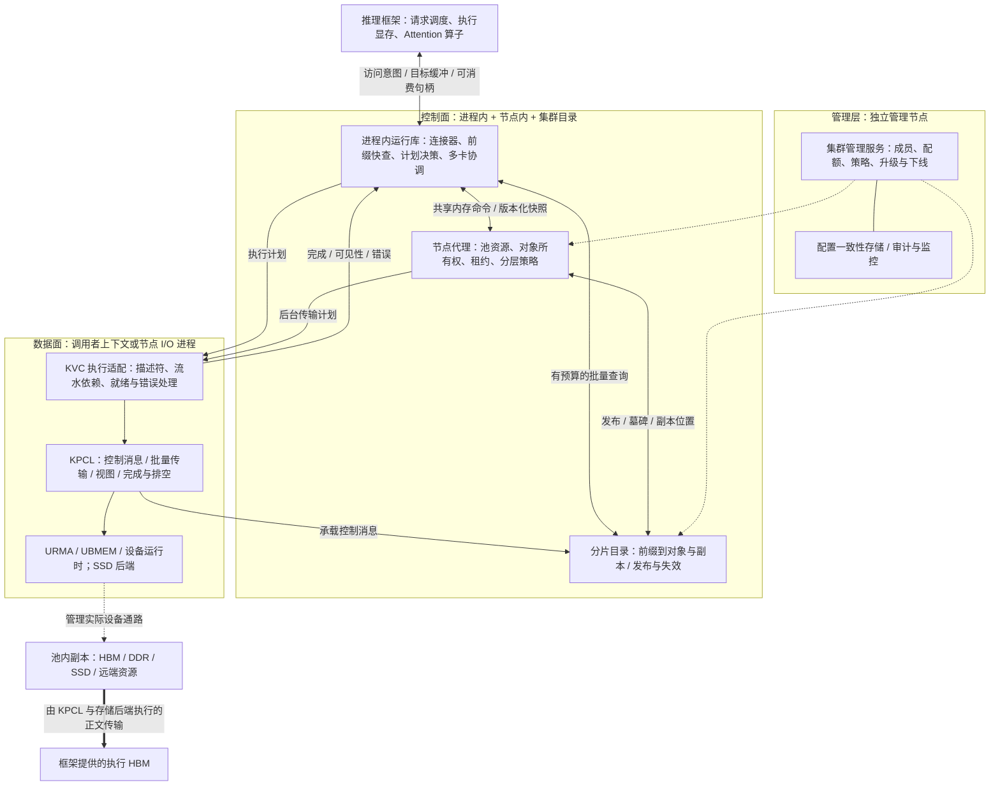
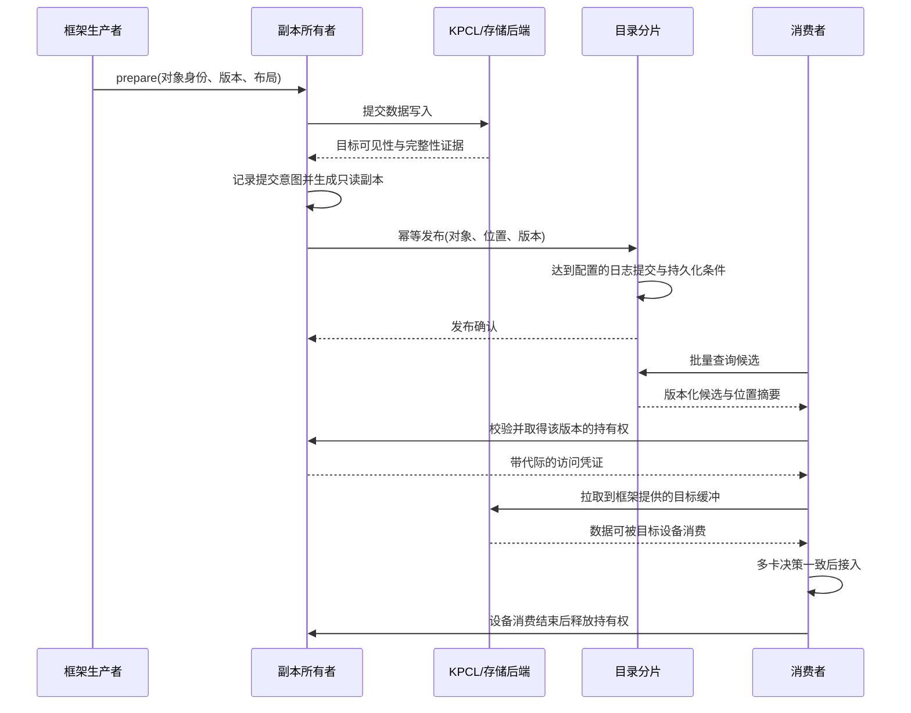
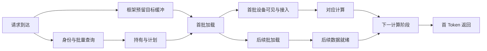

# KVC 存储池顶层架构设计与八专题分析

版本：V0.1，2026-09-06。性质：设计讨论稿。本文给出建议架构、责任划分和规格推导方法，尚未冻结进程配置、通信接口或硬件性能承诺。

KVCache（大模型注意力键值缓存，用于保存历史 Key、Value 激活状态，复用历史计算）统一异构存储池，以下简称 KVC 存储池或本软件。KPCL（面向本软件控制消息与数据传输需求、封装底层通信能力的接口库）由独立团队实现，本软件负责导入需求、调用适配与集成验收。

建议采用“进程内请求快路径、节点资源服务、分片目录、独立集群管理”的部署结构。执行中的缓存主要留在推理设备显存，跨节点复用和分层存储围绕不可变缓存对象展开。管理状态持久保存，查询状态本地复制，数据传输按硬件拓扑和请求预算执行。

全文使用三种口径：**已有需求**指受控文件明确提出的要求；**设计建议**指本稿提出的实现方案；**算例**只用于演示推导，不代表实测值。未标注为已有需求的进程名、数据结构和接口签名均为设计建议。

## 设计依据与阅读入口

| 编号 | 受控材料 | 本文用途 |
|---|---|---|
| S1 | [SRS V2.3 评审意见收敛版](<D:/codes/reports/kvcache/unified_kv_memory/KVCache SRS需求列表 V2.3_评审意见收敛版.xlsx>) | 四层共 144 条正式需求；读取各行需求描述与直接目标 |
| S2 | [全量需求树 V2.3.1](D:/codes/reports/kvcache/unified_kv_memory/统一异构KVCache存储池_全量需求树_V2.3.1_SR项目贡献补充版.xlsx) | 38 条 SR（可独立验收的系统交付组件）、203 条 AR（开发工作包），以及来源追溯 |
| S3 | [总体架构与 SRS 导读 V2.3.2](D:/codes/reports/kvcache/unified_kv_memory/统一异构KVCache存储池总体架构与SRS评审导读_V2.3.2评审稿.md) | 四层架构、Mooncake 固定基线重构路线、执行显存责任边界与验证口径 |
| S4 | [总体架构与 SRS 导读 V2.3.1](D:/codes/reports/kvcache/unified_kv_memory/统一异构KVCache存储池总体架构与SRS评审导读_V2.3.1评审稿.md) | 补充六个横向功能域、24 条 IR（需求归一化技术锚点）和已有指标 |
| S5 | [Benchmark 公共契约](D:/codes/reports/kvcache/unified_kv_memory/提前验证方案设计/验证计划方案设计/Benchmark公共契约与证据分级规范.md) | 端到端对照、统计分母、原始事件与证据等级 |
| S6 | [多流拥塞与多卡协同验证方案](D:/codes/reports/kvcache/unified_kv_memory/提前验证方案设计/验证计划方案设计/12_PVT-10_多流非等比劣化与TP8_Coflow偏斜实验实施方案设计.md) | 通信流组、拥塞与最慢子流分析；该方案明确现有测试桩为演示级 |

本次核对得到：S1 中 L1/L2/L3/L4 分别有 21/22/68/33 条正式需求，合计 144 条；其编号与 S2 的 144 条正式来源完全一致。S2 另映射 5 条工程建议，形成 149 条来源项。S1 的“软件工程开发实施建议”页实际有 21 条条目，不能将“需求树已映射的 5 条”理解为该页全部内容已经完成分解。

项目索引仍指向较早版本，S3 中也保留了部分过程目录路径。本稿直接使用 Git 受控的根目录 S1、S2、S3，不引用未受控的演进草稿作为需求依据。附录列出 38 条 SR 的部署责任，逐条来源仍以 S2“追溯与覆盖”页为准。

## 专题一：顶层架构原则与软件架构范式

### 1.1 先确定本软件统一什么

本软件统一缓存对象的身份、位置、生命周期、消费条件和访问方法。HBM（高带宽显存，承载推理设备上的执行数据）、DDR（主机内存）、NVMe SSD（通过 NVMe 接口访问的固态存储）具有不同的时延、带宽与故障特性，即便地址可以映射到一起，也不能按等价内存使用。

池内可寻址容量、已存有效缓存容量、在业务时限内可加载的容量，应分别统计。尤其是 Decode（逐字生成阶段）反复读取的活跃缓存，默认驻留执行 HBM；温冷前缀可以保存在其他介质，按收益加载。依据为 S1 的 `L1-OL-ActiveWarmClass-010`、`L3-MS-Tiering-038` 和 `L2-CONN-BufferContract-040`。

这里的“异构”首先是资源与访问方式的异构。同一个前缀在不同模型权重、位置编码或注意力语义下，通常不能复用。跨框架复用必须先确认计算语义相容，再处理数据布局转换；仅转换张量形状不足以建立语义等价。

### 1.2 架构全景图


下图表达依赖和消息关系。虚线表示管理配置，实线表示请求控制与元数据，粗线表示缓存正文。KPCL 可以传输控制消息，因此逻辑“控制面”与物理“通信库”并非一一对应。



URMA（通用远程直接内存访问，提供用户态高性能远端内存通信）和 UBMEM（本项目对统一总线内存直通共享能力的称谓，支持跨节点或异构设备共享内存访问）位于 KPCL 之下。这里不预设所有设备都支持一致性访问、远端原子操作或直接存储，这些能力必须按实际平台声明。

### 1.3 三层职责与原有四层需求的对应

| 本稿部署视角 | 原有需求层次 | 架构范式 | 设计约束 |
|---|---|---|---|
| 管理层 | 贯穿 L1～L4 的配置、运维、安全策略与工程交付 | 声明期望状态，后台控制器持续使实际状态与其一致 | 不参与逐请求读取与正文转发 |
| 控制面 | L1 调度协作、L2 连接器、L3 目录/对象/决策，部分 L4 能力状态 | 进程内快速决策；节点内分片单写；集群分片服务 | 请求读路径与持久化写路径分开 |
| 数据面 | L3 描述符和传输编排、L4 执行与可见性 | 异步任务依赖、批量传输、完成事件驱动 | Host CPU 零数据拷贝：CPU 下发控制指令，不读取或搬运缓存正文 |

四层是接口责任分解，三层是运行和隔离视角。38 个 SR 是交付组件，不对应 38 个服务进程。先让高频调用保持在同一进程中，再按设备所有权、资源争用与故障域拆分服务。

### 1.4 建议确立的设计原则

1. **请求携带预算。** TTFT（首 Token 响应时间）和 TPOT（每个输出 Token 的生成耗时）约束需要传到查询、排队和传输环节。超时后返回可解释的重算或部分复用动作，由框架决定排队、接纳或拒绝请求。
2. **对象发布后正文不可变。** 每个缓存段有唯一生产者和明确版本；生成中尚未封存的尾块保持私有，分支写入采用写时复制。迁移创建新副本，发布新位置，再回收旧位置。
3. **目录用于发现，持有凭证用于消费。** 找到位置后仍需取得与版本绑定的有效访问权。避免把缓存时效等同于对象存活。
4. **按资源拓扑选路。** 路径是带能力约束的图，允许 HBM 与 SSD 直达，也允许经过明确登记的暂存资源。DDR 的角色与占用都可单独关闭。
5. **正常逐字生成不依赖远端目录。** 已接入的执行缓存及块表由框架直接使用。迁移、撤销和续租在后台处理，只在明确安全点改变消费状态。
6. **先保证可回收，再追求少一次拷贝。** 本地线程结束不代表设备读写结束。释放前必须覆盖 Host 读者、设备事件、网络在途操作和地址撤销。
7. **跨层提供事实，不互相接管职责。** KVC 判断复用收益与池资源状态；框架拥有执行显存与算力准入；KPCL 负责设备通信能力、传输生命周期与底层错误。

## 专题二：构建拓扑、部署方式与进程实体

### 2.1 先盘点五种域

部署前分别登记管理域、安全域、故障域、互联域、资源所有权域。两块卡可以处在同一机箱，却不一定具有同样的直达能力；同一总线内存域也不自动意味着跨租户可以共享数据。

硬件导入表至少包含：节点与机架编号、CPU NUMA（非一致内存访问，表示不同处理器到内存的访问距离）关系、卡/网卡/SSD 的连接位置、PCIe（设备互联总线）交换结构、链路方向与有效带宽、总线内存映射范围、设备内存注册限制、地址隔离、页粒度、故障上报、完整性保护、队列限速和驱动版本。

PCIe 设备间直达依赖拓扑、访问控制和驱动配合。内核对跨层级域的转发有明确限制，因此“同服务器”不能作为直达证据。部署检查应读取拓扑并实际测试支持路径。[Linux PCI P2P DMA 文档](https://www.kernel.org/doc/html/latest/driver-api/pci/p2pdma.html)

### 2.2 典型拓扑搭建指南

| 拓扑 | 节点配置与互联 | 适合的验证或业务 | 部署要点 |
|---|---|---|---|
| 单节点多卡 | 推理卡、同 NUMA 网卡、近端 SSD；管理组件合设 | 对象接口、同机共享、分层和错误流程 | 可做功能验证，不能据此承诺跨节点容错 |
| 同机架计算存储融合 | 每台计算节点有卡、DDR、SSD；节点间 URMA 网络 | 前缀复用、多轮会话、本地换出与远端加载 | 本地优先；热点复制；限制其他节点占用本机设备带宽 |
| 同总线共享域 | 支持 UBMEM 的计算/内存资源，另配 SSD | 热元数据、只读快照、经验证的远端直读 | 独立验证 CPU 与设备的一致性、保护域、撤销和故障语义 |
| 计算存储分离 | 计算节点负责推理，存储节点提供 DDR/SSD，网络连接 | 大容量缓存、独立存储扩容 | 逐项计入 SSD→存储网卡→网络→计算网卡→HBM；核查存储侧是否经过 DDR |
| 多机架混合互联 | 机架内快速共享，机架间网络与远端存储 | 较大规模前缀复用和冷热分层 | 目录按域路由；限制跨机架热路径；为热点和故障重建预留带宽 |

PD 分离（将 Prefill 输入预计算与 Decode 逐字生成分别部署）在融合或分离拓扑上都可实现。它是计算角色划分，不能直接等同于存储节点划分。

共享池的 HBM 必须是设备所有者显式捐出的存储额度。框架的执行 HBM 仍由框架管理。若两者来自同一张卡，需有共同的物理容量上限和隔离配额，防止两个分配器重复承诺同一容量。

### 2.3 进程实体、数量与部署位置

| 实体（建议命名） | 数量规则 | 部署位置 | 主要责任 |
|---|---|---|---|
| `libkvc_runtime` 进程内运行库 | 每个接入的调度/工作进程加载；不新增进程 | 推理框架进程 | 连接器、前缀快查、局部计划、句柄接入、框架设备事件、多卡协调 |
| `kvc-node` 节点代理 | 每个提供或消费池资源的节点 1 个 | 计算/存储/内存节点 | 成员登记、资源配额、对象所有权、池分配器、镜像更新、生命周期与后台策略 |
| `kvc-io` 数据执行进程 | 每个 I/O 亲和域 0～1 个，按压力增加 | 存储节点默认启用；计算节点按运行时条件启用 | KPCL 上下文、存储队列、批量提交、完成处理、注册池与排空 |
| `kvc-directory` 目录服务 | 每台目录主机 1 个，承载多个逻辑分片；生产建议至少 3 台 | 独立目录节点或隔离的管理节点 | 前缀分片、对象副本发现、提交记录复制、墓碑与版本管理 |
| `kvc-controller` 管理服务 | 建议 3 个实例，单个控制任务保持唯一有效执行者 | 管理节点 | 集群期望配置、成员和分片分配、策略下发、扩缩容与下线 |
| etcd（持久化集群配置的一致性服务） | 建议 3 个投票成员 | 3 个独立故障域 | 配置、控制器选主、成员代际、命名空间授权；不保存全部热前缀 |
| 观测采集器 | 每节点 1 个现有平台实例；后端按现有平台部署 | 节点及监控平台 | 读取本地聚合指标，导出日志和采样追踪 |
| KPCL/平台辅助服务 | 由供应方部署清单决定 | 相关设备节点 | 设备发现、地址映射或通信运行服务；不混算为 KVC 自研进程 |

`kvc-io` 与进程内执行各有适用条件。若设备运行时支持跨进程导入内存并正确关联完成事件，可由独立 I/O 进程执行。若只支持在框架上下文使用目标缓冲，KPCL 的数据执行部分就嵌入该工作进程；节点代理只负责资源和控制。不能先固定侧车部署，再用一次正文拷贝解决上下文不兼容。

平台辅助服务不能遗漏。例如公开的共享内存组件说明了对 UB 硬件、UBS Engine 和 `ubsmd` 服务的依赖。这说明部署清单需要覆盖平台软件，但不能据此认定该组件就是本项目最终采用的 UBMEM 实现。[ubs-mem 官方仓库说明](https://github.com/openeuler-mirror/ubs-mem/blob/master/README.md)

**数量算例：**2 个计算节点，各运行一个 TP=8（把模型张量分到 8 张卡协同计算）实例；2 个 SSD 存储节点；3 个独立管理/目录节点。假设计算节点各 2 个 I/O 域、存储节点各 1 个 I/O 域，则 KVC 服务进程为：4 个节点代理 + 6 个 I/O 进程 + 3 个目录进程 + 3 个管理进程 = 16 个。另有 3 个 etcd、16 个既有推理工作进程，以及框架本身需要的调度/服务进程。若改用进程内设备执行，应相应减少计算侧 I/O 进程。这个数量用于说明部署算法，不是固定规模规格。

### 2.4 存储池的实际构建顺序

1. 创建池标识、安全域和容量策略，启动管理一致性服务，生成初始集群代际。
2. 启动节点代理，报告软硬件清单。KPCL 返回实测能力与限制，节点只登记可用路径。
3. 由资源所有者划出池资源；建立注册区、偏移分配器和安全域。执行 HBM 的申请仍留在框架侧。
4. 建立目录分片及副本，给节点下发带版本的分片路由与策略快照。
5. 接入框架运行库，导入目标缓冲契约，验证写入、完成、发布、加载、接入和释放。
6. 先开放受测路径，再逐项启用共享视图、SSD 分层、热点复制和混压策略。某条路径不支持时记录明确状态，并执行已配置的替代方案。

上线应具备 CPU 绑核、内存驻留、设备访问权限与磁盘挂载的可重复部署描述。采用 systemd 或容器由目标平台决定；容器编排本身不能提供设备内存可见性或精细带宽隔离。

### 2.5 进程间信息交互

| 交互 | 信息与载体 | 频率与约束 |
|---|---|---|
| 框架↔运行库 | 原生函数调用；访问意图、目标缓冲、句柄 | 请求级；逐字生成只使用已接入的本地状态 |
| 运行库↔节点代理 | 启动时本地套接字协商，运行时共享内存有界队列/快照 | 不传进程私有指针；请求携带超时和去重号 |
| 运行库/节点↔目录 | KPCL 控制消息；批量查询、持有申请、发布与失效 | 缓存未命中才远查；不用逐块远端 RPC |
| 节点代理↔I/O 进程 | 描述符句柄、执行票据、完成及错误 | 正文不进入进程间消息；地址需导入后解析 |
| 目录↔目录 | 日志复制、提交进度、快照、分片迁移 | 写入确认与持久化等级绑定；复制流与请求查询隔离 |
| 管理↔节点/目录 | 版本化配置、成员代际、排空命令、健康摘要 | 低频；高频路径不等待配置服务 |
| I/O↔I/O/远端设备 | KPCL 批量操作、完成确认、流量信用 | 与设备可见性关联；不把“已提交”当作“可消费” |

启动发现、运维 API 及开源一致性组件自身协议允许使用现有管理网络栈；KVC 自定义的高频控制和正文传输优先通过 KPCL。这样也避免出现“KPCL 启动必须先通过 KPCL 查询自身地址”的循环依赖。

## 专题三：全生命周期元数据体系

### 3.1 元数据按所有权与一致性要求组织

建议设立四类权威源：集群配置由管理一致性服务负责；前缀发布与副本发现由目录分片负责；对象物理状态与存活由副本所有者负责；执行显存和设备消费状态由框架负责。节点镜像与进程内缓存都是这些权威状态的派生副本。

“元数据放在哪里”需要同时回答权威写入位置、查询副本位置、持久化位置。将三者都写成“放在共享内存”会掩盖故障恢复与一致性问题。

| 类别 | 重要字段/数据结构 | 权威位置与维护方式 | 查询位置、持久化与关键路径 |
|---|---|---|---|
| 1. 集群成员与代际 | pool/node ID、boot ID、owner epoch、状态；键值表 | 管理一致性服务；成员变化事务更新 | 节点缓存；持久化；不逐请求远查 |
| 2. 拓扑与路径能力 | 有向路径图、介质组合、页/对齐/队列限制、可见性 | KPCL 探测，节点聚合；拓扑事件与周期刷新 | NUMA 本地不可变快照；持久化配置和能力版本，不持久化每次采样 |
| 3. 租户和安全域 | namespace、shareable、授权 epoch、key ID、配额 | 管理服务负责授权；节点负责额度消费 | 本地授权快照及预分配额度；撤销须有确认屏障 |
| 4. 模型与语义身份 | 权重版本、词表、模板、适配器、位置/注意力策略、隔离域 | 框架注册规范化身份，管理服务审核命名空间 | 身份表常驻；请求携带摘要/ID；持久化身份定义 |
| 5. 模型容量和布局 | 层、头、Token 区间、rank 分片、数据类型、量化 scale、对齐 | 框架给出真实布局；KVC 校验与估算 | 本地布局表与容量画像；版本化持久化 |
| 6. 前缀键与连续命中索引 | 父前缀摘要、Token 范围、语义 ID、对象范围；哈希/压缩前缀树 | 目录按分片发布；单分片写入串行化 | 进程热缓存、节点镜像、远端精确查询；提交日志持久化 |
| 7. 目录快速摘要 | 指纹、对象 ID、版本、就绪摘要、候选位置、代价提示 | 由已提交目录状态生成紧凑读模型 | 本地驻留；可重建；不能独立授予访问权 |
| 8. 对象逻辑头 | object ID、内容版本、生产者、封存状态、身份 ID | 对象所属节点管理，已发布字段不可变 | 节点对象哈希表；发布记录持久化 |
| 9. 副本位置与健康 | replica ID、节点/设备/tier、placement epoch、可见性、隔离状态 | 每个副本所有者单写，目录记录已确认位置 | 节点热表与目录摘要；健康即时变化可先本地拒绝 |
| 10. 逻辑到物理区间清单 | token/layer/rank 区间→region ID、offset、length | 池内分配器和布局编译器；不可变数组/区间表 | 热摘要内联，长清单按句柄读取；持久副本保存清单 |
| 11. 注册区与远端句柄 | region ID、注册代际、范围、访问域、后端 token | 资源所有者与 KPCL；大区注册、区内偏移分配 | 进程内解析表；重启后重新注册，旧句柄全部失效 |
| 12. 就绪与可见性 | layer/page/rank 位图、可见性类型、完成序号 | 执行器消费 KPCL 和设备完成事件后单写 | 本地原子位图/只读快照；崩溃后不能直接恢复为设备可用 |
| 13. 访问租约与引用 | lease ID、版本、消费者、逻辑到期、pin 数、撤销状态 | 副本所有者授予，消费者进程聚合持有 | 节点共享表 + 进程本地引用；在途状态重启时重建或隔离 |
| 14. 多卡协同状态 | group ID、请求/步骤代际、安全前缀、各卡 ready、决策 | 每卡写自己的槽位，组协调者发布本次决策 | 同机共享内存；跨机经 KPCL；临时状态不写数据库 |
| 15. 请求意图与查询计划 | deadline、目标设备、复用区间、目标缓冲、回退规则 | 请求协调者生成，计划执行时重新核对前提 | 进程本地有界对象池；只采样落追踪日志 |
| 16. 传输票据与完成 | attempt ID、各段结果、字节数、可见性、取消/排空状态 | 实际执行上下文负责 | 每队列完成环与 slab（定长对象池）；不逐段同步落盘 |
| 17. 分配器与容量额度 | 空闲位图、区间树、大小分级表、已承诺/在途字节 | 每 NUMA/设备分片单写；大额度分配给工作线程 | 本地热路径；持久介质需要可恢复分配日志 |
| 18. 迁移/淘汰任务 | 源/目标版本、迁移 ID、阶段、重试、回滚位置 | 节点生命周期控制器；幂等任务状态机 | 后台查询；关键提交状态落日志 |
| 19. 持久存储目录 | 文件/对象键、offset、length、布局、校验、持久等级 | 存储进程；顺序段、索引与提交日志 | 读索引缓存；持久化；恢复时先核对数据与日志 |
| 20. 墓碑与命名空间失效 | object/namespace epoch、失效范围、提交序号 | 目录/管理服务；批量失效而非逐对象同步广播 | 缓存代际校验；墓碑持久化至安全回收条件满足 |
| 21. 热度与成本模型 | 访问计数、复用概率、队列分位数、预测误差 | 每线程计数后聚合；离线/后台拟合 | 本地只读模型；允许有限过期；不可替代安全判定 |
| 22. 流量额度与信用 | 租户/优先级/接收端可用字节、在途上限、节流原因 | KVC 分配策略，KPCL 执行队列信用 | 工作线程本地预算；周期归还；丢失须保守回收 |
| 23. 完整性与错误证据 | 保护方式、路径、完成量、校验结果、故障定位 | KPCL/存储后端返回，KVC 决定隔离与发布 | 热路径仅处理小型证据；详细故障异步留存 |
| 24. 运维与审计 | 配置版本、发布操作、权限变化、状态追踪、指标字典 | 管理和观测服务 | 独立存储；有界缓冲与采样，不阻塞正文传输 |

源需求覆盖：S1 的 `L2-KV-SemanticIdentity-036`、`L3-MS-PrefixDirectorySchema-069` 至 `L3-SE-DescriptorFromManifest-079`、`L3-CO-KVOwnershipGC-080`、`L3-CO-RefCountLifecycle-086`，以及 L4 的注册、可见性、保护与排空需求。

### 3.2 数据结构选择：业务语义自研，通用一致性与持久化复用

| 子系统 | 建议方案 | 选择理由与边界 |
|---|---|---|
| 管理配置 | etcd 的事务、版本与成员协调 | 只承载低频权威状态；查询快路径不等待其 RPC |
| 分片目录持久状态 | 复用成熟 Raft 组件（通过多数副本提交日志的协议）+ RocksDB（嵌入式持久键值引擎） | KVC 实现目录状态机；不自研选主和日志共识；具体组件需按语言、维护和许可审查定版 |
| 目录查询模型 | 自研紧凑哈希表、连续范围摘要；框架前缀树适配 | 直接对应前缀连续性、版本、位置和代价，不在热查询中遍历持久引擎层级 |
| 节点元数据 | 分片单写 + 不可变快照 + RCU | RCU（读-拷贝-更新，通过替换快照、延迟回收旧版本保护并发读）适合读多写少的共享状态 |
| 页/区间分配 | 位图、分级空闲链表、连续区间表；按设备分区 | 低碎片与描述符合并需要明确的物理区间；先按固定页运行再增加压紧 |
| 共享队列 | 经目标平台验证的有界环形队列 | 优先单生产者单消费者；跨进程必须固定二进制布局与原子访问规则 |
| 观测 | 复用已有指标和追踪平台，KVC 定义事件字段 | 全量逐 Token 落库成本过高；保留聚合指标与有选择的原始事件 |

RocksDB 的批量原子更新和同步落盘是不同承诺；数据库写成功是否意味着断电后仍可恢复，取决于配置及存储栈。目录多数副本提交也不能替代缓存正文的持久化。[RocksDB 基本操作与同步写说明](https://github.com/facebook/rocksdb/wiki/Basic-Operations)

将读写分开后，目录提交可经过可靠复制，查询则从已提交状态派生的内存结构读取。这里仍需定义新鲜度：弱一致查询只返回候选，精确消费授权必须由有效所有者检查。不能将远端单边读等同于线性一致读。

### 3.3 键与消息格式

建议使用两级身份。完整身份在注册时规范化，分配稳定 ID；请求快路径使用 ID、摘要和代际。快指纹用于排除不匹配项，最终候选仍核对强摘要或完整规范身份。

```text
SemanticIdentity = {
  tenant_domain, share_policy, cache_salt, namespace_epoch,
  model_id, weight_revision, tokenizer_digest, template_revision,
  adapter_revision, position_policy, attention_policy,
  multimodal_input_digest, cache_format_revision
}

PrefixKey = {
  semantic_id, parent_prefix_digest, token_range, token_digest
}

ReplicaDescriptor = {
  object_id, content_version, replica_id, placement_epoch,
  node_id, owner_boot_id, device_id, layout_id, rank_partition,
  region_handle, region_epoch, offset, length,
  ready_summary, visibility_kind, integrity_policy, health
}

ControlEnvelope = {
  protocol_version, message_type, header_bytes, total_bytes,
  request_id, operation_id, attempt_id, tenant_domain,
  sender_boot_id, owner_epoch, remaining_budget_us,
  expected_version, payload_schema_version
}
```

`remaining_budget_us` 在每跳扣减耗时，使用本地单调时钟形成截止点。跨节点不能直接比较各机器单调时钟的绝对数值。若采用全局时钟，须声明同步误差并预留保护量。

本地共享内存保存偏移、ID 和长度，不保存其他进程的普通指针。跨网络使用指定字节序、定长字段和有版本的扩展区；冷元数据与管理接口可使用 Protobuf 等常见编码。协议须验证长度、区间溢出、版本和未知字段，不直接发送 C++ 对象内存。

快速目录摘要可从 64～128 字节设计起步，完整清单、授权与审计分离存放。这是布局建议。一个对象的完整清单可能包含大量区间，不能为了满足“64B 描述符”而强行塞入单个结构。

跨框架前缀键还必须包含完整上文依赖。RAG（检索增强生成，把检索内容加入模型输入）中两段相同文本位于不同上文后面，不必然产生相同 KV；多模态输入也不能只用占位 Token 区分。vLLM 的公开设计同样把父前缀、块内 Token 和额外身份因素纳入缓存键。[vLLM 前缀缓存设计](https://docs.vllm.ai/en/latest/design/prefix_caching/)

### 3.4 从生成到回收的维护流程



本地有效持有权可以复用，省去每请求远端申请；代价是所有者在持有期间保留对象、限制回收。缓存的是受约束的授权，不是无限有效的地址。

状态机建议分为对象封存状态、副本状态、访问持有状态、传输任务状态四组，以避免一个大枚举混合“某副本迁移中”和“另一个副本仍可消费”。对外提供兼容 SRS 状态名称的投影和转换表，例如旧副本 READY、新副本 MIGRATING 时允许旧副本持有，不能把整个对象错误标记为不可用。

发布顺序要求数据证据先于可消费目录记录。中途失败可重试同一个操作 ID；超时后先查询操作结果，不能假设没有提交。进程崩溃恢复时，根据日志把孤立数据识别为可重建、待回收或隔离对象。持久目录若指向已经丢失的易失 HBM，只能保留逻辑记录并将该副本标为失效。

### 3.5 多线程共享与高并发瓶颈

对热元数据采用每 NUMA 域分片、每分片单写，读者读取不可变快照。耗时操作经有界队列交给所有者，避免全局大锁、全局精确 LRU（每次访问都更新最近使用顺序）和每块一次跨进程调用。

RCU 只解决软件读者的旧对象回收。若旧区间被设备或远端传输使用，必须再等待设备完成和 KPCL 排空。实现不得用“写者修改普通字段、读者检查版本再重读”掩盖 C++ 数据竞争；采用真正不可变数据、平台验证的原子字段或受保护的数据复制。

共享表需避免不同线程频繁写同一缓存行。引用计数按消费者进程聚合，热度按线程累计，容量采用批量预留。多卡状态每卡单写独立槽位，协调者读取，避免所有卡争用同一个原子计数器。持有慢读者会增加 RCU 保留内存，需有上限和回收停滞指标。

| 瓶颈 | 对推理的影响 | 建议措施与应测指标 |
|---|---|---|
| 长前缀逐块远查 | TTFT 累积多个往返 | 父哈希/范围批查，限制分片扇出；记录实际 RPC 数和连续命中长度 |
| 热前缀集中到单分片 | 目录排队尾部增加 | 热摘要本地复制、读模型扩展、查询合并；观察最热分片而非集群均值 |
| 本地缓存/布隆过滤器陈旧 | 新对象漏检或旧对象被误消费 | 按分片代际维护快照；断档后放弃“确定未命中”的声明 |
| 一次查询读完整清单 | CPU 缓存失效与 DDR 带宽放大 | 摘要与长清单分开；测字节/查询、缓存失效、跨 NUMA 访问 |
| 远端单边读遍历链表 | 小读次数与串行往返增加 | 读固定摘要或整段不可变快照；限制指针追踪深度 |
| 高频引用与热度更新 | 缓存行争用增加 TPOT 抖动 | 持有权聚合与本地计数；测最忙核心和一致性流量 |
| 快路径动态分配/缺页 | 少量请求出现长停顿 | 预分配对象池、锁页、预触页、容量限额；记录 page fault 与分配回退 |
| 多卡状态先后完成 | 最慢卡阻塞组内计算 | 按流组及层调度；报告组完成时间与各卡差异 |

布隆过滤器的“无假阴性”只针对已完整插入的那一版集合。异步镜像缺少新发布对象时，负结果可以作为放弃复用的策略，但不能标注为当前全局目录的确定未命中。删除建议重建版本化过滤器或使用经验证的计数方案；出现更新断档即停用其精确否定能力。

目录镜像也不能仅靠 TTL 保证安全。etcd 的变更订阅有延迟，且不提供线性一致读取语义；KVC 的本地镜像同样要用版本和持有权建立安全性。[etcd API 保证](https://etcd.io/docs/v3.6/learning/api_guarantees/)

单边远读的初版建议只读取不可变目录摘要，由所有者发布新代际，并在旧读者退出后回收旧区。多次读取不一致、对象跨边界或重试预算耗尽时，转精确控制请求或放弃复用。UBMEM 上的 CPU 原子更新能否被另一节点或设备按同样顺序看见，必须由 KPCL 给出内存模型，不能直接套用单机原子语义。

### 3.6 元数据容量与处理能力的估算

元数据内存约等于：条目数×每条热摘要大小÷哈希表装载率 + 区间清单 + 过滤器 + 租约/任务表 + 旧快照保留 + 分配器开销。各项按进程内、节点内和集群副本分别计算，避免遗漏复制倍数。

算例：1000 万条目录摘要、每条 128B、装载率 0.75，单份哈希区约为 1.71GB；三副本约 5.12GB，尚不含清单和运行开销。误报率 0.1% 的理想布隆过滤器约需 14.4bit/条，该规模约 18MB；其尺寸会随条目数线性增加，SRS 中小于 50MB 的限制需要绑定容量范围。

目录请求率可估为：业务请求率×每请求远查概率×实际查询批次数 + 发布/失效/租约更新率。多卡各自重复查询、跨分片拆批和重试都要计入。目录处理能力应在热点分布、并发写入、镜像恢复、失效风暴同时存在时测量。

## 专题四：管理层、控制面与数据面的部署隔离

### 4.1 各层职责、载体与性能目标

| 层次 | 核心实体和协议载体 | 时延口径 | 隔离设计 |
|---|---|---|---|
| 管理层 | 管理服务、etcd、管理 API、审计 | 通常按配置生效/扩缩容时间计；本文不新增固定毫秒承诺 | 独立节点或核/内存配额；独立日志磁盘；请求处理不依赖其可用性 |
| 控制面本地路径 | 运行库、节点热表、共享内存队列、函数调用 | 已有目标：本地命中 <10μs、确定未命中 P99 <5μs；需要明确各指标边界 | 常驻内存、绑核、按 NUMA 分片；禁止数据库压紧和同步日志进入调用线程 |
| 控制面远端路径 | 目录服务、KPCL 控制消息/摘要读取、目录复制 | 已有目标：前缀匹配 P99 <200μs；分片排队和网络包含在内 | 控制消息有独立排队额度；复制、快照和批量查询不共用无界 FIFO |
| 数据面前台 | 进程内执行或 I/O 进程、KPCL、设备事件 | 按大小/拓扑/并发给出完成时间；已有提交目标 <50μs | 前台传输额度、接收端信用、队列和拷贝引擎隔离 |
| 数据面后台 | 分层、压紧、复制、重建的执行任务 | 受前台余量约束，兼顾后台不饿死 | 独立限速与在途上限；先减少预取/压紧，受控保留必要换出能力 |

微秒级目标来自 S2 相应组件，不等于每次远端请求都能在该时间内完成。总查询包含本地失败后远查，不能把“本地 <10μs”叠加到一个已经包含本地步骤的测量中重复计账。

### 4.2 CPU、内存和 I/O 资源诉求

CPU 核数需要由工作量推导：所需核数 ≥ 每秒操作数×每操作 CPU 时间÷目标核心利用率，再增加持续轮询的专用核和后台开销。只看全机平均 CPU 占用会漏掉单核打满。

算例：每秒 10 万次目录操作，平均每次占用 CPU 5μs，限制核心利用率到 50%，至少需要 1 个有效处理核；发布复制、序列化和热点偏斜另算。此处 10 万是元数据操作率，不是模型推理 QPS（每秒处理的推理请求数）。

DDR 带宽按元数据实际访存、队列、日志、镜像复制、注册缓冲和可选暂存分别核算。CPU 未读正文不表示正文没有经过 DDR。分别统计 `host_payload_read_bytes`、`host_payload_copy_bytes`、`host_ddr_payload_dma_bytes`，才可判断 Host CPU 零数据拷贝与绕过主机内存这两个不同目标。

执行 HBM 预算包含权重、运行时工作区、活跃缓存、框架预留和有上限的预取空间。KVC 只上报池内额度和预计加载需求，由框架提供目标区间。存储侧 HBM 则计入池分配器和注册资源。共享物理设备时须共用资源总账。

### 4.3 PCIe TLP、网络与存储的约束

TLP（PCIe 事务层数据包，是设备间实际传送读写事务的报文）的影响包括小事务固定时延、读完成往返、可用信用、队头阻塞及共享上行口争用。小元数据读取主要受串行往返次数约束，大块正文主要受瓶颈带宽和队列约束。

| 资源 | 需要导入的规格 | 对应验证 |
|---|---|---|
| PCIe 路径 | P2P 可达性、方向、负载/请求粒度、在途读上限、目标可见性 | 小读与大写混压；同根/跨根；TLB 冷热；真实设备完成 |
| 网卡/总线队列 | 可独立限速的流量类别、队列上下文容量、优先级与信用 | 控制小包 + 前台加载 + 后台回写同时压测 |
| 交换机/总线交换节点 | 拥塞反馈、出端口缓冲、路径共享、有效优先级 | 多对一突发、持续后台流、故障绕行 |
| SSD | 稳态读写带宽、不同块长 IOPS（每秒 I/O 次数）、尾时延、写入寿命 | 预处理后混合读写、近满盘、垃圾回收、后台重建 |
| 地址翻译 | 页粒度、映射数量、缓存失效、注册与撤销开销 | 大量区间、进程退出、设备重置、首次访问与长稳 |

网络队列隔离并不消除同一 PCIe 上行口、HBM 控制器或拷贝引擎的争用。已有“至少 4 个可独立限速队列对”的需求应保留，但需进一步确认它映射到哪些真实硬件调度资源。QP（通信队列对）数量和独立硬件优先级数量不能互相替代。

100ms 周期路径探测适合更新趋势，无法处理微秒级突发拥塞。KPCL 需要在实际提交与接收处执行信用和反压，KVC 则控制每类业务的额度。快速反压、周期策略和管理配置分成不同时间尺度。

## 专题五：通信模式与上层推理业务映射

### 5.1 场景应按读写依赖拆分

同一种业务可以同时产生目录查询、租约申请、大块拉取和后台写回。通信模型应由这些操作的因果关系生成，不能只给业务贴上“读多写少”标签。

| 场景 | 推理性能诉求 | 控制面模式 | 数据面模式和实现 | 关键边界 |
|---|---|---|---|---|
| 公共系统提示词复用 | 降低 TTFT，承受热点 | 多对一查询、批量资格确认、热点发布 | 首次一次加载，本地多请求共享；跨实例按需一对多复制 | 只有显式允许共享的命名空间可跨租户复用 |
| 多轮会话恢复 | 恢复时间短，减少重复预计算 | 会话→连续前缀查询、版本与持有检查 | DDR/SSD/远端→执行 HBM；部分命中后重算后缀 | 上下文变化与位置策略改变会改变可复用范围 |
| RAG 与工具模板 | 同样模板下的真实连续命中 | 批量前缀查找、语义过滤、代价比较 | 连续前缀加载；不连续段只在框架支持相应算法时复用 | 相同文段不代表不同上下文下的 KV 等价 |
| PD 分离的单次交接 | Prefill 完成后尽快开始 Decode | 目标协商、缓冲准备、各层就绪、最终提交 | 生产者向目标推送或目标拉取；按层/页流水 | 一次请求通常是一组 P→D 传输，不自动是一对多广播 |
| 分块预计算 | 降低长输入峰值等待 | 分块依赖、阶段就绪、取消消息 | Chunked Prefill（把长输入分块计算）对应分块产生/传输，设备事件驱动 | 部分层就绪能否开始计算依赖框架与算子支持 |
| 张量并行/流水并行 | 最慢参与卡不拖延整体启动 | 组内安全前缀与版本确认、小消息汇聚/广播 | 多条带相同流组 ID 的分片传输 | 部分卡失败须统一选择安全边界；不重实现模型数学集合通信 |
| 多分支生成/多 Agent 共享 | 降低重复加载与内存占用 | 共享句柄申请、消费者登记、分支状态 | 一源多消费者或树状中继；分支增量各自私有 | 不覆盖共享前缀；各分支有独立引用和完成事件 |
| 缓存换出与恢复 | 降低显存压力，控制恢复尾时延 | 水位、候选评分、目标预留、发布状态 | HBM↔SSD 批量 I/O；DDR 按角色使用 | 换出速度跟不上生成速度时需要准入反压 |
| 投机预取 | 把加载与排队重叠 | 到达预测、预算/容量预留、取消 | 可取消低优先级拉取 | 误预取既占带宽也占 HBM，必须记录浪费字节 |
| 后台迁移/压紧/副本重建 | 前台 TPOT 稳定，系统恢复能力可控 | 任务票据、双位置记录、版本切换 | 有界一对一搬运；恢复时可能多对多 | 不影响旧副本读；完成旧读者排空后回收 |
| 弹性扩缩容/模型切换 | 新节点可用，旧版本不误命中 | 加入、目录重分片、命名空间失效、排空 | 预热、复制或冷恢复 | 目录迁移与正文迁移分别调度，避免同时放大流量 |
| 连续活跃 Decode | TPOT 稳定、低抖动 | 常态使用已接入句柄；后台续租/故障通知 | 常态本地 HBM 访问；远端直读仅对白名单开放 | 每 Token 远端查询或全局锁不应进入正常执行路径 |

### 5.2 推送与拉取不能由底层单独决定

远端前缀复用优先采用拉取：消费端明确目标缓冲、截止时间和可接受布局。PD 分离可采用生产者推送，但必须先收到目标端授权、容量信用与缓冲句柄，不能向已退出请求继续写入。

同一节点、同一设备上的多个请求可以共享一次加载结果；跨设备是否能共享同一个映射取决于硬件和运行时。实际需要独立副本时，应如实统计多次搬运。软件树状中继可减轻源端发送压力，但全网与接收端总传输量仍随目标数增加，不能宣称端到端字节数恒定。

### 5.3 控制与数据的耦合点

正常流程依次建立：目标缓冲可用、源副本可持有、传输获准、数据达到目标设备可见性、多卡状态一致、框架接入。为了减少往返，可以合并“候选查询与短期持有”“分配与注册句柄导入”“完成与就绪通知”，但每个逻辑条件仍须可单独验证。

取消也是协议的一部分。请求超时先停止尚未提交的工作，已提交工作等待完成或排空。框架收到“逻辑已取消”后，仍不能马上重用可能被设备写入的目标缓冲。应另有“缓冲已可安全回收”的通知。

## 专题六：KPCL 的通信流量抽象与能力诉求

### 6.1 本软件与 KPCL 的责任边界

| KVC 负责 | KPCL 负责 | 联合验证 |
|---|---|---|
| 对象语义、前缀连续性、复用收益、版本与持有策略 | 通信上下文、内存导入/注册、受保护地址、设备操作 | 句柄在重注册、迁移和进程退出后的有效性 |
| 哪个请求/层/副本先传，流组成员与截止时间 | 有界排队、分片批量执行、完成、反压和实际流量等级 | 组内最慢流、前后台混压和截止时间违约 |
| 对象发布、隔离、重算决策 | 底层错误、部分完成、可见性、撤销/排空证据 | 不消费半写数据；取消后无迟到写破坏新请求 |
| 前缀目录状态机及其可靠复制策略 | 为自定义控制消息提供可靠传输或明确的可靠性边界 | 重复消息、丢失响应、重连与协议版本 |
| 请求与对象的可观测字段 | 实际后端、字节数、队列等待、重试、Host 参与证据 | 从业务请求追到设备路径的归因 |

KPCL 不需要理解模型权重或决定哪个前缀值得复用，但应保留 KVC 传下来的请求、流组、优先级和依赖信息。底层只看到无关联的字节流，会失去优化多卡整体完成时间的依据。

公开 URMA 说明包含单边、双边和原子操作。本文据此把这几类能力列为可协商项，没有假设某个版本支持任意内存类型、远端可见性或吞吐指标。[UMDK 官方仓库](https://github.com/openeuler-mirror/umdk)

### 6.2 八类典型流量模型

下表的规模是**建议的压测扫描范围**。S1 已提出 64B～4KB 元数据、0.5～8MB 批量块的粒度分发思路；其余范围用于找出拐点，应以导入业务的真实分布校准。

| 模型 | 控制/正文规模与访问方式 | 到达与拓扑 | 关键性能指标 | KPCL 能力诉求 |
|---|---|---|---|---|
| F1 小控制消息 | 64B～4KB；请求/应答、授予/撤销、就绪通知 | 随请求突发；一对一、汇聚/广播 | 往返 P99/P99.9、消息率、排队上限 | 独立控制额度、有界缓冲、错误与截止时间传递 |
| F2 批量元数据查询 | 多个前缀键，响应可到数十 KB；需扫描更大批次 | 热点偏斜、多读少写、更新风暴 | 一批完成时间、字节/查询、分片扇出 | 批量消息、受限单边快照读、分页上限、版本标记 |
| F3 一对一大块加载 | 0.5～8MB 合并块，聚合对象可达 GB；内存→HBM | 与请求到达关联；异步 burst | 有效带宽、CPU 提交、目标可见时间 | 散聚传输、批量提交、预注册、边界校验 |
| F4 分层/分块流水 | 建议扫描 64KB～8MB chunk；有先后依赖 | 生产/加载与计算重叠，首批有更早时限 | 第一可计算批到达、流水空等、总完成 | 按段完成、依赖事件、有界预读、细粒度信用 |
| F5 多对一与多卡协同流组 | 多源或多路径，组内分片可不等大 | 扫描 1/2/4/8/16 个发送者及并发流组 | 组完成 P99、最慢流、丢包/重传、超时率 | 接收端反压、流组标识、相关流调度、拥塞反馈 |
| F6 一对多分发 | 1 源→2/4/8/16 目标；公共只读对象 | 热点到达/预热，消费者快慢不一 | 源端字节、全网字节、逐目标完成 | 软件中继或多播能力声明、逐目标结果、慢目标隔离 |
| F7 存储与后台混压 | 建议扫描 4KB～16MB I/O，读写比例和持续速率可变 | 前台冷恢复 + 后台回写/重建 | 前台尾时延、后台进度、IOPS、写放大 | 存储适配边界、前后台信用、队列限速、背压与取消 |
| F8 只读视图访问 | 64B～4KB 摘要或页；另扫短 KV 区间和重复读次数 | 随机/顺序、热/冷映射、多读者 | 首次/稳态访问、设备停顿、撤销排空 | 只读受保护映射、内存模型、故障通知、访问计数 |

Coflow（协同传输流组，服务于同一计算步骤的一组相关子流）与 Incast（多个发送者同时向同一接收点发送而形成的多对一拥塞）应分开标记。一个流组可以跨多个接收端；多个无关请求也可能在一个接收端形成拥塞。KPCL 的调度输入要同时包含组标识和物理竞争路径。

### 6.3 可交给 KPCL 团队的工作负载描述

每个样本至少记录以下维度：

```text
业务关联：scenario_id, request_id, coflow_id, rank_id, layer_range
空间维度：src/dst_node, src/dst_device, src/dst_tier, topology_profile
大小维度：logical_bytes, physical_bytes, segment_count, alignment,
          segment_size_distribution, compression/layout_transform
时间维度：arrival_process, burst_window, deadline, dependency_edges,
          first_chunk_deadline, expected_reuse_count
并发维度：active_peers, in_flight_bytes, concurrent_groups, fanout,
          read_write_ratio, hotspot_distribution
语义维度：traffic_class, required_visibility, security_domain,
          allowed_fallbacks, durability, cancellation_policy
结果维度：queue_wait, submit_time, completion_time, visibility_time,
          bytes_completed, retries, per_target_status, actual_path
```

必须同时交付单类扫描和组合回放。例如 F1+F3 验证小消息是否被加载阻塞，F3+F7 验证前台与 SSD 回写干扰，F4+F5 验证多卡流水最慢子流，F6+F7 验证节点扩容预热与后台重建。组合负载使用同一时间线，保留实际相关性，而不是把各类平均带宽相加。

### 6.4 建议接口族与完成语义

以下为需求接口草图，不是已存在的 KPCL API。

| 接口族 | 建议输入/输出 | 必须明确的契约 |
|---|---|---|
| 能力与上下文 | `query_capabilities(profile)`、`open_context(domain)` | 内存类型、对齐、最大分段、线程/进程使用规则、版本兼容 |
| 内存导入 | `import_region(owner_handle, permissions)` | 所有者、范围、代际、目标设备、注册成本和释放条件 |
| 控制消息 | `send_control(peer, envelope, body)` | 消息大小、可靠性、顺序作用域、重连重复与超时语义 |
| 批量传输 | `submit_batch(segments, context, options)`→ticket | 散聚、部分提交、部分完成、线程亲和、是否会隐式暂存 |
| 依赖流水 | `submit_group(group, dependencies, deadlines)` | 不要求跨网卡原子启动；要求依赖正确、有界提交偏差和组结果 |
| 只读视图 | `acquire_view(region, access_scope)`→view | 映射、可见性、租约绑定、硬件隔离与故障恢复边界 |
| 完成与可见性 | `poll/wait`、`ensure_visibility(target_scope)` | 本地完成、源可复用、目标设备可消费、持久完成分别报告 |
| 取消与排空 | `cancel(ticket)`、`drain(context)`、`revoke(region)` | 逻辑取消和物理安全结束分离；回调不丢失且最多交付一次终态 |
| 服务质量与观测 | `set_credit/class`、`query_stats` | 队列等待、实际限速、重试、Host 参与、路径与设备错误 |

设备操作完成和可见性不是总能排成一条简单的递增等级。远端内存可见、目标设备可见与持久可见可能针对不同目标。接口应使用明确的目标与证据类型，不能靠一个含义模糊的 `done=true` 掩盖差异。

KPCL 不需要实现分布式业务“恰好一次”。KVC 用操作 ID、预期版本和目标代际实现幂等；KPCL 说明消息是否可能重复、传输是否可能部分完成。对未知结果，先查询票据或隔离目标，再由 KVC 决定重试。

SSD 范围需要单独定界：若 KPCL 包含存储传输扩展，则统一接入；若它只提供 URMA/UBMEM，KVC 的 SSD 后端负责文件/段管理与存储命令，跨节点内存通信仍经 KPCL。远端 SSD 不能仅凭一个 RDMA 内存句柄视为可直接读取。

### 6.5 依赖应分成必需与条件能力

首个可交付闭环需要能力发现、受保护句柄、可靠小消息、批量异步传输、目标可见性、完整性证据、错误、反压、取消排空和实际路径统计。硬件多播、跨设备原子操作、零拷贝视图、硬件地址重映射、DPU（可承担通信或安全卸载的数据处理器）加速按平台单独启用。

软件批量提交可以减少启动偏差，不能保证不同网卡在同一时刻原子执行；控制面多卡同意也不等同于硬件提交原子性。KPCL 应提供可测量的提交偏差和组完成结果，避免将“原子 Doorbell”写成缺乏设备依据的必选能力。

## 专题七：端到端性能规格的逐层拆解

### 7.1 业务输入先于模块指标

SLO（服务等级目标，约束请求延迟、成功率等业务指标）必须绑定模型、硬件、输入/输出长度分布、到达率、并发、前缀复用分布和后台负载。只有“TTFT 降低 20%”不能唯一推出网卡带宽或每个模块的微秒预算。

业务导入表需要填写：TTFT P50/P95/P99、TPOT 分布及统计粒度、成功请求率、满足所有 SLO 的有效 QPS、长短请求比例、超时规则、失败和重算是否计入分母。低命中请求不能从整体报告中剔除。

性能预算分两组：首次接入缓存的预算控制 TTFT；持续生成中设备争用和异常处理的预算控制 TPOT。命中查询结束并不意味着后续加载自动有收益。

### 7.2 用实际依赖图计算首字延迟

对完全串行的冷启动加载，首字延迟可以逐项记账：

```text
TTFT = 入口处理与排队
     + 前缀身份计算与查询
     + 资格校验与持有
     + 计划、布局编译与提交
     + 数据加载及必要转换
     + 目标设备可见性与接入
     + 必要的多卡等待
     + 未复用部分的预计算
     + 首 Token 生成与返回
```

其中查询、目标缓冲分配、计算、加载可能重叠。正式模型用 DAG（有向无环图，表示处理步骤之间的先后依赖）：一个步骤最早完成时间 = 自身耗时 + 所有前置步骤完成时间的最大值。最终取首 Token 返回节点的完成时间，不能将并行分支简单相加。

分层流水按每层真实依赖计算：某层开始时间不早于该层所需 KV 全部可见、前层输出就绪及本层必要多卡同步的完成时间。未受支持的运行时按整段加载建模，不预先扣除假定的重叠收益。



复用准入的判断是：**拉取与加载总开销 < 本地直接重算耗时，并且请求仍能满足剩余业务预算。**总开销包括已经花掉的查询时间、持有、转换、接入、同步、排队和对前台的干扰。已经花掉的时间在下一步选择中是沉没成本，但必须计入该请求整体是否仍有净收益的对账。

### 7.3 不能把各模块 P99 相加当作端到端 P99

P99 是分位数，不是确定性上界。十个模块各有 1% 的超预算概率，串起来不能保证整体只剩 1%。模块之间还可能因同一次拥塞而相关。

建议同时采用两种验证：

1. 从同一请求的原始事件重建关键路径，直接计算端到端分位数。
2. 给关键阶段分配时间预算和超限概率。若阶段 i 超过其预算的概率不高于 εᵢ，且所有预算满足关键路径时限，那么利用并集上界，整体超限概率不高于各 εᵢ 之和。该上界不要求各阶段独立，但可能较保守。

例如要把整体超预算概率控制在 1%，分配给各阶段的概率总和必须不大于 1%，还要计入排队和失败路径。可按风险分配，不能默认全部采用 P99 即可。并行依赖使用最长路径预算，序列分解时还需避免重复计入共享等待。

### 7.4 一份可复算的预算算例

以下全部数值为**示例输入**，不是业务方已给定的绝对 SLO，也不是已测性能。假设同一代表请求本地重算 TTFT 为 300ms，目标为 240ms；入口和排队 60ms，复用后剩余预计算 40ms，首 Token 生成与返回 5ms。剩余缓存接入预算为 135ms。再保留 15ms 的业务波动余量，得到 KVC 路径预算 120ms。

| 环节 | 示例预算 | 责任主体与测量边界 |
|---|---:|---|
| 前缀身份/查询与资格、持有 | 0.200ms | 运行库、目录、对象所有者；从开始判断到拿到有效候选/持有 |
| 路径与副本成本决策 | 0.005ms | KVC；不包含上项远端查询 |
| 意图归一化与分发 | 0.003ms | KVC；已经协商好的字段处理 |
| 布局检查和描述符编译 | 0.020ms | KVC；与区间数量绑定，需实测可达性 |
| KPCL 提交 | 0.050ms | 从调用到接受执行；队列内等待另计 |
| 排队、正文传输和必要布局转换 | 105.000ms | KPCL、设备与存储后端；算例暂设无额外布局转换 |
| 可见性证据完成 | 0.400ms | KPCL/设备运行时；不能只测 CPU 收到通知 |
| 数据到齐后的多卡状态协调 | 0.100ms | KVC 组协调；数据未到齐的等待已经在传输项计入 |
| 接入运行时 | 0.222ms | 框架块表/句柄更新和安全点切换 |
| 路径内部不确定性余量 | 14.000ms | 覆盖尚未校准的尾部与执行变化 |
| 合计 | 120.000ms | 时间分配示例，不是各环节 P99 相加证明 |

0.200ms、0.005ms 等取值参考已有查询/决策目标进行试分配，不能理解为现有 SRS 已承诺整个组合环节达到这些数值。若身份计算、授权往返或描述符规模无法满足，应提前计算、合并往返、改用有效本地持有，或重新分配预算并提出规格变更。

### 7.5 从模型字节数反推通信能力

对于常规全层注意力缓存，一个 Token 的全模型缓存字节数可估为：2×层数×KV 头数×每头维度×每元素字节数，系数 2 对应 K、V。实际还需加入 padding、量化参数、分片复制和布局开销。

该式不能直接用于 MLA（多头潜在注意力，以压缩潜在状态保存缓存）、滑动窗口或混合循环状态模型。这些模型使用框架报告的真实缓存布局与每 rank 字节数。TP 分片也不能一律把总字节数除以卡数，某些布局会复制 KV 头。

延续算例，假设 32 层、8 个 KV 头、每头 128 维、2B/元素、复用 8192 个 Token，则全模型缓存为 1GiB。若恰好均匀分到 8 个 rank，每卡 128MiB。

在 105ms 的传输窗口中，1GiB 对瓶颈路径要求的最低有效带宽约为 10.23GB/s，尚未增加排队、重传与转换成本。若按有效利用率 80% 规划，原始链路至少需约 102.3Gb/s。单条标称 100Gb/s 链路按该效率不够满足这一窗口。

这里的瓶颈可能是源 SSD、存储侧 PCIe、源网卡、交换机出端口、目标网卡、目标 PCIe 或 HBM 写入能力。路径带宽取各段有效能力的最小值，多跳串行暂存还要增加额外阶段。多张网卡若共享同一个 PCIe 上行口，不能简单相加。

**持续承载另算。**假设某目标路径每秒处理 100 个请求，其中 50% 需加载 1GiB，持续正文需求约 53.69GB/s。单条 400Gb/s 链路在 80% 效率下仅有 40GB/s，即使单次加载时延合格，长期排队仍会增长。需要减少加载字节、改善本地命中、扩展独立瓶颈资源或限制接入速率。

### 7.6 从通信负载反推 KPCL 和驱动规格

| 模块 | 从上层导出的约束 | 必须一起交付的条件 |
|---|---|---|
| 本地索引 | 本地预算 ÷ 查询次数；每秒查询率与每查访存字节 | 条目数、装载率、热点、更新比例、NUMA 与缓存冷热 |
| 远端目录 | 查询剩余预算 − 本地处理 − 两端排队 | 最大串行往返次数、每批键数、分片扇出、提交新鲜度 |
| 描述符编译 | 描述符预算 / 最大区间数，或固定项 + 每区间成本 | 合并前后数量、对齐限制、最大分段与内存分配行为 |
| KPCL 提交 | 每秒操作数、每批段数、提交 CPU 时间 | 批等待上限、线程数、队列数、是否跨进程 |
| URMA 数据路径 | 最大突发字节 / 剩余传输窗口；持续字节率 | 消息尺寸、方向、并发、流组、共享瓶颈与重试 |
| UBMEM 视图 | 串行访问次数×每次访问尾时延，外加翻译与停顿 | 读次数、局部性、缓存冷热、页数、一致性和故障模型 |
| 完成/可见性 | 最后字节到目标设备实际可读的预算 | 目标设备、运行时、通知机制、fence 类型与关联序号 |
| SSD 后端 | 需要加载的字节和 I/O 数 / 恢复窗口 | 连续性、块长、读写比例、稳态尾时延、容量占用 |
| 硬件队列 | 活跃 peer/线程/流量类与并发操作数 | 上下文缓存、独立调度资源、信用、速率限制 |
| 故障回退 | 请求剩余时限 − 安全排空 − 备用路径/重算 | 错误检测边界、迟到完成、目标缓冲不可重用时间 |

在途字节至少覆盖带宽时延积：有效带宽×反馈往返时间；对应最小在途操作数约为该字节数÷单次传输大小，向上取整。算例：40GB/s、20μs 反馈、64KiB 单次操作，需要约 13 个在途操作维持发送。这是单路径理想估算，不是 13 个 QP；多流共享缓冲和拥塞限制还需单独计算。

接收端信用按可写缓冲和可承受排队时间限制总在途量。在近似恒定服务速率下，队列等待预算约等于排队字节÷实际可服务带宽，因而允许积压字节应受“剩余排队预算×保留带宽”限制。对于突发和变速链路，以实测到达曲线和服务曲线校准，不能只使用平均带宽。

### 7.7 TPOT、QPS 与抖动的拆解

TPOT 的新增成本主要来自共享 HBM/PCIe/网络争用、运行时阻塞、设备页故障、多卡等待，以及必要的接入/撤销事件。正常执行不反复查询目录，但后台负载仍可能拉长每个 Token 的设备执行时间。

若纯前台 TPOT P99 为 20ms，3% 干扰目标对应 0.6ms 的分位数差值。这只是敏感性算例，不能据此为每个后台模块各分配 0.6ms。先测总干扰，再通过关闭预取、迁移、回写、追踪等消融实验找出来源。

对 TP=8 流组，整体完成时间取从共同组起点到最后一个必要子流完成的时刻。若只测每条子流从自身提交开始的耗时，会漏掉启动偏差。多卡状态同步的 <100μs 应明确是否从所有数据到齐后开始计时，不能把传输差异隐藏到指标之外。

查询混合分布、流组最大值分布和单请求逐 Token 分布要分别统计。不能用“各类路径 P99×命中率求和”得到整体 P99；不能把“每组最大值/均值的 P99”与“组完成 P99/所有子流均值”混为一个偏斜指标。S6 中已有后一口径，后续应同时给出定义和原始组样本。

吞吐上限同时受算力、执行 HBM、目录操作率和各路径字节率约束。Little 定律（稳态平均在途请求数等于平均到达率乘平均停留时间）可用于初步核对并发与容量，但不能直接推出尾时延。最终报告总 QPS、成功 QPS 和满足业务 SLO 的有效 QPS，避免用大量超时请求提高吞吐数字。

### 7.8 已有指标如何落到验收

| 已有目标 | 来源位置 | 本稿的测量解释 |
|---|---|---|
| 本地命中 <10μs；确定未命中 P99 <5μs | S2“SR系统设计”第 28 行 | 指定缓存条目数、快照代际与命中条件；包含实际线程排队时另报 |
| 前缀匹配 P99 <200μs | S2 同页第 27 行 | 报告入口到结果边界；身份计算、远查与持有是否包含须显式声明 |
| 策略 P99 <5μs；预测误差 <20% | S2 同页第 9 行 | 固定候选数和输入快照；分开记录决策自身耗时与预测误差 |
| 路由 P99 <3μs | S2 同页第 18 行 | 使用已缓存能力；不在调用中同步硬件探测 |
| 提交 <50μs；有效带宽≥线速 80% | S2 同页第 14 行 | 绑定批量大小、消息尺度和拓扑；提交与数据完成分别测 |
| 多卡等待 P99 <100μs | S2 同页第 35 行 | 记录共同组起点、数据到齐、状态决策三类时间 |
| 目录可用性≥99.99%；故障切换不丢记录 | S2 同页第 29 行 | 明确成功查询定义、统计窗口、已确认提交和可承受故障数 |
| TTFT 降低≥20%、QPS 提升≥10%、TPOT 干扰<3% | 项目阶段要求、S4/S5 | 前两者对原生 Mooncake 混压；干扰对同一增强包纯前台 |

每个下层规格应交付一张契约卡：需求 ID、消费者、路径、消息尺度、并发、起止事件、分位数、预算/超限概率、异常语义、验证环境和证据。规格验证后才能登记为该平台的硬件能力。

### 7.9 本轮需要提交评审收敛的事项

| 问题 | 具体依据 | 建议处理 |
|---|---|---|
| KPCL 新责任边界 | 本次架构输入将底层库实现交给独立团队；S2 原有若干 SR 直接交付 Provider | 保留原能力验收，拆分“KVC 语义适配 / KPCL 库 / 平台驱动”交付责任；不要直接删除原 SR |
| 目录双副本与可靠提交 | S1 `L3-MC-PFX-REPL-004` 指定 N=2、副本切换 5s；S2 要求不丢已确认记录与高可用 | 本稿建议三投票副本；作为需求变更建议。若保持双副本，必须引入外部仲裁/隔离并明确故障期停止哪些写入 |
| 设备/厂商接口混用 | S1 `L4-RDMA-P2P-NPU-001` 存在“NVIDIA NPUDirect”等混写，若干描述出现未核实的设备接口名 | 转成中立能力契约，平台清单填写实际 API、版本和证据 |
| 部分指标未量化 | `L4-HW-NICSpecConstraint-075` 的上下文数写为“充足”，部分目标为“受SLO约束的比例” | 依据 peer/队列/流量类规模填具体数值、范围和统计分母 |
| 索引计算预算冲突 | `L1-VLLM-PFX-IDX-005` 描述含 0.5ms 哈希计算目标，同时目标列写前缀判定 <200μs | 区分预计算与请求关键路径；通过事件依赖证明确实隐藏，或修改预算 |
| 元数据 200ns 指标边界不清 | S1 若干 L2 条目将转换/序列化 <200ns 用作直接目标 | 限定为定长结构本地转换，另测 RPC、完整身份计算与清单处理 |
| 迁移干扰 5% 与总门禁 3% | S2 生命周期/一致性组件目标含 <5%，服务质量和项目门禁 <3% | 组件先测独立开销，系统混压仍遵守更严格的 3%；不能相加分配 |
| 工程建议映射不完整 | S1 工程页 21 条，S2 纳入 5 条 | 单独完成 21 条的适用性与重复项审查，不将未分解条目冒充已有覆盖 |
| 验证主题统计滞后 | S3 为 10+1；后续受控目录已加入多流拥塞专题 | 本文引用具体方案和证据状态，不沿用旧总数作为最新覆盖声明 |

这些属于规格和责任收敛事项。本稿不修改原 SRS，也不将示例预算写回为正式门槛。

## 专题八：管理面、控制面与数据面的可靠性

### 8.1 故障模型与安全不变量

至少覆盖进程崩溃、节点掉电、网络分区、设备重置、通信超时/乱序/重复、SSD 部分写入、地址重注册、跨租户访问、目录镜像滞后、运行时无法取消和观测系统不可用。

安全不变量如下：未达到所需可见性和完整性条件的副本不得消费；旧代际不能授予新的有效访问权；持有者或硬件在途访问未结束时不得复用物理区间；多卡对消费区间与版本必须形成一致决定；不能确定操作结果时保留隔离状态。

租约过期表示不再允许新的持有或提交，不自动表示设备已经停止访问。清除引用也必须基于真实生命周期，不能靠超时强行把引用计数设为零。

### 8.2 管理层可靠性

管理服务采用多个实例，配置和任务意图持久化，变更使用幂等操作 ID。选主后的执行者带递增所有者代际，节点拒绝已被新代际取代的管理命令。

管理服务失去多数派时，停止更改所有权、增加授权和启动新的高风险迁移。节点在已有有效配置和权限范围内继续本地服务；不依赖管理服务的已接入执行可以继续。涉及撤销时限的授权必须有明确有效期和刷新规则，不能无期限沿用旧安全配置。

配置备份包含命名空间、分片布局、策略、协议版本和凭据引用。恢复时提升集群/节点代际，旧地址句柄重新验证，不能把备份中的易失内存地址直接恢复为可用资源。

### 8.3 控制面可靠性

目录生产方案建议每分片三个投票副本，允许一个副本故障下保留多数派。多数副本持久提交后才确认发布；读取副本可使用已提交快照，但只有通过新鲜度与对象持有校验才允许消费。目录本身的高可用不能保证正文副本仍然存在。

建议采用有限能力的单所有者授权：副本所有者拥有与集群代际绑定的服务期限，消费者获得的持有权不能超过该期限。失去有效所有权后，旧进程停止新授权；接管前等待旧授权失效或完成物理访问隔离。若不能证明旧设备操作已停止，就隔离该资源，不让新进程立即覆盖。

跨节点时钟有误差，授权到期与撤销不能只依赖双方墙钟相等。需要由 KPCL/平台提供撤销确认，或按保守相对期限与误差界控制授权。即使时间到了，区间回收仍需设备静止证据。

目录失效通过命名空间代际和墓碑传播。只有相关镜像越过失效提交点，或其授权已失效且资源已完成隔离，旧墓碑才可删除。镜像在日志压紧后追不上时必须重建完整快照，不能从中间序号继续拼接。

对象发布和目录提交不强求一个跨设备分布式事务。采用数据先完成、幂等发布、孤儿对账回收的流程：安全性由可见性和版本保证，恢复由提交记录和所有者扫描完成。该流程可以产生暂时不可发现的有效数据，但不能产生被当作可消费的半写数据。

### 8.4 数据面可靠性

```text
停止新提交
  → 标记对象/队列进入排空
  → 取消尚未提交的任务
  → 等待在途完成，或由设备/驱动确认失败并终止访问
  → 撤销映射和注册句柄，完成可见性/地址失效
  → 确认所有本地读者、远端持有者及设备读写已退出
  → 安全擦除或隔离旧区间
  → 回收资源，发布新的代际
```

安全释放期间的限流和不可用时间计入故障恢复指标。若设备不支持有界停止，进程隔离或设备重置可能成为唯一可验证的终止方式；该平台不应开启要求快速安全撤销的视图模式。

远端直读的 CPU 页异常与设备访问故障分别处理。CPU 的 SIGBUS（总线或映射访问异常信号）处理器不能保证恢复 NPU（神经网络处理器）上的异步内核故障，更不能在信号处理器里完成复杂重算。KPCL 必须报告设备运行时错误、队列状态和哪些缓冲可安全复用。设备上下文受损时由框架重建执行实例。

同一请求切换路径时使用新的 attempt ID；旧传输完成即使迟到，也只能影响旧目标代际。若仍可能发生迟到写，则保留旧目标缓冲到排空结束，不能单靠软件忽略回调来保护新请求的数据。

### 8.5 按故障对象确定降级动作

| 故障 | 发现与隔离 | 可继续的工作 | 恢复动作与验收重点 |
|---|---|---|---|
| 管理实例崩溃 | 选主和任务代际 | 已生效配置下的请求 | 幂等接管，不重复下线或分配 |
| 目录多数派丢失 | 查询/提交超时与健康检查 | 有效本地持有和已接入执行 | 禁止新权威写；恢复提交日志与镜像；请求有界重算 |
| 目录单副本滞后 | 提交序号/镜像水位 | 其他副本或本地候选 | 不把滞后摘要作为授权；追赶或重建 |
| 节点代理重启 | boot ID 变化 | 框架已拥有的独立本地执行缓存 | 池句柄重新注册；旧共享表整体失效，避免引用复活 |
| 网络断链/部分完成 | KPCL 按段错误与实际完成量 | 不相关请求、其他已验证副本 | 同请求预算内改选；旧目标排空；缺段不可接入 |
| 多卡一张卡失败 | 组代际、ready 位图与超时 | 不相关实例 | 统一取消或安全前缀重算；保持集合通信步骤一致 |
| SSD 半写/损坏 | 持久记录和完整性证据 | 其他副本或重算 | 隔离坏副本；无证据不得标 READY；重建受控限速 |
| 设备重置/远端视图故障 | 设备事件和地址代际 | 未受影响的设备/实例 | 停止引用旧映射；框架处理上下文恢复 |
| 容量或队列耗尽 | 已承诺容量与队列上限 | 有额度的请求 | 先停预取，返回 BUSY/重算建议；由框架准入限流 |
| 观测系统不可用 | 丢弃/积压计数 | 正常服务 | 本地有界缓冲；验证报告标证据不足；不阻塞传输 |

回退到重算不保证容量压力消失，重算仍需要执行显存和算力。KVC 返回重算建议后，框架必须再进行资源准入。在已输出 Token 后恢复会话，还涉及框架保存的上下文、采样状态和已返回输出进度，不能由存储池单独承诺无感恢复。

### 8.6 恢复指标分层定义

RTO（恢复时间目标）分成请求级停止等待、路径切换、服务恢复、资源安全回收四个时间；RPO（可容忍数据损失范围）分别约束管理配置、已确认目录记录、持久正文与可重算的易失缓存。

请求不能等目录 5s 切换后才决定回退。即使集群后台恢复允许秒级，当前请求仍在剩余预算耗尽前放弃远查。已有路径切换 <200ms、混沌回退 <500ms 等指标都需要绑定测量对象，不能替代更短的业务截止时间。

目录的“已确认记录不丢”应限定于设计可承受的故障数，且与多数持久提交配置相符。缓存正文是否复制、是否持久化由业务等级决定；易失缓存掉电后允许重算，但该损失要进入有效命中率和服务恢复报告。99.99% 可用性需指定统计窗口、负载、成功定义和故障模型，仅部署三个副本并不能证明达标。

### 8.7 验证安排与首版实现范围

沿用四个核心验证阶段：E0 确认复用净收益；E1 打通真实数据路径、对象发布和多卡状态；E2 验证选路、SSD 分层和视图安全边界；E3 在前后台混压中验证完整推理指标。功能模拟、局部设备实测、代表性系统实测分别标记，不混用证据。

首版实现建议包括一套框架连接器、一个节点代理、对象/副本/持有状态、分片目录原型、KPCL 适配接口、至少一条真实正文路径，以及超时、取消排空和错误回退。先用本地执行 HBM 加载闭环验证责任边界，再引入跨进程设备执行和远端视图。

可靠性测试需主动覆盖：发布每个步骤后崩溃、旧版本复活、目录分区期间所有者接管、租约到期仍有设备访问、取消后迟到写、多卡就绪不一致、目标缓冲过早释放、存储满盘/半写、滚动升级协议不匹配。断电持久化结论必须有断电或等价故障模型证据；普通进程退出不能替代。

长期测试记录峰值在途字节、保留旧快照容量、未释放租约、取消后残留操作、设备句柄数和最忙核心。错误消费为 0 是测试判定条件；同时依靠状态机不变量和故障模型说明适用边界，不能用有限样本宣称所有故障均被证明不存在。

## 设计评审需要形成的决定

本轮优先冻结对象/副本/持有的所有权、执行 HBM 边界、目录一致性与副本方案、KPCL 契约，以及四类完成语义。随后用真实模型画像填写各类流量和预算，再决定线程数、队列数、分片数及设备规格。

下一份详细设计应能串起同一个实例：一个真实模型的前缀对象如何生成和发布，哪个进程维护每个字段，查询读取哪些缓存行，哪些消息经过 KPCL，正文经过哪些硬件，哪个事件允许接入，失败时何时可以安全回收。这个实例跑通后，再扩展场景和规模。


## 附录：38 条 SR 的部署责任映射

来源为 S2“SR系统设计”第 5～42 行；下表中的部署形态为本稿建议。需求树原有“独立交付”保持成立，库组件通过测试桩独立验收，不要求新增常驻服务。

| SR ID | 功能简称 | 主部署实体 | 相关专题 | KPCL 责任说明 |
|---|---|---|---|---|
| SR23-01-01-01 | 统一对象池 | 节点代理内的池核心库 | 二、三、八 | 资源句柄与注册由 KPCL 协作 |
| SR23-01-01-02 | 分层容量与 DDR 角色 | 节点代理策略插件 | 二、四、五 | 调用传输能力，不下沉冷热决策 |
| SR23-01-01-03 | 生命周期与空间治理 | 节点代理控制器 | 三、八 | 依赖排空、可见性、安全释放 |
| SR23-01-02-01 | 布局与描述符编译 | 运行库/节点执行适配库 | 三、六、七 | KVC 编译，KPCL 执行散聚传输 |
| SR23-01-03-01 | 查询与副本成本决策 | 运行库内快速决策组件 | 一、三、七 | KPCL 提供能力和实测代价 |
| SR23-01-03-02 | 传输意图归一化 | 运行库/执行适配库 | 一、六 | 转为 KPCL 操作与参数 |
| SR23-01-04-01 | 异步依赖与流水执行 | 运行库或 I/O 进程 | 五、六、七 | KVC 生成依赖，KPCL 保证执行契约 |
| SR23-01-04-02 | 一对多共享 | 节点执行适配插件 | 五、六 | KPCL 提供分发及逐目标结果 |
| SR23-01-05-01 | 路径质量与路由 | 节点探测任务 + 本地快照 | 四、七 | 底层计数与链路错误由 KPCL 提供 |
| SR23-01-06-01 | 跨节点直接传输 | KVC 适配库 + KPCL 运行上下文 | 二、六、七 | 原 Provider 责任需按新团队边界拆分 |
| SR23-01-07-01 | 共享视图安全访问 | 运行库 + KPCL 映射上下文 | 三、六、八 | 映射/保护/撤销由 KPCL 与平台负责 |
| SR23-01-08-01 | SSD/对象容量后端 | 存储 I/O 进程 | 二、五、六 | 文件段由 KVC 管理；KPCL 存储范围待定 |
| SR23-01-08-02 | DPU 条件卸载 | 可选平台插件 | 六、八 | 平台提供，KVC 负责能力准入与收益验收 |
| SR23-01-09-01 | 统一能力与路径路由 | 节点能力服务 + 运行库快照 | 一、四、六 | KPCL 返回事实，KVC 选择业务路径 |
| SR23-01-10-01 | 共享接入与持有 | 运行库 + 副本所有者 | 三、八 | 设备生命周期与撤销需底层证据 |
| SR23-01-11-01 | 发布与迁移一致性 | 节点对象服务 + 目录状态机 | 三、八 | KPCL 可见性不能替代目录提交 |
| SR23-01-11-02 | 多租户与服务质量 | 管理策略 + 节点额度 + 执行器 | 四、六、八 | KPCL 执行硬件保护/队列与反压 |
| SR23-01-12-01 | 路径完整性与故障映射 | 执行适配库 | 六、八 | KPCL/存储提供证据，KVC 阻断消费 |
| SR23-01-12-02 | 安全访问与资源下线 | 节点代理 + 执行上下文 | 二、八 | 底层确认排空、撤销和安全回收 |
| SR23-02-01-01 | 框架连接器规范 | 推理进程内运行库 | 一、二、六 | 北向不暴露原生通信 API |
| SR23-02-02-01 | 前缀预算与准入协作 | 框架调度插件 + 运行库 | 一、七 | 剩余预算与允许回退传入 KPCL |
| SR23-02-02-02 | 缓存感知路由 | 框架路由/调度插件 | 二、五、七 | 消费路径摘要，不由 KPCL 调度请求 |
| SR23-02-03-01 | 跨框架前缀匹配 | 运行库 + 目录读模型 | 三、五 | 底层批查/快照读取 |
| SR23-02-04-01 | 本地元数据快判 | 进程内缓存 + 节点镜像 | 三、七 | 只在需要时远查 |
| SR23-02-05-01 | 集群目录与高可用 | 独立目录服务 | 二、三、八 | 自定义控制传输优先 KPCL；共识语义属 KVC |
| SR23-02-05-02 | 目录快路径与消费资格 | 运行库 + 节点对象服务 | 三、七、八 | 区分候选与有效持有 |
| SR23-02-06-01 | 框架加载流水 | 框架插件 + 执行适配 | 五、六、七 | 目标缓冲由框架提供 |
| SR23-02-07-01 | 投机预取 | 框架插件/节点策略 | 五、七 | 低优先级可取消传输 |
| SR23-02-08-01 | 容量画像与配置 | 框架适配工具 + 节点画像库 | 三、四、七 | 实际内存类型/布局由双方核对 |
| SR23-02-09-01 | 活跃/热/冷驻留 | 框架分类 + 节点策略 | 一、五、七 | 活跃执行 HBM 归框架管理 |
| SR23-02-10-01 | 多卡一致消费 | 各 rank 运行库 + 组协调者 | 三、五、七、八 | KPCL 承载控制与相关子流 |
| SR23-02-11-01 | 全路径观测 SDK | 所有 KVC 进程内库 | 四、七、八 | 关联 KPCL 操作与硬件事件 |
| SR23-02-11-02 | 状态检查与故障分析 | 独立管理查询/命令行工具 | 二、八 | 读取追踪，不进入传输热路径 |
| SR23-02-12-01 | 监控告警包 | 已有监控平台 | 四、八 | 消费统一指标 |
| SR23-02-12-02 | 组件与接口测试 | 测试进程/流水线 | 六、八 | KPCL 模拟器与符合性用例 |
| SR23-02-12-03 | 端到端与混沌测试 | 测试集群/编排进程 | 七、八 | 双方故障注入与真实路径验收 |
| SR23-02-12-04 | 构建与发布 | 构建/发布平台 | 二、八 | 固定依赖版本与支持组合 |
| SR23-02-12-05 | 工作负载回放 | 压测进程/性能平台 | 五、六、七 | 输出可被 KPCL 回放的流量画像 |

工程工具对应交付平台或测试进程，不计入线上服务常驻进程数。原有每条 SR 的来源需求和 AR 继续通过 S2 追溯，本稿没有重新编号或宣称已完成实现。
