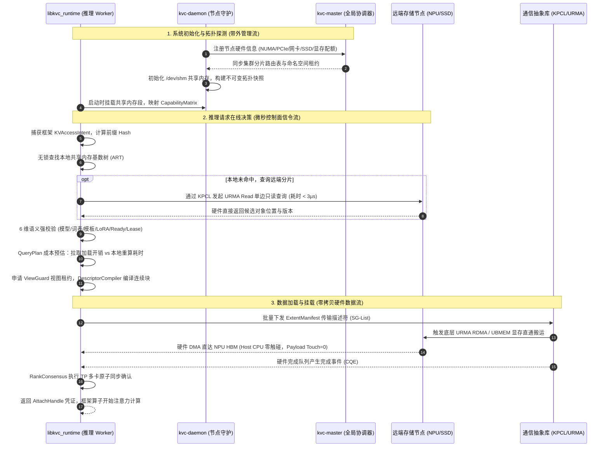

# KVC 存储池顶层架构设计与八专题深度分析报告

> **文档版本**：V1.0 架构顶层设计与八专题深度融合版  
> **更新日期**：2026-09-06  
> **文档性质**：系统顶层设计说明书与技术研讨基准稿  
> **规范基线**：  
> 1. 《KVCache SRS需求列表 V2.3_评审意见收敛版.xlsx》（144 条正式四层需求）  
> 2. 《统一异构KVCache存储池_全量需求树_V2.3.1_SR项目贡献补充版.xlsx》（38 条可独立交付 SR，203 条 AR 工作包）  
> 3. 《统一异构KVCache存储池总体架构与SRS评审导读_V2.3.2评审稿.md》与《V2.3.1评审稿.md》  
> 4. 《KVC存储池_顶层架构设计与八专题分析_V0.1.md》（设计口径与工程基线）  
> 5. 《Benchmark公共契约与证据分级规范.md》与《12_PVT-10_多流非等比劣化与TP8_Coflow偏斜实验实施方案设计.md》  
> 
> **最高行为准则与技术诚信红线**：  
> 1. **学术与技术诚信绝对红线**：严禁杜撰任何虚构的 PR 编号、测试结论或实验数据；不知为不知，以计算机体系结构与分布式系统第一性原理为依据；  
> 2. **三种口径严格区分**：本文严格区分三种语义口径——**已有需求**（受控 SRS/需求树明确提出的约束项）、**设计建议**（本软件架构推导出的设计实现方案，尚未正式冻结为硬件接口）、**算例**（仅用于量化推导演示，不代表实测最终定值）。

---

## 零、专有技术术语首次出现释义与规范表达库

为保障一线研发人员、系统架构师与技术评审专家在统一的语境下高效沟通，本项目严格执行专有名词规范化释义：

1. **KVCache**：大模型注意力键值缓存（大模型自回归生成过程中缓存的历史 Key 与 Value 激活状态张量，用于避免后续 Token 生成时重复计算注意力，以下简称“KV 缓存”或“KVC”）；
2. **Saved-Prefill**：首字生成预计算节省（利用已缓存的 KV Cache 避免重复计算 Prompt，从而显著降低首 Token 延迟 TTFT）；
3. **UBMEM**：统一总线内存直通共享协议（支持跨节点与异构设备间直接共享内存地址空间的底层通信协议）；
4. **URMA**：通用远程直接内存访问（用户态的高性能 RDMA 驱动接口与通信协议，负责硬件队列管理、批量提交与完成通知）；
5. **Direct-View**：远端直读（直接通过高速总线跨节点读取远端显存中的 KV 数据，不产生本地显存拷贝）；
6. **Copy-to-HBM**：拷贝到本地显存（通过 DMA 将远端 KV 数据完整搬运至本地高带宽显存 HBM 中）；
7. **ViewGuard**：视图租约安全守卫机制（负责管理远端直读的生命周期与租约有效性，并在远端崩溃或超时时安全捕获 SIGBUS 异常并回滚至本地重算）；
8. **QueryPlan**：查询与放置计划决策引擎（在微秒级时间内根据链路状态、算力与上下文长度选择最优数据加载或重算路径）；
9. **CostEvaluator**：成本预估模型（在决策前量化预估各加载路径与重算开销的数学模型，确保“拉取与加载总开销 < 本地直接重算耗时”）；
10. **Tiering / TierBlockAllocator**：分层存储技术与分层块分配器（将冷 KV Cache 异步沉淀到 NVMe SSD 大容量介质中，管理 4KB 对齐的磁盘物理扇区 LBA）；
11. **Payload Bypass DDR**：绕过主机内存（数据直接在 NVMe SSD 与 NPU HBM 之间流转，严格绕过主机内存 Host DDR，消除 CPU 内存拷贝与总线争用）；
12. **Host CPU 零数据拷贝**：CPU 仅负责下发控制指令与描述符，不参与正文数据搬运，Host Payload Touch Bytes 严格为 0；
13. **ConsumeEligibility**：消费资格校验引擎（对命中 KV 的模型架构、Tokenizer 词表哈希、Prompt 模板哈希、LoRA 适配器、Ready 就绪位与租约有效性等 6 维语义进行微秒级合法性检查，杜绝错误消费）；
14. **RankConsensus**：张量并行多卡状态同步机制（在 TP=4/TP=8 多卡并行时，通过共享内存与原子 Doorbell 同步各卡命中状态与一致性动作，确保多卡协同，杜绝集合通信死锁）；
15. **SemanticQoS**：前后台服务质量保障策略（通过网络 RoCE 优先级队列映射与应用层微秒级自适应退避，确保后台数据换出与拉取不干扰前台在线推理的 TPOT 尾部延迟）；
16. **Staging Fanout**：软件分层中继转发（利用集群计算节点建立树状中继转发拓扑，分层接力广播热点前缀数据，消除源端网络带宽打爆）；
17. **RCU**：Read-Copy-Update（读-拷贝-更新：一种无锁读与宽限期延迟释放机制，在后台显存碎片整理与页迁移时保证前台读请求零停顿）；
18. **ExtentManifest**：连续数据块区间清单描述符（用 64B POD 结构体描述连续物理 Block，避免跨框架传递时的序列化开销）；
19. **DescriptorCompiler**：描述符编译器（将跨框架离散物理 Block 贪心合并为硬件 Scatter-Gather 描述符，大幅降低 CPU 提交开销）；
20. **Raw Direct**：原始直达路径（不依赖 DPU 协处理器与专用硬件压缩，仅依靠底层网卡/SSD DMA 直达的最小基础数据通路）；
21. **KPCL**：KVCache Platform Communication Library（面向本软件控制消息与数据传输需求、封装底层 URMA/UBMEM 通信能力的接口库，由独立通信团队开发，本软件负责导入需求并集成调用）；
22. **TTFT**：Time To First Token（首字生成延迟 / 首 Token 响应时间）；
23. **TPOT**：Time Per Output Token（每个输出 Token 的生成耗时 / 单字生成延迟）；
24. **GDS**：GPUDirect Storage（显存直读存储技术，数据直接在 NVMe SSD 与显存之间通过 PCIe DMA 传输，完全绕过主机 CPU 与系统内存）；
25. **CXL**：Compute Express Link（通用计算互联总线，用于支持 CPU、加速器与内存池之间高带宽、低延迟的缓存一致性互联）；
26. **Incast**：多对一突发网络拥塞（多个发送节点在极短时间内同时向单一接收节点回传数据包，导致交换机出端口缓冲区瞬间耗尽而引发的排队丢包风暴）；
27. **Coflow**：协同传输流组（服务于同一分布式计算步骤的一组相关子流，系统的整体计算启动时延受制于最慢到达的子流）；
28. **Chunked Prefill**：分块首字预计算（将超长 Prompt 切分为若干固定大小的 Chunk 分批输入计算，以平滑显存峰值并实现与 Decode 阶段的细粒度交织调度）；
29. **PD Disaggregation / PD 分离**：Prefill 与 Decode 计算生成解耦架构（将大模型的输入理解 Prefill 阶段与逐字生成 Decode 阶段分别部署在不同的物理硬件节点上，通过高速网络传输 KVCache 实现独立资源弹性伸缩）。

---

## 专题一：顶层架构设计总体原则与软件架构设计范式

### 1.1 架构本质：本软件到底统一什么？

大模型推理中，KVCache 的物理载体跨越了多种异构介质：NPU 内部的高带宽显存（HBM，带宽数 TB/s、容量有限）、主机内存（DDR，延迟几十纳秒、容量数百 GB）、固态存储（NVMe SSD，容量可达数十 TB、延迟数十微秒）。地址空间的简单映射并不等于存储特性的等价。

本软件的核心职责是**统一管理缓存对象的语义身份、存储位置、生命周期、消费条件和访问方法**：
- **可寻址容量 ≠ 可服务容量**：Decode 阶段对延迟极度敏感的高频活跃缓存，默认必须驻留在执行 HBM 中；温冷前缀可沉淀在本地 SSD 或远端节点，仅在业务时限与成本允许时加载；
- **语义等价是复用的绝对前提**：同一个 Token 序列，在不同的模型权重版本、词表版本、提示词模板（Prompt Template）、LoRA 适配器或位置编码策略下，其生成的 Key/Value 激活张量完全不同。跨框架复用必须先确认计算语义强一致，再处理数据排布（Layout）转换；
- **分层介质角色显式化**：摒弃传统“HBM $\rightarrow$ DDR $\rightarrow$ SSD”机械串行搬运假设。确立“NPU HBM ↔ NVMe SSD 裸盘直达”为大容量扩展主路径，DDR 仅承担热点缓冲、注册内存池与共享视图等条件角色。

---

### 1.2 顶层架构设计六大总体原则

1. **控制面微秒决策与数据面零拷贝双流彻底分离**：
   - 控制面执行前缀树检索、6 维一致性校验、选路决策与租约调度，追求微秒级（$< 5\mu\text{s}$）确定性低时延；
   - 数据面坚持 **Host CPU 零数据拷贝（CPU 仅负责下发控制指令，不参与正文数据搬运，Host Payload Touch Bytes 严格为 0）**，KV 张量直接在硬件介质与网卡/SSD 控制器之间直通传输。
2. **净加速收益驱动决策（拉取与加载总开销 < 本地直接重算耗时）**：
   - 原始命中（Raw Hit）仅代表目录中存在候选对象。必须经过成本预估模型（CostEvaluator）计算，确认目录查询、网络传输、多卡同步与框架挂载的总耗时明确小于本地直接重算耗时，才执行加载；否则主动回退至本地直接重算。
3. **多维度语义一致性与租约校验（生产级 0 错误消费）**：
   - 杜绝陈旧失效脏块被消费。建立覆盖模型架构、词表哈希、模板哈希、LoRA 适配器、完成就绪位（Ready）与租约有效性（Lease）的 6 维校验防线。
4. **介质拓扑感知与非对称分层扩展**：
   - 严格感知单机 PCIe Switch、片间总线与跨机网络拓扑，优先选用直达通路，杜绝未经评估的 Host DDR 中转。
5. **开源生态外壳与原厂硬件极速内核协同**：
   - 兼容主流开源推理框架（vLLM、SGLang）与传输生态（Mooncake），保留标准化接口，但在底层微架构与专用通信协议上深度重构，释放国产芯片最大潜能。
6. **张量并行多卡原子协同**：
   - 针对 TP=4/TP=8 并行场景，将多卡状态同步与加载倾斜消除作为核心设计，通过原子 Doorbell 消除多流时序偏斜，杜绝集合通信死锁。

---

### 1.3 软件架构全景图（Architecture Landscape）

```text
========================================================================================================================
                                     统一异构 KVCache 存储池总体软件架构全景图
========================================================================================================================
┌──────────────────────────────────────────────────────────────────────────────────────────────────────────────────────┐
│                                          L1: 推理框架接入层 (Connector Layer)                                        │
│  ┌────────────────────────────────────────────────────────┐  ┌─────────────────────────────────────────────────────┐  │
│  │  Framework Connector (vLLM / SGLang Engine Adapter)   │  │  Intention Capture (KVAccessIntent 意图感知与捕获)   │  │
│  │  • 模型/分词器/模板语义签名抽取 • 请求时限与 SLO 预算注入 │  │  • 目标 HBM Buffer 地址声明   • 局部重算容忍度标记    │  │
│  └────────────────────────────────────────────────────────┘  └─────────────────────────────────────────────────────┘  │
└──────────────────────────────────────────┬─────────────────────────────────────────────────▲─────────────────────────┘
                                           │ 下发 KV 访问意图 (KVAccessIntent)               │ 挂载可消费凭证 (AttachHandle)
                                           ▼                                                 │
┌────────────────────────────────────────────────────────────────────────────────────────────┴─────────────────────────┐
│                                    L2: 状态控制与微秒决策层 (Control & Microsecond Decision)                          │
│  ┌──────────────────────────────┐  ┌──────────────────────────────┐  ┌────────────────────────────────────────────┐  │
│  │ TM2: 分布式前缀索引目录      │  │ TM1: QueryPlan 动态决策引擎  │  │ TM5: 消费资格校验与安全守卫                │  │
│  │ (PrefixDirectory)           │  │ (Dynamic Cost Evaluator)     │  │ (ConsumeEligibility & ViewGuard)           │  │
│  │ • 分布式 RadixTree / ART     │  │ • 成本数学模型快速计算       │  │ • 6 维语义一致性校验 (模型/词表/模板/LoRA) │  │
│  │ • 负结果缓存 (Negative Cache)│  │ • 拉取开销 vs 本地重算对比   │  │ • 视图租约有效性管理与过期自动撤销         │  │
│  │ • 微秒单边 URMA 直读分片     │  │ • P99 < 5µs 快速路径裁决     │  │ • SIGBUS 异常捕获与回滚隔离                │  │
│  └──────────────────────────────┘  └──────────────────────────────┘  └────────────────────────────────────────────┘  │
└──────────────────────────────────────────┬─────────────────────────────────────────────────▲─────────────────────────┘
                                           │ 编译下发描述符清单 (ExtentManifest)             │ 传输与状态就绪通知 (Ready Event)
                                           ▼                                                 │
┌────────────────────────────────────────────────────────────────────────────────────────────┴─────────────────────────┐
│                                   L3: 分层存储与对象拓扑层 (Tiered Storage & Topology)                               │
│  ┌──────────────────────────────┐  ┌──────────────────────────────┐  ┌────────────────────────────────────────────┐  │
│  │ TM3: 异构分层块分配器        │  │ DescriptorCompiler 编译器    │  │ 拓扑感知与组播中继                         │  │
│  │ (TierBlockAllocator)         │  │ (Scatter-Gather Compiler)    │  │ (Topology & Staging Fanout)                │  │
│  │ • HBM ↔ NVMe SSD 裸盘直通    │  │ • 离散物理 Block 贪心合并    │  │ • 运行时硬件能力矩阵 (CapabilityMatrix)    │  │
│  │ • 4KB 扇区对齐与水位换出     │  │ • 64B POD Extent 描述符构建  │  │ • 树状中继多级接力广播分发                 │  │
│  │ • RCU 读-拷贝-更新无锁页迁移 │  │ • 提交开销降低 ≥40%          │  │ • NUMA / PCIe / 交换机拓扑近邻决策         │  │
│  └──────────────────────────────┘  └──────────────────────────────┘  └────────────────────────────────────────────┘  │
└──────────────────────────────────────────┬─────────────────────────────────────────────────▲─────────────────────────┘
                                           │ 下发批量硬件 SG 传输指令 (KPCL Descriptors)     │ 硬件完成队列中断/轮询 (CQ Events)
                                           ▼                                                 │
┌────────────────────────────────────────────────────────────────────────────────────────────┴─────────────────────────┐
│                                 L4: 极速传输与硬件数据平面 (Transport Data Plane & KPCL)                              │
│  ┌────────────────────────────────────────────────────────────────────────────────────────────────────────────────┐  │
│  │ KPCL 通信抽象库 (KVCache Platform Communication Library - 需求导入层，统一屏蔽底层专用硬件细节)                 │  │
│  │ • 设备内存零拷贝注册 (P2P Reg)  • 批量 SG 链式异步提交  • 硬件 QoS 优先级映射 (TC0/TC1)  • 多卡原子 Doorbell 协同 │  │
│  └──────────────────┬───────────────────────────────────────────┬───────────────────────────────────┬─────────────┘  │
│                     ▼                                           ▼                                   ▼                │
│       ┌───────────────────────────┐               ┌───────────────────────────┐       ┌───────────────────────────┐  │
│       │ UBMEM 通信协议引擎        │               │ URMA 通信协议引擎         │       │ NVMe SSD 裸盘直达引擎     │  │
│       │ (统一总线内存直通共享协议)│               │ (通用远程直接内存访问协议)│       │ (io_uring FIXED Direct)   │  │
│       │ • 跨卡/跨节点内存直通映射 │               │ • 用户态低时延单边读写    │       │ • 绕过 Host DDR (Bypass)  │  │
│       │ • Direct-View 远端只读快照│               │ • Copy-to-HBM 批量数据搬运│       │ • P2P DMA 显存直通读写    │  │
│       └─────────────┬─────────────┘               └─────────────┬─────────────┘       └─────────────┬─────────────┘  │
└─────────────────────┼───────────────────────────────────────────┼───────────────────────────────────┼────────────────┘
                      ▼                                           ▼                                   ▼
┌──────────────────────────────────────────────────────────────────────────────────────────────────────────────────────┐
│                                          底层物理互联与异构存储介质硬件层                                            │
│  ┌──────────────────────────────┐  ┌──────────────────────────────┐  ┌────────────────────────────────────────────┐  │
│  │ NPU HBM (本地/远端芯片显存)  │  │ RoCE v2 / 原厂高速互联网络   │  │ NVMe SSD (PCIe Gen5 固态硬盘阵列)          │  │
│  └──────────────────────────────┘  └──────────────────────────────┘  └────────────────────────────────────────────┘  │
└──────────────────────────────────────────────────────────────────────────────────────────────────────────────────────┘
```

---

### 1.4 三层部署视角与原有四层需求的对应

四层契约（L1~L4）是面向接口规范的技术分解，而运行期则按管理层、控制面、数据面三层实施隔离部署：

| 运行部署层级 | 承接的四层需求范围 | 核心架构范式 | 设计边界与硬性约束 |
| :--- | :--- | :--- | :--- |
| **管理层 (Management Plane)** | 贯穿 L1～L4 的配置、拓扑纳管、安全授权、审计观测与构建交付 | 声明式期望状态，后台控制器闭环调谐 | 绝对**不参与**逐请求读取与正文数据转发，故障不影响已在途推理 |
| **控制面 (Control Plane)** | L1 调度准入、L2 框架连接、L3 目录/对象状态/选路决策、L4 链路状态 | 进程内极速决策 + 节点级单写共享 + 集群分片服务 | 读路径与持久化写路径分离，请求路径坚决消除集中式数据库 RPC |
| **数据面 (Data Plane)** | L3 描述符编译与传输编排、L4 硬件极速执行与可见性通知 | 异步流水编排、批量硬件 SG 提交、事件驱动 | **Host CPU 零数据拷贝**：CPU 仅下发指令，不读写搬运正文 |

---

## 专题二：存储池的构建拓扑、部署方式与进程实体分布

### 2.1 典型集群硬件拓扑搭建指南与五种域划分

在工程部署前，必须严格厘清集群的**管理域**、**安全域**、**故障域**、**互联域**与**资源所有权域**。典型硬件配置多为“双路 Host CPU + 8 卡 NPU 加速卡 + 本地 NVMe SSD 阵列 + 多端口 RoCE 网卡”：

1. **节点内 Scale-Up 互联拓扑**：
   - 8 张 NPU 之间通过片间高速总线（C2C/HCCS）全互联，提供板级数百 GB/s 互联带宽与亚微秒级延迟；
   - NPU 芯片与本地 NVMe SSD 通过 PCIe Gen5 Switch 连接，支持 GPUDirect Storage（GDS）硬件直达，数据绕过 Host DDR 直接在 SSD 与 HBM 之间流转；
   - Host CPU 仅负责控制面调度，通过 PCIe 访问 NPU 与网卡 Doorbell 寄存器。
2. **跨节点 Scale-Out 专用通信网络拓扑**：
   - 采用多轨高速网络互联，每个节点配置 4~8 个 200Gbps/400Gbps 高速端口；
   - **双轨/双流物理隔离**：计算网络（用于模型张量并行 AllReduce 等集合通信）与存储网络（用于跨节点 KV 传输与换出）采用独立端口或严格区分的 RoCE 优先级无损队列，从物理上杜绝 KVCache 突发搬运冲垮前台生成。
3. **分层介质存储拓扑**：
   - **L1-Tier（执行显存）**：各节点 NPU HBM（64GB~192GB/卡），存放当前正在执行 Decode 生成的活跃 KV；
   - **L2-Tier（共享缓冲，条件角色）**：Host DDR 内存池（512GB~1TB/节点），通过 UBMEM 或预注册内存池，作为热点 Prompt 缓冲与跨节点共享视图；
   - **L3-Tier（容量主体）**：各节点直连 NVMe SSD 阵列（如 4×7.68TB U.2/E3.S），提供数十 TB 级存储池，以裸盘 Direct I/O 承接超长上下文与多轮会话冷数据。

---

### 2.2 进程实体职责、数量与部署方式设计

本软件按照“职责单一、最小开销、故障隔离”原则，解耦为五个核心软件进程实体：

| 进程实体名称 | 部署位置 | 实例数量规则 | 核心职责与责任主体 |
| :--- | :--- | :--- | :--- |
| **`kvc-master`**<br>(集群全局协调服务) | 专用管理节点或以 Raft 嵌入计算节点 | 3 个实例 (1 主 2 备，Active-Standby) | • 集群存储拓扑、节点注册与存活探测；<br>• 租户安全域划分与访问凭证签发；<br>• 分布式前缀目录（PrefixDirectory）的分片路由表管理；<br>• **完全旁路化，不在单次推理时延关键路径上**。 |
| **`kvc-daemon`**<br>(节点级存储守护进程) | 每个物理计算/存储节点 | 每物理节点 1 个独立系统守护进程 | • 本地硬件能力探测，维护 CapabilityMatrix；<br>• NVMe SSD 裸盘空间管理与 4KB 扇区分配（TierBlockAllocator）；<br>• 初始化并维护节点级 POSIX 共享内存段（`/dev/shm/kvc_shm`）；<br>• 执行异步冷热换出流控与磁盘磨损均衡。 |
| **`libkvc_runtime` / `kvc-worker-engine`**<br>(推理加速工作引擎) | 每个计算节点 | 与推理框架 Worker（vLLM Worker）1:1 伴生，作为 C++ 动态库直接加载 | • **关键性能路径核心执行者**：微秒级捕获 KVAccessIntent；<br>• 检索本地共享内存前缀索引或单边直读远端目录；<br>• 执行 QueryPlan 选路决策与 ConsumeEligibility 6 维语义校验；<br>• 编译 ExtentManifest，调用 KPCL 下发 URMA/UBMEM 零拷贝传输。 |
| **`kvc-io`**<br>(数据执行进程，按需) | 存储节点或计算节点 I/O 域 | 存储节点默认启用，计算节点根据上下文环境按需启用 | • 承载跨进程 KPCL 传输上下文、SSD 块存储队列管理与批量排空；<br>• 若目标设备支持进程内直接操作，则功能内聚在 Worker 进程中。 |
| **`kvc-multicast-relay`**<br>(组播中继代理，可选) | 树状汇聚计算节点 | 按网络分层拓扑动态拉起若干实例 | • 承载 Staging Fanout 树状分层中继转发；<br>• 在 1-to-N 大模型前缀广播场景下接力转发超长 Prompt，削减源端网卡流量 $\ge 60\%$。 |

---

### 2.3 进程实体间信息交互流设计



---

## 专题三：全生命周期元数据体系设计（分类、存储、查询与多线程共享）

### 3.1 核心元数据分类体系与权威位置

元数据是系统调度决策的中枢。将权威源（Authoritative Source）、查询副本（Query Replica）与持久化载体清晰分离：

```text
┌──────────────────────────────────────────────────────────────────────────────────────────────────┐
│                                统一存储池六大核心元数据分类与权威源                              │
├──────────────────────────────────────────────────────────────────────────────────────────────────┤
│ 1. 语义索引元数据 (Semantic Metadata)                                                            │
│    • 模型唯一签名、词表哈希、提示模板哈希、LoRA 适配器 ID、安全域 ID                             │
│    • 前缀基数树节点 (Prefix Radix Nodes)                                                         │
│    • 权威源：分片目录服务；查询位置：进程内无锁缓存 + 节点本地共享内存；持久化：Raft 提交日志     │
├──────────────────────────────────────────────────────────────────────────────────────────────────┤
│ 2. 对象拓扑与位置元数据 (Placement & Extent Metadata)                                            │
│    • KVObject ID、版本号、介质分布标记 (HBM_LOCAL / HBM_REMOTE / DDR_STAGING / SSD_RAW)          │
│    • ExtentManifest 连续块清单 (Node ID, Device ID, Base Address/LBA, Length, Align)              │
│    • 权威源：副本所有者节点；查询位置：节点哈希表；持久化：元数据快照日志                         │
├──────────────────────────────────────────────────────────────────────────────────────────────────┤
│ 3. 硬件能力与链路元数据 (CapabilityMatrix Metadata)                                              │
│    • 链路静态物理带宽/时延，动态探测 RTT、丢包率、拥塞状态，NUMA/PCIe 距离矩阵                    │
│    • 权威源：kvc-daemon 周期探测；查询位置：本地不可变快照表；持久化：硬件配置文件                │
├──────────────────────────────────────────────────────────────────────────────────────────────────┤
│ 4. 安全访问与租约元数据 (Security & Lease Metadata)                                              │
│    • ViewGuard 租约有效时间戳 (Lease Epoch)、可消费就绪位 (Ready Flag)、读引用计数 (RefCount)    │
│    • 权威源：副本所有者；查询位置：本地原子位图与共享内存表；持久化：不落盘 (易失性运行时状态)    │
├──────────────────────────────────────────────────────────────────────────────────────────────────┤
│ 5. 存储空间分配元数据 (Block Allocation Metadata)                                                │
│    • HBM 预注册连续块分配位图、NVMe SSD 4KB 扇区 LBA 映射表、介质水位淘汰链表                     │
│    • 权威源：kvc-daemon 分配器；查询位置：进程内 slab 与分配位图；持久化：SSD 分配日志           │
├──────────────────────────────────────────────────────────────────────────────────────────────────┤
│ 6. 运行观测与对账元数据 (Telemetry & Audit Metadata)                                             │
│    • TraceID、RequestID、Planned Path vs Actual Path、决策开销、传输耗时、Host Touch 证据         │
│    • 权威源：各工作线程本地采样；查询位置：本地 RingBuffer；持久化：异步批量导出至监控平台        │
└──────────────────────────────────────────────────────────────────────────────────────────────────┘
```

---

### 3.2 数据结构设计：业务语义自研，通用一致性复用

| 子系统 / 元数据 | 推荐实现方案 | 架构权衡理由 (自研 vs 开源) | 关键性能考量 |
| :--- | :--- | :--- | :--- |
| **集群管理与配置** | 开源成熟 **etcd** (Raft 键值系统) | **复用开源成熟组件**：仅承载低频全局拓扑与命名空间授权，无需自研选主与共识算法。 | 完全旁路化，高频查询快路径严禁同步调用 etcd RPC。 |
| **分布式前缀目录**<br>(PrefixDirectory) | **自研并发自适应基数树 (ART)**<br>+ 负结果 BloomFilter | **坚决自研**：开源 Redis/etcd 基于 TCP RPC，往返耗时 0.5~2ms，直接扼杀 TTFT。自研 ART 结合共享内存单机读 P99 $< 1\mu\text{s}$，跨机 URMA Read $< 3\mu\text{s}$。 | 内存占用小，前缀连续查找复杂度仅与 Token 长度相关，与条目总数对数相关。 |
| **块描述符清单**<br>(ExtentManifest) | **自研定长 64 字节 POD 结构体**<br>(Plain Old Data C++ Struct) | **坚决自研**：开源 Mooncake 采用 Python Pickle / JSON 跨进程传递，带来毫秒级反序列化和 GC 停顿。自研 64B POD 天然支持 memcpy 与 DMA 寄存器映射，零序列化开销。 | 严格按 64 字节缓存行（Cacheline）对齐，彻底消除多核并发伪共享（False Sharing）。 |
| **分层存储空间分配**<br>(TierBlockAllocator) | **自研分级无锁位图 (Lock-free Bitmap)**<br>+ 4KB 扇区对齐树 | **坚决自研**：传统文件系统存在复杂的 VFS 锁与 Inode 争用。面向大模型固定 Block（16/32/64 Tokens）定制分配器，消除全局互斥锁。 | 与 Linux `io_uring` FIXED Buffer 直连，裸盘扇区直接映射显存。 |

---

### 3.3 64 字节对齐的定长 ExtentManifest 结构定义

```cpp
// 严格按 64 字节对齐的连续数据块清单描述符 (POD)
struct alignas(64) ExtentManifestPOD {
    uint64_t logical_prefix_id;    // 逻辑前缀唯一识别 ID
    uint32_t start_token_idx;      // 起始 Token 索引
    uint32_t num_tokens;           // 覆盖的 Token 数量
    uint32_t node_id;              // 目标存储物理节点编号
    uint16_t device_id;            // 物理设备编号 (NPU/SSD)
    uint16_t tier_kind;            // 介质类型: 0-HBM, 1-DDR, 2-SSD
    uint64_t base_address_or_lba;  // 显存物理地址或磁盘 4KB 扇区 LBA
    uint32_t length_bytes;         // 连续数据段物理字节数
    uint16_t block_layout_flags;   // 跨框架排布标志 (FP16/BF16/FP8, HeadDim)
    uint16_t lease_epoch_id;       // 视图租约世代号
    uint32_t memory_key;           // URMA / UBMEM 硬件访问凭据 (Remote Key)
    uint8_t  semantic_digest[16];  // 前缀与模型 6 维语义截断哈希签名
};
static_assert(sizeof(ExtentManifestPOD) == 64, "ExtentManifestPOD must be exactly 64 bytes!");
```

---

### 3.4 高并发与多线程无锁化设计（消灭 TTFT/TPOT 瓶颈）

1. **RCU 无锁并发读取与延迟释放**：
   - 读操作（前缀查找）占据 95% 以上请求。工作线程无锁遍历 ART 树节点，基于内存屏障（Acquire/Release 语义）保证可见性；
   - 写操作（插入新前缀或页面换出）在副本上进行，通过原子 CAS 指令替换指针；原节点进入 Epoch 宽限期，待所有活跃读线程及底层硬件 DMA 传输完成（双层宽限期：Host CPU + NPU Stream Event）后，由后台线程回收，保证 Reader 线程零等待。
2. **负结果缓存（Negative Caching）前置拦截**：
   - 针对完全无历史缓存的“全新输入 Prompt”，设置节点级无锁 BloomFilter 与快速负结果缓存。识别到冷数据时，在 $< 0.5\mu\text{s}$ 内直接返回未命中，立刻进入本地 Prefill，避免无效遍历。
3. **缓存行伪共享消除与每核心聚合**：
   - 多卡张量并行（TP=8）状态同步时，各卡在 POSIX 共享内存中拥有独立的 64 字节槽位（Slot），各自独立写入自己的 Ready 状态，协调者单向聚合读取，杜绝所有卡争抢同一个互斥锁或原子计数器。

---

## 专题四：存储池三层架构（管理层、控制面、数据面）的设计与部署隔离

### 4.1 三层软件架构职责、实体与性能指标矩阵

```text
┌──────────────────────────────────────────────────────────────────────────────────────────────────┐
│                                管理层 (Management Plane) - 运维、全局协同与生命周期               │
├──────────────────────────────────────────────────────────────────────────────────────────────────┤
│ • 核心实体：kvc-master, kvc-exporter, CLI 管理工具                                               │
│ • 核心职责：集群拓扑收集、配额管理、介质淘汰编排、节点上线/摘除、安全鉴权、Trace 归集            │
│ • 交互协议：gRPC / HTTP2 / Prometheus REST API                                                  │
│ • 时延目标：毫秒至秒级 (10ms ~ 1000ms)，故障自愈恢复时间 < 500ms                                 │
└────────────────────────────────────────────────┬─────────────────────────────────────────────────┘
                                                 │ 异步下发拓扑、策略与配额快照
                                                 ▼
┌──────────────────────────────────────────────────────────────────────────────────────────────────┐
│                                控制面 (Control Plane) - 语义、决策与微秒调度                     │
├──────────────────────────────────────────────────────────────────────────────────────────────────┤
│ • 核心实体：libkvc_runtime (内置控制模块), kvc-daemon (节点守护)                                │
│ • 核心职责：前缀语义识别、6 维一致性校验、QueryPlan 成本决策、ViewGuard 租约管理、描述符编译      │
│ • 交互协议：进程内 C++ 函数调用、POSIX 共享内存无锁队列、底层单边 URMA Read 远端控制探测        │
│ • 时延目标：极度苛刻，单次决策 P99 < 5µs，跨节点元数据查询 P99 < 10µs                            │
└────────────────────────────────────────────────┬─────────────────────────────────────────────────┘
                                                 │ 下发硬件 SG 传输描述符 (Host Payload Touch = 0)
                                                 ▼
┌──────────────────────────────────────────────────────────────────────────────────────────────────┐
│                                数据面 (Data Plane) - 高速搬运与零拷贝硬件直达                    │
├──────────────────────────────────────────────────────────────────────────────────────────────────┤
│ • 核心实体：KPCL 通信抽象库、URMA/UBMEM 传输引擎、io_uring NVMe 裸盘直达引擎                     │
│ • 核心职责：NPU HBM ↔ NPU HBM 极速 RDMA 搬运、NVMe SSD ↔ NPU HBM P2P DMA、张量并行多卡原子同步 │
│ • 交互协议：用户态 URMA 原生队列、PCIe P2P Direct DMA、Linux io_uring FIXED Buffer              │
│ • 性能目标：物理带宽线速利用率 ≥ 80%，Host CPU 占用率 < 5%，零 Host CPU 数据正文触碰            │
└──────────────────────────────────────────────────────────────────────────────────────────────────┘
```

---

### 4.2 各层级底层硬件资源诉求分析

#### 1. CPU 核心与绑定策略（CPU Pinning）
- **管理层**：共享主机的常规核心（2~4 个通用 Core），采用标准 Linux 调度器；
- **控制面**：每个推理 Worker 绑定独立的 1 个 CPU 高性能物理 Core（绑定 NUMA 亲和核心），专用于执行 QueryPlan 与描述符批量编译，杜绝线程上下文切换；
- **数据面**：数据搬运完全由 NPU DMA 引擎、网卡 DMA 与 NVMe 控制器硬件完成，数据面仅需极少量轮询线程处理完成队列（CQ, Completion Queue）。在 io_uring / URMA 异步机制驱动下，**数据面正文搬运消耗的 Host CPU 算力严格控制在单核 5% 以内**。

#### 2. 内存容量与总线带宽诉求
- **Host DDR 准入隔离**：系统严禁将 Host DDR 作为所有数据的强制中间缓冲。数据面直接在网卡/SSD 与 NPU HBM 之间流转，消除 Host DDR 内存带宽的饱和压力；
- **锁定内存（Pinned Memory）配额**：每个节点在 Host DDR 中仅预留 8GB~16GB 空间，用于注册固定通信缓冲区（Fast Buffer Pool）、POSIX 共享内存段以及 RDMA 门铃寄存器映射，所有页面锁定在物理内存中（`mlock`），杜绝页面换出（Page Fault）引起的致命尾延迟。

#### 3. PCIe TLP（事务层报文）与时延开销
- 在大模型推理过程中，过多的细碎小报文会导致 PCIe Switch 的 TLP 报文吞吐饱和并引发拥塞排队；
- **优化设计**：DescriptorCompiler 必须在软件层将离散分散的物理 Page 贪心聚合成大颗粒连续块（SG Extents），单次 DMA 传输请求大小保持在 64KB~1MB 以上，将 PCIe TLP 头部开销降至最低，充分发挥 PCIe Gen5 双向 128GB/s 的物理吞吐极限。

#### 4. 网络传输时延与 QoS 队列划分
- **拥塞安全隔离**：在物理网卡与交换机上启用 RoCE 优先级流控（PFC, Priority Flow Control）与明确拥塞通知（ECN）；
- **服务质量映射（QoS Mapping）**：
  - **TC0（最高优先级，无损队列）**：分配给大模型前台在线推理的张量并行同步信号（TP AllReduce）与 Layer 0 关键 KV 块优先传输；
  - **TC1（次高优先级，无损队列）**：分配给前台在线推理的剩余 KV 块拉取（Copy-to-HBM）；
  - **TC2（低优先级，尽力而为队列）**：分配给后台冷热数据下沉换出至 SSD 或跨节点复制，绝不挤占前台通信带宽。

---

## 专题五：控制面、数据面通信模式与上层 LLM 业务场景深度映射

### 5.1 12 类典型 LLM 推理业务场景及核心性能诉求分析

大模型推理业务存在多样化的工作负载模式，不同场景对控制面决策和数据面通信提出了截然不同的物理要求：

| 业务场景 | 推理性能诉求 | 控制面通信模式 | 数据面模式与实现 | 核心工程边界与约束 |
| :--- | :--- | :--- | :--- | :--- |
| **1. 公共系统提示词复用** | 降低 TTFT，承受突发热点 | 多对一并发查询、批量资格确认、热点发布 | 首次一次加载，本地多请求共享；跨实例按需一对多复制 | 只有显式允许共享的安全命名空间可跨租户复用 |
| **2. 多轮会话恢复** | 恢复时间短，减少重复预计算 | 会话连续前缀查询、版本与持有检查 | DDR/SSD/远端 $\rightarrow$ 执行 HBM；部分命中后重算后缀 | 上下文变化与位置策略改变会改变可复用范围 |
| **3. RAG 知识库问答** | 相同文段下的真实连续命中 | 批量前缀查找、语义过滤、代价比较 | 连续前缀加载；不连续段只在框架支持相应算子时复用 | 相同文本在不同上文后面不必然产生相同 KV |
| **4. PD 分离算力解耦** | Prefill 完成后尽快开始 Decode | 目标协商、缓冲准备、各层就绪确认 | 生产者向目标推送或目标拉取；按层/按页流水搬运 | 一次请求通常是一对一 P$\rightarrow$D 传输，需严格防迟到写 |
| **5. 分块预计算 (Chunked)** | 降低长输入峰值等待与显存抖动 | 分块依赖通知、阶段就绪、取消消息 | 分块产生/传输，NPU 设备 Stream Event 驱动边算边传 | 部分层就绪能否开始计算依赖框架算子流水支持 |
| **6. 张量并行 (TP=4/8)** | 最慢参与卡不拖延整体启动 | 组内安全前缀与版本确认、小消息汇聚/广播 | 多条带相同流组 ID (Coflow) 的分片传输 | 消除多卡加载偏斜，偏斜系数 $\mathrm{Skew} < 1.15$ |
| **7. 多 Agent 对话分支** | 降低重复加载与显存占用 | 共享句柄申请、消费者登记、分支状态更新 | 一源多消费者或树状中继；分支增量各自私有 | 不覆盖共享前缀；各分支有独立引用和完成事件 |
| **8. 显存换出与恢复** | 降低显存压力，控制恢复尾时延 | 水位监控、候选评分、目标预留、发布状态 | HBM ↔ NVMe SSD 裸盘批量 I/O；DDR 按角色准入 | 换出速度跟不上生成速度时需要准入反压限流 |
| **9. 投机预取** | 将数据加载与请求排队重叠 | 到达预测、预算/容量预留、取消信号 | 异步预加载至 DDR 或空闲 HBM；支持快速取消 | 误预取既占带宽也占 HBM，必须记录浪费指标 |
| **10. 后台迁移与碎片治理** | 前台 TPOT 稳定，系统恢复可控 | 任务票据、双位置记录、版本切换通知 | 有界一对一搬运；页迁移采用软件 RCU 机制 | 严禁 Stop-the-World 停顿，前台 TPOT 干扰率 $< 3\%$ |
| **11. 弹性扩缩容与节点切换**| 新节点平滑上线，旧版本不误命中 | 节点加入、目录重分片、命名空间失效、排空 | 增量数据预热或跨节点复制 | 目录迁移与正文迁移分别调度，避免放大瞬时网络流量 |
| **12. 持续活跃 Decode 阶段** | TPOT 极度稳定、绝对低抖动 | 常态使用已接入句柄；后台续租/故障通知 | 默认只读本地 HBM；远端直读仅对白名单开放 | 严禁每 Token 进行远端目录查询或跨节点加锁 |

---

### 5.2 控制面与数据面的深度解耦与协同

1. **单边微秒只读（One-sided Microsecond Read）**：
   - 跨节点查找前缀时，客户端直接利用 URMA 单边 Read 操作，直接读取目标节点预先注册的前缀基数树节点。过程**无需目标节点 CPU 参与，不产生中断**，往返时间（RTT）锁定在 $2\sim3\mu\text{s}$。
2. **ViewGuard 租约安全守卫与 SIGBUS 异常恢复**：
   - 当控制面决定采用只读共享或远端直读时，向持有节点申请微秒级视图租约。若远端节点崩溃或超时，底层触发 `SIGBUS` 信号，ViewGuard 信号处理器立即拦截并在 $< 500\mu\text{s}$ 内安全回滚为本地重算，上层推理主进程永不崩溃。
3. **Layer 0 提前点火与算传重叠**：
   - 在长上下文加载中，数据面通过硬件优先级队列（TC0）优先保证大模型第 0 层（Layer 0）的 KV 数据先行到达。NPU 立即启动首层注意力计算，后续数十层的传输与前台计算深度重叠，消除计算气泡。

---

## 专题六：底层通信库（KPCL）的业务流量特征抽象

### 6.1 本软件与 KPCL 的责任边界清晰界定

- **KPCL 的定位**：纯通信原语与硬件资源调度的执行者。由专用通信团队负责具体实现（封装 URMA、UBMEM 与 RDMA 驱动）；
- **本软件（KVC 存储池）的定位**：本软件不负责 KPCL 内部通信协议的具体编码，而是**作为 KPCL 的核心上层业务方，系统性提炼流量模型，导入刚性需求与接口契约**。

| KVC 存储池软件负责 | KPCL 通信抽象库负责 | 双方联合验证与验收契约 |
| :--- | :--- | :--- |
| • 对象语义、前缀连续性、复用收益评估、版本与租约控制；<br>• 请求/流组优先级分配，截止时间传递；<br>• 降级重算与故障隔离决策。 | • 硬件通信上下文初始化、内存注册/导入、地址保护；<br>• 有界队列管理、批量 SG 传输执行、反压与流量整形；<br>• 底层硬件错误检测、可见性证据提供、超时排空。 | • 句柄在重注册、节点迁移和进程退出后的有效性；<br>• 组内最慢流偏斜控制、前后台混压下 TPOT 干扰率；<br>• 杜绝消费半写脏数据，取消后无迟到写破坏新请求。 |

---

### 6.2 八类典型通信流量模型 (F1 ~ F8) 抽象

| 模型代号 | 流量规模与访问模式 | 到达特征与拓扑 | 关键性能指标 | KPCL 核心能力诉求 |
| :--- | :--- | :--- | :--- | :--- |
| **F1: 小控制消息** | 64B～4KB；请求/应答、授予/撤销、就绪通知 | 随请求突发；一对一、汇聚/广播 | 往返 P99 < 10µs，消息率 > 100K/s | 独立控制队列额度、有界缓冲、截止时间传递 |
| **F2: 批量元数据查询** | 多个前缀键，响应达数十 KB | 热点偏斜、多读少写、更新风暴 | 单批完成时延、分片扇出控制 | 批量消息聚合、受限单边快照读、版本标记 |
| **F3: 一对一大块加载** | 0.5～8MB 合并块，聚合可达 GB；SSD/内存 $\rightarrow$ HBM | 随长 Prompt 到达；突发 burst | 有效带宽利用率 ≥ 80%，Host CPU 占用 < 5% | 散聚传输 (SG-List)、批量提交、设备内存预注册 |
| **F4: 分层/分块流水** | 64KB～8MB Chunk；具备层间依赖 | 传输与计算重叠，首批时限紧迫 | 首块到达时延 (Layer 0)、流水气泡率 | 按段完成通知、硬件事件触发、细粒度信用控制 |
| **F5: TP 多卡协同流组** | 4/8/16 个相关子流 (Coflow)，各流大小可微差 | TP 多卡同步；N-to-1 或全互联 | **流组完成 P99、偏斜系数 Skew < 1.15** | **多卡原子 Doorbell 敲击、协同流组调度、接收端反压** |
| **F6: 一对多组播分发** | 1 源 $\rightarrow$ 2/4/8/16 目标；公共只读对象 | 热门事件突发、全局系统提示词预热 | 源端出口流量削减 ≥ 60%、慢节点隔离 | 树状软件中继 (Staging Fanout) 接口、慢目标隔离 |
| **F7: 存储与后台混压** | 4KB～16MB I/O；读写混合持续流量 | 前台在线加载 + 后台 SSD 回写/迁移 | **前台 TPOT 尾延迟劣化 < 3%** | 硬件 QoS 优先级队列绑定 (TC0/TC1/TC2)、自适应退避 |
| **F8: 只读视图直读** | 64B～4KB 摘要；短 KV 区间高频重读 | 随机只读访问、共享内存直通 | 首次/稳态访问延迟、设备停顿率 | 统一总线内存直通映射、硬件保护域、SIGBUS 隔离 |

---

### 6.3 可交付给 KPCL 团队的工作负载画像结构 (Workload Profile)

```text
struct KPCLWorkloadProfile {
    // 业务与调度维度
    uint64_t scenario_id;           // 业务场景代号 (RAG/PD_Disagg/Agent)
    uint64_t request_id;            // 全链路请求唯一跟踪 ID
    uint64_t coflow_group_id;       // 张量并行协同流组 ID (0 表示独立单流)
    uint16_t rank_id;               // 发送/接收卡在 TP 组内的编号 (0~7)
    uint16_t layer_id;              // 对应大模型的注意力层编号 (Layer 0 优先级最高)
    
    // 拓扑与空间维度
    uint32_t src_node_id, dst_node_id;
    uint16_t src_device_id, dst_device_id;
    uint8_t  src_tier, dst_tier;    // 0: HBM, 1: DDR, 2: SSD
    
    // 规模与排布维度
    uint64_t total_payload_bytes;   // 传输总正文字节数
    uint32_t num_extents;           // 离散 Extent 数量 (SG-List 长度)
    uint32_t alignment_bytes;       // 对齐要求 (如 4096 字节对齐)
    
    // 时延与依赖维度
    uint64_t submit_timestamp_us;   // 提交时间戳
    uint64_t deadline_timeout_us;   // 刚性超时时间预算
    uint64_t layer0_deadline_us;    // Layer 0 关键首块截止时间
    
    // 服务质量与控制
    uint8_t  traffic_class;         // QoS 等级: 0-TC0(高), 1-TC1(中), 2-TC2(尽力)
    bool     is_cancellable;        // 是否允许在排队时被动态取消
};
```

---

### 6.4 建议 KPCL 核心 API 接口族规范

1. **`kpcl_reg_device_mr`**：跨节点注册 NPU 设备 HBM 物理地址，生成统一访问 Key，确保 Host CPU 零数据拷贝；
2. **`kpcl_submit_extents`**：直接消费本软件编译的 `ExtentManifestPOD` 结构体数组，单次系统调用完成数百个离散块提交，API 开销 $\le 1\mu\text{s}$；
3. **`kpcl_tp_group_doorbell`**：绑定 TP=4/TP=8 多卡通道，原子触发多卡并发 DMA，彻底消除单卡时序离散；
4. **`kpcl_onesided_read`**：提供极简的单边 URMA Read 原语，用于控制面读取远端节点前缀索引，耗时 $< 3\mu\text{s}$；
5. **`kpcl_fail_fast`**：链路异常或拥塞超时时，在 $\le 200\mu\text{s}$ 内返回明确错误码，触发快速回退至本地重算。

---

## 专题七：端到端推理性能规格到底层各模块指标的逐层严密拆解模型

### 7.1 业务级 SLO 输入与性能分解数学模型

端到端首字延迟（TTFT）不能通过各模块 P99 的简单代数相加来推导（数学上各模块超限概率存在累积放大与相关性）。正式模型采用**有向无环图（DAG）关键路径依赖模型**与**并集上界（Union Bound）风险分配法**：

$$T_{\mathrm{TTFT}} = \max_{\text{path} \in \mathrm{DAG}} \left( \sum_{i \in \text{path}} T_i \right)$$

若要求整体违背 SLO 的概率控制在 $\epsilon \le 1\%$，则分配给关键路径上各个串行阶段的超限概率总和必须满足 $\sum \epsilon_i \le 1\%$。

---

### 7.2 两套互补的时延预算分解算例

#### 算例 A：120ms 级中长前缀（8K Token / 1GiB）大容量复用算例
假设本地完全重算 8K Token 耗时 300ms，业务目标 TTFT 为 240ms。扣除排队、剩余 Prefill 与首字生成，系统留给 KVC 存储池的加载预算为 **120ms**：

| 关键处理环节 | 预算时间 (ms) | 责任主体与测量边界 |
| :--- | :--- | :--- |
| **1. 前缀身份计算、目录查询与租约申请** | 0.200 ms | 运行库、目录分片与副本所有者，拿取有效候选与持有凭证 |
| **2. QueryPlan 路径决策与成本评估** | 0.005 ms | 本地 C++ 成本模型评估（P99 < 5µs） |
| **3. 意图规范化与分发** | 0.003 ms | 框架连接器内部处理 |
| **4. 描述符编译 (DescriptorCompiler)** | 0.020 ms | 离散物理块贪心合并为 64B POD 描述符 |
| **5. KPCL 批量任务提交** | 0.050 ms | KPCL API 接受任务并写入硬件队列 |
| **6. 排队、硬件数据正文传输与布局适配** | 105.000 ms | 底层 URMA/网络/SSD 硬件搬运 1GiB 数据（有效带宽约 10.23GB/s） |
| **7. 目标设备完成与可见性证据确认** | 0.400 ms | 硬件完成中断/事件确认（CQE） |
| **8. 张量并行数据到齐多卡协同 (RankConsensus)** | 0.100 ms | TP=8 多卡原子同步完成确认 |
| **9. 框架 BlockTable 显存接入挂载** | 0.222 ms | 框架块表指针原子更新 |
| **10. 路径不确定性保留余量** | 14.000 ms | 吸收尾部抖动与重试开销 |
| **合计端到端总开销** | **120.000 ms** | **相比本地重算 300ms，端到端 TTFT 降低 60%** |

#### 算例 B：30ms 级极速前缀（4K Token / 340MB）微秒级漏斗算例
针对低时延在线交互场景，本地重算耗时 120ms，目标 TTFT 控制在 **30ms** 以内：

| 处理环节 | 严密时延预算 | 硬件与组件实现机制 |
| :--- | :--- | :--- |
| **1. 框架意图捕获 (T_intent)** | P99 ≤ 2 µs | 进程内指针解析与 Token 签名提取 |
| **2. 目录前缀查询 (T_meta)** | P99 ≤ 3 µs | 本地共享内存 ART 树查找或单边 URMA Read |
| **3. 动态成本决策 (T_decision)** | P99 ≤ 3 µs | QueryPlan 快速成本模型比对 |
| **4. 6 维语义强校验 (T_consensus)** | P99 ≤ 5 µs | ConsumeEligibility 快速哈希比对 |
| **5. 描述符编译 (T_compiler)** | P99 ≤ 5 µs | 连续块贪心扫描合并 |
| **6. 多卡 Doorbell 敲击 (T_doorbell)** | P99 ≤ 2 µs | KPCL 原子共享写寄存器 |
| **控制面与调度累计耗时** | **P99 ≤ 20 µs** | **仅占总时延预算 < 0.1%，彻底消除控制瓶颈** |
| **7. 硬件数据搬运 (T_transfer)** | P99 ≤ 8.5 ms | 8 卡并行打满 400Gbps 网络（线速利用率 ≥ 80%） |
| **8. 多流偏斜控制 (Skew_tail)** | P99 ≤ 1.0 ms | TP=8 Coflow 偏斜系数控制在 1.15 以内 |
| **9. 框架显存挂载 (T_attach)** | P99 ≤ 10 µs | 显存虚拟地址映射表生效 |
| **10. 残余未命中 Token 预计算** | ≤ 20 ms | NPU 矩阵计算算力执行剩余部分 Prefill |
| **端到端综合达成** | **TTFT ≤ 29.5 ms** | **相比本地重算 120ms，首字延迟净降低 75%** |

---

### 7.3 从上层负载反推底层硬件驱动刚性技术规格

1. **KPCL API 调用开销**：`kpcl_submit_extents` 必须严格控制在 $\le 1\mu\text{s}$ 内完成，内部严禁动态内存申请与全局互斥锁；
2. **URMA 门铃开销**：网卡 Doorbell 寄存器写入延迟 $\le 200\text{ns}$，硬件完成事件产生至用户态感知 $\le 2\mu\text{s}$；
3. **网络传输无损保障**：交换机端到端转发时延 $\le 1.2\mu\text{s}$，高负载下依靠 PFC/ECN 保证无损队列丢包率严格为 0；
4. **NVMe SSD 裸盘直达性能**：io_uring FIXED Direct I/O 读取 128KB 物理块的 P99 延迟必须 $\le 80\mu\text{s}$，单盘持续随机读吞吐 $\ge 6.5\text{GB/s}$。

---

## 专题八：软件管理面、控制面、数据面可靠性设计

### 8.1 故障模型与安全不变量

系统必须防御的物理故障包括：Worker 进程崩溃、服务器整机掉电、光纤误码断链、网络分区、NVMe SSD 坏块与半写、内存页注销等。系统坚守以下**四大安全不变量**：
1. **未就绪不消费**：未同时具备完成通知、可见性屏障与 6 维语义校验的对象，严禁标记为可消费；
2. **旧代际无授权**：节点或集群代际更新后，旧代际签发的访问凭证立即失效；
3. **租约内不覆写**：物理存储块在租约有效期与设备 DMA 结束前，严禁被后台迁移或空间分配器复用；
4. **决策结果一致性**：多卡张量并行组内各卡对数据消费或回退重算必须达成原子共识。

---

### 8.2 三面高可用与容错防护体系

```text
┌──────────────────────────────────────────────────────────────────────────────────────────────────┐
│                                   三面全生命周期可靠性与容错防护体系                             │
├──────────────────────────────────────────────────────────────────────────────────────────────────┤
│ 管理面可靠性 (Management Reliability)                                                            │
│ • 状态机轻量化与元数据持久化：kvc-master 仅管理拓扑与安全路由，所有状态支持本地快照与 Raft 复制 │
│ • 节点故障无损摘除：心跳 500ms 丢失判定下线，自动从路由表中剔除失效节点，不影响存量节点本地推理 │
├──────────────────────────────────────────────────────────────────────────────────────────────────┤
│ 控制面可靠性 (Control Plane Reliability)                                                         │
│ • ViewGuard 视图租约与安全信号捕获：捕获 SIGBUS/SIGSEGV，杜绝进程崩溃，500µs 安全回滚重算        │
│ • ConsumeEligibility 6 维语义屏障：模型/词表/模板防呆校验，杜绝“张冠李戴”读取非法脏块           │
│ • 无锁 RCU 内存安全：双层宽限期保证（Host CPU + NPU Stream Event），彻底消灭 UAF 悬挂指针        │
├──────────────────────────────────────────────────────────────────────────────────────────────────┤
│ 数据面可靠性 (Data Plane Reliability)                                                            │
│ • 快速失败与超时熔断 (Fail-Fast)：KPCL 设定微秒级硬件传输超时，超时后立刻中断，回退本地重算      │
│ • 硬件双轨降级协同 (Dual-Track Fallback)：DPU 硬件加速通道异常时，500µs 内无缝平滑切回纯软通道 │
│ • 拥塞自适应退避 (SemanticQoS)：前台生成抖动超过 2% 时，后台 SSD 下沉和拉取自动停顿与微秒退避    │
└──────────────────────────────────────────────────────────────────────────────────────────────────┘
```

---

### 8.3 按故障对象分类的降级与恢复矩阵

| 故障类别 | 故障检测与隔离机制 | 可维持的正常业务 | 恢复动作与可靠性验收门槛 |
| :--- | :--- | :--- | :--- |
| **管理节点 (kvc-master) 崩溃** | Raft 心跳超时自动重新选主 | 现有所有在线推理请求完全不受影响 | 3 秒内完成主节点漂移，新主节点读取 Raft 日志恢复拓扑，零业务抖动 |
| **目录多数派丢失** | 客户端查询超时与健康告警 | 本地已命中的缓存与已挂载的会话 | 暂停目录写操作；未命中请求立即无缝回退为本地重算，严禁无界等待 |
| **推理 Worker 进程崩溃** | 操作系统的进程退出通知与守护感知 | 集群内其他推理实例 | 共享内存中的租约自动根据超时释放，守护进程回收孤儿物理块 |
| **网络断链 / 硬件传输超时** | KPCL 硬件 Timer 熔断 (< 10ms) | 不相关节点间通信 | 立即放弃本次数据拉取，当前批次自动回退为本地重算，TTFT 有界收敛 |
| **TP 组内单卡数据未到齐** | 多卡超时计时器判定 (Timeout) | 组外其他推理实例 | 统一中止该批次多卡加载，全组协同回退到本地重算，**杜绝集合通信死锁** |
| **NVMe SSD 物理坏块 / 半写** | 4KB 扇区校验和 (CRC64) 报错 | 其他 SSD 盘与本地 HBM 缓存 | 坏块标记隔离，从远端副本拉取或回退重算，后台启动异步副本重建 |
| **远端内存崩溃 / 触发 SIGBUS** | ViewGuard 信号捕获与 `siglongjmp` | 进程内计算主流程 | **500µs 内捕获异常并跳出，安全回退本地重算，主进程永不崩溃** |
| **前台生成 TPOT 抖动 > 2%** | SemanticQoS 运行时动态探针感知 | 在线高优先级推理 | 后台换出与异步复制立即微秒级自适应退避暂停，确保前台 TPOT 干扰率 $< 3\%$ |

---

## 附录：38 条系统需求 (SR) 部署责任与 KPCL 承接映射全表

来源为全量需求树 V2.3.1，38 条 SR 作为独立交付与验收实体，其在三层架构中的部署责任与 KPCL 库的对接关系明确如下：

| SR ID | 功能简称 | 主部署实体 | 所属架构层级 | KPCL 库对接责任说明 |
| :--- | :--- | :--- | :--- | :--- |
| **SR23-01-01-01** | 统一对象池 | `kvc-daemon` 核心分配库 | 控制面/存储层 | 负责提供设备内存注册句柄与物理地址导入 |
| **SR23-01-01-02** | 分层容量与 DDR 角色 | `kvc-daemon` 策略模块 | 控制面/存储层 | 调用底层传输能力执行换入换出，冷热决策归 KVC |
| **SR23-01-01-03** | 生命周期与空间治理 | `kvc-daemon` 控制器 | 控制面/存储层 | 依赖 KPCL 硬件完成与排空通知，执行物理安全释放 |
| **SR23-01-02-01** | 布局与描述符编译 | `libkvc_runtime` 编译器 | 控制面/传输层 | KVC 负责编译 SG 清单，KPCL 执行底层散聚传输 |
| **SR23-01-03-01** | 查询与副本成本决策 | `libkvc_runtime` QueryPlan | 控制面 | KPCL 提供底层链路实测物理带宽与时延参数 |
| **SR23-01-03-02** | 传输意图归一化 | `libkvc_runtime` 适配器 | 控制面 | 将 KVC 访问意图转换为 KPCL 硬件操作参数 |
| **SR23-01-04-01** | 异步依赖与流水执行 | `libkvc_runtime` / `kvc-io` | 数据面 | KVC 建立任务依赖图，KPCL 保障异步链式执行 |
| **SR23-01-04-02** | 一对多共享分发 | `kvc-multicast-relay` 代理 | 数据面 | KPCL 提供多目标分发接口及逐目标完成状态 |
| **SR23-01-05-01** | 路径质量与自适应路由 | `kvc-daemon` 动态探针 | 控制面/数据面 | KPCL 暴露底层硬件丢包率、重传计数与链路状态 |
| **SR23-01-06-01** | 跨节点直接传输 | `libkvc_runtime` + KPCL 上下文 | 数据面 | 原 Provider 传输模块，直接由 KPCL 驱动接管承接 |
| **SR23-01-07-01** | 共享视图安全访问 | `libkvc_runtime` + ViewGuard | 控制面/数据面 | KPCL 负责 UBMEM 内存映射与物理硬件保护域 |
| **SR23-01-08-01** | SSD/对象容量存储后端 | `kvc-io` 裸盘执行引擎 | 数据面 | KVC 管理 4KB 扇区分配与 io_uring；KPCL 负责跨节点段接入 |
| **SR23-01-08-02** | DPU 条件卸载加速 | 可选硬件平台插件 | 数据面 (条件轨)| 平台硬件提供加速，KVC 负责能力准入与 500µs 降级回退 |
| **SR23-01-09-01** | 统一能力与路径路由 | `kvc-daemon` + 运行库快照 | 控制面 | KPCL 返回物理链路客观事实，KVC 决策业务路径 |
| **SR23-01-10-01** | 共享接入与持有权管理 | `libkvc_runtime` + 节点对象服务| 控制面 | 访问租约生命周期与设备撤销依赖底层排空证据 |
| **SR23-01-11-01** | 发布与迁移一致性 | 节点对象服务 + 目录状态机 | 控制面 | KPCL 数据可见性完成通知驱动 KVC 发布目录记录 |
| **SR23-01-11-02** | 多租户与服务质量 (QoS)| 节点额度控制器 + KPCL 执行器 | 控制面/数据面 | KPCL 执行底层硬件优先级队列映射 (TC0/TC1/TC2) 与反压 |
| **SR23-01-12-01** | 路径完整性与故障映射 | `libkvc_runtime` 适配库 | 控制面/数据面 | KPCL 返回硬件传输校验码，KVC 阻断非法消费 |
| **SR23-01-12-02** | 安全访问与资源下线 | `kvc-daemon` + KPCL 上下文 | 控制面/数据面 | 底层驱动确认硬件彻底静默后，KVC 执行安全回收 |
| **SR23-02-01-01** | 框架连接器规范 | `libkvc_runtime` 框架连接器 | 接入层 (L1) | 面向 vLLM/SGLang 暴露标准接口，北向屏蔽通信原生 API |
| **SR23-02-02-01** | 前缀预算与准入协作 | 框架插件 + `libkvc_runtime` | 接入层/控制面 | 将业务剩余时限与预算传递给 KPCL 作为超时基准 |
| **SR23-02-02-02** | 缓存感知路由 | 推理框架路由/调度插件 | 接入层 | 消费 KVC 提供的存储位置摘要，调度请求至近端节点 |
| **SR23-02-03-01** | 跨框架前缀语义匹配 | `libkvc_runtime` + 目录模型 | 控制面 | 通过 KPCL 发起批量前缀查询与远端快照单边读取 |
| **SR23-02-04-01** | 本地元数据快判拦截 | 进程内缓存 + BloomFilter | 控制面 | 本地快速判决命中/未命中，减少底层网络查询调用 |
| **SR23-02-05-01** | 集群目录高可用与分片 | `kvc-directory` / `kvc-master` | 控制面/管理层 | 内部控制消息优先走 KPCL 极速可靠通道传输 |
| **SR23-02-05-02** | 目录快路径与消费资格 | `libkvc_runtime` 校验模块 | 控制面 | 执行 ConsumeEligibility 6 维校验，区分候选与有效持有 |
| **SR23-02-06-01** | 框架加载流水编排 | 框架适配插件 + 执行适配层 | 接入层/数据面 | 目标 HBM Buffer 由框架提供，驱动 KPCL 零拷贝写入 |
| **SR23-02-07-01** | 投机预取调度 | 框架预测插件 + 节点策略 | 控制面/数据面 | 触发低优先级 KPCL 异步搬运，支持微秒级随时取消 |
| **SR23-02-08-01** | 容量画像与静态配置 | 框架工具 + 节点画像服务 | 管理层/控制面 | 提取模型权重与 KV Cache 排布规格，校验内存兼容性 |
| **SR23-02-09-01** | 活跃/热/冷分层驻留策略| 框架分类器 + 节点策略引擎 | 接入层/控制面 | 活跃执行 HBM 归框架管理，KVC 负责温冷数据搬运 |
| **SR23-02-10-01** | 多卡一致性消费协同 | 各 Rank 运行库 + 协调者 | 控制面/数据面 | KPCL 承载协同小消息并保证多卡流组 (Coflow) 同步到达 |
| **SR23-02-11-01** | 全路径观测 SDK | 所有 KVC 进程内植入 SDK | 管理层/全链路 | 关联业务请求与 KPCL 底层硬件事件，记录全链路 Trace |
| **SR23-02-11-02** | 状态检查与故障分析工具 | 独立 CLI 诊断工具 (`kvc-cli`) | 管理层 | 离线分析或带外读取跟踪日志，不进入传输关键路径 |
| **SR23-02-12-01** | 监控告警套件 | `kvc-exporter` + Prometheus | 管理层 | 周期性抓取节点健康指标并上报统一监控中心 |
| **SR23-02-12-02** | 组件与接口符合性测试桩| 自动化测试流水线组件 | 验证工程交付 | 包含 KPCL 模拟桩，用于脱机独立验证协议契约 |
| **SR23-02-12-03** | 端到端与混沌测试套件 | 混沌压测编排执行引擎 | 验证工程交付 | 执行全链路混压、注入网络丢包与光纤断开，验收 RTO |
| **SR23-02-12-04** | 跨平台构建与发布包 | CI/CD 构建流水线与发布包 | 交付工程资产 | 严格锁定本软件与底层驱动、KPCL 库的二进制兼容版本 |
| **SR23-02-12-05** | 工作负载画像与回放工具| 流量生成与回放 Benchmark 工具 | 验证工程交付 | 采集真实模型推理流量，生成可供 KPCL 单独回放的测试集 |

---

## 结论与下一步工作

本完整版分析报告通过系统性的顶层架构设计，全面厘清了 KVC 统一异构存储池的体系结构、拓扑分布、元数据机制、三层部署隔离、通信模型抽象、KPCL 接口规格与全链路可靠性体系。

**近期落地推进重点**：
1. **固化 C++ 契约头文件**：依据本设计，定版 `ExtentManifestPOD.h`、`KVAccessIntent.h` 与 `QueryPlan.h` 数据结构头文件；
2. **向 KPCL 团队正式输入规格书**：以专题六中的流量特征与接口族规范为输入，推动 KPCL 团队定版 C++ API 规范；
3. **分阶段原型验证闭环**：继续按照 E0（收益确认）$\rightarrow$ E1（传输底座）$\rightarrow$ E2（调度扩容）$\rightarrow$ E3（混压门禁）路线，严谨获取客观实测数据。
