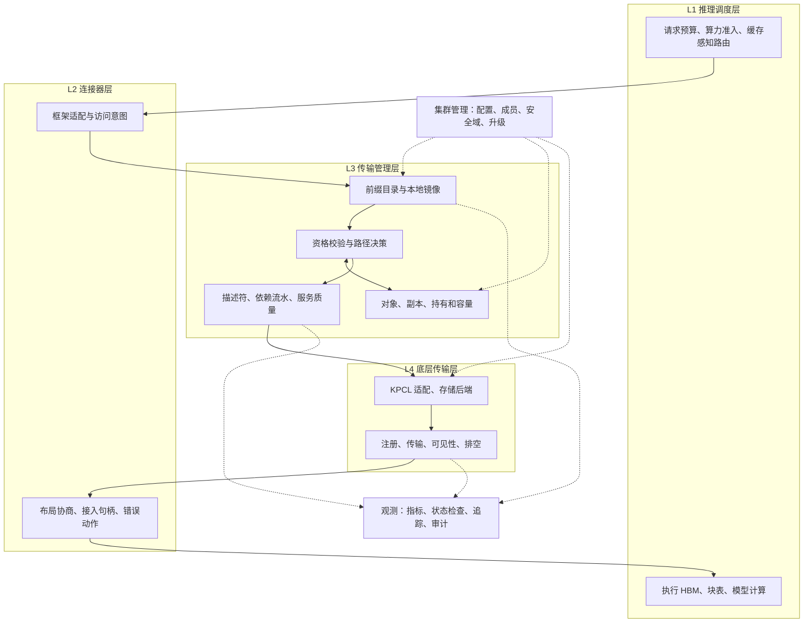
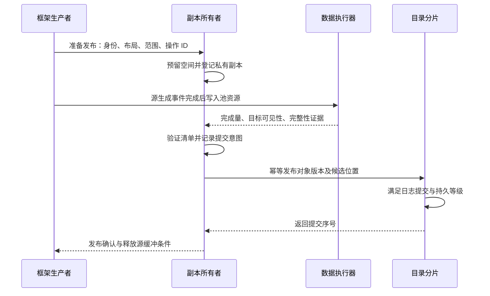
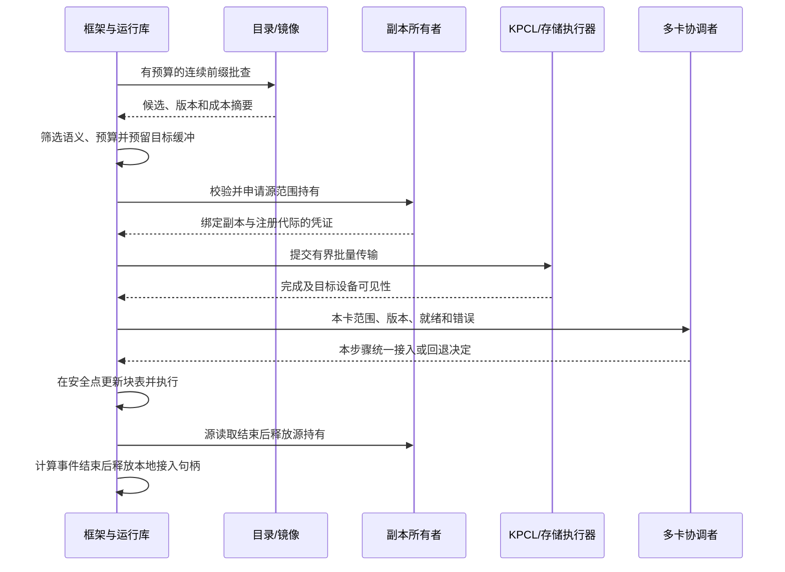
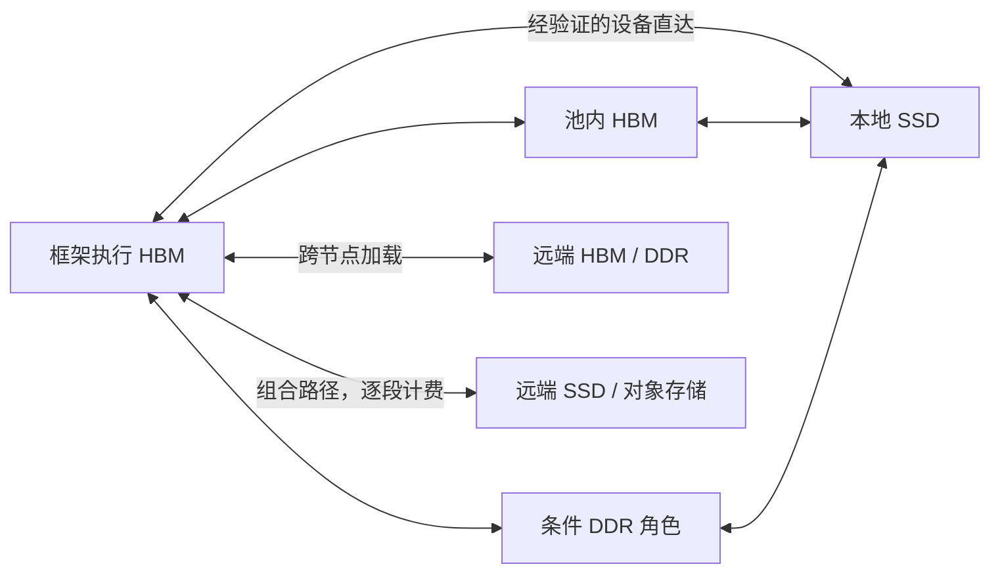

# KVC 存储池构建方案设计

版本：V1.0｜日期：2026-09-06｜状态：第一版方案设计，供架构评审与详细设计使用

KVCache（大模型注意力键值缓存，保存自回归生成中历史 Key 与 Value 激活状态，用于复用已经完成的计算）存储池，以下简称 KVC 存储池或本软件。本方案面向国产 AI 硬件上的统一异构缓存存储与调度，覆盖软件边界、部署、对象和元数据、接口、数据路径、容量、安全、可靠性、运维及验证。

第一版采用进程内请求运行库、节点资源代理、分片目录和集群管理服务。框架保有执行显存与算力调度权；存储池管理已经封存的缓存对象及其副本，负责发现、持有、加载、发布和回收。数据路径根据实际能力启用，优先验证设备显存与固态存储直达。所有优化都要同时满足消费安全、加载净收益和请求时限。

本文中的“设计选择”是本版提出的实现方案，“已有目标”来自项目需求或验证规范，“算例”用于说明计算方法。接口草图、进程名、配置项均为拟议契约。本文没有新增硬件实测结果，也不表示所列需求已经实现或验收。

## 0. 设计依据与阅读路径

### 0.1 输入材料及使用顺序

| 标识 | 材料 | 本版使用方式 |
|---|---|---|
| A | [顶层架构设计与技术思考 v0.1](<D:/codes/reports/kvcache/unified_kv_memory/统一异构 KVCache 存储池顶层架构设计与技术思考_v0.1.md>) | 用户指定设计输入；吸收资源拓扑、流量和底层执行分析，校正其中未经证实的硬件与性能断言 |
| B | [顶层架构设计与八专题分析 V0.1](D:/codes/reports/kvcache/unified_kv_memory/KVC存储池_顶层架构设计与八专题分析_V0.1.md) | 用户指定设计输入；吸收权威状态、执行显存边界、完成语义和需求追溯，重新核对统计及方案缺项 |
| S1 | [SRS V2.3 评审意见收敛版](<D:/codes/reports/kvcache/unified_kv_memory/KVCache SRS需求列表 V2.3_评审意见收敛版.xlsx>) | SRS（软件需求规格）正式功能和验收输入，以根目录当前文件为准 |
| S2 | [全量需求树 V2.3.1](D:/codes/reports/kvcache/unified_kv_memory/统一异构KVCache存储池_全量需求树_V2.3.1_SR项目贡献补充版.xlsx) | SR（可独立交付和验收的系统组件）与 AR（组件内部开发工作包）的组织和来源映射 |
| S3 | [总体架构与 SRS 评审导读 V2.3.2](D:/codes/reports/kvcache/unified_kv_memory/统一异构KVCache存储池总体架构与SRS评审导读_V2.3.2评审稿.md) | 四层责任、固定 Mooncake 基线、产品边界和阶段定义 |
| S4 | [Benchmark 公共契约与证据分级规范](D:/codes/reports/kvcache/unified_kv_memory/提前验证方案设计/验证计划方案设计/Benchmark公共契约与证据分级规范.md) | 对照基线、统计分母、证据等级和验收结果规则 |

A 在本轮开始时未被 Git 跟踪，按用户明确指定作为审阅输入；B 与 S1～S4 均在 Git 清单中。其他未受控演进稿不作为本版依据。源文档内的建议和指令性语句均作为待审设计内容处理，不能替代本次构建方案的任务范围。

本轮直接读取 S1、S2 的数据行，得到以下结果：

| 统计对象 | 核对结果 | 核对位置 |
|---|---:|---|
| 正式需求 | 144 条 | S1 四层页：L1 21、L2 22、L3 68、L4 33 |
| 工程建议 | 5 条 | S1“软件工程开发实施建议”A2:A6 |
| 来源映射 | 149 条，正式需求与工程建议均有映射 | S2“追溯与覆盖”A5:A153 |
| 系统交付组件 | 38 个 | S2“SR系统设计”A5:A42 |
| 开发工作包 | 203 个 | S2“AR开发认领”A5:A207 |

B 关于“工程建议共 21 条、只有 5 条完成映射”的说法与当前 S1 不符，本版予以更正。上述核对证明编号集合和映射数量一致；需求描述、目标列和验收文本仍存在语义不对应之处，见第 2、20 章。

### 0.2 章节用途

| 阅读目的 | 章节 |
|---|---|
| 确定产品范围和架构 | 第 1～4 章 |
| 开展接口、对象与目录详细设计 | 第 5～10 章 |
| 实现分层、并行协作和资源控制 | 第 11～13 章 |
| 完成生产安全、可靠性和运维设计 | 第 14～18 章 |
| 组织验证和需求评审 | 第 19～20 章、附录 A～C |

## 1. 目标、使用范围与首版边界

### 1.1 系统要解决的问题

大模型推理会重复处理相同的系统提示词、会话历史及部分业务前缀。将可复用的缓存保存下来，能够减少 Prefill（输入预计算阶段，计算提示词对应的模型状态）开销。但缓存发现、传输、转换和接入也有成本，命中位置过远、布局不兼容或加载排队过长时，复用会使请求变慢。

存储池需要把分散资源转化为可管理的缓存对象服务：知道对象由谁生成、是否还能读取、位于哪里、如何安全加载，以及当前是否值得加载。Token（模型处理和生成文本的基本单位）用于计量输入和输出长度。系统收益通过 TTFT（首 Token 响应时间）、TPOT（每个输出 Token 的生成耗时）、有效请求吞吐和资源占用评价，不能只用目录命中率。

HBM（高带宽显存，存放推理设备上的执行数据）、DDR（主机内存）和 NVMe SSD（通过 NVMe 接口访问的固态存储）具有不同的性能与故障特性。池容量增加主要扩大温冷缓存保留范围；Decode（逐字生成阶段）的活跃缓存默认驻留框架执行 HBM。把远端容量映射到地址空间，并不等于获得同等性能的显存。

### 1.2 软件职责和外部责任

| 责任方 | 必须承担 | 向其他方提供 |
|---|---|---|
| 推理框架及服务调度器 | 模型执行、请求接纳、执行 HBM 分配、块表、设备计算事件、多卡集合通信步骤、输出进度 | 语义身份、真实布局、请求剩余时限、目标缓冲及生命周期、重算成本画像 |
| KVC 软件 | 对象身份和状态、目录、候选筛选、成本决策、池资源分配、分层和迁移、消费资格、传输编排、可观测性 | 查询计划、可消费句柄、失败动作、容量和路径摘要 |
| KPCL 团队 | KPCL（承载本软件控制消息和数据传输、封装底层通信能力的接口库）的实现与底层适配 | 能力表、受保护句柄、异步操作、完成/可见性、反压、排空、错误和实际路径证据 |
| 平台与设备团队 | 驱动、固件、互联、设备访问隔离、存储直达和故障终止能力 | 支持组合、限制、诊断计数和设备恢复方法 |
| 集群运维平台 | 身份与凭据服务、部署、监控后端、制品和配置分发 | 稳定的管理通道、审计、运行环境和告警入口 |

KVC 可以校验目标句柄的范围、代际和写权限，但不接管框架剩余执行显存的总账。框架把尚未分配或已释放的目标地址交给存储池，属于缓冲契约错误；存储池应返回错误并隔离相关操作，不能尝试通过隐式主机拷贝补救。

### 1.3 第一版方案覆盖与分批实现

| 能力集合 | 首版方案 | 实现推进方式 |
|---|---|---|
| 对象、目录、发布、加载、接入、释放 | 完整定义 | 首个最小闭环即具备；先接一套受支持框架与真实设备路径 |
| vLLM、SGLang（开源大模型推理框架）接入 | 共用连接器契约，分别实现适配 | 首个连接器跑通后扩展第二个；两套框架均保留产品需求追溯 |
| HBM、DDR、本地 SSD、远端资源 | 统一建模，按路径分别准入 | 本地/跨节点加载、SSD 分层依次验证，远端对象存储保留后端接口 |
| 分片目录、故障恢复、配额、审计 | 纳入生产设计 | 原型可缩小规模，生产交付需完成高可用及恢复验证 |
| 远端直读、逐层加载、硬件多播、硬件重映射、DPU（承担通信或安全卸载的数据处理器）卸载 | 条件能力 | 各自有支持矩阵、关闭方式和替代动作，不能用接口存在推断能力成立 |
| 任意模型、任意框架版本、任意硬件组合 | 不作无条件兼容承诺 | 每个发布包列出实际验证组合及限制 |

Mooncake（项目选定的开源存储与传输开发基线）用于既有接口和工程基础。按 S3 采用固定版本上的重构与架构增强；本方案不增加跟随任意上游版本、恢复原生行为或修复无关原生问题的义务。产品自身的版本升级、数据格式兼容和回退仍必须设计，见第 18 章。

## 2. 两稿交叉核对与本版取舍

以下记录影响实现正确性、边界或验收的差异。文风上的口号、绝对承诺和重复总结已在正文重写，不逐句保留。

| 问题及来源 | 核对判断 | 本版处理 |
|---|---|---|
| A 将 L1 命名为接入、L2 为控制，与 S3 四层定义不同 | 会使原有需求编号映射错层 | 固定为 L1 推理调度、L2 连接器、L3 传输管理、L4 底层传输；管理/控制/数据三面另作部署视角 |
| A 五类进程没有单列目录服务；B 明确独立目录 | 高频查询、可靠提交和节点资源管理的故障责任不同 | 采用运行库、节点代理、目录、控制器及可选 I/O 执行进程；不按组件数机械拆进程 |
| A 强制远读可变前缀树，并给出 2～3μs 固定耗时 | 多次指针追踪存在串行往返、生命周期和一致性问题 | 初版批量控制查询；保留不可变摘要单边读的专项验证，不能把远读等同于授权 |
| A 的 64B 结构体 | 字段合计 72B；在常见 64B 对齐 ABI（应用二进制接口，约束数据与调用布局）下结构体大小会补齐至 128B | 拆成固定摘要、区间数组和冷元数据；第 6 章给出可检验的 64B 单区间草图 |
| A 用 16 位租约代际 | 易回绕，也未区分重启和注册世代 | 使用足够宽的代际、启动标识和明确的回绕拒绝策略；句柄不只靠地址识别 |
| A 把 io_uring 固定缓冲、裸盘与显存直达等同 | 提交方式、页缓存旁路和设备直达是不同能力 | 逐路径验证设备内存注册、拓扑、驱动和完成语义；文件段与裸盘后端分别实现 |
| A 把 CPU（主机中央处理器）不拷贝与绕过 DDR 混用 | DMA（直接内存访问，由设备搬运数据）经过 DDR 时 CPU 仍可能没有读取正文 | 分别统计 CPU 读取/写入正文、CPU 拷贝及 DDR 正文 DMA 字节 |
| A 用信号捕获承诺设备异常后 500μs 内无感恢复 | CPU 映射异常不覆盖异步设备内核故障，跳转恢复还有语言与运行时限制 | 设备错误由底层报告，框架按上下文状态恢复；禁止把信号处理器当作通用回滚引擎 |
| A 以原子门铃保证八卡同步并消除偏斜 | 软件组内同意、提交偏差和设备完成是三件事 | 首版要求组决策一致和可测提交偏差；跨设备原子触发列为条件能力 |
| A 多个消费者拉取同一源被归为多对一拥塞 | 请求方向与正文方向混淆，热点源主要是出口竞争 | 分开建模控制查询汇聚、正文一对多和多源正文汇聚 |
| A 第一层先到可隐藏后续全部传输 | 是否隐藏取决于逐层依赖、框架和算子支持 | 用实际依赖图计算重叠，保留后续层等待和最慢卡成本 |
| A 的 32K Token/340MB、120ms→30ms 算例 | 缺少模型、布局、卡数与瓶颈链路；不能形成规格 | 使用完整模型参数的独立算例；区分每卡字节、模型总字节及共享链路流量 |
| A 把各模块 P99（99% 样本不超过该值的时延分位数）相加作为总 P99 | 分位数不能直接相加证明端到端分位数 | 直接统计同一请求端到端样本，模块预算用于定位和风险分配 |
| A 将 PFC（按优先级暂停流量）/ECN（显式拥塞通知）与绝对无丢包、队列号与固定优先级绑定 | 流控配置不能证明所有负载无丢包，队列编号也非通用优先级 | 由平台映射业务类别，验证拥塞反馈、停顿传播和后台进度 |
| A 对开源序列化和固定毫秒开销作普遍判断 | 未给固定源码位置和相同条件基线 | 不沿用；以固定包测量控制消息和正文路径开销 |
| B 的工程建议数量 | 当前 S1 为 5 条且全部有映射 | 按第 0 章核对结果更正 |
| S1 双副本与 B 三投票副本建议 | 三副本方案改变部署和容错假设 | 本版建议三投票副本，但单列需求变更，不宣称已满足原 N=2 配置 |
| 两稿对启动、恢复、容量和运维篇幅不足 | 缺少从设计到上线的连续流程 | 补充建池验收、分片迁移、崩溃点恢复、租户总账、存储段、升级与故障操作 |

## 3. 总体架构与状态责任

### 3.1 四层结构



图中实线表达软件责任和结果传递；正文数据经设备通路在源资源与目标 HBM 之间移动，不经过图中每个软件模块拷贝。

### 3.2 管理层、控制面与数据面

| 运行视角 | 工作内容 | 时延与隔离原则 |
|---|---|---|
| 管理层 | 池创建、成员和分片配置、授权、配额、升级、审计 | 配置事务可靠持久化；不要求每个请求远查管理服务 |
| 控制面 | 前缀查询、对象校验、持有、成本判断、计划和组协调 | 本地快照、批量消息、有界队列；超出预算返回明确动作 |
| 数据面 | 正文传输、布局变换、存储读写、完成及排空 | 设备异步执行、受限在途量；完成通知必须关联目标可见性 |

Host CPU 零数据拷贝（CPU 仅下发控制指令、不参与正文搬运，Host Payload Touch Bytes 严格为 0）是默认主路径目标。元数据处理、设备提交和完成收取仍消耗 CPU，不能将该目标解释为整机 CPU 占用为零。

### 3.3 四类权威状态

| 状态 | 唯一权威 | 可复制内容 | 派生副本的限制 |
|---|---|---|---|
| 池配置、命名空间、成员和授权代际 | 管理一致性服务 | 版本化配置与授权快照 | 过期后停止新增相关授权，不能无限沿用 |
| 前缀发布、目录分片、候选副本位置 | 目录分片状态机 | 已提交的查询摘要 | 仅用于发现，不能凭旧位置授权 |
| 物理副本、注册区、访问持有和安全回收 | 副本所在节点的有效所有者 | 只读状态、有限持有凭证 | 新操作仍受所有者代际和设备生命周期约束 |
| 执行 HBM、块表、计算流和请求进度 | 推理框架 | 受控缓冲句柄和设备事件 | 存储池不能自行延长执行缓冲生命周期或复用缓冲 |

一个逻辑对象可以有多个物理副本；每个副本有自己的所有者和注册代际。目录保留对象位置不表示该位置的数据在重启后仍然存在。

### 3.4 全系统不变量

1. 未封存正文、未满足完整性策略或尚未达到目标可见性的区域不可接入计算。
2. 授权必须绑定语义域、对象内容版本、物理副本与注册代际；路径切换不能扩大权限。
3. 目录候选、传输已提交、CPU 收到完成、设备可以消费、正文持久化分别表达，不能复用一个含糊的完成位。
4. 物理区间只有在本地读者、框架事件、远端持有及设备在途访问都结束后才能复用。
5. 多卡参与者对可复用前缀、版本和本次步骤的动作达成一致后，才能进入依赖该缓存的计算。
6. 所有队列、引用、旧快照、重试和后台任务都有容量或时间上限；结果未知时保留隔离状态。
7. 非兼容语义、无收益路径、权限不足或证据缺失必须返回可解释状态。专家策略不能绕过这些检查。

## 4. 存储池构建、拓扑与部署

### 4.1 建池前的资源盘点

先划分管理域、安全域、故障域、互联域和资源所有权域，再决定进程部署。同机箱内的两块设备可能无法直接访问彼此内存；同总线可寻址资源也可能属于不同租户。

每个节点登记 CPU、NPU（神经网络处理器）、网卡、SSD、驱动与固件版本、设备连接、可用额度和故障隔离方式。NUMA（非一致内存访问，表示处理器到不同内存位置的距离）和 PCIe（连接处理器与外设的总线）拓扑必须进入导入清单。

| 导入项 | 至少记录的内容 | 决策用途 |
|---|---|---|
| 地址与注册 | 支持的内存类型、注册粒度、最大区间、导入方式、只读/写权限、撤销能力 | 决定能否进程内执行或拆出 I/O 进程 |
| 链路 | 方向、实测有效带宽、首批时延、最大分段、共享上行口、错误检测 | 形成路径图和成本输入 |
| 可见性 | 源可复用、目标内存可见、目标设备可见、存储持久完成的具体事件 | 确定发布、接入和回收条件 |
| 隔离 | 设备保护域、队列限速、租户密钥、映射撤销、重置影响范围 | 决定是否可跨租户共享和安全降级 |
| 存储 | 块格式、对齐、文件/裸盘接口、稳态读写、寿命、断电保护与刷新语义 | 选择分层后端和持久化等级 |
| 运行时 | 框架、算子、设备流、跨进程内存导入、图执行限制 | 决定批量加载、逐层流水和句柄接入 |

Linux PCI P2P DMA（外设之间直接访问彼此内存）文档明确要求按设备拓扑和驱动支持判断可达性；部分设备内存也不能直接用于普通读写接口。因此部署探测需要真实读写和撤销验证。[Linux P2P DMA 文档](https://docs.kernel.org/driver-api/pci/p2pdma.html)

### 4.2 支持的拓扑形态

| 形态 | 资源组织 | 适用范围与限制 |
|---|---|---|
| 单节点多卡 | 计算与池资源同机 | 对象、接入、同机分层功能验证；不代表跨节点可靠性 |
| 计算存储融合 | 每个计算节点捐出部分 HBM/DDR/SSD | 本地优先，近端复用；需限制后台存储对计算设备争用 |
| 计算存储分离 | 计算节点与 DDR/SSD 资源节点分离 | 容量独立扩展；完整计入存储侧、网络与计算侧路径 |
| 总线共享域 | 经验证的共享内存互联和资源 | 热元数据、只读摘要、条件远端直读；需明确一致性及故障模型 |
| 多机架混合 | 机架内近端资源与跨机架路径共存 | 按故障域放副本，限制跨机架热查询、预热与重建流量 |

URMA（通用远程直接内存访问，提供用户态高性能远端通信接口）和 UBMEM（统一总线内存直通共享能力，本项目用于描述跨节点或异构设备共享内存访问的底层能力）由 KPCL 适配。具体平台服务名和接口以实际供应清单为准，不从抽象名称推断缓存一致性或任意设备可访问。

### 4.3 进程、数量与故障边界

| 实体名称（设计建议） | 部署和数量规则 | 主要职责 |
|---|---|---|
| `libkvc_runtime` | 接入的框架调度/工作进程内加载，不新增进程 | 连接器、局部查询、计划、目标事件、接入和多卡协调 |
| `kvc-node` | 每个提供或消费池资源的节点 1 个 | 对象所有权、池额度、注册资源、镜像、生命周期及节点恢复 |
| `kvc-directory` | 每目录主机 1 个进程，可承载多个分片 | 前缀发布、分片日志、查询读模型、失效和重分片 |
| `kvc-controller` | 生产建议 3 实例，任务按代际选出有效执行者 | 配置、成员、分片分配、节点排空和升级编排 |
| `kvc-io` | 每 I/O 亲和域按需 0～1 个，压力测试后调整 | 存储队列、通信上下文、批量提交、完成和排空 |
| 管理一致性服务 | 建议 3 个独立投票成员 | 低频配置和控制器协调，禁止保存全量热前缀 |
| 观测采集器 | 复用每节点现有采集实例 | 异步汇总指标和日志，不转发正文 |
| 可选中继 | 按热点和拓扑启用，可先作为执行器任务 | 受配额约束的树状转发；验证后再决定是否独立服务 |

若设备运行时不支持跨进程导入缓冲及关联完成事件，数据执行嵌入框架进程；节点代理仍负责资源管理。不能先固定侧车形态，再增加正文拷贝解决上下文不兼容。

数量算例：2 个计算节点各运行一个 TP=8（张量并行，把模型张量分到 8 张卡协同计算）实例，另有 2 个存储节点与 3 个管理/目录节点。若计算侧各设 2 个 I/O 域，存储侧各设 1 个，则 KVC 常驻服务为 4 个节点代理、6 个 I/O 进程、3 个目录、3 个控制器，共 16 个。管理一致性服务和既有推理进程另计。改为进程内执行后，相应减少独立 I/O 进程。

### 4.4 实际构建步骤

| 步骤 | 操作及输出 | 进入下一步的条件 |
|---|---|---|
| 1. 建立管理基础 | 固定软件包、凭据、管理地址、池 ID 和集群代际 | 配置可持久化，管理成员故障模型明确 |
| 2. 节点注册 | 上报设备、故障域、支持组合与路径探测结果 | 不支持和未验证路径分别标记，不默认可用 |
| 3. 划出资源 | 所有者显式捐出池额度，创建注册区和存储卷归属 | 执行 HBM 与池 HBM 不重复承诺；存储卷用途可确认 |
| 4. 初始化目录 | 建立分片、复制组及版本化路由 | 发布确认和故障期行为可验证 |
| 5. 下发配置 | 节点接收配额、路径、安全与观测快照 | 各节点回报实际生效版本，缺失配置拒绝相关能力 |
| 6. 接入框架 | 协商协议、语义、布局、缓冲和设备事件 | 写入、发布、查询、加载、接入、释放均可闭环 |
| 7. 启用分层 | 验证 HBM↔SSD；逐项启用 DDR 角色和远端资源 | 记录实际字节流、CPU 参与、收益及失败动作 |
| 8. 开放业务 | 按受测组合逐步接入请求和后台压力 | 正确性、容量、混压和恢复证据达到对应阶段要求 |

节点生命周期采用 `DISCOVERED → PROBING → REGISTERED → SERVING → DRAINING → OFFLINE`。探测失败进入隔离，重新上线使用新启动代际。每次重试建池操作都带同一操作 ID，避免创建重复注册区或重复分配额度。

### 4.5 部署资源隔离

请求线程与目录写入、日志刷新、数据库压紧、全量快照传输分开。按 NUMA 域放置共享表、队列与执行线程，预分配常用对象和缓冲。锁页额度按工作集配置，并先预触页；不能把整机内存锁住来规避容量设计。

容器和宿主机服务均可使用。容器方案需明确设备访问、共享内存、内存锁定、CPU 配额及重启后的句柄失效；设备访问权限按实际后端最小化配置。基础管理发现使用独立通道，避免 KPCL 启动前又依赖通过 KPCL 获取自身配置。

## 5. 框架连接器与北向接口

### 5.1 调度器与工作进程协作

调度器在请求排队期间计算或复用语义身份，发起有预算的前缀预检测。工作进程消费统一计划，准备本卡缓冲并关联计算事件。检测尚未完成时，调度器依据剩余时限决定短暂等待、部分复用或重算，不能将异步查询改写成无界等待。

同一个 TP 请求尽量由组协调者批量查询一次，再按 rank（并行实例中负责一个分片的工作成员）下发位置和布局片段；各卡仍要验证自身目标区间、版本及可见性。框架的本地前缀缓存可以先返回本地可用结果，存储池补充其他可复用区间。两套缓存共享块时必须统一持有与释放关系，防止框架先释放存储池仍在读取的区域。

### 5.2 接口族及语义

下列名称表示拟议接口。S1 已有 `put/get/prefetch/evict/get_status/get_transport_stats` 及三阶段发布接口要求，本版通过兼容外壳保留这些操作，内部使用显式生命周期契约。

| 接口族 | 输入和输出 | 行为约束 |
|---|---|---|
| 初始化与协商 | 协议/布局版本、功能列表、设备上下文 → 会话与支持集合 | 协商交集，无兼容格式时拒绝接入 |
| 模型注册 | 规范化语义身份、实际布局 → 语义 ID、布局 ID | 身份和布局版本固定后只读，模型更新创建新版本 |
| 批量查询 | 前缀键向量、目标设备、预算、租户 → 连续候选及初步计划 | 返回连续边界、缺失后缀、成本和有效期，不返回可直接消费的裸远端地址 |
| 获取/加载 | 计划、框架目标缓冲、组上下文 → 异步任务票据 | 重新验证计划前提；拒绝过期句柄及禁止路径 |
| 接入 | 目标可见性证据、组决定 → `AttachHandle` | AttachHandle（接入句柄，绑定可消费缓存范围、设备和释放方法）只覆盖已经安全就绪的范围 |
| 分段发布 | `publish_prepare/commit/abort` → 发布操作结果 | prepare 预留对象，commit 在正文证据完备后公开，abort 进入取消和回收流程 |
| 预取 | 目标预测、优先级、预算 → 可取消票据 | 不能突破 HBM 和在途额度，实际消费时重新校验 |
| 释放/淘汰 | 句柄、设备结束事件或对象版本 → 已接收/安全释放状态 | 逻辑解除引用与物理可复用分开返回 |
| 状态/统计 | 对象、票据、路径或租户 → 限域状态 | 管理检查可读完整信息，热路径返回紧凑结果 |

Python Protocol（Python 层接口约定）和 gRPC IDL（跨进程调用的接口定义）用于兼容适配、管理与符合性测试。高频工作进程调用可落到原生库。跨进程或网络消息不能传普通进程指针；具体调用方式必须绑定到性能测量边界。

### 5.3 访问意图与计划结果

访问意图表达用途、目标设备、对象范围、时限、可接受布局、共享权限、完整性要求、允许回退和预测复用次数。底层把这些条件转换成实际路径，框架无需在常规调用中指定网卡或存储协议。

QueryPlan（查询与放置计划，描述选中的副本、加载或重算动作及执行前提）至少含以下字段：

```text
plan_id, request_id, attempt_id, policy_revision
semantic_id, namespace_epoch, continuous_prefix_span, missing_suffix
object_versions, source_replicas, source_holds, layout_plan
target_device, required_target_bytes, target_buffer_generation
group_epoch, rank_slices, required_ready_ranges
predicted_queue_us, predicted_load_us, predicted_attach_us
predicted_sync_us, predicted_interference, recompute_boundary
capability_revision, remaining_budget_us, valid_until_local
allowed_fallbacks, selected_action, reason_code
```

计划失效的触发包括所有者重启、源副本隔离、授权撤销、目标缓冲变化、能力更新、请求取消与预算耗尽。计划不是一次生成后永久有效的执行命令。

### 5.4 目标缓冲与源持有的生命期

框架提供的缓冲契约含设备上下文、区域句柄、区域代际、偏移、长度、写权限、布局和完成事件关联方式。设备指针只允许在合法上下文内解析。

同一目标区域同一时刻只有一个获准写入的尝试。重试使用新的目标代际；若旧硬件操作不能立即终止，就换用独立目标区域并保留旧区域到排空结束。忽略旧回调只能防止软件状态被覆盖，不能阻止硬件迟到写。

源持有保护源副本完成读取。拷贝到本地显存后，源读取已经结束且底层允许源复用时，可以提前释放源持有；框架本地接入句柄继续保护目标 HBM，直到计算结束。远端直读则要把源持有延长到最后一次设备访问结束。这两个生命周期不能合并成一个跨整个请求的引用计数。

### 5.5 错误、状态与框架动作

| 状态 | 含义 | 建议动作与限制 |
|---|---|---|
| `CONSUMABLE` | 指定范围已在目标设备安全可见 | 组内核对后接入 |
| `NEED_LOAD / NEED_COPY_TO_HBM` | 有可用源，尚未在目标就绪 | 核对预算与缓冲，再异步加载 |
| `WAIT_READY / MIGRATING_RETRY` | 数据或位置仍在变化 | 仅预算内有限等待；可改选安全旧副本 |
| `MISS / STALE_RECOMPUTE` | 没有合格连续范围或版本失效 | 返回部分复用边界或重算建议 |
| `QUOTA_BLOCKED / BACKEND_BUSY` | 容量或队列受限 | 反馈重试提示，由框架排队、减速或重新准入 |
| `LEASE_CONFLICT / STALE_VERSION` | 无法取得本次有效持有 | 释放临时资源，重新选择或重算 |
| `VISIBILITY_TIMEOUT / CHECKSUM_FAILED` | 未取得可消费证据 | 隔离失败副本或目标范围，不返回成功句柄 |
| `FORBIDDEN_PATH / UNSUPPORTED_LAYOUT` | 策略或能力不允许 | 不静默降级，返回原因及允许替代动作 |
| `CANCELLED_PENDING_DRAIN` | 请求逻辑结束，硬件可能仍在访问 | 停止上层等待，保留缓冲直到安全释放事件 |
| `DEVICE_CONTEXT_LOST` | 设备上下文受损 | 框架恢复实例；存储池失效相关句柄 |

KVC 返回重算建议不等于拒绝业务请求，也不保证重算一定可行。算力、活跃 HBM 和输出状态由框架检查。推理服务的接纳、排队或拒绝保留在服务调度层。

## 6. 对象身份、布局与数据格式

### 6.1 逻辑对象与物理副本

逻辑对象是某一固定模型语义下的已封存连续前缀段。对象内容发布后不可修改；追加生成新的段，分支保留共同前缀，未完成的尾块由生产者私有维护。对象描述包含父前缀依赖和 Token 范围，副本记录描述某次物理存放。

| 标识 | 表示什么 | 发生什么变化时更新 |
|---|---|---|
| 语义 ID | 规范化模型和输入上下文语义 | 权重、词表、模板、位置、注意力或适配器等变化 |
| 对象 ID、内容版本 | 固定语义与前缀内容 | 新内容、新封存段；正文不就地覆盖 |
| 副本 ID、位置代际 | 一份物理副本及其当前位置 | 复制、迁移或重建 |
| 所有者启动标识、所有权代际 | 当前负责该资源的有效执行者 | 进程重启或所有权接管 |
| 注册区 ID、注册代际 | 底层地址授权及资源范围 | 注销、重注册、设备重置 |
| 请求尝试 ID、组代际 | 本次加载及多卡计算步骤 | 重试、回退或组重建 |

这些标识用途不同。对象内容未改变时，迁移仍必须更新物理位置和注册相关信息。

### 6.2 语义键构造

“模型、词表、模板、适配器、就绪、租约”是原有六维校验入口，完整语义身份还需覆盖权重版本、位置与注意力策略、精度、布局、分片和租户隔离。LoRA（低秩适配器，通过附加参数改变模型行为）必须使用实际版本或摘要，不能仅凭显示名称识别。

```text
SemanticIdentity = {
  identity_schema_version, model_id, weight_revision,
  tokenizer_digest, template_revision, adapter_revision,
  position_policy, attention_policy, model_config_digest,
  cache_format_revision, numerical_compatibility_profile,
  multimodal_input_digest, embedding_input_digest,
  tenant_domain, share_policy, cache_salt, namespace_epoch
}

PrefixKey = {
  semantic_id, parent_prefix_digest,
  token_start, token_count, token_digest, key_schema_version
}
```

字段编码使用类型标签、长度和固定顺序，区分“字段缺失”“空值”和“同字符串不同语义字段”。强摘要用于身份核对，短指纹仅快速排除候选；发生冲突时拒绝共享或回查完整身份。键哈希不替代租户鉴权。

同一文本段位于不同上文后面，产生的 KV 可能不同。RAG（检索增强生成，将检索内容加入输入）首版仅支持语义相容的连续前缀复用；任意文段拼接需要框架提供额外算法与正确性证据。图片、音频及直接嵌入输入不能只用占位 Token 识别。

vLLM 官方设计将父块哈希、块内 Token 和附加身份因素用于前缀键。本版由此采用明确的上文依赖与字段编码，但不假设项目固定版本具备当前文档的所有选项。[vLLM 前缀缓存设计](https://docs.vllm.ai/en/latest/design/prefix_caching/)

### 6.3 布局清单与兼容判断

布局清单由框架报告，至少包括模型层、KV 头数、每头维度、Token 块大小、张量步长、轴顺序、元素类型、量化比例、位置编码处理方式、rank 分片、对齐和附加状态。对于 MLA（多头潜在注意力，使用压缩潜在状态表示缓存）、滑动窗口及混合循环状态模型，按实际运行时状态结构计量，不能套用普通注意力的字节公式。

| 源与目标关系 | 方案动作 | 正确性条件 |
|---|---|---|
| 语义、布局完全相容 | 直接加载或共享 | 完整范围、版本、对齐及目标可见性满足 |
| 语义相容，物理轴顺序或分块不同 | 生成布局转换计划 | 明确输入输出、设备变换、额外空间和完成事件 |
| TP 切分不同 | 条件重分片或拒绝复用 | 证明头分片、复制和层范围可转换；计入重分布通信 |
| 精度/量化方式不同 | 首版默认拒绝，白名单开放 | 完成数值误差与生成质量验证，不能只验证字节数 |
| 模型或上文语义不兼容 | 拒绝复用 | 布局转换不能修复语义差异 |

DescriptorCompiler（描述符编译器，将逻辑块映射为满足后端约束的传输区间）只能合并物理连续、权限一致且布局相容的范围。源和目标同时连续时可合并为单段；只有一侧连续时，必须保留另一侧散布关系。合并前后须验证覆盖无遗漏、无重叠、无越界，不能为降低描述符数量拷贝正文到 CPU 缓冲。

### 6.4 区间描述和 64B 草图

ExtentManifest（连续数据块区间清单，描述逻辑 Token/层/分片到物理资源范围的映射）由对象头、布局、多个区间和完整性证据组成。完整清单长度随碎片数增加；64B 只作为一个区间摘要的设计选项。

```cpp
// 本地内存结构草图，不直接作为网络字节流或硬件描述符。
struct alignas(64) ExtentRefV1 {
    uint64_t region_id;
    uint64_t region_epoch;
    uint64_t offset_bytes;
    uint64_t length_bytes;
    uint64_t logical_span_id;
    uint64_t content_version;
    uint32_t layout_id;
    uint32_t device_id;
    uint16_t rank_id;
    uint16_t flags;
    uint32_t reserved;
};
static_assert(sizeof(ExtentRefV1) == 64);
```

字段合计 64B。对象 ID、所有者、完整摘要及租约放在清单头或关联表，不能省略安全字段来凑尺寸。生产实现还需校验对齐、标准布局、字段偏移和目标 ABI（应用二进制接口，约束数据与调用布局）。可独立写入的热点计数器按平台缓存行大小隔离；冷数组不必每项扩展到一条缓存行。

### 6.5 跨进程和持久格式

共享内存只保存区域内偏移、ID、长度和版本。跨进程原子字段须在目标平台上验证原子性和内存顺序，不能假定任意 C++ 原子实现都可跨进程。网络采用版本化显式编码，限制最大消息、最大区间数、整数溢出、字段组合和权限范围。

```text
ControlEnvelope = {
  protocol_major, protocol_minor, message_type, header_bytes, total_bytes,
  operation_id, request_id, attempt_id, sender_boot_id, owner_epoch,
  tenant_domain, expected_version, remaining_budget_us, schema_version
}
```

持久文件使用独立格式版本、字节序、长度和校验，不直接落 C++ 内存镜像。未知可选字段可跳过，未知必需能力必须拒绝。绝对单调时钟值不能跨节点比较；请求按各跳剩余预算形成当地截止点，必要时扣除网络和时钟误差保护量。

## 7. 元数据、前缀目录与并发访问

### 7.1 元数据清单与权威位置

| 类别 | 权威维护者 | 查询/共享位置 | 持久化及失效规则 |
|---|---|---|---|
| 集群成员、启动代际 | 管理服务 | 节点配置快照 | 持久保存；重启更新代际 |
| 拓扑、路径能力 | KPCL 与节点代理 | NUMA 本地只读快照 | 固定配置与版本保留，动态采样可重建 |
| 租户、安全域、配额 | 管理服务，节点消费额度 | 本地授权和额度表 | 授权持久化，撤销带版本及确认 |
| 规范化语义身份 | 框架注册，目录引用 | 本地身份表 | 已发布定义持久化 |
| 模型布局与容量画像 | 框架适配器 | 运行库布局表 | 按软件与模型版本保存 |
| 前缀键和连续区间 | 目录分片 | 本地缓存、节点镜像、远端精确查询 | 日志提交后派生读模型 |
| 快速目录摘要 | 目录已提交状态 | 紧凑哈希表/前缀树 | 可重建，不独立授权 |
| 对象逻辑头 | 对象所有者 | 节点对象表、目录对象摘要 | 发布内容字段不可变 |
| 副本位置与健康 | 副本所有者 | 节点热表和目录位置记录 | 易失副本重启后重新证明存活 |
| 逻辑到物理清单 | 分配器和布局编译器 | 热摘要内联，长清单按句柄读取 | 持久副本保存完整清单 |
| 注册区与受保护句柄 | KPCL 和资源所有者 | 合法上下文的解析表 | 重注册后旧句柄失效 |
| 就绪和可见性位图 | 执行上下文 | 本地原子状态或只读快照 | 不能把旧 Ready（就绪）位恢复为设备可消费证据 |
| 访问持有与租约 | 副本所有者 | 节点授权表，进程本地聚合引用 | 恢复时隔离未决持有，不盲目清零 |
| 多卡组状态 | 每卡槽位和组协调者 | 同机共享表或跨机控制消息 | 临时状态随组代际失效 |
| 请求意图和计划 | 请求协调者 | 进程内有界对象池 | 仅采样留追踪，重启不恢复执行 |
| 传输票据和完成 | 实际执行上下文 | 提交/完成环和任务表 | 未决操作靠排空证明结束 |
| 空间分配与额度 | 每设备分配器 | 分片单写表、预留批次 | 持久介质有分配日志和扫描恢复 |
| 迁移、压紧、重建任务 | 节点生命周期控制器 | 后台任务表 | 保存关键提交点与幂等 ID |
| SSD/对象存储索引 | 存储后端 | 读索引缓存 | 正文和提交记录分别验证 |
| 墓碑、命名空间失效 | 目录/管理服务 | 缓存代际和失效水位 | 满足镜像/授权安全条件后才清理 |
| 热度和成本模型 | 每线程聚合、后台模型 | 本地只读模型 | 可有限过期，不能替代安全校验 |
| 流量信用与在途额度 | KVC 策略、KPCL 执行 | 接收端及线程局部额度 | 丢失或重启时保守重建 |
| 完整性与错误证据 | KPCL/存储后端 | 消费判定热字段 | 详细故障异步归档 |
| 配置审计、日志、指标 | 管理和观测服务 | 独立观测后端 | 限流、脱敏、按保留策略归档 |

### 7.2 分片、最长前缀与批量查询

目录以命名空间、语义 ID 和前缀锚点做分片路由，虚拟分片映射到物理服务。选择锚点时同时考虑前缀局部性与热点分散；不得把一个长请求的每个小块分散成无限远查。

首版采用固定块摘要与连续范围索引。请求携带按序块摘要向量，路由器按分片批量打包，目录返回命中区间和候选副本。协调者按原始 Token 顺序合并，遇到缺块、语义不符或必要 rank 缺失就终止连续前缀。不能因为后面块存在而跨过缺口接入。

SGLang 的已有基数树可由适配器提供连续范围；vLLM 的块哈希输入转换为统一键。自研目录不强制复刻任一框架的可变树结构。每次查询限制最大键数、分片扇出、候选数和总字节，超出部分分页或放弃复用，避免少量超长请求占满目录。

目录查询可以返回候选及预生成计划；若目录与所有者分离，持有申请仍由所有者授权。将查询与持有合并为一次消息需要证明代理持有有效授权，不能只因减少往返而省去所有权检查。

### 7.3 本地缓存、过滤器与读取新鲜度

访问顺序为框架已有可用句柄、进程热缓存、节点目录镜像、远端批量查询。缓存条目携带命名空间代际、分片代际、提交水位、对象版本和所有者信息。已知陈旧的条目不参与接入计划。

Bloom Filter（布隆过滤器，以小内存快速判定键可能存在的结构）只能对其完整包含的那一版集合保证没有假阴性。镜像落后时返回“暂未发现”可以触发重算，但不能宣称当前全局目录确定不存在。收到更新断档、日志压紧或分片迁移通知后，停止依赖旧过滤器作精确否定，重建快照后再启用。

负结果缓存按命名空间/分片代际和短有效期维护，新发布通知可提前失效。热点查询合并使用 single-flight（同一键并发查询共享一次在途查询），设置等待者数量及独立请求截止时间；首个等待者取消不能错误取消其他仍有效的需求。

etcd（持久化集群配置的一致性服务）的 Watch 变更订阅不提供线性一致读保证。因此本地订阅镜像仍需记录版本和新鲜度，不能把订阅接通视为每次读取都最新。[etcd API 保证](https://etcd.io/docs/v3.5/learning/api_guarantees/)

### 7.4 目录持久化与副本

管理配置建议复用 etcd；高频目录采用独立分片状态机，复用成熟 Raft（通过多数成员提交日志的一致性协议）组件和持久键值引擎。RocksDB（嵌入式持久键值存储）可作为候选实现，最终选型需冻结具体版本、资源需求和许可证。

首版生产建议每分片三个投票副本，分散到独立故障域，多数副本满足持久提交条件后确认发布。S1 的 `L3-MC-PFX-REPL-004` 明确写 N=2；三副本是待评审变更。若保持两个投票成员，失去一个后不得声称仍能安全提交多数派写入；若引入外部仲裁，需另外说明旧主隔离和正文可用性。

数据副本数量与目录投票副本数独立配置。三份目录记录不能保护只有一份且掉电即失的正文。目录无多数派时停止新的权威写入；已有有效本地持有和框架独立执行缓存可继续使用，其他请求在预算内放弃复用。

### 7.5 并发与快路径实现

节点热状态按设备或 NUMA 分片，写入由单个所有者串行处理，读者访问不可变快照。RCU（读-拷贝-更新，通过替换快照并延迟回收旧版本保护并发读）用于目录镜像与对象位置切换。旧快照保留量有上限，长期不退出的读者触发诊断和准入限制。

普通字段并发写入后再检查版本号，仍可能构成 C++ 数据竞争。应使用真正不可变数据、经过验证的原子字段或受保护复制。共享表中的热引用、每卡就绪槽位和线程计数应避免频繁写同一缓存行；统计先本地聚合，后台汇总。

单边远读只对已提交、不可变、受保护的摘要区开放，消息中携带快照代际。旧摘要区在远端读取排空前保留，读取不一致或重试超预算时转控制查询。对跨节点原子更新、设备可见性和远端读者回收，必须使用平台内存模型，不能直接照搬单机 RCU。

### 7.6 热点与目录扩缩容

热点先增加本地摘要和正文近端副本，降低远查与远取；再按负载迁移虚拟分片。读模型可以复制，但权威写入顺序必须保持唯一。

分片迁移流程为建立新副本、复制一致快照、追赶日志、准备新路由代际、由原权威提交切换点、停止旧代际写入、发布新路由。旧端在过渡期仅提供有界重定向或受约束读取。迁移中的请求使用操作 ID 和预期分片代际去重；反复重定向超过预算即返回。

快照导入过程中不能把未追平的数据标为完整镜像。目录迁移和正文迁移使用独立任务和额度，避免扩容时同时搬移两类数据形成集中负载。

## 8. 生命周期、发布与安全回收

### 8.1 分开维护四组状态

| 状态对象 | 主要状态 | 需要解决的问题 |
|---|---|---|
| 逻辑对象 | 私有生成、封存、已提交、失效、墓碑 | 内容能否公开、是否仍符合语义版本 |
| 物理副本 | 分配、写入、就绪、迁移源/目标、排空、隔离、已释放 | 某个具体位置是否可访问 |
| 访问持有 | 申请、有效、撤销中、排空中、已释放 | 谁仍可提交访问、何时可回收 |
| 执行任务 | 预留、排队、部分提交、执行、目标可见、失败、取消待排空、终态 | 操作结果和缓冲是否可复用 |

S1 的 `INIT/WRITING/COMMITTED/READY/ACTIVE_ATTACHED/PREFETCHING/LOADING/MIGRATING/COMPACTING/EVICTING/TOMBSTONE/FAILED/QUARANTINED` 通过这些状态的组合投影保留。`ACTIVE_ATTACHED` 反映持有和框架接入；`MIGRATING` 反映副本任务，不必把整个逻辑对象标为不可读。旧副本仍安全就绪时，新副本写入失败不影响旧副本的既有读者。

### 8.2 对象发布顺序



可发现记录只能在相应正文证据满足后发布。持久正文还需先满足指定持久完成条件。对象可按独立封存段逐段提交；一个未完成段的 Ready（就绪）位不能被整对象粗粒度成功状态覆盖。

发布超时后查询操作结果，不能自动当作失败再创建不同对象。相同操作 ID、相同内容摘要重试返回原结果；相同操作 ID 携带不同内容返回冲突。去重记录保留到重试窗口和有关资源生命周期结束，不能无限增长。

### 8.3 崩溃点与恢复动作

| 崩溃位置 | 可见状态 | 恢复方式 |
|---|---|---|
| 已分配，正文未完成 | 对外不可见 | 排空在途写，回收临时空间；无法证明停止则隔离 |
| 正文完成，尚未记录提交意图 | 对外不可见 | 可丢弃孤儿；禁止仅凭旧 Ready 位恢复 |
| 提交意图存在，目录未提交 | 正文暂不可发现 | 核对持久记录/设备存活后幂等重发，或回收 |
| 目录已提交，确认响应丢失 | 可能已被发现 | 通过操作 ID 查结果，不重复发布不同版本 |
| 目录存在，易失 HBM 丢失 | 元数据仍在、正文不在 | 副本立即失效，改选其他副本或重算 |
| SSD 正文部分写或尾部记录损坏 | 不满足持久提交条件 | 截断/忽略未提交尾部，隔离受影响副本 |
| 删除提交后旧镜像重连 | 旧记录可能重放 | 校验命名空间代际和墓碑，阻断旧副本复活 |

这种设计允许暂时存在不可发现的有效正文，不允许可消费目录记录指向半写数据。它使用数据先完成、目录后发布及后台对账，不依赖跨设备分布式事务。

### 8.4 加载、接入和释放



回退到较短前缀时必须匹配所有必要 rank 的同一语义版本。已输出 Token 后发生故障，是否能继续生成取决于框架的输入历史、采样状态、随机数状态和输出进度；存储池仅提供缓存恢复及失效信息。

### 8.5 迁移与压紧

迁移先预留目标空间，在源可读取期间复制；目标完整性和可见性满足后发布新副本，再把新读者导向新位置。旧读者继续使用旧位置，旧区间进入排空。并发删除或命名空间失效优先阻止新发布，迁移完成不能把被删除对象重新公开。

活跃对象的优化采用复制迁移或延迟整理，不能移动后立即覆盖旧地址。软件位置指针切换只改变未来解析；硬件页表重映射还需要设备支持的地址翻译失效和访问终止。硬件 Atomic Remap（在满足可见性后原子切换地址映射）列为条件能力，软件路径需先独立成立。

### 8.6 持有、租约和代际隔离

ViewGuard（视图租约安全守卫机制，管理远端只读访问的持有、撤销及故障状态）由对象授权、设备映射和框架消费三方组成。租约到期后停止新的接入与提交；已提交设备访问必须有结束或终止证据。

副本所有者只在有效所有权期限内授予持有，授予期限不得超过自身服务期限。客户端从发送申请时刻保守计算可用期限，并扣除往返和误差保护量；服务端保留至少覆盖授予期限的资源。跨节点时钟漂移界、网络延迟处理和最大内核持续时间必须在平台契约中明确。无法满足期限保护的长访问改用拷贝或关闭视图。

fencing（用递增代际拒绝旧执行者的操作）在命令接收端执行；只有软件代际检查不能阻止旧设备直接访问。接管前需完成旧端授权到期及硬件隔离/排空，无法证明时隔离物理资源。不能以消费者心跳丢失为由把引用强制清零后复用空间。

### 8.7 安全回收与墓碑清理

回收顺序为停止新持有和新提交、取消未提交工作、等待已提交操作结束或被设备确认终止、撤销地址句柄、确认本地读者和框架事件退出、执行安全清理、归还配额。RCU 仅覆盖软件读者，设备和网络生命周期另行等待。

墓碑保留到相关目录镜像越过失效提交点，或旧镜像/授权已失效且相关资源已隔离。重启节点不能携带旧快照绕过该规则。对长期未回收对象记录阻塞者、在途票据和累计字节，达到上限时限流并报警，禁止以超时直接释放可被访问的内存。

## 9. 动态决策、缓存感知路由与加载准入

### 9.1 决策输入及先后顺序

CostEvaluator（成本预估模型，预测加载、转换、接入和重算的实际开销）读取有版本的路径、容量和负载快照。静态能力决定“能否走”，即时信用决定“现在能否提交”，成本模型决定“是否值得走”。不能用较低的预测耗时抵消权限或可见性缺失。

```text
读取请求预算和语义身份
  → 确认最长连续候选及各 rank 必需范围
  → 排除失效、无权限、无兼容布局、无安全完成能力的路径
  → 枚举有限数量的副本、路径和部分重算边界
  → 估算排队、持有、加载、转换、可见性、接入和组等待
  → 与当前本地重算方案比较，并核对剩余请求时限
  → 预留源持有、目标和在途额度，重新检查版本
  → 执行或返回有原因的部分复用/重算建议
```

初版限制候选数，使用分桶统计与简单可解释模型，避免在微秒预算内运行无界图搜索或在线训练。较复杂模型仅在证明更低错误加载率、可接受开销和稳定性后替换。

### 9.2 两项准入条件

复用执行须满足：拉取与加载总开销小于本地直接重算耗时，且加载后的剩余计算能够满足请求时限。总开销包含查询、授权、排队、转换、可见性、接入、多卡等待以及对前台任务的资源影响。

已经花掉的查询时间必须计入请求收益对账；从当前时刻选择下一步时，该时间属于双方共有的沉没成本，不应再重复加到某一个候选路径。每次放行保留适当预测误差余量，成本接近时优先选择较稳定的路径。

| 候选动作 | 需要计入的成本 | 首版准入条件 |
|---|---|---|
| 本地已接入复用 | 身份核对、引用和必要接入 | 同语义、同设备、有效持有 |
| Copy-to-HBM（拷贝到本地显存，通过 DMA 将源缓存搬到执行显存） | 源获取、传输、布局转换、目标可见性和接入 | 框架预留目标，路径安全且有净收益 |
| Direct-View（远端直读，设备直接访问远端缓存且不生成完整本地副本） | 映射、地址翻译、反复远读、设备停顿、续租和撤销 | 仅受测白名单，持续生成的 TPOT 约束满足 |
| SSD/对象回源 | 存储队列、读出、网络或暂存、转换及设备写入 | 真实恢复成本在预算内，不以容量大代替性能判断 |
| 部分前缀复用 | 安全连续前缀加载和后缀重算 | 块/层/rank 边界合法，由框架接受组合计划 |
| 重算 | 当前算力排队、预计算及必要显存 | 由框架完成资源准入，不能假定无排队或无内存成本 |

### 9.3 部分命中和多副本选择

按完整块和必要 rank 的安全边界枚举少量切点，例如本地完整范围、近端副本可用范围、远端连续范围。每个切点评估后缀重算和实际加载关键路径；不能按命中 Token 比例线性推算预计算节省。

副本选择需检查源设备、源出口、目标入口和共享总线。多个来源并行读取可能降低单源压力，也可能在接收端汇聚并增加排队。只对满足完整性、语义和授权的副本比较成本；部分完成后的重试以缺失范围为单位，不能把不同内容版本拼接起来。

### 9.4 缓存感知路由

服务路由器在选择推理实例前消费位置摘要和实例负载，比较排队、加载和重算的总预计完成时间。已有本地缓存是收益因素，但不能把所有请求压到同一个热点实例。KVC 提供摘要，路由器决定计算放置。

路由摘要带版本与有效期，选中后仍在目标实例重查可用范围。扩缩容、模型版本切换和池水位变化时异步更新摘要；发布成功不要求阻塞等所有路由缓存刷新。

### 9.5 校准、漂移和专家策略

按模型布局、路径、大小、并发、读写比和前后台负载分桶保存预测与实测差异。只在后台更新模型，用不可变版本替换；重大漂移可触发保守路径和降载。记录选中路径、弃用原因及错误加载率，避免只看平均误差掩盖尾部。

专家策略可指定偏好路径、禁止传输类型、强制本地显存或关闭预取，用于受控实验和故障绕行。权限、版本、可见性、完整性和物理回收条件不能被覆盖。强制选择超出收益边界的实验请求单独标记，不能混入默认策略成绩。

## 10. 数据执行与 KPCL 接口契约

### 10.1 传输责任分界

KVC 选择对象、范围、源副本、目标、组和时限；KPCL 执行受保护的通信操作，报告部分提交、完成、错误及可见性。模型语义、冷热判断和目录共识属于 KVC。底层设备队列、注册、访问终止和通信错误映射属于 KPCL 与平台。

SSD 边界单独冻结：KPCL 若提供存储扩展，KVC 使用该扩展；若只提供内存通信，KVC 存储后端负责文件/段与存储命令，跨节点内存通信仍经 KPCL。远端 SSD 不是一个可直接通过 RDMA（远程直接内存访问，由通信设备读写对端已授权内存）读取的普通内存句柄。

### 10.2 拟议南向接口族

| 接口族 | 输入/输出 | 必须回答的问题 |
|---|---|---|
| 能力与上下文 | `query_capabilities/open_context` | 哪些内存、权限、对齐、版本和进程/线程模型受支持 |
| 导入与注册 | `import_region/register_region` → 句柄 | 注册成本、所有者、代际、合法范围、何时可以注销 |
| 控制消息 | `send_control` → 票据/应答 | 是否可靠、是否重复、顺序作用域、重连与超时行为 |
| 批量提交 | `submit_batch` → 已接收段和票据 | 最大段数、部分接受、队列背压、是否隐式暂存 |
| 组和依赖 | `submit_group` → 组及子任务 | 哪些依赖在设备保证、提交偏差与组结果如何测量 |
| 可见性 | `ensure_visibility` → 指定目标证据 | CPU、远端内存、设备和持久存储的语义分别是什么 |
| 视图 | `acquire_view/revoke_view` | 只读保护、允许消费者、故障上报与访问终止 |
| 完成 | `poll/wait/query_ticket` | 完成量、失败段、源可复用、终态和回调唯一性 |
| 取消排空 | `cancel/drain/quiesce` | 逻辑取消后是否仍可能写，何时所有访问真正停止 |
| 流控观测 | `set_credit/set_class/query_stats` | 实际优先级、排队、重试、路径、字节及 Host 参与 |

上述名称是需要联合冻结的接口草图，不代表 KPCL 已发布 API。KVC 对每类接口提供模拟器与符合性用例，使上层开发不等待全部设备到齐；模拟器不能用于证明硬件性能。

### 10.3 完成与可见性证据

| 证据 | 可以允许的动作 | 不足以证明的事情 |
|---|---|---|
| 提交已接受 | 调用方登记票据并等待 | 正文已写入或源已经可释放 |
| 源读取完成 | 按后端契约释放源读持有 | 目标设备已经可以消费 |
| 目标内存可见 | 指定访问域可读取 | 其他设备或运行时也按同样顺序看见 |
| 目标设备可见 | 关联设备依赖后接入该范围 | 数据已经断电持久化 |
| 持久完成 | 在声明故障模型内恢复正文 | 目标计算设备已经拥有执行副本 |
| 排空及撤销完成 | 在相关读者退出后安全复用区域 | 无关上下文或其他范围也已经排空 |

可见性按“目标、范围、序号、机制”表达。不同目标不是简单递增等级。设备传输完成队列 CQ（记录操作完成或错误的队列）中的成功通知，必须通过后端定义的同步方式关联到实际消费设备。

NVIDIA 的 GPUDirect RDMA（外设直接访问 GPU 显存的通信机制）文档专门说明设备内存顺序要求；此处仅用于说明完成和可消费之间需要契约，不把其 API 直接移植为国产 NPU 能力。[GPUDirect RDMA 内存顺序说明](https://docs.nvidia.com/cuda/gpudirect-rdma/index.html#synchronization-and-memory-ordering)

### 10.4 批量编译、提交与流水

执行器先校验源/目标句柄，按连续性、最大分段和设备队列限制拆合并区间。单次应用提交可以包含多个硬件操作；不能把一次库调用写成一次硬件 DMA，也不能把 MB 级操作与 PCIe 事务包粒度混为一谈。

DAG（有向无环依赖图，用于表达任务之间的先后关系）串起源生成、读取、转换、目标可见、组协调和计算。批量等待有时间上限，短请求不能为了凑满大批被长期延迟。就绪回调只推进状态和投递后续工作，复杂日志与重任务放到独立执行队列。

支持逐层执行时，按第一可计算批次和后续批次分配时限；下一层只有其所需数据、前层结果及必要多卡状态都就绪才开始。框架不支持逐层依赖时按整段加载，不从预算中扣掉虚构重叠。

### 10.5 超时与错误

每个操作携带剩余预算，执行器在提交前和排队后检查。取消可停止未提交部分，已经提交的操作进入排空。票据保留部分完成集合和缓冲代际，终态最多向同一消费者交付一次，但网络重连仍由操作 ID 和查询结果解决重复通知。

未知结果不能盲目重发到同一目标。优先查询原票据；需要另起尝试时使用独立目标范围并隔离旧范围。断链检测、逻辑返回、路径切换和安全资源回收分别计时，不能用一个“故障恢复耗时”混合表达。

## 11. 分层存储、分配器与持久副本

### 11.1 图式资源模型



每条边都有方向、内存类型、完整性、可见性、对齐、权限、排空及性能条件。没有能力证据的边不能参与自动选路。路径允许跨过 DDR，也允许显式登记的暂存；发生暂存时记录各段实际字节、空间和排队成本。

### 11.2 DDR 角色化准入

| 角色 | 主要用途 | 启用或保留的依据 |
|---|---|---|
| 元数据/控制 | 目录、队列、对象头与配置 | 常驻工作集需要，容量与正文分开核算 |
| 本地温缓存 | 减少同节点反复 SSD 回源 | 实际复用收益覆盖驻留及带宽成本 |
| 远端内存层 | 跨节点共享温缓存 | 相对 SSD/重算有稳定收益，出口不过载 |
| 预取/突发缓冲 | 隐藏加载或平滑突发 | 预取有效率、取消浪费和峰值占用可控 |
| 注册池 | 复用长生命周期通信注册 | 记录用途；注册池内含正文时仍计正文 DDR 流量 |
| 回退暂存 | 平台不支持直达时的显式替代 | 策略允许、路径可审计、成本满足预算；不能记为直达成绩 |

Payload Bypass DDR（绕过主机内存，正文不经 Host DDR 在设备与存储之间流转）比 CPU 不拷贝正文更严格。DDR 经 DMA 暂存可以满足 CPU 不读正文，仍然不满足绕过主机内存。

### 11.3 分配器与容量总账

池分配器按设备、介质、安全域管理大注册区，区内使用偏移分配，避免逐块注册。初版采用大小分级、位图/空闲区间表和按设备单写，支持拆分、合并、连续区间预留与后台压紧。

容量统计至少包括已用、已预留、在途目标、迁移双份、旧版本待排空、隔离、后台工作区和可分配字节。配额检查使用“已用加已承诺”，不能仅查空闲计数。配额采用全局额度分配到节点、节点批次发放到工作线程，避免每个小块远程扣账。

框架执行 HBM 包括权重、运行时工作区、活跃 KV、图执行预留和受限预取区。池 HBM 来自显式资源捐出；同卡两种用途共用物理容量约束。容量压力不能靠存储池独立估算覆盖框架的真实准入判断。

### 11.4 水位、淘汰与预取

S1 的迁移条目给出 Low 70%、High 85%、Critical 95% 的初始水位，属于待按平台容量校准的已有配置输入。计算水位时纳入已承诺及隔离空间，并设置回滞（下降到较低阈值才解除限流）和最短稳定时间，避免反复迁移。

| 水位/情形 | 首选动作 | 仍需保护的资源 |
|---|---|---|
| 正常 | 按收益保留与受限预取 | 框架预留、突发和故障恢复余量 |
| 高水位 | 停止低价值预取，降低新缓存准入，选择冷副本下沉 | 目标空间和迁移暂时双份占用 |
| 临界水位 | 限制加载/发布，框架重新准入，保留必要换出通道 | 已接入活跃缓存和在途目标不得强制释放 |
| SSD 近满或写放大异常 | 限制接收新持久副本，后台回收无持有冷数据 | 日志、元数据恢复空间和后台最低进度 |
| 旧资源排空停滞 | 阻止继续积累同类任务并定位阻塞者 | 未证明静止的旧内存仍隔离 |

保留评分综合节省预计算、未来复用概率、加载成本、资源占用、租户优先级和干扰。初版用带回滞的水位与简化评分运行，复杂策略必须对照证明收益。

唯一可用副本的直接释放默认受保护。允许丢弃的可重算缓存也应先提交淘汰/失效，停止新持有并确认现有读者退出，再安全释放；有持久保留承诺的对象必须先建立替代副本或完成显式保留策略变更。

预取同时限制在途字节和落地 HBM，单独记录已消费、重复、取消、过期和无收益预取。S2 的预取额外 HBM≤10% 与流水额外内存≤15% 不能直接相加为额外可用预算，二者受同一个物理总账约束。

### 11.5 本地 SSD 后端

初版统一存储段接口，支持文件段实现和条件裸设备实现。文件段便于运维和恢复；裸设备需要自行承担空间索引、分配日志、元数据冗余和恢复工具。选择哪种后端由受测直接路径和稳态性能决定。

io_uring（Linux 异步 I/O 提交和完成接口）与 Direct I/O（绕开文件页缓存的 I/O）是可选提交手段，均不自动证明显存直达。地址、长度、偏移满足存储与设备约束的共同要求；项目 4KiB 对齐作为设计粒度输入，实际扇区、设备页和注册粒度由能力表确定。

持久段建议包含以下内容：

```text
段头：格式版本、池/设备归属、段代际、长度、校验策略
对象记录：对象/内容版本、语义 ID、布局 ID、逻辑范围、物理范围
正文区域：按实际 I/O 和设备要求对齐的数据
提交记录：操作 ID、正文长度、完整性证据、持久等级、提交序号
索引检查点：对象到段范围映射、空闲空间、日志恢复位置
```

追加写入后先完成正文刷新与完整性验证，再持久提交可恢复记录，最后发布目录。分配日志要能识别已预留未提交、已提交待发布、已删除待回收的空间。启动从检查点加后续日志恢复，扫描发现的孤儿不自动公开。

RocksDB 的批量原子更新和同步持久写是不同承诺；该区别同样要求本存储后端明确写入成功与断电可恢复之间的边界。[RocksDB 同步写说明](https://github.com/facebook/rocksdb/wiki/Basic-Operations#synchronous-writes)

### 11.6 持久等级与远端对象后端

| 持久等级（设计建议） | 确认条件 | 故障后预期 |
|---|---|---|
| 易失缓存 | 指定内存范围可见且可消费 | 节点/设备丢失可回源或重算，不能承诺保留正文 |
| 本地持久缓存 | 本地正文、清单和提交记录满足声明的刷新契约 | 在支持的存储故障模型内恢复；整盘损坏仍可能丢失 |
| 跨故障域持久副本 | 配置数量的独立域正文和提交均完成 | 容忍约定故障数量，重建受前台服务质量约束 |

远端对象存储后端保存对象键、内容版本、偏移、长度、校验/加密信息和持久状态。读取使用不可变对象版本及范围校验；不能把列举接口的返回及时性作为唯一发现依据。分段上传先完成后端提交，再发布 KVC 目录；中断上传和已失效孤儿由后台任务清理。

厂商后端的一致性、范围读、最大对象、并发和删除行为需要在接入时逐项固定。首版保留该扩展接口，不将所有对象存储都视为满足在线微秒或毫秒访问预算。

### 11.7 磨损、压缩与加密

监控 SSD 的逻辑写入、实际设备写入、写放大、寿命、坏块及近满时尾部时延。冷热策略需计入重复下沉和压紧写入成本；缓存失效优先回收索引，不同步执行全盘整理。

压缩、解压和有损精度转换分别声明能力与布局。仅在设备或受支持硬件完成且净收益成立时启用；不以 CPU+DDR 编解码作为默认回退。加密由安全策略决定，性能不足时换用满足保护要求的路径或停止复用，不能把明文路径作为自动降级。

## 12. 业务场景与多卡通信协作

### 12.1 十二类使用场景

| 场景 | 控制流程 | 正文路径及重要边界 |
|---|---|---|
| 公共系统提示词 | 共享域校验、热点查询合并 | 同设备共享一次加载；跨域共享必须显式授权 |
| 多轮会话恢复 | 会话定位、连续前缀、版本校验 | 温冷副本恢复到 HBM，追加尾部私有 |
| RAG/工具模板 | 同上文语义和连续命中判断 | 相同文段不能任意拼接成可消费 KV |
| PD 分离 | 目标协商、容量信用、分段就绪及交接提交 | PD 分离（将输入预计算与逐字生成分别部署）按单请求 P→D 交接建模 |
| 分块预计算 | 块与层依赖、先后事件 | Chunked Prefill（把长输入拆块计算）只在相应数据依赖满足后启动计算 |
| 张量/流水并行 | 多卡安全前缀、布局与步骤代际 | 必须等相关组成员，不能用单卡成功代表整组完成 |
| 多分支生成/多智能体 | 共享持有、分支引用和尾块写时复制 | 已封存前缀可共享，各分支增量不能覆盖共同前缀 |
| 缓存换出与恢复 | 水位、目标预留、发布与释放 | HBM↔SSD 按实际能力；换出完成前不释放活跃引用 |
| 投机预取 | 到达预测、低优先级、可取消 | 有界 HBM 与带宽，取消后等待安全释放 |
| 迁移/压紧/重建 | 任务 ID、双位置、提交切换 | 旧读者保持原位置，重建避免占满前台资源 |
| 扩缩容/模型切换 | 目录与节点代际、命名空间失效 | 预热和数据迁移分别调度，旧模型不再参与新查询 |
| 连续活跃生成 | 已接入本地句柄，后台监测 | 常态不逐 Token 查询远端目录，视图仅对白名单开放 |

### 12.2 推送、拉取与生产者交接

一般跨节点前缀复用由消费者拉取，便于统一目标缓冲与截止时间。PD 分离可以推送，但接收方必须先提供本请求的容量信用、目标代际、布局和授权。生产者在接收方确认安全交接前保留必要源状态；请求结束或目标代际变化后不得继续写旧地址。

逐层交接中每段带请求、层、rank 和序号，接收方按段验证可见性。迟到段、重复段和错误版本不得推进本次 Ready 位。是否允许第一层到齐即启动，由框架与算子契约决定，首字返回仍需完整实际依赖满足。

### 12.3 多卡状态同步

RankConsensus（张量并行多卡状态同步机制，统一各卡的可用前缀和本次执行动作）分两个阶段：传输前同意计划边界，传输后同意可接入范围。组标识包含模型实例、请求、组代际和计算步骤；每个 rank 仅写自己的槽位，由协调者发布组决定。

所有必要 rank 均提供同一内容版本、相容布局和就绪范围后才能提交接入。失败时先找共同连续安全前缀；版本冲突不能只取长度最小值掩盖，必须剔除冲突范围或整组重算。跨节点组不能使用仅节点本地的共享内存完成同步，需要经 KPCL 或框架已有控制通信。

协调者失效时本组按时限终止或由带新代际的协调者重建；旧回调不能推动新步骤。不能让部分 rank 进入依赖 KV 的集合通信而其他 rank 转去不同计算路径，否则仍可能死锁。

### 12.4 流组与拥塞

Coflow（协同传输流组，服务于同一计算步骤的多条相关子流）需要共同的组起点、截止时间和必要成员集合。组完成时间取最后一个必要成员达到指定可见性的时刻；分别记录排队、提交偏差、实际传输及完成感知。

Incast（多对一突发网络拥塞，多个发送者同时向同一接收点发送导致队列集中积压）按物理接收瓶颈识别。一个源被多个消费者读取属于源端出口竞争及一对多正文分发；只有多个正文来源汇聚同一端口或共享路径时，才按多对一汇聚控制。

组内可按剩余字节和截止时间补偿落后子流，接收端限制所有组的总在途量。一次批量提交减少软件启动差异，但不能保证多网卡同时执行，也不能消除硬件共享和包重传形成的完成偏差。

### 12.5 热点复制与一对多分发

公共只读对象可复制到近端或使用 Staging Fanout（软件分层中继转发，通过树状节点接力分发相同数据）。复制前检查共享域、预计复用、源出口、目标容量和失效传播成本。中继必须遵守正文路径约束，不能默认让 CPU 接收再发送正文。

每个目标独立返回完成量、可见性和错误，慢目标可以脱离本轮，不能迫使已完成目标无限保留临时缓冲。软件中继可降低源端出口增长，全网字节和所有接收端字节仍随目标数增加。硬件多播还需定义可靠重传和逐目标完成，作为条件能力验证。

## 13. 流量模型、资源隔离与服务质量

### 13.1 交给 KPCL 的八类负载

下面的规模是压测扫描建议，最终以实际业务分布校准。

| 类型 | 数据规模/形态 | 压测变量 | 主要验收观察 |
|---|---|---|---|
| F1 控制小消息 | 64B～4KiB 查询、持有、撤销和就绪 | 消息率、突发、读写比例 | 往返尾时延、控制信用与错误 |
| F2 批量目录 | 键向量及可到数十 KiB 的摘要 | 批大小、热点、分片扇出、更新风暴 | 一批完成、字节/查询、镜像落后 |
| F3 大块加载 | 合并块 0.5～8MiB，对象可达 GiB | 源/目标、段数、并发和布局 | 有效带宽、提交成本、目标可见时间 |
| F4 分层流水 | 64KiB～8MiB 分段 | 依赖、首批时限、预读深度 | 第一可计算批、设备空等、整体完成 |
| F5 多源/多卡流组 | 1/2/4/8/16 源，子流可不等大 | 共享入口、并发组、慢 rank | 组尾时延、重传、各 rank 偏差 |
| F6 一对多 | 1 源到 2/4/8/16 目标 | 树深、目标快慢、复制和撤销 | 源端/全网字节、逐目标结果 |
| F7 存储与后台 | 4KiB～16MiB 读写 | 近满、混合读写、压紧和重建 | 前台尾时延、后台进度、设备寿命 |
| F8 只读视图 | 小摘要、短前缀及反复设备读 | 页数、局部性、访问次数、撤销 | 首次/稳态停顿、错误及安全释放 |

每条回放记录保留业务/请求/组/层/rank、源目标、逻辑与实际字节、区间分布、到达时刻、依赖、截止时间、共享资源、完整性和回退要求。组合回放至少包含小消息加大块加载、前台加载加 SSD 回写、逐层加载加多卡汇聚、热点分发加重建。

### 13.2 多级调度与反压

SemanticQoS（前后台服务质量保障策略，限制后台传输对在线推理的干扰）分三个时间尺度实施：提交与接收处即时信用控制，节点周期策略调整，以及集群低频配置。100ms 探测可更新趋势，不能处理微秒级突发本身。

QoS（服务质量，通过优先级和资源预留区分业务重要性）类别至少区分元数据控制、在线前缀加载、生成关键拷贝、冷恢复、预取、换出、迁移压紧和重建。软件类别可以多于硬件队列，但必须记录映射和限速作用域。

| 调度位置 | 执行约束 | 过载时动作 |
|---|---|---|
| 请求准入 | 预算、租户额度、目标容量 | 减少加载或交框架重新准入 |
| 源端 | 单源出口、单对象并发、设备读取 | 查询/加载合并，改选副本，限速 |
| 接收端 | 可写缓冲、总在途字节、组等待 | 回收信用，限制发送者突发 |
| 网卡/交换机 | 真实可限速队列、共享端口 | 优先级、拥塞反馈与流量整形 |
| PCIe/HBM/拷贝引擎 | 共享带宽和设备执行时间 | 限制预读深度、后台 DMA 和布局变换 |
| SSD | 前台读额度、写回及重建进度 | 分离队列、限写、保持必要排空能力 |

不固定 TC0 为所有平台的最高优先级，也不让大块首层数据无上限占据控制消息队列。QP（通信队列对）数量不等于独立硬件调度队列数量。S1 提出的至少 4 个可独立限速队列对需在平台上验证其真实限速和隔离能力。

RoCE（在以太网上承载远程直接内存访问的网络方式）的 PFC（按优先级暂停流量）与 ECN（显式拥塞通知）配置需与交换机和网卡一致。即使网络队列分开，同一 PCIe 上行口、HBM 控制器或 SSD 仍可能争用；这些资源必须一起压测。

### 13.3 后台进度与稳定控制

前台尾时延上升时先减少投机预取、非必要压紧和热点预热，再压低普通迁移和重建。在临界容量下应保留安全换出与资源排空能力；完全停止后台可能使容量无法恢复。设后台最低进度和老化策略，记录被限速原因及积压量。

限速控制使用平滑窗口、回滞、调整速率上限和冷却时间，避免多层控制同时追逐同一个瞬时指标造成振荡。队列等待超过请求剩余预算时及时放弃；运行时优化和公平 A/B 性能比较分别报告，不能通过停止背景负载制造达标结果。

### 13.4 资源需求计算

CPU 核数按操作率乘每操作 CPU 时间、除以目标利用率估算，再加持续轮询和后台核。10 万次元数据操作/秒、每次 5μs、目标利用率 50%，对应约 1 个处理核的算例；它不代表 10 万推理 QPS（每秒推理请求数）。

DDR 内存按热摘要、长清单、过滤器、租约/任务、旧快照、日志缓存及可选正文角色分别计量。网卡上下文容量按 peer、工作线程、流量类别和连接复用方式推导；不足时限制并发或复用上下文，不以“足够多”作为设备规格。

PCIe TLP（总线事务层报文）受最大负载、读取请求、信用和上行口共享影响。大块批量降低软件提交开销，但不自动降低所有事务包开销。带宽报告统一说明单向/双向、端口/节点和有效/线速口径，避免把双向总带宽用于单向加载预算。

## 14. 安全、隔离与数据完整性

### 14.1 信任边界

连接器接收框架提交的身份和缓冲，节点代理管理受授权池资源，目录只对有权限的租户返回候选。客户端提供的租户字段不能直接被信任，必须与已认证会话绑定。默认禁止私有缓存跨租户命中，公共缓存以独立共享域和明确策略开放。

对象摘要、缓存盐和命名空间用于隔离键空间，不是完整访问控制。元数据查询本身也可能暴露模型、业务或命中信息，因此查询授权在返回候选前执行；对象检查接口、日志和指标不直接暴露原始提示词、凭据或裸地址。

### 14.2 内存与句柄保护

| 层次 | 安全措施 | 失败处置 |
|---|---|---|
| 管理调用 | 身份认证、角色授权、配置审计、凭据轮换 | 拒绝未授权变更，保留原因 |
| 目录和对象 | 命名空间、内容版本、共享策略、授权代际 | 越域或失效候选不返回可执行计划 |
| 内存注册 | 最小权限、范围检查、区域代际、设备保护域 | 越界/重注册错误导致票据失败并隔离 |
| 远端视图 | 只读映射、租约约束、撤销及访问结束证据 | 无法安全撤销的平台关闭视图 |
| 存储 | 卷/对象归属、完整性和按需加密 | 失败副本隔离，禁止无校验恢复 |
| 资源复用 | 零填充、受支持安全擦除或不可访问隔离 | 未取得安全释放证据不跨租户再分配 |

IOMMU/SMMU（设备地址翻译与访问隔离单元）以及通信访问密钥共同限定设备可触达的区域。大注册区内部的逻辑租户切分不能自动形成硬件隔离，需验证实际保护粒度。共享区不能把某租户的可读句柄扩大到其他租户范围。

### 14.3 分路径完整性

完整性证据需要覆盖传输长度、布局、内容版本、存储/设备保护与可见性。CRC（用于检测意外数据损坏的校验码）不能代替权限或防篡改认证；ECC/RAS（内存纠错及硬件可靠性错误报告）也不自动证明跨所有链路的端到端内容正确。

| 路径策略 | 可使用的证据 | 边界 |
|---|---|---|
| `HW_PROTECTED` | 受信任短期内存路径的硬件保护、完成量、布局与可见性 | 必须验证保护范围，不扩展为任意远端安全承诺 |
| `BACKEND_CHECKSUM` | 存储/对象后端的校验、版本和持久证据 | 校验出错隔离该副本 |
| `HW_E2E_CHECKSUM` | 平台支持的硬件端到端校验 | 明确起止边界和是否覆盖转换 |
| `SAMPLED_VERIFY` | 显式诊断采样 | 不替代要求全路径保护的策略；其 CPU 正文读取单独记录 |

默认主路径不依靠 CPU 扫描正文完成校验、压缩或解压。跨信任边界需要认证保护时，应由满足该安全策略的设备/后端承担；不存在相容路径就停止共享或回源重算。

### 14.4 失效、撤销与密钥轮换

模型更新、租户删除、权限撤销和密钥轮换分别定义作用范围。普通模型版本更新可以停止新查询并排空旧版本已接入请求；紧急安全撤销需要阻断新访问并在声明时限内终止受影响访问，不能默认允许旧请求继续到自然结束。

删除先提交命名空间/对象墓碑，再撤销持有、排空、删除副本并归还配额。SSD 的磨损均衡和对象后端内部副本意味着普通覆盖不能自动证明介质安全擦除；采用平台支持的安全擦除或独立密钥销毁时，也需明确密钥共享范围及证据。

## 15. 可靠性、恢复与降级

### 15.1 故障动作矩阵

| 故障 | 立即处理 | 可继续的服务 | 后台恢复与验证点 |
|---|---|---|---|
| 管理实例退出 | 有效代际选主，旧执行者命令被拒绝 | 已生效权限内的请求和已接入执行 | 幂等任务接管，无重复分配/下线 |
| 管理多数派丢失 | 停止新授权、所有权转移和配置写 | 有限有效期内的已有能力 | 恢复一致状态，权限到期后安全收缩 |
| 目录单副本失败 | 由多数派处理，限制落后副本服务 | 其他目录及本地持有 | 追赶日志，不能把旧摘要当新授权 |
| 目录多数派丢失 | 停止权威发布，在请求预算内放弃远查 | 既有本地持有、框架独立执行缓存 | 恢复日志和镜像，确认已提交记录 |
| 节点代理退出 | 停止该所有者新操作，记录新 boot ID | 无依赖的框架本地缓存 | 注册区重建，未决持有和设备操作隔离 |
| 网卡/链路断开 | 错误映射、停止新提交、部分完成登记 | 无关路径或其他安全副本 | 原目标排空，重新选路并防迟到写 |
| 多卡一成员失败 | 统一终止或选择共同安全前缀 | 不相关推理实例 | 步骤代际重建，集合通信顺序不分叉 |
| SSD 半写/损坏/满盘 | 隔离坏副本，停止无空间写入 | 其他副本或重算 | 根据日志恢复，坏盘退出和限速重建 |
| 设备重置/上下文丢失 | 失效相关映射和目标句柄 | 其他设备和独立实例 | 框架恢复设备实例，禁止复活旧地址 |
| 资源或队列耗尽 | 有界返回 BUSY/QUOTA，停止低价值任务 | 已有额度内的请求 | 定位泄漏或扩容，保持必要排空 |
| 监控后端不可达 | 有界缓冲，累计丢弃计数 | 正常数据服务 | 恢复导出；证据缺失的测试不能判通过 |
| DPU 条件通路失败 | 停止新提交，校验可替代路径 | 满足同等安全要求的基础通路 | 原通路排空，受控恢复；无替代则回源/重算 |

DPU（可承担通信或安全卸载的数据处理器）不作为基础通路成立的必需依赖。Raw Direct（原始直达路径，依靠网卡/存储设备的基础直接传输能力工作）仍须满足完整性、授权和目标可见性，不能在卸载硬件出错后省略这些条件。

### 15.2 远端直读的恢复边界

CPU 的 SIGBUS（总线或映射访问异常信号）与 NPU 异步访问错误分开处理。有限、受控的 CPU 映射访问可设计专门异常隔离；不能捕获任意 SIGSEGV 后继续执行损坏进程，也不能在信号处理器里调用复杂框架逻辑、释放任意 C++ 对象或重启设备。

Linux 信号安全文档指出，不安全函数被信号中断后通过长跳转继续执行，可能导致未定义行为。因此本版不采用“通用 siglongjmp 回滚保证推理永不崩溃”的方案。[Linux 信号安全说明](https://man7.org/linux/man-pages/man7/signal-safety.7.html)

设备故障由 KPCL/运行时返回上下文状态及受影响范围。无法证明访问终止时采用隔离、进程退出或设备重置，再由框架恢复实例。要求快速撤销的视图模式必须先验证该平台有有界安全终止能力；不满足则使用 Copy-to-HBM。

### 15.3 重启和恢复顺序

节点重启先建立新启动代际，读取持久配置和分配日志，再确认设备是否复位、旧 DMA 是否停止。完成注册后校验持久副本及其格式，向目录重新登记健康状态；随后恢复后台任务和业务服务。

旧共享内存中的引用、就绪位和地址仅用于诊断，不能直接视为活跃硬件状态。易失正文丢失后目录降级为无该副本；持久正文通过索引、提交记录和完整性核对后恢复。恢复任务采用限速，不能在前台恢复服务的同时全速扫描所有盘和复制所有缓存。

### 15.4 恢复指标与备份

RTO（恢复时间目标）分为请求停止等待、备用路径开始服务、集群服务恢复和资源安全回收；RPO（可容忍数据损失范围）分别针对管理配置、已确认目录记录、持久正文和易失缓存。

S2 的路径切换 <200ms、工程混沌回退 <500ms，以及视图撤销 P99<1ms，描述不同对象。请求自身可能只剩更短预算，需提前放弃远查；返回回退建议也不代表已完成安全排空或完整重算。

备份内容包括集群配置、命名空间、安全策略、分片布局、格式版本和持久数据清单。凭据以安全引用或受保护备份管理。恢复演练使用新的集群/节点代际并重新注册资源，不恢复裸内存地址。目录可用性 99.99% 是已有目标，需要统计窗口和故障负载下的证据，不能由副本数量直接推导。

## 16. 性能预算、容量估算与测量口径

### 16.1 业务画像和指标定义

每个业务画像固定模型/权重、布局、并行切分、硬件、输入输出长度、到达分布、并发、复用分布、后台目标负载及 SLO（服务等级目标，约束延时、成功率等业务指标）。分别报告目录候选命中、可用命中、实际消费、放弃复用、本地消费和跨节点加载。

请求级 usable hit 以实际消费了合法缓存为准，Token 级复用率以复用 Token 数除以输入 Token 数。原始命中后因成本、安全或超时放弃的请求保留在总分母。有效 QPS 统计同时满足已冻结成功及延时条件的请求，另报总 QPS、成功 QPS、Token/s 和失败数。

项目 E3 对照沿用 S4：

```text
TTFT 降幅 = (原生 Mooncake 混压 TTFT - 增强版混压 TTFT)
            / 原生 Mooncake 混压 TTFT
QPS 增益 = (增强版混压 QPS - 原生 Mooncake 混压 QPS)
           / 原生 Mooncake 混压 QPS
TPOT 干扰率 = (增强版混压 TPOT - 同一增强包纯前台 TPOT)
              / 同一增强包纯前台 TPOT
```

使用相同统计分位数、请求分母和资源配额，冻结 QPS 是否以有效吞吐作为主判口径。已知分母混用或后台实际负载偏差超容差时，比较无效。基线本地重算用于判断复用收益，不能代替 E3 的原生 Mooncake 对照。

### 16.2 首字时延关键路径

TTFT 包含入口和排队、身份与查询、授权持有、计划及编译、加载和变换、设备可见性、组等待、框架接入、剩余预计算及首字返回。并行操作按依赖图计算，某节点最早完成时间等于自身耗时加前置节点完成时间最大值。

多卡数据等待若已计入传输组完成时间，后面的状态同步只计额外协调时间；不能重复记账。逐层流水按各层真实输入依赖和最慢 rank 到达时间建模。量化转换、远端反复读和取消后的排空占用也进入模型。

各阶段 P99 不能相加证明端到端 P99。直接从同一请求事件重建端到端样本；模块预算可分配超限概率，使用并集上界控制总风险，但必须涵盖排队、失败和相关拥塞，不能假定阶段独立。

### 16.3 完整可复算的算例

以下数字全部是假设输入，表示一种顺序加载方案，不是实测成绩或绝对业务承诺。

假设本地重算同类请求 TTFT 为 300ms，设计目标为 240ms。入口和排队 60ms，剩余预计算 40ms，首字生成与返回 5ms，外部波动余量 15ms，留给缓存路径 120ms。一个可讨论的分配如下：

| 环节 | 示例预算 ms | 边界 |
|---|---:|---|
| 身份、查询、资格与持有 | 0.200 | 组合预算，授权是否可本地复用需单独验证 |
| 路径和副本决策 | 0.005 | 不含远端查询 |
| 意图归一化 | 0.003 | 输入字段已准备完成 |
| 布局检查与描述符编译 | 0.020 | 绑定最大区间数 |
| KPCL 提交 | 0.050 | 调用到接受，不含内部排队 |
| 排队、正文加载与必要变换 | 105.000 | 算例暂设没有额外布局转换 |
| 目标设备可见性 | 0.400 | 最后传输完成到目标可用 |
| 数据到齐后组协调 | 0.100 | 数据差异等待已在加载项内 |
| 框架接入 | 0.222 | 块表更新与安全点切换 |
| 路径内部余量 | 14.000 | 尚未校准的尾部与预测误差 |
| 合计 | 120.000 | 不由分位数相加证明 |

若模型为常规全层注意力，假设 32 层、8 个 KV 头、每头 128 维、每元素 2B，则每 Token 全模型缓存为 `2×32×8×128×2 = 131072B = 128KiB`。复用 8192 个 Token 为 1GiB；只有在实际恰好均分且没有 KV 头复制时，TP=8 每卡才是 128MiB。

1GiB 在 105ms 内传完，瓶颈有效带宽至少约 10.23GB/s。如果有效利用率为 80%，原始链路至少约 102.3Gb/s；单条 100Gb/s 链路在此假设下不够。这里把全部 105ms 暂用于传输，加入排队、存储读出和转换后要求更高。

持续负载另算：每秒 100 请求、50% 请求需要加载 1GiB，平均正文需求约 53.69GB/s。400Gb/s 链路在 80% 效率下有效带宽为 40GB/s，长期队列仍会增长，即使某个独立请求能在时限内完成。需要减少远端字节、增加本地复用、扩展独立瓶颈或限制接纳。

### 16.4 容量与在途资源算例

1000 万条热目录摘要、每条 128B、哈希装载率 0.75，单份哈希区约 1.71GB，三份约 5.12GB；长清单、租约、旧版本和日志另计。理想布隆过滤器在误报率 0.1% 时约需 14.4bit/条，该规模约 18MB。S1 的过滤器 <50MB 限制必须绑定条目规模。

单路径 40GB/s、反馈往返 20μs，对应带宽时延积约 800000B。64KiB/操作时至少约 13 个在途操作才能覆盖该理想窗口；这不等于需要 13 个 QP。实际在途上限还要受接收容量和排队预算限制。

所有容量报告区分池内可寻址总量、已存有效正文、去重逻辑容量、物理副本容量及能在时限内加载的可服务容量。高复用压缩比或副本数不能用于重复计算“显存增加”。

### 16.5 现有组件目标与验收边界

以下引用 S2“SR系统设计”N 列的 KPI（关键验收指标）；保留原目标，不能把它们写成实现结果。

| 来源 | 已有目标 | 实施时需固定的条件 |
|---|---|---|
| SR23-01-01-01，N5 | 10 万对象查询 P99<50μs，碎片率<5% | 对象查询与前缀查询不同，碎片定义固定 |
| SR23-01-02-01，N8 | 描述符数降低≥50%，CPU 提交时延降低≥40% | 同一布局、区间分布、批量和基线 |
| SR23-01-03-01，N9 | 策略 P99<5μs，预测误差<20%，错误加载<1% | 候选数、误差公式、近零样本及错误加载分母 |
| SR23-01-06-01，N14 | 提交<50μs，有效带宽≥线速80% | 方向、大小、并发、共享瓶颈和真实完成量 |
| SR23-01-09-01，N18 | 路由 P99<3μs | 已缓存能力快照，不含现场探测 |
| SR23-02-03-01，N27 | 前缀查询 P99<200μs | 身份计算、授权、排队是否包含分别声明 |
| SR23-02-04-01，N28 | 本地命中<10μs，确定未命中 P99<5μs | 条目数、缓存冷热、快照完整性 |
| SR23-02-05-01，N29 | 目录可用性≥99.99%，故障切换不丢记录 | 统计窗口、已确认提交和容忍故障数 |
| SR23-02-10-01，N35 | 多卡等待 P99<100μs | 共同起点、数据到齐、额外协调分别计时 |
| SR23-02-11-01，N36 | 常态探针开销<1% | 同一增强包开关对照，记录采样和丢失 |

组件要求的迁移干扰 <5% 与系统混压 TPOT 干扰 <3% 同时保留：局部通过不等于系统通过，各项开销不能分别占满系统总余量。固定模型之外的“32K 必然为某个 MB 数”、单盘固定吞吐和全机固定 CPU 比例均不作为本版规格。

## 17. 可观测性、诊断与日常运行

### 17.1 统一事件和关联

每次请求关联计划、对象版本、源副本、传输票据、设备事件和组决定。正常路径使用线程局部计数及有界事件缓冲，按请求采样；失败、授权变化、对象隔离和未知完成保留足够诊断信息。

```text
run_id, trace_id, request_id, operation_id, attempt_id, group_id, rank_id
object_id, content_version, replica_id, owner_boot_id, registration_epoch
event_name, monotonic_timestamp_ns, duration_ns, clock_error_bound_ns
planned_path, actual_path, source_tier, target_tier, capability_revision
logical_bytes, physical_bytes, completed_bytes, descriptor_count
queue_wait_ns, visibility_kind, status, error_code, fallback_reason
package_id, config_hash, hardware_profile, evidence_level
```

未采集值写 `null` 并给原因，不能写零。跨节点事件保留时钟同步方式与误差上界；单节点阶段尽量使用本地单调时钟，跨节点时延不能直接相减不同步时钟值。

### 17.2 指标及看板

| 指标组 | 主要指标 | 用途 |
|---|---|---|
| 请求收益 | TTFT、TPOT、总/成功/有效 QPS、复用 Token、放弃命中 | 判断复用是否转成业务收益 |
| 查询与目录 | 本地/远查比例、连续命中长度、扇出、镜像水位、热分片 | 定位查询长尾和热点 |
| 计划质量 | 预测误差、错误加载、选路原因、反事实抽样 | 判断模型漂移和路径选择 |
| 传输 | 排队、提交、有效带宽、组完成、实际路径、重试 | 定位设备和网络成本 |
| Host 正文参与 | CPU 读取/写入、CPU 拷贝、DDR DMA 字节、cycles/GB | 分辨 CPU 零数据拷贝与 DDR 旁路 |
| 生命周期 | 活跃持有、孤儿、隔离字节、旧快照、排空时长 | 发现释放错误和资源泄漏 |
| 分层与容量 | 已用/已承诺、预取浪费、写放大、回源、可服务容量 | 调整水位及介质角色 |
| 安全可靠性 | 越权拒绝、版本冲突、完整性失败、路径/实例恢复 | 验证消费隔离和故障范围 |

高基数 request/object ID 放追踪和按需检查，不作为每条时序指标标签。完整性失败、错误消费、持续隔离空间增长、组步骤不一致及持久日志故障属于高优先级事件；短时命中变化需结合业务画像，避免仅靠固定命中率报警。

### 17.3 检查接口和故障操作

`inspect_object` 返回语义摘要、状态、候选位置、清单、持有、版本、就绪和最近失败；`inspect_ticket` 返回提交、完成、目标代际和排空状态；`explain_plan` 返回选择及拒绝原因。接口强制租户/运维授权，输出默认隐藏密钥和裸地址。

故障处理先缩小范围：查看受影响命名空间、节点和设备，核对配置与路径版本，再执行限流、停止新持有、排空或隔离。节点下线不能直接杀服务后宣告完成，必须确认旧访问不会破坏新分配资源。提供受控恢复和回收工具，异常操作全程审计。

## 18. 工程实现、配置与版本交付

### 18.1 工程模块组织建议

| 模块 | 内容 | 独立测试入口 |
|---|---|---|
| `api/` | 接口定义、状态码、格式与兼容规则 | 编解码和符合性用例 |
| `runtime/`、`connectors/` | 运行库、框架适配、目标事件和接入 | 框架桩、设备事件模拟及真实接入 |
| `pool/`、`lifecycle/` | 对象、副本、分配、持有、迁移和回收 | 状态机、故障点和资源守恒 |
| `directory/` | 分片、日志状态机、读模型、镜像和墓碑 | 提交、切换、断档和重分片 |
| `planner/` | 成本、部分边界、路由和准入 | 固定画像、候选正确性及预测误差 |
| `execution/`、`backends/` | 描述符、DAG、KPCL 适配、SSD/对象后端 | 传输契约、取消和可见性 |
| `control/`、`observability/` | 集群配置、部署状态、指标、检查和审计 | 配置版本、限域检查及低开销验证 |
| `tests/`、`bench/`、`packaging/` | 符合性、系统和性能验证、制品 | 可重复构建、安装和回归 |

这些是详细设计的目录建议，不表示本项目已存在相应代码。现有 Mooncake 代码的保留、替换和新增边界通过固定基线代码分析确定，避免同时维护两套对象所有权或生命周期权威。

### 18.2 必须显式配置的项目

配置分集群、命名空间、节点/路径和请求四级。请求可收紧权限、预算及回退范围，不能放宽上级安全限制。配置采用语法校验、跨字段语义校验、版本分发、生效确认与回退流程。

| 配置组 | 内容 | 校验规则 |
|---|---|---|
| 容量 | 池额度、执行/存储边界、水位、预取、迁移余量 | 预留之和不超过真实容量，水位顺序与回滞合法 |
| 目录 | 虚拟分片、投票/正文副本、路由版本、镜像有效期 | 故障域和一致性模式相容 |
| 路径 | 支持白名单、是否允许 DDR 暂存、禁止回退、最大在途 | 必须是已登记能力，不能硬编码未知设备参数 |
| 安全 | 共享域、保护策略、凭据引用、持有/撤销期限 | 子级不能削弱上级，期限覆盖在途访问 |
| 性能 | 查询预算、候选上限、批量上限、流量信用 | 组合预算可计算，队列不得无界 |
| 运行 | 线程亲和、锁页、日志、指标采样、故障动作 | 对应实际资源和运行时支持 |

启动时缺少必需硬件能力应明确拒绝该功能或节点就绪；实验能力缺失标为不支持，不自动进入未知回退链。保留配置快照与哈希，便于复现实验和定位生产差异。

### 18.3 固定源码和支持矩阵

S3 指定的导入锚点为 Mooncake `f90ae691f109e49a60920e0c8abbf7e572826d8c`、vLLM `842dd8fd96650063e1ad32e6075742d457d39773`、vLLM-Ascend `424e27e1fd2b1c6e0d7fe659b489b87c1223a33c`。本版引用这些需求基线标识，未在本轮重新检出或验证其可构建性；SGLang 的固定版本需在接入时补齐。

发布包必须列出完整源码来源、依赖、编译参数、KPCL/驱动/固件、模型布局及功能白名单，记录新接口、已知问题、许可证和安装方法。不同框架、运行时和设备组合按支持矩阵验收，不把当前上游在线文档的行为自动套到固定开发基线。

### 18.4 滚动升级和回退

升级前建立协议与持久格式兼容矩阵。第一版只承诺已验证的当前版本组合；支持相邻版本混部需要专门测试。新字段优先采用可兼容扩展，破坏性格式使用新版本空间或离线转换。

升级顺序按发布包中的兼容关系执行：先扩展读取兼容，部署兼容服务，再允许写新格式。目录滚动操作保持有效多数派，节点升级先排空并撤销旧资源。数据格式一旦旧版无法读取，不能只替换二进制完成回退；需隔离新格式缓存、回源重算或使用经验证的格式转换方案。

灰度以节点/命名空间/受支持业务逐步开放，比较错误、有效吞吐、尾时延、隔离空间和后台实际进度。自动回退同时处理配置、协议、持久状态和在途任务。S1/S2 中“分钟级回滚”的工程目标需区分停止新流量与完成全部资源排空，不覆盖无界设备操作。

### 18.5 交付物

产品交付包括完整代码包和构建环境、北向/南向接口及状态说明、持久格式与恢复说明、支持矩阵、部署配置和操作工具、自动化测试、工作负载回放以及绑定版本的证据包。每个 SR 通过接口桩独立验收，再进入系统集成；组件可独立交付并不要求独立常驻进程。

## 19. 验证阶段、测试矩阵与准出

### 19.1 四个核心验证阶段

| 阶段 | 需要形成的结论 | 最低完整工作流 |
|---|---|---|
| E0 业务收益前提确认 | Saved-Prefill（首字预计算节省，利用缓存减少提示词重复计算）的净收益范围 | 同模型同负载的本地重算与复用对照，包含低命中和失败请求 |
| E1 核心数据路径与多卡状态 | 真实传输、合法发布、可见性、语义和组一致性成立 | 生成→封存→发布→查询→加载→设备接入→消费→安全释放 |
| E2 动态决策与分层扩容 | 选路误差、SSD 容量路径、DDR 角色及视图边界明确 | 不同大小/布局/拓扑下加载与重算决策，跨介质恢复和故障撤销 |
| E3 全链路前后台混压 | 代表性两节点集群达到项目系统门槛 | 增强版对原生 Mooncake 混压 TTFT 降低≥20%、QPS 提升≥10%；相对同增强包纯前台 TPOT 干扰<3% |
| 条件能力验证 | 硬件多播、硬件重映射和 DPU 是否值得启用 | 与可独立成立的基础路径对照，不支持则保留边界和替代动作 |

E0～E3 是技术验证阶段；P0～P3 是功能交付阶段，不能混成一套百分比。S3 的 P0/P1/P2/P3 累计功能目标 30%/50%/80%/100% 保留原定义，不按本文章节数计算完成度。

### 19.2 原型专题追溯

内部测试编号仅在本验证清单中使用。S4 当前覆盖 11 项 PVT 与 1 项 CVT；较早导读中的 10+1 统计不再作为当前专题总数。

| 编号 | 验证专题 | 本方案章节 | 关键观察 |
|---|---|---|---|
| PVT-00 | 业务复用净收益 | 9、16 | 实测重算、复用率、加载开销和完整请求收益 |
| PVT-01 | 基础直接传输与硬件能力 | 4、10、13 | 实际路径、完成量、Host 正文参与、受保护句柄 |
| PVT-02 | 描述符与异步流水 | 6、10、12 | 布局正确、合并覆盖、依赖、计算/传输重叠 |
| PVT-03 | 远端直读与拷贝边界 | 8、9、15 | 多次设备读、租约撤销、安全回收和上下文故障 |
| PVT-04 | 动态决策 | 9、16 | 预测误差、选路正确性、错误加载及预算 |
| PVT-05 | SSD 分层与 DDR 角色 | 11、13、16 | DDR 禁用后路径、可服务容量、水位和实际流量 |
| PVT-06 | 语义校验与多卡状态 | 5～8、12、14 | 独立正确性判定、冲突、缺卡及错误消费 |
| PVT-07 | 端到端混压 | 13、16、17 | 三个系统指标、等价后台压力及有效分母 |
| PVT-08 | 一对多分发 | 12、13 | 源端/全网字节、逐目标完成、慢目标与重传 |
| PVT-09 | DPU 条件卸载 | 10、14、15 | 安全等价的基础路径、实际切换和净收益 |
| PVT-10 | 多源汇聚与多卡流组偏斜 | 12、13、16 | 共同组起点、最慢流、非等比退化及首批依赖 |
| CVT-01 | 软件迁移与硬件重映射必要性 | 8、10、15 | 软件读者与设备双重排空、停顿、碎片和安全性 |

### 19.3 正确性与故障用例

| 用例组 | 必测边界 | 判定方式 |
|---|---|---|
| 身份和布局 | 同 Token 不同权重/模板/适配器/多模态、哈希碰撞、不同位置/精度 | 独立参考身份和数值结果，错误复用为零 |
| 发布与持久化 | 在每个提交点崩溃、半写、重复提交、确认丢失 | 不公开半写；已确认记录按声明故障模型恢复 |
| 授权与隔离 | 跨租户、旧代际、撤销、地址重注册、区域越界 | 不授予越权访问；旧句柄失效 |
| 生命周期 | 活跃迁移、消费者退出、租约过期仍有设备访问 | 无提前释放、重复释放和旧地址复活 |
| 取消与重试 | 部分接受、部分完成、迟到写、回调重复和丢失 | 新旧目标隔离，票据终态与安全释放一致 |
| 多卡 | 缺卡、错版本、布局冲突、协调者失败、回退分叉 | 同步骤统一决定，无集合通信顺序错误 |
| 目录 | 热分片、镜像断档、多数派失联、迁移切换 | 候选不替代授权，已提交历史不回退 |
| 容量 | HBM/SSD 满、旧快照积累、配额竞争、后台停滞 | 有界反压和资源守恒，恢复无泄漏 |
| 运维 | 版本混部、格式升级失败、凭据轮换、备份恢复 | 兼容或明确拒绝，操作可回退且不复活旧句柄 |

正确性测试不能只检查同一套实现自己设置的状态位。使用独立数据生成与读取判定、框架原生结果或经验证的参考路径，分别确认张量/布局和实际生成结果。性能采集与可能读取正文的诊断用例分开，诊断引入的 Host 参与要明确标记。

### 19.4 证据与长稳

DEMO 表示模拟、固定值或流程演示；LAB 表示绑定实际设备组合的局部实测；MEASURED 表示代表性跨节点完整路径实测。W0/W1/W2 记录环境档位，与产品阶段分开。路径不支持记录 `NOT-SUPPORTED`，数据缺失或对照不公平记录 `INVALID-EVIDENCE`，不能写 PASS。

沿用 S4 默认至少 1 轮预热、3 轮独立重复，报告 P50/P95/P99 和置信区间或等价离散度；预热就绪由真实可消费事件判定。保留所有失败和超时请求、原始事件、实际背景带宽、配置与代码包哈希。

S2 工程目标包含 72 小时长稳。长稳监测注册句柄、持有、在途任务、待排空空间、旧快照、线程/设备内存、队列积压及 SSD 写放大，并在稳定负载和重复故障注入下检查趋势。有限测试中的错误消费为零是通过条件，不能据此宣称全部未知故障已被证明安全。

### 19.5 分批实现与阶段准出

第一批完成一个框架、一条真实设备路径、一个对象的完整发布加载和取消回收，确认第 3 章不变量。第二批加入目录分片、实际跨节点、TP 组状态和持久后端。第三批完成图式分层、预取、配额、混压和恢复。条件硬件按独立白名单接入，不阻塞基础通路验证。

每次准出同时交付接口版本、支持组合、未满足需求、实际路径、性能分位数、失败动作和原始证据。架构选择有变化时同步更新 SR 映射；已知原生基线失败标记 `BASELINE_INVALID` 并保留原因，不能编造替代成绩。

## 20. 待评审决定与详细设计入口

### 20.1 必须收敛的事项

| 事项 | 本版建议 | 冻结所需依据 |
|---|---|---|
| 目录 N=2 与三投票副本 | 生产采用三个投票副本 | 明确变更 S1 的配置要求、容忍故障数和资源预算；保留双副本限制说明 |
| KPCL 与 KVC 的 L4 责任 | KVC 交付语义适配和联合验收，KPCL 实现通信库 | 接口、存储范围、完成/可见性、取消排空和版本清单 |
| 首发框架和设备组合 | 先一套真实闭环，再扩第二套框架 | 确定设备、框架/算子、驱动、固定源码和布局 |
| SSD 数据路径 | 统一段接口，按能力选文件或裸设备 | 真实设备内存支持、Host 参与、稳态性能及恢复证据 |
| 远端直读和租约 | 仅限受测范围，活跃生成默认本地 HBM | 内存模型、时钟漂移界、最长设备访问、撤销和故障终止 |
| 多卡同步 | 软件组决定与设备完成分开 | rank/层范围、失败步骤、跨节点控制和组时延定义 |
| 持久等级 | 易失、本地持久、跨域持久分开 | 各类数据 RPO/RTO、正文副本数、断电恢复方法 |
| 高频目标边界 | 分开身份计算、查询、持有、计划、提交与接入 | S1 某条哈希 <0.5ms 与前缀判定 <200μs 的真实依赖或规格调整 |
| S1 目标列语义错配 | 正文按行为覆盖，逐条验收另行校正 | 如发布日志/存储句柄配了无关节点扩缩容或小包时延目标，不能据此完成独立验收 |
| 模型和硬件专用实现 | 保留功能目标，按平台适配实现 | AVX/ARM 向量指令、设备哈希和未核实名称转换为实际支持接口 |
| 未量化指标 | 改为带统计分母和规模的契约 | “充足的上下文数”“受 SLO 约束的比例”等必须填写范围 |
| 系统门槛与组件门槛 | 系统混压遵守更严格整体约束 | 明确 <3%/<5%、预取/流水内存共用预算及失败样本处理 |

这些事项不妨碍第一版方案形成，但会影响接口冻结、开发配置或正式验收。本版保留原需求编号与原目标，不直接修改 S1/S2，也不把方案选择写成已经批准的需求变更。

### 20.2 后续详细设计应交付的内容

| 详细设计包 | 必须具体到的内容 |
|---|---|
| 对象与连接器契约 | 字段、状态转换、所有者、错误、版本兼容、缓冲生命周期和调用示例 |
| 目录与授权 | 分片键、可靠提交、查询新鲜度、单边摘要、持有/撤销、分片迁移和恢复 |
| 数据与存储执行 | 描述符、布局转换、依赖、设备可见性、票据、排空、存储段与持久恢复 |
| 策略与资源 | 成本画像、部分边界、配额、水位、队列信用、背景最低进度及回放输入 |
| 生产运行与验收 | 支持矩阵、部署配置、升级/回退、故障操作、SR 用例与可复现证据包 |

这些设计包应围绕同一个真实模型实例串联：从前缀生成开始，列出每次消息、字段权威、正文经过的硬件、允许计算的事件以及异常后可安全回收的时刻。随后再扩大对象数、并发和拓扑范围。

## 附录 A. 交付组件与方案章节映射

以下表格保持 S2 的 38 个 SR 编号，功能名称作中文简写。章节映射表示本版有相应设计入口，不表示原需求和验收目标已经全部实现。每个 SR 的详细来源、工作包、原目标和依赖继续由 S2 管理。

| SR ID | 功能 | 主要部署/交付实体 | 设计章节 | 来源项数 |
|---|---|---|---|---:|
| SR23-01-01-01 | 统一对象池 | 节点代理内的池核心库 | 6、8、11 | 6 |
| SR23-01-01-02 | 分层容量与 DDR 角色 | 节点代理策略插件 | 9、11、13 | 3 |
| SR23-01-01-03 | 生命周期与空间治理 | 节点代理控制器 | 8、11、15 | 6 |
| SR23-01-02-01 | 布局与描述符编译 | 运行库/节点执行适配库 | 6、10 | 5 |
| SR23-01-03-01 | 查询与副本成本决策 | 运行库内快速决策组件 | 9、16 | 6 |
| SR23-01-03-02 | 传输意图归一化 | 运行库/执行适配库 | 5、9、10 | 3 |
| SR23-01-04-01 | 异步依赖与流水执行 | 运行库或 I/O 进程 | 10、12 | 5 |
| SR23-01-04-02 | 一对多共享 | 节点执行适配插件 | 5、12、13 | 2 |
| SR23-01-05-01 | 路径质量与路由 | 节点探测任务 + 本地快照 | 4、9、13 | 3 |
| SR23-01-06-01 | 跨节点直接传输 | KVC 适配库 + KPCL 运行上下文 | 4、10、13 | 3 |
| SR23-01-07-01 | 共享视图安全访问 | 运行库 + KPCL 映射上下文 | 8、9、15 | 5 |
| SR23-01-08-01 | SSD/对象容量后端 | 存储 I/O 进程 | 10、11 | 2 |
| SR23-01-08-02 | DPU 条件卸载 | 可选平台插件 | 11、14、15 | 3 |
| SR23-01-09-01 | 统一能力与路径路由 | 节点能力服务 + 运行库快照 | 4、9、10 | 7 |
| SR23-01-10-01 | 共享接入与持有 | 运行库 + 副本所有者 | 5、8、12 | 6 |
| SR23-01-11-01 | 发布与迁移一致性 | 节点对象服务 + 目录状态机 | 7、8、15 | 8 |
| SR23-01-11-02 | 多租户与服务质量 | 管理策略 + 节点额度 + 执行器 | 13、14 | 5 |
| SR23-01-12-01 | 路径完整性与故障映射 | 执行适配库 | 10、14、15 | 5 |
| SR23-01-12-02 | 安全访问与资源下线 | 节点代理 + 执行上下文 | 8、14、15 | 6 |
| SR23-02-01-01 | 框架连接器规范 | 推理进程内运行库 | 5、6、18 | 5 |
| SR23-02-02-01 | 前缀预算与准入协作 | 框架调度插件 + 运行库 | 5、9、16 | 3 |
| SR23-02-02-02 | 缓存感知路由 | 框架路由/调度插件 | 9、12 | 2 |
| SR23-02-03-01 | 跨框架前缀匹配 | 运行库 + 目录读模型 | 6、7 | 3 |
| SR23-02-04-01 | 本地元数据快判 | 进程内缓存 + 节点镜像 | 7、16 | 4 |
| SR23-02-05-01 | 集群目录与高可用 | 独立目录服务 | 4、7、15 | 9 |
| SR23-02-05-02 | 目录快路径与消费资格 | 运行库 + 节点对象服务 | 5、7、9 | 8 |
| SR23-02-06-01 | 框架加载流水 | 框架插件 + 执行适配 | 5、10、12 | 4 |
| SR23-02-07-01 | 投机预取 | 框架插件/节点策略 | 9、11、13 | 1 |
| SR23-02-08-01 | 容量画像与配置 | 框架适配工具 + 节点画像库 | 6、11、16 | 3 |
| SR23-02-09-01 | 活跃/热/冷驻留 | 框架分类 + 节点策略 | 1、9、11 | 3 |
| SR23-02-10-01 | 多卡一致消费 | 各 rank 运行库 + 组协调者 | 8、12、15 | 3 |
| SR23-02-11-01 | 全路径观测 SDK | 所有 KVC 进程内库 | 16、17 | 3 |
| SR23-02-11-02 | 状态检查与故障分析 | 独立管理查询/命令行工具 | 15、17 | 4 |
| SR23-02-12-01 | 监控告警包 | 已有监控平台 | 17、19 | 1 |
| SR23-02-12-02 | 组件与接口测试 | 测试进程/流水线 | 18、19 | 1 |
| SR23-02-12-03 | 端到端与混沌测试 | 测试集群/编排进程 | 15、19 | 1 |
| SR23-02-12-04 | 构建与发布 | 构建/发布平台 | 18、19 | 1 |
| SR23-02-12-05 | 工作负载回放 | 压测进程/性能平台 | 13、16、19 | 1 |

## 附录 B. 正式需求与工程建议的覆盖索引

下表从 S2“追溯与覆盖”按来源 ID 提取组件归属，并由本方案指定章节入口。149 条来源包含 144 条正式需求及 5 条工程建议，后者不计入正式需求分母。列出的设计位置用于查阅相关机制，不能替代逐条符合性与性能验收；存在冲突的要求仍按第 20 章处理。

| 来源 ID | 交付组件 | 设计章节 |
|---|---|---|
| L3-MC-ExtentManifest-076 | SR23-01-01-01 | 6、8、11 |
| L3-MC-KVBlockStorageSchema-075 | SR23-01-01-01 | 6、8、11 |
| L3-MC-POOL-GLOBAL-001 | SR23-01-01-01 | 6、8、11 |
| L3-MS-KVObjectStateMachine-058 | SR23-01-01-01 | 6、8、11 |
| L3-MS-MigrationInterlock-062 | SR23-01-01-03 | 8、11、15 |
| L3-MS-StateAwareEviction-082 | SR23-01-01-03 | 8、11、15 |
| L3-MS-Tiering-038 | SR23-01-01-02 | 9、11、13 |
| L3-MC-CompactionEngine-056 | SR23-01-01-03 | 8、11、15 |
| L3-MC-HIER-STORE-002 | SR23-01-01-02 | 9、11、13 |
| L3-MC-IntelligentMigration-057 | SR23-01-01-03 | 8、11、15 |
| L3-MC-PageExtentAllocator-077 | SR23-01-01-01 | 6、8、11 |
| L3-MS-CostEviction-039 | SR23-01-01-03 | 8、11、15 |
| L3-MS-DDRRolePolicy-092 | SR23-01-01-02 | 9、11、13 |
| L3-MC-POOL-ALLOC-005 | SR23-01-01-03 | 8、11、15 |
| L3-MC-UBAllocator-049 | SR23-01-01-01 | 6、8、11 |
| L3-SE-DescriptorFromManifest-079 | SR23-01-02-01 | 6、10 |
| L2-KV-PartialAttachPlan-038 | SR23-01-02-01 | 6、10 |
| L2-OL-BulkDescriptor-025 | SR23-01-02-01 | 6、10 |
| L2-OL-LayoutNegotiation-024 | SR23-01-02-01 | 6、10 |
| L3-MC-LayoutTransformPlan-078 | SR23-01-02-01 | 6、10 |
| L3-SE-PlacementResolver-061 | SR23-01-03-01 | 9、16 |
| L3-SE-PolicyEngine-032 | SR23-01-03-01 | 9、16 |
| L3-SE-QueryPlanFastPath-072 | SR23-01-03-01 | 9、16 |
| L3-SE-TierBypassPolicy-091 | SR23-01-03-01 | 9、16 |
| L3-SE-UnifiedDescriptor-018 | SR23-01-03-02 | 5、9、10 |
| L3-TRANS-SEM-ENGINE-001 | SR23-01-03-02 | 5、9、10 |
| L3-SE-GranularityDispatch-033 | SR23-01-03-02 | 5、9、10 |
| L3-SE-MultiReplicaResolver-089 | SR23-01-03-01 | 9、16 |
| L3-SE-ViewCopyCostModel-034 | SR23-01-03-01 | 9、16 |
| L3-MS-HotReplication-040 | SR23-01-04-01 | 10、12 |
| L3-MS-StateAwarePrefetch-081 | SR23-01-04-01 | 10、12 |
| L3-C2C-POOL-SCHED-002 | SR23-01-04-01 | 10、12 |
| L3-LMC-PRFCH-ENGINE-001 | SR23-01-04-01 | 10、12 |
| L3-UB-TOPO-ROUTE-001 | SR23-01-04-01 | 10、12 |
| L3-TRANS-MUL-ENGINE-003 | SR23-01-04-02 | 5、12、13 |
| L4-RDMA-MUL-FABRIC-002 | SR23-01-04-02 | 5、12、13 |
| L2-CONN-TOPO-ROUTE-002 | SR23-01-05-01 | 4、9、13 |
| L2-CONN-WatermarkQuery-032 | SR23-01-05-01 | 4、9、13 |
| L3-TRANS-TOPO-SENSE-004 | SR23-01-05-01 | 4、9、13 |
| L4-OL-RegisteredPool-053 | SR23-01-06-01 | 4、10、13 |
| L4-RDMA-RemoteExtentHandle-071 | SR23-01-06-01 | 4、10、13 |
| L4-RDMA-P2P-NPU-001 | SR23-01-06-01 | 4、10、13 |
| L4-UB-DirectViewGuard-072 | SR23-01-07-01 | 8、9、15 |
| L3-MS-UBC2CTier-055 | SR23-01-07-01 | 8、9、15 |
| L4-C2C-UNIFY-POOL-001 | SR23-01-07-01 | 8、9、15 |
| L4-UB-C2C-UNIFY-002 | SR23-01-07-01 | 8、9、15 |
| L4-UB-P2P-FABRIC-003 | SR23-01-07-01 | 8、9、15 |
| L4-MC-HIER-STORE-001 | SR23-01-08-01 | 10、11 |
| L4-MC-PersistentExtentHandle-070 | SR23-01-08-01 | 10、11 |
| L4-MC-HIER-STORE-002 | SR23-01-08-02 | 11、14、15 |
| L4-MC-HIER-STORE-003 | SR23-01-08-02 | 11、14、15 |
| L4-NET-OFFLOAD-DPU-001 | SR23-01-08-02 | 11、14、15 |
| L3-TRANS-CAP-API-002 | SR23-01-09-01 | 4、9、10 |
| L4-FABRIC-ROUTER-001 | SR23-01-09-01 | 4、9、10 |
| L4-HW-HostPayloadTouchBudget-076 | SR23-01-09-01 | 4、9、10 |
| L4-HW-SemCapTable-050 | SR23-01-09-01 | 4、9、10 |
| L4-HW-StorageLayoutCapability-067 | SR23-01-09-01 | 4、9、10 |
| L4-HW-AddrTrans-051 | SR23-01-09-01 | 4、9、10 |
| L4-HW-NICSpecConstraint-075 | SR23-01-09-01 | 4、9、10 |
| L2-FT-FallbackContract-029 | SR23-01-10-01 | 5、8、12 |
| L2-KV-AttachHandle-034 | SR23-01-10-01 | 5、8、12 |
| L2-KV-StateErrorCode-037 | SR23-01-10-01 | 5、8、12 |
| L2-MM-ViewLease-028 | SR23-01-10-01 | 5、8、12 |
| L2-CONN-DefragPause-031 | SR23-01-10-01 | 5、8、12 |
| L2-MM-MultiConsumer-027 | SR23-01-10-01 | 5、8、12 |
| L3-CO-AttachDetachLease-063 | SR23-01-11-01 | 7、8、15 |
| L3-CO-KVOwnershipGC-080 | SR23-01-11-01 | 7、8、15 |
| L3-CO-PublishCommitLog-065 | SR23-01-11-01 | 7、8、15 |
| L3-CO-RefCountLifecycle-086 | SR23-01-11-01 | 7、8、15 |
| L3-CO-VersionPublish-043 | SR23-01-11-01 | 7、8、15 |
| L3-CO-VisibilityReadyBitmap-064 | SR23-01-11-01 | 7、8、15 |
| L3-QO-SemanticQoS-045 | SR23-01-11-02 | 13、14 |
| L3-SC-PoolIsolation-048 | SR23-01-11-02 | 13、14 |
| L4-QO-MigrationQoS-064 | SR23-01-11-02 | 13、14 |
| L4-QO-StateAwareTrafficClass-068 | SR23-01-11-02 | 13、14 |
| L4-QO-TrafficClass-056 | SR23-01-11-02 | 13、14 |
| L3-CO-MigrationRCULock-090 | SR23-01-11-01 | 7、8、15 |
| L3-CO-ReplicaQuarantine-068 | SR23-01-11-01 | 7、8、15 |
| L1-SC-TenantIsolation-017 | SR23-01-12-02 | 8、14、15 |
| L4-CO-ExtentVisibilityFence-066 | SR23-01-12-01 | 10、14、15 |
| L4-CO-FencePrimitive-052 | SR23-01-12-01 | 10、14、15 |
| L4-FT-PathIntegrityPolicy-077 | SR23-01-12-01 | 10、14、15 |
| L4-FT-RASErrorMap-061 | SR23-01-12-01 | 10、14、15 |
| L4-FT-ReplicaIntegrityCheck-069 | SR23-01-12-01 | 10、14、15 |
| L4-SC-ViewProtection-062 | SR23-01-12-02 | 8、14、15 |
| L4-CO-DrainAndQuiesce-073 | SR23-01-12-02 | 8、14、15 |
| L4-CO-AtomicRemapPrimitive-065 | SR23-01-12-02 | 8、14、15 |
| L4-SC-SecureExtentRelease-074 | SR23-01-12-02 | 8、14、15 |
| L4-CO-PageMigration-063 | SR23-01-12-02 | 8、14、15 |
| L2-CONN-API-STD-001 | SR23-02-01-01 | 5、6、18 |
| L2-CONN-BufferContract-040 | SR23-02-01-01 | 5、6、18 |
| L2-CONN-CostAwareReturn-039 | SR23-02-01-01 | 5、6、18 |
| L2-KV-PublishCommit-033 | SR23-02-01-01 | 5、6、18 |
| L2-KV-SemanticIdentity-036 | SR23-02-01-01 | 5、6、18 |
| L1-PM-PrefixBudget-001 | SR23-02-02-01 | 5、9、16 |
| L1-RT-Admission-007 | SR23-02-02-01 | 5、9、16 |
| L1-RT-WatermarkAdmission-024 | SR23-02-02-01 | 5、9、16 |
| L1-RT-CacheAwareRouting-006 | SR23-02-02-02 | 9、12 |
| L1-VLLM-HIER-SCHED-002 | SR23-02-02-02 | 9、12 |
| L1-SGL-PFX-IDX-003 | SR23-02-03-01 | 6、7 |
| L1-VLLM-PFX-SCHED-006 | SR23-02-03-01 | 6、7 |
| L1-VLLM-PFX-IDX-005 | SR23-02-03-01 | 6、7 |
| L2-KV-ConsumeEligibility-035 | SR23-02-04-01 | 7、16 |
| L3-CONN-PFX-IDX-005 | SR23-02-04-01 | 7、16 |
| L2-CONN-META-CACHE-004 | SR23-02-04-01 | 7、16 |
| L2-PM-BatchLookup-021 | SR23-02-04-01 | 7、16 |
| L3-MS-AtomicPublishVisibility-087 | SR23-02-05-01 | 4、7、15 |
| L3-MS-ConsumeEligibility-060 | SR23-02-05-02 | 5、7、9 |
| L3-MS-DirectoryMirror-036 | SR23-02-05-01 | 4、7、15 |
| L3-MS-HotLocalIndex-070 | SR23-02-05-02 | 5、7、9 |
| L3-MS-InvalidationTombstone-066 | SR23-02-05-01 | 4、7、15 |
| L3-MS-MetadataDataPlane-035 | SR23-02-05-02 | 5、7、9 |
| L3-MS-PrefixDirectorySchema-069 | SR23-02-05-01 | 4、7、15 |
| L3-MS-RangeBatchLookup-071 | SR23-02-05-02 | 5、7、9 |
| L3-MS-ReplicaPlacementState-059 | SR23-02-05-01 | 4、7、15 |
| L3-MS-StaleHitGuard-067 | SR23-02-05-02 | 5、7、9 |
| L3-MC-PFX-IDX-003 | SR23-02-05-02 | 5、7、9 |
| L3-MC-PFX-REPL-004 | SR23-02-05-01 | 4、7、15 |
| L3-MS-DirectoryShardPolicy-073 | SR23-02-05-01 | 4、7、15 |
| L3-MS-MetadataCompactLayout-074 | SR23-02-05-01 | 4、7、15 |
| L3-MS-MultiReplicaDirectory-037 | SR23-02-05-01 | 4、7、15 |
| L3-MS-TTFTIndexLayout-088 | SR23-02-05-02 | 5、7、9 |
| L3-PM-HitQuality-023 | SR23-02-05-02 | 5、7、9 |
| L1-SGL-PRFCH-SCHED-004 | SR23-02-06-01 | 5、10、12 |
| L1-SGL-SWP-XFER-002 | SR23-02-06-01 | 5、10、12 |
| L1-VLLM-PRFCH-SCHED-004 | SR23-02-06-01 | 5、10、12 |
| L2-CONN-SWP-XFER-003 | SR23-02-06-01 | 5、10、12 |
| L2-CONN-PRFCH-ENGINE-007 | SR23-02-07-01 | 9、11、13 |
| L3-MM-Lifecycle-009 | SR23-02-08-01 | 6、11、16 |
| L1-MM-DefragAware-023 | SR23-02-08-01 | 6、11、16 |
| L1-MM-KVSizing-008 | SR23-02-08-01 | 6、11、16 |
| L1-OL-ActiveWarmClass-010 | SR23-02-09-01 | 1、9、11 |
| L1-OL-PartialBoundary-012 | SR23-02-09-01 | 1、9、11 |
| L1-OL-ViewVsCopy-011 | SR23-02-09-01 | 1、9、11 |
| L1-SE-IntentAPI-014 | SR23-02-10-01 | 8、12、15 |
| L1-PD-RankConsensus-013 | SR23-02-10-01 | 8、12、15 |
| L1-SE-ExpertOverride-015 | SR23-02-10-01 | 8、12、15 |
| L3-OB-PerPathTelemetry-047 | SR23-02-11-01 | 16、17 |
| L1-OB-SemanticMetrics-016 | SR23-02-11-01 | 16、17 |
| L2-OB-PathTrace-030 | SR23-02-11-02 | 15、17 |
| L3-FT-FallbackTrace-046 | SR23-02-11-02 | 15、17 |
| L3-OB-KVStateTrace-083 | SR23-02-11-02 | 15、17 |
| L4-OB-RemoteAccessCounter-057 | SR23-02-11-01 | 16、17 |
| L3-CTRL-KVInspectAPI-084 | SR23-02-11-02 | 15、17 |
| SE-MONITOR-001 | SR23-02-12-01 | 17、19 |
| SE-TEST-001 | SR23-02-12-02 | 18、19 |
| SE-TEST-002 | SR23-02-12-03 | 15、19 |
| SE-CICD-001 | SR23-02-12-04 | 18、19 |
| SE-PERF-001 | SR23-02-12-05 | 13、16、19 |

## 附录 C. 外部技术依据及适用限制

本轮于 2026-09-06 核对以下官方资料，用于验证通用机制。在线文档可能演进，项目发布仍需固定实际依赖版本。下表不构成目标平台已支持相关能力的声明。

| 依据 | 支持的判断 | 适用限制 |
|---|---|---|
| [vLLM 前缀缓存设计](https://docs.vllm.ai/en/latest/design/prefix_caching/) | 缓存键应含父前缀、块内 Token 和附加身份因素 | 只据此设计规范化键，不推断固定基线已实现当前选项 |
| [Linux PCI P2P DMA](https://docs.kernel.org/driver-api/pci/p2pdma.html) | 设备直达依赖拓扑、驱动和内存表示，生命周期需协作 | 不证明任意 NPU+SSD+io_uring 组合直达 |
| [GPUDirect RDMA](https://docs.nvidia.com/cuda/gpudirect-rdma/index.html) | 外设传输与 GPU 消费之间需明确内存顺序 | 用于解释机制，不能充当国产设备的能力证据 |
| [etcd API 保证](https://etcd.io/docs/v3.5/learning/api_guarantees/) | 变更订阅与线性一致读取的保证不同 | 本地镜像还需 KVC 自身代际和授权设计 |
| [RocksDB 基本操作](https://github.com/facebook/rocksdb/wiki/Basic-Operations) | 批量原子更新、异步写与同步持久写分别表达 | 数据库配置不能替代整个存储栈的断电验证 |
| [Linux 信号安全](https://man7.org/linux/man-pages/man7/signal-safety.7.html) | 信号处理和长跳转恢复具有调用安全约束 | 不支持用 CPU 信号保证异步设备故障后无感恢复 |
