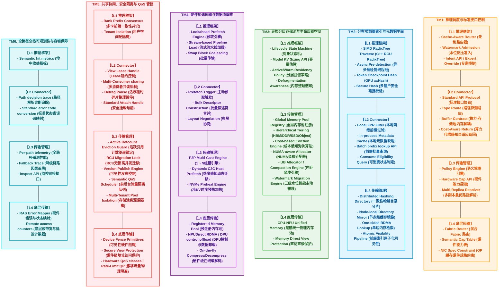
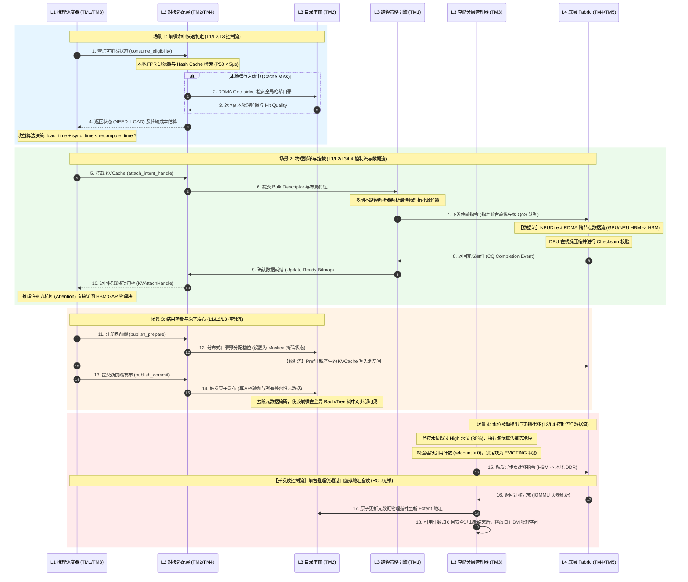

# 异构统一 KVCache 存储池软件系统架构与事务设计报告

本报告针对在线推理场景下的高效 KVCache 管理、传输、快速匹配查询以及升降级需求，对 [srs_v2.3.xlsx](file:///d:/codes/reports/kvcache/unified_kv_memory/srs_v2.3.xlsx) 中的 141 项软件需求进行了深度分析与重构。报告包含功能分层设计、核心模块划分、关键场景与事务梳理，以及控制流和数据流的全面建模。

---

## 一、 软件功能分层架构与接口边界 (Layered Architecture & Boundaries)

基于第一性原理，异构统一 KVCache 存储池系统被划分为四个紧密协作的软件层次。每一层都具有明确的单一职责与定义完备的上下游交互接口。

### 1.1 软件功能分层图

```mermaid
flowchart TD
    %% Styling definitions
    classDef l1Style fill:#E8EAF6,stroke:#3F51B5,stroke-width:2px,color:#1A237E,font-weight:bold;
    classDef l2Style fill:#E0F2F1,stroke:#009688,stroke-width:2px,color:#004D40,font-weight:bold;
    classDef l3Style fill:#E8F5E9,stroke:#4CAF50,stroke-width:2px,color:#1B5E20,font-weight:bold;
    classDef l4Style fill:#ECEFF1,stroke:#607D8B,stroke-width:2px,color:#263238,font-weight:bold;

    subgraph L1_Layer ["Layer 1: 推理框架层 (Inference Framework Layer)"]
        L1_Sched["推理调度器与亲和性路由<br/>(Scheduler & Cache-Aware Router)"]
        L1_Index["RadixTree 前缀匹配加速与准入控制<br/>(RadixTree Matcher & Load-vs-Recompute Admission)"]
        L1_Life["KVCache 分布式生命周期状态机<br/>(Lifecycle State Machine: READY / ACTIVE / OFFLOADING)"]
    end
    class L1_Layer,L1_Sched,L1_Index,L1_Life l1Style;

    subgraph L2_Layer ["Layer 2: Connector 对接适配层 (KVConnector Layer)"]
        L2_API["标准化 Protocol 接口与错误映射<br/>(gRPC/IPC API Protocol & Standard Error Codes)"]
        L2_Cache["本地两级前缀缓存与可消费判定<br/>(FPR Filter & Consume Eligibility Cache)"]
        L2_Desc["传输描述符聚合与布局协商<br/>(Bulk Descriptor & Layout Negotiation)"]
        L2_Lease["共享租约与多消费者并发 RCU 控制<br/>(KVViewLease & Multi-Consumer RCU)"]
    end
    class L2_Layer,L2_API,L2_Cache,L2_Desc,L2_Lease l2Style;

    subgraph L3_Layer ["Layer 3: 传输管理层 (Transport Management Layer)"]
        L3_Pool["全局统一内存池与 NUMA 分配器<br/>(Mooncake Global Pool & NUMA Allocator)"]
        L3_Dir["分布式前缀目录与原子发布流水线<br/>(Consistent Hash Directory & Atomic Visibility)"]
        L3_Policy["语义策略选择与多副本最优路径解析<br/>(Semantic Policy Engine & Multi-Replica Path Resolver)"]
        L3_Tier["分层冷热迁移与引用计数驱逐保护<br/>(Watermark-Driven Tiering & Refcount Eviction Guard)"]
        L3_Route["传输数据流编排、一对多组播与预热<br/>(UBLink P2P Multicast & NVMe Preheat Engine)"]
    end
    class L3_Layer,L3_Pool,L3_Dir,L3_Policy,L3_Tier,L3_Route l3Style;

    subgraph L4_Layer ["Layer 4: 底层传输与硬件层 (Underlying Transport & Hardware Layer)"]
        L4_RDMA["零拷贝 RDMA 注册内存池管理<br/>(NPUDirect RDMA & Registered MemPool)"]
        L4_Mem["CPU-NPU 统一物理内存与 GAP 寻址保护<br/>(Kunpeng Unified Memory & Global Access Pointer)"]
        L4_Off["DPU 传输控制卸载与在线硬件编解码<br/>(DPU Controller & On-the-fly Compression)"]
        L4_Route["混合 Fabric 路由与硬件能力表建模<br/>(Fabric Router & Semantic Capability Table)"]
        L4_QoS["可靠性同步与硬件级搬移流量物理隔离<br/>(Fence Primitives & QP Rate-Limit / QoS Classes)"]
    end
    class L4_Layer,L4_RDMA,L4_Mem,L4_Off,L4_Route,L4_QoS l4Style;

    %% Boundary flows
    L1_Layer -->|"\n【北向访问意图 API】\n- KVAccessIntent\n- token_ids / block_ids\n- deadline / isolation_domain"| L2_Layer
    L2_Layer -->|"\n【任务描述符与挂载句柄】\n- Bulk Descriptor\n- KVAttachHandle\n- KVViewLease / placement_id"| L3_Layer
    L3_Layer -->|"\n【底层传输与物理寻址指令】\n- Registered Region Offset\n- GAP / RDMA Handle\n- Page Migration Command"| L4_Layer
    
    L4_Layer -.->|"\n【硬件级事件与遥测】\n- CQ Completion Event\n- Remote Counters / ATS Telemetry\n- RAS Hardware Error Code"| L3_Layer
    L3_Layer -.->|"\n【数据就绪与可见性变更】\n- Ready Bitmap\n- Transfer Status\n- Cache Invalidation Event"| L2_Layer
    L2_Layer -.->|"\n【加载状态与重算降级信号】\n- Load Success / Recompute / Partial Hit\n- Consumable State\n- Standard Status / Error Code"| L1_Layer
```

### 1.2 层次职责与交互边界设计

1. **Layer 1：推理框架层 (Inference Framework Layer)**
   * **定位职责**：负责北向推理请求的调度决策与执行。不感知物理传输细节，仅通过“逻辑 KVCache”驱动推理流水线。
   * **核心机制**：RadixTree 前缀匹配、亲和性调度路由、TTFT 耗时预算控制、逻辑生命周期状态机。
   * **向下接口边界**：向下调用 L2 的统一 Protocol，提交 `KVAccessIntent` 语义接口。

2. **Layer 2：Connector 对接适配层 (KVConnector Layer)**
   * **定位职责**：推理框架与底层存储池之间的“粘合剂”与 SDK。负责将 L1 的生命周期事件转换为具体的传输任务，并管理本地缓存以降低元数据查询时延。
   * **核心机制**：本地 FPR 过滤及元数据缓存、可消费状态判定、布局协商、批量描述符（Bulk Descriptor）生成、安全租约管理。
   * **上下交互边界**：
     * **北向**：向 L1 提供标准化的 `put/get/prefetch/evict/get_status` 以及三阶段发布接口。
     * **南向**：向 L3 提交 `Bulk Descriptor` 任务描述符及 `placement_id`；接收来自 L3 的数据就绪 ready bitmap 和版本失效通知。

3. **Layer 3：传输管理层 (Transport Management Layer)**
   * **定位职责**：异构存储池的“控制大脑”与“数据调度枢纽”。管理全局内存拓扑、元数据一致性，并制定数据在异构介质间流转与驱逐的策略。
   * **核心机制**：全局分布式哈希目录、三级水位监控搬移、多副本最优路径解析、QoS 流量隔离调度、RCU 无锁迁移引擎。
   * **上下交互边界**：
     * **北向**：为 L2 提供全局可见的挂载句柄与状态响应，并跨节点同步目录变化。
     * **南向**：向下管理 L4 的物理注册内存，下发 DMA/RDMA 或 GPU-Direct 页迁移硬件指令，并监听 L4 的完成队列（CQ）及 RAS 硬件容错状态。

4. **Layer 4：底层传输与硬件层 (Underlying Transport & Hardware Layer)**
   * **定位职责**：提供硬件级的零拷贝搬运、物理地址空间映射、硬件安全防护及网卡/DPU 的底层加速规格。
   * **核心机制**：NPUDirect RDMA、统一物理地址空间（C2C GAP）、DPU 控制/数据卸载、硬件级 QoS 队列对、原子页迁移硬件支持。
   * **向上接口边界**：为 L3 暴露硬件传输能力表，提供硬件级地址翻译、无锁 RCU 原子屏障（Fence）原语及标准硬件故障码映射。

---

## 二、 软件主要功能模块 (Major Functional Modules)

根据 SRS 需求中的描述，系统被划分为 6 个跨层的顶层业务模块（TM1 至 TM6）。以下为各模块在软件四层中的映射图及职责定义。

### 2.1 软件主要功能模块图

### 2.2 主要模块核心职责与对应 SRS 需求明细表

| 模块名称 | 核心职责与设计原则 | 核心子系统组件 | 对应关键需求唯一标识 (部分示例) |
| :--- | :--- | :--- | :--- |
| **TM1: 推理调度与标准接口控制** | 统一南北向接口协议，屏蔽底层异构通信拓扑；实施算力与存储池解耦，实现基于时延预算的自适应路由与准入判断。 | 北向 Intent API、亲和性路由器、QoS 路径探测器、底层 Fabric 路由器。 | [L1-RT-Admission-007](file:///d:/codes/reports/kvcache/unified_kv_memory/srs.md#L21), [L2-CONN-CostAwareReturn-039](file:///d:/codes/reports/kvcache/unified_kv_memory/新增评审后的需求.txt#L3), [L2-CONN-BufferContract-040](file:///d:/codes/reports/kvcache/unified_kv_memory/新增评审后的需求.txt#L4), [L3-SE-MultiReplicaResolver-089](file:///d:/codes/reports/kvcache/unified_kv_memory/新增评审后的需求.txt#L11), [L4-HW-NICSpecConstraint-075](file:///d:/codes/reports/kvcache/unified_kv_memory/新增评审后的需求.txt#L17) |
| **TM2: 分布式前缀索引与元数据平面** | 负责微秒级的高速前缀碰撞检测，提供高吞吐的分布式目录服务与原子可见性发布机制，防止匹配链路阻塞 TTFT。 | SIMD RadixTree、本地两级 Bloom-Filter、一致性哈希全局目录、原子可见性流水线。 | [L1-SGL-PFX-IDX-003](file:///d:/codes/reports/kvcache/unified_kv_memory/srs.md#L25), [L2-CONN-PFX-IDX-005](file:///d:/codes/reports/kvcache/unified_kv_memory/srs.md#L51), [L3-MS-AtomicPublishVisibility-087](file:///d:/codes/reports/kvcache/unified_kv_memory/新增评审后的需求.txt#L9), [L3-MS-TTFTIndexLayout-088](file:///d:/codes/reports/kvcache/unified_kv_memory/新增评审后的需求.txt#L10) |
| **TM3: 异构分层存储池与生命周期空间** | 统一管理 HBM/DDR/SSD/Object 等分层介质；在不中断计算的前提下通过智能水位搬移和并发整理解决碎片化与容量不足问题。 | 统一物理内存池、分层介质管理器、三级水位决策引擎、NUMA 分配器。 | [L1-MM-Lifecycle-009](file:///d:/codes/reports/kvcache/unified_kv_memory/srs.md#L32), [L3-MC-CompactionEngine-056](file:///d:/codes/reports/kvcache/unified_kv_memory/srs.md#L98), [L3-MC-IntelligentMigration-057](file:///d:/codes/reports/kvcache/unified_kv_memory/srs.md#L99), [L4-C2C-UNIFY-POOL-001](file:///d:/codes/reports/kvcache/unified_kv_memory/srs.md#L108) |
| **TM4: 硬件加速传输与数据流编排** | 通过流水线重叠、批量聚合描述符和硬件卸载实现极速 KVCache 数据流动，消除 Swap 对 TTFT/TPOT 的负面影响。 | 异步预取引擎、流式加载 Pipeline、批量传输 Coalescing、NPUDirect RDMA 通道。 | [L1-VLLM-SWP-XFER-003](file:///d:/codes/reports/kvcache/unified_kv_memory/srs.md#L31), [L2-OL-BulkDescriptor-025](file:///d:/codes/reports/kvcache/unified_kv_memory/srs.md#L55), [L3-TRANS-MUL-ENGINE-003](file:///d:/codes/reports/kvcache/unified_kv_memory/srs.md#L88), [L4-RDMA-P2P-NPU-001](file:///d:/codes/reports/kvcache/unified_kv_memory/srs.md#L106) |
| **TM5: 共享协同、安全隔离与 QoS 管控** | 提供多租户的物理和逻辑隔离，多卡间的状态共识；通过租约、RCU 无锁指针替换与硬件通道物理硬隔离确保迁移时不挤兑推理带宽。 | 多卡共识机、Lease 租约句柄、RCU 迁移锁、活跃引用计数锁、硬件限速 QP。 | [L1-PD-RankConsensus-013](file:///d:/codes/reports/kvcache/unified_kv_memory/srs.md#L40), [L2-MM-ViewLease-028](file:///d:/codes/reports/kvcache/unified_kv_memory/srs.md#L58), [L3-CO-RefCountLifecycle-086](file:///d:/codes/reports/kvcache/unified_kv_memory/新增评审后的需求.txt#L8), [L3-CO-MigrationRCULock-090](file:///d:/codes/reports/kvcache/unified_kv_memory/新增评审后的需求.txt#L12), [L4-QO-MigrationQoS-064](file:///d:/codes/reports/kvcache/unified_kv_memory/srs.md#L124) |
| **TM6: 全路径全栈可观测性与容错保障** | 跟踪“命中了为什么变慢”的根因；将底层复杂的 RAS 硬件错误抽象为标准上层错误码，提供透明的快速降级与故障恢复链。 | 全路径性能 Tracer、Fallback 因果诊断器、标准错误码转换器、RAS 错误映射引擎。 | [L1-OB-SemanticMetrics-016](file:///d:/codes/reports/kvcache/unified_kv_memory/srs.md#L39), [L2-KV-StateErrorCode-037](file:///d:/codes/reports/kvcache/unified_kv_memory/新增需求L2.md#L7), [L3-FT-FallbackTrace-046](file:///d:/codes/reports/kvcache/unified_kv_memory/srs.md#L96), [L4-FT-RASErrorMap-061](file:///d:/codes/reports/kvcache/unified_kv_memory/srs.md#L119) |

---

## 三、 软件关键子场景及关键事务列表 (Key Sub-Scenarios & Transactions)

为满足在线推理的高性能与高并发指标，系统定义了 6 个必须精确处理的关键子场景及对应事务流程：

### Scenario 1: 前缀匹配与加载准入事务 (Prefix Match & Admission)
* **痛点问题**：分布式元数据查询往返时延（RTT）及哈希碰撞校验高，若盲目拉取冷/远端 KVCache，其耗时可能超过重算，导致 TTFT 负收益。
* **主要参与模块**：`TM1`（调度与接口）、`TM2`（前缀索引与元数据）
* **关键控制步骤**：
  1. 北向请求输入后，L1 路由器优先判定 KVCache 亲和性，并将请求派发至最优节点；同时，L1 调度器设定 `prefix_decision_deadline_ns` 查找硬预算。
  2. L2 Connector 调用本地两级前缀过滤机制：首先通过本地微秒级 Bloom Filter 快速排除 Miss 场景（避开网络 RTT），若通过则检索 HashMap 缓存。
  3. 若本地缓存未命中，通过底层 RDMA One-sided 硬件直读机制（100μs 内）查询分布式全局目录哈希分片，获取 KVCache 的实际物理层级（DDR/SSD/远端）和 Ready 状态。
  4. L2 Connector 校验 KVSemanticIdentity 兼容性（防止模型参数/Tokenizer 不匹配），向 L1 返回 `ConsumeEligibility` 状态（CONSUMABLE 或 NEED_LOAD）以及 Hit Quality 耗时元数据。
  5. L1 调度器运行“收益判定模型”（Load-vs-Recompute）：若预计传输耗时超预算，立即将其判定为逻辑 Miss 并降级为本地重算，确保 TTFT 边界。

### Scenario 2: 跨节点高速零拷贝拉取事务 (Cross-Node RDMA Zero-Copy Transfer)
* **痛点问题**：传统跨节点传输涉及多次 CPU 拷贝与内存临时注册，极大消耗 Host 算力，且由于小块碎片化引发 Descriptor 风暴，导致 PCIe 带宽吃紧。
* **主要参与模块**：`TM4`（传输与编排）、`TM1`（策略控制）
* **关键控制步骤**：
  1. L1 调度器发起 `KVAccessIntent` 加载意图。
  2. L2 Connector 将多个非连续物理 Block 进行合并，构建 Scatter-Gather 聚合描述符（Bulk Descriptor），并与存储后端协商布局（如 MB 级 Cross-layer Block 布局）。
  3. L3 策略引擎基于多副本路由解析器（Multi-Replica Path Resolver）动态感知 NVLink/RDMA 的拥塞度和队列深度，选定最优物理源节点。
  4. 底层 L4 传输层使用预先注册的长生命周期 Registered Memory Pool，跳过临时内核调用，驱动 NPUDirect RDMA（GPU-Direct）传输通道。
  5. 硬件直接执行 NPU HBM $\rightarrow$ 远端网卡 $\rightarrow$ 本地网卡 $\rightarrow$ NPU HBM 零拷贝拉取。
  6. DPU 进行控制路径卸载，并在硬件层完成 KVCache 的 On-the-fly 解压缩，校验 Checksum 无误后提交硬件完成中断。

### Scenario 3: 新 KVCache 注册与三阶段原子发布事务 (Generation & Three-Stage Atomic Publish)
* **痛点问题**：Prefill 生成新 KVCache 时，控制面并发提交时延大；若部分属性或校验和未写入即暴露，会导致其他推理实例读到空地址或误匹配。
* **主要参与模块**：`TM2`（前缀目录）、`TM5`（协同与隔离）
* **关键控制步骤**：
  1. Prefill 阶段完成后，L1 状态机标记 Block 为 `LOADING` 并提交 `publish_prepare` 信号。
  2. L2 Connector 在分布式前缀目录中预留槽位，但将该元数据节点设为掩码不可见状态（Masked）。
  3. L4 传输层执行本地/远端注册池的物理写入，计算数据校验和（Checksum）。
  4. 推理框架验证数据落盘完毕，调用 `publish_commit` 信号。
  5. 原子元数据发布流水线（Atomic Metadata Publication Pipeline）写入完整的模型 ID、版本、Tokenizer 属性、Layout 架构等最终字段。
  6. 触发 Memory Fence，并在全局分布式 RadixTree 树节点中一次性去除掩码，使该前缀对全局可见。

### Scenario 4: 主动换出、降级与无锁 RCU 迁移事务 (Active Eviction & RCU Lock Migration)
* **痛点问题**：系统高水位（HBM 占满）时发生换出会打断前台推理算子，引起 OOM 或 Deadlock。且碎片整理（Defragmentation）时，若物理指针发生变更，会引发正在 attach 消费的推理线程崩溃。
* **主要参与模块**：`TM3`（存储池管理）、`TM5`（QoS 管控）
* **关键控制步骤**：
  1. L3 水位监测引擎发现节点 HBM 水位越过 High（85%）警戒线，根据淘汰算法计算 Saved Prefill Time 和租户优先级，挑选冷 KVCache。
  2. 系统校验活跃引用计数（Active Reference Count）。若当前引用计数 `refcount > 0`（表明正有 Batch 计算在 attach 消费），系统将该块锁定为 `EVICTING` 状态，强行禁止物理释放或覆盖。
  3. L3 启动基于 RCU 无锁机制的物理迁移：前台推理继续访问旧有物理地址，后台迁移引擎开始跨介质拷贝数据（HBM $\rightarrow$ DDR/SSD）。
  4. L4 传输层使用硬件级页迁移（Page Migration）和大页重组，利用网卡独立硬件 Queue Pair 限制迁移带宽（避免与前台推理争抢 PCIe/网口）。
  5. 拷贝及 CRC 校验完成后，L3 触发原子指针更替操作，刷新 IOMMU/TLB，并在安全退出期（当前 Batch 推理运行完毕）后回收旧 HBM 物理块。

### Scenario 5: 多卡一致共识与多租户隔离共享事务 (Consensus & Multi-Tenant Shared Lease)
* **痛点问题**：TP/PP 多卡并行推理时，若各 Rank 卡上的前缀匹配长度、Layout 版本或 Ready 状态不一致，会造成计算对齐错误；同时在多租户场景下，公共 Prompt 需共享复用，但私有 KVCache 绝对禁止越权跨租户命中。
* **主要参与模块**：`TM5`（共享与隔离）、`TM2`（前缀索引）
* **关键控制步骤**：
  1. 请求进入多卡推理组，L1 触发卡间前缀共识协议（Rank Prefix Consensus），在 TP/PP 组间对 usable prefix length 进行对齐，若各卡不一致则取 `min-safe` 长度或降级重算。
  2. 针对公共 System Prompt 或热门 RAG 文档，L2 产生标准 `KVAttachHandle` 并绑定携带 epoch、refcount 和 expiry 的安全租约（KVViewLease）。
  3. L3 运行 View-vs-Copy 成本模型。若判定为 Near-memory View（近端共享），则通过 C2C GAP（Global Access Pointer）使各 Rank 卡的 GPU 能够利用指针直接直读 CPU 侧的 KVCache，省去显式复制。
  4. 底层 L4 硬件通过 IOMMU/SMMU 租户域密钥进行隔离保护，确保租约失效或撤销后，内存空间不可被 GPU 寻址。
  5. 共享句柄维护 Multi-Consumer Consumer Bitmap，当所有消费卡均 Detach 且 Lease 到期后，触发 GC。

### Scenario 6: 底层故障遥测与快速路径降级事务 (Hardware Fault Telemetry & Fast Path Fallback)
* **痛点问题**：底层网络闪断、SSD 坏块或 RDMA 队列爆满等硬件级错误，容易导致推理框架挂起（Stall）或产生雪崩式 OOM，且故障定位诊断困难。
* **主要参与模块**：`TM6`（可观测性）、`TM1`（策略控制）
* **关键控制步骤**：
  1. L4 底层网卡或运行时环境产生物理级故障事件（如 RDMA Flush Error、ATS Address Translation Fault）。
  2. L4 RAS 错误映射引擎（RASErrorMap）捕捉该事件，并在硬件层将其翻译为统一的存储池标准状态错误码（如 `REPLICA_DEGRADED`、`VISIBILITY_TIMEOUT`、`BACKEND_BUSY`）。
  3. L3 遥测平面记录本次故障并更新传输质量路由表；对于出现问题的副本，执行隔离（Replica Quarantine）并生成降级追踪日志（Fallback Causality Trace）。
  4. L2 Connector 阻断该物理块的使用，执行 Fallback Contract，将底层错误映射为 L1 调度层可解释的重试、挂起或 Miss 降级信号。
  5. L1 调度器根据该信号自动实施路径降级（例如从 RDMA 降级到 TCP 兼容链路，或退回 Local Recompute），保障推理业务不中断。

---

## 四、 软件关键节点控制流与数据流 (Control & Data Flows)

以下 sequence 示意图展示了异构统一 KVCache 存储池主要功能模块在一次典型请求周期中，控制流与数据流的流转过程：

### 4.1 控制流与数据流的关键特征与优化机制

1. **控制面与数据面物理隔离 (`TM1` / `TM2` / `TM4`)**
   * **控制流路径**：前缀匹配的查询判定（如 `consume_eligibility`）、路由协商、QoS 限速策略下发以及元数据发布等控制流，优先走 CPU 本地 Host DDR 或机内 coherent UBLINK 内存语义路径，绝不占用底层高性能网卡的传输带宽。
   * **数据流路径**：大块连续的 KVCache Block/Page 的 Swap 换入换出，完全由预注册内存池和 NPUDirect RDMA（GPU-Direct）南向物理通路执行。采用 DPU 控制卡轮询卸载，把 CPU 的控制开销从 10ms 级压缩到 0.5ms 以内。

2. **近端内存直访与显式传输的融合 (`TM3` / `TM5`)**
   * **内存语义（Memory Semantic）**：对于机内 coherent NVLink/UBLINK 域，L3 策略引擎在 View-vs-Copy Cost 评估后，采用 GAP（Global Access Pointer）机制，NPU 可直接通过指针跨卡 Load/Store 目标内存，避免了显式的 DMA 传输控制。
   * **传输语义（Transfer Semantic）**：对于跨机架或高拥塞链路，系统无缝 fallback 到显式的 Bulk-Transfer（RDMA 零拷贝）模式。这种两路分离机制使得系统在不同拓扑节点下均能达到端到端时延最优。
