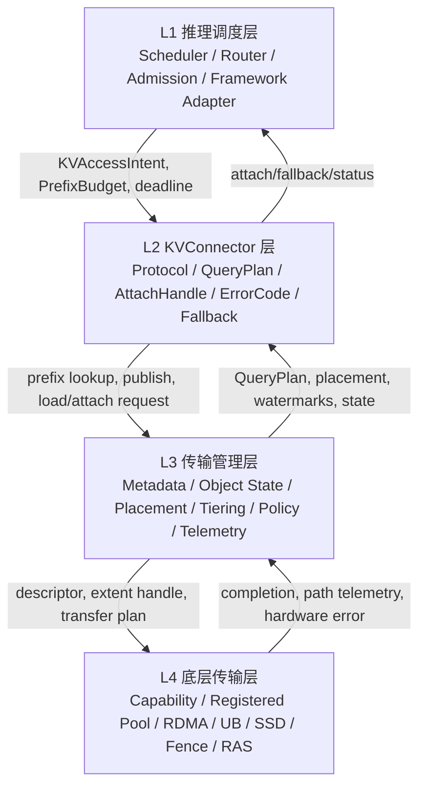
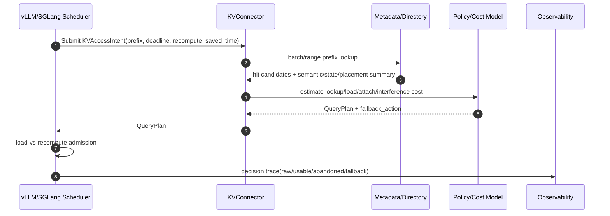
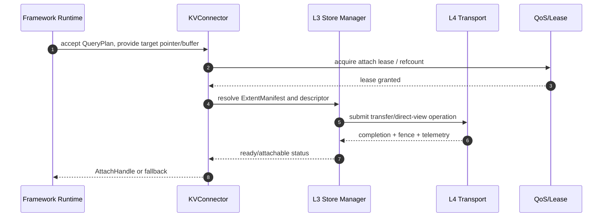
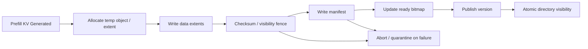

# KVCache 统一异构软件设计说明书

版本：V1.0  
依据文件：`KVCache SRS需求列表 V2.1.xlsx`、`unified_kvcache_汇报材料_v2.md`  
适用范围：统一异构 KVCache 存储池的软件架构、模块职责、关键流程、阶段交付与需求完整性说明  

---

## 1. 文档目的与设计边界

本文档面向第三方技术评审、项目管理、研发设计和系统集成团队，说明“统一异构 KVCache 存储池”软件项目为什么需要建设、要解决什么问题、最终交付什么能力、采用哪些关键技术手段，以及当前需求列表为何能够覆盖该软件项目从概念验证到最终交付的主要工程闭环。

本文档以最新版 `KVCache SRS需求列表 V2.1.xlsx` 为事实基线。文档中的能力、指标和阶段目标均按需求表中的验收口径理解：指标需要在指定模型、tokenizer、prompt 集、并发、调度参数和硬件拓扑下，通过 A/B、压测、故障注入、长稳测试和可观测数据验证。本文不会把需求中的阶段性指标解释为对所有模型、所有拓扑、所有负载无条件成立的承诺。

本文档不替代详细设计文档、接口 IDL、测试方案、部署手册和硬件选型规格。它的职责是形成软件项目的总体设计说明，帮助读者理解统一池的软件边界、系统分层、模块关系、关键流程和需求完整性。

---

## 2. 软件项目背景：为什么需要统一异构 KVCache 存储池

大模型在线推理的核心成本来自两个阶段：Prefill 和 Decode。Prefill 阶段需要把输入 prompt 的 token 序列计算成 KVCache；Decode 阶段在每生成一个新 token 时，需要反复读取历史 KVCache 参与 attention 计算。随着上下文长度从几千 token 增长到十万、百万 token，KVCache 不再是推理框架内部的普通临时 buffer，而会成为决定 TTFT、TPOT、显存利用率和推理成本的关键系统资源。

传统推理系统通常把 KVCache 绑定在单机、单卡或单框架内部管理。这样会带来三个结构性问题。

第一，长前缀重复计算造成昂贵算力浪费。真实在线业务中，大量请求共享相同或高度相似的前缀，例如企业知识库问答中的系统提示词、RAG 检索出的长文档片段、多轮 Agent 的工具说明、代码助手的仓库上下文、客服机器人持续复用的领域指令模板。若每次请求都重新执行 Prefill，就会重复消耗 NPU/GPU 算力，并显著拉高首字延迟。

第二，物理 HBM 容量形成并发瓶颈。KVCache 的容量需求随模型层数、hidden size、head 布局、上下文长度和 batch 增长。长上下文、多轮会话或多租户并发场景下，HBM 很容易先于计算能力成为瓶颈。单卡 HBM 被活跃 KV 和热 KV 占满后，调度器只能降低 batch、抢占请求、拒绝请求或触发 swap，导致 NPU 有效利用率下降。

第三，集群资源无法统一复用。一个推理集群中，HBM、主机 DDR、NVMe SSD、远端节点 DDR、远端 SSD/object 等资源的容量、延迟、带宽和可用状态都不同。传统做法通常是框架各自管理局部缓存，缺少统一对象模型、统一元数据、统一状态机、统一路径成本模型和统一回退机制。结果是有些节点 HBM 紧张而拒绝长请求，邻近节点却存在空闲 DDR/SSD；有些前缀已经在远端可复用，但上层无法判断“拿回来是否比重算更划算”。

因此，本项目需要建设的不是一个简单的字典式缓存，而是一套面向在线推理的统一异构 KVCache 存储池。它要把分散在 HBM、DDR、SSD、远端 DDR、远端 SSD/object 等介质上的 KVCache 统一建模、统一寻址、统一调度、统一观测，并通过与 vLLM/SGLang 等推理框架和底层 UB/UBMEM、RDMA/NIXL/Mooncake、C2C、DPU、SSD/object 路径的协同，把“物理命中”转化为“可消费、值得消费、可安全回退”的推理收益。

---

## 3. 软件设计初衷：关键业务痛点与真实场景示例

### 3.1 痛点一：Raw Hit 不等于 Usable Hit

KVCache 物理命中并不必然意味着应该加载它。一次命中是否有价值，取决于它是否满足模型、tokenizer、template、layout、版本、租约、ready 状态、路径成本、deadline 和当前 batch 状态等多重条件。如果远端加载耗时超过本地重算耗时，强行拉取 KVCache 反而会拖慢 TTFT，并让 NPU 等待数据搬运。

真实场景示例：企业 RAG 问答中，同一份制度文档可能被多个用户连续引用。系统能在元数据层发现远端节点存在该文档前缀的 KVCache，但此时远端 RDMA 路径拥塞、对象正处于迁移中，或者当前请求的 TTFT deadline 已经很紧。此时系统不能只因为 raw hit 就加载，而应返回带成本的 QueryPlan，由调度层执行 load-vs-recompute 判断，必要时直接重算或只复用可消费的连续前缀。

### 3.2 痛点二：长上下文推理受到 HBM Wall 限制

长上下文、多轮对话、Agent 任务链和代码仓库级上下文会快速放大 KVCache 容量。仅依赖 HBM 驻留会导致 batch 被压低、OOM/preemption 增多、请求排队加重，最终表现为吞吐下降和用户等待时间上升。

真实场景示例：代码助手在分析一个大型仓库时，系统提示词、代码片段、依赖说明和历史交互可能构成十万 token 级上下文。若所有历史 KV 都长期驻留 HBM，单卡可承载的并发请求数量会显著下降。统一池需要区分 active KV 与 warm/cold KV：active decode KV 默认保持 HBM 友好路径，warm/cold KV 可在本地 DDR、远端 DDR 或 SSD/object 中保留，并在收益为正时加载或预取回 HBM。

### 3.3 痛点三：多框架、多介质、多硬件路径语义不一致

vLLM、SGLang 等框架已有各自的 prefix cache、swap、prefetch 或 connector 能力，但它们对对象身份、block/page layout、状态、错误码、回退语义和底层传输能力的抽象并不天然一致。底层硬件路径也存在差异：UB/UBMEM、RDMA/NIXL/Mooncake、C2C、DPU、SSD/object 的注册、建链、descriptor、fence、completion 和错误语义不同。

真实场景示例：某平台支持 HBM 到 DDR 的高效卸载和 RDMA registered pool，另一平台支持 C2C direct view 或 SSD/object 回源。若上层直接假设所有路径都具备 memory view、atomic remap、硬件 QoS 或相同 fence 语义，后续接入会产生大面积返工。统一池需要从 P0 就建立 capability matrix、registered pool、extent handle、visibility fence、per-path telemetry 和 fallback contract，让硬件能力左移参与软件语义定义。

### 3.4 痛点四：后台迁移、淘汰和压缩可能干扰前台 Decode

KVCache 分层存储池如果没有状态机、租约、引用计数、QoS 和 trace，后台冷热迁移、SSD 回源、压缩、compaction 或副本复制可能与前台 attention runtime 争用 PCIe、网卡、copy engine 或 HBM 带宽，造成 TPOT 抖动。

真实场景示例：多租户在线服务中，一个租户触发大量长上下文请求，统一池开始把冷 KV 下沉到 DDR/SSD；另一个租户正在执行低延迟对话式 decode。如果迁移流量没有 traffic class、QoS 限制和 state-aware 调度，就可能挤占前台推理路径，引发 P99 TPOT 尖刺。统一池需要把后台流量隔离、限速、可观测，并在必要时暂停或降级迁移。

### 3.5 痛点五：命中了但变慢，传统指标解释不了

单一 hit rate 指标无法解释统一池的真实收益。系统需要同时观测 raw hit、usable hit、stale hit、abandoned hit、fallback、load latency、attach latency、per-path bandwidth/latency、TPOT interference 和 decision reason。

真实场景示例：上线后 raw hit rate 较高，但 TTFT 没有改善。可能原因包括：命中对象版本不兼容、路径拥塞、ready bitmap 未完成、remote load 超过 deadline、rank consensus 对齐失败、fallback 到低速路径、attach 阻塞或后台迁移抢占带宽。没有端到端 trace 和语义指标，研发和运维团队无法定位“命中了为什么收益不足”。

---

## 4. 项目目标与先进性

### 4.1 最终交付目标

本项目最终交付一套统一异构 KVCache 存储池软件实体。该软件实体应具备以下能力：

1. 统一纳管 HBM、DDR、SSD、远端 DDR、远端 SSD/object 等异构 KVCache 资源。
2. 为 vLLM/SGLang 等推理框架提供统一的 KVConnector 协议、QueryPlan、AttachHandle、fallback 和错误码。
3. 维护 KVCache 对象身份、前缀目录、对象状态机、placement、extent manifest、ready bitmap、lease/refcount、版本可见性和副本健康状态。
4. 基于 capability matrix 和 per-path telemetry 执行 load-vs-recompute、view-vs-copy、placement resolver、watermark admission、cost eviction 和迁移策略。
5. 支持从旁路验证到受控主流程灰度，再到生产化和最终交付的分阶段演进。
6. 通过端到端 metrics、path trace、fallback trace、KV state trace、RAS error map 和 inspect API，使收益、降级、异常和瓶颈可解释。

### 4.2 先进性体现

本项目的先进性不在于单点实现一个前缀缓存或一个 swap 机制，而在于把 KVCache 从“框架内临时缓存”提升为“跨框架、跨介质、跨节点、可发布、可查询、可迁移、可租约保护、可观测、可回退的软件对象”。

其技术先进性主要体现在四个方面：

1. 以 usable hit 而不是 raw hit 作为收益核心。系统必须判断“是否命中、是否可消费、是否值得消费”，避免低质量命中拖垮 TTFT。
2. 软硬协同从第一阶段前置。硬件 capability、registered pool、extent handle、visibility fence、SG descriptor、per-path telemetry 不是后期优化项，而是 QueryPlan、AttachHandle 和 cost model 的基础输入。
3. 对异构介质采用统一对象和路径抽象。HBM/DDR/SSD/远端资源不被暴露为若干孤立优化点，而是通过状态机、placement 和 descriptor 进入统一池。
4. 用观测闭环支撑工程落地。系统不仅追求命中率，还必须能解释 abandoned hit、fallback、TPOT interference、路径拥塞、状态迁移和硬件错误。

---

## 5. 与现有同类型软件的比较优势

### 5.1 比较对象与定位说明

现有同类型软件和研究系统中，Mooncake 是最重要的外部参照之一。Mooncake 论文和开源仓库将其定位为 KVCache-centric disaggregated architecture，用于将 prefill 与 decode 集群解耦，并利用 GPU 集群中相对空闲的 CPU、DRAM、SSD 资源构建 disaggregated KVCache pool。公开资料显示，Mooncake 在 Kimi 真实业务中通过该架构提升了可承载请求量，并在长上下文场景中具备显著收益。相关资料见 [Mooncake 论文](https://arxiv.org/abs/2407.00079) 与 [Mooncake GitHub 仓库](https://github.com/kvcache-ai/Mooncake)。

NIXL 则更接近底层数据移动基础设施。其 README 将 NIXL 定位为面向 AI inference 框架的点到点通信加速库，并通过插件架构抽象 CPU/GPU memory、file/block/object storage 等资源，适合作为统一池 L4 数据面能力之一。相关资料见 [NIXL GitHub 仓库](https://github.com/ai-dynamo/nixl)。

因此，本项目与 Mooncake、NIXL、vLLM/SGLang 原生 prefix cache/offload 能力的关系不是简单替代，而是“统一异构 KVCache 存储池软件实体”与“已有推理系统、传输库、缓存框架”的组合关系：已有系统可作为参照、后端或接入对象，本项目的差异化在于跨框架、跨介质、跨硬件能力的统一语义、统一状态、统一验收和统一可观测闭环。

### 5.2 功能维度比较

| 比较维度 | Mooncake / 典型 KVCache 解耦系统 | NIXL / 典型传输库 | vLLM/SGLang 原生能力 | 本项目统一异构 KVCache 存储池的优势 |
|---|---|---|---|---|
| 系统定位 | 面向 LLM serving 的 KVCache-centric disaggregated 架构，强调 prefill/decode 解耦、KV 复用和 SLO 调度 | 面向推理框架的数据移动库，强调点到点通信、memory/storage 抽象和插件化后端 | 框架内 prefix cache、block manager、swap/offload、connector 等局部能力 | 将 KVCache 抽象为跨框架、跨介质、跨节点的软件对象和统一存储池，覆盖对象身份、状态、placement、传输、隔离、观测和回退 |
| 资源范围 | 利用 GPU 集群中的 CPU、DRAM、SSD 和 RDMA 资源构建 disaggregated KVCache | 抽象 CPU/GPU memory 与 file/block/object storage 等传输资源 | 主要围绕单框架运行时的 HBM、host memory、外部 connector 或局部存储 | 需求明确覆盖 HBM、本地 DDR、本地 SSD、远端 DDR、远端 SSD/object，并要求 L3/L4 capability matrix 与 cost model 统一 |
| 命中语义 | 强调 KVCache 复用与 SLO 平衡 | 不定义业务命中语义，主要提供数据移动能力 | 通常以框架内部 prefix/block 命中或 connector 命中为主 | 明确区分 raw hit、usable hit、stale hit、abandoned hit；命中必须经过 semantic identity、ready/version/lease、路径成本和 deadline 判断 |
| 决策返回 | 调度器根据负载、缓存分布和 SLO 做请求调度 | 返回传输执行结果或 telemetry，不负责推理业务裁决 | 框架内调度器做本地策略判断 | 通过 QueryPlan 返回 consume_action、source_placement、expected_load_us、expected_attach_us、interference、fallback_action 和 confidence，避免裸地址式命中 |
| 硬件协同 | 具备 RDMA、CPU DRAM、SSD 等关键工程实践 | 强项是传输后端和 memory/storage 插件抽象 | 依赖各框架和后端的支持范围 | 从 P0 起把 capability matrix、registered pool、extent handle、visibility fence、SG descriptor、per-path telemetry 纳入软件语义，避免硬件后置 |
| 正确性与隔离 | 关注 SLO、调度、KV 复用和系统吞吐 | 不负责 KV 对象语义正确性 | 框架内部有各自正确性边界 | 系统化覆盖 tenant/security domain、KVSemanticIdentity、layout/version、ready bitmap、lease/refcount、stale-hit guard、quarantine、RAS error map |
| 可观测性 | 关注服务调度与性能指标 | 提供传输 telemetry 能力 | 框架侧 metrics 各自独立 | 要求端到端串联 request_id、query_plan_id、object_id、path_id、decision_reason、fallback_reason，并把收益、降级、状态迁移和硬件路径瓶颈统一解释 |
| 交付形态 | 作为完整 serving platform 或其核心组件 | 作为底层数据移动库 | 作为推理框架内部能力 | 作为可接入 vLLM/SGLang、可复用 Mooncake/NIXL 等后端能力的统一 KVCache 存储池软件实体 |

### 5.3 业务指标维度比较优势

**TTFT 方面**，Mooncake 已经证明 KVCache-centric scheduling 对长上下文场景有显著价值。本项目在此基础上进一步把“命中是否值得消费”形式化为 QueryPlan 和 load-vs-recompute admission：当远端加载、attach、同步或干扰成本超过重算收益时，系统应把该命中归类为 abandoned hit 并回退。这样可以降低“命中了但首字更慢”的风险，使 TTFT 优化从缓存命中率导向转为 usable hit benefit 导向。

**TPOT 方面**，典型 KVCache 解耦系统容易在后台迁移、回源或预取时干扰前台 decode。本项目把 TPOT Interference 作为独立验收指标，并在需求中设置 migration interlock、traffic class、QoS、refcount、ready bitmap 和 per-path telemetry。其比较优势不是承诺任何后台流量都完全无感，而是要求后台流量对 TPOT 的影响可测、可限流、可回退、可解释。

**HBM 有效容量方面**，Mooncake 和 HiCache 类系统都强调利用 CPU DRAM/SSD 等资源扩展 KVCache 容量。本项目的差异在于将 HBM Effective Capacity、Placement Change Frequency、KVObjectStateMachine、ExtentManifest、watermark、cost eviction 和 state-aware migration 绑定为一个完整生命周期闭环，避免“容量扩展了，但对象不可消费或迁移不可控”的问题。

**命中率质量方面**，普通 hit rate 容易掩盖版本不兼容、layout 不兼容、对象未 ready、路径拥塞、租约冲突和 fallback 等问题。本项目要求同时统计 raw hit、usable hit、stale hit、abandoned hit、fallback，并要求每个 abandoned/fallback 原因能追溯到 QueryPlan、path_id、object_id 和 decision_reason。对业务方而言，这比单一 hit rate 更能解释真实收益。

**运维与交付方面**，本项目把 workload baseline、framework baseline、hardware capability baseline、trace schema、正确性测试集、自动化测试、系统集成测试、监控大盘、压测工具和 CI/CD 纳入需求范围。相较于只交付某个缓存或传输组件，这种设计更适合作为第三方可审阅、可验收、可灰度、可回滚的软件工程项目。

### 5.4 相对 Mooncake 的技术先进性与差异化优势

Mooncake 的优势在于它是经过真实大规模服务验证的 KVCache-centric serving 架构，尤其适合说明长上下文、高复用、PD 解耦和过载调度场景下 KVCache 成为调度核心的合理性。本项目不否定这些优势，而是进一步把底层内存语义 UBMEM 与传输语义 URMA 等多态硬件传输能力，和上层 vLLM/SGLang 等推理框架的调度、前缀匹配、KV 生命周期和可消费性判断有机结合，形成一整套软硬协同、以 KVCache 为中心的统一异构存储池方案。

1. **从 KVCache 解耦架构扩展到“内存语义 + 传输语义”的统一硬件抽象**：Mooncake 等系统通常围绕 DRAM、SSD、RDMA 等资源构建分离式 KVCache 服务能力，本项目进一步把 UBMEM 的内存语义和 URMA 的传输语义同时纳入统一硬件能力抽象。也就是说，上层看到的不只是“KVCache 在哪个远端节点”，而是该 KVCache 是否支持 memory view、bulk transfer、registered pool、visibility fence、completion、QoS queue、远端访问计数、错误隔离等消费语义。这样，推理框架可以在同一 QueryPlan 中判断“直接视图访问、搬回 HBM、部分 attach、等待 ready 或重算”哪一种动作真正满足 TTFT/TPOT 约束。
2. **从外部 KV Store 查询扩展到拓扑感知的 KVCache 位置存储与查询**：本项目的核心优势不是简单支持多条传输后端，而是让 KVCache 的 placement 成为可查询、可比较、可调度的拓扑对象。统一池需要记录每个 KV 对象位于 HBM、本地 DDR、本地 SSD、远端 DDR、远端 SSD/object 的哪一层、哪个节点、哪个设备、哪个 extent、副本健康如何、到当前推理实例的路径代价如何，并结合 NVLink/UB、URMA/RDMA、C2C、PCIe、SSD/object 等路径能力返回最优 QueryPlan。相比只按 prefix_hash 找到某个远端 segment 的模式，这种设计能直接回答“哪个副本离当前 decode 最近、哪条路径最不影响 TPOT、是否值得跨节点加载、是否应该转为重算”，更贴近在线推理的真实调度问题。
3. **从碎片化块传输扩展到硬件可执行的数据流编译**：vLLM/SGLang 的 KVCache 以 block/page 或 RadixNode 为单位组织，同一请求的多个物理 block 往往不连续，传统实现容易退化为逐 block 的 cudaMemcpy 或小 IO 传输，导致 PCIe/互连带宽利用率偏低。本项目通过 ExtentManifest、SG descriptor、layout negotiation 和 registered pool，将框架侧碎片化 KV block 编译为 UBMEM/URMA/RDMA/C2C/SSD 路径可执行的批量传输描述符。这个能力的价值在于把“框架内的分页 KV 管理结构”翻译成“硬件可高效搬运的数据流”，从而释放底层互连、注册内存和零拷贝路径的真实带宽。

### 5.5 技术比较口径说明

本章节的比较不是要说明 Mooncake、NIXL 或 vLLM/SGLang 原生能力“不先进”，而是说明本项目与它们解决问题的层次不同。Mooncake 的强项是 KVCache-centric serving 和分离式 KVCache 复用，NIXL 的强项是底层数据移动抽象，vLLM/SGLang 的强项是框架内部的调度、PagedAttention/RadixAttention 和本地 KV 生命周期管理。本项目要解决的是把这些能力上升为统一异构 KVCache 存储池：既理解上层推理框架的 KV 消费语义，也理解底层 UBMEM/URMA/RDMA/C2C/SSD/object 的真实硬件语义。

因此，正确的比较口径应是：

| 比较口径 | Mooncake / NIXL / 框架原生能力更关注 | 本项目更关注 |
|---|---|---|
| KVCache 复用 | 如何把 KVCache 存到外部池、跨 prefill/decode 节点复用 | 如何把 KVCache 建模为跨 HBM/DDR/SSD/远端介质的统一对象，并判断是否可消费、是否值得消费 |
| 数据搬运 | 如何通过 RDMA、传输库或 connector 把数据搬过去 | 如何在 UBMEM 内存语义、URMA 传输语义和其他路径之间做拓扑感知选择，并把路径能力编译为 QueryPlan |
| 框架协同 | 框架发起 get/put/prefetch 或本地 swap/offload | 框架调度器、Connector、对象状态机和底层硬件能力共同决定 attach、load、direct view、partial attach 或 recompute |
| 性能解释 | 关注命中率、传输吞吐或平台级 serving 指标 | 同时解释 raw hit、usable hit、abandoned hit、TTFT benefit、TPOT interference、fallback reason 和 path cost |

换句话说，Mooncake/NIXL 可以成为本项目的数据面后端或外部 KV store 能力，vLLM/SGLang 可以成为上层接入框架；本项目的核心价值，是在这些能力之上提供统一的 KVCache 位置语义、硬件路径语义、推理消费语义和业务指标语义。只有当这四种语义被统一起来，底层多态硬件传输能力才能稳定转化为在线推理业务中的 TTFT、TPOT、命中率、容量和成本收益。

---

## 6. 项目采用的关键技术手段

### 6.1 统一 KVConnector 与 Pull-to-Provided Device Pointer 契约

统一池通过 KVConnector Protocol 向上层框架暴露稳定接口，覆盖 put/get/prefetch/evict/get_status、prefix lookup、load/attach、publish、fallback 等操作。框架侧负责执行 HBM 分配、batch admission、attention runtime block table 和算子可执行性；统一池负责 KV object 生命周期、元数据、placement、传输路径、可见性、租约、回退和观测。

Pull-to-Provided Device Pointer 契约的核心是：推理框架向统一池提供目标 device pointer 或可 attach 的目标缓冲语义，统一池将被选中的 KV extent 按 QueryPlan 送达指定位置或返回可消费句柄。这样可以避免统一池越界管理推理执行内存，也避免框架直接耦合底层存储拓扑。

### 6.2 QueryPlan 驱动的 Load-vs-Recompute 决策

统一池不应只返回命中位置，而应返回可执行 QueryPlan。QueryPlan 至少包含 consume_action、source_placement、expected_load_us、expected_attach_us、expected_interference_us、confidence、fallback_action、path_id、object_id、layout、version、ready/lease 状态等信息。

调度层结合 prefix budget、deadline、当前 batch 状态、HBM 水位和 recompute_saved_time 做最终裁决。当 lookup + transfer + attach + sync + interference 的总成本超过重算收益时，系统应把该 hit 转为 abandoned hit 或 recompute，而不是盲目加载。

### 6.3 PrefixDirectorySchema 与 KVSemanticIdentity

统一池必须定义稳定的前缀目录和语义身份。KVSemanticIdentity 需要覆盖模型、tokenizer、template、adapter、layout、position policy、cache salt、tenant/security domain 等字段，避免不同语义的 KVCache 被误复用。

PrefixDirectorySchema 应支持本地 hot index、metadata cache/mirror、batch/range lookup、ready bitmap、版本信息、placement summary、replica health 和 stale-hit guard。对 vLLM 的 block hash 路径和 SGLang 的 radix/prefix 路径，可以通过统一请求/响应协议屏蔽底层索引实现差异。

### 6.4 KVObjectStateMachine、PlacementState 与 ExtentManifest

KVCache 对象在统一池中必须有明确状态生命周期。典型状态包括 INIT、WRITING、COMMITTED、READY、ACTIVE_ATTACHED、PREFETCHING、LOADING、MIGRATING、COMPACTING、EVICTING、TOMBSTONE、FAILED、QUARANTINED 等。

PlacementState 记录对象位于哪个 tier、哪个节点、哪个设备、哪个 extent、采用什么 layout、版本和副本健康状态。ExtentManifest 记录 KV block/page 到物理 extent 的映射，并能生成 SG descriptor、transfer descriptor 或 attach plan。

该机制用于解决半写入对象可见、迁移中对象被消费、旧版本对象复活、活动对象被释放、descriptor 爆炸和多副本状态不一致等问题。

### 6.5 Capability Matrix 与 Per-path Telemetry

统一池的硬件抽象不能停留在静态配置。L4 需要提供能力表和动态观测，描述每条路径是否支持 memory view、bulk transfer、RDMA read/write、GDS、registered HBM/DDR、visibility fence、QoS queue、remote access counter，以及 max_sg_entries、max_segment_size、registration_granularity、p50/p99 latency、measured bandwidth、失败语义等。

L3 cost model 和 placement resolver 必须引用同一 capability matrix 和 telemetry，不能使用未验证的硬编码代价。高级能力即使 P3 才默认启用，也应在 P0/P1/P2 有旁路验证入口，避免硬件语义风险后移。

### 6.6 Lease、Refcount、Visibility Fence 与 Ready Bitmap

在多 consumer、多副本、并发迁移和分层存储场景中，KVCache 消费必须被租约和引用计数保护。AttachHandle 表示框架正在消费某个对象或 extent；refcount 防止 active KV 被淘汰、释放或覆盖；visibility fence 和 ready bitmap 防止未完成写入、checksum 未通过或未发布版本被读取。

发布流程应以单写者对象发布管线为基础：分配临时对象、写入数据 extent、执行 checksum/visibility fence、写 manifest、更新 ready bitmap、发布版本、原子更新前缀目录可见性。失败时通过 abort、tombstone、quarantine 和 background GC 清理。

### 6.7 Watermark、Tiering、Cost Eviction 与 Migration Interlock

统一池要把 HBM、本地 DDR、远端 DDR、SSD/object 等资源纳入分层管理。水位策略用于保护 HBM 和关键路径，cost eviction 用于选择迁移或淘汰对象，migration interlock 用于保证迁移期间前台消费安全，state-aware prefetch 用于在收益为正时提前加载。

需要注意：分层存储可以扩展 warm/cold KV 容量，但 active decode KV 仍受 HBM 和 attention 读取带宽约束。因此设计中应优先保证 active KV 的可执行性和 TPOT 稳定性，不应把远端 direct view 泛化为所有 decode-active KV 的默认路径。

### 6.8 全路径可观测与故障回退

统一池必须从 P0 建立最小 trace 和 metrics 集合。所有模块需要按统一字段上报 request_id、query_plan_id、object_id、path_id、placement、decision_reason、fallback_reason、source_tier、target_tier、estimated_cost、actual_cost 和 state_transition。

关键指标包括 TTFT Benefit、TPOT Interference、Raw Hit Rate、Usable Hit Rate、Abandoned Hit Rate、HBM Effective Capacity、Placement Change Frequency、Per-path Bandwidth/Latency、Load-to-HBM Latency、Stale Hit Guard/Integrity Check、Fallback Success Rate/Reason Coverage。

---

## 7. 项目采用的关键设计要点

### 7.1 设计原则一：统一池是软件实体，不是孤立优化点集合

需求表将系统拆成 6 个横向技术模块和 L1/L2/L3/L4 四层，但最终交付物必须表现为一个统一软件实体。统一池对外提供一致的接口、状态、错误和观测语义；对内按层次处理调度、协议、元数据、生命周期、传输、隔离和容错。

### 7.2 设计原则二：硬件能力左移，高风险主路径分阶段

硬件联合不能后置。P0 就需要验证 UB/UBMEM、HBM/DDR、SSD、registered pool、extent visibility fence、path telemetry 等基础能力，并让它们进入 QueryPlan 和 cost model 的语义定义。但 UB/C2C direct view、DPU offload、硬件多播、在线压缩、硬件页迁移、atomic remap、GDS/SSD/object direct 等高风险能力可以先旁路验证，待收益和稳定性达标后再进入默认主路径。

### 7.3 设计原则三：把前缀命中转化为可消费收益

系统主线不是追求最高 raw hit，而是提高 usable hit，并降低 abandoned hit。每一次命中都要经过语义一致性、状态一致性、路径成本、deadline 和可回退性检查。命中后如果不值得消费，应透明降级为 recompute 或部分复用。

### 7.4 设计原则四：控制面快判与数据面搬运解耦

控制面负责请求意图、前缀查询、状态判断、路径选择、成本估计和准入裁决，必须尽量避免 RTT 风暴和串行阻塞。数据面负责按 descriptor 完成物理搬运、fence、completion 和校验，尽量通过 registered pool、SG 合并、异步 pipeline 和零拷贝能力降低 CPU 干预。

### 7.5 设计原则五：默认可降级、可关闭、可解释

统一池接入在线推理主链路，必须具备 feature flag、灰度开关、fallback contract 和错误码。任何硬件路径不可用、对象不可消费、路径拥塞、版本冲突、租约冲突、checksum/RAS 错误都应能阻断误消费，并回退到 recompute、本地 cache、备用路径或禁用统一池路径。

---

## 8. 软件设计框架、层次与模块关系

### 8.1 总体分层

L1 推理调度层负责把上层框架请求转为统一池访问意图，并基于 QueryPlan 做调度裁决。L2 KVConnector 层负责稳定协议和框架边界。L3 传输管理层是统一池控制大脑，维护对象、元数据、状态、placement、策略和观测。L4 底层传输层负责能力暴露和实际数据路径。

### 8.2 六大横向技术模块

| 模块 | 名称 | 核心职责 | 关键交付 |
|---|---|---|---|
| TM1 | 推理调度与标准接口控制 | 将 vLLM/SGLang 请求意图转为 KVAccessIntent、PrefixBudget、Admission 和 QueryPlan 输入 | 框架接入、load-vs-recompute、主流程开关、fallback |
| TM2 | 分布式前缀索引与元数据平面 | 判断是否命中、是否可消费、从哪里取最划算 | PrefixDirectorySchema、metadata cache/mirror、batch/range lookup、stale-hit guard |
| TM3 | 异构分层存储池与生命周期空间 | 管理 HBM/DDR/SSD/远端介质生命周期、容量、水位、迁移、淘汰和碎片治理 | KVObjectStateMachine、ExtentManifest、tier manager、allocator、migration interlock |
| TM4 | 硬件加速传输与数据流编排 | 将数据面请求映射到 UB/UBMEM、RDMA/NIXL/Mooncake、C2C、DPU、SSD/object 等路径 | registered pool、descriptor/layout negotiation、fence/completion、path telemetry |
| TM5 | 共享协同、安全隔离与 QoS 管控 | 保证多租户、多 consumer、rank consensus、迁移互锁和后台流量隔离 | lease/refcount、ready bitmap、traffic class、QoS、quarantine、secure release |
| TM6 | 全路径全栈可观测性与容错保障 | 串联 L1/L2/L3/L4 的决策、路径、状态、指标和失败原因 | semantic metrics、path trace、fallback trace、KV state trace、RAS error map、inspect API |

六大模块不是相互独立的子项目，而是围绕三条主路径互锁：Prefix hit 快速判定路径、KV load/attach 消费路径、KV publish/lifecycle 路径。

### 8.3 模块间关系

TM1 通过 L2 提交 KVAccessIntent 和 deadline，消费 TM2 返回的命中和可消费信息，消费 TM3 返回的水位和容量信息，消费 TM4 返回的路径代价，并向 TM6 输出调度决策 trace。

TM2 维护 prefix identity、目录、metadata cache/mirror 和副本可用性，向 TM1 返回 QueryPlan，向 TM3/TM4 提供 object_id、extent、placement 和版本信息。

TM3 接收 TM1 的准入约束和 TM2 的对象元数据，维护对象状态和分层生命周期，调用 TM4 执行实际传输，并将水位、迁移、淘汰和失败状态回传给 TM1/TM6。

TM4 遵守 TM3 的对象状态、extent 可见性和迁移互锁，把具体数据搬运交给底层硬件路径，并提供动态带宽、延迟、queue depth、completion 和错误语义。

TM5 与 TM2 共同保证元数据可见性，与 TM3 共同保证生命周期一致性，与 TM4 共同保证传输隔离和状态感知流量控制。

TM6 贯穿所有模块，要求所有路径产生统一 trace 和 metrics，使阶段验收、生产定位和收益分析有证据。

---

## 9. 核心对象与接口设计

本章描述统一异构 KVCache 存储池在 L1/L2/L3/L4 之间传递的核心对象。仅列出字段名称并不足以支撑详细设计，因为这些对象本质上承担跨层契约作用：字段由哪一层生产、被哪一层消费、用于什么决策、缺失后会造成什么风险，都需要在设计阶段明确。

因此，下表按“关键数据/含义/作用/生产者与消费者”展开，便于后续转化为 IDL、Python Protocol、C++ struct、protobuf message、metrics schema 和 conformance test。

### 9.1 KVAccessIntent

KVAccessIntent 是 L1 向统一池表达访问意图的基础对象。它应包含请求身份、模型语义、prefix hash 或 radix span、期望操作、deadline、recompute_saved_time、目标框架、目标 device allocation 约束、tenant/security domain 和是否允许部分命中等字段。

它的作用是把“框架内部调度意图”转化为统一池可理解的跨层请求，避免 L3/L4 直接解释框架私有状态。

| 关键数据 / 字段 | 含义 | 主要作用 | 生产者 / 消费者 |
|---|---|---|---|
| request_id | 单次推理请求的全局唯一标识 | 串联 prefix lookup、QueryPlan、load/attach、fallback 和 trace，定位“命中了为什么慢” | L1 生成；L2/L3/L4/TM6 消费 |
| tenant_id / security_domain | 租户、业务域或安全隔离域 | 防止不同租户 KVCache 串用，驱动 cache salt、quota、隔离策略和审计 | L1/L2 生成；L3/TM5 消费 |
| model_id / model_version | 模型名称、权重版本或部署版本 | 保证 KVCache 只在同一模型语义下复用，避免跨模型误命中 | L1 生成；L2/TM2/L3 消费 |
| tokenizer_id / tokenizer_hash | tokenizer 版本或哈希 | 防止相同文本在不同 tokenizer 下 token 序列不一致导致错误复用 | L1 生成；TM2 消费 |
| template_id / template_version | prompt template、system prompt 或 agent 模板版本 | 避免模板升级后旧 KVCache 被误认为可复用 | L1/L2 生成；TM2 消费 |
| adapter_id / lora_id | LoRA、Adapter 或专家模块标识 | 保证不同参数增量下的 KVCache 不混用 | L1 生成；TM2/TM3 消费 |
| prefix_hash_vector | vLLM 类 block hash 向量 | 支持 hash-based prefix lookup、batch lookup 和 range lookup | L1 生成；L2/TM2 消费 |
| radix_span / token_span | SGLang 类 radix 前缀区间或 token 区间 | 支持最长前缀匹配、部分前缀命中和 partial attach | L1 生成；L2/TM2 消费 |
| operation | get、put、prefetch、evict、publish、inspect 等访问意图 | 区分查询、加载、发布、预取、淘汰和诊断流程 | L1/L2 生成；L3 消费 |
| prefix_decision_deadline_us | 前缀查询与命中决策截止时间 | 防止 metadata lookup 或远端查询拖慢 TTFT | L1 Scheduler 生成；L2/L3 消费 |
| recompute_saved_time_us | 若复用该前缀可节省的重算时间估计 | load-vs-recompute 的收益基线 | L1 估算；L2/L3 cost model 消费 |
| target_device / target_ptr_hint | 框架侧目标设备、device pointer 或 HBM 分配约束 | 支撑 Pull-to-Provided Device Pointer 契约，避免统一池越界管理执行 HBM | L1 Runtime 生成；L2/TM4 消费 |
| allow_partial_attach | 是否允许“命中前缀 attach + 后缀重算” | 使系统能在部分可消费命中时仍产生收益 | L1 生成；L2/TM2/TM3 消费 |
| priority / traffic_class_hint | 请求优先级或业务 SLA 等级 | 影响 admission、QoS、迁移让路和 fallback 策略 | L1/Router 生成；TM1/TM5/TM4 消费 |

### 9.2 QueryPlan

QueryPlan 是统一池返回给 L1/L2 的可执行计划，而不是裸地址。它应包含：

- consume_action：ATTACH、LOAD_TO_HBM、DIRECT_VIEW、PARTIAL_ATTACH、RECOMPUTE、WAIT_READY、DENY 等。
- source_placement：tier、node_id、device_id、extent、replica、layout。
- cost estimate：lookup、load、attach、sync、interference、fallback probability。
- consistency info：object_version、layout_version、ready bitmap、lease requirement、checksum status。
- path info：path_id、transport type、capability flags、expected bandwidth/latency。
- fallback_action：recompute、本地 cache、备用副本、禁用路径等。

| 关键数据 / 字段 | 含义 | 主要作用 | 生产者 / 消费者 |
|---|---|---|---|
| query_plan_id | 单次计划的唯一标识 | 绑定一次 lookup 决策、后续 load/attach 行为和观测记录 | L2/L3 生成；L1/TM6 消费 |
| consume_action | ATTACH、LOAD_TO_HBM、DIRECT_VIEW、PARTIAL_ATTACH、RECOMPUTE、WAIT_READY、DENY 等 | 明确上层下一步动作，避免把所有 hit 都当作可加载对象 | L3 policy/cost model 生成；L1/L2 消费 |
| usable_prefix_len / attach_span | 当前可安全消费的连续前缀长度或 block/page 范围 | 支持部分前缀命中、后缀重算和 rank consensus | TM2/TM3 生成；L1/L2 消费 |
| missing_suffix_span | 不可命中的后缀区间或需重算区间 | 指导框架拼接 block table 和确定 recompute boundary | TM2 生成；L1 Runtime 消费 |
| source_placement | KVCache 来源位置，包括 tier、node_id、device_id、extent、replica_id | 指明数据来自 HBM、DDR、SSD、远端 DDR 或远端 SSD/object | L3 placement resolver 生成；L2/TM4 消费 |
| object_id / extent_id | KV 对象和物理 extent 标识 | 连接元数据、生命周期、传输 descriptor 和 trace | L3 生成；L2/TM4/TM6 消费 |
| layout_id / layout_version | KV block/page 布局与版本 | 保证源 KV layout 与框架 attention runtime 可消费布局一致 | L3/TM2 生成；L1/L2/TM4 消费 |
| object_version | KV 对象版本 | 防止旧版本、未发布版本或 tombstone 对象被消费 | TM2/TM3 生成；L1/L2/TM5 消费 |
| ready_bitmap | 对象内哪些 block/page 已 ready | 防止半写入、半迁移或校验未完成的 KV 被 attach | TM3/TM5 生成；L2/L1 消费 |
| lease_requirement | 消费该对象前需要申请的租约类型 | 决定是否需要 attach lease、read lease、migration block 或 refcount pin | TM5 生成；L2/L1 消费 |
| path_id / transport_type | 推荐传输路径及类型，如 UBMEM、URMA、RDMA、C2C、SSD/object | 把底层多态硬件能力显式暴露给上层策略 | TM4 capability router 生成；L2/L3/L1 消费 |
| capability_flags | 路径能力标记，如 supports_memory_view、supports_bulk_transfer、supports_fence、supports_qos_queue | 决定 view-vs-copy、bulk load、QoS、fallback 是否可用 | TM4 生成；L3/L2 消费 |
| expected_lookup_us | 预计元数据查询耗时 | 计入 TTFT 预算与 prefix decision deadline | TM2/TM6 生成；L1/L2 消费 |
| expected_load_us | 预计 KV 数据加载耗时 | load-vs-recompute 的核心输入 | TM4 telemetry / L3 cost model 生成；L1 消费 |
| expected_attach_us | 预计 attach 和 runtime 可见成本 | 评估命中收益是否会被 attach 开销抵消 | L2/L3 生成；L1 消费 |
| expected_interference_us | 对前台 decode 或其他租户的预计干扰 | 支撑 TPOT interference 控制和 QoS 策略 | L3/TM5/TM4 生成；L1/TM6 消费 |
| confidence | 对成本估计和路径可用性的置信度 | 低置信度时可选择 recompute、shadow 或降级路径 | L3 cost model 生成；L1/L2 消费 |
| fallback_action | 失败时的回退动作，如 recompute、本地 cache、备用副本、禁用路径 | 保证路径失败不会导致请求挂死或误消费 | L3/L2 生成；L1 消费 |
| decision_reason | 生成该计划的原因编码 | 支撑可观测、审计和问题定位 | L3/TM6 生成；全链路消费 |

### 9.3 AttachHandle

AttachHandle 表示框架侧可以消费某段 KVCache 的句柄。它必须与 lease/refcount 绑定，具备有效期、版本、extent 引用、release/detach 语义和错误码。AttachHandle 失效、租约冲突或对象迁移时，框架必须能收到明确状态并回退。

| 关键数据 / 字段 | 含义 | 主要作用 | 生产者 / 消费者 |
|---|---|---|---|
| attach_handle_id | 一次 attach 消费行为的唯一标识 | 绑定 runtime 消费、release/detach 和 refcount 生命周期 | L2/TM5 生成；L1 Runtime/TM6 消费 |
| query_plan_id | 该 handle 来源的 QueryPlan | 将实际消费行为回溯到原始决策 | L2 生成；TM6 消费 |
| object_id / extent_id | 被消费的对象和 extent | 驱动 refcount pin、迁移互锁和错误定位 | L3/TM5 生成；L1/L2/TM6 消费 |
| device_ptr / block_table_ref | 框架侧可读取的目标地址或 block table 引用 | 让 attention runtime 能直接消费已加载或已 attach 的 KV | L1/L2 共同确定；L1 Runtime 消费 |
| attach_mode | COPY_TO_HBM、DIRECT_VIEW、PARTIAL_ATTACH、STREAMING_ATTACH 等 | 明确 runtime 如何访问 KV，避免把 direct view 和 copy 语义混淆 | L2/L3 生成；L1 Runtime 消费 |
| valid_until / lease_ttl | handle 有效期或租约超时时间 | 防止长时间悬挂引用阻塞淘汰、迁移或资源回收 | TM5 生成；L1/L2 消费 |
| refcount_token | 引用计数凭证 | 在 active decode 期间阻止对象被释放或覆盖 | TM5 生成；TM3/TM5 消费 |
| release_semantics | detach/release 时需要执行的动作 | 保证 runtime 释放后 refcount、lease、telemetry 和资源状态一致 | L2/TM5 定义；L1 Runtime 调用 |
| status | ACTIVE、EXPIRED、REVOKED、MIGRATING、FAILED 等状态 | 框架可据此继续消费、重试或 fallback | TM5/L2 生成；L1 消费 |
| error_code | 失效或失败原因 | 支撑标准错误处理和 fallback | L2/TM6 生成；L1 消费 |
| checksum / integrity_token | 数据完整性校验标记 | 防止损坏副本或半写入数据被误消费 | TM4/TM5 生成；L2/L1 消费 |

### 9.4 ExtentManifest 与 Descriptor

ExtentManifest 是对象到物理 extent 的映射。Descriptor 是底层传输可执行的数据描述，包括 scatter-gather 列表、alignment、segment size、memory region、remote key、checksum、fence 和 completion 语义。

L3-SE-DescriptorFromManifest 要保证 manifest 能转化为底层可执行 descriptor，同时遵守 L4-HW-StorageLayoutCapability 的 max_sg_entries、registration_granularity 和 alignment 约束。

| 关键数据 / 字段 | 含义 | 主要作用 | 生产者 / 消费者 |
|---|---|---|---|
| manifest_id | extent manifest 唯一标识 | 标识一次对象布局快照，支持版本化和回溯 | L3 生成；L2/TM4/TM6 消费 |
| object_id | 归属 KV 对象 | 将物理 extent 与逻辑 KV 对象绑定 | L3 生成；全链路消费 |
| layout_id / layout_version | KV 分块、层、head、page/block 布局 | 指导 descriptor 生成和框架 attach 兼容性检查 | L3 生成；L2/TM4/L1 消费 |
| tier | extent 所属介质层级，如 HBM、DDR、SSD、remote DDR、remote SSD/object | 支撑 placement、tiering、eviction 和 cost model | L3 生成；L1/L2/TM4 消费 |
| node_id / device_id | 物理节点和设备标识 | 支撑拓扑感知路由和路径选择 | TM3/TM4 生成；L3/TM4 消费 |
| extent_address / offset / length | 物理 extent 地址、偏移和长度 | 数据面搬运的基本地址信息 | L3/TM4 生成；TM4 消费 |
| sg_list | scatter-gather 段列表 | 将碎片化 KV block/page 合并为硬件可执行描述 | L3-SE-DescriptorFromManifest 生成；TM4 消费 |
| max_sg_entries | 当前硬件路径支持的最大 SG 段数 | 防止 descriptor 超出 RNIC/DMA/URMA 能力 | TM4 capability matrix 生成；L3 消费 |
| alignment / granularity | 对齐粒度、注册粒度或 direct I/O 粒度 | 保证 UBMEM/URMA/RDMA/SSD 等路径可执行 | TM4 生成；L3/TM4 消费 |
| memory_region / rkey | registered pool 或远端内存访问凭证 | 支撑 RDMA/URMA/registered path 安全访问 | TM4 生成；TM4/L3 消费 |
| fence_policy | 写入可见性、读写顺序和 completion 要求 | 保证 ready bitmap 与真实数据可见性一致 | TM4/TM5 生成；L3/L2 消费 |
| checksum_policy | 数据校验方式 | 防止损坏 extent 或复制错误进入消费路径 | TM4/TM5 生成；L2/TM6 消费 |
| compression / transform_plan | 压缩、解压或 layout transform 方案 | 支撑 SSD/object 回源、DPU offload 或布局转换 | L3/TM4 生成；TM4/L2 消费 |
| replica_set | 可用副本集合及健康状态 | 支持 multi-replica resolver、故障回退和就近读取 | TM2/TM3 生成；L3/L2 消费 |

Descriptor 是由 ExtentManifest 面向具体硬件路径编译出的执行对象。其重点字段如下。

| 关键数据 / 字段 | 含义 | 主要作用 | 生产者 / 消费者 |
|---|---|---|---|
| descriptor_id | 一次传输描述符的唯一标识 | 绑定 submit、completion、retry 和 telemetry | L3/TM4 生成；TM4/TM6 消费 |
| source_extent / target_extent | 源与目标 extent | 描述数据从哪里来、写到哪里去 | L3 生成；TM4 消费 |
| transport_type | UBMEM、URMA、RDMA、C2C、SSD/object 等 | 决定底层执行引擎和错误语义 | L3/TM4 生成；TM4 消费 |
| op_type | READ、WRITE、COPY、VIEW_MAP、PREFETCH、EVICT 等 | 指定底层数据面动作 | L3 生成；TM4 消费 |
| submit_queue / traffic_class | 提交队列和流量等级 | 控制前后台流量隔离和 QoS | TM4/TM5 生成；TM4 消费 |
| completion_token | 完成事件或 CQ token | 让 L3/L2 判断数据是否可见、是否可 attach | TM4 生成；L3/L2 消费 |
| retry_policy | 超时、重试、备用路径策略 | 防止短时链路故障导致请求挂死 | L3/TM4 生成；TM4/L2 消费 |
| telemetry_tags | path_id、queue_depth、bytes、latency 等观测标签 | 反哺 cost model 和性能分析 | TM4 生成；TM6/L3 消费 |

### 9.5 Metrics 与 Trace Schema

最小 trace 字段应包括 request_id、query_plan_id、object_id、prefix_hash、semantic identity、path_id、source_tier、target_tier、decision_reason、fallback_reason、estimated_cost、actual_cost、state_transition 和 error_code。

没有 trace 支撑的收益指标不得作为正式验收结论。

| 关键数据 / 字段 | 含义 | 主要作用 | 生产者 / 消费者 |
|---|---|---|---|
| request_id | 推理请求标识 | 串联一次请求的完整链路 | L1 生成；TM6 消费 |
| query_plan_id | 决策计划标识 | 分析计划与实际执行是否一致 | L2/L3 生成；TM6 消费 |
| object_id | KV 对象标识 | 将命中、加载、迁移、回退和错误关联到对象 | L3 生成；TM6 消费 |
| prefix_hash / semantic_identity | 前缀和语义身份 | 解释命中、stale hit 和版本不兼容原因 | L1/L2/TM2 生成；TM6 消费 |
| path_id | 被选择或尝试的硬件路径 | 分析 UBMEM、URMA、RDMA、SSD/object 等路径收益和瓶颈 | TM4 生成；TM6/L3 消费 |
| source_tier / target_tier | 数据迁移或加载的源/目标层级 | 统计 HBM effective capacity 和 placement change frequency | L3/TM4 生成；TM6 消费 |
| decision_reason | 选择 attach、load、direct view、recompute 或 deny 的原因 | 解释 load-vs-recompute 和 view-vs-copy 决策 | L1/L3 生成；TM6 消费 |
| fallback_reason | 回退原因，如 timeout、stale metadata、lease conflict、RAS error | 支撑 Fallback Reason Coverage 和生产定位 | L2/L3/TM4 生成；TM6 消费 |
| estimated_cost / actual_cost | 预计成本与实际成本 | 校准 cost model，发现路径代价漂移 | L3/TM4 生成；TM6/L3 消费 |
| state_transition | KVObjectState 或 placement 的状态变化 | 追踪迁移、淘汰、发布、quarantine 和 GC | L3/TM5 生成；TM6 消费 |
| usable_hit / raw_hit / abandoned_hit | 命中质量拆解标记 | 防止只看 hit rate 而误判收益 | TM2/L3/L1 生成；TM6/验收消费 |
| ttft_benefit_us | 命中路径相对 baseline/recompute 的 TTFT 收益 | 量化业务收益 | L1/TM6 生成；验收消费 |
| tpot_interference_us | 后台传输、迁移、回源对 decode 的影响 | 量化后台流量对前台体验的干扰 | L1/TM4/TM6 生成；验收消费 |
| error_code | 标准错误码 | 触发 fallback、告警和故障归因 | L2/L3/TM4 生成；L1/TM6 消费 |

### 9.6 核心对象之间的关系

核心对象之间不是孤立存在，而是形成一条从“意图”到“执行”再到“观测”的链路。

| 链路阶段 | 输入对象 | 输出对象 | 关键作用 |
|---|---|---|---|
| 请求进入 | KVAccessIntent | Prefix lookup request | 把框架调度意图标准化，传递 semantic identity、deadline 和收益估计 |
| 命中判断 | Prefix lookup result | QueryPlan | 把 raw hit 转换为可执行、可消费、可回退的计划 |
| 消费准备 | QueryPlan | AttachHandle / Descriptor | 申请租约、生成传输描述符、确定 copy/view/partial attach 方式 |
| 数据执行 | Descriptor | completion / telemetry | 执行 UBMEM、URMA、RDMA、SSD/object 等路径并返回完成语义 |
| 框架消费 | AttachHandle | runtime block table / device pointer | 让 vLLM/SGLang attention runtime 安全读取 KVCache |
| 生命周期维护 | ExtentManifest / state transition | updated placement / metrics | 更新状态机、水位、迁移、淘汰、refcount 和 trace |
| 问题定位 | Metrics / Trace Schema | 诊断结论 / 验收报告 | 解释命中收益、回退原因、路径瓶颈和 TPOT 干扰 |

---

## 10. 关键业务流程设计

### 10.1 Prefix Hit 快速判定路径

该流程强调：本地确定 miss 或不可消费对象应尽快短路；可能命中的对象必须返回可执行计划；最终是否加载由调度层结合 deadline 和实时 batch 状态裁决。

### 10.2 KV Load / Attach 消费路径

该流程中，lease/refcount 保护 active KV，visibility fence 保护半写入对象，telemetry 反哺 cost model。若传输超时、对象迁移、版本不一致或底层错误，必须按 fallback contract 返回。

### 10.3 KV Publish / Lifecycle 路径

该流程避免未 ready 对象被查询到，避免 commit/visibility 语义混乱。对象发布失败必须可 abort、tombstone、quarantine 和 GC。

### 10.4 Watermark Migration 与后台流量隔离路径

当 HBM 或某一级介质达到 high/critical 水位时，TM3 根据对象热度、refcount、迁移成本和收益选择候选对象。TM5 检查活动租约和引用计数，TM4 使用低优先级 traffic class 或受限队列执行迁移，TM6 记录 source_tier、target_tier、trigger、estimated_cost、actual_cost 和 TPOT interference。

若对象处于 active attached 或迁移会破坏前台 TPOT，系统应延迟迁移、选择副本、降低迁移速率或触发 admission 反压。

---

## 11. 阶段目标与里程碑

最新版需求表把交付拆成 P0/P1/P2/P3 四个阶段，并设置两个里程碑。

| 阶段 | 累计目标 | 里程碑 | 交付定位 | 主流程状态 |
|---|---:|---|---|---|
| P0 / 第一阶段 | 30% | 非里程碑：地基验收点 | 拉通统一池功能流程主线，交付可旁路运行的基础版本 | shadow/sidecar/adapter 旁路，不强制替换主流程 |
| P1 / 第二阶段 | 50% | 里程碑一：软件骨架完成 | 与 vLLM/SGLang 主流程完成一次真实闭环 | 受控 workload 小流量可切主流程 |
| P2 / 第三阶段 | 80% | 非里程碑：生产化能力验收点 | 从“能跑通”转向“稳定运行并产生可量化收益” | selected workload 可默认开启，支持灰度和回滚 |
| P3 / 第四阶段 | 100% | 里程碑二：最终交付版本 | 完成高级硬件能力、规模化增强、全量回归、文档和最终验收 | release candidate，默认只启用已达标能力 |

### 11.1 P0：软硬协同地基

P0 的目标是关闭早期集成风险。统一池必须能接收真实框架侧请求，完成卸载、前缀查询、元数据响应、基础回源或降级，并用 metrics 证明链路真实执行。

P0 代表性需求包括 L1-PM-PrefixBudget-001、L1-RT-Admission-007、L1-SE-IntentAPI-014、L1-RT-WatermarkAdmission-024、L2-CONN-API-STD-001、L2-CONN-CostAwareReturn-039、L2-CONN-BufferContract-040、L2-KV-AttachHandle-034、L3-MS-ConsumeEligibility-060、L3-SE-QueryPlanFastPath-072、L3-MS-PrefixDirectorySchema-069、L3-MC-ExtentManifest-076、L3-MS-KVObjectStateMachine-058、L4-HW-SemCapTable-050、L4-OL-RegisteredPool-053、L4-CO-ExtentVisibilityFence-066。

### 11.2 P1：软件骨架与真实闭环

P1 是里程碑一。系统需要通过标准 Connector 发起卸载、prefix lookup、命中后 load/attach，并让框架在受控 workload 上真实复用统一池中的 KVCache。P1 同时要建立元数据访问模式、descriptor/layout negotiation、RDMA 或等价 registered path，并完成路径能力摸底。

P1 代表性需求包括 cache-aware routing、层级调度、SGLang/vLLM 前缀路径、metadata cache、batch lookup、bulk descriptor、placement resolver、multi-replica resolver、RDMA P2P、remote extent handle、storage layout capability 和 fabric router。

### 11.3 P2：生产化能力

P2 重点验证长上下文、多租户、容量压力和链路波动下的正确性、可观测性和可回退性。系统需要完成冷热识别、KV 位置调整、部分命中/部分重算、prefetch/streaming load、tier manager、watermark migration、cost eviction、hot replication、allocator/defrag、QoS 隔离和链路降级。

P2 的验收应覆盖 128K/256K/1M 长上下文容量压测、HBM high/critical 水位、后台 migration 对 TPOT 的影响、故障注入和长稳测试。

### 11.4 P3：最终交付与高级能力定版

P3 不是首次接入硬件，而是在 P0-P2 已验证的软硬接口和主链路基础上完成高级能力、规模化增强和全量收口。高级能力包括 UB/C2C direct view、DPU offload、硬件多播、在线压缩、硬件页迁移、atomic remap、GDS/SSD/object direct 等。

P3 必须对每项高级能力给出主路径/旁路/平台约束定版结果，具备 feature flag、fallback、telemetry、数据校验和收益门槛。未达标能力不应默认进入生产主路径。

---

## 12. 端到端验收与工程基线

### 12.1 观测与验收指标

需求表定义的端到端观测与验收体系覆盖 6 类 10 项关键指标：

1. 端到端性能提升：TTFT Benefit、TPOT Interference。
2. 命中率与状态拆解：Raw Hit Rate / Usable Hit Rate、Abandoned Hit Rate。
3. 容量与分层收益：HBM Effective Capacity、Placement Change Frequency。
4. 数据面路径能力：Per-path Bandwidth / Latency、Load-to-HBM Latency。
5. 正确性与一致性：Stale Hit Guard / Integrity Check。
6. 生产可运维性：Fallback Success Rate / Reason Coverage。

这些指标共同避免“只看命中率”的误判。正式验收必须同时给出 raw、usable、stale、abandoned、fallback 等拆解，并说明每类变化的原因。

### 12.2 性能与工程基线

需求表要求建立 8 类基线：

- ShareGPT/多轮对话前缀复用分布。
- 128K/256K/1M 长上下文压力模型。
- vLLM/SGLang 原生 baseline。
- HBM/本地 DDR/远端 DDR/SSD/object 层级延迟和带宽。
- UB/UBMEM、RDMA/NIXL/Mooncake、C2C、DPU 路径能力。
- PrefixDirectorySchema 与 KVObjectStateMachine 字段冻结。
- 端到端 trace 与 metrics 字段集合。
- 数据一致性、租约、checksum 和 fallback 测试集。

这些基线是详细设计准入条件。没有 workload profile、baseline 报告、path capability matrix 和 trace schema，收益指标不能被可靠解释。

### 12.3 软件工程辅助要求

需求表还纳入了软件工程辅助能力，覆盖自动化功能测试、系统集成测试、性能监控大盘、性能基准与压测、持续集成流水线。

这些要求不是附属项，而是统一池能否交付的必要工程支撑：复杂状态机需要单测和 mock；异构硬件路径需要 E2E 和长稳；收益判断需要压测和 replay；线上灰度需要监控大盘和自动回滚；多团队协作需要 CI、静态检查、制品和发布流程。

---

## 13. 当前需求列表完整性与完备性说明

### 13.1 数量与层级覆盖

最新版 `KVCache SRS需求列表 V2.1.xlsx` 的阶段需求覆盖清单包含 140 条需求，其中：

- L1 推理调度层：21 条。
- L2 KVConnector 层：22 条。
- L3 传输管理层：66 条。
- L4 底层传输层：31 条。

按阶段覆盖：

- P0：63 条。
- P0 子集 + P1 完整：4 条。
- P1：45 条。
- P2：17 条。
- P3：11 条。

该分布体现了项目的工程取向：P0/P1 优先建立对象语义、接口协议、元数据、QueryPlan、状态机、硬件能力表、registered pool 和真实闭环；P2 聚焦生产化容量、迁移、QoS 和稳定性；P3 对高级硬件能力和最终交付进行定版。

### 13.2 功能闭环完整性

需求列表覆盖了统一池必须具备的三条主路径：

1. Prefix hit 快速判定路径：包括 prefix budget、semantic identity、metadata cache、batch/range lookup、PrefixDirectorySchema、HotLocalIndex、TTFTIndexLayout、ConsumeEligibility、QueryPlanFastPath。
2. KV load/attach 消费路径：包括 Pull-to-Provided Device Pointer、AttachHandle、ViewLease、BulkDescriptor、LayoutNegotiation、DescriptorFromManifest、RegisteredPool、RemoteExtentHandle、VisibilityFence、RDMA/UB/SSD 路径。
3. KV publish/lifecycle 路径：包括 KVObjectStateMachine、ExtentManifest、PageExtentAllocator、PublishCommit、AtomicPublishVisibility、ReadyBitmap、RefCountLifecycle、MigrationInterlock、Tombstone、Quarantine、GC。

这三条路径覆盖了从请求进入、前缀命中、收益判断、数据加载、框架 attach、对象发布、生命周期迁移、异常回退到观测解释的完整闭环。

### 13.3 软硬协同完整性

需求列表没有把硬件路径简单堆在 L4，而是通过 L3-TRANS-CAP-API、L3-TRANS-SEM-ENGINE、L3-SE-ViewCopyCostModel、L3-SE-PlacementResolver、L4-HW-SemCapTable、L4-HW-StorageLayoutCapability、L4-OL-RegisteredPool、L4-CO-ExtentVisibilityFence、L4-OB-RemoteAccessCounter 等需求，将硬件能力纳入上层决策。

这说明当前需求已经吸收了“硬件不能后置”的评审意见：P0/P1 就验证硬件能力抽象和主链路，但将 DPU、多播、direct view、压缩、页迁移等高风险能力作为旁路或高级能力逐步定版。

### 13.4 正确性、安全和可回退完整性

需求列表覆盖了 tenant isolation、semantic identity、rank consensus、lease/refcount、view protection、ready bitmap、visibility fence、tombstone、quarantine、secure extent release、RAS error map、fallback contract 和 error code。

这些需求共同保证统一池不会仅追求性能而牺牲正确性。尤其对 KVCache 复用而言，错误命中可能直接影响模型输出，因此 stale hit guard、版本兼容、layout 兼容、checksum 和 fallback 测试是系统验收的关键组成部分。

### 13.5 可观测与工程交付完整性

需求列表把 TM6 可观测模块、端到端指标、性能工程基线和软件工程开发实施建议纳入同一需求体系。这样可以覆盖从研发验证到生产运维的关键问题：

- 命中了为什么收益或为什么变慢。
- 放弃命中是 deadline、路径拥塞、状态不可用还是版本冲突。
- 后台迁移是否影响 TPOT。
- 某条硬件路径是否达到 capability matrix 中的收益门槛。
- 失败是否能回退，回退原因是否覆盖。
- 需求是否具备自动化测试、集成测试、长稳、压测、监控和 CI/CD 支撑。

因此，当前需求列表不仅覆盖核心功能，也覆盖了最终目标所需的软件工程辅助要求。

---

## 14. 设计边界与风险控制

### 14.1 不过度承诺的边界

统一池可以通过分层、复用、预取和高效搬运提升 KVCache 利用率和推理收益，但它不能消除所有物理介质差异。远端 DDR、SSD/object 和 direct view 的延迟、带宽、干扰和一致性语义必须经过实测和 QueryPlan 判断后使用。

对 active decode KV，默认仍应优先保证 HBM 友好路径。远端 direct view、跨节点 memory semantic access、DPU offload、硬件多播、在线压缩和硬件页迁移不应在未验证收益和稳定性前成为默认主路径。

### 14.2 关键风险与控制措施

| 风险 | 表现 | 控制措施 |
|---|---|---|
| 低质量命中拖慢 TTFT | raw hit 高但 usable hit 低 | load-vs-recompute、deadline、abandoned hit 指标 |
| 状态不一致导致误消费 | 读取未 ready、旧版本或迁移中对象 | ready bitmap、visibility fence、stale-hit guard、lease/refcount |
| 硬件路径语义后期返工 | L4 能力接不进 QueryPlan | P0 capability matrix、registered pool、extent handle、path telemetry |
| 后台流量影响 TPOT | migration/prefetch 抢占前台带宽 | traffic class、QoS、watermark、state-aware migration |
| 需求收益无法验收 | 指标口径变化或 baseline 缺失 | workload baseline、vLLM/SGLang baseline、A/B 配置快照 |
| 生产问题无法定位 | 命中了但变慢无解释 | path trace、fallback trace、per-path telemetry、inspect API |

---

## 15. 总结

统一异构 KVCache 存储池的核心价值，是在在线推理场景中把分散、异构、局部、框架内的 KVCache 资源，提升为统一、可查询、可消费、可迁移、可观测、可回退的软件对象和存储池。

该软件项目要解决的不是单一缓存命中问题，而是“异构介质延迟与推理 SLA 的冲突”。因此设计上必须同时处理调度准入、元数据快判、对象状态、硬件能力、数据搬运、租约隔离、分层迁移和可观测闭环。最新版需求表已经将这些能力组织为 L1/L2/L3/L4 四层和 TM1-TM6 六大模块，并通过 P0/P1/P2/P3 阶段交付把 140 条需求纳入可实施路径。

从完整性看，当前需求列表覆盖了统一池最终目标所需的主要功能需求、阶段目标、硬件协同要求、验收指标、正确性机制、观测体系和软件工程辅助要求。后续详细设计应继续坚持三个原则：以 usable hit 为收益核心，以硬件 capability 和 telemetry 驱动 QueryPlan，以可降级和可解释作为生产化底线。
