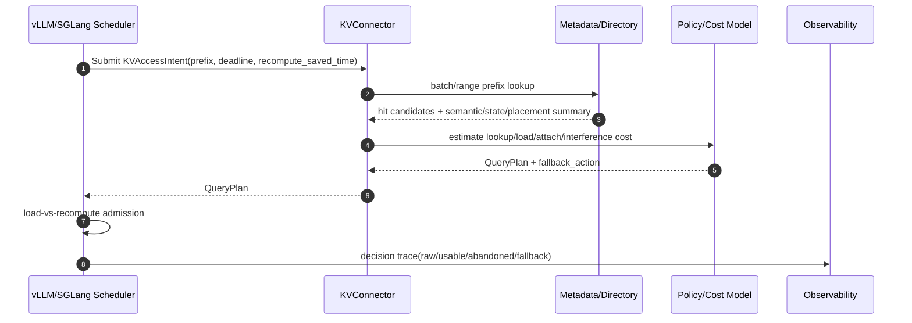
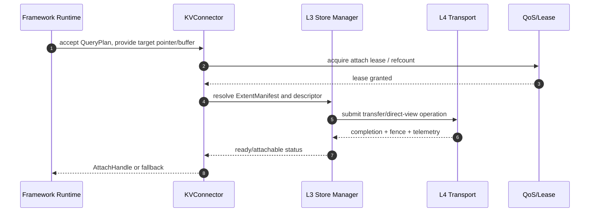
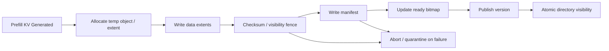
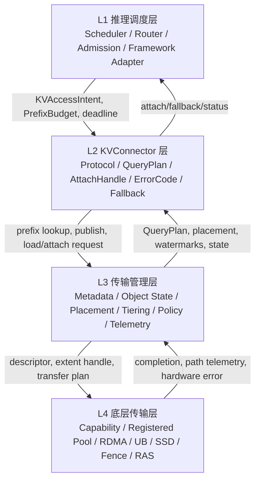

# 统一异构KVCache存储池软件设计说明书 (V4.0 / 修订版)

## 1. 文档目的与适用范围

　　本文档面向第三方技术评审、项目管理、研发设计和系统集成团队，旨在说明“统一异构 KVCache 存储池”软件项目为什么需要建设、要解决什么问题、最终交付什么能力、采用哪些关键技术手段，以及当前需求列表为何能够覆盖该软件项目从概念验证到最终交付的主要工程闭环。

　　本文档不替代详细设计文档、接口 IDL、测试方案、部署手册和硬件选型规格。它的职责是形成软件项目的总体设计说明，帮助读者既能从宏观层面理解项目的商业与战略价值，也能从微观层面把握软件边界、系统分层、模块关系、关键流程和数据结构。

## 2. 软件项目背景

　　在线大模型推理服务面临成本与性能的双重巨大挑战。随着AI集群规模的不断扩大，以及RAG（检索增强生成）、长文本Agent工作流、多轮长对话等高价值业务的普及，单机物理显存（HBM Wall）的局限性日益凸显，导致严重的NPU算力浪费和并发吞吐受限。

　　大模型在线推理的核心成本来自两个阶段：Prefill 和 Decode。Prefill 阶段需要把输入 prompt 的 token 序列计算成 KVCache；Decode 阶段在每生成一个新 token 时，需要反复读取历史 KVCache 参与 attention 计算。随着上下文长度从几千 token 增长到十万、百万 token，KVCache 不再是推理框架内部的普通临时 buffer，而会成为决定 TTFT、TPOT、显存利用率和推理成本的关键系统资源。

　　传统推理系统通常把 KVCache 绑定在单机、单卡或单框架内部管理，形成物理孤岛，导致长前缀重复计算造成昂贵算力浪费、物理 HBM 容量形成并发瓶颈，以及集群资源无法统一复用。

　　为突破这一架构瓶颈，本项目的核心立意在于开发一套**“统一异构KVCache存储池”**系统。该系统旨在打破单机显存、本地内存（DDR）、固态硬盘（SSD）以及跨节点远端存储的物理孤岛，将其抽象并纳管为一个逻辑上统一的KVCache分布式虚拟存储池。它要把分散在 HBM、DDR、SSD、远端 DDR、远端 SSD/object 等介质上的 KVCache 统一建模、统一寻址、统一调度、统一观测，并通过在池中有机调度、冷热降级和全局共享复用KVCache，有效提升在线推理的关键业务指标。

## 3. 软件设计的初衷与核心痛点

　　当前项目的设计初衷，是为了彻底解决业界在大规模长文本与高并发推理场景中长期存在的关键业务痛点：

* **痛点一：长前缀请求下的“重算算力黑洞”与 Raw Hit 假象**
  * *宏观表现*：在RAG或数百轮多轮对话场景中，如果每次请求被迫重新计算数万Token的KVCache，会导致首字响应延迟（TTFT）突破几十秒，吞噬推理集群的大部分算力。
  * *微观剖析*：KVCache物理命中并不必然意味着应该加载。如果远端加载耗时超过本地重算耗时，强行拉取KVCache反而会拖慢TTFT。统一池需要区分 Raw Hit 和 Usable Hit，返回带成本的 QueryPlan，由调度层执行 load-vs-recompute 判断。
* **痛点二：长上下文推理受到 HBM Wall 限制**
  * *宏观表现*：KVCache占用空间与Context长度正相关。长上下文、多轮对话会快速放大容量需求，单张加速卡极易被占满，迫使系统压低Batch Size或引发OOM。
  * *微观剖析*：仅依赖HBM驻留导致并发下降。统一池需要区分 active KV 与 warm/cold KV：active decode KV 默认保持 HBM 友好路径，warm/cold KV 可在本地 DDR、远端 DDR 或 SSD/object 中保留，并在收益为正时预取回HBM。
* **痛点三：多框架、多介质、多硬件路径语义不一致**
  * *问题剖析*：不同推理框架（vLLM/SGLang）和底层硬件路径（RDMA/DPU/SSD）对KVCache对象身份、状态、传输能力的抽象不天然一致。缺乏一种跨介质、零损耗的分布式拉取手段，是集群资源综合利用率低下的根本原因。统一池需要从 P0 就建立 capability matrix，让硬件能力左移参与软件语义定义。
* **痛点四：后台迁移、淘汰和压缩可能干扰前台 Decode**
  * *问题剖析*：KVCache分层存储池如果没有状态机、QoS和租约控制，后台冷热迁移、SSD 回源等可能与前台 attention runtime 争用带宽，造成 TPOT 抖动。统一池需要把后台流量隔离、限速、可观测。
* **痛点五：命中了但变慢，传统指标解释不了**
  * *问题剖析*：单一 hit rate 指标无法解释统一池的真实收益。系统需要同时观测 raw hit、usable hit、stale hit、abandoned hit、fallback，以及负载和附加延迟。没有端到端 trace 和语义指标，团队无法定位“命中了为什么收益不足”。

## 4. 项目技术先进性与总体目标

### 4.1 技术先进性体现

本软件项目的最终交付目标，是构建一个**深入底层硬件、横跨整个推理集群物理拓扑的“分布式异构虚拟内存操作系统”**。它将分布式集群中海量且闲置的显存、本地与远端DDR、本地与远端SSD等介质彻底融合，提供无感的底层基础设施底座。

1. **算力成本红利化与颠覆式重构**。利用异构存储的高速零拷贝流动置换算力消耗，在公共前缀命中时可显著消除冗余Prefill（重算）浪费。这使得大模型在线服务运行成本发生结构性转换，有效提升单卡并发吞吐。
2. **长文本并发推理使能**。彻底解除单卡物理显存对Context长度的硬性枷锁，无缝支撑超长上下文无感并发。
3. **极简约束下的平滑与稳定**。通过控制轨与数据轨的严格双轨分离，将异构传输和冷数据降级所带来的TPOT长尾延迟波动压制在极低水平。
4. **以 usable hit 而不是 raw hit 作为收益核心**。系统必须判断“是否命中、是否可消费、是否值得消费”，避免低质量命中拖垮 TTFT。
5. **软硬协同从第一阶段前置**。硬件 capability、registered pool、extent handle、visibility fence、SG descriptor、per-path telemetry 不是后期优化项，而是 QueryPlan、AttachHandle 和 cost model 的基础输入。
6. **对异构介质采用统一对象和路径抽象**。HBM/DDR/SSD/远端资源不被暴露为若干孤立优化点，而是通过状态机、placement 和 descriptor 进入统一池。
7. **用观测闭环支撑工程落地**。系统不仅追求命中率，还必须能解释 abandoned hit、fallback、TPOT interference、路径拥塞、状态迁移和硬件错误。

### 4.2 最终交付目标

　　*为了实现上述虚拟内存操作系统的愿景，*本项目最终将交付一套统一异构 KVCache 存储池软件实体。该软件实体应具备以下能力：

1. 统一纳管 HBM、DDR、SSD、远端 DDR、远端 SSD/object 等异构 KVCache 资源。
2. 为 vLLM/SGLang 等推理框架提供统一的 KVConnector 协议、QueryPlan、AttachHandle、fallback 和错误码。
3. 维护 KVCache 对象身份、前缀目录、对象状态机、placement、extent manifest、ready bitmap、lease/refcount、版本可见性和副本健康状态。
4. 基于 capability matrix 和 per-path telemetry 执行 load-vs-recompute、view-vs-copy、placement resolver、watermark admission、cost eviction 和迁移策略。
5. 支持从旁路验证到受控主流程灰度，再到生产化和最终交付的分阶段演进。
6. 通过端到端 metrics、path trace、fallback trace、KV state trace、RAS error map 和 inspect API，使收益、降级、异常和瓶颈可解释。

## 5. 与现有同类型软件的比较优势

### 5.1 比较对象与定位说明

　　现有同类型软件和研究系统中，Mooncake 是最重要的外部参照之一。Mooncake 论文和开源仓库将其定位为 KVCache-centric disaggregated architecture，用于将 prefill 与 decode 集群解耦，并利用 GPU 集群中相对空闲的 CPU、DRAM、SSD 资源构建 disaggregated KVCache pool。

　　NIXL 则更接近底层数据移动基础设施，定位为面向 AI inference 框架的点到点通信加速库。

　　本项目与 Mooncake、NIXL、vLLM/SGLang 原生 prefix cache/offload 能力的关系不是简单替代，而是“统一异构 KVCache 存储池软件实体”与“已有推理系统、传输库、缓存框架”的组合关系：已有系统可作为参照、后端或接入对象，本项目的差异化在于跨框架、跨介质、跨硬件能力的统一语义、统一状态、统一验收和统一可观测闭环。

### 5.2 功能维度比较

| 比较维度 | Mooncake / 典型 KVCache 解耦系统 | NIXL / 典型传输库 | vLLM/SGLang 原生能力 | 本项目统一异构 KVCache 存储池的优势 |
|---|---|---|---|---|
| 系统定位 | 面向 LLM serving 的 KVCache-centric disaggregated 架构，强调 prefill/decode 解耦、KV 复用和 SLO 调度 | 面向推理框架的数据移动库，强调点到点通信、memory/storage 抽象和插件化后端 | 框架内 prefix cache、block manager、swap/offload、connector 等局部能力 | **将 KVCache 抽象为跨框架、跨介质、跨节点的软件对象和统一存储池，覆盖对象身份、状态、placement、传输、隔离、观测和回退** |
| 资源范围 | 利用 GPU 集群中的 CPU、DRAM、SSD 和 RDMA 资源构建 disaggregated KVCache | 抽象 CPU/GPU memory 与 file/block/object storage 等传输资源 | 主要围绕单框架运行时的 HBM、host memory、外部 connector 或局部存储 | **需求明确覆盖 HBM、本地 DDR、本地 SSD、远端 DDR、远端 SSD/object，并要求 L3/L4 capability matrix 与 cost model 统一** |
| 命中语义 | 强调 KVCache 复用与 SLO 平衡 | 不定义业务命中语义，主要提供数据移动能力 | 通常以框架内部 prefix/block 命中或 connector 命中为主 | **明确区分 raw hit、usable hit、stale hit、abandoned hit；命中必须经过 semantic identity、ready/version/lease、路径成本和 deadline 判断** |
| 决策返回 | 调度器根据负载、缓存分布和 SLO 做请求调度 | 返回传输执行结果或 telemetry，不负责推理业务裁决 | 框架内调度器做本地策略判断 | **通过 QueryPlan 返回 consume_action、source_placement、expected_load_us、expected_attach_us、interference、fallback_action 和 confidence，避免裸地址式命中** |
| 硬件协同 | 具备 RDMA、CPU DRAM、SSD 等关键工程实践 | 强项是传输后端和 memory/storage 插件抽象 | 依赖各框架和后端的支持范围 | **从 P0 起把 capability matrix、registered pool、extent handle、visibility fence、SG descriptor、per-path telemetry 纳入软件语义，避免硬件后置** |
| 正确性与隔离 | 关注 SLO、调度、KV 复用和系统吞吐 | 不负责 KV 对象语义正确性 | 框架内部有各自正确性边界 | **系统化覆盖 tenant/security domain、KVSemanticIdentity、layout/version、ready bitmap、lease/refcount、stale-hit guard、quarantine、RAS error map** |
| 可观测性 | 关注服务调度与性能指标 | 提供传输 telemetry 能力 | 框架侧 metrics 各自独立 | **要求端到端串联 request_id、query_plan_id、object_id、path_id、decision_reason、fallback_reason，并把收益、降级、状态迁移和硬件路径瓶颈统一解释** |
| 交付形态 | 作为完整 serving platform 或其核心组件 | 作为底层数据移动库 | 作为推理框架内部能力 | **作为可接入 vLLM/SGLang、可复用 Mooncake/NIXL 等后端能力的统一 KVCache 存储池软件实体** |

### 5.3 业务指标维度比较优势

　　**TTFT 方面**，本项目进一步把“命中是否值得消费”形式化为 QueryPlan 和 load-vs-recompute admission：当远端加载、attach、同步或干扰成本超过重算收益时，系统应把该命中归类为 abandoned hit 并回退。这样可以降低“命中了但首字更慢”的风险。

　　**TPOT 方面**，本项目把 TPOT Interference 作为独立验收指标，并在需求中设置 migration interlock、traffic class、QoS、refcount、ready bitmap 和 per-path telemetry，要求后台流量对 TPOT 的影响可测、可限流、可回退、可解释。

　　**HBM 有效容量方面**，本项目的差异在于将 HBM Effective Capacity、Placement Change Frequency、KVObjectStateMachine、ExtentManifest、watermark、cost eviction 和 state-aware migration 绑定为一个完整生命周期闭环，避免“容量扩展了，但对象不可消费或迁移不可控”。

　　**命中率质量方面**，本项目要求同时统计 raw hit、usable hit、stale hit、abandoned hit、fallback，并要求每个 abandoned/fallback 原因能追溯，比单一 hit rate 更能解释真实收益。

### 5.4 相对 Mooncake 的技术先进性与差异化优势

　　Mooncake 尤其适合说明长上下文、高复用、PD 解耦和过载调度场景下 KVCache 成为调度核心的合理性。本项目在此基础上进一步：

1. **从 KVCache 解耦架构扩展到“内存语义 + 传输语义”的统一硬件抽象**：把 UBMEM 的内存语义和 URMA 的传输语义同时纳入统一硬件能力抽象，让推理框架在 QueryPlan 中判断各种动作。
2. **从外部 KV Store 查询扩展到拓扑感知的 KVCache 位置存储与查询**：让 KVCache 的 placement 成为可查询、可比较、可调度的拓扑对象，结合具体路径代价返回最优 QueryPlan。
3. **从碎片化块传输扩展到硬件可执行的数据流编译**：通过 ExtentManifest、SG descriptor 等，将框架侧碎片化 KV block 编译为硬件路径可执行的批量传输描述符，释放真实带宽。

## 6. 关键技术手段与设计原则

　　本系统的关键设计要点在于：**在架构层面化解“异构介质物理延迟急剧阶梯化”与“在线推理极严苛SLA指标”之间的轴心冲突**。

### 6.1 统一 KVConnector 与 Pull-to-Provided Device Pointer 契约

　　统一池通过 KVConnector Protocol 向上层框架暴露稳定接口。推理框架提供目标 device pointer，统一池将被选中的 KV extent 按 QueryPlan 送达，实现框架内存与底层存储解耦。

### 6.2 QueryPlan 驱动的 Load-vs-Recompute 决策

　　统一池不应只返回命中位置，而应返回可执行 QueryPlan。调度层结合 prefix budget、deadline、当前 batch 状态、HBM 水位和 recompute_saved_time 做最终裁决。

### 6.3 软硬协同硬件能力左移与主路径分阶段

　　P0 即验证 UB/UBMEM、HBM/DDR、SSD、registered pool 等基础能力，并让其进入 QueryPlan 语义；高级能力（如在线压缩、硬件页迁移、多播）先旁路验证，待收益和稳定性达标后再主路径启用。

### 6.4 控制面快判与数据面搬运解耦

　　控制面负责请求意图、状态判断和准入裁决，尽量避免串行阻塞。数据面负责按 descriptor 完成物理搬运和校验，通过 registered pool 和流水线降低 CPU 干预。

### 6.5 默认可降级、可关闭、可解释

　　系统接入在线推理主链路，必须具备 feature flag、灰度开关和 fallback contract。任何硬件路径拥塞或租约冲突必须能阻断误消费，并回退到重算或本地缓存。

## 7. 关键业务流程设计

### 7.1 Prefix Hit 快速判定路径

### 7.2 KV Load / Attach 消费路径

### 7.3 KV Publish / Lifecycle 路径

## 8. 阶段目标与里程碑

　　最新版需求表把交付拆成 P0/P1/P2/P3 四个阶段，并设置两个里程碑。

| 阶段 | 累计目标 | 里程碑 | 交付定位 | 主流程状态 |
|---|---:|---|---|---|
| P0 / 第一阶段 | 30% | 非里程碑：地基验收点 | 拉通统一池功能流程主线，交付可旁路运行的基础版本 | shadow/sidecar/adapter 旁路，不强制替换主流程 |
| P1 / 第二阶段 | 50% | 里程碑一：软件骨架完成 | 与 vLLM/SGLang 主流程完成一次真实闭环 | 受控 workload 小流量可切主流程 |
| P2 / 第三阶段 | 80% | 非里程碑：生产化能力验收点 | 从“能跑通”转向“稳定运行并产生可量化收益” | selected workload 可默认开启，支持灰度和回滚 |
| P3 / 第四阶段 | 100% | 里程碑二：最终交付版本 | 完成高级硬件能力、规模化增强、全量回归、文档和最终验收 | release candidate，默认只启用已达标能力 |

## 9. 端到端验收与工程基线

　　系统正式验收必须同时给出 raw、usable、stale、abandoned、fallback 等拆解，并说明每类变化的原因。
　　核心验收指标覆盖 6 类 10 项：端到端性能提升（TTFT Benefit、TPOT Interference）、命中率与状态拆解、容量与分层收益、数据面路径能力、正确性与一致性、生产可运维性。
　　详细设计需建立 Workload Baseline、框架 Baseline、Hardware Capability Baseline、Trace Schema 等8类工程基线。

## 10. 需求列表的完整性与边界风险控制

　　底层逻辑由多达140余条严密的 L1至L4级别需求逐一托底并闭环互锁：
* **功能闭环完整性**：完全覆盖 Prefix hit 快速判定、KV load/attach 消费、KV publish/lifecycle 三条主路径。
* **软硬协同完整性**：将硬件能力纳入上层决策，P0/P1 验证硬件能力抽象，高级能力逐步定版。
* **风险控制边界**：远端 direct view 和 DPU offload 必须经过 QueryPlan 判断，活跃 decode KV 优先保证 HBM 友好路径，不过度承诺。

## 11. 总结

　　“统一异构 KVCache 存储池”的核心价值，是在在线推理场景中把分散、异构、局部、框架内的 KVCache 资源，提升为统一、可查询、可消费、可迁移、可观测、可回退的软件对象和存储池。

　　设计上必须同时处理调度准入、元数据快判、对象状态、硬件能力、数据搬运、租约隔离、分层迁移和可观测闭环。通过 P0/P1/P2/P3 阶段交付将140余条需求纳入可实施路径。后续详细设计应继续坚持以 usable hit 为收益核心，以硬件 capability 驱动 QueryPlan，以可降级和可解释作为生产化底线。

---

## 附录 A: 软件设计框架、层次与模块关系

### A.1 总体分层

### A.2 六大横向技术模块

| 模块 | 名称 | 核心职责 | 关键交付 |
|---|---|---|---|
| TM1 | 推理调度与标准接口控制 | 将 vLLM/SGLang 请求意图转为 KVAccessIntent、PrefixBudget、Admission 和 QueryPlan 输入 | 框架接入、load-vs-recompute、主流程开关、fallback |
| TM2 | 分布式前缀索引与元数据平面 | 判断是否命中、是否可消费、从哪里取最划算 | PrefixDirectorySchema、metadata cache/mirror、batch/range lookup、stale-hit guard |
| TM3 | 异构分层存储池与生命周期空间 | 管理 HBM/DDR/SSD/远端介质生命周期、容量、水位、迁移、淘汰和碎片治理 | KVObjectStateMachine、ExtentManifest、tier manager、allocator、migration interlock |
| TM4 | 硬件加速传输与数据流编排 | 将数据面请求映射到 UB/UBMEM、RDMA/NIXL/Mooncake、C2C、DPU、SSD/object 等路径 | registered pool、descriptor/layout negotiation、fence/completion、path telemetry |
| TM5 | 共享协同、安全隔离与 QoS 管控 | 保证多租户、多 consumer、rank consensus、迁移互锁和后台流量隔离 | lease/refcount、ready bitmap、traffic class、QoS、quarantine、secure release |
| TM6 | 全路径全栈可观测性与容错保障 | 串联 L1/L2/L3/L4 的决策、路径、状态、指标和失败原因 | semantic metrics、path trace、fallback trace、KV state trace、RAS error map、inspect API |

## 附录 B: 核心对象与接口设计

　　本章描述统一异构 KVCache 存储池在 L1/L2/L3/L4 之间传递的核心对象。仅列出字段名称并不足以支撑详细设计，因为这些对象本质上承担跨层契约作用：字段由哪一层生产、被哪一层消费、用于什么决策、缺失后会造成什么风险，都需要在设计阶段明确。

　　因此，下表按“关键数据/含义/作用/生产者与消费者”展开，便于后续转化为 IDL、Python Protocol、C++ struct、protobuf message、metrics schema 和 conformance test。

### B.1 KVAccessIntent
　　KVAccessIntent 是 L1 向统一池表达访问意图的基础对象，包含请求身份、模型语义、目标框架、期望操作和 deadline 等字段。作用是把框架内部调度意图转化为跨层请求。

| 关键数据 / 字段 | 含义 | 主要作用 | 生产者 / 消费者 |
|---|---|---|---|
| request_id | 单次推理请求的全局唯一标识 | 串联 prefix lookup、QueryPlan、load/attach、fallback 和 trace，定位“命中了为什么慢” | L1 生成；L2/L3/L4/TM6 消费 |
| tenant_id / security_domain | 租户、业务域或安全隔离域 | 防止不同租户 KVCache 串用，驱动 cache salt、quota、隔离策略和审计 | L1/L2 生成；L3/TM5 消费 |
| model_id / model_version | 模型名称、权重版本或部署版本 | 保证 KVCache 只在同一模型语义下复用，避免跨模型误命中 | L1 生成；L2/TM2/L3 消费 |
| tokenizer_id / tokenizer_hash | tokenizer 版本或哈希 | 防止相同文本在不同 tokenizer 下 token 序列不一致导致错误复用 | L1 生成；TM2 消费 |
| template_id / template_version | prompt template、system prompt 或 agent 模板版本 | 避免模板升级后旧 KVCache 被误认为可复用 | L1/L2 生成；TM2 消费 |
| adapter_id / lora_id | LoRA、Adapter 或专家模块标识 | 保证不同参数增量下的 KVCache 不混用 | L1 生成；TM2/TM3 消费 |
| prefix_hash_vector | vLLM 类 block hash 向量 | 支持 hash-based prefix lookup、batch lookup 和 range lookup | L1 生成；L2/TM2 消费 |
| radix_span / token_span | SGLang 类 radix 前缀区间或 token 区间 | 支持最长前缀匹配、部分前缀命中和 partial attach | L1 生成；L2/TM2 消费 |
| operation | get、put、prefetch、evict、publish、inspect 等访问意图 | 区分查询、加载、发布、预取、淘汰和诊断流程 | L1/L2 生成；L3 消费 |
| prefix_decision_deadline_us | 前缀查询与命中决策截止时间 | 防止 metadata lookup 或远端查询拖慢 TTFT | L1 Scheduler 生成；L2/L3 消费 |
| recompute_saved_time_us | 若复用该前缀可节省的重算时间估计 | load-vs-recompute 的收益基线 | L1 估算；L2/L3 cost model 消费 |
| target_device / target_ptr_hint | 框架侧目标设备、device pointer 或 HBM 分配约束 | 支撑 Pull-to-Provided Device Pointer 契约，避免统一池越界管理执行 HBM | L1 Runtime 生成；L2/TM4 消费 |
| allow_partial_attach | 是否允许“命中前缀 attach + 后缀重算” | 使系统能在部分可消费命中时仍产生收益 | L1 生成；L2/TM2/TM3 消费 |
| priority / traffic_class_hint | 请求优先级或业务 SLA 等级 | 影响 admission、QoS、迁移让路和 fallback 策略 | L1/Router 生成；TM1/TM5/TM4 消费 |

### B.2 QueryPlan
　　QueryPlan 是统一池返回给 L1/L2 的可执行计划，而不是裸地址。它应包含：

- consume_action：ATTACH、LOAD_TO_HBM、DIRECT_VIEW、PARTIAL_ATTACH、RECOMPUTE、WAIT_READY、DENY 等。
- source_placement：tier、node_id、device_id、extent、replica、layout。
- cost estimate：lookup、load、attach、sync、interference、fallback probability。
- consistency info：object_version、layout_version、ready bitmap、lease requirement、checksum status。
- path info：path_id、transport type、capability flags、expected bandwidth/latency。
- fallback_action：recompute、本地 cache、备用副本、禁用路径等。

| 关键数据 / 字段 | 含义 | 主要作用 | 生产者 / 消费者 |
|---|---|---|---|
| query_plan_id | 单次计划的唯一标识 | 绑定一次 lookup 决策、后续 load/attach 行为和观测记录 | L2/L3 生成；L1/TM6 消费 |
| consume_action | ATTACH、LOAD_TO_HBM、DIRECT_VIEW、PARTIAL_ATTACH、RECOMPUTE、WAIT_READY、DENY 等 | 明确上层下一步动作，避免把所有 hit 都当作可加载对象 | L3 policy/cost model 生成；L1/L2 消费 |
| usable_prefix_len / attach_span | 当前可安全消费的连续前缀长度或 block/page 范围 | 支持部分前缀命中、后缀重算和 rank consensus | TM2/TM3 生成；L1/L2 消费 |
| missing_suffix_span | 不可命中的后缀区间或需重算区间 | 指导框架拼接 block table 和确定 recompute boundary | TM2 生成；L1 Runtime 消费 |
| source_placement | KVCache 来源位置，包括 tier、node_id、device_id、extent、replica_id | 指明数据来自 HBM、DDR、SSD、远端 DDR 或远端 SSD/object | L3 placement resolver 生成；L2/TM4 消费 |
| object_id / extent_id | KV 对象和物理 extent 标识 | 连接元数据、生命周期、传输 descriptor 和 trace | L3 生成；L2/TM4/TM6 消费 |
| layout_id / layout_version | KV block/page 布局与版本 | 保证源 KV layout 与框架 attention runtime 可消费布局一致 | L3/TM2 生成；L1/L2/TM4 消费 |
| object_version | KV 对象版本 | 防止旧版本、未发布版本或 tombstone 对象被消费 | TM2/TM3 生成；L1/L2/TM5 消费 |
| ready_bitmap | 对象内哪些 block/page 已 ready | 防止半写入、半迁移或校验未完成的 KV 被 attach | TM3/TM5 生成；L2/L1 消费 |
| lease_requirement | 消费该对象前需要申请的租约类型 | 决定是否需要 attach lease、read lease、migration block 或 refcount pin | TM5 生成；L2/L1 消费 |
| path_id / transport_type | 推荐传输路径及类型，如 UBMEM、URMA、RDMA、C2C、SSD/object | 把底层多态硬件能力显式暴露给上层策略 | TM4 capability router 生成；L2/L3/L1 消费 |
| capability_flags | 路径能力标记，如 supports_memory_view、supports_bulk_transfer、supports_fence、supports_qos_queue | 决定 view-vs-copy、bulk load、QoS、fallback 是否可用 | TM4 生成；L3/L2 消费 |
| expected_lookup_us | 预计元数据查询耗时 | 计入 TTFT 预算与 prefix decision deadline | TM2/TM6 生成；L1/L2 消费 |
| expected_load_us | 预计 KV 数据加载耗时 | load-vs-recompute 的核心输入 | TM4 telemetry / L3 cost model 生成；L1 消费 |
| expected_attach_us | 预计 attach 和 runtime 可见成本 | 评估命中收益是否会被 attach 开销抵消 | L2/L3 生成；L1 消费 |
| expected_interference_us | 对前台 decode 或其他租户的预计干扰 | 支撑 TPOT interference 控制和 QoS 策略 | L3/TM5/TM4 生成；L1/TM6 消费 |
| confidence | 对成本估计和路径可用性的置信度 | 低置信度时可选择 recompute、shadow 或降级路径 | L3 cost model 生成；L1/L2 消费 |
| fallback_action | 失败时的回退动作，如 recompute、本地 cache、备用副本、禁用路径 | 保证路径失败不会导致请求挂死或误消费 | L3/L2 生成；L1 消费 |
| decision_reason | 生成该计划的原因编码 | 支撑可观测、审计和问题定位 | L3/TM6 生成；全链路消费 |

### B.3 AttachHandle
　　AttachHandle 表示框架侧可以消费某段 KVCache 的句柄。它必须与 lease/refcount 绑定，具备有效期、版本、extent 引用、release/detach 语义和错误码。AttachHandle 失效、租约冲突或对象迁移时，框架必须能收到明确状态并回退。

| 关键数据 / 字段 | 含义 | 主要作用 | 生产者 / 消费者 |
|---|---|---|---|
| attach_handle_id | 一次 attach 消费行为的唯一标识 | 绑定 runtime 消费、release/detach 和 refcount 生命周期 | L2/TM5 生成；L1 Runtime/TM6 消费 |
| query_plan_id | 该 handle 来源的 QueryPlan | 将实际消费行为回溯到原始决策 | L2 生成；TM6 消费 |
| object_id / extent_id | 被消费的对象和 extent | 驱动 refcount pin、迁移互锁和错误定位 | L3/TM5 生成；L1/L2/TM6 消费 |
| device_ptr / block_table_ref | 框架侧可读取的目标地址或 block table 引用 | 让 attention runtime 能直接消费已加载或已 attach 的 KV | L1/L2 共同确定；L1 Runtime 消费 |
| attach_mode | COPY_TO_HBM、DIRECT_VIEW、PARTIAL_ATTACH、STREAMING_ATTACH 等 | 明确 runtime 如何访问 KV，避免把 direct view 和 copy 语义混淆 | L2/L3 生成；L1 Runtime 消费 |
| valid_until / lease_ttl | handle 有效期或租约超时时间 | 防止长时间悬挂引用阻塞淘汰、迁移或资源回收 | TM5 生成；L1/L2 消费 |
| refcount_token | 引用计数凭证 | 在 active decode 期间阻止对象被释放或覆盖 | TM5 生成；TM3/TM5 消费 |
| release_semantics | detach/release 时需要执行的动作 | 保证 runtime 释放后 refcount、lease、telemetry 和资源状态一致 | L2/TM5 定义；L1 Runtime 调用 |
| status | ACTIVE、EXPIRED、REVOKED、MIGRATING、FAILED 等状态 | 框架可据此继续消费、重试或 fallback | TM5/L2 生成；L1 消费 |
| error_code | 失效或失败原因 | 支撑标准错误处理和 fallback | L2/TM6 生成；L1 消费 |
| checksum / integrity_token | 数据完整性校验标记 | 防止损坏副本或半写入数据被误消费 | TM4/TM5 生成；L2/L1 消费 |

### B.4 ExtentManifest 与 Descriptor
　　ExtentManifest 是对象到物理 extent 的映射。Descriptor 是底层传输可执行的数据描述。

| 关键数据 / 字段 | 含义 | 主要作用 | 生产者 / 消费者 |
|---|---|---|---|
| manifest_id | extent manifest 唯一标识 | 标识一次对象布局快照，支持版本化和回溯 | L3 生成；L2/TM4/TM6 消费 |
| object_id | 归属 KV 对象 | 将物理 extent 与逻辑 KV 对象绑定 | L3 生成；全链路消费 |
| layout_id / layout_version | KV 分块、层、head、page/block 布局 | 指导 descriptor 生成和框架 attach 兼容性检查 | L3 生成；L2/TM4/L1 消费 |
| tier | extent 所属介质层级，如 HBM、DDR、SSD、remote DDR、remote SSD/object | 支撑 placement、tiering、eviction 和 cost model | L3 生成；L1/L2/TM4 消费 |
| node_id / device_id | 物理节点和设备标识 | 支撑拓扑感知路由和路径选择 | TM3/TM4 生成；L3/TM4 消费 |
| extent_address / offset / length | 物理 extent 地址、偏移和长度 | 数据面搬运的基本地址信息 | L3/TM4 生成；TM4 消费 |
| sg_list | scatter-gather 段列表 | 将碎片化 KV block/page 合并为硬件可执行描述 | L3-SE-DescriptorFromManifest 生成；TM4 消费 |
| max_sg_entries | 当前硬件路径支持的最大 SG 段数 | 防止 descriptor 超出 RNIC/DMA/URMA 能力 | TM4 capability matrix 生成；L3 消费 |
| alignment / granularity | 对齐粒度、注册粒度或 direct I/O 粒度 | 保证 UBMEM/URMA/RDMA/SSD 等路径可执行 | TM4 生成；L3/TM4 消费 |
| memory_region / rkey | registered pool 或远端内存访问凭证 | 支撑 RDMA/URMA/registered path 安全访问 | TM4 生成；TM4/L3 消费 |
| fence_policy | 写入可见性、读写顺序和 completion 要求 | 保证 ready bitmap 与真实数据可见性一致 | TM4/TM5 生成；L3/L2 消费 |
| checksum_policy | 数据校验方式 | 防止损坏 extent 或复制错误进入消费路径 | TM4/TM5 生成；L2/TM6 消费 |
| compression / transform_plan | 压缩、解压或 layout transform 方案 | 支撑 SSD/object 回源、DPU offload 或布局转换 | L3/TM4 生成；TM4/L2 消费 |
| replica_set | 可用副本集合及健康状态 | 支持 multi-replica resolver、故障回退和就近读取 | TM2/TM3 生成；L3/L2 消费 |

　　Descriptor 是由 ExtentManifest 面向具体硬件路径编译出的执行对象。其重点字段如下。

| 关键数据 / 字段 | 含义 | 主要作用 | 生产者 / 消费者 |
|---|---|---|---|
| descriptor_id | 一次传输描述符的唯一标识 | 绑定 submit、completion、retry 和 telemetry | L3/TM4 生成；TM4/TM6 消费 |
| source_extent / target_extent | 源与目标 extent | 描述数据从哪里来、写到哪里去 | L3 生成；TM4 消费 |
| transport_type | UBMEM、URMA、RDMA、C2C、SSD/object 等 | 决定底层执行引擎和错误语义 | L3/TM4 生成；TM4 消费 |
| op_type | READ、WRITE、COPY、VIEW_MAP、PREFETCH、EVICT 等 | 指定底层数据面动作 | L3 生成；TM4 消费 |
| submit_queue / traffic_class | 提交队列和流量等级 | 控制前后台流量隔离和 QoS | TM4/TM5 生成；TM4 消费 |
| completion_token | 完成事件或 CQ token | 让 L3/L2 判断数据是否可见、是否可 attach | TM4 生成；L3/L2 消费 |
| retry_policy | 超时、重试、备用路径策略 | 防止短时链路故障导致请求挂死 | L3/TM4 生成；TM4/L2 消费 |
| telemetry_tags | path_id、queue_depth、bytes、latency 等观测标签 | 反哺 cost model 和性能分析 | TM4 生成；TM6/L3 消费 |

### B.5 Metrics 与 Trace Schema
　　最小 trace 字段串联 L1-L4 的决策与追踪，保证收益指标可解释。

| 关键数据 / 字段 | 含义 | 主要作用 | 生产者 / 消费者 |
|---|---|---|---|
| request_id | 推理请求标识 | 串联一次请求的完整链路 | L1 生成；TM6 消费 |
| query_plan_id | 决策计划标识 | 分析计划与实际执行是否一致 | L2/L3 生成；TM6 消费 |
| object_id | KV 对象标识 | 将命中、加载、迁移、回退和错误关联到对象 | L3 生成；TM6 消费 |
| prefix_hash / semantic_identity | 前缀和语义身份 | 解释命中、stale hit 和版本不兼容原因 | L1/L2/TM2 生成；TM6 消费 |
| path_id | 被选择或尝试的硬件路径 | 分析 UBMEM、URMA、RDMA、SSD/object 等路径收益和瓶颈 | TM4 生成；TM6/L3 消费 |
| source_tier / target_tier | 数据迁移或加载的源/目标层级 | 统计 HBM effective capacity 和 placement change frequency | L3/TM4 生成；TM6 消费 |
| decision_reason | 选择 attach、load、direct view、recompute 或 deny 的原因 | 解释 load-vs-recompute 和 view-vs-copy 决策 | L1/L3 生成；TM6 消费 |
| fallback_reason | 回退原因，如 timeout、stale metadata、lease conflict、RAS error | 支撑 Fallback Reason Coverage 和生产定位 | L2/L3/TM4 生成；TM6 消费 |
| estimated_cost / actual_cost | 预计成本与实际成本 | 校准 cost model，发现路径代价漂移 | L3/TM4 生成；TM6/L3 消费 |
| state_transition | KVObjectState 或 placement 的状态变化 | 追踪迁移、淘汰、发布、quarantine 和 GC | L3/TM5 生成；TM6 消费 |
| usable_hit / raw_hit / abandoned_hit | 命中质量拆解标记 | 防止只看 hit rate 而误判收益 | TM2/L3/L1 生成；TM6/验收消费 |
| ttft_benefit_us | 命中路径相对 baseline/recompute 的 TTFT 收益 | 量化业务收益 | L1/TM6 生成；验收消费 |
| tpot_interference_us | 后台传输、迁移、回源对 decode 的影响 | 量化后台流量对前台体验的干扰 | L1/TM4/TM6 生成；验收消费 |
| error_code | 标准错误码 | 触发 fallback、告警和故障归因 | L2/L3/TM4 生成；L1/TM6 消费 |

### B.6 核心对象之间的关系

　　核心对象之间不是孤立存在，而是形成一条从“意图”到“执行”再到“观测”的链路。

| 链路阶段 | 输入对象 | 输出对象 | 关键作用 |
|---|---|---|---|
| 请求进入 | KVAccessIntent | Prefix lookup request | 把框架调度意图标准化，传递 semantic identity、deadline 和收益估计 |
| 命中判断 | Prefix lookup result | QueryPlan | 把 raw hit 转换为可执行、可消费、可回退的计划 |
| 消费准备 | QueryPlan | AttachHandle / Descriptor | 申请租约、生成传输描述符、确定 copy/view/partial attach 方式 |
| 数据执行 | Descriptor | completion / telemetry | 执行 UBMEM、URMA、RDMA、SSD/object 等路径并返回完成语义 |
| 框架消费 | AttachHandle | runtime block table / device pointer | 让 vLLM/SGLang attention runtime 安全读取 KVCache |
| 生命周期维护 | ExtentManifest / state transition | updated placement / metrics | 更新状态机、水位、迁移、淘汰、refcount 和 trace |
| 问题定位 | Metrics / Trace Schema | 诊断结论 / 验收报告 | 解释命中收益、回退原因、路径瓶颈和 TPOT 干扰 |
