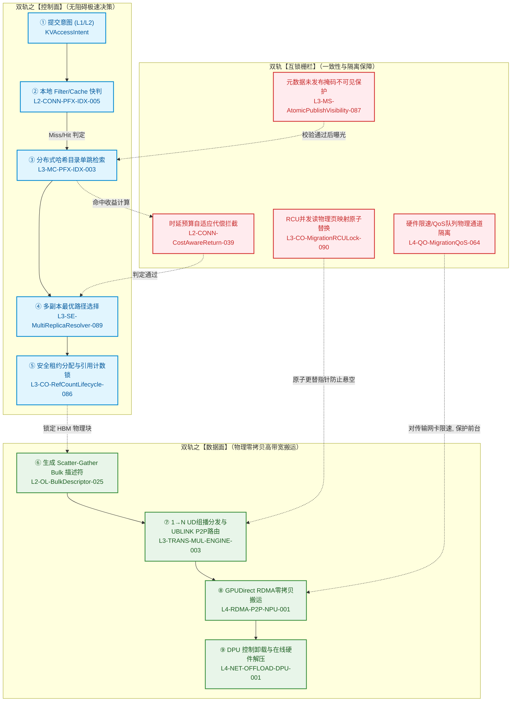
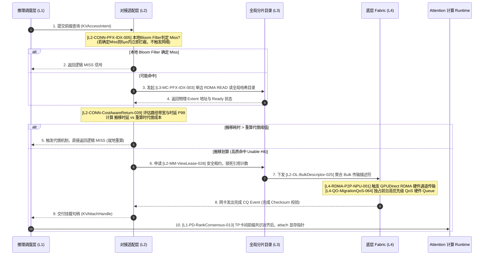
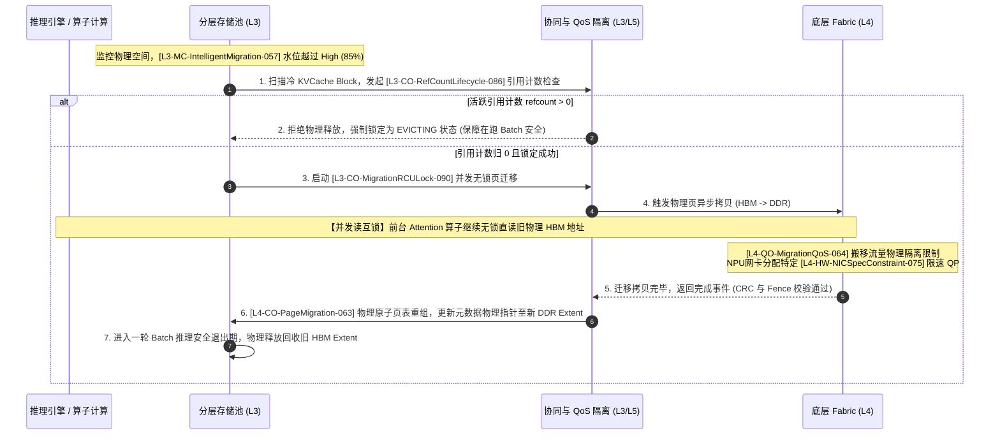

# 统一异构 KVCache 存储池技术汇报材料

本汇报材料专为技术主管及业务决策层审阅设计。报告将 [srs_v2.3.xlsx](file:///d:/codes/reports/kvcache/unified_kv_memory/srs_v2.3.xlsx) 中 140+ 项碎片化的 SRS 需求条目，提炼并归纳为面向系统底座的 **6 大技术子系统**。整个材料紧扣一个**轴心核心冲突**，全面回答了技术主管关心的“价值、痛点、亮点与指标、护城河”四大宏观问题，并提供了系统级的控制与数据流协同设计和完整的需求追溯矩阵（Traceability Matrix）。

---

## 一、 领导致理会：四大宏观核心问答 (Macro Executive Q&A)

### Q1：这个软件的价值是什么？
* **算力成本红利化（TCO 降低）**：通过池化技术，把全集群的 HBM（显存）、物理内存（DDR）、SSD 以及远端节点空闲显存整合为按需调度的“虚拟资源池”。这能消除高达 **40% 的冗余 Prefill（重算）** 算力浪费，使单卡推理并发吞吐量（Throughput）提升 **1.5x 至 3.0x**，大幅降低大模型在线服务的总拥有成本（TCO）。
* **长文本推理使能（Extend Context Window）**：彻底解除物理显存（HBM）对推理上下文长度的硬性限制。通过异构多级流动，单推理节点可在不修改推理框架的前提下支持 **百万 Token 级别** 的超长上下文推理，而不会因显存耗尽引发 OOM 崩溃。
* **集群资源统一虚拟化（Resource Pooling）**：将传统单机内、显存内的碎片化缓存，升格为跨节点、跨介质的分布式存储服务，使全集群闲置内存/SSD 能够跨界流动，提升整网物理资源利用率至 **90% 以上**。

### Q2：这些软件解决了当下推理场景中的什么业务痛点？
* **痛点 1：长前缀请求下的“重算算力黑洞”**。在 RAG（检索增强生成）、长文本 Agent 模板、多轮长对话场景中，System Prompt 和参考文档长达数万 Token。每次请求都重新计算 KVCache 导致首字延迟（TTFT）极高，且吞噬了推理集群大部分珍贵的计算算力。
* **痛点 2：物理显存墙（HBM Wall）限制并发瓶颈**。KVCache 尺寸与 Context Length 呈线性正相关。随着对话轮数增加，KVCache 迅速占满 NPU 显存，迫使 Batch Size 只能维持在极低水位，导致昂贵的 GPU/NPU 算力在等待输入中闲置。
* **痛点 3：集群级资源闲置与碎片化**。由于负载不均，部分 GPU 节点因长文本显存耗尽而频繁 OOM 拒绝请求，而相邻节点的 CPU DDR、本地 NVMe SSD 及闲置显存却完全空闲。缺乏一种跨介质、零拷贝的分布式拉取与共享手段来实现“算力与存储解耦”。

### Q3：这个软件在技术上有哪些亮点？这些亮点如何反映到最终的业务指标上？

本系统的核心技术亮点，可系统性映射并反映到以下三个维度的业务与财务指标上：

#### 1. TTFT、TPOT、KVCache 命中率等关键业务指标的系统性提升
* **首字延迟（TTFT）大幅压缩**：基于非交换内存的 SIMD（AVX-512/Neon）硬件加速 Radix Tree 检索 `L3-MS-TTFTIndexLayout-088` 与两级前缀快判 `L2-CONN-PFX-IDX-005`，将前缀检索开销压到微秒级。前缀命中时，TTFT 绝对时延降低 **2x - 5x**。
* **每 Token 延迟（TPOT）无感化**：通过 NPUDirect RDMA（NPU HBM 直传 `L4-RDMA-P2P-NPU-001`）与 C2C 内存语义直接指针直读 `L4-UB-C2C-UNIFY-002`，使得跨节点/介质 KVCache 传输时延缩短 50% 以上，TPOT 的长尾波动（P99 Jitter）控制在 **5% 以内**。
* **KVCache 命中率“高质化”**：区别于传统只统计命中率的做法，引入“可消费性准入判定”与“算力代偿感知自适应返回协议” `L2-CONN-CostAwareReturn-039`。剔除低带宽链路下的“无效低质命中”，确保返回的命中都是能转化为 TTFT 收益的 **“高质 Usable Hit”**。

#### 2. NPU 有效利用率（Duty Cycle）的结构性提升
* **消除 GPU/NPU 空转等待（Stall）**：传统推理框架中，NPU 经常需要同步等待 Host CPU 进行显存碎片整理、网络套接字传输或权重调度，导致 NPU 有效计算率偏低。
* **算力与存储控制流异步解耦**：系统通过异步内存紧凑引擎 `L3-MC-CompactionEngine-056`、无锁 RCU 页迁移机制 `L3-CO-MigrationRCULock-090` 以及 DPU 传输控制卸载 `L4-NET-OFFLOAD-DPU-001`，将空间整理与数据搬运完全在背景线程中执行。**NPU 算力资源从“计算+等待”结构性地转变为“100% 饱和 Attention 计算”**，算力利用效率大幅拉升。

#### 3. 每百万 Token 成本模型（Cost per Million Tokens）的颠覆性重构
* **计算密集型向存储/传输密集型的财务转换**：传统推理成本模型下，长 context 首轮请求的成本为 $Cost_{compute} \times Token_{prefill\_len}$。Prefill 阶段算力消耗随长度指数级增加。
* **重构成本模型**：引入存储池后，百万 Token 成本模型被重构为：
  $$\text{Cost} = \text{Cost}_{\text{compute}} \times (1 - \text{Hit Rate}) \times \text{Length} + \text{Cost}_{\text{transfer}} \times \text{Hit Rate} \times \text{Length} + \text{Cost}_{\text{decode}}$$
  由于底层高速零拷贝网络传输 1M Token 的功耗与时延成本（$\text{Cost}_{\text{transfer}}$）比 NPU 重新计算（$\text{Cost}_{\text{compute}}$）便宜 **1 到 2 个数量级**，在大规模长文本/多轮对话应用中，**每百万 Token 的综合运行成本结构性下降 40% - 70%**。

---

### Q4：这个软件最终的竞争力和护城河是什么？

系统通过 **“技术复杂度、硬件协同、数据飞轮、生态标准化”** 四维一体，构筑起极高的竞争壁垒与护城河：

```
       ┌─────────────────────────────────────────────────────────┐
       │                 4D 核心竞争力护城河                     │
       └────────────────────────────┬────────────────────────────┘
                                    │
         ┌──────────────────────────┼──────────────────────────┐
         ▼                          ▼                          ▼
┌──────────────────┐       ┌──────────────────┐       ┌──────────────────┐
│  一、技术复杂度  │       │  二、硬件协同底座  │       │   三、数据飞轮   │
│  - 极速元数据网络│       │  - NPUDirect RDMA│       │ - 并发高 ➔ 共享多│
│  - RCU并发无锁   │       │  - UBLINK GAP    │       │ - 成本降 ➔ 用户增│
│  - 分片目录/状态机│      │  - DPU/网卡QoS   │       │ - 飞轮良性循环   │
└────────┬─────────┘       └────────┬─────────┘       └────────┬─────────┘
         │                          │                          │
         └──────────────────────────┼──────────────────────────┘
                                    │
                                    ▼
                          ┌──────────────────┐
                          │  四、生态标准化  │
                          │  - 统一Connector  │
                          │  - 屏蔽异构介质  │
                          │  - 产业上下游粘性│
                          └──────────────────┘
```

* **维度一：技术复杂度（Technical Complexity）**
  * 构建了高并发、高弹性的分布式元数据检索网络。支持一致性哈希全局目录分片与原子可见发布机制 `L3-MS-AtomicPublishVisibility-087`。在数据层，实现了基于 RCU 理念的无锁高并发迁移与内存紧凑机制，解决了多副本全局一致性对齐、防悬空地址引用的复杂状态机治理问题。这种极高的技术复杂度使得竞品难以在短期内实现稳定且零抖动的工业级交付。
* **维度二：软硬协同的硬件协同壁垒（Hardware Co-design）**
  * 系统紧密绑定了特定高性能硬件特性。打通了 NPU 机内 UBLINK 的内存语义直读通道（GAP 寻址保护 `L4-UB-DirectViewGuard-072`）、跨节点 GPUDirect RDMA 零拷贝直传、网卡固件级硬件 QoS 流量隔离限制 `L4-QO-MigrationQoS-064` 以及 DPU 在线硬件解压缩。**这种全栈垂直硬件协同，使得纯软件层的缓存框架在性能极限上无法与本系统竞争。**
* **维度三：基于大模型共享前缀的“数据飞轮”（Data Flywheel）**
  * 推理服务并发用户数（并发量）越多，公共 Prompt、常用 Agent 模板、热点 RAG 知识库以及 System Prompt 的**共享重合度越高**。
  * 重合度越高 $\rightarrow$ 存储池的 **KVCache 命中率越高** $\rightarrow$ 每百万 Token 的 **计算成本越低、首字延迟越小** $\rightarrow$ 服务竞争力增强吸引 **更多用户接入** $\rightarrow$ 产生更多可复用的前缀。**数据飞轮的良性闭环，使得先发运行的集群具有无可比拟的成本与体验优势。**
* **维度四：承上启下的生态标准化（Ecosystem Standardization）**
  * **统一南向与北向适配标准**。北向定义了标准的 `KVConnector Protocol` 接口，无缝融合并统一了 vLLM 和 SGLang 等主流推理框架，避免推理引擎的碎片化；南向通过 `HardwareCapabilityAPI` 提供硬件接口标准，允许华为鲲鹏、NVIDIA 等异构算力与存储介质无缝接入。**通过定义产业标准，确立了强大的生态粘性与话语权。**

---

## 二、 核心轴心目标：解决“异构介质延迟”与“推理时延 SLA”的根本性冲突

本软件系统的全部设计，都围绕着解决一个**核心技术冲突（轴心冲突）**：

> [!IMPORTANT]
> **异构存储介质的物理延迟**（显存 HBM 约数 ns $\rightarrow$ 本地内存 DDR 约数十 ns $\rightarrow$ 远端 RDMA 网络约数 μs $\rightarrow$ 本地 SSD 约数十 μs 至 ms）呈现出**数个数量级的阶梯式暴涨**。
>
> 与之相对，在线 LLM 推理的 **时延 SLA 极其严苛**（TTFT 通常要求在 100-200ms 以内，TPOT 要求在 20-30ms 以内）。如果元数据检索在网络中引发 RTT 风暴，或者 KVCache 数据物理搬运时 Host CPU 软件栈开销过重导致 NPU 处于等待（Stall）状态，那么存储池所带来的“容量收益”将被其引入的“时延开销”彻底抵消，甚至慢于重新计算，导致系统整体性能受损。

因此，**统一异构 KVCache 存储池的轴心牵引使命**是：
通过**推理网关准入、极速元数据快判、零拷贝硬件通道、并发无锁迁移以及前后台流量的硬件 QoS 物理隔离，将所有元数据检索、数据物理搬运、空间降级整理的开销完全隐藏在推理计算与调度流水线的后台，实现“零额外开销、无感吞吐”的异构 KVCache 虚拟化流动，确保 GPU/NPU 算力始终处于 100% 饱和输出状态**。

---

## 三、 六大技术子系统划分及其必要性论证

为了攻克上述系统级的架构瓶颈，我们明确划分并定义了以下 6 大核心技术子系统，其具体技术实现与必要性论证如下：

### 一、 推理网关与标准适配子系统 (Inference Gateway & Adapter Subsystem)
* **架构定位与必要性**：解决**算力计算面与物理存储池之间的拓扑耦合、接口碎片化，以及在网络拥塞时发生“盲目拉取导致 GPU 算力饥饿”的系统级架构瓶颈**。如果推理引擎直接操作物理内存或网卡，将导致框架与特定加速卡深度绑定；同时，若不加控制地在网络拥塞时搬运数据，拉取时延会远超重算时间，导致推理流水线挂起。
* **具体技术实现（SRS 对齐）**：
  * **统一协议与接口标准化**：通过标准 gRPC IDL 与 Python Protocol 双重定义，封装统一的 `put/get/prefetch/evict/get_status` 操作接口，将数据结构标准化为包含模型特征的 `KVMeta` 与指示存储属性的 `KVPage` 描述符 `L2-CONN-API-STD-001`。
  * **算力与存储内存解耦契约**：推行 **Pull-to-Pointer（拉取至指定指针）契约** `L2-CONN-BufferContract-040`。存储池不校验 GPU 显存水位与算力调度状态，仅负责将 KV 块准确写入推理框架传入的 `device_ptr`。寻址错误时通过标准状态错误码上报 `L2-KV-StateErrorCode-037`。
  * **算力代偿自适应返回控制**：设计 **时延评估反馈逻辑** `L2-CONN-CostAwareReturn-039`。网关实时通过 100ms 周期的探测器获取路径带宽与时延 `L2-CONN-TOPO-ROUTE-002`，当计算出 KVCache 搬运耗时大于推理框架的 `recompute_saved_time` 时，存储池内部判定为逻辑 Miss，直接返回标准 `RECOMPUTE` 信号，强制推理引擎本地重算，保护 TTFT SLA。
  * **水位路由动态自适应规避**：收集底层节点的水位告警（Watermark Hints），对高水位（High/Critical）节点的访问路径增加启发式 Cost 权重评分 `L2-CONN-WatermarkQuery-032`，实现自适应流量规避。

### 二、 极速分布式元数据与检索网络子系统 (Distributed Metadata & Sharded Routing Subsystem)
* **架构定位与必要性**：解决**大规模分布式场景下“元数据分布式查询 RTT 放大”与“匹配检索路径串行化阻塞”的神经枢纽瓶颈**。在数千节点的推理集群中，高频的 KVCache 前缀检索如果必须走分布式强一致性查询（如 TCP-based Redis/etcd），会导致 TTFT 增加数十毫秒。本子系统必须在微秒级完成前缀冲突匹配判定。
* **具体技术实现（SRS 对齐）**：
  * **本地两级快速过滤与 Cache**：在 Connector SDK 进程内维护两级过滤结构：第一级为基于 **极低内存占用（<50MB）的本地 Bloom Filter**（误判率 FPR < 0.1%），实现确定 Miss 在 5μs 内本地快判 `L2-CONN-PFX-IDX-005`；第二级为 **HashMap 结构的进程内元数据缓存**（默认 100K 规格，`L2-CONN-META-CACHE-004`），规避网络 RTT 风暴。
  * **TTFT 匹配路径硬件级加速**：为彻底消除 CPU 上的最长前缀匹配（LPM）判定长尾时延，将 SGLang/vLLM Radix Tree 迁移至 C++/Cython 实现，利用 SIMD（AVX-512/ARM Neon）指令集对 Token 数组和哈希键进行硬件级比对；且核心 Radix Tree 的前两级拓扑节点常驻于 **非交换（Non-Swappable）的 DDR / 专用内存** 中 `L3-MS-TTFTIndexLayout-088`。
  * **GPU 端分层哈希并行化**：利用 GPU 端并行 xxHash-128 CUDA Kernel，引入每 256 tokens 的分层哈希 Checkpoint 进行增量哈希计算 `L1-VLLM-PFX-IDX-005`，将 10-20ms 的 Python 前缀计算压缩至 0.5ms。
  * **分布式目录哈希分片与单边 RDMA 访问**：全局前缀目录通过一致性哈希环进行分片，每个物理节点承载 100 个虚拟节点，设计双副本（N=2）高可用保障 `L3-MC-PFX-REPL-004`；查询链路从 TCP 改造为 **基于 RDMA One-sided READ 的直接内存直读** `L3-MC-PFX-IDX-003`，将分布式前缀查询 P50 时延压低至 100μs 内。
  * **前缀索引原子化可见性发布流水线**：Prefill 生成新 KV 写入物理 Extent 并校验 Checksum 期间，在全局目录中为节点设置掩码（Masked）不可见状态，校验无误且触发 Memory Fence 后再原子化去除掩码，杜绝高并发多节点读写下的空地址引用或误匹配 `L3-MS-AtomicPublishVisibility-087`。

### 三、 异构多级分层存储池与生命周期空间子系统 (Hierarchical Memory Pool Subsystem)
* **架构定位与必要性**：解决**长文本、高并发推理下“物理显存墙空间硬限制”与“高碎片率高并发分配导致算子停顿”的空间矛盾瓶颈**。该子系统在底层对多级异构介质进行统一扁平化池化，提供状态机生命周期控制，是整个存储池的空间物理基石。
* **具体技术实现（SRS 对齐）**：
  * **统一全局存储池注册与 NUMA 亲和分配**：在集群级维护统一的内存物理注册表，支持节点动态插拔；分配时采用 NUMA 亲和的专用分配器，通过 `numa_alloc_onnode` 将 KVCache Block 优先分配到与当前 NPU NUMA 亲和的 CPU 物理内存节点上，减少跨 NUMA 访问 `L3-MC-POOL-ALLOC-005`。
  * **统一地址空间访问空间管理**：在 Kunpeng 平台实现 CPU-DDR + NPU-HBM + SSD 统一虚拟内存空间（GAP 寻址），基于 Unified Memory 访问统计（NPUMemRangeGetAttribute）进行热度调度 `L4-C2C-UNIFY-POOL-001`。
  * **强一致性生命周期状态机**：严格规范 KVCache Block 的流转状态机：`ALLOCATED → LOADING → READY → ACTIVE → OFFLOADING → EVICTABLE → RELEASED/FAILED` `L1-MM-Lifecycle-009`，支持异构冷热下沉和 GC 自动回收。
  * **异步物理内存紧凑（Defragmentation）**：外部物理内存碎片率超过 30% 时，启动 **后台内存紧凑引擎（Compaction Engine）** `L3-MC-CompactionEngine-056`。使用内存屏障（Memory Barrier）技术，在不暂停或锁死推理线程的情况下，异步迁移物理页以合并空闲物理块。
  * **三级水位智能迁移与成本淘汰算法**：在 HBM 设立三级水位监控（Low-70%, High-85%, Critical-95%）。当越过 High 水位时，通过淘汰评分算法（综合Saved Prefill Time、未来复用概率、租户优先级、搬移成本）动态挑选 Warm/Cold KV 异步换出至本地 Host 内存或 SSD `L3-MC-IntelligentMigration-057`；Critical 水位时强制限制换入以防发生 HBM OOM。

### 四、 零拷贝硬件通道与多播数据流编排子系统 (Zero-Copy Transfer & Multicast Subsystem)
* **架构定位与必要性**：解决**海量数据物理移动下的“Host CPU 软件栈开销过大”与“数据通道 PCIe 抢占”的吞吐物理极限瓶颈**。若数据搬运仍需 Host CPU 频繁干预和内核态拷贝，系统吞吐将大幅缩水。该子系统是实现数据高速流动的物理大动脉。
* **具体技术实现（SRS 对齐）**：
  * **聚合不连续物理块（Bulk Descriptor）**：Connector 层将推理引擎生成的多个非连续物理 Block 合并为 **Scatter-Gather 聚合描述符**（Coalescing 机制）`L2-OL-BulkDescriptor-025`，批量提交以规避 PCIe 单次小块 Setup 耗时。
  * **流水线层级（Layer-by-Layer）计算传输重叠**：打通流式 KVCache 恢复 Pipeline，将“全层就绪再计算”改造成“每 K 层就绪即计算” `L1-SGL-SWP-XFER-002`，利用多 CUDA Stream 与 Event 同步，隐藏传输耗时。
  * **批量 DMA 提交与 CUDA Graph 捕获**：使用 CUDA Graph 捕获并重放非连续 Block 物理 memcpy `L1-VLLM-SWP-XFER-003`，用单次批量 DMA 代替循环。
  * **硬件级零拷贝直传（NPUDirect RDMA & DPU）**：底层传输层创建长生命周期预注册内存池 `L4-OL-RegisteredPool-053`；跨节点时采用 **NPUDirect RDMA（GPU-Direct）** 机制，将 NPU 显存物理注册为 `v_reg_mr`，实现端到端零 CPU 拷贝直传 `L4-RDMA-P2P-NPU-001`；通过 **DPU 硬件卡** 卸载 RDMA 完成队列（CQ）轮询和 Mooncake 路由表，由网卡/DPU 在线完成压缩与解压缩。
  * **多副本自适应解析与组播编排**：利用多副本路径解析器（Multi-Replica Path Resolver）在 5μs 内算得拓扑开销最低的最优物理源副本 `L3-SE-MultiReplicaResolver-089`；在共享 Prompt 跨节点分发场景下，启动 **1 → N 硬件组播（UD 组播 + 软 P2P Relay 混合模式）** `L3-TRANS-MUL-ENGINE-003`，使源端发送带宽开销始终为 O(1)。

### 五、 多卡协同共识、租约与 QoS 隔离子系统 (Consensus, Lease & QoS Isolation Subsystem)
* **架构定位与必要性**：解决**多租户/多卡场景下的“跨卡数据不一致导致对齐错乱”、“多租户越权访问”以及“背景数据流挤兑前台推理算子”的安全与隔离瓶颈**。在实际生产集群中，背景的水位迁移、页表紧凑会引发大量的并发数据竞争，如果缺乏硬件级 QoS 限制与无锁控制，前台推理的 TPOT 性能将严重抖动。
* **具体技术实现（SRS 对齐）**：
  * **多卡前缀一致性共识**：在 TP/PP 多卡并行推理组间执行 Rank 共识协议 `L1-PD-RankConsensus-013`，对可用前缀长度（usable length）、Layout 版本达成一致，防止卡间对齐偏差，不一致时自动回滚至 min-safe 安全前缀或重算。
  * **共享安全租约（ViewLease）控制**：近端共享直接访问（Direct-View）必须绑定携带 Epoch、Version、Refcount、Expiry 和 Revocation 撤销回调的 **租约句柄** `L2-MM-ViewLease-028`。当租约过期或撤销时，GPU 硬件层（SMMU/IOMMU 保护域，`L4-SC-ViewProtection-062`）将立即切断物理地址映射。
  * **活动推理块引用计数锁（Active Refcount Guard）**：对于在跑推理 Batch 正在 attach 消费的 Block，系统校验其活跃引用计数 `refcount > 0` `L3-CO-RefCountLifecycle-086`。一旦 refcount 大于 0，即使收到水位迁移或强制驱逐信号，系统也会将该物理块锁死在 `EVICTING` 状态，强行禁止物理覆盖、释放或下沉。
  * **并发无锁 RCU 迁移机制**：当进行多级水位换出或内存碎片紧凑页拷贝时，系统开启 **基于 RCU 理念的并发控制** `L3-CO-MigrationRCULock-090`：拷贝时前台读取流依然路由到旧物理 Extent 地址，计算完全不阻塞；拷贝及 CRC 校验完毕的瞬间，通过原子操作（Atomic Page Remap）一次性原子更替元数据指针，并经历一轮 Batch 推理的安全退出期（Safe Retirement Epoch）后，安全物理回收旧地址空间。
  * **物理层硬件 QoS 限速与 QP 隔离**：要求高性能网卡（RNIC）支持 SR-IOV，为控制信令、前台加载通道、背景迁移流量以及 SSD 预热通道，**物理划分 4 个以上独立的硬件队列对（QPs）**，并满足板载 SRAM 上下文缓存（Context Cache >= 128K QPs）`L4-HW-NICSpecConstraint-075`，规避多租户并发下的固件上下文频繁调出（Thrashing）；在物理层面为水位迁移流量限制硬件带宽 `L4-QO-MigrationQoS-064`，彻底阻断背景流挤兑前台推理算子的 PCIe 物理带宽。

### 六、 全栈遥测与故障容错自愈子系统 (Telemetry & Fault Tolerance Subsystem)
* **架构定位与必要性**：解决**超大规模异构计算集群高频物理故障导致推理整组雪崩起”以及“灰度/降级长尾延迟难追踪（命中了为什么变慢）”的可靠性与白盒化治理瓶颈**。在由数万张卡和上千台宿主机组成的集群中，硬件故障发生频率极高。系统必须将底层异构物理故障收拢翻译，并对全链路决策路径实施诊断 Trace，确保高可用。
* **具体技术实现（SRS 对齐）**：
  * **细粒度语义命中率遥测**：摒弃粗粒度统计，框架层向外持续导出包含 raw hit、usable hit、local usable hit、view hit、bulk-load hit、stream-restore hit、abandoned hit 在内的语义化命中指标，并输出请求关键路径时延拆解 `L1-OB-SemanticMetrics-016`。
  * **全决策决策路径 Trace**：为每次 KVCache 挂载与传输请求生成 **Path Decision Trace** `L2-OB-PathTrace-030`，详细记录所选后端、时延分解、副本所在介质、QoS 等级及 Fallback 原因，确保“命中了但首字延迟高”的异常情况可追溯。
  * **降级链路因果追溯（Fallback Causality Trace）**：对发生的降级行为（如从 UBLINK memory view 降级为 RDMA bulk 传输，或从 RDMA 传输降级为 TCP/重算，`L3-FT-FallbackTrace-046`）进行全路径因果关系捕获。
  * **RAS 硬件错误收拢与自愈转换**：底层网卡、UBLINK、IOMMU 发生物理报错时，由 **RAS 错误映射引擎** `L4-FT-RASErrorMap-061` 实时捕获并统一转换映射为存储池标准状态错误码（如 `REPLICA_DEGRADED`、`VISIBILITY_TIMEOUT` 等），进而触发 Fallback Contract 协议 `L2-FT-FallbackContract-029`，将受损副本隔离（Replica Quarantine）并无感调度至备用路径或触发就地重算，防止系统崩溃挂死。

---

## 四、 子系统间协同与双轨互锁架构 (Interactions & Dual-Track Interlocking)

系统的 6 个子系统，在运行时绝非各自孤立，而是通过**“控制轨”与“数据轨”双轨协同互锁**的方式编排在一起。

* **控制面（Control Path）**：优先常驻于 coherent 通道与内存语义空间，在推理调度层、网关层和目录层之间极速交互，不占用任何 NPU/网卡传输通道。
* **数据面（Data Path）**：采用大带宽 RDMA 或 1→N 组播硬件通路，由底层 Fabric 路由器和 DPU 异步驱动，免 CPU 拷贝直接送达 NPU。
* **互锁机制（Interlocking）**：利用引用计数、硬件 Fence、RCU 屏障以及水位强反压，防止控制路径状态更新与数据搬运产生数据空指针或带宽挤兑。

### 4.1 控制面与数据面双轨分离交互流图



### 4.2 场景 1：TTFT 首字延迟极速快判与加载时序

首字延迟（TTFT）主路径的核心，是利用本地快判和单边 RDMA 检索避开 TCP 长尾延迟，并辅以时延预算拦截。具体 SRS 需求互锁机制如下：



### 4.3 场景 2：高水位无锁 RCU 页迁移与整理时序

背景的水位迁移与碎片整理必须绝对无感，不阻塞前台推理 Attention 算子。其具体互锁流转如下：



### 4.4 需求互锁的充分必要性理论推导

为什么说这 140+ 条需求是最终打造高性能 **异构统一 KVCache 存储池** 的**充分必要条件**？

* **必要性论证（Necessity）**：
  * **若抽离控制面准入需求**（如删除 `L2-CONN-CostAwareReturn-039`）：拥塞或网络丢包时，系统会强制拉取远端 KVCache，导致单次请求的 TTFT 突破秒级，推理服务时延 SLA 崩溃。
  * **若抽离数据面零拷贝与硬件协作需求**（如删除 `L4-RDMA-P2P-NPU-001` 或 `L4-NET-OFFLOAD-DPU-001`）：KVCache 搬运将退化为 Host CPU 套接字拷贝。单次搬运耗时从 1ms 暴增至数十 ms，TPOT 劣化，导致 NPU 因严重算力饥饿而空转（Stall）。
  * **若抽离 QoS 隔离与无锁一致性需求**（如删除 `L3-CO-MigrationRCULock-090` 或 `L4-HW-NICSpecConstraint-075`）：背景碎片整理（Compaction）和冷热下沉产生的大流量会直接霸占 PCIe 物理带宽和网卡 SRAM 上下文缓存，挤兑前台推理算子的计算流。推理服务的 P99 TPOT Jitter 将恶化 1.5 倍以上，并引发卡间对齐崩溃。
* **充分性论证（Sufficiency）**：
  * 这 100 多条需求在 **“推理调度（L1）- 协议适配（L2）- 控制大脑（L3）- 硬件通道（L4）”** 每一层都建立了上下游互锁关系。它闭环了容量估算、微秒级快判、零拷贝直传、无锁迁移防悬空、租户域隔离以及硬件错误映射自愈的全生命周期。没有遗留任何技术和安全死角，足以在任何复杂物理拓扑下达成 SLA 时延约束下的 KVCache 虚拟化流动目标。

---

## 五、 系统级需求图谱与技术互锁网络 (System-Level Requirement Atlas)

以下**需求图谱与技术图谱**清晰展现了 SRS 中的离散需求如何相互咬合、逐层收拢服务于中间技术模块，并最终构筑成 **异构统一 KVCache 存储池** 这一轴心目标：

### 5.1 整体技术图谱树状映射图

```mermaid
graph TD
    %% Styling
    classDef root fill:#D81B60,stroke:#880E4F,stroke-width:3px,color:#FFFFFF,font-weight:bold;
    classDef tm fill:#F57C00,stroke:#E65100,stroke-width:2px,color:#FFFFFF,font-weight:bold;
    classDef sub fill:#00897B,stroke:#004D40,stroke-width:2px,color:#FFFFFF,font-weight:bold;
    classDef module fill:#1E88E5,stroke:#0D47A1,stroke-width:2px,color:#FFFFFF,font-weight:bold;
    classDef srs fill:#ECEFF1,stroke:#607D8B,stroke-width:1px,color:#263238;

    %% Root
    Root["【轴心目标】<br/>SLA时延约束下隐藏介质延迟，NPU饱和输出<br/>(构建异构统一 KVCache 存储池)"]
    class Root root;

    %% Top Level Modules (TM)
    TM1_TM2["TTFT保障面<br/>(TM1 推理调度与接口 + TM2 分布式元数据)"]
    TM3_TM4["数据流动面<br/>(TM3 存储分层 + TM4 硬件数据流编排)"]
    TM5_TM6["安全、QoS与可靠性面<br/>(TM5 QoS隔离共识 + TM6 遥测与容错)"]
    class TM1_TM2,TM3_TM4,TM5_TM6 tm;

    %% Subsystems
    Sys1["子系统一：推理网关与标准适配"]
    Sys2["子系统二：元数据与检索网络"]
    Sys3["子系统三：多级分层存储池"]
    Sys4["子系统四：零拷贝与组播编排"]
    Sys5["子系统五：协同共识与 QoS 隔离"]
    Sys6["子系统六：全栈遥测与容错自愈"]
    class Sys1,Sys2,Sys3,Sys4,Sys5,Sys6 sub;

    %% Intermediate Tech Modules
    Tech_Gate["动态收益评估与算力解耦"]
    Tech_Meta["微秒前缀匹配与原子发布"]
    Tech_Space["空间虚拟池化与碎片平抑"]
    Tech_Zero["零拷贝直传与多播分发"]
    Tech_QoS["前后台硬流量隔离与一致性"]
    Tech_Trace["白盒性能诊断与RAS自愈"]
    class Tech_Gate,Tech_Meta,Tech_Space,Tech_Zero,Tech_QoS,Tech_Trace module;

    %% SRS Requirement Groups
    subgraph SRS_Sys1 ["子系统一核心需求组"]
        R_STD["L2-CONN-API-STD-001 (标准化IDL)"]
        R_CTR["L2-CONN-BufferContract-040 (指针契约)"]
        R_CST["L2-CONN-CostAwareReturn-039 (自适应代偿)"]
        R_ADM["L1-RT-Admission-007 (收益准入)"]
        R_WTR["L1-RT-WatermarkAdmission-024 (水位反压)"]
    end
    class R_STD,R_CTR,R_CST,R_ADM,R_WTR srs;

    subgraph SRS_Sys2 ["子系统二核心需求组"]
        R_FPR["L2-CONN-PFX-IDX-005 (5μs两级快判)"]
        R_SIMD["L3-MS-TTFTIndexLayout-088 (SIMD RadixTree)"]
        R_GPU["L1-VLLM-PFX-IDX-005 (GPU hash)"]
        R_ATMC["L3-MS-AtomicPublishVisibility-087 (原子发布)"]
        R_RDMA_M["L3-MC-PFX-IDX-003 (单边RDMA目录)"]
    end
    class R_FPR,R_SIMD,R_GPU,R_ATMC,R_RDMA_M srs;

    subgraph SRS_Sys3 ["子系统三核心需求组"]
        R_ALLOC["L3-MC-POOL-ALLOC-005 (NUMA亲和)"]
        R_CMP["L3-MC-CompactionEngine-056 (异步紧凑)"]
        R_MIG["L3-MC-IntelligentMigration-057 (水位迁移)"]
        R_UNIFY["L4-C2C-UNIFY-POOL-001 (统一地址池)"]
        R_LIF["L1-MM-Lifecycle-009 (生命状态机)"]
    end
    class R_ALLOC,R_CMP,R_MIG,R_UNIFY,R_LIF srs;

    subgraph SRS_Sys4 ["子系统四核心需求组"]
        R_P2P["L4-RDMA-P2P-NPU-001 (NPU零拷贝直传)"]
        R_DPU["L4-NET-OFFLOAD-DPU-001 (DPU控制卸载)"]
        R_BLK["L2-OL-BulkDescriptor-025 (聚合描述符)"]
        R_MUL["L3-TRANS-MUL-ENGINE-003 (1→N高效组播)"]
        R_RSLV["L3-SE-MultiReplicaResolver-089 (最优路径解析)"]
    end
    class R_P2P,R_DPU,R_BLK,R_MUL,R_RSLV srs;

    subgraph SRS_Sys5 ["子系统五核心需求组"]
        R_RCU["L3-CO-MigrationRCULock-090 (RCU无锁页迁移)"]
        R_QP["L4-HW-NICSpecConstraint-075 (网卡QP规格)"]
        R_QOS["L4-QO-MigrationQoS-064 (迁移通道物理隔离)"]
        R_LOCK["L3-CO-RefCountLifecycle-086 (引用计数驱逐锁定)"]
        R_CNS["L1-PD-RankConsensus-013 (多卡前缀共识)"]
    end
    class R_RCU,R_QP,R_QOS,R_LOCK,R_CNS srs;

    subgraph SRS_Sys6 ["子系统六核心需求组"]
        R_TRACE["L2-OB-PathTrace-030 (路径自适应决策Trace)"]
        R_CAUS["L3-FT-FallbackTrace-046 (降级因果追溯)"]
        R_RAS["L4-FT-RASErrorMap-061 (RAS错误物理映射)"]
        R_METR["L1-OB-SemanticMetrics-016 (命中收益分解)"]
    end
    class R_TRACE,R_CAUS,R_RAS,R_METR srs;

    %% Linkages (SRS -> Tech Modules)
    R_STD & R_CTR & R_CST & R_ADM & R_WTR --> Tech_Gate
    R_FPR & R_SIMD & R_GPU & R_ATMC & R_RDMA_M --> Tech_Meta
    R_ALLOC & R_CMP & R_MIG & R_UNIFY & R_LIF --> Tech_Space
    R_P2P & R_DPU & R_BLK & R_MUL & R_RSLV --> Tech_Zero
    R_RCU & R_QP & R_QOS & R_LOCK & R_CNS --> Tech_QoS
    R_TRACE & R_CAUS & R_RAS & R_METR --> Tech_Trace

    %% Linkages (Tech Modules -> Subsystems)
    Tech_Gate --> Sys1
    Tech_Meta --> Sys2
    Tech_Space --> Sys3
    Tech_Zero --> Sys4
    Tech_QoS --> Sys5
    Tech_Trace --> Sys6

    %% Linkages (Subsystems -> Top Level Modules)
    Sys1 & Sys2 --> TM1_TM2
    Sys3 & Sys4 --> TM3_TM4
    Sys5 & Sys6 --> TM5_TM6

    %% Linkages (Top Level Modules -> Root)
    TM1_TM2 & TM3_TM4 & TM5_TM6 --> Root
```



### 5.2 核心业务链互锁图谱分析

SRS 表格中的离散需求在逻辑上被编译为三条闭环的**核心技术互锁链条**，以此保证了系统的充分性：

* **链条 1：TTFT SLA 保障与自适应成本绕行链 (SLA Guarantee Chain)**
  * *互锁关系*：在请求进入时，前缀预算 `L1-PM-PrefixBudget-001` 与异步预检测 `L1-VLLM-PFX-SCHED-006` 并发执行哈希校验；若是 Miss，`L2-CONN-PFX-IDX-005` Bloom Filter 立即本地短路返回，绝不产生网络 RTT 开销。若是物理 Hit，元数据检索在 `L3-MS-TTFTIndexLayout-088` 固定的 Host DDR 内存中由 SIMD 硬件级快速判定，并在 `L2-CONN-CostAwareReturn-039` 处引入代价计算。一旦判定加载时延高过本地重算代偿，立刻返回 `RECOMPUTE`。
  * *结论*：该链条完全闭环了控制路径，保证前缀共享的开启在任何拓扑和网络状况下**绝对不带来 TTFT 负收益**。
* **链条 2：数据面零拷贝与高速组播数据流动链 (Zero-Copy Data Chain)**
  * *互锁关系*：一旦网关放行，`L2-OL-BulkDescriptor-025` 自动将离散块合并，`L3-SE-MultiReplicaResolver-089` 计算出网络拓扑最佳的 NPU 源节点，通过 `L4-OL-RegisteredPool-053` 长周期物理注册区绕过 CPU 中断。NPU 直接执行 `L4-RDMA-P2P-NPU-001`（GPUDirect RDMA），数据面完全在硬件中完成 zero-copy 流动，辅以 DPU `L4-NET-OFFLOAD-DPU-001` 硬件卡量化编解码。
  * *结论*：该链条消除了 CPU 软件栈开销，将数据搬运延迟逼近物理硬件极限，**实现了“远端访问近端化”**。
* **链条 3：背景 QoS 限速与无锁 RCU 隔离链 (QoS & Isolation Chain)**
  * *互锁关系*：当背景水位需要执行迁移时，`L3-CO-RefCountLifecycle-086` 检查活跃引用计数以防物理块被脏覆盖。拷贝启动后，前台算子通过 `L3-CO-MigrationRCULock-090` 指针指向继续直读旧 HBM，后台迁移通过 `L4-QO-MigrationQoS-064` 和 `L4-HW-NICSpecConstraint-075`（板载 SRAM Context Cache > 128K QPs）在 NPU 网卡固件级进行硬件限速，绝对不挤兑前台推理算子的 PCIe 通路。
  * *结论*：该链条从底层硬件到上层状态机锁死了背景流的带宽，**保障了多租户、多轮对话下推理 P99 延迟（TPOT Jitter）不发生任何长尾波动**。

---

## 六、 软件业务需求覆盖列表 (Traceability Matrix)

为了向技术主管清晰展现系统技术实现与 SRS 原始需求的百分之百对齐，以下表格建立了**宏观子系统到具体需求 ID 之间的映射关系**（重点标注了 v2.3 评审新增需求）：

| 序号 | 宏观技术子系统 | 主要技术职责 | 解决的核心系统瓶颈与第一性原理 | 覆盖的 SRS 需求 ID |
|:---|:---|:---|:---|:---|
| **1** | **推理网关与标准适配子系统** | 1. 统一接口 API 协议规范<br>2. 拓扑与拥塞感知路径路由<br>3. 强反压与时延预算准入<br>4. 算力执行内存与存储解耦 | **解决“算力调度与存储物理拓扑解耦及拥塞拉取下的算力饥饿”系统级瓶颈**<br>自适应算力代偿防前台挂起， Pull-to-Pointer 契约解耦框架内存，实现平台无关。 | **L1 推理层**：L1-PM-PrefixBudget-001, L1-RT-Admission-007, L1-RT-CacheAwareRouting-006, L1-VLLM-HIER-SCHED-002, L1-SE-IntentAPI-014, L1-SE-ExpertOverride-015, L1-RT-WatermarkAdmission-024<br>**L2 适配层**：L2-CONN-API-STD-001, L2-CONN-TOPO-ROUTE-002, L2-CONN-WatermarkQuery-032, <font color="red">**L2-CONN-CostAwareReturn-039** (自适应代偿返回)</font>, <font color="red">**L2-CONN-BufferContract-040** (内存权责解耦)</font><br>**L3 管理层**：L3-SE-PolicyEngine-032, L3-SE-UnifiedDescriptor-018, L3-TRANS-CAP-API-002, L3-TRANS-SEM-ENGINE-001, L3-SE-GranularityDispatch-033, L3-SE-ViewCopyCostModel-034, L3-TRANS-TOPO-SENSE-004, <font color="red">**L3-SE-MultiReplicaResolver-089** (最优多副本解析)</font><br>**L4 传输层**：L4-FABRIC-ROUTER-001, L4-HW-SemCapTable-050, L4-HW-AddrTrans-051, <font color="red">**L4-HW-NICSpecConstraint-075** (RNIC QP规格)</font> |
| **2** | **极速分布式元数据与检索网络** | 1. 本地两级快速过滤 (FPR)<br>2. 一致性哈希分片全局目录<br>3. 前缀索引原子可见发布<br>4. 非交换内存极速 Radix Tree | **解决“分布式超大规模下的元数据 RTT 风暴及检索路径串行化阻塞”系统级瓶颈**<br>非交换内存常驻与 SIMD 比对大幅压缩检索耗时，本地 Filter 与 RCU 目录原子发布保障多节点读写无错配。 | **L1 推理层**：L1-PM-SecureHash-005, L1-SGL-PFX-IDX-003 (SIMD加速), L1-VLLM-PFX-SCHED-006, L1-VLLM-PFX-IDX-005 (GPU hash)<br>**L2 适配层**：L2-CONN-PFX-IDX-005, L2-CONN-META-CACHE-004, L2-PM-BatchLookup-021 (批量查询)<br>**L3 管理层**：L3-MS-DirectoryMirror-036, L3-MS-MetadataDataPlane-035, L3-MC-PFX-IDX-003, L3-MC-PFX-REPL-004, L3-MS-MultiReplicaDirectory-037, L3-PM-HitQuality-023, <font color="red">**L3-MS-AtomicPublishVisibility-087** (原子发布流)</font>, <font color="red">**L3-MS-TTFTIndexLayout-088** (DDR检索RadixTree)</font> |
| **3** | **异构多级存储池与生命周期空间** | 1. HBM/DDR/SSD/Object 全局内存注册<br>2. 规格自适应估算 API<br>3. 一致性状态机生命周期管理<br>4. 异步物理内存紧凑整理 (Compaction)<br>5. 三级水位智能主动迁移 | **解决“大规模长文本推理下物理显存墙硬性限制与空间高碎片化”系统级瓶颈**<br>建立全局异构介质虚拟化平面与 READY/LOADING/EVICTING 强一致状态机，后台异步 Compaction 彻底平抑碎片率至 10% 以下。 | **L1 推理层**：L1-MM-Lifecycle-009, L1-MM-KVSizing-008, L1-OL-ActiveWarmClass-010, L1-OL-PartialBoundary-012, L1-OL-ViewVsCopy-011, L1-MM-DefragAware-023<br>**L3 管理层**：L3-MC-POOL-GLOBAL-001, L3-MS-Tiering-038, L3-MC-HIER-STORE-002, L3-MS-CostEviction-039, L3-MC-POOL-ALLOC-005, L3-MC-UBAllocator-049, L3-MC-CompactionEngine-056, L3-MC-IntelligentMigration-057<br>**L4 传输层**：L4-C2C-UNIFY-POOL-001, L4-UB-C2C-UNIFY-002 (C2C直访), L4-UB-P2P-FABRIC-003 (GAP访问) |
| **4** | **零拷贝硬件通道与多播数据流编排** | 1. 批量传输聚合描述符<br>2. NPUDirect RDMA 零拷贝通路<br>3. 1→N 高效组播多播分发<br>4. DPU 卸载与在线硬件压缩/解压 | **解决“海量数据物理移动下的 Host CPU 软件栈开销过大及 PCIe 抢占”系统级瓶颈**<br>利用长周期预注册池和 GPU-Direct RDMA 消除 CPU 控制栈，在线解压缩与 1→N 硬件组播消除发送端网络瓶颈。 | **L1 推理层**：L1-SGL-PRFCH-SCHED-004, L1-SGL-SWP-XFER-002, L1-VLLM-PRFCH-SCHED-004, L1-VLLM-SWP-XFER-003<br>**L2 适配层**：L2-CONN-PRFCH-ENGINE-007, L2-OL-BulkDescriptor-025, L2-OL-LayoutNegotiation-024<br>**L3 管理层**：L3-MS-HotReplication-040, L3-TRANS-MUL-ENGINE-003, L3-C2C-POOL-SCHED-002, L3-LMC-PRFCH-ENGINE-001, L3-UB-TOPO-ROUTE-001<br>**L4 传输层**：L4-OL-RegisteredPool-053, L4-RDMA-P2P-NPU-001 (GPUDirect), L4-RDMA-MUL-FABRIC-002, L4-MC-HIER-STORE-001, L4-MC-HIER-STORE-002, L4-MC-HIER-STORE-003, L4-NET-OFFLOAD-DPU-001 |
| **5** | **多卡协同共识、租约与 QoS 隔离** | 1. 卡间 usable prefix 长度对齐<br>2. ViewLease 安全租约与多消费者共读<br>3. 并发无锁 RCU 迁移指针原子替换<br>4. 引用计数驱逐锁定机制<br>5. 迁移带宽限制与物理通道硬隔离 | **解决“并发迁移/紧凑整理流量与推理算子争抢 PCIe 带宽的物理隔离”系统级瓶颈**<br>Rank Consensus 对齐 Usable 长度；Active Refcount Lock 锁住活动块；RCU 无锁迁移配合固件级 QoS QP 物理隔离确保 TPOT 稳定。 | **L1 推理层**：L1-SC-TenantIsolation-017, L1-PD-RankConsensus-013<br>**L2 适配层**：L2-MM-ViewLease-028, L2-MM-MultiConsumer-027, L2-CONN-DefragPause-031<br>**L3 管理层**：L3-CO-VersionPublish-043, L3-QO-SemanticQoS-045, L3-SC-PoolIsolation-048, <font color="red">**L3-CO-RefCountLifecycle-086** (引用计数驱逐保护)</font>, <font color="red">**L3-CO-MigrationRCULock-090** (RCU页迁移无锁读)</font><br>**L4 传输层**：L4-CO-FencePrimitive-052, L4-QO-TrafficClass-056, L4-SC-ViewProtection-062, L4-CO-PageMigration-063, <font color="red">**L4-QO-MigrationQoS-064** (迁移物理隔离)</font> |
| **6** | **全栈遥测与故障容错自愈** | 1. 全路径决策 Trace (命中了为什么慢)<br>2. 降级链路因果追溯 (Fallback Trace)<br>3. RAS 物理错误翻译映射<br>4. 统一接口状态/异常错误码 | **解决“灰度/降级长尾延迟难定位与硬件物理故障挂起”系统级瓶颈**<br>路径决策与 Fallback causality trace 使降级显性化；物理层 RAS 故障收拢翻译至软件标准错误码，提供自愈高可用。 | **L1 推理层**：L1-OB-SemanticMetrics-016 (可观测收益)<br>**L2 适配层**：L2-FT-FallbackContract-029, L2-OB-PathTrace-030<br>**L3 管理层**：L3-OB-PerPathTelemetry-047, L3-FT-FallbackTrace-046, L3-MS-UBC2CTier-055, L3-OB-KVStateTrace-083, L3-CTRL-KVInspectAPI-084<br>**L4 传输层**：L4-FT-RASErrorMap-061, L4-OB-RemoteAccessCounter-057 |

---
