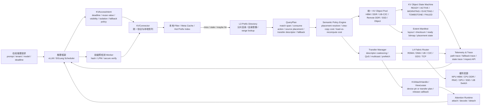
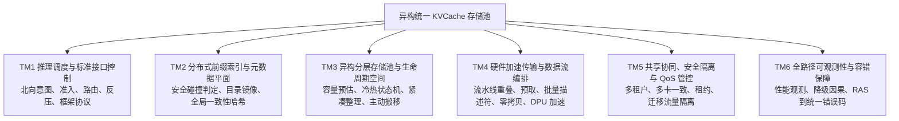
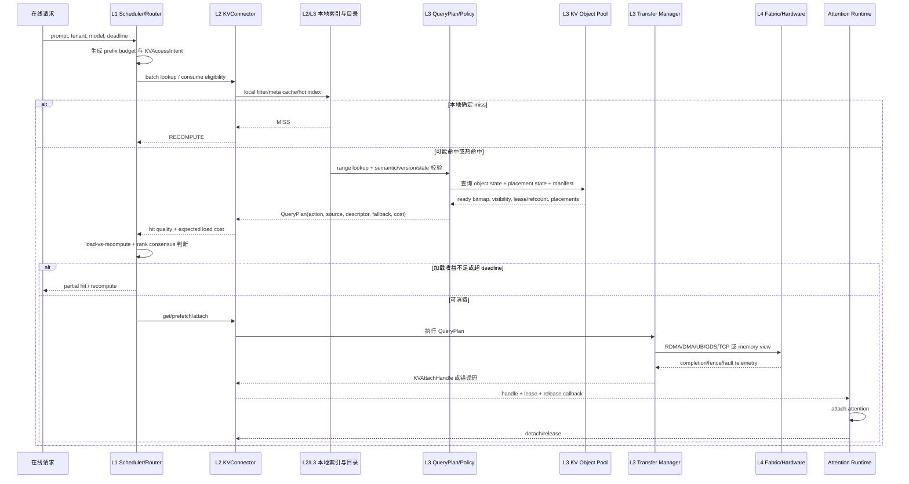
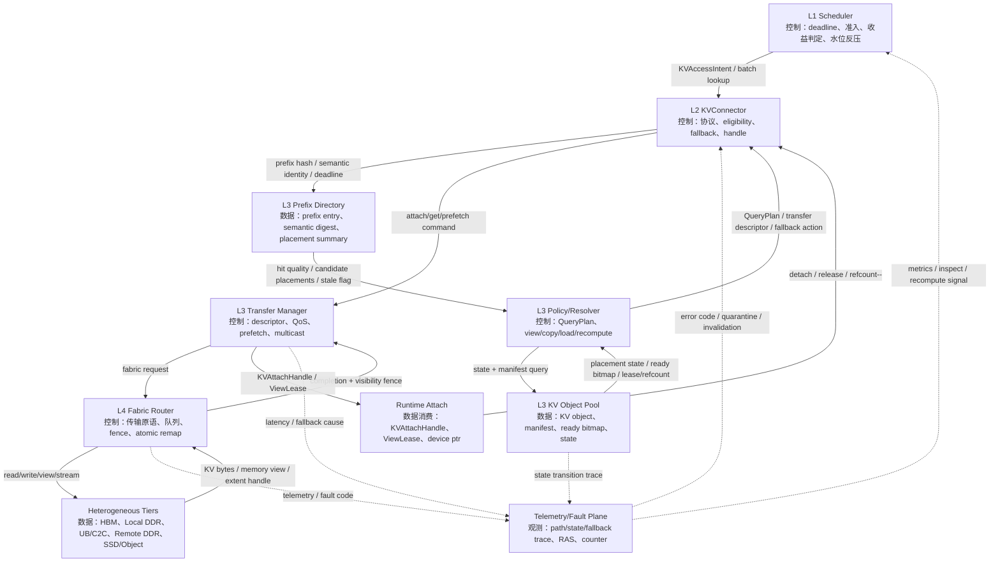
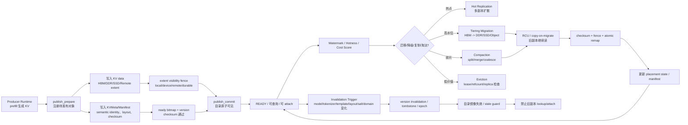

# 异构统一 KVCache 存储池功能与流程设计

本文基于 `srs_v2.3.xlsx` 提取，面向在线推理场景下高效 KVCache 管理、传输、快速匹配查询、升降级与异构存储池统一编排。

## 1. 软件总体理解

异构统一 KVCache 存储池不是单一缓存组件，而是一套跨推理框架、Connector、集群存储池与硬件 Fabric 的全栈闭环系统。其核心目标是：在 TTFT/TPOT 约束下，把一次 prefix hit 转化为真正有收益、可安全消费、可观测、可回退的 usable hit。

系统的第一性原理可以概括为五点：

1. 以推理 SLO 为准绳：所有 lookup、load、attach、rank sync、fallback 都受 deadline、收益判定和水位反压约束。
2. 以语义一致性为边界：KV 命中必须通过 semantic identity、version、layout、tenant/domain、ready bitmap、visibility fence 校验。
3. 以 QueryPlan/Intent 解耦框架和后端：上层表达 KVAccessIntent，下层返回 QueryPlan、KVAttachHandle、fallback/recompute 信号，而不是暴露裸地址。
4. 以对象状态机管理生命周期：publish、lookup、load、attach、migrate、evict、invalidate、quarantine 都必须通过 KV object state 和 replica placement state。
5. 以异构 Fabric 能力驱动数据流：memory view、bulk transfer、stream/object、RDMA、UB/C2C、SSD/GDS、TCP fallback 由能力表、拓扑质量、队列拥塞和 QoS 联合选择。

## 2. 软件功能分层图

```mermaid
flowchart TB
  subgraph L1["L1 推理调度层：SLO/收益/准入/框架协同"]
    L1A["调度与路由控制<br/>前缀预算、load-vs-recompute、水位反压、KV 亲和路由"]
    L1B["前缀索引与命中判定<br/>安全哈希、RadixTree/GPU hash、异步预检测"]
    L1C["卸载/加载与预取优化<br/>Lookahead、投机预取、流式加载、批量 swap"]
    L1D["容量估算与生命周期<br/>KV sizing、框架侧生命周期状态"]
    L1E["驻留策略与局部复用<br/>Active/Warm 分层、partial boundary、view-vs-copy"]
    L1F["多卡协同与观测治理<br/>KVAccessIntent、rank consensus、隔离、语义指标"]
  end

  subgraph L2["L2 KVConnector 层：标准协议/本地快判/安全消费契约"]
    L2A["统一协议与标准接口<br/>KVConnector API、三阶段发布、SemanticIdentity、CostAwareReturn"]
    L2B["路径路由与能力探测<br/>路径质量探测、水位 hint、connector 级自适应路由"]
    L2C["本地元数据缓存与快速判定<br/>local filter、meta cache、batch lookup、consume eligibility"]
    L2D["预取触发与命中评估<br/>request arrival 预取、buffer 预分配"]
    L2E["传输描述与布局协商<br/>layout negotiation、bulk descriptor、partial attach plan"]
    L2F["共享访问与故障控制<br/>ViewLease、AttachHandle、多消费者、fallback、path trace、状态错误码"]
  end

  subgraph L3["L3 传输管理层：统一存储池/目录/策略/一致性"]
    L3A["统一存储池与分层管理<br/>global pool、tiering、allocator、manifest、compaction、migration、eviction"]
    L3B["前缀目录与元数据平面<br/>directory mirror、prefix schema、hot local index、range lookup、stale guard"]
    L3C["语义策略与路径管理<br/>policy engine、placement resolver、query plan、descriptor from manifest"]
    L3D["传输编排与广播<br/>hot replication、1:N multicast、state-aware prefetch、UB topology"]
    L3E["一致性、隔离与 QoS<br/>publish visibility、lease/refcount、ready bitmap、quarantine、GC、RCU migration"]
    L3F["全路径观测与故障追踪<br/>per-path telemetry、fallback trace、state trace、inspect API"]
  end

  subgraph L4["L4 底层传输层：硬件能力/Fabric 原语/可靠性"]
    L4A["RDMA 与零拷贝传输<br/>registered pool、RemoteExtentHandle、NPU Direct RDMA、1:N RDMA"]
    L4B["统一内存与内存语义访问<br/>C2C/UB unified pool、direct view、ViewGuard"]
    L4C["DPU 卸载与分层存储 I/O<br/>NPUDirectSSD/GDS、压缩/解压、DPU offload、PersistentExtentHandle"]
    L4D["Fabric 能力与统一路由<br/>semantic capability table、Fabric Router、addr telemetry、layout constraints"]
    L4E["一致性、安全与可靠性<br/>fence、RAS map、QoS queues、atomic remap、integrity check、secure release"]
  end

  L1 --> L2 --> L3 --> L4
  L4 -->|"capability / telemetry / fault / fence"| L3
  L3 -->|"QueryPlan / state / placement / fallback"| L2
  L2 -->|"eligibility / handle / trace / recompute signal"| L1
```

## 3. 整个软件示意框图

## 4. 软件主要功能模块图

### 4.1 六大顶层业务模块

### 4.2 主要功能模块分解

| 编号 | 主要功能模块 | 关键职责 | 对应层级 |
|---|---|---|---|
| M01 | 推理调度与准入控制 | 前缀判断预算、load-vs-recompute、TTFT deadline、水位强反压、KV 亲和路由 | L1 |
| M02 | 前缀匹配与安全命中 | fast fingerprint、secure hash/token span 校验、RadixTree/GPU hash、异步前缀预检测 | L1/L2/L3 |
| M03 | 统一 KVConnector 协议 | put/get/prefetch/evict/status/stats、publish prepare/commit/abort、SemanticIdentity、BufferContract | L2 |
| M04 | 本地元数据缓存与批量查询 | local filter、in-process cache、hot local index、batch/range lookup、consume eligibility | L2/L3 |
| M05 | QueryPlan 与语义策略引擎 | KVAccessIntent 解析、QueryPlan 生成、placement resolver、view-vs-copy、cost-aware return | L2/L3 |
| M06 | 传输描述与布局协商 | layout negotiation、scatter-gather bulk descriptor、descriptor coalescing、partial attach plan | L2/L3 |
| M07 | 统一 KV 对象池与分层管理 | global pool、HBM/DDR/UB/SSD/object tiering、allocator、quota、冷热升降级 | L3 |
| M08 | KV 对象状态机与副本状态 | object state、placement state、ready bitmap、visibility level、tombstone、stale guard | L3 |
| M09 | 生命周期、发布与一致性 | publish visibility、commit log、checksum、version、lease/refcount、atomic metadata visibility | L2/L3 |
| M10 | 预取、广播与热点复制 | arrival/lookahead/speculative prefetch、hot prefix replication、1:N multicast、state-aware prefetch | L1/L2/L3/L4 |
| M11 | 加载、流式恢复与 attach | bulk load、stream restore、layer pipeline、KVAttachHandle、ViewLease、rank consensus | L1/L2/L3 |
| M12 | 主动迁移、淘汰与紧凑整理 | watermark migration、cost eviction、compaction、RCU migration、atomic remap、defrag pause | L1/L2/L3/L4 |
| M13 | Fabric 路由与硬件能力抽象 | semantic capability table、Fabric Router、HardwareCapabilityAPI、layout constraints、addr telemetry | L3/L4 |
| M14 | 零拷贝与统一内存访问 | registered pool、RemoteExtentHandle、PersistentExtentHandle、UB/C2C direct view、ViewGuard | L4 |
| M15 | 多租户隔离与 QoS | tenant/domain/key namespace、bandwidth/capacity isolation、semantic QoS、state-aware traffic class | L1/L3/L4 |
| M16 | 故障、降级与异常恢复 | fallback contract、state error code、RAS map、replica quarantine、drain/quiesce、secure release | L2/L3/L4 |
| M17 | 全路径可观测与运维接口 | semantic hit metrics、path trace、fallback trace、KV state trace、remote access counters、inspect API | L1/L2/L3/L4 |

## 5. 关键子场景及关键事务列表

| 编号 | 关键子场景/事务 | 触发条件 | 关键处理事务 | 结果/输出 |
|---|---|---|---|---|
| S01 | 请求到达与 KVAccessIntent 生成 | 新推理请求进入 waiting/running 队列 | 解析 tenant/model/deadline/reuse/fallback/isolation；生成 prefix budget 和目标 device ptr 约束 | 标准化访问意图 |
| S02 | KV 亲和路由 | 多实例可调度且可能存在 KV 副本 | 查询 placement summary，优先路由到本地 HBM/DDR/同机架远端 DDR，结合负载与 SLO | 缩短加载路径，提升 local usable hit |
| S03 | 前缀快速判定 | 请求进入 prefix lookup | local filter 确定 miss；hot local index/meta cache 快速命中；必要时 batch/range 查分布式目录 | miss、maybe hit、hit span、stale 标记 |
| S04 | 安全命中与语义兼容过滤 | 存在候选 prefix hit | fast fingerprint 后执行 secure hash/token span、SemanticIdentity、tenant/domain、layout/version 校验 | 安全候选对象列表 |
| S05 | 可消费判定与 QueryPlan 生成 | prefix hit 需要转 usable hit | 检查 object state、placement state、ready bitmap、lease、visibility、deadline、layout；返回 CONSUMABLE/LOAD/COPY/DIRECT_VIEW/RECOMPUTE/MISS | 单次查询决策计划 |
| S06 | 命中收益判定与低效绕行 | 物理 hit 但链路拥塞或加载代价过高 | 估算 lookup + transfer + attach + rank_sync 与 recompute_saved_time；超过预算则返回 logical miss/recompute | 避免 raw hit 造成 TTFT 负收益 |
| S07 | 部分前缀命中复用 | prefix 只有部分 block/page ready | 计算可 attach 连续区间、缺失 suffix、recompute boundary、block table 拼接和 transfer descriptor | prefix attach + suffix recompute |
| S08 | 主动预取与预热 | 请求排队、热点前缀、冷 KV 预测命中 | request arrival/lookahead/speculative prefetch；SSD 到 DDR 预热；state-aware 检查 READY/MIGRATING/EVICTING | 隐藏加载时延 |
| S09 | 新 KV 发布入池 | prefill 生成新的 KV object | publish_prepare 写 data/meta/checksum/ready bitmap/placement；visibility fence 后 commit；失败 abort/回滚 | 对目录原子可见的 KV object |
| S10 | KV 加载与 attach 消费 | QueryPlan 指向 LOAD/COPY/DIRECT_VIEW | 协商 layout，生成 bulk descriptor 或 view lease；执行传输或映射；返回 KVAttachHandle；rank consensus 后 attach | Attention runtime 安全消费 |
| S11 | 流式 KV 恢复 | 多层 KV 加载耗时影响 TTFT | 每 K 层就绪即触发 attention 计算，CUDA stream/event 或 NPU stream 与传输重叠 | 加载与 prefill/decode 流水线重叠 |
| S12 | 多消费者共享与广播 | 多 rank/replica/request 消费同一 KV | refcount、consumer bitmap、shared visibility fence；1:N multicast 或本地多副本复用 | 避免重复远端拉取 |
| S13 | 热点复制与多副本解析 | system prompt、RAG 模板、agent schema 高频复用 | 根据 QPS/p99/queue depth 复制到 DDR/UB/remote shard；resolver 根据拓扑和拥塞选最优源 | 最短端到端读取路径 |
| S14 | 水位触发主动迁移 | HBM/DDR 达到 High/Critical 水位 | High 异步换出 warm/cold；Critical 限制换入、拓宽换出、通知 L1 强反压 | 防止 HBM OOM 和前台挤兑 |
| S15 | 成本感知淘汰/降级 | 容量不足或后台整理 | 按 saved prefill time、reuse probability、transfer/interference cost、rent、tenant priority 决策；检查 lease/refcount/replica count | 安全释放或降级 |
| S16 | 活跃租约下迁移/紧凑整理 | 碎片率高、tiering 或 compaction 正在执行 | active lease 延迟迁移或 copy-on-migrate；RCU 旧地址读；checksum/fence 完成后 atomic remap | 前台 attach 无感、无悬空地址 |
| S17 | 失效、墓碑与 stale hit 防护 | model/tokenizer/template/adapter/layout/salt/domain 变化 | version invalidation、namespace invalidation、tombstone/epoch、directory_generation 校验 | 防止旧副本复活和误命中 |
| S18 | 故障降级与副本隔离 | RAS、checksum、visibility、layout、timeout、lease 冲突 | L4 fault 映射到统一错误码；L2 转 retry/wait/load/copy/recompute/miss；异常 replica quarantine | 快速恢复或重算 |
| S19 | 多租户安全隔离 | 多租户共享池和公共 KV | key 包含 tenant/domain/salt/model/tokenizer/template/layout；pool、metadata、带宽、加密域隔离；view 硬件保护 | 不越权、不误共享 |
| S20 | 全路径观测与排障 | 命中了但变慢、命中了但不能消费 | 记录 semantic hit、path decision trace、fallback causality、state transition、remote access counter、inspect API | 可定位根因和收益损失 |

## 6. 关键节点之间的主要控制流和数据流图

### 6.1 在线请求 prefix hit 到 KV 消费主流程

### 6.2 控制流与数据流一体图

### 6.3 KV 发布、升降级、迁移与失效控制流

## 7. 需求到架构的关键结论

1. 最核心的闭环是 `Intent -> QueryPlan -> Transfer/Attach -> State/Telemetry -> Scheduler decision`，任何模块如果只返回物理地址，都不满足需求内涵。
2. 前缀命中的价值要用 `usable hit` 衡量，而不是 raw hit。系统必须在微秒级判断“是否值得加载”，并允许逻辑 miss 或 partial recompute。
3. 统一存储池的中心对象不是裸 block，而是带 semantic identity、manifest、状态机、副本状态、ready bitmap、lease/refcount 和 visibility 的 KV object。
4. 异构能力必须显式建模。L4 需要把 RDMA、UB/C2C、GDS、TCP、fence、QoS、atomic remap、layout 限制声明给 L3，避免上层把所有路径抽象成普通读写。
5. 升降级、紧凑整理、淘汰必须前台无感，但不是无约束后台任务。它们必须受 lease/refcount、ready bitmap、replica health、QoS 队列和原子重映射保护。
6. 观测面是功能闭环的一部分。没有 path trace、state trace、fallback causality、remote access counter，就无法解释“命中了为什么变慢”或“命中了为什么不能消费”。
