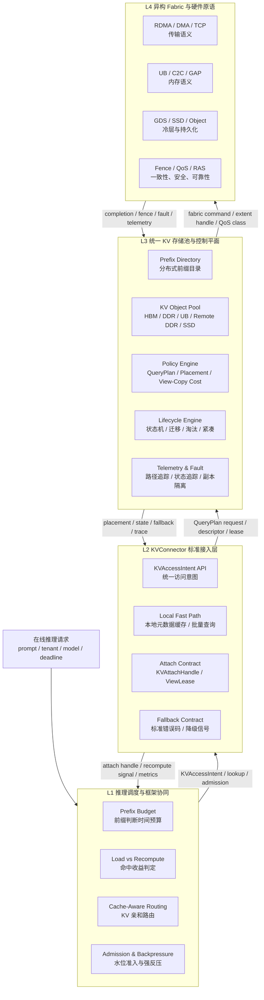
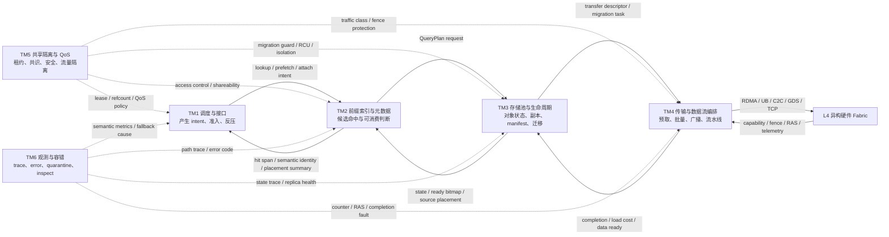
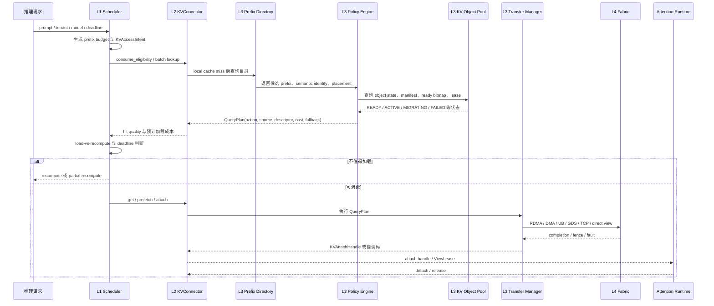
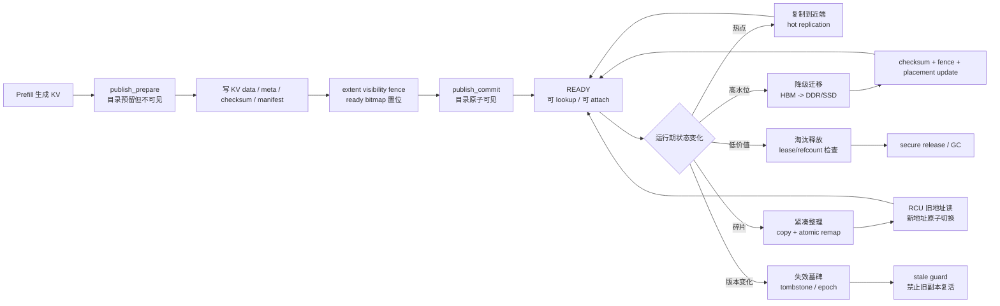

# 统一异构 KVCache 存储池技术主管汇报材料

> 来源：`srs_v2.3.xlsx` 全量 SRS，覆盖 L1 推理调度层、L2 KVConnector 层、L3 传输管理层、L4 底层传输层，共 141 条需求。

## 1. 汇报口径

统一异构 KVCache 存储池不是单点缓存优化，而是一套面向在线推理的全栈 KV 复用基础设施。它要解决的问题是：在多模型、多租户、多卡、多节点、多介质的推理环境中，把一次原始 prefix hit 转化为真正可消费、可收益、可隔离、可回退、可观测的 usable hit。

软件目标可以概括为一句话：

> 以 TTFT/TPOT 为约束，以 KV 对象状态机和分布式前缀目录为核心，以异构 Fabric 能力为执行底座，统一完成 KVCache 的查询、发布、加载、共享、迁移、淘汰、容错和观测。

## 2. SRS 总体盘点

| 维度 | 数量 | 说明 |
|---|---:|---|
| 总需求数 | 141 | 来自 `srs_v2.3.xlsx` L1-L4 全部需求 |
| P0 | 65 | 主要集中在准入控制、一致性、安全隔离、故障恢复、底层可见性与 QoS |
| P1 | 52 | 主要集中在路径优化、能力抽象、存储分层、元数据加速、可观测性 |
| P2 | 19 | 主要集中在预取、流水线、批量传输、性能增强 |
| P3 | 5 | 主要集中在专家策略、跨节点内存语义、DPU/硬件增强 |

| 层级 | 需求数 | 核心定位 |
|---|---:|---|
| L1 推理调度层 | 24 | 决定是否用 KV、用哪个 KV、何时降级，保证推理 SLO 不被缓存命中反噬 |
| L2 KVConnector 层 | 22 | 统一框架接入协议，提供本地快判、布局协商、句柄租约、错误映射 |
| L3 传输管理层 | 64 | 管理全局 KV 对象池、前缀目录、语义策略、迁移淘汰、一致性和观测 |
| L4 底层传输层 | 31 | 暴露 RDMA、统一内存、DPU、Fabric 路由、Fence、QoS、RAS 等硬件原语 |

## 3. 软件目标架构

## 4. 六大功能模块

| 模块 | 功能定位 | 必须交付的功能事项 | 关键价值 |
|---|---|---|---|
| TM1 推理调度与标准接口控制 | 把推理请求转换为标准 KV 访问意图，并决定是否命中、加载、重算或降级 | Prefix 预算控制、load-vs-recompute 准入、KV 亲和路由、水位强反压、KVAccessIntent、专家策略覆盖 | 保证缓存命中不会拖慢 TTFT，屏蔽底层传输复杂度 |
| TM2 分布式前缀索引与元数据平面 | 微秒级判断前缀是否存在、是否安全、是否可消费 | 安全哈希、RadixTree/GPU hash、本地 meta cache、批量/range lookup、目录镜像、stale guard、原子可见性发布 | 把 raw prefix hit 转化为可信的候选 usable hit |
| TM3 异构分层存储池与生命周期空间 | 统一管理 HBM、DDR、UB/C2C、远端 DDR、SSD/Object 等 KV 资源 | KV sizing、全局对象池、冷热分层、状态机、extent manifest、allocator、迁移、淘汰、紧凑整理 | 扩展 KV 容量，同时避免 OOM、碎片和后台搬移影响前台推理 |
| TM4 硬件加速传输与数据流编排 | 让 KV 数据在异构介质和节点间高效流动 | Lookahead/投机预取、批量 descriptor、layout 协商、流式加载、热点复制、1:N 广播、RDMA/UB/GDS/DPU 加速 | 隐藏或压缩 KV 加载成本，提升带宽利用率 |
| TM5 共享协同、安全隔离与 QoS 管控 | 在多租户、多卡、多消费者场景下安全共享 KV | tenant/domain 隔离、rank consensus、ViewLease、AttachHandle、refcount、RCU migration、QoS queue、硬件保护 | 允许共享但不越权，允许迁移但不中断，允许后台任务但不挤兑前台 |
| TM6 全路径可观测性与容错保障 | 解释“命中了为什么变慢/为什么不能消费”，并快速恢复 | semantic hit metrics、path trace、fallback trace、state trace、remote counter、RAS error map、replica quarantine、inspect API | 让性能收益可证明、故障可定位、降级可控 |

## 5. 模块互动关系

主管汇报时可以把模块关系讲成一个闭环：

1. TM1 判断请求是否值得使用 KV，并把请求抽象为 KVAccessIntent。
2. TM2 快速判断是否命中、是否安全、是否可消费。
3. TM3 决定 KV 对象在哪里、处于什么状态、能不能被 attach。
4. TM4 执行预取、加载、广播、零拷贝或 direct view。
5. TM5 横切保障共享、隔离、多卡一致、QoS 和迁移安全。
6. TM6 横切记录路径、状态、收益和故障，并把底层异常转成可降级动作。

## 6. 核心业务覆盖列表

| 业务/技术场景 | 需要覆盖的问题 | 主要责任模块 | 软件输出 |
|---|---|---|---|
| 共享前缀命中快速判定 | prefix lookup 不能把 TTFT 拖慢 | TM1、TM2 | prefix budget、fast miss、secure hit、hit quality |
| 命中收益判定 | 远端命中不一定比重算划算 | TM1、TM2、TM3 | load-vs-recompute、logical miss、partial recompute |
| KV 亲和调度 | 先调度再搬 KV 会浪费带宽 | TM1、TM2、TM3 | placement summary、cache-aware routing |
| 多层异构存储调度 | HBM/DDR/SSD/远端节点能力差异大 | TM1、TM3、TM4 | tier-aware scheduling、QueryPlan |
| 前缀匹配关键路径加速 | Python/RPC/远端查询不能进调度热路径 | TM2 | GPU/C++ hash、RadixTree 加速、异步预检测 |
| 部分前缀命中复用 | partial hit 不能简单全部放弃 | TM1、TM2、TM3 | recompute boundary、partial attach plan |
| 主动预取和流式加载 | KV 加载时延要隐藏到排队或计算中 | TM1、TM4 | lookahead prefetch、speculative prefetch、layer pipeline |
| 新 KV 发布入池 | 不能暴露半写入、半可见 KV | TM2、TM3、TM5 | publish prepare/commit/abort、ready bitmap、visibility fence |
| 热点 KV 复制 | 热 prefix 应靠近消费端 | TM2、TM3、TM4 | hot replication、multi-replica resolver |
| 水位反压和主动迁移 | HBM 高水位不能引发 OOM 或推理停顿 | TM1、TM3、TM5 | watermark admission、migration engine、QoS isolation |
| 淘汰与紧凑整理 | 释放空间不能破坏活跃 attach | TM3、TM5、TM6 | refcount guard、RCU migration、atomic remap、state trace |
| 多卡一致消费 | TP/PP/P-D 场景各 rank 不能看到不同 KV | TM1、TM5 | rank consensus、min-safe prefix、ready bitmap consensus |
| 多租户安全共享 | 公共 KV 可共享，私有 KV 不得误命中 | TM2、TM5 | semantic identity、tenant/domain isolation、view protection |
| 近端 memory view | direct view 可能省拷贝，也可能拖慢 TPOT | TM3、TM4、TM5、TM6 | view-vs-copy cost、ViewLease、remote access counter |
| 跨节点零拷贝传输 | 大块 KV 搬运要减少 CPU 和中间拷贝 | TM4 | RDMA registered pool、RemoteExtentHandle、bulk descriptor |
| DPU/硬件卸载 | Host CPU 不应承担高频传输控制路径 | TM4、TM6 | DPU offload、completion event、hardware telemetry |
| 底层 Fabric 路由 | RDMA、UB、C2C、GDS、TCP 不能用同一种抽象 | TM3、TM4 | semantic capability table、Fabric Router |
| QoS 流量隔离 | 后台迁移/写回不能挤兑 TTFT/TPOT | TM5、TM4 | traffic class、dedicated queue、rate limit |
| 故障快速降级 | RDMA/SSD/页错误不能拖挂推理 | TM2、TM3、TM6 | unified error code、fallback contract、replica quarantine |
| 命中收益可观测 | 不能只看 prefix hit rate | TM6、TM1 | raw/usable/local/view/bulk/stream hit metrics、path breakdown |

## 7. 关键主流程

### 7.1 请求命中到安全消费

### 7.2 KV 发布、迁移、失效闭环

## 8. 模块接口边界

| 接口边界 | 上游输入 | 下游输出 | 边界原则 |
|---|---|---|---|
| L1 -> L2 | KVAccessIntent、prefix、deadline、isolation、fallback policy | lookup/get/prefetch/evict/attach 调用 | L1 不暴露底层路径，只表达业务语义和 SLO |
| L2 -> L3 | SemanticIdentity、batch lookup、descriptor request、publish request、attach request | QueryPlan、placement、state、lease、fallback | L2 负责协议和本地快判，L3 负责全局事实和策略 |
| L3 -> L4 | transfer descriptor、extent handle、QoS class、fence/atomic/remap command | completion、telemetry、fault、capability | L4 暴露能力与原语，不承载上层业务策略 |
| 横切安全 | tenant、domain、salt、model、tokenizer、layout、visibility | access decision、view protection、secure release | 任何可共享路径必须先证明可隔离 |
| 横切观测 | path decision、state transition、remote counter、RAS fault | metrics、trace、fallback cause、inspect result | 观测是闭环功能，不是事后日志 |

## 9. 建设优先级建议

| 阶段 | 建设目标 | 优先交付内容 | 原因 |
|---|---|---|---|
| Phase 1 基线闭环 | 先把 usable hit 跑通，并能安全降级 | KVAccessIntent、prefix budget、consume eligibility、QueryPlan、KV object state、publish commit、fallback contract、基础 metrics | 这是所有收益的最小闭环，没有它 raw hit 无法变成稳定收益 |
| Phase 2 性能主链路 | 压缩 lookup、transfer、attach 的关键路径 | 本地 meta cache、batch/range lookup、load-vs-recompute、bulk descriptor、layout negotiation、stream restore、RDMA registered pool | 直接影响 TTFT/TPOT 和带宽效率 |
| Phase 3 池化与自治 | 让 HBM/DDR/SSD/远端资源可持续运转 | 分层存储池、watermark migration、cost eviction、hot replication、compaction、RCU migration、QoS traffic class | 解决容量、碎片、热点和后台任务干扰 |
| Phase 4 规模化可信 | 支撑多租户、多卡、多副本和故障恢复 | tenant isolation、rank consensus、ViewLease/refcount、semantic QoS、RAS map、replica quarantine、state/path trace | 面向生产多租户和大规模集群稳定性 |
| Phase 5 硬件增强 | 在特定平台释放硬件能力 | UB/C2C direct view、DPU offload、GDS/SSD direct、atomic remap、hardware addr telemetry | 属于收益放大器，应建立在前四阶段语义闭环之上 |

## 10. PPT 建议页结构

| 页码 | 标题 | 重点内容 |
|---:|---|---|
| 1 | 为什么要做统一异构 KVCache 存储池 | KV 命中不等于收益；目标是 usable hit |
| 2 | SRS 全量需求盘点 | 141 条需求、P0/P1 分布、L1-L4 职责 |
| 3 | 软件目标架构 | L1-L4 软件框图 |
| 4 | 六大功能模块 | TM1-TM6 模块说明 |
| 5 | 模块如何互动形成闭环 | Intent -> QueryPlan -> Transfer/Attach -> State/Telemetry |
| 6 | 核心业务覆盖列表 | 20 个关键业务/技术场景 |
| 7 | 关键流程一：请求命中到安全消费 | sequence 图 |
| 8 | 关键流程二：发布、迁移、失效闭环 | flow 图 |
| 9 | 接口边界与职责划分 | L1/L2/L3/L4 边界表 |
| 10 | 实施优先级与里程碑 | Phase 1-5 建设路径 |

## 11. 汇报总结

这批 SRS 可以收敛为一个清晰的软件目标：建设一个跨框架、跨节点、跨介质、跨硬件语义的统一 KVCache 存储池。它的主链路是 `KVAccessIntent -> Prefix/Metadata -> QueryPlan -> Transfer/Attach -> State/Telemetry/Fallback`。

六大模块中，TM1-TM4 构成主业务链路，TM5-TM6 是生产级横切能力。前者决定能不能命中并消费，后者决定能不能安全共享、稳定迁移、故障可恢复、收益可证明。主管层面可重点关注三件事：先打通 usable hit 闭环，再压缩关键路径时延，最后通过池化自治和硬件增强扩大收益边界。
