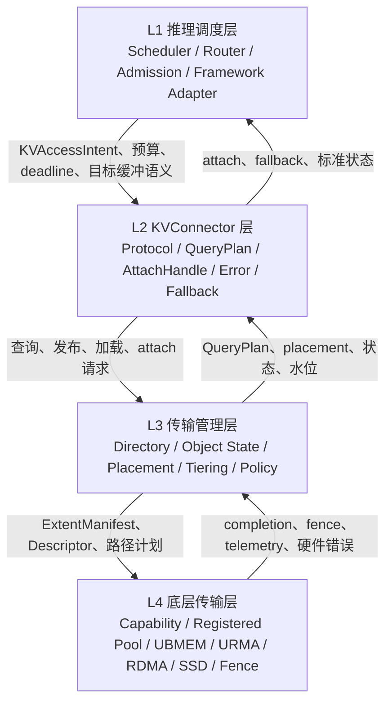
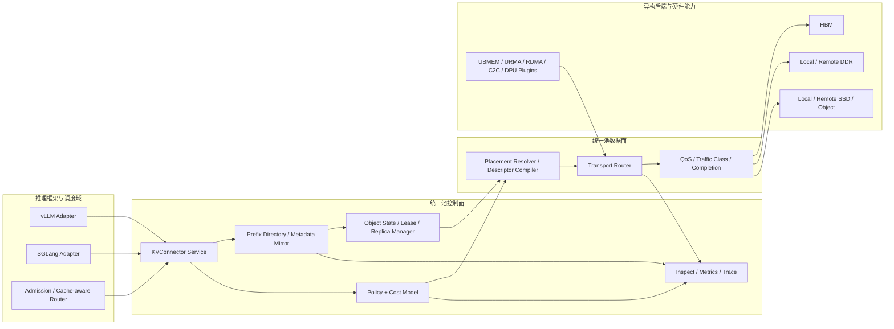
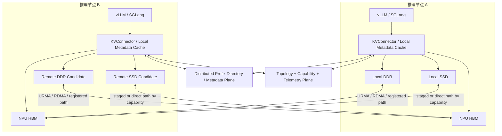
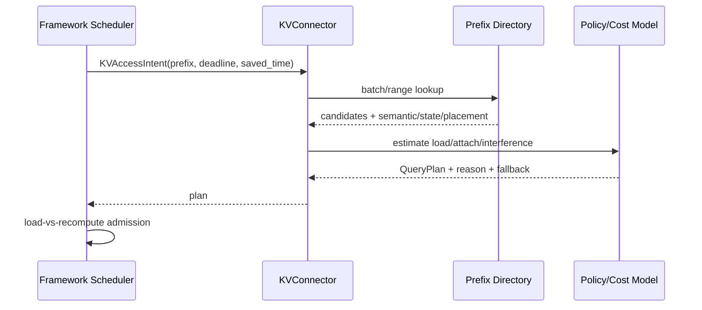
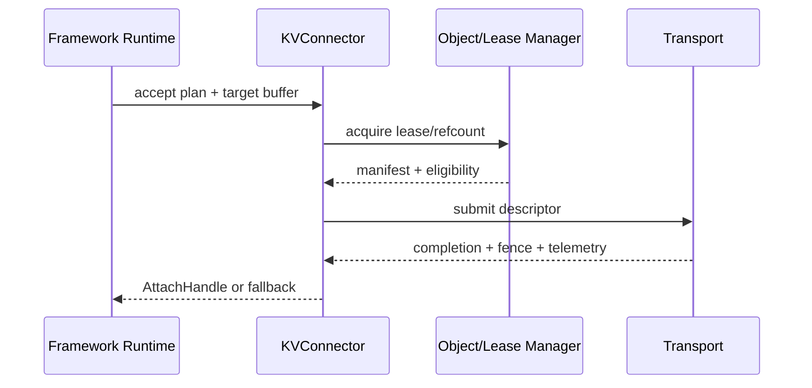
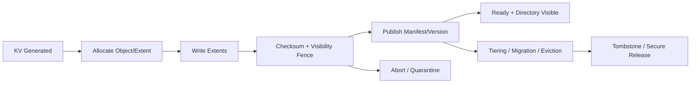

# 统一异构 KVCache 存储池总体架构与 SRS 评审导读

> 文档版本：定版  
> 评审基线：《KVCache SRS需求列表 V2.1.xlsx》  
> 文档用途：帮助第三方评审专家理解项目愿景、需求设置初衷、总体架构、阶段路径、验收逻辑与评审重点。

## 1. 文档定位与使用方法

本文档是《KVCache SRS需求列表 V2.1.xlsx》（以下简称《SRS V2.1》）的总体架构导读，不替代 SRS 本身，也不替代后续详细设计、接口 IDL、测试方案、部署手册或硬件选型规格。

需求数量、阶段、指标和工程基线以 《SRS V2.1》 为事实基线；愿景性材料仅用于解释背景，不覆盖 SRS 的正式边界。

评审专家可按以下顺序使用本文档：

1. 通过第 2—4 章理解项目为什么建设、准备解决哪些问题、交付边界在哪里。
2. 通过第 5—8 章理解软件架构、软硬件关系、关键技术方案及端到端闭环。
3. 通过第 9—11 章理解阶段设置、验收指标与 140 条需求的组织逻辑。
4. 通过第 12—13 章审查与同类方案的差异、当前 SRS 仍需澄清的内容及其重要性。
5. 需求是否正式成立、优先级为何、如何验收，最终均以 《SRS V2.1》 对应条目为准。

本文档中的能力状态分为四类：

| 状态 | 含义 |
|---|---|
| SRS 明确要求 | 已在 《SRS V2.1》 中形成需求、阶段或验收约束 |
| 由 SRS 推导 | 为解释需求间关系而形成的总体架构结论，仍需详细设计定版 |
| 依赖平台能力 | 是否启用取决于硬件 capability、性能摸底和平台约束 |
| 扩展建议 | 有工程价值，但不应被理解为本期无条件交付承诺 |

## 2. 项目背景：为什么需要统一异构 KVCache 存储池

### 2.1 KVCache 已成为在线推理的关键系统资源

大模型推理通常包括 Prefill 和 Decode 两个阶段。Prefill 根据输入 token 计算各层 Key/Value 状态；Decode 在逐 token 生成过程中反复读取历史 KVCache。随着 RAG、长上下文、多轮对话和 Agent 工作流普及，KVCache 的规模、驻留位置和复用效率会直接影响：

- 首 token 时延（Time to First Token，TTFT）；
- 每输出 token 时延（Time per Output Token，TPOT）；
- 高带宽内存（High Bandwidth Memory，HBM）的有效容量；
- 并发度、抢占和内存溢出风险；
- NPU 用于有效计算而非等待数据的时间比例；
- 集群存储、网络和运维成本。

KVCache 因而不再只是推理框架内部的临时缓冲区，而是具有对象身份、版本、布局、位置、生命周期、共享范围和服务等级要求的系统级资源。

### 2.2 当前局部管理方式形成资源孤岛

现有推理框架通常优先管理本实例或本节点范围内的 KVCache。HBM、本地 DDR、本地 SSD、远端 DDR 和远端 SSD/object 具有不同的容量、带宽、时延、一致性和错误语义；不同框架又采用不同的 block/page、哈希索引或 radix 索引结构。如果缺少统一对象和统一决策层，会形成以下问题：

- 同一公共前缀在不同请求、实例或节点上重复 Prefill；
- HBM 中暂时不活跃的 KVCache 无法安全迁移并在需要时恢复；
- 外部介质即使命中，也可能因加载过慢、布局不兼容或对象未 ready 而无法消费；
- 后台迁移、预取和回源流量与前台 Decode 争用数据通路；
- 命中率、传输带宽和业务时延分属不同系统，无法解释真实收益。

### 2.3 本项目的基本判断

项目认为，解决上述问题不能只增加一个外部 KV Store，也不能只增加一条高速传输路径。必须把以下四类语义连接起来：

1. **推理消费语义**：框架需要哪一段 KVCache、何时需要、目标缓冲区在哪里、是否允许部分命中和回退。
2. **KVCache 对象语义**：对象属于哪个模型、租户和语义版本，当前是否 ready，能否安全 attach。
3. **位置与硬件路径语义**：对象位于哪个 tier、节点、设备和 extent，通过何种路径访问最合适。
4. **业务收益语义**：加载是否优于重算，是否改善 TTFT，是否干扰 TPOT，是否扩大有效容量。

因此，本项目建设对象是一个面向 KVCache 的统一异构存储与数据访问软件基础设施。

## 3. 典型行业场景与需求设置初衷

以下场景用于解释需求来源，不代表项目已经完成性能验证，也不预设具体收益数值。正式验收仍需采用 SRS 规定并在项目实施前冻结的模型、数据集、并发、拓扑和 baseline。

| 典型场景 | 业务现象 | 技术根因 | 本项目的响应 | 设计边界 |
|---|---|---|---|---|
| RAG 公共知识前缀 | 多个请求携带相同 system prompt、知识库片段或工具说明，重复 Prefill 增加 TTFT 和算力消耗 | 前缀只在局部框架或实例中复用，跨节点缺少可消费目录 | 建立语义身份、前缀目录、QueryPlan 和 load-vs-recompute 准入 | 仅在命中可消费且加载收益为正时复用 |
| 多轮 Agent 会话 | 会话历史持续增长，KVCache 占用 HBM 并产生冷热分化 | HBM 容量有限，框架局部 swap 难以形成集群级复用 | active/warm/cold 分类、分层驻留、预取和按需回迁 | 活动 Decode 工作集仍受 HBM 容量与带宽限制 |
| Prefill/Decode 解耦 | Prefill 产生的 KVCache 需要被其他 Decode 节点消费 | KV 位置、目标节点拓扑、网络和布局语义未统一 | topology-aware placement、remote extent、descriptor 和路径 telemetry | 跨节点加载必须通过成本和 deadline 准入 |
| HBM 高水位 | batch 被压缩、请求被抢占或出现 OOM 风险 | 缺少统一水位、生命周期、淘汰与迁移互锁 | watermark admission、cost eviction、state-aware migration | 扩展的是可管理容量，不承诺消除所有 OOM |
| SSD/远端回源混流 | 后台回源或迁移导致 Decode TPOT 尾部抖动 | 前后台流量共享 copy engine、网络或存储队列 | traffic class、QoS、migration interlock、可观测与回退 | 达不到干扰门槛时应限流、暂停或重算 |
| 多租户共享 | 相似前缀可能跨业务出现，但不能越权复用 | 缺少 tenant/security domain、租约、完整性和安全释放 | 语义隔离、lease/refcount、view protection、secure release | 未满足安全域规则的命中不得消费 |

这些场景共同导出一个核心原则：**Raw Hit 只是发现候选对象，只有通过正确性、可消费性和收益判断的命中才是 Usable Hit。**

## 4. 项目愿景、本期目标与非目标

### 4.1 项目愿景

围绕在线推理中的 KVCache 生成、消费和维护，利用底层 UBMEM 的内存语义与 URMA 的传输语义，融合 HBM、本地 DDR、本地 SSD、远端 DDR、远端 SSD/object 等不同位置和介质，建设以 KVCache 为中心、逻辑统一、软硬协同的异构存储池。

该愿景关注的不是把所有介质伪装成性能相同的内存，而是在理解介质差异和硬件 capability 的前提下，统一表达对象、位置、访问动作、成本和状态，使系统能够选择合适的数据访问方式，并以 TTFT、TPOT、usable hit、HBM 有效容量和稳定性指标验证业务价值。

### 4.2 本期可验收目标

在明确支持矩阵、工作负载和硬件平台范围内，本期软件应形成以下闭环：

1. 统一纳管 HBM、DDR、SSD、远端 DDR 和远端 SSD/object 中的 KVCache 对象及位置。
2. 面向 vLLM/SGLang 提供统一访问意图、QueryPlan、AttachHandle、错误码和 fallback 契约。
3. 建立前缀目录、语义身份、对象状态、placement、extent manifest、版本、ready、lease/refcount 和副本健康模型。
4. 基于 capability matrix、拓扑与动态 telemetry 执行 load-vs-recompute、view-vs-copy、位置选择、迁移和淘汰决策。
5. 打通 Prefix Hit、Load/Attach、Publish/Lifecycle 三条端到端主链路。
6. 通过 metrics、trace、inspect、故障注入和 A/B baseline 证明正确性、收益、干扰和降级行为。
7. 按 P0—P3 分阶段把确定性较高的能力引入主路径，把高风险硬件能力先纳入 capability 与旁路验证。

### 4.3 本项目不承诺的内容

- 不替代操作系统通用虚拟内存、推理框架调度器、硬件驱动或存储系统本身。
- 不假设所有介质具有相同访问时延，也不承诺所有路径均可零拷贝或 direct view。
- 不承诺对所有模型、上下文长度、并发、拓扑和负载均产生正收益。
- 不以命中率上升单独作为成功标准；负收益命中应被放弃并回退。
- 高级能力能否进入默认主路径，以平台 capability、正确性、稳定性和收益门槛为准。
- 本导读不提前给出尚未通过 baseline 和实测获得的性能提升比例。

## 5. 总体架构：把四层契约和六个技术模块组织成一个软件实体

### 5.1 四层总体架构



SRS 中“L3 传输管理层”的职责不只包含物理搬运，还包括元数据、对象状态、位置、生命周期和策略编排；实际数据路径执行主要由 L4 及 TM4 承担。评审时应避免仅按层名理解职责。

### 5.2 组件视图



组件视图表达的是逻辑职责，不预先限定进程数量。Directory、Policy、Object Manager 和 Transport Router 可根据性能、故障域和部署规模拆分，但它们必须通过稳定对象与 trace ID 形成统一软件实体。

### 5.3 部署与拓扑视图



部署评审应重点关注：元数据查询是否进入 TTFT 串行路径、目录如何分片与容错、目标 HBM 的分配权属于谁、跨节点路径如何认证、故障域如何隔离，以及某条远端路径不可用时如何回退。

### 5.4 六大横向技术模块

| 模块 | 核心职责 | 对端到端闭环的贡献 |
|---|---|---|
| TM1 推理调度与标准接口控制 | 接收框架意图、预算、deadline、水位和优先级，执行准入与路由 | 决定是否查、是否载入、何时回退 |
| TM2 分布式前缀索引与元数据平面 | 前缀查找、语义身份、目录缓存/镜像、消费资格判断 | 把物理命中转为候选可消费对象 |
| TM3 异构分层存储池与生命周期空间 | 对象状态、placement、extent、tiering、迁移、淘汰和碎片治理 | 管理 KVCache 从产生到释放的完整生命周期 |
| TM4 硬件加速传输与数据流编排 | capability、descriptor、registered pool、路径执行和 telemetry | 将逻辑计划编译为硬件可执行的数据路径 |
| TM5 共享协同、安全隔离与 QoS 管控 | lease/refcount、ready、rank consensus、租户隔离和流量等级 | 保证共享、并发迁移和多租户场景下的正确性 |
| TM6 全路径全栈可观测性与容错保障 | metrics、path/fallback/state trace、RAS 映射和 inspect | 证明收益，解释退化，支撑故障闭环 |

## 6. 核心设计思想与关键技术方案

### 6.1 以 Usable Hit 而不是 Raw Hit 作为收益核心

Raw Hit 表示 prefix 或 metadata 找到候选对象；Usable Hit 至少要求语义身份、版本、布局、ready 状态、租约、路径可用性、deadline 和成本满足消费条件。若命中对象加载成本高于重算，系统应记录为 abandoned hit 并执行 fallback，而不是为了提高 hit rate 强行加载。

### 6.2 QueryPlan 驱动 Load-vs-Recompute

统一池不只返回地址或 hit/miss，而应返回可执行 QueryPlan，包括 consume action、候选位置、预计 lookup/load/attach/interference 成本、置信信息、路径能力和 fallback。L1 调度结合当前 batch、deadline、重算收益和 HBM 水位完成最终准入。

可抽象为：

```text
当 saved_recompute_time
  > lookup_time + load_time + attach_time + sync_time + interference_penalty
且正确性、deadline、租约与路径条件满足时，才选择复用；
否则选择本地 cache、备用副本、等待、部分重算或完全重算。
```

公式用于表达决策变量，具体参数和阈值必须来自冻结的 baseline 与动态 telemetry。

### 6.3 UBMEM 内存语义与 URMA 传输语义的结合

本项目的差异化不在于简单增加某一种传输库，而在于把底层内存语义、传输语义与上层推理消费语义结合进同一 QueryPlan。

| 能力 | 本项目当前预期用途 | 当前边界 |
|---|---|---|
| UBMEM 内存语义 | 优先用于 KVCache 前缀匹配表、系统元数据的访问；必要时评估承担部分 KVCache 访问或传输 | 具体范围须等待底层传输能力性能摸底表；不得预设所有 KV 数据均适合 memory-semantic access |
| URMA 传输语义 | KVCache 在 SSD、DDR、HBM、本地设备与远端设备之间的传输，承载提交、完成、批量搬运和错误反馈 | 实际路径、带宽、fence、QoS 与故障语义以平台 capability 为准 |
| RDMA/C2C/SSD-object 等能力 | 作为可插拔或可组合的数据路径能力，由 capability router 选择 | 不与 Mooncake/NIXL 等软件名称混作物理传输类型；后者可作为后端或适配实现 |

### 6.4 拓扑感知的 KVCache 位置存储与查询

KVCache placement 不是一个简单 tier 标签，而应包含 node、device、extent、replica、健康状态、布局和到目标执行实例的路径代价。Placement Resolver 结合拓扑、介质能力、队列状态和目标 HBM 水位回答：哪个副本最合适、是否跨节点加载、采用 copy 还是 view、是否应重算。

### 6.5 从碎片化块到硬件可执行数据流

vLLM/SGLang 的 KVCache 以 block/page/radix span 组织，物理上可能离散。ExtentManifest 描述逻辑对象到物理 extent 的映射，Descriptor Compiler 将离散片段编译为满足对齐、SG 数量、注册区域、队列和 fence 约束的批量执行描述，减少小 I/O 和逐块提交开销。

### 6.6 生命周期、并发正确性与可见性

KVObjectStateMachine、version、ready bitmap、lease/refcount、visibility fence、commit log、tombstone 和 quarantine 共同保证：未写完、迁移中、损坏、过期或已释放对象不能被框架误消费。任何 direct view 或 attach 都必须有明确的撤销、失效和回退语义。

### 6.7 控制面快判、数据面执行和观测闭环解耦

控制面负责快速查找与准入，数据面按 descriptor 执行实际搬运，观测面用 request_id、query_plan_id、object_id 和 path_id 串联估计与实际结果。三者解耦可以减少 TTFT 串行阻塞，同时让 cost model 通过实测持续校准。

## 7. 三条主流程与异常回退闭环

### 7.1 Prefix Hit 快速判定



### 7.2 KV Load/Attach 消费



### 7.3 KV Publish/Lifecycle



### 7.4 异常与降级

lookup timeout、stale metadata、lease conflict、transfer timeout、RAS error、SSD/object error、路径拥塞或成本估计失效均不得导致错误 KV 被消费。系统应按标准错误码选择备用副本、本地 cache、部分重算、完全重算或关闭对应路径，并记录 fallback_reason。

## 8. 架构决策如何回答 SRS 评审问题

| 评审问题 | 架构回答 | 关键模块/对象 | 期望验收证据 |
|---|---|---|---|
| 命中是否语义相同 | model/tokenizer/template/layout/version/security domain 形成语义身份 | TM2、KVAccessIntent | 冲突构造与 stale-hit guard |
| 命中是否可安全消费 | ready、version、lease、refcount、checksum 和 fence 联合判定 | TM3/TM5、AttachHandle | 半写入、迁移并发、损坏副本注入 |
| 命中是否值得消费 | load-vs-recompute 加入 lookup/load/attach/interference 成本 | TM1/TM3/TM4、QueryPlan | TTFT Benefit、abandoned hit |
| 数据应从哪里取 | topology-aware placement 与 multi-replica resolver | TM3/TM4、ExtentManifest | 不同拓扑路径对比和故障切换 |
| 如何送达框架 | Pull-to-Provided Device Pointer 或受控 AttachHandle | TM1/TM2/TM4 | conformance test 和 end-to-end load |
| 如何避免干扰 Decode | traffic class、QoS、migration interlock、drain/quiesce | TM4/TM5 | TPOT Interference 混流压测 |
| 如何扩展有效容量 | tiering、watermark、cost eviction、prefetch、回源 | TM1/TM3/TM4 | 长上下文容量压力曲线 |
| 如何证明收益 | estimated/actual cost、metrics 与全路径 trace | TM6 | A/B baseline、指标对账和原因覆盖率 |
| 硬件能力不满足怎么办 | capability flag、feature flag、旁路验证和 fallback | L3/L4 | 禁用、降级和故障注入 |

## 9. 阶段目标：硬件能力前置验证，高风险能力分阶段进入主路径

30%/50%/80%/100% 表示累计交付成熟度和功能集目标，不等同于已完成需求条数占比。

| 阶段 | 累计目标 | 主路径状态 | 核心退出条件 | 主要风险关闭点 |
|---|---:|---|---|---|
| P0 | 30% | shadow/sidecar/adapter 旁路 | 接收真实框架请求；卸载、查询、元数据响应、基础回源或重算闭环可运行；对象/extent/状态最小字段冻结；UB/UBMEM capability、registered pool、completion/fence 和 metrics 有第一版证据 | 提前暴露框架格式、元数据模型与硬件注册/可见性语义不匹配 |
| P1 | 50% | 受控 workload 可切小流量主流程 | vLLM/SGLang 完成卸载—查询—加载—重用真实闭环；QueryPlan、placement、manifest/descriptor、远端 registered path 和 per-path telemetry 可运行；保留关闭和 recompute fallback | 证明软件骨架、元数据和至少一条真实数据路径闭环 |
| P2 | 80% | selected workload 有限灰度，可回滚 | 长上下文、多租户、容量压力、链路波动下完成 tiering、迁移、淘汰、QoS、lease/refcount、ready 和生产观测；可运行长稳与故障注入 | 关闭容量治理、并发迁移和 TPOT 干扰风险 |
| P3 | 100% | Release Candidate，仅达标能力默认启用 | 140 条需求均有主路径/旁路/平台约束归属；完成回归、性能报告、运维与交付文档；高级能力完成交付或旁路定版 | 避免 P3 承担首次软硬件对接，完成收益和交付收口 |

高级能力包括 UB/C2C direct view、DPU offload、硬件多播、在线压缩、硬件页迁移、atomic remap 以及 direct storage 等。它们应尽早进入 capability 验证，但是否进入默认主路径必须由平台能力、正确性、TPOT 干扰和收益门槛决定。

## 10. 端到端观测、验收指标与工程基线

### 10.1 六类十项指标

| 类别 | 指标 | 评审时应确认的定义与证据 |
|---|---|---|
| 端到端性能 | TTFT Benefit | 同一模型、tokenizer、prompt、并发、调度参数和拓扑下，相对 recompute 或原生 prefix cache 的 P50/P95/P99 收益；同步给出 raw/usable/abandoned hit |
| 端到端性能 | TPOT Interference | 后台迁移、回源、预取、压缩或远端访问对前台 Decode 的 P50/P95/P99 与 tail spike 影响 |
| 命中质量 | Raw Hit Rate / Usable Hit Rate | Raw Hit 是物理候选命中；Usable Hit 是通过版本、layout、租约、路径成本和 deadline 判断的可消费命中 |
| 命中质量 | Abandoned Hit Rate | 命中后因 deadline、拥塞、迁移、版本或 attach 失败而放弃的比例；原因须关联 QueryPlan、path 和 object |
| 容量与分层 | HBM Effective Capacity | 在稳定性约束下，通过其他 tier 扩展的可服务 KVCache 容量；同时观测 OOM/preemption、水位、迁移和淘汰 |
| 容量与分层 | Placement Change Frequency | tier 变化的频率、触发原因、估计成本、实际成本和状态转换 |
| 数据面 | Per-path Bandwidth / Latency | 各路径在不同 block size、并发和 queue depth 下的带宽与 P50/P95/P99 时延，形成 capability matrix |
| 数据面 | Load-to-HBM Latency | 从 QueryPlan 选定对象到框架可 attach/consume 的端到端时延，按 tier、命中长度、block、layout 和路径分类 |
| 正确性 | Stale Hit Guard / Integrity Check | 版本、布局、ready、复制延迟和 checksum 异常必须被阻断、降级并定位 |
| 可运维性 | Fallback Success Rate / Reason Coverage | 约定异常下能够转为重算、本地 cache 或禁用路径；SRS 当前要求失败回退成功率目标为 100% |

指标间需要明确集合关系。建议验收统计至少满足：每次 lookup 都有最终 decision；Raw Hit 可进一步归为 Usable、Stale 或 Abandoned 等状态；Fallback 是执行结果维度，不能在未定义的情况下与命中状态简单相加。

### 10.2 八条性能与工程基线

| 基线 | 最小内容 | 冻结/更新节点 | 作用 |
|---|---|---|---|
| ShareGPT/多轮对话前缀复用分布 | 数据集、tokenizer、模型、前缀长度、重复率、并发 | 方案设计给样本，开发前冻结 | 避免只用合成热点证明命中收益 |
| 128K/256K/1M 长上下文压力模型 | context、batch、并发、租户、decode 长度 | 方案设计定义，开发前冻结 | 验证容量、水位、迁移和回源 |
| vLLM/SGLang 原生 baseline | 版本、模型、硬件、调度、prefix/swap 配置 | 方案设计阶段采样 | 形成同口径收益对照 |
| 异构介质能力矩阵 | 各 tier 的读写 BW、P50/P95/P99、并发曲线 | P0/方案早期 | 驱动 tiering、placement 和 cost model |
| 硬件路径能力矩阵 | block、queue、注册、建链、fence、completion、失败语义 | P0 建立，P1/P2 更新 | 决定主路径、旁路和禁用能力 |
| 元数据字段基线 | identity、object、extent、layout、version、ready、lease/refcount | 方案阶段第一版，P1 前兼容规则 | 避免跨层各自解释同一对象 |
| 观测字段基线 | request、plan、object、path、placement、decision/fallback reason | P0 最小集，P2 生产集 | 支撑指标对账和问题定位 |
| 正确性与故障基线 | 故障注入、错误码、fallback、数据校验 | P1 建立，P2/P3 扩展 | 防止错误或过期 KV 被消费 |

## 11. SRS 需求体系与评审导航

### 11.1 数量、层级与阶段覆盖

《SRS V2.1》 的“阶段需求覆盖清单”共列出 140 条需求：

| 维度 | 分布 |
|---|---|
| 层级 | L1 21；L2 22；L3 66；L4 31 |
| 阶段覆盖 | P0 63；P0 子集 + P1 完整 4；P1 45；P2 17；P3 11 |
| 横向模块 | TM1—TM6，分别覆盖调度接口、目录元数据、存储生命周期、硬件传输、共享隔离 QoS、观测容错 |

数量分布只能证明需求已被分类，不能单独证明需求完备。评审还应检查需求描述、上下游依赖、阶段归属、验收方法和异常路径是否一致。

### 11.2 按主流程审查

| 主流程 | 重点需求族 | 评审重点 |
|---|---|---|
| Prefix Hit | PrefixBudget、IntentAPI、Batch/Range Lookup、PrefixDirectorySchema、SemanticIdentity、ConsumeEligibility、QueryPlanFastPath | lookup 是否受 deadline 约束；raw hit 如何转为 usable hit；目录陈旧如何处理 |
| Load/Attach | CostAwareReturn、BufferContract、AttachHandle、PlacementResolver、DescriptorFromManifest、RegisteredPool、RemoteExtentHandle、Fence | 目标 HBM 权属、版本与租约、路径成本、完成可见性和 fallback 是否闭环 |
| Publish/Lifecycle | PublishCommit、KVObjectStateMachine、ExtentManifest、ReadyBitmap、CommitLog、Tombstone、RefCount、GC | 写入、发布、可见、迁移、淘汰和释放的原子边界是否明确 |
| 后台治理 | Watermark、Tiering、CostEviction、Compaction、MigrationInterlock、TrafficClass、Drain/Quiesce | 后台流量是否可让路，活动对象是否被保护，TPOT 干扰是否可测 |
| 故障与观测 | FallbackContract、PathTrace、KVStateTrace、RASErrorMap、ReplicaIntegrity、InspectAPI | 是否能阻断误消费，所有降级是否有标准原因和端到端关联 ID |

### 11.3 对完整性的审慎判断

从需求分类看，《SRS V2.1》 已覆盖三条主要业务链路，并覆盖正确性、安全隔离、QoS、容错、可观测、阶段交付和工程基线等横切属性；软硬件能力也已从 P0 开始进入 capability、descriptor、fence 和 telemetry 语义。

但“覆盖”不等于“所有细节已经定版”。SRS 的最终完备性仍需通过以下审查确认：

1. 需求追踪矩阵是否能从业务目标追溯到 L1—L4 和验收证据。
2. 接口生产者、消费者、必选字段、默认值和版本兼容是否一致。
3. 状态机、publish visibility、lease/refcount 和迁移并发是否具有无歧义的前后置条件。
4. 指标分母、baseline、统计窗口、阈值和测试场景是否可执行。
5. 平台依赖能力是否明确标为主路径、旁路验证或不可用。

## 12. 与现有方案的比较及技术边界

### 12.1 比较对象不是同一层次

Mooncake 可作为 KVCache-centric serving/disaggregated 架构参照；NIXL 更接近数据移动基础设施；vLLM/SGLang 提供框架内调度、PagedAttention/RadixAttention、prefix cache 和 connector 等能力。本项目定位为连接上层推理消费语义与底层多态硬件能力的统一 KVCache 存储池软件实体。

| 比较维度 | Mooncake/典型解耦系统 | NIXL/传输库 | vLLM/SGLang 原生能力 | 本项目 SRS 目标 |
|---|---|---|---|---|
| 核心层次 | Serving 与 KV 复用架构 | 数据移动抽象 | 框架运行时与局部 KV 管理 | 跨框架、跨 tier、跨硬件路径的 KVCache 对象与策略闭环 |
| 命中判断 | 关注缓存与调度收益 | 不定义业务命中 | 框架内部命中语义 | raw/usable/stale/abandoned/fallback 联合解释 |
| 位置与拓扑 | 根据具体实现管理远端资源 | 提供后端能力 | 以框架本地或 connector 能力为主 | placement 成为可查询、比较和调度的拓扑对象 |
| 软硬件结合 | 依实现使用 RDMA、DRAM、SSD | 强项是传输 backend | 依赖框架和 connector | UBMEM/URMA/capability/telemetry 进入 QueryPlan 与 cost model |
| 生命周期与验收 | 按各自系统范围定义 | 不负责 KV 业务状态 | 框架内部边界 | 对象状态、租约、可见性、QoS、RAS 与业务指标统一验收 |

### 12.2 本项目最关键的技术差异

1. **统一内存语义与传输语义。** UBMEM 和 URMA 不是孤立后端名，而是通过 capability matrix、QueryPlan、Descriptor、fence、QoS、错误和 telemetry 与推理框架消费契约结合。
2. **拓扑感知的位置存储与查询。** 查到 prefix 后继续回答对象在哪、哪个副本最合适、路径代价如何、是否影响 TPOT、加载是否优于重算。
3. **碎片化 KV 到硬件数据流的编译。** ExtentManifest 与 SG Descriptor 把框架块布局转换为满足硬件约束的批量执行对象。

### 12.3 比较口径

- 本文比较的是公开定位和 SRS 目标能力，不把尚未开发和验收的目标写成已实现优势。
- “某项公开材料未强调”不等于对应软件不具备该能力。
- 当前比较用于 SRS 架构评审，不构成基于特定版本的正式竞品结论；正式对外比较时应另行固定比较日期、软件版本、论文或仓库基准。
- Mooncake、NIXL 或其他系统可成为本项目的数据面后端、外部 KV Store、适配对象或参考实现，并非只能作为替代关系理解。

## 13. 当前 SRS 待澄清或缺失内容及重要性分级

以下内容为当前已经识别的主要问题，主要涉及部分设计细节，将在后续**TR2 详细方案设计与原型验证阶段**逐步澄清。

### 13.1 A 级：相关详细设计或开发启动前必须补齐

| 缺失/待澄清内容 | 重要性原因 | 建议产物 |
|---|---|---|
| 除 fallback 外，多数核心业务指标缺少明确通过阈值 | 没有阈值就无法判定 TTFT、TPOT、usable hit 和容量收益是否达标 | 指标目标表，按模型、场景和阶段定义门槛或批准的目标区间 |
| Raw/Usable/Stale/Abandoned/Fallback 的集合和分母关系未完全形式化 | 可能重复计数，导致不同团队报告不可比 | 指标状态分类图与计算公式 |
| UBMEM/URMA capability 与性能摸底表尚未形成 | 决定元数据、部分 KV 访问和数据搬运的实际适用范围 | capability matrix、microbenchmark、主/旁路/禁用结论 |
| KVSemanticIdentity 的强制字段和兼容规则未最终冻结 | 直接关系到跨模型、tokenizer、模板和 layout 的误命中风险 | 字段字典、兼容矩阵和版本迁移规则 |
| QueryPlan/AttachHandle/ExtentManifest 的必选字段、错误语义和版本治理未定版 | 跨 L1—L4 契约可能各自实现，影响联调和回退 | IDL/Protocol 第一版与 conformance test |
| Publish、ready、fence、lease、迁移之间的原子性和并发前后置条件未完全形式化 | 可能导致半写入、悬空引用或迁移对象被误消费 | 状态机、时序图、不变量和故障注入用例 |

### 13.2 B 级：进入主流程灰度前必须补齐

| 缺失/待澄清内容 | 重要性原因 | 建议产物 |
|---|---|---|
| 统一池逻辑组件的进程部署、分片、副本和故障域未定版 | 影响目录可用性、TTFT 串行路径和扩缩容 | 部署架构、容量模型、HA 与恢复设计 |
| Cost Model 的特征、数据来源、冷启动和校准机制未定版 | QueryPlan 可能基于错误成本选择负收益路径 | 成本模型规范、离线/在线校准与回退规则 |
| 租户安全域、授权、密钥/句柄保护和安全释放细节不足 | 跨节点和 direct view 场景存在越权或残留数据风险 | 安全模型、威胁分析和隔离测试 |
| Path/QoS 与前后台流量的优先级映射未定版 | 无法证明后台迁移不会破坏 TPOT | traffic class 表、带宽预算和限流策略 |
| 需求依赖关系尚未形成机器可审计矩阵 | 阶段变更时可能遗漏上下游需求 | Business Goal—TM—L1/L2/L3/L4—Test 追踪矩阵 |

### 13.3 C 级：进入生产化阶段前应补齐

| 缺失/待澄清内容 | 重要性原因 | 建议产物 |
|---|---|---|
| 容量规划、元数据规模和控制面性能上限 | 影响集群规模化、目录分片和成本 | sizing model 与规模压测报告 |
| 长稳、故障注入和恢复时间目标 | “可回退”之外仍需判断恢复速度和数据收敛 | 稳定性测试矩阵、RTO/RPO 或适用的一致性目标 |
| 运维告警阈值、Dashboard 和问题定位责任边界 | 影响生产故障闭环和运维成本 | SLO/告警手册、inspect 与 runbook |
| 高级能力进入默认主路径的统一收益门槛 | 防止功能完成但负收益或平台不稳定 | feature graduation checklist |

以上 A/B/C 分级是本导读对待澄清信息重要性的标识，不对应、也不改变 SRS 的 P0/P1/P2/P3 交付阶段和需求优先级。

## 14. 术语表

| 术语 | 含义 |
|---|---|
| TTFT | Time to First Token，首 token 时延 |
| TPOT | Time per Output Token，每输出 token 时延 |
| HBM | High Bandwidth Memory，加速器高带宽内存 |
| PD 解耦 | Prefill 与 Decode 在不同实例或节点执行 |
| Raw Hit | 物理前缀或元数据命中 |
| Usable Hit | 满足语义、状态、路径、成本和时限要求的可消费命中 |
| Abandoned Hit | 已命中但因成本、状态或时限原因放弃消费的命中 |
| QueryPlan | 含动作、位置、成本、路径、正确性信息和回退的可执行计划 |
| AttachHandle | 框架安全消费某段 KVCache 的受控句柄 |
| ExtentManifest | KV 对象到物理 extent 的版本化映射 |
| SG | Scatter-Gather，离散内存段的批量描述方式 |
| RAS | Reliability, Availability, Serviceability，可靠性、可用性和可维护性 |
| UBMEM | 本文指项目拟利用的底层内存语义能力；具体能力以平台说明和性能摸底为准 |
| URMA | 本文指用于本地/远端、跨介质 KVCache 搬运的传输语义能力；具体能力以平台说明为准 |

## 15. 总结

统一异构 KVCache 存储池的建设初衷，是把在线推理中分散在不同框架、节点和介质上的 KVCache，从局部缓冲区提升为具有统一身份、状态、位置、访问计划、生命周期和观测证据的软件对象。

本项目的核心不只是“把 KVCache 存得更远”，而是判断 KV 是否命中、是否安全可消费、从哪里取最合理、加载是否优于重算，以及整个过程是否改善 TTFT、控制 TPOT 干扰并扩大 HBM 有效容量。为此，SRS 通过 L1—L4 四层契约和 TM1—TM6 六个横向模块，把推理消费语义、KV 对象语义、UBMEM/URMA 等硬件语义和业务指标语义连接起来。

《SRS V2.1》 已形成 140 条分层需求、P0—P3 阶段路径、10 项端到端指标和 8 条工程基线，为后续设计和验收提供了较完整框架。评审重点不应只判断单条需求“是否先进”，而应判断其是否在三条主流程中有明确上下游、是否有可执行验收证据、是否保持软件与平台边界，以及高风险能力是否具有旁路、关闭和回退机制。

---

## 附录 A：软件设计框架、层次与模块关系

本附录作为 C 版附录 A 的评审索引使用；C 版原附录不作修改。为避免在导读正文中重复大量接口说明，下列内容只提取原附录的层次与模块定位，评审字段仍以 C 版附录原表和 《SRS V2.1》 为准。

### A.1 总体分层

本附录保留 C 版的分层口径：L1 推理调度层负责 Scheduler、Router、Admission 与 Framework Adapter；L2 KVConnector 层负责 Protocol、QueryPlan、AttachHandle、ErrorCode 与 Fallback；L3 传输管理层负责 Metadata、Object State、Placement、Tiering、Policy 与 Telemetry；L4 底层传输层负责 Capability、Registered Pool、RDMA、UB、SSD、Fence 与 RAS。

### A.2 六大横向技术模块

| 模块 | 名称 | 核心职责 | 关键交付 |
|---|---|---|---|
| TM1 | 推理调度与标准接口控制 | 将 vLLM/SGLang 请求意图转为 KVAccessIntent、PrefixBudget、Admission 和 QueryPlan 输入 | 框架接入、load-vs-recompute、主流程开关、fallback |
| TM2 | 分布式前缀索引与元数据平面 | 判断是否命中、是否可消费、从哪里取最划算 | PrefixDirectorySchema、metadata cache/mirror、batch/range lookup、stale-hit guard |
| TM3 | 异构分层存储池与生命周期空间 | 管理 HBM/DDR/SSD/远端介质生命周期、容量、水位、迁移、淘汰和碎片治理 | KVObjectStateMachine、ExtentManifest、tier manager、allocator、migration interlock |
| TM4 | 硬件加速传输与数据流编排 | 将数据面请求映射到 UBMEM 内存访问、URMA/RDMA、C2C、DPU、SSD/object 等能力，以及通过 NIXL/Mooncake 等适配的后端 | registered pool、descriptor/layout negotiation、fence/completion、path telemetry |
| TM5 | 共享协同、安全隔离与 QoS 管控 | 保证多租户、多 consumer、rank consensus、迁移互锁和后台流量隔离 | lease/refcount、ready bitmap、traffic class、QoS、quarantine、secure release |
| TM6 | 全路径全栈可观测性与容错保障 | 串联 L1/L2/L3/L4 的决策、路径、状态、指标和失败原因 | semantic metrics、path trace、fallback trace、KV state trace、RAS error map、inspect API |

## 附录 B：核心对象与接口设计说明

本附录作为 C 版附录 B 的评审索引使用；C 版原附录字段表不作修改，也不将其等同于最终 IDL。字段应在详细设计中补充“依据/成熟度”，区分 SRS 明确要求、由 SRS 推导、扩展建议和平台依赖。

### B.1 KVAccessIntent

KVAccessIntent 是 L1 向统一池表达请求身份、模型语义、前缀、操作、deadline、重算收益、目标设备和优先级的基础对象，用于把框架内部调度意图转为跨层请求。

以下是 KVAccessIntent 的数据结构设计初稿。最小字段和兼容规则应在 P0/P1 详细设计与接口闭环中逐步冻结，后续按版本治理机制演进，并以 P3 最终交付包中的定版接口为准。


| 关键数据 / 字段 | 含义 | 主要作用 | 生产者 / 消费者 |
|---|---|---|---|
| request_id | 单次推理请求的全局唯一标识 | 串联 prefix lookup、QueryPlan、load/attach、fallback 和 trace，定位“命中了为什么慢” | L1 生成；L2/L3/L4/TM6 消费 |
| tenant_id / security_domain | 租户、业务域或安全隔离域 | 防止不同租户 KVCache 串用，驱动 cache salt、quota、隔离策略和审计 | L1/L2 生成；L3/TM5 消费 |
| model_id / model_version | 模型名称、权重版本或部署版本 | 保证 KVCache 只在同一模型语义下复用，避免跨模型误命中 | L1 生成；L2/TM2/L3 消费 |
| tokenizer_id / tokenizer_hash | tokenizer 版本或哈希 | 防止相同文本在不同 tokenizer 下 token 序列不一致导致错误复用 | L1 生成；TM2 消费 |
| template_id / template_version | prompt template、system prompt 或 agent 模板版本 | 避免模板升级后旧 KVCache 被误认为可复用 | L1/L2 生成；TM2 消费 |
| adapter_id / lora_id | LoRA、Adapter 或专家模块标识 | 保证不同参数增量下的 KVCache 不混用 | L1 生成；TM2/TM3 消费 |
| prefix_hash_vector | vLLM 类 block hash 向量 | 支持 hash-based prefix lookup、batch lookup 和 range lookup | L1 生成；L2/TM2 消费 |
| radix_span / token_span | SGLang 类 radix 前缀区间或 token 区间 | 支持最长前缀匹配、部分前缀命中和 partial attach | L1 生成；L2/TM2 消费 |
| operation | get、put、prefetch、evict、publish、inspect 等访问意图 | 区分查询、加载、发布、预取、淘汰和诊断流程 | L1/L2 生成；L3 消费 |
| prefix_decision_deadline_us | 前缀查询与命中决策截止时间 | 防止 metadata lookup 或远端查询拖慢 TTFT | L1 Scheduler 生成；L2/L3 消费 |
| recompute_saved_time_us | 若复用该前缀可节省的重算时间估计 | load-vs-recompute 的收益基线 | L1 估算；L2/L3 cost model 消费 |
| target_device / target_ptr_hint | 框架侧目标设备、device pointer 或 HBM 分配约束 | 支撑 Pull-to-Provided Device Pointer 契约，避免统一池越界管理执行 HBM | L1 Runtime 生成；L2/TM4 消费 |
| allow_partial_attach | 是否允许“命中前缀 attach + 后缀重算” | 使系统能在部分可消费命中时仍产生收益 | L1 生成；L2/TM2/TM3 消费 |
| priority / traffic_class_hint | 请求优先级或业务 SLA 等级 | 影响 admission、QoS、迁移让路和 fallback 策略 | L1/Router 生成；TM1/TM5/TM4 消费 |

### B.2 QueryPlan

QueryPlan 是统一池返回的可执行计划，核心内容包括 consume_action、usable span、source placement、object/layout/version、ready/lease、path/capability、预计成本、confidence、fallback_action 和 decision_reason。

以下是 QueryPlan 的数据结构设计初稿。最小字段和兼容规则应在 P0/P1 详细设计与接口闭环中逐步冻结，后续按版本治理机制演进，并以 P3 最终交付包中的定版接口为准。

| 关键数据 / 字段 | 含义 | 主要作用 | 生产者 / 消费者 |
|---|---|---|---|
| query_plan_id | 单次计划的唯一标识 | 绑定一次 lookup 决策、后续 load/attach 行为和观测记录 | L2/L3 生成；L1/TM6 消费 |
| consume_action | ATTACH、LOAD_TO_HBM、DIRECT_VIEW、PARTIAL_ATTACH、RECOMPUTE、WAIT_READY、DENY 等 | 明确上层下一步动作，避免把所有 hit 都当作可加载对象 | L3 policy/cost model 生成；L1/L2 消费 |
| usable_prefix_len / attach_span | 当前可安全消费的连续前缀长度或 block/page 范围 | 支持部分前缀命中、后缀重算和 rank consensus | TM2/TM3 生成；L1/L2 消费 |
| missing_suffix_span | 不可命中的后缀区间或需重算区间 | 指导框架拼接 block table 和确定 recompute boundary | TM2 生成；L1 Runtime 消费 |
| source_placement | KVCache 来源位置，包括 tier、node_id、device_id、extent、replica_id | 指明数据来自 HBM、DDR、SSD、远端 DDR 或远端 SSD/object | L3 placement resolver 生成；L2/TM4 消费 |
| object_id / extent_id | KV 对象和物理 extent 标识 | 连接元数据、生命周期、传输 descriptor 和 trace | L3 生成；L2/TM4/TM6 消费 |
| layout_id / layout_version | KV block/page 布局与版本 | 保证源 KV layout 与框架 attention runtime 可消费布局一致 | L3/TM2 生成；L1/L2/TM4 消费 |
| object_version | KV 对象版本 | 防止旧版本、未发布版本或 tombstone 对象被消费 | TM2/TM3 生成；L1/L2/TM5 消费 |
| ready_bitmap | 对象内哪些 block/page 已 ready | 防止半写入、半迁移或校验未完成的 KV 被 attach | TM3/TM5 生成；L2/L1 消费 |
| lease_requirement | 消费该对象前需要申请的租约类型 | 决定是否需要 attach lease、read lease、migration block 或 refcount pin | TM5 生成；L2/L1 消费 |
| path_id / transport_type | 推荐传输路径及类型，如 UBMEM、URMA、RDMA、C2C、SSD/object | 把底层多态硬件能力显式暴露给上层策略 | TM4 capability router 生成；L2/L3/L1 消费 |
| capability_flags | 路径能力标记，如 supports_memory_view、supports_bulk_transfer、supports_fence、supports_qos_queue | 决定 view-vs-copy、bulk load、QoS、fallback 是否可用 | TM4 生成；L3/L2 消费 |
| expected_lookup_us | 预计元数据查询耗时 | 计入 TTFT 预算与 prefix decision deadline | TM2/TM6 生成；L1/L2 消费 |
| expected_load_us | 预计 KV 数据加载耗时 | load-vs-recompute 的核心输入 | TM4 telemetry / L3 cost model 生成；L1 消费 |
| expected_attach_us | 预计 attach 和 runtime 可见成本 | 评估命中收益是否会被 attach 开销抵消 | L2/L3 生成；L1 消费 |
| expected_interference_us | 对前台 decode 或其他租户的预计干扰 | 支撑 TPOT interference 控制和 QoS 策略 | L3/TM5/TM4 生成；L1/TM6 消费 |
| confidence | 对成本估计和路径可用性的置信度 | 低置信度时可选择 recompute、shadow 或降级路径 | L3 cost model 生成；L1/L2 消费 |
| fallback_action | 失败时的回退动作，如 recompute、本地 cache、备用副本、禁用路径 | 保证路径失败不会导致请求挂死或误消费 | L3/L2 生成；L1 消费 |
| decision_reason | 生成该计划的原因编码 | 支撑可观测、审计和问题定位 | L3/TM6 生成；全链路消费 |

### B.3 AttachHandle

AttachHandle 表示框架可消费某段 KVCache 的受控句柄，应与 QueryPlan、object/extent、device pointer 或 block table、attach mode、有效期、lease/refcount、状态、错误码和完整性标记关联。

以下是 AttachHandle 的数据结构设计初稿。最小字段和兼容规则应在 P0/P1 详细设计与接口闭环中逐步冻结，后续按版本治理机制演进，并以 P3 最终交付包中的定版接口为准。

| 关键数据 / 字段 | 含义 | 主要作用 | 生产者 / 消费者 |
|---|---|---|---|
| attach_handle_id | 一次 attach 消费行为的唯一标识 | 绑定 runtime 消费、release/detach 和 refcount 生命周期 | L2/TM5 生成；L1 Runtime/TM6 消费 |
| query_plan_id | 该 handle 来源的 QueryPlan | 将实际消费行为回溯到原始决策 | L2 生成；TM6 消费 |
| object_id / extent_id | 被消费的对象和 extent | 驱动 refcount pin、迁移互锁和错误定位 | L3/TM5 生成；L1/L2/TM6 消费 |
| device_ptr / block_table_ref | 框架侧可读取的目标地址或 block table 引用 | 让 attention runtime 能直接消费已加载或已 attach 的 KV | L1/L2 共同确定；L1 Runtime 消费 |
| attach_mode | COPY_TO_HBM、DIRECT_VIEW、PARTIAL_ATTACH、STREAMING_ATTACH 等 | 明确 runtime 如何访问 KV，避免把 direct view 和 copy 语义混淆 | L2/L3 生成；L1 Runtime 消费 |
| valid_until / lease_ttl | handle 有效期或租约超时时间 | 防止长时间悬挂引用阻塞淘汰、迁移或资源回收 | TM5 生成；L1/L2 消费 |
| refcount_token | 引用计数凭证 | 在 active decode 期间阻止对象被释放或覆盖 | TM5 生成；TM3/TM5 消费 |
| release_semantics | detach/release 时需要执行的动作 | 保证 runtime 释放后 refcount、lease、telemetry 和资源状态一致 | L2/TM5 定义；L1 Runtime 调用 |
| status | ACTIVE、EXPIRED、REVOKED、MIGRATING、FAILED 等状态 | 框架可据此继续消费、重试或 fallback | TM5/L2 生成；L1 消费 |
| error_code | 失效或失败原因 | 支撑标准错误处理和 fallback | L2/TM6 生成；L1 消费 |
| checksum / integrity_token | 数据完整性校验标记 | 防止损坏副本或半写入数据被误消费 | TM4/TM5 生成；L2/L1 消费 |

### B.4 ExtentManifest 与 Descriptor

ExtentManifest 描述 KV 对象到 tier、node、device、address/offset/length、SG list、alignment、registered region、fence、checksum、transform 和 replica 的映射。Descriptor 是面向具体传输能力编译出的 source/target、transport、op、queue/traffic class、completion、retry 和 telemetry 执行对象。

以下是 ExtentManifest 与 Descriptor 的数据结构设计初稿。最小字段和硬件约束应在 P0/P1 详细设计、capability 摸底与数据路径闭环中逐步冻结，后续按版本治理机制演进，并以 P3 最终交付包中的定版接口为准。

| 关键数据 / 字段 | 含义 | 主要作用 | 生产者 / 消费者 |
|---|---|---|---|
| manifest_id | extent manifest 唯一标识 | 标识一次对象布局快照，支持版本化和回溯 | L3 生成；L2/TM4/TM6 消费 |
| object_id | 归属 KV 对象 | 将物理 extent 与逻辑 KV 对象绑定 | L3 生成；全链路消费 |
| layout_id / layout_version | KV 分块、层、head、page/block 布局 | 指导 descriptor 生成和框架 attach 兼容性检查 | L3 生成；L2/TM4/L1 消费 |
| tier | extent 所属介质层级，如 HBM、DDR、SSD、remote DDR、remote SSD/object | 支撑 placement、tiering、eviction 和 cost model | L3 生成；L1/L2/TM4 消费 |
| node_id / device_id | 物理节点和设备标识 | 支撑拓扑感知路由和路径选择 | TM3/TM4 生成；L3/TM4 消费 |
| extent_address / offset / length | 物理 extent 地址、偏移和长度 | 数据面搬运的基本地址信息 | L3/TM4 生成；TM4 消费 |
| sg_list | scatter-gather 段列表 | 将碎片化 KV block/page 合并为硬件可执行描述 | L3-SE-DescriptorFromManifest 生成；TM4 消费 |
| max_sg_entries | 当前硬件路径支持的最大 SG 段数 | 防止 descriptor 超出 RNIC/DMA/URMA 能力 | TM4 capability matrix 生成；L3 消费 |
| alignment / granularity | 对齐粒度、注册粒度或 direct I/O 粒度 | 保证 UBMEM/URMA/RDMA/SSD 等路径可执行 | TM4 生成；L3/TM4 消费 |
| memory_region / rkey | registered pool 或远端内存访问凭证 | 支撑 RDMA/URMA/registered path 安全访问 | TM4 生成；TM4/L3 消费 |
| fence_policy | 写入可见性、读写顺序和 completion 要求 | 保证 ready bitmap 与真实数据可见性一致 | TM4/TM5 生成；L3/L2 消费 |
| checksum_policy | 数据校验方式 | 防止损坏 extent 或复制错误进入消费路径 | TM4/TM5 生成；L2/TM6 消费 |
| compression / transform_plan | 压缩、解压或 layout transform 方案 | 支撑 SSD/object 回源、DPU offload 或布局转换 | L3/TM4 生成；TM4/L2 消费 |
| replica_set | 可用副本集合及健康状态 | 支持 multi-replica resolver、故障回退和就近读取 | TM2/TM3 生成；L3/L2 消费 |

　　Descriptor 是由 ExtentManifest 面向具体硬件路径编译出的执行对象。其重点字段如下。

| 关键数据 / 字段 | 含义 | 主要作用 | 生产者 / 消费者 |
|---|---|---|---|
| descriptor_id | 一次传输描述符的唯一标识 | 绑定 submit、completion、retry 和 telemetry | L3/TM4 生成；TM4/TM6 消费 |
| source_extent / target_extent | 源与目标 extent | 描述数据从哪里来、写到哪里去 | L3 生成；TM4 消费 |
| transport_type | UBMEM、URMA、RDMA、C2C、SSD/object 等 | 决定底层执行引擎和错误语义 | L3/TM4 生成；TM4 消费 |
| op_type | READ、WRITE、COPY、VIEW_MAP、PREFETCH、EVICT 等 | 指定底层数据面动作 | L3 生成；TM4 消费 |
| submit_queue / traffic_class | 提交队列和流量等级 | 控制前后台流量隔离和 QoS | TM4/TM5 生成；TM4 消费 |
| completion_token | 完成事件或 CQ token | 让 L3/L2 判断数据是否可见、是否可 attach | TM4 生成；L3/L2 消费 |
| retry_policy | 超时、重试、备用路径策略 | 防止短时链路故障导致请求挂死 | L3/TM4 生成；TM4/L2 消费 |
| telemetry_tags | path_id、queue_depth、bytes、latency 等观测标签 | 反哺 cost model 和性能分析 | TM4 生成；TM6/L3 消费 |

### B.5 Metrics 与 Trace Schema

最小 trace 应串联 request_id、query_plan_id、object_id、semantic identity、path_id、source/target tier、decision/fallback reason、estimated/actual cost、state transition、命中质量、TTFT Benefit、TPOT Interference 和 error code。

以下是 Metrics 与 Trace Schema 的数据结构设计初稿。最小观测字段应在 P0 建立，P1/P2 随主流程和生产化能力扩展，并以 P3 最终交付包中的定版 schema 为准。

| 关键数据 / 字段 | 含义 | 主要作用 | 生产者 / 消费者 |
|---|---|---|---|
| request_id | 推理请求标识 | 串联一次请求的完整链路 | L1 生成；TM6 消费 |
| query_plan_id | 决策计划标识 | 分析计划与实际执行是否一致 | L2/L3 生成；TM6 消费 |
| object_id | KV 对象标识 | 将命中、加载、迁移、回退和错误关联到对象 | L3 生成；TM6 消费 |
| prefix_hash / semantic_identity | 前缀和语义身份 | 解释命中、stale hit 和版本不兼容原因 | L1/L2/TM2 生成；TM6 消费 |
| path_id | 被选择或尝试的硬件路径 | 分析 UBMEM、URMA、RDMA、SSD/object 等路径收益和瓶颈 | TM4 生成；TM6/L3 消费 |
| source_tier / target_tier | 数据迁移或加载的源/目标层级 | 统计 HBM effective capacity 和 placement change frequency | L3/TM4 生成；TM6 消费 |
| decision_reason | 选择 attach、load、direct view、recompute 或 deny 的原因 | 解释 load-vs-recompute 和 view-vs-copy 决策 | L1/L3 生成；TM6 消费 |
| fallback_reason | 回退原因，如 timeout、stale metadata、lease conflict、RAS error | 支撑 Fallback Reason Coverage 和生产定位 | L2/L3/TM4 生成；TM6 消费 |
| estimated_cost / actual_cost | 预计成本与实际成本 | 校准 cost model，发现路径代价漂移 | L3/TM4 生成；TM6/L3 消费 |
| state_transition | KVObjectState 或 placement 的状态变化 | 追踪迁移、淘汰、发布、quarantine 和 GC | L3/TM5 生成；TM6 消费 |
| usable_hit / raw_hit / abandoned_hit | 命中质量拆解标记 | 防止只看 hit rate 而误判收益 | TM2/L3/L1 生成；TM6/验收消费 |
| ttft_benefit_us | 命中路径相对 baseline/recompute 的 TTFT 收益 | 量化业务收益 | L1/TM6 生成；验收消费 |
| tpot_interference_us | 后台传输、迁移、回源对 decode 的影响 | 量化后台流量对前台体验的干扰 | L1/TM4/TM6 生成；验收消费 |
| error_code | 标准错误码 | 触发 fallback、告警和故障归因 | L2/L3/TM4 生成；L1/TM6 消费 |

### B.6 核心对象关系

核心对象之间不是孤立存在，而是形成一条从“意图”到“执行”再到“观测”的链路。

| 链路阶段 | 输入对象 | 输出对象 | 关键作用 |
|---|---|---|---|
| 请求进入 | KVAccessIntent | Prefix lookup request | 把框架调度意图标准化，传递 semantic identity、deadline 和收益估计 |
| 命中判断 | Prefix lookup result | QueryPlan | 把 raw hit 转换为可执行、可消费、可回退的计划 |
| 消费准备 | QueryPlan | AttachHandle / Descriptor | 申请租约、生成传输描述符、确定 copy/view/partial attach 方式 |
| 数据执行 | Descriptor | completion / telemetry | 执行 UBMEM、URMA、RDMA、SSD/object 等路径并返回完成语义 |
| 框架消费 | AttachHandle | runtime block table / device pointer | 让 vLLM/SGLang attention runtime 安全读取 KVCache |
| 生命周期维护 | ExtentManifest / state transition | updated placement / metrics | 更新状态机、水位、迁移、淘汰、refcount 和 trace |
| 问题定位 | Metrics / Trace Schema | 诊断结论 / 验收报告 | 解释命中收益、回退原因、路径瓶颈和 TPOT 干扰 |

对象的最终字段类型、必选性、默认值、兼容规则、超时和错误语义，仍应由详细设计、IDL 和 conformance test 定版。
