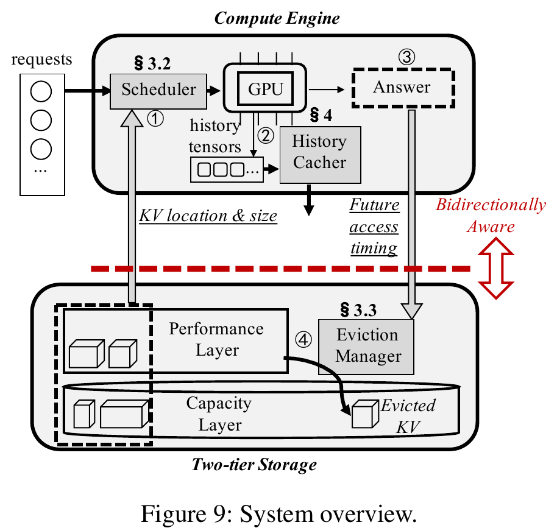
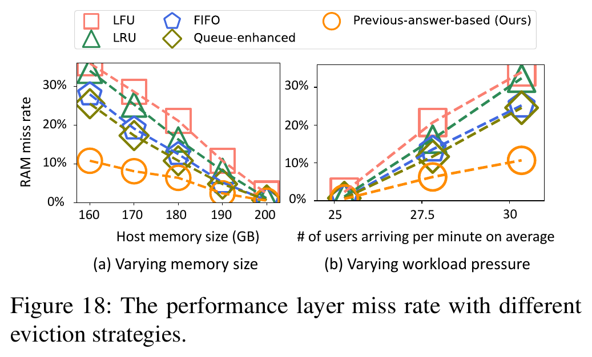
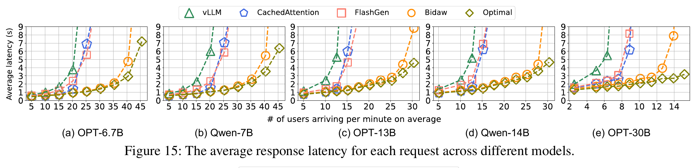
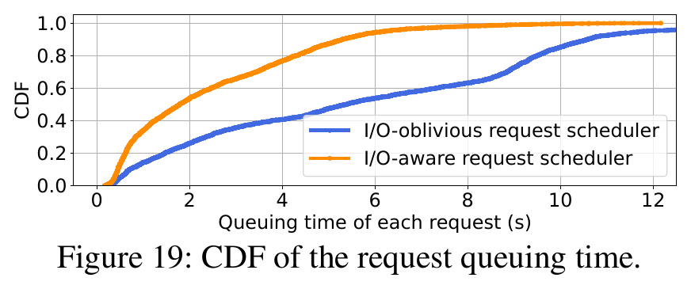
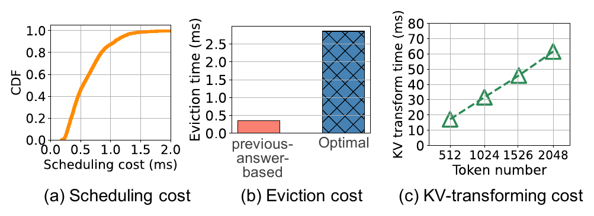
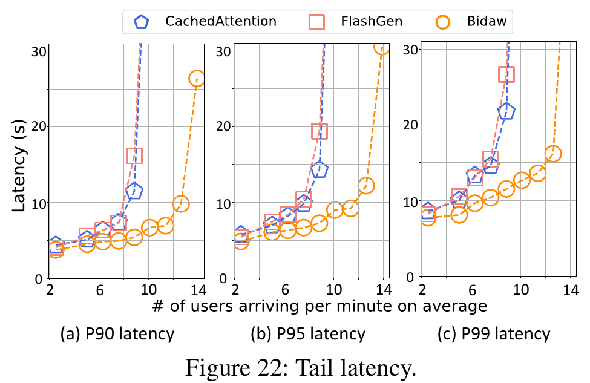

# Bidaw (FAST '26)：计算-存储双向感知的高效交互式大模型 KVCache 分层管理深度解读、技术启发与立项背书

## 一、 论文基本信息与研究背景

- **论文题目**：*Bidaw: Enhancing Key–Value Caching for Interactive LLM Serving via Bidirectional Computation–Storage Awareness*
- **作者与机构**：Shipeng Hu, Guangyan Zhang, Yuqi Zhou, Yaya Wei, Ziyan Zhong, Jike Chen（清华大学计算机系，中国地质大学（北京），中国电信全渠道运营中心）
- **发表会议**：USENIX FAST 2026（第 24 届文件与存储技术顶会，Santa Clara, CA, USA）
- **原文链接**：[同目录 PDF](<[FAST 2026] Bidaw Enhancing Key-Value Caching for Interactive LLM Serving via Bidirectional Computation–Storage Awareness.pdf>)
- **核心专有名词界定**：
  - **KVCache**（大模型注意力键值缓存）：大模型自回归生成过程中缓存的历史 Key 与 Value 激活状态张量，用于避免后续 Token 生成时重复计算注意力；
  - **TTFT**（Time To First Token，首字生成延迟 / 首 Token 响应时间）：从用户发起请求到生成第一个 Token 的耗时；
  - **TPOT**（Time Per Output Token，每个输出 Token 的生成耗时 / 单字生成延迟）：解码阶段逐字生成的平均时间；
  - **分层存储与分层块分配器**（Tiering / TierBlockAllocator）：在有限性能层（如 GPU HBM、Host DRAM）与大容量介质（如 NVMe/SATA SSD）之间分级存放 KV 数据，管理物理存储块分配的技术；
  - **队头阻塞**（Head-of-Line Blocking）：在先进先出（FCFS）排队机制下，前序因慢速 I/O 未就绪的请求阻塞后续已就绪请求调度执行的物理现象；
  - **加权重用距离**（Weighted Reuse Distance）：在两次连续访问同一用户 KV 之间，系统访问的其他所有唯一 KV 的总数据量（GB）；
  - **幽灵缓存**（Ghost Cache）：在后台利用历史完整窗口回放 Belady 理论最优淘汰算法，用于在线动态校准各重用距离桶命中率的辅助统计结构；
  - **最高响应比优先**（HRRN，Highest Response Ratio Next）：兼顾作业等待时间与服务时间的经典调度算法，优先级计算公式为 $1 + \frac{等待时间}{服务时间}$；
  - **MHA 与 GQA**（Multi-Head Attention 与 Grouped-Query Attention）：多头注意力机制与分组查询注意力机制。

### 1.1 面临的体系结构物理矛盾

在个人助理、编程助手、多轮客服等典型的交互式大模型服务中，用户请求呈现出持续多轮（Multi-round）对话的物理特征。清华大学团队在深入分析包含超过 100 万轮对话的真实工业级负载轨迹（平均每个会话包含 22.4 轮）后，揭示了一组严峻的体系结构物理矛盾：

1. **历史丢弃导致的重算开销灾难**：若因为加速卡显存不足而直接丢弃前序轮次的历史 KV，后续轮次必须对长历史上下文执行重复的前缀重算。在真实负载中，**因丢弃历史 KV 引发的冗余 Prefill 计算量最高占据了系统总计算工作量的 93.1%**！
2. **两层存储的介质带宽断崖与极高时延抖动**：虽然 GPU HBM 与 Host DRAM（性能层）速度极快，但容量受限且成本高昂；SSD（容量层）成本低廉且容量巨大，但带宽极为受限（实验环境 SATA SSD RAID 带宽仅 1.5 GB/s）。实测表明，在 OPT-13B、30 users/min 负载下，**高达 80% 的 KV 访问加权重用距离超过了 200 GB 的性能层物理容量上限**；更严重的是，连续到达请求的 KV 加载时延变异系数（CV）普遍高于 **90%**，即使在 5 秒极短时间窗口内，I/O 耗时波动依然剧烈；
3. **计算调度器对存储 I/O 状态盲目引发严重队头阻塞**：现有主流推理系统普遍采用先来先服务（FCFS）调度，调度器完全不感知 KV 数据所在的存储层级与加载耗时。当队头请求的 KV 位于慢速容量层需要加载数百毫秒时，后续哪怕已经在性能层就绪的小请求也必须被动排队等待，导致 GPU 算力单元大面积停顿空转；
4. **传统淘汰策略在交互式负载下彻底失效**：经典缓存淘汰策略（如 LRU、LFU、FIFO 及队列增强策略）仅机械记录过去的访问频度或时效性，完全忽略了人类用户“阅读-理解-思考-提问”的交互时间动力学规律，导致性能层缓存命中率在真实压力下断崖式下跌至 20% 左右。

---

## 二、 核心技术细节与架构机理

Bidaw 提出了面向交互式大模型服务的**计算-存储双向感知协同架构（Bidirectional Computation–Storage Awareness）**。系统彻底打破了计算引擎与多级存储之间的信息孤岛，通过双向语义交互实现高吞吐低时延服务：

```
+-----------------------------------------------------------------------------------+
+ Bidaw 计算-存储双向感知分层架构                                                   +
|                                                                                   |
|  [计算引擎侧: 存储感知的计算请求调度]                                             |
|     ├── 状态感知分流: Ready Queue (性能层就绪) vs Preparing Queue (容量层预取)     |
|     ├── GPU 就绪快路径: Ready Queue 零 I/O 阻塞直接调度 GPU，消除队头排队空转      |
|     ├── 异步磁盘调度: Preparing Queue 采用 disk-HRRN 算法 (兼顾小请求与防饥饿)     |
|     └── 原始到达时间插队: 预取完成后按 Original Arrival Time 晋升，保障长尾公平性 |
|                                                                                   |
|  [存储引擎侧: 计算感知的智能分层淘汰与对象选择]                                   |
|     ├── 回答长度先验: 捕获上一轮生成 Answer 长度，精准推算思考停顿与重用距离下界  |
|     ├── 幽灵缓存校准: 后台 Ghost Cache 回放 Belady 算法，动态自适应评定各桶命中潜力|
|     └── 算力换空间: 在 MHA 模型下动态缓存高成本效益的中间激活张量 (Tensor 6)      |
+-----------------------------------------------------------------------------------+
```


*图 1：Bidaw 计算-存储双向感知整体系统架构与数据流交互（摘自 Bidaw 原文 Fig. 9）*

### 2.1 存储感知的计算请求调度（Storage-Aware Request Scheduling）

针对容量层慢速 I/O 引发的队头阻塞，Bidaw 在计算引擎中引入了双队列解耦与混合调度策略：

1. **双队列解耦（Dual-Queue Separation）**：
   - **Ready Queue（就绪队列）**：仅存放 KV 数据已经完整驻留在性能层（Host DRAM）的请求。当 GPU 具备空闲显存时，计算引擎严格仅从就绪队列中选取请求下发计算，实现零慢速 I/O 阻塞的极致吞吐；
   - **Preparing Queue（准备队列）**：当请求到达且其历史 KV 位于慢速容量层（SSD）时，直接派发至准备队列，由后台异步 I/O 任务将其 KV 提前拉取至性能层；
2. **基于原始到达时间的公平晋升机制**：
   - 传统设计若在 I/O 完成后将请求追加至就绪队列末尾，会导致大请求经历“I/O 排队 + 重新排队”的双重惩罚，严重恶化 P99 尾部时延；
   - Bidaw 规定：当准备队列中的请求完成 I/O 加载后，**依据其最初到达系统的原始时间戳（Original Arrival Time）重新插入就绪队列相应位置**，有效收敛了高并发下的长尾时延；
3. **容量层读取的高响应比优先调度（disk-HRRN）**：
   - 在准备队列中，请求所需加载的 KV 尺寸差异巨大。若简单按照 FCFS 发起磁盘 I/O，慢速大对象会阻塞小对象；
   - Bidaw 引入磁盘高响应比调度算法，I/O 优先级公式定义为：
     $$\text{Priority} = 1 + \frac{\text{Waiting Time}}{\text{KV Size}}$$
   - 该公式在初始阶段优先调度 KV 数据量小、加载速度快的小请求，快速提升系统整体服务吞吐；随着等待时间（Waiting Time）推移，大请求的响应比持续累积增大，从物理上杜绝了超大请求发生饥饿。

### 2.2 计算感知的上层语义分层淘汰（Computation-Aware Eviction Strategy）

在性能层空间不足需要向容量层淘汰数据时，Bidaw 深度利用计算引擎暴露的应用层交互动力学特征：


*图 2：OPT-13B 下性能层缓存 Miss Rate 对比（摘自 Bidaw 原文 Fig. 18）*

1. **基于模型上一轮回答长度预测加权重用距离下界**：
   - 交互式对话属于人类在环（Human-in-the-Loop）系统。当模型上一轮返回的回答文本很长时，人类用户必然需要消耗更多的时间阅读、理解并组织下一轮提问；
   - 在这段人类思考等待期内，其他用户的并发请求持续涌入，导致当前用户的加权重用距离显著增大；
   - 清华团队在 12 组不同时段真实负载分析中测得，**上一轮模型回答长度与下一次访问的加权重用距离下界呈现强正相关，Spearman 秩相关系数高达 0.94 ~ 0.98**；系统在线统计该分布，即可准确推知各会话在未来的重用距离下界；
2. **幽灵缓存（Ghost Cache）与分桶命中潜力评定**：
   - 拥有重用距离预测后，如何量化其被淘汰的价值？理论最优的 Belady 算法因需要预知未来而在在线热路径中无法直接运行；
   - Bidaw 在后台维护一个幽灵缓存（Ghost Cache），对已经执行完毕的历史闭合时间窗口回放 Belady 最优淘汰模拟，量化计算不同加权重用距离区间的实际命中潜力：
     - **Small 桶**：加权重用距离小于性能层容量，历史命中率为 100%；
     - **$m$ 个 Promising 桶**：加权重用距离超过性能层容量，但 Belady 模拟证实其仍具备一定概率的命中潜力（Hit Potential）；
     - **Extreme 桶**：重用距离极其遥远，命中潜力完全归零；
   - 在触发淘汰时，系统结合上一轮回答长度排除不可能的 Promising 桶，精准选择综合命中潜力最低的 KV 优先驱逐，实测性能层 Miss Rate 较 LRU/LFU 暴降 **57.6% ~ 69.9%**。

### 2.3 算力-存储折衷的高价值中间张量动态转换缓存（Storage-Efficient Tensor Caching）

传统系统无论在显存还是外存中，皆无条件缓存原始 Key 与 Value 张量。Bidaw 提出依据“单位显存节省计算量”重新审视缓存对象：

1. **成本效益量化评估**：
   $$\text{Cost Efficiency} = \frac{\text{Saved Computing Amount (FLOPs)}}{\text{Required Space (Bytes)}}$$
2. **中间张量替代原始 KV**：
   - 在多头注意力（MHA）前向计算中，Transformer 块内部会产生多个中间激活张量。论文量化发现，LayerNorm 归一化后的激活张量（Tensor 6）仅需一步投影即可重构为 KV 张量，其成本效益高达 **51.0**，远高于原始 KV 张量的 **30.5**；
   - 缓存 Tensor 6 可显著压缩在存储介质中的物理体积，使得性能层能容纳更多用户的上下文；
3. **利用闲置计算单元并发重构**：
   - 由于大量冗余计算已被缓存消除，大模型在自回归解码阶段往往受限于访存带宽（Memory-Bound），实测 GPU 流式多处理器（SM）存在超过 **30% 的空闲算力**；
   - Bidaw 将 Tensor 6 转换重构成 KV 的计算分配至独立的低优先级 CUDA Stream，利用空闲 SM 异步执行，完全不干扰前台正常的模型推理流。

---

## 三、 关键实验平台与量化测试结果

### 3.1 实验平台与基线配置

- **测试硬件平台**：单卡 NVIDIA A800 GPU（80GB HBM3，通过 PCIe 4.0 互连）、200GB Host DRAM 性能层、4× SATA SSD 组建 RAID-5（持续读带宽 1.5 GB/s）；
- **评测模型覆盖**：OPT-6.7B、Qwen-7B、OPT-13B、Qwen-14B、OPT-30B；
- **真实工作负载**：作者构建的超过 100 万轮对话的真实交互式 Trace（平均会话 22.4 轮），并发压力覆盖 10 ~ 40 users/minute；对照公共 ShareGPT 负载；
- **对比基线系统**：
  - **vLLM**：主流开源推理系统，仅支持 GPU/Host 基础管理；
  - **CachedAttention / FlashGen**：学术界先进的二级分层 KVCache 卸载系统；
  - **Ideal-Cache**：假设所有历史 KV 均命中最快性能层的理想理论上限。

### 3.2 核心量化实验数据与图表对照


*图 3：五个主流模型上的平均请求端到端响应时延对比（摘自 Bidaw 原文 Fig. 15）*


*图 4：请求在 GPU 计算前的排队耗时 CDF 分布（I/O 感知 vs FCFS，摘自 Bidaw 原文 Fig. 19）*


*图 5：运行时控制面开销解构（调度开销 0.62ms，驱逐 0.35ms，摘自 Bidaw 原文 Fig. 20）*


*图 6：OPT-30B 模型的 P90/P95/P99 尾部响应时延对比（摘自 Bidaw 原文 Fig. 22）*

| 评估维度 | Bidaw 实测表现 | 业界既有基线表现（vLLM / FlashGen 等） | 体系结构归因与量化差距 |
| :--- | :--- | :--- | :--- |
| **端到端平均响应时延** | 较基线方案**加速比高达 3.58 倍**，平均响应时延降低 56.9% ~ 72.1% | 传统系统平均耗时居高不下，随会话轮数增加性能严重退化 | 双队列消除慢速 I/O 队头阻塞，结合高效淘汰大幅降低容量层穿透次数。 |
| **系统有效并发服务容量** | 在达成相同 SLO 延时门限下，**可支持的并发到达率提升 1.43 ~ 1.83 倍** | 既有方案到达率达到 20 users/min 时即发生雪崩式超时 | 性能层命中率提升，释放出更多算力与存储带宽专注于有效服务。 |
| **GPU 计算前排队时延** | 平均排队时延仅为 **2.45 秒**，CDF 曲线急剧左移收敛 | 传统 FCFS 盲目排队平均耗时达 **5.76 秒**（Bidaw 降低 **57.5%**） | Ready Queue 让已就绪请求优先计算，disk-HRRN 加速容量层准备。 |
| **性能层缓存 Miss Rate** | OPT-13B 下 Miss Rate 较队列增强方案**降低 57.6%**，较 LRU **降低 69.9%** | LRU/FIFO/LFU 在两层分层下 Miss Rate 高达 **80% 左右** | 捕获上一轮回答长度预测重用距离，利用 Ghost Cache 淘汰无潜力对象。 |
| **P99 尾部时延稳定性** | OPT-30B 下较 CachedAttention P99 降低 **47.03%**，较 FlashGen 降低 **56.81%** | 传统方案在大并发下长尾急剧恶化（P99 突破数十秒） | disk-HRRN 避免大对象饿死，结合原始时间戳插入机制平滑尾部时延。 |
| **运行时控制面调度开销** | 单次在线调度开销仅 **0.62 ms**，在线淘汰判定耗时仅 **0.35 ms** | 静态策略虽无开销但导致系统性能暴跌数倍 | Ghost Cache 模拟完全沉淀在后台运行（2.86 ms），热路径极其轻量。 |

---

## 四、 对我们统一异构 KVC 存储池项目的硬核技术启发

Bidaw 在单机两层存储下探索出的双向感知机理，对我们面向国产 AI 硬件的统一异构 KVCache 存储与调度底座建设具有极具价值的工程指导意义：

### 4.1 动态选路决策引擎（QueryPlan）与 I/O 状态解耦机制

- **启发**：传统系统将“计算准入”与“数据加载”强行捆绑，是引发严重 I/O 停顿与队头阻塞的元凶。Bidaw 的双队列解耦（Ready Queue 与 Preparing Queue）从架构上证明了：计算引擎必须感知存储侧的就绪状态；
- **落地手段**：
  1. 在本项目的动态选路决策引擎（QueryPlan）中，引入版本化的预估就绪状态（`predicted_ready_time_us` 与 `io_status`）；
  2. 调度引擎与数据拉取解耦：针对需要从慢速多介质分层存储（NVMe SSD）拉取或远端网络拉取的长前缀请求，提前派发异步拉取任务，仅当数据在本地 NPU HBM 就绪后才推入推理框架的活跃执行批次（Batch），彻底消灭推理算力等待数据加载的硬件空转。

### 4.2 结合业务交互特征的多介质分层存储（Tiering）精细化驱逐

- **启发**：单纯依赖通用的 LRU/LFU 无法应对多轮对话的长尾重用，Bidaw 将上一轮回答长度转化为加权重用距离下界，实现了高达 69.9% 的 Miss Rate 降低；
- **落地手段**：
  1. 在本项目的多介质分层存储（Tiering / NVMe SSD 直达）中，在元数据层引入会话感知上下文属性（`AccessIntent`）；
  2. 针对交互式业务流量，记录会话最新轮次生成的 Token 规模，作为后台分层块分配器（TierBlockAllocator）向下沉淀换出至 NVMe SSD 时的优先级修正参考；
  3. 保留硬核安全防线：严禁将此类经验启发式特征作为硬编码策略，系统必须支持动态灰度与一键旁路关闭，防止非交互式批处理流量或合成流量出现预测漂移。

### 4.3 显存直读重构与空闲算力复用维度的审慎权衡

- **启发**：Bidaw 探索了利用解码阶段闲置 GPU SM 算力将中间高密度激活张量（Tensor 6）重构为 KV 的路径；
- **落地手段**：
  1. 确认该特性的物理边界：该设计高度依赖经典多头注意力（MHA）的参数结构，对于当前主流的分组查询注意力（GQA，如 Llama-3、Qwen-2.5）和多头潜在注意力（MLA，如 DeepSeek），KV 缓存本身已被大幅压缩，中间张量的体积优势已不明显；
  2. 在工程落地中，优先聚焦在底层通用通路——**Host CPU 零数据拷贝（CPU 仅负责下发控制指令，不参与正文数据搬运，Host Payload Touch Bytes 严格为 0）**与连续描述符编译（DescriptorCompiler），中间张量转换仅作为特定算子定制的进阶探索，不作为通用底座的准入门槛。

---

## 五、 对本项目立项与架构答辩的硬核技术背书

在立项答辩与架构技术评审中，针对评委与技术委员会可能提出的核心质询，Bidaw 提供了体系结构物理维度的硬核反驳依据：

### 5.1 质询一：“大模型推理主要是计算受限，在存储侧投入大量研发搞两层分层与复杂调度，是不是‘为了做系统而做系统’的过度设计？”

> **硬核反驳背书**：
> 1. **第一性原理揭穿重算灾难**：在长上下文多轮交互中，如果不做存储分层保留，丢弃历史 KV 导致的重复 Prefill 计算量**高达总计算工作量的 93.1%**，这不仅不是过度设计，反而是算力释放的最核心抓手；
> 2. **物理带宽断崖迫使系统必须具备感知能力**：存储介质与显存之间存在两个数量级以上的带宽鸿沟，且 I/O 耗时变异系数超过 90%。FAST '26 Bidaw 的实测事实证明，若计算调度对存储状态盲目，系统响应时延会恶化 **3.58 倍**，排队延迟增加 **57.5%**。因此，“计算-存储协同调度”是发挥异构硬件物理潜力的必由之路，具备不可替代的工程落地价值。

### 5.2 质询二：“在多轮交互中，直接沿用成熟的 LRU 或 LFU 淘汰机制不行吗？为什么还要做加权重用距离与复杂的淘汰算法？”

> **硬核反驳背书**：
> 1. **学术顶会客观实测击碎既有假定**：FAST '26 论文量化证明，在真实百万轮会话轨迹下，受人类交互“思考停顿”物理特性的影响，传统 LRU、LFU、FIFO 在性能层容量为 40% 时，**缓存 Miss Rate 均高达 80% 左右**，几乎彻底瘫痪失效；
> 2. **立项架构的先见性佐证**：通过引入加权重用距离与后台幽灵缓存校准，Miss Rate 能够实测降低 **57.6% ~ 69.9%**。这直接支撑了本项目在立项设计中将“存储分层感知与精细化租约管理”列为核心模块的正确性，为系统跨介质调度提供了扎实的学术支撑。

### 5.3 质询三：“如果调度器感知存储 I/O 状态并动态插队，会不会导致大请求或长会话陷入无限饥饿，破坏服务公平性与尾部时延？”

> **硬核反驳背书**：
> 1. **disk-HRRN 与原始时间戳提供了严格的防饥饿数学证明**：Bidaw 采用的高响应比优先公式（$1 + \frac{\text{Waiting Time}}{\text{KV Size}}$）天然具备动态老化（Aging）机制，大请求随着等待时间增长优先级呈线性提升，必然能获得 I/O 服务；
> 2. **尾部时延实测不仅没有恶化，反而显著改善**：实测显示，在 OPT-30B 模型下，Bidaw 相比 FlashGen 将 **P99 尾部响应时延降低了 56.81%**。这强有力地证明了：只要机制设计完备，基于 I/O 状态的请求分流不会饿死大请求，反而能全面消除队头阻塞，实现系统均值与长尾时延的双重收敛。

---

## 六、 边界条件与不可直接迁移点

1. **单机 SATA SSD 平台与分布式网络拓扑的鸿沟**：Bidaw 的所有核心收益均建立在单台服务器、单张 A800 与本地 1.5 GB/s SATA RAID-5 的极端低速存储假设之上，其对 5 GB/s 带宽的测试也是通过软内存复制与延时注入模拟的。本项目面向的是国产 AI 芯片与通用服务器集群，跨机互连走的是 UBMEM/URMA 高速网络（100~200 Gbps），本地扩展走的是 NVMe SSD 直达（PCIe 4.0/5.0 数 GB/s 到数十 GB/s）。物理链路带宽的巨大差异意味着不能直接照搬其绝对延迟数值；
2. **人类对话特征不可盲目外推至全自动业务**：回答长度与思考时间的强相关性仅在“人类在环”的多轮交互对话中成立。在自动化 Agent 批量调度、固定节拍的后台批处理、代码自动化生成等业务流中，该相关性可能完全消失甚至呈现反向趋势。因此该机制在底座中必须作为受控插件，支持按业务类型配置与一键切除；
3. **中间张量缓存（Tensor 6）的模型局限性**：Bidaw 的张量转换主要适用于原始 MHA 模型（如 OPT 系列）。针对广泛采用 GQA（如 Llama-3）与 MLA（如 DeepSeek）的现代模型架构，KV 缓存原本占用已大幅下降，中间激活张量反而可能带来额外的显存与重构算力开销，不可盲目迁移；
4. **控制职责边界铁律**：Bidaw 的调度器由存储模块侵入了计算框架的请求派发。在工业化落地中，统一异构 KVCache 存储底座必须保持清晰的系统职责边界——存储底座负责提供版本化的预计就绪时延（`predicted_ready_time_us`）与硬件 I/O 流水编排，**严禁越权劫持或改写上层推理框架（如 vLLM、MindIE）全局批处理的最终执行控制权**。
