# Bidaw FAST 2026 计算存储双向感知 KVCache 解构与项目启示 V2

> 文档版本：V2  
> 论文来源：USENIX FAST 2026  
> 分析对象：Bidaw: Enhancing Key-Value Caching for Interactive LLM Serving via Bidirectional Computation–Storage Awareness  
> 分析范围：问题根因、系统抽象、调度与淘汰机制、实验条件、局限性、项目迁移路径与验证建议  
> 原文链接：[同目录 PDF](<[FAST 2026] Bidaw Enhancing Key-Value Caching for Interactive LLM Serving via Bidirectional Computation–Storage Awareness.pdf>)

## 一 执行结论

Bidaw 解决的是交互式多轮对话中的两级 KVCache 加载效率问题。KVCache（大模型注意力键值缓存，即自回归生成过程中保存的历史 Key 与 Value 激活状态，用于避免后续 Token 重复计算注意力）从 GPU 卸出后保存在主机内存和 SSD 中；下一轮请求到达时，推理必须先把历史状态重新装入 GPU。现有系统让计算调度器和存储系统各自独立决策：调度器看不到 KV 所在介质与加载大小，存储淘汰策略又看不到用户上一轮交互产生的信息。这种割裂同时造成慢速 I/O 队头阻塞和主机内存命中率偏低。

论文的主要思路很清楚：让计算侧向存储侧暴露上一轮回答长度，让存储侧向计算侧暴露 KV 的位置和大小。前者用于估计下一次访问的加权重用距离下界，后者用于把已在主机内存就绪的请求与需要从 SSD 准备的请求分开。Bidaw 再用磁盘侧的带老化短作业优先策略、后台幽灵缓存校准和可选的中间张量缓存，把这两条信息链落成可执行机制。

在作者的单机 A800、200 GB 主机内存和 1.5 GB/s SATA SSD RAID-5 环境中，论文报告平均响应时延最高改善 3.58 倍，可承载的用户到达率提高 1.43 至 1.83 倍。这个结果支持“请求调度应读取加载状态”和“交互行为可辅助分层淘汰”两项判断，但不能直接推出跨节点 KVCache、NVMe SSD 直达、Host CPU 零数据拷贝或张量并行场景也会获得相同比例的收益。

对当前项目有直接价值的是接口约束。存储底座应返回带版本和有效期的预计就绪时间、排队时间与数据规模；推理框架保留最终执行调度权，存储侧只提供准备状态和候选动作；淘汰策略按业务类型加载特征插件，并通过后台回放持续校准。固定阈值和 Tensor 6 都需要重新实测。回答长度只适合人类在环的多轮对话，不能作为全局默认规则。

### 1.1 证据分类约定

本文用五类标记区分证据层级：“论文事实”指原文正文、图表或实验直接给出的机制、条件与结果；“分析推断”指根据论文证据得出的解释；“项目解释”指论文原则在统一异构 KVCache 存储与调度底座中的对应含义；“项目建议”指尚待实现或验证的方案；“开放问题”指只能由本项目实验回答的未决问题。

## 二 论文信息与研究边界

- 论文：*Bidaw: Enhancing Key-Value Caching for Interactive LLM Serving via Bidirectional Computation–Storage Awareness*
- 作者：Shipeng Hu、Guangyan Zhang、Yuqi Zhou、Yaya Wei、Ziyan Zhong、Jike Chen
- 机构：清华大学、中国地质大学（北京）、中国电信全渠道运营中心
- 会议：24th USENIX Conference on File and Storage Technologies，FAST 2026
- 代码与工作负载：论文脚注给出作者的交互式对话工作负载仓库；本文不把仓库外信息作为论文实验结论
- 研究对象：同一用户多轮对话历史状态的无损复用，不讨论跨用户语义相似缓存
- 存储形态：本地主机内存作为性能层，SSD 作为容量层；GPU 执行前仍需把历史状态加载到 GPU
- 论文指标：平均端到端响应时延、可承载用户到达率、主机内存未命中率、排队时延、控制开销和 P90/P95/P99 响应时延

TTFT（Time To First Token，首 Token 响应时间）和 TPOT（Time Per Output Token，每个输出 Token 的生成耗时）没有被论文单独拆开报告。因此，本文不会把平均响应时延改善改写为 TTFT 或 TPOT 改善。

## 三 问题与根因

### 3.1 交互式多轮对话把历史状态变成长驻对象

论文的真实工业工作负载包含超过 100 万轮对话。平均查询长度为 36 Token，平均回答长度为 45 Token；单个会话的轮次数平均值、中位数和 P90 分别为 22、18 和 45，正文另给出平均 22.4 轮。用户读取回答并组织下一轮问题期间，历史 KV 必须继续保留。会话轮数一多，若每轮结束后直接丢弃 GPU 中的历史 KV，下一轮就要重新计算全部历史。论文报告这种冗余计算最高占总计算工作量的 93.1%。

这项观察说明容量扩展有实际价值，但它没有单独证明“任何缓存都优于重算”。当历史很短、介质拥塞或缓存语义校验代价较高时，加载仍可能慢于重算。Bidaw 的评测重点是两级缓存内部的加载效率，不是完整的加载与重算动态选路。

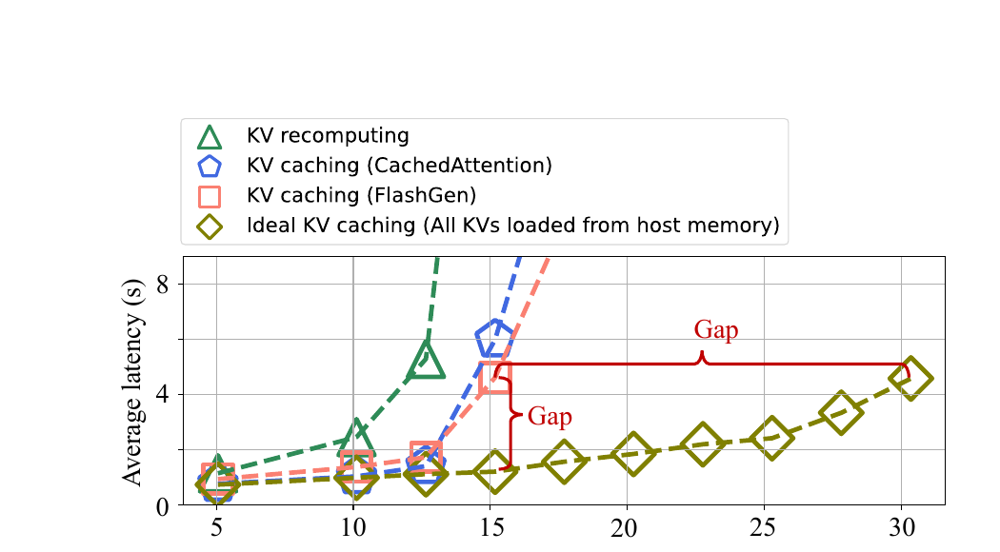

*图 1：现有两级缓存方案与模拟理想缓存的响应时延差距，摘自原论文 Figure 3。实验使用 OPT-13B、80 GB A800、200 GB 主机内存和 1.5 GB/s SSD。*

论文把所有历史 KV 都能从主机内存加载的方案作为模拟上界。与这个上界相比，CachedAttention 和 FlashGen 的响应时延最高达到 3.8 倍，吞吐最高降低 2.0 倍。这里的“理想”只移除了 SSD 慢层影响，并不代表无限 GPU 显存或零开销缓存。

### 3.2 三个工作负载特征共同制造加载瓶颈

第一，历史 KV 的驻留时间长。随着用户到达率提高，并发用户和累计历史状态同步增长。作者只选择单张 A800 在消除冗余重算后仍能承载的到达率，避免把计算饱和混入分析。在这个范围内，并发缓存量最多达到主机内存性能层容量的 3.91 倍。

第二，访问时间局部性差。论文定义的加权重用距离是两次访问同一用户 KV 之间，其他唯一 KV 被访问的总字节量。OPT-13B、30 users/minute、200 GB 性能层下，80% 的 KV 访问重用距离超过性能层容量。性能层平均容纳 40.1% 的 KV 时，FIFO、LRU 和 CachedAttention 的队列增强策略命中率仍只有约 20%。容量占比和命中率的反差说明，交互式负载不能只依赖最近访问顺序。

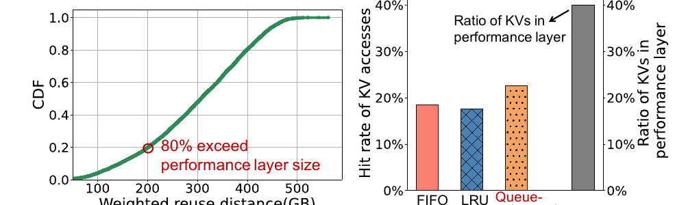

*图 2：加权重用距离分布与既有淘汰策略的性能层命中率，摘自原论文 Figure 6。*

第三，加载时间差异很大。主机内存与 SSD 的带宽不同，请求历史长度又不相同，因此同一短时间窗口内的加载时延也会明显分化。论文报告各时间窗口内 KV 加载时延的变异系数均超过 90%，5 秒窗口也不例外。FCFS（First Come First Served，先来先服务）一旦把慢请求放在队头，就会让后面已经就绪或只需短加载的请求一起等待。

### 3.3 根因不是 SSD 慢而是两侧互不暴露决策信息

论文事实表明，SSD 带宽低是物理条件，但性能差距来自两个控制问题叠加：计算侧按到达顺序调度，却不知道 KV 在哪一层、要加载多少；存储侧按历史访问和等待队列淘汰，却不知道用户上一轮回答带来的交互停顿。Bidaw 所谓“双向感知”，就是补上这两条信息通道。

分析上可以把根因写成一条完整因果链：介质带宽差和对象大小差导致加载时间离散；调度器看不到离散性，FCFS 将慢 I/O 放入计算关键路径；淘汰策略又无法识别长时间不访问但仍可能复用的会话，增加 SSD 穿透；两者最终共同拉长排队与响应时延。

## 四 核心观察与系统抽象

### 4.1 双向感知是一组窄接口而不是新的全局控制器

Bidaw 没有让存储系统接管整个推理框架。计算侧向存储侧传递上一轮模型回答，存储侧向计算侧返回 KV 位置与大小。计算引擎仍负责请求调度、GPU 执行和历史张量生成；两级存储负责性能层与容量层、淘汰和加载。

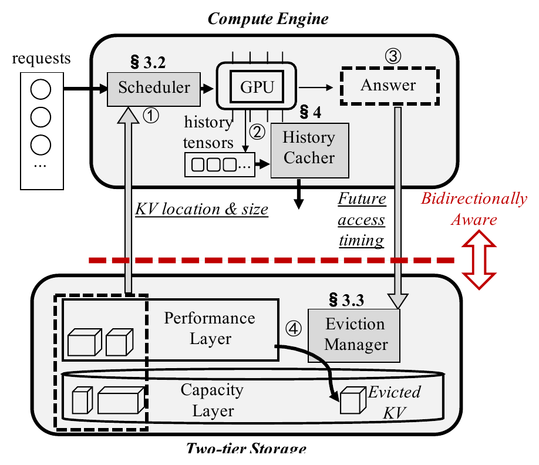

*图 3：Bidaw 总体架构，摘自原论文 Figure 9。上半部分是计算引擎，下半部分是主机内存与 SSD 两级存储。红色虚线两侧交换 KV 位置与大小、未来访问时机两类信息。*

| 组件 | 持有的状态 | 做出的决定 | 是否在关键路径 |
| --- | --- | --- | --- |
| Scheduler | 请求到达顺序、KV 位置与大小、GPU 可用空间 | 进入 Ready Queue 或 Preparing Queue，选择 GPU 计算请求和 SSD 读取顺序 | 是 |
| History Cacher | 当前轮生成的历史张量、连续批处理状态 | 缓存 KV 或选定的中间张量 | 写入通常不在当前请求关键路径 |
| Eviction Manager | 上一轮回答长度、每用户历史重用分布、幽灵缓存分桶命中率 | 估计下次访问命中潜力并选择淘汰对象 | 在线选择在容量压力时触发；校准在后台 |
| Performance Layer | 主机内存中的热历史状态 | 提供快速加载目标 | 是 |
| Capacity Layer | SSD 中的完整历史副本 | 承接容量扩展并响应后台读取 | 命中时是 |

### 4.2 资源交换关系

Bidaw 进行的是三笔交换。

1. 用少量调度计算和请求重排，换取更少的 GPU 空等和更短的队头阻塞。
2. 用上一轮回答长度、每用户历史分布和后台回放状态，换取更高的主机内存命中率。
3. 在 MHA（Multi-Head Attention，多头注意力）模型中，用一部分空闲 GPU 计算重构中间张量，换取更小的存储占用。

第三笔交换不是全模型通用结论。论文明确指出，对 GQA（Grouped-Query Attention，分组查询注意力）模型，KV 已经更小，继续缓存 Tensor 6 不再划算，应直接缓存 KV。

## 五 机制一 I/O 感知请求调度

### 5.1 双队列把慢速准备阶段移出 GPU 就绪路径

请求到达时，调度器先查询历史状态是否在主机内存性能层。如果已经在性能层，请求进入 Ready Queue；如果只在 SSD 容量层，请求进入 Preparing Queue，并在后台发起 SSD 到主机内存的加载。GPU 有空间接纳新请求时，只从 Ready Queue 选择任务。这样，SSD 慢读不会阻塞已经能快速装入 GPU 的请求。

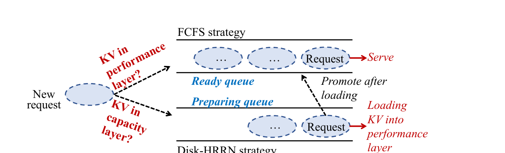

*图 4：I/O 感知双队列调度结构，摘自原论文 Figure 10。*

Ready Queue 仍采用 FCFS，但有两个细节。请求从 Preparing Queue 晋升时按原始到达时间插回队列，而不是按加载完成时间排到末尾；若队头请求放不进当前 GPU 可用空间，调度器可以跳过它，选择后续能放入的请求。前者缓解慢请求的二次排队，后者沿用 FlashGen 的空间适配做法。

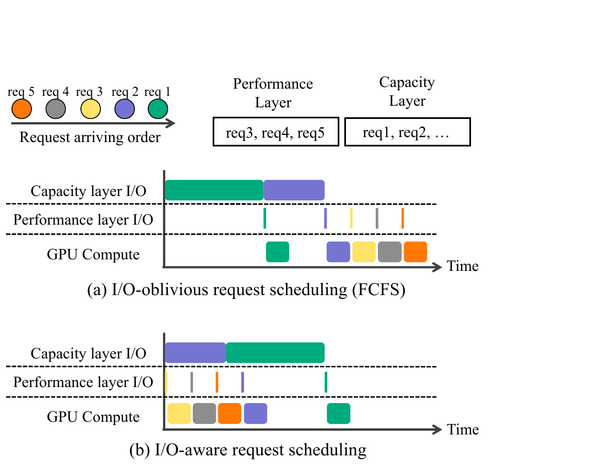

*图 5：I/O 盲调度与 I/O 感知调度的执行时间线，摘自原论文 Figure 11。I/O 感知方案先执行已在性能层就绪的请求，同时准备容量层请求。*

### 5.2 disk-HRRN 在短作业优先和等待老化之间折中

Preparing Queue 内的读取次序由 disk-HRRN（面向磁盘读取的最高响应比优先策略）决定。论文定义：优先级 = 1 + 等待时间 / KV 大小。若等待时间相近，KV 较小的请求优先，能更快晋升到 Ready Queue；随着等待增长，大对象的优先级也会提高。

论文把这种老化机制解释为避免大请求饥饿。更严格地说，公式确实会让有限大小请求的优先级随等待时间增长，但论文没有给出包含取消、持续高优先级流量、设备故障或多租户配额的形式化饥饿证明。实验中的 P90/P95/P99 改善说明该策略在测试负载下没有造成明显尾部恶化，不能替代生产环境的公平性门禁。

### 5.3 为什么逐层计算与加载重叠不足以解决问题

论文讨论了一个看似直接的替代方案：计算当前层时加载下一层 KV。作者指出，GPU 推理包含连续迭代，I/O 只能与第一轮几十毫秒计算重叠，而 SSD 读取可能持续数百毫秒。这种时间尺度不匹配使简单逐层重叠无法充分隐藏慢层加载。Bidaw 因而把请求级准备提前到 GPU 准入之前。

这条结论与具体介质相关。若项目使用多盘 NVMe、远端 HBM 或更高带宽互连，I/O 与计算时间尺度可能改变，逐层流水的价值也会随之改变。正确做法是实测 `predicted_queue_us`、`predicted_load_us` 和可重叠窗口，而不是把双队列写成不可变规则。

## 六 机制二 回答长度辅助的分层淘汰

### 6.1 回答长度提供的是重用距离下界线索

作者把每个用户上一轮模型回答长度与下一次 KV 访问的加权重用距离放在同一张图上。他们从 8:00 到 20:00 的不同时段选取 12 组十分钟轨迹，在不同用户到达率下分析；剔除 IQR（Interquartile Range，四分位距）离群点后，对每个回答长度取最小加权重用距离，再计算这些最小值与回答长度的 Spearman 秩相关系数。12 组结果位于 0.94 到 0.98。

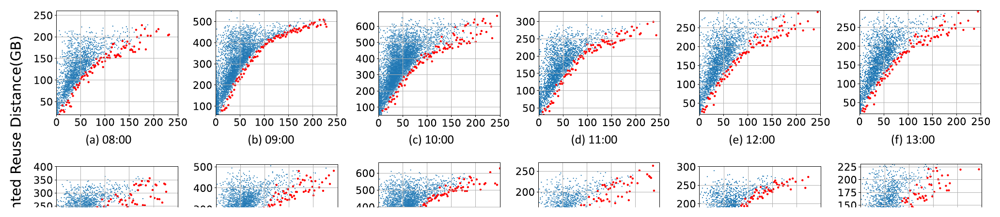

*图 6：上一轮回答长度与加权重用距离的关系，摘自原论文 Figure 12。红点表示各回答长度对应的重用距离下界。*

这项证据支持“回答越长，下一次访问不太可能立刻发生”的下界判断，但不等于回答长度可以精准预测每个请求的下次到达时间。图中的散点仍然很宽，0.94 至 0.98 是下界序列之间的秩相关系数，不是逐请求预测准确率，也不是因果效应估计。

### 6.2 幽灵缓存把下界线索转换为可比较的命中潜力

只有重用距离下界还不能直接决定淘汰对象。即使重用距离超过性能层容量，某些访问在 Belady 最优策略下仍可能命中。Bidaw 将距离空间分成三类：小距离桶的命中率设为 1；多个 Promising 桶保留各自的历史命中率；超过阈值的 Extreme 桶命中率设为 0。

后台幽灵缓存用已经发生的历史轨迹回放 Belady 最优淘汰策略，按当前性能层大小和工作负载压力更新各桶命中率。对每个用户，系统还维护其历史加权重用距离分布。上一轮回答长度给出新的下界后，系统把下界之前不可能出现的桶概率置零并重新归一化，再计算：

`总体命中潜力 = 小距离桶概率 + 各 Promising 桶概率 × 对应桶历史命中率`

性能层需要淘汰时，系统选择总体命中潜力最低的用户 KV。幽灵缓存使用的是过去轨迹中的“未来信息”，只承担后台校准，不直接作为在线可实现的上界策略。

### 6.3 机制依赖工作负载稳定性

幽灵缓存默认近期历史能代表接下来的访问分布。业务类型、模型回答风格、用户界面或到达率发生变化时，回答长度到重用距离下界的关系以及各分桶命中率都可能漂移。论文评测覆盖不同时段和压力，但没有给出突发业务切换、模型版本切换或长期漂移下的收敛时间和误淘汰代价。

这个边界在 ShareGPT 实验中已经出现：ShareGPT 没有原始时间戳，作者用泊松分布模拟到达时间，回答长度辅助策略不再降低未命中率。论文据此明确承认，缺少真实交互时间关系时，该机制的额外价值会消失。

## 七 机制三 存储效率张量缓存与混合粒度内存

### 7.1 Tensor 6 用重构计算换存储空间

论文对 OPT-13B、2048 Token 历史、单个解码层的多个中间张量比较大小、可节省计算量和单位空间节省计算量。Tensor 6 是归一化后的激活，只需一步投影就能恢复 KV。其成本效率为 51.0 GFLOPs/MB，高于直接缓存 KV 的 30.5 GFLOPs/MB。

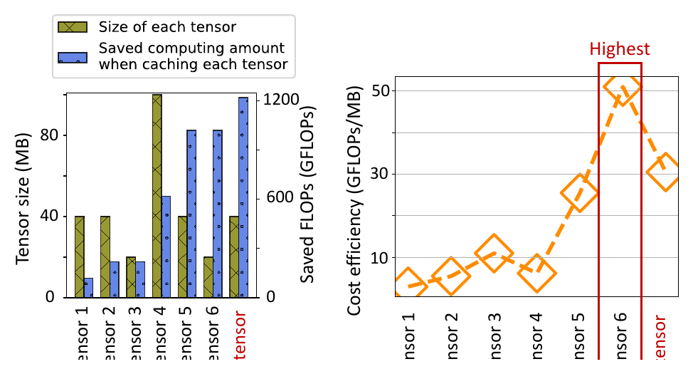

*图 7：OPT-13B 下不同中间张量的大小、计算节省和单位空间效率，摘自原论文 Figure 14。*

系统把 Tensor 6 加载到 GPU 后，在低优先级 CUDA Stream 中恢复 KV。作者观察到历史缓存消除大量重算后，推理多数时间受内存带宽限制，超过 30% 的 GPU SM 处于空闲状态，因此重构可以与其他请求推理并行。Figure 20(c) 显示不同 Token 数下重构耗时为数十毫秒。

这项机制只在 MHA 模型中被论文认为有利。GQA 模型的 KV 更小，直接缓存 KV 更合适；论文没有评估 MLA（Multi-head Latent Attention，多头潜在注意力）及国产 NPU 的算子融合、低优先级流隔离和片上资源竞争。项目若采用这条路径，必须按模型架构和算子实现单独准入。

### 7.2 逻辑小块和传输大块分开管理

为提高 CPU 到 GPU 传输带宽，Bidaw 使用两种 GPU 块：已知长度的历史和查询使用 256 Token 大块，长度不可预测的回答使用 16 Token 小块；大块可以拆成小块，小块也可以重新合并。这一设计保留了响应阶段的细粒度空间利用，同时让历史加载获得更大的连续传输单元。

对当前项目更有普适性的不是 256 和 16 这两个数，而是逻辑分配粒度与物理传输粒度解耦。框架可以继续使用细粒度 Block 表，底层描述符编译器把可连续传输的区域合并为较大的 Extent，再由实际链路能力决定提交大小。

## 八 实验设计与证据解释

### 8.1 平台 工作负载与基线

| 项目 | 论文设置 | 解释边界 |
| --- | --- | --- |
| GPU | 1 张 NVIDIA A800，80 GB | 没有张量并行、多卡同步或跨节点流量 |
| 主机内存 | 200 GB；敏感性实验为 120 至 200 GB | 性能层为本地 DRAM，不是远端内存池 |
| SSD | 4 块 SATA SSD，RAID-5，持续带宽 1.5 GB/s | 主实验的慢层差距较大；另有 5 GB/s 模拟 |
| 互连 | PCIe 4.0，论文称 CPU-GPU 约 30 GB/s | 未测试设备到 SSD 直达或跨机网络 |
| 模型 | OPT-6.7B、Qwen-7B、OPT-13B、Qwen-14B、OPT-30B | Tensor 6 结论只声明适用于 MHA，GQA 直接缓存 KV |
| 真实负载 | 超过 100 万轮交互式对话，平均 22.4 轮 | 工业来源；核心行为特征依赖真实时间戳 |
| 公共负载 | ShareGPT，多轮到达时间由泊松分布模拟 | 不能验证真实人机交互停顿规律 |
| 基线 | vLLM、CachedAttention、FlashGen、模拟 Ideal Cache | CachedAttention 和 FlashGen 闭源，作者基于 vLLM 复现 |

基线复现是重要的可比性限制。论文说明 CachedAttention 和 FlashGen 闭源，因此由作者自行实现。结果反映论文实现和实验设置下的比较，不等同于原系统官方实现的最终性能。

### 8.2 端到端平均响应时延和吞吐

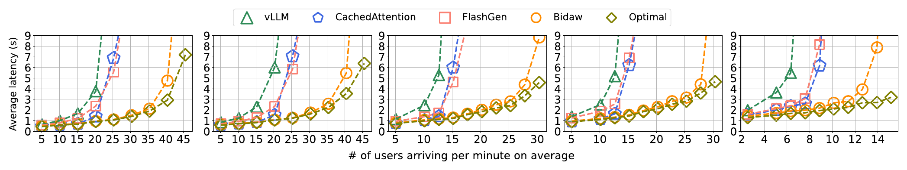

*图 8：五种模型、不同用户到达率下的平均端到端响应时延，摘自原论文 Figure 15。各子图横轴范围不同，不能横向比较曲线拐点的绝对位置。*

在真实交互式工作负载上，Bidaw 对 OPT-13B 的响应时延最多降低 3.58 倍；跨模型相对先进基线的最大时延降幅为 83.9%。作者以相近平均响应时延下能够承载的用户到达率衡量吞吐，报告 1.43 至 1.83 倍提升。这个“吞吐”是可承载到达率，不是固定批次下的 Token/s。

5 GB/s SSD 通过主机内存复制并注入额外延迟模拟。FlashGen 的可承载到达率从 15.18 users/minute 提高到 20.23，Bidaw 从 27.81 提高到 30.35。该实验说明提高 SSD 带宽缩小了收益，但在这一模拟条件下没有消除调度与淘汰差距；它不等同于真实 NVMe 队列、DMA、尾延迟和并发行为。

ShareGPT 上，Bidaw 相对 FlashGen 支持 1.40 倍用户到达率；相对 vLLM、CachedAttention 和 FlashGen 的最大响应时延降幅分别为 69.8%、65.8% 和 56.9%。同时，回答长度辅助淘汰在模拟时间戳下不再降低未命中率，说明整体收益主要来自 I/O 感知调度和其他通用机制。

### 8.3 性能层未命中率

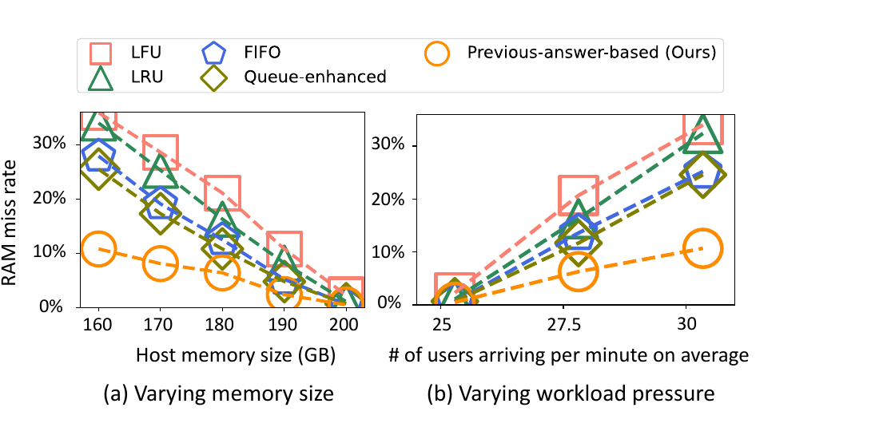

*图 9：OPT-13B 下不同主机内存大小和用户到达率对应的性能层未命中率，摘自原论文 Figure 18。*

回答长度辅助淘汰相对 CachedAttention 的队列增强策略将未命中率最多降低 57.6%，相对 LFU、LRU、FIFO 等通用策略最多降低 69.9%。Figure 18 展示的是 OPT-13B，并且缓存对象已经替换为存储效率更高的张量。未命中率改善不能全部归因于回答长度特征，缓存对象大小变化也会影响性能层可容纳的历史状态数量。

### 8.4 排队时延与控制开销

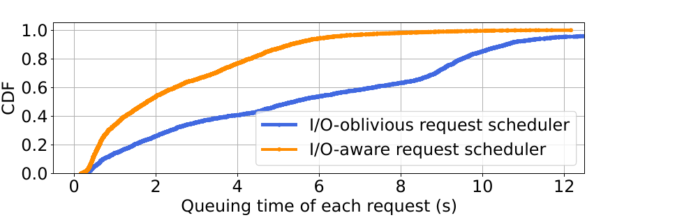

*图 10：OPT-13B、30 users/minute 下请求进入 GPU 计算前的排队时延 CDF，摘自原论文 Figure 19。*

I/O 感知调度的平均排队时延为 2.45 秒，FCFS 为 5.76 秒，平均降幅 57.5%。这项实验直接对应“慢 SSD 请求阻塞已就绪请求”的机制主张，比总时延图更能隔离调度器的作用。

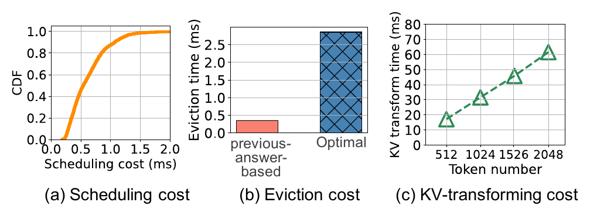

*图 11：调度、在线淘汰、后台最优淘汰回放和张量重构开销，摘自原论文 Figure 20。*

调度操作平均耗时 0.62 ms，每个 GPU 计算迭代后触发一次；论文称每轮计算通常为数十毫秒。在线回答长度辅助淘汰平均耗时 0.35 ms，后台最优策略回放为 2.86 ms。作者指出在线可承载压力下等待请求通常少于 50 个，因此未评估大规模队列或多节点目录查询后的调度开销增长。

### 8.5 消融与尾时延

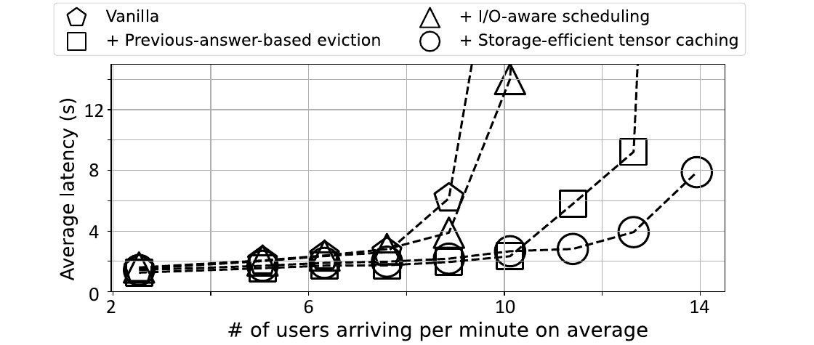

*图 12：OPT-30B 下逐项加入 I/O 感知调度、回答长度辅助淘汰和存储效率张量缓存的结果，摘自原论文 Figure 21。*

从 Vanilla 开始，单独加入 I/O 感知调度使平均响应时延最多降低 1.58 倍；进一步加入回答长度辅助淘汰，使相近时延下的可承载用户数再提高 1.25 倍；最后加入存储效率张量缓存，再提高 1.10 倍。这些是逐步加入机制后的增量结果，指标也不完全相同，不能简单相乘得到独立总加速比。

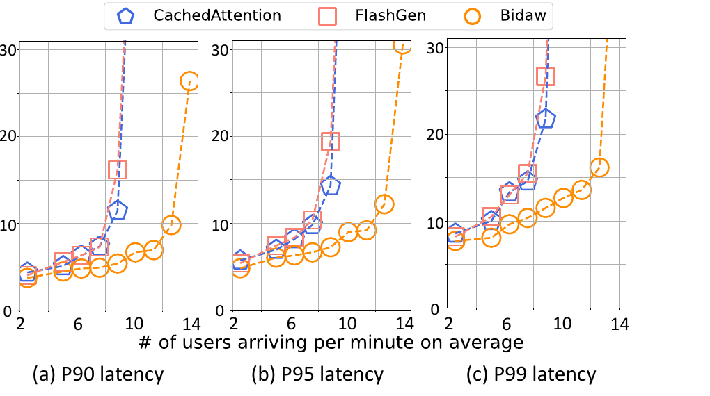

*图 13：OPT-30B 下 P90、P95 和 P99 端到端响应时延，摘自原论文 Figure 22。*

Bidaw 相对 CachedAttention 的 P90、P95、P99 分别降低 52.96%、49.30% 和 47.03%，相对 FlashGen 分别降低 66.63%、62.64% 和 56.81%。这些结果支持原始到达时间回插和 disk-HRRN 在测试压力下没有牺牲长尾，但论文没有给出多租户公平性、最坏等待时间或持续过载时的保证。

### 8.6 主张到证据映射

| 论文主张 | 对应实验 | 直接证明的范围 | 没有证明的内容 |
| --- | --- | --- | --- |
| 两级 KV 加载是现有系统瓶颈 | Figure 3，对比模拟 Ideal Cache | 单机 A800、OPT-13B、1.5 GB/s SSD 下存在显著差距 | 高速 NVMe、远端 HBM、跨节点网络上的差距比例 |
| I/O 感知调度减少队头阻塞 | Figure 19 和 Figure 21 | 测试负载下排队时延和平均时延改善 | 持续过载、多租户配额和故障条件下的公平性 |
| 回答长度可辅助淘汰 | Figure 12 和 Figure 18 | 真实交互轨迹中下界相关，OPT-13B 未命中率降低 | 自动 Agent、批处理、无真实时间戳流量中的通用性 |
| 中间张量可提高存储效率 | Figure 14 和 Figure 21 | OPT-13B MHA 场景的成本效率与增量吞吐 | GQA、MLA、国产 NPU 和算子干扰边界 |
| 方案开销可控 | Figure 20 | 等待请求通常少于 50 的单机场景 | 分布式目录、大规模队列和多设备协调开销 |

## 九 局限性与隐含假设

### 9.1 工作负载假设

回答长度策略假设人类会花更长时间处理更长回答，期间其他用户请求持续到达。真实交互轨迹支持这一统计关系，ShareGPT 模拟时间戳实验则显示它不是无条件成立。自动化 Agent、工具调用链、固定节拍客服脚本和批处理任务必须单独建模。

### 9.2 拓扑与介质假设

系统在一台服务器上运行，慢层是 1.5 GB/s SATA SSD RAID-5，性能层是本地 DRAM。论文没有覆盖 URMA（通用远程直接内存访问，即用户态高性能 RDMA 驱动接口与通信协议）、UBMEM（统一总线内存直通共享协议，即跨节点和异构设备直接共享内存地址空间的底层通信协议）、NVMe-oF、GDS（GPUDirect Storage，显存直读存储技术）或设备显存间直达路径，也没有研究 Incast（多个发送节点同时向单一接收节点传输造成的突发拥塞）。跨节点路径会增加目录查询、租约、网络排队、重传和多卡同步，不能把单机收益直接迁移。

### 9.3 一致性与故障假设

论文关注性能，没有展开模型版本、Tokenizer、Prompt 模板、LoRA、布局、分片、租约代际等消费资格，也没有给出 SSD 故障、进程重启、在途取消、迟到 DMA 写、幽灵缓存状态损坏和性能层副本丢失的恢复协议。当前项目的语义一致性、可见性和安全回收要求不能由 Bidaw 替代。

### 9.4 调度假设

双队列把存储准备状态分成性能层已就绪和容量层未就绪，适合论文的两级介质。项目中的本地 HBM、池内 HBM、条件 DDR、NVMe SSD、远端 HBM/DDR 和远端存储形成多路径图，简单二分会丢失预计完成时间和路径稳定性。disk-HRRN 只使用等待时间与 KV 大小，没有显式纳入设备带宽、租户优先级、请求时限、取消概率、部分命中和对前台生成的干扰。

### 9.5 评测盲点

- 没有单独报告 TTFT 与 TPOT，无法判断收益来自首字阶段还是整段生成，也无法核对后台重构对单字生成延迟的干扰。
- 吞吐按相近平均响应时延下的用户到达率比较，没有给出统一的业务 SLO 达标率曲线。
- Closed-source 基线由作者复现，存在实现差异风险。
- 5 GB/s SSD 是复制加延时模拟，不包含真实 NVMe 队列、尾延迟和设备内部并行。
- 没有能耗、SSD 写放大、寿命、容量层满载回收或长期稳定性数据。
- 论文称写入不在当前请求关键路径，但后台写流量与前台读流量的长期争用没有系统评估。

## 十 第一性原理判断

Bidaw 的调度机制在物理上成立，必要条件是请求加载时间存在显著差异，而且 GPU 可以执行其他已经就绪的请求。如果所有请求都依赖同一个慢对象、GPU 已经计算饱和，或内存不足以接纳后续请求，重排空间会缩小。双队列本身不创造带宽，它通过改变等待关系减少 GPU 空等。

回答长度辅助淘汰也有合理基础，但它使用的是可观测代理变量。真正影响重用距离的是下一轮到达之前其他唯一 KV 的访问总量；回答长度只通过人类阅读和思考时间间接影响这个量。只要交互界面、模型输出风格或业务主体改变，代理关系就可能漂移。因此它适合作为可关闭、可校准的业务特征，不适合作为底层一致性或资源安全规则。

Tensor 6 缓存是更窄的模型与硬件协同优化。它成立需要中间张量比 KV 更省空间、重构计算足够少、低优先级流能使用空闲计算资源，并且不会破坏前台时延。MHA 上满足这些条件，不代表 GQA、MLA 或国产 NPU 也满足。

现有证据最直接支持把存储就绪状态纳入请求准入，排队时延实验也隔离出了队头阻塞的代价。回答长度辅助淘汰依赖真实的人机交互时间关系，固定中间张量选择和单机绝对加速比则需要更严格的模型与硬件条件。

## 十一 与统一异构 KVCache 存储与调度底座的映射

### 11.1 迁移结论总表

| 论文机制 | 底层原则 | 项目对应位置 | 迁移判断 | 必要改造 |
| --- | --- | --- | --- | --- |
| KV 位置与大小反馈 | 计算准入需要存储就绪信息 | QueryPlan 和框架连接器 | 可直接迁移原则 | 返回版本化预计排队、加载、转换、接入与可见性时间，而不是只返回二级位置 |
| Ready/Preparing 双队列 | 慢 I/O 不应阻塞已就绪计算 | 推理框架调度插件与 KVC 状态接口 | 有条件迁移 | 框架保留最终调度权；按剩余时限、部分命中和多路径扩展状态 |
| disk-HRRN | 小请求优先并随等待时间老化 | I/O 执行队列和前后台服务质量保障策略（SemanticQoS） | 有条件迁移 | 把 KV 大小换成预计服务时间，并加入租户、SLO、流量类别和设备信用 |
| 回答长度辅助淘汰 | 业务语义可改善复用概率估计 | Tiering 策略插件和 AccessIntent | 有条件迁移 | 仅对人类交互流量启用，保留旁路和漂移检测 |
| 幽灵缓存 | 用后台回放校准在线轻量策略 | CostEvaluator 校准与策略影子评估 | 可迁移方法 | 按模型、业务、介质和负载分桶，避免用全局旧轨迹覆盖局部变化 |
| Tensor 6 缓存 | 用空闲计算换存储容量 | 模型适配层和算子插件 | 仅供启发 | 对 MHA/GQA/MLA 分别测量，不进入通用底座首版准入 |
| 256/16 Token 混合块 | 逻辑分配粒度与物理传输粒度分离 | 连续数据块区间清单描述符（ExtentManifest）与描述符编译 | 可直接迁移原则 | 粒度由真实布局、DMA 合并率和片上缓存实测决定 |

### 11.2 QueryPlan 应吸收什么

项目中的 QueryPlan（查询与放置计划，即描述选中副本、加载或重算动作及执行前提的版本化计划）已经包含 `predicted_queue_us`、`predicted_load_us`、`predicted_attach_us`、`predicted_sync_us`、`remaining_budget_us` 和 `reason_code`。Bidaw 进一步说明这些字段不能只用于底层选路，还要在请求排队阶段提供给框架调度器。建议把以下状态稳定为北向契约：

- `CONSUMABLE`：指定范围已在目标设备可见，可进入执行批次；
- `NEED_LOAD`：源可用但未在目标就绪，返回预计完成时间和取消句柄；
- `WAIT_READY`：对象正在发布或迁移，只允许在预算内等待；
- `MISS / STALE_RECOMPUTE`：没有合格连续范围，返回可复用前缀边界或重算建议；
- `BACKEND_BUSY`：容量层或网络队列拥塞，由框架决定排队、降级或重算。

项目解释：Bidaw 的 Ready Queue 对应 `CONSUMABLE`，Preparing Queue 对应 `NEED_LOAD / WAIT_READY`。但 KVC 不能自行把请求塞入全局 GPU 执行队列。框架掌握活跃 HBM、批次组成、算力和输出进度，最终接纳权必须留在框架侧。

### 11.3 Tiering 应如何使用回答长度

项目建议将上一轮回答 Token 数放入 `AccessIntent`，作为交互式业务的可选特征。淘汰评分仍应同时考虑 Saved-Prefill（首字生成预计算节省，即复用历史 KV 后避免的 Prompt 重算）、预测复用概率、加载成本、对象大小、租户优先级、可重算性、副本数量、租约和迁移干扰。回答长度不能覆盖安全规则，也不能决定唯一副本的物理释放。

后台可以维护影子策略：对近期真实轨迹分别回放 LRU、大小感知、回答长度辅助和近似最优策略，记录命中率、加载字节、误淘汰成本及策略切换收益。模型版本、业务类型或到达率发生明显漂移时，回退到保守策略并重新积累样本。

### 11.4 不应从论文推出 Host CPU 零数据拷贝

Bidaw 的数据路径是 SSD、主机内存和 GPU 之间的两级加载，论文没有报告 Host Payload Touch Bytes，也没有验证 SSD 到 GPU 的设备直达。Host CPU 零数据拷贝（CPU 只下发控制指令，不参与正文数据搬运，Host Payload Touch Bytes 为 0）仍需由项目的真实硬件路径独立验证。Bidaw 能支持“存储状态影响计算准入”，不能作为“正文数据绕过 DDR”的证据。

### 11.5 对四个验证阶段的作用

| 验证阶段 | Bidaw 提供的输入 | 项目必须补测的内容 |
| --- | --- | --- |
| E0 业务收益前提确认 | 多轮交互的冗余重算和复用价值 | 国产模型、真实 Prompt 长度和业务复用率下，加载总开销是否小于本地重算 |
| E1 核心数据路径与多卡状态同步 | 存储就绪状态进入请求准入 | 真实设备路径、可见性、语义校验、TP 多卡状态和安全释放；Bidaw 未覆盖 |
| E2 动态决策与分层扩容 | 双队列、预计服务时间、分层淘汰和影子校准 | NVMe、DDR、远端资源下的路径预测误差、错误加载率、尾时延与策略漂移 |
| E3 全链路前后台混压 | 后台张量重构和慢层读取会影响前台 | 两节点真实混压下 TTFT、QPS（每秒处理请求数）、TPOT 干扰和硬件 QoS（服务质量，通过优先级和资源预留限制后台流量干扰）；不能用论文平均响应时延替代 |

## 十二 建议的验证实验

### 12.1 交互行为特征复验

分别采集人类多轮对话、自动 Agent、批处理和工具调用链。按模型、业务、时段和到达率统计回答长度与下次访问等待时间、加权重用距离下界、实际命中潜力之间的关系。除 Spearman 相关外，还要报告分位误差、漂移速度和误淘汰字节。

### 12.2 就绪状态驱动的调度对照

在同一请求流上比较 FCFS、大小优先、论文 disk-HRRN、预计服务时间优先和带剩余时限的预算调度。固定 GPU 执行策略与缓存内容，分别报告排队时延、TTFT、取消率、P99、公平性和 GPU 空等比例，避免把淘汰收益混入调度实验。

### 12.3 多介质与跨节点时间尺度扫描

覆盖本地 DDR、单盘 NVMe、多盘 NVMe、远端 HBM/DDR 和远端 SSD。对每条路径扫描对象大小、队列深度、并发读、前后台混压和网络拥塞，测出“请求级提前准备”“层级流水”“直接重算”三者的适用边界。

### 12.4 淘汰策略影子回放

在不影响线上选择的情况下，同时运行 LRU、大小感知、回答长度辅助和组合评分，比较命中率、加载字节、Saved-Prefill、迁移写放大与错误淘汰代价。出现业务分布变化时记录恢复时间，验证幽灵缓存校准是否足够快。

### 12.5 逻辑块与传输 Extent 解耦

保持框架细粒度 Block 不变，扫描描述符合并阈值和提交大小。测量 Scatter-Gather 条目数、CPU 提交开销、有效链路带宽、首批可计算时间和额外 HBM 占用。论文的 256/16 Token 仅作为初始对照点。

### 12.6 中间张量缓存白名单

仅对明确的模型架构和算子实现开展。逐模型比较缓存 KV、Tensor 6 或其他激活的字节数、恢复 FLOPs、恢复时延、前台 TPOT 干扰和精度一致性。任何模型版本或算子图变化都应使白名单失效并重新测试。

## 十三 最终判断

Bidaw 把一个常被笼统归因于“SSD 太慢”的问题拆成两个可操作的控制缺口：请求调度缺少存储就绪信息，缓存淘汰缺少交互行为信息。双队列和 disk-HRRN 处理前者，回答长度、幽灵缓存和命中潜力处理后者；存储效率张量缓存则在 MHA 场景继续压缩容量压力。论文通过排队时延、未命中率、消融和尾时延实验，建立了较完整的机制到结果证据链。

对统一异构 KVCache 存储与调度底座而言，可以直接吸收的是信息接口和校准方法，不能直接复制的是单机两级队列、固定块大小与 Tensor 6。项目实现应把 Bidaw 的位置和大小反馈升级为版本化预计完成时间，把回答长度降为按业务启用的策略特征，并继续执行“拉取与加载总开销小于本地直接重算耗时”的准入条件。只有在国产硬件、多介质和两节点混压环境中完成 E0 至 E3 实测后，才能判断这套双向感知机制对本项目的实际收益。
