# Bidaw 交互式大模型服务计算存储双向感知 KVCache 论文解构与项目启示 V3

> 文档版本：V3
> 论文会议：USENIX FAST 2026
> 论文题目：Bidaw Enhancing Key Value Caching for Interactive LLM Serving via Bidirectional Computation Storage Awareness
> 论文作者：Shipeng Hu、Guangyan Zhang、Yuqi Zhou、Yaya Wei、Ziyan Zhong、Jike Chen
> 作者机构：清华大学 中国地质大学北京 中国电信全渠道运营中心
> 分析对象：交互式多轮对话中的两级 KVCache 存储与调度
> 项目关联：面向国产 AI 硬件的统一异构 KVCache 存储与调度底座
> 证据基线：原论文 PDF 第 2 至 14 页及项目受控架构和 SRS 文档

## 一页读懂论文

KVCache（大模型注意力键值缓存，保存自回归生成中历史 Key 与 Value 激活状态，用于避免后续 Token 重复计算注意力）能省掉多轮对话中的历史重算，但缓存不等于提速。Bidaw 关注的是这样一种常见部署：GPU 显存放当前计算，Host 内存作为性能层，SSD 作为容量层。历史缓存一旦落到 SSD，读取可能持续数百毫秒；如果计算调度器仍按到达顺序取请求，慢 I/O 会挡住后面本可快速执行的请求。与此同时，存储层只看过去的访问记录，也很难判断哪个用户的缓存更可能很快回来。

论文把这两个问题归结为计算引擎与两级存储彼此不可见。Bidaw 建立双向信息通路：存储侧把 KV 所在层级和数据大小告诉计算调度器，计算侧把模型回答长度等会话节奏信息反馈给存储淘汰器。前一条信息用于避开 I/O 队头阻塞，后一条信息用于估计下一次访问的加权重用距离。作者又加入了按单位存储空间可节省计算量选择历史张量的机制，在部分 MHA（Multi Head Attention，多头注意力，每个查询头使用独立 Key 和 Value 头）模型上以较小张量换取加载后的少量重构计算。

| 阅读问题 | 结论 |
|---|---|
| 论文解决什么问题 | 两级 KVCache 虽能减少历史重算，但 SSD 回源、请求排队和低 Host 内存命中率会把加载开销暴露在响应关键路径上 |
| 根因是什么 | 计算调度器不知道缓存位置与大小，存储淘汰器不知道用户交互节奏；两个局部策略分别放大阻塞和未命中 |
| 核心洞察是什么 | 只要跨层交换与 I/O 直接相关的少量信号，就能在不改变单请求模型计算语义的前提下重排执行顺序并改善缓存放置 |
| 核心抽象是什么 | 一个双向感知控制环：存储向计算提供位置和大小，计算向存储提供可用于预测再访问时间的会话特征 |
| 三项主要技术 | 双队列与 disk HRRN 调度 回答长度辅助淘汰 存储效率张量缓存 |
| 最强实验结果 | 在论文自建交互式工作负载和单 A800 平台上，相对 CachedAttention FlashGen 等基线，响应时延最高降低 3.58 倍，吞吐最高提高 1.83 倍 |
| 最大适用边界 | 回答长度特征依赖真实人类交互时间；在缺少真实时间戳的 ShareGPT 仿真负载中，该淘汰策略不再降低未命中率 |
| 对本项目最有价值的原则 | 把位置 大小 路径排队和剩余时限纳入 QueryPlan（查询与放置计划，在请求时限内选择加载 远端直读 SSD 回源或重算路径）决策，并把业务复用特征作为可校准的分层提示，而不是固定淘汰规则 |

```text
两级存储容量充足但访问时延差异大
  -> 计算侧按到达顺序调度会产生慢 I O 队头阻塞
  -> 存储侧只看历史访问会在交互式负载下频繁误淘汰
  -> 交换缓存位置 大小与会话节奏信息
  -> 双队列调度降低排队时间 回答长度辅助淘汰降低未命中
  -> 减少暴露在关键路径上的 SSD 读取和 GPU 空转
  -> 单机交互式负载下改善平均时延 吞吐和尾部时延
  -> 跨节点 多卡 语义安全和真实 NVMe 路径仍需另行验证
```

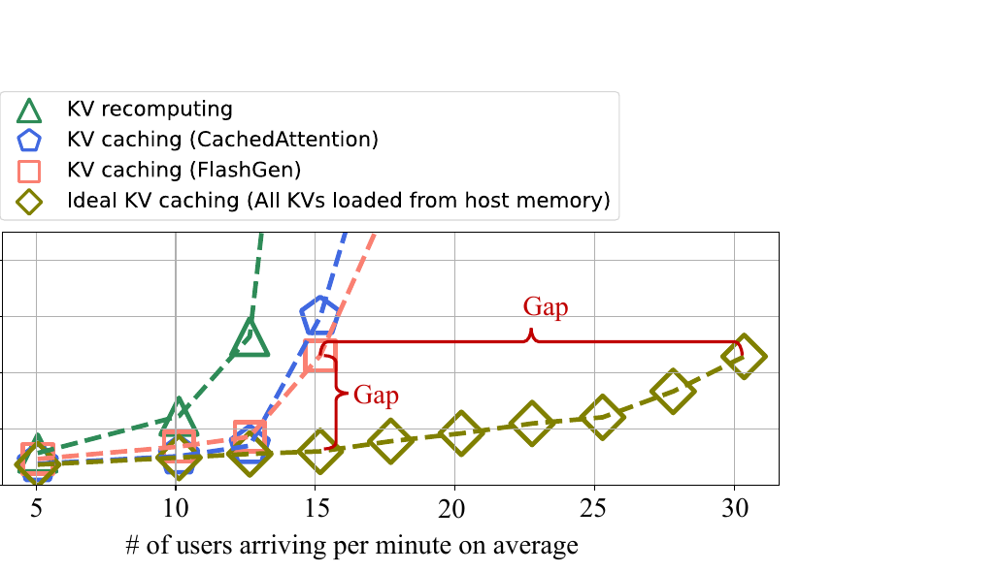

论文实测。Figure 3 使用 OPT 13B 单卡 A800 200 GB Host 内存和 1.5 GB/s SSD。CachedAttention 和 FlashGen 的响应时延最高为理想全 Host 内存方案的 3.8 倍，吞吐最高低 2 倍。该图说明加载路径已经成为系统瓶颈，不能据此推出跨节点或国产 NPU 的收益。

## 问题与根因

### 交互式多轮对话放大历史缓存工作集

论文的工业交互式工作负载包含超过 100 万轮对话。平均查询长度为 36 Token，平均回答长度为 45 Token；每个用户平均有 22.4 轮交互，中位数为 18 轮，P90 为 45 轮。作者统计，在其工作负载中，如果不缓存历史 KV，历史重算最高占总计算量的 93.1%。这说明多轮对话确实有显著的历史复用需求。

缓存规模同样随并发用户和对话轮数增长。作者只选取单张 80 GB A800 在消除冗余重算后仍能承载的到达率，避免把计算饱和混进存储分析。即便如此，并发缓存量最高仍达到 200 GB 性能层容量的 3.91 倍。Host 内存无法容纳全部历史缓存，SSD 回源不可避免。

### 时间局部性差使传统淘汰规则失灵

Bidaw 用加权重用距离描述两次访问同一用户 KV 之间经过的其他唯一 KV 总字节数。与按访问次数计数相比，这个定义把缓存对象大小纳入了复用距离，更符合两级存储的容量约束。在 OPT 13B 和每分钟 30 个新用户的实验中，80% 的 KV 访问加权重用距离超过 200 GB 性能层容量。性能层平均容纳约 40.1% 的 KV，但 FIFO LRU 和 CachedAttention 的 queue enhanced 策略命中率都只有约 20%。

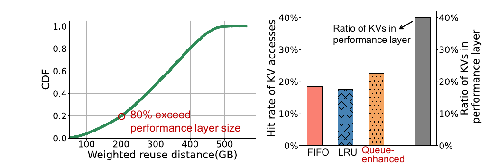

论文实测。Figure 6 左图显示 80% 的访问越过 200 GB 性能层，右图显示传统策略命中率约 20%。这里的低命中与真实人类交互的间歇性有关，不代表所有多轮对话或 Agent 工作负载都会呈现相同分布。

### I O 时间差异造成队头阻塞

缓存位置和历史长度共同决定加载时延。Host 内存到 GPU 的 PCIe 带宽约 30 GB/s，而论文平台的 SSD 带宽为 1.5 GB/s；不同请求加载的 Key 或 Value 张量又从不足 100 MB 延伸到 800 MB 以上。作者测得，即使只看 5 秒内到达的相邻请求，KV 加载时间的变异系数仍高于 90%。

传统 FCFS 调度无法利用这种差异。排在前面的 SSD 请求尚未完成回源时，后面已经位于 Host 内存的请求也不能进入 GPU，结果是 GPU 空转、Host 内存快速路径闲置，端到端排队时间被最慢请求拉长。单纯做逐层加载与计算重叠也不能完全解决这个问题：论文平台上首轮可重叠计算只有数十毫秒，而 SSD 读取可能持续数百毫秒。

## 核心抽象与系统架构

### 双向感知控制环

Bidaw 的新意可以压缩成两条窄接口，而不是一个庞大的新存储层。

第一条接口从存储到计算。存储层返回每个请求的 KV 位置和大小，调度器据此区分 Host 内存命中与 SSD 回源，并估算读取次序。第二条接口从计算到存储。计算引擎把最新一轮模型回答长度交给淘汰管理器，后者将其作为下一次访问距离下界的预测特征。存储效率张量选择则把计算图中的中间张量属性带入缓存放置决策。

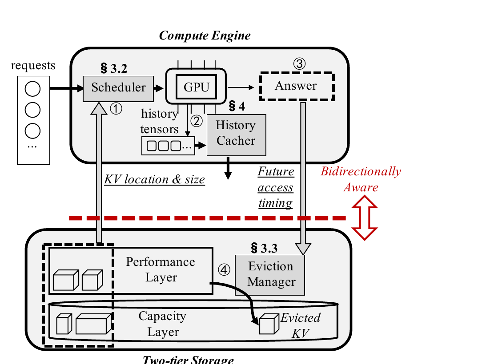

论文架构图。Figure 9 中，位置与大小向上进入 Scheduler，回答对应的未来访问时序信号向下进入 Eviction Manager。正文数据仍在 GPU Host 内存和 SSD 之间移动，论文没有实现跨节点远端显存直读。

系统工作流分为四步。请求到达后，调度器先读取 KV 位置和大小；计算完成后，历史张量写入两级存储；模型回答同时返回给用户并交给后台淘汰器；当 Host 内存空闲空间低于阈值时，淘汰器选择对象下沉到 SSD。Bidaw 延续 FlashGen 的包含式缓存，性能层中的对象在容量层保留副本，因此淘汰时不必重新写入完整正文。

这个抽象的价值在于把局部不可见问题变成可计算的调度输入。它没有改变 Transformer 的数学语义，也没有压缩或丢弃 KV。论文因此将 Bidaw 定义为无损缓存方案。

## 三项主要技术

### I O 感知双队列与 disk HRRN 调度

Bidaw 把请求分成 ready queue 和 preparing queue。KV 已在 Host 内存的请求进入 ready queue，可以快速加载到 GPU；KV 只在 SSD 的请求进入 preparing queue，完成 SSD 到 Host 内存搬运后再晋升。GPU 只从 ready queue 取任务，从而避免慢速回源挡住快速命中。

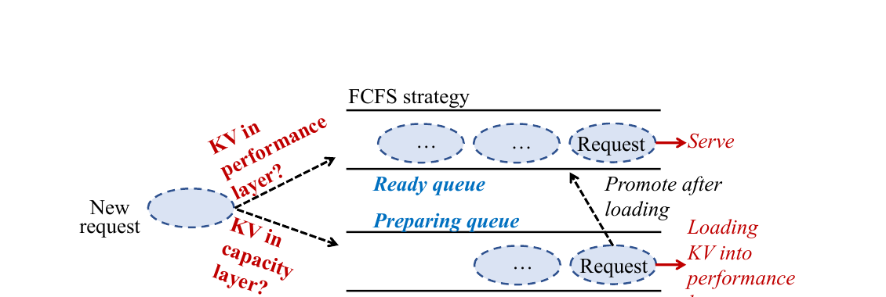

ready queue 继续采用 FCFS，但请求从 preparing queue 晋升后按原始到达时间插入，而不是按晋升时间排到末尾。这保留了等待时间的可见性。若队首请求放不进当前 GPU 空闲显存，调度器允许跳过它，选择后续可容纳请求。

preparing queue 需要同时处理短作业优先和大作业饥饿。Bidaw 为此定义 disk HRRN 评分：

```text
响应比 = 1 + 请求等待时间 / KV 大小
```

KV 越小，初始优先级越高；大 KV 等待越久，优先级也会持续上升。这里用 KV 大小代替了显式读取时间，隐含假设是同一容量层内带宽相对稳定，大小可以近似代表服务时间。

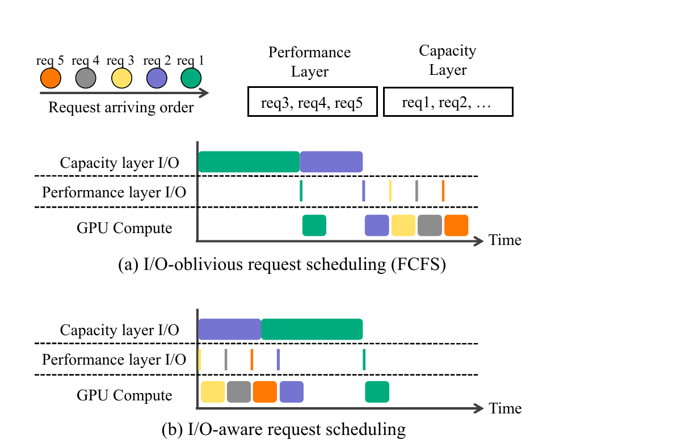

机制图。Figure 11 显示双队列先执行 Host 内存命中的请求 3 至 5，同时让较小的 SSD 请求 2 先回源。它证明了调度次序如何减少 GPU 空洞，但图中的五请求示例不是性能测量。

**机制证据卡**

| 项目 | 结论 |
|---|---|
| 解决的问题 | 慢 SSD 请求阻塞后续 Host 内存命中请求 |
| 状态变化 | 按缓存就绪状态分流，再按大小和等待时间安排容量层读取 |
| 为什么有效 | 让可立即运行的计算先占用 GPU，并把短回源请求更快转成可运行任务 |
| 论文实测 | OPT 13B 每分钟 30 个新用户时，平均排队时间从 5.76 秒降至 2.45 秒，降低 57.5% |
| 主要边界 | KV 大小只在带宽稳定时近似读取时延；论文没有纳入请求时限 租户优先级 网络拥塞和重算成本 |
| 项目判断 | 适配后采用，将位置 大小 实测排队和剩余时限并入 QueryPlan，而不是照搬固定评分式 |

### 回答长度辅助淘汰与幽灵缓存校准

人类会先阅读或听完模型回答，再组织下一轮问题。回答越长，下一次访问往往越晚；在这段时间里，其他用户的 KV 会被访问，加权重用距离随之增加。作者从 8 点到 20 点抽取 12 组 10 分钟轨迹，在不同用户到达率下统计上一轮回答长度与下一次访问的最小加权重用距离。去除离群点后，12 组 Spearman 秩相关系数在 0.94 至 0.98 之间。

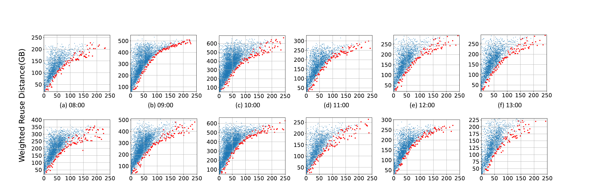

论文实测。Figure 12 的红点是每个回答长度对应的最小加权重用距离。相关的是距离下界，不是下一次访问距离的精确值，也不是命中概率本身。

Bidaw 没有把“回答长”直接等同于“应该淘汰”。系统先把重用距离分成三类：小距离区间的最优策略命中率为 1，极端距离区间为 0，中间的 promising 区间保留非零命中可能。后台幽灵缓存对已经闭合的历史窗口回放 Belady 最优淘汰，用过去轨迹估计各距离桶在当前内存大小和负载下的命中率。它并不读取当前请求的未来信息。

对每个用户，系统再根据历史访问分布估计下一次访问落入各桶的概率，并用回答长度预测出的距离下界裁掉不可能的近距离桶。剩余桶概率归一化后，与幽灵缓存给出的桶命中率相乘，得到总命中潜力。性能层不足时，系统淘汰命中潜力最低的对象。

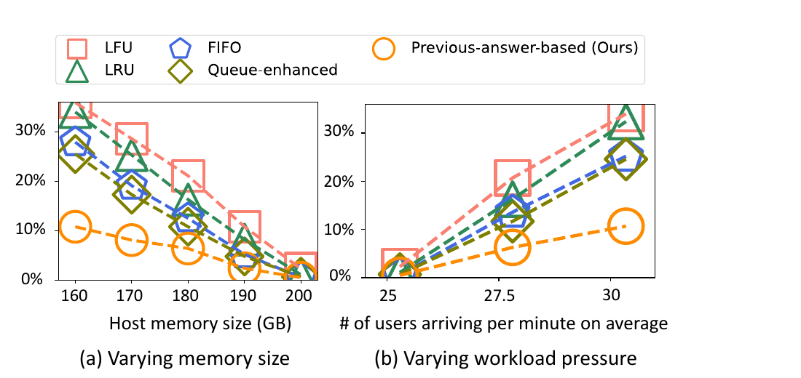

**机制证据卡**

| 项目 | 结论 |
|---|---|
| 解决的问题 | 交互式访问间隔长，FIFO LRU 和队列增强策略难以识别下一次再访问 |
| 状态变化 | 把计算侧回答长度转换为重用距离下界，再与在线历史分布和幽灵缓存桶命中率结合 |
| 为什么有效 | 利用人类阅读和思考时间提供的弱未来信号，减少把近期更可能复用的对象下沉到 SSD |
| 论文实测 | 相对 queue enhanced 策略，性能层未命中率最高降低 57.6%；相对常见通用策略最高降低 69.9% |
| 主要边界 | ShareGPT 无真实时间戳并采用泊松仿真后，该策略不再降低未命中率，说明收益依赖真实交互节奏 |
| 项目判断 | 作为可插拔预测特征试验，不应写成语义正确性条件或默认淘汰规则 |

### 存储效率张量缓存

历史计算会产生多种中间张量，KV 只是未来推理所需表示中的一种。Bidaw 定义每种候选张量的存储效率：单位缓存空间能够省下多少计算量。缓存更早的中间张量占用可能更小，但加载后需要额外算子把它重新变换成 KV；因此“更小”与“省算更多”需要一起衡量。

在 OPT 13B 和 2048 Token 历史上下文的逐层测量中，tensor 6 是归一化激活，只需一步转换为 KV。它的成本效率为 51.0 GFLOPs/MB，高于直接缓存 KV 的 30.5 GFLOPs/MB。Bidaw 将转换放到低优先级 CUDA Stream，并利用作者测得的 30% 以上空闲 SM，与其他请求推理并行执行。

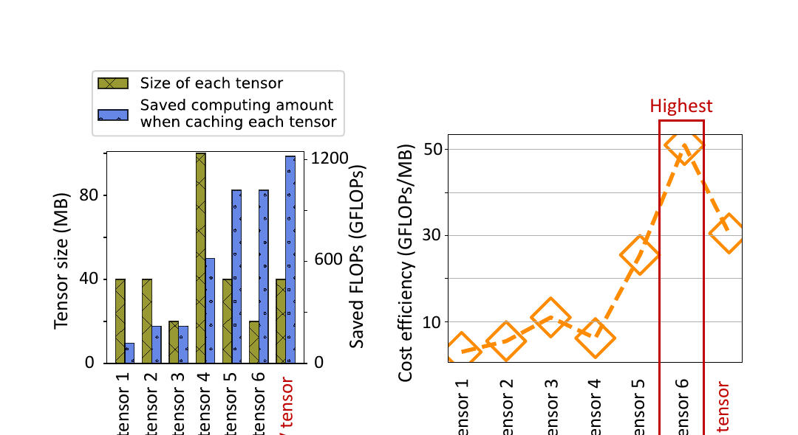

**机制证据卡**

| 项目 | 结论 |
|---|---|
| 解决的问题 | Host 内存容量有限，直接保存 KV 未必是单位空间最省计算的表示 |
| 资源交换 | 用少量 GPU 重构计算换取更低缓存占用和更多可保留历史 |
| 论文实测 | OPT 13B 上 tensor 6 成本效率为 51.0，KV 为 30.5；完整系统消融中该技术进一步带来 1.10 倍吞吐提升 |
| 主要边界 | 优化适用于论文测试的 MHA 模型；GQA（Grouped Query Attention，分组查询注意力，多组查询头共享较少的 Key 和 Value 头）模型的 KV 已较小，作者明确建议继续缓存 KV |
| 项目判断 | 建立按模型架构和设备能力选择缓存表示的机制，不固定为 tensor 6 |

### 支撑性实现

Bidaw 采用连续批处理，并避免淘汰等待队列中请求对应的数据。GPU 内存分配使用 256 Token 大块保存长度已知的历史和查询，用 16 Token 小块保存长度不可预测的回答；大块可以拆成小块并重新合并。这个混合粒度设计主要用于提高 CPU 到 GPU 的大块传输效率，同时控制回答阶段的显存碎片。它对实现有帮助，但不是论文双向感知的核心抽象。

## 实验结果与证据边界

### 实验平台和基线

| 维度 | 论文设置 |
|---|---|
| 计算平台 | 单台服务器 单张 80 GB NVIDIA A800 GPU 200 GB Host 内存 PCIe 4.0 |
| 容量层 | 4 块 SATA SSD 组成 RAID 5 实测带宽 1.5 GB/s |
| 模型 | OPT 6.7B Qwen 7B OPT 13B Qwen 14B OPT 30B |
| 工作负载 | 超过 100 万轮的工业交互式对话轨迹 ShareGPT 多轮对话公开数据 |
| 预热 | 运行前预热，使性能层先装入历史张量 |
| 基线 | vLLM CachedAttention FlashGen 理想全 Host 内存缓存 |
| 复现边界 | CachedAttention 和 FlashGen 为闭源系统，作者基于 vLLM 重新实现 |
| SSD 扩展实验 | 5 GB/s SSD 结果由 Host 内存拷贝并注入额外时延模拟，不是真实 5 GB/s NVMe 设备测量 |

### 端到端平均时延和吞吐

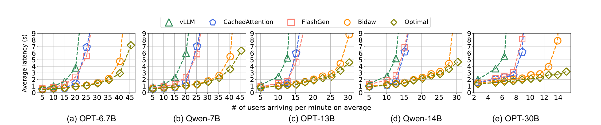

论文实测。Figure 15 的横轴范围随模型变化，不能跨子图直接比较相同到达率。作者报告 OPT 13B 响应时延最高降低 3.58 倍；跨模型在相近响应时延下，Bidaw 可承载的用户到达率提高 1.43 至 1.83 倍。

在自建交互式工作负载上，Bidaw 相对现有方案的平均响应时延最高降低 83.9%，相近响应时延下吞吐提高 1.43 至 1.83 倍。模拟 5 GB/s SSD 后，FlashGen 的吞吐从每分钟 15.18 个新用户提高到 20.23，Bidaw 从 27.81 提高到 30.35。更高 SSD 带宽缩小了差距，但没有在该仿真设置中消除协调收益。

ShareGPT 没有原始时间戳，论文使用泊松分布生成请求时间。Bidaw 相对 FlashGen 的吞吐提高 1.40 倍；平均响应时延相对 vLLM CachedAttention 和 FlashGen 分别最高降低 69.8% 65.8% 和 56.9%。作者同时指出，回答长度辅助淘汰在这个仿真负载上不再降低未命中率。公开负载结果支持调度机制具有一定普适性，也暴露了预测型淘汰对时间语义的依赖。

### 排队时间 开销和消融

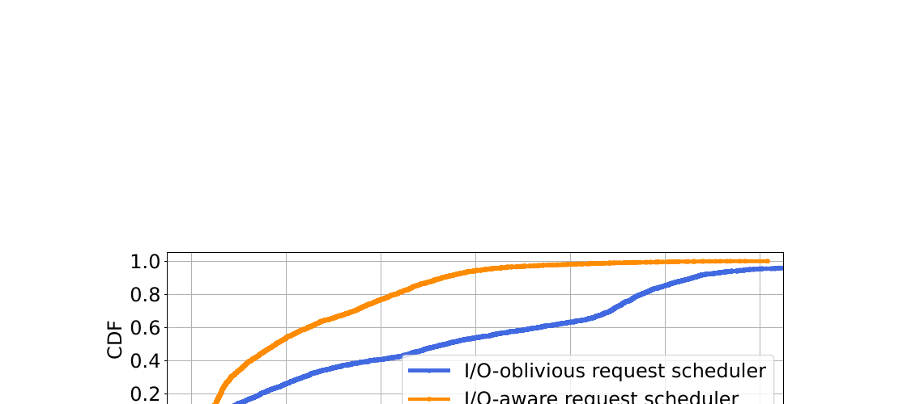

OPT 13B 每分钟 30 个新用户时，平均排队时间由 FCFS 的 5.76 秒降到 2.45 秒，降低 57.5%。这项实验直接验证双队列调度减少队头阻塞，而不是只靠更高命中率解释端到端收益。

调度器平均每次执行 0.62 毫秒。回答长度辅助淘汰每次平均 0.35 毫秒，后台幽灵缓存中的最优淘汰回放为 2.86 毫秒。存储效率张量转成 KV 需要数十毫秒，转换在低优先级 CUDA Stream 上运行。论文将这些开销与数百或数千毫秒的响应时延相比，但没有给出低时延短请求或高并发控制面下的 P99 开销。

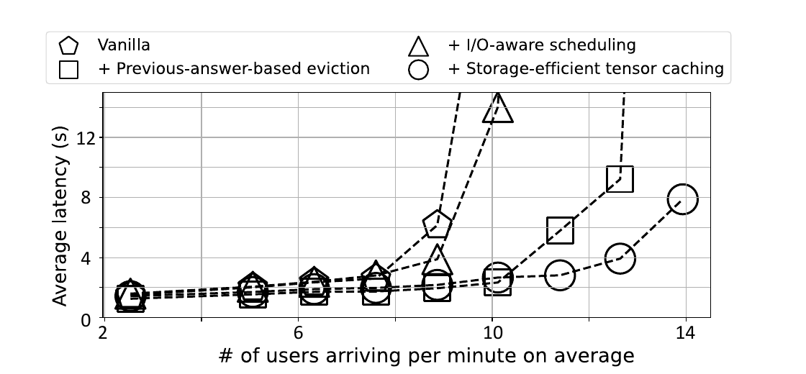

OPT 30B 消融中，单独加入 I O 感知调度使平均响应时延最高降低 1.58 倍；再加入回答长度辅助淘汰，吞吐提高 1.25 倍；最后加入存储效率张量缓存，吞吐再提高 1.10 倍。这些倍率来自逐步添加机制的同一消融链，不能相乘后宣称为新的端到端总收益。

### 尾部时延

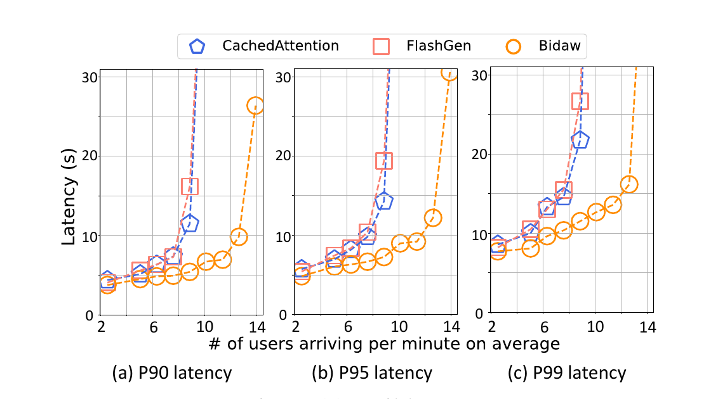

在 OPT 30B 实验中，Bidaw 相对 CachedAttention 的 P90 P95 P99 时延分别降低 52.96% 49.30% 和 47.03%；相对 FlashGen 分别降低 66.63% 62.64% 和 56.81%。该结果说明调度重排没有以明显恶化大请求尾部为代价。论文仍未给出按租户或按上下文长度分组的公平性，也没有报告请求截止期违约率。

### 论文证据究竟支持什么

| 论文主张 | 直接证据 | 支持的结论 | 不支持的外推 |
|---|---|---|---|
| 两级加载已成为瓶颈 | Figure 3 单 A800 与 1.5 GB/s SSD 对比 | 在该交互式负载中，加载协调不足显著拉高响应时延并降低吞吐 | 不能推出所有 KVCache 系统都受 SSD 限制 |
| I O 感知调度减少阻塞 | Figure 19 与 Figure 21 | 双队列和大小等待联合排序直接降低排队时间 | 不能证明在多租户 SLO 或跨节点拥塞下仍然最优 |
| 回答长度能帮助淘汰 | Figure 12 与 Figure 18 | 真实人类交互轨迹中，回答长度与重用距离下界相关，并能改善 Host 内存命中 | 不能用于无时间戳轨迹 Agent 工具调用或异步消息的普遍预测 |
| 缓存中间张量更省空间 | Figure 14 与 Figure 21 | OPT 等 MHA 模型上可用少量重构换取更高单位空间计算节省 | 不适用于作者已经排除的 GQA，也未覆盖 MLA（Multi Head Latent Attention，多头潜在注意力，通过潜变量压缩 KV 表示）和国产 NPU 算子成本 |
| Bidaw 改善端到端性能 | Figure 15 Figure 17 Figure 22 | 单机单卡测试中平均时延 吞吐和尾部时延均优于重实现基线 | 不证明跨节点直通 Host CPU 零数据拷贝 TP 多卡同步或前后台 QoS |

## 技术亮点与主要局限

### 亮点一 把 I O 就绪状态变成调度输入

很多缓存系统只把命中返回为布尔值。Bidaw 进一步暴露命中位于 Host 内存还是 SSD，以及对象有多大。调度器由此可以区分“已命中但尚不可运行”和“已就绪”。从系统设计看，这比单纯提高命中率更重要，因为它直接减少关键路径上的等待和 GPU 空洞。

对应局限是状态粒度仍然较粗。位置只有性能层和容量层两类，读取时间主要由 KV 大小近似。多设备共享上行口 队列深度 NUMA 距离 SSD 并发度和网络拥塞都没有进入模型。

### 亮点二 用业务语义改善存储放置

回答长度不是存储访问日志，但它能描述人类完成下一轮交互前可能等待多久。论文把这一业务特征转成重用距离下界，再通过在线历史桶和幽灵缓存校准命中潜力。这个设计避免了直接用单一阈值淘汰。

对应局限也很明确。相关性来自单一工业合作方的真实交互轨迹，论文没有公开用户类型 业务场景和时间跨度的分层结果。公开 ShareGPT 的时间戳只能仿真，预测收益随之消失。对于流式语音 自动 Agent 工具调用 离线批处理或消息异步到达，回答长度与下一次访问时间可能脱钩。

### 亮点三 把缓存表示纳入资源权衡

Bidaw 没有把 KV 视为唯一可保存对象，而是比较多个历史中间张量的空间占用和可节省计算量。这个原则可扩展到量化表示 压缩表示或模型特定潜在表示。

对应局限是结果依赖模型结构和设备空闲算力。作者明确指出 GQA 模型应直接缓存 KV。现代模型还广泛使用 GQA 和 MLA，tensor 6 不能当作通用方案。低优先级 CUDA Stream 也不等于对前台 TPOT（Time Per Output Token，每个输出 Token 的生成耗时）零干扰，论文没有单独报告这一指标。

### 亮点四 用消融把收益归因到具体机制

论文分别测量排队时间 未命中率 控制开销和逐步消融。读者可以看出调度 淘汰和表示选择分别改变了哪种资源，而不是只看到一个端到端倍率。

对应局限是基线并非原系统二进制。CachedAttention 和 FlashGen 闭源，作者在 vLLM 上重实现。结果仍有参考价值，但版本差异 参数调优和未公开实现细节可能影响绝对差距。

## 论文没有解决的问题

1. **跨节点数据路径**。Bidaw 是单机 GPU Host 内存 SSD 三级物理路径，没有分布式目录 远端 HBM 或 DDR 访问 网络拓扑和租约语义。
2. **多卡协同**。评测只有单张 A800，没有张量并行下各卡命中不一致 加载偏斜和集合通信等待。
3. **消费安全**。论文默认同一用户历史 KV 可继续使用，没有模型 Tokenizer 提示词模板 LoRA 版本 Ready 位和租约有效性校验。
4. **故障与取消**。SSD 读取失败 主机重启 GPU 异常 请求取消和淘汰进行中的一致性没有形成状态机或恢复协议。
5. **前后台资源隔离**。低优先级 CUDA Stream 只说明调度优先级，未测后台转换与 SSD I O 对前台 TPOT 和显存带宽的干扰。
6. **真实 NVMe 与长期运行**。论文容量层是 SATA RAID 5，5 GB/s 结果为仿真。没有 NVMe SSD 直达 写放大 盘寿命 重启预热和长稳运行数据。
7. **加载与重算的统一选择**。Bidaw 优先复用历史缓存，没有把完整加载开销与本地重算时间放到同一个请求级成本模型中。

## 对统一异构 KVCache 项目的启发

### 可以直接采用的原则

第一，缓存查询结果应区分发现 就绪 加载中和可消费状态。QueryPlan 不能只返回命中或未命中。位置 大小 预计完成时间和实际路径都应成为明确字段。

第二，计算调度与存储放置需要共享少量稳定信号。框架提供真实布局 请求剩余时限和重算成本；存储池提供介质位置 可用带宽 排队与完整性状态。双方仍保留清晰责任边界，不需要共享全部内部实现。

第三，评估缓存收益必须同时看命中率和请求关键路径。高命中如果伴随长时间回源或排队，仍可能让 TTFT（Time To First Token，首 Token 响应时间）变差。Bidaw 的 Figure 19 说明，排队时间本身就是需要独立测量的指标。

### 需要改造后采用的机制

**双队列调度**可以映射到项目的加载准入流程，但队列不应只按 Host 与 SSD 二分。项目还要区分本地 HBM 本地 DDR 本地 SSD 远端显存和远端存储，并记录真实可用带宽 排队时间 首批到达时间和请求截止期。disk HRRN 的大小项可替换为 CostEvaluator（成本预估模型，在决策前量化各加载路径与重算开销）给出的预计完成时间。

**回答长度辅助淘汰**适合做 Tiering（分层存储技术，根据复用概率 加载成本和介质能力决定缓存放置）的可插拔特征。更稳妥的输入还包括真实交互间隔 前缀热度 会话状态 请求来源和租户策略。新特征先在影子模式中输出预测，不直接影响生产淘汰；只有跨天和跨业务验证稳定后才进入实际决策。

**存储效率表示选择**应改造成模型能力矩阵。MHA GQA MLA 以及量化 KV 的张量大小 重构算子时延 精度和前台干扰需要分别测量。系统按模型和设备组合选择 KV 中间激活或压缩表示，不把论文的 tensor 6 写成固定格式。

### 不应直接复制的实现

Bidaw 的包含式缓存会在 SSD 保留性能层对象副本，适合单机快速淘汰，但不应直接成为项目多介质策略。远端副本 NVMe SSD 容量 数据耐久性和写放大需要分开管理，是否保留副本应由故障目标和加载成本决定。

论文的数据路径经过 Host 内存，不能作为 Host CPU 零数据拷贝（CPU 只负责下发控制指令，不参与正文数据搬运，Host Payload Touch Bytes 严格为 0）的实现样板。项目还要探索 NVMe SSD 与 NPU HBM 之间的设备直达；这需要底层 DMA 能力 对齐 保护域和完成语义验证。

回答长度不应成为消费资格或强一致性条件。它只是统计特征，预测错误最多应该影响性能，不能决定错误版本 KV 是否可读。

## 对项目立项的证据价值

### 必要性证据

论文独立确认了三个项目痛点。交互式多轮对话会形成长生命周期且容量快速增长的历史缓存；两级介质的带宽差异会把 KV 加载暴露到响应关键路径；计算调度和存储放置若各自只做局部最优，会同时出现队头阻塞和低命中。Figure 3 的 3.8 倍理想差距与 Figure 19 的 57.5% 排队时间下降说明，缓存系统需要统一看计算与存储，而不能只建设一个大容量池。

### 可行性证据

Bidaw 证明了跨层只交换少量信号就能改变端到端结果。位置和大小足以让调度器减少阻塞，回答长度等业务特征能够在特定真实工作负载上改善淘汰，表示选择能用部分闲置计算换容量。它为项目的动态选路和分层放置提供了原理支持。

### 差异化空间

论文没有覆盖跨节点直通 多卡状态同步 多维语义一致性 故障租约和前后台服务质量。这些问题正处于本项目范围内。项目的研究空间不是重复实现 Bidaw，而是把“计算存储协同”扩展到异构多介质和分布式环境，并把收益判断 消费安全和故障回退放入同一执行闭环。

### 仍需项目自行证明的主张

这里涉及四条项目数据路径：URMA（通用远程直接内存访问，用户态的高性能 RDMA 驱动接口与通信协议）、UBMEM（统一总线内存直通共享协议，支持跨节点与异构设备直接共享内存地址空间）、Direct View（远端直读，跨节点直接读取远端显存中的 KV 数据，不产生本地显存拷贝）和 Copy to HBM（拷贝到本地显存，通过 DMA 将远端 KV 数据完整搬运至本地高带宽显存）。Bidaw 不支持以下项目结论：上述路径能够降低端到端 TTFT，或 Direct View 优于 Copy to HBM；张量并行 TP 等于 8 时多卡状态同步 P99 满足项目要求；NVMe SSD 直达能扩展可服务容量；前后台混压下 TPOT 干扰率低于 3%；E3（全链路前后台混压验证阶段）能够达到 TTFT 降低至少 20% 且 QPS 提高至少 10%。这些都是项目目标或待验证命题，必须通过自己的实现和同条件 A B 实验取得证据。

### 立项判断

**必要性** 论文支持“加载路径和跨层局部决策会限制多轮 KVCache 复用收益”。

**可行性** 论文支持“计算和存储交换位置 大小与业务复用信号后，可以改善排队和放置”。

**差异化** 分布式异构路径 语义安全 多卡协同和混压服务质量仍未解决，与项目范围直接重合。

**举证责任** 项目仍需独立测量国产 NPU 跨节点和 NVMe SSD 路径，不能把 Bidaw 的单机 A800 结果当作项目成绩。

## 建议优先开展的验证

### 验证一 多介质就绪状态与请求级调度

假设是：只要 QueryPlan 同时获得介质位置 实测排队 预计首批到达和剩余时限，就能比 FCFS 和简单 Host SSD 双队列进一步降低 TTFT P99，而不造成大对象饥饿。

变量包括 KV 大小 介质位置 并发度 SSD 或网络背景流量和请求时限。基线至少包含 FCFS 仅按位置双队列 Bidaw 式 disk HRRN 以及项目成本模型调度。测量平均与 P99 排队时间 TTFT GPU 空转率 超时率和最大等待时间。如果成本模型只改善平均值却恶化超时或饥饿，应收缩调度自由度。

### 验证二 复用预测特征的跨工作负载稳定性

假设是：回答长度只在真实人类在环服务中稳定有效，Agent 工具调用和异步消息需要不同特征。对真实时间戳轨迹分别测试 LRU queue enhanced 回答长度单特征和多特征模型，按天 业务和负载压力切分训练与验证窗口。测量 Host 或 HBM 未命中率 SSD 读取字节数 错误淘汰率和分布漂移。若回答长度在跨天验证中失效，应只保留影子观测，不进入生产淘汰。

### 验证三 按模型选择缓存表示

假设是：MHA GQA 和 MLA 的最优缓存表示不同，且重构收益取决于 NPU 算子和前台负载。比较直接 KV 中间激活 量化 KV 等候选表示，测量每 Token 字节数 重构时延 HBM 占用 TTFT 和 TPOT 干扰。只有单位空间节省的重算时间大于转换和干扰成本时才准入该表示。

### 验证四 两节点混压端到端对照

假设是：跨层感知只有在真实数据路径上减少暴露加载和排队，才会转化为项目 E3 指标。使用固定 Mooncake 基线与增强版，在同一模型 请求轨迹 设备和前后台压力下对照，记录预测路径 actual path 正文字节流 Host CPU 参与度 TTFT QPS TPOT 和 P99。若收益只来自更高命中而数据路径仍形成 Host 中转或后台干扰，则不能判定项目主路径成立。

## 附录 证据索引

| 证据 | 原文位置 | 分类 | 条件 | 本报告用途 |
|---|---|---|---|---|
| 93.1% 历史冗余计算 | PDF 第 2 页 引言 | 论文工作负载测量 | 工业交互式负载 | 说明历史缓存必要性 |
| 两级方案相对理想时延最高 3.8 倍 吞吐最高低 2 倍 | PDF 第 4 页 Figure 3 | 论文实测 | OPT 13B A800 200 GB Host 1.5 GB/s SSD | 建立加载瓶颈 |
| 80% 访问重用距离超过 200 GB | PDF 第 5 页 Figure 6 | 论文实测 | OPT 13B 每分钟 30 个新用户 | 说明传统局部性假设不足 |
| 回答长度与距离下界相关系数 0.94 至 0.98 | PDF 第 8 页 Figure 12 | 论文实测相关性 | 12 组 10 分钟真实时间戳轨迹 | 支持业务特征辅助淘汰 |
| tensor 6 成本效率 51.0 KV 为 30.5 | PDF 第 10 页 Figure 14 | 论文微基准 | OPT 13B MHA 2048 Token | 支持按表示做空间计算权衡 |
| 响应时延最高降低 3.58 倍 吞吐最高提高 1.83 倍 | PDF 第 11 至 12 页 Figure 15 | 论文端到端实测 | 单 A800 五种模型 自建工作负载 | 支持单机方案有效性 |
| ShareGPT 吞吐提高 1.40 倍 淘汰预测不再降未命中 | PDF 第 12 页 Figure 17 | 论文实测与作者解释 | 时间戳由泊松分布仿真 | 确认预测机制的适用边界 |
| 未命中率最高降低 57.6% 和 69.9% | PDF 第 13 页 Figure 18 | 论文实测 | OPT 13B 不同 Host 容量和压力 | 验证淘汰机制 |
| 平均排队时间 5.76 秒降至 2.45 秒 | PDF 第 13 页 Figure 19 | 论文实测 | OPT 13B 每分钟 30 个新用户 | 验证调度机制 |
| 调度 0.62 毫秒 淘汰 0.35 毫秒 幽灵回放 2.86 毫秒 | PDF 第 13 页 Figure 20 | 论文实测 | OPT 13B 每分钟 30 个新用户 | 评估控制开销 |
| 三项机制分别带来 1.58 倍时延 1.25 倍吞吐 1.10 倍吞吐改善 | PDF 第 13 至 14 页 Figure 21 | 论文消融实测 | OPT 30B 逐步加入机制 | 收益归因 |
| P99 相对两基线降低 47.03% 和 56.81% | PDF 第 14 页 Figure 22 | 论文尾部时延实测 | OPT 30B | 检查调度公平性风险 |

## 附录 证据分类说明

本文中的“论文事实”指论文明确陈述的设计 工作负载或实现；“论文实测”指作者在给定平台和负载下报告的测量结果；“分析判断”是根据机制和实验边界做出的解释；“项目建议”用于指导统一异构 KVCache 存储与调度底座设计；“项目目标”仍需本项目实现和验收。以上类别不互相替代。

原论文：[同目录 PDF](<[FAST 2026] Bidaw Enhancing Key-Value Caching for Interactive LLM Serving via Bidirectional Computation–Storage Awareness.pdf>)
