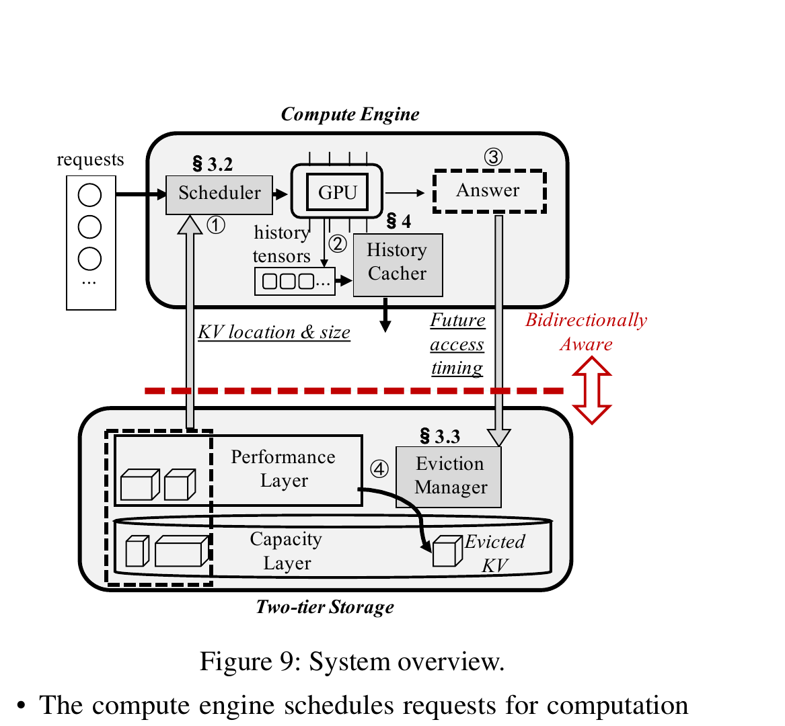
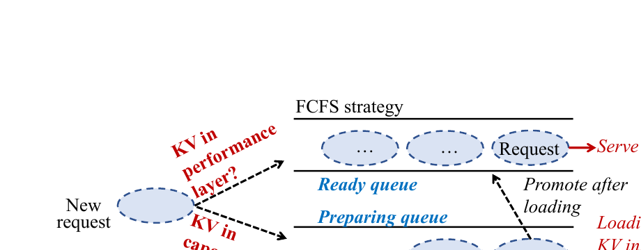
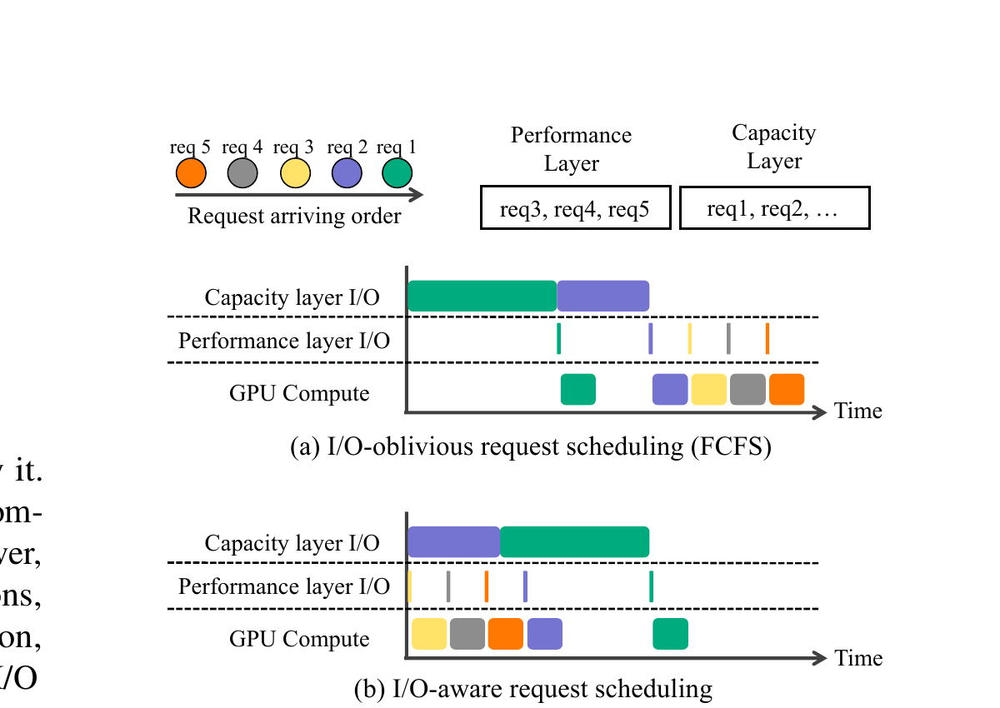
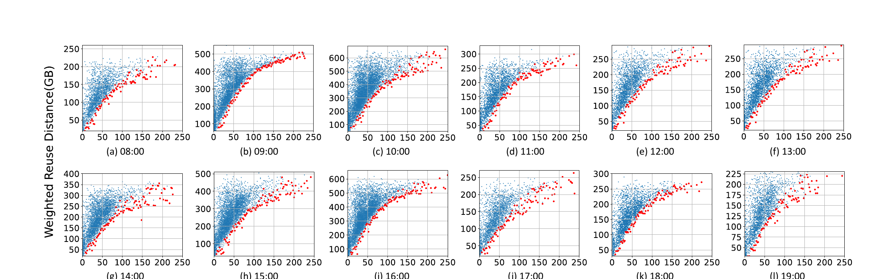
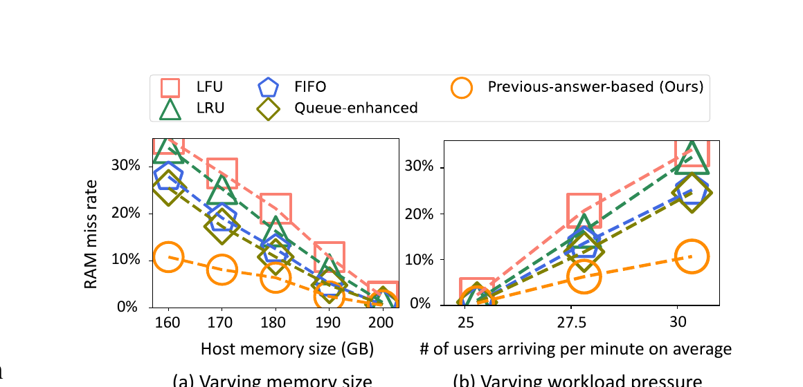
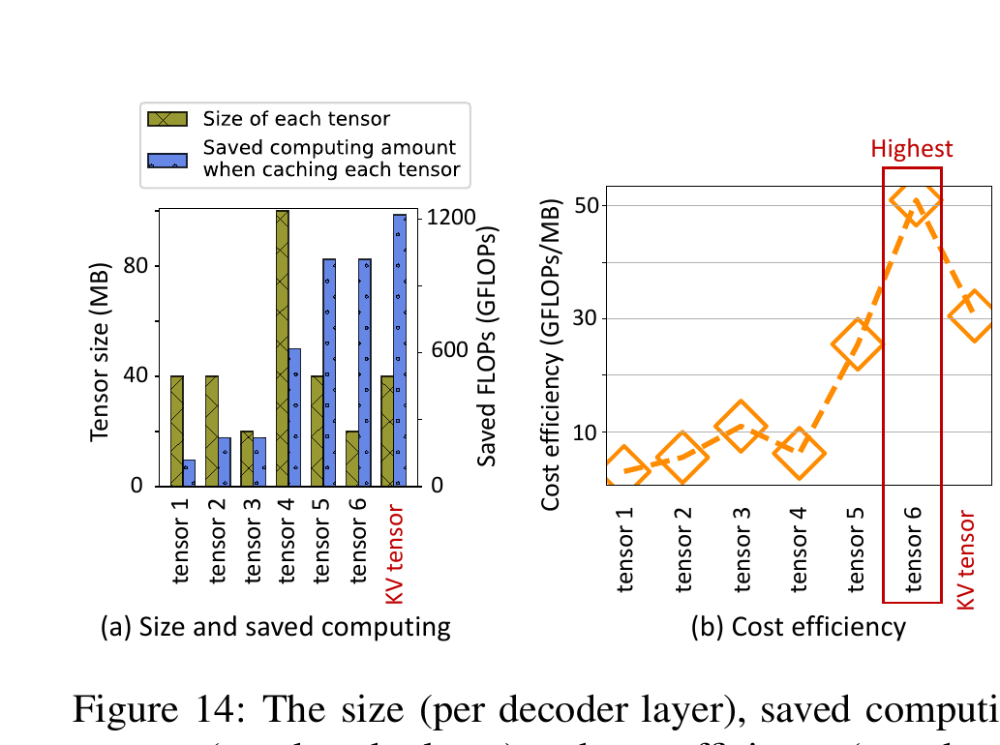
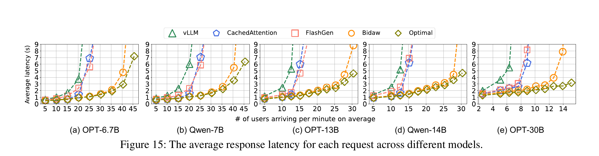
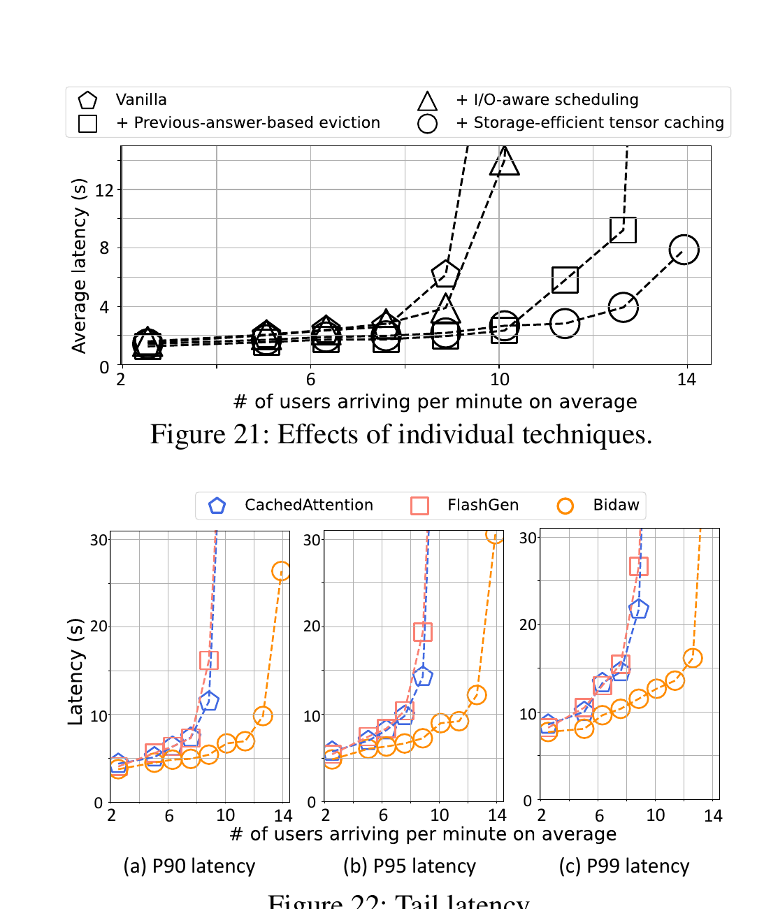

# Bidaw（FAST '26）：面向交互式大模型服务的计算—存储双向感知 KVCache 解构与项目启示

> **原文**：[Bidaw: Enhancing Key-Value Caching for Interactive LLM Serving via Bidirectional Computation–Storage Awareness](<[FAST 2026] Bidaw Enhancing Key-Value Caching for Interactive LLM Serving via Bidirectional Computation–Storage Awareness.pdf>)  
> **会议**：24th USENIX Conference on File and Storage Technologies（FAST 2026）  
> **证据口径**：论文事实与实测结果均来自同目录原始 PDF。项目判断另行标注，不把项目目标写成论文结论。  
> **版本说明**：本报告依据原始论文重新分析，参考 OSDI 2026 同目录解构稿的组织方式与细节尺度；未读取或复用同目录其他 Bidaw 解构报告正文及其图像。

本文中的 **KVCache** 指大模型注意力键值缓存，即自回归生成过程中保存的历史 Key/Value 激活状态，用来避免后续 Token 重复计算注意力。Bidaw 关注单机部署下的多轮交互服务：GPU 显存放不下长期积累的历史 KV，于是系统用 Host 内存作为性能层、SSD 作为容量层。论文追问的是：缓存已经存在，加载路径为什么仍会拖慢在线服务？

为避免证据混用，本文采用以下标记：

- **论文事实**：论文明确给出的设计、流程或实验条件；
- **实测数据**：论文实验直接测得的数字；
- **分析判断**：基于论文机制和实验边界形成的解释；
- **项目建议**：面向统一异构 KVCache 存储与调度底座的采用、改造或验证建议；
- **待验证问题**：论文没有给出足够证据、需要本项目自行实测的问题。

---

## 1. 一页读懂论文

### 1.1 论文解决什么问题

交互式大模型服务需要反复读取同一用户此前多轮对话产生的历史 KV。只靠 GPU 显存无法长期保存这些数据；只靠 Host 内存也会在并发用户增多后容量不足，因此 CachedAttention、FlashGen 一类系统把 Host 内存和 SSD 组成两级缓存。

问题在于，SSD 扩容同时把慢 I/O 带进了推理关键路径。论文在一张 A800、200 GB Host 内存、1.5 GB/s SSD、OPT-13B 的条件下测得：现有两级缓存方案的响应时延最高达到“所有历史 KV 都从 Host 内存加载”这一模拟理想方案的 3.8 倍，吞吐最高低 2.0 倍（原文 §2.1，Fig. 3）。换句话说，系统虽然省掉了大量历史重算，却可能把等待时间转移到 SSD 加载和请求排队上。

### 1.2 根因是什么

可见症状是 SSD 慢、Host 内存命中率低、请求排队时间长。论文给出的根因更具体：**计算引擎和两级存储彼此看不到对方掌握的决策信息**。

- 计算引擎不知道一个请求的历史 KV 位于 Host 内存还是 SSD，也不把 KV 大小纳入调度。同一队列中，慢 SSD 请求会阻塞后面本可快速启动的 Host 内存命中请求。
- 存储系统只看到过去的 KV 访问和当前等待队列，却看不到模型刚生成了多长的回答。交互式对话的再访问受用户阅读、理解和组织下一问题的时间影响，单纯依赖 LRU、FIFO 或等待队列很难预测谁会先回来。

单纯增加 SSD 带宽只能缩短单次加载，无法自动修复错误的请求顺序，也不会使淘汰器获得新的未来访问线索。

### 1.3 核心洞察是什么

计算侧和存储侧各自掌握一半有用信息：存储侧知道 KV 的位置与大小，计算侧知道模型回答长度及用户交互进度。只要把这两类信息显式交换，系统就能同时改善“先服务谁”和“该淘汰谁”两个决策。

论文把这种接口称为 **bidirectional computation–storage awareness**。它的价值不在于某个新硬件通路，而在于让调度与淘汰从“只看本层状态”变为“读取跨层语义后再决策”。

### 1.4 核心抽象：计算—存储双向感知

Bidaw 的核心抽象是一组窄而明确的跨层提示：

```text
两级存储 -> 计算调度器：KV 所在层 + KV 字节规模
计算引擎 -> 存储淘汰器：上一轮模型回答长度 -> 预计下次访问距离下界

位置与大小用于请求排序
回答长度用于估算下一次命中潜力
```

存储侧向计算侧输出的是数据位置与搬运成本线索；计算侧向存储侧输出的是未来访问线索。两个方向分别作用于不同问题，不能合并为一个模糊的“智能缓存策略”。

### 1.5 三项关键优化方法速览

#### 方法一：按存储层分队列，并按 KV 大小与等待时间安排 SSD 读取

- **问题**：先到的慢 SSD 请求占住队头，后续 Host 内存命中请求无法及时进入 GPU。
- **方法**：把请求分为“可执行队列”和“准备队列”；前者保存 Host 内存命中请求，后者保存需要从 SSD 提升的数据。SSD 读取使用 `1 + 等待时间 / KV 大小` 作为优先级，先处理小对象，同时让等待已久的大对象逐步升权。
- **效果**：慢速容量层 I/O 不再串行阻塞快速请求，GPU 空转和请求队头阻塞下降。该方法改变的是执行顺序，不会缩短 SSD 本身的物理传输时间。
- **关键证据**：OPT-13B、30 users/min 条件下，平均排队时间从 5.76 s 降到 2.45 s，下降 57.5%；消融实验中，仅加入该调度方法，平均响应时延最高降低 1.58 倍（Fig. 19、Fig. 21）。

#### 方法二：用上一轮回答长度估计重用距离，并按命中潜力淘汰

- **问题**：KV 两次访问之间常隔着大量其他用户的数据，传统近期性策略难以判断哪个用户会先发起下一轮请求。
- **方法**：用上一轮模型回答长度预测下一次访问的加权重用距离下界，再结合后台幽灵缓存对不同重用距离区间的可命中概率进行校准，淘汰预测命中潜力最低的 KV。
- **效果**：Host 内存优先保留更可能较早再次访问的数据，减少从 SSD 回源的次数。
- **关键证据**：12 组不同时段与到达率数据中，回答长度与最小加权重用距离的 Spearman 系数为 0.94～0.98；未命中率相对 queue-enhanced 策略最高降低 57.6%，相对通用淘汰策略最高降低 69.9%（Fig. 12、Fig. 18）。

#### 方法三：按“每 MB 可节省计算量”选择历史张量

- **问题**：直接缓存 KV 能省下最多恢复计算，但单位存储空间未必最划算；Host 内存容量有限时，缓存对象本身也需要选择。
- **方法**：对推理产生的可互相转换中间张量计算 `节省计算量 / 占用空间`，缓存单位空间收益更高的归一化激活；加载后再通过一步计算恢复 KV。
- **效果**：用少量恢复计算换取更小的缓存对象，使性能层容纳更多用户历史。
- **关键证据**：OPT-13B、2048-token 历史上下文中，论文所称 tensor 6 的成本效率为 51.0 GFLOPs/MB，KV 为 30.5 GFLOPs/MB；消融中该方法使吞吐进一步提升 1.10 倍（Fig. 14、Fig. 21）。

### 1.6 最重要的实验结果

| 结论 | 论文条件 | 实测结果 | 正确解读 |
|---|---|---:|---|
| 两级缓存的加载路径本身会成为瓶颈 | A800、OPT-13B、200 GB Host 内存、1.5 GB/s SSD | 现有方案时延最高为理想全 Host 内存方案的 3.8×，吞吐最高低 2.0× | 证明“缓存命中”不等于“服务加速”，存储层级和调度会改变结果 |
| Bidaw 改善端到端性能 | 5 个 OPT/Qwen 模型，自有交互式负载 | 响应时延最高降低 3.58×；相似时延下可承载用户到达率提高 1.43×～1.83× | 这是三项方法叠加后的系统结果，不能全部归给某一项机制 |
| 调度直接减少排队 | OPT-13B，30 users/min | 5.76 s -> 2.45 s，下降 57.5% | 证明双队列与 SSD 读取排序确实缓解队头阻塞 |
| 回答长度提示改善淘汰 | OPT-13B，改变 Host 内存和负载压力 | 未命中率相对 queue-enhanced 最高下降 57.6% | 证明交互语义可以转化为缓存决策信号，但依赖真实时间关系 |
| 尾部时延同步改善 | OPT-30B | P99 相对 CachedAttention / FlashGen 分别下降 47.03% / 56.81% | 说明避免慢请求阻塞对尾部请求有价值；尚不能外推到多租户 SLO 隔离 |

### 1.7 最大局限

这些结果有清楚的适用范围。

1. 主要结果来自单机、单 A800、PCIe 4.0、Host 内存加 SATA RAID-5。论文没有测试跨节点远端内存、RDMA、国产 NPU、多卡张量并行或前后台混压。
2. 回答长度提示依赖真实的人机交互时间。ShareGPT 没有时间戳，论文用泊松分布合成到达时间后，这项淘汰策略不再降低未命中率。该结果直接说明：相关性不能脱离工作负载时间结构复用。
3. “存储效率张量”只在论文测得的多头注意力模型上有利。对 GQA（Grouped Query Attention，分组查询注意力）模型，KV 本身已经更小，论文建议直接缓存 KV。
4. CachedAttention 和 FlashGen 是闭源系统，论文作者基于 vLLM 重实现。结果仍有参考价值，但复现公平性不能只靠论文中的系统名称判断。

### 1.8 为什么与本项目相关

Bidaw 给项目提供了三类证据：

- **必要性证据**：SSD 扩容后，如果调度器看不到数据位置和加载成本，Saved-Prefill（首字生成预计算节省，即复用 KVCache 避免重复计算 Prompt）可能被排队与加载开销抵消。
- **可行性证据**：把存储位置、字节量和未来访问线索暴露给调度与分层策略，能够降低排队和未命中率。跨层信息交换的方向是可行的。
- **差异化空间**：Bidaw 没有处理 Host CPU 零数据拷贝、跨节点传输、动态选择远端直读/拷贝/重算、六维语义一致性、多卡状态同步和前后台服务质量。这些仍是本项目必须独立解决的问题。
- **剩余举证责任**：论文不能证明本项目 E3（全链路前后台混压验证）阶段的 TTFT（Time To First Token，首 Token 响应时间）降低、QPS（每秒完成的请求数）提升或 TPOT（Time Per Output Token，每个输出 Token 的生成耗时）干扰门槛，也不能证明国产硬件上的直接数据通路和微秒级决策已经成立。

---

## 2. 论文背景、对象和评价边界

### 2.1 基本信息

- **作者**：Shipeng Hu、Guangyan Zhang、Yuqi Zhou、Yaya Wei、Ziyan Zhong、Jike Chen；
- **机构**：清华大学、中国地质大学（北京）、中国电信全渠道运营中心；
- **会议**：FAST 2026；
- **页数**：PDF 共 17 页，其中第 1 页为 USENIX 封面，正文印刷页码为 101～116；
- **实现基础**：vLLM；
- **目标对象**：同一用户多轮对话产生的历史 KV，而不是跨用户语义相似提示词复用。

### 2.2 为什么交互式对话会放大缓存问题

论文的自有工作负载覆盖超过一百万轮真实会话。平均 query 长度为 36 tokens，平均 response 长度为 45 tokens；每个用户的会话轮数平均/中位数/P90 为 22/18/45，正文另一处给出平均 22.4 轮。随着轮数增加，如果不保存历史 KV，每一轮都要重算此前对话；论文报告这部分冗余计算最高可占总计算量的 93.1%（Abstract、§1、§2.2）。

这类缓存的生命周期与普通网页对象不同。用户不会连续无间隔地发完所有问题，而是在每轮回答后阅读、理解、思考，再发下一轮。单个用户的 KV 因而会在两级存储中驻留很久，但访问又是间歇性的。并发用户越多，两次访问之间插入的其他 KV 越多，近期访问不再是强预测信号。

### 2.3 三个工作负载观察

#### 观察一：同时驻留的数据很快超过 Host 内存

论文把 Host 内存规模设为 200 GB，约为 80 GB GPU 显存的 2.5 倍。随着用户到达率增加，并发缓存 KV 总量可达到性能层容量的 3.91 倍（Fig. 5）。SSD 容量层不是偶发兜底，而是持续参与在线读取。

#### 观察二：KV 访问的时间局部性弱

论文用“加权重用距离”描述目标 KV 两次访问之间，其他唯一 KV 的访问总字节数。OPT-13B、30 users/min 时，80% KV 访问的加权重用距离超过 200 GB；性能层平均只能容纳约 40.1% 的 KV，FIFO、LRU 和 queue-enhanced 的命中率却只有约 20%（Fig. 6）。

#### 观察三：不同请求的加载时间差异很大

容量层和性能层带宽不同，历史对话长度又使 KV 大小从不足 100 MB 跨越到 800 MB 以上。论文测得，短到 5 秒的到达窗口内，请求加载时间的变异系数仍高于 90%（Fig. 7、Fig. 8）。因此，先来先服务会把高速请求排在慢速请求后面，形成典型队头阻塞。

### 2.4 为什么已有办法不够

CachedAttention 会参考等待队列，并避免淘汰正在等待的请求；FlashGen 优先调度可装入 GPU 的请求，并采用包含式缓存以便快速淘汰。两者都能避免一部分历史重算，但仍缺少两个信息闭环：

- 调度器没有把“KV 在哪一层、要搬多少字节”作为一等输入；
- 淘汰器没有使用计算侧已知的人机交互信号预测下一次访问。

损失式 KV 压缩或丢弃部分 token 是另一条路线。论文明确选择无损缓存，不以回答质量下降换取更小加载量。因此，Bidaw 的对照重点是无损两级缓存，而不是压缩率与精度之间的权衡。

---

## 3. 系统架构：两类提示、两条决策链



*图 1：Bidaw 系统总览。存储侧向调度器提供 KV 位置与大小，计算侧向淘汰器提供由回答长度推导的未来访问时间线索。摘自原文 Fig. 9，PDF 第 6 页。*

### 3.1 组件职责

Bidaw 没有把计算引擎与存储合并成一个全局优化器。它保留两侧原有职责，只新增必要信息交换：

| 组件 | 掌握的状态 | 做出的决策 | 是否在请求关键路径 |
|---|---|---|---|
| 计算调度器 | 请求到达时间、KV 所在层、KV 大小、GPU 可用空间 | 进入可执行/准备队列；安排 GPU 计算和 SSD 读取顺序 | 是 |
| 历史张量缓存器 | 当前轮生成的中间张量、模型类型、张量大小与可恢复计算 | 保存 KV 或存储效率更高的中间张量 | 写入不在当前请求关键路径；后续恢复在读路径 |
| 淘汰管理器 | 上一轮回答长度、用户历史重用距离分布、幽灵缓存统计 | 计算下一次访问命中潜力并选择淘汰对象 | 后台执行；淘汰触发时影响性能层内容 |
| Host 内存性能层 | 热历史张量 | 为 GPU 提供较快加载 | 是 |
| SSD 容量层 | 包含式副本和冷历史张量 | 提供大容量、较慢读取 | 发生未命中时是 |

### 3.2 一次请求如何经过系统

1. 请求到达后，调度器读取该用户历史 KV 的位置与字节量。
2. KV 在 Host 内存时，请求进入可执行队列；KV 只在 SSD 时，请求进入准备队列并等待提升。
3. GPU 有空间时，只从可执行队列选择请求。准备队列中的 SSD 读取按 KV 大小和等待时间排序。
4. 推理过程中，缓存器选择当前轮要保留的历史张量并写入两级存储。
5. 回答返回用户时，回答长度同时交给淘汰管理器，作为预测下一次访问距离的输入。
6. Host 内存空闲空间低于 5% 时触发淘汰；系统把预测命中潜力最低的对象移出性能层。容量层保留副本，因此淘汰不需要重新向 SSD 大量写入。

### 3.3 资源与状态如何变化

```text
请求调度：单一到达顺序
        -> 按数据就绪状态拆队列
        -> 快速请求不再等待慢速 SSD 请求

淘汰依据：过去访问 + 当前等待队列
        -> 加入回答长度和用户历史分布
        -> Host 内存保留对象更贴近下一次访问顺序

缓存对象：固定保存 KV
        -> 在可恢复张量中选择单位空间计算收益更高的对象
        -> 同样 Host 内存容纳更多用户历史
```

第一条改变请求顺序，第二条改变性能层内容，第三条改变被缓存的数据表示。它们共享双向感知框架，但解决的是三个不同问题。

---

## 4. 关键技术实现与作用机理

### 4.1 存储层分队列与 disk-HRRN 读取排序

#### 解决的问题

先来先服务只反映请求到达顺序，不反映数据准备时间。若请求 1 的 KV 位于 SSD、请求 2 的 KV 已在 Host 内存，调度请求 1 会让 GPU 等待数百毫秒的容量层读取，而请求 2 即使几十毫秒内即可准备好，也只能在队尾等待。

论文还解释了为什么“逐层加载并与计算重叠”不能独立解决这个问题：GPU 推理包含多次连续迭代，只有第一轮能与历史加载自然重叠；单轮计算通常只有几十毫秒，SSD I/O 却常达到数百毫秒，时间尺度不匹配（§3.2）。

#### 核心方法





*图 2：上图为按 KV 所在层拆分的双队列，下图对比 I/O 无感知与 I/O 感知调度的执行时序。摘自原文 Fig. 10、Fig. 11，PDF 第 7 页。*

调度器建立两条队列：

- **可执行队列（ready queue）**：KV 已在 Host 内存，能够较快装入 GPU；
- **准备队列（preparing queue）**：KV 位于 SSD，需要先加载到 Host 内存。

GPU 只从可执行队列取请求。准备队列中的数据完成提升后，请求才进入可执行队列。这样，容量层读取仍然发生，但不会阻塞已经具备快速数据路径的请求。

#### 两类队列使用不同策略

可执行队列采用 FCFS（先来先服务）。从准备队列提升的请求按“原始到达时间”插入，而不是按“完成提升时间”排到末尾，避免已经等待很久的请求再次受罚。若队首请求装不进当前 GPU 空闲空间，则跳过它，尝试调度后续可装入的请求。

准备队列的 SSD 读取采用定制的最高响应比优先策略，论文称为 disk-HRRN：

$$
\text{Response Ratio}=1+\frac{\text{Request Waiting Time}}{\text{KV Size}}
$$

KV 小的请求分母小，能更快获得读取机会；大 KV 若持续等待，分子增长后也会逐渐升权。这是在短作业优先与防止饥饿之间做的折中。

#### 为什么有效

优化前，SSD 请求的长 I/O 同时占据队列顺序和 GPU 启动前置条件。优化后，容量层 I/O 与性能层加载/GPU 计算形成两条进度线：慢请求在后台准备，快请求先运行。系统没有减少每个 KV 的字节数，而是减少了“没有数据依赖关系的请求之间互相等待”。

直接资源变化是：

```text
慢 SSD 请求占队头 + GPU 空转
-> SSD 准备队列独立推进 + Host 内存命中请求先运行
-> 平均排队时间与尾部阻塞下降
```

#### 论文证据

- **实测数据**：OPT-13B、30 users/min 时，平均请求排队时间从 5.76 s 降为 2.45 s，下降 57.5%（Fig. 19）。
- **实测数据**：OPT-30B 消融中，只加入 I/O 感知调度，平均响应时延最高降低 1.58 倍（Fig. 21）。
- **实测数据**：调度操作平均耗时 0.62 ms；一次 GPU 计算迭代通常是几十毫秒，因此论文认为开销较小（Fig. 20）。

#### 亮点

这个方法没有试图精确预测完整服务时间。它只利用两个容易获得、也与 I/O 直接相关的量：存储层和 KV 大小。对强异构存储，先把“是否已在快层”变成显式就绪状态，往往比在单队列里不断调整权重更清楚。

#### 代价与局限

- `KV Size` 只能近似 SSD 服务时间，没有纳入实时带宽、并发队深、SSD 尾部时延、GPU 空间碎片和租户优先级。
- 跳过装不下的队首请求可能形成另一种大对象饥饿；论文依靠原始到达时间和 disk-HRRN 缓解，但没有给出严格等待上界。
- 论文的调度开销为 0.62 ms，属于亚毫秒，不是本项目所要求的微秒级动态决策证据。
- 单机实验不能说明跨节点加载时的网络拥塞、失败重试和多卡一致动作如何进入排序。

#### 对项目的意义：改造后采用

项目可以直接吸收“数据就绪状态进入调度器”和“准备队列不阻塞可执行队列”两条原则。具体策略不能只照搬 disk-HRRN。查询与放置计划决策引擎（QueryPlan，即在请求时限内选择 Host 内存、SSD、远端直读、拷贝到 HBM 或本地重算路径）还需读取实时带宽、队列深度、加载总开销、请求 SLO 和回退成本，并记录预测路径与实际路径。

### 4.2 回答长度辅助的命中潜力淘汰

#### 解决的问题

LRU 假设最近访问过的数据更可能很快再被访问。多轮对话却把“用户思考时间”插在两次请求之间：回答越长，用户通常越晚返回。此时某个刚访问完的 KV 虽然在 LRU 看来很热，实际可能在接下来一段时间内不会再次使用。

#### 核心观察



*图 3：不同时段和用户到达率下，上一轮回答长度与下一次 KV 访问的加权重用距离。红点表示每个回答长度对应的距离下界。摘自原文 Fig. 12，PDF 第 8 页。*

论文按 08:00～20:00 的不同时段截取 12 组十分钟真实轨迹，并改变用户到达率。去除异常值后，对每个回答长度提取最小加权重用距离，计算 Spearman 秩相关系数，结果为 0.94～0.98。

这项观察支撑的是“下界随回答长度增长”，不是精确预测下一次请求的绝对时间。散点仍然很宽，说明回答长度只能排除一部分不可能的近距离访问，不能单独给出确定的重用距离。

#### 实现路径

1. 计算引擎记录每个用户最新一轮回答长度。
2. 在线统计不同回答长度对应的加权重用距离下界。
3. 后台维护一个采用 Belady 最优淘汰算法的幽灵缓存。它回放已经结束的历史轨迹，利用已知“未来”估算不同重用距离区间的可命中率，不参与在线数据承载。
4. 把重用距离分为小距离、若干有希望距离区间和极远距离：小距离命中率设为 1，极远距离设为 0，中间区间用幽灵缓存的历史结果校准。
5. 根据每个用户过去的重用距离分布，估计下一次访问落入各区间的概率。
6. 用回答长度给出的距离下界删去不可能的近距离区间，再归一化剩余概率。
7. 计算下一次访问的总体命中潜力：

$$
P_{hit}=P_{small}+\sum_{i=1}^{m}P_{promising,i}\cdot HitRate_{promising,i}
$$

8. Host 内存不足时，淘汰 $P_{hit}$ 最低的用户历史张量。

#### 为什么有效

传统策略只用“过去访问得多不多、最近不最近”推断未来。Bidaw 加入一个来自计算侧、在下一次请求发生前已经可用的信号。它不要求预测准确的返回时刻，只需识别“短期内不太可能回来”的对象，就能减少误留。

资源变化是：

```text
Host 内存保留最近访问对象
-> Host 内存保留下一次访问命中潜力更高的对象
-> SSD 回源次数下降，准备队列压力随之下降
```

#### 论文证据



*图 4：改变 Host 内存容量和工作负载压力时，各淘汰策略的性能层未命中率。摘自原文 Fig. 18，PDF 第 12 页。*

- **实测数据**：相对 queue-enhanced 策略，未命中率最高降低 57.6%；相对 LFU、LRU、FIFO 等通用策略，最高降低 69.9%。
- **实测数据**：消融中加入回答长度辅助淘汰后，相似时延下吞吐进一步提升 1.25 倍（Fig. 21）。
- **实测数据**：在线淘汰计算平均耗时 0.35 ms；后台最优幽灵缓存每次淘汰平均耗时 2.86 ms（Fig. 20）。

#### 亮点

更值得迁移的是“把计算语义转换成存储可执行的概率提示”这一方法，而非回答长度这个单一特征。Bidaw 也没有把相关性直接等同于命中：回答长度只用于裁剪概率区间，最终决策仍结合用户自己的历史分布和后台校准结果。

#### 代价与局限

- ShareGPT 没有真实时间戳，论文用泊松分布合成到达时间后，该方法不再降低未命中率。这是论文给出的明确失效例，而不是边角说明。
- 回答长度无法表达阅读速度、语音播放速度、用户离线、客户端网络状况、主动中止或业务优先级。
- 幽灵缓存从过去轨迹估算未来命中概率；用户行为或模型回答风格变化时会发生分布漂移。论文没有报告预测误差分布、错误淘汰代价或再训练/重校准周期。
- “回答更长意味着返回更晚”适用于人在环交互，不能直接用于 Agent 自动链式调用、批处理 API 或没有阅读间隔的工具调用。

#### 对项目的意义：作为一个特征，不作为唯一策略

本项目的分层存储策略需要采集复用概率、加载成本、干扰成本和介质能力。回答长度可作为复用概率的一项输入，但必须与真实间隔、会话类型、租户、模型、Prompt 结构、历史命中、当前层级水位及缓存恢复收益共同建模。上线前应保留 LRU/成本策略回退，并监控预测误差与数据漂移。

### 4.3 单位空间计算收益驱动的历史张量选择

#### 解决的问题

历史缓存的收益来自“存一些张量，省掉未来重算”。直接保存 KV 可以最大限度减少恢复计算，却不一定使有限 Host 内存保存最多的有效历史。推理过程中还有若干可转换为 KV 的中间张量；如果某个张量更小且只需少量计算即可恢复 KV，它可能更适合作为缓存对象。

#### 核心方法



*图 5：OPT-13B、2048-token 历史上下文下，不同中间张量的大小、可节省计算量和单位空间效率。摘自原文 Fig. 14，PDF 第 10 页。*

论文定义：

$$
\text{Cost Efficiency}=\frac{\text{Saved Computing Amount}}{\text{Required Space}}
$$

在 OPT-13B 的实验中，tensor 6 是归一化激活，只需一步即可转换为 KV。它的成本效率为 51.0 GFLOPs/MB，高于直接缓存 KV 的 30.5 GFLOPs/MB。Bidaw 因此保存 tensor 6；下一轮加载后，再在低优先级 CUDA 流上恢复 KV。

#### 实现路径

1. 离线或初始化阶段测量不同中间张量的字节量和恢复 KV 所需计算。
2. 计算单位存储空间能避免的净计算量，选择效率最高且可恢复的张量类型。
3. 当前轮完成后，把选定张量写入两级存储。
4. 下一轮从存储加载该张量，并在独立低优先级 CUDA 流中恢复 KV。
5. 恢复过程与其他请求的正常推理并行，尽量利用闲置计算单元。

论文观察到，在消除大量历史重算后，GPU 仍有超过 30% 的流式多处理器空闲，且大多数推理受内存带宽限制，因此有机会隐藏恢复计算。这个前提与具体模型、批大小和 GPU 饱和度有关。

#### 为什么有效

该方法没有免费消除数据：它把一部分“存储容量”换成“未来恢复计算”。当 Host 内存是紧缺资源、GPU 尚有空闲计算槽位时，这种交换有利；如果 GPU 已经满载或 KV 在某类模型中本来就很小，交换方向会反过来。

```text
较大的 KV 对象 + 最少恢复计算
-> 较小的归一化激活 + 一步恢复
-> 单位 Host 内存保存更多会话历史
```

#### 论文证据

- **实测数据**：tensor 6 与 KV 的成本效率分别为 51.0 和 30.5 GFLOPs/MB（OPT-13B、2048 tokens）。
- **实测数据**：张量到 KV 的转换耗时为几十毫秒，论文认为相对数百至数千毫秒响应时延较小（Fig. 20(c)）。
- **实测数据**：消融中加入该方法后，吞吐进一步提升 1.10 倍（Fig. 21）。

#### 亮点

论文把“缓存什么”从固定数据类型改成资源交换问题。对统一异构存储，这比一律压缩 KV 或一律保存 KV 更有启发：缓存对象可以随模型结构和资源瓶颈变化。

#### 代价与局限

- 论文的效率公式只比较计算量与字节量，没有直接计入转换尾时延、能耗、Host 到 GPU 带宽、前台干扰或缓存对象的语义兼容成本。
- 低优先级 CUDA 流能够利用空闲计算单元，是实验平台上的观察，不是所有负载下的保证。极高 GPU 利用率时，恢复操作可能拉高单字生成延迟。
- 该方法适用于 MHA（Multi-Head Attention，多头注意力）模型。论文明确指出，GQA 模型的 KV 更小，直接缓存 KV 更合适。
- 论文没有测试 MLA、量化 KV、国产 NPU 布局或跨节点恢复，因此不能直接确定本项目的候选张量类型。

#### 对项目的意义：按模型与硬件重新标定

可以迁移“比较缓存对象的净收益”这一原则，但成本函数至少应扩展为：节省 Prefill 计算、对象字节量、加载时延、恢复计算、前台 TPOT 干扰、语义身份与布局转换成本。对 MHA、GQA、MLA 以及国产 NPU 分别测量，不应把 tensor 6 固定写入产品设计。

### 4.4 支撑机制：混合粒度显存块与包含式缓存

Bidaw 还用了三项支撑实现，它们有助于系统运行，但不是论文的主要因果主线：

- **混合粒度 GPU 块**：已知长度的历史对话与当前 query 使用 256-token 大块，长度不可预测的 response 使用 16-token 小块。大块可拆分、也可重新合并，目的是兼顾 Host—GPU 传输带宽和显存碎片。
- **连续请求批处理**：批中先完成的请求立即释放 GPU 空间，允许新请求进入，提高 GPU 利用率。
- **包含式缓存**：数据进入 Host 内存性能层时，SSD 容量层仍保留副本。淘汰只需删除性能层副本，避免临时产生大规模 SSD 写入。

包含式缓存的代价是容量层重复占用。论文没有单独量化这部分空间放大，因此它更像针对当前单机设计的实现选择，不应被误写成双向感知抽象的必要条件。

---

## 5. 实验到底证明了什么

### 5.1 实验平台与基线

| 项目 | 论文设置 |
|---|---|
| GPU | 单张 NVIDIA A800，80 GB HBM |
| Host 内存 | 默认 200 GB；敏感性实验为 120～200 GB，即 GPU 显存的 1.5～2.5 倍 |
| SSD | 4 块 SATA SSD 组成 RAID-5，实测带宽 1.5 GB/s；另模拟 5 GB/s |
| CPU—GPU | PCIe Gen4，论文给出的有效带宽约 30 GB/s |
| 模型 | OPT-6.7B、Qwen-7B、OPT-13B、Qwen-14B、OPT-30B |
| 负载 | 超过一百万轮的自有真实交互负载；公开 ShareGPT 多轮对话负载 |
| 基线 | vLLM、CachedAttention、FlashGen、模拟的全 Host 内存理想缓存 |
| 复现注意 | CachedAttention、FlashGen 闭源，作者在 vLLM 上重实现；ShareGPT 时间戳由泊松分布合成 |

论文在测量前进行 warm-up，使性能层已有历史张量。用户到达率表示每分钟开始多轮会话的新用户数；每个用户随后会间歇发送多次请求。因此，横轴不是单次请求 QPS，不能直接转换为本项目的集群 QPS 目标。

### 5.2 端到端结果



*图 6：五个模型随用户到达率变化的平均响应时延。摘自原文 Fig. 15，PDF 第 11 页。不同子图横轴范围不同，不能横向直接比较绝对承载量。*

在自有交互式负载上：

- OPT-13B 的响应时延最高降低 3.58 倍；
- 五个模型中，Bidaw 在相近平均时延下可承载的用户到达率提高 1.43～1.83 倍；
- 论文还报告跨模型相对现有方法的平均响应时延最高下降 83.9%。论文没有把该百分比与 3.58 倍绑定到同一个模型和比较点，因此两者不能相互换算成一个实验结果；
- 结果接近模拟的全 Host 内存理想缓存，但后者不是可部署系统，只是上界参考。

Host 内存从 200 GB 减到 120 GB 后，各系统时延都会上升，因为更多数据需要从 SSD 加载。Bidaw 在该范围内仍能以相似时延支持现有方案 1.75～2.19 倍的用户到达率（Fig. 16）。

SSD 带宽模拟提高到 5 GB/s 时，FlashGen 的承载量从 15.18 增到 20.23 users/min，Bidaw 从 27.81 增到 30.35 users/min。这个结果说明 SSD 加速有效，但没有取代跨层调度与淘汰；它不等价于真实 NVMe 设备测试，因为论文通过 Host 内存复制并注入延时进行模拟。

### 5.3 公开负载结果与一个重要反例

ShareGPT 没有真实时间戳，论文使用泊松分布生成请求间隔。Bidaw 相对 FlashGen 可支持 1.40 倍用户到达率；与 vLLM、CachedAttention、FlashGen 相比，最高时延降幅分别为 69.8%、65.8%、56.9%（Fig. 17）。

但论文明确说明，回答长度辅助淘汰在这个合成时间戳负载上不再降低未命中率。于是 ShareGPT 结果主要验证调度和历史缓存仍有效，并不能作为回答长度预测具有跨负载普适性的证据。

### 5.4 消融、尾部时延和控制面开销



*图 7：上图为三项方法逐步加入后的消融，下图为 P90/P95/P99 时延。摘自原文 Fig. 21、Fig. 22，PDF 第 14 页。*

| 方法或指标 | 论文结果 | 证明范围 |
|---|---:|---|
| 加入 I/O 感知调度 | 平均响应时延最高降低 1.58× | 调度顺序对队头阻塞有直接作用 |
| 再加入回答长度辅助淘汰 | 相似时延下吞吐再提高 1.25× | 更低未命中率会释放容量层 I/O 压力 |
| 再加入存储效率张量 | 吞吐再提高 1.10× | 单位空间保存更多历史有额外收益 |
| P90 | 相对 CachedAttention / FlashGen 降低 52.96% / 66.63% | 慢 I/O 阻塞减少后尾部请求同步受益 |
| P95 | 分别降低 49.30% / 62.64% | 同上 |
| P99 | 分别降低 47.03% / 56.81% | 同上；未证明多租户隔离或跨节点拥塞下仍成立 |
| 调度 / 在线淘汰 / 幽灵缓存淘汰 | 0.62 / 0.35 / 2.86 ms | 控制面开销小于论文中的请求时延尺度 |

消融结果没有给出完全独立的三因素全排列。它采用“逐项累加”方式，且第一项报告时延、后两项报告吞吐。因此，不能把 1.58、1.25 和 1.10 相乘，也不能把三项贡献解释为严格可加。

### 5.5 按主张整理的证据矩阵

| 主张 | 对应实验 | 结果 | 证明了什么 | 没有证明什么 |
|---|---|---|---|---|
| 两级缓存存在结构性加载瓶颈 | Fig. 3、Fig. 6～8 | 时延最高 3.8×，吞吐最高低 2.0×；加载时间 CV >90% | 位置、大小和层间带宽差会使缓存加载成为关键路径 | 所有 SSD/NVMe/远端内存系统都会出现相同倍数 |
| 双队列调度减少队头阻塞 | Fig. 19、Fig. 21 | 排队 5.76 s -> 2.45 s；时延最高降低 1.58× | 快请求绕过慢容量层请求有效 | 具备严格公平性、SLO 保证或跨节点稳定性 |
| 回答长度能帮助预测再访问 | Fig. 12、Fig. 18 | Spearman 0.94～0.98；未命中率最高降 57.6% | 真实人在环负载中存在可利用的交互信号 | 单一回答长度能精确预测访问时间，或对 Agent/API 负载有效 |
| 存储效率张量扩大有效容量 | Fig. 14、Fig. 20、Fig. 21 | 51.0 vs 30.5 GFLOPs/MB；吞吐再升 1.10× | MHA/OPT 条件下可用计算换容量 | GQA/MLA/NPU 也选择相同张量，或转换不会干扰 TPOT |
| 整体系统改善在线服务 | Fig. 15～17、Fig. 22 | 时延最高降 3.58×，承载量最高升 1.83×，P99 最高降 56.81% | 三项方法在论文单机条件下组合有效 | 本项目 E3 指标、跨节点 QoS 或 Host CPU 零数据拷贝已达成 |

---

## 6. 论文的亮点与局限

### 6.1 把“存储已就绪”变成调度状态

**亮点**：双队列使数据依赖显式化，方法简单，证据也直接对应排队时间。它没有假设 SSD 能被计算完全掩盖，而是承认两个时间尺度不匹配。

**局限**：只用存储层和对象大小近似加载成本，缺少实时拥塞、设备队深、租户 SLO 和重算成本。更复杂的异构系统需要成本模型，而不只是双队列。

### 6.2 从计算语义中提取淘汰线索

**亮点**：回答长度在下一请求到达前即可获得，且与人在环交互存在可解释的因果联系。论文没有把它直接当成确定预测，而是作为重用距离下界约束。

**局限**：该信号高度依赖工作负载。公开负载的合成时间戳已经给出失效例；实际系统还会遇到语音播放、快速略读、客户端离线和自动 Agent 调用。

### 6.3 将缓存对象选择改写为资源交换

**亮点**：论文没有默认 KV 是唯一可缓存状态，而是比较不同中间张量的单位空间收益。这为模型结构感知的缓存表示选择提供了清楚的测量方法。

**局限**：`GFLOPs/MB` 不是在线服务的完整成本函数。它没有直接约束 TTFT、TPOT、能耗、转换尾时延和设备间数据布局。

### 6.4 实验包含机制归因和失效边界

**亮点**：论文同时给出总体结果、排队时间、未命中率、控制面开销、逐项消融、Host 内存敏感性、5 GB/s SSD 模拟和公开负载，主张与证据大体能对应。

**局限**：单机单卡和闭源基线重实现限制了外推范围；公开负载时间戳不是实测，最有特色的淘汰机制因此没有获得独立公开轨迹验证。

---

## 7. 论文没有解决什么

1. **没有解决 Host CPU 零数据拷贝**：数据仍在 SSD、Host 内存和 GPU 之间流动。论文没有测量 Host Payload Touch Bytes，也没有 HBM 与 SSD 直接 DMA 证据。
2. **没有解决跨节点传输**：系统是单机两级存储，没有 UBMEM（统一总线内存直通共享协议，即跨节点与异构设备直接共享内存地址空间的底层通信协议）、URMA（通用远程直接内存访问，即用户态高性能 RDMA 驱动接口和通信协议）或远端显存路径。
3. **没有动态比较加载与重算**：Bidaw 对历史数据执行缓存和加载，没有在请求级比较“拉取与加载总开销”与“本地重算耗时”。
4. **没有远端直读与拷贝边界**：Direct-View（远端直读，即跨节点直接读取远端显存、不产生本地显存全量拷贝）与 Copy-to-HBM（拷贝到本地显存，即通过 DMA 把远端 KV 搬入本地 HBM）不在论文范围内。
5. **没有多维语义一致性**：论文没有验证模型、Tokenizer、Prompt 模板、LoRA、Ready 状态和租约是否一致，也没有错误消费测试。
6. **没有多卡状态同步**：没有张量并行多卡命中状态同步、集合通信死锁规避或部分卡失败处理。
7. **没有前后台混压 QoS**：低优先级 CUDA 流只用于张量恢复；论文没有对后台换出、SSD 读取和前台 TPOT 做资源隔离测试。
8. **没有故障模型**：SSD 读取失败、Host 内存对象损坏、幽灵缓存状态过期、任务取消和进程崩溃的恢复语义均未展开。

这些空白不削弱 Bidaw 在“计算—存储信息交换”上的贡献，但它们决定了论文不能直接充当分布式统一异构存储底座的实现蓝图。

---

## 8. 对统一异构 KVCache 存储与调度底座的启发

### 8.1 可直接采用的原则

#### 让数据位置与字节量成为调度输入

L1 推理调度层不应只看到“命中/未命中”。至少要读取对象实际位置、字节量和准备状态，区分可立即接入消费的请求与仍在迁移的请求。Bidaw 的双队列为这一状态机提供了外部实测支持。

#### 计算侧可以向存储侧提供复用提示

缓存淘汰不能只由存储层历史 I/O 决定。会话阶段、回答长度、Prompt 结构和上层业务状态可以转化为复用概率，但提示必须有置信度、版本和回退，而不是当作事实。

#### 缓存对象类型应由净收益决定

KV、量化 KV、归一化激活或其他中间状态都只是候选表示。系统应记录对象类型、恢复路径、兼容条件和实际成本，按模型与硬件选择。

### 8.2 需要改造后采用的部分

#### 从 disk-HRRN 扩展为完整成本排序

本项目的动态选路需要覆盖 HBM、DDR、SSD 和远端介质。排序依据应从 `等待时间 / KV 大小` 扩展为：

```text
预计目录查询
+ 数据传输
+ 布局转换
+ 接入消费
+ 多卡同步
+ 拥塞干扰
与本地重算耗时比较
```

只有加载总开销低于重算时才执行加载，否则回退。Bidaw 的实验支持 I/O 感知排序有收益，但没有替本项目验证该成本模型的准确性。

#### 把回答长度纳入多特征复用模型

建议把回答长度作为一项可开关特征，并同时使用真实请求间隔、会话类型、租户、模型、上下文长度、最近命中、缓存层级、水位与业务 SLO。必须记录预测复用距离、实际复用距离和错误淘汰代价，以便发现漂移。

#### 把 GFLOPs/MB 改为服务成本

候选缓存对象的评分不能只看计算量和空间。至少加入恢复时延 P50/P99、传输字节、TPOT 干扰、能耗、可并行度、语义身份和跨框架布局转换。不同模型架构需分别标定。

### 8.3 不应直接复制的实现

- **单机 Host 内存 + SSD 固定两级结构**：本项目需要统一管理 HBM、DDR、SSD 与远端介质，DDR 只在产生持续净收益时承担性能层或暂存角色。
- **包含式缓存作为默认策略**：它减少淘汰写流量，但会重复占用 SSD。应与排他式或按对象选择的策略公平对照。
- **回答长度单特征淘汰**：真实工作负载反例已经表明其适用性有限。
- **固定 tensor 6**：候选张量依赖模型和硬件；GQA 已经给出相反选择。
- **低优先级 CUDA 流等同于无干扰**：优先级只影响调度倾向，不自动提供 TPOT 上界，需要实测。

---

## 9. 对项目立项的技术依据

### 9.1 必要性证据

Bidaw 独立确认了三个与项目直接相关的痛点：

1. 多轮会话的历史重算量很高，论文工作负载中最高占总计算的 93.1%，缓存复用有明确算力价值。
2. KV 数据规模会超过单机 Host 内存，论文测得并发数据最高达到性能层容量的 3.91 倍，容量层不是可有可无。
3. 有缓存不代表有净收益。现有两级方案相对理想全 Host 内存路径仍有最高 3.8 倍时延差和 2.0 倍吞吐差，说明加载、排队和淘汰必须与计算协同。

这三项证据支持项目继续研究分层存储和动态调度，但不等于论文验证了项目全部架构。

### 9.2 可行性证据

论文实测说明，两类跨层信息确实能改善系统：KV 位置/大小使排队时间下降 57.5%，回答长度提示使未命中率相对现有交互式策略最高下降 57.6%。因此，“让计算与存储交换决策所需状态”不是纯概念设计。

对本项目，更通用的底层原则是：

```text
存储物理状态 -> 调度与路径选择
计算/业务语义 -> 分层与淘汰
预测结果 -> 用实际路径和实际成本持续校准
```

### 9.3 差异化证据

Bidaw 把单机两级缓存的调度和淘汰做好，但没有覆盖本项目的主要工程边界：

- HBM、DDR、SSD 与远端介质的统一纳管；
- Host CPU 零数据拷贝数据通路；
- 远端直读、拷贝到 HBM、SSD 回源与本地重算的动态选择；
- 模型、Tokenizer、Prompt 模板、LoRA、Ready 状态与租约的消费前校验；
- 张量并行多卡状态同步；
- 前后台 I/O 混压下的 TPOT 干扰控制；
- 跨节点故障、取消和回退。

这些问题与论文贡献相邻，却没有被论文解决，构成项目继续投入的实际理由。

### 9.4 论文不支持的项目主张

以下主张仍需项目自行证明：

- Host CPU 正文数据搬运字节严格为 0；
- 国产 NPU 上可实现与 CUDA 相同的低优先级恢复重叠；
- 查询与放置计划可以在目标微秒预算内做出低后悔决策；
- HBM 与 SSD 直达优于经过 DDR 的路径；
- 远端直读在特定上下文长度和复用次数下优于拷贝到 HBM；
- 多卡命中/未命中动作不会造成集合通信死锁；
- 六维语义一致性校验能够做到错误消费为 0；
- E3 全链路混压下 TTFT 降低不低于 20%、QPS 提升不低于 10%、前台 TPOT 干扰率低于 3%。

### 9.5 立项判断

| 维度 | 判断 |
|---|---|
| 必要性 | **支持**。论文证明缓存加载和错误调度会抵消历史复用收益，分层存储需要计算协同 |
| 可行性 | **部分支持**。位置/大小感知调度和计算语义辅助淘汰在论文单机负载上有效 |
| 差异化 | **支持继续研究**。跨节点、零数据拷贝、动态选路、语义一致性、多卡和 QoS 均未解决 |
| 证据强度 | **实验条件内有效**。主要数据来自单机 A800 与自有轨迹，不宜外推为国产集群成绩 |
| 剩余责任 | **较重**。项目级路径、正确性与 E3 指标仍需独立实现和实测 |

---

## 10. 建议优先验证的实验

这些实验的结果会改变架构或机制选择，不是一般性的测试清单。

### 10.1 存储就绪分队列是否优于统一成本队列

- **假设**：在 Host 内存/SSD/远端介质混合命中时，显式准备队列能减少队头阻塞；当成本模型准确时，统一成本队列可能获得更好全局排序。
- **变量**：FCFS、Bidaw 双队列 + disk-HRRN、统一成本排序；介质层级、对象大小、并发度、SLO 类别。
- **基线**：固定 Mooncake 原生调度，同一输入轨迹和硬件配额。
- **指标**：排队 P50/P99、TTFT P50/P99、GPU 空转、实际加载时延、饥饿请求数、决策开销。
- **判定**：若双队列显著降低排队但出现大对象饥饿，应保留状态拆分并重做队内策略；若统一成本队列在尾部时延和公平性上稳定更好，可不复制 disk-HRRN。

### 10.2 回答长度是否能在目标业务中稳定预测复用

- **假设**：人在环多轮业务中回答长度可改善短期复用预测；Agent 自动调用和合成时间戳负载中收益弱。
- **变量**：回答长度单特征、多特征模型、LRU、基于实际加载成本的淘汰；业务类型和时间窗口。
- **基线**：使用真实时间戳的生产脱敏轨迹，禁止用合成时间替代主结论。
- **指标**：Spearman 相关、预测区间覆盖率、未命中率、错误淘汰字节、SSD 读取量、TTFT P99、模型漂移。
- **判定**：只有跨天、跨业务仍能降低实际 I/O 和 TTFT，回答长度才进入正式策略；否则降级为可选提示。

### 10.3 缓存 KV 还是可恢复中间张量

- **假设**：候选对象选择取决于模型结构、运行时布局和前台计算余量，不存在固定最优张量。
- **变量**：MHA/GQA/MLA 模型、KV/量化 KV/候选激活、不同 NPU 负载、不同 Host 内存水位。
- **基线**：直接缓存 KV。
- **指标**：对象实际字节、恢复耗时 P50/P99、Saved-Prefill、TTFT、TPOT 干扰、能耗、可服务容量、语义校验失败数。
- **判定**：候选张量只有在扩大容量的同时不突破 TPOT 干扰门槛，且净 TTFT/QPS 更优时才启用；结果按模型白名单冻结。

### 10.4 包含式缓存是否值得容量重复

- **假设**：写带宽紧张时，SSD 保留副本可缩短淘汰；容量或写放大不是瓶颈时，包含式结构可能更优。
- **变量**：包含式、排他式、按对象选择；SSD 写带宽、耐久预算、Host 内存水位、对象复用率。
- **基线**：Bidaw 式包含缓存。
- **指标**：淘汰时延、SSD 写入量、容量放大、回源时延、设备磨损估算和整体 TTFT。
- **判定**：若副本容量占用压低有效命中率或增加设备成本，应改为条件策略，不设为默认。

### 10.5 将预测路径与实际路径闭环

- **假设**：只有记录预测成本、实际成本和反事实最优，调度模型才能在设备拥塞和工作负载变化后保持有效。
- **变量**：静态参数、在线校准、不同带宽与后台压力。
- **基线**：只依据对象大小和介质类型的静态决策。
- **指标**：决策后悔值、路径切换率、实际路径、回退率、TTFT/TPOT P99、控制面耗时。
- **判定**：若在线校准不能持续降低后悔值，缩减特征和策略复杂度；不得用模型输出替代实际完成路径证据。

---

## 附录 A：主要数字与来源索引

| 数字 | 证据类型 | 原文位置 | 使用边界 |
|---:|---|---|---|
| 平均 22.4 轮对话 | 实测数据 | §1、§2.2，Fig. 4 | 自有真实交互工作负载 |
| 冗余计算最高 93.1% | 实测数据 | §1 | 自有工作负载；不是所有服务通用比例 |
| 并发 KV 最大为性能层 3.91× | 实测数据 | §2.2，Fig. 5 | 论文到达率与模型条件 |
| 80% 重用距离超过 200 GB | 实测数据 | §2.2，Fig. 6 | OPT-13B、30 users/min |
| 加载时间 CV >90% | 实测数据 | §2.2，Fig. 7 | 包括 5 s 短到达窗口 |
| 回答长度相关系数 0.94～0.98 | 实测数据 | §3.3.1，Fig. 12 | 12 组自有真实时序轨迹；相关不等于精确预测 |
| 平均排队 5.76 s -> 2.45 s | 实测数据 | §5.5，Fig. 19 | OPT-13B、30 users/min |
| 未命中率最高降低 57.6% | 实测数据 | §5.4，Fig. 18 | 相对 queue-enhanced；缓存对象为存储效率张量 |
| 调度/淘汰 0.62/0.35 ms | 实测数据 | §5.6，Fig. 20 | 单机实现；不是项目微秒目标证据 |
| 端到端时延最高降低 3.58× | 实测数据 | Abstract、§5.1，Fig. 15 | 组合系统结果，OPT-13B 的最佳比较点 |
| 吞吐最高提升 1.83× | 实测数据 | Abstract、§5.1，Fig. 15 | 相似时延下用户到达率，不是请求 QPS |
| P99 最高降低 56.81% | 实测数据 | §5.8，Fig. 22 | OPT-30B，相对 FlashGen |

## 附录 B：阅读结论

Bidaw 把交互式服务中的跨层信息缺口说清楚了：存储位置和对象大小应该进入请求调度，模型回答长度等计算语义可以辅助存储淘汰。论文用排队时间、未命中率和逐项消融说明，这两条信息流在单机两级缓存中确实有效。

项目不宜只复制双队列和回答长度公式。更稳妥的做法是把“双向提示”纳入统一决策接口，再用实际路径、实际加载成本和业务 SLO 校准。Bidaw 完成了“让计算和存储互相看见”的第一步；跨节点数据直达、加载与重算选路、语义一致性、多卡同步和混压 QoS 仍需本项目自行完成。
