# CacheSlide 论文解构：跨位置感知的 KVCache 复用

> 论文：*CacheSlide: Unlocking Cross Position-Aware KV Cache Reuse for Accelerating LLM Serving*  
> 会议：24th USENIX Conference on File and Storage Technologies（FAST 2026）  
> 作者：Yang Liu、Yunfei Gu、Liqiang Zhang、Chentao Wu、Guangtao Xue、Jie Li、Minyi Guo、Junhao Hu、Jie Meng  
> 原文：`[FAST 2026] CacheSlide Unlocking Cross Position-Aware KV Cache Reuse for Accelerating LLM Serving.pdf`  
> 分析范围：仅依据本地 18 页论文原文及其中图表；未读取同目录其他论文解构稿。  
> 证据口径：机制、配置和作者定义属于`论文事实`；带条件的图表数值属于`实测数据`；对因果、缺陷和适用边界的判断属于`分析判断`；映射到本项目的内容分别标为`项目解释`或`项目建议`。文中不把模型输出、论文主张或项目目标写成已完成实测。

## 1. 一页读懂论文

### 1.1 论文解决什么问题

KVCache（大模型注意力键值缓存，即保存历史 Key/Value 激活状态以避免后续重复计算）在 Agent 场景中遇到的新问题，不是简单的“固定前缀 + 新后缀”。系统提示词、动态更新段和历史固定段会交错出现。历史固定段的文本没有变化，但其绝对 Token 位置以及它相对动态段的位置关系会变化。位置依赖缓存（PDC）只能复用固定位置内容；位置无关缓存（PIC）可以搬用任意段，却会让缓存中的位置编码与本轮真实位置错位，随后不得不重算一部分 Token 来修复质量。

CacheSlide 面向这类请求提出相对位置依赖缓存（Relative-Position-Dependent Caching，RPDC，即固定段之间的相对顺序不变，但绝对位置可以随动态段长度变化）。它试图同时取得三件事：复用多个非前缀固定段、把位置错位压到较小范围、避免纠偏过程把 Prefill（输入阶段对 Prompt 并行计算并生成 KVCache）重新拖回计算和 I/O 串行路径。

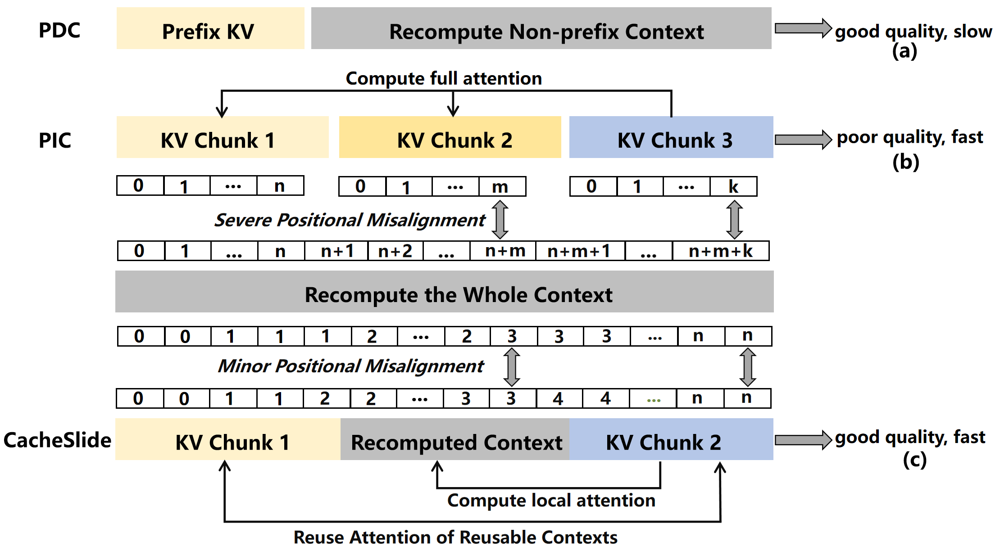

*图 1（论文 Figure 1，PDF 第 2 页）：PDC 只复用固定前缀；PIC 可复用任意段，但位置错位较大；CacheSlide 保留固定段间注意力，只对动态上下文相关部分做纠偏。*

### 1.2 根因不是“缓存命中率低”，而是缓存语义缺了一维

现有方案把位置语义压成两个极端：

- PDC 认为绝对位置必须相同，因此只接受固定位置命中；
- PIC 近似认为位置可以归零后再修补，因此需要额外 Token 重算来恢复注意力。

Agent 工作负载处在两者之间。固定段的相对顺序和内容通常不变，但动态段会改变它们的绝对位置及跨段相对距离。位置编码和新增上下文都会进入 Key/Value 表示与注意力计算，于是“内容相同”并不等于“KV 可直接消费”。论文把缓存 KV 与本轮重算 KV 的差异命名为位置错配导致的 KV 漂移（Positionally Misaligned KV Drift，PMKD）。

从系统角度看，还有第二层问题：当部分 Token 需要逐层重算时，主流推理框架往往先加载该层缓存，再写入新 KV，二者串行；显存不足触发 SSD 换出后，普通 LRU 还会把含少量修改的页随机写回，放大写流量。这不是 PMKD 的数学原因，却是 PIC/RPDC 纠偏落到系统后出现的直接代价。

### 1.3 核心洞察

只要固定段之间的相对顺序保持不变，就没有必要把它们当成完全位置无关的片段。系统可以先让固定段的缓存位置与本轮位置尽量接近，直接复用固定段内部以及固定段之间的大部分注意力；随后只重算对动态段敏感的一小部分 Token，并把加载、重算和写回改成可重叠的数据路径。

换句话说，CacheSlide 没有消除位置依赖。它把位置依赖从“绝对位置必须完全相等”改成“固定段相对次序不变、位置误差可控、剩余误差按需纠正”。

### 1.4 核心抽象：RPDC

RPDC 描述一类明确的缓存合同：Prompt 被切成有序 Chunk，其中一些 Chunk 每轮重算，另一些 Chunk 可复用；可复用 Chunk 的相对顺序不能改变，动态 Chunk 的长度则允许变化。这个抽象新暴露了三类信息：Chunk 角色、固定段相对顺序、位置编码配置。分块上下文位置编码（CCPE）使用这些信息分配位置范围，加权纠偏注意力（WCA）决定哪些 Token 需要纠偏，脏页感知、层内加载与写入解耦机制（SLIDE）再处理纠偏产生的 I/O 与写回成本。

### 1.5 四项关键优化方法速览

#### 方法一：按任务学习固定段的位置范围

- **问题**：固定段随动态段长度变化而整体平移，缓存 KV 与本轮真实 KV 的相似度下降。
- **方法**：CCPE 按 Agent 模板区分复用块和重算块，使用同类任务样本学习复用块常见的 CoPE（Contextual Position Encoding，按语义边界计数而非给每个 Token 单独编号的位置编码）范围，并在命中时加载该范围下的 KV。
- **效果**：固定段的位置偏差缩小，固定段内部以及固定段之间的注意力更可能直接复用。
- **边界**：需要修改模型的位置编码，并用 LoRA（低秩适配器，即冻结主干权重、只训练少量低秩参数）做任务相关的继续训练；它不是只改缓存管理器即可获得的透明收益。

#### 方法二：分层选择 Token 并做加权纠偏

- **问题**：固定段与动态段之间的交叉注意力无法从旧缓存完整恢复；全部重算又会失去复用价值。
- **方法**：WCA 在第 1 层重算完整 Prompt，用缓存 KV 与重算 KV 的差异选出 top-k Token；后续层仍计算动态段，只对复用固定段中的所选 Token 做纠偏，再与缓存 KV 融合。
- **效果**：把后续层固定段的全量重算缩成部分 Token 重算。论文在两组参数扫描中观察到 top-k 约 26%、CKSim（缓存 KV 与重算 KV 的余弦相似度）阈值约 0.12 附近的正确任务 QPS（每秒正确完成的查询数）较高。
- **边界**：第 1 层仍全量重算；参数依赖工作负载；论文伪代码的 CKSim 判定方向和融合权重范围存在未解释矛盾。

#### 方法三：重定位新 KV，重叠层内加载与写入

- **问题**：同一层内，缓存页尚未加载完成时，新 KV 不能覆盖原槽位，重算结果只能等待，形成 load-before-write 串行点。
- **方法**：SLIDE 预留额外页。论文描述，若局部重算先完成，可把新 KV 写入额外页并更新块表，解码阶段再优先覆盖原槽位回收空间。**分析判断**：WCA 的最终融合仍依赖旧 KV；生产实现需要在旧 KV 到达、融合完成后再发布可消费映射，论文没有给出这套完整发布协议。
- **效果**：缓存加载与 Token 重算/写入可以并行。Figure 12(a) 在 batch size 2～6 下报告层内并行时延下降 26.7%～51.5%。
- **边界**：并发期需要额外显存页和更复杂的块表更新；论文没有给出崩溃中断、映射更新原子性和恢复协议。

#### 方法四：按脏页密度换出并合并写回

- **问题**：SSD 换出时，包含少量更新 Token 的页会产生碎片化随机写和写放大。
- **方法**：SLIDE 优先选择论文标记为 clean 的页，即不含本轮所选 Token 的页；不得不换出脏页时，按页内所选 Token 数量排序，并尝试通过 extent 合并形成更集中写回。
- **效果**：Figure 12(b)(c) 报告写停顿下降 66.9%～73.5%，SSD 写放大降低 3.11～3.62 倍。
- **边界**：收益主要出现在显存压力已经触发 SSD spill 的条件下。clean 不等于“SSD 已有有效副本”；是否免写还取决于后备副本状态。优先逐出 clean 页是否损害后续命中率，论文没有单独测量。

### 1.6 最重要的实验结果

1. **位置编码对坐标变化敏感**。在 MemGPT + ShareGPT 构造实验中，初始位置偏移从 0 增至 1000 Token 时，RoPE（Rotary Position Embedding，旋转位置编码）下 CKSim 下降超过 90%，CoPE 下下降约 28%（Figure 4(a)）。该实验没有计算新增前缀的注意力，因此首先证明的是 K 表示对编码坐标的敏感性，不能单独推出注意力或生成质量下降。
2. **论文测试的固定窗口实现质量较差**。1K/2K/3K 窗口在多轮推理中的 F1 均明显低于不填充基线，论文图注给出的降幅超过 78.1%（Figure 4(b)）。窗口填充、mask、缓存生成位置和溢出处理细节没有交代完整，不能据此否定所有固定位置保留方案。
3. **端到端首 Token 响应时间（TTFT）与质量形成更好的折中**。Figure 10 在 batch size=1、关闭 beam search 时报告：相对 ContextCache，CacheSlide 的 TTFT 改善 2.4～3.3 倍且质量接近；相对 CacheBlend，TTFT 改善 1.21～2.11 倍，质量指标提高 1.97～2.28 倍；相对 PromptCache，TTFT 改善 1.12～2.45 倍，质量指标提高 1.41～3.95 倍。
4. **SLIDE 的收益在存储压力下更明显**。Figure 12 报告层内等待、写停顿、SSD 写放大和 GPU 存储占用均下降；Figure 13 在 batch size=8 下给出平均吞吐提高 63.1%、每秒吞吐标准差下降 68.9%的汇总值。

论文摘要和结论还给出“时延改善 3.11～4.3 倍、吞吐提升 3.5～5.8 倍”的总体表述，但正文可见图表没有把这两个区间绑定到同一组基线、模型和负载。报告后文不把它们当成统一配置下的可复现实测结果。

### 1.7 最大局限

CacheSlide 的核心收益和模型改造绑在一起。CacheSlide 侧启用经 LoRA 继续训练得到的 CoPE，基线保留原生 RoPE/ALiBi；因此 Figure 10 的端到端差异同时含有位置编码、适配训练、缓存策略和存储管理四类变量。论文实测支持组合方案在其评测条件下有效，但没有干净地分离每一项增益来自哪里。

更直接的工程问题是，Algorithm 2 把 CKSim 定义为相似度，却在 `CKSim < τ` 时把 Token 视作已收敛并移出重算集合，和“相似度越高越接近”的定义相反。融合系数 `α = ||K_recompute-K_reuse|| / ||K_reuse||` 也没有给出 `[0,1]` 截断；当 α 大于 1 时，所谓加权融合会变成外推。按论文当前文字和伪代码，WCA 不能直接照搬实现。

### 1.8 对本项目的直接结论

这篇论文能支持三点判断：Agent 场景确有非前缀复用机会；缓存消费资格必须包含位置与模板语义；异步加载/写入和脏页可见性会影响 SSD 分层路径的实际收益。它不能证明本项目的统一异构 KVCache 存储与调度底座已经解决跨节点传输、Host CPU 零数据拷贝（CPU 只下发控制指令，不搬运正文数据）、多卡一致、远端直读或 QoS（服务质量，即限制后台 I/O 对前台请求的干扰）。

对项目最有价值的不是照搬 CoPE，而是把 RPDC 变成查询与放置计划决策引擎（QueryPlan，即选择加载、远端直读、SSD 回源或本地重算路径）的输入维度：命中判断应回答“内容是否相同、位置语义是否兼容、需要补多少纠偏计算、加载与纠偏总成本是否低于本地重算”。

## 2. 为什么这个问题值得解决

### 2.1 Agent Prompt 的复用形态已经变了

论文把 Agent Prompt 抽象成：静态系统提示词 + 本轮更新段 + 历史固定段。MemGPT 会改写工作窗口，SWE-Agent 会在多个位置插入工具返回和运行时参数，Reflexion 会不断追加推理记录。固定内容占比不低，但它们往往不是一个连续前缀。

这类请求对缓存提出了比“字符串命中”更强的要求：内容一致、段落相对顺序一致、位置编码差异足够小、旧 KV 所依赖的上文语义仍然成立。只看哈希值会把语义不兼容的对象当成命中；只接受完全相同的绝对位置又会丢掉大量可复用工作。

### 2.2 PDC 为什么不够

PDC 只在预定位置复用 KV。ContextCache 一类前缀方案无法复用动态段后面的历史固定段。把动态段挪到后面也不可行：MemGPT 把最新记忆放在靠前位置是为了避免长上下文中的“中间信息丢失”；SWE-Agent 的更新槽位和后续静态代码/指令存在数据依赖，换序会改变程序语义。

PromptCache 可以为相同片段预生成多个位置版本，但位置数增加后，容量成本随版本数上升。它绕开了重算，代价是把位置组合预先物化成存储副本。

### 2.3 PIC 为什么仍然昂贵

PIC 把每个复用段的位置从零开始编码，拼接时再重算部分 Token。CacheBlend 先在浅层重算全 Prompt，再选择差异最大的约 18% Token；EPIC 重算每个块首尾共 64 个 Token。问题在于，不同注意力头关注的 Token 不同，哪些 Token 真正影响输出通常到解码阶段才更清楚。Prefill 阶段固定选点只能做近似。

PIC 还有系统成本：每层既要加载旧 KV，又要写新 KV。页式缓存如果没有为“部分 Token 更新”设计，会出现同一页读写互锁、脏页随机回写和 SSD 写放大。

### 2.4 论文怎样证明位置错配是实质问题

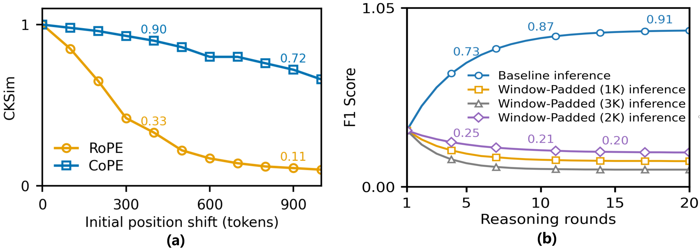

*图 2（论文 Figure 4，PDF 第 6 页）：左图比较 RoPE/CoPE 在位置平移下的 CKSim；右图显示固定窗口填充在多轮推理中的 F1 损失。*

RoPE 为每个 Token 位置施加旋转。若 Query 和 Key 共同平移同一个 Δ，相对位置 `(p+Δ)-(q+Δ)` 不变，不能说共同平移必然改变注意力相对相位。Agent 请求中的难点是动态段插入后，不同段并非总做一致平移，固定段与动态段的跨段距离和隐藏状态也会变化。CoPE 以语义边界计数，相邻 Token 可共享位置编号，因而原始 K 表示对坐标变化更平缓。Figure 4(a) 没有计算新增前缀注意力，只能作为编码坐标敏感性证据；它不能独自证明注意力或生成质量下降。Figure 4(b) 才提供了所测窗口实现的端到端质量结果。

Figure 4(b) 说明论文测试的固定窗口实现并不可靠：窗口过小可能截断工作记忆，1K/2K/3K 配置都出现明显 F1 损失。论文一处称固定窗口让后续固定段位置不变，另一处又把较大窗口的退化归因于 PMKD，却没有给出 padding、mask、缓存生成坐标和溢出处理细节。因此，这组实验能否定当前实现，不能排除所有固定位置保留方案。

## 3. 核心抽象与系统设计

### 3.1 RPDC 的语义合同

RPDC 不是“允许任意位置复用”。它要求：

1. Prompt 模板能稳定识别复用 Chunk 和重算 Chunk；
2. 复用 Chunk 的相对顺序保持不变；
3. 动态 Chunk 只改变固定段的绝对位置，不改变固定段内容；
4. 位置编码配置与缓存对象兼容；
5. 剩余跨段注意力误差可以用有限重算修复。

任何一条不成立，RPDC 命中都可能退化为普通 PIC，甚至应回退全量重算。论文没有把这五条做成显式运行时资格校验，但工程系统不能省略。

### 3.2 三个组件怎样串起来

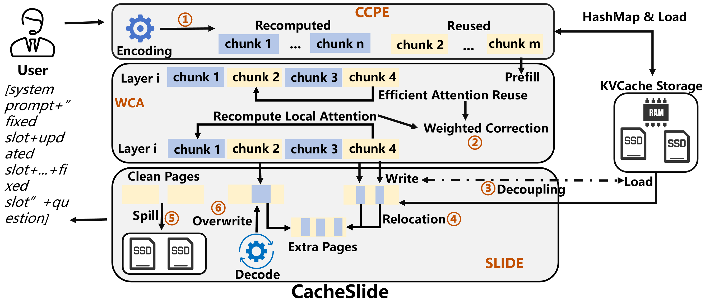

*图 3（论文 Figure 6，PDF 第 7 页）：CCPE 负责分块和位置编码，WCA 负责选择/纠偏 Token，SLIDE 负责缓存页重定位、覆盖和换出。*

控制路径先根据 Agent 模板标记 Chunk 角色，再用内容哈希查询复用对象。CCPE 给重算块使用本轮 CoPE 编码，给复用块使用任务训练阶段得到的常见位置范围。WCA 在 Prefill 中识别差异大的 Token，逐层重算并融合。SLIDE 同时处理页映射、额外页、加载与写入重叠以及 SSD spill。

这个分层有一个值得肯定的地方：论文没有假设算法层减少的 FLOPs 会自动转化为端到端收益。它继续追踪了部分重算给页式 KV 管理带来的读写冲突和写放大，并针对这些副作用补上系统机制。

### 3.3 状态和资源如何变化

| 优化前 | CacheSlide 的变换 | 直接结果 |
|---|---|---|
| 固定段与动态段的关系变化后，缓存 KV 与本轮表示可能失配 | 为复用 Chunk 分配任务相关的稳定 CoPE 范围 | 缓存 KV 与本轮 KV 更接近 |
| 每层对所有 Token 重算 | 第 1 层全量识别，后续层只纠偏 top-k Token | 后续层计算量下降 |
| 同一层加载完成后才能覆盖写 | 新 KV 先写额外页并更新块表 | 加载、重算、写入重叠 |
| LRU 无视页内修改分布 | 干净页优先、脏页按修改密度排序并合并写回 | 随机写和 SSD 写放大下降 |

## 4. 关键技术实现与作用机理

### 4.1 CCPE：按任务学习复用 Chunk 的位置范围

#### 解决的问题

相同固定段在不同轮次出现于不同绝对位置。若按本轮真实位置重新编码，就失去旧 KV；若无条件沿用旧位置，又会产生 PMKD。CCPE 的目标不是让位置完全相同，而是让缓存位置和真实位置落在相近的 CoPE 区间。

#### 实现路径

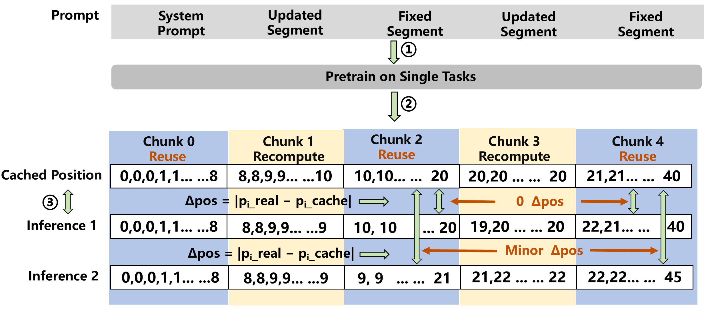

*图 4（论文 Figure 7，PDF 第 8 页）：同类任务预训练得到复用 Chunk 的常见 CoPE 编码，推理时重算块使用本轮位置，复用块使用缓存位置。*

1. 收集同一任务类型的 Prompt，并用 CoPE 编码。
2. 根据 Agent 模板把 Prompt 切成 K 个有序 Chunk，标注复用或重算角色。
3. 对复用 Chunk 统计常见编码模式，保存最频繁的位置范围。
4. 新请求到达时按同一模板切块；复用块按内容哈希查找 KV，未命中则按所学位置范围生成并存储；重算块使用本轮实际位置编码。

#### 为什么有效

CoPE 的位置变化比 RoPE 平缓。固定段即使被动态段推移，常见位置范围仍可能与本轮位置接近，CKSim 因而高于从零编码的 PIC。这样可以继续复用固定段内部以及固定段之间的注意力，把必须恢复的部分收敛到固定段与动态段的交叉关系。

#### 亮点与代价

亮点是把 Agent 模板从应用层结构变成缓存计划的一部分。代价也很明确：需要任务样本、稳定模板、CoPE 适配器和缓存版本管理。Algorithm 1 还漏写了直方图 `H[e]` 的更新步骤，按伪代码无法真正得到 `arg max H[e]`。这可能只是论文省略，但会影响复现。

#### 对项目的意义：适配，不宜下沉为强制底座语义

本项目可以在访问意图中加入 `position_profile_id`、Chunk 角色和相对顺序摘要，让上层推理框架声明 RPDC 兼容性。CCPE 本身应作为模型侧可选插件，而不是统一存储层默认能力。存储底座必须能在缺少兼容配置时拒绝消费并回退重算。

### 4.2 WCA：选择部分 Token 做分层纠偏

#### 解决的问题

CCPE 只能缩小位置偏差，不能恢复固定段与动态段之间全部交叉注意力。如果对整个 Prompt 全层重算，缓存收益消失；如果固定重算边界 Token，又未必覆盖真正影响输出的注意力头。

#### 实现路径

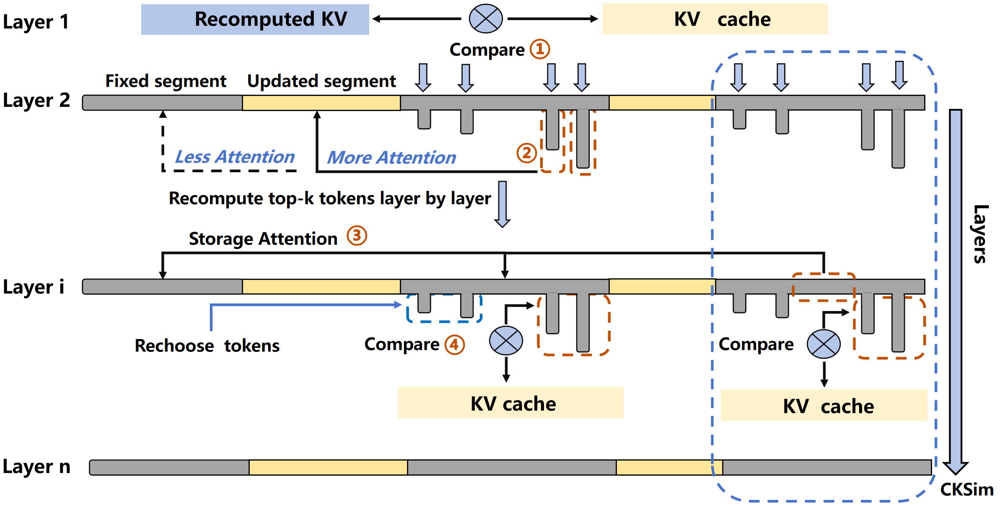

*图 5（论文 Figure 8，PDF 第 9 页）：第 1 层比较缓存与重算 KV，后续层只处理 top-k Token，周期性根据 CKSim 更换纠偏对象。*

1. 第 1 层对完整 Prompt 重算，计算每个 Token 的缓存 KV 与重算 KV 差异。
2. 按差异排序，选出 top-k Token。
3. 从第 2 层起，只重算这些 Token 与动态段相关的注意力。
4. 把重算结果与缓存 KV 按 `α` 融合。
5. 每四层计算一次 CKSim，把“已恢复”的 Token 换出，继续纠偏尚未处理且差异较大的 Token。

#### 为什么有效

论文依赖两个启发式前提：注意力通常较稀疏；模型越深，相邻层 KV 表示往往越相似。如果少量固定段 Token 承担大部分跨段影响，就可能减少后续层的固定段重算。粗略的 Token 更新量从“全 Token × 全层”变成“全 Token × 第 1 层 +（全部动态段 Token + top-k 固定段 Token）× 其余层”，还要加上注意力键长度、筛选、融合和 CKSim 开销。层间表示相似也不保证复用误差会自动收敛，后续非线性运算仍可能放大误差；退出重算集合后的逐层误差和最终质量必须实测。

#### 参数敏感性

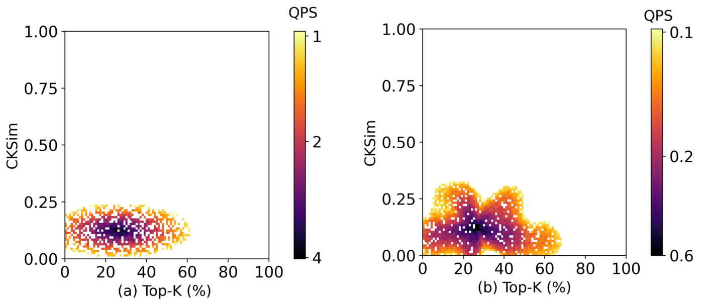

*图 6（论文 Figure 14，PDF 第 13 页）：两组模型/任务的正确任务 QPS 在 top-k 约 26%、CKSim 阈值约 0.12 附近较高。颜色条方向和数值范围不同，不能跨子图直接比较绝对 QPS。*

这个结果只说明当前两组配置存在相近高值区，不足以把 0.26/0.12 固化成系统常量。模型深度、注意力密度、Prompt 模板和质量门槛变化后，最优点都可能移动。

#### 论文内部需要澄清的四处问题

1. **CKSim 判定方向相反**：论文把 CKSim 定义为余弦相似度，值越大越接近；Algorithm 2 却在 `ci < τ` 时移出重算集合，并解释为差异已经可忽略。若 `ci` 确为 CKSim，条件应朝高相似度方向判断，或者变量实际应是距离而非相似度。
2. **融合权重没有范围约束**：`α = ||K_recompute-K_reuse|| / ||K_reuse||` 可能大于 1，此时 `(1-α)` 为负，融合会变成外推。论文没有给出 clip、分母为零处理或稳定性分析；伪代码还先使用 α、随后才更新 α，初始化和时序也需核验。
3. **“学习权重”与公式不一致**：摘要称用 learned weights 合并新旧 KV，正文算法给出的却是按相对偏差即时计算的确定性权重。两者至少有一个表述不完整。
4. **top-k 集合预算没有闭合**：正文说移出一个已恢复 Token，再补入一个剩余差异最大的 Token；Algorithm 2 第 16 行却写成 `Sk ← {m ∈ S \ Sk}`，按字面会用候选补集替换整个集合。伪代码也没有像正文那样从 S 移除退出者，可能让它再次入选。实现前必须明确 `|Sk|≤k`、退出状态、候选耗尽和重新入选规则。

这些问题不会推翻 Figure 10 的组合系统实测，但会阻止团队仅凭论文伪代码复刻 WCA。必须先对官方代码和消融实验做交叉核验。

#### 对项目的意义：先验证，再决定是否接入

WCA 属于计算侧近似复用，不是纯数据搬运。QueryPlan 需要把纠偏计算、质量风险和加载开销一起估算，而不能把缓存命中等同于完整节省 Prefill。建议将 `correction_token_ratio`、质量置信度和允许的模型适配器写入计划输入，无法满足时回退完整重算。

### 4.3 SLIDE：用额外页解除层内加载与写入互锁

#### 解决的问题

WCA 对同一层的旧页既要读又要改。若必须等待旧页完全加载后才能写回所选 Token，加载与重算无法重叠，I/O 延迟仍处在 Prefill 关键路径上。

#### 实现路径

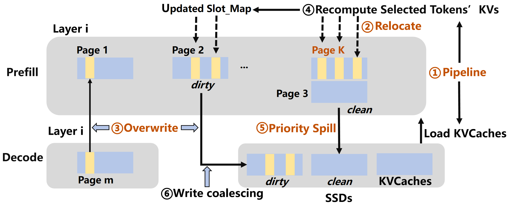

*图 7（论文 Figure 9，PDF 第 10 页）：重算先完成时写额外页，加载先完成时写更新槽位；解码阶段覆盖原槽位并合并回写。*

论文实现部分描述：SLIDE 从第 2 层开始预留与入选 Token 数量相关的额外页，并把它们登记到每请求块表和 `slot_mapping`。局部重算先完成时，`promote` 操作可先把新 KV 写到额外页；加载先完成时，可直接写更新后的槽位。解码阶段优先覆盖旧槽位，额外页写满后才继续分配新页。

**分析判断**：WCA 融合仍需读取旧 KV，不能把“局部重算完成”当成“新 KV 已可消费”。生产实现至少要区分局部重算完成、旧 KV 到达、融合完成、可消费映射发布四个事件。这是本报告根据数据依赖推导的实现要求，不是论文已经给出的状态机或原子发布协议。

#### 为什么有效

SLIDE 消除的是写目标冲突：局部结果可先落在新位置，不必等原槽位变成可写。旧 KV 参与融合的读取依赖仍然存在，只是可与局部重算重叠。Figure 12(a) 的组件实验显示，层内流水等待随 batch size 增大而下降。

#### 代价与边界

额外页占用显存；块表更新必须和内核读写保持一致；请求取消、GPU 故障或进程崩溃时，需要区分旧页、新页和当前有效映射。论文实现部分只描述正常路径，没有给出原子发布、恢复和回收状态机。

#### 对项目的意义：适配为异步描述符流水

本项目可迁移“写新位置 + 原子切换引用 + 延后回收”的原则，并与描述符批量编译、DMA 完成事件和 RCU（Read-Copy-Update，读-拷贝-更新，即原子替换引用后延迟回收旧对象）宽限期结合。实现必须把局部计算、旧数据到达、融合完成和发布完成做成不同事件。是否仍需 GPU 额外页，要由 NPU 和 HBM（高带宽显存）分配器、远端直读路径和 Host CPU 零数据拷贝要求共同决定，不能照抄 vLLM 私有块表接口。

### 4.4 脏页感知换出：把随机小写变成更集中回写

#### 解决的问题

WCA 只更新少数 Token，脏数据可能散落在许多页。普通 LRU 按访问时间换出，不知道页内修改密度，容易把零散脏页写入 SSD，造成写停顿和写放大。

#### 实现路径

从第 2 层开始，只要页中包含入选 Token 就标记为脏页，并记录所选 Token 数量。这里的 clean 只表示“不含本轮入选 Token”，不代表 SSD 已有有效副本。显存紧张时优先选择 clean 页；只有当后备介质已有有效副本时才可能直接丢弃，否则首次 spill 仍需写入。必须写脏页时，系统按所选 Token 数量排序，并另行合并可连续的物理 extent。排序本身不保证地址连续。

#### 为什么有效

论文的目标是用未来可能的缓存命中机会换取当前更低的写成本：优先处理未被本轮纠偏修改的页，并把可合并的脏区间集中写回。真正能否免写取决于 SSD 是否已有有效副本；真正能否形成顺序 I/O 取决于物理布局、extent 合并和缓冲重排。论文没有交代这些细节及其成本。受益资源是 SSD 写带宽和 Prefill 等待，新增成本是后备副本状态、页元数据、排序和潜在后续读缺失。

#### 论文证据

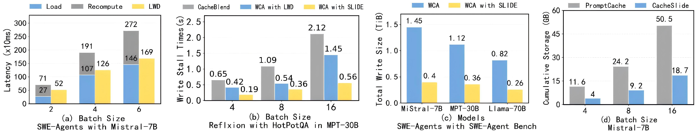

*图 8（论文 Figure 12，PDF 第 13 页）：(a) 层内加载/重算并行；(b) 写停顿；(c) SSD 写放大；(d) 相对 PromptCache 的 GPU 存储占用。四个子图条件不同，不能把倍率相乘。*

- Figure 12(a)：batch size 2～6 时，层内并行时延降低 26.7%～51.5%。
- Figure 12(b)：batch size 4～16 时，写停顿降低 66.9%～73.5%。
- Figure 12(c)：不同模型下 SSD 写放大降低 3.11～3.62 倍。
- Figure 12(d)：相对 PromptCache，GPU 存储占用降低 1.63～1.9 倍。

#### 对项目的意义：可迁移原则，策略必须重做

干净/脏页可见性和写回合并适合本项目 NVMe SSD（基于 PCIe 的高速固态盘）分层路径。但换出决策还需加入命中概率、重新拉取成本、租约状态和前台 SLO（服务等级目标）。只按脏度排序可能把高价值干净页提前逐出，随后从远端或 SSD 重新读取，整体收益未必为正。

## 5. 实验到底证明了什么

### 5.1 评测条件

| 维度 | 论文配置 |
|---|---|
| 实现 | vLLM 0.8.5 |
| 加速卡 | 主要为单张 NVIDIA A100 80 GB；Llama-3 70B 使用两张 A100 |
| Host | 500 GB DRAM、2 TB NVMe SSD、PCIe Gen 4 GPU 互连 |
| 软件 | Ubuntu 20.04、Linux 5.16.7、CUDA 12.6 |
| 模型 | Mistral-7B、MPT-30B、Llama-3 70B |
| Agent / 数据集 | Reflexion / HotPotQA，MemGPT / Multi-Session Chat，SWE-Agent / SWE-Agent-Bench |
| 基线 | Recompute、ContextCache、PromptCache、CacheBlend、EPIC |
| 模型差异 | CacheSlide 启用经 LoRA 继续训练的 CoPE；基线使用原生 RoPE/ALiBi |

SWE-Agent-Bench 在论文中只有 2 个任务、12 个 Python 仓库。硬件规模也主要是单机一到两张 A100。这些条件足以观察本地 Prefill、HBM 和 SSD 路径，不足以支持跨节点存储池结论。论文把 ContextCache、PromptCache 分别关联到 Kimi Context Caching 和 OpenAI Prompt Caching，并称使用开源实现，却没有给出可复现的本地版本、提交号和完整配置；下列倍率均按作者报告引用，基线身份与配置仍需用代码核验。

### 5.2 端到端质量与 TTFT

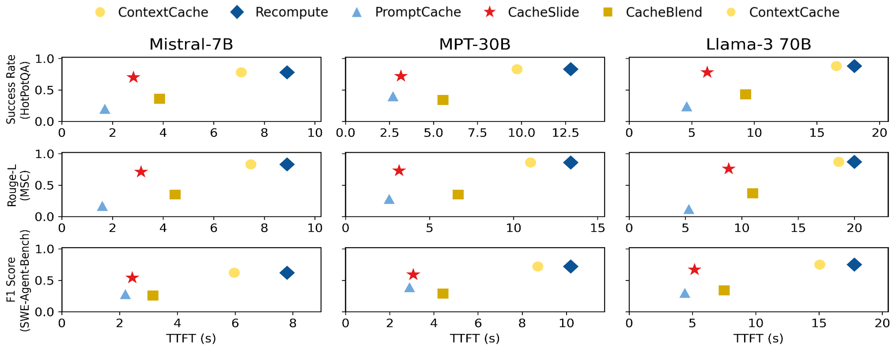

*图 9（论文 Figure 10，PDF 第 11 页）：batch size=1、关闭 beam search。不同数据集分别使用 Success Rate、Rouge-L Recall 和 F1，纵轴不是同一种质量指标。*

| 论文主张 | 实验与结果 | 能证明什么 | 不能证明什么 |
|---|---|---|---|
| CacheSlide 位于更好的质量与 TTFT 折中区 | 三模型 × 三任务，batch size=1 | 组合方案在当前单请求条件下优于所测 PDC/PIC 实现 | 不能拆分 CoPE、WCA、SLIDE 各自贡献；不能直接外推并发 SLO |
| 相对 ContextCache 降低 TTFT | 2.4～3.3 倍，质量接近 | 非前缀固定段复用能减少 Prefill | 不能证明所有 Agent 都有相同复用比例 |
| 相对 CacheBlend/PromptCache 改善质量 | 质量指标倍率分别为 1.97～2.28、1.41～3.95 | 论文配置下的纠偏比所测基线更稳 | 不同数据集质量指标不同，不能跨行比较绝对倍率 |

### 5.3 并行推理和 beam search

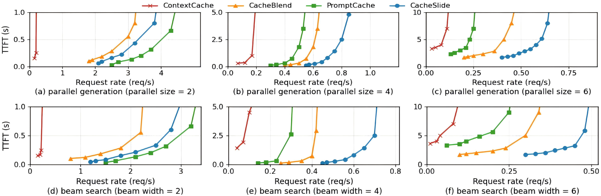

*图 10（论文 Figure 11，PDF 第 12 页）：Mistral-7B + MemGPT + Multi-Session Chat，仅共享系统提示词；上排为并行请求，下排为 beam search。*

并行规模从 2 增至 6 时，论文称 CacheSlide 相对最佳基线的 TTFT 优势从约 1.2 倍扩大到 2.3 倍。下排是在对应 batch 上同时启用相同 beam width，并非单独改变 beam；batch=6、beam width=6 时，作者报告约 2.1 倍优势。这个实验说明组合系统在更高存储压力下退化较慢。由于请求间只共享系统提示词，它没有完整覆盖 RPDC 的多固定段复用优势。

### 5.4 吞吐及稳定性

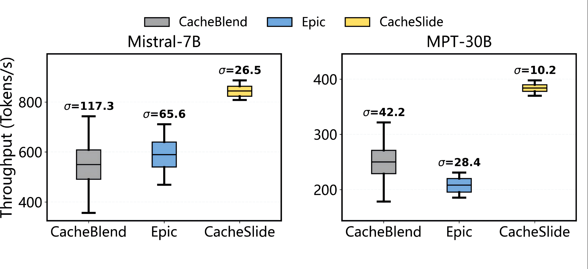

*图 11（论文 Figure 13，PDF 第 13 页）：batch size=8，比较 CacheBlend、EPIC 与 CacheSlide。箱线图给出每秒吞吐分布和标准差。*

Mistral-7B 上，作者报告 CacheSlide 的吞吐比 CacheBlend、EPIC 高 49.6% 和 45.2%；MPT-30B 上高 75%～82.2%，并汇总为平均吞吐提高 63.1%、吞吐标准差下降 68.9%。该段正文在 CacheBlend/EPIC 与 ContextCache 之间切换 baseline 称谓，聚合倍率的统一分母不够清楚。结果可以支持“组合系统在所测 spill 压力下吞吐更高、波动更小”，不能只归因于脏页策略。测试也没有前后台独立业务流，未报告前台 TPOT（每个输出 Token 的生成耗时）干扰率。

### 5.5 摘要数字的证据边界

论文摘要和结论使用 3.11～4.3 倍时延改善、3.5～5.8 倍吞吐提升。正文 Figure 10～13 展示的是多组不同基线、模型、batch 和指标，未给出一张表把这两个总体区间逐项对回原始配置。可以把它们视为作者对全套实验的汇总主张，不能当作“任意模型、任意 Agent、同一基线下稳定取得”的通用结果。

## 6. 论文的亮点与局限

### 6.1 亮点：提出介于 PDC 与 PIC 之间的工作负载抽象

RPDC 把 Agent Prompt 的结构特征说清楚了：固定段不是任意重排的知识块，而是有稳定相对顺序、被动态槽位推移的上下文。这比单纯比较命中率更接近真实复用语义。

局限是 RPDC 依赖稳定模板。若 Agent 自由重排工具结果、压缩历史或改变固定段边界，原来的位置范围和相对顺序合同会失效。

### 6.2 亮点：把算法收益追到页管理和 SSD 写放大

许多近似复用工作只报告少算了多少 Token。CacheSlide 继续处理部分重算造成的读写互锁和脏页碎片，说明作者理解端到端瓶颈不只在 FLOPs。

局限是 SLIDE 仍基于单机 vLLM 页表和本地 NVMe。远端显存、跨节点租约、失败重放、网络拥塞和多卡同步都没有进入状态机。

### 6.3 亮点：同时测质量、TTFT、吞吐和写放大

Figure 10～13 至少覆盖了质量与时延折中、并发退化、组件消融和吞吐波动，避免只用单一微基准支撑系统结论。

局限是 CacheSlide 与基线没有使用相同位置编码和适配训练，组合收益存在变量混杂。论文还缺少 CCPE-only、WCA-only、同模型编码公平对照，以及 Agent 模板跨域泛化实验。

### 6.4 亮点：愿意用部分重算换质量

CacheSlide 没有把缓存命中视为二元事件，而是接受“命中后仍需付出纠偏计算”。这符合真实系统的收益判断方式。

局限是 WCA 伪代码存在方向和数值范围问题，且第 1 层全量重算。对浅层模型、短上下文或交叉注意力密集任务，纠偏成本可能接近完整重算。

## 7. 论文没有解决什么

1. **没有给出可执行的缓存消费资格合同**。Algorithm 1 以内容哈希查找 KV，没有明确把模型版本、Tokenizer、Prompt 模板、LoRA/CoPE 适配器、位置范围版本和相对顺序摘要纳入 Key。
2. **没有给出 WCA 的严格正确性定义**。系统依赖近似质量指标，没有说明单请求何时必须回退，也没有处理 CKSim 阈值逻辑矛盾。
3. **没有跨节点数据路径**。论文没有远端目录查询、远程直接内存访问、远端直读、拷贝到本地 HBM 或网络拥塞实验。
4. **没有多卡一致动作**。70B 使用两张 A100，但论文没有报告张量并行多卡命中状态同步、集合通信安全或部分失败处理。
5. **没有生产级故障状态机**。额外页重定位、覆盖和 SSD 回写过程中，进程崩溃、请求取消、SSD 错误和过期租约如何恢复没有说明。
6. **没有前后台混压 QoS**。Figure 13 测的是同类请求吞吐波动，不是在线 Decode 与后台换出/拉取同时运行时的 TPOT 尾部干扰。

## 8. 对本项目的启发

### 8.1 可直接采用的原则

#### 把位置语义纳入消费资格

本项目当前的语义一致性检查覆盖模型、Tokenizer、模板、LoRA、Ready 和租约。CacheSlide 说明还应显式携带位置编码模式、RPDC Chunk 角色、相对顺序摘要和 CCPE profile 版本。它们可以并入 Prompt 模板或新增位置语义字段，不能只依赖内容哈希。

#### 把“部分复用成本”放进动态选路

QueryPlan 不能只计算传输字节。对 RPDC 命中，应比较：加载旧 KV + 纠偏重算 + 加权融合 + 多卡同步 + 干扰成本，是否小于本地完整重算。

#### 让缓存管理器看见干净/脏状态

页内是否包含新 KV、修改密度多大、是否可以丢弃后重取，都会改变换出成本。这些元数据适合进入分层块分配器和 NVMe 写回策略。

### 8.2 需要改造后采用的机制

#### CCPE/WCA 作为推理框架插件

它们依赖模型位置编码和任务训练，应该位于 L1 推理调度层或框架适配层。L2/L3 存储底座只接收明确的兼容性声明、纠偏预算和回退信号，不在底层猜测模型语义。

#### SLIDE 的重定位改造成统一异步数据流

“写新位置、切换引用、延后回收”可以与描述符编译、DMA 完成通知和软件 RCU 结合，并显式区分局部重算、旧 KV 到达、融合、发布四个完成事件。项目实现必须保证 Host CPU 只下发控制指令，不搬运正文数据；CacheSlide 的单机 vLLM 实现没有证明这一点。

#### 脏页策略加入收益和 QoS

项目的换出优先级至少要同时考虑脏度、未来命中概率、回源介质、重新加载时间、前台时限和写放大。论文的“干净页优先”只能作为候选策略。

### 8.3 不应直接复制的部分

- 只用 `content_hash` 定位可消费 KV；
- 把 top-k=0.26、CKSim=0.12 写成固定系统参数；
- 未澄清判定方向前照抄 Algorithm 2；
- 把任务相关 CoPE 训练纳入存储底座的强依赖；
- 直接依赖 vLLM 0.8.5 的私有块表与 `slot_mapping` 实现；
- 用单机 SSD spill 结果推导跨节点远端存储性能。

## 9. 对本项目立项的技术背书

### 9.1 必要性证据

论文独立验证了 Agent 工作负载存在大量非前缀固定内容，并且固定段位置会随动态段长度变化。它说明“统一存储池只提升容量和传输带宽”还不够：若缓存身份和位置语义不匹配，命中对象仍可能不可安全消费。这支持项目继续建设语义身份、动态选路和回退机制。

### 9.2 可行性证据

论文的组合实验支持两条工程原则：一是缓存命中后允许少量纠偏计算，仍可能获得净 TTFT 收益；二是部分重算产生的 I/O 可以通过异步页重定位和脏页管理转化为更低等待和更顺序的 SSD 写。这为项目的“加载或重算”动态判断和 NVMe 分层路径提供了外部证据。

### 9.3 差异化空间

CacheSlide 没有覆盖统一异构介质、跨节点远端直读、Host CPU 零数据拷贝、张量并行多卡状态同步、租约容错和前后台 QoS。这些正是本项目需要独立解决的系统问题。项目若把 RPDC 语义接入统一对象身份和 QueryPlan，就能覆盖论文只在单机推理框架内部处理的边界。

### 9.4 仍需项目自己证明的内容

| 项目命题 | CacheSlide 是否支持 | 证据边界 |
|---|---|---|
| Agent 非前缀固定段值得复用 | 支持 | 论文有工作负载分析和端到端实验 |
| 加载与部分重算应联合决策 | 支持原则 | 论文没有微秒级通用 QueryPlan |
| NVMe 脏页管理可降低写放大 | 支持 | 仅本地 A100 + NVMe 条件 |
| Host CPU 零数据拷贝 | 不支持 | 未测 Host Payload Touch Bytes |
| 统一总线内存直通共享协议（UBMEM）/通用远程直接内存访问（URMA）跨节点数据路径 | 不支持 | 无跨节点网络实验 |
| 远端直读（Direct-View，即跨节点直接读取远端显存）与拷贝到本地 HBM（Copy-to-HBM，即通过 DMA 搬运到本地高带宽显存）的边界 | 不支持 | 没有对应路径对比 |
| 六维语义一致性与租约安全 | 不支持 | 只有内容哈希和模板切块描述 |
| TP=8 多卡状态同步 | 不支持 | 两卡 70B 不是一致性验证 |
| 前后台混压下 TPOT 干扰率 < 3% | 不支持 | 没有独立前台/后台混压 |
| E3 的 TTFT/QPS 目标 | 不支持 | 论文基线、硬件、负载均不同 |

结论很清楚：CacheSlide 能证明方向值得做，不能替项目完成工程验收。

## 10. 建议优先验证的五组实验

### 10.1 RPDC 工作负载画像

- **假设**：目标业务中存在稳定相对顺序的非前缀固定段，且 Saved-Prefill（首字生成预计算节省，即通过复用 KVCache 避免重复 Prefill）的净收益高于纠偏和加载成本。
- **变量**：Agent 类型、动态段长度、固定段数量、复用比例、位置漂移。
- **基线**：完整重算、前缀缓存、PIC。
- **指标**：可复用 Token 比例、位置漂移分布、质量、TTFT、净节省 Prefill 时间。
- **决策**：若 RPDC 占比低或纠偏成本接近重算，不把 CCPE/WCA 纳入主路径。

### 10.2 同一模型编码下的公平消融

- **假设**：收益不只是 CoPE 适配训练带来的。
- **变量**：RoPE/CoPE、是否 CCPE、是否 WCA、是否 SLIDE。
- **基线**：各方案使用相同模型权重、相同位置编码和相同缓存对象。
- **指标**：TTFT、质量、纠偏 Token 比例、层级耗时。
- **决策**：若同编码对照下 CCPE/WCA 收益消失，应把论文结论限定为“模型适配 + 缓存系统”的组合方案。

### 10.3 WCA 数值和状态机正确性

- **假设**：修正 CKSim 判定方向、集合预算和 α 范围后，仍能保持论文报告的质量与性能折中。
- **变量**：`ci < τ` / `ci > τ`、α 是否 clip、更新周期、top-k。
- **基线**：全量重算产生的逐层 KV。
- **指标**：逐层 CKSim、`|Sk|`、重新入选次数、最终质量、NaN/溢出、被移出集合 Token 的真实误差。
- **决策**：无法形成单调、可解释的收敛关系时，不接入生产路径。

### 10.4 分层加载与纠偏联合选路

- **假设**：在目标 NPU/HBM、NVMe 和远端链路上，存在“加载旧 KV + 部分纠偏”优于完整重算的稳定区间。
- **变量**：上下文长度、纠偏比例、介质、链路带宽、并发度。
- **基线**：本地完整重算、SSD 回源、远端直读、拷贝到本地 HBM。
- **指标**：端到端 TTFT、设备利用率、Host Payload Touch Bytes、预测路径与反事实最优路径差距。
- **决策**：用于冻结 QueryPlan 成本项和回退阈值。

### 10.5 前后台混压和故障回退

- **假设**：脏页换出与纠偏流量不会破坏前台 Decode 的尾部时延。
- **变量**：后台换出带宽、前台 QPS、页脏度、SSD/网络故障、请求取消。
- **基线**：无脏页感知的 LRU、纯前台运行。
- **指标**：TTFT、QPS、TPOT P99、写放大、错误消费、回退成功率。
- **决策**：用于判断 SLIDE 类策略能否进入 E3 全链路混压验证。

## 11. 最终判断

CacheSlide 最有价值的贡献是 RPDC，而不是某个固定参数或一套可直接复制的 vLLM 补丁。它指出 Agent Prompt 的缓存语义有第三种状态：固定段相对顺序稳定，绝对位置随动态内容变化。基于这个状态，系统可以在“完全拒绝复用”和“位置无关地强行复用”之间做细粒度选择。

论文的端到端结果说明这条路线有潜力，SLIDE 的消融也证明部分重算必须和页管理一起设计。但模型侧 CoPE 适配、基线配置差异、单机评测规模以及 WCA 伪代码矛盾，使现有证据不足以支撑直接工程移植。

对统一异构 KVCache 存储与调度底座而言，合理做法是吸收 RPDC 的语义分类、纠偏成本入模和脏页可见性；把 CCPE/WCA 保留为可插拔计算侧能力；继续独立验证跨节点零数据拷贝、动态选路、多卡一致、租约安全和混压 QoS。这样既利用论文已经验证的规律，也不会把论文未覆盖的条件误写成项目已具备能力。
