# AITurbo（FAST 2026）：分组 I/O 云存储机制深度解构与统一异构 KVCache 项目启示

> 文档版本：V2 增强解构稿  
> 原始论文：*Fast Cloud Storage for AI Jobs via Grouped I/O API with Transparent Read/Write Optimizations*  
> 作者机构：上海交通大学并行与分布式系统研究所、华为云  
> 发表会议：USENIX FAST 2026  
> 原文入口：[同目录 PDF](<[FAST 2026] Fast Cloud Storage for AI Jobs via Grouped IO API with Transparent Read Write Optimizations.pdf>)  
> 分析范围：问题根因、Grouped I/O 抽象、读写数据路径、资源交换、实验条件、证据边界，以及对统一异构 KVCache 存储与调度底座的迁移判断。

## 1 技术结论

AITurbo 要解决的问题可以压缩成一句话：AI 训练和推理会成组读写大文件，但传统云存储接口只能看到一条条孤立请求，既无法识别组内重复数据，也无法同时利用存储网络和计算网络安排传输，最终让较窄的存储网络拖住加速卡。

论文的关键洞察同样可以用一句话说明：应用只需把“哪些客户端正在共同完成本次读写”告诉存储层，存储层就能结合对象重复关系、链路带宽和暂存容量，生成覆盖整组客户端的去重与负载均衡计划。Grouped I/O（分组输入输出，即调用方显式声明同一批读写所涉及的客户端集合）由此成为一种组级意图接口，而不只是一组新的文件读写函数。

AITurbo 的实现利用 Host DRAM（主机内存）暂存数据，并借用 XPU（GPU、NPU、TPU 等 AI 加速器的统称）之间的计算网络承担部分搬运。写路径把“数据已进入内存暂存区”和“数据已持久化到后端存储”拆成两个完成事件；读路径对重复内容只从存储读取一份，再经计算网络转发给其余节点。这套设计没有消除 I/O，而是把一部分存储网络流量转移到通常更宽的计算网络，并把一部分同步等待移到可与计算重叠的后台阶段。

在论文评测条件下，AITurbo 的训练检查点写入相对 Megatron 加 SFSTurbo 快 3.9 至 58.8 倍，相对 Gemini 最高快 5.9 倍。Qwen 14B、8 个 XPU 和 30 分钟 Qwen-Bailian 轨迹下，Mooncake 加 AITurbo 的平均 TTFT（Time To First Token，首 Token 响应时间）从 0.85 秒降到 0.65 秒，论文报告下降 23%。不过，作者明确说明该 KVCache（大模型注意力键值缓存，即自回归生成过程中保存历史 Key 与 Value 激活状态、用于避免后续 Token 重复计算注意力的数据）实验没有使用 Grouped I/O API，因为动态推理实例难以同步。该实验验证了 AITurbo 读取路径能够借用计算网络，不能据此宣称动态在线 KVCache 的分组形成与协调问题已经解决。

从当前项目视角看，最值得迁移的是组级意图、两阶段完成、单份回源后分发和稳定计划缓存。Host DRAM 暂存、串行转发链和 4 秒级全局计划求解属于论文在特定工作负载下的实现选择，不应直接进入在线主路径。统一异构 KVCache 存储与调度底座要求 Host CPU 零数据拷贝（CPU 只下发控制指令，不读取、写入或复制正文数据，Host Payload Touch Bytes 为 0），并要求热路径在微秒级完成动态选路。两者的资源边界和时延目标并不相同。

本文使用以下证据类别：

- 论文事实：原文直接陈述，或可从原文图表读出；
- 测量数据：论文在给定平台和负载下直接测得的数值；
- 模型输出：由故障率、检查点频率等假设计算出的结果，不等同于实测；
- 分析判断：依据机制与实验推导，但不是作者直接报告的结论；
- 项目映射：论文原理与当前项目的对应关系；
- 项目建议：需要通过项目实测才能确认的实施方向；
- 开放问题：论文没有提供足够信息或实验覆盖的问题。

## 2 问题、工作负载与根因

### 2.1 双网络供给不对称

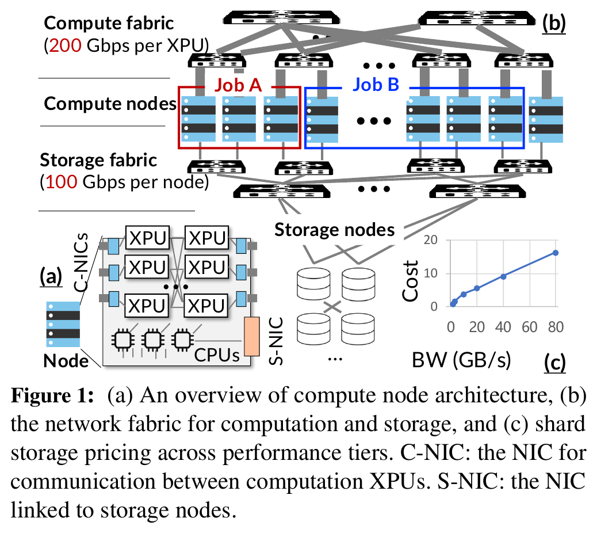

论文假设的是典型计算与存储分离云架构。每个 XPU 通过计算网卡连接高带宽计算网络；一台 8 卡计算节点则共享存储网卡访问远端存储服务器。原文示例中，计算网络带宽为每个 XPU 200 Gbps，节点存储网卡为 100 Gbps。两项带宽的统计粒度不同，不能简单写成固定的 16 倍差距。可靠结论是：节点内并发 XPU 越多，共享存储网卡越容易先成为瓶颈。

增加存储服务器只能提高后端供给，不能绕过计算节点前端存储网卡。论文以华为云存储定价为例，从 1.6 GB/s 提高到 80 GB/s 时，每 GB 存储价格约上升 16 倍。该数字来自特定云服务的价格档位，不宜外推为普遍行业成本曲线；它足以说明“单纯购买更多后端带宽”同时受到前端链路上限和成本增长约束。

### 2.2 三类 I/O 共享同一物理矛盾

论文覆盖三类负载：训练检查点写入、训练或推理时的模型检查点读取，以及在线推理的 KVCache 读取。它们的语义不同，却有三个共同点。

第一，数据通常很大，并以顺序方式搬运。论文对云集群文件访问的统计显示，多数操作超过 1 GB；一次检查点可包含数百 GB 的模型参数和优化器状态。此时端到端时间主要由有效带宽决定，单次元数据操作通常不是首要瓶颈。

第二，I/O 可以与计算重叠，但重叠窗口有截止点。训练可在后台写第 i 轮检查点并继续后续前向、反向计算；模型和 KVCache 可按层预取。只要数据没有在依赖到来前就绪，计算仍然会停下来等待。换句话说，异步接口只提供隐藏 I/O 的机会，不会自动补足带宽。

第三，这些操作经常由多个 rank 或实例同时发起。数据并行训练的多个 rank 会在同一轮保存检查点；弹性扩容会让多个实例同时读取相同模型；一批 Agent 请求可能共享系统提示词前缀。全组完成时间取决于最慢的源、目的端和链路，单请求局部优化不能保证组级最优。

### 2.3 真实轨迹说明“成组出现”，不等于“组天然可得”

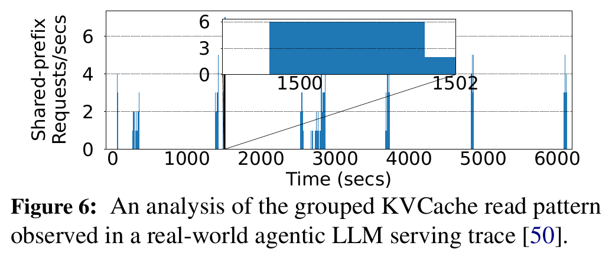

Figure 6 表明，真实 Agent 轨迹中确实存在同一任务类别共享前缀、请求近同时到达的窗口。这支持“组内重复读取有优化空间”。它没有回答存储层如何在请求持续到达、实例不断变化时确定组的成员、等待多久，以及是否允许迟到成员加入。论文在后续 KVCache 实验中没有启用 Grouped I/O，恰好说明“请求存在相关性”和“线上可以构造同步分组接口”是两件事。

### 2.4 传统接口缺的是跨请求可见性

应用框架知道 rank 归属、张量语义、训练阶段和前缀关系；云存储知道对象分片、节点带宽、可用暂存容量和存储拓扑。普通 `getfile`、`putfile` 把两侧知识隔开。应用自己做去重时不了解存储分片和链路瓶颈；存储逐请求执行时又不知道后面是否还会出现相同数据，也无法判断一次回源后应转发给哪些目标。

AITurbo 的抽象价值就在这里。调用方提供最小组级意图，存储层负责把应用语义和物理拓扑拼在一起。论文没有发明内容寻址、异步写回或广播，但它让存储层在操作开始前获得了组织这些机制所需的信息。

## 3 核心观察、关键洞察与资源交换

### 3.1 两个观察

观察一是资源利用存在工作负载相关的错峰。作者在生产集群中发现，推荐模型服务会充分占用主机内存，而训练任务不一定如此；计算网络在大块存储 I/O 期间也可能有余量。AITurbo 因而把 Host DRAM 和计算网络视为可借用资源。论文并未证明所有 AI 集群、所有时段都存在同等余量。

观察二是重复关系通常跨客户端组出现。数据并行训练中，参数或优化器状态可能在多个 rank 间重复；多个实例扩容时会读取相同模型；Agent 请求会共享系统提示词前缀。重复模式取决于数据并行度和 ZeRO（把优化器状态、梯度或参数分片到不同训练进程，以降低单卡内存占用的并行训练技术）配置。原文 Table 1 只标明不同配置中哪些状态重复及其复制因子，没有给出统一重复率。

### 3.2 因果链

AITurbo 的因果链是：应用显式提供客户端组，存储层在传输前获得全组元数据；全组视图让控制器识别重复块和所有候选源；拓扑与容量信息让控制器把保留数据分散到不同源、目的节点；正文随后同时使用计算网络与存储网络搬运；组内重复字节减少，原本空闲的链路参与工作，I/O 更有机会在计算依赖到来前完成。

这条链条有两个必要前提。其一，组信息必须在计划生成前足够完整；其二，计算网络与暂存内存必须有余量。缺少任一条件，Grouped I/O 仍可作为接口存在，但不一定带来端到端收益。

### 3.3 资源交换

| 原有瓶颈 | AITurbo 的处理 | 获得的性能机会 | 新增成本与风险 |
|---|---|---|---|
| 存储网络带宽不足 | 借用 Host DRAM 和计算网络 | 扩大可用数据通路，缩短同步等待 | 占用内存与计算网络；可能干扰前台通信 |
| 组内重复写入 | XPU 计算 BLAKE3 指纹，只保留必要副本 | 减少写入正文数据量 | 首轮哈希与协调开销；需处理版本和哈希碰撞语义 |
| 多实例重复读取 | 后端只回源一份，再经计算网络转发 | 减少重复存储读取 | 依赖完整目标集合、转发拓扑和逐目标完成状态 |
| 慢持久化阻塞计算 | 暂存完成与持久化完成分开返回 | 后台写回可与后续计算重叠 | 暂存完成到持久化完成之间存在耐久性窗口 |
| 框架各自实现局部优化 | 存储层基于全组与拓扑统一计划 | 降低框架改造量，改善全组负载均衡 | 控制器需要扩展、恢复和计划失效机制 |

## 4 Grouped I/O 抽象与系统架构

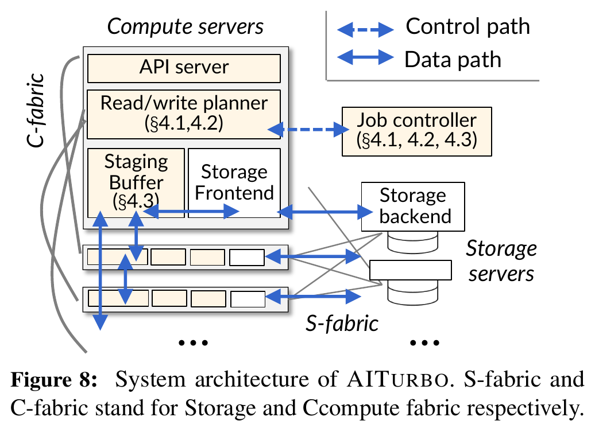

### 4.1 接口与两阶段完成语义

`group_getfile` 和 `group_putfile` 在普通文件接口上增加客户端组。调用方仍然指定对象和数据，只多提供“本次操作由哪些客户端共同参与”。存储系统据此收齐必要元数据，生成覆盖整组的读写计划，再让各客户端按计划传输。

写接口返回两个 Future（异步完成句柄）。`future_0` 表示数据已经进入 Host DRAM 暂存区，计算可以继续；`future_1` 表示数据已进入后端存储。这里的语义差别不是实现细节。若 `future_1` 完成前发生故障，AITurbo 会把相关文件标记为损坏，应用需回到上一个检查点或使用副本恢复。论文还讨论了在多台服务器内存中复制暂存数据，但没有给出覆盖多种故障组合的状态机和故障注入结果。

等待开销可以理解为“总 I/O 完成时间减去可与计算重叠的时间，结果小于零时按零计算”。AITurbo 一方面降低正文数据量并增加可用带宽，另一方面通过 `future_0` 扩大可重叠区间。两种收益必须分开测量，否则容易把“计算不再等待”误写成“数据已经持久化”。

### 4.2 组件边界与责任

| 组件 | 拥有的状态与决策 | 控制面或数据面 | 是否在关键路径 | 故障和扩展含义 |
|---|---|---|---|---|
| API Server | 接收普通或分组文件请求，维护调用语义 | 控制面入口 | 是 | 接口阻塞会推迟整组操作开始 |
| Job Controller | 汇总组内元数据、识别重复、求解并缓存读写计划 | 控制面 | 首次操作是；缓存命中后可跳过部分协调 | 论文称其为无状态服务，计划可重算或持久化；负载随成员数和块数增长 |
| Read/Write Planner | 在计算节点解释和执行控制器下发的本地计划 | 控制面与数据面交界 | 是 | 计划依赖拓扑、对象和容量；前提变化后应失效 |
| Staging Buffer Manager | 管理 Host DRAM 暂存容量、占用和生命周期 | 数据面 | 是 | 内存不足限制流水深度；未持久化数据丢失会缩短可恢复窗口 |
| Communicator | 建立 XPU、CPU 与节点间点对点传输 | 数据面 | 是 | 连接建立、重试和目标退出会影响分组完成 |
| Storage Frontend | 使用存储网络向后端读写对象 | 数据面 | 是 | 受节点存储网卡和后端配额共同限制 |
| Storage Backend | 持久化文件及副本 | 数据面 | 是 | 决定最终耐久性和冷读带宽 |

Job Controller 不集中转发正文。它生成计划并下发，实际数据由各 XPU、主机内存和存储节点直接参与传输。这避免了控制器成为正文带宽瓶颈，但控制器仍可能成为组创建、元数据汇总和首次计划生成的时延瓶颈。

### 4.3 一次分组写的生命周期

一次分组写可以拆成六个状态：组形成、元数据收集、重复识别、计划生成、内存暂存完成、后端持久化完成。论文接口明确暴露最后两个状态，但对组内成员超时、部分成员失败、计划执行一半后的幂等重试、取消和回滚没有给出完整协议。对训练检查点而言，应用可以依靠周期性保存和上一个检查点简化恢复；对在线 KVCache，这些缺口会直接影响数据能否安全发布和消费。

## 5 核心机制

### 5.1 写路径：去重、暂存、写回

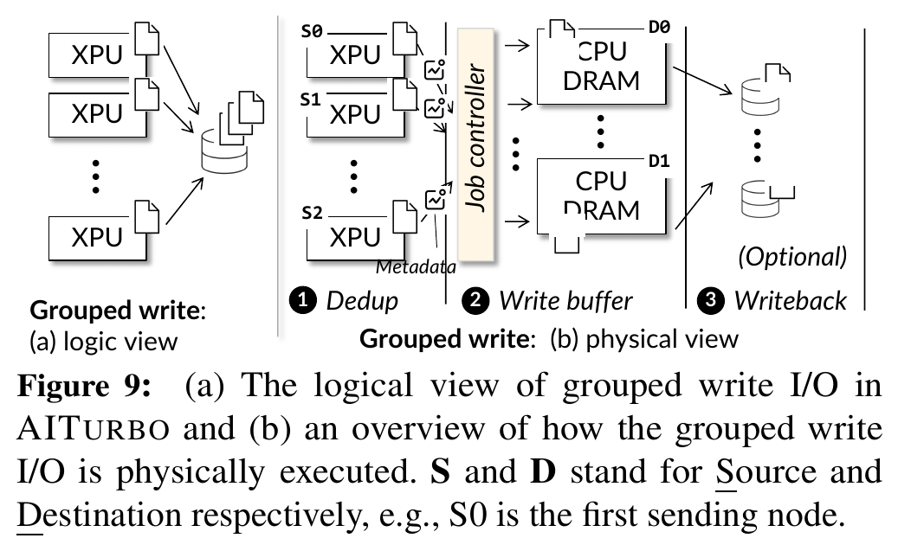

第一阶段由各 XPU 计算文件或块的 BLAKE3 校验和，并连同张量名等元数据提交给 Job Controller。控制器根据校验和识别重复块。第二阶段生成从源 XPU 到计算节点 Host DRAM 的负载均衡计划。第三阶段再从 Host DRAM 写回后端存储。块一旦到达暂存区就可以开始写回，不需要等整批数据全部落入内存。

第二、第三阶段可以按业务语义裁剪。若应用必须等持久化后才能继续，可以绕过内存暂存的提前完成语义；若检查点只用于故障恢复、不需要长期归档，也可以只保留内存副本而跳过后端写回。性能收益来自改变等待和流量位置，耐久性责任随之转移给应用与系统共同承担。

### 5.2 校验和去重：首次识别与稳定模式缓存

AITurbo 支持从 4 MB 块到整文件的重复检测粒度。粒度越细，潜在去重空间越大，控制元数据和计划变量也越多。论文偏向较大粒度，以降低求解复杂度。

测量数据表明，在 NVIDIA V100 上对 1 GB 文件计算 BLAKE3 用时 7.8 ms，在 Intel Xeon E5-2650 v4 CPU 上用时 35.6 ms。该对比支持把校验和计算放到 XPU 降低首轮识别成本，但硬件代际较旧，也没有覆盖国产 NPU 内核开发成本、与前台计算争用及不同块大小。

训练中的重复关系通常在若干轮后稳定，控制器可以缓存去重元数据和计划，后续由应用提示复用。作者指出，训练初期优化器状态可能全为零，产生暂时性重复；如果过早固定计划，后续非零状态会让缓存失效。这里的教训不是“前几轮不能去重”，而是重复关系必须绑定稳定性条件和版本，不能只看一次内容相同。

### 5.3 负载均衡计划：去重后仍要处理源端瓶颈

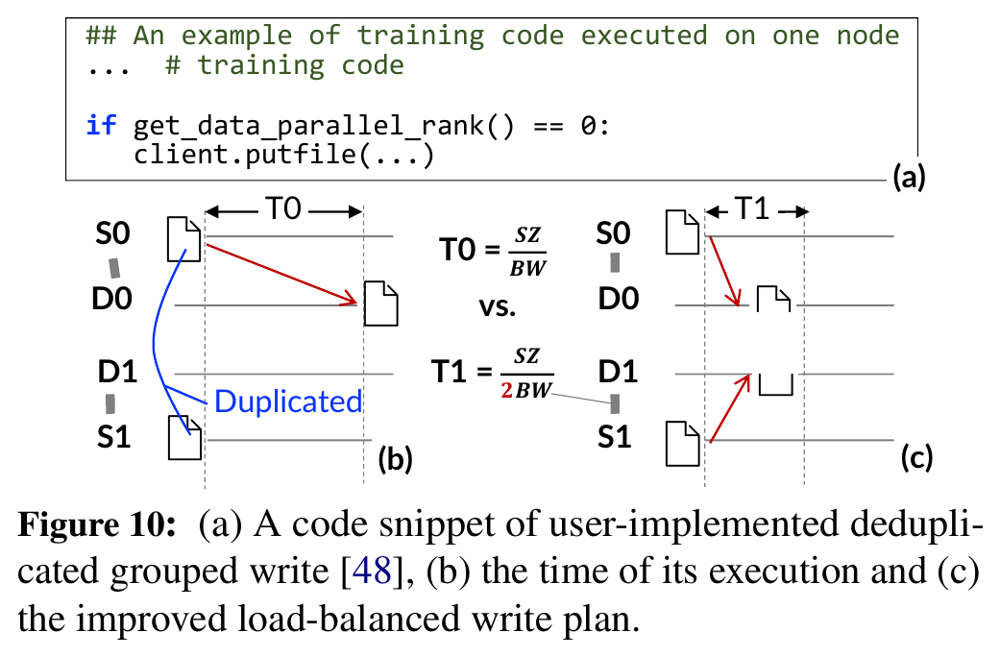

仅减少重复字节并不保证更快。若所有保留数据仍从 rank 0 发出，rank 0 的出口带宽会成为瓶颈，即使目的端和存储后端还有空闲能力也无法利用。Figure 10 给出一个复制因子为 2 的例子：应用侧只让 rank 0 写出，完成时间是负载均衡方案的约两倍。

论文把源节点、目的节点、数据块、复制因子、链路带宽和目的端内存容量纳入双线性规划。目标是最小化全组完成时间，而不是让每条链路看起来都满载。约束的物理含义包括：每个块恰好传输所需副本数；源只能发送自己拥有的块；同一目的端不能收到同一块的重复副本；源出口、目的入口和点对点链路不能超过带宽；目的端暂存量不能超过可用内存。

求解时，AITurbo 为总时间设上下界，固定候选时间后把问题化为线性可行性判断，再逐步收紧边界。论文称其采用 branch-and-bound 思路。38B 模型、64 个 XPU、每个 XPU 一个合并检查点文件的轨迹上，未优化的单线程 Python 求解器约 4 秒得到计划。原文没有证明该实现总能在 4 秒内得到严格全局最优，也没有展示变量规模增长曲线。训练能用首轮求解和计划缓存摊销这项成本，在线推理热路径不能直接接受。

### 5.4 分段流水：缩短关键路径，不减少总工作量

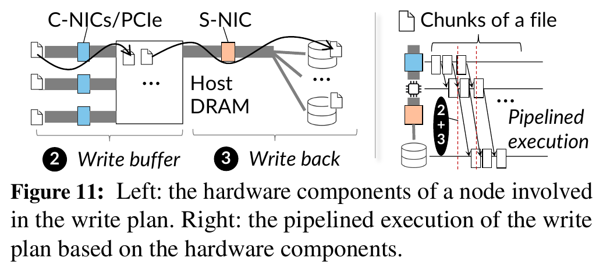

数据块到达 Host DRAM 后立即交给存储前端，内存暂存和后端写回按块流水。若暂存带宽、存储带宽和计算窗口配合得当，XPU 只需等待 `future_0`，后端写回可与下一轮计算重叠。

这项机制最容易被误读。它降低的是计算看到的停顿，不一定降低后端把全部字节持久化所需的时间。完整评估应同时记录 XPU 等待、后台排空时间、峰值 DRAM 占用、存储网卡吞吐和故障后可恢复点。只测 `future_0` 会把耐久性窗口藏起来。

### 5.5 读路径：单份回源与串行转发

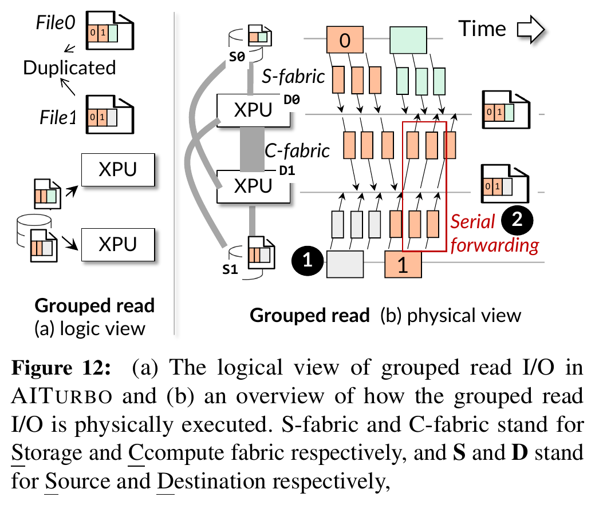

分组读取先确定每个重复块由哪个节点从存储读取，再把该块转发给其他请求者。第一阶段复用与写路径相近的负载均衡方法；第二阶段采用 BlitzScale 的串行 forwarding 链。作者依据大块广播的特点认为串行链接近最优，并让回源和转发按块重叠。

单份回源降低的是存储网络重复读取。它不自动解决所有网络拥塞：一对多链式分发的主要风险是源端出口、慢目标拖尾和链路故障；只有多个发送端同时向一个接收端汇聚正文时，才属于 Incast（多对一突发网络拥塞，即多个发送节点在短时间内向单一接收节点发包，导致交换机出端口队列积压）。论文没有做 Incast、慢接收端或取消成员专项实验。

AITurbo 还把组内节点的 Host DRAM 组成分布式缓存。若 D0 所需数据已经缓存在 D1，D0 可通过计算网络获取并绕过后端存储。该路径仍经过主机内存，不等同于远端 HBM（高带宽显存）直接读取。

### 5.6 张量文件、连接建立、服务质量与控制器恢复

AITurbo 的 tensor-native 文件把张量形状、类型等元数据与数值数组分开，正文可在 XPU 内存、Host DRAM 和存储之间搬运，避免应用层反复序列化。论文中的“直接传输”是指减少序列化，不表示正文绕过 Host DRAM。

通用集合通信库会为 all-reduce 等多种操作生成通信计划，冷启动可能需要数秒甚至数分钟。AITurbo 的读写计划已经决定了点对点关系，因此只建立实际需要的 RDMA Queue Pair（远程直接内存访问的发送与接收队列对）。论文给出的单对连接建立时间约 15 ms，并称可与存储初始化重叠。大规模并发建连、连接缓存失效和弹性成员退出仍未展开评测。

QoS（Quality of Service，服务质量，即通过优先级和带宽份额限制不同流量之间的干扰）方面，AITurbo 把自己的 RoCE QP 放到最低优先级，以尽力而为方式借用计算网络。作者讨论了 Strict Priority、ETS 和默认策略，也承认计算作业长期占满网络时，单靠硬件优先级可能不够；软件限速和共卡场景留作后续工作。

Job Controller 的计划可重算或持久化，论文因此把它设计为可重启、可多副本部署的无状态服务。这个结论只覆盖控制器本身。组内节点中途退出、部分暂存副本丢失、重复执行和跨租户授权没有得到同等强度的处理与验证。

## 6 实验设计与证据

### 6.1 平台、负载与基线

论文使用两类、最多 64 个 XPU 的集群：Ascend 910B NPU 配 64 GB HBM，以及 NVIDIA A800 GPU 配 80 GB HBM。每台计算节点有 8 个 XPU、192 个 CPU 核和 1.5 TB Host DRAM；计算网络为 200 Gbps，节点配一张 100 Gbps 存储网卡；后端存储带宽最高配置到 30 GB/s。

训练写入覆盖 1.5B、13B、38B 三个模型和有无 ZeRO 的六种组合。模型读取使用 Qwen 72B 与 QwQ 32B，改变 XPU 数量和 1 至 30 GB/s 后端带宽。KVCache 读取使用 Qwen 14B、8 个 XPU 和 Qwen-Bailian 真实轨迹，回放 30 分钟。

检查点写入基线是 Megatron 加 SFSTurbo、Gemini 或 AITurbo；模型读取基线是 ServerlessLLM；KVCache 基线是 Mooncake 加 SFSTurbo。三组实验的路径语义和基线不同，不能把不同图里的加速倍数相乘，也不能把某一组结果改写成普遍性能结论。

### 6.2 检查点写入：主收益来自内存暂存，去重和计划决定增量

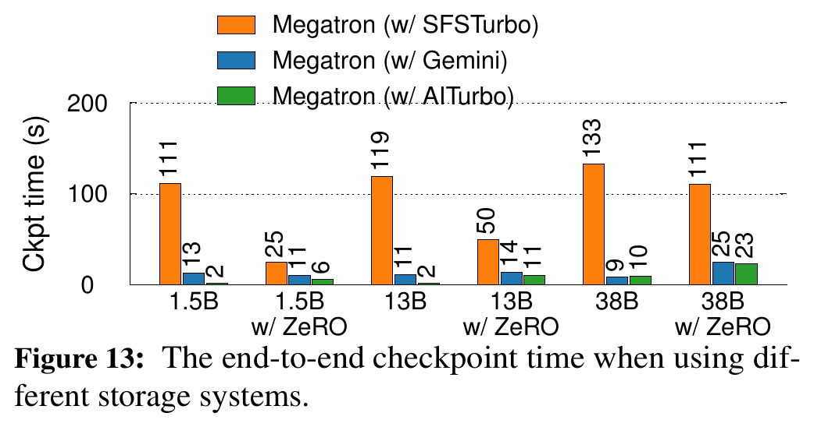

Figure 13 的柱上读数如下。图中为整数取整值，用于理解相对关系，不替代作者按未取整数值计算的加速倍数。

| 配置 | Megatron + SFSTurbo | Megatron + Gemini | Megatron + AITurbo | 直接观察 |
|---|---:|---:|---:|---|
| 1.5B | 111 s | 13 s | 2 s | 重复明显时，AITurbo 同时受益于暂存、去重和计划 |
| 1.5B + ZeRO | 25 s | 11 s | 6 s | 去重空间缩小，仍可借用计算网络 |
| 13B | 119 s | 11 s | 2 s | AITurbo 相对 Gemini 有明显增量 |
| 13B + ZeRO | 50 s | 14 s | 11 s | 三者差距缩小 |
| 38B | 133 s | 9 s | 10 s | 图中 AITurbo 略慢于 Gemini，不能声称全配置领先 |
| 38B + ZeRO | 111 s | 25 s | 23 s | AITurbo 与 Gemini 接近 |

测量数据支持 AITurbo 相对 SFSTurbo 加速 3.9 至 58.8 倍；在具有重复数据的配置中，相对 Gemini 最高快 5.9 倍。Figure 13 同时暴露了边界：当 Gemini 已经利用内存检查点、重复空间有限或计划收益不足时，AITurbo 的增量会变小，个别配置甚至略有回退。

### 6.3 消融：百分比是时间变化，不是重复率

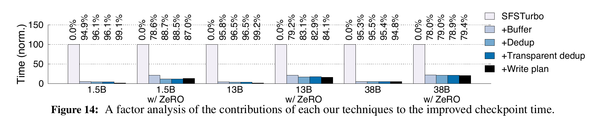

Figure 14 显示，使用计算网络和 Host DRAM 暂存是主要收益来源。对于存在数据并行重复的配置，加入去重后，检查点时间进一步下降 4.3% 至 47.2%；透明去重只在首次识别时增加成本，计划缓存后增量较小；负载均衡写计划在部分配置中继续把时间降低最多 76%。

4.3% 至 47.2% 描述的是特定消融步骤造成的时间下降，不是数据重复比例。不同机制的百分比也不能简单相加，因为每一步的基准已经变化，链路瓶颈会在机制加入后重新分配。

### 6.4 浪费 XPU 时间：这是模型输出

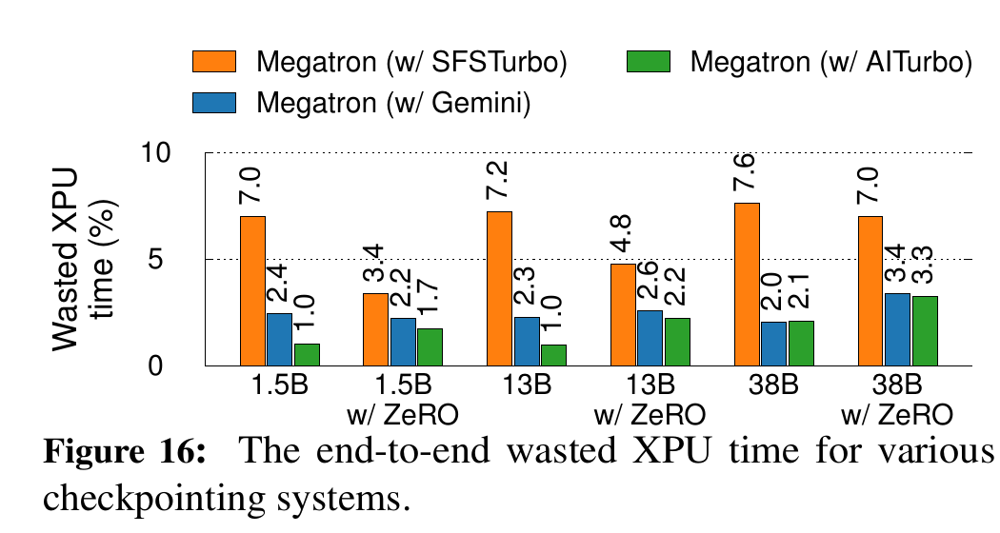

Figure 16 不是生产集群直接测得的“节省卡时”。作者采用既有公式，在“每个 XPU 每小时一次故障”的设定下，综合检查点停顿和故障后的重算损失，计算最优检查点频率对应的浪费 XPU 时间。模型输出显示，AITurbo 相对 SFSTurbo 最多降低约 6 个百分点。该结果说明更快的检查点允许更高频率保存，但具体数值受故障率、恢复成本和模型假设控制。

### 6.5 模型读取与 KVCache 读取：缓存热路径和冷路径必须分开

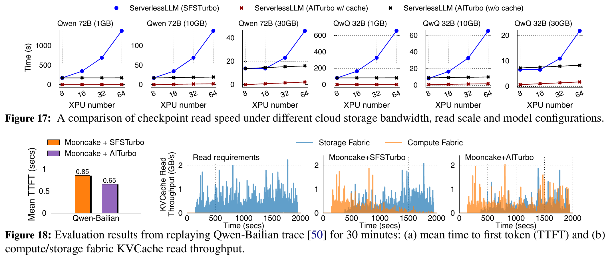

Qwen 72B 检查点为 135 GB，完整副本至少需要 8 个 XPU。后端存储为 1 GB/s、8 个 XPU、数据尚未缓存时，各系统读取约 173 秒，说明第一份冷数据仍受存储带宽限制。数据已进入参与节点 Host DRAM 后，AITurbo 把 Qwen 72B 部署到 64 个 XPU 用时 2.25 秒；ServerlessLLM 经 SFSTurbo 分发用时 1,384 秒。

由 1,384 除以 2.25 可得到约 615，但这是一条 DRAM 热缓存广播路径与慢存储分发路径的条件性比值，不是作者报告的同路径通用加速。合理结论是：已有一份缓存后，计算网络广播让扩容时间不再随重复存储读取线性增长；冷读第一份数据仍受存储供给约束。

KVCache 实验中，Mooncake 加 SFSTurbo 的平均 TTFT 为 0.85 秒，Mooncake 加 AITurbo 为 0.65 秒，论文报告下降 23%。吞吐曲线显示，SFSTurbo 路径在 DRAM 缓存逐步淘汰后增加存储网络读取；AITurbo 把部分读取放到计算网络。

证据边界必须单列：作者明确说明 Mooncake 实验没有使用 Grouped I/O API，因为运行中的推理实例难以同步。因此 Figure 18 支持“借用计算网络能够改善该实验中的 KVCache 存储未命中路径”，不支持“动态 KVCache 已完成分组协调验证”，也没有覆盖 TPOT（Time Per Output Token，每个输出 Token 的生成耗时）P99、多租户公平性或长期混压干扰。

### 6.6 工程改造量与协调开销

论文 Table 2 报告，Megatron 原有检查点优化涉及 2,228 行代码，接入 AITurbo 新增 286 行；Mooncake 修改 44 行。44 行只说明该 KVCache 实验的改造量较小，不能解释为 Mooncake 已完整接入 Grouped I/O。

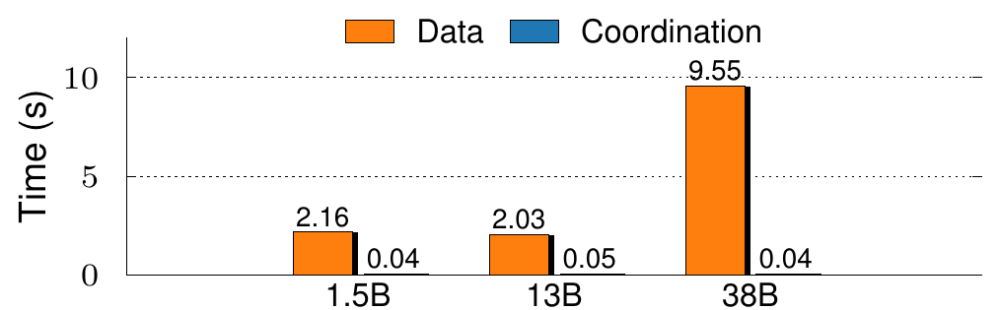

Figure 20 中，1.5B、13B、38B 模型的数据时间分别约为 2.16、2.03、9.55 秒，协调时间约为 0.04、0.05、0.04 秒；正文给出的最大协调开销是 45 ms。对秒级大块检查点写入，这一比例较小，缓存计划后还可跳过部分协调。该实验不能证明高频小对象、频繁变组或更大规模下的协调成本仍可忽略。

### 6.7 主张到证据的对应关系

| 主张 | 实验与条件 | 证据支持 | 证据不支持 |
|---|---|---|---|
| 借用 DRAM 和计算网络可降低检查点停顿 | Figure 13、14；六种训练配置 | 大块写入且计算网络有余量时，内存暂存是主要收益来源 | 所有集群都有足够余量；后台流量不会影响前台尾时延 |
| 存储层去重和全组计划能优于部分框架优化 | Figure 13、14；与 Gemini 对比 | 有重复且计划可复用时可继续降时 | 所有并行配置都高重复；所有配置都优于 Gemini |
| 单份回源和计算网络广播改善模型扩容 | Figure 17；已有 DRAM 缓存 | 热缓存存在时，多实例分发不必重复读存储 | 冷读不受存储限制；约 615 倍可普遍复现 |
| AITurbo 改善 KVCache 读取 | Figure 18；Qwen 14B、8 XPU、30 分钟轨迹 | 计算网络可补充该实验的存储读取带宽 | Grouped I/O 已用于动态推理；TPOT P99 和多租户隔离已验证 |
| Grouped I/O 协调开销较小 | Figure 20；64 XPU、大块检查点 | 该实验约 40 至 50 ms，相对秒级正文较小 | 小对象、频繁变组和更大规模仍可忽略 |

## 7 局限、隐含假设与开放问题

### 7.1 工作负载与规模

AITurbo 面向大块传输，论文直接承认小传输可能受益有限。收益依赖足够大的数据量、组内重复或可隐藏的异步窗口。若每个客户端读写完全不同的数据，去重和单份回源收益会消失，Grouped I/O 的主要剩余价值转向负载均衡和协调执行。

评估最多 64 个 XPU。论文没有给出更大组规模下的元数据汇总量、计划变量数、控制器吞吐、并发连接建立和成员故障增长曲线。4 秒求解器能否扩展到更多节点、更多块和多个并发作业仍是开放问题。

### 7.2 资源与拓扑

方案成立需要 Host DRAM 与计算网络存在余量。论文工作负载假定一组 XPU 独占相关服务器，没有覆盖多个作业共卡、共 NIC 或计算网络长期满载。借用现有资源不会增加存储带宽采购，但会消耗 DRAM、PCIe 和计算网络，仍有明确机会成本。

论文的存储网络和计算网络物理分离，且计算网络更快。如果部署只有一张共享网卡，或计算网络承担高占空比集合通信，流量转移可能不会扩大总带宽，只会改变竞争位置。

### 7.3 一致性、耐久性与安全边界

两阶段 Future 把“可继续计算”和“已持久化”分开，也把故障窗口交给应用。论文说明损坏标志、内存复制和回到上一个检查点，但没有给出重复提交幂等性、部分组成功后的回滚、控制器与数据面状态重建、跨租户授权和多故障注入结果。

BLAKE3 碰撞概率很低，不等于内容哈希可以代表完整语义身份。KVCache 是否可复用还取决于模型架构、Tokenizer 词表、提示词模板、LoRA 适配器、就绪状态和租约。论文的文件级去重语义不能直接替代项目的多维度语义一致性校验。

### 7.4 调度与动态分组

训练 rank 集合稳定，检查点周期重复，适合首轮求解后缓存。在线推理的请求到达、实例成员、前缀长度、目标缓冲和截止时间不断变化。等待完整组可能增加 TTFT，过早封组又会丢失后续共享机会。论文没有给出动态封组策略，也在 KVCache 评测中绕过了分组接口。

迁移到在线系统时，需要有截止时间的局部分组、允许迟到成员走独立路径、按目标完成和可取消传输，不能把训练中的全组屏障原样移植。

### 7.5 评测盲点

论文重点报告平均时间和吞吐，没有给出前后台共享计算网络时的 TPOT P99、训练 step time 尾部、丢包重传、PFC（按优先级暂停链路流量）传播、慢接收端拖尾和多租户公平性。推理能力尚未进入论文所述生产部署范围。Qwen-Bailian 是有价值的真实轨迹，但单个轨迹不足以覆盖不同前缀复用率、对象大小、并发到达与淘汰策略。

## 8 第一性原理评估

AITurbo 的性能逻辑在以下条件同时成立时比较稳固：存储网络是端到端瓶颈；组内有重复内容或一对多分发需求；计算网络和主机内存有余量；I/O 足够大，能够摊销协调、哈希和连接成本；计算存在可重叠窗口；应用能够接受暂存完成与持久化完成之间的故障语义。

任一条件破坏后，收益都会缩小。没有重复时，单份回源无法减少字节；计算网络已满时，转发会与前台通信争用；数据较小时，几十毫秒协调可能超过正文传输；必须同步持久化时，`future_0` 不能提前释放计算；成员持续变化时，全局计划和同步 group 难以复用。

从本文证据看，Grouped I/O 所暴露的组级意图是更稳固、也更容易跨系统迁移的设计原则。Host DRAM 暂存、双线性求解和串行转发链是条件性实现。把四者绑定为一个不可拆分方案，会掩盖它们不同的适用边界。

## 9 对统一异构 KVCache 存储与调度底座的映射

### 9.1 迁移判断

| 论文抽象 | 底层原则 | 项目对应 | 迁移级别 | 所需改动与验证 |
|---|---|---|---|---|
| Grouped I/O | 执行前暴露相关请求的共同意图 | 批量访问意图、张量并行组上下文、一对多共享计划 | 条件可迁移 | 按请求截止时间形成可缩减组，不等待动态实例全局屏障；记录迟到、取消和成员退出 |
| 两阶段 Future | 把阶段完成与最终耐久性分开 | 异步任务票据、设备可见、可消费发布和持久化状态 | 可直接迁移的语义原则 | 至少区分 DMA 完成、目标可见、语义校验通过、目录发布和持久化，不能把传输完成当成可消费 |
| 去重与负载均衡计划 | 先减少逻辑重复，再平衡物理瓶颈 | 公共前缀发布、批量描述符、后台持久化 | 条件可迁移 | 在内容指纹外增加模型、词表、模板、适配器、就绪位和租约校验；跨租户共享需单独授权 |
| 单份回源后转发 | 降低源端重复读取，使用另一条网络分发 | 软件分层中继转发（Staging Fanout，即由集群节点形成树状中继拓扑，分层接力分发相同 KV 数据） | 条件可迁移 | 论文验证的是串行链，项目树状中继需独立测量源端字节、全网字节、末目标完成和慢节点隔离 |
| 计划缓存 | 稳定模式只求解一次 | 热点前缀模板、固定张量并行组路径缓存 | 条件可迁移 | 缓存绑定拓扑、硬件能力、对象版本和策略版本；任何前提变化后失效 |
| 4 秒级全局求解 | 用全组视图换取负载均衡 | 查询与放置计划决策引擎（QueryPlan，即根据链路、算力与上下文长度选择加载或重算路径） | 仅作启发 | 热路径采用微秒级启发式；全局求解器用于离线模板和近似误差校准 |
| Host DRAM 暂存 | 用内存容量和异步窗口换取存储带宽 | DDR 条件路径 | 不作为默认主路径 | 默认保持 Host CPU 零数据拷贝，优先 HBM、网卡和存储设备直达；启用 DDR 时单独统计 CPU 正文访问、DDR DMA 和 PCIe 往返 |
| RoCE 最低优先级 | 后台流量让位于前台业务 | 前后台服务质量保障策略（SemanticQoS，即结合硬件队列和应用层退避限制后台搬运干扰） | 仅作启发 | 需要硬件优先级、接收端反压和应用层退避组合验证，不能用队列配置代替 TPOT 尾部实测 |

### 9.2 不能混淆的三组边界

第一，AITurbo 的 Host DRAM 暂存不等于本项目的数据直达。Direct-View（远端直读，即通过高速总线直接读取远端显存中的 KV 数据，不在本地显存生成完整副本）和 Copy-to-HBM（拷贝到本地显存，即通过 DMA 把远端 KV 完整搬入本地 HBM）都以设备数据路径为中心；AITurbo 明确把 Host DRAM 放在正文路径中。论文可以证明“利用第二条网络与暂存容量有机会缓解存储瓶颈”，不能证明绕过主机内存的直达能力。

第二，文件持久化完成不等于 KVCache 可消费。统一底座还要检查模型、词表、提示词模板、适配器、就绪位与租约，并让张量并行多卡保持统一状态。AITurbo 没有这些 KVCache 消费条件，项目必须单独设计发布、撤销和回退到本地重算的状态机。

第三，单份回源不等于树状广播已经验证。论文采用串行链式转发，项目的软件分层中继会改变源端压力、全网字节、首目标和末目标完成时间，也会引入中继失效。需要实测比较，不能把论文 Figure 12 直接当作树状方案证据。

### 9.3 建议验证

1. 一对多拓扑对照。固定 0.5 MB、1 MB、4 MB、8 MB 的只读 KV 数据，对 2、4、8、16 个目标比较源端逐一单播、AITurbo 式串行链和软件树状中继。记录源端出口字节、全网字节、首目标与末目标完成时间、慢目标隔离、重传和取消结果。

2. 共享计算网络混压。前台运行张量并行推理，后台持续执行 KV 拉取、换出和一对多分发，分别测试无隔离、仅硬件优先级、硬件优先级加应用层退避。前台记录 TTFT、TPOT P50/P99 和 QPS，后台记录有效吞吐与饥饿时间。只有同场次数据才能判断计算网络是否真的有可借用余量。

3. 直达与 DDR 暂存对照。在相同对象大小、队列深度和拓扑下，比较远端 HBM 到本地 HBM 直达、NVMe SSD 到 HBM 直达和受控 Host DRAM 暂存。分别统计 CPU 正文访问、DDR DMA 字节、PCIe 往返、有效带宽和尾部时延，避免把“CPU 没有执行 `memcpy`”误写成“正文绕过 DDR”。

4. 动态封组与计划摊销。使用稳定张量并行组、弹性扩缩容、热点突发和成员退出四类负载，对比离线全局计划、缓存模板和微秒级局部决策。记录封组等待、计划生成、缓存命中、失效原因、实际最优路径和决策后悔值，找出全局视图收益与等待成本的交叉点。

5. 完成语义故障注入。分别在暂存完成、DMA 完成、目标设备可见、语义校验、目录发布和持久化前后注入进程退出、节点掉电和链路超时。核对是否可能消费未完成数据、是否重复发布、能否安全回退重算，以及多卡组是否统一停止。

6. E3 全链路混压验证。E3（全链路前后台混压阶段，即在真实 2 节点集群中同时运行在线推理与后台满载 I/O）应继续核对 TTFT 降低是否达到 20%、QPS 是否提升至少 10%、前台 TPOT 干扰是否低于 3%。这些是项目目标，不是 AITurbo 论文已经取得的结果。

## 10 最终判断

AITurbo 说明，AI I/O 的优化单位不能永远停留在单文件、单请求。应用把客户端组和共同操作意图暴露给存储层后，存储层才有条件减少重复字节，并在存储网络、计算网络与 Host DRAM 之间重新安排数据流。训练检查点写入和模型扩容实验为这套逻辑提供了较强证据。

论文的适用边界也很清楚。生产部署证据集中在训练；动态 KVCache 实验没有使用 Grouped I/O；第一份冷读仍受存储带宽限制；Host DRAM 暂存引入耐久性窗口和资源竞争；4 秒级计划求解依赖稳定模式摊销；硬件 QoS 没有覆盖在线尾部时延。

因此，统一异构 KVCache 存储与调度底座应吸收组级意图、两阶段完成、单份回源和计划缓存的原则，把 Host DRAM 暂存、串行转发和全局求解器保留为可替换实现。是否进入主路径，最终由国产 NPU、URMA（通用远程直接内存访问，即用户态高性能 RDMA 驱动接口与通信协议）、UBMEM（统一总线内存直通共享协议，即跨节点与异构设备共享内存地址空间的底层协议）上的数据直达、混压干扰和故障注入结果决定。
