# AITurbo FAST 2026 分组输入输出云存储论文解构与项目启示 V3

> 文档版本：V3  
> 论文：Fast Cloud Storage for AI Jobs via Grouped I/O API with Transparent Read/Write Optimizations  
> 会议：24th USENIX Conference on File and Storage Technologies FAST 2026  
> 作者：Yingyi Hao、Ting Yao、Xingda Wei、Dingyan Zhang、Tianle Sun、Yiwen Zhang、Zhiyong Fu、Huatao Wu、Rong Chen  
> 机构：上海交通大学并行与分布式系统研究所、华为云  
> 读者：统一异构大模型注意力键值缓存存储与调度底座研发团队、架构评审人员  
> 原文：[同目录 PDF](<[FAST 2026] Fast Cloud Storage for AI Jobs via Grouped IO API with Transparent Read Write Optimizations.pdf>)

本文使用以下项目术语：

- KVCache（大模型注意力键值缓存，即自回归生成时保存历史 Key 与 Value 激活张量，避免后续 Token 重复计算注意力）。
- TTFT（Time To First Token，首 Token 响应时间）。
- TPOT（Time Per Output Token，每个输出 Token 的生成耗时）。
- Host CPU 零数据拷贝（CPU 只下发控制指令，不搬运正文数据，Host Payload Touch Bytes 严格为 0）。
- UBMEM（统一总线内存直通共享协议，即跨节点和异构设备共享内存地址空间的底层通信协议）。
- URMA（通用远程直接内存访问，即用户态高性能 RDMA 驱动接口与通信协议）。
- Direct-View（远端直读，即跨节点直接读取远端显存中的 KV 数据，不在本地 HBM 保存完整副本）。
- Copy-to-HBM（拷贝到本地显存，即通过 DMA 把远端 KV 数据搬入本地 HBM）。
- QueryPlan（查询与放置计划决策引擎，即按链路、介质、算力和上下文状态选择加载、远端直读或重算路径）。
- SemanticQoS（前后台服务质量保障策略，即用硬件优先级与应用层退避限制后台搬运对前台 TPOT 的影响）。

## 1 一页读懂论文

### 1.1 论文解决什么问题

云上 AI 训练和推理会集中读写数十 MB 到数百 GB 的 Checkpoint 与 KVCache。计算节点通常有两套网络：加速器之间的计算网络带宽高，连接存储服务器的存储网络带宽低且按容量和性能收费。现有文件接口一次只暴露一个客户端的一次读写，存储层看不到“哪些加速器正在共同完成同一批 I/O”，因此无法统一消除重复数据，也无法在所有计算节点、存储节点和两套网络之间生成负载均衡的数据计划。

### 1.2 根因是什么

表面症状是存储带宽不足，根因有两层。

第一，AI 集群把高带宽资源主要配置给加速器通信，存储网络的前端带宽受每台计算服务器的存储网卡限制，后端带宽扩容又需要增加存储服务器。论文给出的华为云配置示例中，单 XPU 计算网络为 200 Gbps，而每台计算节点共享的存储网络为 100 Gbps；存储带宽从 1.6 GB/s 提高到 80 GB/s 时，论文报告每 GB 价格约增加 16 倍。该数字是论文所在云环境的计价观察，不能直接外推到其他云。

第二，传统单请求 API 隐藏了组级意图。应用知道多个 Rank 会同时读写同一批文件，但存储只看到相互独立的请求。重复数据识别、发送端分散、接收端均衡、单份回源和一对多转发只好由每个训练或推理框架自行实现。

### 1.3 核心洞察是什么

如果应用把参与同一批 I/O 的客户端组显式交给存储层，存储层就能同时看到数据重复关系、节点带宽、缓存容量和底层分片位置。它可以先减少需要访问受限存储网络的数据量，再借用闲置的主机内存和计算网络完成暂存与分发。

论文做的是两次资源重排：

```text
单客户端文件调用
  -> 组级读写意图
  -> 跨客户端去重和统一计划

受限的存储网络带宽
  -> 主机内存暂存加计算网络转发
  -> 降低存储网络重复流量和等待时间
```

### 1.4 核心抽象是什么

Grouped I/O（分组输入输出，即一次调用同时声明参与同一批读写的客户端集合）是论文的核心抽象。`group_getfile` 和 `group_putfile` 在普通文件键、张量和缓冲区参数之外增加 `group`。组不是由存储层猜测，应用必须显式提供。

分组写还返回两个完成事件。`future_0` 表示数据已进入计算节点的主机 DRAM 暂存区，训练可以继续；`future_1` 表示数据已经写入后端存储。若 `future_1` 完成前暂存副本全部丢失，文件被标记为损坏，应用需要回退到上一个 Checkpoint 或其他恢复路径。这不是同一个“写完成”状态的快慢差异，而是两种持久性语义。

### 1.5 三项关键机制

1. 计算网络辅助的主机内存暂存。系统把各计算节点的空闲 DRAM 组织成暂存池，并用计算网络在节点间搬运数据，减少应用等待受限存储网络的时间。Checkpoint 写入用内存完成事件提前释放训练流水，Checkpoint 与 KVCache 读取用计算网络分发已回源的数据。
2. 分组写入的去重与负载均衡计划。XPU 计算 BLAKE3 校验和，控制器识别重复 Chunk，再根据发送端带宽、接收端带宽、链路带宽、复制数和暂存容量生成写计划。计划把数据分散到不同主机内存和存储服务器，并把暂存与写回做成流水。
3. 分组读取的单份回源与计算网络转发。重复 Chunk 只从存储读取一份，随后沿计算网络转发给其他请求者。系统还可直接从其他计算节点的主机缓存读取，避开后端存储。

张量原生文件、点到点连接、计划缓存和 RoCE 硬件优先级属于支撑机制。它们影响实现成本和隔离能力，但没有改变论文的核心抽象。

### 1.6 最重要的实验结果

- [实测数据] 在最多 64 个 XPU 的 Checkpoint 写入实验中，AITurbo 相对通用云存储 SFSTurbo 快 3.9 到 58.8 倍；相对使用主机内存暂存但缺少透明去重和统一写计划的 Gemini，最高快 5.9 倍。该优势不是所有配置都成立：38B、无 ZeRO 时，Figure 13 中 AITurbo 为 10 秒，Gemini 为 9 秒。
- [实测数据] Figure 17 的 Qwen 72B 扩容实验中，当一份 135 GB Checkpoint 已缓存在参与节点的主机内存后，AITurbo 在 64 个 XPU 上用 2.25 秒完成加载。若 8 个 XPU 只能从 1 GB/s 存储回源，所有系统都需要约 173 秒，说明首份数据仍受存储带宽限制。
- [实测数据] 在 8 个 XPU、Qwen 14B、30 分钟 Qwen-Bailian 轨迹上，Mooncake 接入 AITurbo 后平均 TTFT 从 0.85 秒降到 0.65 秒，降低 23%。这项实验没有使用 Grouped I/O API，论文明确说明动态推理实例难以同步分组；结果只支持“计算网络可补充存储回源带宽”，不能证明在线 KVCache 动态分组已经成立。
- [实测数据] 64 个 XPU 的分组协调耗时约 40 到 50 ms，论文正文报告最大 45 ms。对秒级 Checkpoint I/O 占比较小，对亚秒级在线请求则可能进入关键路径。

### 1.7 最大局限

AITurbo 的生产部署集中在训练 Checkpoint，推理扩展仍在进行。论文没有验证动态 KVCache 分组、P99 TTFT、TPOT 干扰、多租户共置、设备到存储直达、多卡消费一致性或失效中的分发恢复。主数据路径依赖 Host DRAM 暂存，也不满足本项目“Host CPU 零数据拷贝”的目标路径要求。

### 1.8 与本项目的关系

- 必要性证据：论文独立确认了 AI 大块读写受存储网络带宽和重复回源限制，Agent 请求中确有短时间共享前缀的成组 KVCache 读取。
- 可行性证据：组级意图能让存储统一生成去重、负载均衡和一对多分发计划；借用计算网络可降低受限存储网络的重复读取。
- 差异化空间：论文没有解决微秒级动态选路、Host CPU 零数据拷贝、异构介质直达、语义一致性、多卡状态同步和前后台尾部时延隔离。
- 剩余举证责任：本项目仍须独立验证 URMA、UBMEM、Direct-View、Copy-to-HBM、SSD 直达、动态 QueryPlan、树状转发和 E3 混压目标。

## 2 问题为何值得解决

### 2.1 双网络架构把带宽和成本约束分开

Figure 1 给出了论文所处集群的物理前提。XPU 之间通过独立计算网络通信，每个 XPU 可获得约 200 Gbps；存储流量经过计算节点共享的 S-NIC 进入存储网络，每节点约 100 Gbps。前端存储带宽由 S-NIC 汇总能力限制，后端存储带宽由为该作业分配的存储服务器数量决定。增加后端服务器不能突破前端 S-NIC 上限。

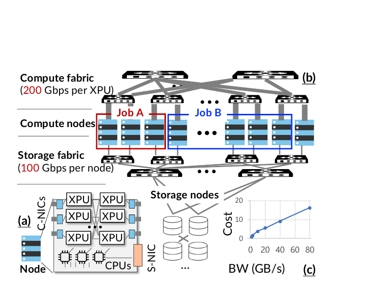

*图 1：计算网络、存储网络、计算节点和存储节点的关系。摘自论文 Figure 1，PDF 第 3 页。*

这解释了为什么“给存储加带宽”不是单一动作。后端扩容增加成本，前端链路仍可能限速；相反，计算网络已经随 XPU 配置，训练或推理并不持续打满它。AITurbo 因而把计算网络视为一条可借用的数据通道。

### 2.2 三类工作负载有共同的批量与重叠特征

论文覆盖三类路径。

- Checkpoint 写入：训练各 Rank 周期性写模型参数和优化器状态。数据总量可达数百 GB，部分并行配置会在不同 Rank 之间产生重复参数或优化器状态。
- Checkpoint 读取：训练故障恢复或推理扩容需要把同一模型复制到多组 XPU。单份模型加载后，后续实例仍需要相同内容。
- KVCache 读取：KVCache（大模型注意力键值缓存，即保存历史 Key 与 Value 激活张量以避免重复计算）中的共享前缀可被多个 Agent 请求复用。

这些路径都是大块、顺序、可异步的 I/O。写入可与下一轮前向和反向计算重叠；读取可按层与模型执行交叠。但重叠只在 I/O 早于对应计算依赖完成时有效。一旦数据未及时到位，训练迭代、扩容或首字生成都会停住。

### 2.3 KVCache 确实出现成组读取但分组边界仍难确定

论文用真实 Agent 服务轨迹分析了共享前缀请求。Figure 6 中多个时间点出现同一秒内 3 到 6 个共享前缀请求，说明单份 KVCache 回源后分发并非人为构造的场景。

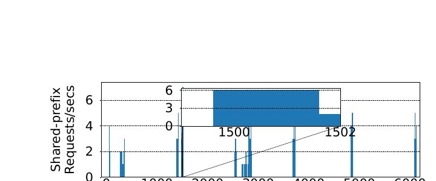

*图 2：真实 Agent 轨迹中的共享前缀请求突发。摘自论文 Figure 6，PDF 第 6 页。*

但“存在短时重复”与“应用能及时声明稳定 group”是两件事。论文在 §5.4 承认，Mooncake 实验没有使用分组 API，因为运行中的推理实例难以同步。这正是从训练迁移到在线 KVCache 时最大的抽象缺口：训练 Rank 组天然存在，在线请求组是动态形成的，成员会迟到、取消或超时。

## 3 核心抽象与系统架构

### 3.1 Grouped I O 把什么新信息交给存储层

传统 `getfile` 和 `putfile` 只告诉存储“这个客户端要读写这个键”。分组接口增加了三个可利用的信息维度：参与者集合、这一批调用的共同时间边界、跨文件和跨客户端的整体数据集合。存储因此能在执行前构造全局计划，而不是等请求逐个到达后被动处理。

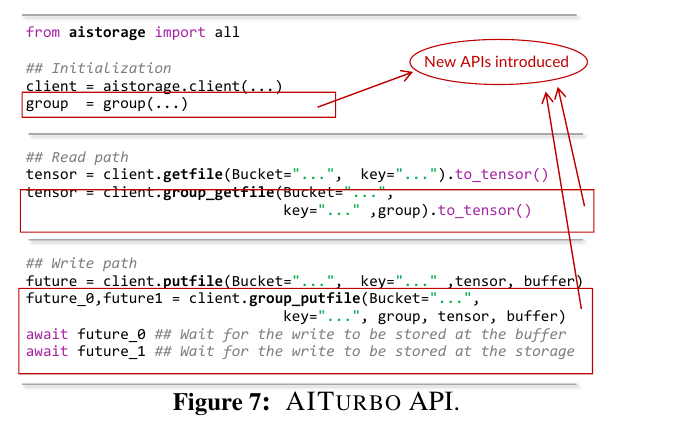

*图 3：普通文件接口与分组读写接口，以及分组写的两阶段完成事件。摘自论文 Figure 7，PDF 第 6 页。*

`future_0` 和 `future_1` 还把“可继续计算”与“后端持久化完成”分开。对可重算的周期性 Checkpoint，应用可在 `future_0` 完成后继续训练；需要调试保留或强持久性的写入必须等待 `future_1`。这种完成语义分离值得保留，但必须把故障条件写进接口契约，不能把暂存完成描述为持久完成。

### 3.2 控制面和数据面如何分工

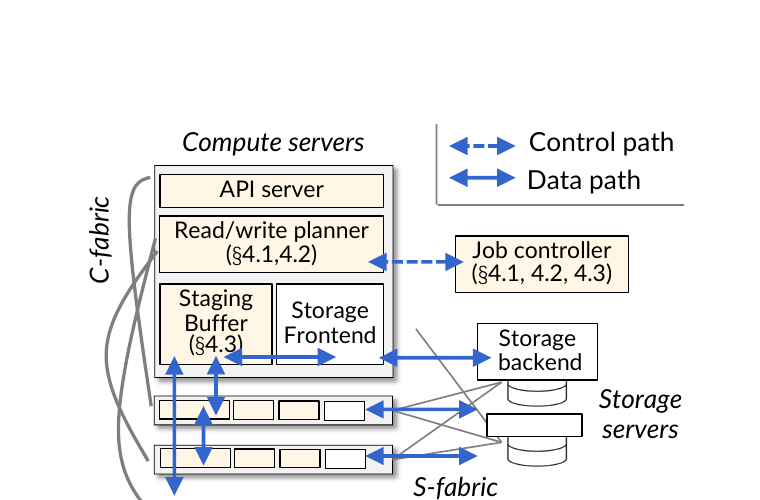

*图 4：AITurbo 的控制路径、数据路径、计算网络和存储网络。摘自论文 Figure 8，PDF 第 7 页。*

| 组件 | 主要责任 | 持有状态 | 是否在关键路径 | 失效或扩展风险 |
|---|---|---|---|---|
| API Server | 接收普通或分组读写，返回完成事件 | 调用上下文 | 是 | API 等待会直接增加 I/O 启动时延 |
| Job Controller | 汇总组元数据，生成和下发计划 | 可缓存的去重关系与读写计划 | 首次计划在，复用时可旁路 | 论文称控制器无状态，可重算或持久化计划，但未给出恢复期间的组操作语义 |
| Read Write Planner | 根据节点、链路、容量和分片信息求解计划 | 拓扑与带宽参数 | 首次操作在 | 38B 64 XPU 示例求解约 4 秒，不适合在线逐请求运行 |
| Staging Buffer Manager | 管理各节点空闲 Host DRAM | 缓冲区容量与分配 | 数据路径在 | 内存压力、NUMA、共置作业和暂存副本丢失都会影响完成语义 |
| Communicator | 通过计算网络执行点到点传输和转发 | 连接与队列 | 数据路径在 | 动态建链、流量干扰和慢节点会影响尾部时延 |
| Storage Frontend Backend | 执行原有云存储访问 | 文件元数据与后端分片 | 数据路径在 | 首份回源仍受前后端存储带宽限制 |

AITurbo 没有替换云存储后端，而是在计算节点侧增加统一计划和暂存层。控制面决定“哪一份数据从哪里到哪里”，每个 XPU 和节点的数据面按计划执行。计算网络和存储网络同时参与，数据不再只沿一条固定路径流动。

## 4 三项关键机制

### 4.1 机制一 主机内存暂存与计算网络借道

解决的问题是存储网络带宽不足时，训练或推理必须等待远端存储。AITurbo 把闲置 Host DRAM 变成快速暂存区，并用计算网络把数据送往其他节点。写入先到 DRAM，后端写回在后台继续；读取先由少量节点访问存储，再通过计算网络扩散。

它有效的前提很直接：主机内存有足够可用容量，计算网络在 I/O 时间窗内有余量，而且应用允许暂存状态与持久状态分离。资源交换关系是：

```text
Host DRAM 容量加计算网络带宽
  -> 减少受限存储网络的同步等待
  -> 以暂存副本故障风险和网络干扰为代价
```

[论文事实] 暂存池容量可由开发者配置，也可通过 Linux cgroup 画像确定。Checkpoint 写入时，若暂存区能容纳完整 Checkpoint，就可以把后端写入从训练迭代关键路径移走。

[局限] 论文假设同一计算服务器不共置其他作业，并使用 RoCE 最低优先级队列做尽力而为隔离。主机内存是否真的闲置、低优先级流量是否产生 Incast（多对一突发拥塞，即多个发送方同时挤压一个接收端口）以及后台写回是否干扰前台计算，都没有在复杂共置场景下验证。

### 4.2 机制二 分组写去重与带宽感知计划

#### 4.2.1 去重不是最终目标

AITurbo 先由 XPU 对文件或 4 MB Chunk 计算 BLAKE3 校验和，再把校验和和张量元数据交给 Job Controller。论文的 V100 微基准中，1 GB 数据的校验从 CPU 的 35.6 ms 降为 XPU 的 7.8 ms。校验和识别出可以只写一次的重复 Chunk，但只删掉重复流量仍不够；若剩余数据全部由一个源节点发送，该节点的出带宽会成为新瓶颈。

#### 4.2.2 计划器优化完成时间而非链路利用率

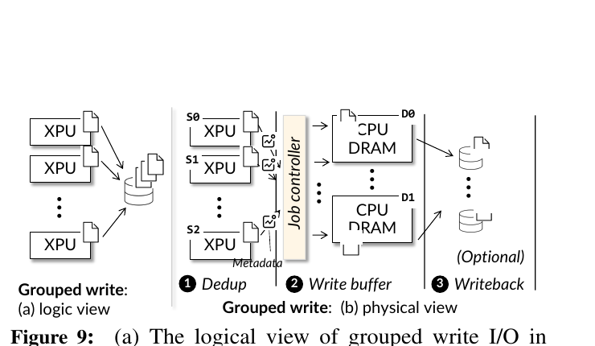

*图 5：分组写依次完成去重、主机内存暂存和后端写回。摘自论文 Figure 9，PDF 第 7 页。*

计划器的目标是最小化整组写入完成时间。它同时约束每个源节点实际拥有的 Chunk、每个 Chunk 的复制数、发送端和接收端带宽、节点间链路带宽以及目标暂存容量。某些链路可以空闲，只要启用它们不能缩短全组完成时间。

原问题是双线性规划。论文通过对完成时间 `t` 做上下界搜索，把每次候选 `t` 下的问题化为线性可行性判断。38B、64 XPU、每 XPU 一个合并 Checkpoint 文件的示例中，未优化的单线程 Python 求解器约 4 秒生成计划。这个结果说明离线或首轮规划可行，不支持微秒级在线求解。

#### 4.2.3 稳定模式靠缓存摊销

训练多轮 Checkpoint 的并行配置和重复关系通常不变，AITurbo 缓存首轮去重元数据和写计划。初始若优化器状态大量为零，内容校验可能把暂时相同的数据误判成长期稳定重复模式；论文因此等模式稳定后再复用计划。数据进入暂存区后立即开始后端写回，两个阶段按 Chunk 流水执行。

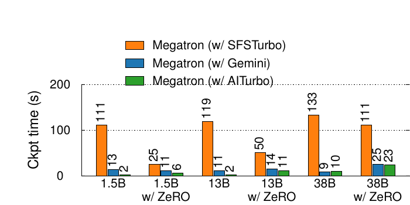

*图 6：六种模型与 ZeRO 配置下的 Checkpoint 写入耗时。摘自论文 Figure 13，PDF 第 11 页。*

Figure 13 的柱上读数如下。数值单位为秒。

| 配置 | Megatron 加 SFSTurbo | Megatron 加 Gemini | Megatron 加 AITurbo |
|---|---:|---:|---:|
| 1.5B | 111 | 13 | 2 |
| 1.5B 加 ZeRO | 25 | 11 | 6 |
| 13B | 119 | 11 | 2 |
| 13B 加 ZeRO | 50 | 14 | 11 |
| 38B | 133 | 9 | 10 |
| 38B 加 ZeRO | 111 | 25 | 23 |

这组结果说明两点。把写入先落到内存已经贡献了大部分收益；存在数据并行重复时，透明去重和写计划还能继续缩短时间。它也给出一个反例：38B 无 ZeRO 时，AITurbo 没有超过 Gemini。报告“最高 5.9 倍”不能改写成所有配置都更快。

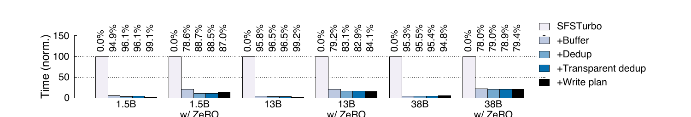

*图 7：依次加入暂存、去重、透明去重和写计划后的 Checkpoint 时间。摘自论文 Figure 14，PDF 第 12 页。*

[实测数据] 论文正文报告，在包含数据并行重复的配置中，去重进一步减少 4.3% 到 47.2% 的 Checkpoint 时间；负载均衡写计划最高再减少 76%。透明检测只在首次执行，计划缓存后附加开销很小。

### 4.3 机制三 单份回源与计算网络转发

分组读的核心是把受限资源只访问一次。对于多个客户端需要的重复 Chunk，AITurbo 从存储读取一份到一个计算节点，再经计算网络送到其余节点。读取与转发按 Chunk 流水；若某节点的 Host DRAM 已缓存目标数据，可直接走计算网络，跳过存储回源。

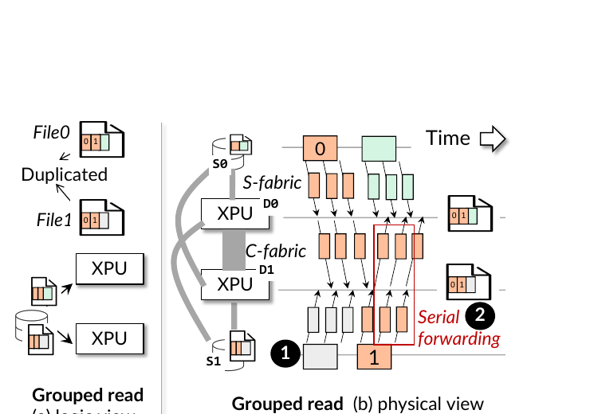

*图 8：单份存储回源与计算网络串行转发。摘自论文 Figure 12，PDF 第 9 页。*

论文复用 BlitzScale 的串行转发链，理由是大块 Checkpoint 广播中接近最优。该结论不能直接套到在线 KVCache：串行链会把慢节点、重传和排队延迟向后传播；小块、短期限请求更关心完成时间分位数，而不只是总吞吐。

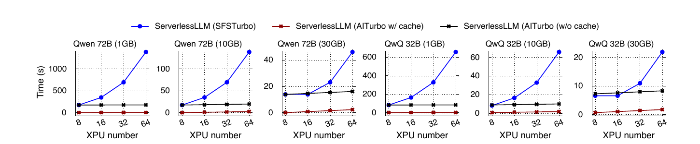

*图 9：不同模型、存储带宽和 XPU 数量下的 Checkpoint 读取时间。摘自论文 Figure 17，PDF 第 13 页。*

Figure 17 还揭示了单份回源的边界。在 1 GB/s 后端带宽且没有缓存时，读取 135 GB Qwen 72B 到 8 个 XPU 需要约 173 秒，各系统都被首份数据限制。已有缓存时，计算网络带宽随参与 XPU 数增加，AITurbo 的分发时间对规模不敏感。这支持“避免重复回源”，不支持“消除冷读存储瓶颈”。

### 4.4 支撑机制为何重要

张量原生文件把 shape 和 dtype 等元数据与连续数值载荷分开，使数据可以在 XPU、CPU 和存储之间直接传输，避免框架对象的序列化和反序列化。论文没有验证 Host Payload Touch Bytes 为 0；数据仍落入 Host DRAM，因此它是减少软件序列化，不是 Host CPU 零数据拷贝。

通信库不使用完整 NCCL Group 初始化，而只建立实际计划需要的点到点 RDMA QP。论文报告单对连接约 15 ms，可与存储初始化重叠。对长训练作业可摊销，对动态在线请求仍偏重。

性能隔离只使用 RoCE QoS（服务质量，即用硬件优先级和带宽份额区分流量），AITurbo QP 被放在最低优先级。论文没有提供应用层自适应限速、拥塞反馈或多租户公平性数据。

## 5 实验到底证明了什么

### 5.1 评测平台

[论文事实] 评测使用两套最多 64 个 XPU 的集群，一套为 64 GB HBM 的 Ascend 910B NPU，另一套为 80 GB HBM 的 NVIDIA A800。每台计算节点有 8 个 XPU、192 个 CPU 核和 1.5 TB Host DRAM；计算网络为 200 Gbps，每节点通过一张 100 Gbps S-NIC 接入存储网络；后端存储带宽最高配置到 30 GB/s。

这个平台覆盖了国产 NPU 与 NVIDIA GPU，但论文没有给出 URMA、UBMEM 或设备到 SSD 直达路径。Ascend 结果不能自动成为本项目底层协议性能证据。

### 5.2 主张与证据矩阵

| 论文主张 | 实验和基线 | 结果 | 能证明什么 | 不能证明什么 |
|---|---|---|---|---|
| 主机内存暂存可缩短 Checkpoint 写等待 | 1.5B、13B、38B，含有或不含 ZeRO；SFSTurbo、Gemini、AITurbo | 相对 SFSTurbo 快 3.9 到 58.8 倍 | 把后端存储写出关键路径在这些训练配置中有效 | 不代表数据已持久化，也不代表任何内存压力下都成立 |
| 去重和全局写计划能在部分配置继续提速 | Figure 13 和 Figure 14 消融 | 相对 Gemini 最高 5.9 倍；去重减少 4.3% 到 47.2%，写计划最高再减少 76% | 重复数据和源端失衡都是可测瓶颈 | 不代表所有并行配置都受益；38B 无 ZeRO 出现 10 秒对 9 秒反例 |
| 更快 Checkpoint 可减少浪费 XPU 时间 | 采用文献公式和每小时 1 个 XPU 故障率 | 论文报告最高少 6% 浪费 XPU 小时 | 在指定故障模型与最优 Checkpoint 频率下，写入加速可转化为计算节省 | 这是由实测 Checkpoint 时间输入模型得到的派生结果，不是生产账单或端到端故障实测 |
| 缓存一份 Checkpoint 后可快速扩散到更多 XPU | Qwen 72B、QwQ 32B；ServerlessLLM 对比；1 到 30 GB/s 后端 | Qwen 72B 缓存命中时 64 XPU 为 2.25 秒 | 计算网络广播可避免多实例重复存储读取 | 首份冷读仍受存储限制；没有覆盖模型校验、版本和租约 |
| AITurbo 可改善 Mooncake 的存储回源 | 8 XPU、Qwen 14B、30 分钟 Qwen-Bailian 轨迹 | 平均 TTFT 0.85 秒降至 0.65 秒，降低 23% | 计算网络辅助回源可降低该实验的平均 TTFT | 实验未使用分组 API；没有 P99、TPOT、并发取消或多租户数据 |
| 接入修改量较小 | 代码行统计 | Megatron 新增 286 行；Mooncake 修改 44 行 | 后端替换或训练分组接口可低侵入接入 | 行数不等于长期维护成本；Mooncake 的 44 行不包含动态分组实现 |
| 分组协调相对 Checkpoint 数据时间较小 | 64 XPU，1.5B、13B、38B | 协调约 40 到 50 ms，数据时间 2.03 到 9.55 秒 | 在这些训练写入中，控制开销占比较低 | 不支持把相同协调方式放入亚秒级 KVCache 请求关键路径 |

### 5.3 KVCache 结果的严格边界

TTFT 实验是本文与本项目最接近的证据，也是最容易被过度解读的部分。

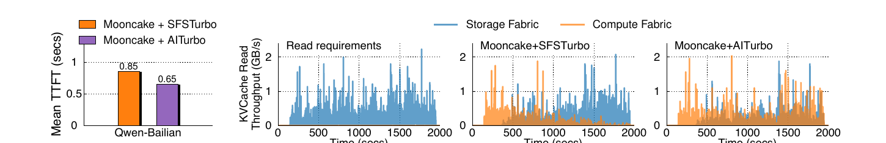

*图 10：Mooncake 使用 SFSTurbo 或 AITurbo 回源时的平均 TTFT 与两套网络吞吐。摘自论文 Figure 18，PDF 第 13 页。*

论文使用的是 Mooncake commit `206d52e1`。该实现从存储读回的 KVCache 不会重新进入 Mooncake 的内存缓存，因此复用距离较长的块被淘汰后会反复访问存储。AITurbo 让这些读取借用计算网络，因而降低平均 TTFT。这个基线行为是收益来源之一；如果后续 Mooncake 版本增加回源再缓存，收益大小需要重测。

更重要的是，作者没有让运行中的推理实例调用 `group_getfile`。所以 Figure 18 对论文两项主张的支持不对称：它支持双网络数据路径，未验证 Grouped I/O 抽象在动态 KVCache 请求上的协调成本和正确性。

### 5.4 控制开销不能只看占比

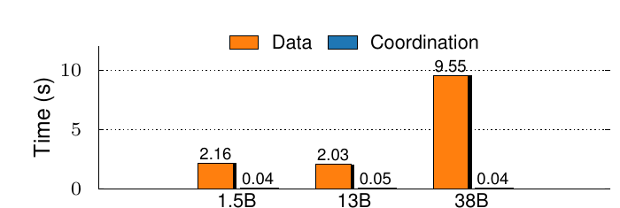

*图 11：64 XPU 下分组协调时间和数据时间。摘自论文 Figure 20，PDF 第 14 页。*

40 到 50 ms 相对 2 到 10 秒的 Checkpoint 写入不大，但已接近许多在线推理系统的调度预算。论文通过计划缓存跳过重复协调，依赖的是训练作业的长期稳定组和稳定重复关系。在线 KVCache 组成员和网络状态变化更快，缓存计划必须带版本、拓扑和有效期校验。

## 6 技术亮点与适用边界

### 6.1 组级意图把优化责任放到看得见全局的一层

亮点在于抽象位置准确。应用最清楚哪些参与者属于同一批任务，存储最清楚文件分片、节点带宽和缓存位置。Grouped I/O 只要求应用补充分组事实，不要求每个框架重写云存储计划器。

边界是 group 必须提前明确。训练 Rank 组符合这个条件，在线 Agent 请求不一定。迟到、取消和超时都会改变组的成员与完成条件。

### 6.2 两阶段完成语义让性能收益和数据风险可讨论

`future_0` 与 `future_1` 明确了暂存完成和后端持久完成。应用可以按数据价值选择是否提前继续，而不是让库内部悄悄放宽持久性。

代价是调用者必须处理 `future_1` 前全部暂存副本丢失。论文用多份 DRAM 副本降低风险，但没有给出相关故障注入结果。对于可重算 KVCache，允许丢失不等于允许读到错误内容；消费前仍需独立的版本和语义校验。

### 6.3 统一计划把去重和负载均衡放在同一目标下

仅做去重可能把流量集中到一个发送端。AITurbo 直接优化全组完成时间，并把节点带宽、链路带宽、复制数和内存容量放入约束。这比“重复数据由一个固定 Rank 写出”更完整。

边界是首次求解需要秒级时间，收益依赖计划可长期复用。动态拓扑、租户流量和短生命周期对象会缩短摊销窗口。

### 6.4 借用计算网络降低了存储成本但引入新干扰面

论文把已部署但阶段性空闲的计算网络转化为存储带宽，避免为峰值 I/O 永久购买更多存储服务器。它不是免费带宽：前台集合通信与后台数据搬运共享交换机、NIC 队列和接收端口。

论文只使用最低优先级 RoCE 队列，未评测持续拥塞、同 XPU 共置或尾部时延。项目落地时必须把“是否借道”变成运行时决策，而不是固定数据路径。

## 7 论文没有解决的问题

1. 动态分组与取消。论文没有给出在线请求如何发现 group、何时封组、成员迟到或取消如何处理，也没有评测动态组的控制开销。
2. KVCache 语义身份。内容校验和或文件名只能确认字节或对象键，不能判断模型架构、Tokenizer、提示词模板、LoRA、Ready 状态和租约是否兼容。
3. Host CPU 零数据拷贝。AITurbo 的核心路径把 Host DRAM 当暂存层，数据会经过主机内存。论文没有验证 NVMe SSD 与 NPU HBM 直达，也没有给出 Host Payload Touch Bytes。
4. 尾部时延和前后台干扰。KVCache 只报告平均 TTFT，没有 P95、P99、TPOT 或混压下的前台干扰率。
5. 多卡消费一致性。论文协调 I/O 参与者，但没有处理张量并行各 Rank 对命中、加载、失败和回退动作的一致选择。
6. 分发故障。串行转发中的慢节点、链路重传、部分接收完成、租约过期和源节点崩溃没有形成可验证的状态机。
7. 小块路径。作者明确限定系统面向大块传输，小对象和细粒度随机 I/O 未必受益。

## 8 对统一异构 KVCache 存储与调度底座的启示

本节把论文原则映射到项目受控架构。映射结论分为直接采用、改造后采用和不直接复制三类。

### 8.1 可以直接采用的原则

#### 显式暴露组级访问意图

[项目建议] 在 L1 推理调度层到 L2 KVConnector 的契约中增加可选的组级意图，包括候选消费者集合、截止时间、共享前缀标识和是否允许等待。它应当是优化提示，不应成为正确性依赖；无法成组时必须退化为普通单请求路径。

#### 分离完成状态

[项目建议] 把数据写入完成、可见、可消费、已复制和已持久化分成不同状态。AITurbo 的两个 future 提供了最小范例。本项目还要加入 Ready、Lease 和语义身份，避免“字节已到达”等同于“KV 可安全接入”。

#### 计划模板可缓存但必须带失效条件

[项目建议] 训练式稳定模式可缓存去重和拓扑计划。缓存键至少要覆盖硬件能力、组成员、对象布局、介质位置和配置哈希；链路状态、租约或成员变化时重算或快速修补。

#### 张量元数据与正文数据分离

[项目建议] 保持小型控制描述与大块正文载荷分离。这与连续数据块描述符编译方向兼容，可减少跨框架对象序列化，但不能替代语义校验。

### 8.2 需要改造后采用的机制

| 论文机制 | 可迁移原则 | 项目对应位置 | 必要改造 | 验证重点 |
|---|---|---|---|---|
| Host DRAM 暂存加计算网络 | 借用非瓶颈资源缓解瓶颈资源 | L3 分层存储与 L4 传输层 | DDR 只在持续有净收益时承担 warm、prefetch 或 fallback staging；优先验证 UBMEM URMA 设备直达 | Host Payload Touch Bytes、TTFT、TPOT、内存水位和失败回退 |
| 秒级双线性规划 | 跨节点联合考虑带宽与容量 | QueryPlan 和成本预估模型 | 离线生成计划模板，在线只做微秒级代价评估与局部修补 | 计划 P99、后悔值、实际路径和拓扑变化恢复时间 |
| 串行转发链 | 单份回源后利用计算网络一对多分发 | 软件分层中继与硬件多播边界验证 | 对比串行链、树状中继和拓扑感知多路转发；慢节点不应阻塞全组 | 源端 Egress、全组完成时间 P99、重试放大和慢节点影响 |
| BLAKE3 内容去重 | 减少重复正文流量 | 前缀目录与对象管理 | 内容哈希只能作为字节身份；消费前叠加模型、词表、模板、LoRA、Ready 与租约校验 | 哈希开销、错误消费、版本冲突和缓存失效 |
| RoCE 最低优先级 | 前后台流量分队列 | SemanticQoS | 增加应用层微秒级退避、实时拥塞反馈和每租户带宽上限 | 前台 TPOT 干扰率、P99 TTFT、Incast 与公平性 |
| 两阶段 write future | 将快速继续和持久化分开 | 对象生命周期和发布协议 | 扩展为数据完成、可见、可消费、复制和持久状态；故障转换必须单调 | 故障注入、部分副本丢失、租约过期和回退重算 |

### 8.3 不应直接复制的做法

1. 不把 Host DRAM 设为所有 KV 数据的固定必经层。论文路径与本项目 Host CPU 零数据拷贝目标冲突，DDR 只能是按收益选择的条件角色。
2. 不把 40 到 50 ms 的集中式组协调放进每个在线请求关键路径。动态请求应允许小窗口聚合、机会式共享和单请求退化。
3. 不把串行链当成所有一对多传输的默认最优解。Checkpoint 的大块吞吐结论不能替代 KVCache 小块、尾部时延和慢节点实验。
4. 不把内容哈希命中直接作为消费资格。相同字节不一定对应相同模型和运行语义，暂存完成也不等于可以接入推理。
5. 不在链路和组成员变化后无条件复用旧计划。计划缓存必须绑定版本与有效期。

## 9 对项目立项的证据

### 9.1 问题有效性

[论文事实] AITurbo 所处的生产云中，AI 作业已消耗本地数据中心超过 10% 的云存储带宽。论文还展示了 Agent 请求中的共享前缀突发、Checkpoint 中随并行配置变化的重复数据以及存储前后端带宽限制。这些证据支持本项目继续研究“减少受限源端的重复访问”和“按拓扑组织一对多数据流”。

### 9.2 机制可行性

[实测数据] Checkpoint 写入、缓存后模型扩散和 Mooncake 回源实验共同说明：只访问一次受限存储，再利用其他节点缓存和计算网络分发，可以缩短批量数据就绪时间。Grouped I/O 还说明，应用暴露少量意图后，底层系统能比孤立文件调用做更完整的计划。

这支持本项目的方向，不等于支持相同实现。论文用 Host DRAM 和计算网络，本项目需要验证 UBMEM、URMA、HBM、NVMe SSD 和远端介质之间的实际可达路径。

### 9.3 差异化空间

[项目解释] AITurbo 留下的缺口与本项目范围直接重叠：在线动态分组、微秒级 QueryPlan、Host CPU 零数据拷贝、异构多介质分层、六维语义一致性、张量并行多卡状态同步、故障租约与前后台混压控制。继续建设统一底座的理由在于这些问题没有被论文覆盖，而不是因为论文已经证明了项目设计。

### 9.4 论文不支持的项目主张

- 不支持“URMA 或 UBMEM 已达到某个绝对带宽或时延”。论文没有测这两种协议。
- 不支持“Host CPU 零数据拷贝已经可行”。AITurbo 使用 Host DRAM 暂存。
- 不支持“Direct-View 一定优于 Copy-to-HBM”。论文没有比较两条路径。
- 不支持“动态 QueryPlan 可在微秒级得到最优计划”。论文示例首轮求解约 4 秒。
- 不支持“树状中继优于串行链或硬件多播”。论文只采用串行转发。
- 不支持“多租户下 TPOT 干扰率低于 3%”。论文没有 TPOT 混压数据。
- 不支持 E3 项目目标已经达成。TTFT 降低至少 20%、QPS 提升至少 10%、前台 TPOT 干扰率低于 3% 都仍是项目目标。

### 9.5 立项结论

必要性证据：受限存储网络、重复大块 I/O 和共享前缀突发是真实问题。

可行性证据：组级意图、单份回源和借用计算网络在论文条件下取得了可测收益。

差异化证据：在线动态性、直达数据路径、语义安全、多卡一致性和尾部时延隔离仍未解决。

剩余举证责任：项目必须用国产硬件和真实协议完成 E0 到 E3 的独立验证，不能拿论文的 Checkpoint 或平均 TTFT 数字代替本项目实测。

## 10 建议优先验证

### 10.1 动态 KVCache 分组是否有净收益

- 假设：在共享前缀突发中，小窗口聚合加单份回源的节省大于等待封组和协调开销。
- 变量：聚合窗口、组大小、前缀长度、复用距离、取消率、冷读比例。
- 基线：逐请求回源；机会式目录合并；显式分组。
- 指标：平均与 P99 TTFT、源端读取字节、协调 P99、取消浪费、QPS。
- 决策：若尾部时延因等待组形成而恶化，保留机会式共享，不把显式 group 设为在线必经接口。

### 10.2 离线计划模板加在线修补能否满足决策预算

- 假设：大部分带宽和拓扑约束可离线固化，在线只需读取硬件能力矩阵并局部修补。
- 变量：成员变化率、链路拥塞、介质水位、对象分片数和计划缓存命中率。
- 基线：每次完整求解；静态计划；模板加在线 QueryPlan。
- 指标：计划 P50 P99、预测路径与实际路径、反事实最优路径、决策后悔值。
- 决策：若缓存失效频繁且修补成本进入请求关键路径，缩小联合计划范围，回退到分层局部决策。

### 10.3 串行链和树状中继的真实边界

- 假设：组规模增大或存在慢节点时，树状中继能降低源端 Egress 和全组完成时间 P99。
- 变量：1 到 N 组规模、Chunk 大小、网络拓扑、慢节点比例、丢包与重试。
- 基线：重复存储回源；串行链；树状中继；条件硬件多播。
- 指标：源端出口流量、每接收端完成时间、全组 P99、重试放大和前台 TPOT 干扰。
- 决策：按实测选择默认路径，硬件多播不应阻塞 Raw Direct 软件主路径。

### 10.4 暂存完成和安全消费的故障闭环

- 假设：数据完成、可见、可消费、复制和持久状态分离后，任一节点或链路故障都不会让未就绪或过期 KV 被消费。
- 变量：暂存副本数、发布顺序、租约超时、源节点崩溃、部分写入和控制器重启。
- 基线：双 future；扩展状态机加语义校验和租约。
- 指标：错误消费数、回退成功率、恢复时间、孤儿对象和状态单调性。
- 决策：出现一次错误消费即否决该发布协议。

### 10.5 设备直达和 Host DRAM 暂存的条件选择

- 假设：在支持 URMA 或 UBMEM 的硬件上，设备直达可降低 Host CPU 数据搬运和 DDR 争用；在带宽或复用条件不利时，Copy-to-HBM 或本地重算更快。
- 变量：上下文长度、复用率、远端链路、HBM 水位、DDR 水位、NVMe SSD 带宽和前台负载。
- 基线：Host DRAM 暂存；Direct-View；Copy-to-HBM；本地重算；SSD 直达。
- 指标：Host Payload Touch Bytes、TTFT、TPOT、CPU Wall、链路流量和实际路径。
- 决策：仅在拉取与加载总开销小于本地重算耗时时加载，否则回退重算。

### 10.6 前后台混压是否满足项目门槛

- 假设：硬件 QoS 加 SemanticQoS 应用层退避可以利用计算网络余量，同时把前台 TPOT 干扰率限制在项目目标内。
- 变量：前台并发、后台写回和分发速率、队列优先级、Incast 规模和退避周期。
- 基线：无隔离；仅硬件优先级；硬件优先级加动态拥塞控制。
- 指标：TTFT、QPS、TPOT P99、后台完成时间、丢包和队列长度。
- 决策：以 E3 项目目标判定，任何平均值改善都不能替代尾部时延门槛。

## 附录 A 证据分类与来源索引

| 结论 | 证据类型 | 原文位置 | 适用条件 |
|---|---|---|---|
| AI 作业消耗本地数据中心超过 10% 云存储带宽 | 生产观察 | §1，PDF 第 2 页 | 华为云本地数据中心 |
| 存储带宽 1.6 到 80 GB/s 时每 GB 价格约增 16 倍 | 论文测量或计价观察 | Figure 1c、§3.1，PDF 第 3 和第 6 页 | 论文云环境定价 |
| V100 上 1 GB BLAKE3 为 7.8 ms，CPU 为 35.6 ms | 微基准 | §4.1，PDF 第 8 页 | V100 与 Xeon E5 2650 v4 |
| 38B 64 XPU 首轮计划约 4 秒 | 实现测量 | §4.1，PDF 第 9 页 | 未优化单线程 Python 求解器 |
| Checkpoint 写相对 SFSTurbo 快 3.9 到 58.8 倍 | 端到端实测 | §1、§5.1、Figure 13 | 论文六种训练配置 |
| 去重减少 4.3% 到 47.2% Checkpoint 时间 | 消融实测 | §5.1、Figure 14 | 有数据并行重复的配置 |
| 浪费 XPU 时间最高少 6% | 派生数据 | §5.1、Figure 16 | 每小时 1 个 XPU 故障率和文献公式 |
| Qwen 72B 缓存命中时 64 XPU 加载 2.25 秒 | 端到端实测 | §5.2、Figure 17 | Checkpoint 已在 Host DRAM |
| 平均 TTFT 从 0.85 秒降到 0.65 秒 | 端到端实测 | §5.3、Figure 18 | 8 XPU、Qwen 14B、30 分钟轨迹、未使用分组 API |
| 分组协调约 40 到 50 ms | 控制面实测 | §5.4、Figure 20 | 64 XPU Checkpoint 写入 |
| E3 的 TTFT QPS TPOT 门槛 | 项目目标 | 项目 SRS 评审导读 | 需本项目独立混压验证 |

## 附录 B 图表来源

本文嵌入的 11 张图均从目标论文 PDF 重新渲染和裁切，未使用既有解构报告中的图片。图 1 至图 11 分别对应论文 Figure 1、6、7、8、9、13、14、12、17、18、20。中文图注只说明图与本报告论点的关系，不改写图中数值。
