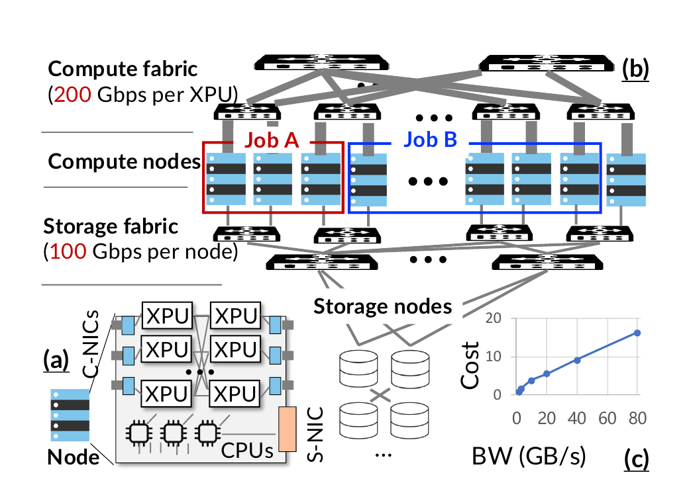
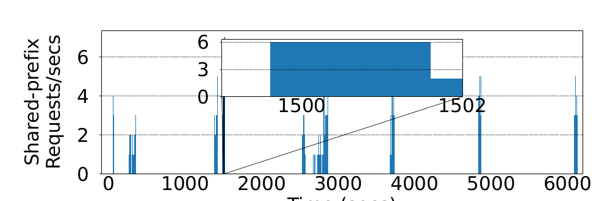
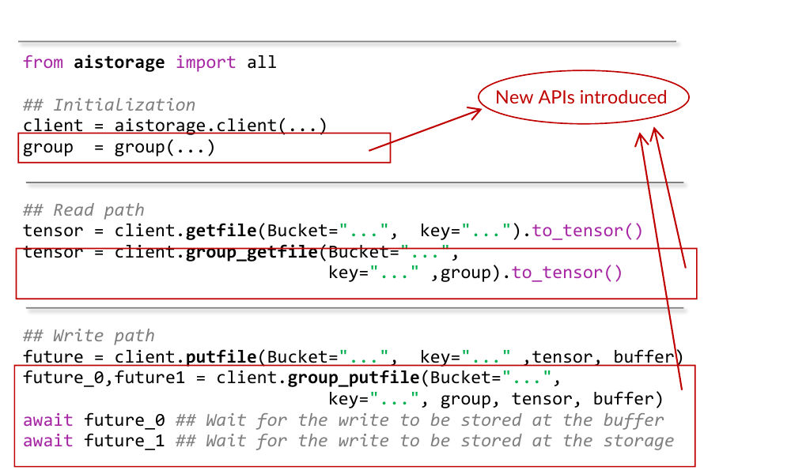
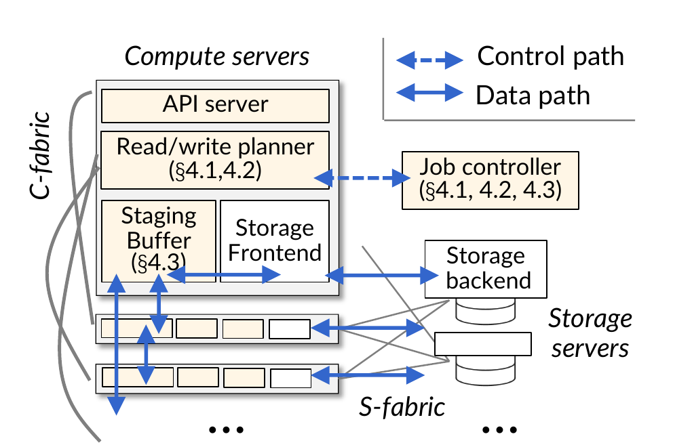
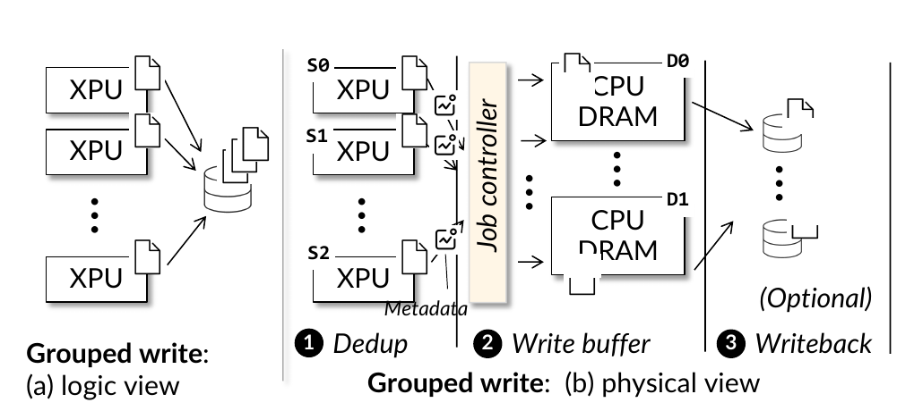
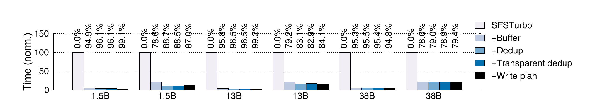
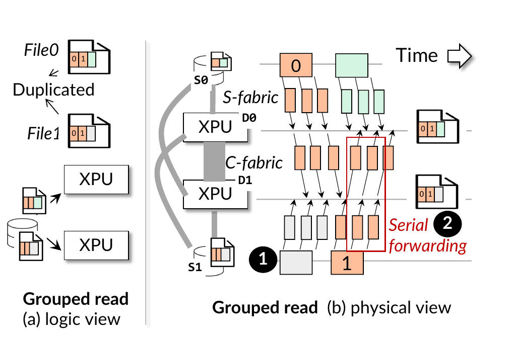
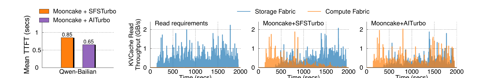

# AITurbo（FAST 2026）：分组 I/O 云存储论文深度解构与项目启示

> 论文题目：Fast Cloud Storage for AI Jobs via Grouped I/O API with Transparent Read/Write Optimizations  
> 发表会议：24th USENIX Conference on File and Storage Technologies（FAST 2026）  
> 作者：Yingyi Hao、Ting Yao、Xingda Wei、Dingyan Zhang、Tianle Sun、Yiwen Zhang、Zhiyong Fu、Huatao Wu、Rong Chen  
> 机构：上海交通大学、华为云  
> 报告版本：V4  
> 原文：[同目录 PDF](<[FAST 2026] Fast Cloud Storage for AI Jobs via Grouped IO API with Transparent Read Write Optimizations.pdf>)

## 1. 一页读懂论文

### 1.1 论文解决什么问题

AITurbo 面向云上大模型训练和推理中的大块 I/O。训练需要周期性写入 checkpoint（训练检查点，即用于故障恢复和调试的模型参数与优化器状态），推理扩容需要读取模型参数，部分在线推理还会从存储恢复 KVCache（大模型注意力键值缓存，即自回归生成过程中保存历史 Key 和 Value 激活状态、用于避免重复计算注意力的张量）。这些操作通常涉及数十 MB 到数百 GB 数据，性能主要取决于有效带宽。

问题不只是存储后端“速度不够”。在计算与存储解耦的云架构里，计算节点和存储节点通过独立存储网络连接；加速器之间另有带宽更高的计算网络。单纯增加存储后端带宽会提高成本，而且计算节点的存储网卡仍可能成为前端瓶颈。与此同时，同一作业的一组 XPU 往往同时读写，其中含有可去重的参数、优化器状态、checkpoint 或共享前缀 KVCache。传统单文件 API 没有暴露“哪些客户端正在共同完成一次操作”，存储层看不到组级意图，只能逐请求处理。

### 1.2 根因是什么

可见症状是 checkpoint 读写慢、扩容慢、KVCache 回源拉长 TTFT（Time To First Token，首 Token 响应时间）。根因有两层：

1. 资源层面，存储网络和后端存储受限，但 Host DRAM 与计算网络在部分 AI 作业中没有被充分利用，两个网络被割裂管理。
2. 接口层面，单请求文件 API 隐藏了组成员、同时到达关系、重复数据和整体完成语义，存储层无法提前做跨节点去重、源目标选择、带宽分配和广播计划。

### 1.3 核心洞察是什么

AI 作业本来就以通信组组织并行计算。如果应用在发起存储 I/O 时同时声明参与者集合，存储层就能在一次操作开始前看见完整批次，再结合自身掌握的存储拓扑、节点可用 DRAM、存储网络和计算网络状态生成全局读写计划。这样可以减少进入受限存储路径的字节，并把部分传输转移到空闲的计算网络，而不是要求每个框架各自实现一套专用优化。

### 1.4 核心抽象是什么

论文提出 grouped I/O（分组 I/O，即应用显式声明共同参与一次读或写的客户端集合）API。它保留普通 `getfile` / `putfile` 的文件语义，但增加 `group` 上下文。写接口还返回两个 future（异步完成句柄）：`future_0` 表示数据已进入 Host DRAM 暂存区，`future_1` 表示数据已持久化到后端存储。这个抽象新增了两类信息：一类是“哪些请求属于同一批”，另一类是“暂存完成”和“持久完成”之间的状态差异。

*图 1：计算节点同时连接计算网络和存储网络。论文利用前者的闲置带宽补充后者，而不是把二者当成一条同质链路。摘自原文 Fig. 1，PDF 第 3 页。*

### 1.5 四个关键优化方法速览

#### 方法一：Host DRAM 暂存与异步持久化

- 问题：checkpoint 必须等待慢速后端写完，训练迭代才能继续。
- 方法：先把数据写入多节点 Host DRAM，并在 `future_0` 完成后恢复计算；后端持久化异步进行，最终通过 `future_1` 报告。
- 效果：持久存储等待从前台训练关键路径移到后台，但引入了从暂存完成到持久完成之间的易失窗口。

#### 方法二：组级透明去重

- 问题：数据并行等配置会让多个 XPU 写入相同参数；共享前缀也会触发重复读取。
- 方法：客户端以块为单位计算 BLAKE3 校验值，控制器在整个组内识别重复块，只为需要的副本生成传输任务。
- 效果：进入存储路径的有效载荷减少。去重本身不保证链路均衡，仍需独立的读写计划。

#### 方法三：带宽和容量约束下的负载均衡计划

- 问题：即使已经去重，如果所有数据仍由单一源节点发送，源端出口会成为热点，其他节点和网卡处于空闲状态。
- 方法：控制器以源出带宽、目标入带宽、点到点链路、目标 DRAM 容量和副本数为约束，选择数据源、目标和发送速率；重复模式稳定后缓存计划。
- 效果：传输分散到更多可用源和目标，缩短组操作完成时间。代价是首次求解较慢，在线变化也会使缓存计划失效。

#### 方法四：单份回源与计算网络分发

- 问题：多个消费者通过受限存储网络读取同一 checkpoint 或 KVCache，会重复占用后端和前端存储带宽。
- 方法：每个重复块只从存储读取一份，再通过计算网络以串行转发链广播给其他节点；回源和转发按块流水执行。
- 效果：受限存储路径上的 N 份重复读取变为 1 份回源加组内分发，压力转移到计算网络。

### 1.6 最重要的实验结果

- checkpoint 写：在论文的 1.5B、13B、38B 模型与不同 ZeRO 配置下，AITurbo 相对通用云存储 SFSTurbo 快 3.9～58.8 倍；在存在重复数据的配置下，相对 Gemini 最多快 5.9 倍。
- 写路径消融：Host DRAM 与计算网络暂存贡献最大；组级去重在适用配置下继续减少 4.3%～47.2% 的 checkpoint 时间；加入负载均衡计划最多再减少 76%。这些数字来自不同配置，不能相乘。
- checkpoint 读：Qwen 72B checkpoint 已缓存到节点 DRAM 后，AITurbo 在 64 个 XPU 上完成加载仅需 2.25 秒；当数据尚未缓存且后端只提供 1 GB/s 时，各系统读取 135 GB 数据都约需 173 秒，说明冷路径仍受存储限制。
- KVCache 读：在 8 个 XPU 上回放 30 分钟 Qwen-Bailian 轨迹时，Mooncake+AITurbo 的平均 TTFT 从 0.85 秒降至 0.65 秒，下降 23%。但该实验没有使用 grouped API，只替换了 Mooncake 的存储读取路径。
- 控制开销：64 个 XPU 分组写入时，控制器协调开销最高约 45 ms；若命中缓存计划，可跳过这部分协调。

### 1.7 最大局限

AITurbo 依赖“大块、可异步、组成员可提前声明、Host DRAM 和计算网络有余量”这组条件。小 I/O、动态成员、同一 XPU 上多作业共置、计算网络长期高负载，以及对严格持久性要求较高的写入都会削弱收益。论文对网络隔离只使用 RoCE QoS（Quality of Service，服务质量，即用硬件优先级和带宽份额隔离不同流量）的低优先级队列，没有给出复杂多租户混压下的 TPOT（Time Per Output Token，每个输出 Token 的生成耗时）尾部稳定性保证。

### 1.8 为什么与本项目相关

这篇论文最直接的价值，是把 AI 存储问题从“后端还不够快”拉回到完整数据路径：有效载荷能否减少，源和目标是否选对，计算网络能否分担存储网络压力。组级意图让基础设施层获得单请求 API 缺少的批次视图；Qwen-Bailian 实验则说明，单份回源后把部分流量转到计算网络，确实可以改善 KVCache 冷数据读取。

它没有证明本项目的 Host CPU 零数据拷贝（CPU 只下发控制指令，不搬运正文数据，Host Payload Touch Bytes 为 0）、远端直读、NVMe SSD 直达 NPU、多维语义一致性校验、张量并行多卡状态同步或前后台尾部时延控制已经成立。论文使用 Host DRAM 作为正文暂存区，恰好说明本项目必须把“可借鉴的调度原则”和“不能照搬的数据路径”分开。

## 2. 为什么这个问题值得解决

### 2.1 云存储的物理边界不是一个带宽数字

论文测试环境中，每台计算节点有 8 个 XPU、192 个 CPU 核和 1.5 TB Host DRAM。计算网络按 XPU 提供 200 Gbps 互连能力，存储侧每节点只有一张 100 Gbps S-NIC；后端存储带宽按需配置，最多 30 GB/s。对一次组 I/O 而言，有效带宽取前端存储网络和后端存储带宽的较小值。即使购买更多存储节点，单台计算节点的 S-NIC 仍可能限制吞吐。

论文还给出华为云的成本例子：分片存储性能从 1.6 GB/s 提升到 80 GB/s 时，每 GB 成本上升约 16 倍。这个数据只能说明其云平台上的带宽价格曲线，不应直接外推为本项目的 TCO（Total Cost of Ownership，总体拥有成本，即硬件采购、网络、能耗、利用率和业务产出的全生命周期成本）。可迁移的结论是：后端扩容不是免费的，而且无法自动绕过前端网卡瓶颈。

### 2.2 工作负载为什么适合组级优化

论文归纳的工作负载条件很具体：

1. I/O 规模大。生产集群中多数文件超过 1 GB，前 1% 小文件仍有 326 MB，带宽比元数据往返更重要。
2. I/O 可以与计算重叠。训练可在后台写上一次迭代的 checkpoint；模型和 KVCache 可按层读取，并与当前层计算并行。
3. 多个 XPU 经常同时读写。数据并行训练会写重复参数，扩容会让多实例同时加载同一模型，Agent 请求则可能在同一时间读取相同系统提示词对应的 KVCache。

*图 2：真实 Agent 服务轨迹中出现成组的共享前缀请求。放大窗口显示两秒内有 6 个请求读取相同前缀。摘自原文 Fig. 6，PDF 第 6 页。*

图 2 只证明“组级读取现象存在”，没有给出全量请求中可合并读的占比，也没有测量动态构组成本。它为组级接口提供了工作负载依据，但不足以说明所有 Agent 请求都适合静态分组。

### 2.3 现有方案为什么不够

应用层可以手写去重、通信和分发，但需要理解云存储的实际分片、前端网卡和后端带宽。论文统计的 Megatron 版本中，checkpoint 相关优化约 2228 行代码，其中 1759 行用于分布式通信与协调，469 行用于文件系统访问；接入 AITurbo 新增约 286 行。这个对比说明组级抽象可以减少框架端重复工程，但代码行数不是长期维护成本或正确性的直接度量。

更重要的是，框架只看到自己的张量和通信组，云存储才掌握存储节点、S-NIC、可用 DRAM 与后端分片。单方视图都不完整。论文选择让应用暴露组意图，存储层负责物理计划，这是职责重新划分，而不是简单把已有代码下沉。

## 3. 核心抽象与系统设计

### 3.1 Grouped I/O API 暴露了什么

普通接口一次只表达“这个客户端要读或写这个文件”。Grouped I/O 还表达：

- 操作组及其成员；
- 一组客户端同时发起的文件集合；
- 写入暂存完成和持久完成的两个等待点；
- 可复用的重复模式及计划提示。

*图 3：`group_getfile` 和 `group_putfile` 增加组上下文；写入返回暂存完成与持久完成两个 future。摘自原文 Fig. 7，PDF 第 6 页。*

这与传统 collective I/O 并不相同。传统并行文件系统的集合 I/O 主要协调一个共享文件的并行访问；AITurbo 允许不同 rank 读写多个文件，并由存储层自动完成跨文件去重和源目标计划。应用仍需明确创建组，存储层不能从未来的孤立请求中自动推断完整批次。

### 3.2 控制面与数据面

AITurbo 在现有云存储上增加三类组件：

- Job controller：收集组元数据，生成读写计划。它不转发正文，状态可重算或持久化，因此可通过重启或多副本恢复。
- Staging buffer manager：统一管理计算节点的闲置 Host DRAM，保存待写或刚读出的数据块。
- Communicator：通过计算网络在 XPU、CPU 暂存区和其他节点间传输数据。

API server 和读写规划器属于控制路径；XPU、暂存区、存储前端和后端之间的数据传输属于数据路径。每个 XPU 根据控制器下发的计划独立执行，不把全部正文集中到控制器。

*图 4：Job controller 负责计划，数据面同时使用计算网络 C-fabric 与存储网络 S-fabric。摘自原文 Fig. 8，PDF 第 7 页。*

### 3.3 两阶段完成与故障语义

写入 DRAM 后返回 `future_0`，只表示暂存副本已经存在，不表示后端持久化完成。若 `future_1` 完成前所有 DRAM 副本同时丢失，文件被标记为损坏，应用需要回退到上一个 checkpoint 或重新生成。AITurbo 可在多个服务器 DRAM 中复制数据以缩小风险，但论文没有把这种复制等同于持久化。

这个区分很重要。论文的性能来自允许训练在易失数据尚未落盘时继续执行。若应用把 `future_0` 当成可靠提交，性能优化会改变正确性。反过来，若每次都等待 `future_1`，异步写回就失去大部分前台收益。

## 4. 关键技术实现与作用机理

### 4.1 Host DRAM 暂存与异步持久化

#### 解决的问题

传统 checkpoint 写路径是 XPU 生成数据、写入远端存储、等待持久化完成，再开始下一轮依赖这些状态的工作。当存储网络或后端慢于计算时，XPU 因 I/O 等待而空闲。

#### 核心方法

AITurbo 把计算节点的闲置 Host DRAM 作为共享暂存层，在数据到达 DRAM 后先解除前台依赖，再后台写回远端存储。

#### 实现路径

1. XPU 将 checkpoint 分块写入计划指定的一个或多个计算节点 DRAM。
2. 暂存副本满足配置的复制要求后，`future_0` 完成，训练可以继续。
3. 暂存区按块向存储后端写回；数据一到 DRAM 就可以开始下一段传输，两个阶段形成流水。
4. 所有目标持久化完成后，`future_1` 完成；在此之前发生不可恢复丢失，文件保持损坏状态。

#### 为什么有效

优化前，训练关键路径包含“完整远端持久化等待”。优化后，前台只等待“写入较快的本地或邻近 DRAM”，持久化和下一轮计算重叠。它没有减少必须持久化的数据量，而是改变了等待位置。

#### 论文证据与边界

Fig. 14 的第一步 `+Buffer` 在所有模型配置中都占主要收益，说明计算网络与 DRAM 暂存是 checkpoint 写加速的基础。但收益依赖暂存容量、DRAM 空闲程度和应用对短暂易失窗口的容忍。论文也承认推荐模型服务可能用满 DRAM，因此“DRAM 闲置”不是普遍事实。

#### 对本项目的意义

分类：不直接复制数据路径，保留完成状态设计。统一异构 KVCache 存储池以 Host CPU 零数据拷贝为主路径目标，不能把 CPU DRAM 设为所有正文的必经中转。可直接采用的是多阶段完成语义：传输已提交、设备可见、可消费、已持久化必须分开记录。

### 4.2 组级透明去重

#### 解决的问题

数据并行训练会在多个 rank 上保存相同参数。没有全组视图时，每个 rank 独立写文件，重复字节会多次穿过存储网络并占用后端容量。读取 checkpoint 或共享前缀 KVCache 时也可能出现同样的重复回源。

#### 核心方法

客户端计算内容校验值，控制器在一个组内合并相同块，只保留满足副本策略所需的传输。

#### 实现路径

1. 每个 XPU 对待写文件按 4 MB 块到整文件的可配置粒度计算 BLAKE3 校验值。
2. XPU 把校验值和张量等元数据发送给 Job controller。
3. 控制器识别组内重复块，并生成只传输必要副本的任务集合。
4. 重复模式稳定后缓存元数据；应用可用提示跳过后续迭代的重复校验。

#### 为什么有效

优化直接减少进入存储路径的逻辑字节。论文在 NVIDIA V100 上测得 1 GB 文件的 BLAKE3 计算从 CPU 的 35.6 ms 降为 XPU 的 7.8 ms。这个微基准说明校验可下沉加速器，但没有覆盖国产 NPU 的算子成本，也没有给出校验与前台计算争用下的尾延迟。

#### 论文证据与边界

写路径消融显示，去重在存在数据并行重复的配置中继续减少 4.3%～47.2% 的 checkpoint 时间；在 ZeRO 3 等重复较少的配置下，收益明显缩小。AITurbo 使用 256 位 BLAKE3 降低碰撞概率，但内容相等只回答“字节是否相同”，不回答缓存是否属于同一模型、Tokenizer、Prompt 模板、LoRA 或租约代际。

#### 对本项目的意义

分类：改造后采用。KVCache 不宜在读写热路径重新扫描大块正文做通用内容去重。更合适的做法是先用语义身份和前缀键合并查询，再用内容摘要做完整性核对；ConsumeEligibility（消费资格校验引擎，即在读取前检查模型、词表、提示词模板、适配器、Ready 状态和租约有效性）不能被哈希相等替代。

### 4.3 带宽和容量约束下的负载均衡计划

#### 解决的问题

去重后若只让一个节点发送全部数据，时间仍由该节点的出口带宽决定。原文 Fig. 10 的例子中，单源把数据写往两个目标仍需 `SZ/BW`；让两个源并行发送可接近 `SZ/(2BW)`。

#### 核心方法

控制器显式建模源、目标、块、副本数、节点入出带宽、点到点链路和 DRAM 容量，以最小化整个组的完成时间，而不是追求每条链路都满载。

#### 实现路径

1. 控制器得到去重后的块集合和每个块可用的源节点。
2. 约束每个块的总发送量等于副本需求，禁止源发送自己没有的数据，禁止同一目标接收重复副本。
3. 约束每个节点入出带宽、源目标链路带宽和目标暂存容量。
4. 通过固定候选完成时间 `t`，把双线性问题转为一系列线性可行性检查，再用分支定界收缩 `t`。
5. 相同训练模式后续复用计划，块到达 DRAM 后立即进入写回流水。

*图 5：分组写先去重，再写入负载均衡的 DRAM 暂存区，最后可选地持久化。摘自原文 Fig. 9，PDF 第 7 页。*

#### 为什么有效

资源变化是“单源出口热点”变为“多源、多目标并行”。计划可以主动闲置对最终时间无帮助的链路，因此带宽利用率不是目标函数，组完成时间才是。

#### 论文证据与边界

在 38B 模型、64 个 XPU、每 XPU 一个合并 checkpoint 文件的轨迹上，未优化的单线程 Python 求解器约需 4 秒生成计划。缓存后可摊薄，但前几轮优化器状态大量为零，可能造成暂时性的错误去重模式，计划不能立即复用。Fig. 14 中写计划最多再减少 76% 的 checkpoint 时间，主要发生在存在重复且可从多个源发送的配置。

*图 6：Host DRAM/计算网络暂存、去重、透明去重和写计划的逐步消融。数值是各配置相对基线的归一化时间，不能跨配置相乘。摘自原文 Fig. 14，PDF 第 12 页。*

#### 对本项目的意义

分类：原则可借鉴，在线实现必须重做。QueryPlan（查询与放置计划决策引擎，即根据链路、介质、算力和请求时限选择加载、远端直读或重算路径）需要利用源出口、目标入口、介质排队和拓扑信息，但不能在每次在线请求上运行秒级求解器。可行方向是离线生成路径模板，在线用硬件能力矩阵和即时信用做微秒级筛选，并在预测路径与实际路径不一致时记录回退原因。

### 4.4 单份回源与计算网络分发

#### 解决的问题

N 个节点读取同一对象时，传统方案让 N 份数据都从存储进入计算集群。后端带宽、S-NIC 和存储交换网络承担重复流量，扩容规模越大，读时间越容易随消费者数量增长。

#### 核心方法

AITurbo 对每个重复块只选择一个节点从存储回源，再通过计算网络转发给其他消费者。checkpoint 已缓存到某个节点 DRAM 时，还可以直接走分布式缓存命中，完全绕过存储后端。

#### 实现路径

1. 控制器在组内识别相同文件或块的读取需求。
2. 每个重复块只从存储服务器拉到一个选定节点。
3. 采用 BlitzScale 的串行转发链在计算网络上逐节点传播大块数据。
4. 回源与转发分块流水，避免等完整文件到达后再开始广播。

*图 7：重复块只从存储网络读取一次，再沿计算网络转发给其他 XPU。摘自原文 Fig. 12，PDF 第 9 页。*

#### 为什么有效

受限存储路径的字节从近似 `N × payload` 降为 `1 × payload`，新增成本是计算网络承担 `N-1` 份分发及中间节点转发。方法不消灭总网络字节，而是把重复流量搬到更快或更空闲的网络。

#### 论文证据与边界

Qwen 72B checkpoint 已在 DRAM 缓存时，64 XPU 加载只需 2.25 秒；未缓存且后端仅 1 GB/s 时，各系统仍约需 173 秒。KVCache 实验中，平均 TTFT 从 0.85 秒降到 0.65 秒，但论文在 §5.4 明确说明 Mooncake 没有使用 grouped API，因为在线推理实例难以同步构组。因此该结果验证了计算网络补充存储读取带宽，不验证在线 KVCache 的组级去重、计划或广播已经落地。

*图 8：Mooncake 使用 AITurbo 存储路径后，平均 TTFT 由 0.85 秒降至 0.65 秒；右侧显示存储网络与计算网络的吞吐分担。摘自原文 Fig. 18，PDF 第 13 页。*

#### 对本项目的意义

分类：改造后采用并验证。Staging Fanout（软件分层中继转发，即通过树状节点接力分发同一份热点数据）与论文共享“单份回源、另一张网络分发”的原则，但本项目不能默认以 Host DRAM 中继正文，也不能默认串行链在 2、4、8、16 个目标下都优于树形转发。每个目标还要独立记录完成、可见性和错误，慢节点不能无限拖住已完成节点。

## 5. 实验到底证明了什么

| 论文主张 | 实验与条件 | 测量结果 | 能证明什么 | 不能证明什么 |
|---|---|---|---|---|
| 计算网络与 DRAM 可降低 checkpoint 写等待 | 最高 64 个 Ascend 910B 或 A800 XPU；1.5B/13B/38B 模型；Megatron + 不同存储后端 | 相对 SFSTurbo 快 3.9～58.8 倍；相对 Gemini 最多 5.9 倍 | 在该集群、该暂存容量和大块写负载下，慢速持久化可移出前台关键路径 | 不证明 DRAM 已被其他服务占满时仍有同等收益；不证明易失完成等同持久完成 |
| 透明去重能减少组级重复写 | 不同 DP、TP、PP 和 ZeRO 配置的 checkpoint 写消融 | 适用配置中 checkpoint 时间继续下降 4.3%～47.2% | 当组内确有重复数据时，存储层去重能减少有效载荷 | 不证明 ZeRO 3 或无重复负载仍有显著收益；不证明 BLAKE3 等价于 KV 语义一致性 |
| 负载均衡计划避免单源热点 | 写路径消融；多源、多目标带宽约束 | 写计划最多再减少 76% | 选择多个可用源并平衡出入口能缩短组完成时间 | 不证明秒级求解适合在线推理；不证明静态带宽参数可覆盖瞬时拥塞 |
| 单份回源后分发可加速 checkpoint 读取 | Qwen 72B、QwQ 32B；1/10/30 GB/s 后端；8～64 XPU | 缓存命中时 Qwen 72B、64 XPU 为 2.25 秒；冷路径 1 GB/s 时约 173 秒 | 缓存命中和计算网络分发可降低重复存储读取 | 不证明冷数据可绕过后端带宽上限；不证明所有拓扑都适合串行链 |
| AITurbo 可改善 KVCache 冷读 | Qwen-14B、8 XPU、30 分钟 Qwen-Bailian 轨迹；Mooncake+SFSTurbo 对比 Mooncake+AITurbo | 平均 TTFT 0.85 秒降到 0.65 秒，下降 23% | 用计算网络补充存储读取带宽在该轨迹上有效 | 不证明 grouped API、组级去重或读计划用于该实验；不证明 P99 TTFT、TPOT 或多租户隔离改善 |
| 组协调开销可摊薄 | 64 XPU checkpoint 分组写 | 最高约 45 ms；计划缓存命中时可跳过 | 对秒级大块 I/O，控制开销相对较小 | 不证明对小 I/O 或亚毫秒在线请求仍可忽略 |

实验结果不能简单合并成一个“系统加速倍数”。58.8 倍来自 checkpoint 写对比，23% 来自 KVCache 平均 TTFT，2.25 秒来自已缓存 checkpoint 的 64 XPU 扩容。三者的工作负载、基线和关键路径不同。

## 6. 论文的亮点与局限

### 6.1 用接口暴露意图，而不是猜测未来请求

亮点在于 grouped I/O 只增加组上下文和完成句柄，没有要求应用提交完整物理计划。存储层因此获得批次边界，又保留对底层分片和网络的控制。

边界是组必须由应用显式创建。对于训练通信组，这通常稳定；对于弹性扩容、Agent 突发请求和跨租户前缀复用，成员可能在短时间内变化，论文没有给出无中心动态构组协议。

### 6.2 同时减少字节和重排路径

去重回答“哪些字节不用再传”，负载均衡回答“剩余字节由谁传”，单份回源回答“重复读从哪里进入集群”。三者分工清楚，避免只追求某一张网卡的局部利用率。

边界是计划使用相对稳定的带宽和容量信息。论文没有评测 Incast（多对一突发拥塞，即多个发送节点同时冲击同一接收端口、导致交换机排队和丢包）下的计划偏差，也没有给出计划执行期间重新优化和取消的语义。

### 6.3 把暂存完成和持久完成分开

这个设计明确承认性能来自持久性折中，并用两个 future 把风险暴露给应用，比返回一个含糊的“写成功”更可靠。

边界是论文主要依赖 checkpoint 可重建或可回退的性质。对于不可重建数据或需要严格持久性的业务，应用仍必须等待 `future_1`。

### 6.4 生产部署增强了工程可信度，但覆盖面有限

论文称 AITurbo 已用于华为云训练作业的 checkpoint 读写，说明接口和系统具备实际部署基础。

推理侧仍在扩展。KVCache 对比没有使用 grouped API，QoS 也只依赖现有硬件队列。不能把“训练侧生产部署”表述成“在线推理方案已生产验证”。

## 7. 论文没有解决什么

1. 在线动态构组。论文没有解决推理实例不断创建、退出和超时情况下，如何在微秒预算内形成稳定操作组。
2. KVCache 语义安全。内容校验值没有覆盖模型版本、Tokenizer、Prompt 模板、LoRA、位置编码、Ready 位与租约。
3. Host CPU 零数据拷贝。AITurbo 的主要数据路径以 Host DRAM 为暂存区，CPU 内存是正文中继，不满足本项目的零数据拷贝目标。
4. 异构分层介质。论文没有覆盖 NPU HBM、远端显存、Host DDR、NVMe SSD 之间的逐请求选路，也没有研究 Direct-View（远端直读，即直接跨节点读取远端显存数据、不生成完整本地副本）与 Copy-to-HBM（拷贝到本地显存，即通过 DMA 将远端数据完整搬到本地 HBM）的边界。
5. 多卡一致动作。论文的 group 是 I/O 协调范围，不等同于张量并行计算中的一致执行边界；没有验证一张卡失败时如何避免其他卡进入不同集合通信路径。
6. 前台尾部时延。实验报告平均 TTFT，没有 P99 TTFT、TPOT 或后台迁移对在线生成的干扰分布。
7. 强隔离与慢节点处理。最低优先级 RoCE 队列不能解决所有共置场景，也没有逐目标完成、取消和慢消费者脱组的完整协议。

## 8. 对本项目的启发

### 8.1 可直接采用的原则

第一，接口应携带组级访问意图。对张量并行（Tensor Parallel，TP，即多张加速卡共同执行同一模型计算）请求，可由组协调者批量查询一次，再向各 rank 下发位置和布局片段；接口至少要带组标识、成员代际、对象范围、截止时间、共享权限和允许回退动作。

第二，完成状态必须分层。AITurbo 的 `future_0/future_1` 可映射为更严格的状态机：计划已生成、传输已提交、目标设备可见、语义校验通过、组内可接入、正文已持久化。任何一个状态都不能替代其他状态。

### 8.2 需要改造后采用的方法

组级去重应改为“语义前缀合并加内容完整性核对”。目录先按模型语义 ID 和连续前缀键合并请求，正文摘要只用于确认内容，没有资格替代消费校验。

单份回源后分发应适配为设备直达的数据面。优先验证 NVMe SSD 或远端内存到 NPU HBM 的直接路径，再由 KPCL/URMA 在设备间转发；Host DDR 只在硬件能力不满足时作为受控回退，不能成为默认中继。

负载均衡计划应改为“离线模板加在线增量决策”。CostEvaluator（成本预估模型，即在决策前估算各加载路径、转换、接入和重算开销）读取硬件能力矩阵、排队长度和剩余时限，在微秒预算内选择候选模板。秒级求解器只能用于离线标定或稳定批处理。

### 8.3 不应照搬的实现

- 不把 Host DRAM 暂存作为所有 KVCache 读写的必经路径。
- 不把 BLAKE3 字节相等当成可安全消费的完整条件。
- 不在在线推理请求上运行论文的双线性规划求解流程。
- 不把最低优先级硬件队列当成完整的 SemanticQoS（前后台服务质量保障策略，即限制后台换出、预取、迁移和重建对在线推理 TPOT 的影响）。
- 不把 `future_0` 的易失完成直接发布为全局可消费的持久对象。

### 8.4 必须独立验证的问题

论文最值得迁移的是“受限源只取一份，再用另一张网络分发”。但本项目需要重新回答四个问题：哪一种源获取路径最便宜；中继放在 HBM、DDR 还是专用 I/O 执行器；串行链和树形分发在不同组规模下谁的 P99 更稳定；前台生成和后台分发共用计算网络时，硬件 QoS 与应用层反压能否把 TPOT 干扰控制在目标范围内。

## 9. 对本项目立项的证据价值

### 9.1 必要性证据

论文独立确认了三个项目痛点：解耦存储的前端和后端带宽都可能成为瓶颈；AI 作业中存在成组的大块读写和重复有效载荷；单请求 API 隐藏组级意图，会迫使每个框架重复实现去重、通信与计划。这些事实支持统一异构 KVCache 存储与调度底座有必要在框架和硬件之间提供统一意图接口与数据编排。

### 9.2 可行性证据

论文给出了两类外部实测：Host DRAM 与计算网络可以作为存储路径的补充资源；存储层在获得组上下文后可以自动生成比应用层局部方案更好的去重和负载均衡计划。Qwen-Bailian 轨迹中的 23% 平均 TTFT 降幅说明，把 KVCache 冷读从单一存储网络扩展到计算网络具有端到端价值。

### 9.3 差异化证据

AITurbo 没有解决在线 KVCache 的语义身份、动态构组、租约安全、远端直读、设备直达、TP 多卡一致动作和混压尾延迟。本项目的差异不在于重复实现 grouped I/O，而在于把组级意图扩展成适用于异构介质和在线推理的 QueryPlan，并把可消费语义、设备可见性、故障回退和 QoS 一并闭环。

### 9.4 论文不能替本项目证明的主张

- 不能证明 UBMEM（统一总线内存直通共享协议，即跨节点和异构设备直接共享内存地址空间的底层通信协议）或 URMA（通用远程直接内存访问，即用户态高性能 RDMA 驱动接口与通信协议）已经达到目标带宽和 P99 时延。
- 不能证明 NVMe SSD 与 NPU HBM 之间可以绕过 Host DDR 完成正文传输。
- 不能证明 Direct-View 比 Copy-to-HBM 或本地重算更快；该边界仍需 QueryPlan 实测判断。
- 不能证明 RankConsensus（张量并行多卡状态同步机制，即统一各卡的命中状态和本次执行动作）能在 TP=8 下避免路径分叉和集合通信死锁。
- 不能证明 E3 的端到端目标，即 TTFT 降低至少 20%、QPS 提升至少 10%，且前台 TPOT 干扰率低于 3%。

### 9.5 立项判断

这篇论文对项目必要性和“多网络联合编排”的可行性提供了较强外部证据；对本项目具体数据路径的证明力有限。最稳妥的结论是：采用组级意图、分层完成状态和单份回源原则；重做设备直达、在线决策、语义一致性与 QoS；所有国产硬件相关指标继续以 E0～E3 实测为准。

## 10. 建议验证

| 验证项 | 假设 | 变量与基线 | 指标 | 结果如何影响决策 |
|---|---|---|---|---|
| 组级单份回源与分发 | 消费者数增加时，单份回源可降低存储路径字节并改善 TTFT | 1/2/4/8/16 个消费者；独立拉取、串行链、树形分发；不同前缀大小 | 存储侧字节、源端出口、全网字节、TTFT P50/P99、慢节点拖累 | 若 P99 不随组规模稳定，限制组大小或放弃对应拓扑 |
| 在线计划模板 | 离线模板加在线信用筛选可在微秒预算内接近全局计划 | 精确求解、静态规则、模板筛选；改变链路负载与可用容量 | 决策耗时、选路后悔率、实际完成时间、回退率 | 若模板误判频繁，缩小自动选路范围并增加观测输入 |
| 去重与语义校验分层 | 先合并前缀查询、后做完整资格校验可减少控制开销且不产生错误消费 | 全文哈希、前缀键、短指纹加完整语义校验 | 查询字节、CPU/NPU 开销、碰撞/冲突拒绝、错误消费次数 | 任一错误消费都否决对应快捷路径 |
| Host DDR 旁路 | 设备直达可避免 CPU 正文搬运，并保持足够带宽 | SSD→DDR→HBM、SSD→HBM、远端 HBM→本地 HBM | Host Payload Touch Bytes、有效带宽、CPU 利用率、P99 完成时间 | 若直达路径不稳定，则保留 DDR 回退但不得伪称零拷贝 |
| 前后台混压 | 硬件队列加应用层反压可限制后台分发对在线生成的干扰 | 前台推理叠加换出、预取、热点分发；无 QoS、硬件 QoS、SemanticQoS | TPOT P50/P99、TTFT、后台进度、丢包与重试 | 若 TPOT 干扰超过 3%，降低后台信用或关闭相应分发路径 |
| 两阶段完成与故障注入 | 分层完成状态可在暂存节点、控制器和网络故障下保持可解释回退 | `future_0` 后掉电、部分副本丢失、迟到完成、控制器重启 | 错误消费、损坏识别时间、回退成功率、资源泄漏 | 任何把易失完成误报为持久或可消费的行为都必须修正状态机 |

## 附录 A：证据索引

| 结论 | 证据位置 | 证据分类 | 适用条件或注意事项 |
|---|---|---|---|
| AI 作业在本地数据中心消耗超过 10% 云存储带宽 | 摘要、§1，PDF 第 2 页 | 论文事实，生产观察 | 单一云厂商本地数据中心，不能外推全球占比 |
| 文件以 GB 级大块顺序 I/O 为主 | §2.3、Fig. 3，PDF 第 4 页 | 测量数据 | 论文目标集群和作业类型 |
| Agent 轨迹存在成组共享前缀读取 | §2.3、Fig. 6，PDF 第 6 页 | 测量数据 | 只显示时间序列和局部放大，不给全局合并比例 |
| 1 GB BLAKE3 校验 XPU 7.8 ms、CPU 35.6 ms | §4.1，PDF 第 8 页 | 微基准测量 | NVIDIA V100 与 Intel Xeon E5-2650 v4 |
| 38B、64 XPU 计划求解约 4 秒 | §4.1，PDF 第 9 页 | 实现测量 | 未优化单线程 Python 求解器；适合缓存摊薄，不适合直接外推在线决策 |
| checkpoint 写相对 SFSTurbo 3.9～58.8 倍 | §5.1、Fig. 13，PDF 第 11 页 | 端到端测量 | 指定模型、并行配置和后端带宽 |
| 写计划最多再减少 76% checkpoint 时间 | §5.1、Fig. 14，PDF 第 12 页 | 消融测量 | 主要适用于存在可从多源发送的重复数据 |
| AITurbo 最多减少约 6% wasted XPU time | §5.1、Fig. 16，PDF 第 12 页 | 模型计算结果 | 使用一 XPU/小时故障率和引用文献公式，不是生产故障实测 |
| Qwen 72B 缓存命中后 64 XPU 加载 2.25 秒 | §5.2、Fig. 17，PDF 第 13 页 | 端到端测量 | checkpoint 已在相关节点 Host DRAM 中缓存 |
| Qwen-Bailian 平均 TTFT 0.85 秒降至 0.65 秒 | §5.3、Fig. 18，PDF 第 13 页 | 端到端测量 | 8 XPU、Qwen-14B、30 分钟轨迹；未使用 grouped API |
| 64 XPU 组协调最高约 45 ms | §5.4、Fig. 20，PDF 第 14 页 | 控制开销测量 | checkpoint 大块写；缓存计划可跳过部分协调 |

## 附录 B：关键判断的证据分类

- 论文事实：AITurbo 已部署于华为云训练作业的 checkpoint 读写；推理扩展仍在进行。
- 测量数据：0.85 秒到 0.65 秒、2.25 秒、3.9～58.8 倍、45 ms 等均来自论文特定实验条件。
- 模型输出：wasted XPU time 使用给定故障率和外部公式计算，不能当作生产集群直接观测值。
- 分析推断：Grouped I/O 的本质是意图接口；论文没有在 KVCache 实验中验证该接口，这是根据 §5.3 与 §5.4 的实验配置得出的解释。
- 项目建议：设备直达、微秒级 QueryPlan、多维语义校验、TP 多卡一致动作和 SemanticQoS 均为本项目需要独立实现与验证的方向，不是论文原结论。
