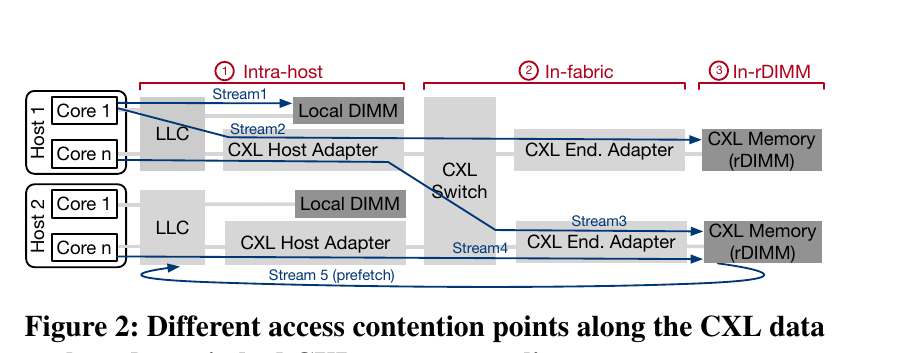
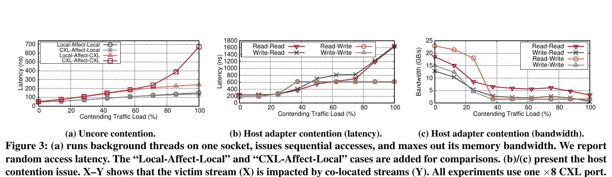
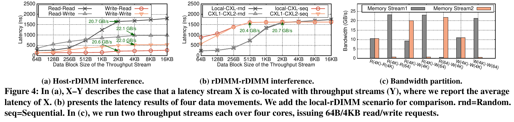
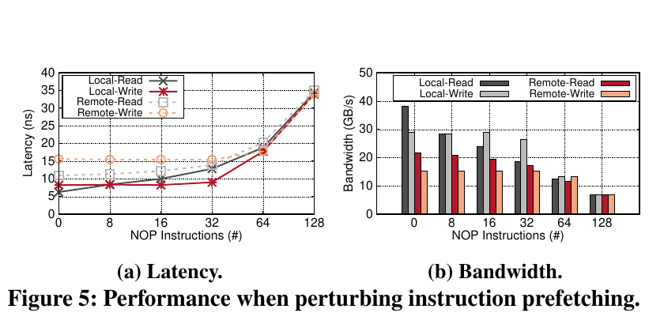
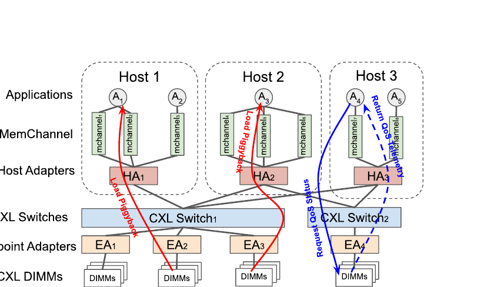
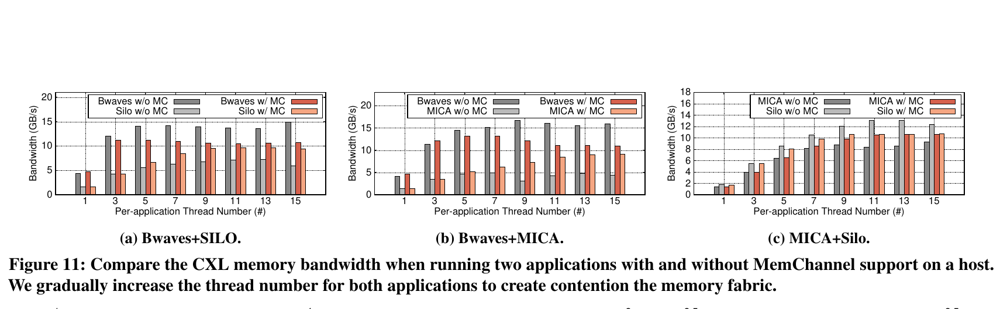
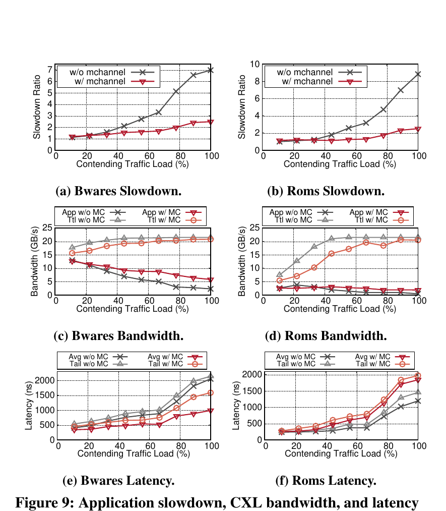
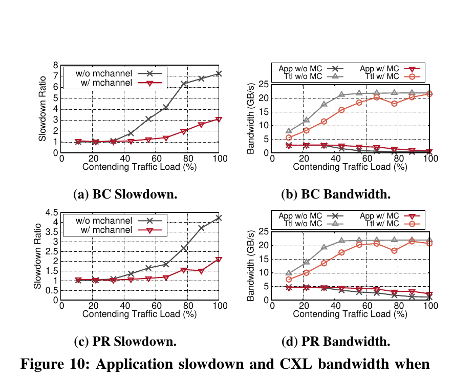
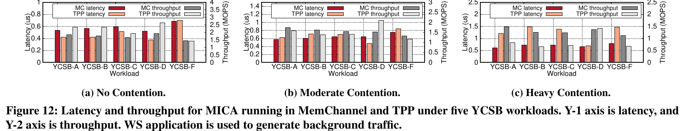

# MemChannel（NSDI '26）：面向交换式 CXL 内存池的端侧公平传输解构与项目启示

## 0. 阅读边界与证据口径

- **论文题目**：*Building A CSFQ-Inspired Transport for Switched CXL Memory Pooling*
- **作者**：Zerui Guo（University of Wisconsin-Madison）、Emily Shriver（Intel）、Ming Liu（University of Wisconsin-Madison）
- **会议**：第 23 届 USENIX Symposium on Networked Systems Design and Implementation（NSDI 2026）
- **原文**：[同目录 PDF](<[NSDI 2026] Building A CSFQ-Inspired Transport for Switched CXL Memory Pooling.pdf>)
- **分析范围**：直接查读论文正文与附录，共 19 个 PDF 页面。OSDI 2026 目录中的既有报告只用于对齐“物理矛盾开篇、机制拆分、图表嵌入、实验口径和项目映射”的写法，不引用其技术结论。
- **与项目的关系**：论文研究的是 CXL 内存池传输，不是大模型推理或 KVCache（大模型注意力键值缓存，即自回归生成时保存历史 Key/Value 激活状态、避免后续 Token 重复计算注意力的数据）系统。因此，论文事实与项目解释在下文分开表述，论文中的性能数字不作为本项目验收成绩。

本文使用以下证据标记：

| 标记 | 含义 |
|---|---|
| **论文事实** | 论文正文、图、表、算法或附录直接给出的设计与陈述 |
| **实测数据** | 论文在指定硬件、负载和基线下报告的测量结果 |
| **分析判断** | 根据论文机制与证据推导出的解释，原文未必采用同样措辞 |
| **项目解释** | 将论文原理映射到统一异构 KVCache 存储池后的工程含义 |
| **项目建议** | 需要由本项目自行设计或验证的动作 |
| **开放问题** | 原文信息不足、表述不一致或仍需复现确认的事项 |

首次出现的核心术语：

- **CXL**（Compute Express Link，通用计算互联总线）：基于 PCIe 物理层，为 CPU、加速器与内存设备提供低时延的内存语义互联。本文重点讨论 CXL.mem，即主机以 load/store 指令访问远端 CXL 内存。
- **CSFQ**（Core-Stateless Fair Queueing，核心无状态公平队列）：由网络边缘估计并标记流速率，核心设备只维护聚合状态，以近似最大最小公平方式分配带宽。
- **rDIMM**（remote DIMM，远端内存条）：位于 CXL 内存机箱、经交换机和端点适配器供主机访问的内存设备。
- **FLIT**（Flow Control Unit，流控单元）：CXL 链路上进行信用流控和转发的固定粒度传输单元。
- **mchannel**（内存通道对象）：MemChannel 在一个主机核与一个远端内存节点之间建立的逻辑传输通道，用于绑定应用、路径、需求和带宽属性。

---

## 1. 一页读懂论文

### 1.1 论文解决什么问题？

交换式 CXL 内存池允许多台主机通过 load/store 指令共享远端内存，但主机 Uncore、CXL 主机适配器、交换机端口和远端内存适配器都可能成为共享瓶颈。现有信用流控保证链路不丢包，却不理解“哪条内存流属于哪个应用、需要多少带宽、经过哪些设备”。结果是小请求被大请求堵住、一个应用吞掉大部分带宽、硬件预取产生的隐式流量又让目标适配器在交换机端口看似未拥塞时排队。

### 1.2 根因是什么？

可见症状是延迟抬升、带宽下降和租户间干扰。根因不是某一条 CXL 链路单纯“不够快”，而是三件事叠加：

1. 内存请求由 CPU 微架构、缓存命中、存储缓冲区和预取器隐式触发，应用流量与实际 FLIT 之间缺少可控映射；
2. CXL 交换机数据面几乎不可编程，只提供面向链路可靠性的信用流控，没有应用级公平与服务目标；
3. 端到端路径跨越主机、适配器、交换机和远端内存，任一节点都可能成为瓶颈，但系统缺少跨层、按流的实时容量视图。

### 1.3 核心洞察是什么？

既然无法在 CXL 核心交换路径里维护和调度每条内存流，就把控制逻辑移到发送端：主机用性能计数器观察实际远端内存访问，以共享的设备级聚合速率估计每个路径节点的公平份额，再把通道速率换算为应用线程在固定窗口内的可运行时间。这样不改应用，也不要求交换机执行逐流排队。

### 1.4 核心抽象是什么？

`mchannel` 把原本不可见的一串 load/store 请求变成可管理的系统对象。每个对象明确四类信息：请求者所在的主机核、目标远端内存节点、端到端 CXL 路径，以及带宽和干扰属性。主机运行时据此把“应用需求”映射到“经过哪些共享硬件”，再在路径上取最紧的带宽份额作为该通道的准入上限。

### 1.5 四项关键优化方法速览

#### 方法一：按运行窗口反推隐藏的内存需求

- **问题**：缓存、Read-for-Ownership（为写入取得缓存行所有权的读请求）和硬件预取会改变实际 CXL 流量，应用提交的 load/store 数量不能直接代表链路需求。
- **方法**：将应用线程固定到主机核，读取 Off-core Response 性能计数器，在完整调度窗口和实际运行时间两个尺度上分别估计已用速率与未限速需求。
- **效果**：把隐式内存访问转成每个 `mchannel` 可计算的需求和实际速率，并将硬件预取流量纳入控制输入。
- **关键证据**：论文 Figure 5 显示，插入 NOP 指令削弱预取后，本地与远端内存带宽都明显下降，说明仅看程序显式访存会低估真实流量。

#### 方法二：沿端到端路径估计最小公平份额

- **问题**：拥塞可能出现在主机、适配器、交换机或远端内存；只控制某个端口无法保证端到端隔离。
- **方法**：每台主机按设备聚合本地通道速率，通过预留的共享远端内存交换跨主机统计；各主机迭代计算每个路径节点的公平份额，通道最终取路径上的最小值。
- **效果**：逐流状态留在主机边缘，共享硬件只对应少量聚合变量，避免要求 CXL 交换机执行逐流调度。
- **关键证据**：重载下，三组双应用组合的带宽差分别由 8.9、11.5、3.1 GB/s 收敛到 1.3、1.8、0.1 GB/s（Figure 11）。

#### 方法三：把速率限制转换为主机运行时间准入

- **问题**：CXL 是无损网络，不能沿用 CSFQ 的核心丢包动作；现有交换机也没有可用的逐流整形器。
- **方法**：在每个 100 微秒调度窗口内，让应用线程运行 `T_R`，随后休眠 `T_W-T_R`；各通道错开窗口，减少同步突发。
- **效果**：在请求进入 CXL 路径前完成发送端准入，使总需求不超过估计公平份额。
- **关键证据**：主机适配器重载时，未控制应用的减速可达 7.0 倍和 8.8 倍，启用 MemChannel 后约为 2.5 倍；同时维持 96.1% 的两应用聚合带宽利用率（Figure 9）。

#### 方法四：用设备负载和回压反馈在线校准容量

- **问题**：适配器和交换机能处理的有效带宽随队列、刷新和内部执行状态变化，规格峰值不能直接当作可用容量。
- **方法**：用远端内存响应中的设备负载字段和 QoS（Quality of Service，服务质量）遥测回压构造负载因子；高负载时乘性减小容量估计，低负载时加性增加。
- **效果**：控制器在不读取交换机逐流队列的情况下逼近当前可用容量，避免固定限速浪费空闲带宽。
- **关键证据**：交换机内拥塞达到高负载后，MemChannel 的两应用聚合带宽利用率平均为 97.2%（Figure 10）。

### 1.6 最重要的实验结果是什么？

| 结论 | 论文实测 | 条件 |
|---|---:|---|
| 主机内部争用足以破坏远端内存性能 | CXL 访问延迟最高增加 13.4 倍；适配器近饱和时受害流带宽下降 82.6% | Intel Emerald Rapids，单个 ×8 CXL 端口，合成内存流 |
| 信用流控不等于应用公平 | 64 B 流与 4 KB 流混合时，读/写延迟分别增加到 6.9 倍/3.8 倍；大块流可占 97.8% 带宽 | XConn Apollo CXL 交换机，混合请求粒度 |
| 发送端控制能压低重载干扰 | 主机适配器争用下，Bwaves/Roms 的平均延迟降低 51.6%/35.1%，尾延迟降低 25.8%/26.3% | 背景流量不低于 80%，Figure 9 |
| 跨主机交换路径也可被控制 | BC/PR 在满载时的减速由 7.2/4.2 倍降到 3.1/2.1 倍 | 两主机的交换机内拥塞，Figure 10 |
| 与 TPP 的收益取决于竞争程度 | 无竞争时 TPP 吞吐高 1.2 倍、延迟低 16%；重竞争时 MemChannel 吞吐高 1.5 倍、延迟低 43% | MICA + 五类 YCSB，Figure 12 |
| 控制并非免费 | 100 微秒调度窗口下，POSIX 定时器中断开销为 1.7% | 论文原型配置 |

### 1.7 最大局限是什么？

MemChannel 控制的是 CPU 应用线程的运行时间，不是独立的内存请求、DMA 描述符或设备队列。这个办法适合 CPU 发起的 CXL load/store，但不能直接控制已经异步下发的 NPU/GPU 数据搬运。论文也没有运行大模型、KVCache、张量并行或前后台推理混压，因此它证明了“共享内存互联需要端到端流量控制”，没有证明本项目的 TTFT（Time To First Token，首 Token 响应时间）、TPOT（Time Per Output Token，每个输出 Token 的生成耗时）、Host CPU 零数据拷贝（CPU 只下发控制指令，不参与正文数据搬运）或多卡同步目标。

### 1.8 为什么与本项目相关？

- **必要性证据**：论文在商用交换式 CXL 平台上测到主机内部、交换机内部和远端内存端的多级干扰，说明依靠信用流控和标称带宽无法自然获得尾部时延稳定性。
- **可行性证据**：用端侧遥测、路径聚合状态和发送端准入，在高负载下仍可维持 96.1%～97.2% 聚合带宽利用率，同时改善受害应用延迟。这支持本项目建立“遥测—预算—准入—反馈”闭环。
- **差异化空间**：本项目面对的是设备 DMA、KVCache 语义优先级、张量并行（TP=8，即一次模型计算由 8 张加速卡协同执行）和多介质分层，不应照搬线程休眠。需要把同一原理落到传输描述符、硬件队列和协同流组上。
- **仍需自证**：论文没有验证 UBMEM（统一总线内存直通共享协议，即跨节点与异构设备直接共享内存地址空间的底层通信协议）、URMA（通用远程直接内存访问，即用户态高性能 RDMA 驱动接口与通信协议）、RoCE（RDMA over Converged Ethernet，基于融合以太网的远程直接内存访问）网络、国产 NPU、多租户语义一致性、TTFT/TPOT 或全链路混压门槛。

---

## 2. 为什么这个问题值得解决

### 2.1 交换式内存池的共享路径比“远端内存慢”更麻烦

直连 CXL 内存扩展器只有一个主机与设备的固定路径。交换式内存池加入多主机、多上行端口和多个远端内存节点后，同一条访问会穿过 CPU 缓存与 Uncore、主机适配器、CXL 交换机、端点适配器和内存控制器。不同应用可能只共享其中一段路径。局部链路没满，不代表端到端没有排队。



*图 1：主机内部、交换机内部与远端内存侧的争用位置，摘自原文 Figure 2。蓝色 Stream 5 表示预取产生的隐式访问。*

论文使用 XConn Titan 内存池设备。主机是 2U Intel Emerald Rapids 服务器，每台包含两颗 Xeon Gold 6530、1536 GB DDR5 和两块 Samsung 9MA3 960 GB NVMe SSD；每颗处理器有 32 个 2.1 GHz 核和 160 MB LLC。交换侧使用 XConn B2 Apollo CXL 2.0 交换机，具有 14 个上下行端口和 128 条 CXL 2.0 Lane；内存机箱最多容纳 12 条 CXL DIMM。Intel MLC 测得交换式远端内存访问延迟为 220.5 ns、带宽为 47.2 GB/s。

这些数据只描述论文平台。换成不同 CPU、适配器、交换芯片、端口宽度或内存设备，绝对延迟与转折点都会变化。

### 2.2 三个独立瓶颈

#### 瓶颈一：主机 Uncore 与适配器先于交换机发生争用

论文将受害流和背景流放在同一 Socket 上。FlexBus 拥塞时，CXL 随机访问延迟从 50.1 ns 增至 669.4 ns，即 13.4 倍。混合本地与 CXL 流量还会增加 LLC Miss 和缓存窥探，请求延迟最高增加 2.9 倍。

主机适配器的行为更值得警惕。论文在总流量只有适配器容量约 30% 时就观察到受害流退化。作者与设备厂商讨论后，将原因归到适配器内部多个虚拟通道的尽力调度和 FLIT 分布偏斜。近饱和时，Read-Read 场景的受害流带宽下降 82.6%，延迟从 230.2 ns 增至 1624.2 ns。



*图 2：主机内部争用随背景流量增加的延迟和带宽变化，摘自原文 Figure 3。*

#### 瓶颈二：逐跳信用流控不能提供请求级公平

CXL 交换机依靠逐跳信用维持无损传输。当 64 B 小请求与 4 KB 大请求共用端口时，大请求产生更多并发事务，轮询仲裁因而给它更多发送机会。论文测得 64 B 读/写分别慢到 6.9 倍和 3.8 倍；两个吞吐流混合时，4 KB 流可占用 97.8% 的总带宽。

这不是链路丢包导致的，而是无损信用与轮询在应用层语义上并不公平。小流即使只有很少的在途字节，也可能因队头阻塞等待大流的信用补充。



*图 3：64 B 延迟流与不同块大小吞吐流混合时的延迟，以及两条流的带宽分配，摘自原文 Figure 4。*

#### 瓶颈三：硬件预取把不可见流量带进远端适配器

顺序和规则步长访问会触发 CPU 预取器，实际发出的内存事务数可能远高于应用显式请求。论文在程序访问间插入 NOP，逐步破坏预取节奏；随着 NOP 增加，本地与远端读写带宽同时下降。原文据此判断，在规则访问下，目标适配器可收到约两倍于显式需求的流量，即使交换机下行端口尚未显示拥塞，适配器内部也会排队。



*图 4：插入 NOP 后预取效果减弱，内存带宽下降，摘自原文 Figure 5。该图说明显式 load/store 数量不足以代表实际 CXL 流量。*

### 2.3 为什么常见办法不够

- 只看链路峰值不够。真实有效容量随队列、内存刷新和设备内部状态变化。
- 只在交换机做信用分配不够。交换机看不到应用和主机核的需求，也不知道硬件预取属于哪条业务流。
- 直接套用 CSFQ 不够。CSFQ 依赖边缘标速、核心估计和概率丢包；CXL 数据面既无丢包语义，也缺少可编程的逐流动作。
- 只在单主机限速不够。跨主机流会在同一交换端口或远端内存处汇合，公平份额必须结合共享路径计算。

---

## 3. 核心抽象与系统设计

### 3.1 `mchannel` 把应用需求与物理路径接起来

一个 `mchannel` 对应“主机核 `C_i` 到远端内存 `rDIMM_j`”的通道，并与应用进程关联。它保存：

1. 主机/核心 ID 和目标内存节点；
2. 由 Fabric Manager 提供的端到端路径，包括主机适配器、交换机和端点适配器；
3. 通道运行时状态，类似操作系统中的连接对象；
4. 可选的带宽和干扰属性。未声明时按尽力服务处理。

论文提供 `mchannel_init`、`mchannel_open`、`mchannel_close` 和 `mchannel_sched` 四个接口。运行时用 `LD_PRELOAD` 和 `ptrace` 注入动态库，在构造函数和 `pthread_create` 处打开通道，并通过 NUMA 绑定把数据放到指定远端内存节点。应用代码可以不改，但线程亲和性、动态库注入和 POSIX 定时器成为系统前提。

### 3.2 控制面留在主机，数据面继续走原生 CXL



*图 5：应用、mchannel、主机适配器、CXL 交换机、端点适配器和远端内存六层模型，摘自原文 Figure 6。红、蓝路径说明不同通道可在不同位置共享硬件。*

MemChannel 没有重新封装每次内存访问。CXL FLIT 仍按原生路径传输。它新增的是主机侧控制环：

```text
应用线程与目标 rDIMM 绑定
  -> 读取核心级远端内存访问计数
  -> 汇总每个路径设备上的实际速率
  -> 读取远端内存负载/交换路径回压
  -> 估计每个设备的有效容量与公平份额
  -> 通道取路径最小份额
  -> 折算为下一调度窗口的可运行时间
```

跨主机只共享设备级聚合速率，不共享每条流的完整状态。作者借此保留 CSFQ 的“核心无逐流状态”思想，只是这里的“核心”不执行丢包，真正的准入发生在发送主机。

### 3.3 论文的状态所有权

| 状态 | 维护位置 | 消费者 | 作用 |
|---|---|---|---|
| 通道需求 `D_c`、实际速率 `r_c` | 主机运行时、每个 mchannel | 公平份额计算器 | 区分想要多少与实际用了多少 |
| 通道路径 | Fabric Manager 提供，主机保存 | 每个 mchannel | 确定经过哪些共享设备 |
| 设备聚合速率 `F_v` | 各主机局部统计，经共享远端内存求和 | 所有相关主机 | 估计共享设备的占用程度 |
| 设备容量估计 `C_v` | 主机运行时 | 公平份额与准入算法 | 表示当前可处理带宽，而非规格峰值 |
| 设备负载因子 `l` | 主机根据负载位或 QoS 遥测更新 | 容量校准器 | 触发加性增大或乘性减小 |
| 通道公平份额 `alpha_c` | 主机运行时 | 时间准入器 | 路径各设备份额的最小值 |

---

## 4. 关键技术实现与作用机理

### 4.1 按运行窗口估计已用速率与未限速需求

#### 解决的问题

应用线程只知道自己执行了多少次 load/store，控制器却需要知道多少远端缓存行访问真正进入了 CXL 路径。缓存命中、Read-for-Ownership 和预取会让两者不同。若直接用应用指令数限速，既可能漏掉预取流量，也可能把缓存命中误算成远端需求。

#### 核心方法

主机在固定窗口内读取 Off-core Response（OCR，处理器对核心外访问进行分类计数的硬件事件）计数器，用同一批远端访问样本分别估计通道实际速率和未受限需求。

#### 实现路径

1. `mchannel_open` 固定线程到目标核心，并映射远端内存性能计数器。
2. 一个调度窗口长度为 `T_W`，原型默认 100 微秒。线程实际运行 `T_R`，其余时间休眠。
3. 运行时统计窗口内远端缓存行访问次数 `n`，覆盖需求读、Read-for-Ownership 和硬件预取。
4. 以缓存行大小 `S` 计算已用速率 `r'_c=nS/T_W`。
5. 由于线程在 `T_R` 内全速运行，以 `D'_c=nS/T_R` 估计未限速需求。
6. 两者用指数平滑更新，避免单个窗口抖动直接改变准入。

#### 为什么有效

同一个 `n` 除以完整窗口，得到通道对共享链路的实际占用；除以全速运行时间，得到若不休眠时可能产生的需求。这样能区分“应用本身需求低”与“应用被控制器压低”。

#### 达到的优化效果

- **直接效果**：不可见的缓存行访问变成通道级 `D_c` 和 `r_c`，预取流量进入预算。
- **端到端效果**：论文没有单独消融 OCR 需求估计，因此不能把某一项端到端收益只归给该方法。

#### 代价与局限

方法依赖核心级计数器、线程固定和硬件事件语义。若多个线程共享核心、线程迁移、SMT 干扰或计数器不能区分目标内存节点，归因会变差。它也不能直接观测已经脱离 CPU 指令流的设备 DMA。

#### 对项目的意义

**ADAPT（改造后采用）**。项目可复用“同时估计需求与实际速率”的思路，但数据源应换成远程直接内存访问的提交与完成字节、NPU DMA 队列深度、链路利用率和硬件错误计数，不能依赖 CPU OCR 事件。

### 4.2 用聚合设备状态计算路径瓶颈份额

#### 解决的问题

每条通道的路径不同，拥塞节点也不同。若让每台主机只按本地总带宽平均分配，会忽略跨主机共享的交换端口和远端内存；若递归收集全部逐流需求，控制状态又会随流数和主机数膨胀。

#### 核心方法

按硬件节点聚合经过该节点的实际速率 `F_v`，每台主机只交换少量设备级统计，再用 CSFQ 的流体模型迭代估计节点公平份额 `alpha_v`。通道份额取路径所有节点中的最小值。

#### 实现路径

1. Fabric Manager 给出每个通道的端到端路径。
2. 主机把本地所有相关通道的 `r_c` 按适配器、交换机和远端内存节点求和。
3. 每台主机将局部和写入一小段预留的共享 CXL 内存；其他主机读取并求出全局 `F_v`。
4. 在设备容量 `C_v` 和聚合速率 `F_v` 下，按 `alpha_new = min(alpha_old * C_v/F_v, 本地最大需求)` 迭代更新份额。
5. 对通道 `c`，取 `alpha_c=min(alpha_v)`，其中 `v` 遍历该通道路径。

理论上的最大最小公平条件写为：

$$
C_v = \sum_{e_{uv}\in E} \min(\alpha_v, D_{uv})
$$

#### 为什么有效

每条内存流沿路径的访问速率保持一致，所以路径中的每个共享节点都可用“经过它的聚合速率”描述压力。逐流需求仍留在发送端；交换机和远端内存只对应固定数量的节点变量。通道取路径最小值，相当于把最紧的共享资源作为准入上限。

#### 达到的优化效果

- **直接效果**：逐流核心状态转换为主机边缘逐流状态与跨主机逐设备聚合状态。
- **实测效果**：Figure 11 中，15 线程重载时，Bwaves+Silo、Bwaves+MICA、MICA+Silo 的带宽差分别从 8.9、11.5、3.1 GB/s 降到 1.3、1.8、0.1 GB/s。



*图 6：三组应用在不同线程数下的 CXL 带宽分配，摘自原文 Figure 11。颜色区分启用和关闭 MemChannel。*

#### 代价与局限

共享远端内存中的统计区成为控制依赖。论文没有展开主机故障、陈旧统计、并发更新原子性、拓扑变化或分区时的处理。公平份额计算主要面向持续内存流；突发请求、短流和有截止期限的请求未被单独建模。

#### 对项目的意义

**DIRECTLY ADOPT（采用原理）**：把路径建模成多个可争用资源，调度预算取路径瓶颈值。

**ADAPT（重做实现）**：跨节点状态需要版本、租约、时间戳和失效规则；共享统计不能绕过项目既有的语义一致性与故障边界。

### 4.3 用线程占空比替代核心网络丢包

#### 解决的问题

原始 CSFQ 通过核心路由器概率丢包把流量压到公平份额。CXL 采用无损信用流控，交换机不能用丢包表达拥塞，也没有足够的可编程能力对每个应用流执行速率整形。

#### 核心方法

主机把目标带宽换算成应用线程在一个窗口内的运行占空比。通道需要的公平访问字节数为 `min(alpha_c,D_c)*T_W`，因此运行时间为：

$$
T_R = \frac{\min(\alpha_c,D_c)T_W}{D_c}
$$

若通道有权重 `w_c`，则把 `alpha_c` 替换为 `w_c alpha_c`。

#### 实现路径

1. POSIX 定时器开启长度为 `T_W` 的窗口。
2. 应用线程在 `T_R` 内全速执行。
3. 定时器到期后，线程休眠 `T_W-T_R`，把 CPU 和 CXL 准入机会让给其他通道。
4. 不同通道异步开始窗口，避免所有线程在同一时刻醒来形成新的突发。
5. 下一窗口重新测量需求、容量与公平份额。

#### 为什么有效

它不试图在 CXL 链路上撤销已经发出的请求，而是在发送源头减少会产生远端访问的指令执行时间。只要 `T_R` 内的需求估计可靠，长期平均流量就会靠近目标份额。

#### 达到的优化效果

- **直接效果**：核心丢包变成端主机准入；受控对象从 FLIT 变成应用线程运行时间。
- **实测效果**：Figure 9 中，满载背景流量下 Bwaves 和 Roms 的未控制减速达到 7.0 倍和 8.8 倍；启用 MemChannel 后约为 2.5 倍。重载区间两应用聚合带宽利用率平均为 96.1%。



*图 7：Bwaves 与 Roms 在主机适配器争用下的减速、带宽和延迟，摘自原文 Figure 9。*

#### 代价与局限

100 微秒窗口存在清晰的取舍：窗口更短，控制细但中断和上下文切换更多；窗口更长，开销低但突发和尾延迟更难控制。论文原型在 100 微秒下报告 1.7% 开销。

更重要的是，线程休眠会暂停该线程的所有工作，不只暂停远端内存访问。计算与访存混合的应用可能因此损失无关计算进度。对异步 DMA 来说，描述符一旦进入设备队列，暂停提交线程也未必能及时停止在途流量。

#### 对项目的意义

**DO NOT COPY（不照搬实现）**。统一异构 KVCache 存储池的数据面应控制传输描述符、队列令牌、在途字节和后台 Worker，而不是暂停推理主线程。

**ADAPT（采用思想）**。`目标字节预算 -> 可提交额度 -> 下一反馈周期` 的占空比控制可转化为设备队列令牌桶或步进式后台 I/O 预算。

### 4.4 用负载信号和 AIMD 校准动态容量

#### 解决的问题

设备规格给出的峰值带宽不是当前可用容量。队列阻塞、DRAM 刷新和端口回压都会改变 `C_v`。若容量估计偏低，链路空闲；估计偏高，公平份额之和仍会把设备推入排队。

#### 核心方法

MemChannel 从两类信号构造负载：远端内存响应中的 2 位设备负载等级，以及 CXL Component Command Interface 返回的 QoS 遥测回压比例。控制器对负载比例做平滑，再用加性增大、乘性减小调整容量估计。

#### 实现路径

1. 统计被标记为中度或严重过载的响应比例 `L`，或直接使用遥测中的回压百分比。
2. 用 `l_new=(1-g)l_old+gL` 更新负载因子。
3. 当实际流量低于当前容量估计、但负载仍高于阈值 `delta` 时，乘性减小 `C_v`。
4. 当负载不高于阈值时，按空闲程度加性增加 `C_v`。
5. 新容量进入下一轮公平份额计算。

#### 为什么有效

负载和回压比规格峰值更接近设备当下的排队状态。AIMD（Additive Increase Multiplicative Decrease，加性增大/乘性减小）在空闲时逐步探测，在过载时快速收缩，避免控制器长期停在错误容量上。

#### 达到的优化效果

- **直接效果**：静态峰值带宽变成随设备状态变化的在线容量估计。
- **实测效果**：交换机内拥塞达到 80% 以上后，MemChannel 在两应用间实现平均 97.2% 的聚合带宽利用率；BC/PR 满载减速由 7.2/4.2 倍降到 3.1/2.1 倍。



*图 8：BC 与 PageRank 在交换机内拥塞下的减速和带宽，摘自原文 Figure 10。*

#### 代价与局限

原文算法第 26 行写为 `dev.C = max(dev.C, dev.max_capacity)`。若 `max_capacity` 真的是容量上限，这个表达会把容量至少抬到上限，与前面的乘性减小冲突；常规写法应是限制其“不超过上限”，但论文没有解释该变量是否另有含义。本文不替作者修改，列为复现前必须确认的开放问题。

设计引用 CXL 3.2 的设备负载与 QoS 遥测，而测试平台描述为 CXL 2.0。论文说原型包含交换机、适配器和远端内存扩展，但没有充分交代这些信号在该平台上由原生硬件、固件扩展还是软件替代实现。这个差异会影响可移植性判断。

#### 对项目的意义

**ADAPT（改造后采用）**。项目可以保留“动态容量不是规格常数”的判断，但应在硬件能力矩阵中明确每类路径可读取哪些信号：URMA/RDMA 完成速率、网卡队列深度、ECN（显式拥塞通知）、PFC（按优先级暂停流量）、设备 DMA 队列、SSD 时延和 NPU 计算阶段。缺失字段必须标为不可用，不能用 0 代替。

---

## 5. 实验到底证明了什么

### 5.1 实验平台与负载

| 类别 | 论文配置 |
|---|---|
| 主机 | 2U Intel Emerald Rapids；每台双 Xeon Gold 6530；每颗 32 核、2.1 GHz、160 MB LLC；1536 GB DDR5；Ubuntu 24.04 |
| CXL 平台 | XConn Titan；ASIC 主机/端点适配器；B2 Apollo CXL 2.0 交换机；每主机适配器含两个 ×8 CXL 端口 |
| 基础性能 | Intel MLC：交换式 CXL 内存访问 220.5 ns、47.2 GB/s |
| 数据库 | MICA：8 B Key、100 B Value；Silo：1 KB Value；YCSB A/B/C/D/F |
| 图分析 | GAP：BFS、SSSP、PageRank、Connected Components、Betweenness Centrality；Kronecker 与均匀随机图 |
| 计算负载 | SPEC CPU 2017、PARSEC |
| 指标 | 应用吞吐、平均/尾延迟、减速比、CXL 带宽；访问延迟按 CHA 队列占用除以请求数估计 |

### 5.2 主张级证据表

| 论文主张 | 实验与基线 | 结果 | 能证明什么 | 不能证明什么 |
|---|---|---|---|---|
| MemChannel 不以牺牲空载吞吐换隔离 | MICA/Silo，单 ×8 端口，启用与关闭 MemChannel | 吞吐几乎不降；提供 19.6 GB/s CXL 带宽 | 控制器在该负载下能让低竞争通道按需求运行 | 不代表所有计算/访存混合程序都无损 |
| 扩展到双端口后仍可利用带宽 | MICA/Silo，双 ×8 端口、64 线程 | 平均 225.3 MOPS、41.0 GB/s；平均/尾延迟降低 23.9%/19.6% | 设备级聚合与路径控制在双适配器平台可工作 | 不等于多层或集群级 CXL Fabric 已验证 |
| 主机内部争用可被缓解 | Bwaves/Roms + 背景流，Figure 9 | 重载区平均延迟降低 51.6%/35.1%，尾延迟降低 25.8%/26.3%；聚合利用率 96.1% | 发送端准入能在适配器争用时保护受害流 | 不能分离需求估计、公平计算、容量反馈各自贡献 |
| 跨主机交换机争用可被缓解 | BC/PageRank + 跨主机背景流，Figure 10 | 满载减速由 7.2/4.2 降到 3.1/2.1；重载聚合利用率 97.2% | 控制不局限于单主机瓶颈 | 没有证明 P99.9 或短突发下同样稳定 |
| 分配更接近最大最小公平 | 双应用组合，线程数 1 到 15，Figure 11 | 三组带宽差由 8.9/11.5/3.1 降至 1.3/1.8/0.1 GB/s | 重载下带宽分配明显收敛 | “带宽差变小”不是完整的动态收敛、加权公平或 SLO（服务目标）公平证明 |
| 竞争越重，MemChannel 相对 TPP 越有价值 | MICA + YCSB，背景流分三级，Figure 12 | 无竞争时 TPP 吞吐高 1.2 倍、延迟低 16%；中竞争接近；重竞争时 MemChannel 吞吐高 1.5 倍、延迟低 43% | 隔离机制在重竞争时能超过只做页迁移的方案 | 不能推出 MemChannel 普遍优于 TPP；低竞争下结论相反 |
| 控制开销可控 | 100 微秒窗口 | POSIX 定时器中断开销 1.7% | 给出原型控制成本量级 | 没有给出更短窗口、更多通道和高上下文切换压力下的曲线 |



*图 9：MICA 在无竞争、中竞争和重竞争下的延迟与吞吐，摘自原文 Figure 12。图中最重要的结论是收益随竞争强度反转，而不是单一的最高加速数字。*

### 5.3 理论结果的准确边界

论文给出的发送上界是：在采样区间 `K` 内，若公平份额 `alpha_c` 和权重 `w_c` 固定，通道最多发送

$$
w_c\alpha_cK\left(1+2\frac{T_W}{K}\right)
$$

其中额外项来自区间首尾最多两个不完整调度窗口。这个证明约束了短期超发量，说明窗口越短，相对误差越小。它没有证明动态需求、动态容量、陈旧跨主机统计和计时器抖动共同存在时一定收敛，也没有覆盖端到端尾延迟。

---

## 6. 论文的亮点与局限

### 6.1 亮点：把网络公平问题改写为可实施的主机准入问题

论文没有假设 CXL 交换机突然具备可编程数据面，而是把 CSFQ 的思想拆开：保留边缘测量与聚合公平份额，丢弃核心丢包，把执行动作改成发送端占空比。这一转化符合现有 CXL 硬件约束。

**局限**：占空比控制粒度是线程，不是内存事务。它会把计算和访存一起暂停，对混合阶段和异步设备 I/O 的适用性较弱。

### 6.2 亮点：根因刻画覆盖了完整 CXL 路径

论文没有把交换机视为唯一瓶颈。Figure 3、4、5 分别证明主机内部、交换路径和预取诱发的远端压力都可能先出问题。这让“端到端路径最小份额”有了实测基础。

**局限**：每类根因主要在合成内存流上隔离测量。真实应用结果能证明组合系统有效，却没有逐项消融三类根因各占多少。

### 6.3 亮点：公平与利用率同时报告

只压低背景流很容易得到更低受害延迟，但可能浪费链路。论文同时报告应用减速、平均/尾延迟和聚合带宽利用率，重载下仍达到 96.1%～97.2%。这比只展示受害流改善更完整。

**局限**：公平指标主要是两应用带宽差，没有 Jain's Fairness Index、加权目标误差、SLO 达标率或短流完成时间。对“效率高且公平”的证明仍偏窄。

### 6.4 亮点：正面呈现无竞争时的反向结果

Figure 12 显示无竞争时 TPP 更快，重竞争时 MemChannel 才占优。这个结果说明控制层的价值来自共享资源压力，而不是把 MemChannel 包装成所有场景都更快的内存系统。

**局限**：系统需要判断何时进入有效控制区。论文没有给出以业务 SLO、突发程度或预测误差驱动的启停策略。

---

## 7. 论文没有解决什么

1. **没有控制设备 DMA**：论文从 CPU 核心的 load/store 计数与线程运行时间出发，未覆盖 GPU/NPU、RDMA 或 SSD 控制器已经接收的异步工作队列。
2. **没有 KVCache 语义**：不知道哪条流属于首层加载、前台 Decode、后台换出、缓存复制或故障恢复，最大最小公平也未必符合业务优先级。
3. **没有协同流组完成目标**：张量并行的 8 条子流需要一起完成，系统时延由最慢子流决定。逐通道公平不等于协同流组完成时间最短。
4. **没有生产级故障语义**：共享统计区、主机运行时或 Fabric Manager 失效后的陈旧状态、回退和安全默认值没有展开。
5. **没有集群级验证**：论文评测在机架规模，讨论中明确将多层交换、PBR（Port-Based Routing，基于端口的路由）Scale-out 和 CXL Bundled Port 留作后续工作。
6. **没有应用级截止期限**：权重扩展可表达相对份额，但不能直接表达 TTFT 时限、TPOT 尾部约束或后台任务最小进度。
7. **没有完整复现说明**：算法第 26 行的容量上限方向、CXL 2.0 平台如何提供文中引用的 CXL 3.2 信号，都需要实现或作者材料进一步澄清。

---

## 8. 对统一异构 KVCache 存储池的启发

下文沿用前述 KVCache、TTFT 与 TPOT 定义，不把论文的内存应用结果直接换算成推理收益。

### 8.1 可以直接采用的原理

#### 路径资源图与瓶颈最小值

把每条 KVCache 数据路径拆成主机总线、设备 DMA、网卡、交换端口、目标显存或 SSD 队列等资源节点，并为每个节点维护动态可用容量。单条传输计划的可提交预算应受路径中最紧节点约束。这个原则与具体协议无关，可以直接进入查询与放置计划。

#### 需求与实际速率分开记录

被限速后的完成带宽不能代表真实需求。控制器应同时记录“若不限制会提交多少”和“本周期实际完成多少”，否则容易把自身限速误判成业务负载下降。

#### 低竞争快速放行

Figure 12 表明无竞争时额外控制可能不划算。控制器应允许在容量充足、尾部指标稳定时退出强限速，只保留轻量遥测；竞争上升后再进入闭环控制。

### 8.2 需要按项目环境改造的部分

#### 从线程占空比改为设备队列预算

在 URMA 和 UBMEM 路径下，正文数据可能由设备 DMA 直接搬运。项目应控制以下对象：

- 每条路径允许提交的描述符数和字节数；
- 每个硬件队列的令牌与在途字节；
- 后台换出、拉取、复制的步进预算；
- 已提交但未完成请求的取消或降级边界。

这保留了 MemChannel 的发送端准入思想，同时不暂停前台推理线程。

#### 从最大最小公平改为语义优先级与最低进度并存

本项目的 **SemanticQoS**（前后台服务质量保障策略，即通过硬件优先级队列和应用层退避限制后台搬运对前台 TPOT 的影响）不能只追求等带宽。前台在线流需要更高优先级，后台分层搬运仍需保留最低进度，故障恢复流则可能短时提升优先级。可采用分层权重、最小保底与上限预算组合，而不是所有通道等分。

#### 把隐式流量扩展为“计划字节—提交字节—完成字节”对账

CPU 预取对应项目中的隐式流量风险包括设备预读、Scatter-Gather 放大、重试、分片补齐和多卡复制。每次运行应记录计划路径、实际路径、提交字节、完成字节、重试字节和在途峰值。只看应用声明的数据量会低估真实占用。

#### 把路径公平扩展到 TP=8 协同流组

张量并行（TP=8）多卡状态同步时，同一计算步骤的 8 条传输必须整体就绪。单流最大最小公平可能让每条流都“公平”，但最慢 Rank 仍拖住计算。项目应在通道之上增加协同流组，预算目标从单流带宽扩展为 Coflow Completion Time（协同流组整体完成时间）。

### 8.3 不应照搬的实现

- 不用 POSIX 信号暂停推理主线程来控制设备流量。
- 不把固定 100 微秒窗口直接当作国产 NPU 平台参数。
- 不把 CXL 设备负载位假设成 URMA/RoCE/NVMe 路径的通用遥测。
- 不把带宽平均公平当作 TTFT/TPOT 服务目标已经满足。
- 不把论文的 1.5 倍吞吐或 43% 延迟改善外推为 KVCache 项目收益。

---

## 9. 对项目立项的证据价值

### 9.1 Problem Validation：论文独立确认了什么问题

论文用商用交换式 CXL 平台确认：共享内存互联的性能干扰会同时出现在主机内部、交换路径和远端内存侧；硬件信用流控只能保证无损，不能保证应用公平与尾部时延；规则访问产生的预取流量还会让显式带宽预算失真。

这为本项目“不能只打通高速数据路径，还要建设动态拥塞控制与前后台隔离”提供了独立问题证据。

### 9.2 Mechanism Validation：哪些技术方向获得外部支持

论文支持以下底层原理：

1. 在发送端按业务对象建立可控通道；
2. 用运行时遥测而不是规格峰值估计可用容量；
3. 依据完整路径上的共享资源计算预算；
4. 用准入控制阻止过量请求进入无损网络；
5. 低竞争时放行，高竞争时收紧，并保持较高链路利用率。

这些原理可映射到项目的硬件能力矩阵、查询与放置计划决策引擎、动态队列预算和全链路混压控制。映射属于原理级支持，不是实现级复用。

### 9.3 Research-Gap Validation：哪些缺口仍由本项目解决

- MemChannel 不理解 KVCache 层号、前后台角色、复用收益和计算依赖，本项目需要把传输优先级与推理语义接起来。
- MemChannel 不控制 DMA 描述符，本项目需要在 Host CPU 零数据拷贝路径中直接约束设备队列。
- MemChannel 逐通道优化，本项目还要处理 TP=8 多卡协同流组的最慢流。
- MemChannel 没有覆盖 HBM、远端显存、主机内存和 NVMe SSD 的多介质路径切换。
- MemChannel 的故障与陈旧状态处理不完整，本项目需要租约、版本、回退和实际路径审计。

### 9.4 Unsupported Project Claims：论文不能替项目证明什么

- 不能证明 Host CPU 零数据拷贝，即 CPU 只下发控制指令、正文数据不经过 Host DDR。
- 不能证明 Direct-View（远端直读）与 Copy-to-HBM（拷贝到本地显存）的性能边界。
- 不能证明查询与放置计划决策引擎可在微秒级做出正确路径选择。
- 不能证明张量并行多卡状态同步耗时或协同流组偏斜目标。
- 不能证明前台 TTFT 降低 20%、QPS 提升 10% 或 TPOT 干扰率低于 3%。这些是项目目标，不是论文结果。
- 不能证明 RoCE 优先级队列、PFC/ECN 或国产 NPU 队列在本项目拓扑中会产生同样收益。

### 9.5 立项结论

这篇论文对项目最有价值的部分不是某个加速数字，而是对共享互联失控机理的实测确认，以及“端侧遥测、路径预算、发送准入”闭环的可行性证明。它能支持项目建设动态拥塞控制和多租户隔离的必要性，也说明发送端软件在不改交换机逐流数据面的前提下可以取得实际效果。

项目仍承担主要证明责任：需要把 CPU load/store 的线程级控制改造成 NPU、URMA/RDMA 和 NVMe 数据路径上的设备级控制，并在真实 KVCache 前后台混压和 TP=8 协同下重新验证。

---

## 10. 建议优先验证的五项实验

### 10.1 遥测能否解释真实路径容量

- **假设**：设备队列、完成速率和网络拥塞信号可以解释短周期内的有效带宽变化。
- **变量**：前后台并发度、块大小、访问方向、预读/重试开关、共享端口拓扑。
- **基线**：固定规格带宽模型；仅使用单一链路利用率的模型。
- **指标**：容量预测误差、漏报拥塞率、提前量、P99 队列等待。
- **判定**：若遥测模型不能在拥塞发生前或早期稳定识别瓶颈，就不能驱动自动限速，只能作为观测信号。

### 10.2 线程退避与设备队列预算的同流量对照

- **假设**：设备队列预算能获得与线程退避相近的拥塞改善，同时减少对前台计算的误伤。
- **变量**：控制周期、令牌上限、在途字节、前后台流比例。
- **基线**：无控制；暂停 Worker；固定带宽限速。
- **指标**：前台 TTFT/TPOT 分位数、后台完成带宽、NPU 空转时间、控制 CPU 开销。
- **判定**：若设备预算不能同时稳定前台尾延迟并保留后台最低进度，需要调整控制对象或队列映射。

### 10.3 语义优先级、权重公平与最低进度

- **假设**：分层权重加后台保底比单纯最大最小公平更符合在线推理目标。
- **变量**：前台/后台权重、保底带宽、突发额度、硬件优先级队列开关。
- **基线**：先进先出；等权公平；仅硬件优先级。
- **指标**：前台 SLO 达标率、P99 TPOT 干扰、后台进度、链路利用率、饥饿时间。
- **判定**：若前台改善来自后台长期饥饿，结果不满足生产准入。

### 10.4 单流公平与 TP=8 协同流组完成时间

- **假设**：按协同流组分配预算可降低最慢 Rank 拖尾，优于逐流等权分配。
- **变量**：Rank 数、路径异构、单 Rank 慢流、并发协同流组数。
- **基线**：逐流最大最小公平；静态等带宽；无协同流组感知。
- **指标**：协同流组整体完成时间 P50/P99、最慢 Rank、偏斜系数、Layer 0 就绪时间。
- **判定**：若平均带宽改善但协同流组 P99 不降，不应把方案视为多卡推理有效。

### 10.5 控制状态陈旧与故障回退

- **假设**：主机失联、共享状态延迟或拓扑变化时，控制器能在有限时间内进入安全保守模式并恢复。
- **变量**：统计延迟、丢更新、主机崩溃、路径切换、设备遥测缺失。
- **基线**：无版本共享状态；固定超时；不做回退。
- **指标**：过量提交字节、恢复时间、前台失败率、错误路径消费、后台停顿时间。
- **判定**：若陈旧状态可持续放大拥塞或让错误路径继续提交，需先补齐版本、租约和失效状态机，再进入端到端性能验证。

---

## 附录 A：关键证据索引

| 结论 | 原文位置 | 证据类型 | 使用限制 |
|---|---|---|---|
| 主机 Uncore 争用使 CXL 延迟最高增加 13.4 倍 | §2.3，Figure 3a，PDF 第 5 页 | 实测数据 | 单平台、合成流 |
| 主机适配器受害流带宽下降 82.6% | §2.3，Figure 3b/c，PDF 第 5 页 | 实测数据 | 单 ×8 端口、特定虚拟通道行为 |
| 64 B 与 4 KB 混合导致 6.9/3.8 倍读写延迟 | §2.3，Figure 4a，PDF 第 5 页 | 实测数据 | 混合粒度场景 |
| 大块流占 97.8% 带宽 | §2.3，Figure 4c，PDF 第 5 页 | 实测数据 | 两条吞吐流、四核心 |
| 预取引入未管理流量 | §2.3，Table 1、Figure 5，PDF 第 6 页 | 实测数据 + 论文解释 | NOP 扰动是间接证据，不是逐 FLIT 追踪 |
| mchannel 抽象与六层模型 | §3.1～§3.4，Figure 6，PDF 第 7～8 页 | 论文事实 | 依赖路径发现、核心绑定和注入运行时 |
| CSFQ 流体模型与公平份额 | §4.1～§4.3，Eq. 1～5，Algorithm 1，PDF 第 8～10 页 | 模型与算法 | 动态收敛范围有限；容量上限伪代码需澄清 |
| 单/双适配器应用性能 | §5.2，Figure 7/8，PDF 第 10～11 页 | 实测数据 | MICA/Silo 与 YCSB，不是 LLM |
| 主机内性能隔离 | §5.3，Figure 9，PDF 第 12 页 | 实测数据 | SPEC 应用 + 合成背景流 |
| 跨主机性能隔离 | §5.4，Figure 10，PDF 第 12 页 | 实测数据 | 两个图分析应用 |
| 带宽公平性 | §5.5，Figure 11，PDF 第 13 页 | 实测数据 | 双应用带宽差，不是完整公平指标 |
| 与 TPP 的竞争强度对比 | §5.5，Figure 12，PDF 第 13 页 | 实测数据 | 低竞争时 TPP 更优 |
| 100 微秒窗口开销 1.7% | §5.6，PDF 第 13 页 | 实测数据 | 未给窗口扫描曲线 |
| 机架规模、多层交换和 Bundled Port 限制 | §5.7，PDF 第 13 页 | 论文事实 | 作者明确列为后续改进 |

## 附录 B：复现前需要作者或实现澄清的事项

1. Algorithm 1 第 26 行 `max(dev.C, dev.max_capacity)` 的变量语义与边界方向。
2. CXL 2.0 测试平台上，CXL 3.2 设备负载位和 QoS 遥测由何种硬件或固件路径提供。
3. 跨主机共享统计区的原子更新、时间戳、主机失效和陈旧数据处理。
4. 不同通道 POSIX 定时器异步化的具体抖动范围，以及高通道数下的调度开销。
5. 权重与多层 HCSFQ 扩展是否有独立实验；正文主要给出方法，没有对应的完整量化结果。
6. 论文的短期发送上界如何扩展到容量和公平份额持续变化的实际闭环。
