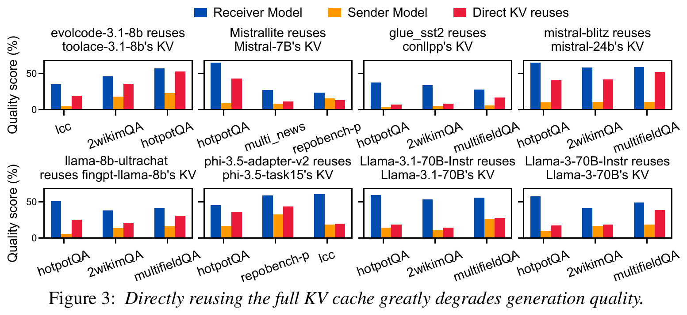
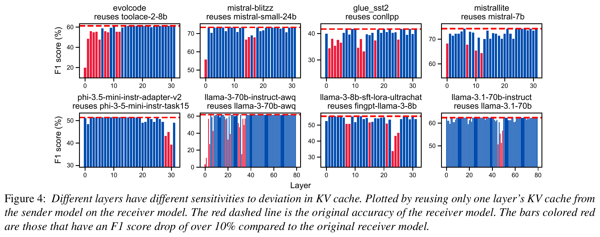
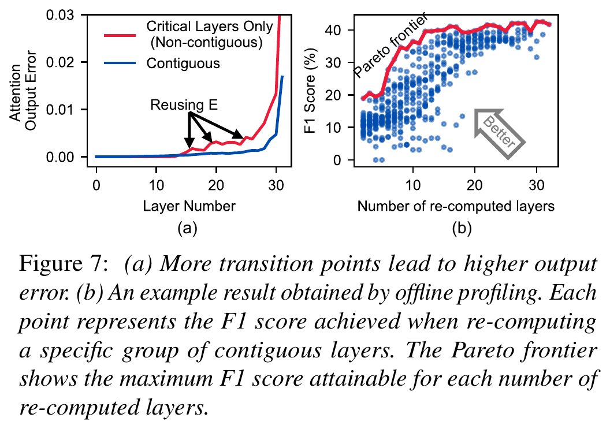
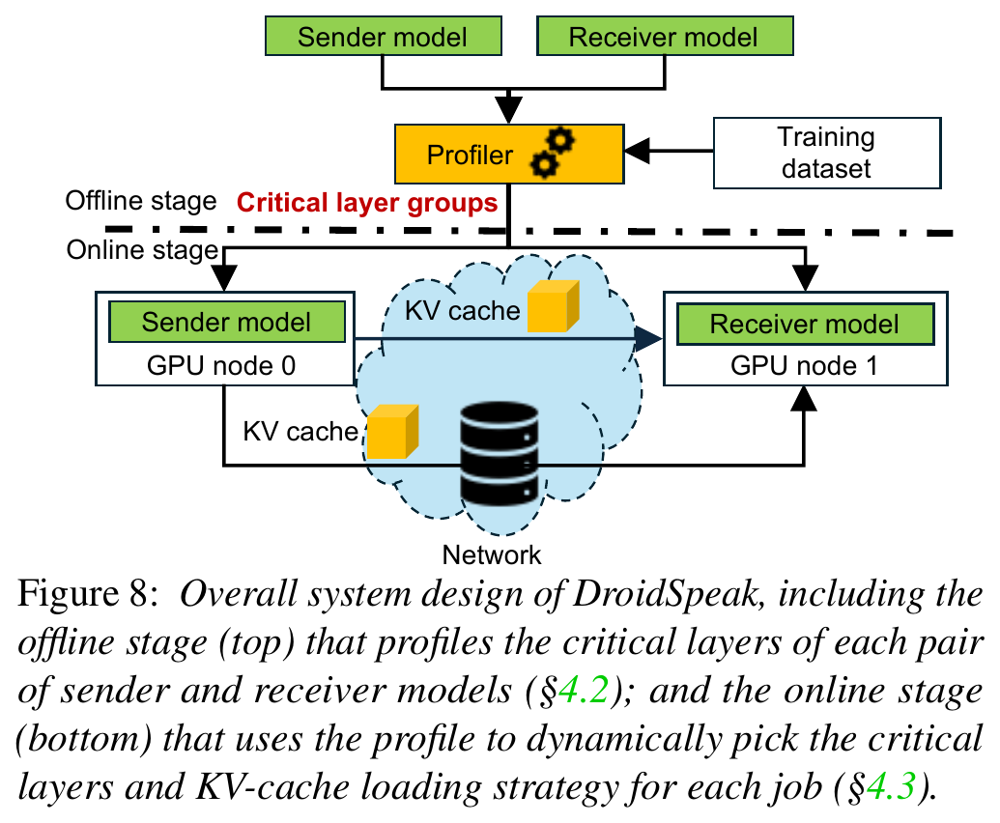
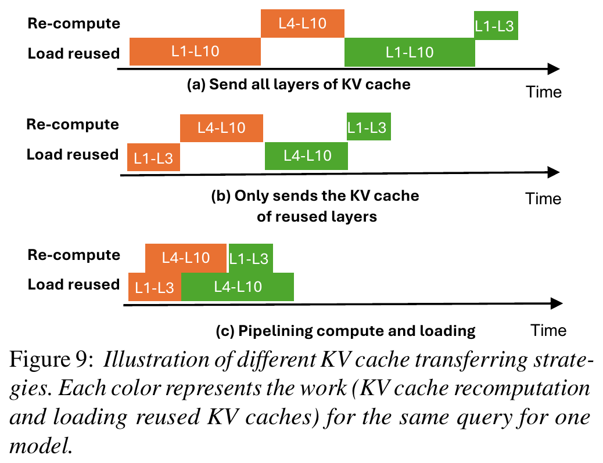
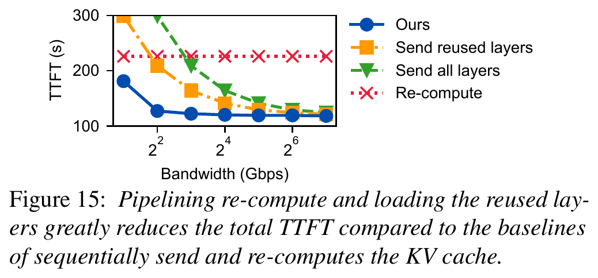
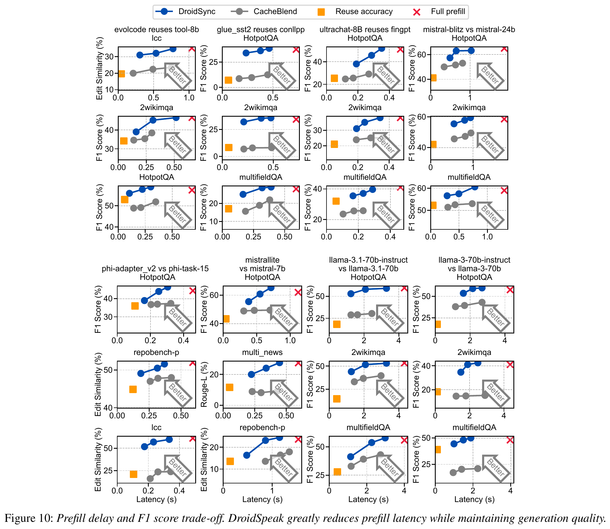
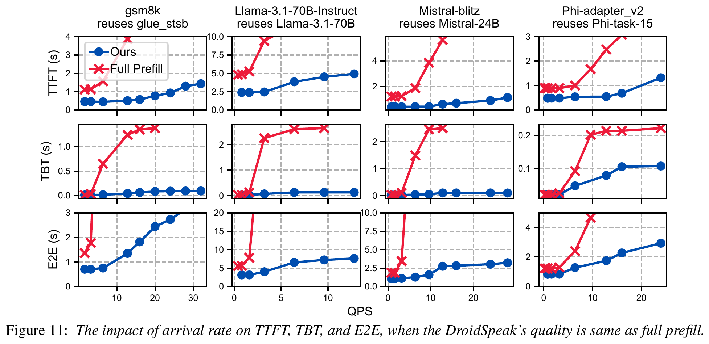

# DroidSpeak：跨微调模型变体的 KVCache 共享机制解构

> 论文：[DroidSpeak: KV Cache Sharing Across Fine-tuned Model Variants](<[NSDI 2026] DroidSpeak KV Cache Sharing Across Fine-tuned Model Variants.pdf>)  
> 作者：Yuhan Liu、Yuyang Huang、Jiayi Yao 等（University of Chicago / Microsoft）  
> 分析范围：仅依据该 PDF 原文及本项目受控架构文档，未读取或复用其他版本的论文解构报告。  
> 证据标记：「论文事实」「实测数据」「分析判断」「项目建议」「开放问题」。

KVCache 是大模型注意力键值缓存，即自回归生成过程中缓存的历史 Key/Value 激活张量，用来避免后续 Token 生成时重复计算注意力。DroidSpeak 研究的不是常规的“同一模型、不同请求”缓存共享，而是更难的“不同微调模型、相同长前缀”共享。

---

## 1. 一页读懂论文

### 1.1 论文解决什么问题

「论文事实」多 Agent、多 LoRA 和个性化助手会让多个从同一基础模型派生的微调模型重复处理相同长上下文。现有前缀缓存系统默认生产者和消费者使用相同权重；权重不同时，接收模型无法把发送模型的整份 KVCache 当成等价中间状态。

完整重算能保证接收模型的原有质量，却浪费了已经存在的大量类似状态；全量直接复用几乎消除 Prefill（首字预计算，即对完整 Prompt 建立 KVCache 的阶段），但会严重破坏生成质量。DroidSpeak 就在这两个极端之间找可执行的中间态。

### 1.2 根因是什么

「分析判断」表面症状是长 Prompt 导致 TTFT（Time To First Token，首 Token 响应时间）上升，并发增加后请求开始排队。根因有两层：

1. 跨模型缓存缺少可用的兼容性抽象。系统不知道哪些层对权重变化敏感，也不知道哪些层可以承受近似复用。
2. 即使找到需要重算的层，跨节点加载、局部重算和解码依赖之间仍可能串行。传输只是取代了计算，并没有自动缩短关键路径。

### 1.3 核心洞察与抽象

「论文事实」全量直接复用会严重降低质量；但在论文的 8 个模型对中，平均只有约 11% 的层被识别为对跨模型 KV 偏差敏感的“关键层”，非关键层的敏感度对同一模型对的不同输入相对稳定。

「分析判断」因此，跨模型复用不必在“全部复用”和“全部重算”之间二选一。它可以被表达成一个受质量约束的局部状态转换问题：重算少数连续层，复用其余层，并将转换点的 E cache（某层重算所需的全上下文嵌入激活）作为接收模型的重算入口。

论文真正建立的抽象是“模型对专属的重算配置”，而不是一个新的缓存命中位：

```text
(发送模型版本, 接收模型版本, 任务数据域)
  -> 连续重算层区间
  -> 转换层 E cache
  -> 可复用 KV 层集合
  -> 质量与重算开销的 Pareto 配置
```

### 1.4 五个优化方法速览

| 方法 | 问题 | 做法 | 直接效果 |
|---|---|---|---|
| 离线层敏感度画像与 Pareto 配置 | 在线系统不知道哪些层必须重算 | 对每个发送—接收模型对离线测量连续重算区间与生成质量 | 将在线无界搜索缩成少量可选配置 |
| 单连续关键层组重算 | 全量复用会丢质量，离散重算会引入多个 E cache 转换点 | 用一个连续区间包住关键层，在接收模型上重算该区间 | 以少量额外计算换取更少的转换偏差 |
| 只传输实际复用层 | 全层 KV 传输中包含即将被重算的无效数据 | 只传输区间外 KV 和一个转换层 E cache | 减少跨节点字节数和等待时间 |
| E cache 优先的传输—重算流水 | 先加载再重算会把网络和 GPU 计算串行相加 | 先送 E cache，到达即开始重算；另一 CUDA Stream 并行加载复用 KV | 关键路径由求和转为两条支路取较大值 |
| 负载与 SLO 感知的配置切换 | 固定重算比例不能同时适应空闲、排队和不同时限 | 从离线 Pareto 前沿选取满足质量和时延目标的配置 | 高负载少重算，低负载多重算以换取质量余量 |

### 1.5 决定性实验结果

「实测数据」在两台各含 8 张 80GB A100、节点间 200Gbps HDR InfiniBand 的环境中，论文测试了 8 个模型对和 6 个数据集：

- 相对完整 Prefill，Prefill 延迟降低 1.7–3.1 倍，平均 2.1 倍。主实验的离线配置筛选使用“相对接收模型原始质量下降不超过 5%”的阈值；论文没有明确这里的 5% 是相对比例还是百分点。
- 与 CacheBlend 相比，在相近 Prefill 延迟下质量高 5%–33%，平均高 16%。
- 在 HotpotQA 的 Poisson 到达在线实验中，按论文定义的 SLO 拐点口径，吞吐能力提高 2–4 倍。
- MetaGPT 双 Agent 代码流程中，在 pass@1=52.5 的配置下，TTFT 改善 2.7 倍，端到端延迟也下降。

这些结果不是通用系统上限。2–4 倍吞吐依赖论文的 SLO、请求分布、副本数和调度方法；TBT（Time Between Tokens，连续输出 Token 的间隔）与端到端延迟的下降主要是 Prefill 缩短后排队和干扰减少的二阶效应，不是 DroidSpeak 直接优化了 Decode 内核。

### 1.6 最大局限与项目判断

「论文事实」论文正文和限制章节的实际适用范围是“同一基础模型派生的变体”，不是任意相同结构的模型。论文还没有解决数据漂移、多模型组合爆炸、实时网络变化、多租户隔离、多卡一致动作和故障回退。

「项目建议」对统一异构 KVCache 存储与调度底座来说，DroidSpeak 最值得吸收的是“层级兼容性画像 + 受质量约束的部分重算计划 + 传输与计算流水”。它不能被塞进现有的精确缓存命中语义，更不能用平均 F1 损失取代模型、Tokenizer、Prompt 模板、LoRA、Ready 和 Lease 等消费资格校验。合理定位是一条显式近似、可撤销、失败时回到完整重算的研究型分支。

---

## 2. 为什么这个问题值得解决

### 2.1 共享长前缀不是小众负载

「论文事实」论文给出三类典型场景：多 Agent 继承对话历史，同一基础模型的多个版本或 LoRA 处理相同内容，以及个性化助手读取共同新闻或知识库。论文分析一条 LangGraph 多 Agent 轨迹后报告，对话中平均 49% Token 属于可复用前缀。

「分析判断」这个数字只能说明论文所选轨迹中存在明显重复，不能代表所有 Agent 业务。但它已经足以支持一个工程问题：当上下文较长、模型之间重复频繁时，每个模型各算一遍 Prefill 会将相同业务语义反复折算为 GPU 时间。

### 2.2 长 Prefill 会通过排队放大

「实测数据」在论文 Figure 2(b) 的动机实验中，Llama-3-8B 运行于单张 A100，合成输入从 5K 增长到 20K Token，在 3 秒 SLO 下，4 倍长度增长最多导致 32 倍 goodput（在时延目标内完成的请求吞吐）下降。这不是输入长度的简单线性影响，而是 Prefill 变长后服务余量缩小，排队延迟在高负载区快速上升。

### 2.3 直接全量复用为什么不可行



「实测数据」Figure 3 比较了接收模型原生结果、接收模型直接复用发送模型全部 KV 的结果，以及发送模型自身结果。论文原文称，HotpotQA 上多数模型对会损失超过一半的原准确率得分；但图中没有给出逐柱原始数值，原文的百分比口径也不够明确，因此不能将其改写为固定的“50 个百分点”。其他数据集也出现了不同程度的质量下降。

这张图是论文的起点，也是对本项目最必要的警告：“同一基础模型派生”不等于“中间状态语义等价”。即使文本前缀完全相同，只要权重、适配器或数值路径不同，KVCache 就不能直接通过精确消费校验。

---

## 3. 核心抽象与系统设计

### 3.1 从二值命中变为三段组合计划



「实测数据」Figure 4 每次只复用发送模型某一层 KV，其余层由接收模型重算。红柱表示相对接收模型原始质量下降超过 10% 的层。敏感层不均匀分布，且位置随模型对而变；8 个模型对平均约 11% 的层属于关键层。

DroidSpeak 据此把命中拆成三类状态：

1. 可直接采用发送模型 KV 的复用层；
2. 用来进入接收模型重算路径的转换层 E cache；
3. 由接收模型按自身权重重新计算的连续层区间。

这种抽象并不保证数值等价。它依赖离线质量测量，是一种显式的近似复用。

### 3.2 为什么论文选择单个连续层组



一个直觉做法是只重算所有离散关键层，但每次从复用切换到重算都需要加载一份发送模型 E cache。E cache 已带有发送模型的偏差，它会继续传播到后续层。转换点越多，偏差注入次数越多，同时还要额外存储和传输 E cache。

「论文事实」Figure 7(a) 的例子将离散的 16–18、20、25–27 层重算，会产生三个转换点；把 16–27 层整段重算，虽然多算了一些非关键层，但输出误差更低。Figure 7(b) 则将不同连续区间的质量与重算层数收敛为 Pareto 前沿。

「证据边界」这是一项经过实验支持的设计选择，不是“任意模型对、任务和重算预算下，单区间一定最优”的定理。单个连续区间同时压缩了搜索空间和转换状态数量；多区间是否值得采用，仍需把质量、重算、E cache 存储与传输成本放在一起实测。

### 3.3 两阶段系统



离线阶段使用与任务数据域相近的样本，枚举连续重算层组，记录重算层数、质量分数和对应转换点。在线阶段不再解搜索问题，只从前沿中选择一个符合质量阈值、请求时限和当前负载的配置。

每个具体配置执行时只需要一个转换层 E cache，但不同 Pareto 配置可能从不同层开始重算。论文一方面假设各转换点的 E/KV cache 已预先计算并保存，也允许发送端实时生成；另一方面又用“单层 E cache 占 0.08GB”说明单个配置的开销。因此，在线允许切换的配置集合必须受转换状态可用性约束：要么预存多个候选转换点及其版本，要么把缺失状态的实时生成成本计入决策。单份 E cache 不能支撑任意配置切换。

论文的实现基于 PyTorch 2.0、CUDA 12.0、vLLM 与 LMCache 0.1.4，约 3000 行 Python。KV/E cache 按层存储，跨节点传输使用 `torch.distributed`，独立 CUDA Stream 承载传输，以便和默认计算 Stream 重叠。这些是具体实现选择，不是系统思路本身的必要条件。

---

## 4. 关键技术实现与作用机理

### 4.1 离线层敏感度画像与 Pareto 配置

#### 解决的问题

系统如果在线枚举所有层区间，既无法在请求时限内完成，也需要上线采样真实答案质量。只凭权重差异或 KV 数值距离猜测关键层，又不等价于下游生成质量。

#### 核心方法与执行路径

1. 选取与接收模型任务同域的画像样本。
2. 为每个候选连续层区间构造“区间内重算、区间外复用”的结果。
3. 使用数据集的 F1、Rouge-L 或代码相似度评估质量。
4. 保留“质量更高且重算层更少”的 Pareto 有效点。
5. 将配置与发送模型版本、接收模型版本和数据域绑定。

「实测数据」32 层的 glue_sst2/conllpp 模型对按单层粒度画像需要 3.6 小时；2 层一组降到 1 小时，3 层一组降到 0.375 小时，论文样例中的质量—复用层数曲线仍相近。对同一模型对跨 HotpotQA、multifieldQA_en 和 2wikimQA 迁移画像，相关配置的最大质量差为 4 分，平均差为 2 分。

「证据边界」画像泛化只对一个模型对给出了跨数据集实验，不能推广为所有模型对都稳定。画像复杂度是 $O(L^2)$；当变体数为 $M$ 且需要两两配置时，控制面成本还可能接近 $O(M^2L^2)$。

### 4.2 单连续关键层组重算

#### 解决的问题

全量复用损失质量；只重算离散关键层又会反复注入发送模型 E cache 偏差。同时，每个转换点都要付出 E cache 存储和传输成本。

#### 核心方法与执行路径

1. 取得连续区间起点的 E cache。
2. 用这份 E cache 在接收模型上连续执行所选层区间。
3. 用接收模型权重生成该区间自己的 KV。
4. 区间外继续采用发送模型 KV，合成逐层缓存供 Decode 使用。

资源转换可概括为：

```text
接收模型完整 L 层 Prefill
  -> k 层接收模型重算
   + (L-k) 层远端 KV 加载
   + 1 个转换层 E cache
```

「分析判断」这一步不是“修复远端 KV 为完全等价”，而是用有限重算将结果质量拉回接受区间。对错误不容忍的业务，平均 F1 或 Rouge-L 达标不能代替逐请求正确性。

### 4.3 只传输实际复用层

#### 解决的问题

如果接收端会重算 $k$ 层，先把 $L$ 层 KV 全部传过来就产生了 $k$ 层无效流量。这个问题与“重算哪些层”不同，它优化的是网络字节和加载时序。

#### 核心方法与效果

运行时解析已经选定的重算层掩码，请求该配置对应的一份转换层 E cache 以及区间外的 KV，不传输将由接收模型生成的层。代价是存储系统必须提供逐层对象索引、区间计划和 E cache 保留策略；如果运行时保留多个可切换配置，还必须记录候选转换点集合、状态保留量、命中率和缺失时的生成成本。



「模型输出」Figure 9 是简化时序模型，不是 A100 实测。请求 A 在 $t=0$ 到达，请求 B 在 $t=2$ 到达；每层传输或重算耗时 1 个单位。47、30 和 17 表示两个请求的 TTFT 之和，不是整个批次的完成跨度。例如 Figure 9(a) 中 A、B 分别在 $t=18$、$t=31$ 完成，累计 TTFT 为 $18+(31-2)=47$。因此，这组数值只能解释删除无效传输和流水重叠的作用，不能当作单请求公式或生产环境性能数据。

### 4.4 E cache 优先的传输—重算流水

#### 解决的问题

只减少传输字节还不够。如果等待所有 KV 加载完成后才开始重算，关键路径仍是网络时间和 GPU 计算时间相加。

#### 核心方法与执行路径

1. 把转换层 E cache 排在传输前部。
2. E cache 到达后，接收端立即执行连续层重算。
3. 在独立 CUDA Stream 上并行加载其余复用 KV。
4. 在 Decode 依赖点前合流，较慢的支路决定 TTFT。

理想化关键路径从：

$$
T_E + T_{KV\text{-}load} + T_{recompute}
$$

改为：

$$
T_E + \max(T_{KV\text{-}load}, T_{recompute}) + T_{sync}
$$



「实测数据」Figure 15 表明流水方案在论文测试的大部分带宽下优于顺序传输。带宽升高后，传输在关键路径中所占比例下降，流水的绝对收益随之缩小。

「分析判断」关键风险是“时间线重叠”不等于“资源不争用”。网络 DMA、HBM 访问与 GPU 层重算可能共用 PCIe、显存带宽或设备调度资源。论文没有证明该流水在前后台混压下不干扰 Decode 的 TPOT（Time Per Output Token，每个输出 Token 的生成耗时）尾部延迟。

### 4.5 负载与 SLO 感知的配置切换

在线策略先查看 vLLM 中是否存在等待请求。如果已排队，选择满足质量阈值的最少重算层配置；如果没有排队，根据 Token 数估计 Prefill 时间，选择仍满足 SLO 的最高重算比例。

这个策略提供了可行的运行时接口，但控制信号还很粗。在线选择还隐含一个前提：所选配置对应的转换 E cache 已存在，或其生成成本已被计入。论文明确承认未将实时网络带宽纳入选择，也没有联合考虑显存水位、TPOT 干扰、多租户优先级和预测误差。

---

## 5. 实验到底证明了什么

### 5.1 端到端质量与 Prefill 延迟



Figure 10 将 DroidSpeak、完整 Prefill、全 KV 直接复用和跨模型扩展后的 CacheBlend 放在同一张质量—延迟图上。蓝线上的多个点对应不同重算层配置，因此 DroidSpeak 不是单一的“快速模式”，而是一组可由运行时选择的质量—成本点。主评测先用“质量下降不超过 5%”筛选关键层配置；论文未明确该百分比是相对比例还是百分点。

「原文标注说明」Figure 10 图例使用了 “DroidSync”，而正文、图注和全文系统名称均为 DroidSpeak。论文没有将 DroidSync 定义为另一套方法，本报告按图内旧命名残留处理，不把它视为独立基线。

| Claim | 实验与结果 | 证明了什么 | 没有证明什么 |
|---|---|---|---|
| 部分重算有可用的质量—时延前沿 | 8 个模型对，每对选 3 个接收模型质量更高的数据集；在主评测的 5% 质量阈值下，Prefill 加速 1.7–3.1 倍，平均 2.1 倍 | 在该硬件、模型对、评分指标和质量预算下，层级部分重算能换取 Prefill 降低 | 不保证所有模型对有同样前沿，也不保证单个请求正确；5% 的百分比口径未被论文进一步定义 |
| 按层选择比按 Token 选择更适合跨模型偏差 | 相近 Prefill 时间下，比 CacheBlend 质量高 5%–33%，平均 16% | 跨模型偏差在层维度的结构能被该方法利用 | 不证明所有同模型非前缀拼接方法都不适用 |
| 小模型不是等价替代 | 附录中 8B 小模型约降低 4 倍 Prefill，但 F1 约降为 70B 接收模型的一半；TinyLlama 约快 4.7 倍但 F1 大幅下降 | 保留大模型并部分重算可能优于直接切换小模型 | 不是对当代所有小模型路由方法的全面对比 |

### 5.2 在线服务和吞吐



「实测数据」在线评测使用两节点 Kubernetes 与 vLLM Production Stack，每个模型部署 8 个副本，每节点的发送和接收模型各 4 个副本，请求按 Poisson 分布到达，使用 round-robin 路由。这里的 DroidSpeak 选取质量下降不超过 1% 的配置，严于主评测画像使用的 5% 阈值；论文同样没有进一步定义该 1% 是相对比例还是百分点。

随着 QPS 增加，完整 Prefill 基线更早进入排队拐点；DroidSpeak 在图示范围内保持较低 TTFT，TBT 和端到端延迟也因计算干扰与排队减少而下降。论文由此给出 2–4 倍吞吐改善。

「证据边界」这是条件化结论，不是将 Prefill 加速比直接换算为吞吐增益。当上下文较短、复用率较低、转换状态未命中，或系统瓶颈已转到 Decode 时，收益会显著收窄。

### 5.3 实验条件

| 类别 | 论文设置 |
|---|---|
| 硬件 | 2 台 Standard_ND96amsr_A100_v4 虚拟机，每台 8×80GB A100，节点间 200Gbps NVIDIA Mellanox HDR InfiniBand |
| 模型 | 8 个发送—接收模型对，覆盖 Mistral 7B/24B、Llama 3/3.1 8B/70B、Phi-3.5 与 Mixtral 补充案例；70B 模型使用 4-bit AWQ |
| 数据集 | HotpotQA、2wikimQA、multifieldQA_en、multi_news、lcc、repobench-p |
| 上下文 | 中位数约 7.5K–14.3K Token，P95 约 10.7K–30.4K Token |
| 质量指标 | QA 用 F1，摘要用 Rouge-L，代码补全用编辑相似度 |
| 画像数据 | 使用 HotpotQA 的 50 个 context 生成重算配置，论文主评测采用 2 层分组粒度，并按质量相对原始结果下降不超过 5% 筛选配置 |
| 基线 | 完整 Prefill、全 KV 直接复用、扩展后的 CacheBlend，附录补充小模型对比 |

---

## 6. 论文的亮点与局限

### 6.1 层级选择将跨模型复用从猜想变成可测量的前沿

亮点是不尝试证明两个模型的 KV “大体一样”，而是直接测量层区间选择对下游生成质量的影响，再以 Pareto 配置向在线系统交付。局限是这份画像与模型对、任务数据域、量化方式和指标都有关。模型升级或数据漂移后，旧配置不能默认继续有效。

### 6.2 用一个连续区间同时控制误差注入和转换状态

这个设计愿意多算几个非关键层，以减少 E cache 转换次数。它优化的不是“重算层数最少”这一个局部指标，而是质量、E cache 传输和重算量的组合成本。局限是它只在论文所测模型对上呈现出好的前沿，论文自己也承认，即使共享同一基础模型，也不是每个模型对都一定适用。

### 6.3 传输—重算解耦使系统思路落地

如果没有 E cache 优先和异步加载，局部重算很可能只是把 GPU 计算时间换成网络等待。DroidSpeak 明确了可以先满足哪个依赖，让哪两条路径并行。局限是论文没有给出前后台混压下的 HBM、PCIe/总线、网卡和 Decode 干扰分解，也没有 P99 TPOT 隔离结论。

### 6.4 在线选配置提供了接口，还没有完整的生产语义

附录 C 的负载感知策略表明 Pareto 配置可以被调度器动态消费。但它只使用“是否排队”和 Prefill 时延预估，未覆盖网络拥塞、显存水位、租户优先级、任务取消和故障中的安全回退。它证明了“可选”，还没有完成“可靠地选”。

---

## 7. 论文没有解决什么

1. 不同基础模型之间的 KVCache 共享。摘要写的是“相同架构”，但正文实验和限制章节将适用范围收窄为同一基础模型的派生变体。
2. 数据漂移后画像的自动失效和重建。作者建议周期性重新画像，但没有定义漂移触发、版本语义和上线回滚。
3. 多个模型同时共享的全局优化。当前方法把它们拆成模型对，没有减少两两画像和状态的平方级增长。
4. 精确语义与安全生命周期。论文实现以 context hash 和 LLM 标识存取 KV/E，没有覆盖本项目所需的权重修订、Tokenizer、模板、适配器、位置策略、租户、Ready、Lease 和注册代际。
5. 多卡原子动作。张量并行各 Rank 如果选了不同重算区间或不同回退动作，会导致集合通信分叉，论文没有讨论这一点。
6. 故障、取消和迟到传输。E cache 已到但其余 KV 未到、源节点失效或请求取消后，如何排空 DMA 和安全重用目标缓冲区，论文没有给出状态机。
7. 多候选配置的转换状态预算。论文没有完整量化同时保留多个转换点 E cache 的容量、命中率，以及缺失时实时生成对 TTFT 的影响。

---

## 8. 对本项目的启发

### 8.1 可以直接吸收的原则

#### 把复用从二值命中改为组合计划

QueryPlan（查询与放置计划，根据候选副本、路径、时限与重算开销选择执行动作）不应只有“命中加载”与“未命中重算”。DroidSpeak 提供了一个新的研究候选：某些层重算，其余层加载，中间状态显式传递。

#### 离线能力画像与在线快速决策分开

模型对、数据域、层区间、质量预算和实测成本应固化为版本化能力档案。在线系统只对少量候选点执行有界选择，这与本项目的微秒级动态决策方向一致。

#### 用显式依赖图重叠独立操作

“E cache 先到即启动重算，其余 KV 继续异步加载”可以转化为项目异步 DAG 流水的一类依赖模板。前提是底层能返回真实完成与目标可见性事件，不能用 CPU 回调代替设备可消费状态。

### 8.2 必须改造后才能使用的部分

#### 为近似跨变体复用建立独立语义类型

本项目当前的 SemanticIdentity（规范化语义身份，用来绑定权重、Tokenizer、模板、适配器、位置策略等可影响 KV 含义的因素）会将权重不同的对象判为不兼容。这一不变量不应放宽。如果研究 DroidSpeak 路径，应新增独立的近似计划，例如：

```text
ApproximateCrossVariantPlan = {
  source_semantic_id,
  target_semantic_id,
  profile_revision,
  workload_domain,
  recompute_layer_range,
  transition_e_revision,
  quality_metric,
  quality_budget,
  expiry_and_drift_state,
  fallback_action
}
```

这个计划的消费资格应明确写成“业务批准的近似路径”，不能伪装成精确 KVCache 命中。

#### 扩展成本模型

CostEvaluator（成本预估模型，在执行前估算加载、转换、接入和重算开销）需要比论文的“层数 + 排队”更完整：

$$
T_{candidate} = T_{query} + T_E +
\max(T_{layer\_recompute}, T_{reused\_KV\_load}) +
T_{layout} + T_{visibility} + T_{rank} + T_{interference}
$$

候选路径至少要同时满足：

$$
Q_{candidate} \ge Q_{min}
$$

$$
T_{candidate} < T_{full\_prefill}
$$

质量准入、权限、版本、可见性和多卡一致性是硬条件，不能被更低的预测时间抵消。

#### 纳入多卡一致动作

RankConsensus（张量并行多卡状态同步机制，用来统一各 Rank 的命中状态和执行动作）必须将源版本、完整重算配置、转换 E cache 版本、可消费范围和回退动作作为组决定。任一 Rank 缺少数据或版本冲突时，只能回退到全组都可执行、已经完成质量画像且对应转换状态可用的另一份完整配置；如果不存在这样的配置，整组执行完整重算。不能直接沿用精确前缀共享的“范围收窄”规则，因为增加重算层或改变转换点并不保证质量单调改善。

### 8.3 不应照搬的实现

- 不能用不同权重模型的 KV 绕过 ConsumeEligibility（消费资格校验引擎，用来检查模型、Tokenizer、Prompt 模板、LoRA、Ready 和 Lease 等状态）。
- 不能只用 `context hash + LLM 标识` 作为生产对象键。这不足以表达权重修订、量化、位置编码、布局、租户和租约。
- 不能把 A100、CUDA Stream、PyTorch Distributed 和 InfiniBand 的实现直接搬到国产 NPU 与 UBMEM/URMA 环境。UBMEM 是统一总线内存直通共享协议，URMA 是通用远程直接内存访问；它们的完成语义、传输粒度和竞争关系需要重新实测。
- 不能假设 E/KV 常驻源端 HBM。本项目还要覆盖 DDR、NVMe SSD 和远端介质，E cache 的所在层级会直接改写收益条件。
- 不能以“队列是否为空”作为唯一在线信号。网络、HBM、设备流、后台 I/O 和多租户优先级都可能改变真实最优路径。

---

## 9. 对本项目立项的背书边界

### 9.1 必要性证据

「论文事实」多 Agent、个性化模型和多 LoRA 场景中确实存在共享长前缀；长 Prefill 会在高负载下通过排队放大 TTFT 和吞吐问题。这独立支持了本项目的两个基本问题：长前缀重复计算有实际成本，而“全量加载或全量重算”不是唯一选项。

### 9.2 可行性证据

「实测数据」在 A100/InfiniBand、同源微调模型和论文数据集条件下，层级部分重算形成了可用的质量—延迟前沿，远端传输与局部计算也存在可利用的重叠窗口。这为项目的 QueryPlan 组合动作、CostEvaluator 和异步 DAG 提供了外部技术依据。

### 9.3 差异化证据

「分析判断」论文留下的空白与本项目的实际范围重合：

- 国产 NPU 上的层级部分重算和 E/KV 组合接入；
- 完整语义身份、画像版本、漂移失效与租约生命周期；
- HBM、DDR、NVMe SSD 和远端介质中的转换状态放置；
- 张量并行多卡状态同步、故障一致回退和前后台 QoS（Quality of Service，通过优先级和带宽保留限制后台数据流对前台推理的干扰）；
- Host CPU 零数据拷贝，即 CPU 只下发控制指令，不参与正文数据搬运。

这些问题不是因为 DroidSpeak 没写而自动成为项目价值。只有其中同时影响生产可用性、且本项目明确要解决的部分，才构成差异化证据。

### 9.4 论文不支持的项目主张

DroidSpeak 没有证明以下项目目标已经成立：

- UBMEM/URMA 与国产 NPU 上的真实数据路径；
- Host CPU 零数据拷贝；
- 六维语义无错误消费与多卡一致动作；
- 远端直读、拷贝到本地显存与局部重算的动态选路准确性；
- 前后台混压下 TTFT 降低 $\ge 20\%$、QPS 提升 $\ge 10\%$ 且 TPOT 干扰率 $<3\%$。

综合判断：论文能支持“值得验证一条受质量约束的跨变体部分重算路径”，不能支持“项目现有设计已被论文证明”。

---

## 10. 建议验证

| 实验 | 假设 | 变量与基线 | 指标 | 结果如何改变决策 |
|---|---|---|---|---|
| 同源模型变体的层敏感度画像 | 目标模型对也存在少数可定位的关键层 | 基础模型/LoRA/量化版本、业务数据域、层区间；基线为完整 Prefill 和全 KV 复用 | 平均与低分位质量、最坏请求、关键层比例、跨数据域漂移 | 若不存在稳定前沿，不纳入生产 QueryPlan |
| E/KV 传输与层重算净收益 | $T_E+\max(T_{recompute},T_{load})$ 稳定小于完整重算 | 上下文长度、重算层数、E/KV 位置、带宽、并发度；基线为完整 Prefill、顺序加载与流水加载 | TTFT P50/P95/P99、实际传输字节、重叠率、HBM/总线利用率、决策后悔值 | 只在实测净收益区间内开启近似路径 |
| TP=8 多卡一致执行 | 所有 Rank 可以原子选择、执行和回退同一配置 | 缺 Rank、版本冲突、迟到 E/KV、源节点失效；基线为整组完整重算 | 组决定耗时 P99、提交偏差、错误消费数、集合通信死锁数、回退时间 | 任一分叉不可收敛时，路径不得进入 E1/E2 |
| 前后台混压干扰 | 传输—重算流水不会把 Prefill 收益转化为 Decode 干扰 | 前台 Decode 强度、后台 KV/E 加载、优先级、在途量；基线为纯前台与完整 Prefill 混压 | TTFT、有效 QPS、TPOT P99 干扰率、丢包/退避、设备带宽占用 | 直接决定该路径能否进入 E3，以及是否需要专用 QoS 队列 |
| 画像版本和漂移失效 | 质量前沿的变化可被在线信号或周期采样及时发现 | 模型升级、LoRA 更换、量化变化、业务数据漂移；基线为固定画像 | 漂移检出延迟、误报/漏报、旧配置质量损失、失效和回滚耗时 | 决定画像是否具备生产生命周期，而不是一次性实验数据 |

---

## 附录 A：证据分类与数字使用边界

| 表述 | 证据类别 | 使用边界 |
|---|---|---|
| 平均约 11% 层为关键层 | 论文实测 | 8 个模型对的经验结果，不是模型不变量 |
| Prefill 加速 1.7–3.1 倍，平均 2.1 倍 | 论文实测 | 指完整系统在所选模型对/数据集上相对完整 Prefill，不是某一内部方法的独立贡献 |
| 吞吐改善 2–4 倍 | 论文实测 | 依赖 HotpotQA、Poisson 到达、部署副本、路由和 SLO 拐点口径 |
| Figure 9 的 47→30→17 | 简化模型输出 | 两个错峰到达请求的累计 TTFT，不是完成跨度、单请求时延或实机延迟 |
| TTFT 下降会改善 TBT/E2E | 论文实测 + 作者解释 | 二阶排队与干扰收益，不是 Decode 算子加速 |
| $T_E+\max(T_{load},T_{recompute})$ | 分析模型 | 用于解释理想关键路径，必须将同步、可见性和资源争用加回实际成本 |
| E3 的 TTFT/QPS/TPOT 目标 | 项目验收目标 | 不是 DroidSpeak 论文结果，必须由项目在代表性混压下独立实测 |

## 附录 B：关键原文位置

| 主题 | PDF 位置 |
|---|---|
| 问题、核心观察与贡献 | pp.1–2，Abstract / Introduction |
| 多模型共享场景和 Prefill 干扰 | pp.2–4，§2.2–§2.4，Fig.1–2 |
| 全量复用失败、层敏感度与输入稳定性 | pp.4–5，§3，Fig.3–5 |
| 连续层重算、转换 E cache 和 Pareto 画像 | pp.6–7，§4.1–§4.2，Fig.6–8 |
| 只传复用层与传输—重算流水 | pp.7–8，§4.3，Fig.9 |
| 实现与实验设置 | pp.8–10，§4.4、§5.1，Fig.10，Table 1–2 |
| 在线延迟、吞吐、工作流、泛化与带宽 | pp.10–12，§5.2–§5.6，Fig.11–16 |
| 限制 | p.12，§6 |
| 数据集、小模型对比与动态配置 | pp.19–20，Appendix A–C，Fig.18–20 |
