# Libra：面向动态失衡大模型负载的请求级灵活切分与两级调度

> 论文：Chaoyi Ruan et al., *Libra: Flexible Request Partitioning and Scheduling for Serving Unbalanced and Dynamic LLM Workloads*, NSDI 2026。  
> 原文：[`[NSDI 2026] Libra Flexible Request Partitioning and Scheduling for Serving Unbalanced and Dynamic LLM Workloads.pdf`](<[NSDI 2026] Libra Flexible Request Partitioning and Scheduling for Serving Unbalanced and Dynamic LLM Workloads.pdf>)  
> 解构目的：还原论文的技术因果链，判断其对统一异构 KVCache 存储与调度底座的可迁移价值。  
> 证据标记：`论文事实`、`实测数据`、`分析判断`、`项目解释`、`项目建议`。项目目标和论文实测严格分开。

## 1. 一页读懂论文

### 1.1 论文解决什么问题

大模型在线推理通常把一次请求分成 Prefill 和 Decode 两个阶段。Prefill 负责并行处理输入 Prompt，计算密集；Decode 逐 Token 生成输出，受显存带宽和上下文长度影响更大。传统系统只有两类主要选择：

- PD 同机部署：Prefill 与 Decode 共用 GPU，利用率较高，但长 Prompt 会阻塞时延敏感的 Decode；
- PD 分离（Prefill 与 Decode 计算生成解耦架构，将输入理解阶段与逐字生成阶段部署在不同 GPU 实例上）：隔离了干扰，但固定的 Prefill/Decode GPU 比例遇到输入、输出长度变化时会让一侧空闲。

论文要解决的不是单独降低 Prefill 或 Decode 时延，而是在请求形态持续变化时，同时维持较高有效吞吐和严格的逐 Token 时延约束。

### 1.2 根因是什么

可见症状有两个：同机部署出现 Prefill/Decode 干扰，PD 分离出现 GPU 利用率失衡。更深一层的原因是，现有方案把切分位置和 GPU 角色固定得太早、太粗：要么不跨 GPU 切分，要么只能在 Prompt 结束处切分。请求到达以后，系统无法根据本次请求的输入长度、预测输出长度和实时负载重新分配剩余工作。

因此，问题的根因是固定阶段边界和固定实例角色限制了请求级负载重平衡，而不是“GPU 数量不够”或“批处理参数没有调好”。

### 1.3 核心洞察

如果允许在任意 Token 边界切开一次请求，并让所有执行实例都能运行 Prefill、Decode 或二者的混合片段，那么 PD 同机部署和 PD 分离只是同一个切分空间中的两个端点。调度器可以针对每个请求选择中间位置，把工作从瓶颈实例移到空闲实例，再在每张 GPU 上按当前时延余量组织批次。

这项洞察把“提前固定 GPU 角色”改成“请求到达后分配 Token 区间”。

### 1.4 核心抽象

Libra 提出 Flexible Partition and Scheduling（FPS，灵活请求切分与调度）抽象。一个请求由 Prompt 长度 `P`、预测输出长度 `D` 和逻辑总长度 `L=P+D` 表示；切分点 `s∈[0,L]` 把它变成两个连续微请求 `rα=[1,s]` 与 `rβ=[s+1,L]`。微请求可以是纯 Prefill、纯 Decode，也可以混合两类 Token。

这个抽象新增了三类可见信息：请求内部可切分边界、切分后各实例的预计完成时间、每张 GPU 当前批组成与负载。全局调度器用前两类信息决定切分和路由，本地调度器用第三类信息决定下一批可以安全加入多少 Prefill Token。

### 1.5 关键优化方法速览

| 方法 | 问题 | 方法 | 直接效果 |
|---|---|---|---|
| 任意 Token 边界的请求级切分 | 不切分会产生阶段干扰，只在 Prompt 末尾切分又会形成固定阶段瓶颈 | 把每个请求拆成连续微请求，允许切分点落在 Prefill 或 Decode 内部 | 把固定资源比例改成逐请求工作量再分配 |
| 吞吐均衡约束下的切分搜索与最小负载路由 | 单请求切得合理，不代表多请求叠加后仍然均衡 | 用最多 6 轮有界二分搜索逼近两端执行时间相等，再把微请求发给当前负载最低的两个实例 | 减少流水线慢端限制和实例空等 |
| 基于时延反馈的动态批组成 | 固定 chunk 大小无法同时适配上下文长度、Decode 并发数和 Prefill 长度 | 先接纳所有时延敏感的 Decode，再由画像表计算本批允许加入的 Prefill Token 上限 | 在逐 Token 时延约束内提高 GPU 计算利用率 |
| 分块 KV 传输与计算重叠 | 任意位置切分增加跨实例 KVCache 搬运，整段传完再继续会形成串行等待 | 上游每完成一个不可变 KV 块就立即 DMA 推送，下游分块接收，同时上游继续计算 | 把大部分传输时间隐藏在计算之后 |

其中，KVCache 是大模型注意力键值缓存，即自回归生成过程中保存历史 Key/Value 激活状态、避免后续 Token 重复计算注意力的张量。

### 1.6 最重要的实验结果

论文主实验使用两台服务器，每台配 4 张 NVIDIA A100 80GB、4×200Gbps ConnectX-6 RoCE 网卡和 600GB/s GPU 间 NVLink；模型为 Qwen-2.5 14B、32B、72B，工作负载来自 BurstGPT、Azure Code、arXiv Summarization 和 Mini Reasoning。主门槛是 100ms TBT SLO。TBT（Time Between Tokens）是相邻输出 Token 的时间间隔，SLO 是服务等级目标。

- `实测数据`：相对调优后的 vLLM PD 同机部署，Libra 的 goodput 最高提高 1.91 倍；相对 PD 分离最高提高 1.61 倍。goodput 是满足时延 SLO 的输出 Token 吞吐，不是未附带约束的原始吞吐。
- `实测数据`：服务容量相对 PD 同机部署为 1.15～3.07 倍，相对 PD 分离为 1.09～1.67 倍。
- `实测数据`：在 50% BurstGPT + 50% Azure Code、Qwen-14B 的混合负载中，容量为 7.4 rps，对比 PD 同机部署的 4.6 rps 和 PD 分离的 5.9 rps；goodput 为 473.84 token/s，对比 316.32 和 399.31 token/s。
- `实测数据`：打开 SLO 感知批组成后，100ms 内完成的 Token 比例从 52% 提高到 99%；未打开时最坏 TBT 超过 175ms。
- `实测数据`：分块 KV 传输使未被计算覆盖的传输时间降低 94%。这是传输重叠消融结果，不等于端到端时延降低 94%。
- `实测数据`：H100、50ms TBT SLO 下，Azure 工作负载的 goodput 为 608.0，对比 PD 分离的 397.2 和同机部署的 259.7；Mini Reasoning 为 5930.5，对比 3816.8 和 5696.2。

### 1.7 最大局限

1. 论文验证的是推理执行切分与批调度，不是跨介质 KVCache 存储池。它没有解决缓存语义身份、租约、版本、持久化、故障撤销或多租户隔离。
2. 主实验规模最大为两台服务器、8 张 GPU。集中式全局调度器在更大集群中的吞吐、故障域和控制面扩展性没有证据。
3. 全局调度依赖离线画像和输出长度估计。论文只用固定均值加正态扰动验证预测误差，没有覆盖生产请求中常见的长尾、任务相关和模型漂移误差。
4. 网络条件较强。论文明确依赖 NVLink 或 RDMA（远程直接内存访问，即设备间绕过常规内核数据路径的高速传输）把通信压到计算时间的 1～2 个数量级以下。低带宽、拥塞或多租户混压下，任意位置切分带来的额外 KV 流量可能抵消收益。
5. 论文用 vLLM 两种配置代表同机部署和 PD 分离，没有直接运行 DistServe；也未与动态 chunk 调节、SM 级共享等所有相关方案做完整端到端对比。

### 1.8 为什么与本项目相关

对本项目最有价值的不是照搬 Libra 调度器，而是两条工程原则：

- 静态路径和静态资源比例面对动态请求时会持续失配，运行时决策必须同时读取请求形态、算力负载、数据位置和剩余时限；
- “部分执行边界”应成为显式计划对象。Libra 选择 Token 切分点，本项目的 QueryPlan（查询与放置计划决策引擎，在请求进入系统时依据链路、算力、缓存分布和业务时限选择加载、部分复用或重算路径）选择安全连续前缀、缺失后缀和加载/重算边界，底层原则相通。

论文不能证明本项目的 Host CPU 零数据拷贝（CPU 仅负责下发控制指令，不参与正文数据搬运，Host Payload Touch Bytes 严格为 0）、远端直读、语义一致性、多卡状态同步或 E3 混压目标已经成立。它只为“动态请求级决策优于静态配置”提供了外部实测证据。

## 2. 为什么这个问题值得解决

### 2.1 两类静态方案分别卡在哪里

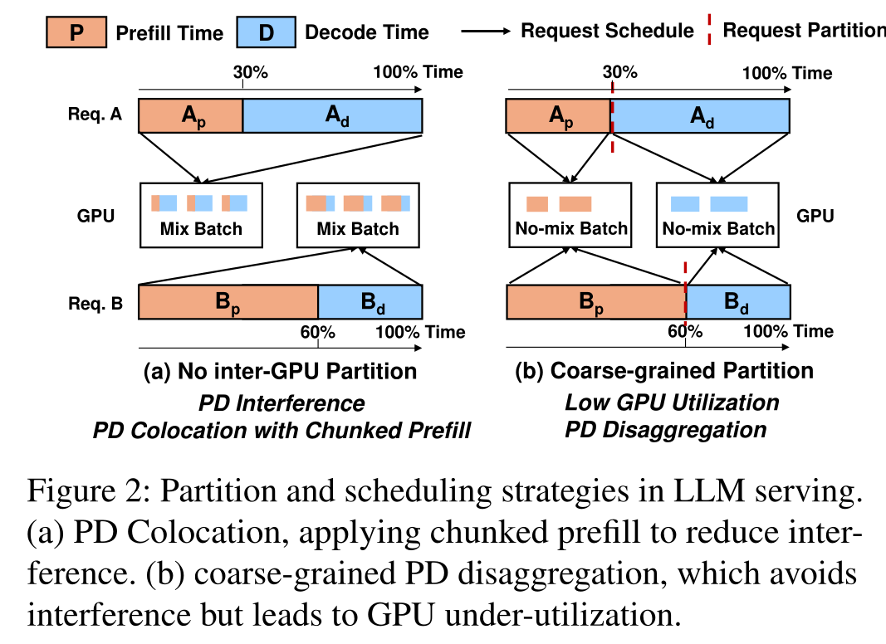

*图 1：论文 Fig.2，PDF 第 3 页。左侧同机部署允许混合批次，但 Prefill 会干扰 Decode；右侧 PD 分离避免混合，却把资源固定在两个阶段。*

同机部署的问题不是 GPU 完全没有算满，而是它可能用违反 SLO 的方式换取原始吞吐。论文的两 GPU 微基准中，长 Prompt 场景下同机部署达到 1.49 rps，高于 PD 分离的 0.83 rps，但 P99 TBT 为 352.93ms，100ms SLO 达标率仅 1.73%。如果只看 rps，会把大量不合格请求也算进收益。

PD 分离正好相反。它在三个代表性请求形态下都把 P99 TBT 控制在 75ms 以内，达标率接近 100%，但固定 1P:1D 造成一侧资源闲置。Prefill 重的 `P=8192,D=32` 场景中，Decode GPU 的模型计算利用率只有 0.19%；Decode 重的 `P=219,D=1467` 场景中，Prefill GPU 利用不足，而 Decode GPU 的高带宽显存容量接近满载。

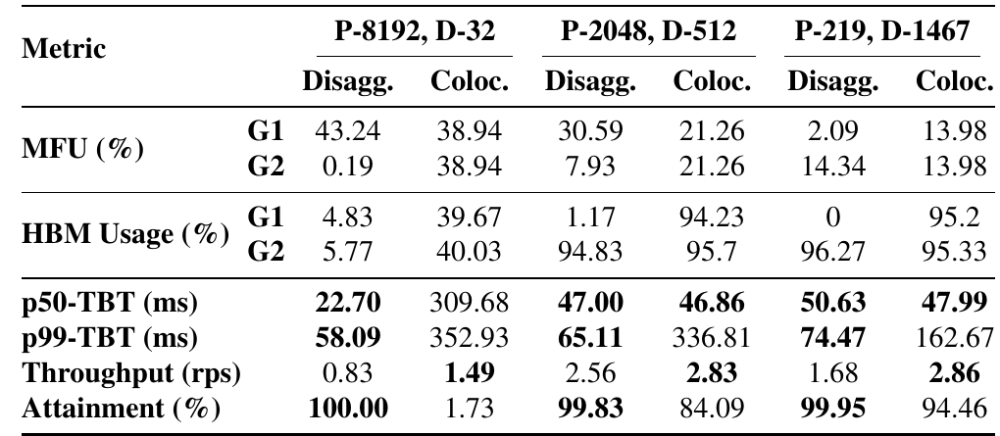

*图 2：论文 Table 1，PDF 第 4 页。数值来自 Qwen-2.5-14B、两张 A100、请求率推到 GPU 饱和的微基准。*

### 2.2 真实负载为什么让静态调优失效

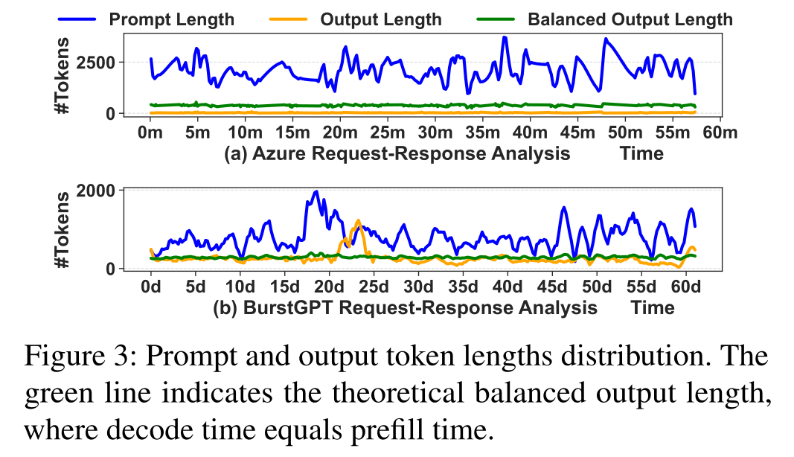

*图 3：论文 Fig.3，PDF 第 4 页。绿色曲线表示 Prefill 与 Decode 预计耗时相等时的输出长度。*

Azure Code 的分钟级轨迹和 BurstGPT 的天级轨迹都在 Prefill 偏重与 Decode 偏重之间切换。固定 chunk 大小或固定 P:D GPU 比例只能针对某一段时间调优；当请求分布变化时，原来空闲的一侧可能变成瓶颈，原来合适的混合批次也可能开始突破 TBT SLO。

`分析判断`：Libra 的出发点成立，因为这里需要的是在线工作量重分配，不是一次性的容量规划。论文没有证明所有生产负载都同样剧烈，但它用两个公开轨迹和实时回放说明了时间变化并非纯合成假设。

## 3. 核心抽象与系统设计

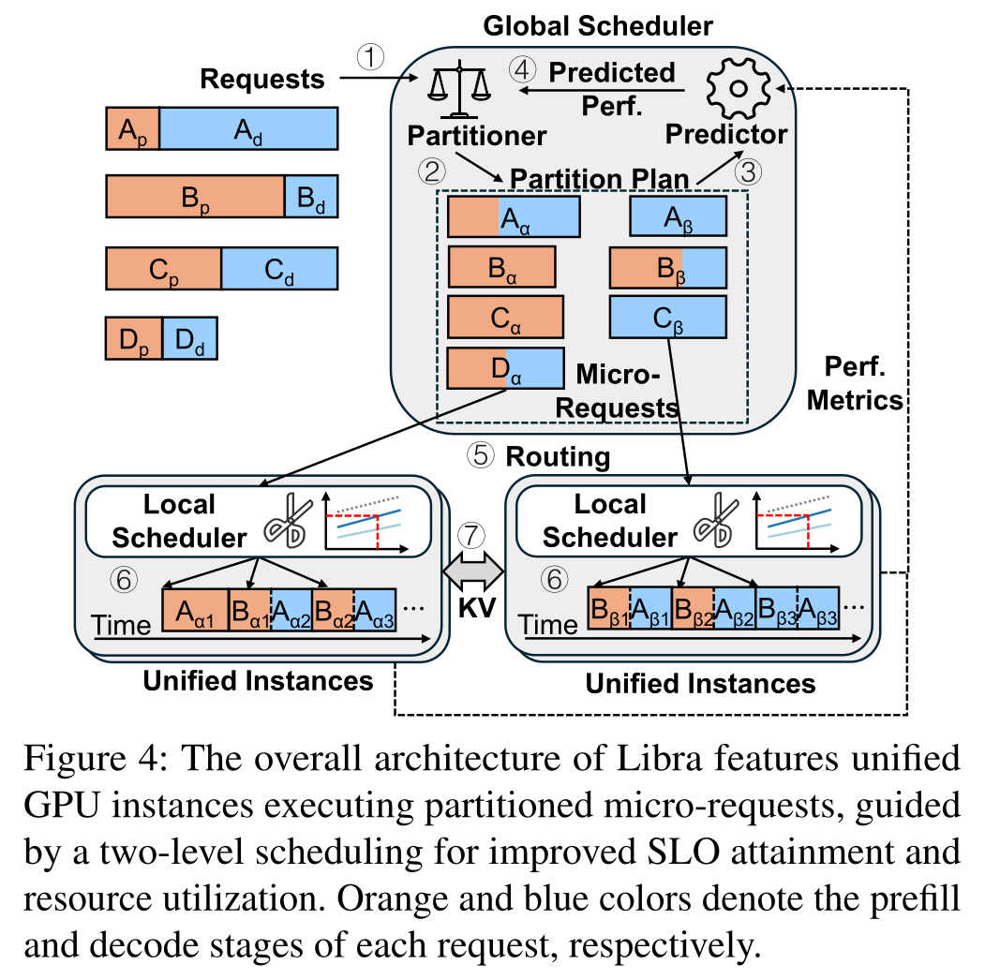

*图 4：论文 Fig.4，PDF 第 6 页。全局调度器负责切分与路由，本地调度器负责 GPU 内批组成；跨实例 KVCache 由数据路径传输。*

Libra 的控制路径分成两层：

1. 请求进入全局调度器。切分器依据 Prompt 长度、预测输出长度和运行时负载寻找切分比例；性能预测器估算候选微请求在两个实例上的完成时间。
2. 全局调度器把两个微请求路由到当前负载最低的实例。论文先选实例，再微调切分比例以匹配这两个实例的预计完成时间。
3. 每个执行实例的本地调度器先处理时延敏感的 Decode，再根据前一批实测延迟和离线画像决定还能加入多少 Prefill Token。
4. 如果两个微请求分布在不同实例，前一实例把已完成的 KV 块分批推送给后一实例。

执行实例是“统一”的，含义是它们没有永久的 Prefill 或 Decode 角色，并不表示模型权重、张量并行组和显存可以零成本任意重组。主实验中，32B 与 72B 模型仍分别使用 TP=2 和 TP=4 的固定张量并行组。

### 3.1 状态和责任边界

| 组件 | 持有的主要状态 | 决策 | 是否在请求关键路径 |
|---|---|---|---|
| 全局调度器 | 请求长度估计、实例负载、预测执行时间、请求队列 | 切分比例、实例配对、路由 | 是 |
| 性能预测器 | 离线画像表、近期批历史、运行时 GPU 指标 | 候选计划的预计完成时间 | 是 |
| 本地调度器 | Prefill/Decode 队列、上一批组成与实测时延 | 下一批的 Decode 集合和 Prefill Token 上限 | 是 |
| KV 传输通路 | 已完成 chunk、目标放置与完成事件 | 何时推送、何时允许下游继续 | 是 |

论文没有给出全局调度器故障恢复、状态复制或重复派发语义。它把这些问题留在了实现边界之外。

## 4. 关键技术实现与作用机理

### 4.1 任意 Token 边界的请求级切分

#### 解决的问题

PD 同机部署的切分点相当于 `s=0` 或 `s=L`，整条请求由一个实例完成；传统 PD 分离的切分点固定为 `s=P`。这三类位置无法表达“Prefill 由实例 A 完成，部分 Decode 也留在 A，其余 Decode 交给 B”这类中间方案。

#### 核心方法与执行路径

Libra 把请求表示成连续 Token 区间，并允许 `s` 落在 `[0,L]` 任意位置：

1. 预测请求的输出长度，得到逻辑总长度；
2. 选择候选切分比例 `φ`，换算为 `s=ceil(φL)`；
3. 生成两个保持顺序的连续微请求；
4. 前一个微请求完成到切分边界后，把后一段执行所需的 KVCache 交给另一个实例。

#### 为什么有效

资源变化为：固定阶段容量 → 单请求工作量迁移。系统不需要等待整批业务画像发生变化后重新配置 P:D GPU 比例，而是可以把当前请求的一部分 Decode 或 Prefill 工作移到相对空闲的实例。

#### 代价与边界

- 切分越细，跨实例 KV 传输越频繁。论文给出的推理任务示例中，混合 Prefill 与部分 Decode 的微请求会比标准 PD 分离多传约 3 倍 Token 缓存。
- 切分点依赖输出长度估计。低估可能造成后段超载，论文用 20 Token 安全余量缓解，但这不是严格最坏情况保证。
- 请求必须能在切分点安全转移执行状态。论文利用 KVCache 追加写、已完成块不可变这一条件，没有讨论带原地修改状态的推理算子。

#### 对项目的意义

`ADAPT`。项目不应直接接管 Token 调度，但可把“安全连续前缀 + 缺失后缀 + 部分重算边界”作为 QueryPlan 的一等字段，由推理框架决定计算切分，KVC 提供数据位置、加载代价和就绪范围。

### 4.2 吞吐均衡约束下的切分搜索与最小负载路由

#### 解决的问题

把请求切成两段仍可能把大部分工作留给一侧。两个实例构成流水线时，端到端吞吐由较慢一侧决定；快的一侧提前完成后只能等待。

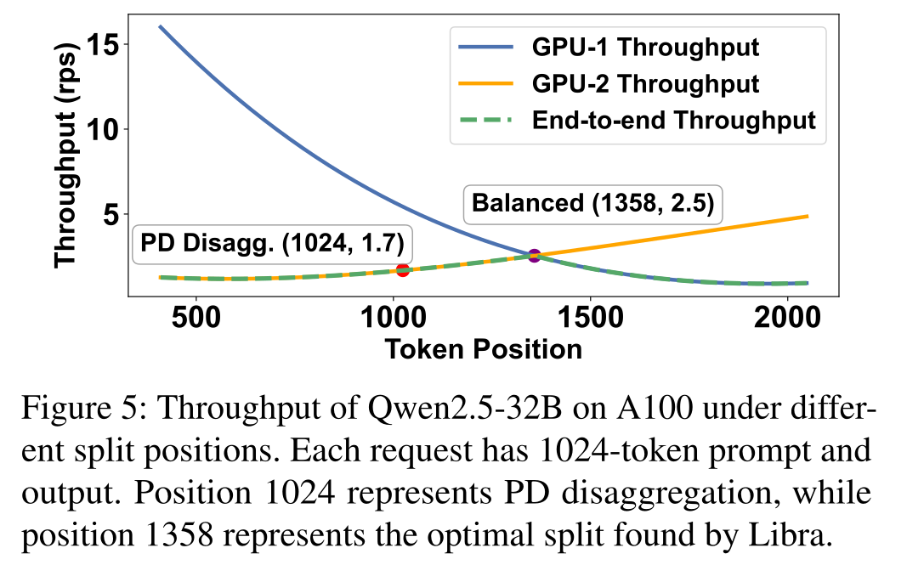

*图 5：论文 Fig.5，PDF 第 7 页。Qwen2.5-32B、两张 A100，输入和输出均为 1024 Token。标准 PD 分离点 1024 的端到端吞吐为 1.7 rps；切分点 1358 时两侧约为 2.5 rps。*

#### 核心方法与执行路径

1. 用当前请求的 `P/(P+D)` 作为初始比例，即从标准 PD 分离位置开始；
2. 通过性能预测器估算两个候选微请求在当前实例负载下的完成时间 `T1`、`T2`；
3. 最多执行 6 轮二分搜索，使 `|T1-T2|` 进入容差；
4. 把微请求分配给当前负载最低的两个实例，同负载时轮询；
5. 针对选中的实例对再次调整切分比例。

#### 为什么有效

慢端完成时间下降，快端空等时间减少。图 5 中标准 PD 分离让 GPU-1 达到 5.6 rps、GPU-2 只有 1.7 rps，端到端只能取 1.7 rps；移动切分点后，两侧在约 2.5 rps 相交，端到端吞吐随之提高。

#### 论文证据与边界

- `实测数据`：论文报告全局调度开销低于端到端时延的 0.51%，绝对值低于 18ms/请求。
- `论文陈述但证据展示不足`：正文称有界预测与离线完美未来 Oracle 的差距在 1% 以内，但没有给出对应图表、负载范围和误差分布，不能把它当成充分展示的实测结论。
- `分析判断`：最多 6 轮使算法在本文配置中是有界常数开销，但“O(1) 每请求”依赖候选实例数和搜索轮数固定；扩展到多副本、多网络路径和多介质后不能直接沿用该复杂度结论。

#### 对项目的意义

`ADAPT`。本项目的 CostEvaluator（成本预估模型，将正文大小、网络带宽、排队时延和算力吞吐换算为候选路径耗时）可借鉴“少量候选 + 有界搜索 + 运行时校准”，但目标函数应比较加载、部分复用和重算的完整关键路径，而不是只平衡两个 GPU 的预计执行时间。

### 4.3 基于时延反馈的动态批组成

#### 解决的问题

同一批中加入 Prefill 可以提高算力利用率，但增加的等待与显存访问会拖慢 Decode。固定 chunk 大小忽略了三个同时变化的量：Prefill Token 数、Decode 请求数、Decode 平均上下文长度。

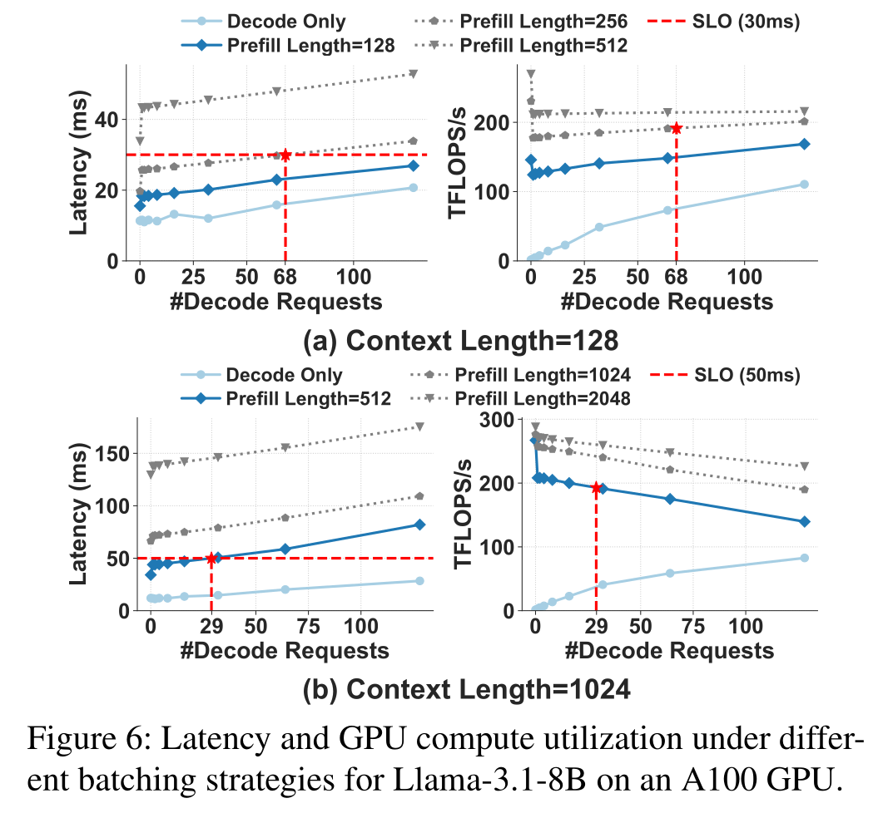

*图 6：论文 Fig.6，PDF 第 8 页。Llama-3.1-8B、A100。红线为 30ms 或 50ms SLO，交点表示在约束内可容纳的 Decode 并发数。*

#### 核心方法与执行路径

1. 记录上一批的 Prefill 长度、平均上下文长度、Decode Token 数和实测执行时间；
2. 下一批先加入所有等待中的 Decode 请求；
3. 根据当前 Decode 数量、平均上下文和目标 SLO 查询画像表，得到本批允许的最大 Prefill Token 预算 `M`；
4. 按先来先服务遍历 Prefill 队列，直到用完 `M`；
5. 执行完成后用新样本更新画像。

#### 为什么有效

固定 chunk 大小 → 受反馈约束的批预算。Decode 保持优先，Prefill 只使用当前时延余量，因此系统可以在低负载时扩大混合批次，在临近 SLO 时主动收缩。

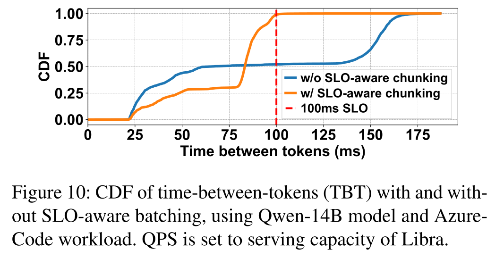

*图 7：论文 Fig.10，PDF 第 12 页。Qwen-14B、Azure Code，请求率设为 Libra 的服务容量。*

#### 达到的效果

`实测数据`：没有 SLO 感知批组成时，仅 52% Token 在 100ms 内完成，最坏 TBT 超过 175ms；启用后达标率为 99%。这项消融直接证明了本地批控制对尾部时延的贡献，但没有单独给出它对总 goodput 的增量。

#### 对项目的意义

`CONDITIONALLY TRANSFERABLE`。调节推理批次属于框架调度器职责；KVC 可以向框架提供加载队列、预计完成时间、目标缓冲水位和后台传输干扰，不应在存储控制面内部复制一套 Token 批调度器。

### 4.4 分块 KV 传输与计算重叠

#### 解决的问题

微请求跨实例时，后一实例需要前一段产生的 KVCache。若等待整段微请求完成后再传输，计算和通信串行，灵活切分的收益会被搬运时延吃掉。

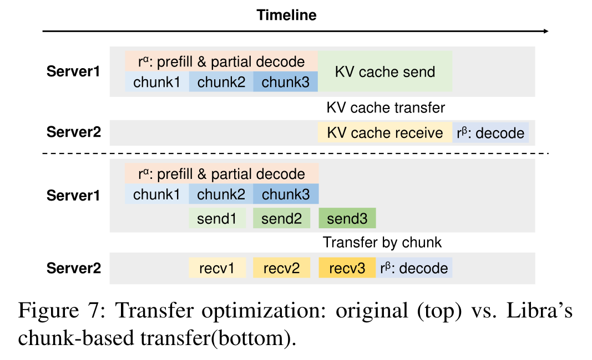

*图 8：论文 Fig.7，PDF 第 9 页。上方为整段完成后传输；下方为每个 chunk 完成后立即推送。*

#### 核心方法与执行路径

1. 上游实例按等长 chunk 执行微请求；
2. chunk 完成后，其 KV 块不再修改；
3. 上游通过 DMA 立即推送该块，同时继续计算下一 chunk；
4. 下游逐块接收，待必要范围就绪后执行后一微请求。

#### 为什么有效

整段计算 → 整段传输的串行链路，变成计算 `k+1` 与传输 `k` 的流水。论文基于 KVCache 追加写和完成块不可变的语义，认为无需跨块一致性协调。

#### 达到的效果与边界

- `实测数据`：Mini Reasoning 消融中，未被计算覆盖的传输时间降低 94%。
- `分析判断`：论文没有给出该消融的原始毫秒数、网络负载和端到端 goodput 增量；94% 不能外推为通信流量或 TTFT 同比下降。
- `边界`：论文使用 NCCL 或 Mooncake 一类 RDMA 库传输，并用 ZeroMQ 传控制消息。它没有测量 Host Payload Touch Bytes，因此不能据此声称实现了 Host CPU 零数据拷贝。
- `边界`：请求取消、接收端失败、旧 chunk 迟到、目标缓冲代际变化和多卡共同就绪均未展开。

#### 对项目的意义

`ADAPT`。本项目可将 chunk 完成映射为分层/分块 Ready 范围，与异步 DAG（有向无环依赖图，用于描述查询、传输、可见性和计算之间的先后关系）结合；但每块必须绑定对象版本、rank、层、目标缓冲代际和设备完成事件，不能只依赖“已发送”状态。

### 4.5 多切分是扩展能力，不是主实验默认路径

Libra 还把 Chain-of-Thought 请求拆成 Prefill、内部 think、用户可见 Decode 三段，让非用户可见阶段采用较宽松 SLO。Table 7 的数值是：PD 分离 260.01 token/s、两切分 336.16、三切分 366.43。按表值计算，三切分比两切分提高约 9.0%，比 PD 分离提高约 40.9%。正文写成“再提高 12%”和“总提高 41%”，其中后者与表值一致，前者不一致。

`分析判断`：多阶段 SLO 是有价值的扩展，但其证据只有一个 Mini Reasoning 表格，没有覆盖阶段识别错误、think 长度预测误差或多于三段时的调度复杂度，因此不应与四项主机制放在同一证据等级。

## 5. 实验到底证明了什么

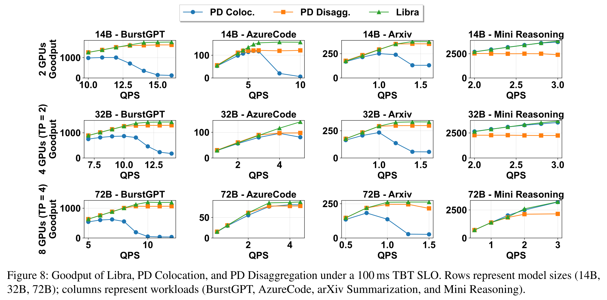

*图 9：论文 Fig.8，PDF 第 11 页。每行分别为 14B/2 GPU、32B/4 GPU、72B/8 GPU；门槛为 100ms TBT SLO。*

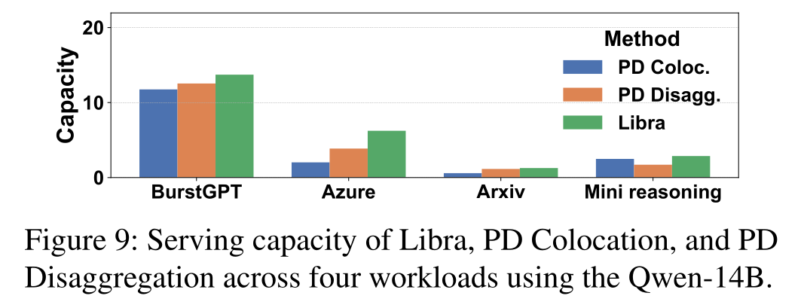

*图 10：论文 Fig.9，PDF 第 11 页。服务容量是满足 P99 TBT 约束时可持续承载的最大 QPS。*

| 论文主张 | 实验条件 | 结果 | 能证明什么 | 不能证明什么 |
|---|---|---|---|---|
| 动态切分提高约束下吞吐 | A100；Qwen-14B/32B/72B；4 类工作负载；100ms TBT | goodput 最高为同机部署 1.91 倍、PD 分离 1.61 倍 | 在论文测试范围内，逐请求切分和两级调度扩大了吞吐与时延可行域 | 不能分解每项机制各贡献多少，也不能外推到任意模型、网卡和集群规模 |
| 动态方案提高服务容量 | Qwen-14B；4 类工作负载 | 平均为同机部署 2.37 倍、PD 分离 1.37 倍；各场景范围见正文 | 静态方案的瓶颈会随负载形态变化 | 不能证明集中调度器在更大规模仍保持同样容量收益 |
| 混合负载下仍有收益 | 50% BurstGPT + 50% Azure Code；Qwen-14B | 7.4 rps / 473.84 token/s，高于两类基线 | 相反请求形态混合时，动态切分能减少固定比例失配 | 只有一种 50:50 混合比例，没有完整比例扫描 |
| 局部批控制收敛尾时延 | Qwen-14B；Azure Code；高压 | 100ms 内 Token 比例 52% → 99% | SLO 感知批组成是抑制混合批干扰的直接因素 | 未给出该机制单独带来的 goodput 增量 |
| 输出长度估计误差可容忍 | `P=219`，预测 `D=1467`；真实 D 为同均值正态分布，σ=0/10/50/100 | σ=100 时 goodput 从 3606.93 降至 3501.85，下降 2.9% | 对中等、对称的随机误差不敏感 | 不覆盖偏置、重尾、任务相关误差和突然模型漂移 |
| 较新 GPU 与更严 SLO 下仍有效 | H100；Azure/Mini Reasoning；50ms TBT | Azure 相对 PD 分离 +53.1%、相对同机部署 +134%；Mini Reasoning 分别 +55.4%、+4% | 收益不只出现在 A100/100ms 配置 | H100 实验未覆盖全部模型与工作负载 |

### 5.1 TTFT 结果不能与 TBT 混写

TTFT（Time To First Token，首 Token 响应时间）衡量首字返回，TBT 衡量相邻 Token 间隔。论文主要以 TBT SLO 定义 goodput，TTFT 只在 Table 2 单独报告：

- BurstGPT：PD 分离 23.8ms，Libra 12.6ms，降低约 47%；
- arXiv：83.9ms → 68.5ms，降低约 18%；
- Mini Reasoning：0.058ms → 0.088ms，Libra 反而更高。

正文把最后一个 Libra 数值写成 0.08ms，与表格的 0.088ms 不一致。报告采用表格原值。更重要的是，论文没有用 TTFT 作为主 SLO 门槛，因此不能把 goodput 收益直接等价成 TTFT 达标率提升。

### 5.2 实时轨迹回放的价值和边界

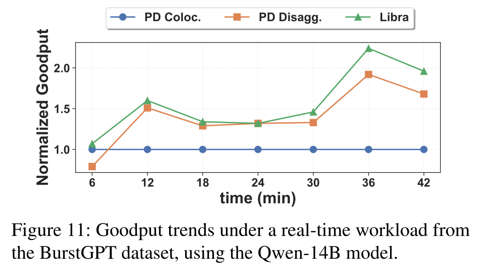

*图 11：论文附录 Fig.11，PDF 第 17 页。Qwen-14B，保留原始到达节奏，每 6 分钟统计一次归一化 goodput。*

在 42 分钟轨迹中，Libra 每个采样点都高于或接近两类基线。前 6 分钟 Decode 偏重，同机部署短暂高于 PD 分离；12～42 分钟 PD 分离高于同机部署，说明基线优劣确实会随负载变化。

这项实验支持“动态调度要应对时间变化”，但图中只有归一化 goodput，没有原始 Token/s、每段输入输出分布和逐段 SLO 达标率，不能据此评估生产容量。

## 6. 论文的亮点与局限

| 技术点 | 亮点 | 主要局限 |
|---|---|---|
| FPS 微请求抽象 | 用一个连续切分空间统一表达不切分、标准 PD 分离和混合切分，抽象简洁 | 要求请求状态能在任意边界转移，增加 KV 传输和预测依赖 |
| 全局切分与路由 | 以两侧预计完成时间均衡替代固定 P:D 容量比例 | 集中式控制器规模、容错和多租户公平性未评测 |
| 本地 SLO 批组成 | 把固定 chunk 参数改成由实测反馈约束的动态 Token 预算 | 依赖目标 GPU/模型离线画像；模型、内核或硬件更新后需要重建和校准 |
| 分块 KV 流水 | 利用完成块不可变的语义重叠计算和通信 | 强依赖网络相对计算足够快；故障、取消和目标代际语义缺失 |
| 多阶段切分 | 可以利用不同阶段的可见性和 SLO 差异 | 只有单一 CoT 工作负载，且论文正文与表值存在 12%/9% 不一致 |

## 7. 论文没有解决什么

1. KVCache 的内容身份和消费资格。论文默认两段属于同一请求，没有模型版本、Tokenizer、Prompt 模板、LoRA 适配器或租约失效问题。
2. 跨介质路径。没有 HBM、Host DDR、NVMe SSD 和远端缓存之间的动态加载/重算比较。
3. Host CPU 数据参与。论文说明用 RDMA/NCCL 传输，但未证明 CPU 不读写正文，也未统计 DDR DMA 字节。
4. 多卡原子动作。张量并行组的命中一致、共同回退、部分失败和集合通信死锁不在论文范围内。
5. 故障与取消。源实例宕机、目标缓冲复用、迟到 DMA、重复 chunk、撤销和排空没有状态机。
6. 前后台混压。实验关注在线推理请求，没有加入 SSD 回写、迁移、重建和热点分发等后台 I/O。
7. 更大集群的控制面。最大 8 GPU，无法判断全局调度器、负载指标采集和路由决策在数十至数百节点下的扩展性。

## 8. 对本项目的启发

### 8.1 可直接采用的原则

1. 用有效吞吐而不是原始吞吐对账。项目应同时报告满足 SLO 的有效 QPS、TTFT、TPOT 和失败请求，不能让高吞吐掩盖尾部超时。TPOT（Time Per Output Token）是每个输出 Token 的生成耗时，与论文 TBT 相关但并非无条件等价，统计口径必须分别冻结。
2. 把实时负载和剩余时限纳入路径决策。缓存命中不是执行加载的充分条件，加载后的排队、传输和计算仍需满足业务时限。
3. 限制在线搜索空间。Libra 用最多 6 轮探测换取有界开销；项目的 QueryPlan 也应先过滤权限、版本和能力不满足的路径，再在少量候选中比较成本。

### 8.2 需要改造后采用的机制

| Libra 原理 | 项目对应点 | 必须增加的条件 |
|---|---|---|
| 任意 Token 切分点 | 连续可复用前缀、缺失后缀、部分重算边界 | 语义身份、块/层/rank 边界、目标缓冲代际、框架是否接受组合计划 |
| 运行时完成时间预测 | CostEvaluator 的加载/重算成本比较 | 目录查询、授权、队列、网络、布局转换、设备可见性、多卡等待和干扰成本 |
| 最小负载实例路由 | 缓存感知路由 | 不能只追逐本地命中，还要防止热点实例聚集、源端出口和接收端 Incast |
| 分块 KV 推送 | 异步 DAG 和分段 Ready | 每段携带对象版本、层、rank、序号、完成事件与失败状态 |
| 本地 SLO 批控制 | 框架与 KVC 的准入协作 | 框架拥有 Token 批调度；KVC 只提供加载预算、完成预测和干扰遥测 |

### 8.3 不应照搬的部分

- 不把 Libra 的全局调度器并入 KVC 目录服务。计算切分和 Token 批处理属于推理框架，目录与存储控制面负责候选发现、持有、路径计划和数据就绪。
- 不用“两个实例完成时间相等”替代完整成本模型。本项目还要比较远端加载、本地重算、部分前缀复用、SSD 恢复、远端直读和拷贝到本地显存等路径。
- 不把离线画像表当成生产事实。画像必须绑定模型、布局、内核、硬件和版本，并记录预测误差与漂移。
- 不把 RDMA 传输自动写成 Host CPU 零数据拷贝。必须通过正文触碰字节、DDR DMA、CPU 拷贝和设备完成事件实测。

## 9. 对本项目立项的支撑

### 9.1 必要性证据

`论文实测支持`：请求输入输出长度随时间变化，固定阶段比例和固定 chunk 大小会在利用率与尾部时延之间反复失配。该结果独立支持本项目建设动态选路、缓存感知路由和运行时遥测闭环，而不是只做静态数据搬运接口。

### 9.2 可行性证据

`论文实测支持`：少量候选、轻量成本预测、运行时反馈和有界搜索可以在请求关键路径内完成，并在两台服务器、8 张 GPU 范围取得稳定收益。分块 KV 传输也说明“已就绪范围先传、后续计算继续”的流水原则可行。

这只能支持底层原则，不能证明本项目的 QueryPlan 已达到微秒级、预测误差达标或真实负收益拦截有效。当前项目受控原型仍主要验证二分选路和数学字段，生产级决策时延、并发吞吐和真实数据路径需要独立实测。

### 9.3 差异化证据

Libra 未解决的内容恰好落在本项目边界内：异构介质、缓存语义一致性、Host CPU 零数据拷贝、多卡状态同步、租约和撤销、后台 I/O 混压、加载与重算的收益判断。由此可以说明本项目并非重复实现 Libra，而是在推理调度器下面补齐跨框架、跨设备和跨介质的数据与控制底座。

### 9.4 尚未获得论文支持的项目主张

- Host CPU 零数据拷贝已经达到上述严格定义；
- Direct-View（远端直读，即设备直接访问远端缓存且不生成完整本地副本）在 Decode 阶段具有净收益；
- Copy-to-HBM（通过 DMA 把远端 KVCache 搬入本地高带宽显存）的切换点与项目成本模型准确；
- 张量并行多卡状态同步 P99 小于 100μs；
- 两节点混压下 TTFT 降低至少 20%、QPS 提升至少 10%、TPOT 干扰率低于 3%；
- NVMe SSD 恢复、语义校验、租约撤销和故障回退在生产负载下正确。

### 9.5 立项判断

| 维度 | 判断 |
|---|---|
| 必要性 | 较强。论文直接证明静态 PD 角色和固定批参数在动态负载下会造成可用吞吐损失。 |
| 可行性 | 中等偏强。请求级切分、轻量预测和分块 KV 流水在论文规模内有效。 |
| 差异化 | 明确。论文停留在推理执行切分，本项目覆盖数据身份、跨介质路径、异构传输和故障语义。 |
| 剩余举证责任 | 很高。论文不能替代本项目 E0～E3 的本地硬件、真实数据路径和全链路混压验证。 |

## 10. 建议验证

### 10.1 请求级动态切分与缓存路径联合回放

- 假设：在输入/输出长度持续变化时，框架侧动态切分与 KVC 路径成本协同优于固定 PD 比例和只按缓存命中路由。
- 变量：固定同机部署、固定 PD 分离、Libra 式动态切分、动态切分 + 缓存感知 QueryPlan。
- 基线：同 GPU 数、同模型、同张量并行、同到达轨迹、同 SLO。
- 指标：有效 QPS、goodput、TTFT P50/P99、TPOT/TBT P99、GPU/HBM 利用率、KV 传输字节、决策开销。
- 判定：只有在尾部时延不恶化且有效吞吐提高时，才保留联合调度接口。

### 10.2 CostEvaluator 加入计算阶段负载后的反事实评测

- 假设：加入 Prefill/Decode 预计工作量和执行实例排队后，加载/部分复用/重算选择的后悔值降低。
- 变量：仅网络与缓存特征、加入计算负载、加入输出长度预测、加入在线残差校正。
- 基线：同一现场回放样本的实际执行成本与可审计 Oracle。
- 指标：决策 P50/P99、MAPE、路径准确率、Regret、错误加载率、超时率。
- 判定：若新增特征提高决策开销却不能稳定降低错误加载和 Regret，则不进入前台快速路径。

### 10.3 分块 KV 流水的真实数据路径验证

- 假设：按层或按连续块形成 Ready 范围，可以把大部分传输隐藏在后续计算中。
- 变量：整段传输、固定 chunk、按层 chunk、自适应 chunk；空载网络与混压网络。
- 基线：相同 KV 字节、相同源目标、相同计算序列。
- 指标：首块就绪、全量就绪、未覆盖传输时长、TTFT/TPOT、Host Payload Touch Bytes、CPU cycles/GB、目标 HBM 峰值。
- 判定：要求端到端有净收益，并证明分块没有引入错误消费、迟到写和额外前台干扰。

### 10.4 故障和取消条件下的分段就绪语义

- 假设：对象版本、目标缓冲代际、设备完成事件和请求取消共同参与状态机后，分块流水可以安全回退。
- 变量：源端中断、目标端重启、chunk 重复/乱序/迟到、租约过期、请求取消、多卡一张卡超时。
- 指标：错误消费数、越界访问、未排空 DMA、孤儿持有、回退成功率、额外尾时延。
- 判定：任何错误消费、旧地址写入或多卡动作分歧都应阻断该路径进入 E1/E3。

## 附录 A：关键数字核对

| 位置 | 论文值 | 核对结果 |
|---|---:|---|
| Abstract / §6.2 | goodput 最高 1.91× vs 同机部署、1.61× vs PD 分离 | 适用于论文 A100 主实验范围，不是所有场景固定收益 |
| Table 3 | 混合负载容量 4.6 / 5.9 / 7.4 rps | Libra 相对两基线约 +60.9% / +25.4% |
| Table 3 | goodput 316.32 / 399.31 / 473.84 token/s | Libra 相对两基线约 +49.8% / +18.7%，正文分别写 49% / 20% |
| Table 2 | Mini Reasoning TTFT：0.058 vs 0.088ms | 正文写 0.08ms，和表格不一致 |
| Table 5 | σ=0：3606.93；σ=100：3501.85 token/s | 降幅约 2.91%，与正文 2.9% 一致 |
| Table 7 | 两切分 336.16；三切分 366.43 token/s | 表值增幅约 9.0%，正文写 12%，不一致 |
| Table 7 | PD 分离 260.01；三切分 366.43 token/s | 增幅约 40.9%，与正文 41% 一致 |
| Table 8 | Azure 50ms：259.7 / 397.2 / 608.0 | Libra 相对同机部署约 +134.1%，相对 PD 分离约 +53.1% |
| Table 8 | Mini Reasoning 50ms：5696.2 / 3816.8 / 5930.5 | Libra 相对同机部署约 +4.1%，相对 PD 分离约 +55.4% |

## 附录 B：图片索引

| 资产 | 原论文位置 | 用途 |
|---|---|---|
| `figures/libra_fig02_baseline_partitioning.png` | Fig.2，PDF 第 3 页 | 解释同机部署与 PD 分离的结构性取舍 |
| `figures/libra_fig03_dynamic_workloads.png` | Fig.3，PDF 第 4 页 | 说明请求形态随时间变化 |
| `figures/libra_table01_static_partition_limits.png` | Table 1，PDF 第 4 页 | 对账利用率、TBT、吞吐和 SLO 达标率 |
| `figures/libra_fig04_architecture.png` | Fig.4，PDF 第 6 页 | 展示全局/本地两级调度与统一实例 |
| `figures/libra_fig05_split_position_throughput.png` | Fig.5，PDF 第 7 页 | 说明吞吐均衡切分点 |
| `figures/libra_fig06_batch_composition_tradeoff.png` | Fig.6，PDF 第 8 页 | 说明批组成对时延和算力利用率的影响 |
| `figures/libra_fig07_chunk_kv_transfer.png` | Fig.7，PDF 第 9 页 | 说明 KV 分块传输流水 |
| `figures/libra_fig08_goodput.png` | Fig.8，PDF 第 11 页 | 总体 goodput 对比 |
| `figures/libra_fig09_serving_capacity.png` | Fig.9，PDF 第 11 页 | 服务容量对比 |
| `figures/libra_fig10_slo_aware_batching.png` | Fig.10，PDF 第 12 页 | 本地 SLO 批组成消融 |
| `figures/libra_fig11_realtime_replay.png` | Appendix Fig.11，PDF 第 17 页 | 真实到达节奏回放 |
