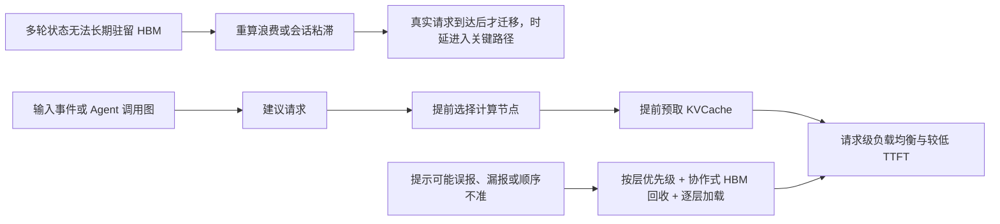
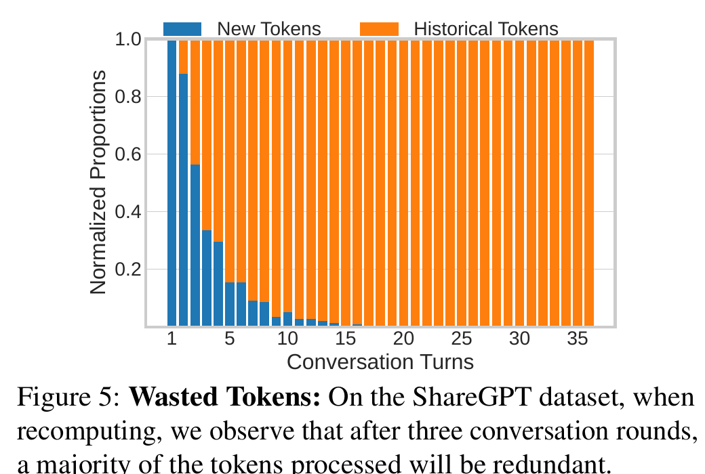
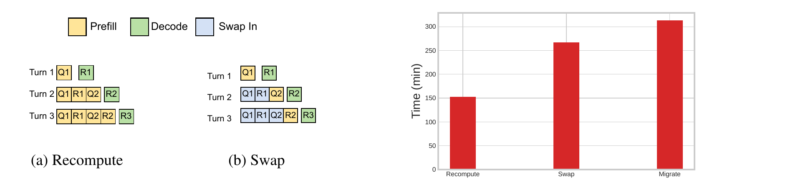
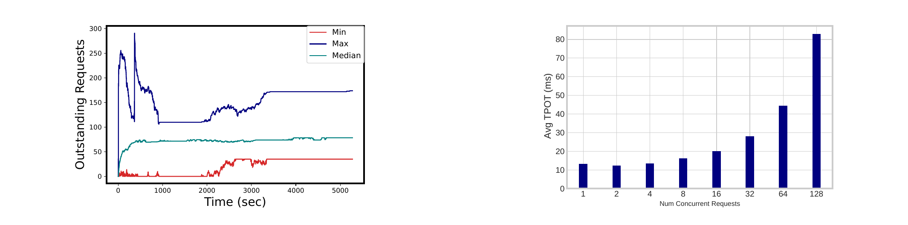
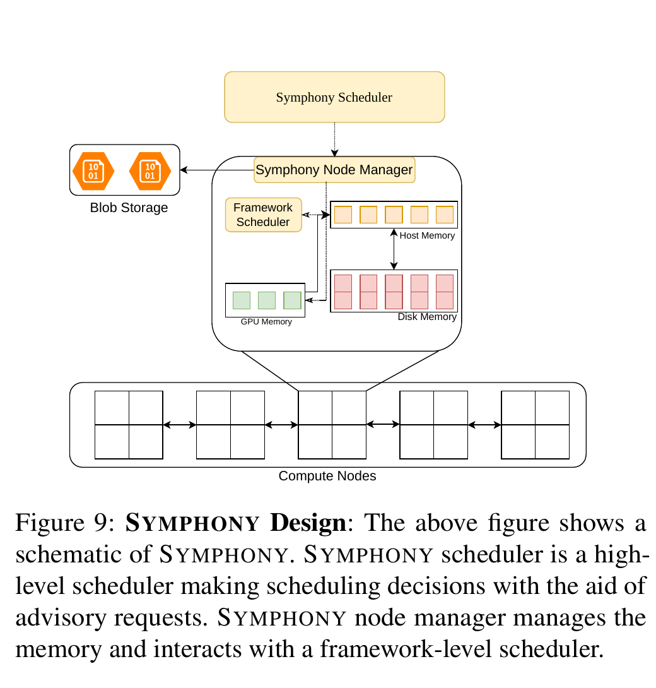
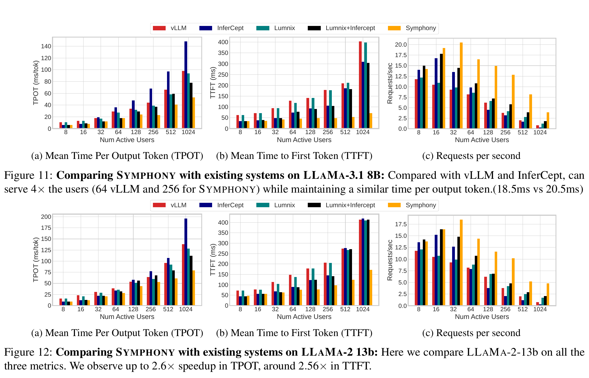
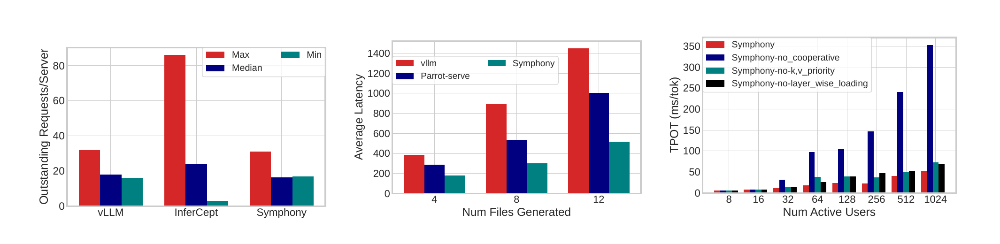
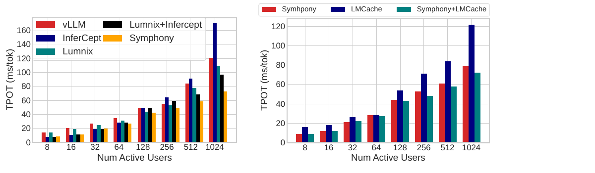
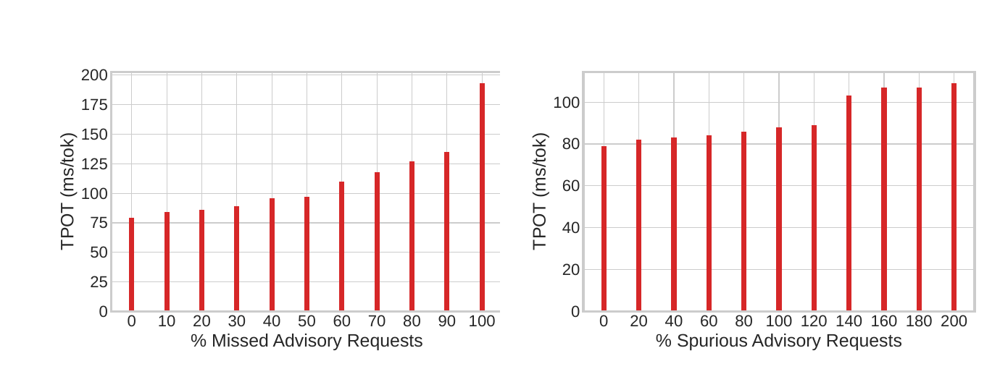

# SYMPHONY（NSDI 2026）：面向多轮大模型服务的计算—内存解耦、提前预取与请求级调度解构

> 原始论文：[Symphony: Enabling Compute-Memory Disaggregation in LLM Serving Systems](<[NSDI 2026] SYMPHONY Enabling Compute-Memory Disaggregation in LLM Serving Systems.pdf>)  
> 作者：Saurabh Agarwal、Bodun Hu、Anyong Mao、Aditya Akella、Shivaram Venkataraman  
> 机构：UT-Austin、UW-Madison  
> 会议：23rd USENIX Symposium on Networked Systems Design and Implementation（NSDI 2026）  
> 解构范围：论文正文 PDF 第 2～13 页，参考文献 PDF 第 14～16 页  
> 证据说明：文中将“论文事实”“实测数据”“分析推断”“项目解释”“项目建议”和“开放问题”分开表述。论文实测结果只在原评测条件内成立，不能直接视为本项目已经达到的性能。

## 1. 一页读懂论文

### 1.1 论文解决什么问题？

KVCache（大模型注意力键值缓存，即自回归生成过程中保存历史 Key 与 Value 激活状态、避免后续 Token 重复计算的张量）让多轮对话和 Agent 工作流变成了有状态服务。一次请求结束后，系统必须在无法预知的等待期内保存数 GB 乃至更大的状态。把它长期留在 GPU 高带宽显存（HBM）中，容量很快耗尽；丢弃后重算，浪费 Prefill 算力；换出到单机 Host 内存，又会把后续请求固定在原节点，造成负载失衡。跨节点迁移虽然可以重新分配负载，但多 GB 状态搬运落到请求关键路径后，收益可能被迁移时延抵消。

SYMPHONY 处理的是这个矛盾：在保留多轮 KVCache 的同时，解除“会话状态在哪个节点，请求就只能在哪个节点执行”的绑定，并尽量不让跨层或跨节点加载增加在线推理时延。它实现的是两节点环境中的逻辑状态分层与提前迁移，不是已经证明可独立扩展的专用内存节点架构。

### 1.2 根因是什么？

可见症状是重算、迁移慢和节点负载不均。更深一层的根因是：现有调度器通常等真实推理请求到达后，才知道哪个会话即将继续。此时再选择计算节点、查找 KVCache、迁移状态已经太晚，数据搬运只能占用 Time To First Token（TTFT，首 Token 响应时间）关键路径。为了避免这段等待，系统只能牺牲调度自由度，把整个会话粘在原节点。

因此，这类系统缺少的并非又一种存储介质，而是一条早于真实请求到达的控制信号。这个信号给调度器留下了迁移窗口。

### 1.3 核心洞察是什么？

多轮对话和 Agent 工作流在真实推理请求到达前，往往已经暴露了弱预测信号：用户开始输入，通常意味着该会话可能很快继续；上游 Agent 开始执行，调用图可以指出潜在的下游 Agent。论文把这类信号定义为 advisory request（建议请求，表示“某个会话可能即将发起推理”的非强制提示）。

提示无需准确给出到达时刻、输入长度或输出长度。只要它通常早于真实请求到达，系统就能提前选定计算节点并预取 KVCache。正确性不依赖提示是否命中；提示只影响性能，误报可被驱逐，漏报则退化为按需加载。

### 1.4 核心抽象是什么？

论文的核心抽象是把“未来请求可能到达”作为一等控制面输入，与真实 inference request 和 invalidation request（撤销提示）分开。Chatbot 示例中的提示包含 `session_id`、`model_id`、可选预计到达时间、顺序标记和优先级。全局调度器结合 KVCache 当前位置和节点负载选定目标节点；目标节点的内存管理器在真实请求到达前拉取缓存。真实请求随后被路由到已经预热的节点。

这个接口把两件原本串行发生的事拆开了：状态移动可以提前开始，计算位置也可以在会话原节点之外选择。

### 1.5 五项关键优化方法速览

#### 方法一：提示触发的提前预取

- **问题**：KVCache 位于 Host 内存、SSD 或其他节点时，真实请求到达后再加载会直接增加 TTFT。
- **方法**：收到建议请求后立即查找缓存位置，并把缓存向目标节点的更快内存层移动。
- **效果**：数据搬运从真实推理请求的前台关键路径移到用户阅读、输入或上游 Agent 计算期间。
- **关键证据**：论文构造的 ShareGPT 工作负载中，提示平均提前 11.3 秒；MetaGPT 实验中平均提前 5.8 秒。前者来自阅读和输入速度模型，不是生产系统实测分布。

#### 方法二：提示阶段完成请求级放置

- **问题**：Host 内存换出把会话固定在原节点；请求到达后再迁移，源节点已过载且迁移尚未完成。
- **方法**：全局调度器在提示到达时选择目标计算节点，提前让目标节点从源位置取回 KVCache；真实请求到达后直接路由到该节点。
- **效果**：调度粒度从会话级粘滞变成请求级放置，节点间负载差异得到收敛。
- **关键证据**：256 个并发用户下，Figure 15 中 InferCept 的单节点最大负载超过集群中位数 3.1 倍；SYMPHONY 与采用重算的 vLLM 都保持了较均衡的节点负载。

#### 方法三：按网络层顺序保留和驱逐 KVCache

- **问题**：建议请求不提供准确到达顺序和最终显存需求。若一次性为某个会话加载完整缓存，误报或晚到请求可能占满 HBM，阻塞真正正在执行的请求。
- **方法**：优先加载和保留较早 Transformer 层的 KVCache；内存紧张时先驱逐较后层，再按最近最少使用顺序驱逐其他预取缓存。
- **效果**：多个候选会话可以先获得启动推理所需的前几层状态，后续层在前向计算期间继续加载，单个不确定提示不再独占 HBM。
- **关键证据**：论文消融结果称，关闭按层优先级管理后，高负载吞吐最高下降 21.7%。

#### 方法四：推理框架与内存层协作管理 HBM

- **问题**：独立内存层无法准确预测活跃请求还会生成多少 Token，也无法单独判断框架的权重、工作区和活跃 KVCache 需求。
- **方法**：节点内存管理器只把空闲 HBM 当作可回收预取缓存；推理框架需要空间时可直接清除这些副本，因为较慢存储层保留完整副本，后台线程负责更新。
- **效果**：当前推理请求保有 HBM 使用优先级，同时系统仍能利用阶段性空闲空间做预热；误报的资源成本被限制在可回收缓存内。
- **关键证据**：Figure 17 中，关闭协作式内存管理后，高负载下反复发生 Host 内存与 HBM 换入换出，论文报告减速超过 7 倍。

#### 方法五：逐层异步读写与计算重叠

- **问题**：完整 KVCache 无法在请求到达前全部进入 HBM，或者缓存规模本就超过可用 HBM 时，全量同步加载仍会阻塞推理。
- **方法**：当前层执行时异步读取下一层 KVCache，并并行写回已经处理的层。
- **效果**：显存只需维持当前执行窗口，部分 I/O 延迟被前向计算掩盖；完整缓存未就绪时也能较早启动推理。
- **关键证据**：论文正文称，关闭逐层加载后，高负载吞吐下降约 18.4%。

### 1.6 最重要的实验结果是什么？

在 2 个节点、每节点 4 张 NVIDIA A100 80GB、256GB DRAM、4TB SSD、100Gbps Ethernet 的环境中，论文报告：

- LLaMA-3.1-8B 上，相对 vLLM 的平均 Time Per Output Token（TPOT，每个输出 Token 的生成耗时）改善 1.4～1.9 倍；相对 InferCept 最高 2.5 倍，相对 Llumnix 最高 1.8 倍，相对 Llumnix+InferCept 最高 1.6 倍。
- 相对 vLLM 和 InferCept，TTFT 最高改善 2.4 倍。LLaMA-2-13B 的 Figure 12 图注给出 TPOT 最高 2.6 倍、TTFT 约 2.56 倍。
- MetaGPT 工作负载中，生成 4、8、12 个代码文件时，相对 vLLM 的总耗时最高降低 2.8 倍，相对 Parrot-Serve 降低 1.7 倍。
- 正文声称 60% 额外误报提示只带来约 2.1% 性能下降；但 Figure 20 图注使用 throughput 口径，纵轴却标为 TPOT，且曲线数值不能直接复现 2.1%。这一百分比只能作为作者报告值，不能作为本报告独立确认的实测结论。

论文关于“可承载用户数”的表述并不统一。摘要和 Figure 11 图注写 4 倍；Figure 11 图注举例为 vLLM 64 用户与 SYMPHONY 256 用户，在相近 TPOT 下比较。正文又写成 64 与 512 用户，即 8 倍。这是带合成思考时间的闭环活跃用户实验，不能替代固定到达率与 SLO（服务目标，即业务要求的响应时间或吞吐约束）goodput 容量测试。解构报告不把两种倍数合并，只确认论文在特定高并发点观察到更低 TPOT 和更高 requests/s。

### 1.7 最大局限是什么？

论文的收益依赖建议请求有足够提前量。ShareGPT 没有真实输入时刻，论文用阅读速度和输入速度生成到达时间；BurstGPT 又缺少会话归属，因此评测包含合成步骤。论文只给出 11.3 秒和 5.8 秒的均值，没有提前量分布；只有当单次提前量足以覆盖目录查询、排队、传输和执行前接入时，数据加载才能真正离开请求关键路径。两节点实验也没有覆盖大规模目录、全局调度器、节点管理器全互联和多租户拥塞下的扩展性。

评测将 128K 和 32K 列为模型的 context 配置，却没有报告端到端请求的实际长度分布；论文另外给出的 ShareGPT 平均会话只有 2.2K Token。因此，端到端结果不能直接证明 5GB/20GB 级长上下文对象或 SSD 路径的性能。

评测主要使用平均 TPOT、平均 TTFT 和 requests/s，没有给出 P99 尾部时延、前后台 I/O 混压干扰、故障恢复或跨租户隔离结果。论文说明恶意客户端可发送大量误报提示，但 DDoS 防护不在本文范围内。

### 1.8 为什么与本项目相关？

对面向国产 AI 硬件的统一异构 KVCache 存储与调度底座而言，这篇论文给出了三类外部证据：

1. **必要性证据**：多轮服务的状态规模、重复 Prefill 和会话粘滞导致的负载失衡确实同时存在，仅做单机换出不能解决集群利用率问题。
2. **有条件的可行性证据**：在论文的两节点、8 GPU 和合成交互时间条件下，将弱预测提示纳入调度，可在真实请求到达前移动状态并恢复请求级放置。论文未披露端到端试验中各存储层和数据路径的占比，不足以证明独立内存节点或大规模分离存储的扩展性。
3. **差异化空间**：论文没有处理 Host CPU 零数据拷贝、国产 NPU 直达、多维度语义一致性、租约安全、多卡状态同步、动态路径成本、P99 尾部时延和前后台服务质量隔离。这些仍需本项目独立设计和验证。



## 2. 为什么这个问题值得解决

### 2.1 多轮工作负载把推理服务变成长期有状态系统

[论文事实] ShareGPT 数据集中 73.4% 的对话是多轮会话，部分会话超过 400 轮。论文还给出两个容量例子：LLaMA-3.1-70B 在 32K 上下文、INT8 KVCache 下约占 5GB；128K 上下文约占 20GB。LLaMA-3.1-405B 场景中，256GB Host 内存约能保存 266K Token；论文称按平均 ShareGPT 会话 2.2K Token 估算可保存约 108 个并发会话。[派生数据] 直接相除的结果约为 121，与论文的 108 不同；论文未披露其他开销或计算过程，因此 108 只能保留为作者给出的容量例子。

这些数字说明两个问题。第一，HBM 不适合承担无界会话保留。第二，Host 内存也不是无限容量层，系统最终要面对 SSD、远端内存或对象存储，因此“缓存命中”并不等于“缓存能及时装入执行设备”。

### 2.2 重算和换出分别损失算力与调度自由度



*图 1：ShareGPT 多轮会话中，新 Token 占比快速下降，三轮以后历史 Token 已占多数。原论文 Figure 5，PDF 第 5 页。*

[实测数据] Figure 5 显示，三轮对话以后，重算路径中超过一半的 Prefill Token 已经是历史 Token。论文引言还给出“ShareGPT 中超过 99% Token 需要重算”的总体表述，但没有在同一位置给出完整统计口径。可靠的机制判断不依赖这个 99%：只要历史上下文随轮次累积，重算占比就会不断上升。



*图 2：左侧对比重算与换出路径；右侧在 8 GPU 分布式环境中比较 recompute、swap 和 migrate 的总时间。原论文 Figure 4、Figure 6，PDF 第 5 页。*

[论文事实] 换出可以减少历史 Prefill，但会话后续请求必须回到保存 Host 内存副本的节点。跨节点迁移可解除这种绑定，代价是缓存移动发生在请求到达以后。Figure 6 的实验中，重算总耗时反而低于 swap 和 migrate，说明“保存了缓存”并不自动等于端到端更快。

### 2.3 会话粘滞最终表现为排队和 TPOT 恶化



*图 3：左侧为 InferCept 在 8 GPU、1024 并发用户下的节点负载差异；右侧为单张 A100 上并发请求数增加时的平均 TPOT。原论文 Figure 1、Figure 2，PDF 第 3 页。*

左图中，最忙与最空 GPU 的未完成请求数差异一度接近 300；右图中，单卡并发从 8 增到 32 时，平均 TPOT 接近翻倍。[分析推断] 两张图来自不同实验，可以共同支持“会话粘滞会形成局部过载，并发争用会抬高单 Token 时延”这一机理解释，但不是对同一条因果链的直接对照实验。

[分析推断] 这里的主要矛盾不是集群总算力不足，而是状态位置限制了算力的可调度性。只扩 GPU 数量而不解除状态绑定，新增设备仍可能空闲。

## 3. 核心抽象与系统设计

### 3.1 建议请求只表达意图，不承诺未来事实

Chatbot 的建议请求示例包含：

```json
{
  "session_id": "UUID",
  "model_id": "llama-3.1-8b",
  "expected_arrival": null,
  "ordered": false,
  "priority": 1
}
```

这个接口有意保留不确定性。它不承诺请求一定到达，也不承诺到达顺序，更不知道 Prompt 和输出长度。论文把缺失信息当作设计前提，而不是假定上层可以提前给出精确预测。

在 Chatbot 中，前端监听输入框事件并发送建议请求；论文称接入只需约三行 JavaScript。Agent 场景先对少量工作负载做离线画像，得到可能的后继 Agent；上游 Agent 执行时，同时向多个潜在后继发送提示。条件分支会产生误报，但不影响推理正确性。

### 3.2 全局调度器决定“到哪算”，节点管理器决定“数据怎么靠近”



*图 4：全局调度器、节点管理器、框架调度器、GPU/Host/磁盘/对象存储及计算节点关系。原论文 Figure 9，PDF 第 7 页。*

SYMPHONY 有两个主要控制实体：

| 组件 | 持有的信息 | 主要动作 | 是否位于推理数据路径 |
|---|---|---|---|
| 全局调度器 | 会话、KVCache 位置、节点负载、提示状态 | 接收 inference/advisory/invalidation；选择目标节点；转发源位置；路由真实请求 | 不搬运正文，但决定放置和路由 |
| 节点管理器 | 本节点 GPU、Host 内存、磁盘及远端缓存位置 | 拉取、分层放置、驱逐、响应其他节点 fetch；与框架协作管理 HBM | 组织数据移动 |
| 框架调度器 | 当前活跃请求、执行显存和块状态 | 接纳和执行请求；内存紧张时回收预取副本 | 位于在线执行路径 |

默认全局策略按节点均匀分配请求。调度器收到建议请求后，选定目标节点，把源缓存位置加入请求并转发给目标节点管理器；随后更新位置状态。真实推理请求到达时，再路由到该目标节点。

[开放问题] 论文没有详细说明“位置状态已更新，但数据迁移尚未完成或目标节点故障”时的提交、回滚和重试语义。原型在两节点环境中工作，并不等价于已经解决大规模控制面的线性扩展和故障一致性。

### 3.3 分层存储中的完整副本与可回收快副本

论文覆盖 GPU HBM、Host 内存、本地磁盘、其他节点磁盘和对象存储。其状态管理原则是：最快层的副本用于降低在线时延，最慢层保留完整副本；后台线程持续写入新产生的 KVCache，超过用户配置的过期时间后，最低层副本可以被清除。

这套设计让 HBM 副本具备缓存语义。框架可以直接丢弃预取到 HBM 的副本，而不必先同步写回；下一次需要时仍可从较慢层恢复。

[分析推断] “最低层存在完整副本”解决的是容量和可恢复来源，不自动等于严格持久性。后台写入期间的崩溃窗口、跨节点副本版本、部分写入可见性和恢复顺序没有在论文中展开，也没有故障注入结果。

### 3.4 一次提示到一次真实推理的执行时序

1. 应用检测到用户输入或 Agent 上游调用，发送建议请求。
2. 全局调度器根据负载选定目标计算节点，并查询该会话 KVCache 的当前位置。
3. 目标节点管理器从本地层级或远端节点拉取缓存，优先放入可用的最快层。
4. 若 HBM 充足，可加载更多层；若 HBM 紧张，只保留较早层并让框架随时回收预取副本。
5. 真实请求到达后，全局调度器把请求路由到目标节点。
6. 缓存未全部就绪时，节点管理器按层继续异步读取，框架从已就绪的较早层开始执行。
7. 当前推理生成的新 KVCache 由后台线程更新到较慢存储层，形成后续轮次的恢复来源。

## 4. 关键技术实现与作用机理

### 4.1 提示触发的提前预取

#### 解决的问题

按需加载把远端读取、网络传输和写入 HBM 的时间全部计入 TTFT。缓存越大，距离执行设备越远，关键路径越长。

#### 核心方法

利用真实请求之前的弱提示，提前启动 KVCache 查找与迁移。

#### 实现路径

Chatbot 在用户开始输入时发送会话 ID；Agent 在上游节点执行时，根据调用图向所有可能的下一跳发送会话提示。全局调度器选定目标节点，节点管理器开始拉取缓存。请求最终到达时，迁移已经完成或至少完成了前几层。

#### 为什么有效

优化前：`真实请求到达 → 查找 → 传输 → HBM 就绪 → 开始推理`。  
优化后：`提示到达 → 查找与传输` 与 `用户输入/上游 Agent 计算` 并行，真实请求到达后直接执行或只等待尾部加载。

它没有减少 KVCache 字节数，而是改变了数据移动发生的时间位置。

#### 论文证据与边界

ShareGPT 提示平均提前 11.3 秒，MetaGPT 平均提前 5.8 秒。前者由阅读/输入速度模型合成，后者来自作者在 4 张 A100 上的 MetaGPT 运行与调用图画像，都不是生产环境分布。仅有当单次提前量大于目录查询、排队、传输和执行前接入的总时间，该次加载才能被完整隐藏。10% 提示缺失时，论文报告 TPOT 从 21.3ms 增至 24.4ms；这两个数值与 Figure 19 的可视曲线不一致，需要作为作者报告口径保留。

提示提前量来自特定交互模型。用户粘贴后立即发送、API 客户端、批处理、网络丢包和调用图分支都会缩短或消耗这段窗口。

#### 对项目的意义

**ADAPT（改造后采用）**。项目可把“预测到达、优先级、截止时间、允许取消”作为 QueryPlan（查询与放置计划决策引擎，即在已经确定目标计算组后，选择候选 KVCache 副本、数据加载路径或本地重算动作的决策结果）的输入。L1 推理调度器仍负责选择计算节点或张量并行设备组，QueryPlan 不接管计算放置。提示不能直接绕过语义校验、容量额度和收益判断。

### 4.2 提示阶段完成请求级放置

#### 解决的问题

InferCept 把 KVCache 留在原节点 Host 内存，后续请求只能回到原节点。Llumnix 可以在运行中迁移，但在迁移完成前，请求仍停留在过载 GPU 上。状态移动越慢，在线负载均衡收敛越慢。

#### 核心方法

在请求尚未到达时就选定目标节点，并把状态预先移动到该节点。

#### 实现路径

1. 全局调度器读取当前节点负载和缓存位置。
2. 默认策略选择请求较少的目标节点。
3. 目标节点管理器向源节点请求 KVCache。
4. 真实请求到达后直接路由到目标节点。

#### 为什么有效

原先的调度约束是“状态位置决定计算位置”；SYMPHONY 把它改为“调度器先决定下一次计算位置，再让状态提前靠近”。迁移仍消耗网络带宽，但不再强制占用真实请求的等待时间。

#### 论文证据与边界

Figure 15 在 256 并发用户下显示，InferCept 最大单节点负载超过中位数 3.1 倍，SYMPHONY 保持均衡。Figure 18 的纯 Prefill 重负载中，InferCept 和 Llumnix+InferCept 仍因粘滞或迁移后置而出现高 TPOT。

默认“按请求数量均分”没有考虑模型大小、上下文长度、剩余 Token、链路队列、HBM 压力和硬件异构。节点数扩大后，全局状态新鲜度也会影响放置质量。

#### 对项目的意义

**ADAPT**。请求级放置原则可以迁移，但应保留职责边界：L1 推理调度器根据模型、设备组和当前负载选定计算目标；KVC QueryPlan 只在该目标已固定时，基于候选副本、实时链路和容量状态选择数据路径。只有当拉取与加载总开销低于本地直接重算耗时，并且不会破坏请求 SLO 时才迁移。张量并行请求以整组设备为计算放置单位，不能用单卡负载均衡替代多卡状态同步。

### 4.3 按网络层顺序管理预取缓存

#### 解决的问题

建议请求只知道“某会话可能到达”，不知道谁先到、输入多长、输出多少。按会话整体加载会让先到的提示占满 HBM，后到但更早执行的请求反而无空间可用。

#### 核心方法

把缓存优先级细化到 Transformer 层。较早层先加载和保留，较后层可以延迟或先驱逐。

#### 实现路径

多个会话同时收到提示时，节点管理器先为各会话加载较早层，而不是先完整加载其中一个会话。内存压力上升时，先删除后层副本，再按最近最少使用顺序回收长时间未消费的预取缓存。真实请求开始执行后，后层在前向计算推进期间继续加载。

#### 为什么有效

推理按层顺序消费 KVCache。较早层的就绪状态能够让计算启动；后层的加载延迟可以被前面层的计算部分掩盖。资源从“少数会话的完整缓存”转为“更多候选会话的启动窗口”。

#### 论文证据与边界

关闭按层优先级后，高负载吞吐最高下降 21.7%。该策略要求存储布局支持按层定位和传输。如果底层数据以跨层大块压缩、加密或连续布局保存，细粒度层读取可能降低有效带宽并增加描述符数量。

#### 对项目的意义

**ADAPT**。项目可以把层序、张量并行 rank、连续物理区间和剩余时间共同输入描述符编译与异步流水。优先级不能只看层号，还要考虑路径带宽、布局转换和当前计算进度。

### 4.4 框架协作式 HBM 管理

#### 解决的问题

预取层若独占 HBM 配额，会与正在运行的模型权重、工作区、活跃 KVCache 和后续 Decode 增量竞争。内存层仅凭当前空闲量，无法预测活跃请求最终会增长到多大。

#### 核心方法

预取只使用框架可回收的空闲 HBM；框架的真实执行需求始终优先。

#### 实现路径

节点管理器把缓存机会性地放入空闲 HBM。内存压力出现后，框架可以直接清除预取副本，不需要额外写回，因为较慢层保留完整副本。节点管理器继续根据层优先级和使用时间回收缓存。

#### 为什么有效

HBM 中的预取状态从“必须保留的独立分配”变成“可回收缓存”。资源所有权回到实际执行框架，错误提示不会把系统锁死在错误的提前分配上。

#### 论文证据与边界

消融结果中，关闭协作式管理后减速超过 7 倍。该结果出现在论文两节点 A100 环境和高负载区间，不能直接外推到不同框架、NPU 内存分配器或静态图运行时。

#### 对项目的意义

**DIRECTLY ADOPT（原则直接采用）**。框架应保有执行 HBM 与算力准入权，存储层管理已封存缓存及其副本。具体接口仍需改造：预取空间要纳入统一物理总账，逻辑驱逐与设备安全释放必须分开，正在被 DMA 或计算内核访问的区域不能因“可回收”标记而立即复用。

### 4.5 逐层异步读写

#### 解决的问题

提示到达过晚、缓存过大或 HBM 过小时，全量预取无法完成。同步读取会让每层计算前都等待慢介质。

#### 核心方法

当前层计算、下一层读取和已处理层写回并行推进。

#### 实现路径

节点管理器按层发起异步读取，把下一层送入 HBM；框架计算当前层；已经使用完成的层可以异步写回或释放。三类动作形成滑动窗口，直到完成整个前向过程。

#### 为什么有效

同步序列被改造成流水：`读 L → 算 L → 写 L` 变为 `算 L` 与 `读 L+1 / 写 L-1` 重叠。直接效果是缩短前台等待；代价是需要额外在途缓冲、设备队列和正确的完成依赖。

#### 论文证据与边界

论文称关闭逐层加载后，高负载吞吐下降约 18.4%。它没有单独报告不同层计算时长、单层 KVCache 字节数、链路带宽与可掩盖比例的曲线，因此无法从论文推导任意模型和硬件上的隐藏上限。

#### 对项目的意义

**ADAPT**。在 UBMEM（统一总线内存直通共享协议，即支持跨节点与异构设备共享内存地址空间的底层通信协议）或 URMA（通用远程直接内存访问，即用户态高性能 RDMA 驱动接口与通信协议）路径上，逐层流水必须绑定设备完成事件、目标可见性和排空语义。流水深度应由实时带宽与计算时长决定，不能固定套用论文参数。

## 5. 实验到底证明了什么

### 5.1 评测条件

| 维度 | 论文设置 |
|---|---|
| 集群 | 2 节点，每节点 4× NVIDIA A100 80GB |
| 主机资源 | 每节点 256GB DRAM、4TB SSD |
| 网络 | 100Gbps Ethernet |
| 模型 | LLaMA-3.1-8B，最大 context 配置 128K；LLaMA-2-13B，最大 context 配置 32K |
| 实际请求长度 | 论文未给出端到端请求的长度分布；另一处报告 ShareGPT 平均会话为 2.2K Token |
| Chatbot 数据 | ShareGPT 1000 个样本为默认；BurstGPT 补充到达分布 |
| Agent 数据 | MetaGPT；对比 vLLM 与 Parrot-Serve |
| 基线 | vLLM、InferCept、Llumnix、Llumnix+InferCept、LMCache；其中 vLLM 配合作者的 SYMPHONY 全局控制器来降低节点失衡，InferCept 将会话后续请求绑定到原节点，Llumnix+InferCept 是作者组合的增强基线 |
| 指标 | 平均 TPOT、平均 TTFT、requests/s、平均归一化端到端延迟 |
| 实现 | 约 2400 行 Python；调度器与节点管理器通过 gRPC 连接；节点管理器彼此互联 |

ShareGPT 只有会话内容和轮次，没有真实到达时刻；论文用人类阅读和输入速度估算下一请求时间，并假设用户读完响应后立即发起下一轮。BurstGPT 有到达统计，却没有会话归属，论文据此合成会话级间隔。两者都不是带真实“开始输入事件”的生产全链路轨迹。论文也没有披露端到端运行中究竟有多少 KVCache 从 Host、SSD、其他节点或对象存储读取，因而无法从总结果中分离各层路径的贡献。

### 5.2 端到端性能



*图 5：LLaMA-3.1-8B 与 LLaMA-2-13B 在不同并发用户数下的平均 TPOT、TTFT 和 requests/s。原论文 Figure 11、Figure 12，PDF 第 10 页。*

| 论文主张 | 实验与结果 | 能证明什么 | 不能证明什么 |
|---|---|---|---|
| 组合系统可降低 TPOT | LLaMA-3.1-8B 相对 vLLM 改善 1.4～1.9 倍；LLaMA-2-13B 正文给出 1.31～1.9 倍 | 在该工作负载和实现中，保留历史 KVCache、提前放置与加载的组合优于基线 | 不能推出任意上下文长度都获益，也不能从端到端图中分离重算消除、请求放置和预取各自的贡献 |
| 提示驱动的组合路径可降低 TTFT | 相对 vLLM/InferCept 最高 2.4 倍；Figure 12 图注称 LLaMA-2-13B 约 2.56 倍 | 在论文提示模型与实验条件下，提前放置与加载能缩短请求到达后的等待 | 没有只关闭预取、保留请求放置的独立消融；也不能证明没有提示、低带宽或远端排队时仍有同等收益 |
| 逻辑解耦状态位置可提高闭环并发承载 | Figure 11/12 中 SYMPHONY 在高并发区间保持更低 TPOT 和更高 requests/s | 在该闭环活跃用户工作负载中，请求级放置减少局部过载 | 不能把 4 倍或 8 倍视为固定到达率下的通用容量结论；论文未给出 SLO goodput（满足时延目标的有效吞吐），且自身倍数口径不一致 |
| 对 Agent 工作流有效 | MetaGPT 生成 4/8/12 个文件，相对 vLLM 最高 2.8 倍，相对 Parrot-Serve 1.7 倍 | 已知调用图可产生可用的提前提示 | 不能代表任意动态 Agent 图；离线画像和条件分支误报成本仍需单独评估 |
| 误报的性能影响可被部分限制 | 正文称 60% 额外误报只导致约 2.1% 下降 | 可回收缓存与优先级驱逐的设计方向合理 | Figure 20 的指标标注和可视数值无法直接复现 2.1%；也不能说明网络、SSD 和控制面在恶意持续误报下安全 |

### 5.3 负载均衡、Agent 与消融



*图 6：256 并发用户下的节点负载、MetaGPT 生成文件耗时，以及关闭协作式管理、按层优先级和逐层加载后的 TPOT。原论文 Figure 15～17，PDF 第 12 页。*

Figure 17 是论文机制归因中最有价值的一组实验。关闭协作式内存管理后出现超过 7 倍减速，说明预取层不能独立占用 HBM；关闭按层优先级和逐层加载分别带来最高 21.7% 与约 18.4% 的损失。三个机制不是装饰性优化，它们共同处理提示的不确定性和 HBM 不可准确预测的问题。

不过，这组消融仍是组合系统中的“关闭某项功能”对比。它没有给出不同提示提前量、不同链路带宽和不同缓存规模下的二维或三维敏感性，因此无法得到清晰的路径切换边界。

### 5.4 BurstGPT 与压缩路径的组合



*图 7：左侧为 BurstGPT 合成会话负载下的 TPOT；右侧比较 SYMPHONY、论文所称的 LMCache 以及两者组合。原论文 Figure 13、Figure 14，PDF 第 11 页。*

Figure 14 表明提前迁移可以与有损压缩组合：正文报告高负载下 SYMPHONY 相对压缩基线最高改善 35%，组合后进一步改善超过 47%。这些数值只适用于图中模型、并发点和实现。另有一处名称冲突：论文引言称该对象为 CacheGen，评测与图例却写 LMCache，而引用 [21] 实际对应 CacheGen。本报告不自行将两个名称视为同一实现。

### 5.5 提示缺失与误报



*图 8：提示缺失率从 0% 增至 100%、额外误报率从 0% 增至 200% 时的 TPOT。原论文 Figure 19、Figure 20，PDF 第 13 页。*

误报曲线在 120% 后出现一次台阶式上升，说明资源压力达到某个阈值后，额外预取不再近似免费。论文没有展开这个拐点对应的是 HBM、Host 内存、SSD、网络还是调度队列饱和。

提示缺失结果存在多重不一致：[作者报告数值] 正文给出 10% miss 时 TPOT 从 21.3ms 增至 24.4ms，绝对增加 3.1ms；[派生数据] 按这两个数计算，相对增幅约为 14.6%，不是正文所写“约 6%”。Figure 19 图注只确认增加 3.1ms，而图上可视数值约从 79ms 增至 84ms，也不是正文的 21.3ms 与 24.4ms。报告保留三种口径，不从图像反推一个“正确”值。

Figure 19 的实验同时关闭了早期迁移与请求放置，因此不是“只关闭预取”的独立消融。Figure 20 的正文声称 60% 额外误报只带来 2.1% 下降，但图注写 throughput，纵轴写 TPOT，可视曲线也不支持直接复算 2.1%。这一值只能视为待作者代码或原始数据核对的报告值。

### 5.6 论文中的其他口径问题

1. 摘要称可服务 4 倍请求且平均延迟只增加 1.3%；Figure 11 图注也使用 4 倍，但举例为 64 与 256 用户。正文同一节使用 64 与 512 用户并称 8 倍。该试验是带合成思考时间的闭环活跃用户工作负载，不是固定外部到达率下的容量试验，也没有 SLO goodput。闭环测量会让高延迟客户端自然减少后续到达，存在 coordinated omission（协调遗漏，即延迟上升时发压端也变慢，从而低估拥塞程度）风险。因此 4 倍或 8 倍不能改写为通用系统容量。
2. Figure 12 图注给出 LLaMA-2-13B 的 TPOT 最高 2.6 倍、TTFT 约 2.56 倍；正文 TPOT 段落写 1.31～1.9 倍。图注可能比较了不同基线或并发点，引用时必须带上图号和条件。
3. 论文在优先级实验处使用“zero overhead in KV cache migration”一类表述。更准确的工程解释是迁移不再位于请求关键路径，并非迁移不消耗字节、链路带宽、CPU 控制时间或设备写入资源。
4. 256GB 可保存 266K Token，再以平均 2.2K Token/会话相除，结果约为 121，不是正文给出的 108。可能存在元数据、分配碎片或其他预留，但论文没有说明，不应代为补全。
5. 引言使用 CacheGen [21]，Figure 14 与评测正文使用 LMCache [21]，而参考文献 [21] 的标题是 CacheGen。该基线的实际代码来源和配置需借助作者开源产物确认。

## 6. 论文的亮点与局限

### 6.1 弱提示接口：把预测用于优化，而不是用于正确性

亮点在于建议请求是非强制信号。误报不会让系统返回错误结果，漏报也有按需加载回退。这比要求上层准确预测请求到达时间更符合真实交互系统。

局限是评测中的提示主要来自合成时间和离线调用图。真实前端事件、API 客户端、自动化 Agent、移动网络和提示风暴下的提前量分布仍未知。

### 6.2 请求级放置：同时处理算力浪费和集群失衡

论文没有把 KVCache 管理只当作容量问题。它把状态位置与请求路由放在同一控制面中，解释了为什么单机 swap 即使减少 Prefill，也可能因会话粘滞而输给重算。

局限是默认策略只按请求数量均分，实验也只有两节点。异构设备、多个模型、张量并行、链路不对称和多租户配额会让“一个请求”失去统一成本含义。

### 6.3 按层预取：利用模型执行顺序吸收不确定性

较早层优先把不完整预取变成可用状态，这是比整对象 LRU（Least Recently Used，最近最少使用驱逐）更贴近模型执行顺序的做法。

它依赖按层可寻址的存储与传输布局。高压缩率、跨层聚合和高描述符开销可能抵消细粒度读取的收益。论文没有评估布局转换成本。

### 6.4 框架协作：明确 HBM 的最终决定权

活跃请求增长不可准确预测，论文没有试图让外部内存层替代推理框架的显存准入。这个责任边界清楚，也得到消融实验支持。

论文没有给出异步设备访问期间的安全回收协议、租约、引用持有、设备上下文丢失和部分迁移失败语义。生产实现不能把“框架可驱逐”简化为立即释放物理地址。

## 7. 论文没有解决什么

1. **P99 与 SLO**：评测主要报告均值，没有前台在线推理与后台迁移混压下的 P99 TTFT、P99 TPOT 或请求达标率。
2. **大规模控制面**：全局调度器、gRPC 和节点管理器全互联在两节点可行，几十或数百节点下的状态新鲜度、消息量和故障恢复没有数据。
3. **语义消费安全**：提示包含会话和模型 ID，但没有覆盖 Tokenizer、Prompt 模板、权重版本、LoRA、精度、布局、分片和租约代际等一致性条件。
4. **多卡一致行动**：论文没有讨论张量并行多卡在命中、加载、回退和取消上的同步，也没有集合通信死锁边界。
5. **Host 数据路径**：实现使用 Python、gRPC、Host 内存和磁盘，论文没有证明正文数据绕过 CPU 拷贝或 Host DDR，也没有给出设备到远端存储的直达路径。
6. **故障语义**：源节点故障、迁移中断、目标位置未提交、最低层副本落后和后台写入失败没有系统化状态机或故障注入结果。
7. **攻击与租户隔离**：作者明确把恶意误报与 DDoS 防护留在范围外；缓存内容隔离、容量配额和跨租户再分配清理也未展开。
8. **成本决策边界**：系统默认尽量预取，没有给出“加载总开销与本地重算耗时”的在线比较模型，也没有按链路拥塞动态放弃加载的结果。
9. **计算—内存解耦的物理路径**：论文没有分项披露端到端测试中 Host、SSD、其他计算节点与对象存储的实际流量占比，也没有独立内存节点或存储节点随规模扩展的实验。因此它验证的是两节点内的逻辑状态解耦，不是完整的独立内存池扩展证据。

## 8. 对本项目的启发

### 8.1 可以直接采用的原则

#### 提示与正确性解耦

把建议请求设计成可取消、可失效、可漏发的性能提示。实际消费时仍需重新检查缓存版本、可见性和授权。提示失败只能影响性能，不能影响结果正确性。

#### 框架保留执行资源所有权

推理框架负责活跃 HBM、模型执行和算力准入；KVC 软件负责已封存缓存、目录、候选副本和加载计划。预取使用显式受限空间，框架有权因真实执行需求停止或回收预取。

### 8.2 需要按国产硬件与项目约束改造的部分

#### 把建议请求接入动态选路，而不是直接触发迁移

CostEvaluator（成本预估模型，即在决策前估算加载、转换、接入和重算实际开销的模型）应同时读取提示提前量、缓存字节数、链路有效带宽、队列等待、目标 HBM、布局转换、重算时间和剩余 SLO。只有拉取与加载总开销低于本地直接重算耗时，系统才执行加载；否则回退到部分复用或本地重算。

#### 把按层预取与异构布局描述符结合

SYMPHONY 说明了层序的重要性，但没有处理离散 Block 到硬件 Scatter-Gather 的编译。本项目需要在上层保持细粒度 KVCache 语义，在传输前把物理连续区间合并为紧凑描述符，并建立计算层、张量并行 rank 与 DMA 完成事件之间的依赖。

#### 把请求级放置扩展为组级、拓扑感知放置

张量并行请求需要一组 NPU 同时就绪。放置决策应考虑设备组、网络路径、远端副本出口、HBM 额度和集合通信拓扑。SYMPHONY 的单请求数量均衡可作为基线，不能作为最终生产策略。

#### 给预取流量增加前后台服务质量保障

SemanticQoS（前后台服务质量保障策略，即通过硬件优先级队列和应用层动态退避限制后台搬运对在线推理的干扰）应把建议请求产生的预取归为可降级后台流量。前台 TTFT 或 TPOT 抖动上升时，先降低误报预取和远期预热，再压缩普通迁移；必须保留必要的安全换出和排空能力。

### 8.3 不应直接照搬的实现

1. **两节点全局调度器与全互联节点管理器**：生产集群需要分片目录、分层控制面和明确的所有权代际，避免全局状态成为吞吐与故障单点。
2. **按请求数量均分负载**：请求的模型、上下文、输出长度和设备组不同，数量相等不代表资源成本相等。
3. **把最低层完整副本等同于持久可靠**：需要准备、提交、可见性和恢复证据，后台写入未完成时不能宣称副本已经安全。
4. **依赖 100% true positive 假设**：UI 事件、脚本客户端和网络丢包都会产生漏报。系统必须在无提示时保持可接受退化，并对恶意提示限额。
5. **把“迁移被隐藏”当成“迁移无资源成本”**：预取仍消耗网络、PCIe、HBM 写带宽和设备队列，混压下可能直接干扰 TPOT。

## 9. 对本项目立项的支撑

### 9.1 必要性证据

论文独立确认了本项目面对的三个问题：多轮 KVCache 保留超过单卡 HBM 能力；重复 Prefill 会随轮次累积；单机 Host 内存换出把会话固定在节点，形成明显负载失衡。统一异构缓存池不能只做容量扩展，还要让目录、调度和数据移动协同工作。

### 9.2 可行性证据

论文在两节点 8 GPU 环境中验证了两条有条件的可行路径：其一，提示足够早时，数据加载可与用户思考、输入或上游 Agent 计算并行；其二，状态不再固定计算节点后，调度器可做请求级放置。端到端结果混合了重算消除、放置和预取的作用，且未披露各存储层的读写占比，因此不应扩展成“独立内存节点已证明可线性扩展”。按层优先级、框架协作回收和逐层流水的消融结果说明，不可靠提示可以被性能机制吸收，但必须配套资源治理。

### 9.3 差异化空间

SYMPHONY 解决的是“什么时候移动状态”，并在自己的全局调度器中决定“下一次到哪个节点计算”。在本项目中，计算节点或张量并行设备组仍由 L1 推理调度器选择；KVC QueryPlan 在目标已确定后，负责判断“候选缓存能否安全消费、走哪条异构直达路径、何时加载不如重算”。多卡一致行动、前后台干扰与故障后安全释放也需本项目独立解决。

### 9.4 论文没有支撑的项目主张

这篇论文不能作为以下结论的证据：

- Host CPU 零数据拷贝（CPU 仅负责下发控制指令，不参与正文数据搬运，Host Payload Touch Bytes 严格为 0）已经实现；
- Direct-View（远端直读，即设备跨节点读取远端显存 KV 数据而不生成本地完整副本）优于 Copy-to-HBM（通过 DMA 将远端 KV 数据搬到本地 HBM）；
- 国产 NPU 上的 UBMEM/URMA、NVMe SSD 直达或硬件 QoS 队列已经可用；
- 多维度语义一致性、租约撤销、TP=8 多卡状态同步和故障回滚已经正确；
- 本项目 E3 的 TTFT、QPS（Queries Per Second，每秒处理的请求数）与 TPOT 混压目标已经达到。

### 9.5 立项判断

从本文证据看，计算—缓存解耦有明确的业务负载基础，提前提示也能改善请求级调度和缓存加载时机。论文足以支撑“这个问题真实存在、提示驱动的提前预取值得验证”。它不足以支撑本项目的硬件直达、语义安全和生产级尾时延目标。后者仍是必须通过本地原型与真实混压得到的独立证据。

## 10. 建议验证

### 10.1 E0 中的 SYMPHONY 派生子验证：确认提示窗口的净收益

- **假设**：目标业务中，用户输入事件或 Agent 调用图提供的提前量足以覆盖目录查询、传输、布局转换和接入。
- **变量**：提示提前量、KVCache 大小、复用长度、模型、链路带宽、并发数、误报率和漏报率。
- **基线**：无缓存重算、真实请求到达后按需加载、理想离线预知。
- **指标**：Saved-Prefill（首字生成预计算节省，即复用历史 KVCache 避免重复计算 Prompt）净收益、TTFT、预取命中率、无收益预取字节、额外 HBM 占用。
- **判定**：若拉取与加载总开销在主要业务桶中持续低于本地重算，并且误报成本可控，提示路径进入下一阶段；否则只保留特定工作负载白名单。

### 10.2 E1 中的 SYMPHONY 派生子验证：框架协作回收与逐层流水安全性

- **假设**：预取 HBM 可以被框架及时回收，且不会释放仍被 DMA 或计算内核访问的区域。
- **变量**：HBM 水位、流水深度、取消时刻、设备完成延迟、活跃请求增长和错误注入。
- **基线**：全量同步加载、固定预取配额、无协作回收。
- **指标**：Host CPU 正文触碰字节、在途字节、回收等待、错误消费次数、设备访问越界、吞吐和 TPOT。
- **判定**：只有完成事件、目标可见性、取消排空和安全释放全部闭环，才允许预取空间与执行 HBM 共池。

### 10.3 E2 中的 SYMPHONY 派生子验证：提示、路径成本与分层存储的联合决策边界

- **假设**：将提示提前量加入成本模型，比“收到提示即预取”更能稳定降低 TTFT。
- **变量**：Direct-View、Copy-to-HBM、SSD 回源和本地重算；网络排队、介质延迟、上下文长度与层序。
- **基线**：固定路径、按最近最少使用驱逐、SYMPHONY 式按请求数均衡。
- **指标**：路径选择准确率、TTFT、TPOT、无收益加载率、远端出口热点和决策开销。
- **判定**：动态策略需在多数业务桶中优于最佳固定基线，并在预测错误时有明确回退；不能用平均收益掩盖少数严重负收益请求。

### 10.4 E3 中的 SYMPHONY 派生子验证：前后台混压

- **假设**：后台提示预取、SSD 写回和迁移在硬件 QoS 与应用退避下，不会显著扰动在线 Decode。
- **变量**：前台并发、误报预取比例、后台带宽、Incast（多对一突发拥塞，即多个发送节点同时向单一接收端回传导致交换机出口排队或丢包）强度和硬件队列映射。
- **基线**：无后台任务、单软件限速、无优先级隔离。
- **指标**：P50/P95/P99 TTFT、P99 TPOT、QPS、请求达标率、后台进度和链路/PCIe/HBM 利用率。
- **判定**：按本项目 E3 标准核对 TTFT、QPS 与 TPOT 干扰；论文均值结果不能替代本阶段实测。

### 10.5 控制面扩展与故障验证

- **假设**：分片目录和节点级所有权可以在 2、8、32、128 节点下维持有界查询、提示和失效开销。
- **变量**：节点数、提示率、迁移并发、目录分片数、源/目标故障和网络分区。
- **基线**：单全局调度器、节点管理器全互联。
- **指标**：控制消息量、目录查询 P99、错误位置命中、重复迁移、恢复时间、未排空资源和可用性。
- **判定**：位置更新必须与数据就绪分开，迁移失败后有可验证的回滚或重试状态；任何旧副本都不能在访问结束前复用。

## 附录 A：证据分类与原文定位

| 证据 | 分类 | 原文位置 | 本报告用途 |
|---|---|---|---|
| ShareGPT 73.4% 对话为多轮 | 数据集统计 | Figure 3，PDF 第 4 页 | 说明长期状态是常见负载，不是边缘情况 |
| 三轮后历史 Prefill Token 占多数 | 数据集统计 | Figure 5，PDF 第 5 页 | 说明重算浪费随轮次累积 |
| InferCept 节点最大负载超过中位数 3.1 倍 | 实测数据 | Figure 15，PDF 第 12 页 | 说明会话粘滞造成局部过载 |
| ShareGPT 平均提前 11.3 秒 | 模型生成的工作负载数据 | Introduction，PDF 第 3 页 | 支撑预取窗口，但不能视为生产实测 |
| MetaGPT 平均提前 5.8 秒 | 实验室运行与画像结果 | Introduction，PDF 第 3 页 | 支撑调用图提示，不代表生产环境分布 |
| Figure 11/12 TPOT、TTFT、requests/s | 实测数据 | PDF 第 10～11 页 | 端到端性能主证据 |
| 关闭协作式管理减速超过 7 倍 | 消融实测 | Figure 17，PDF 第 12 页 | 支撑框架保有 HBM 优先权 |
| 关闭按层优先级吞吐最高下降 21.7% | 消融实测 | Figure 17 及正文，PDF 第 12 页 | 支撑层级优先管理 |
| 关闭逐层加载吞吐下降约 18.4% | 消融实测 | Figure 17 及正文，PDF 第 12 页 | 支撑 I/O 与计算重叠 |
| Figure 14 中相对压缩基线最高改善 35%，组合路径改善超过 47% | 作者报告的实测数据 | Figure 14 及正文，PDF 第 11 页 | 说明提前迁移与压缩可组合；CacheGen/LMCache 命名不一致 |
| 60% 额外误报导致约 2.1% 下降 | 作者报告值 | Figure 20，PDF 第 13 页 | 指标标注与可视数值不能直接复现，待原始数据确认 |
| 10% miss：21.3ms→24.4ms | 作者报告值 | Figure 19 及正文，PDF 第 13 页 | 正文数值、百分比与可视曲线存在内部不一致 |

## 附录 B：原图索引

| 本报告图号 | 原论文图号 | 内容 | PDF 页码 |
|---|---|---|---|
| 图 1 | Figure 5 | 多轮会话中新 Token 与历史 Token 占比 | 5 |
| 图 2 | Figure 4、6 | 重算、换出与迁移路径及总耗时 | 5 |
| 图 3 | Figure 1、2 | 状态服务负载失衡与并发扩展后的 TPOT | 3 |
| 图 4 | Figure 9 | SYMPHONY 总体架构 | 7 |
| 图 5 | Figure 11、12 | 两种模型的 TPOT、TTFT 与吞吐 | 10 |
| 图 6 | Figure 15～17 | 负载均衡、Agent 结果和机制消融 | 12 |
| 图 7 | Figure 13、14 | BurstGPT 与压缩路径对比 | 11 |
| 图 8 | Figure 19、20 | 提示缺失与误报敏感性 | 13 |
