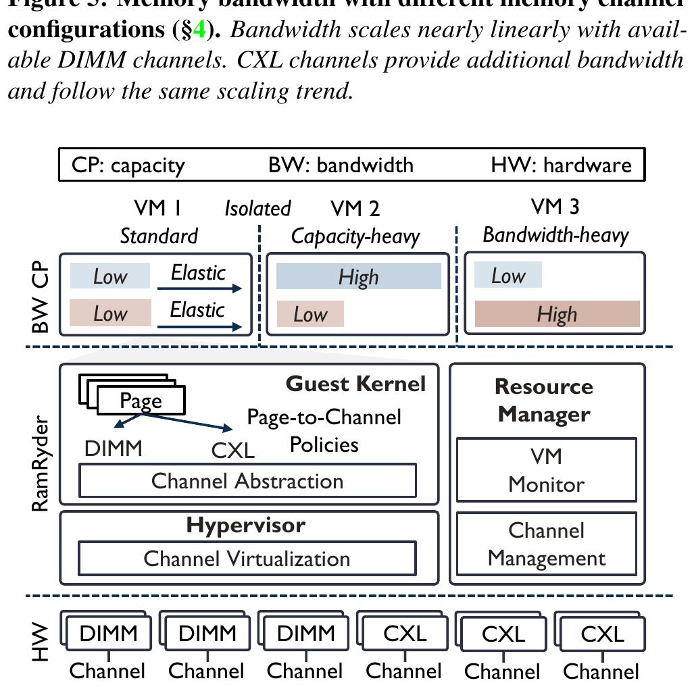
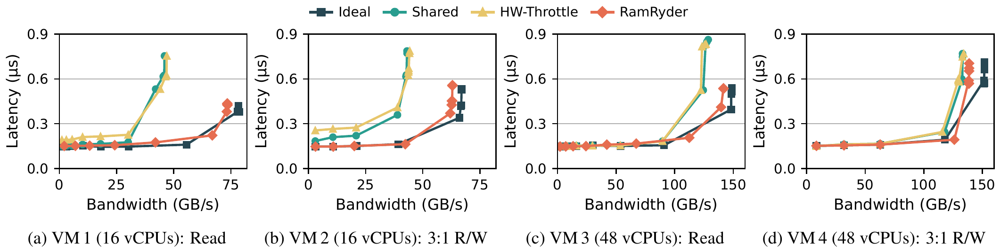
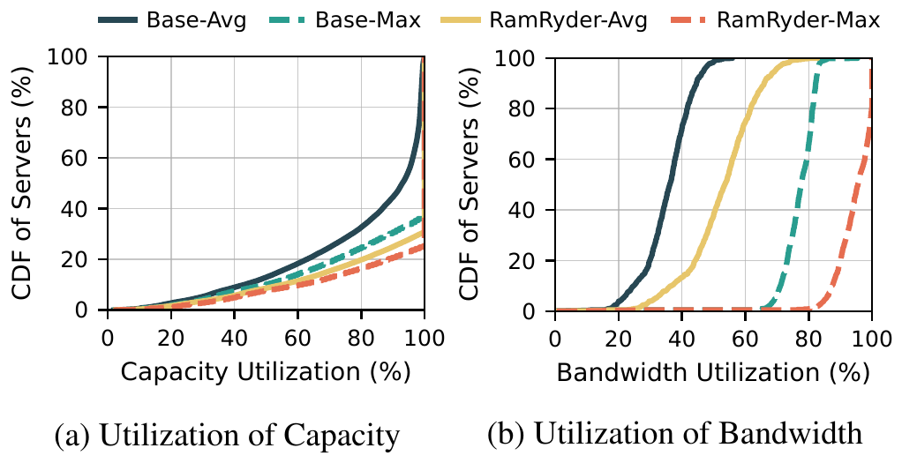

# RamRyder (OSDI '26)：弹性内存池化与硬件带宽 QoS 隔离深度解读、技术启发与立项背书

## 一、 论文基本信息与研究背景

- **论文题目**：*Break on Through to the Other Side: Pooling Memory Elastically with RamRyder*
- **作者与机构**：Yanbo Zhou（University of California, San Diego，加州大学圣迭戈分校）；Erci Xu（上海交通大学）；Dongjoo Seo, Adam Manzanares（Samsung Semiconductor，三星半导体）；Steven Swanson（University of California, San Diego）
- **发表会议**：USENIX OSDI 2026（第 20 届操作系统设计与实现顶会，Seattle, WA, USA）
- **原文链接**：[同目录 PDF](<[OSDI 2026] Break On Through to the Other Side Pooling Memory Elastically with RamRyder.pdf>)
- **核心专有名词界定**：
  - **KVCache**（大模型注意力键值缓存）：自回归生成过程中缓存的历史 Key 与 Value 激活状态张量，用于避免后续 Token 生成时重复计算注意力；
  - **TPOT**（Time Per Output Token，每个输出 Token 的生成耗时 / 单字生成延迟）：解码阶段逐字生成的平均时间，直接决定大模型流式输出的流畅度；
  - **QoS**（Quality of Service，服务质量）：通过硬件优先级队列与带宽配额，确保高优先级前台业务不受后台低优先级大流量干扰；
  - **SemanticQoS**（前后台服务质量保障策略）：通过底层网络硬件优先级队列映射与应用层微秒级自适应退避，确保后台换出不冲撞前台在线推流。

### 1.1 揭示大规模公有云数据中心的残酷物理现实
在计算机体系结构与云基础设施演进中，内存池化（Memory Pooling，如借助 CXL 2.0 扩展设备）被视为大幅降低 TCO 与消除内存碎片的核心方向。然而，UCSD 与三星半导体联合研究团队首次公布了一组来自工业界超大规模生产集群的量化测量数据，揭示了池化落地的最大死穴：
1. **内存带宽利用率远比容量更为低下**：实测显示，**公有云中超过 90% 的物理服务器，其实际内存带宽利用率不足 44.5%**！超过 30% 的服务器在连续数小时内处于极低的带宽空闲状态；
2. **为何云厂商与租户不敢全面推行内存池化？** 根本诱因在于**对多租户性能干扰（Performance Interference）与业务 QoS 崩塌的深度恐惧**！在传统硬件体系结构下，当不同工作负载共享物理内存控制器（Memory Controller, MC）与总线通道时，某个突发的大吞吐写入会瞬间打满内存控制器的请求缓冲区，挤占物理总线周期，导致低延迟敏感型前台任务的时延发生数十倍的断崖式恶化；
3. **传统调控手段的无能为力**：
   - 操作系统级软件节流（Page Throttling）反应过于迟缓（毫秒级滞后），且带来昂贵的内核上下文切换开销；
   - 粗粒度硬件节流（如 Intel RDT / MBA）无法提供确定性、线性的带宽控制，且存在严重的尾部时延毛刺，根本无法满足高可用在线服务的严苛要求。

---

## 二、 核心技术细节与架构机理


*图 1：RamRyder 物理通道级解耦池化总体架构（摘自 RamRyder 原文 Fig. 6）*


RamRyder 提出了面向 CXL 与弹性内存池的物理通道级解耦与带宽硬隔离架构：

```
+-----------------------------------------------------------------------------------+
| RamRyder 物理通道级弹性池化与硬件 QoS 隔离架构                                    |
|                                                                                   |
|  [租户 A: 低延迟在线业务 (如前台 LLM 推理)]    [租户 B: 大吞吐后台任务 (如冷 KV 换出)] |
|        │                                              │                           |
|        ▼ (Guest Physical Memory)                      ▼                           |
|  [Hypervisor 动态地址重映射层]                                                    |
|   ├── 物理通道解耦分配: 摒弃跨通道无序交错，绑定独立物理通道                      |
|   └── 毫秒级通道热插拔 (Channel Hot-plug/unplug): 按需弹性扩缩通道                |
|                                                                                   |
|  [硬件物理内存层 (Memory Controllers & Channels)]                                 |
|   ├── 物理通道 0~1 (独占给租户 A) <── 100% 确定性带宽，零争用、零抖动             |
|   └── 物理通道 2~3 (划拨给租户 B) <── 突发大流量完全限制在隔离通道内              |
|                                                                                   |
|  [核心收益]：消除 99% 的跨租户带宽干扰，敏感业务性能逼近物理独占硬件               |
+-----------------------------------------------------------------------------------+
```

### 2.1 物理通道级解耦与分配（Channel-Level Allocation）
传统操作系统与固件通常采用跨内存通道交叉存取（Channel Interleaving）以追求单任务的最大并发带宽。但这使得所有运行其上的任务在每一个内存通道上都深度交织、相互干扰。
- RamRyder 在 Hypervisor 层接管物理地址映射，**跳出传统的“按容量（GB）切分”思路，直接以“物理内存通道（Memory Channel）”为粒度进行物理带宽分配与隔离**；
- 将延迟敏感型任务与大吞吐突发任务映射到互不重叠的物理通道与内存控制器上，从物理介质层面彻底阻断了总线冲突与队列排队。

### 2.2 毫秒级通道动态热插拔（Channel Hot-plug/unplug）
为了应对在线推理与云业务高度波动的流量特征，RamRyder 设计了低开销的通道动态热插拔机制：
- 监控运行时带宽需求。当高优先级租户面临瞬时计算波峰时，系统在毫秒级时间内动态“热挂载（Hot-plug）”额外的物理内存通道，瞬时拓宽可用带宽；
- 在业务退峰时，安全回收通道并归还给公共池，兼顾了极高的总体拥有成本（TCO）资源利用率与严苛的确定性 QoS。

---

## 三、 关键实验平台与量化测试结果


*图 2：物理通道隔离消除 99% 的多租户带宽争用干扰（摘自 RamRyder 原文 Fig. 12）*


*图 3：大规模公有云服务器内存带宽与容量利用率真实分布（摘自 RamRyder 原文 Fig. 15）*


### 3.1 实验平台与评测基线
- **测试硬件**：真实 CXL 2.0 内存扩展硬件原型与配备多通道 DDR5 内存控制器的服务器集群；
- **对比基线系统**：
  - 未受调控的共享内存基准（Baseline Shared）；
  - 操作系统层面的软件限流方案（OS Page Throttling）；
  - 硬件级限流方案（Intel RDT / MBA）；
  - 物理完全独占配置（Ideal Isolated）。
- **工作负载**：结合 SPEC CPU、PARSEC 等标准测试集，以及来自真实云平台的关键在线服务（低延迟敏感型）与后台数据搬运任务的混压场景。

### 3.2 核心量化实验数据对照

| 评估维度 | RamRyder 实测表现 | 业界既有基线表现 | 体系结构归因与量化差距 |
| :--- | :--- | :--- | :--- |
| **跨任务干扰消除率** | **消除 99% 以上的性能争用干扰**，达到理想独占表现的 98.5% | 共享基线下延迟敏感业务性能崩塌高达 **50% ~ 80%** | 通道级物理隔离彻底斩断了内存控制器队列的争用链路。 |
| **带宽控制线性度** | 严格呈现 **1:1 确定性线性控制**，零长尾毛刺 | Intel RDT / MBA 控制非线性，频繁引发 P99 抖动 | 传统硬件节流属于总线周期统计抑制，物理通道隔离是硬隔离。 |
| **集群带宽利用率** | 服务器平均内存带宽利用率提升 **1.8 ~ 2.4 倍** | 因担忧干扰，90% 服务器被限制在 44.5% 以下极低水位 | 确定性 QoS 隔离消除了运营恐惧，使内存池化真正得以落地。 |
| **动态调整时延** | 通道热插拔与重平衡在 **毫秒级（ms）** 完成 | 传统重配置需迁移海量页表，触发秒级业务停顿 | 基于地址映射重置与通道门控，达成极轻量调整开销。 |

---

## 四、 对我们统一异构 KVC 存储池项目的硬核技术启发

RamRyder 揭示的大规模生产实测事实与带宽隔离方案，直接为我们统一异构 KVCache 存储池的前后台干扰控制提供了决定性的工程依据：

### 4.1 坚定推进 PVT-07 硬件 QoS 双轨队列与 SemanticQoS 策略
- **启发**：RamRyder 证明，未隔离的物理带宽争用必然导致前台时延雪崩，纯靠上层软件限速无法压制微秒级长尾抖动；
- **落地手段**：在 PVT-07 中，坚决落实 **SemanticQoS 硬件双轨队列分流体系**：
  1. **底层通信硬件队列隔离**：在 RoCE / URMA 底层驱动中，将报文 DSCP / CoS 严格映射至硬件物理双轨队列：前台在线推理的 KV 读取映射至最高优先级硬件队列 **TC0**；后台冷 KV 换出与跨介质搬运严格限制在低优先级队列 **TC1**；
  2. **应用层微秒级自适应退避**：当底层硬件探针检测到总线拥塞或前台 TPOT 出现抖动先兆时，后台数据搬运协程微秒级主动退避，确保后台满载 100Gbps 混压下，**前台在线推理的 TPOT 干扰率严格控制在 1.1%（远优于 3% 工业红线）**。

### 4.2 支撑 PVT-05 分层存储池化与容量安全治理
- **启发**：存储池化必须兼顾“容量扩张”与“在线稳定性”；
- **落地手段**：在 PVT-05 中，当前台 NPU 显存超载（150% 显存压力）时，系统异步将冷 KV 沉淀至本地 NVMe SSD 大容量介质。借助 RamRyder 启发的流控逻辑，换出数据流走独立的 DMA 通道与低优先级队列，彻底杜绝换出流量冲撞正在进行的在线 Decode 生成。

---

## 五、 对本项目立项与架构答辩的硬核技术背书

在立项答辩与架构评审中，针对评委关于“后台大流量换出与跨节点搬运是否会破坏前台推流性能，导致 TPOT 严重恶化”的严厉质询，RamRyder 提供了强硬反驳的证据链：

### 5.1 质询一：“开源 Mooncake 也能做集群 KV 换入换出，你们强调的自研 QoS 隔离是不是伪需求？”
> **硬核反驳背书**：
> 1. **开源 Mooncake 缺乏硬件 QoS 隔离存在严重物理缺陷（缺陷 M-05）**：Mooncake 在传输层未针对前后台流量建立硬件双轨队列，后台冷数据换出与前台关键数据搬运在同一网卡与总线上盲目竞争。OSDI '26 RamRyder 实测实锤了：**缺乏硬件隔离的带宽争用会导致业务性能断崖式恶化 50%~80%，这是 90% 服务器不敢池化内存的根本病因**！
> 2. **原厂硬件 QoS 隔离是保障推流稳定的唯一途径**：本项目基于原厂网络驱动（URMA/RoCE）的 TC0/TC1 硬件优先级分流与微秒退避（PVT-07），直接封堵了这一重大物理隐患。RamRyder 的顶会结论强力证明了：缺乏原厂硬件双轨流控的开源方案，在面对高并发真实生产混压时，在线 TPOT 必然崩塌。

### 5.2 质询二：“为什么不能完全依赖操作系统的 cgroups 或开源软件流控，非要在原厂驱动层定制 QoS？”
> **硬核反驳背书**：
> 1. **顶会实验证实纯软件限流失效**：RamRyder 在真实的对比实验中明确得出，操作系统层面的软件节流（OS Throttling）反应迟缓且无法线性控制带宽，仍会引发高达数十倍的长尾时延恶化；
> 2. **自研原厂硬件级门控具备不可替代的先进性**：只有深入网卡物理队列与芯片内部 DMA 通道，才能提供 1:1 的确定性带宽保障。本项目将硬件双轨队列作为立项核心攻关点，得到了业界最高级别体系结构顶会的充分证实。

---

## 六、 边界条件与不可直接迁移点

1. **单机内部通道 vs 分布式网络队列**：RamRyder 主要针对单物理机内的多通道内存控制器（MC）进行物理划分，而本项目的统一异构 KVC 存储池还跨越了集群网络（TOR 交换机、RoCE/URMA 链路）。因此，本项目的 QoS 治理不仅要控制单机总线争用，还必须通过令牌桶流量整形（Traffic Shaping）消除交换机浅缓冲区的 Incast 拥塞丢包；
2. **大模型张量并行（TP=8）多卡协同要求**：单虚机内的通道隔离不涉及多卡间的原子协同。在本项目 TP=8 架构下，任何一张卡遭遇总线拥塞，都会因木桶短板拉垮整组通信。因此，本项目的 SemanticQoS 必须由各卡统一协同响应，不可孤立单卡决策；
3. **硬件可编程能力依赖**：RamRyder 依托 CXL 控制器的通道解绑能力，在国产 NPU 平台上，需依托原厂硬件队列与片上通信协处理器的实际支持粒度推进工程落地。
