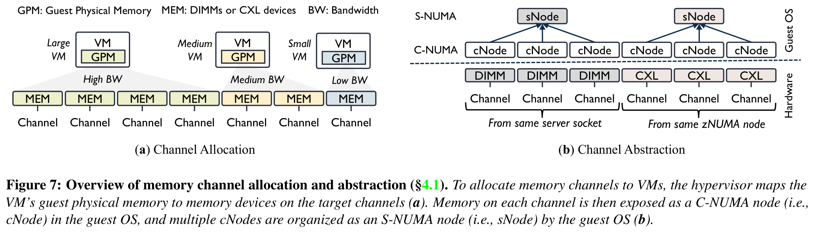
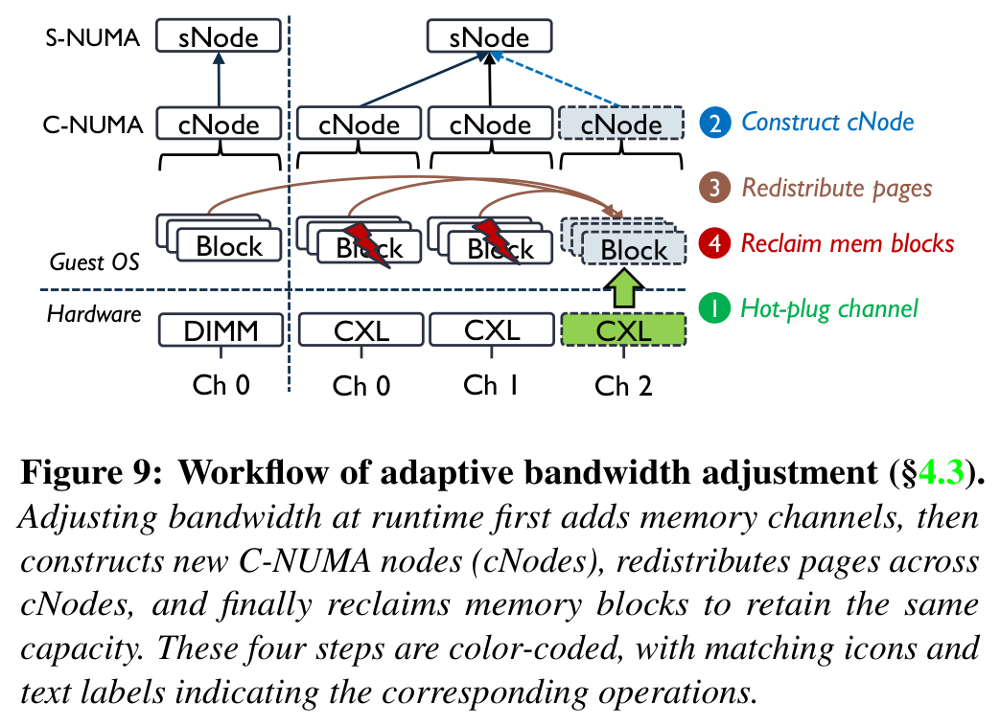
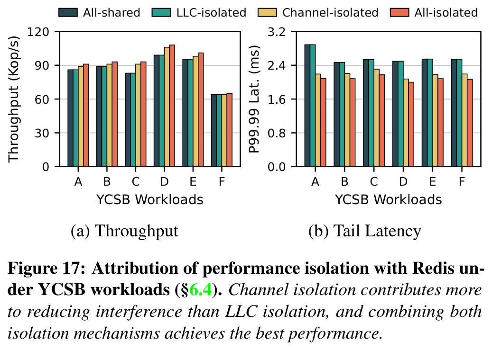
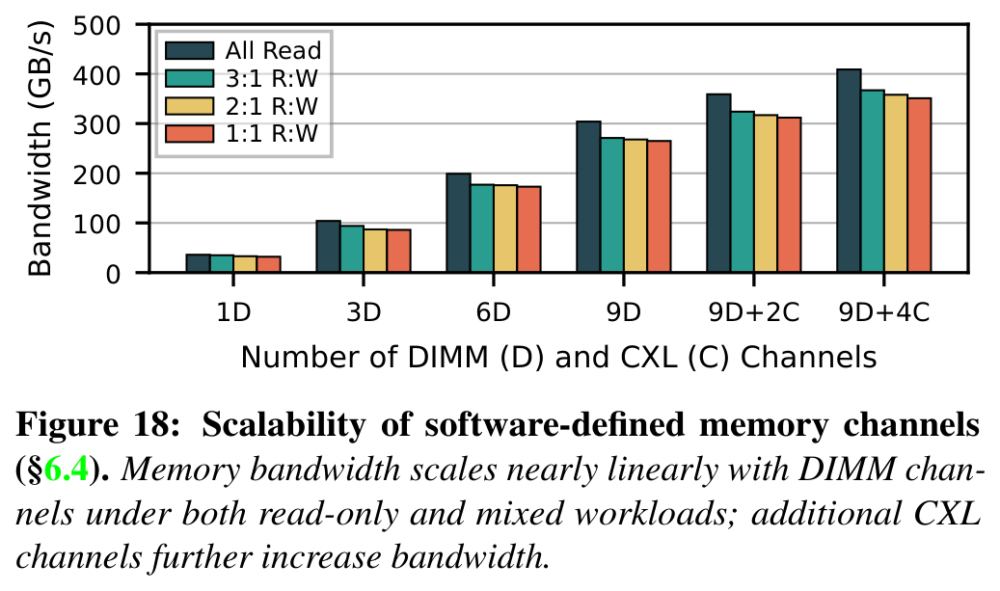

# RamRyder 论文解构：把内存通道变成可分配的带宽资源

> 原文：Yanbo Zhou 等，*Break on Through to the Other Side: Pooling Memory Elastically with RamRyder*，OSDI 2026。本文只依据[本地论文 PDF](<[OSDI 2026] Break On Through to the Other Side Pooling Memory Elastically with RamRyder.pdf>)撰写；图均从该 PDF 裁切，保留原图题。文中的“论文实测”“追踪数据计算”“分析判断”“项目建议”分别标明，避免混用。

## 1. 一页读懂

**问题。** 云虚拟机（VM，即运行在宿主机上的隔离计算实例）通常按固定的 CPU 与内存容量比例售卖，内存带宽却没有相应的分配接口。为了在峰值时避开邻居干扰，租户可能独占整个 CPU 插槽，结果容量和带宽在平时都闲置。作者分析的云追踪数据中，90% 的服务器平均内存带宽利用率不超过 44.5%，峰值利用率不超过 82.2%（§3.1，图 2）。这是该数据集的观察值，不是所有云集群的普遍常数。

**根因。** 默认的硬件交织把一个 NUMA（非统一内存访问，表示不同处理器和内存之间访问代价不同）节点的物理地址铺到多个内存通道。操作系统能决定页落在哪个 NUMA 节点，却难以把某台虚拟机限制在指定的物理通道。不同租户由此共享通道，容量份额、带宽份额和干扰边界绑在一起。仅给 CPU 访存插入延迟的硬件限流，也不能稳定地把共享通道变成可保证的带宽份额（§2.2、§3.3，图 4）。

**核心洞察与抽象。** 通道数在测试平台上大体决定可用内存带宽；既然争用发生在通道共享处，就先在启动时拆开硬件交织，再把每条通道作为可分配资源交给虚拟机。RamRyder 在客户机中用 **C-NUMA**（通道级 NUMA 节点，把一条物理内存通道暴露为一个可选页放置目标）和 **S-NUMA**（服务器级 NUMA 节点，把同一处理器插槽或 CXL 域内的多个 C-NUMA 节点重新分组）保留原有拓扑视图，使页分配策略能直接选择通道（§4.1，图 7）。CXL（Compute Express Link，一种让处理器通过互联访问扩展内存的协议）设备则提供额外的通道与容量。作者称容量和带宽可以“基本独立”分配；这里仍受通道颗粒度、单通道容量、不同介质带宽和页迁移速度约束。

| 关键方法 | 原有问题 | 具体做法 | 直接效果 |
|---|---|---|---|
| 通道切分与页级交织 | 不同 VM 争用同一组硬件交织通道 | BIOS/UEFI 关闭 DIMM 通道间交织，虚拟机获得指定通道；客户机在已分配通道间分配页 | 形成物理带宽边界，减少邻居争用；代价是软件交织开销 |
| CXL 通道选择与跨层加权放置 | 只扩容量或只扩带宽时，固定容量比例会多买另一种资源 | 按需求选择 CXL 通道数；扩带宽时按各层通道带宽加权放页，扩容量时让较冷页进入 CXL | 在设备约束内分别增加可用带宽或容量 |
| 热插拔加惰性页重分布 | VM 创建后的带宽份额固定，不能跟随持续负载变化 | 增减通道，借助客户机热插拔和缺页触发的惰性迁移重排已有页 | 保持总容量近似不变，同时逐步改变实际可用带宽 |

**最能说明效果的证据。** 四台同机 VM 的内存微基准中，小 VM 在共享配置下相对独占基线最高损失 41.2% 带宽、平均访存延迟最高增加 78.5%；RamRyder 将其访存延迟压到距离独占基线 5% 以内（§6.1，图 12）。Redis 的 YCSB 负载（数据库基准工作负载集）在共置压力下，RamRyder 的尾延迟与独占基线相差不超过 5%（§6.2，图 13）。追踪数据配对计算报告 P30 平均容量利用率提高 28.6%、P90 平均带宽利用率提高 43.2%（§6.3，图 15）；这两个数不是物理集群上线后的直接测量。

**最大边界。** 资源管理器每秒采样一次，已有页还需迁移；一个 10 GB 工作集的实验中，带宽从约 38 GB/s 升至 68 GB/s 花了 2.2 秒（§6.4，图 20）。因此，它适合秒级持续需求，不能据此保证毫秒级突发请求。

**与本项目的关系。** 本项目研究 KVCache（大模型注意力键值缓存，即保存历史 Token 的 Key/Value 状态以避免重复计算）跨异构介质的存储和调度。论文独立验证了“容量够用”并不等于“带宽和干扰可控”，也展示了把硬件资源粒度暴露给调度器的可行性。但 RamRyder 管理的是单机 CPU 可寻址内存与 VM，未验证 NPU 显存路径、跨节点 KVCache 传输、Host CPU 零数据拷贝或推理尾延迟目标。

## 2. 作者为何选择“通道”

论文把两类浪费分开解释。**空间超配**来自租户为保障服务质量而独占插槽；**时间超配**来自 VM 配置在生存期内固定，按峰值预留的带宽长期闲置。容量、带宽与 CPU 使用率在同一服务器上也不总是同步变化（§3.1，图 3）。因此，合并“容量需求高但带宽需求低”和“容量需求低但带宽需求高”的负载有机会提高利用率，前提是不能牺牲服务隔离。

传统容量池化主要扩大可用字节数。RamRyder 关注另一个约束：缓存一致的本地 DIMM 与 CXL 内存由 CPU load/store 直接访问，软件在每次访存时没有可调度的网络包。控制每次访问并不现实；控制**页被映射到哪条通道**才是可落地的入口。图 5 给出通道数与带宽随之增加的测试观察，图 17 再用消融说明通道隔离对该平台的干扰抑制作用强于单独的末级缓存隔离。

## 3. 系统如何工作

### 3.1 启动时拆开硬件交织，运行时保持拓扑可见

默认情况下，一个插槽的地址可交织到全部 DIMM 通道。RamRyder 先经 BIOS/UEFI 配置把通道分区，在主机物理地址中识别各通道区域，并把区域保留为 DAX（直接访问型内存设备，供用户态按物理区域管理）设备。资源管理器以 128 MB 块分配通道容量；基于 QEMU 的虚拟机监控器将块映射到客户机物理内存，并通过 ACPI（向操作系统描述硬件拓扑的固件接口）传递通道信息。改造后的 Linux 客户机建立 C-NUMA 与 S-NUMA，再在选定通道间按页交织（§5.1–5.2，图 6、7、11）。这里的“无硬件修改”指服务器器件不改造，仍需改 BIOS/UEFI 配置、QEMU 和客户机内核。

**方法一：通道切分与页级交织。** 原路径把多个 VM 的页交织到共同通道，强负载会占用弱负载需要的带宽。新路径先给 VM 指定物理通道，再在 VM 自己的通道中把页摊开；同时将各 VM 的 vCPU 固定到不同 CCX（核心复合体，即具有独立末级缓存的一组 CPU 核心），避免末级缓存干扰掩盖通道隔离效果（§4.1）。这解释了为什么“只做通道分配”并不等于完全隔离。软件按页交织也比硬件缓存行交织粗，单线程特定访问步长会付出性能代价：128 线程 STREAM 的平均开销为 3.6%，单线程平均为 5.1%，2 KB 步长最高为 7.4%（§6.4，图 19）。

### 3.2 选择多少 CXL 通道，以及页放在哪层

**方法二：CXL 通道选择与跨层加权放置。** 若 VM 缺带宽但只需少量额外容量，系统把同一份客户机内存映射到更多 CXL 通道，并按 DIMM 与 CXL 各层的最大带宽分配新页。若 VM 主要缺容量，系统选有空闲容量的较少通道，并使用冷热页分层策略，让 CXL 承接较冷页。两条路径改变的资源不同：前者增加并行通道，后者增加存放字节数（§4.2，图 8）。论文所举加权比例与提供的带宽数值存在算术不一致，见第 5 节。

### 3.3 热插拔只改变映射，已有数据仍要搬

**方法三：热插拔与惰性页重分布。** 资源管理器按每秒采集的性能计数器和客户机容量统计判断需求。达到约 80% 的高阈值时分配资源；低于约 40% 且持续若干秒时回收。带宽扩展先插入一个映射到新 CXL 通道的客户机内存区域，建立新 C-NUMA 节点，再从旧通道回收等量容量，以保持总容量。已分配页并不会自动跑到新通道：客户机清除页表的 present 位，后续访问触发缺页后再判定目标位置并惰性迁移；缩带宽时则反向处理（§4.3，图 9）。因此“通道热插拔数微秒”不代表“带宽数微秒生效”。

## 4. 实验分别证明了什么

**实验环境与比较口径。** 论文使用一台 AMD EPYC Zen 5 服务器，单插槽 8 条各装 32 GB DDR5 DIMM 的通道，另有四个 256 GB Samsung CXL 2.0 设备；主机运行 Debian/Linux 6.15。四台 VM 分别配置 `16/16/48/48` 个 vCPU 与 `32/32/96/96 GB` 内存，RamRyder 初始分得 `1/1/3/3` 条 DIMM 通道，vCPU 固定在不同 CCX。`Ideal` 是不共置租户的独占硬件基线，`Shared` 是默认共置，`HW-Throttle` 是在共享配置上启用硬件限流（§6 开头）。独占基线用于检验性能接近程度，不是同等物理资源投入的成本基线。

| 证据类别 | 原论文结果与条件 | 能支持的结论 | 不能据此推出 |
|---|---|---|---|
| 论文实测：微基准 | Intel MLC，四 VM 同时运行；小 VM 的 `Shared` 相对 `Ideal` 带宽最高降 41.2%、平均访存延迟最高升 78.5%；RamRyder 小 VM 延迟距 `Ideal` <5%（§6.1，图 12） | 通道隔离可显著减轻不对称共置干扰 | 所有负载均获得同等幅度收益 |
| 论文实测：服务尾延迟 | Memcached/Redis 各 6000 万键值对、每种 YCSB 负载 3000 万操作；Redis 中 `Shared` 最差场景尾延迟相对 `Ideal` 最多增加 42.7%，RamRyder 距 `Ideal` <5%（§6.2，图 13） | 在该数据库负载与共置配置下，隔离能保护 P99.99 尾延迟（99.99 百分位的请求延迟） | 对大模型首 Token 响应时间或逐 Token 生成耗时有相同改善 |
| 论文实测：流式与图计算 | STREAM 数组 5000 万元素；`Shared` 吞吐较 `Ideal` 低 37.3%、执行时间高 58.8%，RamRyder 两项均距 `Ideal` 5% 内；图处理 `Shared` 执行时间高 41.4%，RamRyder 相对 `Shared` 缩短 25.2%（§6.2，图 14） | 饱和访存负载受物理通道争用影响明显 | 数据库、流式与图处理的改善可相加 |
| 追踪数据配对计算 | 按每个时间戳的容量和带宽总量均低于硬件上限挑选服务器配对；P30 平均容量利用率提升 28.6%，P90 平均带宽利用率提升 43.2%（§6.3，图 15） | 该数据集存在容量/带宽互补的合并空间 | 整个真实集群已部署并测得相同收益，或所有配对都满足完整 QoS 约束 |
| 论文实测：双 VM 回放 | 自制负载发生器重放一对服务器的时间序列到 VM 3/4；一台容量使用 >70%、带宽平均 10.1%，另一台容量 <20%、带宽平均 38.4%（§6.3，图 16） | 一组互补需求可在原型上回放并动态调整 | 覆盖整个集群的真实应用行为 |
| 论文实测：动态开销 | 10 GB 只读工作集；加 CXL 通道后约 38→68 GB/s 用 2.2 秒，迁移约 40% 页、报告迁移速率 1.82 GB/s；回收用 1.1 秒（§6.4，图 20） | 秒级调整对持续需求有效 | 突发流量可以即时拿到新带宽 |

**归因与扩展性。** Redis 消融将“都共享”“仅隔离末级缓存”“仅隔离通道”“两者都隔离”分开比较：仅隔离通道比仅隔离末级缓存更能降低尾延迟，两者都隔离最好（§6.4，图 17）。Intel MLC 扫描通道数的实验显示 DIMM 通道增加时带宽近似线性增长，增加 CXL 通道后仍增长但斜率变小；这验证了“通道数是带宽控制量”的前提，同时提醒不能把 DIMM 与 CXL 通道当作等速资源（§6.4，图 18）。

## 5. 适用边界与复现疑问

1. **可分配粒度有下限。** 一条通道可能大于小 VM 需求。作者讨论了小 VM 共用通道与辅以低档硬件限流的可能性，但这不是已经实现并验证的同等隔离方案（§7）。
2. **动态能力以秒计。** 一秒采样、缺页和迁移使系统更适合缓慢增长或持续高负载。图 21 中短突发与过配全部通道的 `Ideal` 有明显差距；“没有明显延迟尖峰”仅限图 20 的那项 10 GB MLC 测试（§6.4、§7）。
3. **部署前提重。** 系统需在启动时改交织配置，还需 QEMU 与客户机 Linux 改造；实验另外固定 vCPU 到不同 CCX。对不能改客户机内核、不能改变 BIOS 拓扑或缓存拓扑不同的环境，论文结果需要重新验证（§4.1、§5、§7）。
4. **物理池化范围有限。** 原型部署在单主机。跨主机 CXL 交换式内存池只在讨论中提出，没有相应端到端实验；现有 CXL 设备内部恰好各一条 DDR5 通道，未来多通道设备是否可被软件分别控制也取决于设备暴露方式（§7）。
5. **算术需向作者或复现代码核对。** §4.2 写三个 36 GB/s DIMM 通道和一个 27 GB/s CXL 通道的加权页比例为 8:3，并称由 `36×3` 与 `27×1` 得出。按这两个数应得到 4:1，而非 8:3。它不推翻“按带宽加权”的机制，但会影响复现时实际页分配比率。本报告不替作者修正参数。

## 6. 对统一异构 KVCache 项目的判断

**可以直接借鉴的原则。** 把“有多少容量”与“实际能拿到多少带宽”分开监控；做混合租户测试时同时记录通道/链路占用和 P99 尾部时延，而非只看平均吞吐。RamRyder 的图 17 说明排除错误的争用来源要靠逐项消融，不能仅凭端到端收益归因。对本项目，这对应验证前台在线推理与后台搬运共存时，瓶颈究竟在本地内存通道、PCIe/CXL 链路、网卡队列，还是加速器内部。

**需要改造后才能使用的想法。** 论文按物理通道建立可观测、可分配的抽象；本项目可评估是否把 NPU 高带宽显存（HBM）、主机内存、CXL 扩展内存和 NVMe SSD 的容量、有效带宽、访问延迟、干扰代价作为硬件能力矩阵，供动态选路读取。这里只能借用“让调度器看见真实资源边界”的方法，不能直接复用其 CPU 页表、C-NUMA 或缺页迁移实现。若试验远端直读或后台换出，还应在负载变化时测从决策到实际带宽生效的时间，避免把控制指令完成当作数据路径已经提速。

**不应照搬的部分。** 把 RAM 通道热插拔当作毫秒级 KVCache 调度器、把 VM 级页迁移当作 NPU HBM 中的块重排、把 Redis P99.99 结果当作大模型首 Token 或逐 Token 延迟证据，都会跨越论文的实测边界。RamRyder 未证明 Host CPU 零数据拷贝（CPU 只下发控制指令、不搬运 KVCache 正文）、语义一致性校验、多卡状态同步或 NVMe 到 HBM 直达，也未验证项目 E3 阶段的全链路指标。

**立项证据强度。** 论文对“容量与带宽需求错位会造成资源闲置”给出数据集证据；对“暴露物理资源边界有助于隔离”给出单机原型、微基准、应用基准与消融证据；对“统一异构 KVCache 底座应怎样做”只提供设计启发。项目的必要性仍要用自身推理工作负载的容量、带宽、重算开销和干扰测量来确认；可行性要通过原型数据路径与故障语义验证；差异化要建立在该论文没有覆盖的 NPU、跨节点与多介质条件上。

**建议的最小验证。** 在 E0（业务收益前提确认）先记录不同复用率下 KVCache 加载总开销与本地重算耗时；在 E1（核心数据路径打通与多卡状态同步）用互补型和同型并发负载分别测容量、链路带宽、前台 P99 与隔离归因；在 E2（动态调度决策与分层扩容）测资源切换的“控制完成—数据路径生效”间隔，加入亚秒突发和持续高负载两类序列；到 E3（全链路前后台混压总门禁）再用真实两节点推理与后台满载 I/O 核对项目既定目标。上述是**项目建议**，不是 RamRyder 的实验结果或已完成验收。

## 图与证据说明

图 2、6–9、12–15、17–21 均为原论文 PDF 页面在 300 DPI 下的裁切图，原图题保留；图中英文基线与数值以原文为准。引用章节与图号均指原论文，PDF 页码从封面起算。图 15 的集群收益属于**追踪数据配对计算**，图 16 才是**单对服务器需求的双 VM 回放**；这两类证据不能合并表述为“整集群实测”。
