# RamRyder 论文解构：按内存通道分配带宽，而不只分配容量

> Yanbo Zhou 等，*Break on Through to the Other Side: Pooling Memory Elastically with RamRyder*，OSDI 2026。本文依据[原论文 PDF](<[OSDI 2026] Break On Through to the Other Side Pooling Memory Elastically with RamRyder.pdf>)独立撰写。文中页码从 PDF 封面算起；所嵌图片均取自该 PDF，保留英文原图题。实验数字按“原型实测”“追踪数据计算”“分析推论”分别说明。

## 1. 先看结论

**论文解决的问题。** 云服务能灵活分配虚拟 CPU，却常把内存容量按固定比例随 CPU 一起交付，内存带宽没有对应的分配接口。租户为避免共置干扰，可能预订超出容量需求的整块硬件。作者分析的云追踪数据中，90% 的服务器平均内存带宽利用率不超过 44.5%，峰值利用率不超过 82.2%（§3.1，图 2）。这是该追踪数据集的统计结果。

**根因。** 默认硬件把同一处理器插槽的物理地址交织到多个内存通道。虚拟机（VM，即宿主机上的隔离计算实例）虽然能拿到指定容量，却不能可靠地独占其中几条物理通道。多台 VM 因而在同一通道上竞争；按 CPU 缓存访问插入延迟的硬件限流，也不能把通道带宽精确切成稳定份额（§2.2、§3.3，图 4）。

**关键洞察。** 在测试服务器上，增加可用 DIMM（服务器内存条）通道通常能近似线性增加带宽；隔离通道还能直接减少不同 VM 之间的争用。RamRyder 因此把通道从隐含的硬件拓扑变成软件管理的资源：先在启动时关闭跨通道硬件交织，再把各通道的物理地址区域分配给 VM，并由客户机决定页落在哪条通道（§4、图 5–7）。

| 核心方法 | 要解决的事 | 改变了什么 | 直接效果与代价 |
|---|---|---|---|
| 通道专属分配与页级交织 | 多个 VM 在相同物理通道争用 | VM 获得指定通道；客户机把自己的页分布到所获通道 | 形成较清楚的带宽隔离边界；软件交织存在开销 |
| 按需求选择 CXL（Compute Express Link，连接处理器与扩展内存的高速互联协议）通道并跨层放页 | 要更多容量和要更多带宽被当成同一件事 | 扩带宽时让固定容量横跨更多通道；扩容量时使用有空闲容量的通道并做冷热分层 | 两种资源在设备约束内可“基本独立”扩展 |
| 通道热插拔与页重分布 | VM 创建后的带宽份额难以调整 | 插入或回收通道，保持容量近似不变，再迁移已有页 | 对持续负载可逐步增减带宽；调整耗时以秒计 |

**最重要的结果。** 在四台同机 VM 的内存微基准中，较小 VM 在默认共享方案下相对独占基线的带宽最高下降 41.2%、平均访存延迟最高增加 78.5%；RamRyder 将该 VM 的延迟控制在距离独占基线 5% 以内（§6.1，图 12）。云追踪数据的配对计算给出 P30 平均容量利用率提升 28.6%、P90 平均带宽利用率提升 43.2%（§6.3，图 15）。后一组数字不是整集群部署后的实测。

**适用边界。** 通道是粗粒度资源；系统还要修改 BIOS/UEFI 配置、QEMU 和客户机内核。带宽监控至少每秒采样一次，旧页迁移又需数秒，短突发可能已经结束，新带宽才开始生效（§5、§6.4、§7）。原型运行在单台主机上，跨主机内存池只是讨论中的扩展方向。

**项目关联。** 本项目的 KVCache（大模型注意力键值缓存，保存历史 Token 的 Key/Value 状态以避免重复计算）也会跨多种介质搬运和复用。RamRyder 说明：只看容量会漏掉带宽争用，调度器需要知道真实硬件资源边界。但论文没有测试 NPU 显存、跨节点 KVCache、主机 CPU 零数据拷贝或推理延迟，不能把这些当成它已验证的成果。

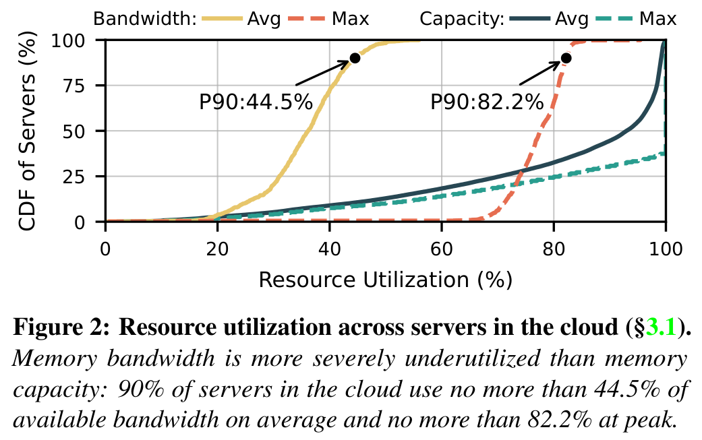

## 2. 从硬件通道到客户机可用的抽象

### 2.1 为什么容量池化不能顺带解决带宽隔离

论文区分两种浪费。**空间超配**是租户为稳定延迟独占插槽，虽只需一部分容量，却同时占住全部通道。**时间超配**是 VM 按峰值预留资源，低负载时通道仍被锁住。容量、带宽和 CPU 使用率在同一服务器上的变化也不一致（§3.1，图 3）。因此，把容量需求高、带宽需求低的负载与相反需求的负载放到一起有潜力；前提是共置后仍能控制争用。

操作系统通常能改虚拟页到物理页的映射，却不能在运行时改变 BIOS/UEFI 已设定的物理地址到 DRAM 通道映射。CPU 对本地 DIMM 和 CXL 扩展内存直接发起 load/store，软件也没有逐次拦截访存并排队的机会。RamRyder 的控制点是**先让一段物理地址只落在一条通道，再决定哪台 VM 能使用这段地址**（§2.2、§4.1、§5.1）。

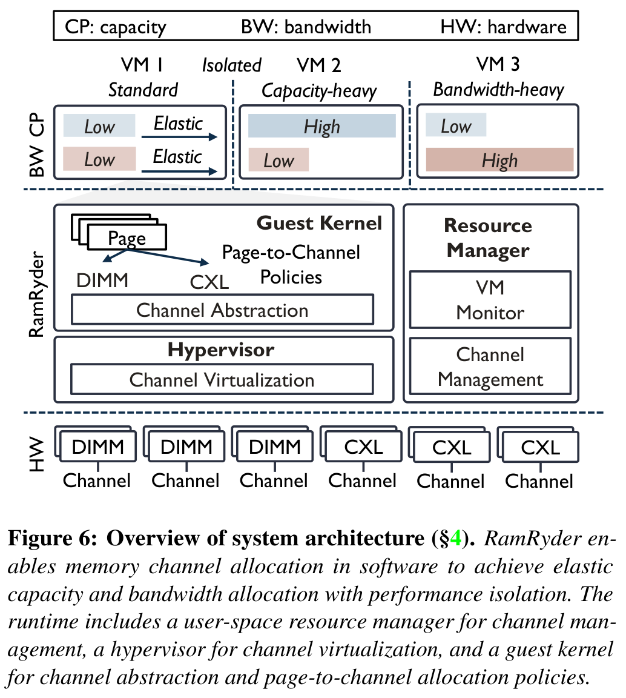

### 2.2 通道隔离：从共享的硬件交织改成 VM 内页交织

启动时，系统关闭 DIMM 通道间的硬件交织，识别各通道对应的主机物理地址区域，扣除固件或操作系统预留的地址空洞，再把这些区域登记为 DAX（直接访问型内存设备，供软件按物理区域管理）设备（§5.1，图 10）。资源管理器把 DAX 区域切成 128 MB 分配块；QEMU 将给定通道上的块映射到 VM 的客户机物理内存（§5.2，图 11）。论文所谓“不修改硬件”，不等于“无需改启动配置或系统软件”。

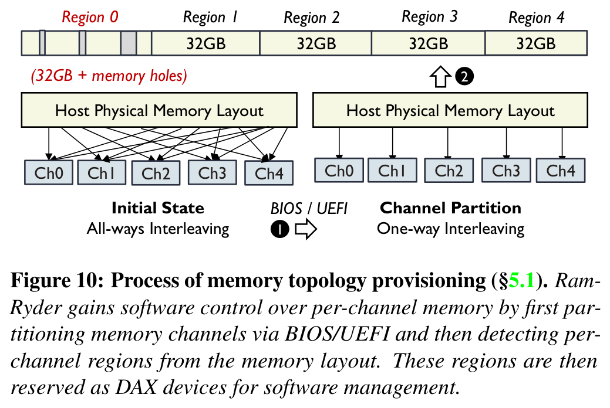

客户机把每条通道抽象成一个 **C-NUMA**（通道级 NUMA 节点，即可独立选择的页放置目标），再把同一插槽或同一 CXL 域的 C-NUMA 归为 **S-NUMA**（服务器级 NUMA 节点，保留原服务器拓扑语义）。页分配先按 S-NUMA 遵循通常的 NUMA（非统一内存访问，按所在处理器和内存位置区分访问代价）策略，再在内部通道间交织（§4.1，图 7）。这让 VM 的页只使用已获分配的通道，同时利用通道并行性。

这项方法的收益来自**少了跨 VM 的物理通道共享**，不是仅仅换了 NUMA 名称。它也不能单独隔离末级缓存。原型把不同 VM 的虚拟 CPU 固定到不同 CCX（具有独立末级缓存的 CPU 核心复合体），消融实验显示单独隔离通道比单独隔离末级缓存更有效，两者一起使用效果最好（§4.1、§6.4，图 17）。因此，结果同时依赖通道分配与实验中的缓存隔离设置。

### 2.3 用 CXL 通道数控制带宽，用页放置利用容量

CXL 设备在该平台上各提供一条内部 DDR5 通道。若 VM 需要带宽但只需少量新容量，RamRyder 把客户机内存映射到更多 CXL 通道，随后按 DIMM 和 CXL 所属层的可用带宽给新页加权放置。若 VM 需要容量而带宽需求不高，就选有空闲容量的较少通道，并沿用冷热分层：热页留在 DIMM，冷页放到 CXL（§4.2，图 8）。增加通道并不凭空增加数据请求；需要页真正落到这些通道上，带宽才可能增加。

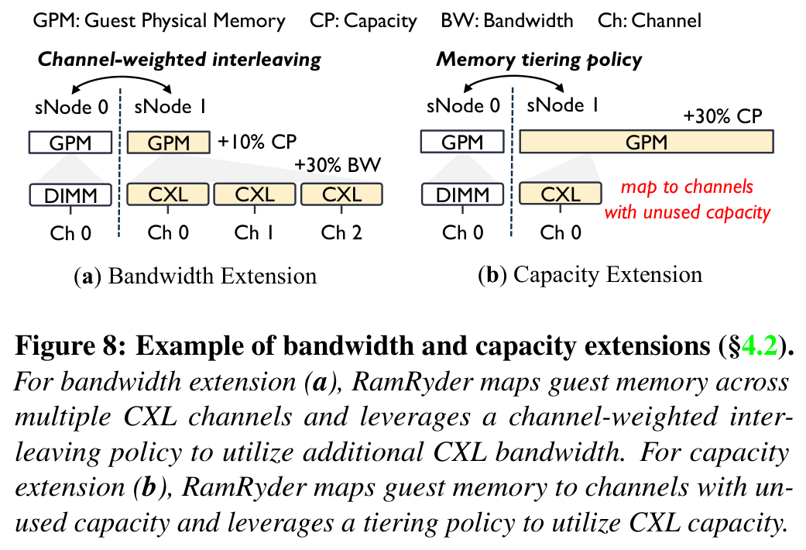

“容量与带宽基本独立”有明确的物理限度：每条通道仍有固定容量和峰值带宽，CXL 与 DIMM 的单通道速度也不同。小 VM 若需要不到一条通道，仍会遇到分配粒度问题。论文在 §7 讨论小 VM 共用通道及辅助限流，但没有把这项设想作为已经验证的等效隔离路径。

### 2.4 动态增带宽：控制动作完成后，已有页还要重排

资源管理器通过 CPU 性能计数器每秒统计 VM 带宽，客户机容量则取自内存统计。高阈值示例为 80%，低阈值示例为 40%，缩减还要求低使用率持续若干秒。增带宽时，系统先给新 CXL 通道映射一段客户机物理内存、热插入并创建 C-NUMA 节点；随后从旧通道回收等量容量，使 VM 的总容量近似不变（§4.3，图 9）。若工作负载不断分配新页，新通道可较快承担这些新页；已经存在的页不会自动过去。

对于旧页，客户机清除其页表的 present 位，待访问触发缺页时重算目标通道，并对位置不合适的页做惰性迁移；回收通道时必须把页移走（§4.3、§6.4）。这解释了为什么“热插拔本身只需数微秒”和“实际带宽扩展需要数秒”能同时成立。

## 3. 实验的证明范围

**平台和基线。** 论文使用 AMD EPYC Zen 5 服务器：一个插槽上 8 条各装 32 GB DDR5 DIMM 的通道，外加四个 256 GB Samsung CXL 2.0 设备；主机为 Debian/Linux 6.15。四台 VM 分别为 `16/16/48/48` 个虚拟 CPU 和 `32/32/96/96 GB` 内存，RamRyder 初始分得 `1/1/3/3` 条 DIMM 通道，虚拟 CPU 固定到不同 CCX。`Ideal` 指 VM 不与其他 VM 共置的独占硬件方案；`Shared` 指默认共置；`HW-Throttle` 是共享基础上的硬件限流（§6 开头）。`Ideal` 用于比较性能，不能当作相同硬件占用下的成本基线。

| 证据性质 | 实验条件与结果 | 支持什么判断 | 边界 |
|---|---|---|---|
| 原型实测：访存微基准 | 四 VM 同时运行 Intel MLC；16 vCPU 小 VM 的 `Shared` 相对 `Ideal` 带宽最高降 41.2%、平均访存延迟最高增 78.5%；RamRyder 延迟距 `Ideal` 小于 5%（§6.1，图 12） | 物理通道隔离减轻强邻居干扰 | 这不是每类应用的端到端延迟 |
| 原型实测：数据库 | Memcached、Redis 各装入 6000 万键值对，每种 YCSB（数据库负载基准）负载执行 3000 万操作；Redis 最差情况下 `Shared` 尾延迟比 `Ideal` 高 42.7%，RamRyder 距 `Ideal` 不超过 5%（§6.2，图 13） | 在该共置负载下能保护 P99.99（99.99 百分位）延迟 | Memcached 的吞吐本来就因带宽需求较低而相近，不能说所有业务吞吐大增 |
| 原型实测：高带宽应用 | STREAM 的 `Shared` 吞吐比 `Ideal` 低 37.3%、执行时间高 58.8%；RamRyder 两项均距 `Ideal` 5% 内。图处理任务中，RamRyder 相对 `Shared` 执行时间减少 25.2%（§6.2，图 14） | 对带宽饱和的应用，减少通道争用可改善性能 | 多种实验的收益不能相加 |
| 追踪数据计算 | 选取每一时间戳上容量、带宽合计均未超过硬件上限的服务器配对；P30 平均容量利用率提高 28.6%，P90 平均带宽利用率提高 43.2%（§6.3，图 15） | 该数据集存在可利用的互补需求 | 不是整集群真实部署或全部 QoS 条件得到验证 |
| 单对需求回放 | 自制负载发生器把选定服务器对的容量和带宽时间序列重放到两台 VM；一端高容量低带宽，另一端低容量高带宽（§6.3，图 16） | 原型能够处理选定的互补需求轨迹 | 不能替代真实应用的整集群试验 |
| 原型实测：调整代价 | 10 GB 只读工作集加一条 CXL 通道，带宽约从 38 升至 68 GB/s 用 2.2 秒；回收用 1.1 秒（§6.4，图 20） | 调整对持续需求有用 | 不支持瞬时带宽保证 |

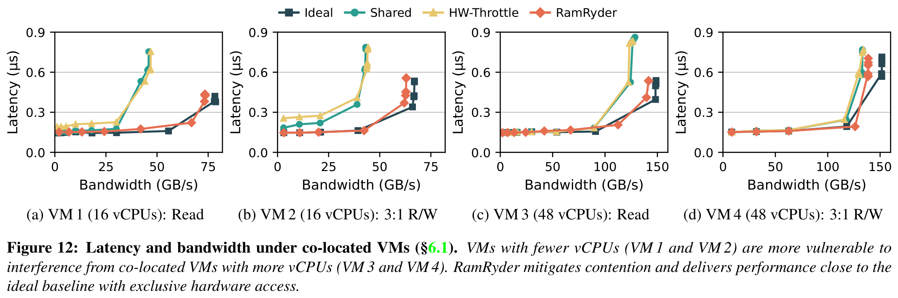

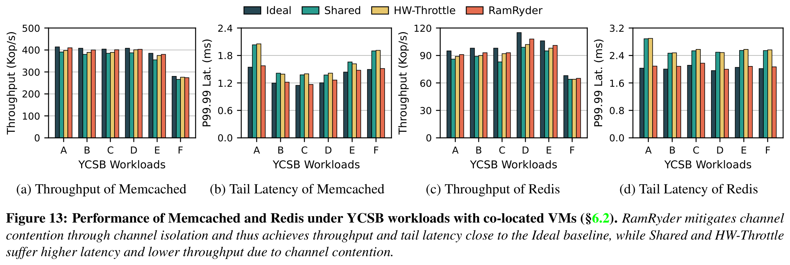

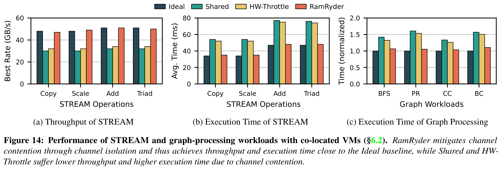

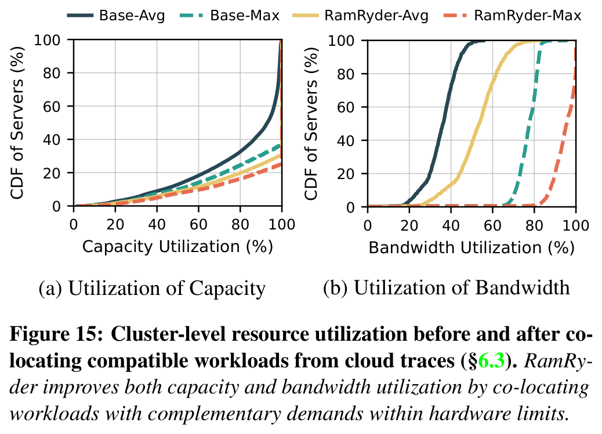

**机制归因。** Redis 的四组消融依次比较全部共享、只隔离末级缓存、只隔离通道、两者均隔离。只隔离通道的尾延迟改善大于只隔离缓存，组合方案最好（§6.4，图 17）。这使通道隔离的作用比单看端到端 RamRyder 曲线更可信，但仍仅覆盖该机器、该缓存布局与所选 Redis 负载。

**软件交织有成本。** 与硬件交织相比，128 线程 STREAM 的带宽平均低 3.6%、最高低 4.4%；单线程平均低 5.1%，2 KB 步长的开销达到 7.4%（§6.4，图 19）。因此，页级交织换取了可控的物理边界，却可能损失硬件细粒度交织的局部性优势。

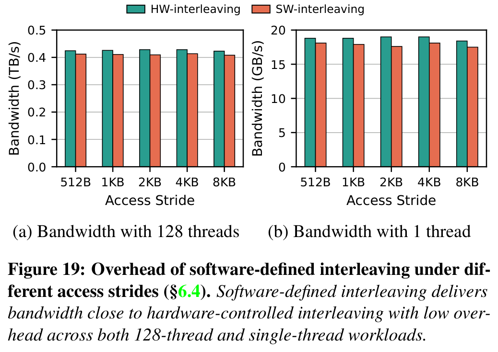

**调整慢在哪里。** 图 20 的 2.2 秒主要用于约 40% 页的迁移，论文报告迁移速率 1.82 GB/s；回收时立即迁移，约 1.1 秒完成。图 21 显示每秒采样和页重排会漏掉短突发，即使持续需求最终能够跟上。图 20 的“未见明显延迟尖峰”也只针对该 10 GB MLC 试验，不能当成所有应用的尾延迟保证。

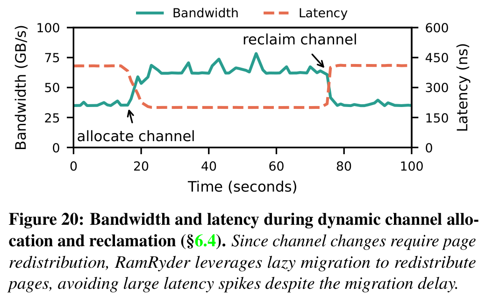

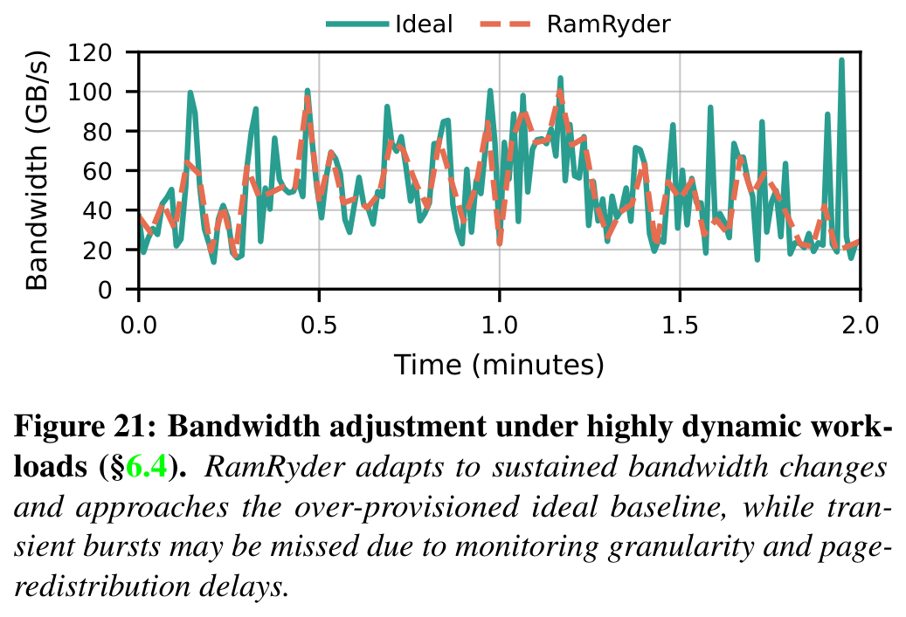

## 4. 没有解决的事与原文待核点

1. **部署前提。** 需要改 BIOS/UEFI 的通道交织设置、QEMU 和客户机 Linux。作者认为未来可把通道抽象做成标准接口；这是展望，不是目前原型已具备的免改客户机部署方式（§5、§7）。
2. **通道颗粒度。** 一条通道对小 VM 可能过大。多台小 VM 共享同一通道的设想会重新引入争用，需要单独验证隔离强度（§7）。
3. **设备与池化范围。** 实验 CXL 设备内部各一条 DDR5 通道，因此整个设备恰好能代表一条通道。未来单设备多内部通道时能否分别控制，取决于设备如何暴露映射。跨主机 CXL 池只在讨论中提出，未实现端到端验证（§7）。
4. **原文算术不一致。** §4.2 写出三个各 36 GB/s 的 DIMM 通道、一个 27 GB/s 的 CXL 通道，接着说按 `36×3` 与 `27×1` 得到 `8:3` 的页比例。按所列数字应为 `108:27 = 4:1`。可能还有未写明的权重，也可能是文字错误；复现时应核对实现，不应直接将 `8:3` 当作上述带宽的计算结果。
5. **集群结果的证据等级。** 图 15 先按时间戳容量和带宽上限配对，再计算利用率分布；图 16 才是选定配对在单机 VM 上的重放。容量、带宽合计未超上限，并不自动证明每项真实服务的尾延迟或迁移成本都达标（§6.3）。

## 5. 对本项目的使用方式

**可采用的判断方法。** 为统一异构 KVCache 存储与调度建立容量、有效带宽、访问延迟和共置干扰的独立视图；测得资源何时真正可用，而非只记录调度命令发出时刻。论文的图 17 提醒我们做隔离归因：分别控制主机内存通道、互联链路、网卡优先级与加速器侧竞争，观察前台请求尾延迟如何变化。这是项目实验方法建议，不是 RamRyder 已验证的 NPU 方案。

**需要改造的设计思想。** RamRyder 让软件看见原先藏在硬件交织后的通道，项目则可让动态选路读取硬件能力矩阵（各介质和通信链路的实测带宽、时延等参数）。但 VM 页表与 C-NUMA 不能直接等同 NPU 高带宽显存（HBM）的 KVCache 块；它们的访问语义、失效处理和搬运路径不同。论文的秒级热插拔也不能用来替代推理请求级选路。

**不能作为已达成的指标。** Redis 的 P99.99、STREAM 带宽和追踪数据利用率都不证明本项目的首 Token 响应时间（TTFT）、逐 Token 生成耗时（TPOT）、Host CPU 零数据拷贝、NVMe SSD 到 HBM 直达、多卡状态同步或跨节点视图租约安全。项目 E0 应先实测缓存加载与本地重算的净收益；E1 验证数据通路与多卡一致性；E2 量化各介质动态选路的生效时间及突发行为；E3 再在真实前台推理与后台 I/O 混压下核对既定尾延迟与吞吐目标。上述是项目验证建议，不是论文实验结论。

**立项价值与仍需证明的部分。** 原文为“容量利用率不足以代表内存资源利用率”提供追踪数据证据，为“物理资源边界暴露后可改善隔离”提供单机实测与消融证据。它没有覆盖加速器 KVCache 的计算节省、跨节点传输、语义一致性或故障回退。本项目若要据此论证可行性，必须在自己的硬件和推理负载上补齐这些测量与正确性验证。

---

**图像说明：** 图 2、6–10、12–15、17、19–21 均按原论文 PDF 页面以 300 DPI 提取，并逐图检查坐标、图例、子图标签与完整图题。图中英文基线名称以原文为准；图像只是原文证据的定位入口，不代替上述实验条件。
