# RamRyder 论文解构与项目启示（V03）

> 原文：Yanbo Zhou、Erci Xu、Dongjoo Seo、Adam Manzanares、Steven Swanson，*Break on Through to the Other Side: Pooling Memory Elastically with RamRyder*，OSDI 2026。本文仅以同目录的[原论文 PDF](<[OSDI 2026] Break On Through to the Other Side Pooling Memory Elastically with RamRyder.pdf>)为论文依据。文中“PDF 第 n 页”按 PDF 阅读器页码计数，封面为第 1 页。所有配图均从该 PDF 重新裁切；数值与条件以原文为准。

## 1. 一页读懂论文

### 1.1 论文解决什么问题？

云主机可以按虚拟机（VM，即在物理服务器上运行的隔离计算实例）分配 CPU 和内存容量，却缺少直接分配内存带宽的办法。需要稳定尾延迟的服务因此常独占大量硬件；负载回落后，已占的通道带宽又无法灵活让出。RamRyder 试图让同一台服务器上的 VM 分别获得所需的内存容量和带宽，并控制相互干扰。

### 1.2 根因是什么？

常规服务器在启动时把一个处理器插槽的物理地址交织到多个内存通道。客体系统能选页，却看不到页面实际落在哪个通道；不同 VM 因此共用通道，请求会在同一物理资源上争用。容量配额不能直接代表带宽配额，靠延时节流也不能精确消除通道争用。资源浪费同时来自空间上的独占需求和时间上的峰值预留（§2–3；PDF 第 3–5 页）。

### 1.3 核心洞察是什么？

论文观察到通道数量与可用带宽在其平台上近似同比增长，而通道共享是主要干扰源。既然如此，就把物理通道及其页映射交给软件管理：按 VM 分通道，用客体页放置策略重新取得并行带宽，再通过 CXL（Compute Express Link，一种让处理器访问外接内存的互联协议）通道和运行时迁页调整配额（§4；PDF 第 5–8 页）。

### 1.4 核心抽象是什么？

每个物理内存通道在客体中呈现为一个 C-NUMA 节点（通道级 NUMA 节点，使客体能指定页面落在哪条通道）；同一处理器插槽或 CXL 域的多个 C-NUMA 节点组成 S-NUMA 节点（服务器级 NUMA 节点，用来保留应用原有的 NUMA 视图）。宿主资源管理器决定分配哪些通道，虚拟机监控器公布拓扑，客体内核决定具体页面落点。这个抽象把原本由启动期硬件交织隐藏的通道变成可分配、可调节的资源（图 6–7；PDF 第 5–6 页）。

### 1.5 关键优化方法速览

#### 方法 1：按 VM 独占映射物理内存通道

- **问题**：多个 VM 共用硬件交织的通道，内存密集型邻居会拉高服务时延。
- **方法**：启动时拆开通道交织，把通道对应的物理内存区映射给目标 VM；同时将 VM 的 CPU 固定在不同末级缓存域。
- **效果**：通道争用由共享变为隔离，降低邻居流量对时延和带宽的干扰。
- **关键证据**：Redis 消融实验显示通道隔离比单独隔离末级缓存更有效（图 17；PDF 第 12 页）。

#### 方法 2：客体两级 NUMA 页面交织

- **问题**：拆开硬件交织后，页若集中到单条通道，VM 自身无法用满已分配带宽。
- **方法**：客体先选服务器级 S-NUMA 节点，再把页均匀分配到该节点下各通道级 C-NUMA 节点。
- **效果**：保留服务器级 NUMA 语义的同时，使已分配通道并行工作。
- **关键证据**：128 线程 STREAM 中，软件交织相对硬件交织的平均带宽开销为 3.6%（图 19；PDF 第 13 页）。

#### 方法 3：按容量需求选 CXL 通道并放置冷页

- **问题**：容量需求增加时，按固定容量与带宽比扩张会占用不必要的通道。
- **方法**：把新增客体内存映射到仍有空余容量的 CXL 通道，并沿用内存分层策略把冷页留在 CXL。
- **效果**：增加容量时不必同比增加独占带宽；把高频访问尽量留在本地 DIMM（插在处理器内存通道上的内存条）。
- **关键证据**：图 8(b) 给出映射方式；Memcached/Redis 的混部实验检验了容量扩展后的服务表现（图 13；PDF 第 7、11 页）。

#### 方法 4：跨多个 CXL 通道分散页面并按带宽加权交织

- **问题**：VM 只需少量新增容量，却要更多带宽；把新增内存放在一条 CXL 通道上仍受该通道带宽限制。
- **方法**：把少量客体内存跨多个 CXL 通道映射，并按 DIMM 域与 CXL 域的带宽比例分配新页。
- **效果**：让同一容量覆盖更多物理通道，取得附加带宽。
- **关键证据**：图 5、18 的通道扩展实验支持“增加通道可增加带宽”的前提；图 8(a) 展示具体映射（PDF 第 5、7、13 页）。

#### 方法 5：通道热插拔与按访问惰性迁页

- **问题**：VM 启动时确定的通道数跟不上持续变化的带宽需求，单纯挂接新通道也不会让旧页自动分散。
- **方法**：运行时挂接通道、构造新的 C-NUMA 节点、按访问触发旧页重新放置，再回收等量旧内存块；缩容时执行反向流程。
- **效果**：总容量大体不变，带宽随通道数调整；迁页代价分摊到后续访问。
- **关键证据**：10 GB 工作集的单机实验中，带宽从 38 GB/s 升至 68 GB/s 用了 2.2 秒；突发负载仍可能赶不上（图 20–21；PDF 第 13 页）。

### 1.6 最重要的实验结果是什么？

云追踪数据显示，90% 的服务器平均带宽利用率不超过 44.5%，容量与带宽需求的时间变化也不一致（图 2–3；PDF 第 4 页）。在单机四 VM 原型上，16 vCPU 的 VM1 受共享通道干扰最明显；RamRyder 将其读负载延迟保持在独占硬件基线的 5% 以内，并比共享基线低最多 42.7%（图 12；PDF 第 10 页）。通道数量与带宽近似线性增长，是“按通道分带宽”的关键前提（图 5、18）。论文给出的集群容量与带宽利用率提升 28.6% 和 43.2%，分别来自云追踪数据的配对计算在指定分位点的结果，不能当成真实集群部署实测（§6.3；PDF 第 12 页）。

### 1.7 最大局限是什么？

通道是较粗的分配单位，小 VM 未必用满一整条；方案还需要 BIOS/UEFI 配置、虚拟机监控器与客体内核修改。运行时增带宽要等待 1 秒量级的监测周期和数秒迁页，因而不能保证覆盖短突发。原型只实现单服务器内的 VM 分配，多主机 CXL 池仍是讨论中的扩展方向（§7；PDF 第 14 页）。

### 1.8 为什么与本项目相关？

**必要性证据**：论文说明“已分配容量”不能代表“可用带宽”，混部干扰会改变在线服务尾延迟。**可行性证据**：在论文平台上，软件可显式管理物理通道和页落点，并用消融实验确认通道争用的作用。**差异化边界**：本项目处理的是 KVCache（大模型注意力键值缓存，即保存历史 Key/Value 激活以避免重复计算的张量）在异构设备与存储层间的传输、调度和安全消费；论文没有解决这些数据路径与语义问题。**仍需证明**：本项目必须在自己的 NPU、总线、网络和 NVMe 环境中实测带宽隔离、前台尾延迟与加载净收益，不能把论文数值移作目标已达成。

## 2. 为什么这个问题值得解决

图 2 对数千台云服务器的追踪数据做了利用率统计：90% 的服务器平均内存带宽利用率低于或等于 44.5%，峰值带宽利用率也低于或等于 82.2%；同一数据集里，55.4% 的服务器平均和最大容量利用率均超过 90%。两种资源的空闲并不重合。图 3 的单机一天曲线进一步显示，CPU、容量和带宽的峰谷可发生在不同时间。只回收容量，未必能回收正在空闲的带宽（§3.1；PDF 第 4 页）。

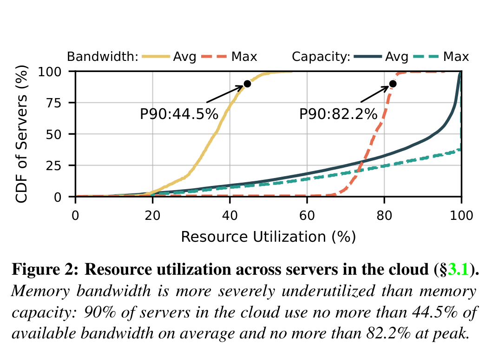

把需要 256 GB 容量、50 GB/s 带宽的服务，与需要 96 GB 容量、500 GB/s 带宽的作业放在同一插槽，从总量上看有可能；但共享通道会让前者承受后者的流量干扰。原文用这个例子解释为什么租户宁可买整插槽，形成空间过度预留。负载还要为峰值长期占住资源，形成时间过度预留（§3.2；PDF 第 4 页）。这是论文的动机模型，不是对所有云业务的普遍测量。

常见容量池化只回答“页放在哪里”，没有给 VM 稳定的通道带宽边界。硬件带宽节流靠插入等待，图 4 中带宽随节流参数并不线性变化；网络包调度则无法拦截已经映射到缓存一致性内存的 CPU load/store。RamRyder 因而选择重新安排物理通道的归属，而非只调整内存容量（§3.3；PDF 第 5 页）。

## 3. 核心抽象与系统设计

启动期，RamRyder 通过 BIOS/UEFI 关闭默认的跨 DIMM 通道交织，再按物理地址与容量识别每条通道的内存区。宿主保留 10 GB，其余区间作为每通道独立的 DAX（可直接映射的持久内存设备接口，在本文用于把通道内存交给用户态管理）设备；资源管理器以 128 MB 块分配。CXL 设备在当前实验平台上各含一条 DDR5 通道，因此可将一整个设备视为一个通道。这个前提依赖实际平台的物理地址映射，不能只靠客体的 NUMA 编号推断（§5.1–5.2；PDF 第 8–9 页）。

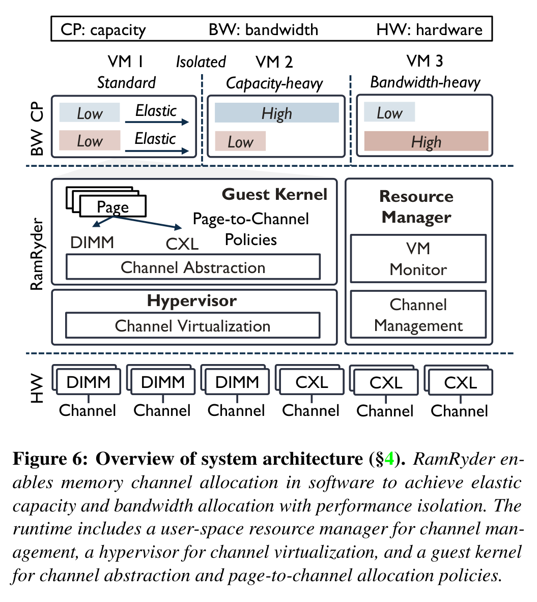

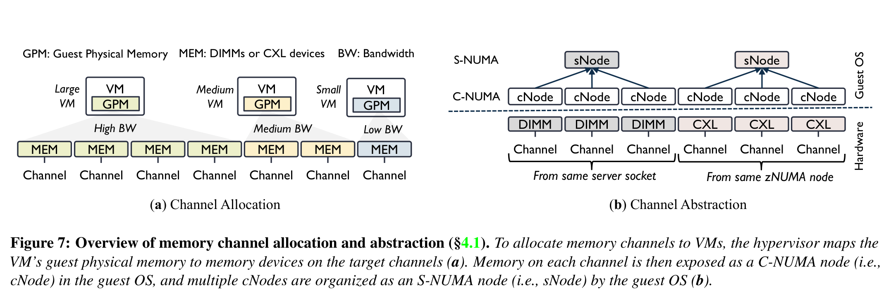

资源管理器选择通道和容量块；虚拟机监控器将目标物理区映射为客体物理内存，并通过 ACPI（固件向操作系统描述硬件拓扑的表）公布通道与插槽关系；客体内核构造 C-NUMA 和 S-NUMA，然后用页策略决定访问会落在哪条通道。用户应用仍主要看见服务器级 S-NUMA 节点。带宽扩张是否真正生效，取决于页是否已经分散到新增通道；“挂接完成”本身只表示控制面完成（图 7、9；PDF 第 6、8 页）。

论文设计的可用前提有三条：第一，通道数增加确实带来足够的额外带宽（图 5、18）；第二，页面级软件交织损失不能抵消通道隔离收益（图 19）；第三，末级缓存的争用需另行控制，否则通道隔离后仍有残余干扰（图 17）。这些是平台与工作负载相关的经验条件，不是硬件标准保证。

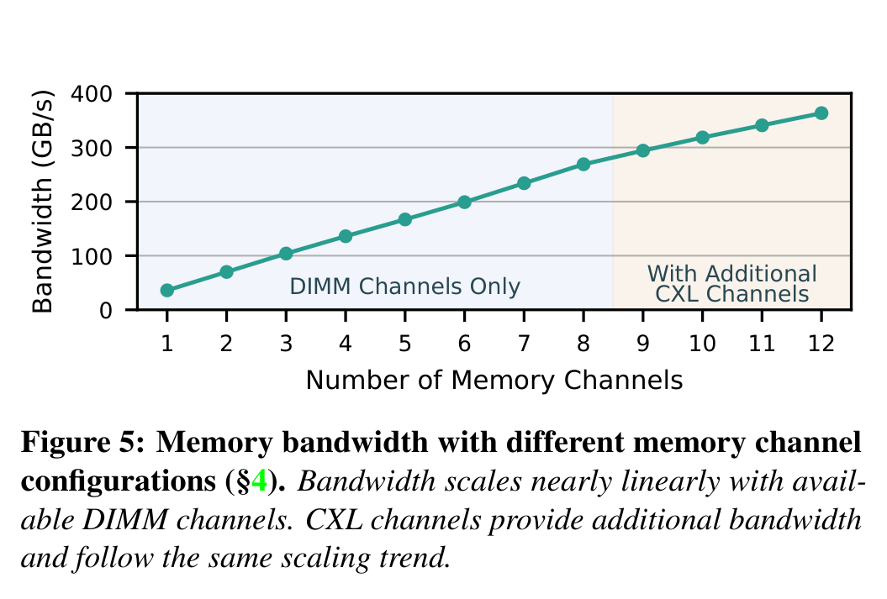

## 4. 关键技术实现与作用机理

### 4.1 按 VM 独占映射物理内存通道

#### 解决的问题

默认跨通道硬件交织让多个 VM 的请求进入同一组通道。较大 VM 的高并发访存会排队占用通道，较小在线 VM 虽有足够容量，访问延迟仍上升。只限定 CPU 或插入等待并不能把通道从邻居流量中分离（§3.2–3.3、§6.1）。

#### 核心方法

把物理通道的内存区按 VM 分配，由虚拟机监控器只映射目标通道；再将各 VM 的 vCPU 固定到不同芯粒的末级缓存域，避免另一层共享缓存争用。

#### 实现路径

1. 启动时关闭 DIMM 通道间的默认交织，识别并预留每条通道的物理区。
2. 资源管理器按 VM 申请分配通道与 128 MB 内存块；虚拟机监控器将块映射成客体物理内存。
3. 把 VM 的 vCPU 放到独立的末级缓存域；运行时监测通道用量，后续配额可再调整。

#### 资源 / 状态变化

共享的物理通道及 LLC（末级缓存）→ 按 VM 划分的通道和 LLC 域。通道归属是隔离边界；容量块仍可作为独立配额管理。

#### 为什么有效

访存请求最终必须通过具体通道。若竞争 VM 不再访问同一通道，它们无法在该通道队列里互相挤占；LLC 隔离消除额外缓存争用。论文图 17 显示两者各有作用，通道隔离作用更大。

#### 达到的优化效果

**直接效果**：压低共享通道造成的延迟增长。**端到端效果**：Redis 在论文的 YCSB（Yahoo! Cloud Serving Benchmark，键值存储负载集合）混部测试中，RamRyder 的 P99.99 延迟相对独占硬件基线增加不超过约 5%；这不代表所有请求或所有服务均有该保证（§6.2；PDF 第 11 页）。

#### 论文证据

图 12 的四 VM Intel MLC（内存带宽与延迟测量工具）实验显示，VM1 在共享基线下读负载最大带宽最多下降 41.2%、延迟最多上升 78.5%（相对独占硬件）；RamRyder 下 VM1 的延迟与独占基线相差不足 5%，相对共享基线最多降低 42.7%。图 17 的 Redis 消融把通道和 LLC 隔离拆开检验（PDF 第 10、12 页）。

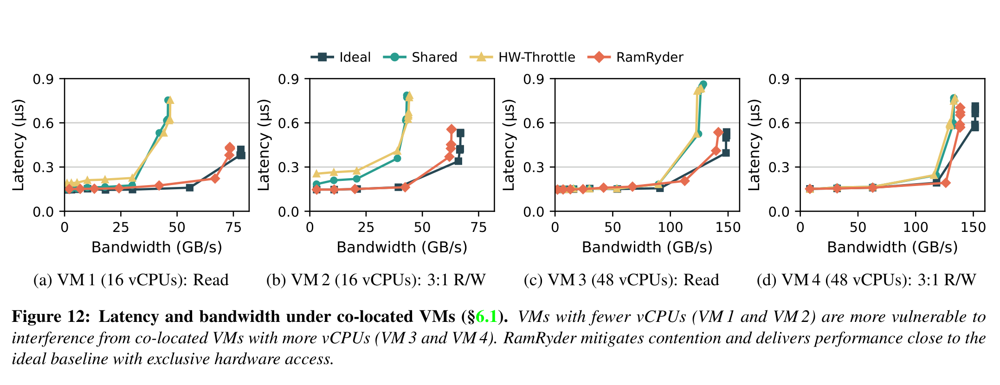

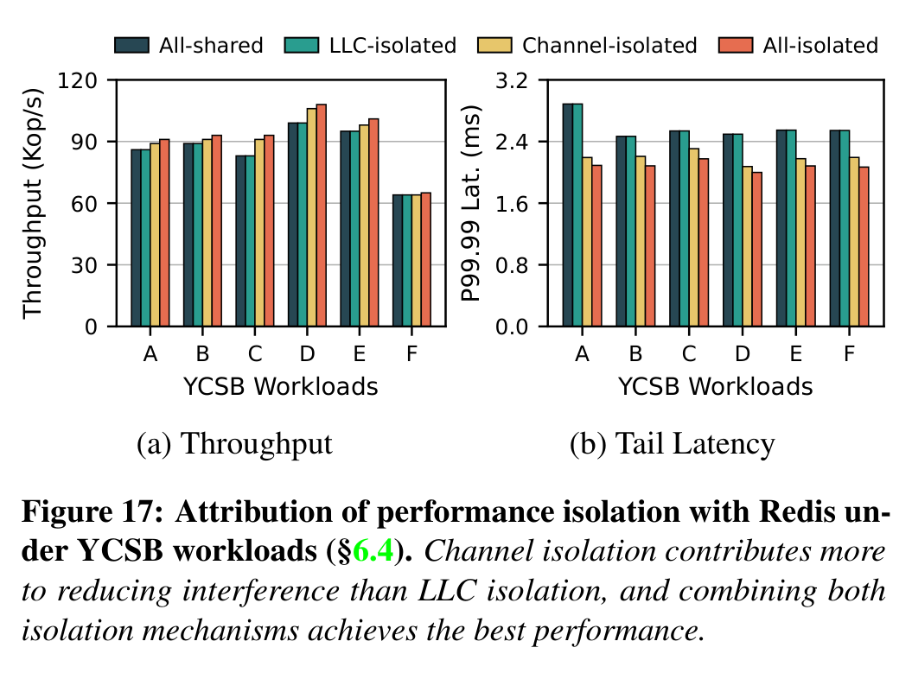

#### 亮点

带宽配额直接对应物理通道归属，并通过消融区分通道争用与缓存争用；这比单看总带宽更容易解释尾延迟变化。

#### 代价与局限

一条通道对小 VM 可能太粗；多 VM 若重新共用同一 CXL 通道，严格隔离边界就不再成立。客体内核和启动配置也需要配合。

#### 对项目的意义

**ADAPT**：借鉴“先找清楚实际共享的物理瓶颈，再给前台分配可验证的资源边界”。本项目需要在 NPU 显存、PCIe/CXL、网卡与 SSD 链路上实测可执行的隔离粒度，不能直接复制 CPU DIMM 通道分配。

### 4.2 客体两级 NUMA 页面交织

#### 解决的问题

关闭硬件全通道交织后，连续分配的页可能集中在某一通道。即使 VM 拥有多条通道，应用也可能只打到其中一条，损失并行带宽。

#### 核心方法

客体内核先按原服务器级 NUMA 规则选择 S-NUMA，再在其所属的 C-NUMA 节点间均匀交织页面。

#### 实现路径

1. 虚拟机监控器通过 ACPI 给每段客体内存附上通道及插槽/CXL 域信息。
2. 客体内核把单通道内存建成 C-NUMA，把同域 C-NUMA 归并为 S-NUMA。
3. 分配新页时先选 S-NUMA，再轮流选该域中的通道；应用继续按 S-NUMA 使用常规 NUMA 策略。

#### 资源 / 状态变化

硬件在细粒度物理地址上交织 → 客体在页面粒度选择通道。硬件并行性由软件页放置重新建立。

#### 为什么有效

多个通道有独立的数据通路；页散布到多条通道后，并发访问可并行服务。页面交织较硬件缓存行交织更粗，单线程或特定步长可能损失局部性。

#### 达到的优化效果

**直接效果**：已分配通道的带宽得以利用。**端到端效果**：论文未单独报告“两级抽象本身”对在线服务的独立贡献；图 19 量的是软件交织相对硬件交织的带宽代价。

#### 论文证据

在 128 vCPU、所有 DIMM 通道的 STREAM 对照中，128 线程软件交织平均带宽开销 3.6%、最大 4.4%；单线程平均 5.1%，2 KB 步长最大 7.4%（图 19；§6.4；PDF 第 13 页）。

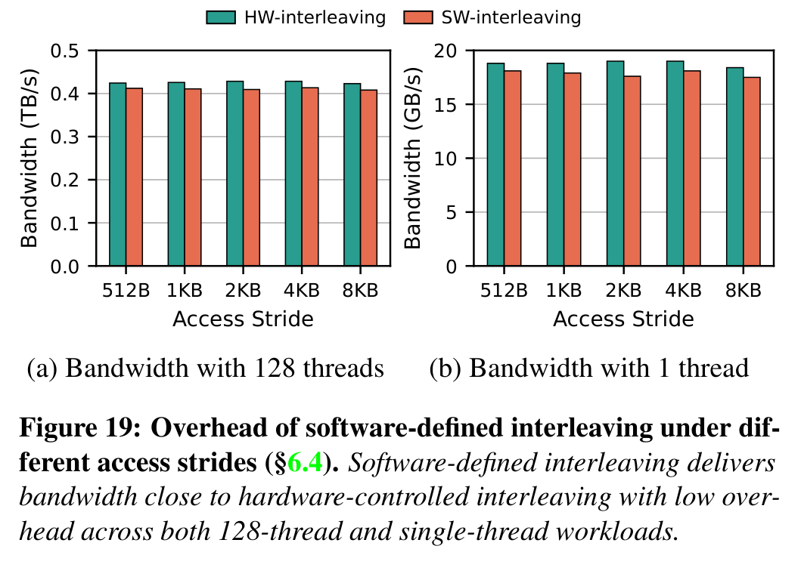

#### 亮点

把通道显式化，同时保留应用原有的服务器级 NUMA 视图，降低了应用接口改动范围。

#### 代价与局限

软件页粒度比硬件交织粗；页分布是否均匀还取决于分配历史、工作集访问模式和迁移收敛情况。

#### 对项目的意义

**ADAPT**：项目可借鉴“物理资源可见、上层接口保持稳定”的分层思想，但 KVCache 块布局和 DMA 描述符与 CPU 页表不同，必须重新设计放置单位与可见性协议。

### 4.3 按容量需求选 CXL 通道并放置冷页

#### 解决的问题

需要更多内存容量的 VM 未必需要同等比例的带宽。按照固定比例增加通道，会挤占其他 VM 可用的带宽资源。

#### 核心方法

优先选择仍有空闲容量的较少 CXL 通道，按所需容量映射内存，并用现有分层策略把冷页放到 CXL、热页留在本地 DIMM。

#### 实现路径

1. 资源管理器判断 VM 增加的是容量需求而非高带宽需求，选择可容纳它的 CXL 通道。
2. 把新增内存映射为单独的 S-NUMA 层；客体根据热度在 DIMM 与 CXL 间放置或迁移页。
3. 对互补 VM，可在同一 CXL 通道的剩余容量上混部，但两者共享该通道时需另看带宽约束。

#### 资源 / 状态变化

固定容量与带宽比例的扩张 → 利用既有 CXL 通道的空闲容量；高频页与低频页分别占据不同内存层。

#### 为什么有效

冷页访问少，放到 CXL 的较高访问代价对主要请求路径影响较小；容量扩张无需占用与容量成比例的新通道。这里的分层热页迁移借用了已有 Linux 策略，论文创新主要在通道选择与资源配比。

#### 达到的优化效果

**直接效果**：能以较少新增通道满足容量需求。**端到端效果**：混部下的 Memcached 吞吐与独占基线相近；尾延迟改善主要归因于 DIMM 通道隔离，而非独立证明“冷页分层”本身带来收益。

#### 论文证据

图 8(b) 是机制示意。§6.2 在 VM1/VM2 各加入 100 GB CXL 内存，用 Memcached/Redis 运行 6000 万键值对、每个 YCSB 负载 3000 万次操作；图 13 展示吞吐与 P99.99 延迟。共享基线的 Memcached 尾延迟在 YCSB-A、F 分别高 31.4%、27.2%；论文指出多数访问仍落在本地 DIMM（PDF 第 7、10–11 页）。

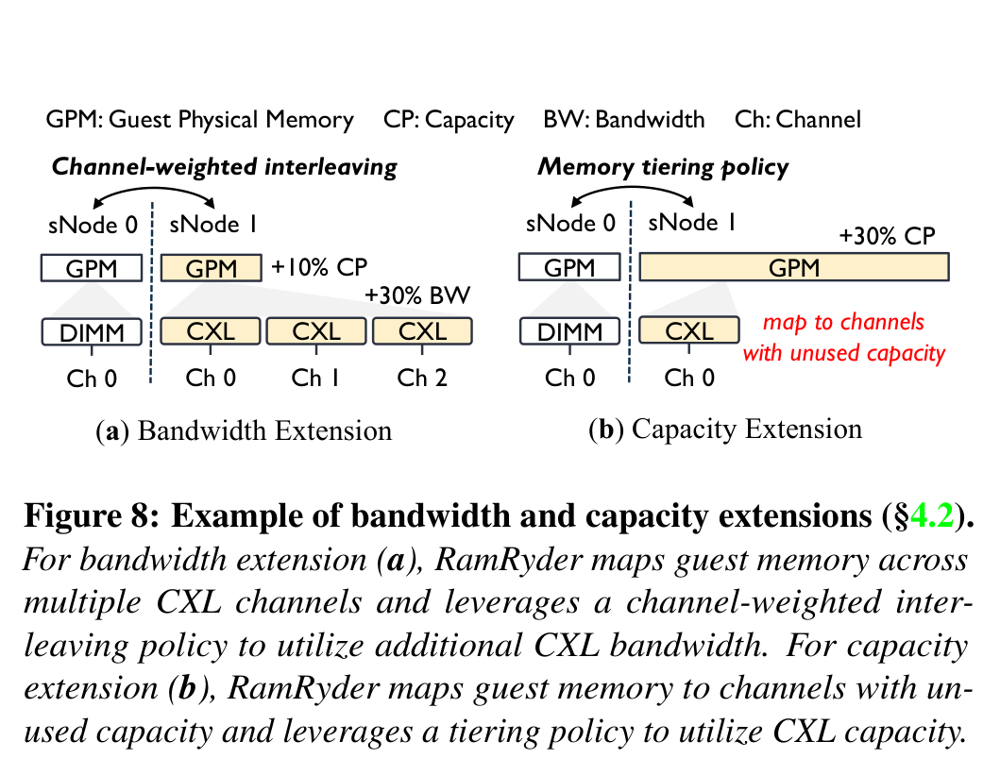

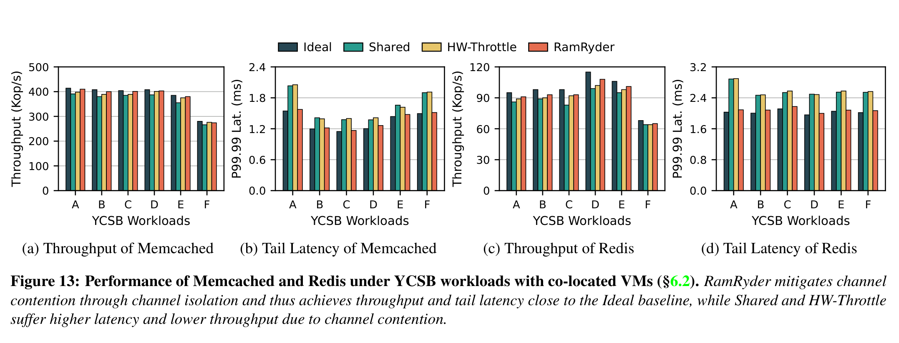

#### 亮点

把“多要内存”和“多要带宽”分别转成通道数、每通道占用量与页热度三个可控制变量。

#### 代价与局限

如果所谓冷页突然变热，CXL 通道可能变为新的瓶颈；论文没有给出对所有容量型负载都适用的热页识别准确率或长期共享通道隔离保证。

#### 对项目的意义

**ADAPT**：分清 KVCache 容量扩张与加载带宽扩张的目的。项目不能直接套用 CPU 热页分层，因为 KVCache 的消费通常按请求、层和块触发，需测量真实复用率、层间搬运和重新计算成本。

### 4.4 跨多个 CXL 通道分散页面并按带宽加权交织

#### 解决的问题

VM 可能只需少量新增内存，却需要更高的持续带宽。若新增页只落在一条 CXL 通道，受限的是通道带宽，不是容量。

#### 核心方法

把同一份新增客体容量分摊到多条 CXL 通道，并按 DIMM 域与 CXL 域的最大带宽比例跨层分配页面；域内仍均匀交织到各自通道。

#### 实现路径

1. 资源管理器按带宽需求选多个 CXL 通道，而不按新增容量同比选通道。
2. 虚拟机监控器将少量客体物理内存分散映射到这些通道。
3. 客体在 DIMM、CXL 两个 S-NUMA 域间按带宽权重发放新页，域内再交织；已有页在运行时需要迁移才能利用新通道。

#### 资源 / 状态变化

少量容量集中于单个 CXL 通道 → 同等容量覆盖多条通道；页面比例转为按各域可用带宽配置。

#### 为什么有效

多个通道可同时处理请求。图 5、18 在论文平台上观察到增加 DIMM 通道时带宽近似线性上升，加入 CXL 通道后也继续增加，但斜率较小。该收益仍受 CXL 链路、处理器访存并发和实际读写混合限制。

#### 达到的优化效果

**直接效果**：在不同比例增加容量的情况下扩张可服务的内存带宽。**端到端效果**：在 §6.2 的带宽型混部测试中，STREAM 吞吐和执行时间都与独占基线相差 5% 以内；图 14 同时包含通道隔离的贡献，不能单独归因给 CXL 加权交织。

#### 论文证据

图 8(a) 是放置示意；图 18 使用 128 vCPU、从单 DIMM 通道逐步加至 9 条 DIMM 与 4 条 CXL 通道的 Intel MLC 实测；图 14 是 STREAM 和图处理的混部表现。共享基线的 STREAM 吞吐比独占基线低 37.3%、执行时间高 58.8%；RamRyder 与独占基线差距在 5% 以内（§6.2、§6.4；PDF 第 11、13 页）。

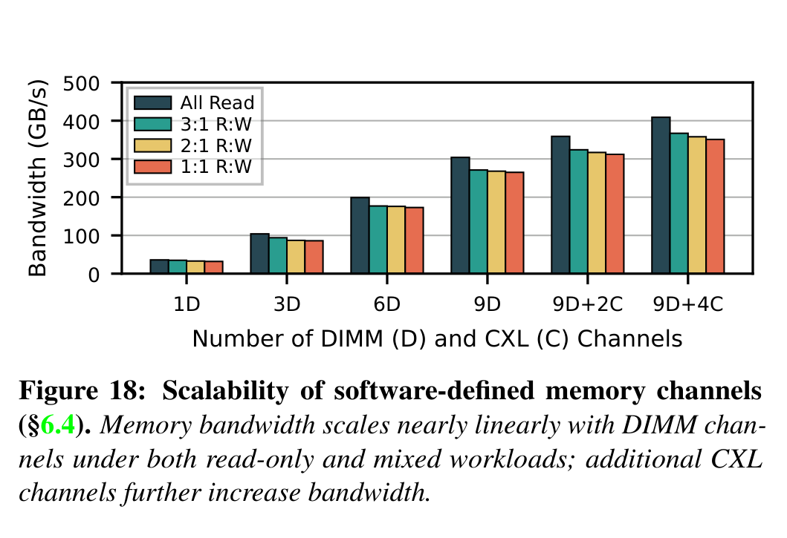

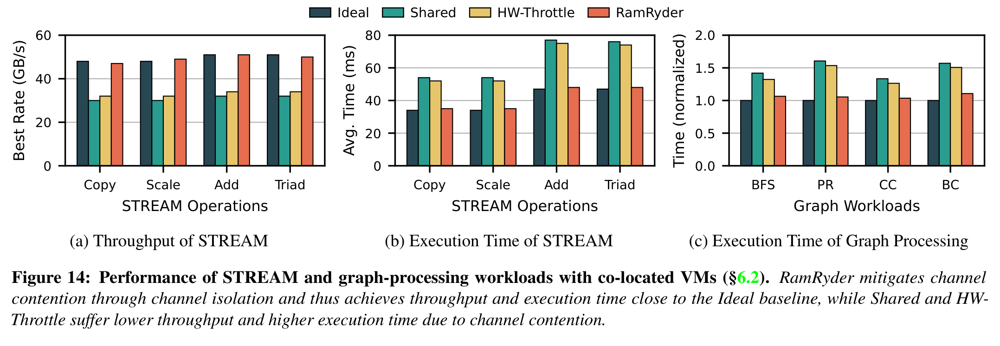

#### 亮点

容量与带宽的解耦被落实为不同的“通道覆盖面”，而不只是两项独立配额数字。

#### 代价与局限

跨层页放置仍会引入 CXL 访问延迟。§4.2 举例称 3 条各 36 GB/s 的 DIMM 通道与 1 条 27 GB/s 的 CXL 通道采用 8:3 页比例，但 108:27 按算术是 4:1；论文未解释额外修正因子，见附录的复现疑问。

#### 对项目的意义

**VALIDATE**：在项目硬件上先测每条链路的实际带宽、固定开销和混压下可用带宽，再决定 KVCache 块是否应跨设备分散；不沿用论文的页比例或单机 CXL 数值。

### 4.5 通道热插拔与按访问惰性迁页

#### 解决的问题

VM 带宽需求会随时间变。新增通道只增加了可寻址内存，原有热点页仍在旧通道上，真实可用带宽不会在热插拔结束时立刻上升。

#### 核心方法

按监测阈值挂接或回收 CXL 通道；增带宽时先建新通道节点，对旧页清 present 位，让后续访问触发缺页和迁移，最后回收等量旧内存块，使总容量保持不变。

#### 实现路径

1. 每秒读取归属 VM 的处理器性能计数器；使用率超过高阈值（示例 80%）时申请通道，低于低阈值（示例 40%）持续数秒时回收。
2. 若原容量为 X、原有 N 条通道，为新增通道挂接约 X/(N+1) 的客体内存，并建立新的 C-NUMA 节点。
3. 对已分配页清页表 present 位；页被再次访问时重新计算落点，把需要迁移的页移往新通道。
4. 从旧通道回收等量内存块；缩容时按反向流程迁回，并对回收路径采用即时迁移。

#### 资源 / 状态变化

固定通道数 → 动态通道数；控制面挂接完成 → 页分布逐步收敛 → 额外带宽实际可用。容量总量在流程完成后维持不变，迁移期间存在暂态。

#### 为什么有效

只有页落在新增通道，后续访问才能分担旧通道负载。按访问迁移先处理活跃页，避免一次性迁完整工作集；代价是短时突发可能在下一次监测与迁移完成前结束。

#### 达到的优化效果

**直接效果**：对持续增长的需求补带宽，并避免迁页造成明显的瞬时延迟尖峰。**端到端效果**：论文仅在 Intel MLC 10 GB 工作集与高动态生成负载上检验了收敛和跟踪，未证明在线服务 P99/P99.99 在热插拔全周期均稳定。

#### 论文证据

图 20 中带宽从 38 GB/s 增至 68 GB/s 用 2.2 秒，约 40% 页迁移，论文报告 1.82 GB/s 迁移速率；回收用 1.1 秒。图 21 的高动态负载与过量预留全部通道的 Ideal 基线比较，显示短突发会漏掉且其他变化也有滞后（§6.4；PDF 第 13 页）。

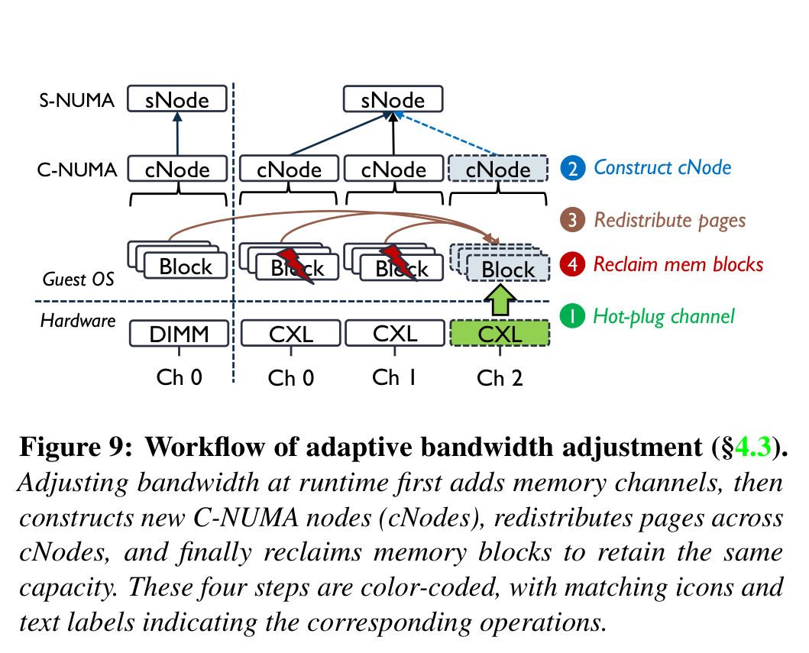

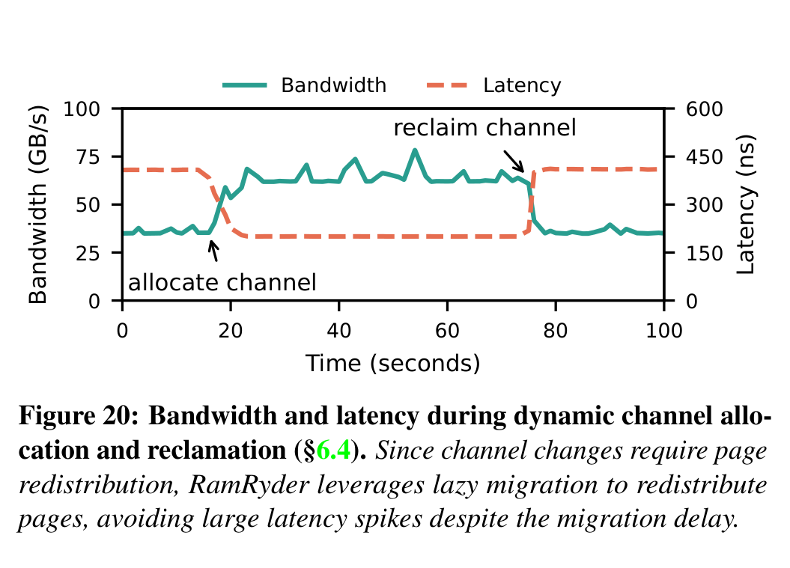

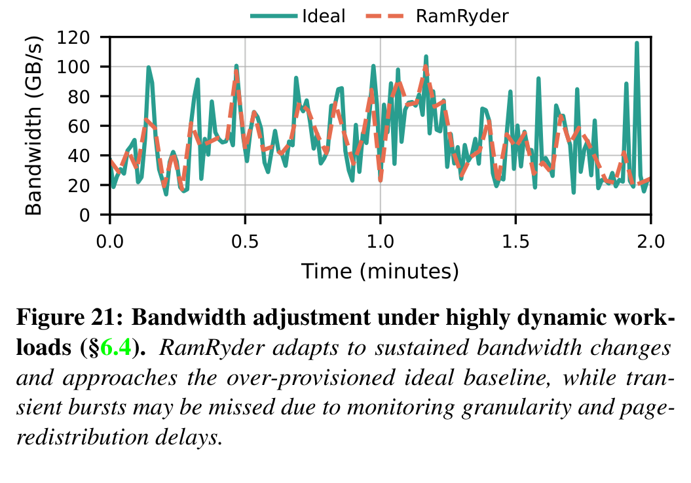

#### 亮点

明确区分通道已挂接与页面已迁移两种完成状态；这使弹性配额的生效时间可以测量。

#### 代价与局限

秒级采样和迁页适合持续变化，对微秒至毫秒级突发无力。清 present 位还会增加相关页的缺页处理开销；论文对长时间在线服务混压的迁移尾延迟覆盖有限。

#### 对项目的意义

**ADAPT**：本项目调度中也需区分“控制命令已提交”“数据已到达目标介质”“前台可安全消费”三个事件，并量测重放、迁移或预取的实际收敛时间；不能将这套 CPU 页故障机制直接用于 NPU KVCache。

## 5. 实验到底证明了什么

原型硬件为 AMD EPYC Zen 5、每插槽 12 条 DDR5 通道；评测使用其中一个插槽的 8 条 32 GB DIMM 通道及 4 个各 256 GB 的 CXL 2.0 设备，系统为 Linux 6.15。四个 VM 分别为两个 16 vCPU/32 GB、两个 48 vCPU/96 GB，初始 DIMM 通道数为 1、1、3、3；各 VM 的 CPU 被固定到不同末级缓存域。主要对照是独占硬件的 Ideal、共同使用通道的 Shared 和在 Shared 上加硬件节流的 HW-Throttle。Ideal 是性能参照，不是同等硬件占用成本的混部方案（§6；PDF 第 9 页）。

| 论断 | 实验 / 证据 | 条件与基线 | 结果 | 能证明什么 | 不能证明什么 |
|---|---|---|---|---|---|
| 带宽存在可回收空间 | 云追踪图 2–3 | 数千物理节点的容量、带宽、CPU 轨迹 | 90% 服务器平均带宽利用率 ≤44.5%；单机三种利用率变化不同步 | 容量配额不足以代表带宽状态 | 所有云集群都有同一比例的空闲带宽 |
| 通道是可用的分配单位 | 图 5、18 的 Intel MLC | 在论文平台逐步增加 DIMM，再增加 CXL 通道；多种读写比例 | DIMM 通道数与带宽近似线性；CXL 继续增带宽但斜率较低 | 按通道增加可用带宽在该平台成立 | 任何 CXL 设备、拓扑和工作负载都线性扩展 |
| 隔离优于节流 | 图 12、17 | 四 VM 混部，Ideal/Shared/HW-Throttle/RamRyder；Redis 隔离消融 | 小 VM 的读负载延迟接近 Ideal；通道隔离贡献大于单独 LLC 隔离 | 通道共享是此配置的主要干扰因素 | LLC、CPU、CXL 链路等其他干扰已普遍消除 |
| 服务负载尾延迟受益 | 图 13 | 各 100 GB CXL 容量扩展；Memcached/Redis、YCSB，统计 P99.99 | RamRyder 的 Redis 尾延迟与 Ideal 差距不超过 5%；共享配置明显更差 | 在给定键值负载与混部模式下可维持较好尾延迟 | KVCache 推理的首字延迟或每字延迟有相同改善 |
| 高带宽应用受益 | 图 14 | STREAM 及 6700 万节点、13 亿无向边的图处理；同一混部基线 | STREAM 吞吐和执行时间与 Ideal 差距 ≤5%；图处理相对 Shared 缩短 25.2% | 通道隔离在带宽型作业上有收益 | 收益可单独归因于加权 CXL 页面交织 |
| 软件页交织代价有限 | 图 19 | 128 vCPU VM，STREAM，所有 DIMM 通道；对照硬件交织 | 128 线程平均开销 3.6%，单线程平均 5.1% | 软件页交织未在该微基准中抹平通道收益 | 任意随机访问、页尺寸或单线程负载开销都小 |
| 集群资源利用率可改善 | 图 15 | 云追踪中配对服务器，逐时间戳检查合并需求均不越过硬件上限，再计算利用率 | P30 容量平均/峰值提升 28.6%/22.1%；P90 带宽平均/峰值提升 43.2%/26.1% | 轨迹中有可配对的互补需求 | 已在真实云集群部署并测得这些提升；合并成本与性能已由轨迹证明 |
| 运行时弹性有生效延迟 | 图 20–21 | 单 VM 10 GB Intel MLC 工作集；高动态生成负载与过量预留 Ideal 对照 | 增通道后 2.2 秒达到 68 GB/s；短突发可能漏掉 | 控制面完成与带宽生效有不同时间尺度 | 能响应毫秒级突发或保证所有应用尾延迟无尖峰 |

图 15 的集群数字是“追踪数据筛选兼容配对后的利用率计算”；图 16 则只对选出的一个服务器对做单机请求回放。两种证据均不同于线上大规模调度部署。容量与带宽百分比也取自不同分位点，不应合并为一个“平均整集群提升”数字（§6.3；PDF 第 12 页）。

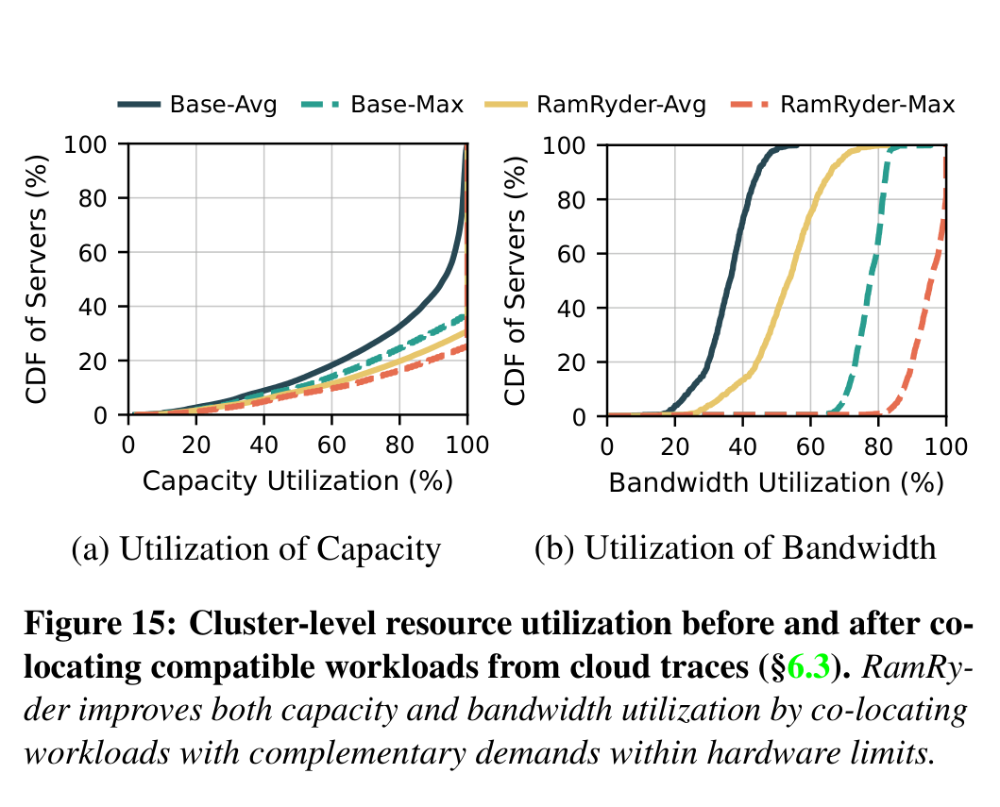

## 6. 论文的亮点与局限

### 6.1 让带宽配额对应物理通道

**亮点**：通道分配给出了可观测的物理资源边界，图 17 又用消融检验其与 LLC 隔离的相对作用。**局限**：通道数有限；小 VM 若小于一条通道仍需共享，严格隔离随之弱化（§7；PDF 第 14 页）。

### 6.2 用两级 NUMA 保持应用接口

**亮点**：客体能控制通道落点，而应用仍使用服务器级 NUMA 概念。**局限**：这是修改后的客体内核能力；页级交织与硬件细粒度交织在单线程、特定步长上有测得的性能差距（图 19）。

### 6.3 将 CXL 容量和带宽作为不同诉求处理

**亮点**：容量型 VM 可以用通道剩余空间；带宽型 VM 可用少量容量覆盖多条通道。**局限**：两者不是无条件独立；通道的总容量与总带宽仍是有限资源，混部时会重新出现共享争用，论文也用“mostly independently”限定了主张（§4.2；PDF 第 7 页）。

### 6.4 运行时调整区分挂接与收敛

**亮点**：图 20 把微秒级热插拔和秒级页重分布区分开。**局限**：1 秒监测周期加迁页时间使短突发可能完全错过；在线服务在迁页全周期的极端尾延迟需要更直接的证据（§6.4–7；PDF 第 13–14 页）。

## 7. 论文没有解决什么

第一，原型没有实现多主机共享 CXL 内存池；§7 只描述由一个主机担任资源管理器、其他主机通过 RPC 请求的可能扩展，尚无多主机一致性、故障切换或争用评测（PDF 第 14 页）。

第二，当前 CXL 设备一设备一 DDR5 通道的前提可能随着多通道设备失效。若设备内部再次隐藏交织，软件看到的“一个设备”未必等于一个可隔离通道（§7；PDF 第 14 页）。

第三，报告未给出面向毫秒级突发的带宽保证，也未展示复杂在线服务与后台页迁移同时发生时的长期尾延迟分布。图 20 的平滑曲线来自特定 Intel MLC 工作集，不能替代业务 SLO（服务时延目标）验证。

第四，§4.2 的加权页比例示例存在算术或隐含参数未交代的问题：3×36 GB/s 与 1×27 GB/s 的比值为 4:1，原文却写 8:3。此处不影响“多通道可增加带宽”的单机实测，但影响按论文数值复现该权重策略。

## 8. 对本项目的启发

### DIRECTLY ADOPT

直接采纳“容量、带宽、时延分别度量”的资源观测原则，以及“控制命令完成不等于数据路径已经生效”的状态区分。对 KVCache 存储池，应分别看可存块数、可持续搬运带宽、前台实际消费时延和混压下尾延迟。

### ADAPT

把论文“先确认物理争用点，再建立可执行的隔离边界”的方法改造成项目的硬件 QoS（Quality of Service，前后台流量的服务质量控制）、总线优先级和拥塞控制实验。论文的 DIMM 通道与本项目的 NPU 显存、网卡、NVMe 路径不是同一资源，隔离单元要依实际拓扑确定。把“页迁移后才有带宽”的判断改写为“KVCache 块搬运、映射及租约校验后才可消费”的状态机，并对每一步计时。

### DO NOT COPY

不复制客体 CPU 页表清 present 位的惰性迁移机制；NPU KVCache 的访问由推理运行时和 DMA 路径控制，不能假设 CPU 缺页能拦截与恢复所有设备访问。不把按 1 秒周期扩带宽的策略用于首字时延或单次请求的微秒级选路，也不把论文的 8:3 权重当作可复用参数。

### VALIDATE

验证本项目各实际链路是否存在“增加独立物理单元便增加可用带宽”的区间；在后台满载 I/O 下分别测前台首字延迟（TTFT，即从请求到首个 Token 输出的时间）和每字生成耗时（TPOT，即两个输出 Token 之间的平均耗时）。还要测容量型缓存和带宽型加载任务混部时，是否真能互补而不触发新瓶颈。

## 9. 对本项目立项的背书

### 9.1 Problem Validation

**论文事实与追踪数据**：云服务器可能出现容量与带宽使用不一致、共享物理通道使尾延迟恶化的问题（图 2、12、17）。这支持本项目在异构 KVCache 存储与调度设计中独立管理“存得下”和“拉得动”的必要性；证据范围是云 VM 内存系统，不是 NPU KVCache 集群。

### 9.2 Mechanism Validation

**单机原型实测**：显式物理资源归属、按带宽放置数据和用消融定位争用源，在本文硬件上有效（图 12、17–19）。与本项目共有的原则是让调度器看见真实带宽边界并把数据落到合适的物理路径。论文未检验 UBMEM（统一总线内存直通共享协议，用于跨节点和异构设备共享地址空间）、URMA（通用远程直接内存访问接口）或 NPU DMA 的实现。

### 9.3 Research-Gap Validation

论文的在线决策以秒为单位，且只针对单服务器 CPU 内存页。项目计划研究的异构 KVCache 块在显存、总线、网络与 SSD 间的微秒级加载/重算选路、语义一致性、多卡同步与前后台混压，仍需独立的系统设计和实验。差异来自目标资源、数据对象和时间尺度的不同，不能仅凭“论文未做”宣称本项目性能领先。

### 9.4 Unsupported Project Claims

论文不证明 Host CPU 零数据拷贝（CPU 只下发控制指令、正文载荷不经过主机 CPU 内存拷贝）、跨节点远端直读、NVMe 到 NPU 显存直达、KVCache 六维语义校验或张量并行多卡同步能达到项目目标；也不证明项目 E3（前台在线推理与后台满载 I/O 的全链路混压验证阶段）的 TTFT、QPS（每秒有效请求数）和 TPOT 门限已满足。上述均属项目待实测的目标。

### 9.5 Project Establishment Verdict

- **Necessity evidence**：容量和带宽失配与共享争用有追踪数据及单机实测支持。
- **Feasibility evidence**：论文平台上，软件显式管理物理通道并控制页落点可行。
- **Differentiation evidence**：异构 KVCache 数据路径、语义安全和微秒级在线决策不在论文解法之内。
- **Remaining burden of proof**：本项目需在目标硬件上完成端到端加载收益、尾延迟隔离、故障回退及多卡一致性的实测闭环。

## 10. 建议验证

### Experiment 1: 异构链路的资源边界与带宽可加性

- **Hypothesis**：为 KVCache 加入一条独立链路或通道时，可持续加载带宽会增加，且不显著损伤前台推理。
- **Variable**：链路数量、目标介质、块大小、并发度与读写混合。
- **Baseline**：单链路传输；同等总带宽但共享物理队列的配置。
- **Metric**：有效载荷吞吐、P50/P99 加载时延、前台 TTFT/TPOT、CPU 正文数据拷贝量。
- **Controlled conditions**：固定模型、上下文长度、KVCache 命中率、块布局、NPU 利用率和总请求率。
- **Pass condition**：新增物理资源带来可重复的净带宽收益，同时前台 P99 不越过项目 SLO；实际门限应在项目测试计划中按业务要求给定。
- **Fail implication**：若带宽不随资源数增加，先排查共享根端口、交换结构或调度提交瓶颈，不按资源数量作静态配额。
- **Decision affected**：是否采用显式物理资源分区，以及带宽模型的粒度。

### Experiment 2: 容量型缓存与带宽型加载混部

- **Hypothesis**：冷 KVCache 容量占用和短时高带宽加载存在可利用的互补区间。
- **Variable**：冷数据占用率、加载并发、冷热转移速率、前后台优先级。
- **Baseline**：独占资源、无分层共享、仅按容量分配三种配置。
- **Metric**：有效命中后的净 TTFT 收益、TPOT 干扰、介质队列长度、负载回退次数和每请求总搬运字节。
- **Controlled conditions**：固定请求轨迹、模型/词表/模板、缓存内容、硬件拓扑和总容量。
- **Pass condition**：容量利用率提高时仍保住前台 SLO，且加载与重算相比保持明确净收益。
- **Fail implication**：若混部带来持续尾延迟损失，应缩小共享边界或给后台搬运硬限速。
- **Decision affected**：分层存储与硬件 QoS 的组合方式。

### Experiment 3: 调度生效时间与突发回退

- **Hypothesis**：从决定扩容或换路到 KVCache 可安全消费的全过程能被拆成可观测阶段，短突发可回退到本地重算。
- **Variable**：突发持续时间、迁移/预取块量、链路拥塞与远端租约状态。
- **Baseline**：静态预留全部带宽；只以控制命令完成作“可用”判断的实现。
- **Metric**：决定耗时、载荷到达耗时、可消费时间、回退成功率、TTFT/TPOT P99。
- **Controlled conditions**：固定模型、请求轨迹、缓存命中和故障注入时点。
- **Pass condition**：每次消费均在数据到达及语义/租约校验后发生；当加载总开销高于本地重算时及时回退，且无错误消费。
- **Fail implication**：若短突发下调度收益抵不过生效延迟，缩小动态路径适用范围或提前预取。
- **Decision affected**：动态选路准入条件与回退状态机。

## Appendix：证据边界与复现记录

### A. 数值及基线核对

原文摘要写“平均容量和带宽利用率提高 28.6% 与 43.2%”，§6.3 进一步限定为追踪数据配对计算中，容量平均利用率在 P30 提高 28.6%，带宽平均利用率在 P90 提高 43.2%；另有容量/带宽峰值利用率在相应分位点提高 22.1%/26.1%。因此正文均使用 §6.3 的限定条件（PDF 第 2、12 页）。

§4.2 写 3 条 DIMM 通道各 36 GB/s、1 条 CXL 通道 27 GB/s，却称按总带宽得到 S-NUMA 间 8:3 的页分配比例。按列出的数值计算是 `3×36 : 1×27 = 108:27 = 4:1`。本文不能判定是数值、比例还是未说明的有效带宽修正存在遗漏；复现时应以目标机器实测带宽重新计算，并将该处列为开放问题（PDF 第 7 页）。

### B. 图像来源

图 2、5–9、12–15、17–21 均是从该论文 PDF 第 4–8、10–13 页逐图裁切的原图，按原论文图号保存于 `figures/ramryder_v03/`。Markdown 中的中文替代文字是本报告说明，图内英文及原始图注保持论文原貌。除本报告外没有生成其他格式的解构文稿。
