# RamRyder 论文解构与项目启示（V04）

> 原文：Yanbo Zhou 等，*Break on Through to the Other Side: Pooling Memory Elastically with RamRyder*，OSDI 2026。本文只以本目录的原论文 PDF 为论文事实来源；图像直接裁自该 PDF。PDF 第 1 页是会议封面，下文同时给出论文印刷页码和 PDF 页码。项目映射依据本仓库的《KVC存储池构建方案设计_V1.0.md》，属于本报告的分析判断，不是论文作者的结论。

## 1. 一页读懂论文

### 1.1 论文解决什么问题？

云虚拟机可以按 CPU、磁盘和网络需求选择资源，内存却通常按容量与虚拟 CPU 的固定比例分配，带宽没有独立的可分配单位。对需要稳定尾延迟的租户，独占整个 CPU 插槽往往比与别的虚拟机共享内存通道更稳妥，于是容量、带宽和 CPU 一起被闲置。RamRyder 试图让虚拟机按需取得内存通道，在同机共址时仍保持接近独占硬件的性能，并随负载变化调整通道数。（论文 §1、§3，印刷页 95–98；PDF 页 2–5）

### 1.2 根因是什么？

表面是内存带宽利用率低；根因是默认的硬件交织把物理地址分散到同一插槽的所有通道，虚拟机即使只需少量带宽，仍会与其他虚拟机争用这些通道。现有容量池化主要移动“多少字节”，硬件节流主要延迟 CPU 请求，都没有把可隔离的物理通道交给资源管理器直接分配。容量与带宽的时间变化还不同步，固定配额只能按峰值预留。（§2.2、§3）

### 1.3 核心洞察是什么？

内存带宽在论文测试平台上随可用通道数近似增长，而多租户干扰主要来自通道共享。因此，可以在启动时把通道划成可识别的物理地址区，再由宿主机、虚拟机管理器和客户机内核共同控制“页落在哪条通道”；通道数控制可获得的带宽，页的放置决定这份带宽能否真正用上。（§4；图 5、图 17）

### 1.4 核心抽象是什么？

RamRyder 把一条物理内存通道暴露为客户机中的 C-NUMA 节点（Channel-NUMA，即按物理内存通道划分的 NUMA 节点；NUMA 指按访问拓扑划分的内存节点），再把同一 CPU 插槽或同一 CXL 设备域中的这些节点归为 S-NUMA 节点（Server-NUMA，即保留服务器原有层级关系的 NUMA 节点）。资源管理器按通道分配物理内存，虚拟机管理器建立映射，客户机内核按页选择通道。CXL（Compute Express Link，连接 CPU 与扩展内存设备的互联标准）在这里提供可追加的容量和带宽；论文所说“两者大体独立”，并不意味着物理通道的容量与带宽可以无限拆开。（§4.1–§4.2；图 6–8）

### 1.5 关键优化方法速览

#### 方法一：划分通道并按页放置，实现虚拟机带宽分配与隔离

- 问题：默认硬件交织使共址虚拟机争用全部通道。
- 方法：启动时划分物理通道；给虚拟机映射专属通道；客户机按页在获配通道间交织，并把虚拟 CPU 固定到独立末级缓存域。
- 效果：把共享通道竞争改为通道级资源所有权，虚拟机可获得接近独占场景的带宽和尾延迟。
- 关键证据：图 12 的四虚拟机共址微基准、图 17 的通道与末级缓存隔离消融。（§6.1、§6.4）

#### 方法二：按容量与带宽需求选择 CXL 通道，并跨层加权放置

- 问题：只增加 CXL 容量，未必能给带宽密集型虚拟机更多可用带宽；只按本地页策略放置也可能使新增通道空闲。
- 方法：用通道数与映射容量共同决定扩展配额；需要带宽时将页分布到更多 CXL 通道，跨 DIMM（插在 CPU 内存通道上的内存模块）与 CXL 按各层峰值带宽加权选页。
- 效果：把“扩多少字节”和“可用几条通道”分开决策，利用容量与带宽需求互补的负载。
- 关键证据：图 5、图 8、图 18 分别给出通道带宽规律、两种放置方式和可扩展性。（§4.2、§6.4）

#### 方法三：通道热插拔与页重分布，实现运行期带宽伸缩

- 问题：给已有虚拟机新增通道后，旧页仍在原通道，控制面已分配的带宽不会立刻变成数据面的有效带宽。
- 方法：监测用量后热插通道，建立新的 C-NUMA 节点，以缺页触发懒迁移把旧页分散到新通道，再从旧通道回收等量容量；缩容时反向操作。
- 效果：总容量可保持不变而带宽逐步变化；主要代价转为页迁移时间与迁移期访问开销。
- 关键证据：图 9、图 20、图 21；新增通道后的有效带宽爬升用了数秒，极短突发仍可能错过。（§4.3、§6.4）

### 1.6 最重要的实验结果是什么？

论文使用 AMD EPYC Zen 5、DDR5 DIMM 与四台 CXL 2.0 设备，在同一服务器上运行四台虚拟机。（§6，印刷页 102；PDF 页 9）通道数增加时峰值带宽近似增长，这是整套方案成立的前提，而不是论文的端到端收益。四机共址的 MLC（Memory Latency Checker，测量内存带宽和访问延迟的微基准）实验中，共享配置下小虚拟机相对独占配置的最高带宽下降最多 41.2%、访问延迟上升最多 78.5%；RamRyder 将该虚拟机延迟控制在独占配置的 5% 以内，并相对共享配置最多降低 42.7%。（图 12，§6.1）图 17 的消融显示，通道隔离比仅隔离末级缓存更能减少 Redis 尾延迟干扰。

集群收益的证据口径不同：图 15 先用云端轨迹筛选每一时间点容量、带宽合计均未越过硬件上限的服务器配对，再计算利用率分布。正文报告的是 P30 处平均容量利用率改善 28.6%，以及 P90 处平均带宽利用率改善 43.2%；它们不是整座数据中心上线后的实测平均增幅。（§6.3，印刷页 105；PDF 页 12）

### 1.7 最大局限是什么？

通道是粗粒度资源，小虚拟机可能用不满一条；性能隔离还依赖独立末级缓存域。CXL 扩展部分是尽力而为资源，且论文原型只在单机上实现。带宽监测以秒为周期，旧页重分布也需要时间，所以它适合持续或缓慢增长的需求，无法保证短突发即时得到带宽。部署还需要 BIOS/UEFI 通道划分、宿主侧资源管理、QEMU 修改和客户机内核修改。（§5、§7）

### 1.8 为什么与本项目相关？

必要性证据是“只统计可用缓存容量，可能漏掉共享通道与尾延迟瓶颈”；可行性证据是“把真实物理带宽边界暴露给调度器，能在特定 CPU/CXL 平台改善共址干扰”。本项目的差异化空间在大模型注意力键值缓存 KVCache（保存历史 Key/Value 激活状态以避免重复计算）对象语义、异构设备数据通路和推理请求时限，论文均未覆盖。剩余证明责任是：国产 AI 硬件上的真实通路是否具备类似可控边界，以及资源隔离能否改善首 Token 延迟 TTFT（Time To First Token，首 Token 响应时间）和每 Token 耗时 TPOT（Time Per Output Token，逐 Token 生成耗时），同时满足 Host CPU 零数据拷贝（CPU 只负责控制指令，不搬运 KVCache 正文数据）的项目目标。

## 2. 为什么这个问题值得解决

论文分析来自一家大型云厂商、跨数千物理节点的轨迹。图 2 中，90% 服务器的平均带宽利用率不超过 44.5%，峰值带宽利用率不超过 82.2%；容量的分布明显不同，55.4% 服务器的平均及最大容量利用率都超过 90%。图 3 的单服务器时间曲线显示，容量、带宽和 CPU 的峰谷并不一起出现。这是“容量和带宽分开管理”值得尝试的工作负载观察，而不是保证任何两台服务器都能合并的证据。（§3.1，印刷页 97；PDF 页 4）

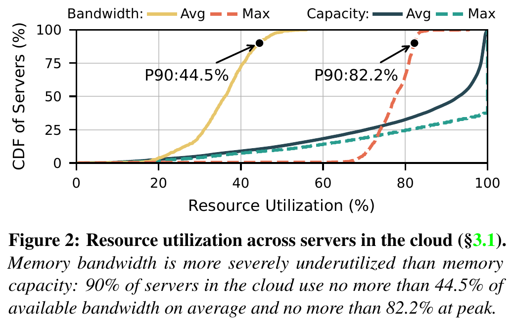

空间过量预留来自隔离诉求：敏感租户通过占用整个 CPU 插槽避免通道与缓存争用，哪怕用不到全部容量。时间过量预留来自资源在虚拟机生命周期内固定：用户按带宽峰值购买规格，平时就有闲置。论文中的 48 核、256 GB、50 GB/s 服务与 48 核、96 GB、500 GB/s 作业共址例子是说明机制的假设情景，不能当作真实轨迹样本。（§3.2）

现有 CXL 容量池化可以缓解“字节不够或字节闲置”，却未必给出稳定的通道带宽。硬件带宽节流通过延迟 CPU 请求间接限制吞吐，图 4 在该实验配置下呈非线性，且应用测试中的硬件节流未消除共址干扰。通过限制核心数、频率或末级缓存来间接控制带宽，又会影响别的虚拟机资源。因此，论文选择重新定义带宽的分配单位，而非再调一个节流参数。（§3.3；图 4）

## 3. 核心抽象与系统设计

默认状态下，插槽的物理地址被硬件交织到多条 DIMM 通道。RamRyder 在 BIOS/UEFI 中关闭这种跨通道交织，识别每条通道对应的物理地址段，并将其作为独立 DAX 区域交给宿主资源管理器；DAX 在此是按物理内存区域提供直接映射的设备接口。虚拟机管理器从获配通道取内存块，客户机内核才能把“页放在哪条通道”变成可执行策略。启动期物理通道划分是前提条件；通道一旦仍被硬件混合交织，仅在软件里标记通道归属不能实现隔离。（§5.1，印刷页 101；PDF 页 8）

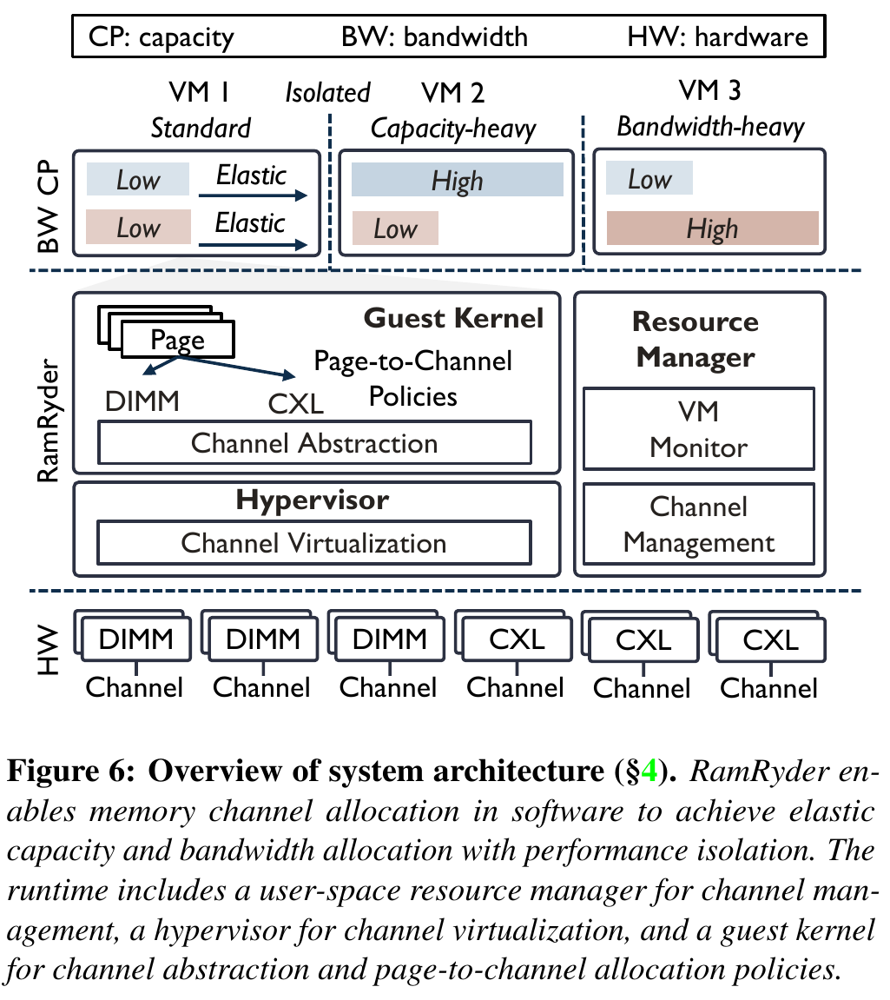

在虚拟机内部，C-NUMA 保留每条物理通道的可选位置，S-NUMA 让应用仍看到原有的插槽或 CXL 层级。分配页时先按服务器层级选 S-NUMA，再在其中的 C-NUMA 节点间按页交织。后者把软件控制从传统的虚拟页映射延伸到物理内存通道利用；与硬件可能采用缓存行级、256 B 至 4 KB 等交织粒度相比，软件按页布局的粒度和局部性可能不同。图 19 单独检验了这笔代价。（§2.2、§4.1、§6.4）

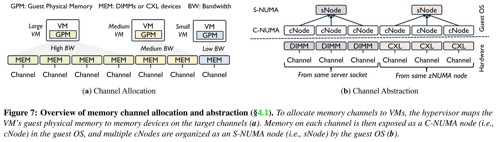

论文成立依赖三项条件。第一，可用通道增多必须带来可观测带宽增益；图 5 与图 18 在该平台和测试流量下支持这一点。第二，共址干扰必须主要发生在可以隔离的通道，而不能全部转移到共享末级缓存或其他瓶颈；图 17 表明通道隔离是 Redis 场景的主要贡献，但两种隔离合用最好。第三，页级软件交织的损失必须小于隔离和弹性调度收益；图 19 显示多线程平均开销 3.6%，单线程平均 5.1%，支持论文测试范围内的可行性。（§6.4）

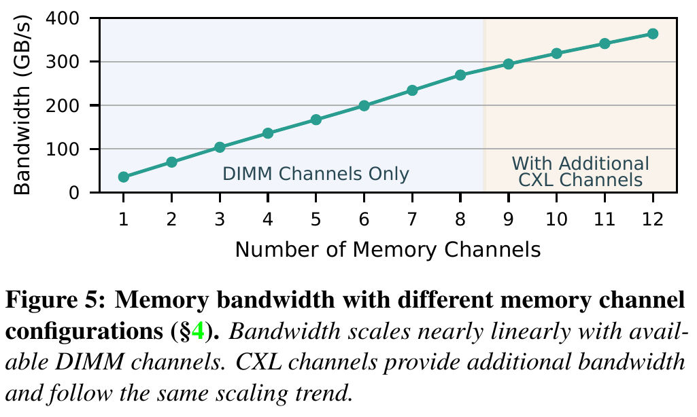

控制面和数据面的完成时刻需要分开看：资源管理器决定新增通道、虚拟机管理器热插内存，只说明新通道已可寻址。旧页是否迁至新通道，决定了原有工作集能否用上新增带宽。论文用缺页触发懒迁移；图 20 的带宽爬升验证这个差别。该细节也是移植到本项目时最应保留的系统认识。（§4.3、§6.4）

## 4. 关键技术实现与作用机理

### 4.1 划分通道并按页放置，实现虚拟机带宽分配与隔离

#### 解决的问题

默认全通道硬件交织让每台虚拟机的访存都可能落在同一批通道上。给虚拟机分配 40% 的内存容量，并不代表它可以独占 40% 的通道带宽。大虚拟机还能凭借更多核心制造更多并发访存，使小虚拟机的尾延迟和峰值带宽受损。（§2.2、§4.1、§6.1）

#### 核心方法

把物理内存通道划成资源单位，映射给指定虚拟机，再由客户机按页把工作集分布到获配通道；同时按末级缓存域固定虚拟 CPU，以免缓存争用掩盖通道隔离效果。（§4.1）

#### 实现路径

1. 宿主机启动前关闭 DIMM 通道间的默认硬件交织，按地址段识别通道，并保留为 DAX 设备。论文原型给宿主 OS 保留 10 GB，每个 DAX 设备切为与内存热插拔块对齐的 128 MB 单位。（§5.1–§5.2）
2. 宿主资源管理器按虚拟机的配额分配通道内的块。QEMU 将不同通道的块构造成客户机物理内存中的不同 NUMA 节点，并通过 ACPI（向操作系统描述硬件拓扑的固件表）把通道信息告诉客户机内核。（§5.2）
3. 客户机内核建立 C-NUMA 与 S-NUMA 映射，分配页时在所选 S-NUMA 下的通道间交织。论文测试还将不同虚拟机的核心固定在拥有独立末级缓存的 CCX（CPU 核心簇）上。（§4.1、§6）

#### 资源 / 状态变化

所有虚拟机共享同一组硬件交织通道 → 每台虚拟机拥有明确的通道集合和页映射 → 通道争用减少，带宽份额在物理资源上可追踪。

#### 为什么有效

通道是实际承担访存排队和数据传输的资源。把页放在专属通道后，别的虚拟机不能再把请求排进同一 DIMM 通道；缓存域隔离进一步减少访问尚未到达内存通道前的共享资源干扰。这个效果依赖物理拓扑真的可拆分，也依赖新增瓶颈没有转移到其他共享路径。

#### 达到的优化效果

直接效果是小虚拟机在四机共址时不再明显丢失峰值带宽，并且访存延迟接近独占配置。端到端效果仅限论文测过的应用：Redis 的 P99.99 尾延迟与吞吐、STREAM（测量内存吞吐的数组操作基准）与图计算的执行时间，不能直接转写为其他业务的服务等级保证。（§6.1–§6.2）

#### 论文证据

图 12 中 VM1 在 Shared 下相对 Ideal 的最高带宽降幅达 41.2%、延迟增幅达 78.5%；RamRyder 的延迟距 Ideal 小于 5%，相对 Shared 最多低 42.7%。图 17 进一步把末级缓存和通道隔离拆开，显示通道隔离对 Redis 的收益更大，两者合用最好。图 19 在该平台测试的软件交织开销为 128 线程平均 3.6%、最高 4.4%；单线程平均 5.1%、2 KB 步长处最高 7.4%。（§6.1、§6.4）

#### 亮点

论文用可被软件管理的物理资源单位承接“带宽配额”，省去了持续在访存路径上节流的动作。C-NUMA/S-NUMA 两层抽象让通道可见，同时保留现有 NUMA 的上层拓扑。

#### 代价与局限

通道数量有限，小虚拟机未必能高效独占整条通道。软件页级交织仍有性能损失。论文的隔离结果还用到了 CCX 级末级缓存分离，因此不能把图 12 的完整收益全部归因于通道划分；图 17 虽缩小这一疑问，但只覆盖 Redis 代表性负载。共享 CXL 通道上的容量/带宽互补共址，也不能享有专属 DIMM 通道同等的硬隔离。

#### 对项目的意义

ADAPT：本项目可把链路、内存控制器、设备入口和共享上行口建成可观测的容量/带宽约束，明确是哪一段物理资源被不同请求争用。虚拟机客户机内核改造并不是 KVCache 存储池的现成实施方案。

### 4.2 按容量与带宽需求选择 CXL 通道，并跨层加权放置

#### 解决的问题

容量型应用可能需要更多可存放的页，却不需要同比例的带宽；带宽型应用可能只需少量新增空间，却希望访问更多物理通道。若把 CXL 扩展只当作容量补充，就会继续让一部分通道带宽闲置。（§4.2）

#### 核心方法

先根据容量和带宽需求决定映射多少 CXL 通道，再按 DIMM 与 CXL 层的峰值带宽给页分配比例；容量优先时沿用冷热页分层，让热页留在 DIMM、冷页落在 CXL。（§4.2）

#### 实现路径

1. 需要带宽、但仅需少量新增容量时，把客户机物理内存分摊到更多 CXL 通道；需要容量、但带宽需求不高时，优先使用仍有剩余容量的较少通道。（图 8）
2. 客户机先根据服务器层级选择 S-NUMA，再按层峰值带宽加权选页，并在各层内部的 C-NUMA 节点间均匀放置。论文举例给出三条各 36 GB/s 的 DIMM 通道与一条 27 GB/s 的 CXL 通道，却称两层按 8:3 分页；按列出的带宽计算应为 108:27，即 4:1。原文数值与比例不一致，本报告只采纳“按层带宽加权”的设计原则，不把 8:3 当作可直接实施的参数。（§4.2）
3. 宿主侧将容量高、带宽低与容量低、带宽高的虚拟机组合到相容的 CXL 通道上，但组合必须同时满足通道的剩余容量与可用带宽。（§4.2）

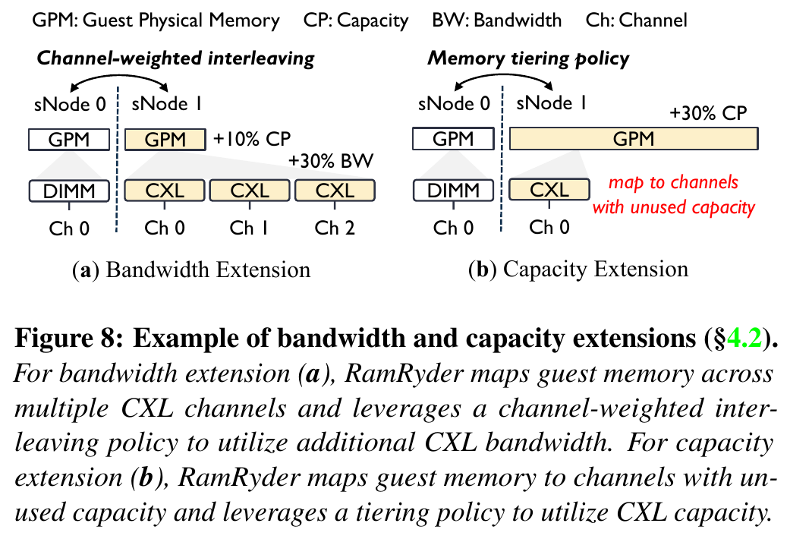

#### 资源 / 状态变化

单一“新增内存容量”决策 → 以通道数约束带宽、以映射页数约束容量的二维决策 → 相同新增容量可以分散到更多通道，或集中在少数通道。

#### 为什么有效

通道数决定可并发服务的访存请求数量，映射页数决定可容纳的工作集。加权放置使新通道上真正存在可访问的页，避免仅在控制面增加一条空通道。冷热分层则避免容量型扩展把热数据过多推向更慢的 CXL 层。

#### 达到的优化效果

直接效果是不同负载可以分别取得容量或带宽扩展；论文没有单独给出“只打开通道选择”与“只打开加权放置”的完整端到端消融。应用级结果来自两个机制和通道隔离共同作用的四机实验，不能将全部收益独占归给这一方法。（§6.2）

#### 论文证据

图 5、图 18 支持增加 CXL 通道能提升峰值带宽，但 CXL 通道斜率低于 DIMM。图 14 中，Shared 配置的 STREAM 吞吐相对 Ideal 低 37.3%、执行时间高 58.8%；RamRyder 的吞吐和执行时间均落在 Ideal 的 5% 以内。这里的证据支持整套扩带宽与隔离设计，尚不足以精确拆出加权放置一项的贡献。（§6.2、§6.4）

#### 亮点

论文把“字节数”和“可同时服务这些字节的通道数”分开管理，也明确区分容量型扩展的冷热页策略与带宽型扩展的跨层加权策略。

#### 代价与局限

“大体独立”仍受物理通道数量、每条通道的容量、CXL 层延迟、读写比例和其他租户的共享程度限制。基于峰值带宽的静态权重未必适合所有访问模式；文中并未证明该权重在小块、随机或不同读写比例下总是最优。

#### 对项目的意义

ADAPT：KVCache 的冷热、大小、复用概率、加载时限和目标设备都应参与放置决策。可以借鉴二维资源预算和权重需实测的原则，不能照搬 CPU DIMM/CXL 的 8:3 页分配例子。

### 4.3 通道热插拔与页重分布，实现运行期带宽伸缩

#### 解决的问题

启动时给定的通道份额无法跟随负载变化。更重要的是，给客户机热插一条通道并不自动移动已有工作集；旧页仍集中在原通道时，“新增通道”只是一个控制面状态。（§4.3）

#### 核心方法

按秒采集虚拟机带宽与容量使用情况，越过高低阈值后热插或回收 CXL 通道；通过页失效触发的懒迁移，逐步把旧页重新分布，并回收等量旧容量，使总容量保持不变。（§4.3）

#### 实现路径

1. 资源管理器每秒读取绑定核心的性能计数器。论文示例使用 80% 高阈值触发扩带宽、连续数秒低于 40% 后回收；容量伸缩另按内存用量与 Linux 内存热插拔处理。（§4.3）
2. 若虚拟机原有容量 X、跨 N 条通道，新增通道先映射 X/(N+1) 的客户机物理内存，建立新的 C-NUMA 节点。（§4.3）
3. 对已有工作集，客户机扫描映射页并清除页表 present 位。后续访问缺页时，按新的加权规则计算目标通道，标记放错位置的页并迁移。扩容以懒迁移避免一次性停顿；回收通道需要先把其页移走。（§4.3、§6.4）
4. 从原 N 条通道各回收 X/[N(N+1)] 容量，总容量恢复为 X；缩容时反向调整通道和页。（§4.3）

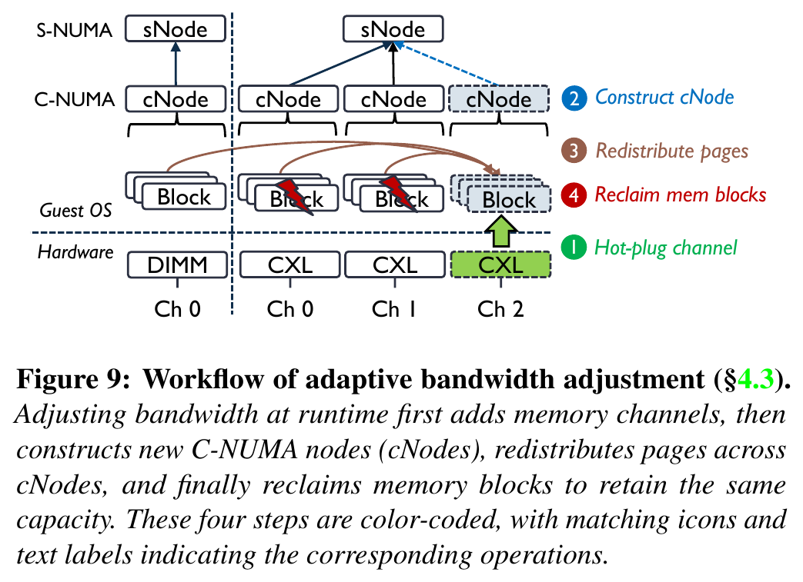

#### 资源 / 状态变化

静态通道份额 → 新通道可寻址 → 旧页逐步迁入新通道 → 有效带宽逐步上升；整个过程中客户机总容量可以不变。

#### 为什么有效

伸缩真正改变了已有页的物理落点，才会把访存压力从旧通道分走。懒迁移把成本摊到后续访问上，避免一次性搬运引发明显的平均访存延迟尖峰；代价是有效带宽不能在热插完成时立即到位。

#### 达到的优化效果

图 20 的 10 GB 工作集从一条 DIMM 通道起步，增加一条 CXL 通道后，带宽在 2.2 秒内由约 38 GB/s 升至约 68 GB/s，期间约 40% 的页发生迁移，论文给出的迁移速率为 1.82 GB/s；回收通道用时 1.1 秒。该实验展示的是持续读取负载下的带宽变化与平均访存延迟曲线，没有给出迁移期间在线推理 P99 尾延迟保证。（§6.4）

#### 论文证据

图 20 同时呈现带宽与平均延迟；图 21 对高动态负载与预留全部通道的 Ideal 作对比，短暂突发可能在下一次采样前结束，持续变化则会被追上。图 9 给出控制面与数据面顺序。（§4.3、§6.4）

#### 亮点

论文没有把“热插操作完成”误当成“带宽扩展已经生效”，而是明确引入页重分布。这个状态区分在任何需要搬移已有数据的分层存储系统里都重要。

#### 代价与局限

至少 1 秒的采样周期加上数秒迁移，使短突发无法及时服务。频繁缩放会产生迁移流量；论文没有完整量化迁移对共址在线业务尾延迟的影响。页失效与缺页迁移还依赖修改后的客户机内核，并不适用于所有设备内存或不可缺页的数据区。

#### 对项目的意义

VALIDATE：本项目可明确区分“资源已分配、数据已迁移、目标设备可消费”三个完成事件，再在真实 KVCache 加载和后台换出压力下测试动态资源调整。论文秒级结果不能替代推理请求时限内的实测。

## 5. 实验到底证明了什么

以下百分比沿用论文正文的口径。“最多”是特定子图或工作负载中的最显著点，不代表所有负载的平均值。Ideal 是单虚拟机独占硬件资源的对照；Shared 是共址并共享资源；HW-Throttle 在 Shared 上叠加硬件节流；RamRyder 是通道划分、页放置及末级缓存隔离共同构成的配置。YCSB（键值服务基准负载集）用来测试 Redis 和 Memcached。（§6）

| Claim | Experiment / Evidence | Conditions & Baseline | Result | What it proves | What it does not prove |
|---|---|---|---|---|---|
| 带宽值得独立管理 | 云厂商轨迹，图 2、图 3，§3.1 | 数千物理节点；容量、带宽、CPU 利用率记录 | 90% 服务器平均带宽利用率 ≤44.5%、峰值 ≤82.2%；容量与带宽时间曲线不同步 | 存在可寻找互补负载的资源空间 | 不证明所有节点配对都能同时满足应用尾延迟 |
| 通道数是可用带宽的有效近似 | 图 5、图 18，§4、§6.4 | Zen 5 平台上的多通道内存微基准，含 DIMM 与 CXL，读/写比例分别测量 | DIMM 增加时峰值带宽近似线性增长；CXL 继续增加带宽但斜率较小 | 在该硬件和流量下按通道分配带宽有物理基础 | 不证明每个应用、每种访问粒度或未来多通道 CXL 设备都线性扩展 |
| 通道隔离能减轻共址干扰 | 图 12、图 17，§6.1、§6.4 | 四台虚拟机同时运行；MLC 微基准与 Redis 消融；对比 Ideal、Shared、HW-Throttle | 小 VM 在 Shared 下最高带宽最多低 41.2%、延迟最多高 78.5%；RamRyder 距 Ideal 的 VM1 延迟小于 5%；图 17 通道隔离贡献大于单独末级缓存隔离 | 物理通道隔离是主要的干扰缓解手段，缓存隔离仍有补充作用 | 不证明共享 CXL、共享交换结构或未测应用也能获得相同尾延迟 |
| 应用性能可接近独占配置 | 图 13、图 14，§6.2 | Memcached/Redis 的 YCSB A–F；STREAM 与图计算；均有共址干扰负载 | Redis 的 Shared/HW-Throttle 最差尾延迟最多高 42.7%，RamRyder 对 Ideal 的延迟增幅在 5% 内；STREAM 吞吐与执行时间均在 Ideal 的 5% 内；图计算相对 Shared 运行时间低 25.2% | 在这组负载、物理隔离与页策略一起启用时，应用收益可以兑现 | 无法把收益逐项归给 CXL 加权放置、通道隔离或冷热页迁移 |
| 利用率可能通过互补共址提高 | 图 15、图 16，§6.3 | 图 15 是轨迹筛选与计算；图 16 是选中服务器对的请求回放 | 图 15 正文报告 P30 平均容量利用率改善 28.6%、P90 平均带宽利用率改善 43.2%；图 16 展示一对容量/带宽互补服务器 | 轨迹中存在满足每时刻容量与带宽总量约束的配对，单机回放展示可运行性 | 图 15 不是全量真实云部署；硬件总量约束不足以单独证明每个服务的尾延迟均合格 |
| 软件页级交织有可控代价 | 图 19，§6.4 | 128 线程及单线程 STREAM，512 B 至 8 KB 步长，对比硬件交织 | 多线程平均开销 3.6%、最高 4.4%；单线程平均 5.1%、2 KB 步长最高 7.4% | 原型的平台上，软件放置并未吃掉大部分通道收益 | 不覆盖所有访问模式、页大小或 NUMA 远近组合 |
| 动态扩带宽要等待数据搬移 | 图 20、图 21，§6.4 | 10 GB 持续读微基准及高动态带宽需求；与预留全部通道的 Ideal 对比 | 新增 CXL 通道后约 2.2 秒从 38 到 68 GB/s；回收 1.1 秒；极短突发可能错过 | 控制面完成与有效带宽可用有时间差，持续需求可以被追上 | 不证明毫秒级请求或在线推理尾延迟可承受该迁移 |

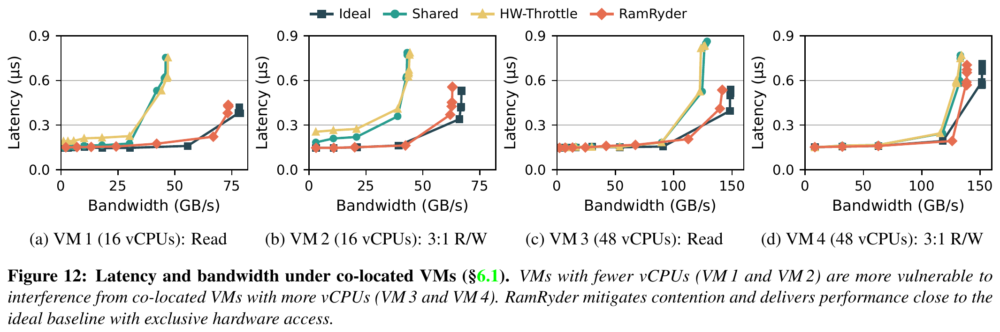

图 13 的 Memcached 吞吐在多种 YCSB 负载下差距较小，尾延迟却有明显差异。这提醒读者：该设计对低带宽但尾延迟敏感的业务，主要收益可能体现在尾部，而非平均吞吐。图 14 则补充带宽密集型应用的收益。两图共用四机设置，但不同应用的工作集、访问模式和评价指标不能合并为一个统一“加速倍数”。（§6.2，印刷页 104；PDF 页 11）

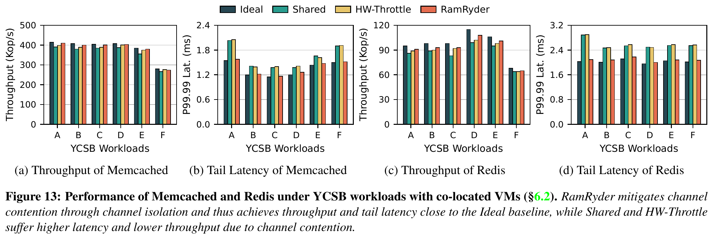

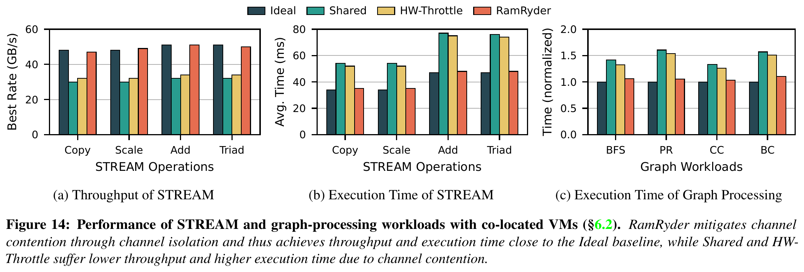

图 15 是最容易被误读的结果。正文给出的 28.6% 和 43.2% 分别落在容量利用率分布的 P30、带宽利用率分布的 P90，且来自轨迹中可配对服务器的计算。论文摘要把这两个数概括为集群平均容量和带宽利用率改善；本报告以 §6.3 的具体分位点和方法为准，不把它解释为整座数据中心已部署后的总体平均实测。（§6.3）

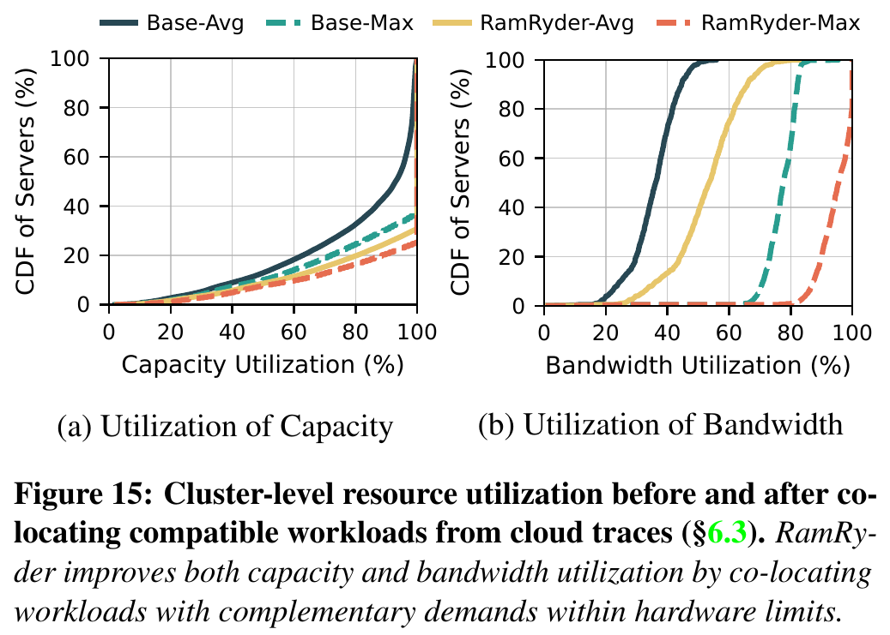

图 17 是重要的归因实验：若仅隔离末级缓存而仍共享通道，Redis 尾延迟改善有限；隔离通道后明显下降，但两者都隔离时最好。因此，论文证实“通道争用重要”，同时也证实“只隔离通道还不够”。（§6.4，印刷页 105；PDF 页 12）

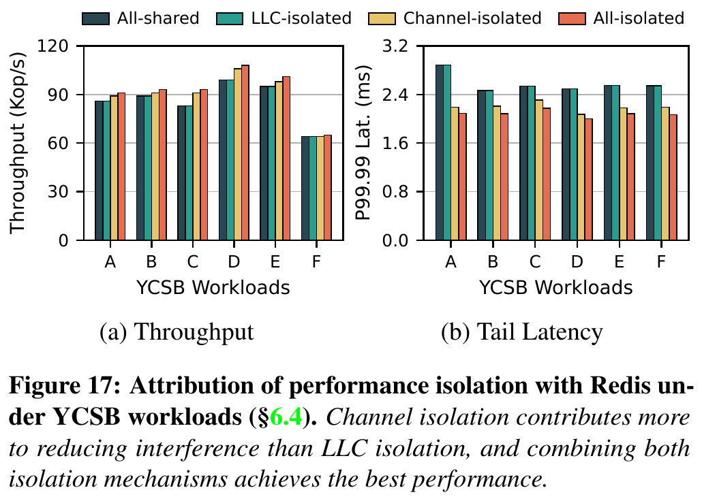

图 19 测试了软件页级交织相对硬件交织的开销；图 20–21 则给出伸缩速度的代价与边界。图 20 显示的延迟是微基准的平均访问延迟，不能替代业务 P99/P99.99；图 21 的 Ideal 已预留全部通道，是性能上界而非同成本替代方案。（§6.4，印刷页 106；PDF 页 13）

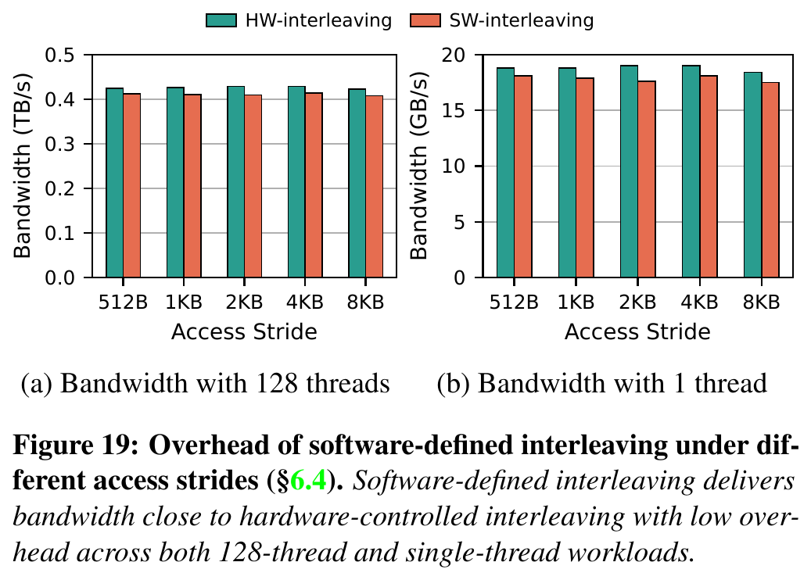

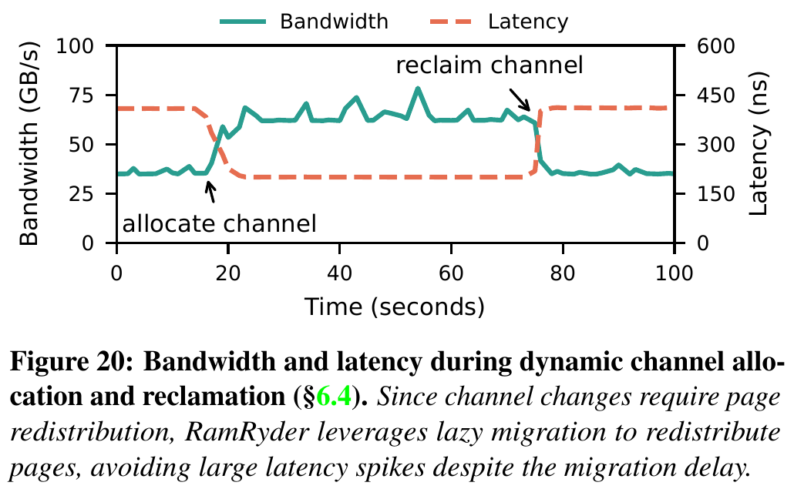

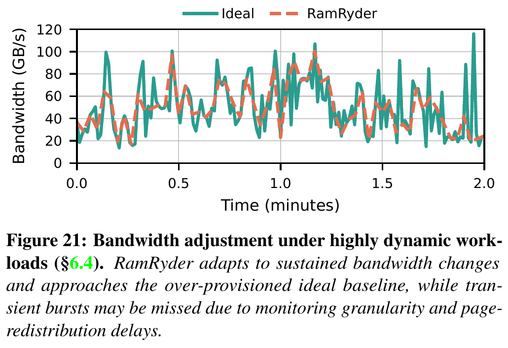

## 6. 论文的亮点与局限

### 6.1 把可隔离的通道变成调度单位

亮点：将带宽请求落实为通道归属和页落点，给出了比延迟节流更直接的物理控制点。图 5 的可扩展性与图 17 的隔离消融相互支撑。局限：通道数量远少于虚拟机可能的数量；小虚拟机共享通道时，硬隔离会退化为统计复用，论文 §7 也承认需要另行处理。

### 6.2 用 CXL 同时处理容量与带宽，却分别决策

亮点：通道数和映射页数分开考虑，比只说“扩内存”更贴近资源物理属性。局限：CXL 通道更慢，带宽斜率与 DIMM 不同；跨层权重依赖具体设备、读写比和工作集。论文使用单机单通道 CXL 设备，未来设备的内部多通道映射仍未明确。（§4.2、§7）

### 6.3 区分资源配置生效与已有数据重新分布

亮点：图 9 把热插、建节点、页迁移和等量容量回收排成明确顺序，图 20 实测了有效带宽的渐进增长。局限：秒级监测加迁移迟滞，决定其不能直接面向极短突发；迁移期的 P99 服务影响也尚无完整测量。（§4.3、§6.4）

### 6.4 以轨迹估计节省空间，并用回放补一段实体证据

亮点：图 15 先用每时刻容量和带宽硬件上限筛配对，图 16 再对选定服务器对做实际回放，比只凭平均利用率推断可合并更严谨。局限：配对筛选没有等价于生产服务等级约束，选择性回放也不能证明所有可配对组合都稳定。（§6.3）

## 7. 论文没有解决什么

论文明确把原型范围限定为单主机：跨主机 CXL 池的资源所有权、交换结构争用、故障恢复和服务质量 QoS（Quality of Service，即给业务提供约定的性能保障）仍停留在讨论方向，未由本次实验验证。BIOS/UEFI 预先划分通道、QEMU 与客户机内核修改也增加了云平台部署门槛。未来内部有多条 DDR 通道的 CXL 设备是否能被软件逐条控制，论文指出仍取决于设备暴露的映射能力。（§5、§7）

动态伸缩的主要未解问题是“需要带宽的时间尺度”。论文自己看到秒级采样和数秒重分布漏掉短突发，因此不能把其弹性机制视为毫秒级调度器。图 20 的平均访存延迟平滑，也不能推出高分位业务尾延迟、后台迁移抢占或多租户故障期间同样平滑。（§6.4–§7）

还有一处需在复现前核对的文内数值：§4.2 把三条 36 GB/s DIMM 与一条 27 GB/s CXL 的层带宽比例写成 8:3，算术结果实际为 4:1。论文未解释为何采用另一权重，因此不能直接以该例校准页分配实现；应回查实现代码或重新测量有效带宽。

从本项目看，还缺 KVCache 对象的语义身份、版本和消费资格、设备侧可见性、张量并行多卡同步，以及 HBM（高带宽显存，推理设备上的高带宽执行内存）、主机 DDR、NVMe SSD（通过 NVMe 接口访问的固态存储设备）与跨节点链路之间的正文数据搬运策略。RamRyder 管理的是 CPU 虚拟机内存页，不是可直接供推理设备消费的 KVCache 块。这是适用范围差异，不能据此否定论文结果，也不能把论文指标移植为本项目已达成指标。

## 8. 对本项目的启发

### DIRECTLY ADOPT

直接采用“容量和可服务带宽分别记账”的资源建模原则，并把同一个分配动作的三个状态分清：资源已预留、数据已到位、消费端已可见。本项目的分层存储若只记录剩余 GB，而不记录源出口、链路、目标入口及共享总线的有效带宽，就无法判断一次缓存加载是否可能挤压前台请求。这里采用的是资源语义，不是论文的 NUMA 代码。

### ADAPT

把论文的通道拓扑观念改写成国产 AI 硬件的实际路径图：HBM 容量、HBM 带宽、主机 DDR、SSD 通道、网卡、交换机上行口及设备 DMA（Direct Memory Access，即设备直接读写内存的传输机制）队列要按真实物理边界建模。对于高复用缓存的放置，先比较拉取与加载总开销是否小于本地直接重算耗时，再在候选路径中检查背景 I/O 对前台 TPOT 的影响。其决策依据需来自本项目测量，不能照用论文的峰值通道带宽比。

### DO NOT COPY

不照搬“改客户机内核、清 present 位让 CPU 缺页后懒迁移”的执行方式。项目的 KVCache 块由推理框架和设备缓冲共同管理，直接按 CPU 页缺页处理既不能表达模型/词表/模板的语义一致性，也不能自动满足设备侧完成可见性；数据面还要满足 Host CPU 零数据拷贝（CPU 只下发控制指令，不搬运 KVCache 正文数据）的项目目标。BIOS 关交织也不是可无条件启用的项目需求。

### VALIDATE

优先验证四个迁移条件：国产平台是否能暴露足够细的物理带宽边界；隔离后瓶颈是否转移到共享上行口或 HBM；动态重放置对请求尾延迟是否净受益；冷容量扩展是否仍维持 KVCache 命中、加载和重算之间的真实净收益。这些判断必须用项目负载实测，RamRyder 的 CPU/CXL 结果只能提供实验设计参照。

## 9. 对本项目立项的背书

### 9.1 Problem Validation

论文用云端轨迹和实体四机实验支持两个较一般的判断：容量利用率无法代替带宽利用率；共址业务即使总容量够用，也可能被共享内存通道拖坏尾延迟。这为本项目同时管理存储容量、路径带宽与前后台干扰提供外部问题证据。证据场景是 CPU 虚拟机与 DIMM/CXL，不是大模型推理集群。（§3、§6.1）

### 9.2 Mechanism Validation

图 17 的消融支持按真实物理争用点做资源隔离；图 20 的渐进带宽曲线支持将“控制配置完成”与“数据面收益生效”分开。这两条机制原则可供本项目设计链路准入、迁移状态和后台流控时参考。论文没有验证本项目具体的 URMA（通用远程直接内存访问，用于高性能远端数据搬运的接口与协议）、UBMEM（统一总线内存直通共享协议，用于跨节点或异构设备共享内存地址空间）或 NPU 数据路径。

### 9.3 Research-Gap Validation

RamRyder 的原型止于单机 CPU/CXL 页管理，其§7明确留下多主机池、未来 CXL 内部通道暴露和快速弹性问题。本项目若能在 KVCache 对象级补足跨介质、跨节点、推理请求时限与设备可见性约束，问题空间确有差别。不过“范围不同”只是差异化方向，仍需独立实测证明新方案比现有路径有收益。

### 9.4 Unsupported Project Claims

论文不能证明本项目的 Host CPU 正文零拷贝已经实现，不能证明远端直读或拷贝到本地 HBM 的最优边界，不能证明语义一致性与租约校验正确，不能证明张量并行多卡状态同步稳定，也不能证明 E3（全链路前后台混压门禁）的 TTFT 降低至少 20%、QPS（Queries Per Second，每秒处理的请求数）提升至少 10%、前台 TPOT 干扰率低于 3% 已达标。上述数字是本项目验证目标，不是 RamRyder 的实验成绩。

### 9.5 Project Establishment Verdict

- Necessity evidence：内存容量与可用带宽错配是真实问题，忽略物理争用会导致共址尾延迟损失。
- Feasibility evidence：在论文测试平台上，通道可划分、页可重放置，物理资源抽象可以带来可测收益。
- Differentiation evidence：论文未处理设备侧 KVCache 对象、异构直达路径、跨节点负载与多卡消费语义；这些构成本项目需要独立解决的技术问题。
- Remaining burden of proof：国产硬件的可控粒度、正文直达、动态调整净收益和 E3 混压达标都必须由项目原型与端到端实验分别确认。

## 10. 建议验证

### Experiment 1: 真实物理争用边界与资源曲线

- Hypothesis：项目路径上存在可观测、可控制的物理带宽边界；增加独立通道或队列可扩大有效吞吐，并减少相邻业务干扰。
- Variable：可用内存/链路/设备队列数，前后台并发数，读取与写回比例。
- Baseline：现有共享放置与无隔离调度。
- Metric：每段有效带宽、前台 TTFT/TPOT 分位点、后台吞吐及共享资源利用率。
- Controlled conditions：固定模型、Token 长度、KVCache 命中率、设备拓扑和算力并发；逐项改变一个物理资源维度。
- Pass condition：隔离或增加资源后，在相同业务输入下得到可重复的净吞吐或尾延迟收益，且能指出收益对应的物理瓶颈。
- Fail implication：若瓶颈始终位于无法控制的共享上行口或计算侧，就不应照搬“按通道配带宽”的架构假设。
- Decision affected：硬件能力矩阵与路径调度器的资源单位。

### Experiment 2: 容量扩展与带宽扩展分开决策

- Hypothesis：将可用缓存字节数与加载/换出路径的有效带宽分开记账，比只按容量扩池更能控制前台性能。
- Variable：缓存热度、对象大小、请求复用次数、源与目标介质、后台换出速率。
- Baseline：固定容量水位策略和统一放置策略；保留本地重算作为业务基线。
- Metric：有效命中后净节省的 TTFT、单次有效请求计算成本、前台 TPOT 干扰、设备带宽和实际拷贝字节。
- Controlled conditions：相同请求轨迹、模型版本、词表和 Prompt 模板；分开测“仅扩容量”与“容量+带宽约束”。
- Pass condition：选中的加载路径在明确适用区间内满足“拉取与加载总开销 < 本地直接重算耗时”，且前台时延不因后台流量越过项目服务门限。
- Fail implication：若容量增加却无净加速或尾延迟恶化，则缩减该层容量投放，改走本地重算或别的路径。
- Decision affected：多介质分层规模、动态选路规则与后台流控预算。

### Experiment 3: 动态调整的控制完成与数据生效

- Hypothesis：新资源可用、旧 KVCache 块迁完、目标设备可消费之间存在不可忽略的时间差；预取或提前迁移只在部分负载上划算。
- Variable：突发持续时间、采样周期、迁移工作集大小、迁移并发和设备负载。
- Baseline：静态预留全部资源、无预取的按需迁移、以及不加载直接重算。
- Metric：从决策到首字节可传输、全量目标可见和请求接入的三段时延；TTFT、TPOT P99、迁移字节与失败回退率。
- Controlled conditions：固定设备拓扑、模型、KVCache 大小和前台到达过程；短突发与持续负载分开测。
- Pass condition：持续负载下动态调整的净业务收益为正；短突发若迁移来不及，策略应及时回退而非继续占用后台带宽。
- Fail implication：若生效延迟普遍超过请求收益窗口，则不能将秒级弹性机制放到在线关键路径。
- Decision affected：动态调度触发条件、预取提前量与迁移限流。

### Experiment 4: 全链路前后台混压与隔离归因

- Hypothesis：对后台缓存加载和换出施加物理路径约束，可以降低对前台在线推理的干扰，但可能把瓶颈转移到 HBM 或共同上行口。
- Variable：后台满载 I/O、前台 QPS、通道/队列隔离开关、拥塞控制开关。
- Baseline：无隔离混压，并保留前台独占时的参考线。
- Metric：TTFT、QPS、TPOT P99 与干扰率、正文 Host CPU 拷贝字节、各段队列深度。
- Controlled conditions：真实两节点拓扑，固定模型、输入/输出长度分布、KVCache 复用率和张量并行规模；逐项做隔离消融。
- Pass condition：以项目 E3 目标为验收口径：TTFT 降低至少 20%、QPS 提升至少 10%、前台 TPOT 干扰率低于 3%，同时正文 Host CPU 拷贝字节为 0。各项均需由本项目实测确认。
- Fail implication：若隔离只搬动瓶颈或消融无法识别贡献，就重新定义被管理的物理资源与准入规则。
- Decision affected：上线门禁、硬件 QoS 优先级队列和动态拥塞控制。

## 附录：证据口径与图像索引

本报告中的“论文实测”指 §6.1、§6.2、§6.4 在单机 AMD EPYC Zen 5、DDR5 DIMM、四台 CXL 2.0 设备与相应虚拟机设置下的微基准和应用测试；“轨迹推算”专指图 15 的配对筛选与利用率计算；“轨迹回放”专指图 16 的选定服务器对。论文结果没有任何国产 NPU、HBM、URMA/UBMEM 或 KVCache 推理端到端成绩。（§6）

图像均为本次从原 PDF 以 300 DPI 渲染后单独裁取的原图，保留原论文图号、图例、坐标、子图和原图注。正文收录：图 2（问题）、图 5（设计前提）、图 6–9（架构与方法）、图 12–15（应用与利用率）、图 17（消融）、图 19–21（开销与弹性边界）。图 18 的通道伸缩结论直接按 §6.4 正文和原 PDF 图号引用，未另嵌截图，以免与图 5 重复。所有相对路径都以本 Markdown 文件所在目录为基准。
