# RamRyder：把内存通道变成可弹性分配的资源

> 论文：Yanbo Zhou 等，*Break on Through to the Other Side: Pooling Memory Elastically with RamRyder*，OSDI 2026。本文仅依据同目录的[原论文 PDF](<[OSDI 2026] Break On Through to the Other Side Pooling Memory Elastically with RamRyder.pdf>)，页码均指 PDF 页码。图像直接从该 PDF 裁取，保留原始图注。文中的“论文实测”“轨迹配对计算”“分析推断”“项目建议”分别标注，避免把不同证据当成同一种结果。

## 1. 一页读懂论文

### 1.1 论文解决什么问题？

云虚拟机（VM，即在一台物理服务器上隔离运行的计算实例）通常按固定比例购买处理器核心与内存容量，却无法单独购买和调整内存带宽。带宽敏感的租户为避免邻居争用而占用整颗处理器插槽；负载低谷时，已预留的容量和带宽仍不能交还。论文要让同一台服务器在保持应用性能的条件下，容纳需求互补的 VM。

### 1.2 根因是什么？

可见症状是内存资源闲置，根因是硬件默认把地址交织到插槽内所有内存通道，软件通常看不到、也无法按租户分配“通道”这一带宽供给单元。只管容量，不能保证访问不争用；只给内存访问插入延迟，也不能精确分配带宽。CXL（Compute Express Link，支持处理器连接扩展内存设备的互联总线）增加了容量与带宽来源，但只有明确页面落在哪些通道，才能利用和隔离这些资源。

### 1.3 核心洞察是什么？

单个通道提供可测的带宽，增加通道数时聚合带宽大致增长，而跨 VM 争用主要发生在共享通道上。因此，先让软件获得通道与物理地址区间的对应关系，再按 VM 分配通道并控制页到通道的映射，可以把带宽从隐含的硬件属性变成显式管理对象。这个洞察成立的前提是通道数确实带来可用带宽，且其他共享部件不会吞掉隔离收益。

### 1.4 核心抽象是什么？

RamRyder 将一个内存通道呈现为一个 C-NUMA 节点（通道级非统一内存访问节点，供客体系统按页选择物理通道）；再把同一处理器插槽或同一 CXL 内存域的通道组合成 S-NUMA 节点（服务器级内存拓扑节点，保留原有 NUMA 的亲和关系）。资源管理器选择通道，虚拟机监控器建立客体物理内存到通道的映射，修改后的客体内核按页放置和迁移。C-NUMA 是关键抽象；128 MB 分块、DAX 设备和 ACPI 拓扑表是实现手段。

### 1.5 关键优化方法速览

#### 方法 1：通道级分配与隔离

- **问题**：不同 VM 的访问落在同一组通道，邻居负载抬高访问时延。
- **方法**：禁用默认跨通道交织，将通道对应的物理地址区间分配给 VM，并在客体内按页跨已分配通道交织；另将 VM 固定到不同的末级缓存域。
- **效果**：通道争用减少，带宽成为可分配的资源；Redis 隔离消融实验显示，通道隔离比单独隔离末级缓存更有效（图 17）。

#### 方法 2：CXL 通道选择与跨层按带宽放页

- **问题**：单纯增加 CXL 内存容量，未必得到可用带宽；多通道扩带宽也不应强迫 VM 购买等比例容量。
- **方法**：按容量与带宽需求选择 CXL 通道数量；容量扩张使用冷热页分层，带宽扩张按各内存层的最大带宽加权放页。
- **效果**：在设备容量与带宽上限内，容量需求和带宽需求可以“多数情况下”分别调整；这是论文的设计能力，图 8 是机制示意，不是独立性能测量。

#### 方法 3：运行时通道热插拔与页面重分布

- **问题**：VM 建立后通道配置固定，无法把空闲带宽交给需求增长的 VM；新通道接入后，旧页仍留在原通道。
- **方法**：监测 VM 用量，热插拔 CXL 通道，并通过缺页触发的惰性迁移重新分布旧页；扩带宽时回收等量旧内存块以维持容量。
- **效果**：持续增长的需求能逐步获得额外带宽；图 20 的 10 GB 工作集在加通道后约 2.2 秒从 38 GB/s 升至 68 GB/s，短突发仍可能被漏掉。

### 1.6 最重要的实验结果是什么？

**论文实测**：通道数增加时，内存带宽近似增长（图 5、18），支持“按通道分配带宽”的必要前提。在四 VM 共置实验中，小 VM 共享通道时最高带宽较独占基线下降最多 41.2%，访问时延最多增加 78.5%；RamRyder 将其时延控制在独占基线 5% 以内，较共享配置最多降低 42.7%（图 12，§6.1）。Redis 的 P99.99 时延、STREAM 和图计算结果进一步显示应用层受益，但这些结果是在专门配置的单机原型上测得。**轨迹配对计算**：图 15 的集群容量与带宽利用率提升来自云轨迹中可配对服务器的逐时刻计算，不能称为生产集群上线后的实测节省。

### 1.7 最大局限是什么？

通道是较粗的资源粒度；客体内核要修改，服务器需要重启配置内存映射。CXL 通道的内部布局与设备实现相关。带宽调节每秒采样一次，已有页面迁移还要数秒，因而不适合要求瞬时响应的尖峰负载。论文测试的是单主机 CPU 内存系统，没有验证跨主机共享池或加速器显存。

### 1.8 为什么与本项目相关？

本项目的 KVCache（大模型注意力键值缓存，保存历史 Key/Value 状态以免后续生成时重复计算）在异构介质间调度时，也要分别识别“还能存多少”和“能以多快速度取到”。

- **必要性证据**：云轨迹显示容量与带宽利用率不同步，单一容量指标不足以指导资源分配。
- **可行性证据**：单机原型表明，暴露物理带宽单元并控制数据放置，可以缓解共置争用。
- **差异化证据**：论文没有处理 NPU（神经网络处理器，用于执行大模型计算）显存、跨节点 KV 传输、模型语义一致性或推理服务的尾部时延。
- **仍需证明**：本项目必须在自己的硬件与混压负载上证明获取缓存的净收益、零 CPU 正文搬运、语义安全和前台时延稳定性；RamRyder 的数字不能代替这些实测。

## 2. 为什么这个问题值得解决

**论文事实，§3.1**：来自某大型云厂商、覆盖数千物理节点的轨迹显示，90% 服务器的平均内存带宽利用率低于 44.5%，峰值带宽利用率低于 82.2%；与此同时，55.4% 服务器的平均和峰值容量利用率都超过 90%。单台服务器的容量、带宽和处理器使用率也随时间以不同节奏变化（图 2、3）。因此，“容量不足”与“带宽不足”不能互相推断。

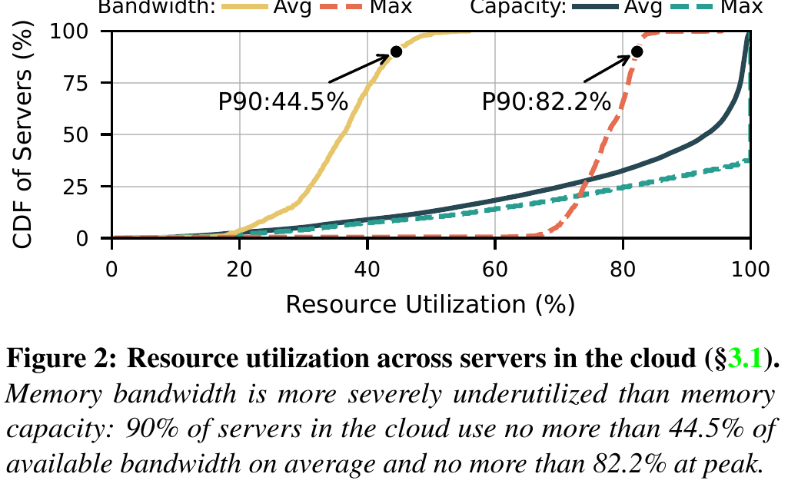

**根因，§3.2–3.3**：为避免共享内存通道带来的不可预测干扰，租户倾向于取得插槽级独占，形成空间超配；实例启动后资源固定，必须按峰值购买，形成时间超配。CXL 池化工作偏重容量；硬件限速通过插入延迟间接控制请求，论文图 4 和 §6.1 表明它在所测高带宽负载下不能提供精确隔离。论文提出的机会是：两个租户若分别需要高容量低带宽、低容量高带宽，可以在同一服务器上匹配，但调度器必须同时约束容量和带宽，且不能把“剩余带宽”误认为无条件可用。

## 3. 核心抽象与系统设计

系统先在启动时关闭 DIMM（双列直插式内存模块）通道间的默认地址交织，识别每个通道对应的物理内存区间，并把区间留给软件管理（图 10，§5.1）。每个 CXL 设备在该实验平台内对应一个 DDR5 通道，因此也可作为单独的资源单元。运行时资源管理器按通道持有容量与带宽信息；虚拟机监控器把分配到的区间映射为客体物理内存，通过 ACPI 硬件拓扑表传递来源；客体内核构造 C-NUMA 与 S-NUMA，并选择页落点（图 6、7，§4–5）。

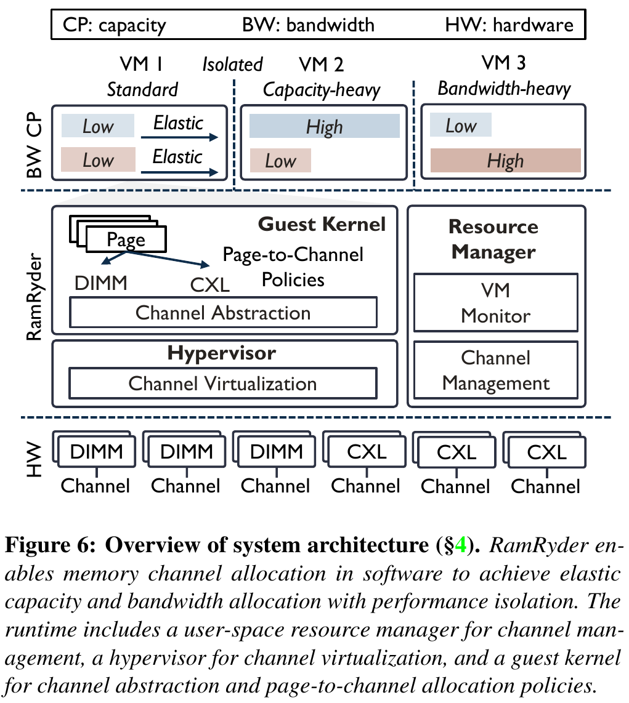

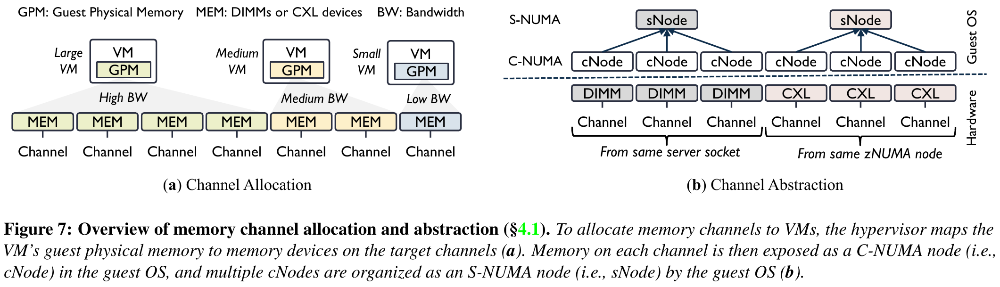

这个设计有两个必须分开的边界。**控制边界**是“VM 获得哪些通道”；**数据边界**是“已有和新分配的页实际落在哪些通道”。分配命令完成不代表额外带宽已经兑现；图 20 的带宽爬升正是页面重分布过程。另一个边界是通道与末级缓存：论文通过把 VM 固定到不同 CPU chiplet 的缓存域，减少非通道争用；图 17 的消融实验说明两者都有作用，但通道隔离贡献更大。

## 4. 关键技术实现与作用机理

### 4.1 通道级分配与隔离

#### 解决的问题

默认地址交织使同插槽 VM 的页面访问进入同一组通道。即使按 VM 分配相同容量，也没有物理带宽边界；高并发租户会抢占小 VM 的通道服务时间。单独限制 CPU 频率或插入访存延迟会影响计算，不能消除共同排队。

#### 核心方法

将一个 DIMM 或 CXL 内存通道对应的物理区间作为可分配资源，给不同 VM 分配不同通道，并让客体内核按页跨本 VM 的通道交织。

#### 实现路径

1. 启动时通过 BIOS/UEFI 禁用通道间默认交织，识别物理地址范围和保留孔洞；主机保留 10 GB，其余每通道区域作为 DAX（绕过传统页缓存、可直接映射的设备内存）设备。
2. 资源管理器把 DAX 区域划成 128 MB 块；虚拟机监控器将块映射到目标 VM 的客体物理内存，并发布通道拓扑。
3. 客体先按原有服务器级 NUMA 亲和性选 S-NUMA，再在该节点下的 C-NUMA 之间等量交织页面。不同 VM 的 vCPU 还固定到不同末级缓存域。

#### 资源 / 状态变化

默认“多 VM → 同一组交织通道”变为“VM → 指定通道集合 → 该 VM 内页面交织”。共享通道上的请求排队减少；末级缓存隔离另外减少缓存层干扰。

#### 为什么有效

图 5 和图 18 验证了通道数增加通常带来更多聚合带宽；图 17 将缓存与通道隔离拆开，削弱了“收益全部来自缓存固定”的替代解释。仍不能把通道数量直接当成严格带宽保证：读写比例、CXL 链路与其他共享路径都会影响实得带宽。

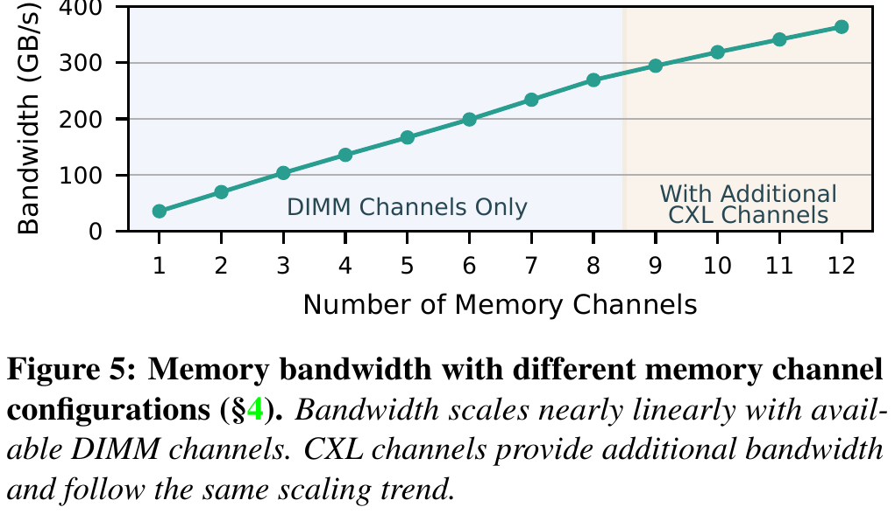

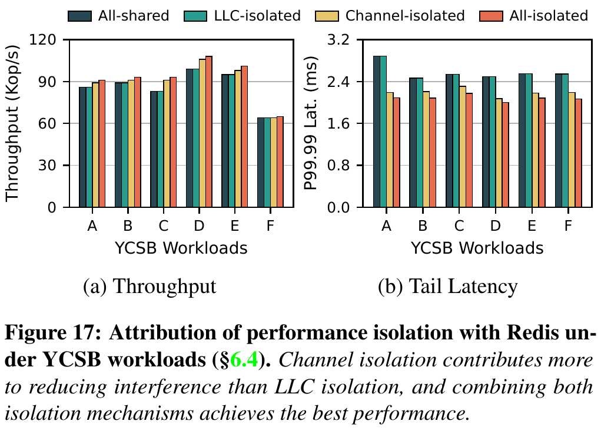

#### 达到的优化效果

**直接效果**：不同 VM 的主要内存请求不再在同一批 DIMM 通道上排队。**端到端效果**：在论文四 VM 配置下，Redis 尾部时延和带宽型应用性能接近独占硬件基线；这不是任意负载下的硬保证。

#### 论文证据

图 12（Intel MLC，100 MB/核缓冲区，四 VM 同时运行）给出小 VM 在共享配置下最高 41.2% 带宽损失、最多 78.5% 平均访问时延增加，而 RamRyder 时延与独占基线相差小于 5%。图 17（Redis/YCSB，P99.99）表明只隔离缓存仍有明显干扰，隔离通道的作用更大。图 19 测得软件按页交织相对硬件交织的平均带宽开销：128 线程为 3.6%，单线程为 5.1%。

#### 亮点

资源隔离的控制点放在物理服务单元上，而非在请求已经到达共享通道后才限速；又借用现有 NUMA 页分配机制实现客体内放置。

#### 代价与局限

关掉硬件细粒度交织后，单线程和特定步长会损失部分并行性；小 VM 需求可能不足一个通道，粗粒度独占会浪费资源。论文也没有在所有 CXL 内部交织方式上证明可见通道边界。

#### 对项目的意义

**ADAPT**：借用“把物理带宽供给单元和拓扑显式化，再做放置与隔离”的原则；本项目实际资源单元应由 NPU 显存控制器、设备间总线、网卡和存储链路的能力矩阵决定，不能照搬 CPU DIMM 通道或修改客体内核。

### 4.2 CXL 通道选择与跨层按带宽放页

#### 解决的问题

扩容时若只关心字节数，可能把热点放到少数 CXL 通道，容量足够却带宽不足。反过来，带宽需求增长也不应被迫线性购买 CXL 容量。CXL 容量、设备通道和页落点必须一起决策。

#### 核心方法

按 VM 的容量与带宽需求选择 CXL 通道数；以容量为主时用冷热页分层，以带宽为主时按各层最大带宽比例交织页。

#### 实现路径

1. 资源管理器根据可用容量与通道带宽选择 CXL 设备，允许少量客体内存跨多个通道以购买带宽，或把大量内存放在有余量的少数通道以购买容量。
2. 客体内核将 DIMM 与 CXL 作为不同 S-NUMA 内存层；容量扩张沿用冷热页迁移，把热点优先留在 DIMM。
3. 带宽扩张时，在两个内存层之间按最大带宽比例分配页，再在每层内部按通道平均交织。

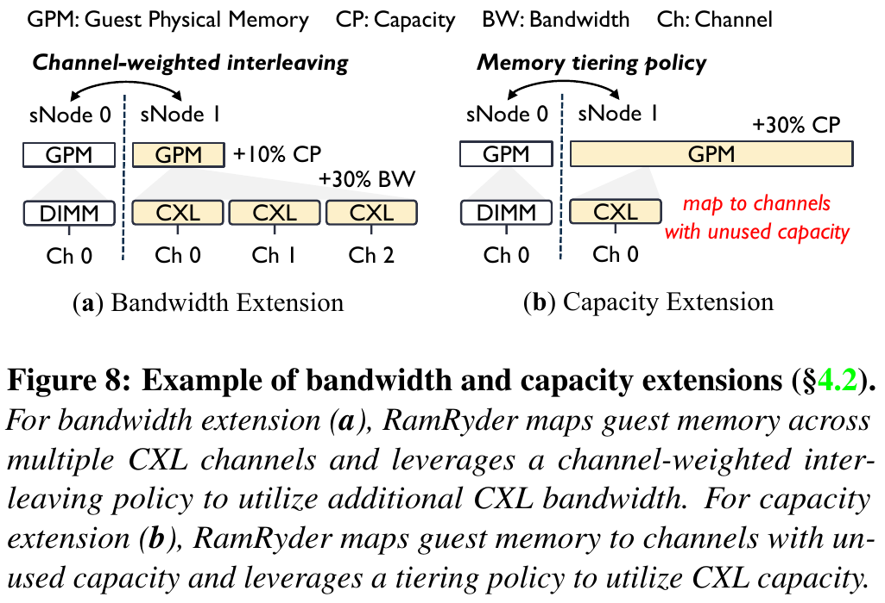

#### 资源 / 状态变化

“购买容量时被动附带带宽”变为“容量字节数、映射通道数、页面热度与落点分别决定”。这只是**多数情况下独立**：通道仍有容量上限，CXL 设备和上游链路可能被多个 VM 分享。

#### 为什么有效

带宽由实际参与服务的通道和页面访问分布共同决定。多映射几个 CXL 通道而不把热点页放过去，无法利用其带宽；按带宽权重交织能提高访问并行度。容量型租户把冷页放 CXL，可把低时延 DIMM 留给热点。论文 §4.2 还提出把容量型与带宽型 VM 配对共享 CXL 通道，但图 8 只是说明策略，没有单独量化该配对策略的贡献。

#### 达到的优化效果

**直接效果**：CXL 通道数量与跨层页比例可分别用于满足容量和带宽需求。**端到端效果**：在论文的共置配置下，STREAM 的吞吐和完成时间均在独占基线的 5% 内；图计算相对共享配置的执行时间降低 25.2%，仍在独占基线的 5% 内。应用结果同时包含通道隔离，不能归因给加权交织单一机制。

#### 论文证据

图 18 在单 VM、128 vCPU 的 Intel MLC 测试中展示 DIMM 通道增加后带宽近似线性上升，加入 CXL 通道仍继续增长但斜率较低。图 14 证明共置时的应用收益；图 15 的集群利用率改善是轨迹配对计算，验证匹配空间的存在，未测生产调度开销。

#### 亮点

论文明确区分“有多少字节”与“这些字节分布到多少个服务通道”。这种区分比简单把 CXL 当成慢一档的大内存更接近真实资源约束。

#### 代价与局限

跨层按最大带宽权重分配页面不等于按实时访问流量精确分流；热点偏斜、读写混合、上游 PCIe/CXL 争用都可能破坏预估。§4.2 的示例还有复现疑问：3 个 DIMM 通道各 36 GB/s、1 个 CXL 通道 27 GB/s，列出的带宽比为 108:27，即 **4:1**，但正文写成 **8:3** 并据此描述页交织。原文未解释该差异，实施前应核对作者代码或重新推导权重，不能替论文补造理由。

#### 对项目的意义

**ADAPT**：在 KVCache 多介质调度中分别记账可用容量、可持续带宽、链路争用和数据热度；按“拉取与加载总开销 < 本地直接重算耗时”才加载。CPU 内存的页交织比例不能直接当成 KV 分块或跨设备传输比例。

### 4.3 运行时通道热插拔与页面重分布

#### 解决的问题

容量和带宽在 VM 创建时固定，无法响应小时级负载变化。即使热插入新通道，已分配页面仍在旧通道上，控制面看到的带宽额度会早于数据面实际可用带宽。

#### 核心方法

按用量阈值增减 CXL 通道；扩带宽时热插入新通道并回收等量旧内存块，触发旧页惰性迁移，使页分布逐步匹配新的通道集合。

#### 实现路径

1. 每秒从性能计数器汇总 VM 带宽；利用客体内存统计监测容量。示例阈值为高于 80% 扩张、低于 40% 持续数秒后回收。
2. 若原有容量为 X、通道数为 N，新增通道时映射 X/(N+1) 的客体物理内存；客体构造对应 C-NUMA。
3. 扫描现有页表并清除相关 present 位；后续访问触发缺页，重新计算目标通道，把放错位置的页迁移过去。
4. 从旧通道回收等量内存块，使扩带宽前后的总容量仍为 X。回收通道时反向处理，必要时立即迁页。

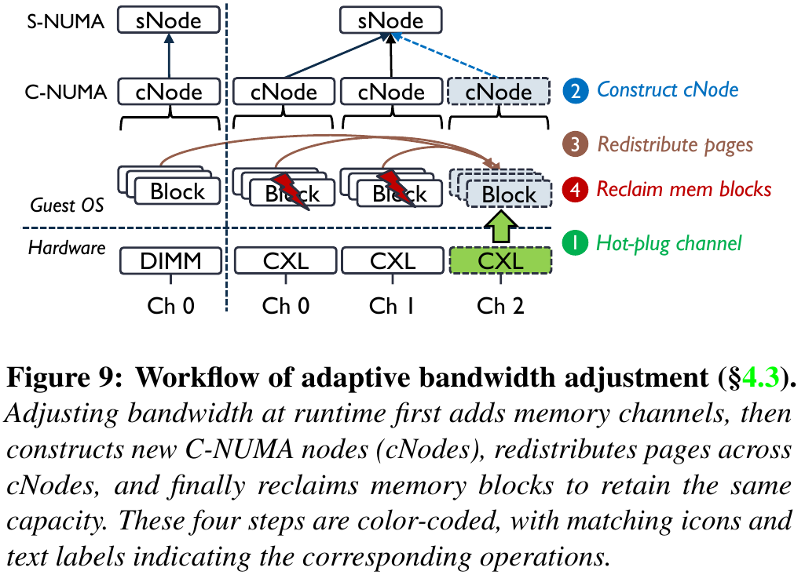

#### 资源 / 状态变化

“通道已接入”→“旧页逐渐迁移”→“额外通道提供有效带宽”→“旧内存块完成回收”。容量可以保持不变，但迁页期间存在过渡状态；容量账本和可用带宽账本不能用同一个完成事件更新。

#### 为什么有效

新分配页可直接落到新通道；旧页需要迁移才能改变物理服务路径。惰性迁移把部分成本放到后续访问上，避免一次性搬迁带来的明显时延峰值。该机制主要面向持续变化，而非亚秒级尖峰。

#### 达到的优化效果

**直接效果**：通道调整操作仅需微秒级，但有效带宽收敛需要数秒。**端到端效果**：图 20 中 10 GB 读负载增加一条 CXL 通道后，带宽在约 2.2 秒内从 38 升至 68 GB/s；回收耗时约 1.1 秒。图中时延曲线平稳，但未证明所有服务的高分位尾延迟均不受影响。

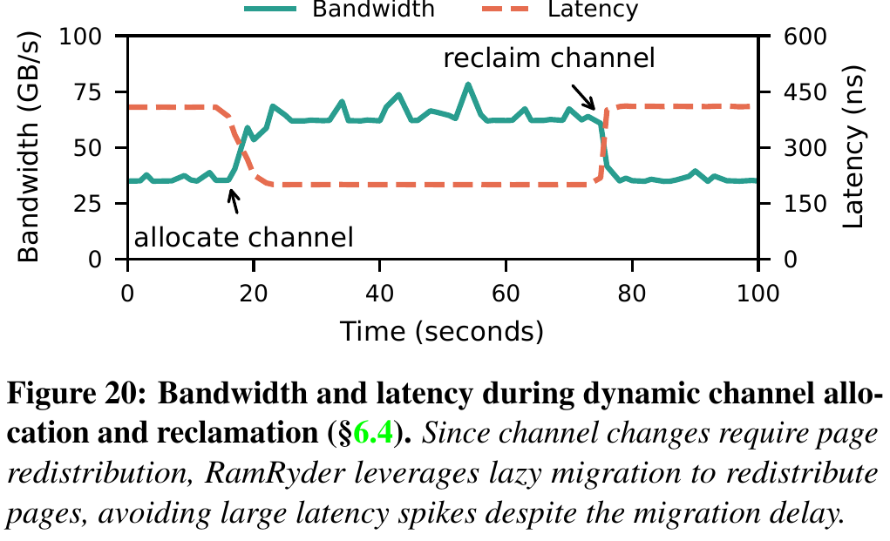

#### 论文证据

图 20 测得约 40% 页迁移，折算迁移速率约 1.82 GB/s；图 21 与预先分配所有通道的理想基线对比，显示持续变化可追近，短尖峰可能被 1 秒采样间隔和迁页过程错过。

#### 亮点

明确区分“改变资源归属”和“让既有数据享用资源”。论文给出了数据面收敛耗时，而没有把热插拔命令耗时当成调节完成时间。

#### 代价与局限

扫描页表、清 present 位与迁页会引入额外工作；回收时必须搬走目标通道上的页。论文只测单机和特定负载，没有覆盖频繁振荡、极端碎片、迁移失败后的服务可用性。

#### 对项目的意义

**ADAPT**：本项目的缓存层迁移、远端直读租约切换和热点重分布也应区分控制事件与可消费数据状态。验证时要测“发出切换命令到前台实际获得收益”的时间，并保证切换期间的版本、租约和数据完整性；不能直接采用清页表缺页迁移作为 NPU 显存方案。

## 5. 实验到底证明了什么

论文单机平台为 AMD EPYC Zen 5（128 个逻辑核），测试用一插槽内 8 条各 32 GB 的 DDR5 DIMM 通道、4 个各 256 GB 的 CXL 2.0 设备；四个 VM 分别为 16 vCPU/32 GB、16 vCPU/32 GB、48 vCPU/96 GB、48 vCPU/96 GB。RamRyder 初始各分到 1、1、3、3 条 DIMM 通道，VM 的处理器核固定到不同缓存域（§6）。这决定了结果的适用范围。

| 主张 | 实验与证据 | 条件与基线 | 结果 | 能证明什么 | 不能证明什么 |
|---|---|---|---|---|---|
| 通道可作为带宽供给单元 | 图 5、18；论文实测 | 单 VM，Intel MLC，逐步增加 DIMM/CXL 通道；混合读写比例分别测 | DIMM 通道数增加时带宽近似增长，CXL 增量斜率较低 | 论文平台上通道数量与聚合带宽有关 | 任意芯片、任意共享链路都线性扩展 |
| 隔离能减少共置干扰 | 图 12、17；论文实测与消融 | 四 VM；Ideal、Shared、硬件限速、RamRyder；Redis 再拆分缓存/通道隔离 | 小 VM 在 Shared 下最多损失 41.2% 最高带宽、时延增加 78.5%；RamRyder 时延距 Ideal <5%；图 17 显示通道隔离贡献更大 | 通道共享是本测试条件下的主要干扰来源 | 严格带宽下界、所有高分位时延或任意共置组合 |
| 应用层受益 | 图 13、14；论文实测 | Memcached、Redis/YCSB、STREAM、图计算；四 VM 共置 | Redis 在 YCSB-D 相对 Shared 吞吐增加 9%；其 P99.99 时延距 Ideal <5%；STREAM 吞吐与时间距 Ideal <5%；图计算时间相对 Shared 降 25.2% | 隔离方案在这些应用配置下有效 | 把全部收益单独归因于 CXL 加权交织；推断推理服务的 TTFT/TPOT |
| 有配对空间 | 图 15；**云轨迹配对计算** | 在每个时间戳检查两台服务器合并后的容量与带宽是否都低于硬件上限 | 论文报告 P30 处平均/峰值容量利用率分别相对提升 28.6%/22.1%；P90 处平均/峰值带宽利用率分别相对提升 43.2%/26.1% | 所用轨迹里有需求互补的候选配对 | 真实集群上线后的利用率、迁移成本、故障域和 SLA 收益 |
| 动态调节存在数据面延迟 | 图 20、21；论文实测 | 10 GB MLC 读工作集；增加/回收一条 CXL 通道；与预留全部通道的 Ideal 对比 | 增通道后带宽约 2.2 秒升至 68 GB/s；回收约 1.1 秒；短突发可漏检 | 控制事件与带宽兑现有时间差，持续需求可追近 | 秒以下峰值响应或所有服务的 P99 稳定 |
| 软件交织成本有限 | 图 19；论文实测 | STREAM，128 线程与单线程、不同访问步长；对比硬件交织 | 128 线程平均 3.6%、最大 4.4% 带宽开销；单线程平均 5.1%，2 KB 步长达 7.4% | 所测步长下软件页交织代价可量化 | 其他访问模式或更细内存映射粒度下仍保持相同开销 |

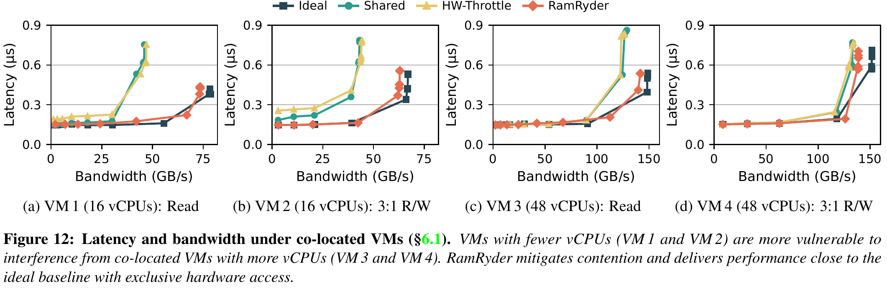

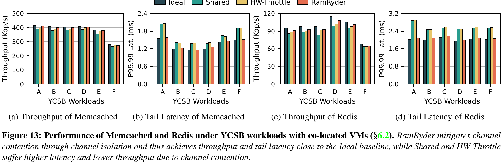

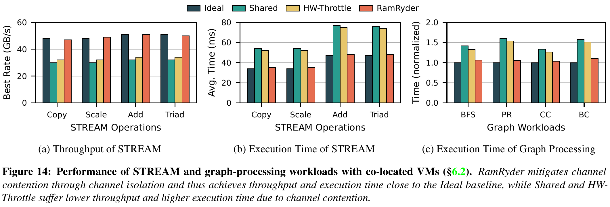

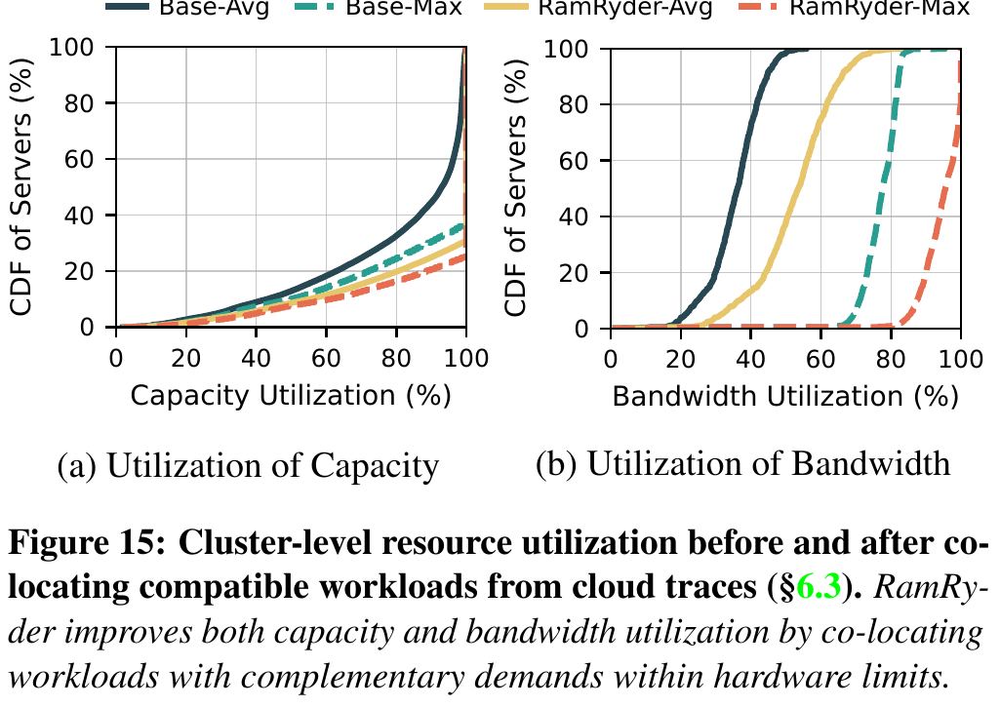

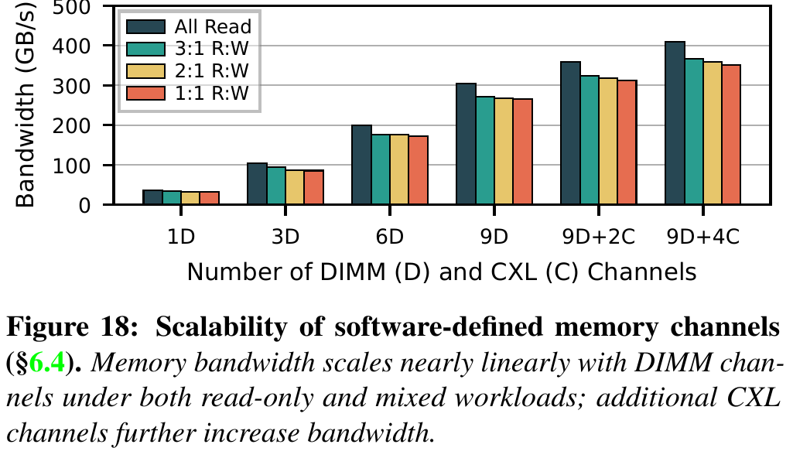

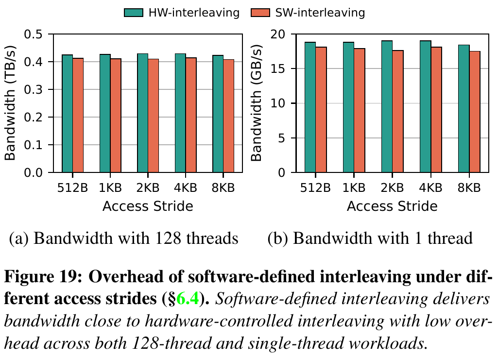

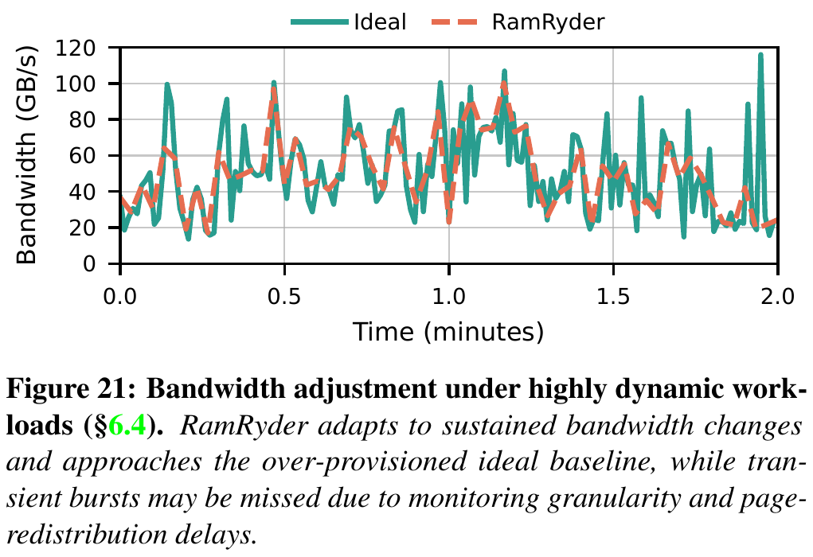

## 6. 论文的亮点与局限

### 6.1 物理通道作为带宽边界

**亮点**：资源管理器能把带宽需求落到可见的硬件供给单元；图 17 用消融实验检查了收益是否主要来自通道隔离。**局限**：通道粒度粗，且 CPU 缓存、CXL 链路和设备内部交织仍可成为共享瓶颈；“分配通道”不能自动等于可执行的带宽 SLA。

### 6.2 容量与带宽分别记账

**亮点**：通道选择决定潜在带宽，页面落点决定是否真正使用；图 8 将容量扩张和带宽扩张区分开。**局限**：二者只是“多数情况下”独立，仍受单通道容量与多 VM 共置限制；缺少单独剥离加权页交织收益的消融结果。

### 6.3 运行时收敛过程可测

**亮点**：图 20 同时给出带宽和时延的时间曲线，清楚显示热插拔后的数秒迁页过程。**局限**：1 秒监测周期和迁移延迟限制突发响应；平稳曲线不能代替对服务 P99/P99.99 的证明。

### 6.4 可在商品服务器上实现

**亮点**：利用启动配置、DAX 映射、ACPI 和现有 NUMA 机制搭建原型。**局限**：需要重启配置和修改客体内核；该代 CXL 设备恰好一设备一 DDR 通道，更复杂设备是否暴露内部通道尚未验证。

## 7. 论文没有解决什么

**论文范围内的未解问题**：单主机以外的多主机 CXL 共享池只在 §7 讨论扩展可能性，没有原型或实验；小于一个通道的 VM 如何在共享通道上兼顾隔离与利用率也未验证；实际云调度要考虑 VM 搬迁、故障域、监控误差和不同设备拓扑，图 15 的配对算法没有覆盖这些成本。

**证据解释边界**：图 13–14 的收益同时包含通道隔离、缓存固定、CXL 分配和页放置，不能把整体改善单独算给某一项。图 15 属于轨迹计算，图 16 才是选定服务器对的负载回放；后者无法把前者转化为生产集群实测。§4.2 的 8:3 与给定带宽数值不一致，是可复现性问题，不应在项目实现中直接抄作参数。

**对本项目特有的空白**：论文未研究 NPU 高带宽显存、跨节点缓存传输、KVCache 的模型与词表版本校验、远端视图租约、前后台 I/O 混压，因而没有直接证明首 Token 响应时间、每 Token 生成耗时或 CPU 正文零拷贝目标。

## 8. 对本项目的启发

### DIRECTLY ADOPT

把容量、可持续带宽与物理拓扑列成独立的调度输入；把“资源已分配”和“数据已到达可消费位置”列成不同状态。前者在论文 §4–6 有明确机制和时间证据，作为原则可直接采用。

### ADAPT

把论文的“VM—通道—页”映射改写为本项目的“请求/KV 分块—链路/介质—物理存储块”映射。硬件能力矩阵（运行时记录各链路带宽、时延和可用状态，供调度器选择路径）必须来自目标平台探测；不同介质还要补上语义校验、租约与重算回退。迁移策略应以推理关键路径为约束，不按 CPU 内存页缺页流程照搬。

### DO NOT COPY

不要复制 BIOS 关闭 DIMM 交织、客体内核 C-NUMA、按页清 present 位触发迁移等 CPU 虚拟机专用实现。它们不提供 NPU 显存原子可见性，也不保证主机 CPU 不搬运 KV 正文。

### VALIDATE

验证目标硬件上“增加链路或介质单元是否增加可用吞吐”、后台迁移是否干扰前台、容量与带宽需求是否可独立满足，以及控制面完成到数据面可消费的真实时间。若这些关系不成立，就应回退到按实测链路状态选路，而不是继续套用通道数量模型。

## 9. 对本项目立项的背书

### 9.1 Problem Validation

**轨迹证据**：图 2、3 表明容量、带宽与计算使用率不同步，说明只按容量统一分配会留下带宽利用问题。它支持本项目分别建模容量与数据搬运能力的必要性，但该轨迹来自 CPU 内存云场景，不能代替 KVCache 工作负载画像。

### 9.2 Mechanism Validation

**单机实测**：图 12、17 验证了“资源边界可见 + 数据放置可控 + 共享瓶颈隔离”在内存系统里的可行性；图 20 验证了控制与数据收敛的时序差别。对本项目有用的是这些因果原则，不是 RamRyder 的具体内核接口和性能数字。

### 9.3 Research-Gap Validation

论文把问题推进到 CPU 内存通道与单主机 CXL，却没有解决异构加速器、跨节点传输、缓存语义安全和推理前台干扰。本项目若能在这些边界上建立可测的净收益和可靠性，才构成实质差异；“论文未研究”本身不等于本项目已可行。

### 9.4 Unsupported Project Claims

本文没有证明本项目的首 Token 时延降低 ≥20%、吞吐提升 ≥10%、前台每 Token 耗时干扰率 <3%；也没有证明主机 CPU 零数据拷贝、跨节点远端直读安全或多维度语义一致性。这些都是项目目标或待测能力，不能写成论文已实现的结果。

### 9.5 Project Establishment Verdict

- **Necessity evidence**：容量与带宽分离建模有原始云轨迹支持。
- **Feasibility evidence**：通道级拓扑控制和放置隔离在单主机 CPU 内存原型上得到实测。
- **Differentiation evidence**：本项目面向 NPU KVCache、跨介质和跨节点推理路径，问题边界与论文不同。
- **Remaining burden of proof**：需在目标硬件与真实推理混压中量化净加速、后台干扰、语义安全与故障回退。

## 10. 建议验证

### Experiment 1：资源单元是否真正提供独立带宽

- **Hypothesis**：目标平台增加一条可用传输链路或存储通路，可提高 KV 分块可持续加载吞吐，且不会按相同比例抬高前台干扰。
- **Variable**：活跃链路/设备数、并发数、块大小与读写方向。
- **Baseline**：单链路固定放置与不感知拓扑的均匀分流。
- **Metric**：实得带宽、P99 加载耗时、前台每 Token 耗时、链路利用率。
- **Controlled conditions**：固定模型、上下文长度、命中率、并发与前后台流量。
- **Pass condition**：带宽随资源增加出现可重复净增益，且前台干扰不越过项目核心数据路径与全链路混压验证阶段的门限。
- **Fail implication**：链路数不能直接当成调度器的带宽额度。
- **Decision affected**：硬件能力矩阵的资源粒度与动态选路公式。

### Experiment 2：控制完成与数据可消费的间隔

- **Hypothesis**：缓存迁移、租约切换或路径变更的控制完成时间显著早于前台可安全消费并获得收益的时间。
- **Variable**：迁移数据量、冷热分布、后台速率、故障注入时点。
- **Baseline**：不迁移、立即全量迁移、惰性迁移三种路径。
- **Metric**：控制完成时间、数据可见时间、P99 首 Token 响应时间、错误消费数、回退耗时。
- **Controlled conditions**：固定 KV 语义版本、租约规则、模型负载与链路条件。
- **Pass condition**：只有数据完整且语义和租约有效时才标记可消费；前台收益与时延按真实收敛时间计量。
- **Fail implication**：必须修改状态机或收紧并发迁移策略，不能按控制命令完成就发布缓存。
- **Decision affected**：缓存状态机、远端直读租约与后台迁移。

### Experiment 3：容量收益与带宽收益能否同时兑现

- **Hypothesis**：容量型与带宽型请求混合时，多介质放置可提升有效缓存容量或命中率，同时维持在线推理时延。
- **Variable**：冷热比例、复用率、容量压力、传输带宽、后台换入换出速率。
- **Baseline**：仅按容量放置、固定比例放置、全本地重算。
- **Metric**：有效命中率、实际加载字节与重算字节、P99 首 Token 响应时间、前台每 Token 耗时干扰率、有效请求综合成本。
- **Controlled conditions**：相同请求序列、模型与词表版本、计算资源和故障条件。
- **Pass condition**：拉取与加载总开销小于本地直接重算耗时，且混压下满足项目全链路验证阶段的时延与干扰门限。
- **Fail implication**：收缩容量型缓存范围或提高重算回退比例，避免把闲置容量误当成可用带宽。
- **Decision affected**：分层容量策略、动态选路和端到端混压门禁。

## 附录：证据与图像说明

本报告嵌入的 15 张图均来自同一原论文 PDF，以 300 DPI 渲染后逐图裁取；保留原图标题、坐标、图例和子图，不重绘数据。图 2 对应问题规模；图 5、18 对应通道带宽前提；图 6–9 对应架构和三条方法链；图 12–15、17、19–21 对应实测、轨迹计算、消融、开销和时间边界。图 15 的 P30、P90 是论文所报告分位点，28.6% 等是相对改善表述，不是“提升 28.6 个百分点”。图 13 的尾部指标是 **P99.99**，图 12 的访存时延是平均值，不应混写为同一时延指标。
