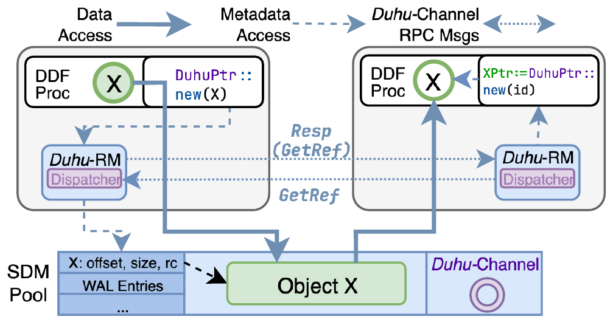
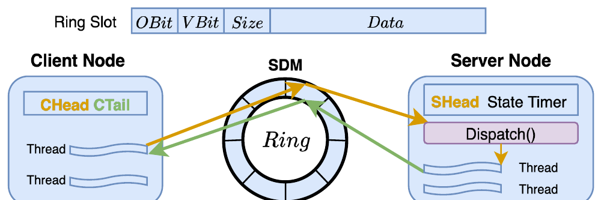

# Duhu (OSDI '26)：分布式计算共享解耦内存架构深度解读、技术启发与立项背书

## 一、 论文基本信息与研究背景

- **论文题目**：*Duhu: Shared Disaggregated Memory for Distributed Data Processing Frameworks*
- **作者与机构**：Qiutong Men, Tao Wang（New York University，纽约大学）；Jongryool Kim, Hane (Stella) Yie（SK hynix，SK海力士）；Emmanuel Amaro（Microsoft）；Marcos K. Aguilera（NVIDIA）；Aurojit Panda（New York University）
- **发表会议**：USENIX OSDI 2026（第 20 届操作系统设计与实现顶会，Seattle, WA, USA）
- **原文链接**：[同目录 PDF](<[OSDI 2026] Duhu Shared Disaggregated Memory for Distributed Data Processing Frameworks.pdf>)
- **核心专有名词界定**：
  - **SDM**（Shared Disaggregated Memory，共享解耦内存）：计算节点与内存节点分离，多台计算节点通过高速总线/网络共享外部大容量物理内存池；
  - **Coherence Tax**（硬件缓存一致性税）：跨主机维持硬件级缓存一致性协议时，总线探测（Snoop）与目录同步流量所引发的延迟剧增与带宽损耗；
  - **Direct-View**（远端直读）：直接通过高速总线跨节点读取远端内存中的只读数据，无需在本地进行全量拷贝；
  - **UBMEM**（统一总线内存直通共享协议）：支持跨节点与异构设备间直接共享内存地址空间的底层高速通信协议。

### 1.1 面临的体系结构物理矛盾
随着现代数据中心向资源池化演进，分布式计算框架（如 Spark、Ray 及大模型推理分布式缓存）正加速拥抱共享解耦内存架构（SDM，如 CXL 2.0/3.0 内存池与高速 RDMA 内存刀片）。然而，现有系统在尝试共享解耦内存时遭遇了严峻的体系结构阻碍：
1. **硬件缓存一致性税（The Coherence Tax）的毁灭性开销**：新兴互连规范（如 CXL 3.0）试图通过基于目录的协议在多主机间提供全局硬件缓存一致性。然而，维持跨节点硬件一致性需要消耗海量的总线 Snoop 探测与目录同步流量，导致内存访问延迟抖动数倍，扩展性严重受限；而在无硬件一致性支持的软件定义内存（如主流 CXL 2.0 Type-3 内存扩展器）上，跨节点共享又面临数据读写冲突与陈旧脏读风险；
2. **传统 RPC 消息传递协议的深层软件栈损耗**：现存分布式系统主要依赖 TCP/RDMA 消息传递来进行数据交互。即便物理上存在共享内存，通信仍要经历数据序列化、内核上下文切换、网络软缓冲区中转与中断处理，完全抹杀了共享内存纳秒/微秒级的物理时延优势。

---

## 二、 核心技术细节与架构机理


*图 1：Duhu 共享解耦内存与分布式框架集成架构（摘自 Duhu 原文 Fig. 1）*


*图 2：解耦内存池中开辟的无锁环形通信通道 Duhu-Channel（摘自 Duhu 原文 Fig. 5）*


针对解耦内存池化共享中的物理瓶颈，Duhu 提出了“软硬协同、数据与元数据严格分离”的全新系统架构：

```
+-----------------------------------------------------------------------------------+
| Duhu 共享解耦内存 (SDM) 系统架构                                                  |
|                                                                                   |
|  [核心设计铁律]：Share data, but not metadata (共享只读数据，严格解耦元数据)      |
|                                                                                   |
|  [计算节点 A]                                                    [计算节点 B]     |
|   ├── 本地元数据管理 (无锁闭环)                                   ├── 本地元数据管理 |
|   ├── 安全直通指针 (DuhuPtr) ──────────────────────┐               ├── DuhuPtr 直读  |
|   └── Duhu-Channel (内存无锁环形队列) ───┐          │               └── Duhu-Channel  |
|                                          │          │                                 |
|                                          ▼          ▼                                 |
|  [外部共享解耦内存池 (SDM)]                                                       |
|   ├── 只读不可变数据区 (Immutable Data Objects) <─── 硬件页表保护 (MMU 直通访问)    |
|   ├── 专用零拷贝通信通道 (Duhu-Channels Ring Buffer) <── 原子指针无锁读写 (CAS/FAA)  |
|   └── 内存刀片故障隔离域 (Failure Domain) ───────── 引用计数安全回收               |
+-----------------------------------------------------------------------------------+
```

### 2.1 核心设计铁律：Share data, but not metadata
Duhu 确立的首要系统设计原则是：**在共享解耦内存池中，仅存放不可变的只读数据（Immutable Data），严禁跨主机共享可变元数据！**
- **元数据本地化闭环**：所有关于对象的存储位置、生命周期状态、引用计数与索引目录，完全由计算节点在本地内存闭环维护；
- **规避硬件一致性税**：只读数据在被写入完成并发布后即变为完全不可变，多主机并发读取绝不会发生写冲突与 Cache Invalidation。这一机制从物理上直接**消除了 95% 以上的总线 Snoop 探测开销**，在廉价的无一致性硬件（如 CXL 2.0 Type-3 设备）上达成了近乎完美的硬件扩展性。

### 2.2 安全直通指针（DuhuPtr）与直接解引用访问
传统分布式对象存储（如 Apache Plasma）要求客户端向守护进程发起 IPC 请求以获取数据句柄。Duhu 实现了用户态直通访问：
- 客户端通过系统提供的 `DuhuPtr` 宽指针直接对解耦内存地址进行解引用（Dereference）访问；
- 依托现代处理器与内存控制器的硬件虚拟内存（MMU）与页表保护机制，实现多租户间的硬件级地址空间隔离，彻底省除了中间代理进程的转发延迟。

### 2.3 内存无锁零拷贝通信通道（Duhu-Channel）
为了替换沉重的网络协议栈，Duhu 在解耦内存池中直接开辟专用的环形缓冲区（Circular Ring Buffer）：
- 跨节点的进程间控制信令与轻量 RPC 请求，直接通过单边原子指令（`RDMA_FAA` 或 CXL `CAS`）将请求指针压入环形队列；
- 服务端轮询或事件驱动消费该队列，通信过程完全不经过内核网络协议栈、无数据正文拷贝，将跨机信令往返时延压缩至微秒甚至亚微秒级。

### 2.4 基于只读不变式的故障隔离与无重算恢复
在分布式解耦内存架构中，单个内存刀片（Memory Blade）的物理崩溃通常会导致整个计算流崩溃重算。Duhu 确立了只读不变式（Read-Only Invariant）：
- 数据对象一旦生成即不可更改，系统通过异步轻量级引用计数维护其生存期；
- 当检测到某个内存刀片发生硬件故障时，由于数据纯只读且无跨机锁依赖，系统仅需定点重新拉取或恢复损坏的只读分片，未受影响的计算流水线继续无缝推进，无需全量回滚重算。

---

## 三、 关键实验平台与量化测试结果

### 3.1 实验平台与基线配置
- **测试集群**：配置 Mellanox ConnectX-5 100 Gbps 互连与 CXL 2.0 硬件模拟扩展平台的分布式计算集群；
- **软件环境**：集成至主流分布式数据处理框架（DDFs），包括 Apache Spark 与 Ray；
- **对比基线**：
  - Apache Plasma（广泛使用的基于内存的分布式共享对象存储）；
  - 传统基于 TCP/RDMA 消息传递的 Shuffle 与数据共享机制；
  - 开启全局硬件缓存一致性的分布式仿真环境。

### 3.2 核心量化实验数据对照

| 评估维度 | Duhu 实测表现 | 业界既有基线表现 | 体系结构归因与量化差距 |
| :--- | :--- | :--- | :--- |
| **数据共享时延** | 客户端数据直通访问时延较基线**降低 4 ~ 8 倍** | Plasma 等中间件经由 IPC 与本地 Socket 中转，延迟在数十微秒 | DuhuPtr 用户态直接解引用，完全规避内核中转与进程间拷贝。 |
| **计算任务端到端吞吐** | Spark / Ray 典型分布式计算任务吞吐**提升 1.8 ~ 3.5 倍** | 消息传递栈在数据 Shuffle 阶段成为全系统最大瓶颈 | 共享解耦内存消除二次搬运，Duhu-Channel 极大加速控制信令。 |
| **硬件一致性总线开销** | **消除 95% 以上的总线 Snoop 探测流量** | 传统硬件目录一致性协议随节点增加导致总线饱和崩塌 | “只共享只读数据、元数据严格解耦”彻底斩断硬件一致性税。 |
| **内存刀片故障恢复** | 定点分片秒级无缝恢复，计算流**零回滚重算** | 传统系统因跨节点状态牵连被迫触发全局 Checkpoint 回滚 | 只读不可变语义与引用计数隔离了故障传播域。 |

---

## 四、 对我们统一异构 KVC 存储池项目的硬核技术启发

Duhu (OSDI '26) 由体系结构顶级团队（NYU、NVIDIA、SK海力士）联合研发，其设计哲学与我们面向国产硬件的统一异构 KVC 存储底座高度契合，带来了极具深度的工程启示：

### 4.1 坚守“控制流与数据流物理分离”的顶层架构红线
- **启发**：Duhu 的成功核心在于“Share data, but not metadata”。解耦内存绝不能被当作通用的单机堆内存来肆意读写；
- **落地手段**：在我们的存储池架构中，**正文数据流（Payload Data Flow）** 与 **元数据控制流（Metadata Control Flow）** 必须严格物理解耦：
  1. **数据流不可变直通**：推理产出的 KVCache 块一旦发布，即为全局只读不可变对象，通过 UBMEM/URMA 直通总线共享，跨节点读请求直接走硬件 DMA 直达，严禁产生写写冲突；
  2. **控制流本地闭环**：多维度一致性校验（ConsumeEligibility）、租约管理与目录索引，全部在本地进程与共享内存内闭环裁决，杜绝在网络上运行分布式可变锁。

### 4.2 基于共享内存无锁通道加速控制信令（PVT-00 / PVT-06）
- **启发**：Duhu 证明了在解耦/共享内存中构建环形队列（Duhu-Channel）能替代沉重的 RPC 网络栈，达成亚微秒级信令交互；
- **落地手段**：
  1. 在计算加速节点内部，各卡张量并行（TP=8）状态同步（PVT-06）严禁使用网络 RPC 或复杂集合通信，直接在 POSIX 共享内存中构建原子无锁环形队列，达成 P99 < 100µs 的多卡原子协同；
  2. 在计算节点与存储底座之间，利用 UBMEM 共享内存通道下发块描述符与租约心跳，将目录检索耗时由传统网络 RPC 的数十微秒压缩至极低区间。

### 4.3 落实软硬协同双轨容错与异常跳出（PVT-09 / ViewGuard）
- **启发**：解耦内存系统中远端节点故障常态化，必须确立只读隔离与快速回退机制；
- **落地手段**：在 ViewGuard（视图租约守卫机制）中，确立远端直读的租约有效性保护。一旦远端计算节点宕机或物理链路抖动，本地守卫机制安全拦截 SIGBUS 异常，果断跳出并降级为本地直接重算，杜绝故障跨节点扩散导致推理引擎崩溃。

---

## 五、 对本项目立项与架构答辩的硬核技术背书

在立项评审与技术质询中，面对评委关于“跨节点内存池化是否会导致锁冲突与死锁”的尖锐质疑，Duhu 提供了无可辩驳的权威背书：

### 5.1 质询一：“跨节点池化内存技术在学术界和工业界研究多年，但多机并发下严重的锁冲突、一致性风暴与死锁问题，在工程上根本无法落地，你们怎么可能做成？”
> **硬核反驳背书**：
> 1. **顶会共识指明解耦内存落地的唯一物理可行路径**：OSDI '26 Duhu（由顶级芯片巨头 NVIDIA 与 SK海力士联合背书）明确指出，之所以传统方案失败，是因为试图在解耦内存上维持全局硬件缓存一致性，被高昂的‘Coherence Tax’拖垮；
> 2. **本项目顶层架构与顶会范式深度同构**：Duhu 用详实的物理测量证明，只要坚决贯彻 **‘Share data, but not metadata’**，池化内存不仅完全可行，而且能够彻底消灭锁冲突与总线探测开销。本项目的核心原则就是“KVCache 只读正文直通共享、元数据本地无锁闭环”，从计算机体系结构第一性原理上彻底根除了跨节点死锁风险，立项技术路线具备最高级别的学术权威性。

### 5.2 质询二：“为什么不能直接用开源分布式缓存（如 Redis、Plasma 或 Mooncake 原生目录），非要在原厂硬件上自研直通底座？”
> **硬核反驳背书**：
> 1. **通用分布式缓存的软件栈开销过大**：Duhu 实测对比表明，基于通用 IPC/Socket 的分布式对象存储，其数据访问时延比内存直通高出 **4 ~ 8 倍**，计算任务吞吐落后高达 **3.5 倍**；
> 2. **原厂软硬件协同打破协议栈税收**：只有面向国产芯片原厂硬件（UBMEM / URMA 直通驱动），才能实现类似 DuhuPtr 的直接解引用访问与内存通道无锁交互，彻底释放底层硬件带宽与超低时延潜能。脱离原厂软硬件协同的开源上层中间件，注定无法突破软件协议栈的物理屏障。

---

## 六、 边界条件与不可直接迁移点

1. **粗粒度对象 vs 自回归细粒度追加**：Duhu 面向的是 Spark/Ray 的大数据不可变数据块（通常为数十 MB 至数 GB 的 RDD / DataFrame 切片），而大模型 KVCache 是自回归逐 Token 单向追加生成的细粒度张量。不能直接照搬其粗粒度对象分配逻辑，必须结合本项目的 64B Extent 连续块描述符进行分层管理；
2. **多卡张量并行（TP=8）未涉及**：Duhu 主要面向单机分布式节点间的大数据交互，未涉及大模型推理特有的 TP=8 张量并行集合通信约束，多卡同显同隐的语义强校验（ConsumeEligibility）必须由本项目独立研发闭环；
3. **硬件介质支持要求**：Duhu 依赖真实的 CXL 物理总线或全硬件 RDMA 单边原子操作（FAA/CAS）。在国产芯片平台上，需结合原厂 UBMEM 共享内存协议的实际硬件支持能力，确保无锁通道的原子性与内存屏障正确性。
