# Duhu：面向分布式数据处理框架的共享池化内存对象存储——论文解构与项目启示（V01）

> **原文**：Qiutong Men 等，*Duhu: Shared Disaggregated Memory for Distributed Data Processing Frameworks*，OSDI 2026，论文集 pp. 921–934。本文仅以同目录的目标 PDF 为论文事实来源。下文“论文实测”“作者推断”“本文分析”和“项目待验证目标”分别标注，避免混用。PDF 物理页码比论文集页码多 1 页封面。
>
 **术语**：共享池化内存（Shared Disaggregated Memory，SDM）指由多个计算节点通过内存互联共同映射的外部内存；CXL（Compute Express Link，连接处理器与外部内存的互联总线）是论文原型采用的访问路径。DDF（Distributed Data Processing Framework，分布式数据处理框架）在本文主要指 Ray 这类以对象存储传递中间结果的系统。NPU（Neural Processing Unit，用于执行大模型计算的 AI 加速器）是本项目关注的设备，与论文 CPU 读共享内存的实验平台不同。

## 1. 一页读懂论文

### 1.1 论文解决什么问题？

Ray 等框架把中间对象传给远端任务时，通常先复制到接收节点的本地内存。对象被多个任务消费，或者经历多次 Shuffle（按键重新组织并分发中间数据）时，这条路径重复占用网络、CPU 与本地内存。Duhu 试图让不同节点直接读取共享内存中的同一份对象，同时保留框架原有的任务调度与故障重算能力（§1–3）。

### 1.2 根因是什么？

**可见症状**是网络复制和多份对象占用内存。**根因**是现有对象引用仅是可传递的标识；消费者最终仍要拉取一份本地副本。把数据放进共享内存也不自动解决问题：论文使用的内存池不提供跨节点硬件缓存一致性，元数据更新、地址复用和对象释放都需要软件建立安全边界（§2.1–3）。

### 1.3 核心洞察是什么？

框架的中间对象创建后通常不可变，而对象位置、引用关系等元数据会持续变化。Duhu 因此让多个节点共享只读数据，把可变元数据交给单一分段所有者处理；跨节点只传控制请求，读数据时直接解引用共享地址（§1、§3.1）。

### 1.4 核心抽象是什么？

Duhu 把**全局可传递的对象 ID**与**仅在当前节点有效、可解引用的 DuhuPtr**分开。`GetObj(ID)`先经引用管理器登记消费资格，再返回映射到同一共享内存地址的指针；`DropRef`声明不再使用。这个 API 把缓存同步、元数据协调和释放时机封装在对象存储内部，而不是要求应用逐处处理非一致性内存（§3.2、表 1）。

### 1.5 关键优化方法速览

#### 方法 1：不可变对象共享直读与延迟入池

- **问题**：远端消费者反复复制完整对象；把仅本机使用的对象提前写入共享池又会白付一次搬运。
- **方法**：对象发布后保持不可变，消费者持有效引用直接读共享内存；Ray 集成层等到首次远端访问或本地内存压力出现才把对象写入共享池，并在发布和首次读取边界处理处理器缓存。
- **效果**：多个消费者从“各有一份本地副本”变为“共读一份共享对象”；初始本地到共享池的拷贝仍然存在。
- **关键证据**：图 13 的 200 MB、四消费者扇出测试中，平均等待时间相对 Ray 缩短 2.80–4.29 倍（§8.3.2）。

#### 方法 2：分段元数据单主协调

- **问题**：跨节点直接更新对象地址、引用位图和空闲空间，在非一致性内存上会遇到竞争与陈旧缓存。
- **方法**：共享池划为分段，每段至多有一个所有者；其他节点向所有者发请求，由其顺序维护该段元数据。
- **效果**：把可变元数据的跨节点并发写变成分段内单主写，避免为数据对象逐缓存行做全局一致性协调；远端元数据操作需要一次控制通信。
- **关键证据**：图 3、图 4给出布局和请求路径；论文没有单独量化分段所有权相对其他元数据方案的收益。

#### 方法 3：共享内存承载请求、网络按需通知的控制通道

- **问题**：分段单主使远端元数据操作依赖低延迟跨节点 RPC（Remote Procedure Call，远程过程调用）；仅靠非一致性共享内存无法唤醒另一节点。
- **方法**：Duhu-Channel 用共享内存中的 64 B 槽位传请求与响应，用网络消息在服务端停止轮询时通知；忙时轮询，空闲时退避。
- **效果**：小控制消息不走完整网络数据传输路径，同时避免永久轮询占用内存带宽。
- **关键证据**：图 12 测得约 300 万次请求/秒时 3.8 µs RPC 延迟；论文所用 RDMA（Remote Direct Memory Access，远程直接内存访问）基线限制为单个未完成请求（§8.3.1）。

#### 方法 4：引用计数与日志恢复

- **问题**：共享一份对象后，节点不能再独立删除本地副本；节点失效还可能留下半完成元数据操作或悬空指针。
- **方法**：按节点追踪引用，在引用清零后回收；元数据操作先写日志，接管者重放有限的未完成请求；内存设备失效时转交框架原有的重算路径。
- **效果**：把“本机垃圾回收”改为“跨节点生命周期约束”，为共享直读建立安全前提。
- **关键证据**：§4.2、§6 给出协议与不变量；论文没有实测故障恢复时间或混合故障下的端到端正确性。

#### 方法 5：仅重组切片元数据的多阶段 Shuffle

- **问题**：传统 Shuffle 每阶段按分区复制中间数据；重复 Shuffle 使同一批字节多次跨节点移动。
- **方法**：FlexShuffle 保存未分区的对象，为各分区生成偏移与长度切片；后续阶段修改切片集合，让任务按引用读取底层对象。
- **效果**：首阶段仍需把数据放入共享池，后续阶段主要重组元数据，不再重复搬运同一批数据。
- **关键证据**：图 6、图 7 的四阶段测试最高缩短任务完成时间 3.39 倍；64 GB 工况因首次拷贝成本出现约 1.01 倍的轻微变慢（§8.2.1）。

### 1.6 最重要的实验结果是什么？

**论文实测**：四阶段 Shuffle、32 个 map 任务与 32 个 reduce 任务、8–64 GB 数据、对应 0.75–6 GB 本地对象存储条件下，FlexShuffle 相对 Exoshuffle 的任务完成时间最高改善 3.39 倍，但 64 GB 工况略慢。其原因可由图 7 看到：首个 reduce 阶段要承担写入共享池的成本，后续阶段才获得 3.59–13.81 倍的阶段收益。**边界实测**：TPC-H（数据库决策支持基准）在 Modin（基于 Ray 的分布式数据表处理库）上平均只改善 1.08 倍，四个较短查询约慢 1.2 倍。图 14–15 同时显示，按引用读取减少总体完成时间，却增加远端数据上的计算时间（§8.2–8.3）。

### 1.7 最大局限是什么？

共享读把复制成本转成远端访问成本。对象只读少量数据、被多个节点读取或跨多阶段复用时划算；小对象高频本地复用、顺序扫描、首次写入占主导时可能不划算。论文 FPGA（现场可编程门阵列，用于实现内存池研究原型）的共享池约 10 GB/s、600–800 ns，且对象必须先在本地构造后复制入池。图 9 的更快内存结果来自单机 NUMA（非统一内存访问，以不同内存节点模拟访问快慢）仿真，不能视为未来 CXL 设备实测（§7–10）。

### 1.8 为什么与本项目相关？

- **必要性证据**：论文实测说明，跨任务重复复制大型中间对象会形成可观的网络与内存代价；这支持本项目检查 KVCache（大模型注意力键值缓存，保存历史 Key/Value 激活以避免重复计算）复用路径中的重复搬运。
- **可行性证据**：在特定 CPU 共享池硬件与不可变对象语义下，分离数据直读和元数据协调能够运行，并带来特定负载收益。
- **差异化空间**：本项目面对 NPU 显存、跨介质数据路径、模型与词表语义版本，以及在线推理尾延迟；论文没有解决这些条件。
- **剩余举证责任**：需要独立证明 NPU 可访问路径、Host CPU 零数据拷贝（CPU 仅下发控制指令，不搬运正文数据）、视图租约故障语义、加载与重算分界，以及 E3（全链路前后台混压验证阶段）目标。Duhu 的 CPU 端结果不能替代这些实测。

## 2. 为什么这个问题值得解决

Ray 一类框架用不可变对象存储连接任务，保留了调度位置自由度和失败后重算能力。代价是消费者访问对象之前必须拉到本地。即使 RPC 只传对象 ID，读取路径仍会创建副本，所以“传引用”这个接口形式不等于“按共享地址读取”。论文选择 SDM，是因为多个节点可以通过加载/存储指令访问同一物理对象（§1–2）。

难点在于目标 CXL 2.0 Type 3 内存池只保证节点内部的一致性。若多个节点任意修改共享元数据，缓存中的旧值、并发分配、过早释放都可能破坏对象语义。论文把硬件全局一致性的成本分析为失效确认的慢节点约束、协议带宽开销和目录状态的容量压力（§2.3）。这些是架构动机，不是论文对“所有一致性硬件都较慢”的实测定量结论。

不可变数据是可行性前提：写入完成并公布后，消费者只读；变化频繁的对象地址和引用状态由所有者管理。此处仍有一个容易漏掉的细节：共享内存地址在对象释放后会被复用，所以“对象内容不可变”并不意味着“物理地址永不变化”。读者首次取得新对象指针前必须清掉可能残留的旧缓存行（§4.1）。

## 3. 核心抽象与系统设计

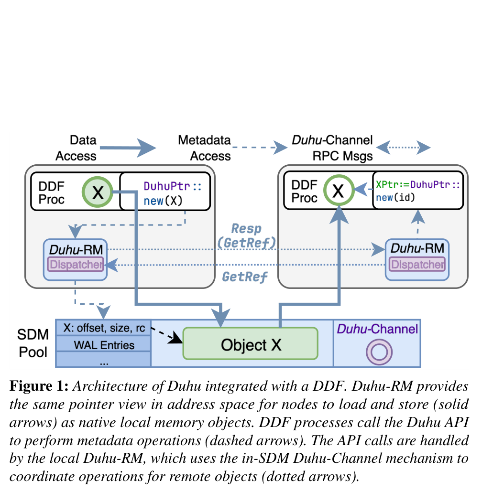

*图 1，原论文 p. 923 / PDF 第 4 页。实线是对象数据的共享内存访问，虚线是 API/元数据路径。图中 DuhuPtr 的可解引用语义比“仅传对象键”更强。*

框架在任务之间传全局 ID；消费者调用 `GetObj` 后才获得本地有效的 `DuhuPtr`。所有节点将共享分段映射到相同虚拟地址，便于按指针访问。对象内容留在共享池，引用关系、对象地址、大小、分配表和预写日志（Write-Ahead Log，WAL：操作执行前记录可恢复请求）按段组织。控制面决定“谁有权得到引用、何时可释放”，数据面在资格建立后直接读对象（§3–4）。

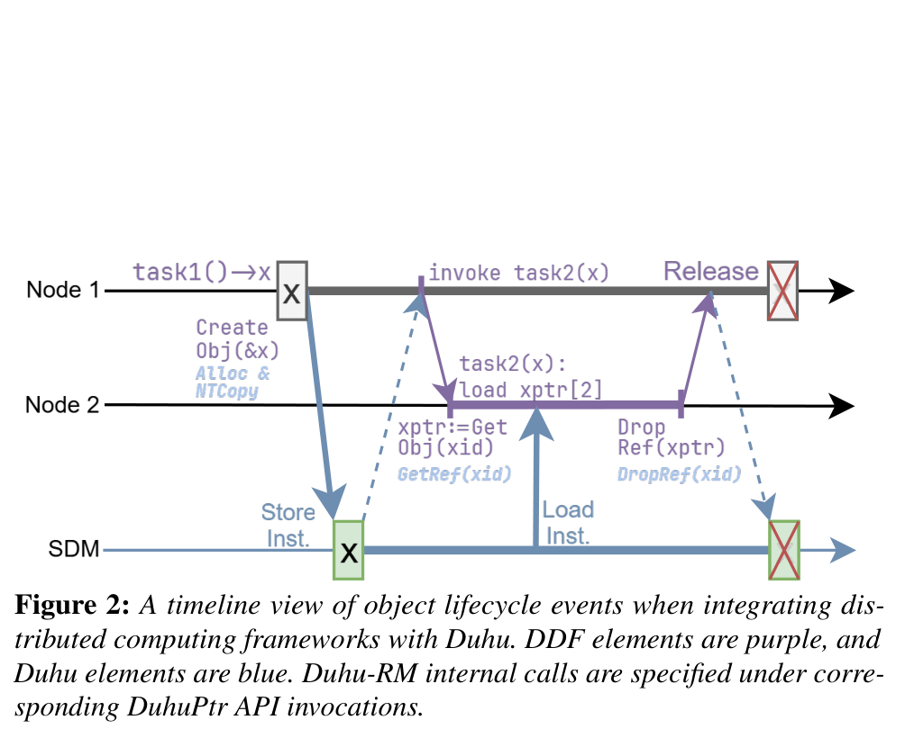

*图 2，原论文 p. 925 / PDF 第 6 页。时间线上先有本地对象构造与入池，再有远端 `GetObj`；这说明 Duhu 没有消除首次本地到共享池的复制。*

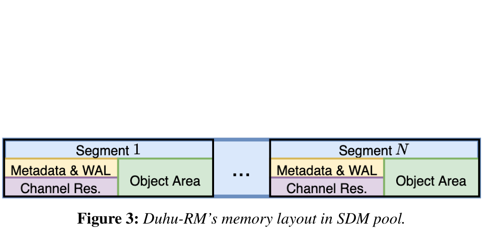

*图 3，原论文 p. 925 / PDF 第 6 页。每段元数据和对象内容同处一个故障单元；分段所有者只独占元数据操作，其他节点仍可读已发布对象。*

**关键不变量**有四条。第一，发布对象前数据必须已写入共享池，消费者拿到指针后内容不再改写。第二，每段同时至多一个元数据所有者；所有远端修改先路由给它。第三，引用登记早于对象使用，清零晚于最后一次使用。第四，日志记录早于元数据执行，故障接管前必须恢复分配状态和未完成请求。图 13 证明共享一份对象可减少多消费者等待，图 7 证明多阶段复用价值；缓存安全和故障不变量主要由协议论证支撑，缺少故障注入实测。

## 4. 关键技术实现与作用机理

### 4.1 不可变对象共享直读与延迟入池

#### 解决的问题

基线 Ray 将对象从生产节点传到各消费节点的本地存储。若一个对象有多个远端消费者，网络字节数随消费者数增加。直接把所有本地对象放入共享池也不合适，因为许多对象从未离开生产节点（§7）。

#### 核心方法

对需要跨节点访问的不可变对象创建一份共享池副本，消费者登记引用后直接解引用；仅本机消费的对象延迟入池。

#### 实现路径

1. 生产任务先在本地内存构造对象；Ray 集成层在首次远端访问或本地内存压力出现时调用共享池分配及复制。
2. 写者用非暂存写和内存栅栏保证数据在发布前到达共享池；`CreateObj` 完成后对象不可修改。
3. 消费节点调用 `GetObj` 登记引用；返回数据指针前失效相应缓存行，避免读到同一地址的旧对象。后续读操作不逐次协调元数据（§4.1、§7）。

#### 资源 / 状态变化

每个远端消费者各存一份副本 → 生产者一次入池、多个消费者共享读取。首次入池仍占用 CPU 与共享池写带宽；随后读取占用共享池读带宽和远端访问时延。

#### 为什么有效

对象数据在发布后不变，读者之间不会产生写写冲突。节省量取决于复用次数和是否只读一部分数据；远端随机访问成本则成为新的限制。

#### 达到的优化效果

**直接效果**：扇出数据避免为每个远端节点重复传一份。**端到端效果**：图 13 的 16–64 组扇出测试中等待时间改善 2.80–4.29 倍；这不是所有工作负载的通用倍数。

#### 论文证据

图 13：每组一名生产者创建 200 MB 浮点数组，四名消费者分布在四台服务器，其中三名为远端消费者；Ray 的远端复制量因此是共享入池方案的三倍（§8.3.2）。图 15 显示共享直读的计算时间可能更长。

#### 亮点

把“一致性处理”压缩到对象发布与新引用建立两个边界，日常数据读取无需跨节点控制交互。

#### 代价与局限

首次入池不是零拷贝；大对象仅消费一次，或者小对象在本地反复读取时，远端时延可能盖过副本节省。论文尚未实现直接在共享池创建对象或从磁盘直接写入共享池（§10）。

#### 对项目的意义

**ADAPT**：把已完成且语义固定的 KVCache 片段作为候选共享单元；必须另行证明 NPU 对远端地址的读语义和失效处理，不能把 CPU 可解引用直接外推到 NPU。

### 4.2 分段元数据单主协调

#### 解决的问题

分配、引用登记和删除都会修改元数据。没有跨节点硬件一致性时，多节点直接更新一份共享哈希表会面临陈旧缓存与并发冲突（§3.1、§4）。

#### 核心方法

共享池按段划分，每段元数据由一个节点独占维护；对象 ID 编码所在段，其他节点按 ID 找到所有者并发送控制请求。

#### 实现路径

`CreateObj` 由目标段所有者分配空间并记录地址；`GetObj` 由所有者更新持有者位图并返回地址；`DropRef` 清除持有者状态，满足释放条件后回收空间。调度器可通过创建接口的 owner 参数影响放置。跨节点请求执行前先写 WAL（表 1、表 2、图 4）。

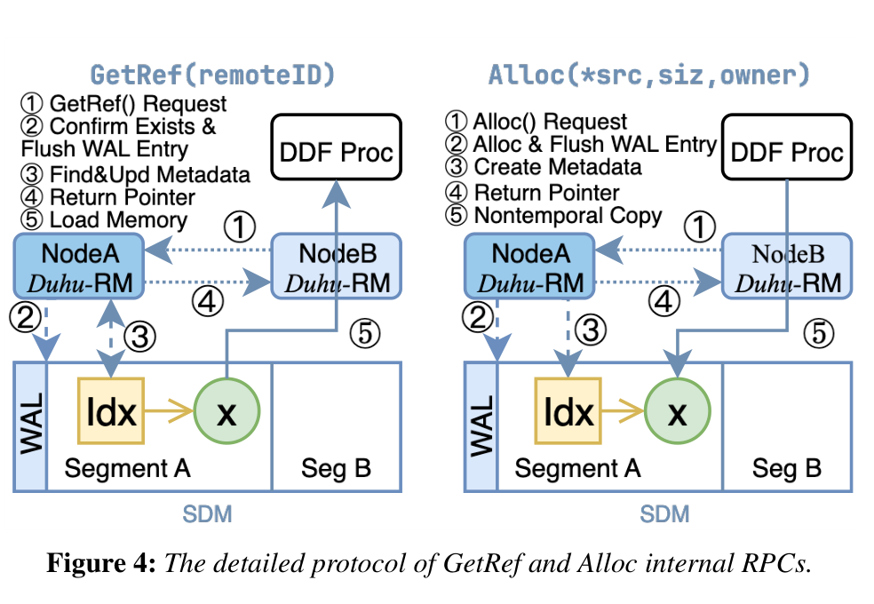

*图 4，原论文 p. 926 / PDF 第 7 页。请求先到段所有者，日志先于元数据修改；其中 Alloc 后续仍要进行对象复制。*

#### 资源 / 状态变化

多节点竞争更新共享元数据 → 每段单节点顺序更新；代价是非所有者的控制请求增加一次跨节点往返。

#### 为什么有效

单主消除了同段可变元数据上的跨节点写竞争，按段分散所有权又避免一个全局元数据管理器承受全部请求。

#### 达到的优化效果

**直接效果**：元数据拥有明确序列化点和故障接管单位。**端到端效果**：论文未单独隔离测量这一设计相对“全局管理器”或“分布式锁”的收益，不能把 3.39 倍归因于分段本身。

#### 论文证据

图 3–4 与 §4 描述段布局、ID 路由和 WAL 顺序；§8.1 原型把 128 GB 共享池划为 16 段，段日志和元数据合计约 128 MB。

#### 亮点

共享的数据对象和私有写的元数据同处一段，数据共享范围与元数据一致性范围被清楚地区分。

#### 代价与局限

热门段的所有者可能变成控制热点；论文没有给出按对象分布、段数或热点程度变化时的扩展曲线。所有者故障需要广播接管和日志重放。

#### 对项目的意义

**ADAPT**：可借鉴“数据可多方读取、租约与目录由明确所有者维护”的边界；本项目还须处理模型版本、词表、模板、适配器与 Ready 位，不能只复用地址和引用位图。

### 4.3 共享内存承载请求、网络按需通知的控制通道

#### 解决的问题

分段所有者需要被远端节点快速调用，但在非一致性共享池中，一节点写槽位不会自动唤醒另一节点。一直轮询又会消耗共享池带宽（§5）。

#### 核心方法

以共享内存环形槽位传小请求和响应；服务端短时轮询，在空闲后阻塞，由传统网络消息按需唤醒。

#### 实现路径

客户端原子预留 64 B 槽位，写入请求、所有权位与版本位，再用非暂存写和栅栏提交；服务端在轮询时失效缓存行、检查所有权位、分派同一对象到同一执行线程，处理后把响应写回原槽位。若通道进入空闲态，客户端先发网络通知。槽位版本用于故障重放时排除已经复用的槽位（§5–6）。

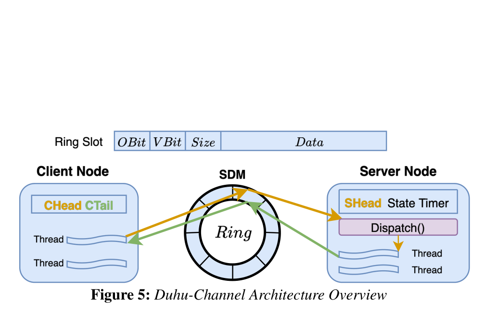

*图 5，原论文 p. 927 / PDF 第 8 页。共享内存传消息正文，网络只在需要唤醒时参与；它不是业务对象的大块数据传输通道。*

#### 资源 / 状态变化

每次控制调用都经网络发送完整消息 → 小消息写入共享池，网络仅按需发通知；恒定轮询 → 活跃轮询与空闲阻塞切换。

#### 为什么有效

每次元数据操作的消息量小于 63 B，64 B 槽位便于原子读写；共享池访问可减少网络软件栈开销。空闲通知解决非一致性内存不具备远端写入唤醒语义的问题。

#### 达到的优化效果

**直接效果**：原型中小 RPC 的吞吐与延迟优于论文配置的 TCP 和 RDMA 基线。**端到端效果**：没有独立实验把通道优化从 Duhu 整体收益中拆出。

#### 论文证据

图 12、§8.3.1：Duhu-Channel 在约 300 万请求/秒时为 3.8 µs；RDMA WriteImm 基线在 100 万请求/秒时为 11.74 µs，且只允许一个未完成请求。此比较不能证明它必然优于充分并发调优的 RDMA 控制通道。

#### 亮点

把共享池和网络分工到“载荷”和“唤醒”两个不同功能，适配非一致性内存的实际能力。

#### 代价与局限

每个通道服务于一对节点且有槽位容量上限；增加节点或请求热点时需要评估通道数量、轮询成本和共享池争用。

#### 对项目的意义

**VALIDATE**：若 UBMEM（统一总线内存直通共享协议，用于跨节点共享地址空间）硬件提供类似共享地址，应比较“共享控制槽位+通知”与 URMA（通用远程直接内存访问，用于用户态远端数据传输）控制消息的 P50/P99 和 CPU 占用；不能引用图 12 直接宣布本项目通道达标。

### 4.4 引用计数与日志恢复

#### 解决的问题

共享对象一旦被任一节点提前释放，其他节点持有的指针就可能指向复用空间。段所有者崩溃时，元数据可能部分更新；内存设备失效时，所有指向它的地址都无效（§4.2、§6）。

#### 核心方法

按节点记录对象引用，全部释放后才回收；元数据操作先写入共享池日志，再执行；失效对象交给框架的血缘重算机制处理。

#### 实现路径

`GetObj` 增加引用、`DropRef` 减少引用。节点故障后，编排者广播所有权变化；新所有者扫描元数据表重建分配状态，再按通道检查最近至多 k 条日志，用槽位版本判断请求是否仍待回应，幂等重放。其他节点清除失效节点的引用位。内存设备故障导致读取触发 SIGBUS（访问失效内存映射时的总线错误信号）时，Duhu 调用 DDF 的不可用对象处理路径（§6）。

#### 资源 / 状态变化

节点各自回收本地对象 → 对共享对象实行跨节点引用约束；段所有者内存中临时状态 → 由共享池元数据和日志恢复。故障接管前必须扫描和重放，带来暂停时间。

#### 为什么有效

对象生命周期必须覆盖所有消费者；日志先行和幂等重放防止半完成操作导致重叠分配或错误回应。内存设备丢失的数据由上层既有重算语义恢复。

#### 达到的优化效果

**直接效果**：建立释放与故障接管的协议性安全条件。**端到端效果**：论文未报告故障恢复 P99、接管耗时或注入故障后的任务完成时间，不能把协议描述当作已测得的可用性指标。

#### 论文证据

§4.2、§6.1–6.3 给出引用位图、WAL、版本位和幂等规则；§6.3.2 指出恢复耗时主要受元数据表扫描和日志重放的共享池访问限制，属于分析而非实测曲线。

#### 亮点

把共享对象的安全释放纳入对象存储 API，减少应用层逐处管理悬空引用的负担。

#### 代价与局限

依赖编排者正确检测并广播故障、操作系统产生 SIGBUS，以及上层 DDF 有血缘重算。并发故障、检测延迟和大段恢复窗口未被实测覆盖。

#### 对项目的意义

**ADAPT**：可借鉴“引用/租约先取得、读后释放、故障后重算”的状态机；NPU 的异步访存、DMA 提交和内核执行期间失效不能直接套用 CPU 的 SIGBUS 捕获路径。

### 4.5 仅重组切片元数据的多阶段 Shuffle

#### 解决的问题

Exoshuffle 的 map 阶段按分区生成中间数据，reduce 阶段拉取对应分区；多阶段任务反复移动同一批中间字节（§8.2.1）。

#### 核心方法

FlexShuffle 将未分区的中间对象放在共享池，用“偏移+长度”的切片表达各分区，后续阶段只改变切片集合。

#### 实现路径

map 任务输出未分区对象和各分区切片；reduce 任务收到对象引用及切片，按需读取底层共享数据并计算。多阶段重排时重新组合切片；数据内容没有变化时不再进行下一轮物理复制。

#### 资源 / 状态变化

每阶段复制分区数据 → 首阶段入池一次，后续阶段主要更新切片元数据。收益随着阶段数与重用量增加，但首阶段共享池写入不可省。

#### 为什么有效

Shuffle 的逻辑分区边界不一定需要对应新的物理对象副本。共享地址使各 reduce 任务可以按切片选择原对象中的元素。

#### 达到的优化效果

**直接效果**：图 7 的第二至第四 reduce 阶段节省重复数据搬运。**端到端效果**：图 6 四阶段任务相对 Exoshuffle 最高改善 3.39 倍，64 GB 工况略慢。

#### 论文证据

图 6–9、§8.2.1。8/16/32/64 GB 数据与 0.75/1.5/3/6 GB 本地对象存储配对变化；图 8 的“无 Duhu FlexShuffle”由于本地存储不足而溢写 SSD，是检验共享容量必要性的另一基线。图 9 是单机 NUMA 模拟更快共享池的实验。

#### 亮点

把“数据重排”转为“视图重排”，这是共享对象语义带来的算法层收益，解释了为何纯存储替换不足以复现最高加速比。

#### 代价与局限

高收益依赖多阶段复用和切片可表达的访问模式。原始对象首次入池、远端随机读取和过大的元数据集合仍有成本；论文的 NUMA 结果不能当成未来硬件承诺。

#### 对项目的意义

**ADAPT**：对 KVCache 可考虑“同一已完成前缀数据、多种逻辑索引/请求视图”，但前缀语义一致性、层布局和 NPU 读写路径必须先验证。

## 5. 实验到底证明了什么

**统一实验底座**：四台服务器、100 Gbps 网络、FPGA 原型 CXL 内存池 128 GB、约 10 GB/s 与 600–800 ns；共享池划 16 段。每容器 12 核、30 GB，本地对象存储另按实验指定。部分容器之间的网络被限制到 5 Gbps，以使聚合网络带宽约等于共享池 80 Gbps。论文明确本地系统内存不是这些实验的瓶颈（§8.1）。下表的“倍数”只适用于所列条件。

| Claim | Experiment / Evidence | Conditions & Baseline | Result | What it proves | What it does not prove |
|---|---|---|---|---|---|
| 多阶段重排可省重复搬运 | 图 6–7 | 32 map / 32 reduce，四阶段，8–64 GB；FlexShuffle vs Exoshuffle | JCT（任务完成时间）最高改善 3.39 倍；后续阶段改善 3.59–13.81 倍；64 GB 略慢约 1.01 倍 | 阶段复用可摊薄一次入池成本；成本未摊薄时可能反转 | 不能单独归因于 Duhu-Channel；不能外推任意任务 |
| 共享容量对切片式 Shuffle 必要 | 图 8 | 单阶段 FlexShuffle，有/无 Duhu；无 Duhu 版本因本地容量不足溢写 SSD | 无 Duhu 的 JCT 高 13.34–24.69 倍 | 在该内存配额下，切片并不能替代底层共享容量 | 不能证明所有无共享池部署都产生同等溢写 |
| 更快共享池可能扩大收益 | 图 9 | 单服务器 NUMA 节点模拟共享池，最多 32 GB；另比 2 节点 CXL 与 Exoshuffle | NUMA 版比 CXL 版快 1.10 倍，相对 Exoshuffle 快 2.43–5.79 倍 | 在该仿真条件下，较快共享访问有利 | **作者推断**未来 ASIC 的收益；不是未来 CXL 设备实测 |
| 现有查询收益有明显差异 | 图 10–11 | Modin TPC-H，SF=10，3.4 GB 压缩输入，每节点 5 GB 对象存储；Q5 因基线崩溃而排除 | 跨查询平均改善 1.08 倍；有利查询最高 1.30 倍；四个慢查询约慢 1.2 倍 | 大型中间数据与本地容量压力有利，小查询远端时延不利 | 不代表所有 TPC-H 查询；不能忽略被排除的 Q5 |
| 小控制通道在所测基线下快 | 图 12 | Duhu-Channel vs TCP、RDMA WriteImm；RDMA 基线单个未完成请求 | 300 万 RPS 时 3.8 µs；RDMA 在 100 万 RPS 时 11.74 µs | 原型低延迟控制路径可行 | 不证明相对充分并发 RDMA 的普遍优越性 |
| 一次入池可服务多消费者 | 图 13 | 每组 200 MB、四消费者、三远端；16/32/64 组；Ray vs Duhu-Ray | 平均等待时间缩短 2.80–4.29 倍 | 重复远端复制确实可被共享副本替代 | 不是端到端推理时延；仍有生产者入池等待 |
| 部分读取的总体收益与计算代价并存 | 图 14–15 | 128 任务读取 6.4 GB 数组全部、随机 1/1000 或 1/10000；Ray vs Duhu-Ray | 部分读取下 Duhu-Ray JCT 降低；Ray 在两个随机部分读取工况的计算时间约为 Duhu-Ray 的 0.29 倍 | 少搬数据可压过远端计算变慢 | 不能称远端读取比本地计算快 |
| 复用和热点改变收益边界 | 图 16–17 | 四生产者、128 消费者、200 MB 数组、每次随机读 1% | 对象存活越久两者越快，Ray 的摊销更明显；热点场景二者接近 | 选择共享或本地副本应看复用和访问形态 | 未给出生产负载的自动选路阈值 |

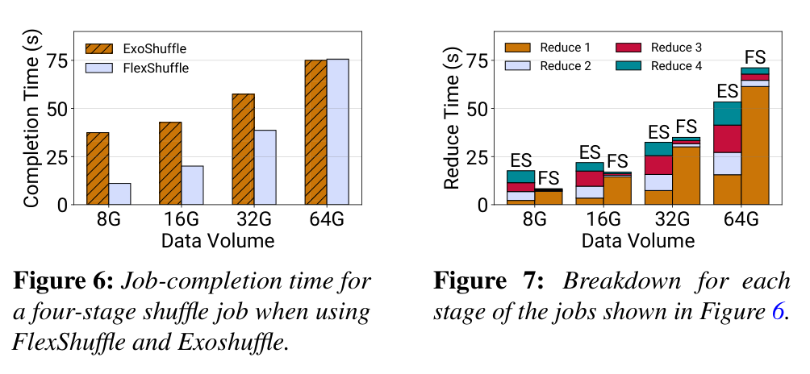

*图 6–7，原论文 p. 931 / PDF 第 12 页。图 7 中第一 reduce 阶段承担入池成本，后续阶段才形成主要收益。*

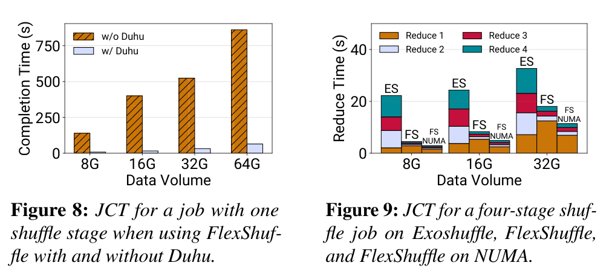

*图 8–9，原论文 p. 931 / PDF 第 12 页。图 8 基线会溢写 SSD；图 9 的 NUMA 共享池是替代硬件环境的仿真，比较规模至多 32 GB。*

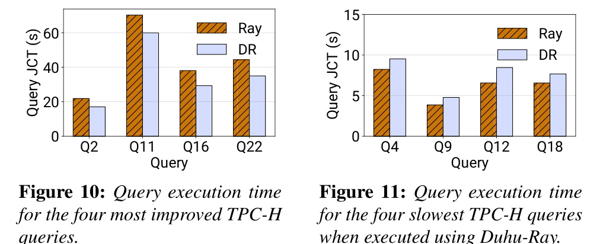

*图 10–11，原论文 p. 931 / PDF 第 12 页。左侧是论文选取的四个收益较大查询，右侧是四个较慢查询。*

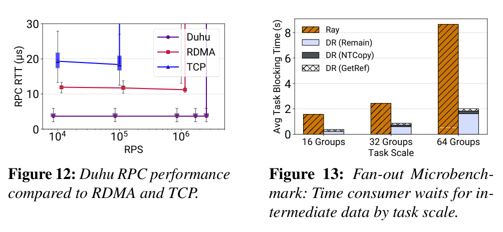

*图 12–13，原论文 p. 932 / PDF 第 13 页。图 12 的 RDMA 基线并发受限；图 13 测的是消费者等待数据的平均时间。*

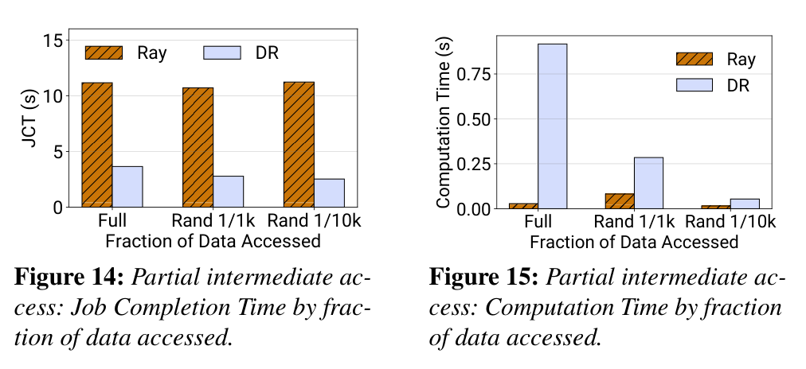

*图 14–15，原论文 p. 932 / PDF 第 13 页。两图必须合看：整体更快与远端数据上计算更慢同时成立。*

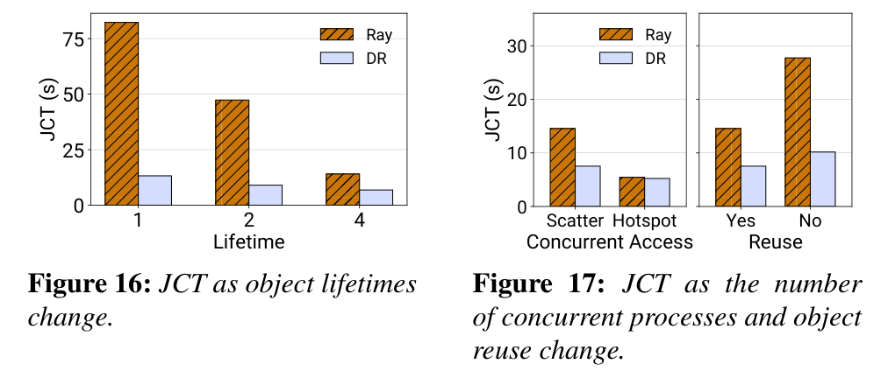

*图 16–17，原论文 p. 932 / PDF 第 13 页。共享池的收益不是对象属性的固定值，会随复用次数和访问分布变化。*

## 6. 论文的亮点与局限

### 6.1 不可变数据共享与可变元数据单主

**亮点**：一致性负担落在元数据操作和对象发布边界，读取对象正文时不必每次协调。**局限**：热对象所在段的单主处理和远端读带宽可能成为瓶颈；论文没有单独给出热点段扩展性测试。

### 6.2 把复制次数与读取时延放在同一张账上

**亮点**：图 6–7、14–15 将首次入池、后续复用、远端计算代价拆开，能解释收益反转。**局限**：论文没有实现依据对象大小、复用次数和访问比例自动选择本地副本或共享直读的策略；§10 只讨论可控复制的可能性。

### 6.3 面向非一致性共享池的控制通道

**亮点**：共享内存承载小请求、网络按需通知，使控制 RPC 与数据读取共用硬件但承担不同职责。**局限**：RDMA 对照组只允许一个未完成请求，图 12 不能作为跨实现、跨负载的控制通道选型定论。

### 6.4 对象共享后的故障语义

**亮点**：引用清零、日志重放、内存失效转上层重算形成了可检查的协议链。**局限**：接管耗时主要由分析估计，缺少故障注入、恢复窗口以及前台尾延迟实测。

## 7. 论文没有解决什么

**论文自身留白**：对象先在本地构造再入池，不能直接证明端到端零拷贝；磁盘数据也先进入本地内存。作者在 §10 把“直接在共享池创建对象”和“从磁盘直接读入共享池”列为后续方向。硬件故障的 SIGBUS 与血缘重算路径有设计描述，但没有恢复时间曲线。单主段的热点、更多节点规模及混合前后台读写干扰也缺少相应实验。

**与本项目的距离**：Duhu 处理 CPU 可读的不可变对象。KVCache 在生成过程中增量写入，只有明确发布的前缀块才可能采用相似只读语义。NPU 的内存地址、DMA 完成、跨节点可见性、失效捕获与 CPU 指针机制不同。论文也没有检验模型架构、Tokenizer（将文本映射为 Token 的词表与切分规则）、提示词模板、适配器和租约等语义条件；更没有给出 TTFT（首 Token 响应时间）或 TPOT（每个输出 Token 的耗时）指标。

## 8. 对本项目的启发

### DIRECTLY ADOPT

采用“**先建立消费资格，再提供数据视图，最后释放引用**”这一顺序约束；将已发布数据正文与频繁变化的目录/租约元数据分开管理。这里可直接采用的是语义原则，具体原子操作仍需适配国产硬件。

### ADAPT

将 Duhu 的对象 ID / 本地可用指针区分，改为 KVCache 全局块标识 / 经校验的设备视图。把单主元数据段调整为适合本项目目录规模和故障域的所有权单元。对已封存的前缀片段考虑切片式共享，但要同时保留布局描述和模型语义版本。

### DO NOT COPY

不要照搬“CPU 可直接解引用 CXL 地址”来宣布 NPU 可直读；也不要把 Duhu 的本地构造后 CPU 复制称作 Host CPU 零数据拷贝。不要把 CPU SIGBUS 捕获直接当作异步加速器执行期间的故障回滚方案。图 9 的 NUMA 仿真也不能作为目标硬件性能规格。

### VALIDATE

验证共享读取相对 Copy-to-HBM（将远端 KV 数据经 DMA 拷贝至本地高带宽显存）与本地重算的边界；验证共享池读带宽在多请求扇出下是否成为瓶颈；验证控制消息、目录热点和故障接管的 P99。共享直读应由加载总开销与本地重算耗时比较来决策，而不是固定开关。

## 9. 对本项目立项的背书

### 9.1 Problem Validation

**论文实测范围内**，重复复制大型中间对象可显著拖慢扇出和多阶段任务；图 13、图 6–7 给出了条件明确的证据。这支持本项目测量 KVCache 复用时“同一前缀被多请求重复搬运”的成本，但不是 KVCache 场景已有同样倍数的证据。

### 9.2 Mechanism Validation

**机制层支持**的是“不可变数据共享、可变元数据单独协调，以及按引用建立安全生命周期”的原则。Duhu 原型说明这组原则在 CPU/CXL 共享池上可实现；图 14–15 又说明应把远端访问代价纳入动态选路。它没有验证 NPU、URMA 或本项目六维语义一致性检查的实现。

### 9.3 Research-Gap Validation

论文仍需本地构造再入池，且没有面向加速器的直连数据路径和在线推理 QoS（Quality of Service，前后台服务质量隔离）。本项目若解决这些具体问题，差异来自新的硬件路径与推理语义，而不是重复实现 Duhu 的 CPU 对象存储。

### 9.4 Unsupported Project Claims

Duhu **不能**证明 Host CPU 零数据拷贝、NPU 远端直读、NVMe（非易失性高速固态存储接口）到显存直达、多卡同步正确性、故障后无错误消费，也不能证明 E3 的端到端 TTFT 降低 ≥20%、QPS（每秒有效请求数）提升 ≥10% 和前台 TPOT 干扰率 <3%。这些是项目待验证目标，不是论文测量结果。

### 9.5 Project Establishment Verdict

- **Necessity evidence**：重复复制确有可测成本，值得在 KVCache 复用场景单独核算。
- **Feasibility evidence**：CPU/CXL 原型验证了“共享只读对象 + 软件元数据协议”的可行性，适用范围有明确硬件前提。
- **Differentiation evidence**：NPU 数据直达、异构介质、语义有效性和推理尾延迟构成本项目仍需完成的工作。
- **Remaining burden of proof**：对目标芯片和集群实测数据路径、动态选路、失效恢复及混压指标；不能沿用 Duhu 的绝对时延和加速倍数。

## 10. 建议验证

### Experiment 1: 已封存 KV 片段共享读的盈亏边界

- **Hypothesis**：当同一前缀被多次消费且读取比例有限时，共享远端读的总开销小于重复拷贝到本地显存或重算。
- **Variable**：片段大小、复用次数、读取比例、并发消费者、链路负载。
- **Baseline**：本地重算、Copy-to-HBM、无共享池的重复远端拉取。
- **Metric**：TTFT P50/P99、共享池读写带宽、NPU 空转时间、Host Payload Touch Bytes（主机 CPU 实际读写的正文数据字节数）。
- **Controlled conditions**：固定模型、Tokenizer、提示词模板、适配器、输出长度和前台并发；分别测首次发布与后续命中。
- **Pass condition**：在明确工况中出现端到端净收益，且 Host Payload Touch Bytes 满足本项目定义的严格零拷贝条件。
- **Fail implication**：若首次发布或远端随机读成本占主导，缩小共享直读适用范围并优先本地重算或本地副本。
- **Decision affected**：Direct-View（远端直读，不生成本地显存副本）的准入阈值与默认路径。

### Experiment 2: 控制面热点与数据面混压

- **Hypothesis**：目录所有者和控制通道在热点前缀扇出时不会放大前台尾延迟。
- **Variable**：热点前缀比例、每对象消费者数、目录分片数、后台搬运速率。
- **Baseline**：网络 RPC 控制路径、分片单主路径；关闭与开启后台搬运两组。
- **Metric**：控制请求 P50/P99、目录队列长度、共享总线占用、TTFT/TPOT P99、前台干扰率。
- **Controlled conditions**：固定设备拓扑、对象尺寸和总到达率，分别施加均匀与热点访问。
- **Pass condition**：目录服务无持续积压，且在 E3 定义的混压负载下满足项目 TPOT 干扰率 <3% 的待验证门限。
- **Fail implication**：若所有者或共享读通道形成热点，调整分片、复制或限流策略。
- **Decision affected**：目录所有权粒度和前后台 QoS 配置。

### Experiment 3: 失效中的消费资格与回退

- **Hypothesis**：持有远端视图的 NPU 任务在设备失效、租约过期或对象地址复用时，不会消费旧 KV 数据，并能回退到重算。
- **Variable**：故障注入时点、任务提交与 DMA 完成顺序、租约长度、对象复用频率。
- **Baseline**：无远端视图的本地重算路径；正常无故障共享读路径。
- **Metric**：错误消费次数、故障检测与阻断时延、恢复 P99、重算比例、泄漏引用数。
- **Controlled conditions**：固定模型语义哈希、Ready 状态、设备拓扑和故障脚本；覆盖读前、读中、释放后三个窗口。
- **Pass condition**：测试覆盖内错误消费为 0，回退状态可观察且恢复时间满足本项目另行制定的 SLO 门限。
- **Fail implication**：若失效无法在设备消费前拦截，禁用该硬件条件下的远端直读，改走拷贝或重算。
- **Decision affected**：视图租约安全守卫机制与 Direct-View 上线范围。

## Appendix

### A. 证据与解释口径

- **论文实测**：§8 的四台服务器与 FPGA 共享池原型、图 6–8/10–17；其数值均绑定论文配置。
- **替代环境实测 + 作者推断**：图 9 用单机 NUMA 模拟更快共享池；“未来 ASIC 会更好”是推断，不是目标设备测量。
- **协议设计与分析**：§4–6 的引用、缓存和故障恢复规则；缺少故障注入定量验证。
- **本文项目解释**：KVCache 片段共享、NPU 视图、混压和 E0–E3 关系，均属迁移分析及待验证建议。

### B. 原图提取说明

图 1–5、6–17 均从目标 PDF 对应页面直接裁取为 PNG，保留论文原有图号、图例、坐标和图注；成组图像仅把同页相邻的原图放在同一个裁图内，没有重绘数据。报告中各图的页码与 §8 的数字已按 PDF 原文核对。图片位于本报告同目录的 `figures/duhu_v01/`；报告文稿格式只有 Markdown。
