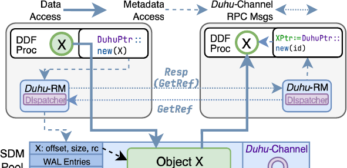
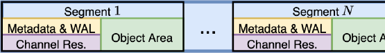
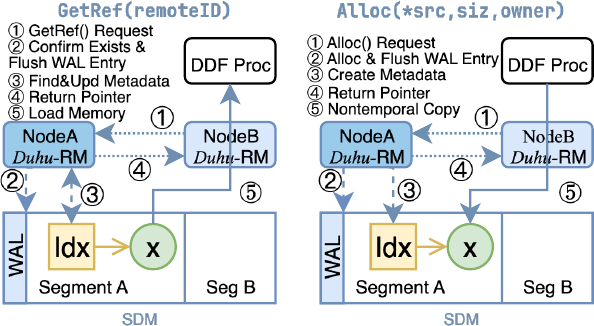
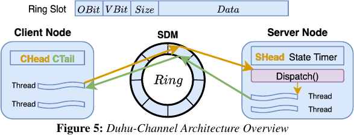
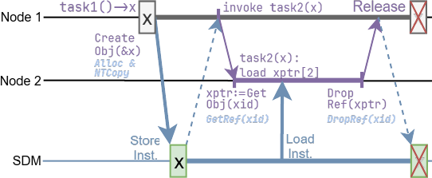
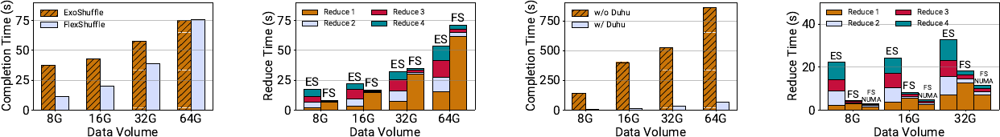
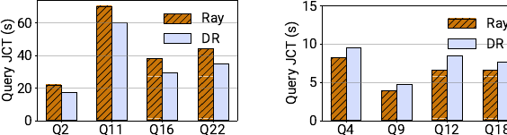
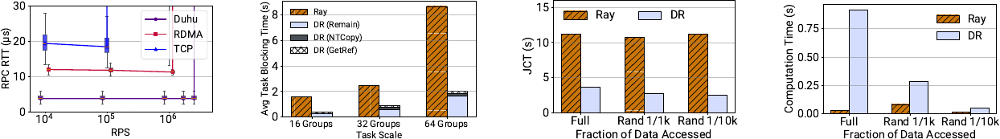
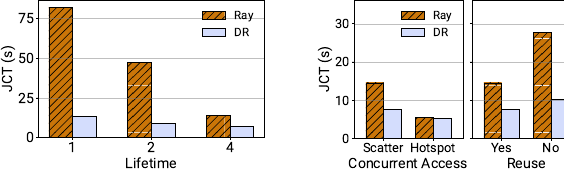

# Duhu：面向分布式数据处理框架的共享解耦内存

> 论文：Qiutong Men et al., *Duhu: Shared Disaggregated Memory for Distributed Data Processing Frameworks*, OSDI 2026。  
> 解构范围：仅依据随附的 19 页原始 PDF。论文事实、实测数据、分析判断和项目建议分开表述。  
> 页码约定：正文中的“第 923 页”等均指论文印刷页；对应 PDF 页码为印刷页减 919。  
> 版本说明：目标目录已有同名报告及 V01，本稿按要求命名为 V02；旧报告仅用于判断版本号，未读取，也未作为内容来源。

## 1. 一页读懂论文

### 1.1 论文解决什么问题？

Duhu 要解决的是分布式数据处理框架（Distributed Data Processing Framework，DDF：把数据处理任务拆到多台服务器执行的计算框架）在传递不可变中间对象时产生的重复复制。Ray、Spark 等系统虽然通过对象引用解耦生产者与消费者，但消费者真正使用对象前，仍要把对象复制到本机内存。一个对象被多个节点消费时，网络流量、序列化开销和本地内存副本随消费者数量增长。

Duhu 把对象放入共享解耦内存（Shared Disaggregated Memory，SDM：由多台计算节点通过负载/存储指令共同访问的外置内存池），让消费者直接解引用共享地址。论文把传统路径称为 pass-by-value，把新路径称为 pass-by-reference。

### 1.2 根因是什么？

表面问题是网络传输和内存占用高，根因则是现有对象存储只把“对象 ID”按引用传递，正文数据仍按值复制。共享内存可以消除这些副本，但论文使用的 CXL（Compute Express Link：用于 CPU、加速器与内存扩展设备互联的高速总线）2.0 Type 3 内存设备不提供跨服务器硬件缓存一致性。若多个节点同时修改共享元数据，软件必须承担一致性、回收和故障恢复；若完全依赖硬件全局一致性，又要付出目录容量、协议带宽和慢节点确认带来的成本。

因此，Duhu 的真正问题不是“怎样接上一块 CXL 内存”，而是：怎样在没有跨节点硬件缓存一致性的条件下，让多个 DDF 节点安全地共享同一份不可变对象，同时把协调成本控制在微秒级。

### 1.3 核心洞察是什么？

DDF 的对象正文写入后不再修改，而对象位置、引用者和回收状态等元数据会持续变化。既然数据与元数据的可变性不同，就没有必要让二者承担同一种一致性协议：正文可以共享直读，元数据则按段交给单一节点顺序处理。这样既避开全局硬件一致性，也避免每个消费者都复制一份对象。

### 1.4 核心抽象是什么？

核心抽象是一套保持现有对象存储使用方式的“共享对象引用”：

- 集群级 `ID` 用于跨节点传递对象身份，并编码对象所在段；
- 节点级 `DuhuPtr` 是可直接解引用的共享内存指针；
- `CreateObj / GetObj / GetID / DropRef` 把创建、获取、传递和释放包装成 DDF 可接入的对象生命周期 API；
- Duhu-RM（Duhu Reference Manager：每个节点上的引用与元数据管理器）在 API 内部完成元数据协调、缓存同步、引用跟踪和恢复记录。

这套抽象把应用看到的对象引用与底层共享地址、元数据归属和故障协议隔开。应用代码不需要理解 SDM 段、缓存行或恢复日志。

### 1.5 关键优化方法速览

下列五项中，方法 1、2、5 直接改变数据或协调开销；方法 3、4 主要补齐共享单份对象后的回收与故障正确性。后两项不是性能优化，但缺少它们，pass-by-reference 无法成为可用的系统语义。

#### 方法 1：不可变对象共享地址直读与边界缓存同步

- **问题**：消费者必须先把远端对象复制到本地，多个消费者形成重复数据搬运和副本。
- **方法**：对象创建完成后保持不可变；创建端用非临时写把数据落入 SDM，读取端第一次取得指针前失效相关缓存行，随后直接读取共享地址。
- **效果**：N 份消费者副本变成 1 份共享对象；协调只发生在发布和首次读取边界，而不落在每次正文访问上。
- **关键证据**：扇出微基准中，Duhu-Ray 的消费者等待时间比 Ray 缩短 2.80–4.29×，论文将原因归于 Ray 需要向三个远端服务器分别复制数据（图 13，第 932 页）。

#### 方法 2：分段单归属元数据与 SDM 承载的轻量协调

- **问题**：无全局缓存一致性时，多节点并发修改对象位置、引用位图和空闲表会产生争用及一致性风险。
- **方法**：把 SDM 划成若干段，每段只有一个元数据 owner；非 owner 经 Duhu-Channel 发起 RPC。请求和响应放在 SDM 环形槽中，传统网络只在轮询退避后负责唤醒通知。
- **效果**：共享可变元数据变成分片单写状态，跨节点协调从通用网络 RPC 缩成 64 字节缓存行内的小消息交换。
- **关键证据**：Duhu-Channel 在论文测得 3.8 µs 延迟并支持 300 万 RPS；对照 RDMA 在 100 万 RPS 时为 11.74 µs（图 12，第 932 页）。两者不是同请求率点位，不能解释成严格同负载下的固定倍数。

#### 方法 3：跨节点引用计数与安全回收

- **问题**：共享单份对象后，某节点沿用“本地副本可独立删除”的垃圾回收逻辑，会在其他节点仍读取时提前释放内存。
- **方法**：Duhu 用每对象引用位图记录哪些节点持有 `DuhuPtr`；`GetObj` 建立引用，`DropRef` 释放引用，最后一个引用消失后才回收对象。
- **效果**：独立本地回收变成共享生命周期回收，避免悬挂指针和复用地址上的误读。
- **关键证据**：论文给出创建、跨节点获取、释放和最终回收的完整时间线，并在 Ray 的对象管理模块中实现该 API（图 2，第 925 页；§7）。

#### 方法 4：WAL、版本位与幂等重放恢复元数据

- **问题**：段 owner 可能在元数据操作执行一半时宕机，新 owner 既要恢复分配器状态，也要判断哪些请求已经回复，避免重放产生重复分配或错误响应。
- **方法**：每个操作先写 WAL（Write-Ahead Log，预写日志），RPC 设计为幂等；接管节点扫描元数据和每通道最近 k 条日志，用槽位版本位判断请求是否仍待回复，然后重放必要操作。
- **效果**：单节点私有元数据的简单快路径获得可恢复性，不必把正常路径改造成多节点并发写协议。
- **关键证据**：§6 给出恢复不变量和重放算法，但论文没有报告故障注入下的端到端恢复时间或恢复期间的业务尾延迟。

#### 方法 5：FlexShuffle 用切片元数据重组替代重复分区搬运

- **问题**：多阶段 Shuffle 每一阶段都重新分区并搬运中间数据，前一阶段已经传过的数据会再次占用网络与内存。
- **方法**：Map 任务把未分区输出写入 Duhu，只生成每个分区的偏移和长度切片；Reduce 任务通过切片读取共享对象，后续阶段只重组切片元数据。
- **效果**：重复分区数据搬运变成元数据重排，多阶段任务从第二个 Reduce 阶段开始不再重复传输正文。
- **关键证据**：四阶段 Shuffle 的 JCT（Job Completion Time，作业完成时间）最高改善 3.39×，后续 Reduce 阶段改善 3.59–13.81×；64 GB 场景因首次写入 SDM 占主导，整体反而慢 1.01×（图 6–7，第 931 页）。

### 1.6 最重要的实验结果是什么？

| 证据类型 | 条件 | 结果 | 能支持的结论 |
|---|---|---:|---|
| 实测：四阶段 Shuffle | 32 Map、32 Reduce；8–64 GB；FlexShuffle 对 Exoshuffle | 最高 3.39×；64 GB 时慢 1.01× | 共享对象加元数据切片适合多阶段复用，但首次入池成本可能抵消收益 |
| 实测：后续 Reduce 阶段 | 同上 | 3.59–13.81× | 避免重复正文搬运是多阶段收益的主要来源 |
| 替代环境：单机 NUMA 模拟更快 SDM | 最多 32 GB；以两个 NUMA 节点模拟两台服务器，并与两节点 CXL/Exoshuffle 对照 | 较 CXL 原型快 1.10×；较 Exoshuffle 快 2.43–5.79× | 较低访问时延可能扩大收益；这不是未来 CXL 硬件实测 |
| 实测：Modin TPC-H | SF=10；3.4 GB Parquet；每节点对象存储 5 GB；每台物理服务器只运行一个容器；排除 Q5 | 平均 1.08×；最佳单项 1.30×；四个慢查询约慢 1.2× | Duhu 不是普遍加速器，收益取决于中间数据规模和访问局部性 |
| 实测：扇出 | 200 MB 对象；16/32/64 组；四消费者 | 等待时间缩短 2.80–4.29× | 单份共享能减少一对多复制 |
| 实测：部分读取 | 6.4 GB 数组；128 任务 | Duhu 读 1/10000 数据的 JCT 比读全量低 4.45× | 按引用访问适合“对象大、实际读取比例小”的负载；这不是 Duhu 对 Ray 的 4.45× |

### 1.7 最大局限是什么？

最大局限是收益有明确的负载条件：对象要足够大、远端消费者或多阶段复用要足够多，或者任务只读取大对象中的一小部分，节省的复制成本才可能超过 SDM 的高访问时延与首次入池拷贝。小查询在论文中已经出现约 1.2× 回退。

系统还依赖不可变对象、DDF 的 lineage 重算、外部故障检测器和操作系统 SIGBUS 支持。论文详细描述了恢复协议，却没有用故障注入验证恢复时长、恢复正确性和服务抖动。其硬件规模也只有四台服务器和一套早期 FPGA CXL 原型。

### 1.8 为什么与本项目相关？

- **必要性证据**：论文通过受控原型实测表明，多消费者共享大对象时，“引用传递但正文仍复制”会造成网络、内存和 CPU 开销。KVCache（大模型注意力键值缓存：自回归生成时保存历史 Key/Value 激活，避免重复计算注意力）跨节点复用面临同类数据搬运问题。
- **可行性证据**：无跨节点硬件缓存一致性时，仍可把只读正文与可变元数据拆开，用受控发布、引用生命周期和故障回退实现共享直读。
- **差异化证据**：Duhu 没有解决 KVCache 的模型/词表/模板/LoRA 语义一致性、多卡协同、NPU HBM 直达、NVMe SSD 分层和前后台混压 QoS，这些正是本项目必须补齐的工程语义。
- **剩余举证责任**：论文不能证明本项目的 Host CPU 零数据拷贝、Direct-View 远端直读、微秒级动态选路、TP=8 多卡状态同步或 E3 混压指标已成立；这些仍需在国产 AI 硬件上独立实测。

## 2. 为什么这个问题值得解决

### 2.1 传统对象存储的隐性复制

DDF 用对象存储把生产者与消费者解耦。调度器只传递对象 ID，消费者按需拉取对象，看起来已经是“按引用”。但从物理数据路径看，消费者最终仍要在本机内存创建副本：对象被序列化、经网络传输、写入本地对象存储，再由计算任务读取。一个对象有 N 个远端消费者，受限链路上的正文流量可能接近 N 份。

这类复制有两个后果。第一，网络和内存带宽被中间数据占用；第二，任务的实际内存需求高于输入、输出和中间结果的逻辑总量，因为同一对象在多台服务器上重复存在。论文的扇出实验刻意构造四个消费者，其中三个远端，正好验证这一放大关系。

### 2.2 为什么不能直接打开全局硬件一致性

论文把全局硬件一致性的成本分成三类：写入共享行时要等待所有 sharer 的失效确认，尾部时延受最慢节点影响；缓存状态更新占用额外带宽；目录要跟踪大量缓存行，池化容量扩大后会遇到 SRAM 容量和查找复杂度问题。这里的结论是作者的体系结构判断，不是本文单独测出的全局 CXL 3.0 对照数据。

Duhu 选择 CXL 2.0 Type 3 设备所代表的软件一致性路径。这个选择降低了硬件要求，却把一致性责任移给软件。论文真正有价值的地方，正是它没有把这个代价藏起来，而是围绕对象不可变性重新划定协调边界。

### 2.3 成立所需的工作负载观察

方向成立依赖四个观察：DDF 中间对象通常写一次后不再修改；正文访问量远高于元数据访问量；多数 DDF 已具备引用释放和 lineage 重算；多个消费者可能读取同一份或其中一小部分数据。任一条件不成立，Duhu 的优势都会减弱。例如对象频繁原地更新时，首次读取前失效缓存行已经不够；对象很小且被反复读取时，本地缓存往往更快。

## 3. 核心抽象与系统设计

*图 1（原论文 Figure 1，第 923 页）：Duhu 在两个 DDF 节点间提供同一对象地址视图。实线是正文读取，虚线是元数据 API，点线是 Duhu-Channel RPC。*

### 3.1 数据面与控制面的分界

Duhu 在 SDM 中存两类状态：对象正文，以及对象位置、大小、引用节点和恢复信息等元数据。正文读路径直接通过 `DuhuPtr` 访问共享内存；元数据操作由本机 Duhu-RM 接收，若目标段归属其他节点，再通过 Duhu-Channel 转发给 owner。

这不是完整意义上的“所有路径都零复制”。`CreateObj` 要求生产者先在本地内存初始化完整对象，再把它异步复制到 SDM。Duhu 消除的是后续消费者各自建立本地副本，而不是消除对象创建阶段的全部数据搬运。

### 3.2 段是协调和故障域的共同单元

*图 2（原论文 Figure 3，第 925 页）：每段包含元数据与 WAL、通道预留区和对象区。对象数据与元数据同段放置，共享故障命运。*

每个段只有一个 owner。owner 独占修改段内元数据，免去跨节点锁和多写者缓存一致性。对象 ID 编码段信息，用于把请求路由到正确 owner。段内把对象正文与元数据放在同一 memory unit，是为了在内存设备故障时让二者同时丢失，避免“元数据还在但正文已失效”或反向情况。

这一设计的核心不变量是：任意时刻一个段最多只有一个 owner；owner 变更前后，WAL 与元数据扫描必须恢复到可继续分配且不会重复回复的状态。论文给出协议，却没有用故障实验验证 owner 切换期间的暂停时间。

### 3.3 完成语义

`CreateObj` 完成意味着对象已发布为不可变共享对象，其他节点可以通过 ID 获取引用；`GetObj` 返回前，Duhu 会失效对应缓存行，使第一次读取落到 SDM；`DropRef` 完成只表示本节点释放引用，只有引用计数降为零后内存才可复用。节点故障后的“恢复完成”还包含段重新归属、分配器重建、必要日志重放和失效引用清理，不能只用控制面广播完成来替代数据面可用。

## 4. 关键技术实现与作用机理

### 4.1 不可变对象共享地址直读与边界缓存同步

#### 解决的问题

基线 Ray 在远端任务读取对象前，把对象通过网络复制到本地对象存储。同一对象被多个节点读取时，正文被重复搬运和存放。直接让多个节点读取无一致性的 SDM 又可能命中旧缓存行，尤其是某块内存释放后被新对象复用时。

#### 核心方法

把对象修改限制在创建阶段，在发布和第一次读取两个边界执行缓存动作，稳定期只读共享地址。

#### 实现路径

1. 生产者在本地内存构造对象并调用 `CreateObj`。
2. Duhu 在目标段分配空间，使用 non-temporal store 将对象写入 SDM，并通过 store fence 保证写入顺序和可见性。
3. 元数据登记完成后，对象变为不可修改状态。
4. 远端节点调用 `GetObj`；Duhu-RM 更新引用信息，并在返回 `DuhuPtr` 前失效对应缓存行。
5. 计算任务直接解引用 `DuhuPtr`。稳定期不再为每次正文读取执行跨节点一致性消息。

#### 资源 / 状态变化

`N 个消费节点各持有 1 份本地对象副本，共 N 份` → `1 份 SDM 对象 + N 个节点引用`；  
`每次传输正文` → `发布时写入一次，消费者直接读取共享地址`；  
`持续硬件一致性` → `发布与首次读取边界的软件缓存同步`。

#### 为什么有效

不可变性把一致性问题从“任意时刻可能写”缩成“发布前写、发布后只读”。大多数数据访问不再触发协调，受限网络也不必为每个消费者预先复制并长期保存整份对象。消费者真正读取的字节仍要从 SDM 流向处理器；Duhu 节省的不是全部读取流量，而是完整对象的重复预复制和本地常驻副本。

#### 达到的优化效果

**直接效果**：扇出场景中，Ray 要向三个远端消费者复制三份 200 MB 数组，Duhu 只写入一份共享对象。Duhu-Ray 的消费者等待时间缩短 2.80–4.29×。

**端到端效果**：收益是否转化为 JCT 改善取决于计算读取模式。随机读取很小比例时，省去全量搬运很划算；顺序扫描全量对象时，本地 DRAM 的带宽和缓存优势更大。

#### 论文证据

图 13 是直接的扇出证据。图 14–15 给出反面边界：Duhu-Ray 即使整体 JCT 更低，纯计算阶段仍慢于 Ray；读取 1/1000 和 1/10000 时，Ray 计算耗时约为 Duhu-Ray 的 0.29×。这说明收益来自减少搬运，不是 SDM 单次访存比本地内存更快。

#### 亮点

它把一致性成本放在状态转换边界，而不是每次数据访问上。这比笼统地要求全局一致性更符合不可变中间对象的真实生命周期。

#### 代价与局限

创建阶段仍有本地内存到 SDM 的完整拷贝。对象若频繁修改、很小、热点复用强或被顺序全量扫描，远端共享读取可能不如本地副本。该协议也依赖处理器提供正确的 non-temporal write、cache invalidation 和 fence 语义。

#### 对项目的意义

**ADAPT**。本项目的 Direct-View（远端直读：通过高速总线跨节点读取远端显存中的 KV 数据，不产生本地显存副本）可以沿用“不可变发布 + 首次消费前可见性确认”的原则，但 KVCache 还要校验模型、Tokenizer、提示词模板、LoRA、Ready 位和租约。Duhu 的对象不可变性不足以替代这些消费资格条件。

### 4.2 分段单归属元数据与 SDM 承载的轻量协调

#### 解决的问题

对象地址、大小、引用节点和空闲表都可变。让所有节点直接更新无一致性的共享元数据，会产生竞争、旧值和恢复顺序不确定；把所有请求集中到一个全局管理器，又会形成吞吐瓶颈。

#### 核心方法

把元数据按段分片并限定单 owner 写入，远端操作通过共享内存环形槽传递，网络只负责必要的唤醒通知。

#### 实现路径

1. 对象 ID 携带段信息，请求首先定位 owner。
2. 本地对象直接由本机 Duhu-RM 处理；远端对象发 `GetRef / Alloc / DropRef / CreateId` RPC。
3. 客户端线程用原子操作预留 64 字节对齐槽，将请求和所有参数以 non-temporal write 写入 SDM。
4. server 轮询槽位 ownership bit，取得请求后分派给工作线程；同一对象始终落到同一线程，保持 WAL 记录顺序。
5. 空闲期 server 停止持续轮询，客户端改用传统网络消息唤醒；响应复用同一槽位返回。

*图 3（原论文 Figure 4，第 926 页）：远端 `GetRef` 与 `Alloc` 都先到段 owner；owner 写 WAL、修改元数据，再返回指针。`Alloc` 随后执行对象复制。*

*图 4（原论文 Figure 5，第 927 页）：请求和响应共享 SDM ring slot；客户端与服务端各维护本地 head/tail 或状态，网络只承担通知。*

#### 资源 / 状态变化

`全体节点并发修改共享元数据` → `段 owner 单写、其他节点 RPC`；  
`通用网络 RPC 传递小消息` → `SDM 槽位承载载荷 + 网络按需通知`；  
`集中式全局管理器` → `按段分片的 owner 集合`。

#### 为什么有效

单写把最难的一致性问题改成顺序执行；分片把负载分散到多个 owner；64 字节槽把小 RPC 控制在单缓存行，省去传统网络栈的提交与收包路径。轮询与通知切换则在低时延和后台资源消耗之间折中。

#### 达到的优化效果

**直接效果**：论文报告 Duhu-Channel 在 300 万 RPS 时延迟 3.8 µs；RDMA WriteImm 基线在 100 万 RPS 时为 11.74 µs。

**端到端效果**：论文没有单独消融“段 owner”和“Duhu-Channel”对应用 JCT 的贡献，无法把 3.39× Shuffle 收益分摊给协调通道。

#### 论文证据

图 12 支持“小消息经 SDM 传递可以低延迟”的方向，但 RDMA 实现只有一个 outstanding request，并且论文比较的是不同负载点。它不能证明任何生产级 RDMA 栈在相同并发设置下都慢固定倍数。

#### 亮点

设计把“共享数据”与“共享写元数据”明确拆开。段 owner 是一致性责任边界，Duhu-Channel 只是降低远端 owner 调用成本的支撑机制，二者层次清楚。

#### 代价与局限

热点段会把元数据请求集中到单 owner；每对节点都要维护通道和网络连接；消息限制在 63 字节以内。论文没有给出节点数、段数或高倾斜访问下的扩展曲线。

#### 对项目的意义

**ADAPT**。本项目可以复用“正文共享、可变元数据单写”的原则，用于节点级目录分片和租约 owner。Host CPU 零数据拷贝只约束 CPU 不搬运 KV 正文，并不排斥 CPU 处理元数据 RPC；但若逐请求都要等待目标端 CPU，仍可能形成控制面尾延迟，因此应把单边读取或本地共享内存快路径作为额外的时延设计要求。控制通道可结合 UBMEM（统一总线内存直通共享协议：跨节点与异构设备共享内存地址空间的底层协议）或 URMA（通用远程直接内存访问：用户态高性能 RDMA 接口）能力重新实现。

### 4.3 跨节点引用计数与安全回收

#### 解决的问题

在 pass-by-value 系统里，节点删除自己的本地副本不会影响其他节点。改成共享单份对象后，沿用这一假设会在远端仍持有指针时复用内存，引发悬挂引用或旧缓存误读。

#### 核心方法

把回收资格从“本地无人使用”提升为“集群中没有节点持有引用”。

#### 实现路径

1. `CreateObj` 为创建者建立初始引用。
2. 远端 `GetObj` 通过 owner 的 `GetRef` 设置该节点在引用位图中的 bit。
3. `DuhuPtr` 生命周期结束时触发 `DropRef`。由于共享元数据按节点记录 bit，同一节点存在多个本地引用时，必须先由本机聚合引用，只在本节点最后一个引用消失时清 bit；论文没有展开这一层实现细节，应在集成代码中核验。
4. 所有 bit 清零后，对象空间进入可回收状态。
5. 节点故障时，其他 owner 根据 orchestrator 广播清理故障节点持有的引用。

*图 5（原论文 Figure 2，第 925 页）：对象先从节点 1 写入 SDM；节点 2 取得引用后直接加载；两个节点都释放引用后，SDM 空间才可回收。*

#### 资源 / 状态变化

`节点本地副本生命周期` → `共享对象的集群级引用生命周期`；  
`本地 GC 独立删除` → `owner 根据引用位图统一判定回收`。

#### 为什么有效

共享对象只有一个物理实例，回收决策也必须有一个权威位置。引用位图让 owner 可以判断还有哪些节点可能继续解引用该地址。

#### 达到的优化效果

**直接效果**：避免在有效远端引用存在时释放或复用对象空间。

**端到端效果**：论文没有把引用跟踪成本单独量化，也没有评估短生命周期小对象、高节点数或引用频繁抖动时的元数据压力。

#### 论文证据

§3.2.1、§4.2 和图 2 给出协议，§7 说明 Ray 集成只修改对象管理模块。证据属于实现说明，不是经过故障并发模型检验的形式化证明。

#### 亮点

它正面修复了从“每节点一份”切到“集群共享一份”后垃圾回收语义发生的变化，没有把内存节省建立在不安全的提前回收上。

#### 代价与局限

位图大小随节点数增长，owner 是回收路径的协调点。`DropRef` 丢失、节点失联判定延迟或地址复用过快都会扩大风险。论文依赖外部 orchestrator 宣告节点故障。

#### 对项目的意义

**ADAPT**。本项目的 ViewGuard（视图租约安全守卫机制：管理远端直读生命周期，并在远端崩溃或超时时捕获异常并回退重算）需要类似的“引用存在时不得回收”语义，但不能只依赖引用位图。还要把 NPU stream event、租约 epoch、目录版本和后台迁移的 RCU（Read-Copy-Update：读-拷贝-更新，通过宽限期延迟释放旧版本）共同纳入安全释放条件。

### 4.4 WAL、版本位与幂等重放恢复元数据

#### 解决的问题

段 owner 可能在更新元数据、写响应或修改分配器的任一步骤中宕机。新 owner 如果全部重放，可能给已复用的 ring slot 写入过期响应；如果不重放，又可能留下半完成的元数据操作。

#### 核心方法

用 WAL 保存请求，用版本位识别仍待回复的槽位，并把所有 RPC 做成幂等操作，使新 owner 能有选择地重放。

#### 实现路径

1. 正常路径先把 RPC 参数、channel ID、slot ID 和 version 写入段内 WAL。
2. 操作执行后，server 把结果写回同一槽位；client 收到响应后翻转 version bit。
3. owner 失败后，orchestrator 把段分配给新 owner。
4. 新 owner 扫描元数据哈希表，重建对象集合和本地分配器状态。
5. 对每个 channel 只检查最近 k 条 WAL；slot version 与日志一致时才重放。
6. `GetRef / DropRef` 依靠位运算天然幂等；`CreateId` 返回日志中的既有 ID；`Alloc` 先查元数据表，已有对象则复用原分配结果。

#### 资源 / 状态变化

`故障后的未知部分执行` → `WAL 记录 + 槽位版本判定`；  
`可能产生副作用的重复执行` → `可安全重放的幂等操作`；  
`段永久绑定节点` → `owner 可重新分配`。

#### 为什么有效

作者的恢复论证是：通道最多允许 k 个 outstanding request，因此真正可能未完成的请求被限制在每通道最近 k 条；版本位排除已经回复且槽位已复用的请求；幂等性排除重复执行的副作用。该论证还依赖环槽不能越过未完成请求而复用、WAL 顺序与对象请求处理顺序相容，以及论文省略的客户端响应路径正确维护版本位。这些条件需要结合代码和并发故障测试核验，不能仅凭协议描述视为已证明。

#### 达到的优化效果

**直接效果**：在节点故障后恢复段元数据一致性并避免资源泄漏。

**端到端效果**：论文只分析恢复时间由元数据字典扫描和日志重放主导，没有给出恢复时长分布、应用暂停时间或故障期间吞吐。

#### 论文证据

§6.1–§6.3.2 是协议与复杂度分析。内存 blade 故障时，Duhu 依赖 DDF lineage 重建丢失对象，并要求操作系统在访问失效映射时产生 SIGBUS。论文没有展示故障注入结果。

#### 亮点

恢复协议与正常路径的单 owner 设计相容：正常运行时不必承担多副本一致性，故障后才通过日志和扫描恢复。

#### 代价与局限

恢复时间随元数据表规模、通道数 p 和每通道并发上限 k 增长；SDM 600–800 ns 访问时延及写入 fence 会放大扫描和重放成本。恢复还依赖外部故障检测、DDF lineage 和 SIGBUS 语义。

#### 对项目的意义

**VALIDATE**。Duhu 验证的是 memory blade 失效映射触发 SIGBUS 后调用 DDF 的对象不可用处理，不包含租约协议，也没有证明亚毫秒恢复。租约是本项目为 ViewGuard 增加的控制语义；NPU 正在读取远端 KVCache 时的 DMA 排空、多卡一致动作和集合通信死锁也都要独立验证。

### 4.5 FlexShuffle 用切片元数据重组替代重复分区搬运

#### 解决的问题

Exoshuffle 的 Map 任务先按分区拆分输出，Reduce 任务再拉取各分区；多阶段 Shuffle 重复执行分区和搬运，同一批中间数据多次穿过网络并占用对象存储。

#### 核心方法

正文保持为共享的未分区对象，分区结果只保存为偏移和长度切片，后续阶段重写切片而不重传正文。

#### 实现路径

1. Map 任务把未分区输出写入 Duhu。
2. 每个逻辑分区生成一组 slice，记录属于该分区的数据范围。
3. Reduce 任务接收对象引用和 slice，按范围读取共享对象。
4. 后续 Shuffle 阶段只根据新分区关系生成新的 slice 集合。

#### 资源 / 状态变化

`每阶段重新分区并复制正文` → `首阶段写入共享对象 + 后续阶段只重组元数据`；  
`多阶段累计网络字节` → `一次正文入池 + 多次小型 slice 更新`。

#### 为什么有效

多阶段 Shuffle 的逻辑分区发生变化，但底层数据内容未必变化。共享地址允许多个阶段以不同切片解释同一份正文，避免把“逻辑重组”实现成“物理搬运”。

*图 6（原论文 Figure 6–9，第 931 页）：四阶段 JCT、阶段分解、无 Duhu 对照和 NUMA 替代环境。图 7 直接显示首个 Reduce 可能更慢，后续阶段才释放主要收益。*

#### 达到的优化效果

**直接效果**：后续 Reduce 阶段不再重复搬运正文，阶段运行时间改善 3.59–13.81×。

**端到端效果**：四阶段 Shuffle 最高改善 3.39×。64 GB 场景中，首次把全部数据写入 SDM 的成本占主导，FlexShuffle 总 JCT 比 Exoshuffle 长 1.01×。

#### 论文证据

图 6–7 支持“后续阶段避免数据搬运”这一因果解释。图 8 中无 Duhu 版本因本地副本过多而落盘，JCT 高 13.34–24.69×，其中混合了 SSD spill 的容量效应，不能当作纯共享地址开销对比。图 9 以两个 NUMA 节点模拟两台服务器，并与两节点 CXL FlexShuffle、两节点 Exoshuffle 对照；它支持“更低访存时延会改善结果”，但单机 NUMA 没有复现真实 CXL fabric 的竞争和故障域。

#### 亮点

FlexShuffle 展示了共享地址不只是替换传输 API，还能改变算法的数据组织方式：逻辑分区与物理对象不再绑定。

#### 代价与局限

只有多阶段复用或部分读取足够多时才有明显收益。首阶段必须把完整对象放入 SDM；顺序全量扫描仍受 SDM 带宽限制。它还改变了 Shuffle 实现，3.39× 不能全部归因于 Duhu 底层本身。

#### 对项目的意义

**DIRECTLY ADOPT**。可以直接采用其原则：把逻辑视图变化与物理正文搬运解耦。对应到 KVCache，应优先传递块清单、层/头/Token 范围和可消费视图，而不是因为请求视图变化就复制整份 KVCache。具体描述符和安全语义仍需按项目架构实现。

## 5. 实验到底证明了什么

### 5.1 实验环境

论文在四台服务器上评测，每台有四颗 Intel Xeon Gold 6530、512 GB 内存、ConnectX 网卡和 100 Gbps 网络，关闭超线程及省电。外置 SDM 是 128 GB 早期 FPGA CXL 原型，带宽约 10 GB/s，访问时延 600–800 ns，划成 16 个段。容器通常分配 12 核和 30 GB 内存；本机容器间限速 5 Gbps，使网络总带宽约 80 Gbps，与 SDM 10 GB/s 对齐。Shuffle 的 8/16/32/64 GB 数据量分别配 0.75/1.5/3/6 GB 本地对象存储，这组容量配对直接影响 SSD spill 和收益归因。TPC-H 是例外：作者发现每台服务器运行四个容器会使 Ray 和 Duhu-Ray 都明显变慢，因此该组实验每台物理服务器只运行一个容器；Q5 因原生 Ray worker 经常内存耗尽而被排除。

*图 7（原论文 Figure 10–11，第 931 页）：Duhu-Ray 对部分大查询有收益，对部分小查询则退化。*

*图 8（原论文 Figure 12–15，第 932 页）：控制 RPC、扇出等待、部分读取 JCT 与纯计算时间。图 14 与图 15 必须合看：传输减少可以降低总 JCT，但 SDM 上的计算本身更慢。*

| Claim | Experiment / Evidence | Conditions & Baseline | Result | What it proves | What it does not prove |
|---|---|---|---:|---|---|
| 共享对象可减少扇出复制 | 图 13 fan-out | 200 MB 对象；四消费者；Ray 基线 | 等待时间缩短 2.80–4.29× | 多消费者时单份共享减少重复传输 | 任意访问模式下端到端都加速 |
| FlexShuffle 适合多阶段任务 | 图 6–7 | 32 Map/32 Reduce；8–64 GB；Exoshuffle | 最高 3.39×；后续阶段 3.59–13.81× | 主要收益来自后续阶段避免正文搬运 | Duhu 对所有 Shuffle 都有 3.39×；64 GB 场景实际略慢 |
| 共享内存是 FlexShuffle 容量基础 | 图 8 | 单阶段；无 Duhu 时保留本地副本并发生 SSD spill | 无 Duhu 慢 13.34–24.69× | 本地副本容量会破坏这种执行方式 | 纯内存条件下 Duhu 地址访问本身快 13.34–24.69× |
| 更快共享内存可能扩大收益 | 图 9 NUMA 替代环境 | 单机 NUMA 模拟；最多 32 GB | 比 CXL 原型快 1.10× | 访问时延和带宽是重要变量 | 未来 ASIC CXL 集群一定达到同等收益 |
| Duhu 对现有应用的平均收益有限 | 图 10–11 TPC-H | SF=10；排除 Q5；Ray 基线 | 平均 1.08×；最佳 1.30×；四个慢查询约慢 1.2× | 收益受数据量、对象存储容量和访问模式控制 | 每个查询都获益；Q5 已被公平比较 |
| Duhu-Channel 可低时延传小 RPC | 图 12 | 小于 63 B；TCP/RDMA 基线；RDMA 单 outstanding | 3.8 µs@3M RPS；RDMA 11.74 µs@1M RPS | 共享内存槽位是可行的小消息通路 | 同请求率、同并发实现下必然领先固定倍数 |
| 部分访问适合 pass-by-reference | 图 14–15 | 6.4 GB 数组；128 任务；随机读取 | 读 1/10000 的 Duhu JCT 比读全量低 4.45× | 避免搬运未读取数据很有价值 | Duhu 相对 Ray 获得 4.45×；SDM 计算比本地 DRAM 快 |
| 故障后恢复元数据一致性的协议设计 | §6 协议与复杂度分析 | 无端到端故障注入 | 未报告恢复 JCT/P99 | 协议给出了一条可实现路径 | 恢复时长、业务影响、并发正确性已经实测成立 |

## 6. 论文的亮点与局限

### 6.1 数据与元数据采用不同一致性策略

**亮点**

论文没有为所有共享状态套用同一种一致性机制，而是依据可变性和访问频率拆分。不可变正文走共享读，可变元数据走单 owner 顺序执行。这是整篇论文最可迁移的设计原则。

**局限**

原则依赖对象发布后不再修改。KVCache 虽然通常按块追加或封存，但活跃 Decode 阶段仍有写入，不能把 Duhu 的不可变对象协议直接套到正在生成的 KV 块。

### 6.2 用共享内存承载小 RPC

**亮点**

Duhu-Channel 把 64 字节消息放入 SDM，网络只在停止轮询后唤醒，减少了小消息走完整网络栈的成本。

**局限**

RDMA 基线只有一个 outstanding request，且对比点的 RPS 不同。论文没有展示跨更多服务器、热点 owner、网络通知风暴或共享内存拥塞下的 P99。

### 6.3 新执行范式比透明替换更有收益

**亮点**

FlexShuffle 不只是把 Ray 的远端拉取改成共享地址，而是把“分区”改成对共享对象的元数据视图。3.39× 的最大收益来自算法与存储抽象共同变化。

**局限**

这也带来归因问题。端到端结果不能全部算在 Duhu 通用对象存储上；它混合了 FlexShuffle 算法变化、对象容量、SSD spill 和 SDM 性能。64 GB 反转说明首次入池成本没有被自动消除。

### 6.4 退化结果被保留下来

**亮点**

论文报告了小查询变慢、全量扫描计算变慢和 64 GB Shuffle 略微回退。这些结果帮助确定动态选路的必要性。

**局限**

论文只提出“保留小对象或热点对象在本地”的混合策略，没有实现统一的在线成本模型，也没有给出路径切换阈值。

### 6.5 故障模型有协议，但缺少测量闭环

**亮点**

对象与元数据同故障域、WAL、幂等重放、slot version 和 SIGBUS 回退形成了较完整的恢复思路。

**局限**

没有故障注入、恢复时长、恢复期间应用错误率或尾部时延数据。恢复“应该正确”和生产环境“按时恢复且不扩大故障”之间仍有很长距离。

*图 9（原论文 Figure 16–17，第 932 页）：对象寿命、热点共享和重复访问都会改变 Ray 与 Duhu-Ray 的相对收益，说明放置策略不能静态化。*

## 7. 论文没有解决什么

### 7.1 缺少在线路径选择

Duhu 默认把需要远端访问或遇到内存压力的对象放入 SDM。论文已经观察到小查询和热点小对象更适合本地内存，却没有实现按对象大小、复用度、读取比例、网络状态和计算代价联合决策的在线调度器。

### 7.2 创建和磁盘加载仍经过本地内存

对象必须先在本地完整初始化，再复制到 SDM；从磁盘读入也先落本地内存。作者在 §10 把“直接在 SDM 创建对象”和“磁盘直接加载到 Duhu”列为后续扩展。这与本项目的 Payload Bypass DDR（绕过主机内存：数据在 NVMe SSD 与 NPU HBM 之间直接流转）还有明显差距。

### 7.3 不覆盖加速器内存与多卡一致动作

论文对象由 CPU 负载/存储指令直接访问，未验证 NPU/GPU HBM 映射、DMA 完成可见性、张量并行多卡同时命中或回退，也没有处理某一卡已消费而其他卡未就绪的集合通信风险。

### 7.4 不具备 KVCache 消费资格语义

Duhu 的正确性主要是对象地址、不可变性和引用生命周期正确。KVCache 还要求模型结构、Tokenizer、Prompt 模板、LoRA、位置编码和块版本相容。地址可读不等于语义可消费。

### 7.5 故障恢复没有实验闭环

论文没有回答：内存 blade 故障触发 SIGBUS 后，正在执行的任务多久恢复；owner 故障期间多少请求超时；metadata scan 如何影响前台；故障与段迁移并发时是否会重复回收。对生产系统来说，这些不是次要细节。

### 7.6 规模与多租户边界未覆盖

四服务器原型不足以证明段 owner、全连接通道、WAL 和引用位图在数十或数百节点下仍然可扩展。论文也没有评测后台数据搬运与前台延迟敏感任务混压时的 QoS 隔离。

## 8. 对本项目的启发

### DIRECTLY ADOPT

1. **按可变性拆分一致性责任**：已经封存、只读的 KV 块可以采用共享视图；目录、租约、Ready 位和引用状态保留单写权威源。
2. **逻辑视图与物理正文解耦**：借鉴 FlexShuffle slice，把命中范围、层范围和物理块区间编译成 ExtentManifest（连续数据块区间清单描述符：用紧凑 POD 结构描述连续物理块），避免请求视图变化引发整份 KVCache 复制。
3. **把退化案例纳入设计输入**：小对象、短上下文、顺序全量读取和首次入池是必须进入成本模型的负收益区域。

### ADAPT

1. **共享直读协议**：把 Duhu 的“不可变发布 + 首读失效”改造成适配 NPU HBM、DMA 完成和租约 epoch 的发布协议。
2. **单 owner 元数据**：用于节点级目录和视图租约。CPU 处理元数据并不违反正文零数据拷贝，但为了控制逐请求尾延迟，本项目仍应保留单边读取或本地共享内存快路径。
3. **引用回收**：从节点位图扩展为“租约 + Host 读侧宽限期 + NPU stream event + 后台迁移状态”的多条件安全释放。
4. **混合放置**：Duhu 的小查询实测已经出现固定远端放置带来的回退。本项目应由 QueryPlan（查询与放置计划决策引擎：根据链路、算力和上下文长度选择加载或重算路径）比较远端直读、Copy-to-HBM（通过 DMA 把远端 KVCache 搬到本地 HBM）和本地重算。

### DO NOT COPY

1. **不要把所有对象默认放到远端共享内存**：论文的小查询回退已经说明该策略不适合延迟敏感推理。
2. **不要把 CPU 直接读取 SDM 当作 Host CPU 零数据拷贝**：Duhu 的数据消费者是 CPU 负载/存储路径，和 NPU 直接消费 KV 张量不是同一数据面。
3. **不要沿用“先在 Host 完整构造再入池”**：这会引入 Host DDR 带宽和内存峰值，与项目的正文数据绕过 Host DDR 目标冲突。
4. **不要把 SIGBUS 捕获本身当作完整容错**：还需要租约失效、DMA 排空、多卡统一回退和目录撤销。

### VALIDATE

1. 远端直读的访问比例阈值：随机少量读取可能受益，全量顺序扫描可能受损。
2. 元数据 owner 热点：前缀热点和多租户条件下，单写分片是否形成 P99 瓶颈。
3. 共享地址发布语义：NPU/CPU 缓存、IOMMU、UBMEM 和 DMA 完成之间的可见性顺序。
4. 故障窗口：远端节点、内存设备或链路故障时，ViewGuard 能否在目标时限内让 TP 组统一回退。
5. 混压隔离：后台换出、复制和前台在线推理共享网络时，TPOT（Time Per Output Token，每个输出 Token 的生成耗时）干扰是否低于 3%。

## 9. 对本项目立项的背书

### 9.1 Problem Validation

论文以四服务器 CXL 原型上的实测说明：当多个消费者读取同一大对象时，复制放大会同时占用网络和内存；当任务只读取大对象的一小部分时，先搬完整对象尤其浪费。证据类型是受控原型测量，适用范围是 DDF 不可变中间对象。它可以支持“减少 KVCache 重复搬运值得投入”，但不能直接量化本项目的 TTFT 收益。

### 9.2 Mechanism Validation

论文为三条底层原则提供外部证据：只读正文与可变元数据分治；共享地址加受控发布可以绕开全局硬件一致性；逻辑视图变化可以通过元数据重组完成而不搬正文。这些原则分别支撑本项目的 Direct-View、节点级元数据权威和描述符编译方向。

### 9.3 Research-Gap Validation

Duhu 没有覆盖加速器 HBM 直达、跨介质路径选择、KVCache 六维消费资格、多卡状态同步、NVMe SSD 直达和前后台混压 QoS。项目若把这些问题做成一个可验证的统一底座，差异不在“再做一个共享内存对象库”，而在把共享视图安全地接入国产 AI 硬件和在线推理关键路径。

### 9.4 Unsupported Project Claims

论文不支持以下强结论：Host Payload Touch Bytes 已为 0；远端 HBM 可被 NPU 稳定直读；QueryPlan 能在微秒级准确选路；多卡命中状态可在 100 µs 内同步；SIGBUS 后 500 µs 内可以安全回退；NVMe SSD 与 HBM 可绕过 Host DDR；E3 的 TTFT、QPS 和 TPOT 混压指标已达成。它们都是项目目标，不是论文结果。

### 9.5 Project Establishment Verdict

- **Necessity evidence**：多消费者共享大对象时，重复复制确实造成可测的等待和容量开销；大对象部分读取进一步放大浪费。
- **Feasibility evidence**：在无跨节点硬件缓存一致性的 CXL 2.0 原型上，通过不可变发布、单 owner 元数据和引用生命周期可以实现可用的共享对象访问。
- **Differentiation evidence**：论文停在 CPU 可寻址 SDM 与 DDF 对象语义，本项目仍需解决 NPU HBM、KVCache 语义、多卡、分层存储和混压隔离。
- **Remaining burden of proof**：项目必须用国产 AI 硬件证明正文零拷贝、路径净收益、故障回退、语义正确和端到端 SLO；Duhu 的 3.39× 不能作为这些指标的替代数据。

## 10. 建议验证

### Experiment 1：远端直读、拷贝到 HBM 与本地重算的盈亏边界

- **Hypothesis**：对象足够大且实际读取比例低时，Direct-View 优于 Copy-to-HBM；短上下文或全量多次扫描时，本地重算或 Copy-to-HBM 更优。
- **Variable**：KVCache 大小、读取比例、复用次数、远端链路带宽/时延、NPU 计算吞吐。
- **Baseline**：本地重算、完整 Copy-to-HBM、固定 Direct-View。
- **Metric**：TTFT（Time To First Token，首 Token 响应时间）、总加载时延、远端字节数、NPU stall、P99。
- **Controlled conditions**：同模型、同提示词、同批大小、同并行度；固定网络和 HBM 负载。
- **Pass condition**：执行前冻结误差门限；原型阶段可用“选中路径的实测完成时间不超过三条路径最优值的 1.05×，且 P99 不比最佳静态基线恶化超过 5%”作为判定线。
- **Fail implication**：若可分离区域很窄，缩减 Direct-View 适用范围，优先完善 Copy-to-HBM 或重算回退。
- **Decision affected**：E0 业务收益前提与 E2 动态选路策略。

### Experiment 2：不可变发布与首次消费可见性

- **Hypothesis**：Ready 位、租约 epoch、DMA 完成事件和缓存/映射失效按规定顺序执行后，任何消费者都不会看到半写或旧版本 KV 块。
- **Variable**：发布顺序、缓存状态、地址复用速度、并发消费者数、故障插入点。
- **Baseline**：无强制顺序、只依赖完成队列、Duhu 式发布边界协议。
- **Metric**：错误消费数、CRC/版本不匹配数、发布到可读时延、CPU 参与字节数。
- **Controlled conditions**：固定块大小和模型语义；覆盖 CPU、NPU、IOMMU 与 UBMEM 组合。
- **Pass condition**：压力与故障注入下错误消费为 0，Host Payload Touch Bytes 为 0；发布 P99 门限必须在测试计划中先冻结，再用于验收。
- **Fail implication**：若硬件无法提供所需可见性，禁止该设备进入 Direct-View 路径，改用 Copy-to-HBM。
- **Decision affected**：E1 核心数据路径与消费正确性。

### Experiment 3：元数据分片 owner 的热点与扩展性

- **Hypothesis**：分片单写可在节点增长和 Zipf 热点下保持元数据查询与引用变更的 P99 上限。
- **Variable**：节点数、段数、热点系数、引用建立/释放频率、owner 线程数。
- **Baseline**：集中管理器、固定哈希 owner、支持热点迁移的 owner。
- **Metric**：吞吐、P50/P99、队列长度、owner CPU、通道轮询与通知次数。
- **Controlled conditions**：相同对象大小和请求组合；正文数据路径不参与测试。
- **Pass condition**：目标规模下无单 owner 饱和，跨节点元数据操作 P99 小于 10 µs，迁移不产生错误引用；10 µs 是项目目标，不是论文结果。
- **Fail implication**：引入只读副本、热点拆分或两级目录，不能照搬 Duhu 的固定单 owner。
- **Decision affected**：E1 元数据底座和 E2 调度扩容架构。

### Experiment 4：引用、租约与 RCU 联合安全回收

- **Hypothesis**：只有节点引用、租约、Host 读侧宽限期和 NPU stream event 全部结束后释放物理块，才能避免 UAF（Use-After-Free，释放后继续访问）。
- **Variable**：租约时长、读并发、DMA 时长、后台迁移、节点故障时点。
- **Baseline**：仅引用计数、引用计数加租约、完整联合回收协议。
- **Metric**：错误访问数、回收延迟、内存滞留量、前台停顿、TPOT 干扰。
- **Controlled conditions**：固定块分配器和访问模式；注入延迟完成、丢失通知和地址快速复用。
- **Pass condition**：错误访问为 0；滞留容量和回收 P99 的数值门限须在容量模型完成后冻结，未冻结前该实验只能输出测量结果，不能宣告通过。
- **Fail implication**：若联合协议代价过高，缩小 Direct-View 白名单，优先复制到本地 HBM 后消费。
- **Decision affected**：E2 ViewGuard、页迁移和分层回收设计。

### Experiment 5：故障注入与 TP 组统一回退

- **Hypothesis**：远端节点、内存设备或链路故障时，消费前的故障应阻止所有张量并行 rank 开始消费；消费中的故障应让全组作废已执行计算、排空在途读取并统一重启或回退，不发生部分 rank 继续执行或集合通信死锁。
- **Variable**：故障类型、注入阶段、TP=4/8、在途 DMA 数、owner 切换时点。
- **Baseline**：单 rank 本地捕获、无 WAL 重放、完整 ViewGuard 加多卡同步方案。
- **Metric**：恢复时间 P50/P99、错误消费、死锁、重复释放、请求失败率。
- **Controlled conditions**：固定模型、上下文和链路；按发布前、发布后、消费中、回收中四类时点注入。
- **Pass condition**：无错误消费和死锁，所有 rank 动作一致；从故障可见到进入“可安全本地重算”状态的 P99 小于 500 µs。500 µs 是项目目标，需与完整请求恢复时间分开统计。
- **Fail implication**：Direct-View 不能进入生产主路径，只能保留为受限实验路径。
- **Decision affected**：E2 容错和 E3 生产级门禁。

### Experiment 6：前后台混压下的路径净收益

- **Hypothesis**：后台换出、复制和元数据恢复满载时，硬件 QoS 与动态拥塞控制仍能保持前台收益，且 TPOT 干扰率低于 3%。
- **Variable**：后台带宽、前台并发、热点比例、Incast 程度、优先级队列和退避策略。
- **Baseline**：无隔离、仅应用限速、硬件 QoS 加动态退避。
- **Metric**：TTFT、有效 QPS、TPOT P50/P99、丢包/重传、Host CPU 和内存带宽。
- **Controlled conditions**：真实两节点或以上集群；相同模型、提示词分布与请求到达过程。
- **Pass condition**：相对基线 TTFT 降低不低于 20%、QPS 提升不低于 10%，前台 TPOT 干扰率低于 3%，并满足 Host CPU 零数据拷贝。
- **Fail implication**：降低后台并发，收窄共享直读范围，或重新划分网络与存储队列。
- **Decision affected**：E3 全链路前后台混压总门禁。

## 附录 A：证据分类与阅读边界

| 分类 | 本文示例 | 使用规则 |
|---|---|---|
| PAPER FACT | API、段布局、缓存同步、WAL 协议 | 可描述论文实现，但不自动等于经过形式化验证 |
| MEASURED DATA | 图 6–17、TPC-H、Shuffle、微基准 | 必须连同硬件、基线和负载条件引用 |
| MODEL / SUBSTITUTE ENVIRONMENT | 单机 NUMA 模拟更快 SDM | 只能支持趋势判断，不能冒充未来 CXL ASIC 实测 |
| AUTHOR CLAIM | 硬件一致性税、恢复机制正确性 | 需要区分论文论证与独立实验验证 |
| ANALYTICAL INFERENCE | 热点 owner、位图扩展性、归因混杂 | 由机制推出，论文未直接测量 |
| PROJECT INTERPRETATION | 对 Direct-View、QueryPlan、ViewGuard 的映射 | 只表示可借鉴关系，不表示实现相同 |
| PROJECT TARGET | E3 的 TTFT/QPS/TPOT 门限 | 是待验证目标，不是 Duhu 的实验结果 |

## 附录 B：原论文图索引

| 报告图片 | 原论文图号 | 论文印刷页 | 作用 |
|---|---:|---:|---|
| `fig01_duhu_architecture.png` | Figure 1 | 923 | 总体架构与数据/元数据路径 |
| `fig02_object_lifecycle.png` | Figure 2 | 925 | 对象创建、引用、读取与释放 |
| `fig03_segment_layout.png` | Figure 3 | 925 | 段内 WAL、元数据、通道与对象区 |
| `fig04_getref_alloc_protocol.png` | Figure 4 | 926 | 远端引用和分配协议 |
| `fig05_duhu_channel.png` | Figure 5 | 927 | 共享内存 RPC 通道 |
| `fig06_09_shuffle_results.png` | Figure 6–9 | 931 | Shuffle 端到端、阶段归因和替代环境 |
| `fig10_11_tpch_results.png` | Figure 10–11 | 931 | TPC-H 受益与退化查询 |
| `fig12_15_rpc_fanout_partial_access.png` | Figure 12–15 | 932 | RPC、扇出和部分读取 |
| `fig16_17_workload_sensitivity.png` | Figure 16–17 | 932 | 对象寿命、并发与复用敏感性 |
