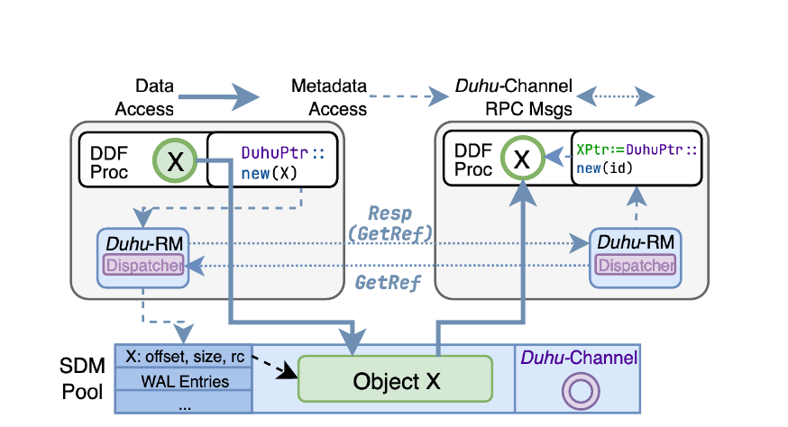
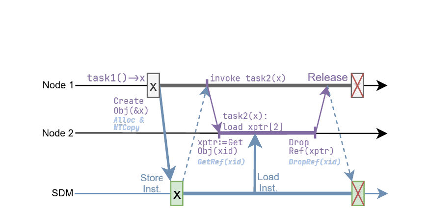
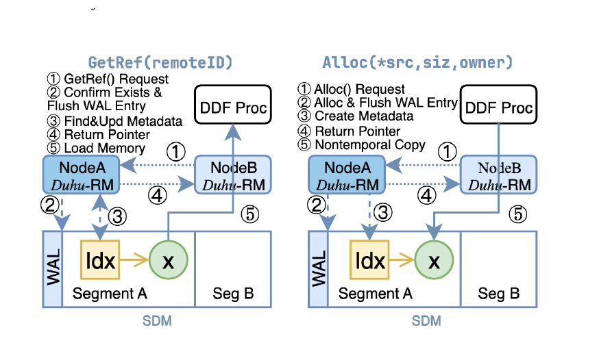
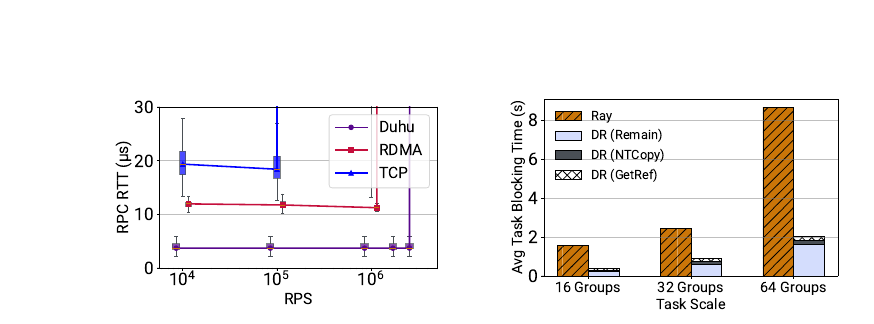
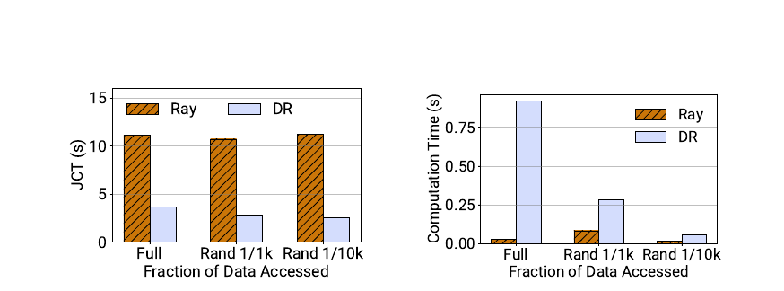
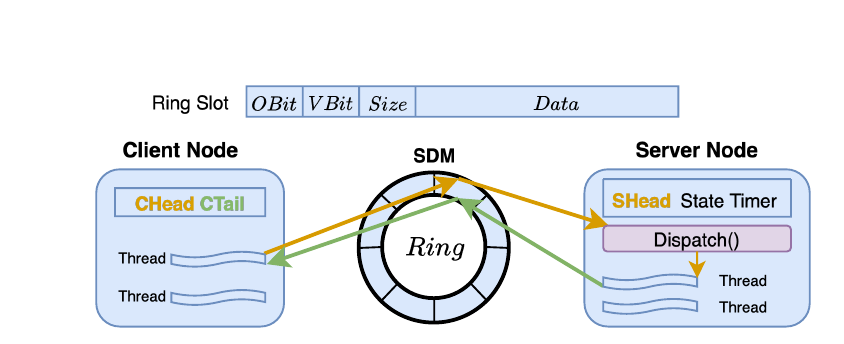
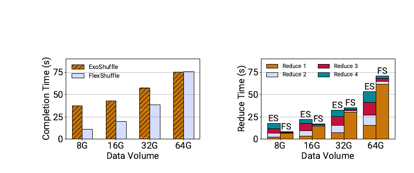
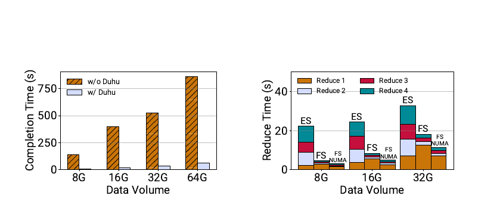
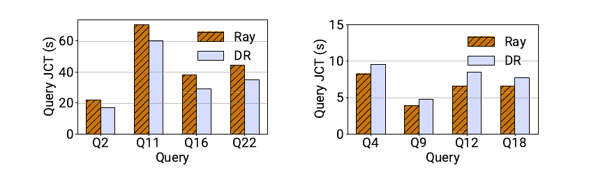

# Duhu：面向分布式数据处理框架的共享解耦内存

> 论文：*Duhu: Shared Disaggregated Memory for Distributed Data Processing Frameworks*  
> 作者：Qiutong Men、Tao Wang、Jongryool Kim、Hane Yie、Emmanuel Amaro、Marcos K. Aguilera、Aurojit Panda  
> 会议：20th USENIX Symposium on Operating Systems Design and Implementation（OSDI 2026）  
> 原始材料：`[OSDI 2026] Duhu Shared Disaggregated Memory for Distributed Data Processing Frameworks.pdf`  
> 解构范围：只使用论文正文与 Artifact Appendix；未使用同目录既有解构报告，也未引入外部实现结论。

## 证据标签

- **论文事实**：论文明确描述的设计、配置或流程。
- **实测数据**：论文在指定实验条件下报告的测量值。
- **作者判断**：作者依据实验或设计给出的解释，尚不等于独立验证。
- **分析推断**：根据论文机制和数据作出的因果判断。
- **项目解读**：将论文原则映射到统一异构 KVCache 存储与调度底座后的判断。
- **开放问题**：论文没有给出足够信息或实验，不能据此下结论。

---

# 1. 一页读懂论文

## 1.1 论文解决什么问题？

分布式数据处理框架（Distributed Data Processing Framework，DDF，即把计算任务分散到多台服务器执行的框架）通常把中间对象复制到消费节点的本地内存后再处理。对象在逻辑上已经通过 key 或引用共享，物理上仍要完整传输并生成本地副本。结果是网络传输、序列化、内存容量和任务启动等待同时增加。

Duhu 试图把这条路径改成按引用访问：不可变对象只在共享解耦内存（Shared Disaggregated Memory，SDM，即多个计算节点通过专用互连共同访问的外置内存池）中保存一份，消费节点取得可解引用句柄后直接读取。它面向不提供跨节点硬件缓存一致性的 SDM，论文原型使用 CXL（Compute Express Link，通用计算互联总线，用于支持 CPU、加速器与内存池之间高带宽、低延迟的缓存一致性互联）2.0 Type 3 内存设备。

## 1.2 根因是什么？

表面问题是“复制太多”，根因是框架对象语义与硬件共享语义没有对齐。

DDF 的中间对象写入完成后通常不再修改，适合共享读取；对象的引用者集合、地址、空闲空间和故障恢复状态却持续变化。现有对象存储没有把这种“不可变大数据、可变小元数据”的差异传递到底层，所以逻辑引用最终仍落成完整本地副本。SDM 虽然提供共享地址，但缺少跨节点一致性，直接放开多节点写元数据会引入锁、缓存同步和故障接管问题。

## 1.3 核心洞察是什么？

对象正文不可变、元数据可变，而且正文访问量远大于元数据操作量。Duhu 因此共享正文，但不共享元数据写权限：所有节点直接读同一份对象，元数据则按 segment（分段）分配给唯一所有者串行修改。系统只在对象发布、引用变化和故障恢复等边界执行软件协调，避免对每次数据读取支付全局一致性成本。

更准确地说，Duhu 没有消除一致性，而是缩小了需要协调的一致性范围。

## 1.4 核心抽象是什么？

Duhu 暴露“集群级不可变共享对象”抽象：

- `ID` 是可跨节点传递的逻辑引用，并编码对象所在分段，用于路由元数据操作。
- `DuhuPtr` 是节点取得访问资格后可解引用的本地句柄。
- `CreateObj / GetObj / DropRef` 分别承担发布、获取和释放。
- 每个分段只有一个元数据所有者，其他节点通过 Duhu-Channel 发起控制请求。
- 所有节点把 SDM 分段映射到相同虚拟地址，因此 `DuhuPtr` 不需要额外地址翻译。

应用代码不需要理解这些细节，但框架对象管理模块仍需改造。论文对 Ray 的修改集中在 `PushLocalObject`、`GetRef` 和 `FreeObject` 所在模块，所以准确表述是“应用逻辑不改、框架对象管理层局部接入”，不是无需修改框架。

## 1.5 关键优化方法速览

### 方法 1：单副本不可变对象发布与按需直接读取

- **问题**：远端消费者必须先接收完整对象并生成本地副本，即使任务只读取对象的一小部分。
- **方法**：对象在远端访问或本地内存压力出现时才延迟写入 SDM；写入完成后保持不可变，消费者通过 `DuhuPtr` 直接读取同一份对象。
- **效果**：每个消费者一次完整复制，变成一份共享对象加按实际访问发生的远端 load 流量，减少副本容量和计算前等待。
- **关键证据**：fan-out 微基准中，Duhu-Ray 的平均任务阻塞时间缩短 2.80–4.29 倍；部分随机读取大对象时，传输节省可以覆盖较慢的 SDM 计算访问。

### 方法 2：分段单所有者元数据协调与显式引用生命周期

- **问题**：非一致性共享内存上的元数据会被多节点修改；现有按节点独立回收本地副本的垃圾回收语义也不再安全。
- **方法**：把元数据分段，每段只允许一个节点修改；跨节点操作通过 RPC 交给所有者；引用位图、WAL（预写日志）和幂等回放共同维护生命周期与恢复。
- **效果**：共享可写元数据变成分段单写者状态，把并发一致性收敛到少量控制请求，同时避免对象仍被使用时回收空间。
- **关键证据**：论文给出了协议与恢复算法，但没有故障注入、所有者热点或大规模引用回收的定量实验。

### 方法 3：SDM 环形槽传参与网络唤醒的低延迟控制通道

- **问题**：分段单所有者设计需要频繁跨节点控制 RPC，若全部经过内核 TCP 路径，协调开销会抵消共享读取收益。
- **方法**：请求和响应放在 SDM 中的 64B 环形槽，活跃时轮询；通道空闲后停止轮询，由普通网络消息唤醒。
- **效果**：小消息正文从网络协议栈转到共享内存 cache line，网络主要负责低频通知。
- **关键证据**：论文报告 Duhu-Channel 在约 300 万 RPS 时 RTT 为 3.8µs；RDMA 对照在 100 万 RPS 时为 11.74µs，但该 RDMA 实现一次只允许一个未完成请求。

### 方法 4：基于切片描述符的多阶段 Shuffle 元数据重排

- **问题**：传统 Shuffle 在每个阶段重新分区、搬运和物化中间数据，多阶段作业反复搬动内容相同的数据。
- **方法**：map 输出以未分区形式写入 Duhu，每个逻辑分区只记录 offset/length 切片；后续 reduce 阶段改变切片描述，不重新搬运完整数据。
- **效果**：后续阶段的物理数据重排变成元数据重排。
- **关键证据**：四阶段 Shuffle 的总作业时间最高改善 3.39 倍，后续 reduce 阶段快 3.59–13.81 倍；64GB 场景因初次写入 SDM 占主导，反而慢 1.01 倍。

## 1.6 最重要的实验结果是什么？

1. **实测数据，四阶段 Shuffle**：在 32 个 map、32 个 reduce 任务和 8–64GB 数据量下，FlexShuffle 相对 Exoshuffle 的作业完成时间最高改善 3.39 倍。该收益主要来自后续阶段不再搬数据，不是首阶段读取 SDM 更快。
2. **实测数据，通用查询**：TPC-H scale factor 10 下，Duhu-Ray 对已完成评测的查询平均改善 1.08 倍；最有利查询最高 1.30 倍，四个最慢查询中 Duhu-Ray 慢 1.2 倍。Ray 因内存耗尽而失败的 Q5 被排除。
3. **实测数据，控制通道**：Duhu-Channel 报告 3.8µs RTT、约 300 万 RPS；基线对流水深度的限制使该结果不能直接解释为普遍优于调优后的 RDMA。
4. **实测数据，部分访问**：读取 6.4GB 数组的极小随机子集时，避免完整复制降低了总作业时间；但 Ray 的纯计算时间约为 Duhu-Ray 的 0.29 倍，说明 SDM 读取本身更慢。

## 1.7 最大局限是什么？

- 3.39 倍是 Duhu 与新 Shuffle 算法共同取得的组合结果。论文缺少“同一 Shuffle 算法只替换对象存储”的消融，无法分离两者贡献。
- 故障恢复以协议说明为主，没有 owner 故障、memory blade 故障、WAL 回放和 slot 复用的故障注入数据。
- 实验只有 4 台服务器、16 个分段。元数据所有者热点、每对节点通道状态、引用位图增长和恢复扫描成本没有扩展性证据。
- SDM 原型只有约 10GB/s 带宽和 600–800ns 时延。网络又被整形成与其带宽接近，结论依赖网络与共享内存的带宽比。
- 论文从 64B 对齐推导环形槽可原子读写，但没有给出 CXL fabric 上 64B 不撕裂写的硬件保证或校验协议。

## 1.8 为什么与本项目相关？

KVCache（大模型注意力键值缓存，即大模型自回归生成过程中缓存的历史 Key 与 Value 激活状态张量，用于避免后续 Token 生成时重复计算注意力）同样具备“大对象、封存后只读、跨节点复用”的一部分特征。Duhu 独立验证了一个重要方向：共享只读正文、缩小可变元数据的一致性范围，确实可能减少完整对象复制和源端网络放大。

- **必要性证据**：多消费者、部分访问和多阶段复用下，完整复制会制造可测的网络、容量和等待开销。
- **可行性证据**：在无跨节点硬件一致性的共享内存上，依靠不可变发布、单所有者元数据和显式生命周期，可以构造可运行的按引用访问对象存储。
- **差异化证据**：Duhu 没有处理模型语义身份、多卡张量分片、设备侧在途访问、远端显存租约、加载与重算动态对账，以及 HBM（高带宽显存，用于存放推理设备执行数据）/NVMe SSD 分层等 KVCache 专属问题，这些仍需本项目实现。
- **剩余举证责任**：论文不能证明本项目的 TTFT（Time To First Token，首 Token 响应时间）、TPOT（Time Per Output Token，每个输出 Token 的生成耗时）、吞吐、Host CPU 零数据拷贝（CPU 只下发控制指令，不参与正文数据搬运，Host Payload Touch Bytes 严格为 0）或端到端目标已经成立，也不能证明远端直读优于拷贝到本地显存。

---

# 2. 为什么这个问题值得解决

## 2.1 复制成本不是单一网络问题

Ray、Spark 一类框架用不可变对象存储解耦生产者和消费者，获得调度弹性与 lineage（血缘重算）故障恢复，但消费端必须把对象放入本地内存。对一个被多个节点读取的大对象，这会同时消耗网络出口、接收端内存、CPU 序列化资源和对象存储容量。若本地对象存储额度不足，还会引发 SSD spill，性能从内存路径掉到存储路径。

论文的 fan-out 实验把这件事做了最小化验证：一个生产者生成 200MB 数组，四个消费者分布在不同服务器，三个消费者是远端。Ray 需要传输三份；Duhu 只需把对象写入共享内存一次。数据量从 3.2GB 增至 12.8GB 时，Duhu-Ray 的平均阻塞时间缩短 2.80–4.29 倍。

这项结果证明的是“减少完整副本可以降低计算前等待”，不是“远端内存访问比本地内存快”。论文后面的计算时间数据恰好说明后者不成立。

## 2.2 共享地址并不自动带来可用的共享对象

不提供跨节点硬件缓存一致性的 SDM 有三个直接问题：

1. 创建者写完对象后，其他节点何时能看到完整内容；
2. 已释放地址被新对象复用时，消费者如何避免读到处理器缓存中的旧 cache line；
3. 多节点如何修改引用、地址和空闲空间等元数据，并在所有者故障后恢复。

Duhu 的工作量主要花在这些边界上。它通过不可变对象降低数据一致性难度，通过单所有者元数据避免并发多写，通过引用位图和 WAL 处理回收与恢复。SDM 只是物理前提，软件对象语义才是论文的核心。

## 2.3 为什么现成方案不够

- 传统 Ray “按引用传参”传递的是对象 key。消费端仍要从对象存储取回完整对象，所以逻辑上是引用，物理上仍是按值复制。
- RDMA 对象存储通过显式 I/O 访问远端内存，不面对 CPU cache 的跨节点一致性问题，但每次操作需要提交 I/O；Duhu 讨论的是处理器直接 load/store 的共享地址。
- CXL 内存池和内存分层通常把一块远端内存独占分配给单主机，或把它作为慢速层，并没有把同一对象直接暴露给多个主机读取。
- 全局硬件一致性可以简化编程，却会引入目录状态、失效确认和最慢 sharer 等成本。论文称之为 coherence tax，但没有在同平台做硬件一致性对照，因此这部分是原理分析，不是实测结论。

## 2.4 使方案成立的工作负载观察

DDF 中间对象通常写一次、读多次，元数据远小于正文。这个观察使 Duhu 可以把系统分成两条路径：

- 正文路径：一次发布，多个节点直接读，不允许原地修改；
- 控制路径：引用、分配、释放和恢复由分段所有者串行处理。

若对象持续可变，或者大多数对象只在创建节点本地使用，Duhu 的优势会减弱。论文因此加入 lazy copy：对象只有在远端访问或创建节点出现内存压力时才进入 SDM。

---

# 3. 核心抽象与系统设计

## 3.1 控制面与正文路径

*原论文 Figure 1，印刷页 923 / PDF 第 4 页。实线是对象数据访问，虚线是元数据操作，点线是 Duhu-Channel 请求。图中最重要的分离是：对象 X 被多个节点直接读取，引用和位置等元数据由各节点上的 Duhu-RM 协调。*

每台计算节点运行一个 Duhu Reference Manager（Duhu-RM）。框架调用本地 Duhu-RM 获取对象、引用和释放结果；对象正文驻留在 SDM；元数据操作根据对象 ID 路由到相应分段的所有者。Duhu-Channel 负责所有者之间的小控制消息。

这一设计把“谁能修改状态”与“谁能读取数据”分开：所有节点可以读取已发布对象，只有所有者可以修改对应分段的元数据。

## 3.2 ID、DuhuPtr 与生命周期

*原论文 Figure 2，印刷页 925 / PDF 第 6 页。Node 1 创建对象并把它写入 SDM，Node 2 通过 ID 获取本地可解引用句柄；两个节点释放后，空间才能回收。*

`ID` 可以跨节点传播，但不能直接访问数据；`DuhuPtr` 能解引用，但只在取得引用的节点上有效。`GetObj` 完成两件事：更新对象的引用者状态，并返回 SDM 地址。`DropRef` 撤销节点引用。当引用数归零，Duhu 才回收对象。

论文的表述在这里有一个复现缺口：内部元数据看起来以“节点 bitmap”记录持有者，外层却使用“引用计数”措辞。如果同一节点多个 worker 同时持有 `DuhuPtr`，任一析构触发 `DropRef` 都可能过早清除节点位。论文没有说明 Duhu-RM 是否另有节点内计数，也没有规定每节点至多一个句柄。

## 3.3 分段、单所有者与恢复状态

SDM 被划分为多个 segment，每段包含通道区、WAL、元数据 hash map 和对象数据区。对象的元数据和正文放在同一分段，使其共享故障域。每个分段在任一时刻最多有一个所有者，非所有者通过 RPC 请求修改元数据。

*原论文 Figure 4，印刷页 926 / PDF 第 7 页。GetRef 更新引用元数据并返回地址；Alloc 先写 WAL，再创建元数据、返回地址并异步执行 non-temporal copy。*

所有者故障后，编排器把分段交给新节点。新所有者扫描元数据 hash map 重建 allocator 状态，再读取每个通道最后 `k` 条 WAL 记录并重放。slot version 用来判断客户端是否已经复用环形槽，幂等操作避免重复执行改变结果。

这个恢复设计依赖一个没有展开的前提：编排器必须保证旧所有者不能继续写。论文只说重新分配所有权，没有给出 ownership epoch、租约或硬件 fencing。遇到网络分区或误判时，单所有者不变量如何维持仍是开放问题。

## 3.4 设计不变量

| 不变量 | 为什么需要 | 论文证据 | 未闭合部分 |
|---|---|---|---|
| 对象发布后不可变 | 首次 cache invalidation 后才能长期直接读取 | API 与 §4.1 机制说明 | 没有完整 ready 状态机 |
| 正文写入完成后才能发放引用 | 防止消费者看到半写对象 | non-temporal write、sfence 与作者描述 | 创建者中途故障的处理不清楚 |
| 每段最多一个有效所有者 | 保证元数据单写顺序 | §4 与 §6 的接管流程 | 缺少旧所有者 fencing |
| 引用必须完整计入 | 防止仍有读者时复用地址 | reference bitmap / DropRef | 同节点多引用语义未说明 |
| 元数据操作量远小于正文访问量 | 单所有者和控制 RPC 才不会成为主瓶颈 | 论文工作负载观察 | 没有操作比例和热点实验 |
| 避免完整复制的收益大于远端读取代价 | 决定端到端性能是否改善 | Figure 6、10–17 | 不存在通用阈值，依赖负载 |
| 上层框架能重算丢失对象 | memory blade 故障后才可恢复数据 | Ray/Spark lineage 假设 | 不适用于无重算来源的对象 |
| 64B slot 能以所需原子性跨节点读写 | Duhu-Channel 与恢复正确性依赖它 | 论文按 cache-line 对齐推断 | 缺少 CXL 原子性保证或撕裂检测 |

---

# 4. 关键技术实现与作用机理

## 4.1 单副本不可变对象发布与按需直接读取

### 解决的问题

传统路径是：生产者写入本地对象存储，远端消费者等待完整对象传输，再在本地内存中访问。每增加一个远端消费者，就可能增加一份完整副本。任务只读取对象一小部分时，传输量仍由对象总大小决定。

### 核心方法

对象在需要远端消费时才进入 SDM，发布后保持不可变；消费者取得 `DuhuPtr` 后直接读取共享对象，不再先物化完整本地副本。

### 实现路径

1. 生产者先在本地内存构造完整对象。
2. Ray 发现远端消费者或本地对象存储出现压力时，延迟触发 Duhu `Alloc`。
3. 创建者用 non-temporal store 把对象写入 SDM，并执行 store fence。
4. 远端节点调用 `GetObj`。Duhu-RM 更新引用状态，并在首次访问前失效目标 cache line。
5. 框架使用返回的 `DuhuPtr` 直接执行 load。
6. 节点完成访问后调用 `DropRef`；最后一个引用释放后才回收空间。

### 资源 / 状态变化

`N` 份本地对象 + `N-1` 次完整远端传输  
→ 1 份共享对象 + 各消费者按实际访问产生的 SDM 读取流量。

### 为什么有效

不可变性把多写者一致性问题移出正文读取路径。消费者不必等待完整对象复制，部分访问也只读取实际触及的 cache line。收益来自减少字节和副本，不是提高单次内存访问速度。

### 达到的优化效果

**直接效果**

fan-out 中 Ray 需要向三个远端消费者各传一份 200MB 数组，Duhu-Ray 共享一份，平均任务阻塞时间缩短 2.80–4.29 倍。

**端到端效果**

TPC-H 已评测查询平均改善 1.08 倍，但小查询因 SDM 时延变慢。部分随机访问场景的总作业时间下降，纯计算时间却更长。

### 论文证据

*原论文 Figures 12–13，印刷页 932 / PDF 第 13 页。右图量化 fan-out 阻塞时间；堆叠中的 non-temporal copy 与 GetRef 仍是 Duhu 成本，不能把它描述为零搬运。*

*原论文 Figures 14–15，印刷页 932 / PDF 第 13 页。左图显示减少完整传输后的 JCT 收益，右图显示 SDM 上计算更慢。两张图必须一起看。*

### 亮点

论文把“零本地物化”与“零数据移动”区分开了。Duhu 消除的是消费前的完整副本；数据仍通过 CXL fabric 进入 CPU cache。对于稀疏读取大对象，这种按需取数很合适。

### 代价与局限

- 完整顺序扫描、多次复用的小对象更适合先复制到本地 DRAM。
- `GetObj` 究竟失效整个对象还是按需失效 cache line，论文没有给出足够细节。若对 6.4GB 对象逐行失效，部分访问收益会被前处理成本侵蚀。
- 论文没有直接测量峰值对象存储占用、总 fabric 字节数或物理副本数，内存节省仍缺一组直接数据。

### 对项目的意义

**ADAPT**。KVCache 的封存前缀段可以借鉴“发布后只读、按需共享”的原则，但执行 HBM 中的活跃 KVCache 会随 Decode 持续增长，不能把整条序列视为永久不可变对象。项目需要按封存段建立内容版本、设备可见性和独立生命周期，而不是直接复制 Duhu 的对象模型。

## 4.2 分段单所有者元数据协调与显式引用生命周期

### 解决的问题

正文不可变不代表系统没有可变状态。对象地址、引用者、分配器空闲区和恢复日志都会变化。让多个节点在非一致性 SDM 上直接修改这些字段，需要复杂的锁和缓存同步。共享对象也不能再沿用“每台节点独立删除本地副本”的回收规则。

### 核心方法

按分段指定唯一元数据所有者，其他节点把分配、引用和释放请求交给所有者；以显式引用状态、WAL 和幂等回放维护对象生命周期。

### 实现路径

1. 对象 ID 编码分段，用于把请求路由到 owner。
2. owner 独占修改分段的 hash map、free list 和 reference bitmap。
3. 非 owner 通过 `Alloc / GetRef / DropRef / CreateId` RPC 请求操作。
4. owner 在修改前写入并刷新 WAL。
5. 节点故障后，新 owner 扫描对象元数据重建 allocator，再检查各通道最后 `k` 条日志。
6. slot version 判断请求是否仍在等待；幂等操作允许安全重放。

### 资源 / 状态变化

跨节点共享可写元数据  
→ 分段单写者状态；

每节点独立副本回收  
→ 集群共享对象的显式持有与统一回收。

### 为什么有效

单所有者提供明确的修改顺序，避免在非一致性共享内存上实现跨节点细粒度锁。分段又把所有元数据集中到一个节点的瓶颈拆开。引用状态把“是否仍有消费者”显式化，使空间复用有判断依据。

### 达到的优化效果

**直接效果**

元数据一致性从多写者共享内存问题变成 owner 串行执行问题。

**端到端效果**

论文没有给出该机制的独立消融。端到端作业可运行只能说明常规路径成立，不能证明故障与高竞争路径正确，也不能量化 owner 串行化的代价。

### 论文证据

Figure 4 和 §6 给出正常操作与故障回放流程；Table 2 列出内部 RPC。没有 owner 故障注入、引用泄漏、WAL wrap-around 或分段热点实验。

### 亮点

“共享数据、不共享元数据写权限”是很务实的边界。它没有追求统一全局一致性，而是把可变状态放回明确的权威节点。

### 代价与局限

- 热点对象集中在同一分段时，owner CPU、WAL 和通道会形成串行点。
- 每个对象使用节点 bitmap 记录引用，节点规模增大时元数据随集群规模增长。
- 旧 owner fencing、同节点多引用、已响应 `GetRef/DropRef` 的持久性顺序未写清。
- WAL 预留 65,536 个 slot，但论文未说明回卷、检查点和覆盖旧记录时的崩溃安全。

### 对项目的意义

**ADAPT**。本项目可以保留“物理副本由有效所有者授权和回收”的原则，但不能只用节点 bitmap。KVCache 访问还包含 NPU/GPU 设备队列、远端映射、张量并行多卡和迟到 DMA。必须把对象内容版本、副本位置代际、所有者代际、注册代际和设备完成事件分别建模。

## 4.3 SDM 环形槽传参与网络唤醒的低延迟控制通道

### 解决的问题

分段 owner 需要处理跨节点小 RPC。如果控制请求进入内核 TCP 栈，系统会把数据面节省换成控制面等待。持续忙轮询又会占用核心并干扰其他 SDM 访问。

### 核心方法

用共享内存环形槽传递请求和响应，活跃阶段轮询；空闲后阻塞，由网络消息唤醒。

### 实现路径

1. 每个双节点通道在 SDM 中分配 `n` 个 64B slot。
2. 客户端用 `CHead/CTail` 和 CAS 预留 slot，写入 owner bit、version bit、长度与不足 63B 的正文。
3. non-temporal write 与 store fence 把消息写入 SDM。
4. 服务端用 `SHead` 轮询下一个 slot，并在读取前执行 cache invalidation。
5. 服务端完成请求后在同一个 slot 写回响应并转移 owner bit。
6. 长时间无请求时服务端停止轮询；客户端发送普通网络通知唤醒。

### 资源 / 状态变化

网络承载请求正文与通知  
→ SDM 承载小消息正文，网络承担空闲通道唤醒；

持续轮询  
→ 活跃轮询与空闲阻塞切换。

### 为什么有效

小 RPC 不再经过内核协议栈和常规网络序列化。共享 ring 又允许多个未完成请求占据不同 slot，从而形成流水。

### 达到的优化效果

**直接效果**

论文报告 Duhu-Channel 在约 300 万 RPS 时 RTT 为 3.8µs；RDMA 对照在 100 万 RPS 时为 11.74µs。

**端到端效果**

论文没有把 Duhu-Channel 替换成等并发 RDMA 后重跑应用，因此无法确定它对 3.39 倍 Shuffle 结果贡献了多少。

### 论文证据

*原论文 Figure 5，印刷页 927 / PDF 第 8 页。请求和响应复用 SDM ring slot；客户端、服务端分别维护 head/tail 与状态。*

Figure 12 提供 RPC 微基准。对照条件必须保留：论文的 RDMA 实现一次只允许一个 outstanding request，而 Duhu ring 允许多个 slot 并发。

### 亮点

轮询与网络唤醒的组合避免了“低时延必须永久占核”的简单二选一。通道还复用请求/响应 slot，减少工作集。

### 代价与局限

- slot 只支持不足 63B 的正文，不是通用大消息 RPC。
- 每对节点独立通道和网络连接，状态量可能随节点数近似平方增长。
- 论文没有报告轮询核心、cache invalidation 流量、SDM 带宽占用和功耗。
- 64B 对齐不自动等于跨 CXL fabric 的 64B 原子可见，需硬件契约或校验协议支持。

### 对项目的意义

**VALIDATE**。可在 UBMEM（统一总线内存直通共享协议，即支持跨节点与异构设备间直接共享内存地址空间的底层通信协议）控制快路径上验证“共享 ring 传参 + 事件唤醒”，但必须与同等批量、同等并发的 URMA（通用远程直接内存访问，即用户态高性能 RDMA 驱动接口与通信协议）对照，并计入占核、缓存失效和总线带宽。

## 4.4 基于切片描述符的多阶段 Shuffle 元数据重排

### 解决的问题

Exoshuffle 的 map 任务先把输出物理分区，reduce 拉取对应分区。每进入下一阶段，数据再次分区和搬运。多阶段作业重复移动相同正文。

### 核心方法

只保存一份未分区输出，用 offset/length slice 描述逻辑分区；后续阶段重新组合 slice，而不是重新物化数据。

### 实现路径

1. map 任务把未分区输出写入 Duhu。
2. map 为每个逻辑 partition 生成一组 offset/length。
3. reduce 取得对象引用与 slice，直接读取所需区间。
4. 下一 Shuffle 阶段只更新 slice 集合，正文继续复用。

### 资源 / 状态变化

每阶段物理分区 + 复制 + 新副本  
→ 首次发布一份正文 + 后续阶段重排切片元数据。

### 为什么有效

多阶段 Shuffle 的正文没有改变，变化的是“哪些 offset 属于哪个下游任务”。把逻辑关系从数据布局中分离出来，就能避免重复数据移动。

### 达到的优化效果

**直接效果**

首个 reduce 阶段需要把完整数据写入 SDM，可能更慢；后续阶段不再移动正文，阶段时间改善 3.59–13.81 倍。

**端到端效果**

四阶段作业最高改善 3.39 倍。64GB 场景初始写入占主导，FlexShuffle 比 Exoshuffle 慢 1.01 倍。

### 论文证据

*原论文 Figures 6–7，印刷页 931 / PDF 第 12 页。Figure 6 给出总 JCT，Figure 7 表明主要收益发生在后续阶段；64GB 时首阶段成本抵消了后续收益。*

*原论文 Figures 8–9，印刷页 931 / PDF 第 12 页。Figure 8 的大差距包含本地对象存储不足后 spill 到 SSD 的影响；Figure 9 使用单机 NUMA 模拟更快 SDM，不是 ASIC CXL 实测。*

### 亮点

FlexShuffle 说明共享内存可以用于改写数据流。收益不是“把原路径搬到 CXL”，而是让调度器只改元数据，不再反复物化数据。

### 代价与局限

3.39 倍同时改变了对象存储、Shuffle 算法和内存压力。论文缺少以下消融：

- Exoshuffle 使用 Duhu；
- FlexShuffle 在本地内存充足且不 spill 的条件下运行；
- 同一 FlexShuffle 算法只切换共享对象存储；
- 相同总可用内存容量下比较。

### 对项目的意义

**ADAPT**。KVCache 不做 Shuffle，但“正文不变、消费视图变化”的思想可映射到前缀分支、部分命中和布局切片。项目应让连续前缀范围、层、张量并行 rank 与物理 extent 分离，使用描述符重组访问范围，而不是为了不同消费者反复复制完整 KVCache。

---

# 5. 实验到底证明了什么

| Claim | Experiment / Evidence | Conditions & Baseline | Result | What it proves | What it does not prove |
|---|---|---|---|---|---|
| 多阶段 Shuffle 可减少重复搬运 | Figures 6–7 | 32 map + 32 reduce；4 stages；8–64GB；FlexShuffle vs Exoshuffle | 总 JCT 最高改善 3.39×；后续阶段 3.59–13.81×；64GB 慢 1.01× | slice 重排在后续阶段能避免正文再次搬运 | 不能分离 Duhu、算法变化和内存配额各自贡献 |
| FlexShuffle 依赖共享容量 | Figure 8 | 单阶段；有 Duhu vs 无 Duhu；无 Duhu 时本地副本触发 SSD spill | 无 Duhu 时 JCT 高 13.34–24.69× | 本地完整副本会使容量受限实现失去可行性 | 不能代表本地 DRAM 充足时的差距 |
| 更快远端内存可能扩大收益 | Figure 9 | 单服务器 NUMA 模拟 vs 2-node CXL 原型 | NUMA FlexShuffle 比 CXL 快 1.10×；比 Exoshuffle 快 2.43–5.79× | 降低远端访问开销有利于该数据流 | 不能当作未来 ASIC CXL 的硬件实测或绝对预测 |
| 现有查询有条件受益 | Figures 10–11 | Modin TPC-H SF10；每节点对象存储 5GB；Q5 因 Ray OOM 被排除 | 已评测查询平均 1.08×；最好查询最多 1.30×；慢查询子集慢 1.2× | 共享容量有利于中间数据超过本地对象存储的查询 | 不能推出完整 TPC-H 套件或小查询普遍加速 |
| Duhu-Channel 小 RPC 性能高 | Figure 12 | Duhu vs TCP vs RDMA WriteImm；RDMA 单 outstanding | 3.8µs @ 3M RPS；RDMA 11.74µs @ 1M RPS | 当前实现和配置下共享 ring 快于两个对照 | 不能推出优于充分流水、批量化 RDMA |
| fan-out 降低计算前等待 | Figure 13 | 200MB 对象；1 producer + 4 consumers；16/32/64 groups；带宽匹配 | 阻塞时间缩短 2.80–4.29× | 减少多份完整传输可降低等待 | 未直接给出全作业 JCT、总字节和峰值内存 |
| 部分访问适合按引用读取 | Figures 14–15 | 128 tasks 随机读取 6.4GB 数组的全量、1/1000、1/10000 | 小比例访问时总 JCT 下降；Ray 纯计算约为 Duhu-Ray 的 0.29× | 传输节省可以覆盖较慢的远端 load | 不能说 SDM 上计算更快；顺序扫描可能反转 |
| 故障恢复保持对象语义 | §6 设计与算法 | WAL、幂等回放、slot version、SIGBUS + lineage | 无系统性定量结果 | 协议给出了一条可能实现路径 | 没有验证恢复时间、双故障、旧 owner 写入或撕裂 slot |

*原论文 Figures 10–11，印刷页 931 / PDF 第 12 页。论文把最好和最慢查询分别给出，这组结果直接否定“共享内存对象存储对所有查询都更快”的说法。*

---

# 6. 论文的亮点与局限

## 6.1 不可变正文与可变元数据分离

**亮点**

论文没有在非一致性 SDM 上模拟完整共享内存一致性，而是利用对象语义缩小问题。大正文只读共享，小元数据集中修改，这个边界清楚，也便于框架接入。

**局限**

对象发布协议没有完整 ready 状态机。`Alloc` 建立元数据后才异步复制正文，论文虽声称其他节点不会在完成前取得对象，却没有说明创建者中途故障如何阻止半写对象被引用。

## 6.2 单所有者元数据

**亮点**

单写者比跨节点锁更容易推理。分段又避免了单个全局元数据服务。

**局限**

论文没有热点与规模实验。4 节点、16 分段不能证明在大量节点、引用高频变化和热点对象下仍可扩展。owner 接管还缺旧 owner fencing。

## 6.3 共享 ring 控制通道

**亮点**

SDM 传正文、网络做唤醒的组合适合小控制消息；活跃轮询与空闲阻塞减少了固定轮询成本。

**局限**

对照基线没有做到相同并发深度。CPU 占用、缓存失效和共享内存带宽也没有计入，3.8µs 不能脱离这些条件使用。

## 6.4 FlexShuffle 数据流重构

**亮点**

它抓住了多阶段 Shuffle 中“数据未变、分区视图在变”的事实，把物理搬运替换为元数据切片重组。这个收益链条比简单的远端内存替代更扎实。

**局限**

论文没有把算法收益与系统收益拆开。最高 3.39 倍来自组合设计，并且在初次发布成本主导的 64GB 场景出现轻微退化。

---

# 7. 论文没有解决什么

## 7.1 故障与所有权接管仍停留在设计层

论文依赖编排器检测节点和 memory blade 故障，但没有故障检测误差、网络分区和旧 owner 隔离协议。WAL 回放、引用清理和 SIGBUS 路径也没有故障注入数据。故障容忍是设计主张，不是实验结论。

## 7.2 发布、持有和物理回收语义不够完整

论文没有明确区分“元数据已创建、正文已写入、其他节点可见、消费者取得引用、所有设备访问结束、空间可复用”这些状态。对 CPU 任务，析构触发 `DropRef` 可能够用；对异步设备访问和迟到 DMA，这个模型不完整。

## 7.3 远端访问与本地复制缺少在线选择器

结果已经显示明显边界：小查询和完整重复访问可能更适合本地 DRAM，部分访问和内存压力更适合直接读 SDM。论文只提出 hybrid policy，没有实现基于对象大小、访问比例、复用次数和实时拥塞的动态决策。

## 7.4 大规模控制面成本未验证

每对节点的 Duhu-Channel、节点 bitmap、分段 owner、WAL 扫描和故障后全对象引用清理，都随规模增长。论文没有测量节点数扩大后的状态量、故障恢复时延和热点迁移。

## 7.5 未来硬件外推证据有限

Figure 9 用单机 NUMA 模拟更快 SDM。NUMA 的缓存一致性、拓扑和竞争行为与多主机非一致性 CXL 不同。这组数据只能说明“更低远端访问成本对 FlexShuffle 有利”，不能给出未来 CXL 产品的定量结果。

## 7.6 复现细节仍有缺口

- Algorithm 1 的 `WriteToSDM` 行号与正文引用不一致。
- ring full 的伪代码预检查没有显式取模，后续 `next` 才取模。
- 64B slot 原子性缺少平台依据。
- `GetRef/DropRef` bitmap 更新何时持久到 SDM 没有说清。
- WAL wrap-around、清理和检查点未定义。

这些问题不直接否定论文的性能观察，但会影响独立实现的正确性。

---

# 8. 对本项目的启发

## DIRECTLY ADOPT

### 8.1 封存正文与可变控制状态分离

项目可以直接采用这条语义原则：已封存的 KVCache 前缀段保持只读；位置、持有、路径、租约和故障状态由独立控制结构维护。正文不就地修改，追加或分支生成新对象版本。这样可以把数据面高频读取与控制面一致性分开。

### 8.2 延迟进入共享层

Duhu 集成 Ray 后发现大量对象只在创建节点使用，因此只在远端访问或本地内存压力出现时放入 SDM。项目同样不应把每个新生成的 KVCache 无条件换出或发布到共享层。只有存在预测复用、容量压力或跨节点消费需求时才执行发布和搬运。

## ADAPT

### 8.3 从 `ID/DuhuPtr` 改造成“对象身份 + 可消费句柄”

Duhu 的 `ID` 与 `DuhuPtr` 分离值得保留，但 KVCache 句柄必须绑定语义身份、内容版本、物理副本、注册代际、设备范围和释放方法。项目中的 QueryPlan（查询与放置计划决策引擎，即在微秒级时间内根据链路状态、算力与上下文长度选择数据加载或重算路径）应只返回候选计划；真正用于计算的接入句柄必须在数据可见性和多卡状态一致后发放。

### 8.4 从节点引用 bitmap 改造成持有、租约和设备完成证据

Duhu 的引用 bitmap 无法覆盖设备侧异步访问。项目中的 ViewGuard（视图租约安全守卫机制，即管理远端直读生命周期与租约有效性，并在远端故障或超时时安全回退）需要把软件持有、底层地址授权和 NPU/GPU 完成事件合并判断。心跳丢失不能直接清零引用并复用空间。

### 8.5 把切片思想用于前缀范围和张量布局

FlexShuffle 的 slice 说明“逻辑消费视图不必等于物理复制”。项目可以用连续数据块区间清单描述 Token 范围、层、张量并行 rank 与物理 extent，按部分命中重组访问范围。它适合前缀分支和部分加载，但需要严格禁止不同内容版本拼接。

### 8.6 把共享 ring 用于控制快路径，而不是正文搬运

Duhu-Channel 更接近项目的元数据与状态同步路径。ConsumeEligibility（消费资格校验引擎，即对模型、词表、提示词模板、LoRA 低秩适配器、Ready 位与租约有效性等语义进行合法性检查）和 RankConsensus（张量并行多卡状态同步机制，即在 TP 多卡并行时同步各卡命中状态与一致动作）可能需要低时延小消息。共享 ring 可以作为候选，但必须建立平台原子性、可见性和故障恢复契约。

## DO NOT COPY

### 8.7 不把同虚拟地址当作授权

相同虚拟地址只解决指针解释，不证明对象版本正确、设备有访问权限或资源仍存活。项目必须使用受保护句柄和代际校验，禁止向上层暴露可长期保存的裸远端地址。

### 8.8 不使用“引用归零即立即复用”的简单规则

设备操作可能已提交但软件回调尚未返回。物理区间只有在本地读者、远端持有、框架事件和设备在途访问全部结束后才能复用。忽略旧回调不能阻止迟到 DMA 写入新对象。

### 8.9 不把 SIGBUS 加重算当作完整故障模型

Duhu 的 memory blade 故障依赖 SIGBUS 和上层 lineage。KVCache 请求还涉及已输出 Token、采样状态、多卡集合通信和请求剩余时限。项目需要把错误映射为短前缀回退、其他副本加载、本地重算或请求失败，并保留具体条件。

### 8.10 不默认远端直读优于本地显存

Direct-View（远端直读，即通过高速总线跨节点读取远端显存中的 KV 数据，不产生本地显存完整副本）适合低复用或稀疏访问；Copy-to-HBM（拷贝到本地显存，即通过 DMA 将远端 KV 数据完整搬运至本地高带宽显存）适合后续会被多次顺序读取的 Decode。Duhu 的反例说明必须按负载选择，不能固定一条路径。

## VALIDATE

### 8.11 远端直读、拷贝与重算的交叉点

需要测出对象大小、访问比例、重复读取次数、远端带宽和排队条件下的真实交叉点。Duhu 只验证 CPU DDF 对象，不能直接给出 NPU/GPU KVCache 的阈值。

### 8.12 公平对照下的控制通道

共享 ring 必须与同等 outstanding 深度、批量大小和 CPU 核预算的 URMA/RDMA 对照。要同时报告 P50/P99、吞吐、占核、共享总线带宽和故障恢复。

### 8.13 一对多共享读取的总线竞争

Duhu 的 fan-out 降低了源端复制，但多个消费者仍会争用共享内存带宽。项目要验证一对多前缀分发时，源端出口、接收端汇聚、共享总线与前台在线推理是否出现新的瓶颈。

---

# 9. 对本项目立项的背书

## 9.1 Problem Validation

**项目问题得到独立支持。** 论文实测说明，当同一大对象被多个节点消费、任务只访问其中少量数据，或多个阶段反复使用相同正文时，完整对象复制会增加等待和容量压力。这个结论与 KVCache 跨实例复用、热门前缀一对多分发和部分前缀命中的问题同源。

证据范围要收窄：这是 4 节点 CPU DDF 与 FPGA CXL 原型上的测量，不是 NPU KVCache 集群实测。

## 9.2 Mechanism Validation

以下底层原则获得了外部技术证据：

1. 封存后只读的大对象可以只保留一份，通过共享地址让多个节点按引用访问。
2. 可变元数据不必跟正文采用同一一致性机制；分段单写者可以降低非一致性共享内存的编程复杂度。
3. 小控制消息可以利用共享内存 ring 与事件通知降低 RPC 开销。
4. 当消费视图变化而正文不变时，重组描述符比重复制正文更有效。

这些证据支持项目方向，但不等于 Duhu 的具体实现可直接移植。

## 9.3 Research-Gap Validation

Duhu 没有解决的下列问题，与本项目计划范围直接重合：

- KVCache 的模型、词表、模板、适配器、布局和租户语义一致性；
- 张量并行多卡必须对命中范围、版本和回退动作达成一致；
- NPU/GPU 设备访问结束前的租约、撤销和物理安全回收；
- HBM、DDR、NVMe SSD 与远端资源之间的分层放置；
- 远端直读、拷贝到本地显存和本地重算之间的动态收益判断；
- 前台 TPOT 与后台搬运的共享链路干扰控制。

这些缺口说明项目仍有独立工程价值。它们不是 Duhu 的失败，而是 DDF 对象存储与推理 KVCache 语义不同造成的边界。

## 9.4 Unsupported Project Claims

论文没有验证以下项目主张：

- Host CPU 零数据拷贝，即 CPU 只下发控制指令、正文数据不经过 Host DDR；Duhu 创建对象时仍从本地内存复制到 SDM。
- NVMe SSD 与 NPU HBM 之间的直达数据路径。
- 六维以上语义一致性检查能避免错误消费。
- 张量并行（TP=8，即模型张量由 8 张卡协同计算）多卡状态同步的时延和死锁安全。
- Direct-View 与 Copy-to-HBM 在持续 Decode 中的边界。
- TTFT 降低 20%、QPS（每秒处理的推理请求数）提升 10%、TPOT 干扰率低于 3% 等项目目标。

这些都需要本项目独立原型和端到端测量。

## 9.5 Project Establishment Verdict

- **Necessity evidence**：完整对象复制在多消费者、部分访问和重复重排下确有网络、容量与等待成本。
- **Feasibility evidence**：不可变对象共享、单所有者元数据和显式引用生命周期可以在无跨节点硬件一致性的内存池上运行。
- **Differentiation evidence**：Duhu 不具备 KVCache 语义身份、多卡协同、设备生命周期、动态选路和多介质分层，本项目仍需补齐这些能力。
- **Remaining burden of proof**：项目必须用真实国产 AI 硬件证明数据路径、正确性、故障安全、P99 时延和混压收益；论文不能替代这些验收。

---

# 10. 建议验证

## Experiment 1: 非一致性共享视图的数据可见性与 64B 控制槽原子性

- **Hypothesis**：在目标 UBMEM/CXL 平台上，选定的发布、失效和 fence 序列能保证消费者不读到半写正文或陈旧 cache line；控制槽不会出现撕裂读写。
- **Variable**：对象大小、cache-line 对齐、写入指令、消费者数量、地址复用、并发度、故障注入时刻。
- **Baseline**：带显式校验和双版本提交的保守消息路径；URMA/RDMA 控制消息。
- **Metric**：陈旧读取数、撕裂读取数、错误消费数、P50/P99 发布可见时延、总线流量。
- **Controlled conditions**：固定 CPU/NPU 频率、NUMA、同一对象内容、同一并发深度；记录硬件内存模型与驱动版本。
- **Pass condition**：长时间压力与故障注入中错误读取严格为 0，且 P99 满足控制预算。
- **Fail implication**：禁止使用裸共享 slot 或首次失效方案，改用带校验的提交协议或消息通道。
- **Decision affected**：是否采用 Duhu-Channel 类共享控制快路径，以及 Direct-View 的可见性协议。

## Experiment 2: 远端直读、拷贝到本地显存与本地重算的交叉点

- **Hypothesis**：低复用或稀疏访问时远端直读更合适；高复用、顺序 Decode 时拷贝到 HBM 更合适；小前缀或拥塞路径应回退重算。
- **Variable**：KVCache 大小、访问比例、Decode Token 数、复用次数、链路带宽、并发度、队列深度、布局转换成本。
- **Baseline**：本地直接重算、Copy-to-HBM、Direct-View 三条完整路径。
- **Metric**：TTFT、TPOT P50/P99、总搬运字节、HBM 占用、NPU stall、Host Payload Touch Bytes。
- **Controlled conditions**：同一模型、词表、提示词、输出长度、批大小和目标设备；统一计算重算成本。
- **Pass condition**：形成可重复的交叉点模型，路径选择错误率和尾部回退成本在预算内。
- **Fail implication**：关闭无稳定收益区间的路径，不把远端直读设为默认主路径。
- **Decision affected**：QueryPlan 的动作集合、特征与首版启用范围。

## Experiment 3: 持有、租约、设备在途访问与安全回收

- **Hypothesis**：对象空间只在所有软件持有、设备事件和远端访问均结束后复用，可以在节点故障和迟到完成下保持零错误消费。
- **Variable**：租约期限、时钟偏差、内核持续时间、DMA 延迟、节点故障、进程重启、重试与取消时刻。
- **Baseline**：简单引用计数；引用计数加设备完成事件；完整 ViewGuard 方案。
- **Metric**：过早回收、迟到写、悬挂引用、隔离字节、恢复时间、请求失败率。
- **Controlled conditions**：固定对象版本和内存区域，注入可重现故障序列。
- **Pass condition**：错误消费和越界访问为 0；无法证明终止的资源进入隔离，不被重新分配。
- **Fail implication**：禁止 Direct-View 上线，退回 Copy-to-HBM 或本地重算。
- **Decision affected**：共享视图的生产准入与物理回收状态机。

## Experiment 4: 公平流水深度下的共享 ring 与 URMA/RDMA 对照

- **Hypothesis**：在同等 outstanding、批量、CPU 核和消息大小下，共享 ring 对小控制消息仍有 P99 优势。
- **Variable**：消息大小、outstanding 深度、节点数、通道数、轮询退避、前后台流量。
- **Baseline**：TCP、URMA/RDMA WriteImm、批量 Send/Recv、共享 ring。
- **Metric**：P50/P99 RTT、RPS、占核、cache miss、共享总线字节、能耗、故障恢复时间。
- **Controlled conditions**：相同 CPU 亲和性、队列深度、通知策略和网络带宽。
- **Pass condition**：共享 ring 在目标消息分布上取得稳定 P99 收益，且占核和总线干扰不突破前台预算。
- **Fail implication**：保留标准 URMA/RDMA 控制通道，不为微基准收益引入新的恢复协议。
- **Decision affected**：元数据查询、消费资格校验和多卡状态同步的底层通道。

## Experiment 5: 一对多前缀共享与多卡混压

- **Hypothesis**：共享只读正文或软件分层中继能降低源端重复发送，同时不使共享总线或接收端汇聚成为新的尾部瓶颈。
- **Variable**：消费者数量 1/2/4/8/16、对象大小、前缀访问比例、TP rank 数、后台换出流量、慢节点比例。
- **Baseline**：源端逐目标复制、共享视图、Copy-to-HBM、软件分层中继。
- **Metric**：源端出口字节、总线利用率、各 rank 到齐时间、TTFT、TPOT 干扰率、P99、失败恢复。
- **Controlled conditions**：相同模型、前缀、消费者拓扑、链路 QoS 与目标缓冲。
- **Pass condition**：源端重复流量明显下降，所有 rank 正确消费同一语义版本，前台 TPOT 干扰率满足项目门限。
- **Fail implication**：限制共享消费者规模，启用分层中继或复制，避免把单源压力转移为总线多对一突发拥塞。
- **Decision affected**：一对多分发架构、共享视图规模和前后台 QoS 策略。

---

# Appendix A. 评测平台与结果使用边界

| 项目 | 论文配置 |
|---|---|
| 计算节点 | 4 台服务器，每台 4 颗 Intel Xeon Gold 6530、512GB 内存，Linux 6.6.0 |
| 网络 | ConnectX NIC，100Gbps；容器内/跨容器带宽经过整形 |
| SDM 原型 | FPGA-based CXL memory pool，128GB，约 10GB/s，600–800ns |
| 分段 | 16 个 segments；每段 65,536 个 WAL slots |
| 容器 | 每容器 12 cores、30GB；8 cores 用于计算，其余用于通信与辅助任务 |
| 带宽对账 | 多数实验把聚合网络带宽限制到约 80Gbps，以匹配约 10GB/s SDM |
| 基线 | 原生 Ray、Exoshuffle、TCP、RDMA WriteImm；不同实验基线不能互换 |

所有倍率都只对相应工作负载、容量、并发度和基线成立。不得把 Figure 6 的 3.39 倍与 Figure 12 的 RPC 结果相乘，也不得把 NUMA 模拟结果写成未来 CXL ASIC 实测。

# Appendix B. 关键开放问题清单

| 优先级 | 开放问题 | 影响 |
|---|---|---|
| P1 | 同节点多 `DuhuPtr` 是否有节点内引用计数 | 可能导致过早清除 reference bitmap |
| P1 | owner 接管是否有代际与 fencing | 网络分区时可能出现双写元数据 |
| P1 | `GetRef/DropRef` 更新何时持久到 SDM | 响应后故障可能丢失引用状态 |
| P1 | 64B slot 的跨 CXL 原子可见性 | 影响 RPC 与 WAL 回放正确性 |
| P1 | `Alloc` 后异步 copy 的 ready 发布点 | 创建者故障可能留下半写对象 |
| P2 | WAL 回卷、清理和检查点 | 影响长期运行和恢复 |
| P2 | `GetObj` 的 cache invalidation 粒度 | 影响大对象部分访问收益 |
| P2 | owner、channel 和 bitmap 的节点扩展性 | 影响大集群可用性 |
| P2 | 网络整形与真实部署的带宽比差异 | 影响性能外推 |

# Appendix C. 图像资产核对

本文嵌入的 Figure 1、2、4、5、6–15 均从原 PDF 对应可见页面以高分辨率渲染后裁取，保留了图例、坐标轴、刻度、面板和比较对象。原论文图注在 Markdown 中重写，避免把图中数值脱离实验条件。未选入 Figure 3、16、17，是因为它们不会改变本文对核心架构、主要收益和适用边界的判断。
