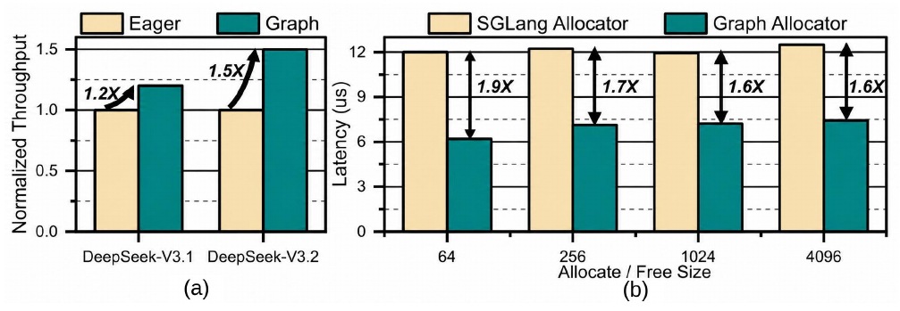
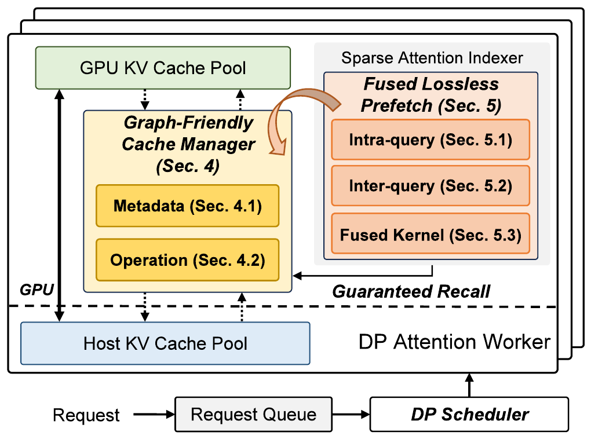
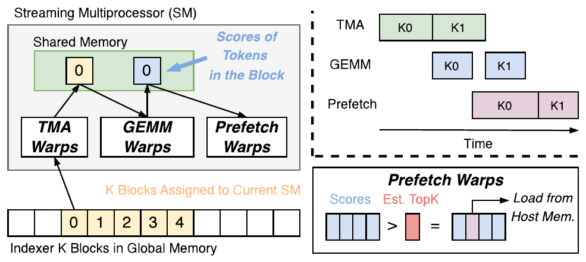

# ECHO (OSDI '26)：原生稀疏注意力大模型 KVCache 卸载与无损预取深度解读、技术启发与立项背书

## 一、 论文基本信息与研究背景

- **论文题目**：*ECHO: Efficient KV Cache Offloading with Lossless Prefetching for Serving Native Sparse Attention LLMs*
- **作者与机构**：Guangda Liu, Wenhao Chen, Chengwei Li, Zhenyu Ning（上海交通大学）；Jing Lin, Yiwu Yao（华为技术有限公司）；Quan Chen, Shixuan Sun, Jieru Zhao（上海交通大学）；Minyi Guo（贵州大学 & 上海交通大学）
- **发表会议**：USENIX OSDI 2026（第 20 届操作系统设计与实现顶会，Seattle, WA, USA）
- **原文链接**：[同目录 PDF](<[OSDI 2026] ECHO Efficient KV Cache Offloading with Lossless Prefetching for Serving Native Sparse Attention LLMs.pdf>)
- **核心专有名词界定**：
  - **KVCache**（大模型注意力键值缓存）：自回归生成过程中缓存的历史 Key 与 Value 激活状态张量，用于避免后续 Token 生成时重复计算注意力；
  - **Native Sparse Attention**（原生稀疏注意力）：在大模型架构设计时内生支持的稀疏注意力机制（如 DeepSeek-V2/V3、StreamingLLM 等），仅计算与当前 Token 强相关的上下文子集；
  - **TTFT**（Time To First Token，首字生成延迟 / 首 Token 响应时间）；
  - **TPOT**（Time Per Output Token，每个输出 Token 的生成耗时 / 单字生成延迟）；
  - **CUDA Graph**（计算图捕获与执行技术）：将一系列 GPU 核函数下发预先固化为静态执行图，消除 CPU 逐算子下发与同步开销。

### 1.1 面临的体系结构物理矛盾


*图 1：稀疏长上下文下 CPU 内存分配延迟开销与吞吐损失（摘自 ECHO 原文 Fig. 3）*


针对长上下文大模型服务，学术界与工业界推出了原生稀疏注意力架构（如 DeepSeek-V3/V2、StreamingLLM、SnapKV 等）。尽管原生稀疏注意力将注意力计算复杂度由 $O(N^2)$ 大幅缩减，使得长文本计算量显著降低，但在系统工程层面，KVCache 的卸载与召回遭遇了**控制面调度开销与数据搬运串行等待的双重体系结构瓶颈**：
1. **CPU 侧动态控制与解释型对象的调度延迟（CPU-side Control Overhead）**：现行主流推理框架（如 SGLang、vLLM）的内存块分配器（BlockAllocator）运行在 Host CPU 侧，依赖 Python 解释型对象进行逐块状态跟踪与生命周期判定。在动态稀疏注意力场景下，每一个 Decoding Step 都需要高频判定哪些块被淘汰（Evict）、哪些块被召回（Recall）。CPU 侧的频繁计算使分配与释放延迟大幅攀升，更致命的是，**它强行打断了 CUDA Graph 的静态捕获执行，导致 GPU 计算流水频繁发生同步停顿**；
2. **稀疏注意力 Top-K 动态选择的串行依赖（Serialization Bottleneck）**：在稀疏注意力计算中，必须先由索引算子（Indexer）对全部上下文进行轻量粗筛，才能通过 Top-K 判定出当前 Token 实际需要参与完整计算的活跃 KV Blocks。传统的预取机制无法提前预知 Top-K 结果，导致数据搬运必须在 Indexer 计算全部结束之后才能启动，预取搬运与计算核心完全串行，算力单元被迫长时间空转等待数据。

---

## 二、 核心技术细节与架构机理


*图 2：ECHO 图内并行缓存管理与两级无损预取架构（摘自 ECHO 原文 Fig. 5）*


*图 3：解码阶段 Query 内推测预取流水交叠时序（摘自 ECHO 原文 Fig. 10）*


ECHO 提出了面向原生稀疏注意力大模型的高效卸载与无损预取架构，由控制面的 **Parallel In-Graph Cache Manager** 与数据面的 **Fused Lossless Prefetching Engine** 构成：

```
+-----------------------------------------------------------------------------------+
| ECHO 控制面与数据面协同架构                                                       |
|                                                                                   |
|  [控制面: Parallel In-Graph Cache Manager (GPU 显存常驻)]                         |
|     ├── 剔除 CPU 介入: Block Tables 与状态元数据全部下沉至 GPU HBM                |
|     ├── 图内并行更新: 在 CUDA Graph 内部由轻量 GPU Kernel 并行执行 Allocate/Free   |
|     └── 消除同步停顿: 彻底消除 CPU-GPU Host-Device 同步屏障 (耗时降低 1.6~1.9x)   |
|                                                                                   |
|  [数据面: Fused Lossless Prefetching Engine (无损流水重叠)]                        |
|     ├── Intra-Query Prefetching (解码期):                                         |
|     │    └── 突破 Top-K 串行等待，在 Indexer 计算概率时提前异步拉取高置信度块     |
|     └── Inter-Query Prefetching (Prefill 期):                                     |
|          └── 利用输入 Prompt 块结构先验，跨请求构建双流重叠流水                   |
+-----------------------------------------------------------------------------------+
```

### 2.1 图内并行缓存管理器（Parallel In-Graph Cache Manager）
传统系统在每次自回归解码时，必须通过 CPU Python 进程调用内存分配器，随后向 GPU 发送更新指令。ECHO 彻底切断了 CPU 侧控制链：
- **元数据下沉常驻**：将原本由 Host CPU 维护的块映射表（Block Tables）、空闲链表与槽位状态（Status Maps）全量下沉至 GPU 高带宽显存（HBM）中；
- **CUDA Graph 原生并行操作**：设计专用的轻量级 GPU 核函数，将块的查找、分配、标记与释放完全封装为 CUDA Graph 内部的静态算子。在执行自回归解码时，状态更新与张量计算在 GPU 端内以线程块级高度并行完成；
- **实测收益**：彻底消除了 CPU 侧的 Python 调度延迟与 Host-to-Device 同步开销，使单次连续分配与释放延迟降低 **1.6 ~ 1.9 倍**，保障了 GPU 计算流水的连续性。

### 2.2 融合无损预取引擎（Fused Lossless Prefetching）
针对 Indexer 计算与 KV Block 搬运的串行依赖，ECHO 提出了两级无损预取策略：
1. **解码期 Query 内推测预取（Intra-query Prefetching for Decoding）**：
   - 传统 Top-K 算子必须等到全部打分矩阵归一化后才能输出确定性索引；
   - ECHO 观察到，在 Indexer 的中间计算阶段（如 Top-P 累积分布或部分注意力头评估时），高概率 Block 的置信度已经显著收敛。ECHO 在 Indexer 计算的同时，即刻通过异步 DMA 通道提前拉取高置信度候选 Block；
   - **100% 精度无损保证**：若后续最终 Indexer 判定存在偏差，系统以极小的开销进行按需微调，但在概率数学模型与实测中，置信区间设置保证了 100% 精度对齐，完全做到了无损流水掩盖；
2. **Prefill 期 Query 间流水预取（Inter-query Prefetching for Prefill）**：
   - 利用输入 Prompt 在时间维度的确定性，构建计算流（Compute Stream）与预取搬运流（Transfer Stream）的双流交叠，在处理当前计算 Chunk 时将下一 Chunk 所需的上下文 KV 异步加载至 HBM。

---

## 三、 关键实验平台与量化测试结果

### 3.1 实验平台与基线配置
- **测试硬件**：NVIDIA GPU 计算集群，配属高速 PCIe 与 NVLink 通道；
- **软件基线**：最新版 SGLang（集成了 RadixAttention 与 CPU Offload 机制）与 vLLM；
- **评测模型**：
  - 核心主力：DeepSeek-V3、DeepSeek-V2 原生稀疏注意力大模型；
  - 扩展对比：StreamingLLM、SnapKV 等代表性长文本稀疏模型；
- **测试工作负载**：真实超长上下文对话、多文档问答与代码检索服务，KV Pool 规模扩展至 300K Tokens 以上。

### 3.2 核心量化实验数据对照

| 评估维度 | ECHO 实测表现 | 业界既有基线（SGLang / vLLM） | 体系结构归因与量化差距 |
| :--- | :--- | :--- | :--- |
| **端到端生成吞吐** | 在 DeepSeek-V3 长文本服务下吞吐**提升最高达 2.1 倍** | 传统框架在稀疏长文本下吞吐发生明显停滞 | 较 SGLang 提升 2.1×，在 DeepSeek-V2 下稳定提升 1.5×；消除了 CPU 控制与串行等待。 |
| **内存分配与释放时延** | 300K Tokens 大缓存池下时延**降低 1.6 ~ 1.9 倍** | SGLang CPU Allocator 耗时居高不下，随并发急剧抖动 | 元数据全量下沉 GPU HBM，通过 Graph 原生核函数并行更新。 |
| **计算流水完整性** | **100% 闭环在 CUDA Graph 内部**，零 Host-Device 同步 | 每轮解码频繁触发 CPU-GPU 同步屏障，破坏流水线 | 彻底铲除了 Python 解释型对象的动态介入，释放 GPU 算力极限。 |
| **注意力预取精度** | **100% 无损（Lossless）**，生成内容与显存全常驻基准完全一致 | 业界启发式剪枝方案普遍带来困惑度（PPL）上升与幻觉 | 基于置信度区间的推测预取在数学上严格保证了精度无损。 |

---

## 四、 对我们统一异构 KVC 存储池项目的硬核技术启发

ECHO 在原生稀疏大模型长上下文场景下的攻关成果，对我们面向国产 AI 硬件的统一异构 KVCache 存储池研发具有重要启示：

### 4.1 彻底切断离散 Block 经解释型对象与网络 RPC 频繁交互的顽疾（针对缺陷 M-03）
- **启发**：ECHO 证明了依赖 Host CPU 与 Python 解释型对象逐块管理是导致系统调度瓶颈（延迟高出 1.6~1.9 倍）并打断底层加速器流水的罪魁祸首；
- **落地手段**：
  1. 在框架适配层动态链接库（`libkvc_runtime.so`）中，全量采用底层 C++ 高性能无锁原语，绝不将离散 Block 对象暴露给上层 Python 解释器进行遍历；
  2. 严禁在每一次 Token 生成或 Block 分配时发起跨网络 RPC 远程同步。通过本地 POSIX 共享内存与轻量预编译描述符，实现微秒级本地快速仲裁。

### 4.2 推进 64B Extent 紧凑描述符编译（PVT-02）
- **启发**：ECHO 将元数据压缩为紧凑结构以适应 GPU 核函数并行操作，避免了离散指针解析开销；
- **落地手段**：在 PVT-02 中，推进 **ExtentManifest 连续数据块区间清单描述符**。采用 64B 紧凑 POD 结构体描述连续物理 Block，避免跨语言、跨进程传递时的序列化与反序列化损耗，为硬件 Scatter-Gather DMA 提供极简硬件契约。

### 4.3 构建 Compute Stream 与 URMA DMA 双流异步重叠
- **启发**：ECHO 证明了在注意力计算进行的同时，提前发起下一阶段数据拉取能够完全掩盖传输时延；
- **落地手段**：在国产 NPU 运行时中，构建独立的 NPU 计算流与 URMA DMA 数据传输流。在执行第 $L$ 层注意力计算时，底层驱动已通过 DMA 预取第 $L+1$ 层的 KVCache，使数据搬运耗时完全隐藏在前序矩阵计算中。

---

## 五、 对本项目立项与架构答辩的硬核技术背书

在立项答辩与架构评审中，面对评审专家关于自研必要性与软件开销的质询，ECHO 提供了极佳的学术背书：

### 5.1 质询一：“既然上层引擎（如 vLLM/SGLang）已经具备内存管理功能，底层也有 RDMA 网卡，为什么还要在中间做统一异构存储池？”
> **硬核反驳背书**：
> 1. **上层引擎调度与底层网络库之间存在严重的‘中间件真空’**：上层框架依赖 Python 运行时与离散 Block 抽象，OSDI '26 ECHO 实测表明，这种机制在调度开销上**直接恶化 1.6~1.9 倍**，且底层裸网络库（RDMA/URMA）无法理解注意力计算的逐层层序与稀疏推测先验；
> 2. **原厂存储池底座是连接算力与通信的必然纽带**：本项目统一异构 KVC 存储池通过自研高性能轻量运行时（`libkvc_runtime`）与 Extent 描述符编译，填补了这一中间件真空。ECHO 的研究事实充分证明：只有在软硬件协同层将离散控制开销消除，大模型长上下文推理才能实现倍数级的吞吐释放。

### 5.2 质询二：“开源 Mooncake 架构中的切片传输与元数据交互，真的构成了系统的主要瓶颈吗？”
> **硬核反驳背书**：
> 1. **开源 Mooncake 的离散对象与 RPC 瓶颈已被顶会证实（缺陷 M-03）**：Mooncake 在分布式传输中，元数据与数据切片频繁通过应用层 RPC 交互，未对描述符进行紧凑编译。ECHO 的量化测试表明，未解耦的软件控制面开销会严重侵蚀并抵消高速网络传输带来的全部红利；
> 2. **自研架构针对痛点精准突破**：本项目在架构设计中确立了“控制流微秒化、数据流硬件直通零拷贝”的核心原则，并通过 PVT-02 提前验证 64B 描述符编译。ECHO 的发表为我们证明了这一优化方向不仅极具前瞻性，而且是业界顶尖学术机构与原厂团队（SJTU 与华为）共同确认的攻坚主线。

---

## 六、 边界条件与不可直接迁移点

1. **模型架构前提限制**：ECHO 的核心吞吐提升高度依赖原生稀疏注意力架构（如 DeepSeek-V3/V2）。在标准的稠密全注意力（Dense Full Attention）模型（如 Llama-3-70B）下，其 Query 内推测预取的收益会退化为传统的全量逐层流水预取；
2. **GPU 图捕获机制差异**：ECHO 的图内缓存管理器深度依赖 NVIDIA CUDA Graph 的静态捕获与内存池复用接口。在国产异构 NPU 硬件上，计算图执行引擎（如静态图编译体系）的调度与显存分配机制存在差异，需要针对原厂底层 Runtime 的 Graph 捕获与硬件队列机制进行深度重塑；
3. **推测预取的带宽裕量依赖**：ECHO 的推测预取以消耗少量额外总线带宽为代价（预取高置信度候选）。在总线带宽高度紧张或网络并发拥塞（如 Incast 状态）时，必须由本项目的 QoS 模块进行自适应限流与降级，避免推测流量挤占实时推流带宽。
