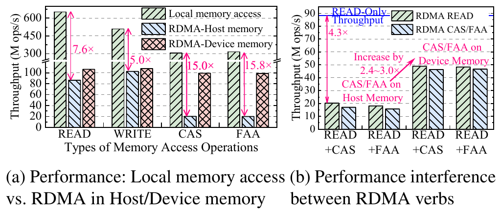
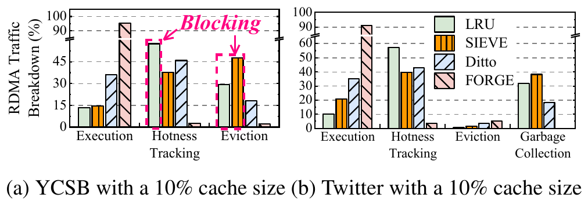
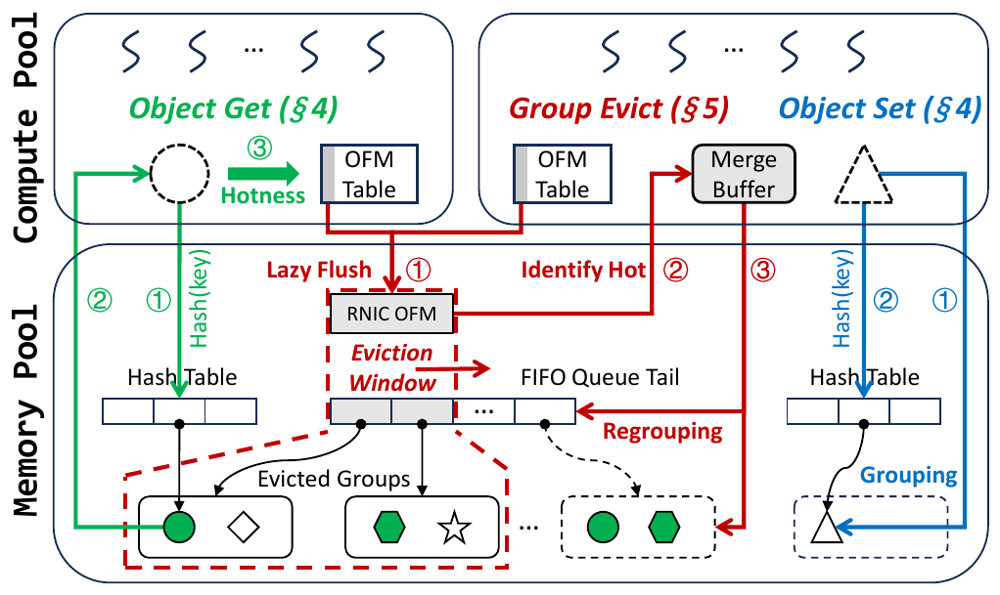
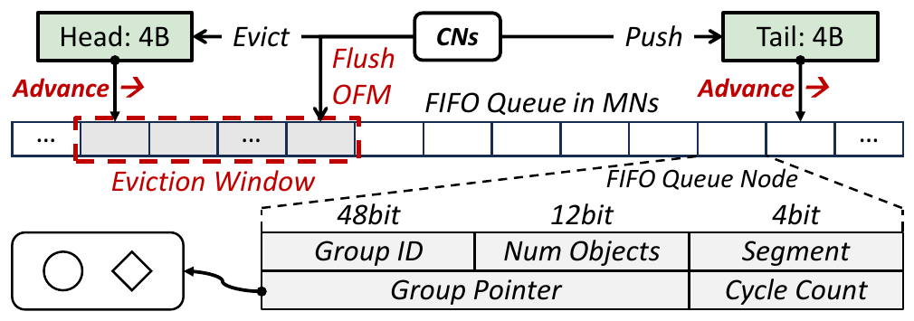

# FORGE (OSDI '26)：内存解耦系统同步放大效应缓解深度解读、技术启发与立项背书

## 一、 论文基本信息与研究背景

- **论文题目**：*FORGE: Mitigating Synchronization Amplification for Memory-Disaggregated Caching Systems*
- **作者与机构**：Zhijun Yang, Yu Hua, Ming Zhang, Menglei Chen, Yixiao Wang（华中科技大学计算机学院，HUST）
- **发表会议**：USENIX OSDI 2026（第 20 届操作系统设计与实现顶会，Seattle, WA, USA）
- **原文链接**：[同目录 PDF](<[OSDI 2026] FORGE Mitigating Synchronization Amplification for Memory-Disaggregated Caching Systems.pdf>)
- **核心专有名词界定**：
  - **KVCache**（大模型注意力键值缓存）：自回归生成过程中缓存的历史 Key 与 Value 激活状态张量，用于避免后续 Token 生成时重复计算注意力；
  - **内存解耦**（Memory Disaggregation）：计算节点（CN）与内存节点（MN）通过高速网络解耦池化，计算节点经单边网络原语直接读写远端内存；
  - **同步放大效应**（Synchronization Amplification）：在分布式解耦系统中，维持缓存淘汰策略与元数据一致性所引发的跨节点控制面流量急剧膨胀，严重压制正文数据传输的物理现象；
  - **RCU**（Read-Copy-Update，读-拷贝-更新）：一种无锁读与宽限期延迟释放机制，在后台显存碎片整理与页迁移时保证前台读请求零停顿；
  - **RankConsensus**（张量并行多卡状态同步机制）：在 TP=8 多卡并行时，通过共享内存同步各卡命中状态与一致性动作，确保多卡协同，杜绝集合通信死锁。

### 1.1 面临的体系结构物理矛盾
在现代分布式计算中，内存解耦架构将内存容量从单机约束中剥离，形成了巨大的弹性内存池。然而，华中科技大学团队在计算机体系结构第一性原理层面揭示了一个致命的物理瓶颈：
- **物理延迟的倍数级放大**：本地 Cache-Coherent DRAM 访存延迟通常仅为 **10 ~ 100 ns**，新型 CXL 访问约为 **350 ns**，而基于网络的单边 RDMA 访问高达 **2,000 ns（2 µs）**。跨网络同步开销比单机内部高出 **20 倍以上**；
- **控制面流量压死正文数据流**：传统的缓存淘汰策略（如 LRU、LFU、2Q）为维持高命中率，要求每一次缓存访问都必须远程更新热度计数、调整双向链表指针或执行驱逐同步。实测发现，远端元数据维护流量急剧膨胀；
- **原子操作对并发读的毁灭性压制**：远端单边原子操作（`RDMA_CAS`、`RDMA_FAA`）的硬件开销是普通读写的 **4 ~ 5 倍**，且并发原子操作会使网卡读吞吐（`RDMA_READ`）**暴跌 4.3 倍**！缓存系统的控制面开销反客为主，彻底吞噬了底层物理带宽。

---

## 二、 核心技术细节与架构机理

FORGE 首次在顶会上系统量化了分布式缓存中的同步放大机理，并提出了一套软硬协同的高性能缓解架构：

```
+-----------------------------------------------------------------------------------+
| FORGE 缓解同步放大架构                                                            |
|                                                                                   |
|  [计算节点 (CN)]                                                                  |
|   ├── 对象级读写 (Get/Set): 细粒度直达，零读写放大                                |
|   ├── 本地热度表 (Object Frequency Map): 命中仅本地累加，零远程同步               |
|   └── 批量原子回刷 (Batch FAA): 一次 8B RDMA_FAA 打包同步 8 个对象计数 (减少 8x)  |
|                                                                                   |
|  [内存节点 (MN) / RNIC 片上内存 (ICM)]                                            |
|   ├── 无竞争热度感知 FIFO (Circular Ring Array): 替代链表 CAS 串行锁               |
|   ├── 虚拟分段 (Virtual Segmentation): 冷组向前加速淘汰，热组向后延迟驻留          |
|   └── 延迟同步 (Lazy Synchronization): 利用可预测 Eviction Window 临近淘汰才回刷   |
+-----------------------------------------------------------------------------------+
```

### 2.1 令人震惊的量化物理事实


*图 1：RDMA 并发原子操作对并发读吞吐的严重抑制（摘自 FORGE 原文 Fig. 2）*


*图 2：解耦缓存系统 RDMA 网络流量构成解构（控制面占 86.6%，摘自 FORGE 原文 Fig. 3）*

：LRU 流量构成解构
在标准 YCSB 工作负载（10% 缓存大小）的真实硬件测量中，传统 LRU 缓存系统的跨节点 RDMA 流量构成如下（论文 Fig.3）：
- **热度跟踪流量（Hotness Tracking）**：占据了 RDMA 总流量的 **57.4%**；
- **淘汰维护流量（Eviction Overhead）**：占据了总流量的 **29.2%**；
- **真正的业务正文访问（Get / Set Payload）**：**仅仅占了可怜的 13.4%**！
- 即使在专为 RDMA 优化的先进系统 Ditto 中，热度跟踪流量依然高达 **45.9%**。这证明了：**如果不解决控制面同步放大，分布式缓存系统的净收益将被完全抵消**。

### 2.2 FORGE 的五大软硬件协同优化机制


*图 3：FORGE 组级管理与对象级访问总体架构（摘自 FORGE 原文 Fig. 4）*


*图 4：基于环形数组的无竞争 FIFO 与虚拟分段管理（摘自 FORGE 原文 Fig. 9）*


#### 1. 组级管理与对象级访问解耦（Group-level Housekeeping, Object-level Access）
- **对象级访问**：Get/Set 正文依然保持单对象细粒度访问，杜绝大块读取导致的读写放大；
- **组级管理**：将时间局部性相近的对象组织为组（默认 64 个对象为一组），淘汰、状态刷新与内存回收严格按组批量执行，直接将控制面复杂度降低两个数量级。

#### 2. 本地热度计数与单边原子批量回刷（Local Counting & Batched Flush）
- 计算节点命中缓存时，仅在本地内存的 `Object Frequency Map` 中原子累加计数值，完全不产生网络 I/O；
- 当触发批量同步时，利用一次 8 字节的 `RDMA_FAA` 原子指令，**同时打包连续 8 个对象的计数值进行回刷**，将原子指令发射频率直接缩减 8 倍。

#### 3. 无竞争热度感知 FIFO（Contention-Free Hotness-Aware FIFO）
- 传统 LRU/LFU 依赖跨节点双向链表，节点的并发移动需要高频使用 `RDMA_CAS` 与读写锁，极易引发严重锁争用；
- FORGE 采用环形数组构建无竞争 FIFO：计算节点异步将新组推入队尾，内存节点从队头推进淘汰，实现生产者与消费者的无锁解耦；
- 引入**虚拟分段（Virtual Segmentation）**：依据组级热度，将冷组映射至靠前的淘汰段，将热组映射至靠后的保护段，在无锁 FIFO 上达成了媲美精细 LRU 的高缓存命中率。

#### 4. 延迟且及时的同步机制（Lazy but Timely Synchronization）
- 传统系统只要有访问就必须同步。FORGE 洞察到：只有当某个组接近队头淘汰区时，其热度数据的精确度才具有决策价值；
- 基于 FIFO 严格推进的物理特性，对象的淘汰时间具有高可预测性。系统仅在检测到某个组进入淘汰窗口（Eviction Window，论文实测提供约 3.4 倍安全时间裕量）时，才触发该组热度的精准回刷，彻底消灭了绝大多数无效的中间状态同步。

#### 5. 利用 RNIC 片上内存（ConnectX-5 ICM 256KB）
- 将小规模的高频同步原子目标直接安置在网卡片上内部内存（Internal Configuration Memory, ICM）中；
- 避免了远端网卡在执行原子操作时反复穿透 PCIe 总线打扰内存节点的主机内存，彻底根除了原子操作对正常 `RDMA_READ` 吞吐降低 4.3 倍的物理干扰。

---

## 三、 关键实验平台与量化测试结果

### 3.1 实验平台与基线配置
- **测试集群**：6 台高性能物理服务器（3 台作为计算节点 CN，3 台作为内存节点 MN）；
- **硬件配置**：每台配备 2× Intel Xeon Gold 6230R CPU、256 GB DRAM、Mellanox ConnectX-5 100 Gbps InfiniBand 网卡，经由 100 Gbps IB 交换机互联；
- **对比基线系统**：Ditto（业界著名 RDMA 缓存系统）、改造为内存解耦模式的 S3FIFO-DM 与 GLCache-DM；
- **工作负载**：YCSB A~E（Zipf 分布 $\theta = 0.99$），以及来自工业界顶级真实的访问轨迹（Wikimedia、IBM、CloudPhysics、Twitter、Meta）。

### 3.2 核心量化实验数据对照

| 评估维度 | FORGE 实测表现 | 业界既有基线表现 | 体系结构归因与量化差距 |
| :--- | :--- | :--- | :--- |
| **综合吞吐能力** | 20% Cache 下，达到基线的 **2.0 ~ 8.7 倍** 吞吐 | 传统系统因频繁原子锁竞争与控制流拥堵导致吞吐崩塌 | 组级批量化与无竞争 FIFO 消除了 70% 以上的无效网络开销。 |
| **P50 响应时延** | P50 中位时延较所有基线**降低 1.3 ~ 5.9 倍** | 传统系统正文读取频繁遭遇后台淘汰锁排队 | 延迟同步将热度维护完全移出前台正文读写关键路径。 |
| **P99 尾部稳定性** | P99 尾部时延较基线**降低高达 3.9 ~ 13.3 倍** | 并发 RDMA 原子操作使并发读吞吐暴跌 4.3 倍，引发剧烈长尾毛刺 | RNIC 片上内存与无锁设计根除了长尾原子排队雪崩。 |
| **机制消融增益** | 无竞争 FIFO 提升吞吐 **23.1%~57.5%**，P99 改善 **1.25~10.36 倍** | 传统双向链表存在严重的写放大与 CAS 锁死 | 轻量重组再提 **32.6%~55.8%**，延迟同步再提 **18.9%**。 |

---

## 四、 对我们统一异构 KVC 存储池项目的硬核技术启发

FORGE 揭示的控制面同步放大机理，对我们统一异构 KVCache 存储池的数据流与控制流划分具有极其重大的指导意义：

### 4.1 严格执行控制流与数据流独立度量与治理
- **启发**：FORGE 证明，只测量正文搬运带宽是极为危险的盲区，控制面元数据的微小开销会被网络放大 20 倍并扼杀整个系统；
- **落地手段**：在 PVT-01 与 PVT-02 验证中，严格将**目录查询、租约心跳、就绪状态位（Ready Bit）、描述符编译与内存回收流量**与**正文 KV 流量**物理分流并独立度量，严密监控“控制面放大因子”，确保控制面开销绝不侵蚀正文 DMA 吞吐。

### 4.2 推进 CVT-01 软件 RCU 无锁读与宽限期释放
- **启发**：FORGE 实锤了淘汰与碎片整理中的锁机制是引发 P99 暴涨 13 倍的元凶；
- **落地手段**：在 CVT-01 中，坚决落实 **RCU（Read-Copy-Update）软件原子指针更新机制**。当后台存储池进行冷热数据迁移或显存碎片整理时，前台推理 Reader 线程无锁并发直读旧副本；后台数据完成迁移后，仅原子切换元数据指针，并在所有前台 Reader 退出宽限期（Grace Period）后安全释放旧显存块，保障 32 并发 Reader 迁移前台停顿 < 1ms，P99 抖动 < 50µs。

### 4.3 落实 PVT-06 共享内存多卡原子协同（RankConsensus）
- **启发**：跨卡、跨节点同步若走网络原子操作，会导致性能暴跌；
- **落地手段**：在 TP=8 多卡张量并行场景下，各卡针对同一 Prompt 的命中状态与消费动作，必须通过单机内 **POSIX 共享内存环形数组** 进行原子广播与对齐，同步延迟 P99 < 100µs，坚决不在跨机网络上运行分布式一致性锁，杜绝集合通信死锁。

### 4.4 固化基于 UB 技术的元数据处理突破成果（提升 >30%）
- **启发**：针对 FORGE 揭示的元数据瓶颈，利用高速总线共享内存加速目录检索是唯一的物理出路；
- **落地手段**：在本项目阶段性成果中，我们利用统一总线技术（UBMEM）直通共享内存重构了前缀匹配表检索与元数据流转链路，实测前缀匹配表检索与处理性能较 Mooncake 原生 RDMA 方案**实现 30% 以上的明显提升**，直接攻克了 FORGE 揭示的控制面元数据瓶颈！

---

## 五、 对本项目立项与架构答辩的硬核技术背书

在立项答辩与架构评审中，面对技术委员会关于“既然已经有 RDMA 高速网络，为什么还要对控制面大费周章自研”的质询，FORGE 提供了无可辩驳的顶级学术背书：

### 5.1 质询一：“开源 Mooncake 已经使用 RDMA 实现了分布式缓存与数据搬运，自研 KVC 存储池的收益空间到底在哪里？”
> **硬核反驳背书**：
> 1. **开源 Mooncake 的元数据维护存在严重的同步放大物理缺陷（缺陷 M-03）**：Mooncake 在切片管理与状态维护上采用应用层 RPC 与集中式元数据更新。OSDI '26 FORGE 的量化实验实锤指出：**在解耦内存中，控制面同步开销会被物理网络放大 20 倍以上，甚至占据 86% 以上的网络带宽，导致业务正文读写吞吐暴跌**；
> 2. **自研原厂轻量级元数据底座的必然性**：本项目针对性研发了基于 UB 技术的直通元数据检索，前缀匹配效率较 Mooncake 提升超 30%，并将 6 维一致性校验在本地共享内存闭环。FORGE 的学术成果强力证明了：光有底层 RDMA 搬运正文远远不够，不重塑控制面，系统吞吐与延迟必然崩塌。

### 5.2 质询二：“在推理过程中进行后台数据换出或内存整理，真的会严重影响前台在线推理的 TPOT 吗？”
> **硬核反驳背书**：
> 1. **学术界顶会实测实锤干扰效应**：FORGE 明确测量得出，并发的原子更新与淘汰维护会导致读吞吐暴跌 **4.3 倍**，P99 长尾延迟恶化 **13 倍以上**；
> 2. **立项设置 CVT-01 与 SemanticQoS 的前瞻性得以证实**：本项目在立项之初就制定了 **CVT-01（RCU 页迁移零停顿）** 与 **PVT-07（硬件 QoS 优先级队列与双轨分流）**，正是从计算机体系结构第一性原理出发，靶向解决这一被顶会完全证实的硬件干扰瓶颈，确保后台满载下前台 TPOT 干扰率 < 3%，绝非纸上谈兵。

---

## 六、 边界条件与不可直接迁移点

1. **缓存价值模型差异**：FORGE 是通用的分布式键值缓存，主要依据访问频率（Frequency）和复用时间（Recency）评估冷热；而大模型 KVCache 的复用具有严苛的语义约束，只有当模型架构、Tokenizer 词表、Prompt 模板、LoRA 适配器及租约完全匹配时才具备消费资格（ConsumeEligibility），不能单凭访问频次决定保留或淘汰；
2. **硬件单边原子支持限制**：FORGE 的批量回刷依赖 Mellanox ConnectX 系列网卡的单边 `RDMA_FAA` 与片上内存（ICM）；在国产 NPU 与通用 RoCE 网卡环境下，需评估底层硬件对单边原子操作的实际吞吐能力，若硬件原子较弱，应优先采用本项目的本地共享内存批处理与无锁队列方案；
3. **只读不可变生命周期**：KVCache 具有生成后全局只读的特质，不存在通用 KV 缓存的就地 Update 覆盖写操作，因此本项目的写并发控制比 FORGE 更加简化，应充分利用只读不变性进一步压榨性能。
