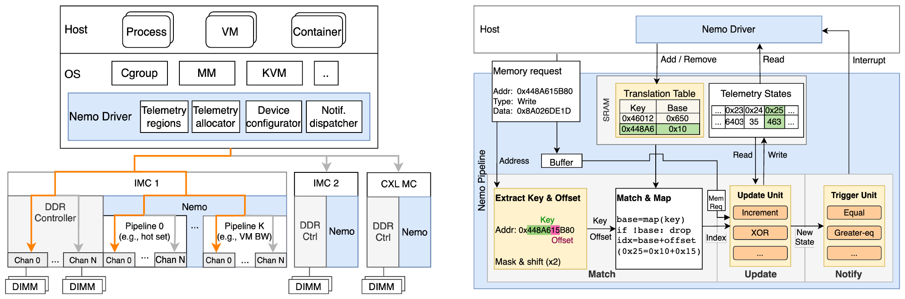
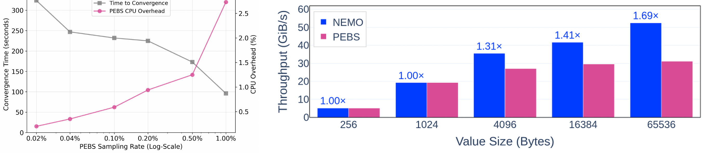

# Finding NEMO (OSDI '26)：分层异构内存微秒级高表现力可观测性深度解读、技术启发与立项背书

## 一、 论文基本信息与研究背景

- **论文题目**：*Finding NEMO: Nimble and Expressive Memory Observability*
- **作者与机构**：Shihang Li, Matthew Giordano（University of Washington，华盛顿大学）；Tushar Garg（Meta）；Rohan Kadekodi（UW）；Daniel S. Berger（UW & Microsoft Azure）；Baris Kasikci, Thomas Anderson, Simon Peter（UW）
- **发表会议**：USENIX OSDI 2026（第 20 届操作系统设计与实现顶会，Seattle, WA, USA）
- **原文链接**：[同目录 PDF](<[OSDI 2026] Finding NEMO Nimble and Expressive Memory Observability.pdf>)
- **核心专有名词界定**：
  - **分层异构内存**（Tiered Memory）：由不同物理特性的介质组成的多级存储系统（如 NPU HBM $\rightarrow$ Host DRAM $\rightarrow$ CXL 共享内存 $\rightarrow$ NVMe SSD）；
  - **TTFT**（Time To First Token，首字生成延迟 / 首 Token 响应时间）；
  - **可观测性赤字**（Observability Deficit）：系统无法在低开销下实时获取微秒级细粒度访存与链路状态，导致调度决策滞后并发生性能倒挂；
  - **QueryPlan**（查询与放置计划决策引擎）：在微秒级时间内根据链路状态、算力与上下文长度选择最优数据加载或重算路径；
  - **CostEvaluator**（成本预估模型）：在决策前量化预估各加载路径与重算开销的数学模型。

### 1.1 面临的体系结构物理矛盾
在大模型长上下文服务与现代云数据中心中，由 HBM、本地 DRAM、CXL 共享内存与 NVMe SSD 构成的多介质分层异构存储成为扩充容量的标配。分层存储调度系统的核心物理使命是：**在微秒级时间内精准判断哪些数据是极热的（应驻留或拉入高带宽快介质），哪些数据是偏冷的（应异步换出至大容量慢介质），以及某次远端拉取是否真正划算**。

然而，来自华盛顿大学、Meta 与微软 Azure 的联合研究团队指出，现代系统存在严重的“可观测性赤字（Observability Deficit）”：
1. **软件遥测方案两难（Software Telemetry: Flexible but Costly）**：操作系统页表 Access Bit 扫描、段采样或 CPU PEBS 性能计数器，不仅产生高达 **10% ~ 20% 的 CPU 纯算力开销**，而且反应周期在数百毫秒至秒级，面对大模型动态生成的瞬时突发流量严重滞后；
2. **硬件遥测方案僵化（Hardware Offloads: Efficient but Rigid）**：传统硬件计数器（如内存控制器 Counters）虽然零 CPU 开销，但粒度极其粗糙（仅能汇报通道总体带宽），无法分辨具体租户、特定请求或关键 Prompt 前缀对象；
3. **调度失误引发严重性能倒挂**：缺乏实时的微秒级遥测，分层调度器只能依据静态启发式进行“盲目调度”，**导致数据放置频繁失误，在生产系统上引发高达 23% 的时延恶化与 1.7 倍的吞吐暴跌**！

---

## 二、 核心技术细节与架构机理


*图 1：NEMO 硬件遥测流水线架构与控制面交互（摘自 Finding NEMO 原文 Fig. 1 & 2）*


Finding NEMO 提出了软硬件协同的轻量级高表现力内存遥测系统，由硬件流式遥测流水线与内核控制面驱动深度协同构成：

```
+-----------------------------------------------------------------------------------+
| Finding NEMO 软硬件协同遥测架构                                                    |
|                                                                                   |
|  [硬件数据面: NEMO Telemetry Pipeline (CXL / 内存控制器)]                         |
|     ├── 全覆盖无采样: 流式捕获每一个内存事务 (零 CPU 周期消耗)                    |
|     ├── 表现力转换 (Expression Engine): 映射租户 ID、热度分位与偏斜度 (Skewness)    |
|     └── 亚微秒级状态聚合 (Sub-microsecond State): 维护微秒级精确流量与热度图谱     |
|                                                                                   |
|  [软件控制面: 动态分层决策引擎 (如 QueryPlan)]                                    |
|     ├── 实时读取 NEMO 遥测快照 (零开销获取网络与内存真实可用带宽)                 |
|     └── 动态代价决策: 消除盲目拉取，消除 23% 的时延负收益反噬 (吞吐提升 1.7x)     |
+-----------------------------------------------------------------------------------+
```

### 2.1 NEMO 硬件流式遥测流水线（Telemetry Pipeline）
- NEMO 利用硬件（基于 FPGA 或专用 ASIC 控制器）直接串接在内存总线与 CXL 接口上，以全线速监听每一个内存读写事务；
- **全覆盖与零开销**：摆脱了传统的“周期性随机采样”，实现 100% 访问全覆盖，且完全不占用任何 Host CPU 周期与总线带宽；
- **表现力原语（Expressive Primitives）**：硬件内部内嵌微型可编程状态转换表，能够按页表前缀、租户标签、数据类型进行实时归类与直方图统计。

### 2.2 关键遥测指标流式生成
NEMO 在亚微秒级时间内持续输出三类对调度具有决定性价值的动态度量：
1. **精准热度分布（Hotness Distribution）**：统计各物理块在最近滑动窗口内的命中频次，精确识别真正的高频热块；
2. **偏斜度跟踪（Skewness Tracking）**：实时计算请求集中度，识别当前是否发生长尾倾斜或热点踩踏；
3. **链路与介质实时有效带宽（Sustained Bandwidth）**：实时汇报当前内存通道与互连总线的饱和度与排队时延，直接告警潜在的拥塞事件。

---

## 三、 关键实验平台与量化测试结果


*图 2：精准遥测在 FASTER KV / FlexKVS 上带来的显著加速（摘自 Finding NEMO 原文 Fig. 4 & 5）*


### 3.1 实验平台与基线配置
- **测试硬件**：基于 PCIe 5.0 x16、具备 CXL 2.0 Type-3 支持的高性能硬件平台与全功能原型系统；
- **基线对比**：
  - 传统基于 Linux 内核页扫描（Kernel Page Scanning）与 PEBS 的软件遥测系统；
  - 仅具备通道级统计的粗粒度硬件计数器系统；
  - 无遥测的静态启发式分层调度系统。
- **评测系统与应用**：工业级键值存储系统（FlexKVS、Microsoft FASTER KV）与高性能多租户内存数据库（Silo）。

### 3.2 核心量化实验数据对照

| 评估维度 | NEMO 实测表现 | 业界既有基线表现 | 体系结构归因与量化差距 |
| :--- | :--- | :--- | :--- |
| **端到端服务吞吐** | FlexKVS 等系统吞吐**提升最高达 1.7 倍** | 传统启发式调度因错误放置导致数据频繁越级颠簸 | 亚微秒级精准遥测保障了热数据 100% 命中在最快介质。 |
| **端到端访问时延** | 平均服务时延**降低高达 23%** | 静态策略盲目拉取慢介质数据，导致时延急剧恶化 | 实时感知链路排队，消除了拥塞链路上的盲目等待。 |
| **CPU 监控开销** | **0% Host CPU 算力消耗** | 软件采样方案消耗 **10% ~ 20%** 的宝贵 CPU 算力 | 硬件流式流水线完全将可观测性卸载至总线控制器。 |
| **遥测反应敏捷度** | **亚微秒级（< 1 µs）** 瞬时输出最新热度与偏斜快照 | 传统软件页表扫描存在 **数百毫秒至数秒** 的严重滞后 | 硬件全线速流水线消除了周期采样的滞后盲区。 |

---

## 四、 对我们统一异构 KVC 存储池项目的硬核技术启发

Finding NEMO (OSDI '26) 揭示的可观测性赤字与实测数据，深刻证明了我们自研微秒级动态选路引擎的科学性与紧迫性：

### 4.1 坚定落实 PVT-04 QueryPlan 微秒级动态选路引擎与 CostEvaluator 代价模型
- **启发**：NEMO 实锤指出，缺乏实时运行时观测、静态盲目调度会导致高达 23% 的时延恶化。在大模型推理中，盲目跨节点拉取 KVCache 极易发生“拉取比重算更慢”的负收益反噬；
- **落地手段**：在 PVT-04 中，将运行时动态遥测作为选路引擎的核心输入：
  1. **实时采集有效带宽与算力**：QueryPlan 实时感知当前网络有效带宽 $B$、介质排队延迟 $t_0$ 以及 NPU 本地重算吞吐 $r$；
  2. **严守动态收益判定铁律**：计算盈亏平衡点 $P_{\min} = t_0 / (1/r - k/B)$。当检测到网络拥塞（$B \le 1.6\text{GB/s}$）或前缀较短时，**微秒级果断拦截拉取请求，强制回退至本地直接重算**，确定性锁定计算延迟，彻底平抑 TTFT 尾部抖动。

### 4.2 支撑 PVT-05 分层存储冷热沉淀治理
- **启发**：分层存储（Tiering）的换出决策必须基于客观的滑动窗口热度，严禁无脑全量换出；
- **落地手段**：在 PVT-05 中，借鉴 NEMO 的偏斜度与热度流式跟踪思想，在内存池内部维护轻量级活跃度位图。仅将确认进入生命周期末期、长期无访问的冷 KV 块异步沉淀至 NVMe SSD，避免频繁换出热点前缀引发二次召回颠簸。

---

## 五、 对本项目立项与架构答辩的硬核技术背书

在立项答辩与架构评审中，面对评委关于“既然缓存命中了，为什么不无脑直接拉取，何必自研一套复杂的微秒级选路算法”的尖锐质疑，Finding NEMO 提供了决定性的理论与数据反驳依据：

### 5.1 质询一：“开源 Mooncake 只要检测到前缀匹配就直接拉取，逻辑非常简单高效，你们搞微秒级选路和代价模型是不是画蛇添足？”
> **硬核反驳背书**：
> 1. **开源 Mooncake 的静态贪婪调度存在致命的‘时延负收益反噬’物理缺陷（缺陷 M-04）**：Mooncake 忽视了底层网络动态拥塞与实际传输耗时，在短前缀或多任务网络拥塞时，拉取 KV 耗时往往高达数百毫秒，而本地重算仅需几十毫秒。静态盲目拉取导致端到端 TTFT 发生灾难性暴跌与剧烈抖动；
> 2. **顶会权威实测实锤静态调度的危害**：OSDI '26 Finding NEMO（UW、Meta、微软联合发布）用生产数据证实：**缺乏运行时状态感知与动态决策，必然引发 23% 的时延恶化与 1.7 倍的吞吐损失**！本项目立项研发 **QueryPlan 微秒级选路引擎（PVT-04）**，以严格的数学模型保障“拉取与加载总开销 < 本地直接重算耗时”，是消除长尾抖动、保障 SLA 达标率的唯一科学路径。

### 5.2 质询二：“为什么不能由上层推理引擎（如 vLLM）通过简单规则来做拉取还是重算的判断？”
> **硬核反驳背书**：
> 1. **上层引擎处于体系结构底层的‘感知盲区’**：vLLM 等上层软件完全无法感知底层网卡真实物理带宽、交换机 PFC 流控、队列排队深度以及分层介质的真实 I/O 延迟；
> 2. **原厂软硬件协同中间件的不可替代性**：只有原厂自研底座才能通过底层驱动（CapabilityMatrix）实时采集硬件遥测参数，并在亚微秒级完成微积分代价对账。脱离原厂硬件探针的上层软件，注定无法做出最优选路。

---

## 六、 边界条件与不可直接迁移点

1. **硬件定制化依赖**：Finding NEMO 依赖定制的 FPGA / ASIC 流水线以实现内存总线事务全捕获；在国产 AI 服务器现有硬件环境下，尚不具备全硬件流式内存探针，需依托网卡驱动微基准探针（CapabilityMatrix）与轻量级软件遥测协程进行等价平替标定；
2. **KVCache 请求粒度差异**：NEMO 针对的是微观的 4KB 内存页访问；而在大模型推理场景中，KVCache 的调度单位通常是数百 KB 乃至数 MB 的语义连续块（Block），调度器决策频率（请求级 / Chunk 级）低于硬件逐指令周期，因此对遥测的更新频率要求更为宽松，但对语义正确性的要求更高；
3. **冷热衰减周期**：通用数据库的内存热度衰减符合传统 Zipf 分布；大模型 KVCache 的热度具有强烈的任务时效性（如 System Prompt 长热，多轮对话上下文随时间衰减），必须结合大模型会话生命周期调整滑动窗口。
