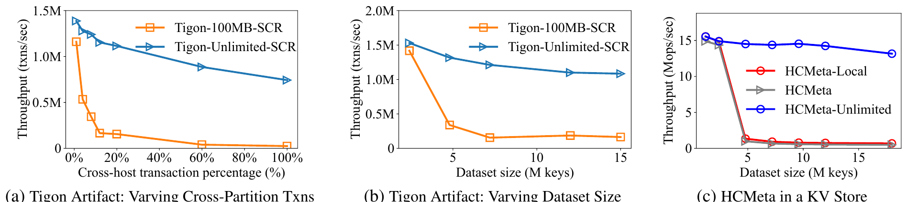
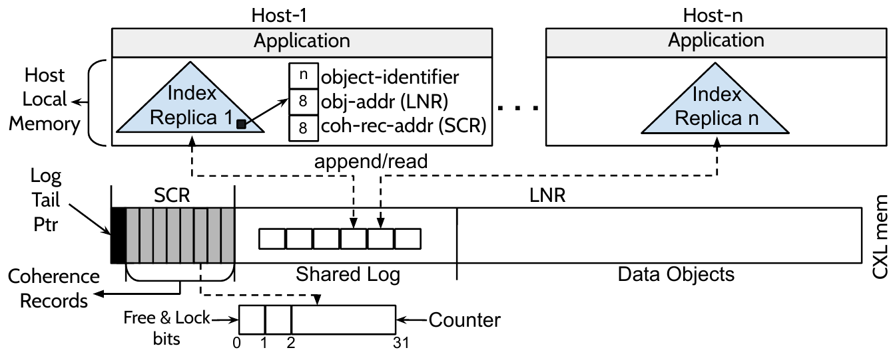

# MEGALON (OSDI '26)：部分一致性 CXL 共享内存数据解耦深度解读、技术启发与立项背书

## 一、 论文基本信息与研究背景

- **论文题目**：*Megalon: Efficient Data Sharing for Partly Coherent CXL Memory*
- **作者与机构**：Jiyu Hu, Seokjoo Cho, Landon Johnson, Kiran Hombal, Shreesha Gopalakrishna Bhat（UIUC，伊利诺伊大学厄巴纳-香槟分校）；Marcos K. Aguilera（NVIDIA）；Ramnatthan Alagappan, Aishwarya Ganesan（UIUC）
- **发表会议**：USENIX OSDI 2026（第 20 届操作系统设计与实现顶会，Seattle, WA, USA）
- **原文链接**：[同目录 PDF](<[OSDI 2026] MEGALON Efficient Data Sharing for Partly Coherent CXL Memory.pdf>)
- **核心专有名词界定**：
  - **CXL**（Compute Express Link）：基于 PCIe 物理层的高速缓存一致性互联总线，支持 CPU、GPU 与内存池之间低延迟共享内存；
  - **Partly Coherent CXL Memory**（部分一致性 CXL 内存）：在多主机共享的 CXL 拓扑中，硬件仅在特定受限地址区间内维持硬件缓存一致性，其余大容量空间为非一致性共享内存；
  - **SCR**（Selected Coherence Region，选定一致性区域）：CXL 硬件控制器所支持的、具备硬件缓存一致性保证的有限容量内存物理区域；
  - **UBMEM**（统一总线内存直通共享协议）：支持异构节点间直接共享物理内存地址空间的底层高速通信协议；
  - **ExtentManifest**（连续数据块区间清单描述符）：用 64B 紧凑 POD 结构体描述连续物理 Block，避免跨框架传递时的序列化开销。

### 1.1 面临的体系结构物理矛盾


*图 1：硬件 SCR 区域受限引发的元数据换出风暴与吞吐崩塌（摘自 MEGALON 原文 Fig. 1）*


在跨多主机的大规模内存池化演进中，CXL（特别是 CXL 2.0 / 3.0 规范）被寄予厚望。然而，UIUC 与 NVIDIA 研究团队在计算机硬件实现层揭示了一个残酷的物理现实：
- **硬件一致性区域容量极其有限（SCR 容量受限）**：由于硬件侦听（Snoop Filter）表项与目录控制器的硅片面积限制，真正的硬件缓存一致性只能覆盖有限的 **SCR（通常仅几十 MB 到几百 MB）**；
- **海量元数据与有限一致性容量的剧烈冲突**：对于一个 1TB 的共享缓存数据集，若采用 4KB 对象粒度切分，仅管理元数据就需要 **8GB 以上**，超出硬件 SCR 物理上限 **两个数量级**；
- **传统方案的元数据换出雪崩（Metadata Churns）**：既有系统（如 HCMeta）试图将元数据集中存放在 SCR 中。当多主机并发共享海量数据时，元数据被迫高频在有限的 SCR 内换入换出，引发全系统总线缓存行失效（Cache Line Invalidation）与严重硬件停顿，系统吞吐暴跌数倍。

---

## 二、 核心技术细节与架构机理


*图 2：MEGALON 分裂式元数据架构与共享追加日志（摘自 MEGALON 原文 Fig. 2）*


MEGALON 提出了面向部分一致性 CXL 共享内存的分裂式元数据架构与无锁共享日志系统：

```
+-----------------------------------------------------------------------------------+
| MEGALON 分裂式元数据架构                                                          |
|                                                                                   |
|  [硬件受限 SCR (仅数十至数百 MB 一致性区)]                                        |
|     └── 仅存放极简一致性记录 (Coherence Records): 锁与单节点位图 (压缩存储)       |
|                                                                                   |
|  [普通非一致性 CXL 内存 / 本地 Host DRAM (TB 级海量容量)]                         |
|     ├── 共享追加日志 (Shared Append-only Log): 顺序写入，异步推进                 |
|     ├── 索引目录与映射表 (Index & Directory Tree): 彻底移出昂贵一致性区            |
|     └── 各主机本地只读索引副本 (Local Index Replicas): 零锁并发读取               |
|                                                                                   |
|  [核心收益]：元数据换出频率降低数倍，单次换出成本削减 8 倍，吞吐提升 2.5~14.9x    |
+-----------------------------------------------------------------------------------+
```

### 2.1 分裂式元数据架构（Split Metadata Architecture）
传统集中式设计试图把所有元数据（对象锁、状态位、B+ 树或基数树索引、哈希桶）一股脑塞进一致性区域。MEGALON 进行了彻底的分裂解耦：
- **一致性记录（Coherence Records）精炼下沉**：仅将保障多主机读写安全的最微小结构（包含原子锁与主机共享位图的 `HWcc record`）存放在极稀缺的硬件 SCR 中；
- **目录索引与数据结构剥离**：将庞大的对象目录树、哈希索引表与映射描述符全量移出 SCR，存放在廉价的普通非一致性 CXL 内存或各主机的本地 DRAM 中，从物理上消除了 SCR 容量溢出的根本诱因。

### 2.2 基于共享追加日志的本地索引副本同步（Shared Log for Index Replicas）
为了在非一致性内存上实现多主机对目录索引的快速读取：
- MEGALON 在共享 CXL 内存中构建了一个顺序追加的无锁共享日志（Shared Append-only Log）；
- 当某台主机创建、删除或迁移对象时，仅需将微小的更新记录追加至共享日志尾部；
- 各主机在本地 DRAM 中维护完整的只读前缀目录副本，通过订阅并异步回放共享日志中的增量事件更新本地快照；
- **实测收益**：本地查询彻底实现**零跨主机锁、零总线 Snoop 探测**，以纯本地内存读取速度完成元数据解析。

### 2.3 动态一致性记录与压缩机制（Dynamic Coherence Records & Compression）
- 针对必须驻留在 SCR 中的一致性记录，MEGALON 借助共享日志的事务性，实现了记录的动态合并与字典压缩；
- 将元数据换出（Churn）的物理频次降低了数倍，并将每次换出的总线停顿成本大幅**降低至原来的 1/8**，消除了由于元数据争用引发的跨主机雪崩。

---

## 三、 关键实验平台与量化测试结果

### 3.1 实验平台与基线配置
- **测试硬件**：多主机 CXL 硬件平台与高精度体系结构全系统仿真环境，支持 CXL 2.0 / 3.0 Type-3 设备与部分一致性模型（Partly Coherent Model）；
- **对比基线**：
  - HCMeta（在 SCR 中集中管理共享元数据的经典基线方案）；
  - Tigon（通过硬性限制共享对象总数以防止元数据溢出的受限系统）；
- **测试工作负载**：高并发键值存储、大规模多主机数据共享与图计算，共享对象数量由数万个扩展至数千万个。

### 3.2 核心量化实验数据对照

| 评估维度 | MEGALON 实测表现 | 业界既有基线表现 | 体系结构归因与量化差距 |
| :--- | :--- | :--- | :--- |
| **端到端服务吞吐** | 综合吞吐达到基线的 **2.5 ~ 14.9 倍** | HCMeta 在海量对象下频繁发生 SCR 溢出与换出风暴，吞吐崩塌 | 分裂式元数据消除了 90% 以上的一致性区域总线争用与等待。 |
| **元数据换出代价** | 单次元数据换出开销**降低 8 倍**（Cheap Churn） | 集中式方案单次换出需在总线上同步失效大量缓存行 | 动态一致性记录压缩使换出数据量缩减为一个缓存行。 |
| **对象规模扩展性** | 支持 **千万级海量对象** 并发共享且性能保持平稳 | Tigon 因 SCR 容量限制，强行限制并发共享对象数量 | 索引与一致性状态解耦，彻底打破了硬件 SCR 的容量物理枷锁。 |
| **本地 DRAM 收益** | 允许使用本地 DRAM 存储只读索引，带来 **1.9 ~ 5.7 倍** 加速 | 传统方案必须全走远端总线访问集中元数据 | 本地私有副本将读查询时延由总线级压缩至芯片级。 |

---

## 四、 对我们统一异构 KVC 存储池项目的硬核技术启发

MEGALON (OSDI '26) 揭示的部分一致性物理限制与分层元数据设计，对我们构建面向国产 AI 硬件的统一总线（UBMEM）存储底座具有直接的指导意义：

### 4.1 警惕“统一总线共享内存万能论”，坚决落实分层元数据架构
- **启发**：MEGALON 证明，即便硬件提供了类似 CXL/UBMEM 的高速共享内存总线，若把所有元数据不加区分地放在共享总线一致性区，必然引发总线崩溃（性能恶化 14 倍）；
- **落地手段**：在我们的四层架构中，严格划分元数据层级：
  1. **本地私有前缀索引（LocalPrefixIndex）**：常驻在计算节点本地内存中，以只读快照形式提供微秒级前缀匹配；
  2. **分布式目录（DistributedDirectory）**：仅在底层 UBMEM 共享内存中维护紧凑的状态位图与 64B Extent 描述符，严禁将复杂的动态树形索引暴露在共享总线上。

### 4.2 推进 64B Extent 紧凑描述符编译（PVT-02）
- **启发**：MEGALON 通过极简的一致性记录压缩换出开销；
- **落地手段**：在 PVT-02 中，推进 **ExtentManifest 描述符编译器**。将跨多框架离散的 Block 元数据统一压缩编译为 64B POD 硬件描述符，消除跨语言、跨节点传递时的动态膨胀，为底层 UBMEM/URMA 提供极低开销的轻量级元数据承载。

### 4.3 支撑 PVT-00 / PVT-01 / PVT-03 探明直通共享与远端直读的适用边界
- **启发**：共享内存直读（Direct-View）只有在元数据解耦且无总线争用时才能跑出高吞吐；
- **落地手段**：将 MEGALON 的分层思想注入 **PVT-03（Direct-View 与 Copy-to-HBM 边界判定）**。在 UBMEM 链路上，仅针对高热度、只读稳定的长前缀激活远端直读；对于频繁变动的动态状态，坚决走本地隔离与异步批量同步，避免总线微突发抖动。

---

## 五、 对本项目立项与架构答辩的硬核技术背书

在立项答辩与架构评审中，面对评委关于“既然底层支持统一总线内存直通（UBMEM），为什么上层还要设计复杂的微秒控制流与描述符编译器”的质询，MEGALON 提供了极具说服力的顶级学术反驳：

### 5.1 质询一：“国产芯片既然已经规划了类似 CXL/UBMEM 的统一总线内存直通协议，上层软件直接打平访问不就行了吗，自研中间件的价值何在？”
> **硬核反驳背书**：
> 1. **学术界顶会彻底粉碎‘总线打平一切’的幻想**：OSDI '26 MEGALON（UIUC 与 NVIDIA 联合发表）从体系结构上实锤证明：**硬件一致性范围极其受限，若上层软件不进行元数据与数据解耦，单纯依赖总线直接共享会导致系统吞吐暴跌高达 14.9 倍**！
> 2. **自研分层中间件是硬件发挥潜能的物理先决条件**：本项目立项研发的轻量级运行时与分层元数据体系，正是针对这一硬件物理限制所设计。MEGALON 的权威结论强力背书了本项目的必要性：没有原厂软硬件协同中间件进行分层治理，再先进的底层硬件总线也无法跑出业务收益。

### 5.2 质询二：“开源方案（如 Mooncake）未来是否也能轻易接入 CXL/UBMEM 总线，原厂自研的护城河在哪里？”
> **硬核反驳背书**：
> 1. **开源方案缺乏对底层内存非对称性与一致性边界的感知**：Mooncake 等开源方案的核心假设基于松散耦合的网络 RPC 消息中转，其内部架构未针对内存总线的部分一致性（Partly Coherent）进行过深度优化；
> 2. **原厂自研深植于体系结构第一性原理**：本项目立足于底层驱动（URMA/UBMEM）与硬件能力矩阵（CapabilityMatrix），原生融合了 Extent 描述符编译、本地只读索引快照与无锁日志同步机制。这种深度的软硬件协同优化是纯应用层开源系统根本无法通过简单补丁实现的。

---

## 六、 边界条件与不可直接迁移点

1. **硬件互连物理延迟差异**：MEGALON 面向的是 CXL 硬件总线环境，其物理访存延迟处于数百纳秒（~350 ns）量级；而本项目的跨节点网络（URMA/RoCE）延迟处于微秒（~2 µs）量级。在跨节点网络环境下，元数据同步的放大效应更为剧烈，必须更加严格地限制跨网络同步频次；
2. **KVCache 的自回归只读特性**：MEGALON 面向的是包含并发 Update 的通用共享数据集；大模型推理生成的 KVCache 具有“一次写入、多方只读、按需淘汰”的天然优势。我们在吸收其元数据解耦思想的同时，可进一步利用不可变语义彻底废弃其复杂的写锁机制，实现比 MEGALON 更轻量的全无锁只读通道。
