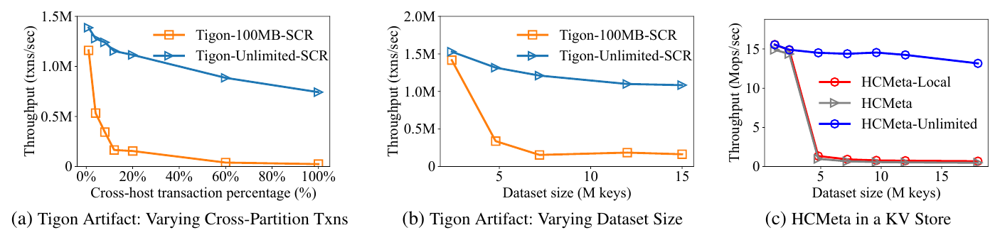
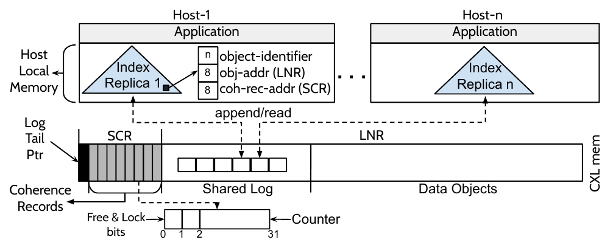
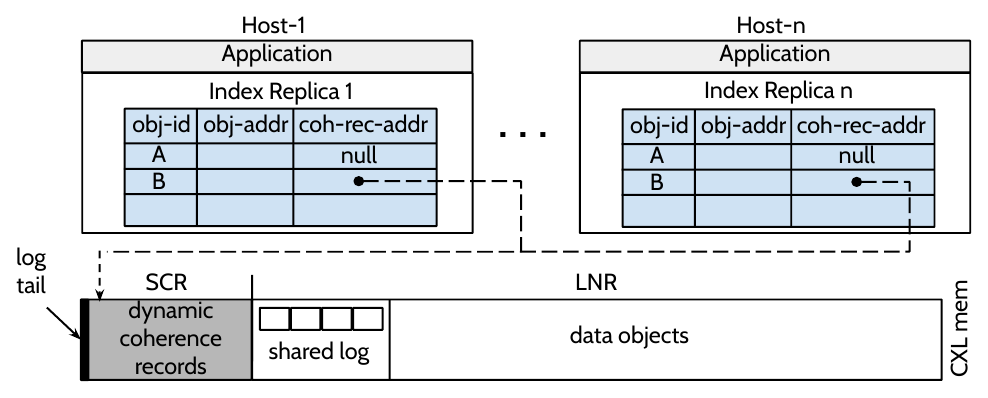
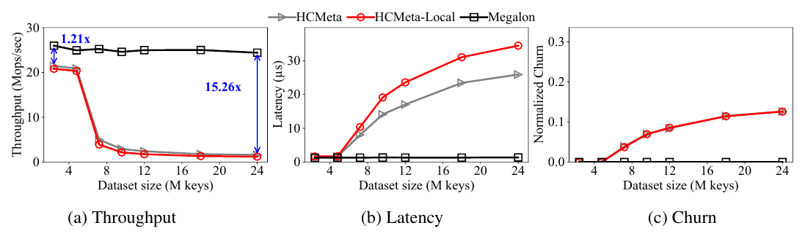
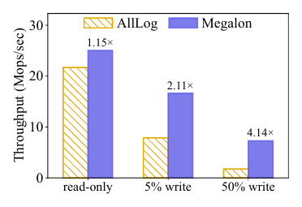
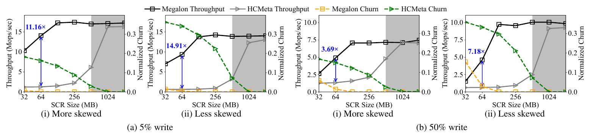
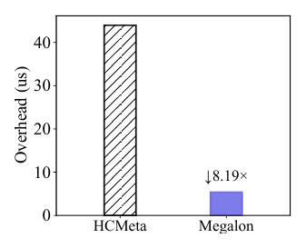
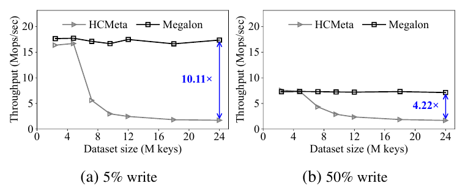
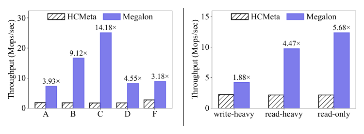
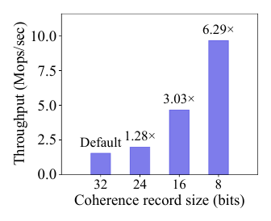

# MEGALON：面向部分一致 CXL 内存的高效数据共享——论文解构与项目启示

> 论文：*MEGALON: Efficient Data Sharing for Partly Coherent CXL Memory*  
> 会议：20th USENIX Symposium on Operating Systems Design and Implementation（OSDI 2026）  
> 作者：Jiyu Hu、Seokjoo Cho、Landon Johnson、Kiran Hombal、Shreesha G. Bhat、Marcos K. Aguilera、Ramnatthan Alagappan、Aishwarya Ganesan  
> 分析范围：以本地 19 页原论文 PDF 为唯一论文事实来源；项目映射依据当前统一异构 KVCache 存储与调度底座的受控需求语境。未读取或复用同目录下任何既有 MEGALON 解构报告。  
> 图像规则：文中架构图和性能图均由原 PDF 页面重新渲染、宽边界截取、外部留白收紧并完成边缘检查；图内不保留论文原始图注，图号和页码在图外说明。

## 证据标记约定

- **论文事实**：论文明确描述的设计、实现或实验设置。
- **实测数据**：论文在其评测平台上给出的测量结果。
- **作者主张**：作者对结果的解释，尚不等于独立复现结论。
- **分析判断**：根据论文机制和实验边界作出的技术判断。
- **项目解释 / 项目建议**：面向当前项目的迁移判断，不属于论文结论。
- **开放问题**：论文没有给出足够信息或证据，仍需源码检查或独立实验。

---

# 1. 一页读懂论文

## 1.1 论文解决什么问题？

MEGALON 处理的是部分一致 CXL（Compute Express Link，通用计算互联总线，用于 CPU、加速器和内存设备之间的低时延内存语义互联）内存中的大规模共享问题：几 TB 的 CXL 内存里，预计只有几百 MB 能获得硬件缓存一致性。已有 HCMeta 方案把对象索引和逐对象一致性记录都放进这块小型一致区；数据集变大后，元数据放不下，系统只好反复取消共享、重新共享和搬运对象，吞吐随之下降。

论文关注的是数据库行、键值对象和文件页这类 1 KB～4 KB 粗粒度对象，不是缓存行级一致性，也不是大模型推理数据面。

## 1.2 根因是什么？

可见症状是换入换出频繁、吞吐下降和时延上升。根因在元数据布局；现有证据没有指向 CXL 带宽本身：

- 对象索引包含键和地址，体积大，但更新频率低；
- 一致性记录只有锁位、空闲位和计数器，体积小，却在每次写入时更新；
- HCMeta 把两类状态都放入稀缺的硬件一致区（Small Coherent Region，SCR），让索引键长度和对象总数直接消耗 SCR；
- 工作负载即使任一时刻只访问少量共享对象，整个运行期间触达的对象集合仍可能很大，因此 SCR 会反复淘汰旧元数据。

论文给出的量级例子是：1 TB 数据集、4 KB 对象、24 字节键和 8 字节一致性记录时，元数据至少需要 8 GB，约比预期 SCR 容量高两个数量级。

## 1.3 核心洞察是什么？

元数据不应按“是否属于共享控制状态”统一放置，而应按体积和更新频率拆分：把大而低频更新的索引复制到各主机本地 DRAM，把小而高频更新的一致性记录留在 SCR；再用一个 CXL 共享日志为索引更新建立全序，并在一致性记录分配状态变化时补齐缓存失效动作。

这个洞察成立依赖三个条件：索引更新明显少于对象读写；只读共享对象不需要逐对象一致性记录；日志尾指针能由硬件一致区可靠排序，而日志正文可以通过绕过或刷新 CPU 缓存安全地放在非一致区。

## 1.4 核心抽象是什么？

MEGALON 的核心抽象是“拆分元数据平面”：

1. 每台主机在本地 DRAM 持有一份索引副本，记录对象标识符、对象在大容量非一致区（Large Non-coherent Region，LNR）中的地址，以及可选的一致性记录地址；
2. SCR 只保存高频变化的一致性记录和共享日志的头尾指针；
3. LNR 保存数据对象和日志条目；
4. 所有索引修改都通过共享日志排序。读路径先追平日志，再读本地索引；对象在“只读共享”和“读写共享”之间切换时，日志事件同时承担缓存失效通知。

MEGALON 没有提出新的 CXL 硬件协议。它定义了一套建立在“少量硬件一致内存 + 大量非一致内存”之上的软件共享语义。

## 1.5 关键优化方法速览

### 方法 1：按更新频率拆分元数据：本地索引副本 + SCR 一致性记录

- **问题**：索引键、对象地址和一致性记录全部占用 SCR，数据集和键长度一增大就触发元数据换入换出。
- **方法**：把大而低频更新的索引复制到每台主机的本地 DRAM，仅把小而高频更新的一致性记录放在 SCR。
- **效果**：SCR 占用从“键 + 地址 + 一致性状态”缩小为逐对象一致性记录；索引查找改为本地内存访问，避免共享索引争用。
- **关键证据**：在 100 MB SCR、40 字节键、4 字节一致性记录的例子中，拆分方案可覆盖约 2500 万对象，HCMeta 只能覆盖约 190 万对象；Figure 13 的 AllLog 消融说明把高频状态也复制并写日志，会在 50% 写负载下损失 4.14× 吞吐。

### 方法 2：SCR 日志尾排序 + LNR 日志回放的索引副本同步

- **问题**：索引离开 SCR 后，每台主机的本地副本可能看到不同的对象地址或一致性记录指针；用消息共识同步会把跨主机协调放进更新路径。
- **方法**：用 SCR 中的日志尾指针通过 CAS 为更新排序，把日志条目放在 LNR；主机读索引前检查日志尾，并重放尚未应用的条目。
- **效果**：索引更新获得统一顺序，读路径可使用本地副本；日志正文不占用 SCR，更新者也不必同步等待所有主机确认。
- **关键证据**：论文给出实现路径和 Node Replication 改造，但没有单独报告“日志同步相对消息共识”的延时消融，因此其一致性收益主要由设计论证和组合实验支持。

### 方法 3：按读写状态动态分配一致性记录 + 日志辅助双路径一致性

- **问题**：即使索引移出 SCR，若每个对象仍永久占用一条一致性记录，读写对象数最终仍受 SCR 容量限制。
- **方法**：只为读写共享对象分配一致性记录；只读共享对象不分配记录。分配、释放、创建和删除事件写入共享日志，读路径通过“记录计数器检查 + 日志状态变化检查”两条路径识别并发写和缓存陈旧。
- **效果**：只读对象数量不再受 SCR 限制，读写对象的换入换出频率降低；发生换入换出时，只更新记录指针和日志，不必取消对象共享并同步联系所有者。
- **关键证据**：Figure 7 显示 MEGALON 在 SCR 缩至 128 MB 前基本不发生换入换出，并在 64 MB 下仍明显快于 HCMeta；Figure 8 测得单次换入换出开销降低 8.19×。

## 1.6 最重要的实验结果是什么？

1. **问题确实来自 SCR 元数据容量，而不是数据搬运本身。** Figure 1(c) 中，即使 HCMeta 把数据一直留在 CXL、换入换出只移动元数据，数据集变大后吞吐仍接近崩溃；无限 SCR 版本没有这一现象。
2. **拆分设计延后了容量拐点。** 24M 对象的只读负载中，MEGALON 相对 HCMeta 达到 15.26× 吞吐；5% 和 50% 写比例下分别达到 10.11× 和 4.22×。
3. **核心设计不变量得到消融支持。** Figure 13 中，若把锁和计数器也改成日志复制，50% 写负载下 MEGALON 比 AllLog 快 4.14×，说明高频一致性状态应留在 SCR，而不是全部走副本日志。
4. **收益有明确边界。** 高写比例、低访问偏斜和很小 SCR 会让 MEGALON 自身也产生换入换出；8 位一致性记录在论文最差场景中达到最高吞吐，但小于 8 位后，计数器回绕事件变多，性能反而下降。

## 1.7 最大局限是什么？

- 评测平台不含商用 CXL 3.0 多主机共享硬件。作者在四路 NUMA 服务器上模拟三台主机和一块 CXL 内存；真实交换结构、设备端一致区容量、原子操作和故障行为尚未验证。
- 故障模型很弱：任一主机或 CXL 内存故障都会使整个系统停止。共享日志不做恢复检查点，KV 存储也没有持久化恢复。
- 索引副本在每台主机上完整复制，本地内存开销随主机数线性增长。实现目标写成 8～16 节点，但实验只覆盖三个模拟主机。
- 双路径一致性的正确性主要靠实现描述和正常运行实验支撑；论文没有给出形式化证明，也没有展示针对读写并发、日志半写、主机停顿和故障注入的系统化验证。

## 1.8 为什么与本项目相关？

- **必要性证据**：论文独立说明，大规模共享系统的瓶颈可能先出现在目录、版本和一致性元数据，而不是正文数据带宽。对统一异构 KVCache 存储与调度底座而言，KVCache（大模型注意力键值缓存，即生成过程中保存历史 Key/Value 激活以避免重复计算）对象数增长后，前缀目录、位置、版本、Ready 和租约状态也会形成类似的控制面容量与更新频率错配。
- **可行性证据**：论文实测支持“低频大目录本地复制，高频小状态放在强一致共享区，用有序日志连接两者”这一原则在 CPU/CXL 粗粒度对象上可工作。
- **差异化证据**：MEGALON 没有处理 NPU/HBM 数据可见性、Host CPU 零数据拷贝、语义身份校验、张量并行多卡同步、故障租约回退或前后台 QoS。这些正是本项目仍需解决的工程问题。
- **剩余举证责任**：论文不能证明 UBMEM/URMA 数据路径、Direct-View 远端直读、ViewGuard 租约容错、TTFT/TPOT 改善或 E3 混压指标成立；这些必须由项目自己的原型和故障实验给出证据。

---

# 2. 为什么这个问题值得解决

部分一致 CXL 把内存分成两种物理语义：SCR 由硬件保持 CPU 缓存一致，但容量预计只有几百 MB；LNR 可以扩展到 TB 级，却不保证多个主机的处理器缓存自动一致。应用若直接共享 LNR 对象，一个主机写入后，另一个主机仍可能从本地 CPU 缓存读到旧值。

HCMeta 的做法是把对象放进 LNR，把对象索引和逐对象一致性记录放进 SCR。读者先查 SCR 元数据，根据位图或计数器判断是否需要刷新本地缓存；写者通过锁和状态更新串行化写操作。这个方向能工作，但它把“正确性所需的元数据”误等同为“必须全部常驻 SCR 的元数据”。索引键越长、对象越多，SCR 越早耗尽。

*原论文 Figure 1，PDF 第 5 页（论文页码 2284）。(a)(b) 来自 Tigon artifact，(c) 是作者在键值存储中实现的 HCMeta。三组结果共同说明：只要元数据不能放进现实容量的 SCR，换入换出就会压垮性能；无限 SCR 只是用于定位瓶颈的理想基线。*

Figure 1 的因果证据比单纯的端到端加速更重要。Tigon 的 HCMeta-Local 会同时移动数据和元数据，容易把性能下降解释成数据拷贝；Figure 1(c) 的 HCMeta 让分区一直留在 CXL，只移动元数据，性能仍随数据集增长而下降。这削弱了“问题只是数据搬运慢”的替代解释。

不过，该实验仍没有把日志、哈希表实现、锁竞争和缓存行为逐项拆开。它证明元数据容量导致的换入换出是主要瓶颈，但不能据此断言每一次吞吐下降都只来自 SCR 容量。

MEGALON 的使能观察有两点。第一，索引只在插入、删除、移动或一致性记录指针变化时修改，频率远低于对象读写。第二，只读共享对象不会产生新值，不需要逐对象写序列计数器。前者允许本地复制索引，后者允许按需分配一致性记录。

---

# 3. 核心抽象与系统设计

## 3.1 拆分元数据平面

*原论文 Figure 2，PDF 第 6 页（论文页码 2285）。每个主机在本地 DRAM 保存索引副本；SCR 保存一致性记录和日志尾；LNR 保存共享日志正文与数据对象。*

控制面和数据面在这里按照一致性成本重新放置：

| 状态 | 位置 | 更新特征 | 访问方式 | 设计目的 |
|---|---|---|---|---|
| 索引副本 | 每台主机本地 DRAM | 低频修改，高频查询 | 本地哈希表 | 节省 SCR，降低查询争用 |
| 一致性记录 | SCR | 每次对象写都会更新 | 硬件一致的加载/存储 | 避免高频状态走日志回放 |
| 日志头尾 | SCR | 每次索引更新修改 | CAS 与一致加载 | 为跨主机更新建立顺序 |
| 日志条目 | LNR | 顺序追加和回放 | 写后刷新，读时绕过缓存 | 不让日志正文挤占 SCR |
| 数据对象 | LNR 或本地主机 DRAM | 应用读写 | 普通加载/存储 + 缓存管理 | 提供大容量共享空间 |

论文对对象读写采用类似序列锁的协议。写者加锁，把计数器加一为奇数，写 LNR，刷新相应 CPU 缓存行，再次加一并解锁。读者在读取前后分别观察计数器；若计数器为奇数或两次值不同，则认为读期间有写入，刷新缓存并重试。主机还保留上次成功读取的本地计数器，用于判断本地 CPU 缓存是否过期。

这套协议依赖 CPU 缓存刷新和 CXL 内存语义。它不能直接等价迁移为 NPU HBM、DMA 或远端显存的一致性协议。

## 3.2 共享日志的控制面语义

索引更新者先用 CAS 推进 SCR 中的日志尾，获得一个全局顺序位置，再把操作写入 LNR 日志条目并刷新到 CXL。读索引前，主机比较本地已应用位置与日志尾；若落后，就回放所有完整条目，再访问本地索引。

实现基于 Node Replication：每台主机内部先扁平合并索引更新，再由单线程追加日志；每个索引副本由读写锁保护。日志是循环缓冲区，只有所有副本都追平某条记录后，日志头才向前回收空间。论文明确表示，日志用于副本同步而不是故障恢复，因此没有检查点。

这里要区分两个完成事件：

1. 日志条目获得顺序并写入，不等于所有主机已经应用该更新；
2. 某台主机完成尾检查和回放后，才可以把本地索引视为追平当前日志尾。

论文没有报告从“日志尾推进”到“所有副本可见”的尾部时延，也没有慢主机拖延日志回收的实验。这是控制面扩展性和故障语义中的空白。

## 3.3 动态一致性记录与双路径一致性

*原论文 Figure 3，PDF 第 7 页（论文页码 2286）。对象 A 为只读共享，索引中的一致性记录指针为空；对象 B 为读写共享，指针指向 SCR 中的动态记录。*

只读对象无需检查并发写，因此不占用一致性记录。第一次写入到来时，主机从 SCR 空闲记录池分配一条记录，再通过共享日志设置索引指针。如果两个主机并发分配，日志顺序中第一个设置指针的操作生效，后一个主机释放自己抢到的记录。

释放也通过日志完成。后台线程根据水位主动释放低写频记录；同步路径在分配失败时也可触发回收。实现用随机采样选择计数器最低的对象作为候选，这是一项可替换的实现策略，不是论文核心抽象。

只检查操作开始和结束时的当前指针并不够。一个对象可能在读期间经历“无记录 → 分配记录 → 写入 → 释放记录 → 无记录”，两次指针观察相同，但数据已经改变。因此 MEGALON 增加日志路径：创建、删除、记录分配和释放都生成事件；主机回放时刷新相关对象缓存，读操作还订阅对象状态变化，在读后检查期间是否发生过相关日志事件。记录路径处理稳定状态下的并发写，日志路径处理状态切换。两条路径共同维持数据可见性。

## 3.4 设计不变量与证据强度

| 设计不变量 | 论文依据 | 证据强度 | 未闭合部分 |
|---|---|---|---|
| 索引低频更新，一致性记录高频更新 | 设计描述；AllLog 消融 | 中等，含性能消融 | 未报告不同插入/删除率下的切换点 |
| 只读对象不需要一致性记录 | 一致性协议推导；只读实验无记录 | 中等 | 未展示弱内存序或设备 DMA 写入下是否仍成立 |
| SCR 中的日志尾足以排序 LNR 日志 | 实现说明；组合正确运行 | 中等偏弱 | 无正式证明、崩溃一致性或半写日志故障注入 |
| 状态切换事件可补齐记录路径缺口 | 读写协议与订阅机制 | 中等偏弱 | 缺少高并发线性化历史和故障状态测试 |
| 本地完整索引副本可承受规模增长 | 24M 对象内存测量；8 主机外推 | 三主机实测、八主机推导 | 8～16 节点没有实测 |

---

# 4. 关键技术实现与作用机理

## 4.1 按更新频率拆分元数据：本地索引副本 + SCR 一致性记录

### 解决的问题

HCMeta 的基线路径是：每次对象访问先在 SCR 中查找包含键和地址的共享索引，再访问同样位于 SCR 的一致性记录。SCR 放不下时，系统删除旧对象的共享元数据；稍后再次访问该对象，需要重新建立共享状态，Tigon 还会在主机 DRAM 和 CXL 之间搬运数据。

### 核心方法

根据状态大小和写频率拆分元数据：索引完整复制到各主机本地 DRAM，一致性记录留在 SCR。

### 实现路径

1. 对象创建或位置变化时，通过共享日志提交索引操作。
2. 每台主机回放日志，把对象标识符、对象地址和可选的一致性记录地址更新到本地哈希表。
3. 普通读写先在本地主机查索引，再访问 LNR 对象和 SCR 一致性记录。
4. 高频的加锁和计数器增量直接在 SCR 执行，不生成日志事件。

### 资源 / 状态变化

`SCR 中的键 + 地址 + 一致性记录`  
→ `本地 DRAM 中的完整索引副本 + SCR 中的小型一致性记录`

### 为什么有效

SCR 容量消耗不再随键长度增长，只随需要一致性记录的对象数增长。索引查询从跨主机共享位置变为本地 DRAM，减少共享索引争用。高频状态仍使用硬件一致访问，避免把每次写的锁和计数器变化放大成日志流量。

### 达到的优化效果

**直接效果**

- 100 MB SCR、40 字节键和 4 字节记录的论文示例中，可共享对象数从 HCMeta 的约 190 万提升到约 2500 万。
- 大键不会继续挤占 SCR。Figure 9 中，HCMeta 吞吐随键从 10 字节增至 90 字节显著下降，MEGALON 基本稳定。

**端到端效果**

*原论文 Figure 5，PDF 第 11 页（论文页码 2290）。24M 对象时，MEGALON 相对 HCMeta 达到 15.26× 吞吐；其归一化换入换出保持为零。*

### 论文证据

Figure 5 把数据集从 4M 扩大到 24M 对象。小数据集下，各方案都没有换入换出，MEGALON 仅有约 1.21× 优势；大数据集下，HCMeta 的换入换出随规模增长，吞吐和时延同步恶化，而 MEGALON 的只读对象不占记录，曲线保持稳定。这说明大部分收益来自避免容量触发的换入换出，不是固定实现常数。

Figure 13 提供了关键消融：AllLog 把所有元数据都复制并通过日志同步。只读时它与 MEGALON 接近；写比例升高后，锁和计数器更新变成大量日志事件，50% 写时 MEGALON 快 4.14×。

*原论文 Figure 13，PDF 第 14 页（论文页码 2293）。该图验证的是“高频状态应物理共享”，不是共享日志在所有工作负载下的普遍优势。*

### 亮点

这项设计同时使用复制和共享：低频大状态走复制，高频小状态走硬件一致共享。分类依据清楚，且有 AllLog 消融支持。

### 代价与局限

每台主机都保存完整索引和主机侧计数器，内存随主机数线性增长。24M 对象、三主机条件下，MEGALON 总内存 27.71 GB，HCMeta 为 25.76 GB，多 7.6%；论文对八主机的吞吐/GB 只做了“性能相近”假设下的推导，并非实测。索引插入、删除或对象迁移很频繁时，本地复制的优势也会减弱。

### 对项目的意义

**ADAPT**。本项目可直接采用“按大小和更新频率拆分控制元数据”的原则，但不能照搬 CPU/CXL 哈希表和缓存刷新实现。前缀目录、对象位置和版本可作为低频大状态；Ready、租约、引用计数和传输完成状态属于高频小状态。需要在真实 NPU、UBMEM 和 URMA 路径上重新定义可见性与完成语义。

## 4.2 SCR 日志尾排序 + LNR 日志回放的索引副本同步

### 解决的问题

索引副本放进本地 DRAM 后，各主机必须以同一顺序应用创建、删除、位置变化和一致性记录指针变化。若用消息共识或同步广播，更新者会等待跨主机协调；若完全异步，读者可能基于旧地址访问已回收空间。

### 核心方法

只把日志头尾放在 SCR，用 CAS 为更新排序；日志条目放在 LNR，读索引前按尾位置回放。

### 实现路径

1. 更新者 CAS 推进 SCR 中的日志尾，预留一个槽位。
2. 更新者把索引操作写入 LNR 日志条目，并刷新到 CXL 内存。
3. 当前主机应用到所见尾位置后，更新调用完成。
4. 任一主机读索引前检查日志尾；如果落后，顺序应用完整条目，忽略尚未写完的条目。
5. 所有副本越过某条记录后，日志头前移并回收循环缓冲区空间。

### 资源 / 状态变化

`跨主机消息协调 + 共享索引访问`  
→ `SCR 中的少量排序状态 + LNR 顺序日志 + 本地索引读取`

### 为什么有效

全序只需要一个硬件一致的尾指针；大体积日志正文不必占用 SCR。更新者不等待每个主机确认，读者按需追平自己的副本。顺序扫描日志也降低了 CPU 缓存的价值，因此实现选择非临时访问或显式刷新。

### 达到的优化效果

**直接效果**

索引查找变成本地 DRAM 访问，索引更新不需要同步消息广播。只读小数据集时，MEGALON 相对没有换入换出的 HCMeta 仍有约 1.2× 吞吐优势，作者将其归因于本地索引争用更低。

**端到端效果**

YCSB D 含 5% 插入。论文报告 MEGALON 相对 HCMeta 快 4.55×；作者认为共享日志插入不必等待对象所属主机，而 HCMeta 需要联系所有者。但这个差值同时包含 SCR 容量、索引放置和换入换出差异，不能全部归因于日志排序。

### 论文证据

最直接的证据是系统在多主机并发下能运行全部读写工作负载，且 AllLog 消融说明“日志适合低频索引变化、不适合高频锁状态”。论文没有报告共享日志相对 Paxos、消息广播或单主索引的直接对比，也没有单列日志追加、回放和追平 P99。

### 亮点

它把稀缺的一致区压缩成“排序锚点”，而不是强迫所有共享控制状态常驻一致区。这一做法对硬件一致资源受限的系统具有一般性。

### 代价与局限

日志尾仍是全局争用点；慢主机可能拖延日志头回收。论文没有评测尾指针竞争、日志容量耗尽、主机长暂停或条目写入后更新者崩溃。由于日志不用于恢复，任一主机或 CXL 内存故障会终止整个系统。

### 对项目的意义

**ADAPT**。本项目的前缀目录和对象位置可借鉴“少量强一致排序状态 + 可回放变更日志 + 本地读副本”，但需要加入版本化发布、租约、幂等恢复和慢节点隔离。日志控制面完成不能直接当作数据面可消费；必须在 Ready、DMA 完成、多卡同步和租约建立之后再发布可消费状态。

## 4.3 按读写状态动态分配一致性记录 + 日志辅助双路径一致性

### 解决的问题

拆分索引后，若每个对象仍固定占用 4 字节或更大的一致性记录，读写对象集合最终仍会耗尽 SCR。简单删除记录又会产生 ABA 式问题：读者两次看到“无记录”，却不知道中间是否发生过分配、写入和释放。

### 核心方法

只为当前需要写入的共享对象分配记录，并让读路径同时检查记录计数器和日志状态变化。

### 实现路径

1. 新对象默认处于只读共享模式，索引记录指针为空。
2. 第一次写入前，主机从 SCR 分配空闲记录，并通过日志设置索引指针；并发分配按日志顺序裁决。
3. 稳定的读写共享阶段通过锁和偶数/奇数计数器检测并发写。
4. 后台或同步回收路径通过日志清空指针，再释放 SCR 记录。
5. 读操作在数据读取前后检查记录计数器，并订阅对象相关日志事件；若期间发生创建、删除、分配或释放，就刷新缓存并重试。

### 资源 / 状态变化

`每个共享对象永久占用 SCR 记录`  
→ `只读对象零 SCR 记录 + 读写对象按需占用 + 状态切换由日志记录`

`只检查当前记录指针`  
→ `记录计数器路径 + 日志历史路径`

### 为什么有效

只读对象没有写者，不需要逐对象写序列状态，因此可以完全绕开 SCR。对读写对象，记录路径处理稳定阶段的高频操作；日志路径只在模式变化时出现，避免每次写都生成跨主机日志。历史事件还解决了仅观察起止状态无法识别中间切换的问题。

### 达到的优化效果

**直接效果**

Figure 7 中，18M 对象、不同写比例和偏斜度下，MEGALON 在 SCR 大于等于 128 MB 时基本不发生换入换出；HCMeta 需要约 8× 更大的 SCR 才达到相近状态。即使 SCR 降至 64 MB，MEGALON 的换入换出频率仍低于 HCMeta。

*原论文 Figure 7，PDF 第 13 页（论文页码 2292）。灰色区域是作者认为不现实的大 SCR。低偏斜、50% 写是论文展示的最不利条件。*

单次换入换出也更便宜。MEGALON 只分配一条记录并更新索引；HCMeta 需要通过共享内存 RPC 联系对象所属主机并重建共享状态。

*原论文 Figure 8，PDF 第 14 页（论文页码 2293）。MEGALON 的单次开销比 HCMeta 低 8.19×；论文另称 Tigon artifact 中 HCMeta 换入换出约为 55 μs。*

**端到端效果**

*原论文 Figure 6，PDF 第 12 页（论文页码 2291）。24M 对象时，MEGALON 相对 HCMeta 在 5% 写下为 10.11×，在 50% 写下为 4.22×。写比例升高后，两者都会受到锁竞争和缓存失效影响。*

### 论文证据

Figure 7 同时给出吞吐和归一化换入换出，可把性能变化与机制事件对上。它还主动覆盖低偏斜、高写比例和极小 SCR，不只展示有利条件。Figure 8 进一步分离单次换入换出成本，说明收益既来自“发生得少”，也来自“每次更便宜”。

仍有替代解释未完全排除：MEGALON 与 HCMeta 在索引位置、换入换出协议和本地访问路径上同时不同，Figure 7 不是只改变动态记录的一项式消融；双路径一致性本身的 CPU 开销也没有单独测量。

### 亮点

这项方法的重点是把当前状态和状态历史同时纳入读正确性判定，从而处理对象在一次读期间往返切换造成的 ABA 问题。

### 代价与局限

写比例越高、访问越均匀，活跃读写对象集合越接近总数据集，动态分配的容量优势越小。日志事件还会触发缓存刷新；若记录过小，计数器频繁回绕也会增加日志负担。论文没有给出跨故障的租约、恢复和对象地址重用协议。

### 对项目的意义

**VALIDATE**。项目中的对象 Ready、租约、位置版本和可消费状态也存在“起止值相同但中间发生失效/重建”的风险。可以借鉴“当前状态 + 有序历史事件”的判定方式，但 CPU 缓存刷新不能替代 NPU/HBM 的数据可见性、DMA 完成和张量并行多卡状态同步。必须通过故障注入和独立 Oracle 验证零错误消费。

---

# 5. 实验到底证明了什么

论文评测使用四路 Intel Xeon Gold 6418H 服务器，把 NUMA node 0 当作 CXL 内存，node 1～3 当作三台主机；每台模拟主机使用 24 个物理核和 64 GB 本地 DRAM，通过降低 node 0 uncore 频率近似 CXL 时延。默认对象大小 1 KB、SCR 200 MB，CXL 3.0 多主机共享硬件并未投入实验。

| Claim | Experiment / Evidence | Conditions & Baseline | Result | What it proves | What it does not prove |
|---|---|---|---|---|---|
| HCMeta 的核心瓶颈是 SCR 元数据容量触发的换入换出 | Figure 1(a)～(c) | Tigon artifact；作者键值存储；现实 100 MB SCR 对比无限 SCR | 数据集或跨主机比例增大后现实 SCR 版本吞吐陡降 | 元数据容量和换入换出足以造成严重性能下降；只移动元数据也会失败 | 不能证明真实 CXL 设备上的绝对吞吐，也不能排除锁和实现差异的次要影响 |
| 拆分元数据能稳定只读大数据集 | Figure 5 | 只读 Zipf 0.99；4M～24M 对象；HCMeta、HCMeta-Local | 24M 对象时 15.26×；MEGALON 无换入换出 | 索引移出 SCR 且只读对象不分配记录，能消除该场景的容量拐点 | 不覆盖高频插入、删除或写密集负载 |
| 拆分元数据仍适用于读写负载 | Figure 6 | 5%/50% 写；最大 24M 对象；200 MB SCR | 24M 时 10.11× / 4.22× | 高频状态留在 SCR 比 HCMeta 全元数据常驻更能承受大数据集 | 不是动态记录或日志单项贡献；两系统写竞争路径也不同 |
| 更少且更便宜的换入换出解释了容量不足时的优势 | Figure 7、8 | 18M 对象；SCR 32 MB～1 GB；Zipf 0.99/0.7；5%/50% 写 | 128 MB 以上 MEGALON 基本无换入换出；单次开销低 8.19× | 性能随换入换出频率同向变化；机制级事件有直接测量 | 没有单独测量双路径一致性检查成本，也没有真实故障和慢主机 |
| 高频一致性记录不应全部日志复制 | Figure 13 AllLog 消融 | 18M 对象；只读、5% 写、50% 写 | 只读 1.15×，5% 写 2.11×，50% 写 4.14× | 写越多，锁和计数器走日志的放大越严重；拆分依据成立 | 不证明 MEGALON 的日志实现已达到最优，也未对比其他副本协议 |
| 小记录能延后容量拐点 | Figure 10 | 18M 对象；32 MB SCR；50% 写；低偏斜 | 8 位相对 32 位吞吐 6.29×；继续缩小反而变差 | 记录宽度与回绕日志之间存在折中 | 8 位不是其他实验默认配置；不能把 6.29×算进论文常规端到端收益 |
| 方案可用于常见键值负载和页缓存 | Figure 14、15 | YCSB A/B/C/D/F；48 GB、4 KB 页缓存 | YCSB 3.18×～14.18×；页缓存 1.88×～5.68× | 设计不只适用于单一合成读写比，且可接入第二类应用 | 两个应用都在同一模拟平台；不代表生产 CXL、GPU/NPU 或 KVCache 服务 |
| 本地索引副本的内存代价可控 | §6.6 | 24M 对象、三主机；另有八主机推导 | 实测总内存多 7.6%；三主机吞吐/GB 高 14.19× | 当前实验规模内，内存增量小于性能收益 | 八主机 12.18× 吞吐/GB 是“性能相同”假设下的推导，不是测量 |

*原论文 Figure 14、15，PDF 第 15 页（论文页码 2294）。YCSB 各负载的加速不同，页缓存结果也受 4 KB 对象和 48 GB 数据集条件限制；两组数值不能与 Figure 5～7 的单项结果相乘。*

从反证角度看，论文最有说服力的是三组组合：无限 SCR 基线定位容量瓶颈，换入换出计数把吞吐变化与机制事件关联，AllLog 消融验证拆分边界。证据仍不足以覆盖真实 CXL 硬件、故障恢复和大规模节点扩展。

---

# 6. 论文的亮点与局限

## 6.1 以更新频率拆分元数据

**亮点**

拆分标准来自物理成本：键和值地址占空间但少修改，锁和计数器占空间小却频繁修改。设计、容量分析和 AllLog 消融能相互对上。

**局限**

它假设索引变化明显低频。对象频繁创建、删除、迁移或变长时，日志更新率会上升；论文没有给出这一转折点。

## 6.2 共享日志只承担排序和状态历史

**亮点**

日志尾是少量硬件一致状态，日志正文放在 LNR，既节省 SCR，又保留跨主机全序。日志还记录状态历史，解决只看当前指针无法发现中间切换的问题。

**局限**

日志不承担恢复。慢副本、日志头回收、半写条目和更新者崩溃都没有完整协议。系统依赖 fail-stop 全停机模型。

## 6.3 动态记录和双路径一致性

**亮点**

只读对象不占记录，读写对象按需占用；稳定状态走低成本记录路径，模式切换才走日志路径。Figure 7 同时给出收益和失效方向。

**局限**

正确性依赖细致的前后检查、事件订阅、缓存刷新和地址生命周期管理。论文没有形式化线性化论证，也没有公开并发历史验证结果。移植到设备 DMA 或非 CPU 缓存域时，需要重做内存序与完成语义。

## 6.4 评测主动覆盖不利条件

**亮点**

论文测试了低偏斜、50% 写和 32 MB SCR，并报告记录过小导致回绕事件增多。这比只展示最优配置更有决策价值。

**局限**

所有结果来自 NUMA 模拟。交换机、CXL 设备原子操作、真实 snoop/back-invalidation 行为、IOMMU、设备故障和多租户干扰没有进入实验。

---

# 7. 论文没有解决什么

1. **真实 CXL 3.x 多主机硬件行为。** 论文只近似了访问时延，没有测量真实交换结构中的带宽、拥塞、原子热点、硬件一致区限制和故障传播。
2. **主机或共享内存故障后的继续服务。** 任一主机或 CXL 内存故障都会使系统停止；日志没有恢复检查点，KV 存储没有持久化恢复。
3. **超过三个主机的可扩展性。** 实现面向 8～16 节点，但完整索引副本、日志尾争用和日志回收只在三个模拟主机上测量。
4. **动态对象大小和复杂生命周期。** 当前对象槽大小编译期固定；作者只提出用删除再插入或未来改进内存管理。
5. **多租户隔离与尾部时延。** 论文主要报告平均时延和吞吐，没有前后台流量混压、优先级隔离或 P99/P999。
6. **设备侧内存和异构可见性。** CPU 缓存刷新协议不能回答 GPU/NPU HBM、DMA、远端直读或跨卡一致动作何时真正生效。
7. **语义身份与错误消费。** 论文按对象 ID 和地址管理粗粒度共享，没有模型、Tokenizer、Prompt 模板、LoRA、版本、Ready 和租约等大模型缓存消费语义。

这些空白中，前四项限制 MEGALON 自身的生产化；后三项才与本项目的差异化范围直接重合。不能把论文未做的所有事情都当作项目价值。

---

# 8. 对本项目的启发

## DIRECTLY ADOPT

1. **按状态大小和更新频率分类。** 前缀目录、对象位置和静态语义身份属于大而低频变化的状态；Ready、租约、引用计数、迁移代次和完成状态属于小而高频变化的状态。两类状态不应默认使用同一存储和同步方式。
2. **明确控制面完成与数据面可用之间的差别。** 日志排好序只代表控制记录已发布，不代表 KV 数据已完成 DMA、跨卡可见或具备消费资格。本项目应保留独立的 Ready 和版本发布点。
3. **用状态历史防止 ABA。** 对象位置或租约在一次查询期间可能经历失效和重建，起止指针相同并不代表中间没有变化。查询必须比较版本或检查有序事件历史。

## ADAPT

1. **本地目录副本 + 有序变更日志。** 可用于减少跨节点目录查询，但日志需要版本化、幂等重放、持久化或可重建检查点，以及慢节点与故障节点隔离。
2. **动态分配高成本一致性状态。** 可按对象热度和写入状态决定是否维持完整租约/写保护元数据，但不能让回收破坏正在进行的 Direct-View（远端直读：跨节点读取远端显存中的 KV 数据，不产生本地显存拷贝）。
3. **将“记录路径”和“事件路径”映射为快慢两条校验链。** 稳定对象走版本/租约快检查；迁移、失效或重建对象走事件回放和强制重新 Attach。实现需对接 ViewGuard（视图租约安全守卫机制：管理远端直读生命周期，并在远端故障或超时时回退至本地重算）。

## DO NOT COPY

1. **不要复制 fail-stop 全停机模型。** 在线推理不能因为单个主机或共享内存故障整体停止，必须有隔离、租约过期、路径降级和重算回退。
2. **不要默认每节点保留完整全局目录。** 在对象规模和节点数继续增长时，应支持分片、部分视图或分层目录，并测量跨分片查询成本。
3. **不要把 CPU cache flush 当作异构设备可见性方案。** NPU HBM、URMA、UBMEM、SSD DMA 和 Host DDR 涉及不同的完成队列、内存屏障和故障域。
4. **不要把日志事件完成当作可消费。** 必须通过 ConsumeEligibility（消费资格校验引擎：检查模型、词表、模板、LoRA、Ready 与租约等语义状态）后才能返回可用句柄。

## VALIDATE

1. 本地目录副本在目标对象数、节点数和更新率下，是否真的比集中目录降低查询 P99，而不引入过高追平成本。
2. Ready、租约和位置版本是否需要独立强一致存储，还是可以用单调日志和本地副本实现。
3. 在 Direct-View 与 Copy-to-HBM（拷贝到本地显存：通过 DMA 将远端 KV 数据搬运至本地 HBM）并存时，状态切换历史如何与 DMA 完成、多卡状态同步和租约释放对齐。
4. 日志尾或目录分片在前后台混压下是否成为新的控制面热点，并放大 TTFT（Time To First Token，首 Token 响应时间）和 TPOT（Time Per Output Token，每个输出 Token 的生成耗时）尾延迟。

---

# 9. 对本项目立项的背书

## 9.1 Problem Validation

MEGALON 以 NUMA 模拟实验独立验证了一个与本项目相关的系统问题：正文数据可以放入大容量共享内存，但目录和一致性元数据若被错误地集中在稀缺的强一致区域，会先于数据容量成为扩展瓶颈。Figure 1、5、7 的证据类型是受控平台上的实测，不是生产部署结果；其适用范围是 CPU/CXL 粗粒度共享对象。

这支持项目继续把前缀目录、对象位置、版本、Ready、租约和引用状态当成独立设计对象，而不是把它们视为数据搬运的附属字段。

## 9.2 Mechanism Validation

论文为三条项目方向提供了外部技术支持：

1. 大而低频的目录可本地复制，小而高频的一致性状态应使用更直接的同步机制；
2. 少量强一致排序状态可以驱动大容量、可回放的控制日志；
3. 只检查当前状态不足以覆盖迁移和失效，必须保留版本或事件历史。

这些支持的是底层原则，不是本项目实现。MEGALON 没有实现 Mooncake 接入、异构描述符编译、URMA/UBMEM 数据路径、NPU HBM 可见性或大模型语义校验。

## 9.3 Research-Gap Validation

论文没有处理以下与项目范围直接重合的问题：

- 异构设备间 Host CPU 零数据拷贝，即 CPU 只下发控制指令、不搬运正文数据；
- 远端直读的租约保护、故障捕获和安全回退；
- 模型、词表、提示词模板、LoRA、Ready 和租约的多维度语义一致性；
- 张量并行多卡状态同步与集合通信死锁规避；
- 前台在线推理与后台搬运混压时的 QoS（Quality of Service，服务质量）和 TPOT 尾部时延稳定性；
- HBM、DDR、SSD 和远端介质之间的动态选路与容量分层。

这些缺口只有在项目明确实现并验证时，才能形成差异化证据。论文没做，不等于项目已经解决。

## 9.4 Unsupported Project Claims

MEGALON 不能支持以下结论：

- UBMEM 或 URMA 比现有传输路径更快；
- Host Payload Touch Bytes 为 0；
- Direct-View 在远端故障时能安全捕获并回退；
- KVCache 复用能让 TTFT 降低至少 20% 或 QPS 提升至少 10%；
- 后台满载 I/O 对前台 TPOT 的干扰低于 3%；
- 张量并行 TP=8 的多卡状态同步正确且不会死锁；
- 真实国产 NPU、网卡和 SSD 上存在与论文 CPU/CXL 相同的缓存一致行为。

这些结论必须由项目 E0～E3 的独立实测给出。

## 9.5 Project Establishment Verdict

- **Necessity evidence**：大规模共享系统会因目录和一致性元数据布局不当而发生严重容量与性能拐点，控制面需要独立架构设计。
- **Feasibility evidence**：在三主机 NUMA 模拟环境中，“本地索引副本 + 小型强一致状态 + 有序共享日志”能在粗粒度对象共享上显著降低换入换出。
- **Differentiation evidence**：异构 NPU/HBM 可见性、零数据拷贝、租约容错、语义一致性、多卡同步和混压 QoS 仍未被论文覆盖，与项目拟解决范围重合。
- **Remaining burden of proof**：项目仍需在目标硬件上证明数据路径、完成语义、故障回退和 E3 端到端收益；MEGALON 只能支持方向，不能替代项目验收。

---

# 10. 建议验证

## Experiment 1: 目录拆分与本地副本的真实转折点

- **Hypothesis**：当前缀目录大、查询频繁而位置/版本更新相对低频时，本地目录副本和增量日志能降低查询 P99，并把强一致存储占用限制在高频小状态。
- **Variable**：对象数、键长度、节点数、插入/删除/迁移率、日志批量大小、目录分片数。
- **Baseline**：集中共享目录；每节点完整副本；分片目录 + 部分视图。
- **Metric**：目录内存占用、查询 P50/P99、日志追加与回放 P99、追平字节数、尾指针竞争、慢节点导致的日志滞留。
- **Controlled conditions**：相同对象集合、更新序列、CPU/NPU 负载、内存拓扑和统计窗口。
- **Pass condition**：在目标对象规模和更新率下，本地/部分副本方案显著降低查询 P99，且日志追平和内存放大不会抵消收益；所有副本返回相同版本和位置。
- **Fail implication**：若高更新率使日志追平成为主瓶颈，应改用分片主目录、租约缓存或按需部分视图，而不是完整复制。
- **Decision affected**：L3 传输管理层的前缀目录和对象位置服务架构。

## Experiment 2: 状态切换历史与零错误消费

- **Hypothesis**：仅比较当前 Ready、租约和位置指针会漏掉中间失效/重建；加入单调版本和有序事件检查后可阻断 ABA 式错误消费。
- **Variable**：迁移、失效、回收、重建、租约超时、并发读写、日志延迟和乱序完成。
- **Baseline**：只检查起止状态；版本检查；版本 + 事件历史检查。
- **Metric**：错误消费次数、误回退率、重试次数、校验 P99、状态收敛时间和旧地址访问次数。
- **Controlled conditions**：固定模型、Tokenizer、Prompt 模板和 LoRA；独立 Oracle 记录对象真实生命周期。
- **Pass condition**：故障矩阵中错误消费为 0，所有不确定状态进入明确回退；校验开销满足 E1/E2 控制路径预算。
- **Fail implication**：若事件历史仍不能覆盖窗口，必须引入更强租约、代次隔离或不可变发布协议。
- **Decision affected**：消费资格校验、ViewGuard 和对象生命周期状态机。

## Experiment 3: 控制面完成到数据面可见的语义闭环

- **Hypothesis**：目录/日志更新完成不能代表远端 HBM 数据已经可读；只有 DMA 完成、设备内存屏障、多卡状态同步和 Ready 发布按序闭合后才能消费。
- **Variable**：Direct-View、Copy-to-HBM、URMA、UBMEM、SSD 直达路径；并发度；数据大小；完成事件顺序；远端重启和超时。
- **Baseline**：控制面完成即发布 Ready；按路径等待真实数据面完成后发布 Ready。
- **Metric**：Host Payload Touch Bytes、数据完整性、旧数据读取、完成到可消费时延、回退成功率、张量并行多卡状态差异。
- **Controlled conditions**：相同 KV 张量、布局、校验和、硬件拓扑和故障注入脚本。
- **Pass condition**：Host CPU 不搬运正文数据，所有消费数据通过完整性与版本校验；任一路径故障均能阻断消费并安全回退。
- **Fail implication**：若完成语义无法统一，应按传输路径暴露不同完成层级，不得用单一“成功”状态掩盖差异。
- **Decision affected**：L4 完成通知、L2 AttachHandle 语义和 E1 核心数据路径。

## Experiment 4: 目录日志与后台搬运混压门禁

- **Hypothesis**：目录回放、租约更新和后台迁移在高并发下可能争用 CPU、内存总线或网络，必须经过 QoS 隔离才能避免放大前台 TPOT。
- **Variable**：前台 QPS、后台迁移带宽、日志更新率、目录副本数、优先级队列和退避策略。
- **Baseline**：无隔离；应用层限速；硬件优先级队列 + 动态拥塞控制。
- **Metric**：TTFT、QPS、TPOT P50/P99、日志追平 P99、网络 Incast（多对一突发拥塞）事件和前台干扰率。
- **Controlled conditions**：真实两节点集群、相同请求轨迹、模型、上下文长度、缓存复用率和后台 I/O 压力。
- **Pass condition**：满足项目 E3 目标：TTFT 降低不低于 20%、QPS 提升不低于 10%，且前台 TPOT 干扰率低于 3%；同时无错误消费。
- **Fail implication**：若目录/日志成为新热点，应优先调整分片、批量、回放时机和优先级，而不是继续扩大后台并发。
- **Decision affected**：E3 全链路混压门禁、SemanticQoS（前后台服务质量保障策略）和控制面部署形态。

---

# Appendix

## A.1 支持机制：小型一致性记录

共享日志记录计数器回绕事件，使主机回放时可以刷新相关缓存，因此一致性记录可少于默认 32 位。在论文最不利的 32 MB SCR、18M 对象、50% 写和低偏斜条件下，8 位记录让所有需要的记录放入 SCR，相对 32 位默认配置吞吐提高 6.29×；低于 8 位后，回绕日志过多，收益下降。

*原论文 Figure 10，PDF 第 14 页（论文页码 2293）。这是特定最差场景下的敏感性实验；论文其余实验仍使用默认 32 位记录。*

这项机制属于支持优化，不应与三条主贡献并列。它不改变元数据拆分和动态记录的基本架构，只调整 SCR 的容量效率。

## A.2 支持机制：本地分区与本地数据副本

- **本地分区**：连续 n 次访问来自同一主机时，把对象复制到该主机 DRAM，并通过日志修改索引。远端再次访问时，以共享内存 RPC 请求对象回到 CXL。Figure 11 显示共享比例低时可匹配 HCMeta-Local，共享比例提高后因避免换入换出而领先。
- **本地数据副本**：只读对象可在多个主机 DRAM 留副本；写入前通过日志把索引收敛到唯一 CXL 副本并切换为读写共享。Figure 12 报告本地复制将读取时延降低 1.31×。

两项都是共享日志之上的放置策略，不是 MEGALON 解决 SCR 容量瓶颈所必需的核心方法。策略本身也较简单，论文没有研究复杂热度预测或复制预算。

## A.3 复现与内部一致性审计

1. 论文正文写到 CXL 3.0/3.2，但参考文献 [18][19] 对应 CXL 3.0/3.1 规范。这个引用差异不改变核心结论，但复现者应确认作者实际采用的目标语义。
2. 摘要和结论称拆分方案“不受硬件一致内存容量限制”。更准确地说，索引和只读对象不再受限；读写共享对象仍受 SCR 记录容量限制，Figure 7 已展示容量不足后的换入换出。
3. 实现面向 8～16 节点，但实验只有三个模拟主机。八主机吞吐/GB 是假设性能不变后的推导，应归类为派生数据。
4. Figure 10 的 8 位记录配置不是默认实现配置，不能把 6.29×与 Figure 5、6、14 的收益相乘。
5. 论文没有给出日志条目半写、更新者崩溃、慢副本阻塞回收和对象地址重用的故障实验；这些属于开放问题，不应由报告自行补齐。

## A.4 精简证据索引

| Claim | Source | Workload / Baseline | Result | Evidence class | Caveat |
|---|---|---|---|---|---|
| HCMeta 容量不足导致换入换出 | Figure 1，PDF 5 | Tigon、键值存储；现实/无限 SCR | 吞吐随跨主机比例和数据集规模陡降 | 实测 | 模拟/现有 artifact，不是真实 CXL 3.0 |
| 拆分元数据扩展只读规模 | Figure 5，PDF 11 | 4M～24M，只读 Zipf | 24M 时 15.26× | 实测 | 同时包含本地索引收益 |
| 读写大数据集收益 | Figure 6，PDF 12 | 5%/50% 写 | 10.11× / 4.22× | 实测 | 组合设计结果 |
| SCR 敏感性和最坏条件 | Figure 7，PDF 13 | 32 MB～1 GB，写比、偏斜 | 128 MB 前基本无换入换出；64 MB 仍领先 | 实测 | 动态记录不是单项消融 |
| 单次换入换出更便宜 | Figure 8，PDF 14 | MEGALON 对 HCMeta | 8.19× 低开销 | 实测 | 绝对值依赖 RPC 实现 |
| 小记录的容量/回绕折中 | Figure 10，PDF 14 | 32/24/16/8 位 | 8 位相对默认 6.29× | 实测 | 特定最差场景；非默认 |
| 高频状态应留在 SCR | Figure 13，PDF 14 | AllLog 消融 | 50% 写时 4.14× | 实测 | 未对比其他复制协议 |
| 常见 KV 与页缓存收益 | Figure 14、15，PDF 15 | YCSB、48 GB 页缓存 | 3.18×～14.18×；1.88×～5.68× | 实测 | 同一 NUMA 模拟平台 |

## A.5 图像资产核验记录

| 资产 | 原图身份 | PDF 页 | 完整性检查 | 边缘检查 |
|---|---|---:|---|---|
| `fig01_hcmeta_drawback.png` | Figure 1 三联图 | 5 | 三个子图、图例、坐标轴、子图标签完整 | PASS |
| `fig02_split_sharing.png` | Figure 2 | 6 | 主机、索引、SCR/LNR、日志和记录位域完整 | PASS |
| `fig03_dynamic_coherence_records.png` | Figure 3 | 7 | 两主机索引、A/B 指针、日志和动态记录完整 | PASS |
| `fig05_readonly_scaling.png` | Figure 5 三联图 | 11 | 吞吐、时延、换入换出及图例完整 | PASS |
| `fig06_readwrite_scaling.png` | Figure 6 双联图 | 12 | 5%/50% 写、坐标轴和倍率完整 | PASS |
| `fig07_scr_sensitivity.png` | Figure 7 四联图 | 13 | 写比、偏斜、双纵轴、灰区和图例完整 | PASS |
| `fig08_churn_overhead.png` | Figure 8 | 14 | 两柱、单位和 8.19× 标注完整 | PASS |
| `fig10_small_records.png` | Figure 10 | 14 | 四种位宽、坐标轴和倍率完整 | PASS |
| `fig13_alllog_ablation.png` | Figure 13 | 14 | 三种写比、两方案和倍率完整 | PASS |
| `fig14_15_macrobenchmarks.png` | Figure 14、15 | 15 | YCSB 与页缓存两图、图例和倍率完整 | PASS |
