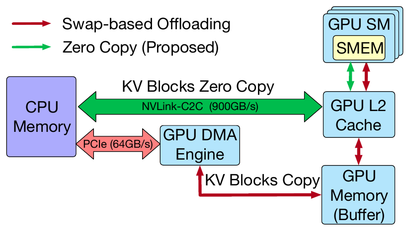
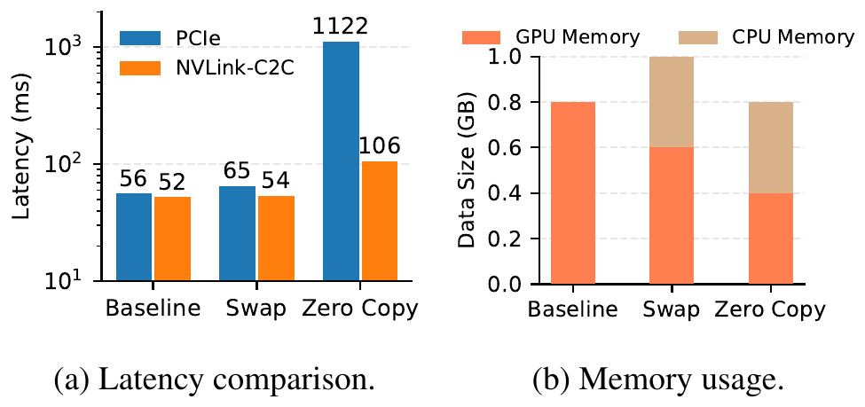
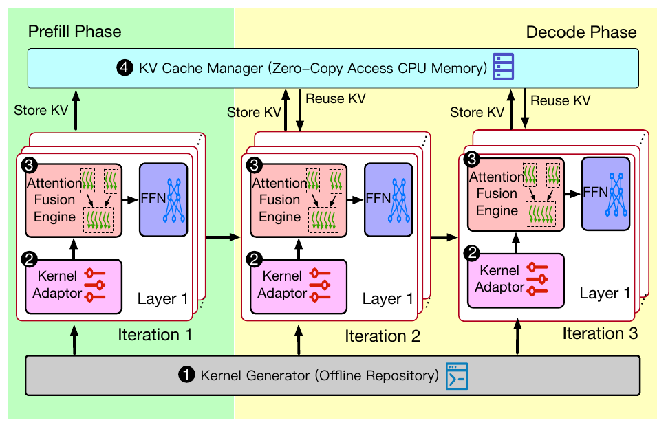
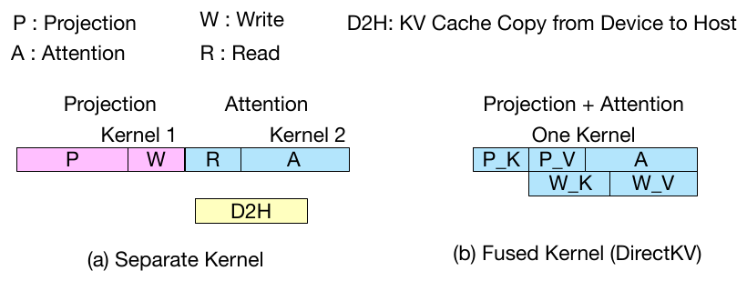

# DirectKV (OSDI '26)：长上下文大模型零拷贝 KVCache 卸载深度解读、技术启发与立项背书

## 一、 论文基本信息与研究背景

- **论文题目**：*No Buffer, No Bottleneck: Efficient Zero-Copy KV Cache Offloading for Long-Context LLMs*
- **作者与机构**：Shutian Luo, Haiying Shen（University of Virginia，弗吉尼亚大学）
- **发表会议**：USENIX OSDI 2026（第 20 届操作系统设计与实现顶会，Seattle, WA, USA）
- **原文链接**：[同目录 PDF](<[OSDI 2026] No Buffer No Bottleneck Efficient Zero-Copy KV Cache Offloading for Long-Context LLMs.pdf>)
- **核心专有名词界定**：
  - **KVCache**（大模型注意力键值缓存）：自回归生成过程中缓存的历史 Key 与 Value 激活状态张量，用于避免后续 Token 生成时重复计算注意力；
  - **TTFT**（Time To First Token，首字生成延迟 / 首 Token 响应时间）：从用户发起请求到生成第一个 Token 的耗时；
  - **TPOT**（Time Per Output Token，每个输出 Token 的生成耗时 / 单字生成延迟）：解码阶段逐字生成的平均时间；
  - **Direct-View**（远端直读）：直接通过高速互连总线跨节点读取远端内存/显存中的 KV 数据，不产生本地显存全量拷贝；
  - **Host CPU 零数据拷贝**（Payload Bypass DDR）：CPU 仅负责下发控制指令，不参与正文数据搬运，数据直接在设备与远端介质间流转。

### 1.1 面临的体系结构物理矛盾
随着大语言模型（LLM）上下文窗口扩展至 128K 乃至 1M，KVCache 的显存占用随序列长度和模型尺寸呈线性爆炸式增长。以 128K 上下文为例，单请求仅 KV 缓存即可达到数百 GB，远超单个计算加速卡的高带宽显存（HBM）物理容量上限。

业界现有的基于换入换出模式的卸载方案（Swap-based Offloading，如 FlexGen、Pie、SGLang CPU Offload 及开源 Mooncake 的阶段性换出）将冷 KV 卸载到 Host CPU 内存中。然而，这种经典机制在底层硬件层面存在两大顽疾：
1. **GPU 暂存缓冲区（Staging Buffer）浪费巨量显存**：GPU 端必须为正在读取的 KV 块分配专门的临时缓冲区（典型为数百 MB 至数 GB），导致宝贵的 HBM 无法被模型前向计算完全利用；
2. **二次数据搬运与双向总线争用**：数据必须经过 Host DDR $\leftrightarrow$ PCIe/C2C $\leftrightarrow$ GPU HBM 的往返中转，按层（Per-layer）或按块频繁执行 swap-in/swap-out，CPU 深度卷入数据搬运，引发严重的总线争用与计算停顿。

---

## 二、 核心技术细节与架构机理

DirectKV 的核心设计是彻底取消 GPU 侧的暂存缓冲区，让 GPU 计算核心（SM）直接访问页锁定（Pinned）的主机内存中的 KVCache。然而，论文通过详实的微基准测量指出：**纯粹在软件 API 层取消拷贝的“朴素零拷贝（Naïve Zero-Copy）”不仅不能提速，反而会导致性能发生灾难性暴跌**。

### 2.1 朴素零拷贝的性能陷阱


*图 1：传统换入换出卸载与零拷贝数据流对比（摘自 DirectKV 原文 Fig. 1）*


*图 2：三种机制在 PCIe 与 NVLink 互连下的注意力计算延迟对比（摘自 DirectKV 原文 Fig. 2）*

（Pitfalls of Naïve Zero-Copy）
在现代 GPU 体系结构中，SM 计算单元的高度并行计算吞吐（如 Hopper HBM3 带宽达 3.35 TB/s）严重依赖片上高速缓存（L1/L2 Cache）与连续访存合并。当 GPU 核函数直接解引用页锁定的 Host DDR 地址时：
- **互连带宽不对称**：即使在 NVIDIA GH200 上，CPU-GPU 双向 NVLink-C2C 带宽为 900 GB/s，依然显著低于 HBM3 的 3.35 TB/s；而在标准 PCIe 5.0 x16 环境下，单向带宽仅 64 GB/s，带宽差距高达数十倍；
- **访存局部性破坏与总线流量剧烈放大**：在多头注意力（Multi-Head Attention）与矩阵乘计算中，外层循环会导致同一批 CPU 侧数据被反复拉取。在 PCIe 环境下，朴素零拷贝注意力计算耗时高达 **1122 ms**，而换入换出基线仅需 **56 ms**，性能暴跌 **20 倍**；在 GH200 NVLink-C2C 下，朴素零拷贝耗时为 **106 ms**，基线为 **52 ms**，同样慢了 **1 倍**；
- **L2 Cache 击穿**：实测显示，朴素零拷贝使 GPU L2 Cache 命中率由基线的 77% 断崖式跌至 **32.3%**，CPU-GPU 互连总线上充斥着重复读取的冗余流量（高达 22.7 GB）。

### 2.2 DirectKV 的三大软硬件协同优化机理


*图 3：DirectKV 软硬件协同整体系统架构与数据流向（摘自 DirectKV 原文 Fig. 8）*


*图 4：QKV 投影与注意力算子融合消除 HBM 往返访存（摘自 DirectKV 原文 Fig. 9）*


DirectKV 证明了“消除拷贝”不等于“消除数据移动”，必须通过体系结构维度的软硬协同对数据流进行重构：

```
+-----------------------------------------------------------------------------------+
| DirectKV Kernel-Memory 协同架构                                                   |
|                                                                                   |
|  [Host CPU Pinned Memory]                                                         |
|         |                                                                         |
|   (Tile 异步拉取) ----> [SM 片上共享内存 (Shared Memory)] <---- [GPU HBM (Q/Weights)]|
|                                   |                                               |
|                    [Warp-Level 双缓冲异步流水掩盖]                                |
|                                   |                                               |
|                      [Fused Projection & Attention]                               |
|                                   |                                               |
|               新生成 Token 的 K/V 直接写回 Host Memory (无中转)                   |
+-----------------------------------------------------------------------------------+
```

#### 1. 面向慢速 CPU 内存的自适应分块（CPU-Memory-Aware Tiling）
DirectKV 颠倒了传统的循环嵌套顺序。传统 GEMM/Attention 循环中，矩阵数据以外部大块调度为主。DirectKV 明确将带宽受限的 CPU 侧 KV Tile **一次性拉入 SM 的片上高速共享内存（Shared Memory, SMEM）中常驻**，然后在片上遍历 GPU 本地的高速数据（如 Query 与模型权重）。
- **实测收益**：将 CPU-GPU 慢速链路上的重复数据搬运量由 33.5 GB 骤降至 **0.4 GB**（减少 98.8%），Attention 计算延迟由 106 ms 缩短至 54 ms，L2 Cache 命中率从 32.3% 恢复至 **75.1%**。

#### 2. Warp 级双缓冲流水掩盖（Warp-Level Pipelining）
利用 NVIDIA Hopper 架构的异步传输指令（Asynchronous Transfer），DirectKV 在 SM 内部构建了细粒度双缓冲（Double Buffering）流水线：
- 一个 Warp 负责通过异步传输通道从页锁定 Host 内存拉取下一个 Tile 的 KV 数据；
- 其他 Tensor Core Warps 同步对当前 SMEM 中已就绪的 Tile 执行矩阵计算；
- **实测收益**：实现了通信与计算的完全交叠掩盖，HBM 实际有效利用吞吐从 0.3 TB/s 跃升至 **1.3 TB/s**（提升 4.3 倍），端到端 Kernel 延迟进一步降低 11%（54 ms $\rightarrow$ 48 ms）。

#### 3. Projection 与 Attention 核函数融合（Fused Kernel）
在自回归生成中，前一层输出需通过 QKV 线性投影产生当前 Token 的 K 和 V，再输入注意力层计算。传统实现将其拆分为两个独立 Kernel，投影生成的 K/V 必须先写回 HBM，再被 Attention Kernel 重新读出。
- DirectKV 将 QKV 投影与 Attention Kernel 进行端到端算子融合，投影后的 K/V 直接保留在片上 SMEM 中供本层 Attention 即刻消费，消费完成后直接通过异步通道写回主机内存供后续解码复用；
- **实测收益**：完全消除了临时 K/V 张量在 HBM 的往返读写，Kernel 执行吞吐较分离实现最高提升 **3.5 倍**，计算时延缩减为分离版本的 **1/3 ~ 1/2.5**。

---

## 三、 关键实验平台与量化测试结果

### 3.1 实验平台与基线配置
- **测试硬件**：
  - 主力平台：NVIDIA GH200 Grace Hopper Superchip（Hopper GPU 96GB HBM3，480GB LPDDR5X CPU 内存，NVLink-C2C 双向带宽 900 GB/s）；
  - 对照平台：NVIDIA H100 PCIe Gen5（单向理论带宽 64 GB/s）；
  - 软件环境：CUDA 12.4，PyTorch 2.3，CUTLASS 3.0+ / CuTe。
- **评测模型与工作负载**：
  - 模型：Llama-3.1-8B、OPT-13B、OPT-30B；
  - 负载：ShareGPT、Alpaca、Poisson 分布到达流，并发请求率最高 30 req/s，上下文长度覆盖 1K ~ 32K Tokens；
  - 对比基线系统：SGLang（显存常驻基准）、Pie（带 GPU 暂存缓冲区的卸载系统）、FlexGen（经典 CPU/GPU/Disk 三级卸载与成本模型系统）、Neo（CPU 执行 Attention 的卸载系统）。

### 3.2 核心量化实验数据对照

| 评估维度 | DirectKV 表现 | 业界既有基线表现 | 体系结构归因与量化差距 |
| :--- | :--- | :--- | :--- |
| **GPU 显存占用** | 运行 Llama-3.1-8B 时平均仅占用 **47 GB** 显存 | 换入换出类系统（Pie/Neo 等）平均占用 **82 GB** | **GPU 显存占用直接降低 43%（净省 35 GB）**；彻底省除 GPU Staging Buffer 与冗余中间张量。 |
| **CPU-GPU 互连流量** | 较基线方案数据传输总量**降低高达 50%** | 传统 Swap 方案存在大量层间换入换出冗余与重复读取 | CPU-Memory-Aware Tiling 与算子融合消除了中间重复访存与 HBM 往返。 |
| **高并发服务时延** | 30 req/s 满载下，Llama-3.1-8B 端到端时延为 **0.75 s** | 对照系统时延处于 **1.55 s ~ 2.95 s** 之间 | **端到端服务延迟降低 51.6% ~ 74.5%**；消除了 Staging Buffer 的内存拷贝排队阻塞。 |
| **超长上下文容量极限** | 在 **32K** 上下文下稳定运行且吞吐保持平稳 | Neo、SGLang、Pie 在 32K 时因显存耗尽**全量发生 OOM 崩溃** | 突破物理显存物理上限，在 16K 下比 FlexGen 快 1.7 倍、比 Pie 快 1.3 倍。 |
| **互连链路敏感性** | NVLink-C2C 耗时 48 ms，PCIe Gen5 耗时 200 ms+ | PCIe 朴素零拷贝耗时高达 1122 ms | 互连物理带宽对直读至关重要，PCIe 适合容量扩容，高速总线才能达成低延迟。 |

---

## 四、 对我们统一异构 KVC 存储池项目的硬核技术启发

DirectKV 针对单机 CPU-GPU 架构的实测事实，对我们面向国产 AI 硬件的统一异构 KVCache 存储与调度底座建设具有极具价值的工程指导意义：

### 4.1 坚定推进 Host CPU 零数据拷贝底座（PVT-01），杜绝中间内存缓冲
- **启发**：Mooncake 等开源方案依赖 Host CPU 作为跳板（计算节点将 KV 拷入 Host 内存，再由网络发送；远端接收后再由 Host 写入显存），DirectKV 的数据证明了这种中转模式在显存利用率（多浪费 43%）和传输时延上的巨大劣势；
- **落地手段**：在 PVT-01 中，坚决落实 **Payload Bypass DDR** 机制。无论是在本地 NVMe SSD 分层存储（PVT-05）还是跨节点 URMA/UBMEM 网络通信中，正文数据流严格通过设备级 DMA（P2P Direct DMA / GDS）在 NPU HBM 与远端存储/显存间直接打通，Host CPU 严格仅负责信令解析与元数据下发，正文数据触碰字节数（Touch Bytes）严格保持为 0。

### 4.2 警惕“朴素直读陷阱”，将 Direct-View 建立在严密的硬件能力矩阵与代价决策上（PVT-03 / PVT-04）
- **启发**：DirectKV 实锤证明——**链路带宽不足或未做流水优化时，直接远端读会比完整搬入甚至直接重算慢数十倍**！
- **落地手段**：
  1. 在 PVT-03（Direct-View 与 Copy-to-HBM 边界判定）中，绝不能将“远端直读”作为默认必选路径；
  2. 必须将硬件能力矩阵（CapabilityMatrix，运行时实测的各链路物理带宽与延迟参数）作为前置约束。当且仅当互连处于 UBMEM 超高速低延迟总线、且前缀复用度高时，才允许激活 Direct-View；在跨机慢速网络或 PCIe 链路受限时，必须果断走异步 Copy-to-HBM 或直接本地重算，杜绝性能倒挂。

### 4.3 强化描述符连续聚合与双流异步掩盖（PVT-02）
- **启发**：DirectKV 通过片上 SMEM 双缓冲流水掩盖了 92.4% 的传输时延，这是消除 I/O 停顿的核心武器；
- **落地手段**：在 PVT-02 中，通过 ExtentManifest 将跨框架离散物理 Block 贪心合并为 64 字节硬件 Scatter-Gather 连续描述符，配合底层 NPU Compute Stream 与 URMA DMA Stream 的双流解耦，在 NPU 执行前序计算时提前预取后续层所需 KV，实现传输开销的深度掩盖。

---

## 五、 对本项目立项与架构答辩的硬核技术背书

在立项答辩与架构技术评审中，针对评委与技术委员会可能提出的核心质询，DirectKV 提供了第一性原理层面的硬核反驳依据：

### 5.1 质询一：“开源社区的 Mooncake 已经有成熟的分布式 Chunked Prefill 和 Transfer Engine，原厂为什么还要自研存储池底座？”
> **硬核反驳背书**：
> 1. **开源 Mooncake 的 Host 中转架构存在天然物理缺陷（缺陷 M-01）**：Mooncake 在数据搬运时深度依赖 Host CPU 内存中转与系统软缓冲。OSDI '26 DirectKV 的实测事实表明，维护中间暂存缓冲区会导致 **GPU 显存白白浪费高达 43%**，且数据跨 PCIe/DDR 多次往返使有效带宽腰斩、TTFT 大幅拉长；
> 2. **原厂软硬件协同的不可替代性**：只有原厂自研底座才能深度下潜至底层通信驱动（URMA/UBMEM）与硬件 DMA 引擎，实现真正的 **Host CPU 零数据拷贝（Payload Bypass DDR）**。DirectKV 揭示的性能收益从底层体系结构上证实了：脱离原厂硬件直通驱动的纯应用层中转，根本无法触及物理性能上限。

### 5.2 质询二：“既然远端直读（Direct-View）省去了显存拷贝，为什么不把所有跨节点 KV 都做成全直读？”
> **硬核反驳背书**：
> 1. **学术共识否定盲目零拷贝**：DirectKV 在顶会上首次量化揭露了“朴素零拷贝陷阱”——若不考虑物理链路带宽瓶颈与片上复用局部性，直接发起跨链路读取会导致注意力计算时延暴涨 **20 倍**（PCIe 56ms 恶化至 1122ms），L2 Cache 命中率跌超一半；
> 2. **立项架构的先进性得以佐证**：本项目在架构设计之初就设立了 **PVT-03（边界判定与 ViewGuard 守卫）** 与 **PVT-04（QueryPlan 微秒级动态选路引擎）**，依据“拉取与加载总开销 < 本地直接重算耗时”的前置门限自适应选择 Direct-View、Copy-to-HBM 或本地重算。DirectKV 的研究事实有力证明了我们这种**“动静结合、按代价决策选路”**的架构设计是唯一正确的工业路径，绝非过度设计。

---

## 六、 边界条件与不可直接迁移点

1. **硬件互连平台差异**：DirectKV 极度依赖 NVIDIA GH200 专属的 900 GB/s NVLink-C2C 芯片间片上互连，其在 PCIe Gen5 下的性能表现显著受限。本项目面向的是国产 AI 芯片与通用服务器集群，跨机互连走的是 UBMEM/URMA，拓扑与带宽延迟特性截然不同，不能直接照搬其 GH200 绝对数值（如 0.75s 时延）；
2. **单机架构 vs 分布式集群**：DirectKV 仅解决了单机 CPU-GPU 间的内存直读，完全未涉及跨网络节点的分布式目录检索、租约一致性、多卡张量并行（TP=8）集合通信死锁及多租户流量隔离；这些分布式关键挑战仍必须由本项目的分布式架构（如 ViewGuard、ConsumeEligibility、SemanticQoS）独立闭环解决；
3. **内核算子闭源与适配门槛**：DirectKV 的算子融合深度绑定 NVIDIA CUTLASS 3.0 与 Hopper SMEM 硬件指令，在国产 NPU 架构下需要基于原厂算子库与计算图引擎进行定制化重新实现。
