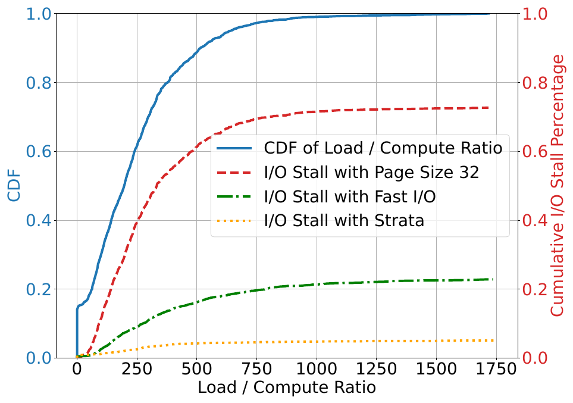
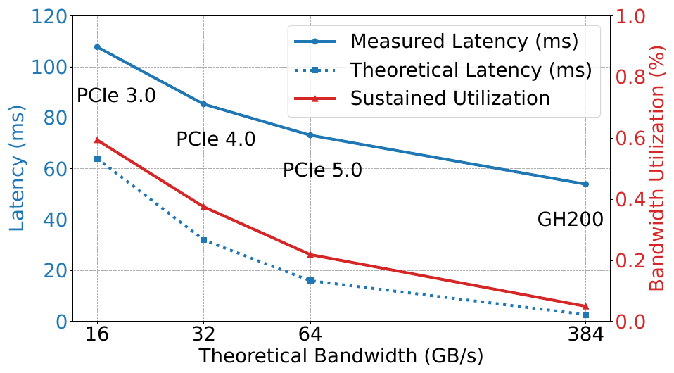
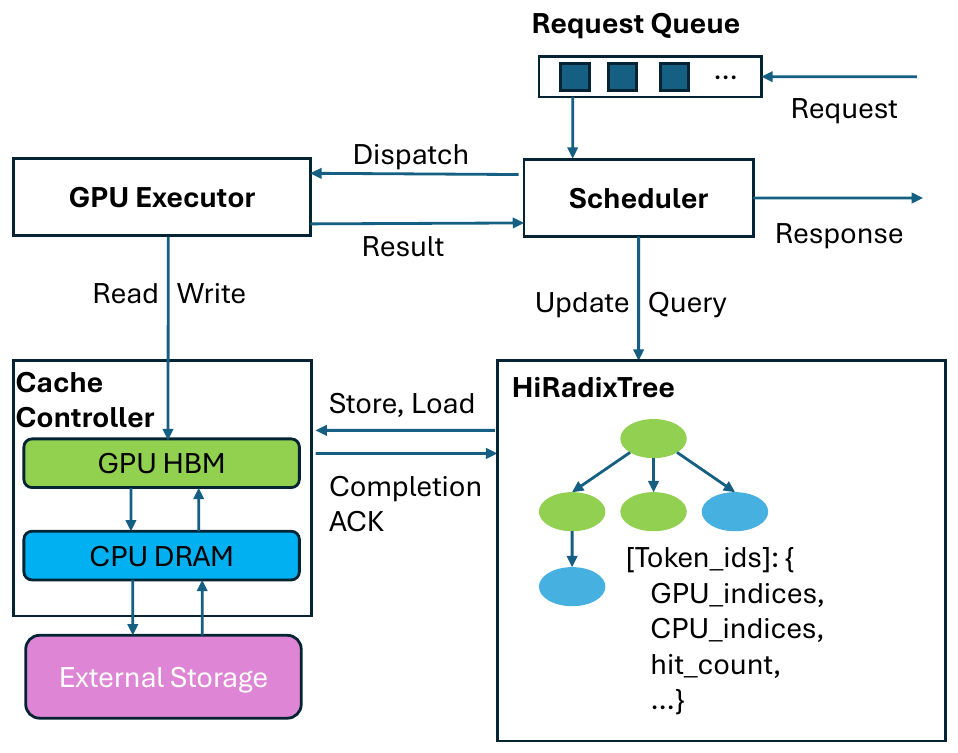
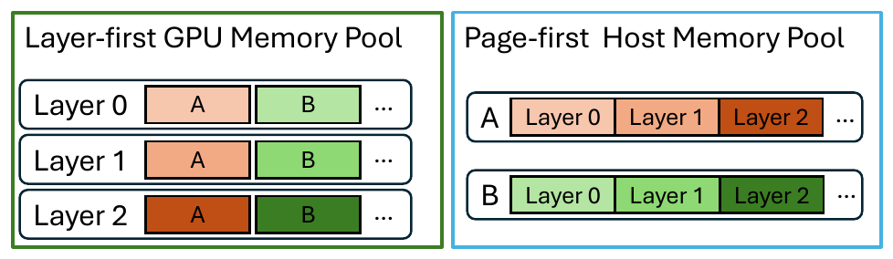
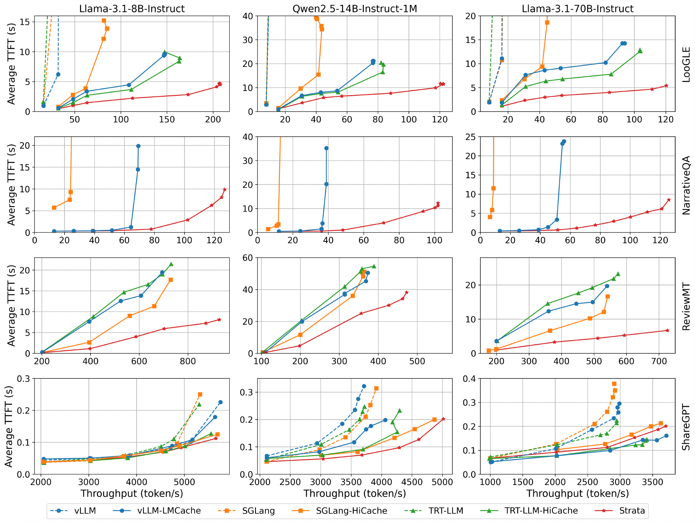

# Strata (OSDI '26)：分层上下文缓存体系、布局解耦与协同调度深度解读、技术启发与立项背书

## 一、 论文基本信息与研究背景

- **论文题目**：*Strata: Hierarchical Context Caching for Long Context Language Model Serving*
- **作者与机构**：Zhiqiang Xie（Stanford University & NVIDIA）、Ziyi Xu（SJTU）、Mark Zhao（CU Boulder）、Yuwei An（CMU）、Vikram Sharma Mailthody（NVIDIA）、Scott Mahlke（NVIDIA & UMich）、Michael Garland（NVIDIA）、Christos Kozyrakis（NVIDIA & Stanford University）
- **发表会议**：USENIX OSDI 2026（第 20 届操作系统设计与实现顶会，Seattle, WA, USA）
- **原文链接**：[同目录 PDF](<[OSDI 2026] Strata Hierarchical Context Caching for Long Context Language Model Serving.pdf>)
- **核心专有名词界定**：
  - **KVCache**（大模型注意力键值缓存）：自回归生成过程中缓存的历史 Key 与 Value 激活状态张量，用于避免后续 Token 生成时重复计算注意力；
  - **Saved-Prefill**（首字生成预计算节省）：利用已缓存的 KV Cache 避免重复计算输入 Prompt，显著降低首字生成延迟 TTFT；
  - **TTFT**（Time To First Token，首字生成延迟 / 首 Token 响应时间）；
  - **TPOT**（Time Per Output Token，每个输出 Token 的生成耗时 / 单字生成延迟）；
  - **PD 分离**（Prefill 与 Decode 计算解耦架构）：将大模型计算理解 Prefill 阶段与逐字生成 Decode 阶段部署在不同物理节点。

### 1.1 面临的体系结构物理矛盾


*图 1：Qwen2 长上下文 Prefill 耗时分布（I/O 等待占 74%，摘自 Strata 原文 Fig. 1）*


*图 2：不同硬件互连下离散小页传输导致的总线饥饿（摘自 Strata 原文 Fig. 3）*


在长上下文大模型服务中，输入 Prompt 的前缀复用（Saved-Prefill）是大幅降低首字延迟 TTFT 的关键手段。然而，当工业界尝试构建跨 GPU 显存（HBM）、Host 内存（DRAM）与 NVMe SSD 的三级分层上下文缓存时，遇到了严重的**吞吐与命中率两难困境（Throughput vs. Hit-rate Tradeoff）**：
1. **PagedAttention 的细粒度碎片化与总线饥饿**：现代推理框架（如 vLLM、SGLang）普遍采用 PagedAttention 管理显存，将 KV 切分为小页（如 16 或 32 Tokens，单块仅数 KB）。然而，现代高速总线（PCIe 5.0、NVLink）必须依赖兆字节级（1~2MB）的大块连续传输才能打满带宽。小页离散传输导致**硬件总线有效利用率仅达到理论峰值的 5% ~ 22%**！
2. **大页破坏前缀命中率**：若为了迎合总线带宽而强行增大 Page 大小（如调大至 512 Tokens），前缀匹配粒度急剧粗化，导致缓存命中率暴跌，平均 TTFT 反而**恶化高达 2.9 倍**！
3. **I/O 停顿严重阻塞 Prefill 流水（I/O Stalls Prefill）**：基线系统中，**高达 74% 的 Prefill 计算时间处于停顿状态，完全在等待 KV 数据的总线搬运**；即便底层具有极高速的 I/O 通路，因缺乏精细调度协同，仍有 **24%** 的时间停滞在 I/O 阻塞上；
4. **调度器对缓存加载时延与 Delay Hit 盲目**：并发请求到达时，若前序请求正在 Prefill 相同的 Prompt 前缀，现有调度器无法感知其瞬态（In-Flight）状态，导致后序请求盲目发起重复 Prefill，白白浪费算力。

---

## 二、 核心技术细节与架构机理

Strata 提出了软硬件协同的分层上下文缓存架构，由数据面的 **StrataCache Controller** 与控制面的 **StrataScheduler** 深度协同构成：

```
+-----------------------------------------------------------------------------------+
| Strata 软硬件协同分层架构                                                         |
|                                                                                   |
|  [控制面: StrataScheduler]                                                         |
|     ├── HiRadixTree 索引树 (跟踪 In-Queue, In-Flight 等 Transient 瞬态节点)        |
|     ├── Delay-Hit 识别与延后调度 (共享前缀 >100 tokens 避免重复 Prefill)          |
|     └── Load/Compute 平衡批次编组 (搭配 I/O 受限与计算受限请求，交织掩盖)          |
|                                                                                   |
|  [数据面: StrataCache Controller]                                                 |
|     ├── 传输/计算布局解耦: CPU/SSD 侧 Page-First <===> GPU HBM 侧 Layer-First       |
|     └── GPU-Assisted I/O 并发重排: 2x 1024-thread blocks 搬运并转置 (48 GB/s)      |
|                                                                                   |
|  [执行流: 动态填补流水空洞]                                                        |
|     └── 当 Prefill 必须等待慢速 I/O 时，动态插入独立 Decode 计算任务消除硬件空转   |
+-----------------------------------------------------------------------------------+
```

### 2.1 计算布局与传输布局解耦


*图 3：Strata 分层上下文缓存整体架构与双控制器（摘自 Strata 原文 Fig. 4）*


*图 4：Layer-First 计算布局与 Page-First 传输布局解耦映射（摘自 Strata 原文 Fig. 6）*

（Decoupled Layouts）
为了同时获得大块连续传输的高带宽与细粒度小块的高缓存命中率，Strata 提出了布局解耦设计：
- **GPU 显存侧采用 Layer-First 计算布局**：KV 数据按 Transformer 层连续排布，完美迎合注意力核函数（Attention Kernel）按层迭代的高局部性计算访存；
- **Host 内存与 SSD 侧采用 Page-First 传输布局**：跨层将同一个 Token Page 的所有数据聚合存放，使其在底层物理介质上形成连续的大块物理地址，满足总线与磁盘高速 DMA 连续搬运要求；
- **重排时机**：在数据搬运流转的同时完成地址转换与布局转置，从根本上兼顾了“细粒度高命中”与“大块打满总线”。

### 2.2 GPU 协助的高并发细粒度 I/O（GPU-Assisted I/O）
针对小块数据在总线上的散乱搬运开销，Strata 利用 GPU 海量轻量级线程的并发优势接管 I/O 搬运：
- 启动专门的 CUDA Kernel（默认使用两个 1024-thread blocks），通过海量线程并发驱动小块搬运，并在流式传输过程中以 128 字节极细粒度完成数据重排与布局转置；
- **实测性能**：在 NVIDIA H200 平台上测得持续有效带宽达到 **48 GB/s**，且因使用的线程块极少，对前台正在执行的在线 Prefill 算力干扰**低于 5%**，对在线 Decode 干扰约 **10%**。

### 2.3 加载与计算协同调度器（Load-Compute Co-scheduling）
针对传统调度器对加载时延盲目导致的 I/O 停顿，Strata 引入三大前置调度机制：
1. **Delay Hit 识别与延后调度**：在 HiRadixTree 索引树中引入 `in-queue`、`in-flight` 等瞬态（Transient）标记。当检测到当前请求与前序请求共享长前缀（默认 >100 Tokens）且前序请求正在计算中时，调度器主动延后当前请求，等待前序请求直接产出 KV 缓存，彻底杜绝短时间内的重复 Prefill（实测 Mooncake 生产 Trace 中 38% 的请求在 1 秒内与另一请求共享 >6K 前缀）；
2. **平衡批次构建（Load/Compute Balanced Batching）**：调度器评估各请求的 `Load / Compute Ratio`（加载数据耗时与实际计算耗时之比）。将高加载开销（I/O-bound）的请求与高计算开销（Compute-bound）的请求交叉打包为一个 Batch，使数据拉取与计算执行完全并行交织；
3. **Decode 动态填补流水空洞（Latency Hiding）**：当遇到跨介质（如 NVMe SSD）慢速拉取时，调度器动态抓取独立的 Decode 计算任务插入当前批次，用单字生成计算填补 Prefill 的 I/O 等待间隙。

---

## 三、 关键实验平台与量化测试结果


*图 5：LooGLE 长文本基准下端到端服务吞吐对比（摘自 Strata 原文 Fig. 8）*


### 3.1 实验平台与评测基线
- **实验平台**：
  - 平台 A：8× NVIDIA H200 GPU（NVLink 互连）+ Intel Sapphire Rapids CPU（1.6 TB DRAM）+ 每卡 PCIe 5.0 x16（理论峰值 64 GB/s）；
  - 平台 B：8× NVIDIA H20 GPU + Intel P5510 NVMe SSD 分层存储节点；
  - 平台 C：NVIDIA GH200 Grace Hopper 超级芯片；
- **评测模型**：Llama-3.1-8B（128K 上下文）、Qwen2.5-14B-1M（100 万超长上下文）、Llama-3.1-70B（4 卡 TP 张量并行，128K 上下文）；
- **基线系统**：SGLang-HiCache、vLLM-LMCache、TensorRT-LLM-HiCache；
- **测试负载**：LooGLE、NarrativeQA、ReviewMT、ShareGPT 真实长上下文长文本基准，最大 128 个并发请求。

### 3.2 核心量化实验数据对照

| 评估维度 | Strata 实测表现 | 业界既有基线表现 | 体系结构归因与量化差距 |
| :--- | :--- | :--- | :--- |
| **端到端服务吞吐** | LooGLE 长文本基准下，相对三个主流基线获得显著吞吐倍数提升 | 传统基线频繁因 I/O 阻塞导致 GPU 空转停顿 | 8B 模型提升 **3.2× / 2.6× / 1.9×**；70B (TP=4) 模型提升最高达 **5.0× / 5.0× / 3.75×**。 |
| **I/O 停顿占比** | 通过布局解耦与协同调度，将 I/O 停顿削减至极低区间 | 传统方案中高达 **74%** 的 Prefill 时间处于 I/O 阻塞停顿 | 彻底消除了小页散乱传输引发的总线排队与调度空洞。 |
| **布局解耦收益** | H20-Storage + DeepSeek-V3 真实环境下，平均 TTFT 改善 **2.1 倍** | 传统固定大页方案前缀命中率低，平均 TTFT 暴增 2.9 倍 | Page-First 兼顾了总线连续大块传输与细粒度前缀高命中。 |
| **机制消融增益** | 单独 Load-Compute 调度带来 **1.8×** 提升；单独 GPU-Assisted I/O 带来 **2.3×** 提升 | 传统静态先进先出（FIFO）调度完全无重叠掩盖能力 | Delay Hit 处理使短距离复用吞吐再提升 **42%**，平衡批次再提升 **12%**。 |
| **纯硬件升级局限** | GH200 上即便将 Host-GPU 物理带宽提升至 150 GB/s，吞吐仍低于 H200 上的 Strata | 硬件标称带宽提升并不直接等价于端到端吞吐提升 | **证实了单纯堆硬件带宽无效，必须依赖软硬件协同调度与布局重排**。 |

---

## 四、 对我们统一异构 KVC 存储池项目的硬核技术启发

Strata 揭示的系统瓶颈与解决方案，直接呼应了我们项目架构中的关键设计：

### 4.1 坚定落实 64B Extent 连续块描述符编译与异步 DAG 流水（PVT-02）
- **启发**：Strata 证明了小粒度离散传输是总线利用率暴跌（仅 5%~22%）的罪魁祸首，而大页又会伤害命中率；
- **落地手段**：在 PVT-02 中，推进 **ExtentManifest 连续块清单描述符** 与 **DescriptorCompiler 描述符编译器**。在框架层保持细粒度 Block 虚拟映射（确保高命中率），在底层传输提交前，贪心合并物理连续的 Block 为 64 字节硬件 Scatter-Gather 描述符，驱动底层 URMA 进行兆字节级连续传输，彻底攻克总线饥饿瓶颈。

### 4.2 分布式目录引入瞬态节点与 Delay Hit 防抖机制
- **启发**：Mooncake 生产数据显示，38% 的并发请求在 1 秒内共享超过 6K 前缀。静态调度下，后序请求因未见成品 KV 而发起冗余 Prefill，导致算力踩踏；
- **落地手段**：在分布式全局目录（DistributedDirectory）中引入 `In-Flight / In-Queue` 瞬态租约状态。当计算节点发起目录查询时，若检测到目标前缀正在被相邻实例计算，QueryPlan 决策引擎主动启动微秒级延后等待，直接复用即将就绪的远端 KV，避免重复计算，大幅压缩集群总算力消耗。

### 4.3 完善 QueryPlan 与 CostEvaluator 代价模型（PVT-04）
- **启发**：单纯看“是否命中”是极为盲目的。如果加载数据的时延超过了本地直接重算的耗时，拉取缓存反而会成为业务毒药；
- **落地手段**：在 PVT-04 中，将网络实时可用带宽、介质排队时延、请求长度等参数实时输入成本预估模型（CostEvaluator）。严格遵守前置公式：**拉取与加载总开销 < 本地直接重算耗时**，若不满足则坚决回退至本地重算，彻底消灭短上下文或网络拥塞时的时延负收益反噬。

---

## 五、 对本项目立项与架构答辩的硬核技术背书

在立项评审中，专家经常对自研 KVC 存储池的必要性提出质疑，Strata 提供了极为强硬的业界顶会背书：

### 5.1 质询一：“开源 Mooncake 已经提出了 Chunked Prefill 和基于 RDMA 的多网卡并发切片，为什么还要做原厂重构？”
> **硬核反驳背书**：
> 1. **开源 Mooncake 的无语义切片存在严重的体系结构缺陷（缺陷 M-02）**：Mooncake 采用 64KB 固定切片通过多网卡盲目并发发送（Slice Spraying）。OSDI '26 Strata 明确揭示：**离散且缺乏层序语义的切片传输会导致高达 74% 的 Prefill 计算时间停滞在 I/O 等待上**，因为计算核心必须依赖第 0 层的完整 KV 才能启动前向流水，切片打散严重破坏了流水掩盖；
> 2. **原厂自研布局解耦与连续描述符编译的必要性**：本项目提出的 Extent 描述符编译与双流异步流水（PVT-02），从底层打破了切片盲发模式，保证了层序连续大块 DMA 传输。Strata 的研究彻底证实了开源 Mooncake 的切片传输存在根本性物理短板，必须由原厂中间件进行深度软硬件协同重塑。

### 5.2 质询二：“既然有高带宽网卡，直接拉取缓存不就能自动提升性能吗，为什么非要做复杂的微秒级动态选路引擎？”
> **硬核反驳背书**：
> 1. **顶会实验证实单纯堆砌硬件带宽无效**：Strata 在 GH200 上实测表明，即便将硬件互连带宽由 40 GB/s 强行提升至 150 GB/s，若缺乏加载与计算的协同调度，整体吞吐依然落后于优化后的普通平台；
> 2. **静态贪婪拉取的反噬风险（缺陷 M-04）**：在网络拥塞或短前缀场景下，数据加载时延往往反超本地重算耗时。开源方案盲目拉取导致端到端响应严重恶化。本项目立项研发 **QueryPlan 动态选路引擎（PVT-04）**，正是在底层践行 Strata 揭示的第一性原理规律，为业务消除长尾时延抖动提供确定性保障。

---

## 六、 边界条件与不可直接迁移点

1. **同机共置（Colocated P-D）vs 解耦架构（PD 分离）**：Strata 的实验基于 Prefill 与 Decode 共置在同一 GPU 上的连续批处理（Continuous Batching）环境，因此其能够灵活利用 Decode 计算任务去填补 Prefill 的 I/O 等待空隙；而在大规模数据中心普遍采用的 PD 解耦架构下，Prefill 节点上通常不存在正在运行的 Decode 任务，必须依靠模型内逐层流水掩盖（Layer-by-layer Pipelining）或多请求交错流水；
2. **硬件算子生态差异**：Strata 的 GPU-Assisted I/O 深度依赖 CUDA Warp 级原子指令与 NVIDIA H200 硬件架构，移植到国产 NPU 平台时，需评估片上可编程 DMA 引擎或专用硬件传输队列的实际支持能力；
3. **调度阈值不可硬编码**：论文中的默认参数（如延后前缀门限 100 Tokens、Load/Compute 比值 100）属于 NVIDIA 平台特定调优值，在本项目国产芯片平台上必须通过 PVT-04 实测微基准进行离线重新标定。
