# Strata：面向长上下文大模型服务的分层上下文缓存

> 论文：*Strata: Hierarchical Context Caching for Long Context Language Model Serving*  
> 会议：20th USENIX Symposium on Operating Systems Design and Implementation, OSDI 2026  
> 作者：Zhiqiang Xie, Ziyi Xu, Mark Zhao, Yuwei An, Vikram Sharma Mailthody, Scott Mahlke, Michael Garland, Christos Kozyrakis  
> 原文：[[OSDI 2026] Strata Hierarchical Context Caching for Long Context Language Model Serving.pdf](<[OSDI 2026] Strata Hierarchical Context Caching for Long Context Language Model Serving.pdf>)  
> 解构范围：论文事实和实验结论仅依据上述 PDF；“对本项目的启发”依据本项目受控方案文档作独立映射，不反向改写论文事实。  
> 证据标记：【论文事实】【实测数据】【作者声称】【分析推断】【项目解读】【待验证】。

---

# 1. 一页读懂论文

## 1.1 论文解决什么问题？

【论文事实】长上下文大模型服务会把 KVCache（大模型注意力键值缓存，用来避免后续 Token 生成时重复计算历史 Key/Value 激活）从 GPU HBM 逐出到 CPU DRAM 或 SSD。容量问题因此缓解，但命中后的恢复通路反而容易变成前台瓶颈：大量离散小页无法吃满主机到 GPU 的链路带宽，加载卡住 Prefill（对输入上下文执行的首字生成前计算），调度器又没把加载时间和“延迟命中”纳入组批决策。结果是 TTFT（Time To First Token，首 Token 响应时间）和吞吐同时恶化。

## 1.2 根因是什么？

【分析推断】可见症状是“缓存加载慢”，根因其实有两层：

1. **计算布局和传输布局被强行绑定。** GPU 计算喜欢 layer-first（同层的 Token KV 连续），缓存命中喜欢小页；但 PCIe、NVLink 和 SSD 要靠更大的连续 I/O 才能接近带宽上限。系统既不能随意放大页，又不能让大量小 `cudaMemcpyAsync` 充分并发，只好承受碎片化传输。
2. **调度器的资源模型不完整。** 现有组批主要关心 GPU 计算量和 HBM 容量，默认加载能被逐层计算掩盖。当“已缓存的长前缀 + 很少的新 Token”进入系统时，可用 Prefill 计算不足以掩盖 I/O；同前缀的并发请求还会在首个 miss 尚未完成时被重复计算。

## 1.3 核心洞察是什么？

【分析推断】因为 GPU 有足够多的线程去并行聚合离散小块，轻量地址计算还能在搬运时顺手完成布局转换，所以没必要在“小页高命中率”和“大传输高带宽”之间二选一。再把 CPU–GPU 带宽、加载需求、可掩盖计算和未完成前缀状态暴露给调度器，就能在请求组批层减少无效工作，而不只是把单次拷贝做快。

## 1.4 核心抽象是什么？

【论文事实】Strata 没有引入一个独立的新存储 API。它的核心抽象更接近**缓存资源感知执行模型**：用 HiRadixTree（扩展的前缀基数树，同时承担前缀索引、页位置表和瞬态请求状态表）向调度器暴露命中位置、加载量、计算量以及前缀是否正在生成；缓存控制器执行层级间搬运和布局转换；调度器根据这些信息选批和排序。新能力不是“知道缓存在哪”，而是“在执行前知道这次命中要消耗多少搬运和计算资源”。

## 1.5 关键优化方法速览

### 方法 1：GPU 辅助碎片页搬运与跨层布局即时转换

- **问题**：小 KV 页和 GPU layer-first 布局会把一次长前缀加载拆成大量数 KB 小操作，带宽和缓存命中率无法同时兼得。
- **方法**：用少量大 CUDA block 启动数千 GPU 线程，并行拉取离散小块；线程计算目标偏移，在搬运中把主机/SSD 的 page-first 布局转为 GPU 的 layer-first 布局。
- **效果**：保留小页命中粒度，同时提高链路并发度和有效传输块大小，减少 Prefill 等待 I/O 的时间。
- **关键证据**：H200 微基准中，2 个 1024 线程 block 达到 48 GB/s，同时 Prefill 吞吐下降小于 5%，Decode 吞吐下降小于 10%（Figure 5）。

### 方法 2：瞬态前缀状态驱动的延迟命中规避

- **问题**：首个同前缀请求正在生成缓存时，后续请求看到的仍是 miss，因而重复执行长 Prefill。
- **方法**：在 HiRadixTree 中插入 `in-queue` / `in-flight` 瞬态节点；命中这些节点且前缀超过阈值的请求被延到下一轮，并排到队首等待即将发布的缓存。
- **效果**：把“将要命中”从隐含时间状态变为可调度信息，减少重复 Prefill，提高有效命中率。
- **关键证据**：最小缓存距离工作负载中，规避延迟命中使峰值吞吐提高 42%；在最大缓存距离中则没有收益（Figure 11）。

### 方法 3：带宽感知的加载—计算平衡组批与同前缀合批

- **问题**：FIFO 只按到达顺序填满批次，可能把多个大加载请求放在一起，但没有足够的新 Token 计算去掩盖搬运。
- **方法**：用汇总加载量/计算量判定批次是否进入 loading-bound，优先选择能用计算掩盖加载的组合；同一上下文的请求优先合批，共享已在 GPU 的数据。
- **效果**：减少同一批次的 PCIe 净等待，并降低 HBM 容量和读带宽压力。
- **关键证据**：Figure 11 的逐项累加消融中，平衡组批在 shuffle 和最大缓存距离负载上分别带来 11% 和 12% 的峰值吞吐增量。

### 方法 4：跨资源气泡填充

- **问题**：即使已经平衡组批，长前缀加载仍可能超过可掩盖的 Prefill 时间，GPU 在等待数据时留下空档。
- **方法**：当预备 Prefill 批次被 PCIe 加载阻塞时，先发射一个主要消耗 HBM 带宽的 Decode 批次，让它和主要消耗主机互连带宽的加载重叠。
- **效果**：把不可避免的 I/O 等待窗口转化为有用生成计算，提高 GPU 利用率。
- **关键证据**：Figure 11 中，气泡填充在 shuffle 和最大缓存距离负载上分别追加 8% 和 3% 峰值吞吐。

## 1.6 最重要的实验结果是什么？

1. 【实测数据】问题确实会压过计算：Qwen2.5-14B + LooGLE 中，原始层级缓存配置的 Prefill 时间最高有 74% 阻塞在 KV 传输上；即使使用快速 I/O，最高仍有 24% 停顿（Figure 1）。
2. 【实测数据】“带宽越高自然越快”不成立：8192 Token、page size 32 时，标准传输在 PCIe 5.0 上只达到约 22% 理论带宽，在 GH200 的高带宽互连上利用率最低约 5%（Figure 3）。这是 Strata 架构成立的核心设计不变量。
3. 【实测数据】LooGLE 长上下文中，Strata 在相同平均 TTFT 下对 SGLang-HiCache、vLLM-LMCache 和 TensorRT-LLM-HiCache 的最大吞吐收益，Llama-8B 分别为 3.2×/2.6×/1.9×，Qwen-14B 为 3.9×/2.1×/1.9×，Llama-70B 为 5×/5×/3.75×（Figure 8）。这些都是指定模型、数据集和基线下的“up to”结果，不是通用加速比。
4. 【实测数据】消融证明 I/O 和调度都有独立作用：Strata-Schedule-Only 和 Strata-IO 相对 SGLang-HiCache 的峰值吞吐最高分别提高 1.8× 和 2.3×（Figure 9）。但它们不能相乘，Figure 11 的子机制数字也是累加开关结果。

## 1.7 最大局限是什么？

最大局限不是某个 CUDA 参数，而是证据范围：Strata 主要证明了**单计算实例内、NVIDIA GPU + CPU/SSD 层级、精确稠密注意力 KV 缓存**的搬运和调度问题。它没有证明分布式多节点缓存池的一致性、故障恢复、多租户隔离、张量并行多卡协同或前后台混压尾时延。论文主指标是平均 TTFT 和吞吐，没有给出 P99 TTFT/TPOT（Time Per Output Token，每个输出 Token 的生成耗时）。作者也明确承认 GPU I/O 内核干扰、调度公平性/SLO 和混合注意力模型支持尚未解决。

## 1.8 为什么与本项目相关？

- **Necessity evidence（必要性证据）**：【项目解读】论文实测证明，缓存已经命中并不等于请求已经获得收益；小块搬运、布局转换和排队会吃掉 Saved-Prefill（首字预计算节省，利用已缓存 KV 避免重复处理 Prompt）收益。这支持本项目必须从“有多少容量”进一步做到“能否在时限内加载并安全消费”。
- **Feasibility evidence（可行性证据）**：【项目解读】设备侧并行聚合小块、跨层布局解耦、让调度器同时看到计算和传输需求，这些原理已得到硬件实测和消融支持。
- **Differentiation evidence（差异化证据）**：【项目解读】Strata 不覆盖跨节点多介质选路、Host CPU 零数据拷贝（CPU 只下发控制指令，不参与正文数据搬运）、语义/租约校验、多卡状态同步、远端直读故障回退与混压 QoS。这些缺口与本项目预定范围直接重合。
- **Remaining burden of proof（剩余举证责任）**：【待验证】论文不能代替本项目证明国产 NPU 上的描述符批量提交收益、NVMe SSD–HBM 直达、Direct-View（远端直读，跨节点读取远端显存 KV 而不建立完整本地副本）、TP=8 多卡统一回退，或 E3 混压目标能够达成。

---

# 2. 为什么这个问题值得解决

长上下文缓存的经济性来自避免重复 Prefill，但在 128K 到 1M Token 上下文中，KV 体积很快超过 HBM 容量。论文给出的例子是，40 GB HBM 对 Llama-8B 只能容纳约 0.3M Token 的 KV。把缓存放到 CPU DRAM、SSD 或远端内存可以扩容，但每次命中都必须付出数据回迁代价。

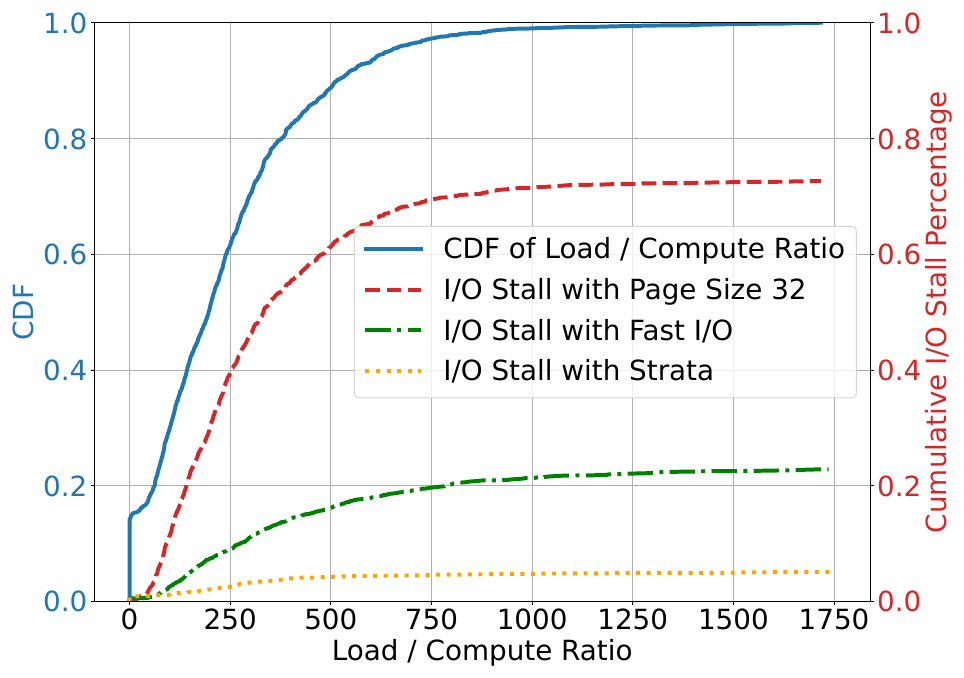

*Figure 1，PDF p.3（论文印刷页 2）。Qwen2.5-14B + LooGLE；x 轴是每批加载 Token 数/新输入 Token 数。图中的 74% 和 24% 是作者对曲线最高停顿比例的概括，不是整个工作负载的平均值。*

第一个明显解法是放大页，让每次 DMA 更大。Figure 2 证明这条路径会伤害缓存语义：Mistral-24B + ShareGPT 上，page size 从 1 增到 512 Token 时，命中率下降，平均 TTFT 和 P90 TTFT 在最大页下最高增加约 2× 和 2.9×。这不是参数没调好，而是页粒度同时承担“匹配单元”和“传输单元”造成的结构性冲突。

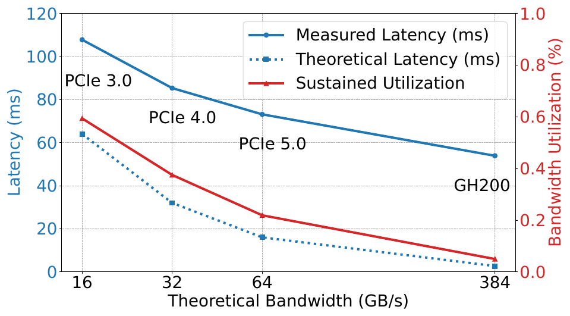

*Figure 3，PDF p.5（论文印刷页 4）。Llama-3.1-8B、8192 Token、page size 32。【实测数据】PCIe 5.0 约为理论带宽的 22%，GH200 约降至 5%。*

这张图给出了论文最重要的设计不变量：当单次操作太小、提交延时又不能忽略时，增加物理带宽不会按比例转化为有效带宽。甚至物理带宽越高，软件小操作开销占比越大。对本项目而言，这比“选更快网卡或 SSD”更值得重视：如果描述符编译、批量提交和设备端散聚执行没打通，更快硬件只会放大软件利用率的短板。

第二个明显解法是在 Prefill 中逐层重叠加载。它只在每层计算时间不小于下一层加载时间时有效。长缓存前缀配少量新 Token 恰好破坏了这个条件：加载数据多，可掩盖计算少。这也解释了为什么 Strata 不只做 I/O，还要改调度器。

---

# 3. 核心抽象与系统设计

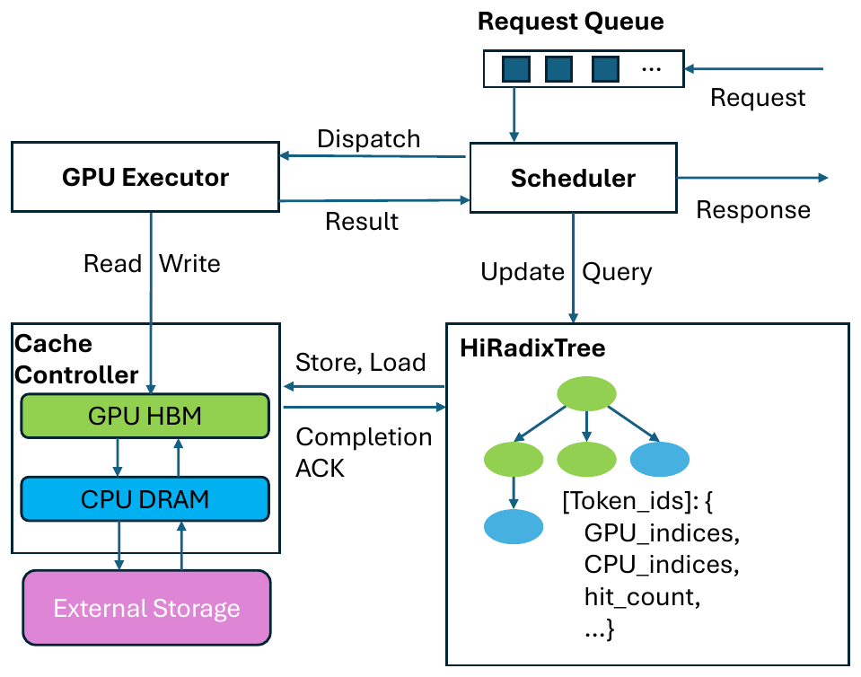

*Figure 4，PDF p.5（论文印刷页 4）。HiRadixTree 不只查前缀，还保存 GPU/CPU 页位置、命中范围和瞬态生成状态，是控制面和数据面交汇的元数据支点。*

Strata 的系统设计可以用一条控制流和一条数据流理解。

**控制流**：请求进入等待队列后，调度器在当前批次运行期间读取 HiRadixTree，估计候选请求的加载量、计算量和前缀状态，生成下一批。它同时把执行批次发给 GPU Executor，把 KV 加载命令发给 Cache Controller。

**数据流**：Cache Controller 在 GPU HBM、CPU DRAM 和外部存储间搬运、预取、回写和逐出 KV 页。GPU Executor 通过 CUDA event 在每层计算前等待该层 KV 可用。论文的执行模式是 Prefill/Decode 同置：两种批次在同一 GPU 上分时执行，Prefill 完成后合并进持续批处理的 Decode 批次。

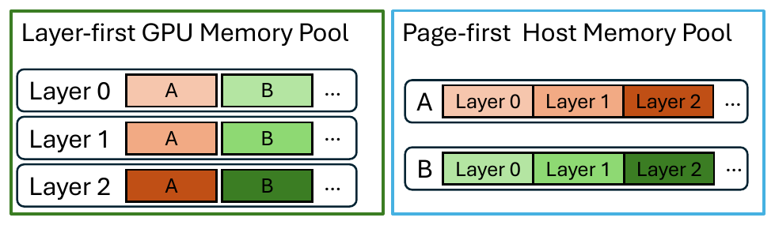

*Figure 6，PDF p.7（论文印刷页 6）。布局解耦的意义是：不再要求所有存储层使用同一种物理排布。*

Strata 的核心不变量有两个。第一，GPU 辅助 I/O 只有在提交并发度和小块聚合收益大于 SM 干扰时才成立。Figure 5 是直接证据。第二，平衡组批和气泡填充依赖“加载和被插入的工作不会完全争用同一个瓶颈”。在论文环境中，CPU–GPU 加载主要占用 PCIe，Decode 主要占用 HBM 带宽；在其他 GPU/NPU 拓扑中，这个资源分离关系必须重新测量。

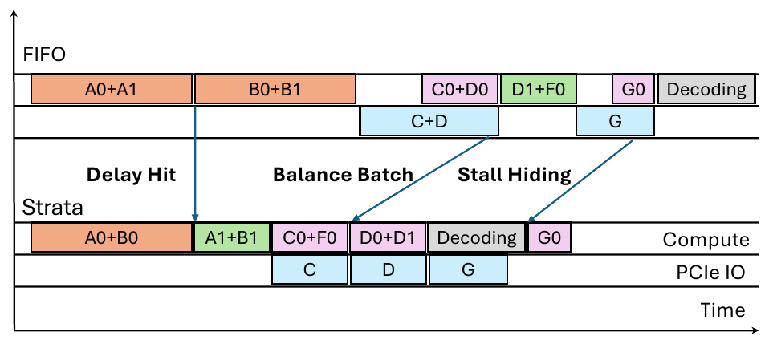

*Figure 7，PDF p.7（论文印刷页 6）。橙色是缓存 miss 的 Prefill，绿色是 GPU 命中，紫色是主机内存命中，蓝色是数据传输，灰色是 Decode。*

另一个容易被过度解读的设计是 SSD 预取。论文的默认策略是 best-effort：发现存储层命中后，利用队列等待时间预取到主机内存；请求被真正选中执行时，取消未完成预取，使用当时已到达的数据。论文也支持等待完成和超时策略，但没有给出面向 SLO 的自适应选择器。因此预取是支撑机制，不应和四条核心优化方法并列。

---

# 4. 关键技术实现与作用机理

## 4.1 GPU 辅助碎片页搬运与跨层布局即时转换

### 解决的问题

基线用 PagedAttention 小页提高 HBM 利用率和前缀匹配粒度，却把一个逻辑 KV 页的各层数据分散到多个非连续区间。标准路径要为这些数 KB 区间反复调用 `cudaMemcpyAsync`，每次都承担 CPU–GPU 通信、驱动调度和队列开销。扩大页能提高单次传输大小，但会把前缀匹配粒度一起放大，造成命中率和 TTFT 退化。

### 核心方法

用 GPU kernel 内的大量线程并行搬运离散小块，并在地址计算中完成不同存储层之间的布局转换。

### 实现路径

1. Cache Controller 根据 HiRadixTree 获得源端和目标端的 KV 页位置。
2. 它启动少量大 CUDA block。每个线程读取一小段 GPU 全局内存或已注册的 CPU pinned memory，经过寄存器写入目标。
3. 线程根据逻辑 Token、层号和偏移计算目标地址，把 page-first 和 layer-first 在搬运中互转。
4. kernel 使用 bypass cache 指令减轻缓存污染，并用少量 block 诱导硬件调度器把 I/O kernel 限制在少量 SM 上。
5. Prefill 在计算每层前等待对应 CUDA event，实现逐层可用性同步。

### 资源 / 状态变化

`CPU 发起大量小 DMA + 各层共用同一布局`  
→ `GPU 线程并行聚合小块 + 搬运中地址重排`  
→ `GPU 保留 layer-first，主机/SSD 使用 page-first`

### 为什么有效

该方法同时改变 Little's Law 里的并发度 `C` 和有效传输大小 `S`，又没把缓存匹配页强行放大。布局转换每线程只增加一次偏移计算，不需要另外启动整块转置。

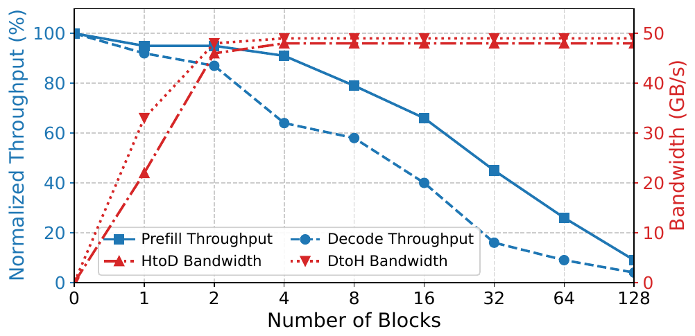

*Figure 5，PDF p.6（论文印刷页 5）。它直接检查“用 GPU 搬数据会不会伤害前台计算”，是比端到端加速更接近机制的证据。*

### 达到的优化效果

**直接效果**

【实测数据】H200 上 2 个 1024-thread block 可达 48 GB/s，Prefill 吞吐损失小于 5%，Decode 损失小于 10%。论文因而把 CPU→GPU 默认设为 2 blocks，GPU→CPU 后台回写设为 1 block。

**端到端效果**

【实测数据】DeepSeek-V3、8×H20、page size 32、12 req/s 的磁盘分层实验中，page-first 布局把平均 TTFT 从 5.03 s 降到 2.42 s，输出吞吐从 27.43 增到 36.41 Token/s（Figure 13）。该结果支持布局解耦对 SSD 路径也有效，但不能代表所有磁盘和排队条件。

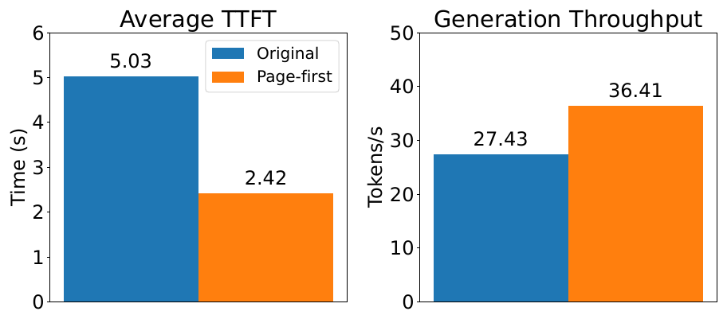

*Figure 13，PDF p.13（论文印刷页 12）。*

### 论文证据

Figure 3 证明小页传输带宽利用率低；Figure 5 给出带宽—干扰折中；Figure 9 中 Strata-IO 相对 SGLang-HiCache 最高提升 2.3× 峰值吞吐；Figure 10 显示 SGLang-HiCache 即使把 page size 调到其最优的 512，峰值吞吐仍只有 Strata-IO 的 93%，同时命中率低 2.4%。

### 亮点

这项设计没有试图用一个全局页大小兼顾所有介质，而是允许各层使用适合自己的布局，在数据移动时转换。这个原则比 CUDA kernel 本身更值得迁移。

### 代价与局限

GPU I/O kernel 使用 SM、寄存器和执行周期，还可能污染缓存。作者给出的 2-block 配额依赖 H200、模型和并发核函数，不是固定常数。CUDA 12.8 的 `cudaMemcpyBatchAsync` 在同一微基准中为 38 GB/s，低于 Strata 的 48 GB/s，但它使用 DMA 而不争用 SM，可能更适合非关键回写路径。论文称布局转换“几乎免费”，但没有单独报告转换指令的消融；Figure 13 是整体布局对照，仍可能包含传输连续性带来的其他收益。

### 对项目的意义

**ADAPT**。本项目应迁移“逻辑缓存块与物理传输区间解耦”和“设备端聚合/转换”原则，但不能直接照搬 CUDA kernel。项目的主路径是 DescriptorCompiler（描述符编译器，将离散物理块合并成硬件散聚描述符）+ KPCL 批量提交 + NPU/网卡/SSD DMA，还要满足 Host CPU 零数据拷贝。只有当 NPU 设备 kernel 路径在带宽、干扰和完成语义上胜过硬件 DMA 散聚路径时，才应把它作为条件加速轨。

## 4.2 瞬态前缀状态驱动的延迟命中规避

### 解决的问题

当多个请求在很短时间内查询同一长前缀，首个请求的缓存还没发布，后续请求就会被当作 miss。异步调度器会提前准备下一批，把 miss 解析窗口拉长到整个当前批次的执行时间。上下文越长，重算代价和这个窗口都越大。

### 核心方法

在前缀索引中显式记录“已入队、尚未执行”和“正在计算、尚未发布”状态，对长前缀同源请求做有界延迟。

### 实现路径

1. 调度器扫描队列时，为未见过的新前缀插入 `in-queue` 瞬态节点。
2. 请求开始执行后，对应节点改为 `in-flight`。
3. 后续请求如果在瞬态节点上匹配的 Token 数超过阈值，则暂缓到下一轮，但放到队首。论文默认阈值是 100 Token。
4. 原请求完成后，瞬态节点转为指向实际 KV 页的普通节点，等待请求在下一轮真正命中。

### 资源 / 状态变化

`未发布前缀 = 索引中不存在`  
→ `未发布前缀 = 可见的 in-queue / in-flight 状态`  
→ `后续请求有界等待即将可用的缓存`

### 为什么有效

它不是提高查询速度，而是改变查询可见的状态空间。原来的 miss 实际上混合了“真的没有”和“很快就有”；瞬态节点把二者分开，让调度器在重算与短暂等待之间做正确选择。

### 达到的优化效果

**直接效果**

避免同前缀长 Prefill 重复执行，提高实际可消费缓存的命中率。

**端到端效果**

【实测数据】最小缓存距离工作负载中峰值吞吐提高 42%；最大缓存距离中没有收益。这个边界非常重要：机制只在相同前缀的到达时间足够接近时成立。

### 论文证据

Mooncake Tool-Agent trace 统计显示，38% 请求与 1 秒内到达的至少一个其他请求共享至少 6K Token 前缀，不含 system prompt。Figure 11 检查不同缓存距离下的收益；Figure 12 用无限缓存的 trace 模拟显示，cache resolve time 越长、请求到达率越高，延迟命中造成的 miss 越多。Figure 12 是模拟证据，不是硬件端到端实测。

### 亮点

这个机制把缓存发布过程中的中间状态暴露给调度器，使“即将可复用”成为一等调度信息。这是语义改进，不依赖 GPU I/O 的具体实现。

### 代价与局限

延迟会改变请求顺序，且可能让某个请求的 TTFT 变差。论文用队首排队和匹配阈值减少该风险，但没有报告 P99 公平性或每请求 SLO 违约率。100 Token 阈值也未做系统敏感性分析。另一个可能解释是，收益一部分来自请求重排改善局部性，不全是消除 delay hit；Figure 11 的最大距离对照削弱了这种解释，但未给出完全独立的请求顺序对照。

### 对项目的意义

**DIRECTLY ADOPT**。本项目应直接采用“生产中/发布中前缀对调度器可见”的状态语义，并把它纳入对象发布顺序、Ready 就绪位和请求剩余时限。不应照搬 HiRadixTree 数据结构；项目已选择前缀目录和显式对象生命周期，需要复用的是状态契约。

## 4.3 带宽感知的加载—计算平衡组批与同前缀合批

### 解决的问题

FIFO 组批只保证到达顺序和批次容量，并不保证批次中的加载量能被新 Token 计算掩盖。两个主机内存长前缀命中被放在同一批，可能让批次完全受 PCIe 限制。

### 核心方法

用批次聚合加载量/计算量设定 loading-bound 边界，先选不越界的请求，并把使用同一上下文的请求尽量放在同一批。

### 实现路径

1. 首先移除会造成延迟命中的候选请求。
2. 从队首请求开始构建批次，从 HiRadixTree 取得每个请求的加载量和 Prefill 计算量。
3. 每次尝试加入候选请求。如果聚合比值超过 loading-bound 阈值，就先放到降低优先级列表；否则加入批次。
4. 某请求入批后，立即搜索能与它共享上下文的 bundle hit 请求，一并加入。
5. 如果扫完队列仍未填满，再按原始顺序补入降低优先级的请求；每轮仍从全局队首开始，减轻饥饿。

### 资源 / 状态变化

`FIFO 填满批次`  
→ `加载需求 + 可掩盖计算 + 共享前缀联合组批`  
→ `批次的传输时间更可能被计算掩盖`

### 为什么有效

它把 PCIe 带宽从“系统后台条件”提升为组批约束。bundle hit 又让同一上下文的请求共享 GPU 驻留数据，不必为每个请求保留独立副本或重复占用 HBM 读带宽。

### 达到的优化效果

**直接效果**

减少 loading-bound 批次数，同时减少同前缀请求在 GPU 上的重复容量和访存。

**端到端效果**

Figure 11 中，在已启用 I/O 和延迟命中处理的基础上，平衡组批对 shuffle 和最大缓存距离工作负载分别追加 11% 和 12% 峰值吞吐。

### 论文证据

Algorithm 1 给出完整组批程序。论文的默认加载/计算比阈值为 100，来自 Figure 1 中开始出现停顿的区域；作者明确说明该阈值依赖硬件和模型，可以独立 profile。

### 亮点

该方法不是简单地“命中优先”或“最长前缀优先”。它比较的是当前批次中加载和可掩盖计算的联合关系，因而能在低压和高压下做不同选择。

### 代价与局限

队列重排会影响单请求公平性。论文的“每批从队首开始”只能防止简单饥饿，不等于满足租户优先级、deadline 或 P99 SLO。加载/计算估计若忽略排队、布局转换、设备可见性和共享瓶颈，就会将请求错分到 loading-bound 或 compute-bound。

### 对项目的意义

**ADAPT**。该原理应并入 QueryPlan（查询与放置计划决策引擎，根据链路、负载和上下文选择加载或重算路径）和推理框架调度器，但成本项必须扩展为查询、授权、排队、传输、布局转换、目标可见、多卡等待和对前台任务的干扰。项目不应复制“比值 100”，而要用实际平台分桶校准，并与剩余请求时限联合判断。

## 4.4 跨资源气泡填充

### 解决的问题

平衡组批不能制造出本来不存在的计算。当一个批次的长前缀加载显著长于其 Prefill 计算时间，仍会留下 GPU 等待窗口。

### 核心方法

把原定下一个 Prefill 批次暂时延后，在其加载期间插入一个与该加载主要使用不同资源的 Decode 批次。

### 实现路径

1. 调度器根据已知加载量和可用计算识别不可完全掩盖的批次。
2. 先启动长上下文加载，不立即执行对应 Prefill。
3. 从已就绪的生成请求中选一个 Decode 批次，与加载并发。
4. 加载完成后，再执行原 Prefill 批次。论文说明，在 Prefill/Decode 分离架构中也可用其他 Prefill 批次填充，但没有给出相应实验。

### 资源 / 状态变化

`PCIe 加载等待 → GPU 空档`  
→ `PCIe 加载 ∥ 主要占用 HBM 的 Decode`  
→ `空档中完成有用生成工作`

### 为什么有效

论文环境中，主机到 GPU 加载主要压力在 PCIe，Decode 主要压力在 HBM 带宽。两者不完全竞争同一资源，所以具备重叠空间。

### 达到的优化效果

**直接效果**

转化一部分 GPU 空档为 Decode 计算，提高硬件时间利用率。

**端到端效果**

Figure 11 中，气泡填充对 shuffle 负载追加 8% 峰值吞吐，对最大缓存距离负载追加 3%。论文将较大差异归因于 shuffle 负载的时延方差更高。

### 论文证据

Figure 7 给出执行时序，Figure 11 给出累加消融。论文没有单独报告 PCIe、HBM、SM 和内存控制器的同时利用率，因而“资源争用很小”的机理解释仍缺少完整的硬件计数器证据。

### 亮点

这是一个很实用的调度视角：不只看“哪个请求先来”，而是看“当前被卡住的是哪种物理资源，还有哪种工作可以利用其他资源”。

### 代价与局限

不同 GPU/NPU 拓扑可能让传输和 Decode 共享 PCIe switch、HBM 控制器、cache 或执行单元，重叠后反而抬高 TPOT 尾时延。论文没有给出 P99 TPOT 和前后台混压证据。插入 Decode 还会推迟 Prefill，需要和 TTFT SLO 联合决策。

### 对项目的意义

**VALIDATE**。可以把“跨资源空档填充”作为 SemanticQoS（前后台服务质量保障策略，限制后台搬运对前台推理的干扰）和框架调度的候选策略，但在国产 NPU 上必须同时观测 TTFT、TPOT P99、互连带宽、HBM 带宽和执行单元占用。只有前台 TPOT 干扰始终低于项目门限时才能打开默认路径。

---

# 5. 实验到底证明了什么

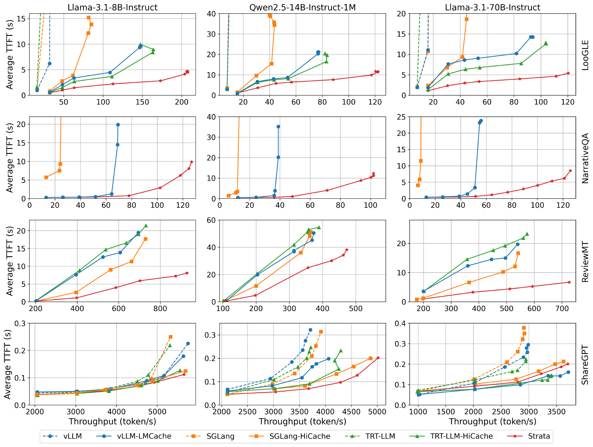

*Figure 8，PDF p.11（论文印刷页 10）。该图有多个子图，覆盖 LooGLE、预热 NarrativeQA、ReviewMT 和 ShareGPT，不能把不同面板中的最好数字合并成一个“通用加速比”。*

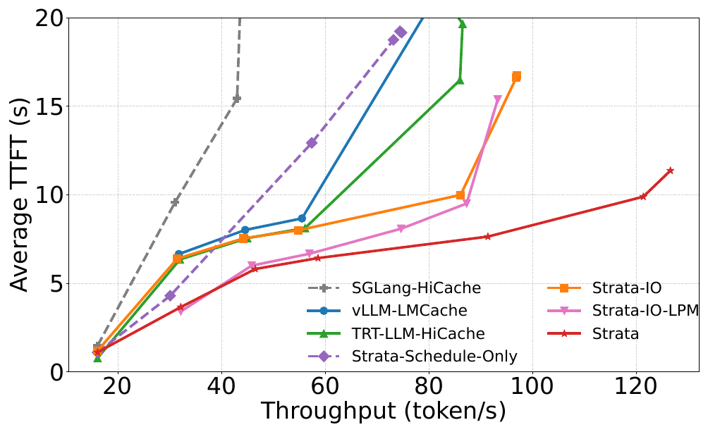

*Figure 9，PDF p.12（论文印刷页 11）。默认深入分析条件为 Qwen2.5-14B + LooGLE + H200。*

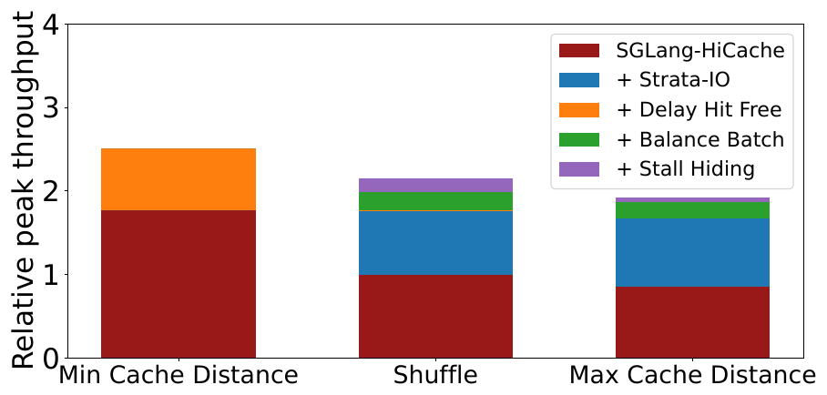

*Figure 11，PDF p.12（论文印刷页 11）。每层颜色是在前一变体上追加机制的结果，不是相互独立的倍数。*

| Claim | Experiment / Evidence | Conditions & Baseline | Result | What it proves | What it does not prove |
|---|---|---|---|---|---|
| 长上下文缓存恢复会变成前台瓶颈 | Figure 1 profile | Qwen2.5-14B，LooGLE，SGLang CPU offload；快速 I/O 和 Strata 作曲线对照 | 原始路径的 I/O stall 最高 74%；快速 I/O 后最高仍 24% | I/O 能压过 Prefill 计算，单独提速传输不足以消除停顿 | 不是所有请求的平均停顿率，也不证明所有模型都有同样比例 |
| 碎片化让更高带宽无法被使用 | Figure 3 | Llama-3.1-8B，8192 Token，page size 32，PCIe 3/4/5 与 GH200 | PCIe 5.0 约 22%；GH200 低至约 5% 理论带宽 | 软件操作粒度是物理带宽转化率的核心限制 | 不证明任意负载都应使用 GPU kernel，也不包含 NPU/网卡/SSD 路径 |
| GPU 辅助 I/O 在可控干扰下提高带宽 | Figure 5 微基准 | H200；Llama-3.1-8B Prefill 与 Decode 同 I/O kernel 并发；扫描 block 数 | 2 blocks 为 48 GB/s；Prefill 损失 <5%，Decode <10% | 默认配额在该平台上取得了带宽/干扰折中 | 微基准不等于复杂混压下的 P99 端到端干扰 |
| 端到端长上下文吞吐提高 | Figure 8 | H200；3 个模型；LooGLE/ReviewMT/NarrativeQA；多个层级缓存基线 | LooGLE 上相同平均 TTFT 的最大吞吐增益为 1.9×–5×，取决于模型和基线 | 完整 Strata 在测试范围内优于对比系统 | 不能区分每个子机制的单独贡献；不是 P99；基线引擎、页大小和内核不完全相同 |
| I/O 和调度都不是装饰性机制 | Figure 9 消融 | Qwen2.5-14B + LooGLE + H200；基于 SGLang-HiCache 逐项增加机制 | Schedule-only 最高 1.8×；Strata-IO 最高 2.3×峰值吞吐 | 两条主线各自改善端到端结果，高负载时 I/O 更易成为主瓶颈 | 两个倍数不能相乘；子机制未必然同等贡献 |
| 延迟命中、平衡组批和气泡填充的收益依赖负载 | Figure 11 | LooGLE 派生的 min/shuffle/max cache distance；累加机制 | min：delay-hit +42%；shuffle：I/O +76%、balance +11%、fill +8%；max：I/O +95%、balance +12%、fill +3% | 机制的适用范围不同，不应一律开启 | 累加柱状图不是独立、可相乘的消融 |
| page-first 布局对磁盘恢复有实际收益 | Figure 13 | DeepSeek-V3，8×H20，page32，12 req/s，H20-storage | TTFT 5.03→2.42 s；吞吐 27.43→36.41 Token/s | 布局解耦不只影响 CPU–GPU 路径 | 单一平台/速率不能代表所有 SSD 介质和混合读写负载 |
| 高带宽硬件仍需软件传输与调度配合 | Figure 14/15 | Llama-3.1-8B + LooGLE；H200 PCIe 与 GH200；Oracle 为无限 CPU–GPU 带宽模拟 | Strata-IO 持续带宽从 PCIe 约 40.30 GB/s 增至 GH200 约 150.50 GB/s；Strata-GH 接近 Oracle | 高带宽只有被高效 I/O 和调度共同利用才转化为应用收益 | Oracle 是模拟；跨平台对比包含拓扑和 CPU/GPU 差异，不是单一变量试验 |

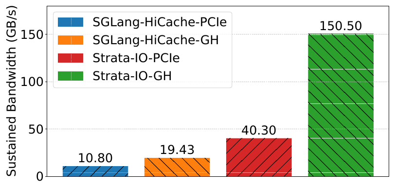

*Figure 15，PDF p.13（论文印刷页 12）。图中四个数值为 10.80、19.43、40.30 和 150.50 GB/s，对应 SGLang-HiCache-PCIe、SGLang-HiCache-GH、Strata-IO-PCIe 和 Strata-IO-GH。*

对中心结论进行反向检查后，还有四个边界需要保留。第一，Figure 8 中不同系统的引擎、内核和默认页大小不完全相同；Figure 9 的 SGLang 内消融更适合做因果归因。第二，长上下文请求到达时间主要由泊松分布生成，不是生产 trace；只有 Figure 12 使用 Mooncake Tool-Agent trace，且那是无限缓存的模拟执行。第三，作者声称 Strata 已部署在几家 AI 公司，但论文没有给出生产规模、稳态时长、故障率或生产流量结果。这只能标记为【作者声称】。第四，评测把平均 TTFT 和输出 Token 吞吐作为主指标，尚不能支持尾时延稳定性结论。

---

# 6. 论文的亮点与局限

## 6.1 跨层布局解耦

**亮点**

缓存匹配粒度、GPU 计算布局和存储传输布局本来就有不同目标。Strata 不再强迫三者共用一个物理排布，而是把转换嵌入传输过程。这个原理可以扩展到 CPU、SSD、远端内存和其他加速器。

**局限**

论文的高性能路径依赖 GPU 线程从 pinned host memory 中读写数据。它不等于本项目定义的 Payload Bypass DDR（绕过主机内存，正文直接在 NVMe SSD 与 NPU HBM 之间流转），也没有证明跨节点网络数据面。

## 6.2 带宽成为一等调度资源

**亮点**

论文没把“加载能否被掩盖”当成静态假设，而是在每个批次中估算。这让调度从仅看 GPU Token 预算和 HBM 容量，扩展为看计算—传输联合关系。

**局限**

成本模型主要是加载/计算比和 profile 阈值。它没有完整覆盖多租户优先级、请求 deadline、多路径共享入口、容量预留、失败回退和设备可见性。作者在 Discussion 中明确将 SLO 和公平性列为后续工作。

## 6.3 瞬态前缀状态

**亮点**

它抓住了异步缓存系统的一个实际空白：目录中“尚未可消费”不应只有 miss 一个状态。显式的生产中状态能够避免并发请求重复做昂贵工作。

**局限**

论文只讨论正常完成后将 transient node 转为普通节点，没有给出计算进程崩溃、发布半完成、重试、超时撤销和多副本冲突下的完整状态机。

## 6.4 跨资源重叠

**亮点**

气泡填充没有简单提高并发数，而是选择主瓶颈不同的任务重叠。这比“加更多 stream”更有可控性。

**局限**

论文没有给出足以封闭资源模型的硬件计数器分析，也没有混压 P99 TPOT。对共享 HBM、PCIe switch 或内存控制器的平台，同样策略可能带来更高尾时延。

---

# 7. 论文没有解决什么

1. **分布式缓存池的全局问题。** Strata 聚焦单计算实例内的内存管理和调度，明确表示可与 Mooncake/MemServe 等大规模解耦池集成，但没有设计跨节点目录一致性、副本选择、网络拥塞和故障域。
2. **可消费性和生命周期安全。** 论文用 CUDA event 保证本地逐层可用，但没有描述语义版本、租约、远端撤销、设备访问排空、半写隔离或持久化恢复。
3. **多卡和多实例原子动作。** 70B 模型使用 4 GPU 张量并行评测，但论文没有把多 rank 命中范围、加载完成和统一回退作为独立协议分析，也未报告最慢 rank 尾时延。
4. **面向业务 SLO 的公平调度。** 现有防饥饿机制不等于 deadline 和租户公平。论文没有给出 P99 TTFT、P99 TPOT 或请求违约率。
5. **真实慢存储层的统一调度。** SSD 实验只覆盖单一 H20-storage 配置，预取主要与排队时间重叠。作者也承认，尚未为慢存储预取预留可调度空间。
6. **混合注意力模型。** Strata 处理标准稠密注意力的精确 KV 缓存；稀疏、线性或混合注意力的状态布局和调度问题仍待解决。

---

# 8. 对本项目的启发

## DIRECTLY ADOPT

1. **把加载中的前缀显式建模。** 论文的 transient node 原理可直接落入项目对象生命周期：目录中区分“不存在”“生产/加载中”“已发布可消费”“失效待排空”。这能减少热前缀并发到达时的重复预计算。
2. **让传输需求成为框架调度的显式输入。** 只看缓存命中和 Token 数不够，还要把加载字节、预计带宽、排队、目标可见和可掩盖计算传给调度器。

## ADAPT

1. **把跨层布局解耦改造为描述符—设备执行路径。** 项目应保留各存储层自己的物理布局，由描述符编译器将逻辑块转为设备可执行的连续/散聚区间。若 NPU 内核转置有净收益，可作为条件路径；主路径仍以硬件 DMA 和 Host CPU 零数据拷贝为约束。
2. **将平衡组批并入 QueryPlan 而不是复制固定阈值。** 项目的判定应为“拉取与加载总开销 < 本地直接重算耗时，且加载后能满足请求时限”；加载/计算比是其中一个输入，不是唯一准入条件。
3. **将同前缀合批扩展到多实例/多卡。** 单卡 bundle hit 能减少 HBM 重复驻留，但项目还需要考虑副本位置、接收端入口、各 rank 安全连续前缀和最慢子流。

## DO NOT COPY

1. **不要把 1 TB pinned CPU DRAM 缓存作为默认项目架构。** 这是论文的实验配置，不是必然的分层路径。本项目的 DDR 是条件角色，主路径还要验证 NVMe SSD–NPU HBM 直达以及跨节点 HBM/DDR 候选。
2. **不要把 GPU-assisted I/O 等同于 Host CPU 零数据拷贝或绕过 DDR。** 论文路径使用 CPU registered pinned memory，虽然数据搬运由 GPU 线程完成，但正文仍经过 Host DRAM。
3. **不要沿用只靠队首轮转的公平性保障。** 项目需要 deadline、租户、前台/后台类别和最低后台进度，不能只用“最终会轮到”作为服务质量答案。

## VALIDATE

1. **NPU 设备端聚合与布局转换。** 直接对照 CPU 逐段提交、KPCL 硬件散聚 DMA、NPU kernel 搬运三条路径，同时测有效带宽、提交开销、NPU 执行资源和前台 TPOT 干扰。
2. **同前缀到达分布。** 使用项目真实请求 trace 测量 100 ms/1 s/5 s 窗口内的长前缀重合率，决定是否开发延迟命中机制，以及等待阈值。
3. **跨资源气泡填充。** 在网络、SSD、PCIe/NPU 互联和 HBM 同时受压的情况下检查前台 TTFT/TPOT P99，不能只看总 Token/s。

---

# 9. 对本项目立项的背书

## 9.1 Problem Validation

【项目解读】论文用多类硬件实测独立确认了项目需要解决的两个问题。一是层级缓存容量命中可以因碎片化搬运而变成 TTFT 瓶颈；二是高带宽硬件不会自动被上层软件用好。Figure 1/3/15 的证据类别是硬件实测与 profile，适用范围是 NVIDIA GPU 的 CPU–GPU 层级路径。它们支持项目继续建设描述符编译、批量提交、布局转换和动态决策，但不能直接外推到国产 NPU 数值。

## 9.2 Mechanism Validation

【项目解读】论文为三个项目方向提供了外部技术证据。

- **跨层布局和传输解耦可行。** 共享原理是逻辑 KV 块不必与各介质的物理排布一致，可在数据路径中使用地址计算或硬件散聚表转换。Figure 5/10/13 分别给出微基准、页大小敏感性和磁盘端到端支持。
- **加载和计算必须联合决策。** 共享原理是命中价值由“节省的重算”与“加载、等待和干扰”的相对大小决定。Figure 9/11 表明只改 I/O 或只改调度都有收益，组合后更稳定。这与 QueryPlan 的净收益准入原则同向。
- **中间状态可以减少重复工作。** 共享原理是把未完成但即将可用的对象状态暴露给调度器。这支持项目将生产、发布、加载和可消费状态明确分开。

## 9.3 Research-Gap Validation

【项目解读】只有与项目预定目标相交的未解问题才能作为差异化依据。本文中有四项直接相交：

1. Strata 没有跨节点统一副本、拓扑、路径和故障域；本项目要做多节点 HBM/DDR/NVMe SSD 统一存储与调度。
2. Strata 没有 Host CPU 零数据拷贝、NVMe SSD–NPU HBM 直达和远端直读的统一契约；本项目把这些作为主数据路径和条件路径。
3. Strata 没有多维度语义一致性、租约撤销、多卡统一消费/回退和故障恢复；本项目明确要解决这些生产安全问题。
4. Strata 没有以前后台混压下的 P99 TTFT/TPOT 作为门禁；本项目 E3 明确要求同时对账 TTFT、QPS 和前台 TPOT 干扰。

## 9.4 Unsupported Project Claims

【待验证】论文并不验证以下项目主张：

- 国产 NPU 、URMA（通用远程直接内存访问，用户态高性能 RDMA 驱动与通信协议）或 UBMEM（统一总线内存直通共享协议，支持跨节点和异构设备的内存地址空间共享）下的有效带宽与完成语义。
- Host CPU 正文数据触碰字节严格为 0，或数据绕过 Host DDR。
- Direct-View 相对 Copy-to-HBM（拷贝到本地显存，通过 DMA 把远端 KV 完整搬运到本地 HBM）的适用边界和故障撤销安全。
- TP=4/8 多卡的共同安全前缀、状态同步耗时和集合通信死锁规避。
- 实现本项目 E3 目标：两节点混压下 TTFT 降低至少 20%、QPS 提升至少 10%，且相对同一增强包纯前台的 TPOT 干扰低于 3%。这些是项目目标，不是论文结果。

## 9.5 Project Establishment Verdict

- **Necessity evidence**：分层缓存的真正瓶颈可以从容量转移到数据搬运和调度；论文的 profile、跨平台带宽实测和端到端对照支持本项目不能只做大容量池。
- **Feasibility evidence**：设备侧聚合小块、按介质拆分布局、显式估计加载/计算关系和跟踪生产中前缀，都在可运行系统上获得了机制级或端到端证据。
- **Differentiation evidence**：跨节点异构介质、Host CPU 零数据拷贝、完整消费语义、多卡一致动作、故障回退和混压尾时延仍未被 Strata 解决，与本项目范围重合。
- **Remaining burden of proof**：本项目仍需在目标 NPU、网络和 SSD 上完成 E0–E3 实测，并用真实可消费事件而不是提交完成事件界定路径完成。

---

# 10. 建议验证

## Experiment 1: 国产 NPU 上的碎片页聚合与布局转换路径对照

- **Hypothesis**：在保留小 KV 块粒度时，KPCL 散聚 DMA 或 NPU 设备 kernel 能比 CPU 逐段提交获得更高有效带宽，且前台干扰可控。
- **Variable**：逻辑块大小、extent 数、连续度、并发数、路径（逐段/SG DMA/NPU kernel）、布局转换开关。
- **Baseline**：同一源目标、同一字节量的 CPU 逐段异步提交。
- **Metric**：有效 GB/s、提交到目标设备可消费时间 P50/P95/P99、描述符数、Host Payload Touch Bytes、NPU 核心占用、前台 TTFT/TPOT 干扰。
- **Controlled conditions**：固定模型/布局、NUMA、频率、注册内存、后台负载、预热和目标可见性定义。
- **Pass condition**：至少一条设备路径在项目代表性区间分布下有效带宽达物理线速 80% 目标，Host Payload Touch Bytes 为 0，且前台 TPOT 干扰低于 3%。
- **Fail implication**：若 NPU kernel 不如 SG DMA，移除默认 kernel 搬运路径；若两者都不能吃满带宽，回到描述符粒度、硬件队列和布局分解重新设计。
- **Decision affected**：数据面主路径选型，以及 NPU 设备 kernel 是默认路径还是条件加速轨。

## Experiment 2: 延迟命中发生条件与等待准入

- **Hypothesis**：业务流量中存在足够多的同前缀短间隔到达，显式生产中状态和有界延迟能减少重算，且不会破坏 P99 TTFT。
- **Variable**：前缀长度阈值、到达窗口、cache resolve time、等待上限、请求优先级、本地重算代价。
- **Baseline**：不暴露生产中状态的异步调度，后续请求按 miss 执行。
- **Metric**：重复 Prefill Token、有效命中率、平均/P99 TTFT、有效 QPS、超时和饥饿数。
- **Controlled conditions**：固定模型、并发、计算实例数、缓存容量和到达 trace；使用同一份原始 trace 回放。
- **Pass condition**：代表性高重用负载中重复 Prefill 显著下降，有效 QPS 提高，且各优先级组的 P99 TTFT 不超过冻结 SLO。
- **Fail implication**：若真实同前缀时间局部性不足，仅保留状态正确性，不实现复杂延迟策略；若尾时延恶化，引入 deadline 和重算上界。
- **Decision affected**：前缀目录是否扩展生产中状态，以及框架调度器的等待策略。

## Experiment 3: 加载—计算平衡组批的成本模型校准

- **Hypothesis**：把排队、加载、转换、可见性、多卡等待和重算统一纳入成本模型，能比 FIFO 和固定比值阈值获得更高的有效 QPS。
- **Variable**：路径、块大小/数量、前缀复用率、批次 Token budget、网络/SSD 队列、计算排队、成本模型版本。
- **Baseline**：FIFO；固定加载/计算阈值；只看最长前缀的策略。
- **Metric**：选路误差、错误加载率、放弃复用率、有效 QPS、TTFT P50/P95/P99、公平性和策略耗时 P99。
- **Controlled conditions**：同一请求 trace、同一资源额度、同一后台负载；记录实际完成路径而不是预测路径。
- **Pass condition**：策略 P99 满足项目预算，错误加载低于冻结门限，有效 QPS 优于基线，且没有牺牲高优先级请求 P99。
- **Fail implication**：若复杂模型没有超过简单阈值，保留可解释分桶模型；若错误主要来自即时拥塞，加强信用和反压而不是加大预测模型。
- **Decision affected**：QueryPlan 的成本项、阈值、校准周期和框架调度接口。

## Experiment 4: 跨资源气泡填充与 E3 混压门禁

- **Hypothesis**：只有当被插入工作与前台加载的主瓶颈确实分离时，气泡填充才能提高吞吐而不恶化 TPOT 尾时延。
- **Variable**：填充任务类型（Decode/Prefill/后台 I/O）、互联带宽、HBM 压力、网络 Incast（多对一突发拥塞，多个发送端同时压向一个接收端）、SSD 读写混合比、QoS 等级。
- **Baseline**：不填充；固定 Prefill-first；无资源分类的并发执行。
- **Metric**：TTFT/QPS/TPOT P50/P95/P99、有效 QPS、各物理链路带宽、NPU 执行单元与 HBM 利用率、后台进度、超时数。
- **Controlled conditions**：两节点相同模型和资源额度，同一请求 trace，同等后台压力，分开报告纯前台和混压。
- **Pass condition**：增强版对原生 Mooncake 在混压下 TTFT 降低至少 20%、QPS 提升至少 10%，且相对同一增强包纯前台的 TPOT 干扰低于 3%。
- **Fail implication**：如果吞吐提升伴随 TPOT 越界，禁止默认填充，只在能力表和即时信用允许的白名单路径上启用。
- **Decision affected**：SemanticQoS 策略、框架批次优先级和 E3 系统准出。

---

# Appendix

## A. 评测配置摘要

| 类别 | 论文配置 |
|---|---|
| H200 | 8×NVIDIA H200，Intel Sapphire Rapids，1.6 TB DRAM；每 GPU 一条 PCIe 5.0 x16，单向峰值 64 GB/s |
| H20-storage | 8×NVIDIA H20，Intel P5510 NVMe，磁盘读带宽最高 7 GB/s |
| GH200 | NVIDIA H100 + Grace 64-core ARM CPU，464 GB LPDDR5X，CPU 内存单向峰值 384 GB/s |
| 模型 | Llama-3.1-8B-Instruct、Qwen2.5-14B-Instruct-1M、Llama-3.1-70B-Instruct；70B 用 4 GPU 张量并行 |
| 长上下文数据集 | LooGLE、NarrativeQA、ReviewMT |
| 短上下文数据集 | ShareGPT；该实验把 GPU 缓存限制在约 500K Token，以显示分层缓存行为 |
| 到达模型 | 数据集没有时间戳，因此主要使用泊松分布模拟；最大在途请求 128 |
| 内存 | 使用 CPU 缓存的配置分配 1 TB pinned DRAM；GH200 因平台限制为 400 GB |
| 基线 | vLLM 0.8.5 + LMCache 0.2.1；TensorRT-LLM 0.17.0；SGLang 0.4.5；Strata 和 SGLang page size 1，SGLang-HiCache/vLLM/TRT 分层基线主要为 page size 32 |

## B. 证据类别与定量结论边界

| 结论 | 证据类别 | 边界 |
|---|---|---|
| 74%/24% Prefill I/O stall | 实测 profile，Figure 1 | 曲线最高值，不是全负载平均 |
| PCIe 5.0 22% / GH200 5% 带宽利用率 | 硬件微基准，Figure 3 | 8192 Token、page32、Llama-3.1-8B |
| 48 GB/s 与 <5%/<10% 干扰 | 硬件微基准，Figure 5 | H200、指定 Prefill/Decode 并发配置 |
| 1.9×–5× 长上下文吞吐收益 | 端到端实测，Figure 8 | 只能按模型、数据集、基线和相同平均 TTFT 条件引用 |
| delay hit 收益 | trace 统计 + 端到端消融 + 模拟，Figure 11/12 | 42% 是 min cache distance 特定负载；Figure 12 不是硬件实测 |
| 布局解耦的磁盘收益 | 端到端实测，Figure 13 | DeepSeek-V3、8×H20、12 req/s、page32 |
| “已在生产部署” | 作者声称 | 无生产规模、运行周期、故障和尾时延数据 |

## C. 内部一致性与可复现性审计

1. **基线参数不完全一致。** Strata/SGLang 用 page size 1，SGLang-HiCache、vLLM-LMCache 和 TensorRT-LLM-HiCache 主要用 page size 32；后三者的引擎和内核也不同。Figure 10 说明单纯调大 SGLang-HiCache 页不能追平 Strata-IO，但不能完全消除 Figure 8 跨引擎对照的混杂因素。
2. **消融值不可相加或相乘。** Figure 9 是不同完整变体的吞吐—时延曲线；Figure 11 是按固定次序逐项加入机制。各数字不是独立效应。
3. **“布局转换几乎免费”的证据不完整。** 论文给出了地址计算很轻的实现解释，但未报告只开/关地址重排指令的微基准。现有结果证明完整布局方案有效，不足以精确分离单条指令的成本。
4. **“端到端整体干扰低于 5%”需更细条件。** Figure 5 中默认 2 blocks 时，Prefill 损失小于 5%，Decode 损失小于 10%；正文随后称端到端影响低于 5%，但没有单独图表给出该端到端干扰对照。这不推翻机制收益，但影响干扰上限的可复现性。
5. **完成语义未充分展开。** 论文用 CUDA event 保证层数据可用，但对主机页注册失效、取消后迟到写、进程故障和存储持久化完成没有给出状态机。这主要限制生产可迁移性，不影响论文在正常执行路径上的性能结论。

## D. 图表索引

| 报告内图 | 原论文图 | PDF 页 | 用途 |
|---|---:|---:|---|
| `fig01_io_stall_profile.png` | Figure 1 | 3 | 中心问题：加载/计算比与 I/O stall |
| `fig03_bandwidth_utilization.png` | Figure 3 | 5 | 设计不变量：碎片化限制带宽转化率 |
| `fig04_system_architecture.png` | Figure 4 | 5 | 调度器、执行器、缓存控制器和层级存储的边界 |
| `fig05_io_kernel_interference.png` | Figure 5 | 6 | GPU I/O kernel 的带宽/干扰折中 |
| `fig06_layout_decoupling.png` | Figure 6 | 7 | layer-first/page-first 跨层布局解耦 |
| `fig07_scheduling_policies.png` | Figure 7 | 7 | 三种调度动作的执行时序 |
| `fig08_end_to_end_h200.png` | Figure 8 | 11 | H200 多模型/多数据集端到端对照 |
| `fig09_io_scheduler_ablation.png` | Figure 9 | 12 | I/O 和调度两条主线的消融 |
| `fig11_attribution_cache_distance.png` | Figure 11 | 12 | 子机制收益与缓存距离的关系 |
| `fig13_disk_layout_e2e.png` | Figure 13 | 13 | 布局解耦在 SSD 分层中的端到端结果 |
| `fig15_platform_bandwidth.png` | Figure 15 | 13 | PCIe/GH200 平台上的持续带宽 |
