# Strata：面向长上下文推理的分层上下文缓存与缓存资源感知调度

> 论文：*Strata: Hierarchical Context Caching for Long Context Language Model Serving*  
> 作者：Zhiqiang Xie、Ziyi Xu、Mark Zhao、Yuwei An、Vikram Sharma Mailthody、Scott Mahlke、Michael Garland、Christos Kozyrakis  
> 会议：20th USENIX Symposium on Operating Systems Design and Implementation（OSDI 2026）  
> 原始论文：[`[OSDI 2026] Strata Hierarchical Context Caching for Long Context Language Model Serving.pdf`](<[OSDI 2026] Strata Hierarchical Context Caching for Long Context Language Model Serving.pdf>)  
> 分析范围：论文原文，以及用于项目映射的当前受控架构文档。未引用任何既有 Strata 解构报告。

## 证据口径与范围

- **论文事实（PAPER FACT）**：论文明确描述的设计、配置或实验条件。
- **实测数据（MEASURED DATA）**：论文在给定平台和负载下报告的测量结果。
- **论文作者声称（AUTHOR CLAIM）**：论文作出的结论，但文中没有给出足够的配置、数据或可复现实验来独立核验。
- **分析推断（ANALYTICAL INFERENCE）**：根据机制、实验与系统约束得到的推断，不等同于论文原话。
- **项目解释 / 建议（PROJECT INTERPRETATION / RECOMMENDATION）**：面向本项目的迁移判断或验证建议，不属于论文结论。
- **项目目标（PROJECT TARGET）**：本项目当前受控方案中的验收目标，不是论文已经达到的结果。

本文首次使用 **KVCache（大模型注意力键值缓存，即自回归生成过程中保存历史 Key 与 Value 激活状态，用于避免后续 Token 重复计算注意力）**。论文中的 `context caching` 指跨请求复用共同前缀对应的 KVCache。

# 1. 一页读懂论文

## 1.1 论文解决什么问题？

Strata 解决的是长上下文推理采用 GPU HBM、Host DRAM 和 SSD 分层缓存后，缓存虽然“命中”，但加载路径仍可能拖慢推理的问题。长前缀被拆成许多离散小页后，传统 DMA 拷贝难以利用高速互联带宽；同时，现有调度器通常默认 KVCache 加载可以被 Prefill 计算掩盖，也无法识别“首个未命中尚未完成、后续同前缀请求已经到达”的延迟命中。结果是缓存加载阻塞 Prefill、同一长前缀被重复计算，吞吐量和 **TTFT（Time To First Token，首字生成延迟）** 同时恶化。

## 1.2 根因是什么？

可见症状是 I/O stall 和重复 Prefill。更深一层的根因有两个。

第一，计算布局、缓存匹配粒度与传输粒度彼此冲突。小页有利于减少显存碎片并提高前缀匹配命中率，但一个逻辑页在 layer-first 布局下会分散为跨层小片段。逐片调用 `cudaMemcpyAsync` 时，单次传输太小，CPU 提交并发度和驱动队列也不足以撑满 PCIe 或 NVLink。

第二，缓存层级中的带宽、加载时间和“缓存正在生成”状态没有成为调度器的一等输入。FIFO 或只看最长前缀的调度策略无法判断本批次会不会加载受限，也无法让后续同前缀请求等待即将完成的缓存。

## 1.3 核心洞察是什么？

GPU 本身可以用大量轻量线程并行搬运离散小块，并在搬运时计算目标地址，因此系统不必通过增大 KV 页来换取传输效率。与此同时，调度器如果能够看到前缀缓存的瞬态状态、加载量和 Prefill 计算量，就可以避开重复计算，并主动把加载与可并行计算配对。

Strata 因而同时改造两条路径。数据面把小页并发搬运及布局转换放进 GPU 内核，控制面则把缓存状态和 CPU—GPU 带宽纳入批次编排。

## 1.4 核心抽象是什么？

Strata 的关键抽象是“带缓存生命周期状态和资源需求的前缀树”。它把 SGLang 的 RadixTree 扩展为 HiRadixTree：普通节点记录 GPU/CPU 中的页位置和命中信息，瞬态节点则记录某段前缀处于 `in-queue` 或 `in-flight`。调度器读取该树，估算每个候选请求的加载量、计算量和缓存可用时机；缓存控制器据此执行分层加载、备份和淘汰。

这个抽象使控制面能区分“真正未命中”和“即将完成、现在暂不可用”的缓存，也使批次形成从单纯的 Token/显存预算问题变成加载带宽与计算资源的联合预算问题。

## 1.5 关键优化方法速览

### 方法 1：GPU 辅助的小页搬运与跨层布局即时转换

- **问题**：细粒度 KV 页在 layer-first 布局下形成大量小传输，传统 DMA 调用无法充分利用高速互联；直接增大页又会降低命中率。
- **方法**：用少量大 CUDA block 启动数千线程，每个线程搬运约 128 B 小块，并在地址计算中完成 layer-first 与 page-first 之间的转换。
- **效果**：保持小页匹配粒度的同时提高 CPU—GPU 传输并发度，并允许 GPU 使用计算友好布局、Host/SSD 使用传输友好布局。
- **关键证据**：H200 微基准中，2 个 `1024-thread` block 达到 48 GB/s；论文报告 Prefill 性能下降小于 5%，Decode 下降 10%（论文 Fig.5，印刷页 5）。

### 方法 2：基于瞬态前缀状态的延迟命中规避

- **问题**：首个长前缀未命中仍在计算时，后续同前缀请求会被再次当成未命中，产生重复 Prefill。
- **方法**：在 HiRadixTree 中插入 `in-queue` / `in-flight` 瞬态节点；匹配超过阈值的请求暂缓一轮并移到队首，等待缓存转为可用。
- **效果**：把潜在的重复计算转成短暂排队，提高有效缓存命中率。
- **关键证据**：最小缓存距离工作负载中，论文把 42% 的峰值吞吐提升归因于延迟命中规避（Fig.11，印刷页 11）。

### 方法 3：加载—计算平衡组批与同前缀合批

- **问题**：FIFO 可能把多个大缓存加载请求放入同一批次，使加载时间超过可用于掩盖它的 Prefill 计算时间。
- **方法**：调度器累计候选请求“从 Host 加载的 Token 数 / 新输入 Token 数”；超过加载受限阈值的请求暂时降级，同时优先加入可共享上下文的请求形成 bundle hit。
- **效果**：让更多 CPU—GPU 加载与 Prefill 计算重叠，并减少同批请求的重复显存占用和片上带宽压力。
- **关键证据**：在 shuffle 和最大缓存距离模式下，平衡组批分别额外提高峰值吞吐 11% 和 12%（Fig.11，印刷页 11）。

### 方法 4：跨资源气泡填充

- **问题**：即使经过组批，部分 Prefill 批次仍会等待 KVCache 加载，GPU 计算资源出现空档。
- **方法**：加载尚未完成时暂缓 Prefill，插入 Decode 批次；论文认为 Decode 主要消耗 HBM 带宽，而缓存加载主要消耗 PCIe 带宽，两者可以并行。
- **效果**：把不可避免的加载等待转成有用计算，提高设备利用率。
- **关键证据**：在 shuffle 和最大缓存距离模式下，气泡填充分别再贡献 8% 和 3% 的峰值吞吐提升（Fig.11，印刷页 11）。

## 1.6 最重要的实验结果是什么？

1. **实测数据**：Qwen2.5-14B、LooGLE 的画像显示，基于标准小页传输时，最多 74% 的 Prefill 时间处于 I/O stall；换成快速 I/O 后，仍有最多 24% 的时间等待加载。**图示读取（DERIVED DATA）**：完整 Strata 曲线约为 4%（Fig.1，印刷页 2）。这直接支持“数据面优化后仍需要控制面调度”的设计不变量。
2. **实测数据**：8192 Token、page size 32 的 Llama-3.1-8B CPU→GPU 加载，在 PCIe 5.0 上仅使用约 22% 的理论带宽；在 GH200 上利用率低至约 5%（Fig.3，印刷页 4）。互联峰值提高并不会自动转成有效加载带宽。
3. **实测数据**：在 H200 长上下文基准上，Strata 最高达到相同 TTFT 下相对 SGLang-HiCache 5×、vLLM-LMCache 5×、TensorRT-LLM-HiCache 3.75× 的吞吐提升。最高值出现在 Llama-3.1-70B 的 LooGLE 场景，不是所有模型和负载的普遍结果（§5.2.1，Fig.8）。NarrativeQA 行使用预热到 CPU、清空 GPU 后重启的暖缓存条件，且不含不支持预热的 TensorRT-LLM-HiCache。
4. **实测数据**：消融实验显示，仅调度和仅 I/O 相对基线分层缓存设计的峰值吞吐最高分别提升 1.8× 和 2.3×（§5.3.1，Fig.9）。这说明两类优化都有效，但不能从两个最高值推导乘法组合收益。
5. **模型 / 模拟结果**：延迟命中敏感性使用 Mooncake Tool-Agent trace 的模拟执行，并假设无限缓存。缓存完成越慢、到达率越高，有效命中率下降越明显（§5.3.4，Fig.12）。该图说明机制趋势，不是生产集群测量。

## 1.7 最大局限是什么？

论文的核心路径仍围绕单个计算实例内的 GPU HBM、Host pinned DRAM 和本地存储展开。它没有验证跨节点目录、远端显存直读、网络拥塞、租约回收、语义版本隔离或张量并行多卡一致动作。主评测采用平均 TTFT 与输出 Token 吞吐量，无法据此判断 P99 尾部时延、单请求公平性或前后台混压下的 **TPOT（Time Per Output Token，每个输出 Token 的生成耗时）** 稳定性。论文声称已在多家企业生产部署，但没有给出生产拓扑、流量、故障率或生产测量结果。

## 1.8 为什么与本项目相关？

- **必要性证据**：论文独立说明，长上下文缓存同时受容量、碎片化传输和缓存盲调度制约；Saved-Prefill（首字生成预计算节省，即通过复用已有 KVCache 避免重复计算 Prompt）只有在加载总开销低于重算时才形成净收益。
- **可行性证据**：小逻辑页与大有效传输可以通过搬运时的并发聚合和布局转换兼容；把加载带宽、计算量与缓存瞬态状态纳入调度也能带来可测收益。
- **差异化证据**：Strata 没有按本项目计量口径证明 Host CPU 零数据拷贝（CPU 仅下发控制指令、不参与正文数据搬运，Host Payload Touch Bytes 严格为 0），也没有覆盖 Host DDR 旁路、远端直读安全回退、多介质直达、语义一致性、多卡状态同步和混压服务质量保障。
- **剩余举证责任**：本项目仍需独立完成 E0～E3 全部验证；论文不能证明本项目的数据路径、动态选路或验收目标已经成立。

# 2. 为什么这个问题值得解决

## 2.1 长上下文把“缓存容量问题”转成“容量与带宽联合问题”

长上下文模型的 KVCache 随上下文长度线性增长。论文给出的例子是，40 GB HBM 对 Llama-8B 只能容纳约 0.3M Token。CPU DRAM 和 SSD 可以扩大可缓存容量，却同时引入新的加载延迟。对“长历史前缀 + 少量新输入”的请求，系统节省了大规模 Prefill 重算，但需要先把大量历史 KVCache 搬回 GPU；加载量和新计算量的比例因此可能非常高。

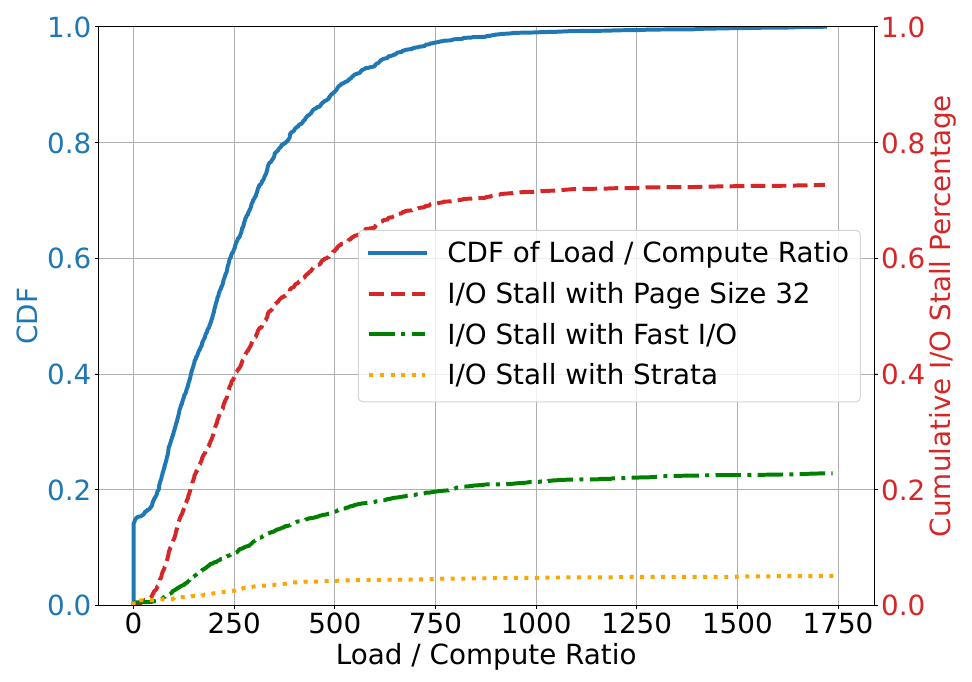

*图 1（原论文 Fig.1，印刷页 2 / PDF 物理页 3）。红线说明普通小页传输可使最多 74% 的 Prefill 时间被 I/O 阻塞；绿线说明快速 I/O 仍留下最多 24% stall；橙线说明调度仍有独立作用。*

## 2.2 大页不能作为通用补救

增大页可以增加单次传输量，但缓存匹配也以页为单位。请求只要在大页内部发生分歧，整页后续部分就不能命中。论文在 H200、Mistral-24B、ShareGPT 上把页大小从 1 Token 增到 512 Token，报告平均 TTFT 最高增至 2×，P90 TTFT 最高增至 2.9×。

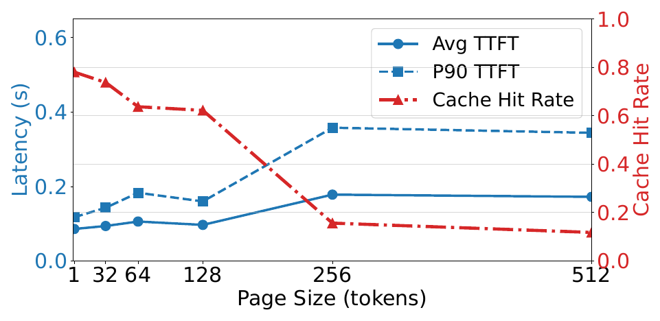

*图 2（原论文 Fig.2，印刷页 3 / PDF 物理页 4）。该图证明大页虽然有利于传输，却会破坏前缀命中粒度。它没有证明所有数据集的最优页大小相同。*

## 2.3 硬件峰值带宽不会自动兑现

论文用 Little 定律把稳态吞吐量写成 `X = C × S / L`：`C` 是在途并发，`S` 是单次传输大小，`L` 是单次操作延迟。传统小块 DMA 同时受限于 CPU 可提交的并发、CUDA 驱动队列和单次传输大小。随着互联理论带宽提高，如果软件仍提交相同的小 I/O，实际利用率反而下降。

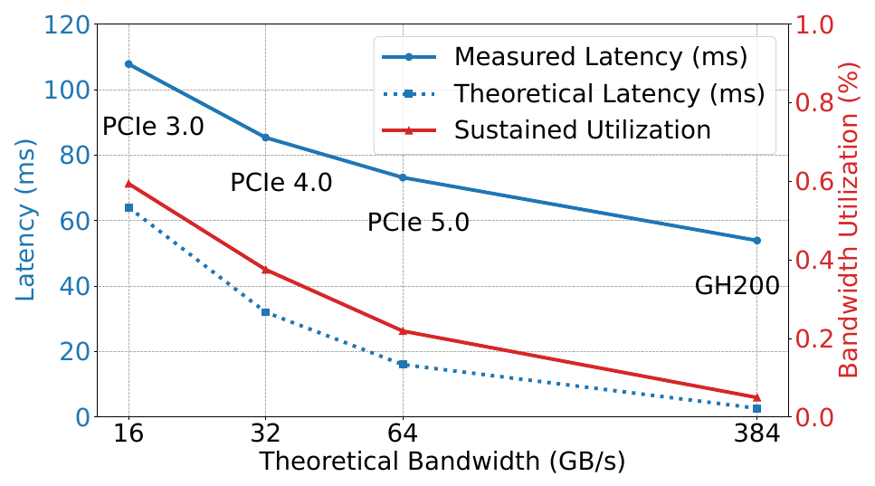

*图 3（原论文 Fig.3，印刷页 4 / PDF 物理页 5）。8192 Token、page size 32 的 Llama-3.1-8B 加载在 PCIe 5.0 上约为理论带宽的 22%，GH200 上约为 5%。*

## 2.4 延迟命中使高吞吐系统重复计算同一长前缀

延迟命中不是传统意义上的缓存容量未命中。缓存将来会存在，只是首个请求还没有完成计算与发布。异步调度器提前准备下一批，会把“缓存生成窗口”扩展到整个批次执行时间。论文引用 Mooncake agent tool trace：38% 请求会在 1 秒窗口内遇到另一个共享至少 6k Token 前缀的请求。该统计说明并发前缀复用具备现实基础，但不能替代目标业务流量的实测分布。

# 3. 核心抽象与系统设计

## 3.1 控制面与数据面分工

Strata 由缓存控制器和调度器组成。缓存控制器管理 GPU HBM、CPU DRAM 与外部存储之间的数据搬运、备份和淘汰；调度器读取请求队列与 HiRadixTree，估算候选请求的缓存位置、加载量和计算量，再形成下一批。GPU Executor 在逐层 Prefill 时通过 CUDA event 等待对应层 KVCache 就绪，Prefill 完成后再进入连续批处理的 Decode 阶段。

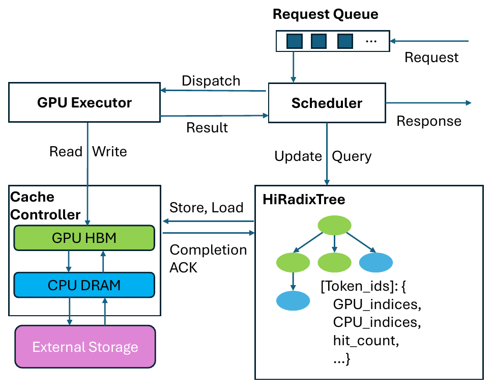

*图 4（原论文 Fig.4，印刷页 4 / PDF 物理页 5）。HiRadixTree 同时承担前缀索引、页位置和命中状态管理；它是调度器与缓存控制器之间的共享状态接口。*

## 3.2 跨层布局解耦

GPU 计算偏好 layer-first：同一层的所有 Token KV 连续，便于注意力内核读取。Host DRAM 与 SSD 搬运偏好 page-first：同一逻辑页跨所有层的数据连续，便于形成大块顺序 I/O。Strata 在 GPU 搬运线程计算目标地址时增加一次偏移换算，把布局转换合并进数据传输，避免在 GPU 计算端永久使用 page-first 带来的额外寻址。

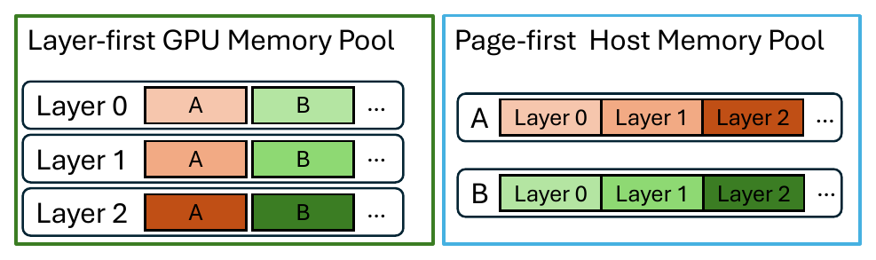

*图 5（原论文 Fig.6，印刷页 6 / PDF 物理页 7）。该图表达的是物理布局解耦，不是两份 KVCache 的语义版本可以自动保持一致。*

## 3.3 外部存储命中不等于立即可消费

外部存储命中后，缓存控制器默认先把数据尽力预取到 Host DRAM，并用请求排队时间覆盖一部分存储延迟。请求被调度执行时，控制器会终止仍未完成的预取，只使用当时已经到达 Host 或 GPU 的缓存；部署也可以改成等待预取完成或等待到超时。这个路径意味着“SSD 命中”只提供候选数据，不保证整段缓存最终被当前请求消费。系统是否等待、部分复用还是回退，仍由调度策略决定。

## 3.4 设计成立依赖的四个不变量

1. **小块 GPU 搬运的有效带宽足够高，且占用的 SM 资源有界。** Fig.5 给出 2 个大 block 的局部最优点；如果目标 NPU/GPU 无法隔离 I/O kernel，计算干扰可能抵消带宽收益。
2. **加载 Token 数 / 新输入 Token 数能够近似预测批次是否进入 I/O stall。** 论文 Fig.1 和 Algorithm 1 使用的是 Token 计数代理量，默认阈值取 100；它不是字节比、耗时比或 FLOP 比，也不是可跨平台复用的定律。
3. **瞬态前缀节点最终会转成可安全消费的缓存。** 论文描述了正常完成路径，没有给出进程崩溃、部分层完成或多副本并发发布时的恢复协议。
4. **被插入的计算与缓存加载主要争用不同资源。** 气泡填充依赖 Decode 主要消耗 HBM 带宽、加载主要消耗 PCIe 带宽。若 I/O kernel 同时占用 SM、寄存器或片上缓存，重叠并非免费。

# 4. 关键技术实现与作用机理

## 4.1 GPU 辅助的小页搬运与跨层布局即时转换

### 解决的问题

传统路径对每个离散页片段反复调用 `cudaMemcpyAsync`。单次数据量只有数 KB 时，传输延迟包含 CPU—GPU 提交、驱动排队和 DMA 启动开销；应用可提供的并发度也有限。系统若用大页规避这些开销，又会牺牲缓存命中率。

### 核心方法

Strata 用 GPU 内核接管离散页搬运：数千线程分别从 GPU global memory 或注册的 Host pinned memory 读取小块，经寄存器写入目标，并在同一内核中计算布局转换后的目标地址。

### 实现路径

1. 缓存控制器根据 HiRadixTree 找到需要加载或备份的 KV 页。
2. GPU 启动少量大 CUDA block；每个线程负责约 128 B 数据。
3. 线程使用绕过缓存的底层访存指令，减少片上缓存污染。
4. 对跨层布局转换，线程按源页、层号和目标布局计算新地址。
5. CPU→GPU 加载默认使用 2 个 block；GPU→CPU 备份默认使用 1 个 block，以降低非关键路径干扰。
6. Prefill 每层通过 CUDA event 确认数据可用后再执行。

### 资源 / 状态变化

`CPU 逐次提交大量小 DMA + layer-first 跨层碎片`  
→ `GPU 大规模细粒度并发搬运 + 搬运时地址重排`  
→ `保留小逻辑页，同时提高有效传输带宽并允许 Host/SSD 使用连续布局`。

### 为什么有效

GPU 提供的细粒度并发远高于 CPU 逐次提交。每个线程只搬运很小的数据块，系统无需把缓存页放大到 MB 级。地址转换与搬运共用一次遍历，也避免了额外的临时缓冲和第二次内存扫描。

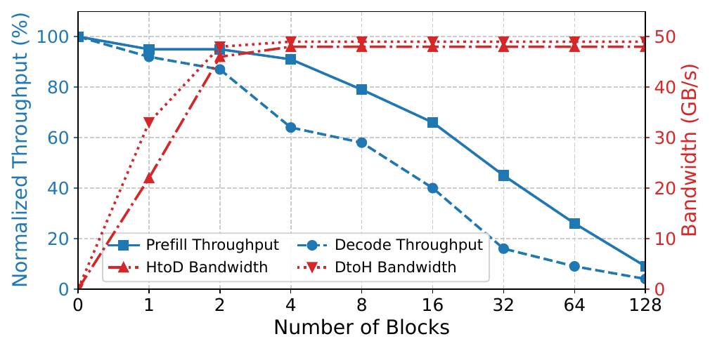

*图 6（原论文 Fig.5，印刷页 5 / PDF 物理页 6）。2 个 `1024-thread` block 达到 48 GB/s；Prefill 下降小于 5%，Decode 下降约 10%。这是 H200 上的局部资源权衡，不是跨平台常数。*

### 达到的优化效果

**直接效果**：Strata-IO 在 GH200 上把持续 Host—GPU 带宽从 SGLang-HiCache-GH 的 19.43 GB/s 提高到 150.50 GB/s；在 H200 PCIe 路径上对应为 10.80 GB/s 到 40.30 GB/s（Fig.15）。

**端到端效果**：仅加入 Strata-IO 的消融版本，相对 SGLang-HiCache 峰值吞吐最高提升 2.3×（Fig.9）。DeepSeek-V3 的 H20+NVMe 实验中，page-first 外部布局把平均 TTFT 从 5.03 s 降到 2.42 s，生成吞吐从 27.43 提高到 36.41 Token/s（Fig.13）。

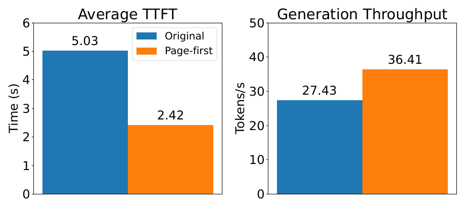

*图 7（原论文 Fig.13，印刷页 12 / PDF 物理页 13）。条件为 DeepSeek-V3、8×H20、page size 32、12 req/s；论文没有披露该工作点实际采用的预取策略、被当前请求消费的预取比例和浪费比例，因此不能把全部收益归因于连续磁盘 I/O，也不能外推到所有 SSD、模型和队列深度。*

### 论文证据

Fig.5 直接测量带宽与计算干扰，Fig.9 把 I/O 与调度拆开，Fig.10 检查页大小敏感性，Fig.13 单独评估外部 page-first 布局，Fig.15 比较 PCIe 与 Grace-Hopper 平台。证据链覆盖微基准、消融和端到端结果，因果归因相对完整。

### 亮点

Strata 把逻辑缓存粒度与物理搬运粒度分开，因此不必依赖“大页”提高传输效率。对本项目来说，这个原则比 CUDA 内核实现更有迁移价值。

### 代价与局限

- GPU I/O kernel 会占用 SM、寄存器和执行周期。论文在 Decode 上仍测得 10% 性能下降。
- 数据源和目标包含 Host pinned DRAM。论文没有测量 Host Payload Touch Bytes，因此不能据此认定本项目的 Host CPU 零数据拷贝目标已经满足；它更不等同于绕过 Host DDR。
- H200、GH200 和 ROCm 兼容性不能证明国产 NPU 上存在同等的线程并发、缓存绕过和地址转换能力。
- CUDA 12.8 的 `cudaMemcpyBatchAsync` 在同一微基准中为 38 GB/s，低于 48 GB/s，但不会占用 SM。不同方向可能应选择不同机制。

### 对项目的意义

**ADAPT**。直接迁移“逻辑页粒度与物理传输描述分离”的原则；具体实现应改造成面向 NPU、网卡和 NVMe 的连续块描述符编译与异步流水，并用硬件能力矩阵在运行时选择设备内核、DMA 或批量拷贝。项目必须独立测量 Host CPU 正文参与、设备计算干扰和可见性完成语义。

## 4.2 基于瞬态前缀状态的延迟命中规避

### 解决的问题

前缀树只记录“有缓存 / 无缓存”时，调度器看不到缓存正在计算。异步准备的后续请求会再次执行同一前缀，尤其在长上下文、高并发和相近到达时间下，重复计算代价很高。

### 核心方法

在 HiRadixTree 中增加瞬态节点，显式记录前缀已排队或正在执行；后续匹配请求等待即将完成的缓存，而不是马上重算。

### 实现路径

1. 调度器扫描等待队列，对新上下文插入 `in-queue` 节点。
2. 后续请求若匹配瞬态节点且匹配长度超过阈值，暂缓当前轮次并移到队首。
3. 请求开始执行时，节点转为 `in-flight`。
4. Prefill 完成后，节点转成普通节点并写入实际缓存索引。
5. 默认阈值为 100 个匹配 Token，以减少短偶然前缀导致的无谓等待。

### 资源 / 状态变化

`缓存二值状态：未命中 / 已命中`  
→ `缓存生命周期状态：排队中 / 计算中 / 已可用`  
→ `后续请求短暂等待并复用结果，减少重复 Prefill`。

### 为什么有效

高吞吐系统缩短了请求间隔，却没有同步缩短长前缀的计算完成时间。瞬态状态补上了这个时间窗口，使调度器可以利用“即将可用”的信息。

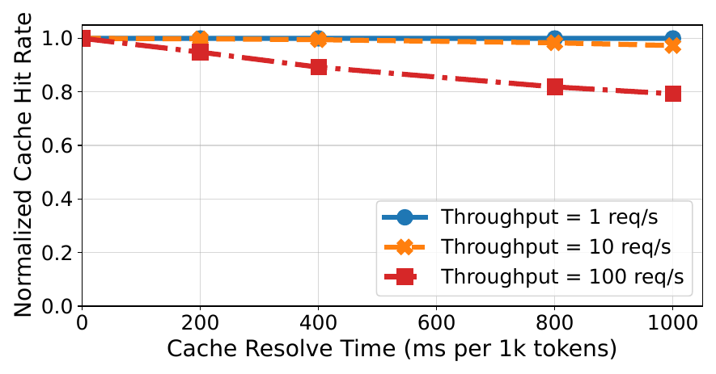

*图 8（原论文 Fig.12，印刷页 12 / PDF 物理页 13）。该图来自 Mooncake Tool-Agent trace 的模拟执行，使用无限缓存，并通过缩放时间戳得到 1/10/100 req/s；它证明趋势，不代表实机端到端结果。*

### 达到的优化效果

**直接效果**：最小缓存距离场景中，有效命中率提高，延迟命中规避贡献 42% 的峰值吞吐提升。

**端到端效果**：完整 Strata 的端到端提升包含该方法，但论文没有给出跨全部数据集独立开启 / 关闭延迟命中规避的结果，不能把整机最高 5× 归给该方法。

### 论文证据

Fig.11 给出不同缓存距离下的组件归因；Fig.12 给出缓存完成时间和请求到达率对有效命中的影响。前者是实际系统消融，后者是模拟敏感性分析。

### 亮点

论文把缓存“未就绪”建模为独立状态，没有混入普通未命中。新增状态不多，但调度器由此知道缓存何时可能变为可用。

### 代价与局限

- 暂缓请求可能造成个体请求不公平和 SLO 违约。论文只保持降级队列原始顺序，没有建立带截止时间的公平策略。
- 100 Token 阈值依赖模型、前缀分布和排队时延，不能直接复制。
- 论文没有说明进程崩溃、超时、部分层完成后瞬态节点如何撤销，也没有覆盖跨实例或多卡状态一致。

### 对项目的意义

**ADAPT**。把“正在生成 / 正在加载 / 已发布”纳入统一对象生命周期，但必须与多维度语义一致性校验、租约、代际和张量并行多卡状态同步共同设计。任何等待都要受请求剩余时限约束，并提供重算回退。

## 4.3 加载—计算平衡组批与同前缀合批

### 解决的问题

FIFO 只保证到达顺序和批次容量，不保证批内的 KVCache 加载能被 Prefill 计算覆盖。多个 Host 命中请求集中在一批时，GPU 会等待 PCIe；反过来，多个共享上下文的请求若被拆开，也会增加显存和片上带宽压力。

### 核心方法

调度器按批累计“从 Host 加载的 Token 数 / 新输入 Token 数”，优先加入不会使该代理量超过阈值的请求，并把共享上下文的请求追加到同一批。这个比例用于近似加载与 Prefill 计算的相对压力，不是直接测得的时间比。

### 实现路径

1. 从队首加入第一个请求，并寻找与它共享上下文的 bundle hit。
2. 逐个检查后续请求加入后的“Host 加载 Token 数 / 新输入 Token 数”。
3. 比例超过阈值时，把请求放入降级列表；否则加入当前批，并继续寻找 bundle hit。
4. 若主列表扫描结束后批次仍未满，再按原顺序补入降级请求。
5. 每次都从全局队首开始，避免请求永久饥饿。
6. Algorithm 1 在每次加入请求后继续扫描剩余队列寻找 bundle hit；按伪代码理解，长队列下可能出现反复扫描。论文用 C++ 实现降低常数开销，但没有报告调度时延随队列长度的增长曲线。

### 资源 / 状态变化

`按到达顺序填满批次`  
→ `按加载带宽与 Prefill 计算预算组合批次`  
→ `更多传输被计算覆盖，同时减少共享上下文的重复占用`。

### 为什么有效

该方法直接控制每批的 I/O / compute 比，而不是期待随机请求组合自然平衡。bundle hit 还使同一上下文在一个批内共享已驻留数据。

### 达到的优化效果

**直接效果**：shuffle 与最大缓存距离模式分别额外提高峰值吞吐 11% 和 12%。

**端到端效果**：调度组件整体相对 SGLang-HiCache 峰值吞吐最高提高 1.8×，但该数字还包含延迟命中规避和气泡填充。

### 论文证据

Fig.11 的累加消融把平衡组批放在 Strata-IO 和 delay-hit-free 之后。该图支持“加入平衡组批后结果继续改善”，但累加顺序可能存在交互项，不能把每一段柱高当成彼此独立、可任意相加的贡献。

### 亮点

调度器不再只看 Token 数和显存，而是把缓存层级的加载带宽纳入 admission。对于分层 KVCache，这是比“最长前缀优先”更完整的资源模型。

### 代价与局限

- 默认 Token 数代理阈值 100 来自特定模型和硬件画像，需要重新标定，并验证其对实际 stall 的预测误差。
- 优先聚合效率可能牺牲老请求或大请求的尾部时延。论文没有 P99、公平性或 deadline 结果。
- 负载估计依据当前页位置和预估计算量；缓存被并发淘汰、带宽波动或后台流量变化时，决策可能失准。
- 评测把最大在途请求限制为 128。论文没有证明重复扫描式候选选择在更长队列下仍满足微秒级决策预算。

### 对项目的意义

**DIRECTLY ADOPT（原则）**。动态选路与调度必须把实际加载字节、链路带宽、可重叠计算和剩余时限放入同一成本模型。实现上不能复制固定阈值，应由硬件能力矩阵和在线校准产生参数，并记录预测路径与实际路径用于纠偏。

## 4.4 跨资源气泡填充

### 解决的问题

当长缓存加载量远高于新 Token 计算量时，即使重新组批，当前 Prefill 仍可能等待数据。若调度器坚持 Prefill 优先，GPU 计算时隙被浪费。

### 核心方法

在 KVCache 加载期间插入主要消耗另一类资源的 Decode 批次；Prefill 与 Decode 分离部署时，也可以插入其他可执行 Prefill。

### 实现路径

1. 缓存控制器发起当前 Prefill 批所需的 Host→GPU 加载。
2. 调度器判断加载无法被该批 Prefill 计算覆盖。
3. 暂缓该 Prefill，选择已具备 KVCache 的 Decode 批运行。
4. 加载完成后恢复 Prefill，之后再合入连续 Decode 批。

### 资源 / 状态变化

`GPU 等待 PCIe 加载`  
→ `PCIe 加载与 HBM 受限的 Decode 并行`  
→ `将等待时间转成有效 Token 生成`。

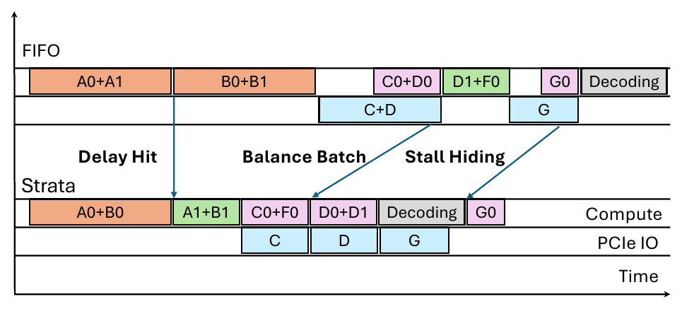

*图 9（原论文 Fig.7，印刷页 6 / PDF 物理页 7）。该时序图同时展示延迟命中规避、平衡组批和气泡填充；它是机制示意，不是测量结果。*

### 为什么有效

论文利用资源互补性：Host→GPU 加载主要受互联带宽约束，Decode 主要受 HBM 带宽约束。二者在资源瓶颈不同的情况下可以重叠。

### 达到的优化效果

**直接效果**：shuffle 与最大缓存距离模式分别额外提高峰值吞吐 8% 和 3%。

**端到端效果**：完整 Strata 的平均 TTFT—吞吐曲线整体优于各分层缓存基线，但论文没有单独报告气泡填充对单请求 TTFT、TPOT 或功耗的影响。

### 论文证据

Fig.11 提供累加消融。Fig.5 同时提醒 GPU I/O 内核并非只消耗 PCIe，它还会干扰 Prefill 与 Decode；因此“跨资源”是主要瓶颈不同，不是资源完全隔离。

### 亮点

当 I/O 无法继续优化时，Strata 没有把剩余 stall 视为固定成本，而是从全局执行队列中寻找可以利用空档的工作。

### 代价与局限

- Decode 与 I/O 仍共享 SM、缓存、功耗和调度资源；重叠效果需要按平台实测。
- 优先插入其他批次会改变请求完成顺序，可能放大某些请求的尾部时延。
- 论文在 Prefill—Decode 共置场景中验证为主，对跨节点 Prefill 与 Decode 解耦架构只给出可行性说明，没有端到端证据。

### 对项目的意义

**VALIDATE**。本项目可以把气泡填充作为调度动作之一，但必须受前后台服务质量保障策略约束，并同时观察 P99 TTFT、P99 TPOT、吞吐和排队公平性。若背景搬运与在线生成争用同一 NPU 或网络资源，调度器应退避而不是强行重叠。

# 5. 实验到底证明了什么

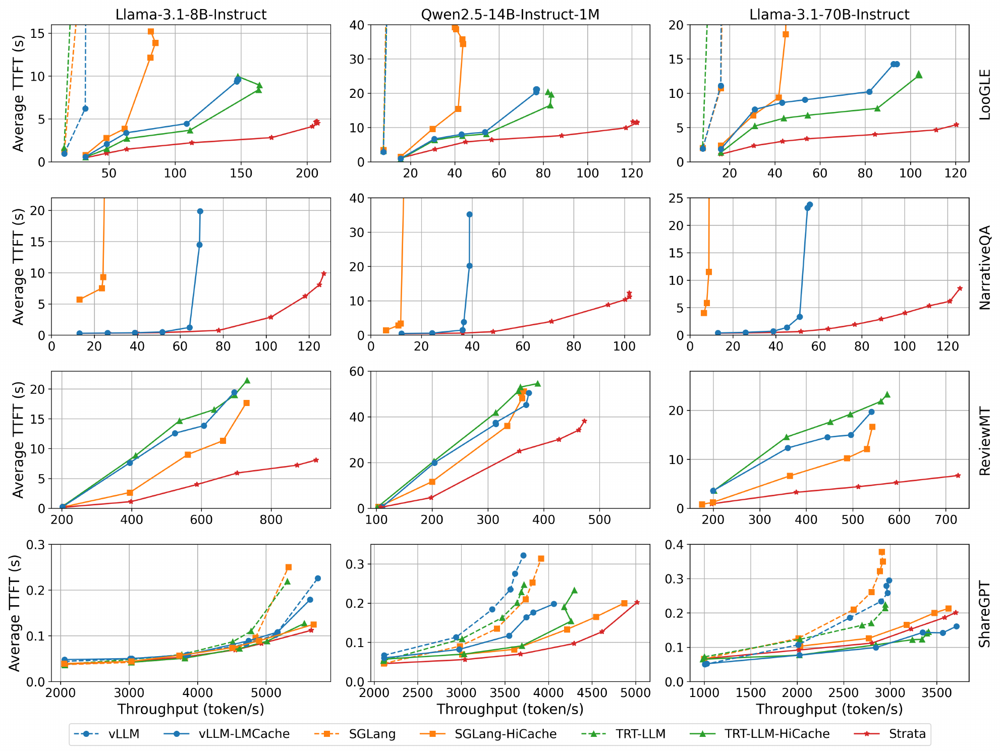

*图 10（原论文 Fig.8，印刷页 10 / PDF 物理页 11）。列为 8B/14B/70B 模型，行为 LooGLE、NarrativeQA、ReviewMT、ShareGPT。NarrativeQA 行先把全部上下文预计算到 CPU，再清空 GPU 缓存并重启负载，且不含不支持预热的 TensorRT-LLM-HiCache；ShareGPT 行把 GPU 缓存限制在约 500K Token。最高 5× 来自特定长上下文场景，短上下文只支持“可比”，不支持全面领先。*

| Claim | Experiment / Evidence | Conditions & Baseline | Result | What it proves | What it does not prove |
|---|---|---|---|---|---|
| 小页与 layer-first 布局导致带宽浪费 | Fig.2、Fig.3 | H200 Mistral-24B ShareGPT；另有 Llama-3.1-8B、8192 Token、page 32、多平台 | 大页使 Avg/P90 TTFT 最高升至 2×/2.9×；PCIe5 利用率约 22%，GH200 约 5% | 传输效率和缓存命中存在真实冲突 | 不给出所有模型、页大小和业务的统一最优值 |
| GPU 辅助 I/O 能提高小页传输带宽 | Fig.5、Fig.9、Fig.15 | H200/GH200；Strata-IO 消融 | 2 blocks 达 48 GB/s；Strata-IO 峰值吞吐最高 2.3×；GH 传输 150.50 GB/s | GPU 并发搬运对这些 CUDA 平台有效 | 不证明 NPU、跨节点 RDMA 或 Host CPU 零数据拷贝成立 |
| 调度在快速 I/O 后仍有独立价值 | Fig.1、Fig.9 | Qwen2.5-14B、LooGLE、H200 为主要分析条件 | 快速 I/O 后最多仍有 24% stall；Schedule-only 峰值吞吐最高 1.8× | 调度不是 I/O 优化的附属项 | 不说明调度对所有负载都比 I/O 更重要 |
| 延迟命中规避在高时空局部性下有效 | Fig.11、Fig.12 | 最小缓存距离消融；Mooncake trace 模拟、无限缓存 | 最小距离下吞吐 +42%；完成越慢、到达越快，模拟命中率越低 | 瞬态缓存状态有实际调度价值 | 模拟不等于生产实机；不覆盖故障和容量淘汰 |
| 平衡组批与气泡填充可继续提高吞吐 | Fig.11 | Qwen2.5-14B、LooGLE、H200；shuffle / max distance | 组批 +11%/+12%；气泡填充 +8%/+3% | 两项机制在这些工作负载中有增量价值 | 累加消融不能证明贡献完全独立，也没有 P99/SLO 结果 |
| 跨层布局解耦有利于磁盘缓存 | Fig.13 | DeepSeek-V3、8×H20、Intel P5510、page32、12 req/s | Avg TTFT 5.03→2.42 s；吞吐 27.43→36.41 Token/s | page-first 外部布局在该平台有效 | 只有一个磁盘平台和工作点，不能证明通用 SSD 分层能力 |
| 完整系统提高长上下文服务性能 | Fig.8、§5.2 | H200；三模型；四数据集；NarrativeQA 为暖 CPU / 冷 GPU 且无 TRT-LLM-HiCache；ShareGPT GPU 缓存约 500K Token | LooGLE 同 TTFT 吞吐最高 5×/5×/3.75×（按基线不同） | Strata 在评测范围内优于这些基线 | 不证明生产 P99、故障恢复、网络分布式缓存或所有请求率均获相同收益 |

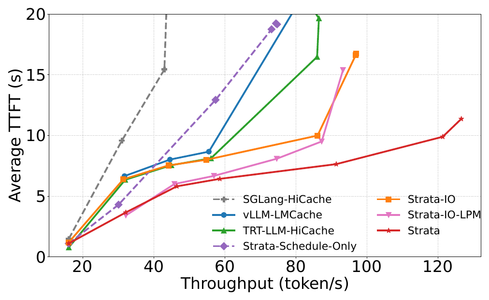

*图 11（原论文 Fig.9，印刷页 11 / PDF 物理页 12）。低请求率时调度收益更明显，高请求率时 I/O 成为主瓶颈。*

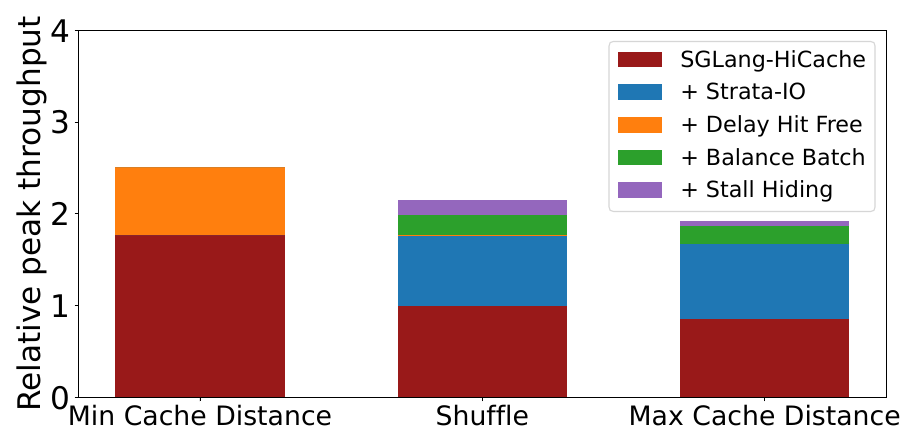

*图 12（原论文 Fig.11，印刷页 11 / PDF 物理页 12）。工作负载局部性决定哪个组件最重要，不能用单一组件排序覆盖所有场景。*

## 5.1 关键混杂因素与替代解释

1. **基线页大小并不相同。** SGLang 与 Strata 用 page size 1；SGLang-HiCache、vLLM 和 TensorRT-LLM 分层缓存基线使用 page size 32，LMCache chunk 为 256。Fig.10 通过页大小扫描削弱了“Strata 只因页更小而获益”的解释：SGLang-HiCache 在 page 512 达到自身最好吞吐，仍只有 Strata-IO 的 93%，且命中率低 2.4%。但该控制实验不能消除不同引擎内核、内存管理和调度实现的全部差异。
2. **主指标是平均 TTFT。** 平均值改善可能掩盖少量严重延迟请求。论文自己承认当前调度可能造成个体不公平，因此不能从平均曲线推出 SLO 达标率或 P99 稳定性。
3. **到达过程是合成的。** 数据集缺少时间戳，论文使用 Poisson 到达；ShareGPT 另外保留会话依赖并加入 60 秒 thinking time。合成到达可控，但可能改变缓存距离和延迟命中概率。
4. **Host DRAM 容量很大。** 大多数层级缓存实验分配 1 TB pinned DRAM，GH200 为 400 GB。结果更接近“GPU+大容量 Host DRAM”，不能代表容量受限或频繁写回 SSD 的部署。
5. **生产部署缺少量化证据。** “已在多家领先 AI 企业部署”是论文作者声称。文中没有生产拓扑、流量和故障统计，不能作为生产成熟度测量。
6. **128 个在途请求上限改变了开放到达过程。** 论文用该上限避免客户端无界排队，却没有说明被限流的计划到达时间、实际提交时间以及客户端等待是否计入 TTFT。高负载尾部时延可能因此受到背压口径影响。

## 5.2 平台升级为何仍需要软件调度

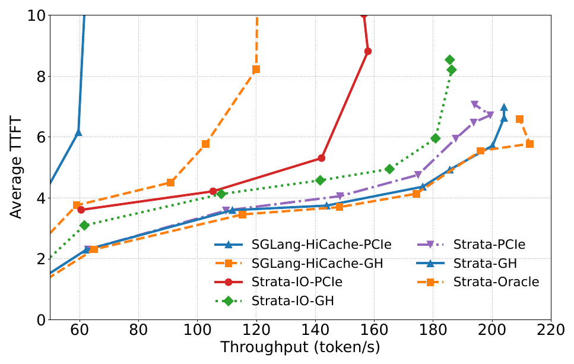

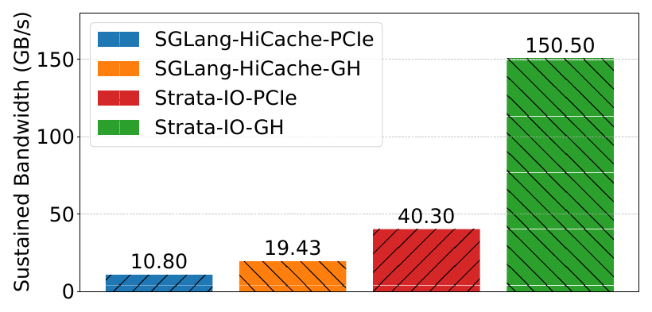

*图 13～14（原论文 Fig.14、Fig.15，印刷页 12 / PDF 物理页 13）。Strata-IO-GH 虽达到 150.50 GB/s，端到端表现仍没有超过完整 Strata-PCIe；完整 Strata-GH 才接近模拟无限 CPU—GPU 带宽的 Oracle。更高带宽不能替代缓存感知调度。*

# 6. 论文的亮点与局限

## 6.1 逻辑缓存粒度与物理搬运粒度解耦

**亮点**

论文把“小页提高命中率”和“大传输提高带宽”从二选一改成两层决策。GPU 仍按小页管理，搬运内核通过并发和地址重排形成高效传输。Fig.2、Fig.3、Fig.5、Fig.10 构成较完整的动机—机制—验证链。

**局限**

实现依赖 CUDA/ROCm 风格的设备线程、注册 Host 内存和缓存绕过能力。论文没有验证远端网卡、NPU 或 NVMe 到设备显存的统一数据路径，也没有给出数据完整性和故障边界。

## 6.2 把缓存带宽纳入服务调度

**亮点**

Strata 不再把 KVCache 加载当作 Prefill 可以自然掩盖的后台动作，而是用“Host 加载 Token 数 / 新输入 Token 数”近似加载与计算压力。Fig.1 和 Fig.14 说明，即使 I/O 变快，调度仍决定端到端收益。

**局限**

默认阈值 100 依赖当前模型、硬件与内核。论文没有展示在线校准误差、阈值漂移或后台任务改变带宽时的错误决策率。

## 6.3 瞬态缓存状态消除时间窗口内的重复工作

**亮点**

HiRadixTree 用少量状态扩展捕捉 delay hit，避免为了解决时间问题引入全局同步。这种“即将可用”状态可迁移到其他缓存和对象发布系统。

**局限**

正常路径说明较清楚，异常路径不足。超时、取消、进程崩溃、部分层完成、多副本竞争发布和状态泄漏均未给出协议。

## 6.4 按工作负载拆分收益而非只报总加速

**亮点**

Fig.11 展示了缓存距离变化会改变 delay hit、I/O、平衡组批和气泡填充的相对作用，避免把某个组件宣传为普遍最优。

**局限**

该图采用累加消融，组件顺序固定，交互项没有被完全分离。delay hit 的进一步敏感性又依赖模拟与无限缓存。

## 6.5 完整系统集成与可比性

**亮点**

实现基于 SGLang，覆盖 8B/14B/70B、H200/H20/GH200、长短上下文和多个分层缓存基线，证据范围明显强于只做单一微基准的设计。

**局限**

各基线引擎、页大小和内核不同；GPU 内存采用各引擎默认策略。论文虽然用消融和页大小扫描缓解混杂，但无法形成完全同构的基线。生产部署声称也没有对应的生产测量。

# 7. 论文没有解决什么

1. **跨节点统一缓存池。** Strata 聚焦单个计算实例内的 HBM—Host DRAM—本地存储。它没有解决远端目录分片、跨节点副本选择、网络 Incast（多对一突发拥塞，即多个发送节点同时向一个接收端发送数据并耗尽交换机出端口缓冲）、远端失效或源端带宽放大。
2. **缓存消费的语义安全。** 论文按 Token 前缀索引缓存，没有讨论模型版本、Tokenizer、Prompt 模板、LoRA、精度 / 布局版本和 Ready 状态的组合校验。
3. **多卡一致动作。** 70B 使用 4 GPU 张量并行做性能评测，但论文没有描述各 rank 如何就命中范围、加载成功和回退动作达成一致。
4. **Host CPU 零数据拷贝与 Host DDR 旁路。** GPU kernel 直接访问 pinned DRAM 可能减少 CPU memcpy，但论文没有测 Host 正文字节，也没有绕过 Host DRAM。
5. **远端直读与安全回退。** 论文所有计算仍以 KVCache 到达本地 GPU 为前提，没有比较 Direct-View 与 Copy-to-HBM，也没有远端崩溃、租约撤销或 SIGBUS 类错误恢复。
6. **生产级服务质量。** 论文评估平均 TTFT 和吞吐，没有 P99、公平性、deadline、TPOT 干扰、后台迁移混压或硬件 QoS 队列验证。
7. **通用 SSD 分层。** 大多数实验不使用磁盘；磁盘结果只覆盖一个 H20+P5510+DeepSeek-V3 工作点，且没有证明 HBM↔NVMe 正文绕过 Host DDR。
8. **混合注意力模型。** 论文明确聚焦标准 dense attention 的精确缓存，稀疏 / 线性 / hybrid attention 仍需重新设计内存管理和调度。

# 8. 对本项目的启发

## DIRECTLY ADOPT

1. **把缓存加载带宽作为调度资源。** 本项目的查询与放置计划决策引擎（在请求时限内选择加载、远端直读、SSD 回源或重算路径）应记录加载字节、有效带宽、可重叠计算和剩余时限，而不是只记录命中位置。
2. **分离逻辑页、物理连续区间和硬件提交描述。** Strata 证明小页命中与大传输可以兼容。本项目的连续数据块区间清单描述符和描述符编译器应保持逻辑覆盖不变，再按后端约束合并物理连续区间。
3. **显式建模缓存瞬态状态。** `正在生成`、`正在加载`、`已发布可消费` 和 `已失效` 不能压缩成二值命中状态。

## ADAPT

1. **设备辅助搬运要改造成多后端能力选择。** 在国产 NPU 上，应比较设备搬运内核、批量 DMA、网卡直接访问和 SSD 直达；运行时依据硬件能力矩阵选择，不预设 CUDA 内核必然最优。
2. **延迟命中需要升级为带租约与代际的发布协议。** 本项目必须加入多维度语义一致性校验、超时撤销、故障回退和张量并行多卡状态同步，避免“已完成一部分”被误判为可消费。
3. **平衡组批需要和成本模型、路由、服务质量统一。** 固定 load/compute 阈值应改为在线校准，并把后台迁移、网络拥塞和请求 SLO 纳入决策。
4. **气泡填充必须受前后台服务质量约束。** QoS（Quality of Service，服务质量，即通过优先级、带宽保留和退避限制后台搬运对前台请求的干扰）不应只靠 GPU 自然重叠。

## DO NOT COPY

1. 不把 1 TB pinned Host DRAM 作为统一部署前提。本项目需要区分 Host DRAM 缓存、NVMe 容量层和跨节点资源的角色。
2. 不复制默认 `load/compute=100` 和 `delay-hit=100 Token` 阈值。它们是 Strata 评测平台上的经验配置。
3. 不把单实例 HiRadixTree 当成全局权威目录。跨节点对象必须具备分片、代际、租约和失效传播边界。
4. 不用平均 TTFT 和峰值吞吐替代 P99、错误消费、故障恢复和混压干扰验收。

## VALIDATE

1. 国产 NPU 上的设备辅助小块搬运能否在 Host CPU 正文参与为 0 的同时，保持 Prefill/Decode 干扰在可接受范围内。
2. 描述符合并与布局即时转换能否覆盖本项目的异构框架布局，而不引入 CPU staging buffer。
3. 真实业务的缓存距离、并发同前缀比例和缓存完成时间是否足以支撑 delay-hit 状态机。
4. 在 Prefill 与 Decode 解耦架构（将输入理解阶段与逐字生成阶段部署到不同节点，通过网络传输 KVCache）下，气泡填充是否仍有收益，还是会转化为跨节点网络争用。

# 9. 对本项目立项的背书

## 9.1 Problem Validation

**项目解释**：论文独立确认了本项目要解决的两个问题真实存在。一是 KVCache 分页与跨层布局会把大对象搬运拆成低效率小 I/O；二是分层缓存引入的加载带宽和缓存完成时间必须进入推理调度。其证据包括真实平台微基准、端到端测量和组件消融，强度高于纯模型推导。

证据适用范围仍是 CUDA 平台、单实例分层缓存和论文工作负载，不能直接扩展为国产 NPU、跨节点或所有业务流量。

## 9.2 Mechanism Validation

**项目解释**：论文为三项底层原则提供了外部技术证据：

1. 逻辑缓存粒度与传输提交粒度可以解耦；
2. 数据布局转换可以并入设备侧搬运，而非额外落入 CPU 中间缓冲；
3. 动态调度应同时读取缓存位置、加载量、计算量和缓存可用时机。

这些原则支持本项目的描述符编译、异步流水、动态选路和缓存感知调度方向。论文验证的是共同原理，不是本项目具体协议和接口。

## 9.3 Research-Gap Validation

**项目解释**：Strata 没有按项目口径测量 Host CPU 正文参与，也没有覆盖 Host DDR 旁路、跨节点数据路径、HBM—NVMe 直达、语义一致性、租约容错、多卡状态同步和前后台混压。这些缺口恰好落在本项目当前范围内，但只有项目明确承担并完成验证后才能构成差异化；不能把论文未测量或未实现的内容自动算成本项目优势。

## 9.4 Unsupported Project Claims

论文没有证明以下项目主张：

- UBMEM（统一总线内存直通共享协议，即支持跨节点与异构设备直接共享内存地址空间的底层通信协议）或 URMA（通用远程直接内存访问，即用户态高性能 RDMA 驱动接口与协议）能达到目标带宽和时延；
- Host CPU 正文搬运字节严格为 0；
- 远端直读比拷贝到本地 HBM 更优，或发生远端故障时可以有界安全回退；
- 多维度语义一致性检查可以杜绝错误消费；
- TP=8 多卡状态同步 P99 小于 100 μs；
- NVMe 分层可以在绕过 Host DDR 的同时达到目标吞吐；
- E3 前后台混压下 TTFT、QPS 与 TPOT 项目门槛能够同时满足。

## 9.5 Project Establishment Verdict

- **Necessity evidence**：长上下文缓存的带宽利用率、加载 stall 和延迟命中问题有论文实测与消融支持，项目继续投入具有明确系统问题基础。
- **Feasibility evidence**：设备侧细粒度并发搬运、布局转换和缓存资源感知调度在 CUDA 系统中已经产生可重复解释的收益，说明相关原理可行。
- **Differentiation evidence**：跨节点、国产 AI 硬件、多介质直达、语义安全、多卡一致和混压稳定性仍未被 Strata 解决，与本项目范围重合。
- **Remaining burden of proof**：本项目必须用自己的硬件、框架、业务流量和故障模型完成 E0～E3；任何项目目标都不能由 Strata 的最高加速比代替。

# 10. 建议验证

## Experiment 1：Saved-Prefill 净收益与加载 / 计算边界

- **Hypothesis**：当长前缀加载总开销小于本地重算时，复用能稳定降低 TTFT；加载 / 新计算比例可用于识别失效区间。
- **Variable**：前缀长度、新输入长度、命中层级、复用次数、并发度、链路带宽。
- **Baseline**：同模型、同输入、同资源配额下的本地直接重算。
- **Metric**：TTFT P50/P95/P99、加载完成时间、Prefill 重算时间、有效吞吐、失败与回退率。
- **Controlled conditions**：固定模型版本、Tokenizer、Prompt 模板、精度、页大小、GPU/NPU 频率和请求到达序列。
- **Pass condition**：在预先定义的目标场景中，拉取与加载总开销小于本地重算，并满足本项目 E0 的 Saved-Prefill 净收益判定；低收益区间能被正确回退。
- **Fail implication**：缩小复用适用范围，优先本地重算；不得继续把外置缓存当成默认快路径。
- **Decision affected**：动态选路的准入规则和 E0 是否通过。

## Experiment 2：异构布局描述符与 Host CPU 零数据拷贝路径

- **Hypothesis**：逻辑小页可以被编译成后端可执行的连续区间，并在设备 / DMA 路径中完成布局转换，不需要 CPU 搬运正文。
- **Variable**：页大小、碎片度、区间数、传输方向、后端（设备内核 / DMA / 批量 API）、布局组合。
- **Baseline**：逐页同步 / 异步拷贝，以及 Strata 类设备搬运内核的本地复现。
- **Metric**：有效带宽、提交 P99、描述符数量、Host Payload Touch Bytes、CPU 利用率增量、Prefill/Decode 干扰、数据校验错误。
- **Controlled conditions**：固定总字节数、源 / 目标布局、内存注册方式、设备频率和并发计算负载。
- **Pass condition**：**项目目标**为 Host Payload Touch Bytes 严格为 0、Host CPU 利用率增量小于 5%；描述符覆盖无遗漏、无重叠、无越界，描述符数量相对未合并基线降低不少于 50%，CPU 提交时延降低不少于 40%。带宽与设备计算干扰需按测试前冻结的模型 / 平台门限同时判定。
- **Fail implication**：保留 Raw Direct 基础路径，限制设备内核或布局转换适用范围；不得用吞吐提升掩盖 CPU staging 或计算干扰。
- **Decision affected**：E1 数据路径、描述符协议和硬件能力矩阵。

## Experiment 3：真实流量下的延迟命中与联合组批

- **Hypothesis**：在具有短缓存距离和并发同前缀请求的真实流量中，瞬态状态、平衡组批和气泡填充能减少重复 Prefill，同时不恶化尾部时延和公平性。
- **Variable**：缓存距离、同前缀到达窗口、缓存完成时间、请求率、在途上限、候选队列长度、调度阈值、后台带宽占用。
- **Baseline**：FIFO、最长前缀优先、仅缓存命中感知、仅 I/O 优化。
- **Metric**：重复 Prefill Token、有效命中率、QPS、TTFT P50/P95/P99、TPOT P99、最大等待时间、饥饿请求数、计划到达 / 实际提交 / 完成时间、限流 / 超时 / 失败请求数、候选扫描数、调度 CPU 时间 P99、加载代理量对实际 stall 的预测误差。
- **Controlled conditions**：同一回放 trace、相同缓存容量、相同计划到达时间、相同模型与设备配额；分别测试无限缓存和真实淘汰；至少三次独立回放，并在测试前冻结非劣界、置信区间算法和请求 deadline。
- **Pass condition**：重复 Prefill Token 的下降在预注册置信区间内成立；吞吐或 TTFT 至少一项改善，另一项满足预注册非劣界；饥饿请求为 0，最大等待不超过请求 deadline。调度 CPU 时间 P99 必须满足项目快速决策预算，且随队列长度增长可控。
- **Fail implication**：把 delay-hit 优化降级为场景化策略，并加入 deadline / aging；若候选扫描超预算，改用有界候选窗口或前缀索引；若气泡填充造成干扰，则关闭对应重叠动作。
- **Decision affected**：E2 动态调度算法、阈值在线校准和请求公平策略。

## Experiment 4：SSD 分层布局与绕过 Host DDR 的可行性

- **Hypothesis**：page-first 外部布局和大区间提交可以提高 NVMe 有效吞吐；若平台支持，正文可以在 NVMe 与 NPU HBM 之间直接传输。
- **Variable**：SSD 型号、队列深度、块大小、页布局、是否经过 Host DDR、并发前台推理负载。
- **Baseline**：文件系统 offload、普通 Direct I/O、经 Host DRAM staging 的路径。
- **Metric**：读写带宽、TTFT、首批可计算时间、Host DDR DMA 字节、CPU cycles/GB、写放大、前台 TPOT 干扰。
- **Controlled conditions**：固定数据集、模型、磁盘水位、压缩 / 校验配置和热冷分布。
- **Pass condition**：分层路径增加可服务容量且产生净收益；任何“旁路 DDR”结论都必须由实际总线 / DMA 字节证据支持。
- **Fail implication**：把 SSD 限定为容量层，不承诺在线关键路径；保留 Host DRAM 角色但单独核算成本。
- **Decision affected**：E2 分层拓扑、DDR 角色和 NVMe 主路径。

## Experiment 5：E3 前后台混压与服务质量总门禁

- **Hypothesis**：缓存加载、换出、预取和压紧在受控优先级与退避下，可以提高前台有效吞吐而不破坏在线生成稳定性。
- **Variable**：前台请求率、后台带宽、流量类别、队列优先级、气泡填充开关、故障注入。
- **Baseline**：原生 Mooncake，以及同一增强系统的纯前台运行。
- **Metric**：TTFT、QPS、TPOT P50/P95/P99、请求达标率、计划到达 / 实际提交 / 完成时间、限流 / 超时 / 失败请求数、后台进度、丢包 / 重试、设备和网络利用率。
- **Controlled conditions**：代表性两节点拓扑、相同模型与计划到达 trace、相同缓存容量、固定在途上限、统计分位和有效请求分母；客户端背压与服务端排队分别记账。
- **Pass condition**：**项目目标**为相对原生 Mooncake，TTFT 降低不少于 20%、QPS 提升不少于 10%；相对同一增强系统纯前台，TPOT 干扰小于 3%。
- **Fail implication**：降低后台并发、收紧预取与气泡填充，或拆分关键路径；不能仅凭平均吞吐通过 E3。
- **Decision affected**：项目能否进入生产级全链路集成。

# 附录 A：评测条件速查

| 类别 | 论文配置 |
|---|---|
| H200 平台 | 8×NVIDIA H200、NVLink、Intel Sapphire Rapids、1.6 TB DRAM；每 GPU PCIe 5.0×16，单向峰值 64 GB/s |
| H20-storage 平台 | 8×NVIDIA H20、Intel P5510 NVMe，论文称最高 7 GB/s 读带宽 |
| GH200 平台 | 1×H100 + Grace 64-core ARM、464 GB LPDDR5X；CPU 内存单向带宽最高 384 GB/s |
| 模型 | Llama-3.1-8B-Instruct、Qwen2.5-14B-Instruct-1M、Llama-3.1-70B-Instruct；70B 用 4 GPU 张量并行 |
| 长上下文数据 | LooGLE、NarrativeQA、ReviewMT；另用 ShareGPT 测短上下文 |
| 到达过程 | 由于数据集无时间戳，使用 Poisson 到达；最大 128 个 in-flight 请求 |
| Host 缓存 | 使用 CPU 内存的配置分配 1 TB pinned DRAM；GH200 为 400 GB |
| NarrativeQA 例外 | 预计算全部上下文到 CPU、清空 GPU 缓存后重启；不含不支持预热的 TensorRT-LLM-HiCache |
| ShareGPT 例外 | GPU 缓存容量限制为约 500K Token，并在会话轮次间加入 60 秒 thinking time |
| vLLM-LMCache | vLLM 0.8.5、LMCache 0.2.1、chunk 256、page 32 |
| TensorRT-LLM | 0.17.0、page 32 |
| SGLang / Strata | SGLang 0.4.5；SGLang 与 Strata page 1；SGLang-HiCache page 32 |
| 主指标 | Average TTFT 与 output token throughput |

# 附录 B：关键图与证据用途

| 原论文图 | 印刷页 / PDF 物理页 | 报告用途 | 证据类型 |
|---|---:|---|---|
| Fig.1 | 2 / 3 | I/O stall 根因与快速 I/O 后的剩余调度空间 | 实测画像 |
| Fig.2 | 3 / 4 | 大页降低命中率并恶化 TTFT | 实测敏感性 |
| Fig.3 | 4 / 5 | 高带宽互联下小 I/O 的利用率下降 | 实测微基准 |
| Fig.4 | 4 / 5 | 控制面、数据面与 HiRadixTree 关系 | 架构图 |
| Fig.5 | 5 / 6 | GPU I/O kernel 的带宽—计算干扰权衡 | 实测微基准 |
| Fig.6 | 6 / 7 | GPU layer-first 与 Host page-first 布局解耦 | 机制图 |
| Fig.7 | 6 / 7 | 三阶段缓存感知调度时序 | 机制图 |
| Fig.8 | 10 / 11 | 三模型、四数据集端到端结果 | 端到端实测 |
| Fig.9 | 11 / 12 | I/O 与调度组件消融 | 消融实测 |
| Fig.11 | 11 / 12 | 缓存距离变化下的组件归因 | 累加消融 |
| Fig.12 | 12 / 13 | 延迟命中对完成时间和到达率的敏感性 | 模拟 / trace-derived |
| Fig.13 | 12 / 13 | 外部 page-first 布局的磁盘端到端效果 | 实测单点 |
| Fig.14–15 | 12 / 13 | GH200 高带宽与调度协同 | 实测 + Oracle 模拟 |

# 附录 C：复现疑点与开放问题

1. 论文没有说明 Poisson 时间戳如何与 ReviewMT / ShareGPT 的跨轮依赖和 60 秒 thinking time 合成，缓存距离可能受具体生成方法影响。
2. 各引擎使用默认 GPU 内存分配策略并被称为公平，但默认策略可能导致不同可用缓存容量和批次上限。
3. Fig.11 是固定顺序的累加消融，组件之间可能存在交互项；若要精确归因，需要全因子或至少改变消融顺序。
4. Fig.12 的 delay hit 结果是无限缓存模拟；真实淘汰会同时改变有效命中和缓存完成窗口。
5. Fig.13 只给出一个 NVMe 平台和请求率，缺少块大小、队列深度、预取浪费和写路径明细。
6. 论文描述了瞬态节点的正常转换，没有给出超时、取消、崩溃或部分层完成后的回收状态机。
7. 论文称 exact caching 不影响模型精度，这在 Token、模型与布局语义一致时成立；论文没有展示跨模型版本和适配器的防误用机制。
8. 生产部署只有定性说明，缺少可复现或可审计的生产结果。
9. 128 个在途请求上限会触发客户端背压；论文没有说明计划到达、实际提交与完成时间的统一计时边界。
10. Algorithm 1 的 bundle-hit 搜索可能反复扫描队列；论文没有给出调度开销随队列长度增长的测量。
