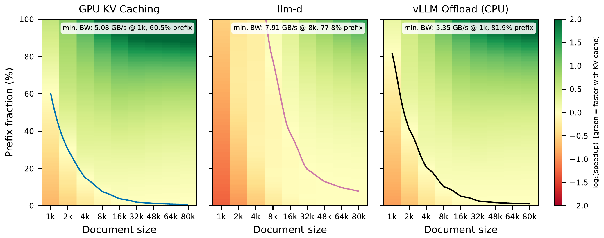
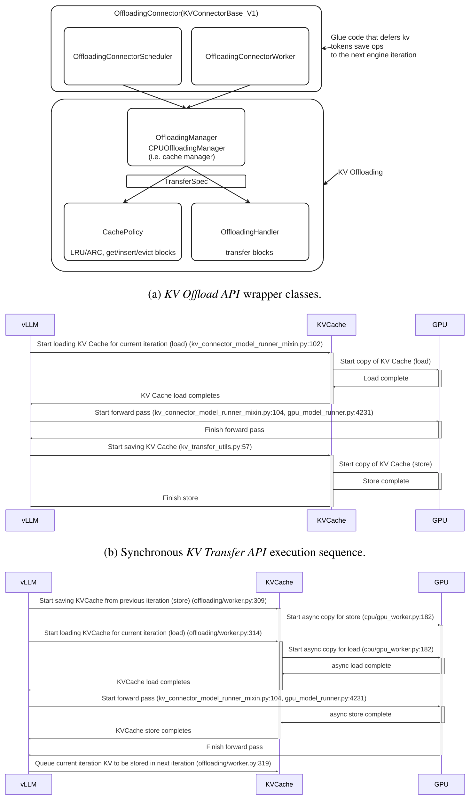
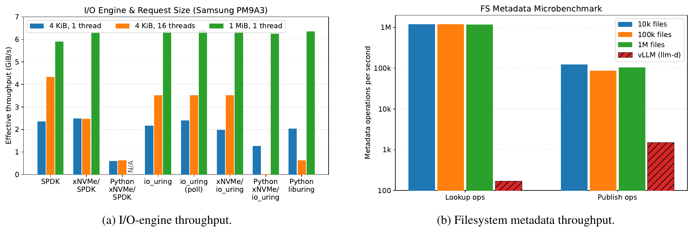
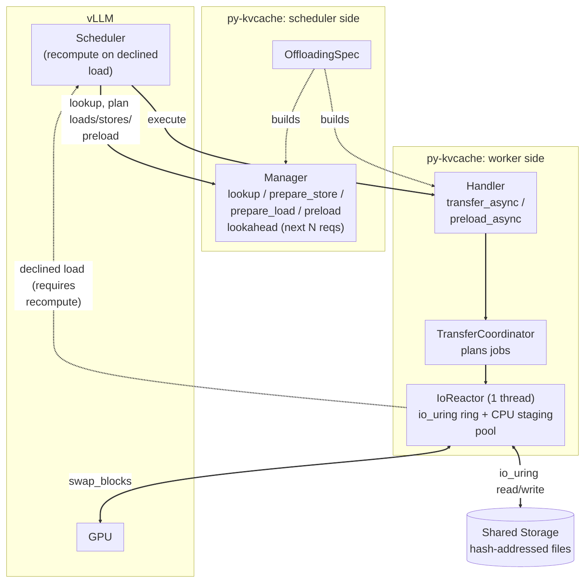
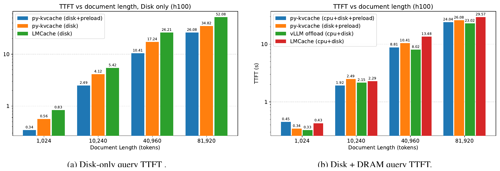
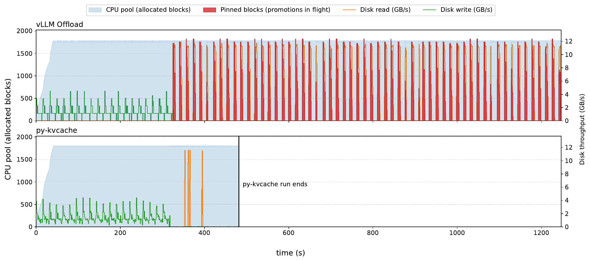
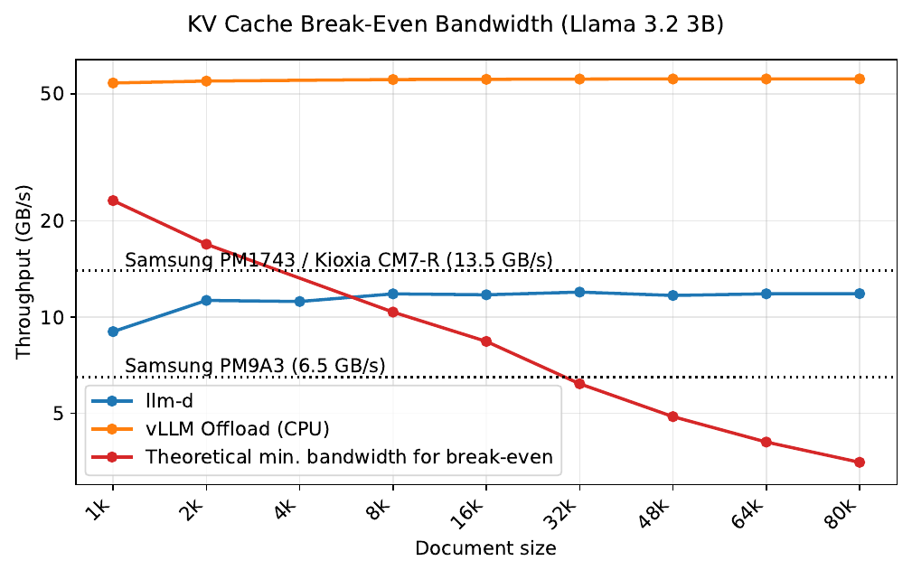
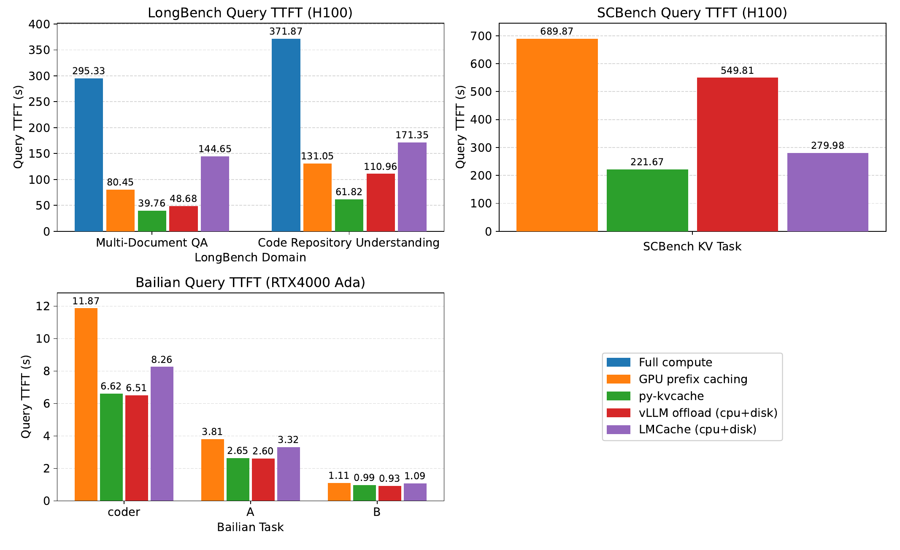

# Building py-kvcache：vLLM 外部 KVCache 与 NVMe SSD 性能边界解构

> 原文：*Building py-kvcache: A Performance Characterization of External KV Caching for vLLM with NVMe SSDs*
> 版本：arXiv:2609.11744v1，2026-09-10，24 页
> 作者：Joseph Kanichai、Tiziano De Matteis、Animesh Trivedi
> 证据范围：本文只依据指定 PDF 及项目受控架构/验证文档撰写，未读取同目录其他版本的论文解构报告。
> 数据口径：文中将“论文事实”“实测数据”“分析判断”“项目建议”分开表述。论文中的 1k 表示 1,024 tokens，80k 表示 81,920 tokens。

## 1. 一页读懂论文

### 1.1 论文解决什么问题

KVCache（大模型注意力键值缓存，用于保存历史 Key/Value 激活并避免后续 Token 重复计算注意力）命中不等于性能收益。对短前缀、快 GPU 或较慢的存储路径，查找文件、SSD 读取、Host DDR 暂存和 Host DDR→GPU 拷贝的总开销，可能比本地 Prefill 重算还大。

论文真正研究的不是“SSD 能否存 KVCache”，而是：对一个具体请求，什么时候从外部介质加载比重算更快，以及怎样把加载工作移出 TTFT（Time To First Token，首 Token 响应时间）关键路径。

### 1.2 根因是什么

可见现象是 SSD 加载慢、CPU 内存占用高、TTFT 不稳定。更深的根因有三个：

1. 现有系统通常在请求已被选中执行后才开始读盘，整段 SSD→CPU→GPU 路径直接暴露在 TTFT 中。
2. 调度器把“命中”当成加载理由，却没有把模型重算成本、介质带宽、前缀长度、队列等待时间和暂存压力合并决策。
3. 投机预加载如果没有容量上限和前台优先级，会挤占 Host DDR 暂存池和 SSD 带宽，反复读取最后又被淘汰的数据。

### 1.3 核心洞察

外部 KVCache 首先是关键路径调度问题，其次才是容量问题。如果调度器在请求排队期间已经知道可复用前缀，就可以利用排队时间提前读盘；如果加载仍然慢于重算，就应主动拒绝加载。

```text
前缀命中
  → 判断“加载是否比重算更快”
  → 值得加载时，利用队列等待时间预读
  → 用受限共享暂存池执行大块异步 I/O
  → 请求运行时尽量只剩 CPU→GPU 提升
  → 无净收益或资源不足时回退重算
```

### 1.4 核心抽象

论文没有定义一个独立命名的新理论抽象。它的工程抽象可以概括为“调度器可见、成本准入、数据面受限”的加载计划：调度器侧 Manager 看到等待队列并生成 load/store/preload 计划，worker 侧 Handler 和单线程 IoReactor 执行数据路径，受限的 pinned Host DDR 暂存池和 I/O depth 是资源上限。

### 1.5 四项关键优化方法速览

#### 方法一：大块异步 I/O 与跨阶段流水

- **问题**：过小的 KV chunk、大量传输提交和同步 store 等待会放大调度与同步开销。
- **方法**：沿用 vLLM Offload 的异步模型，以较大 KV 块组织文件，用单 IoReactor 和 `io_uring` 维持多个在途 I/O，并将就绪块批量提交给 GPU。
- **效果**：将大量小传输改为少量大传输，让读取侧 I/O 与 Host DDR↔GPU DMA 形成块级流水。原生 Offload 路径已观察到 copy 与 forward 重叠；py-kvcache 具备让 store 跨迭代重叠的能力，但论文在本次配置中没有观察到该效果。

#### 方法二：调度器前瞻预加载

- **问题**：按需读取在请求开始执行后才发起，磁盘时间全部计入 TTFT。
- **方法**：Manager 在有界 lookahead 窗口内检查等待请求，提前把已命中前缀读入 pinned Host DDR 暂存池；正式 load 加入已有在途读，不重复回源。
- **效果**：磁盘读取从请求执行阶段前移到排队阶段，理想情况下关键路径只剩 CPU→GPU 传输。

#### 方法三：共享受限暂存池与前台优先级

- **问题**：无界 promotion 会占满 CPU 内存，挤掉刚加载的数据，导致重复读盘和最终重算。
- **方法**：load、store 和 preload 共用固定 pinned Host DDR 池，每个 storage block 占一个 slot，按 I/O depth 限制并发；需求读优先，必要时撤销未被领取的投机预加载。
- **效果**：将中间内存从“按请求大小无界增长”改为“按 I/O 深度受控复用”，避免投机工作压制前台请求。

#### 方法四：按配置标定的加载/重算准入

- **问题**：同一个前缀在不同 GPU、模型、SSD 和源介质上可能分别落在盈利区和亏损区。
- **方法**：每组 node/model 离线扫描冷重算和缓存加载时延，生成分介质的 break-even 前缀长度；在 lookup 时低于阈值则拒绝 load。
- **效果**：准入门限本身不创造加速，它的作用是阻止负收益路径，并保留重算作为正常回退。

### 1.6 最重要的实验结果

| 结论 | 条件 | 论文实测结果 | 证据 |
|---|---|---:|---|
| 预加载可以单独降低 TTFT | Snellius H100，vLLM 0.22，Llama 3.2 3B，disk-only | 相对同一 py-kvcache 无 preload：40k 快 1.66×，80k 快 1.34× | Fig.10(a) |
| py-kvcache 降低纯磁盘命中时延 | 同上，50 并发，关闭 GPU prefix cache 和 break-even gate | 80k TTFT：LMCache 52.08 s，py-kvcache 26.08 s，约为 1/2 | Fig.10(a) |
| 完整 CPU+disk 分层配置接近 native vLLM Offload | 同上 | 80k：py-kvcache 24.04 s，native 23.02 s，差约 4%；比 LMCache 29.57 s 快 1.23× | Fig.10(b) |
| 无界投机 promotion 会引发资源抖动 | SCBench，Qwen3 4B，Snellius H100 | native 读盘 3.4 TB 且 1,200 s 仍未完成；py-kvcache 读 85 GB，约 480 s 完成，只需约 576 MB 空闲 CPU 内存 | Fig.12 |
| 外部缓存收益依赖硬件和负载 | Bailian trace，Qwen3 4B | RTX 4000 Ada 上比 GPU prefix cache 快 1.12–1.79×；H100 上平均请求低于 6,203-token SSD 平衡点，py-kvcache 与 GPU-only TTFT 相同 | Fig.11，§7.4 |

### 1.7 最大局限

这是一篇单机、单 GPU、Host DDR 暂存数据路径的特征分析与原型评测，不是分布式生产系统的完整证明。它未覆盖网络存储、RAID、多节点、多 GPU、持续 Decode 吞吐、尾部 TTFT、租户隔离和故障恢复。所有评测都经过 pinned Host DDR staging pool；论文里的 Direct I/O 是绕过 OS page cache 的 `O_DIRECT`，不是 NVMe SSD↔GPU/NPU HBM 硬件直达。

### 1.8 为什么与本项目相关

- **必要性证据**：论文独立验证了“缓存命中可能比重算更慢”。这直接支持本项目 E0 的 Saved-Prefill（首字生成预计算节省，通过复用已有 KVCache 避免重复 Prefill）净收益边界验证。
- **可行性证据**：从等待队列前瞻、提前启动 I/O、有界共享暂存和无净收益时回退重算，这几条原则已有端到端数据支持。
- **差异化空间**：py-kvcache 依赖 Host DDR 暂存、静态离线阈值和单 GPU 语义。本项目的 QueryPlan（查询与放置计划，在请求时限内选择加载、远端直读、SSD 回源或重算）、CostEvaluator（成本预估模型，预测加载、转换、接入和重算开销）、多介质动态选路和多卡一致动作仍有明确研发空间。
- **剩余举证责任**：这篇论文不能证明 Host CPU 零数据拷贝、Payload Bypass DDR（正文数据绕过主机内存，在 SSD 与 NPU HBM 之间直接流转）、张量并行多卡状态同步、语义消费安全、前后台混压 QoS 或 E3 指标已成立。

## 2. 为什么这个问题值得解决

### 2.1 容量收益与延迟收益不是一回事

把 KVCache 从 GPU HBM 分层到 CPU DRAM 或 NVMe SSD，必然增加可容纳的前缀工作集。但是某个请求的 TTFT 是否下降，要比较两条真实路径：

```text
本地重算：直接用 GPU/NPU 重做可复用前缀的 Prefill
外部加载：目录查找 + 排队 + SSD/DRAM 读取 + CPU→GPU 传输 + 接入同步
```

只有外部加载总开销低于它替代的 Prefill 重算，缓存命中才有延迟收益。这也解释了为什么前缀越长，外部缓存越容易跨过平衡点：KV 数据量随 Token 数线性增长，而长上下文 Prefill 计算增长更快。



*Figure 6（论文 p.12）：曲线上方才是加载胜过重算的区域。在 Snellius H100、Llama 3.2 3B 和 llm-d 条件下，8k prompt 需要约 77.8% 前缀复用才打平；80k 时所需比例降到约 7.8%。背景色是根据实测点插值得到的预测加速/减速，不是每个像素都有独立实验。*

### 2.2 原始带宽不能解释整个 TTFT

在本地 RTX 4000 Ada 节点、vLLM 0.16 的早期接口特征实验中，论文测得 LMCache 和 native Offload 的 GPU↔CPU 大块带宽都在 24–26 GB/s 左右，但是 Offload 把一个 40k 请求的传输分成 21 次，LMCache 则分成 640 次。Offload 还把上一迭代的 store 推迟到下一迭代，使它与 forward 重叠。两条路径的物理带宽接近，对 TTFT 的影响却不同。这组结果用于解释设计动机，不能当作 Fig.10（H100、vLLM 0.22）性能差异的定量分解。



*Figure 2（论文 p.5）：Transfer 路径在 forward 后等待 store；Offload 将 store 推到下一 engine iteration，与后续 forward 重叠。这张图说明了“传输在什么时候执行”为什么会影响端到端时延。*

### 2.3 小 I/O IOPS 不是这组负载的主矛盾

论文比较 SPDK、xNVMe、`io_uring` 和 Python 绑定。4 KiB 小请求下差距很大，到 1 MiB 时却都接近 SSD 带宽上限。将 I/O engine 替换成小 I/O 吞吐更高的方案，没有相应改善 vLLM TTFT。



*Figure 8（论文 p.13）：1 MiB 请求下各引擎收敛到设备带宽；10k–1M 文件规模下，lookup 约 1.17M–1.21M ops/s，而论文观测到的 vLLM 负载只有约 170 lookups/s 和 1,500 publications/s。该结论只适用于论文的大块、带宽受限负载。*

## 3. 核心抽象与系统设计

### 3.1 控制面看到队列，数据面专注执行

py-kvcache 建在 vLLM KV Offload API 之上。调度器侧 Manager 负责前缀查找、加载/存储计划、预加载候选和 break-even 准入。worker 侧 Handler 收到紧凑计划，再交给 TransferCoordinator 拆成文件 job。IoReactor 拥有 `io_uring` 队列、CPU staging pool 和 CUDA stream，但不拥有业务准入决策。



*Figure 9（论文 p.15）：Manager 位于 scheduler 侧，Handler/TransferCoordinator/IoReactor 位于 worker 侧。加载被拒绝时，vLLM 返回重算；KV 正文经过 worker GPU、CPU staging pool 与共享文件系统。*

这个分工的价值在于：“哪个请求值得提前读”只能在拥有队列与请求状态的调度器上判断；“哪个文件块已就绪、哪个 slot 可释放”则由数据面反应器处理。如果把这两类职责混在一个底层 I/O 队列里，存储层看不到请求是否即将执行，也无法判断投机工作是否应让位。

### 3.2 共享文件的发布语义

缓存条目按模型配置和前缀块 hash 分层存放。store 先写唯一临时文件，完成后用 hard link 创建最终 hash 名，再删除临时名。并发写者只有一个能创建最终名，读者只打开最终名，因此看到的是“不存在”或“已完整发布”。

这是一个实用的单文件原子发布方法，但论文没有评测进程崩溃、临时文件清理、文件系统异常、跨节点故障或多租户语义隔离。它不能替代本项目的完整对象状态、租约、版本和消费资格契约。

### 3.3 数据路径的真实边界

py-kvcache 使用 `O_DIRECT` 绕过操作系统页缓存，用 `io_uring` 异步提交文件 I/O。但是 SSD 数据先进入 pinned Host DDR staging pool，再由 CUDA DMA 复制到 GPU。论文的 KvikIO/GPUDirect Storage 原型在该配置上更慢，作者因此没有采用。

准确的结论是：在论文的硬件和实现上，CPU-staged 路径表现更好。不能由此推出 GDS（GPUDirect Storage，数据通过 PCIe DMA 在 NVMe SSD 与显存之间直接传输）或面向其他加速器的 SSD↔HBM 直达路径没有价值。作者在 limitations 中也明确承认，更快的直达路径会移动 break-even 边界。

## 4. 关键优化方法：实现、收益与边界

### 4.1 大块异步 I/O 与跨阶段流水

#### 解决的问题

在本地 RTX 4000 Ada 节点、vLLM 0.16 的 40k 请求跟踪中，LMCache 的路径把同一批 KV 拆成大量小 chunk，并在 forward 后等待 store；每个 warmup request 发出 640 次传输，Offload 只有 21 次。两者总体 GPU↔CPU 带宽接近，但小粒度路径的提交、等待和 GPU 资源协调更多。

#### 核心方法与执行路径

1. py-kvcache 用一个 storage block 聚合多个 vLLM GPU block。论文的 256-token block 配置下，Llama 3.2 3B 每个存储块约 28 MiB。
2. IoReactor 用 `io_uring` 提交多个文件读，并受 I/O depth 限制，不用大型阻塞线程池换取并发。
3. 某个 block 读完后，立即进入 CPU→GPU 队列，不等待整个前缀全部读完。
4. 同一 reactor iteration 内就绪的映射被合并为一次 `swap_blocks_batch`，用独立 CUDA stream 提交。
5. GPU DMA 进行时，reactor 继续回收 I/O completion 并提交新读取。直到 CUDA event 完成后，对应 staging slot 才能释放。

论文还说明 py-kvcache 的 store 路径具备跨 engine iteration 重叠 GPU copy 与磁盘写入的能力，但本次实验没有观察到该重叠；作者将原因归于 SSD 较快和 `max_num_batched_tokens` 的限制。因此，下文只把读取侧 I/O/DMA 流水当作已观察到的机制，不把 store 跨迭代重叠计作实测收益。

#### 为什么有效

```text
大量小块提交 + 阶段间等待
  → 大块文件 + 受限多路在途 I/O + 块级 I/O/DMA 流水
  → 提交与同步次数下降，磁盘和 PCIe 更容易保持工作
```

直接效果是提高重叠率和减少协调开销，不是改变 SSD 或 PCIe 的物理带宽。论文的两个系统都可达到类似的大块 GPU↔CPU 带宽，这正是该判断的依据。

#### 证据、代价和项目意义

- **论文证据**：本地 RTX 4000 Ada、vLLM 0.16 的 Fig.5 显示 LMCache 和 Offload 都约为 24–26 GB/s；跟踪数据显示 640 次小传输对 21 次大传输。这组早期接口实验只解释设计动机。Fig.10(a) 的 H100、vLLM 0.22 结果中，不开 preload 的 py-kvcache 比 LMCache 约快 1.5×，但这是完整实现对比，不是只改一个因素的消融，也不能用 Fig.5 对其做定量归因。
- **主要代价**：大块增大了单个 slot 的内存占用和取消粒度；单 reactor 在更快设备或多盘上可能成为提交瓶颈。
- **项目分类**：`ADAPT`。可直接采用“描述符合并、受限在途、块就绪即流水”原则，但 block 大小、reactor 数量和硬件队列映射必须按 NPU/NVMe 实测重新确定。

### 4.2 调度器前瞻预加载

#### 解决的问题

异步 I/O 只能减少内部阻塞。如果请求被选中后才开始读盘，SSD→CPU 仍然完整坐在 TTFT 关键路径上。这是“什么时候开始”的问题，不能靠更高 IOPS 单独解决。

#### 核心方法与执行路径

1. Manager 检查等待队列中有界数量的候选请求。
2. 对命中且预计值得加载的前缀，向 worker 发送 preload plan。
3. IoReactor 用现有 staging pool 提前发起读盘。相同前缀的多个候选共享一次在途读和一个引用计数 slot。
4. 请求开始执行时，demand load 领取已暂存 block 或加入在途操作。
5. 如果请求排队时间足够，它进入执行时只需完成 CPU→GPU 提升。

#### 为什么有效

```text
请求开始后执行：SSD→CPU→GPU
  → 请求排队时先执行 SSD→CPU
  → 请求开始后尽量只执行 CPU→GPU
```

数据量并没有减少，变化的是可见等待时间。因此 preload 在有队列等待窗口时更有效；系统很空闲、请求到达即执行时，可隐藏的窗口很小。



*Figure 10（论文 p.17）：左图在相同 py-kvcache 实现内对比 preload 开/关，是论文对预加载最直接的消融证据。右图是完整系统对比，包含多项实现差异，不能将全部收益归因于 preload。*

#### 证据、代价和项目意义

- **实测数据**：40k 下 17.24→10.41 s，80k 下 34.82→26.08 s；分别是 1.66× 和 1.34×。另一组 50 个 80k 请求、50% 复用、最大并发 8 的混合负载中，query-round 总时间从 73 s 降到 68 s，降幅 6.8%。
- **主要代价**：预加载是投机工作。请求如果被取消、长时间不执行或最后改走其他路径，已用带宽和内存可能浪费。
- **项目分类**：`ADAPT`。本项目应保留“调度器暴露候选 + 带取消的有界预取票据 + 消费时重新校验”，不应照搬单候选、单 GPU 的简化策略。

### 4.3 共享受限暂存池与前台优先级

#### 解决的问题

论文跟踪到 native vLLM filesystem offload 在 SCBench 中的反馈环：调度器连续发起多个 promotion，它们占满 CPU pool；完成的 block 为给新 promotion 腾位立即被淘汰；真正请求开始时又缺少内存，最后回退重算。系统因此为不会被消费的数据反复读盘。

#### 核心方法与执行路径

1. load、store、preload 共用一个连续对齐的 pinned CPU pool，不各自保留整请求大小的内存。
2. 一个大请求被拆成 storage-block job，只有 I/O depth 允许时才获取 slot。
3. 系统为正式请求保留与 I/O depth 相当的 slot，调度顺序是 ready demand read、新 demand load/store，最后才是 speculative preload。
4. demand load 可回收未被领取的 preload slot。如果投机读只打开了文件尚未正式读取，则关闭并重新排队，不让它占用前台带宽。

#### 为什么有效

```text
多个请求各自保留大块内存，投机 promotion 与前台争抢
  → 所有路径共享受限 slot，需求操作先行，投机操作可撤销
  → 内存上限可计算，重复回源和“读入后立即淘汰”减少
```



*Figure 12（论文 p.19）：native vLLM 的 promotion 长时间占满 CPU pool，读盘约 3.4 TB 且 1,200 s 未完成；py-kvcache 用受限暂存和需求优先策略，读约 85 GB，在约 480 s 结束。这是两个完整实现的跟踪对比，不是只替换暂存策略的单因素消融。*

#### 证据、代价和项目意义

- **实测数据**：py-kvcache 在该配置下只需约 576 MB 空闲 CPU 内存；native 路径最终只有两个请求把 promotion 数据从 CPU 传到 GPU。
- **主要代价**：过度保守会浪费排队重叠机会；单 preload 限额不一定适合多 SSD、多 worker 或高带宽直达路径。
- **项目分类**：`DIRECTLY ADOPT` 其资源语义，`ADAPT` 其实现参数。前台优先、投机工作可取消、所有路径共用显式额度，这三条可作为本项目的直接资源契约。额度大小则必须由真实硬件队列和混压结果确定。

### 4.4 按配置标定的加载/重算准入

#### 解决的问题

命中只说明数据存在，没有说明数据值得搬。Llama 3.2 3B 每 Token 的 KV 约 112 KiB。文档越短，可节省的 Prefill 时间越少，而文件查找、I/O 启动和 DMA 等固定成本仍然存在。

#### 核心方法与执行路径

1. 对每组 node/model 离线运行 Pareto 扫描，分别测量完整重算 TTFT 和 cache-hit TTFT。
2. 以“加载可复用前缀 + 重算剩余后缀”与“完整重算”相比，找到分源层的盈亏平衡前缀长度。
3. 线上 lookup 只查阈值文件，不在服务过程中重新拟合。
4. 当复用前缀低于来源层阈值时，Manager 拒绝 load，vLLM 重算。



*Figure 7（论文 p.12）：Llama 3.2 3B 在 Snellius H100 上，理论最低带宽从 1k 的 23.2 GB/s 降到 8k 的 10.4 GB/s，再降到 80k 的 3.5 GB/s。数字绑定本文模型、GPU、KV 布局和路径，不能直接复用到本项目。*

#### 为什么有效

```text
命中即加载
  → 仅在预计加载低于重算时加载
  → 短前缀、慢介质或快 GPU 下不再强制走负收益路径
```

#### 证据、代价和项目意义

- **论文证据**：Fig.6–7 给出边界；Bailian 在 RTX 4000 Ada 上有收益，到 H100 上则因更多前缀留在 GPU 且平均长度低于 6,203 tokens，外部缓存不再降低 TTFT。
- **主要代价**：论文的阈值是离线、静态的，不能感知当前 SSD 队列、前台拥塞、排队可隐藏时间、预加载成功率和资源干扰。
- **项目分类**：`DIRECTLY ADOPT` “先判断净收益，无收益则重算”的语义；`ADAPT` 其成本模型。本项目的 CostEvaluator 应把实时队列、路径能力、剩余时限、多卡等待和干扰成本纳入 QueryPlan。

## 5. 实验到底证明了什么

### 5.1 端到端结果



*Figure 11（论文 p.18）：LongBench/SCBench 使用 Snellius H100，Bailian 使用本地 RTX 4000 Ada；模型是 Qwen3 4B，vLLM 0.22，且 GPU prefix caching 已打开。图中值不能与 Fig.10 的 Llama 3.2 3B、纯磁盘受控实验直接合并。SCBench 没有 full-compute 柱。*

| 主张 | 实验与条件 | 结果 | 证明了什么 | 没有证明什么 |
|---|---|---|---|---|
| 方法在不规则前缀链下仍有效 | LongBench，Qwen3 4B，H100 | py-kvcache 比重算快 6.02–7.43×，比 LMCache 快 2.77–3.64×，比 native Offload 快 1.22–1.79× | 预加载与受限数据路径的组合不只对同长度合成前缀有效 | 不能分离每个组件的独立贡献；不是多 GPU 结论 |
| 资源上限可避免投机 I/O 失控 | SCBench，Qwen3 4B，H100 | py-kvcache 比 GPU prefix cache 快 3.11×，比 native Offload 快 2.48×，比 LMCache 快 1.26× | 在论文的最坏顺序回放中，无界 promotion 会造成内存和 I/O 放大 | 不能将全部差距只归因于暂存上限；native 行为与当时版本问题有关 |
| 真实 trace 上收益有明显边界 | Bailian，Qwen3 4B | RTX 4000 Ada 上有收益；H100 上与 GPU-only 相当 | 模型、GPU 计算/显存和前缀分布会改变结论 | 不能用一个固定 Token 阈值覆盖所有部署 |
| 预加载的直接收益可被消融 | Fig.10(a)，只改 preload 开/关 | 40k：17.24→10.41 s；80k：34.82→26.08 s | 在该受控配置上，前移磁盘读取直接降低 TTFT | 不证明低负载、无排队窗口或高取消率下仍有相同倍数 |
| 文件系统元数据在测试规模下不是瓶颈 | 10k、100k、1M files 微基准 | lookup 约 1.2M ops/s，vLLM 负载约 170/s | 层次 hash 文件布局在测试单机规模有充足余量 | 不证明分布式共享文件系统、容错或多租户下仍然成立 |

### 5.2 数值解读中的两个注意点

第一，论文中“2.0× faster”应理解为 2.0× speedup，即耗时约降为一半，而不是“减少 200%”。例如 80k disk-only 中是 52.08→26.08 s。

第二，Fig.11 按作者口径报告平均 Query TTFT。本报告保留图中原始数值和文章给出的相对倍数；论文没有给出请求级分布、P50 或 P99，因此不能从均值推断尾部时延。

## 6. 论文的亮点与局限

| 亮点 | 为什么有价值 | 相应局限 |
|---|---|---|
| 把命中收益写成可测的 break-even 边界 | 防止“有数据就必须搬”的固定策略 | 阈值是离线静态的，尚未纳入在线队列、干扰和预加载成功率 |
| 用跟踪定位关键路径，不停在 fio/IOPS 微基准 | 说明更快的局部操作不一定改善 TTFT | “时机比原始带宽更重要”只在本文大块、CPU-staged 负载下有证据 |
| 把预加载与资源上限放在同一设计中 | 避免把“更早开始”误写为无条件收益 | 只评估了保守策略，没有扫描更多 preload 并发、取消率和公平性 |
| 同时使用合成负载、长上下文数据集和生产 trace 回放 | 既能测边界，也能看到工作集与 GPU 差异 | trace replay 不是真实在线服务，且缺少尾时延、吞吐和持续 Decode 结果 |
| 对失效结果也保留边界 | H100 Bailian 结果证明外部缓存并非必然有用 | 实验只覆盖两类 GPU、少量模型和 SSD，阈值不具备普适性 |

## 7. 论文没有解决什么

1. **在线动态成本决策**：py-kvcache 只在部署前标定静态阈值。它不会持续估计 Prefill 时间、介质带宽、队列延迟、promotion 成功率和前台干扰。
2. **多卡一致动作**：实验虽然运行在多 GPU 节点上，每次只使用一张 GPU。论文没有处理 TP 各 rank 命中不一致、集合通信步调差异和组级回退。
3. **语义消费安全**：文件名包含模型配置和 prefix hash，但论文没有展示 Tokenizer、Prompt 模板、LoRA、版本、租约和多维度消费资格冲突试验。
4. **Host DDR 绕过和 CPU 零正文拷贝需要分开判断**：数据路径明确经过 pinned Host DDR staging pool，`O_DIRECT` 只绕过 page cache，因此可确认正文没有绕过 Host DDR；但论文没有独立统计 CPU memcpy 或 Host Payload Touch Bytes，不能仅凭经过 Host DDR 推断 CPU 执行了正文拷贝。
5. **分布式故障与共享存储竞争**：没有网络文件系统、RAID、多节点、失联、部分写、远端崩溃和多租户干扰评测。
6. **前后台混压 QoS**：论文展示了 demand 优先，但没有给出后台换出/预取满载时的 TPOT（Time Per Output Token，每个输出 Token 的生成耗时）P99 干扰和服务质量队列证据。
7. **其他数据格式和解码阶段**：只测 FP16 KV、256-token block，且通常只生成一个 output token。这不能代表量化 KV、其他 block 大小或长 Decode 下的结论。

## 8. 对本项目的启发

### 8.1 DIRECTLY ADOPT

1. **重算是正常候选路径**。当加载总开销不小于重算，返回“建议重算”不是缓存系统失败，而是正确准入结果。
2. **投机工作必须受限、可取消并让位前台**。这应成为预取、后台换入和分层迁移的共同资源契约。
3. **先定位关键路径，再优化局部微基准**。任何“IOPS 提升”或“带宽提升”都要回到请求级 TTFT/TPOT 跟踪，说明被缩短的是哪一段。
4. **计划与实际路径分开记录**。离线阈值只能表示预测，必须保留 planned path、actual path、回退原因和实际完成字节，才能校准成本模型。

### 8.2 ADAPT

| 论文方法 | 可迁移原则 | 本项目需要改造的地方 | 验证要求 |
|---|---|---|---|
| 离线 break-even gate | 只在有净收益时加载 | QueryPlan 同时枚举 Local HBM、Direct-View、Copy-to-HBM、Local SSD Restore 和 Recompute；CostEvaluator 纳入排队、干扰、接入、多卡等待和 deadline | 生产日志记录实际路径、预测成本和已观测结果；在受控重复回放或匹配负载窗口中估计候选最优路径、regret 与误差界 |
| scheduler lookahead preload | 利用请求排队时间隐藏传输 | 用可取消预取票据表达优先级、额度、目标设备、完整性和失效条件；消费时重新校验语义身份与租约 | 扫描队列等待时间、取消率、并发预取数和前台压力 |
| 共享 bounded staging | 所有路径共用显式资源上限 | 统一管理 HBM slot、SSD I/O credit、网络 credit 和条件 DDR staging；不将 DDR 固定为必经层 | 验证无死锁、无无界预留、需求优先和取消后安全回收 |
| 大块异步流水 | 以少量大传输替代过度切片，同时保持块就绪流水 | 用连续数据块区间描述符和 Scatter-Gather 编译，适配 NPU、URMA/UBMEM 与 NVMe 完成队列 | 以 block 大小、queue depth、提交批量和重叠率为变量做端到端扫描 |
| hash-addressed filesystem | 完整写入后再原子发布 | 仅作为一种后端；补充版本、租约、完整性、回收和故障恢复 | 并发发布、部分写、进程崩溃、重启扫描和共享存储异常注入 |

### 8.3 DO NOT COPY

1. **不要把 CPU staging 当成固定主路径**。它与本项目待验证的 NVMe SSD↔NPU HBM 直达数据面不同。DDR 只应在直达不可用、故障回退或实测有持续净收益时承担 staging/prefetch 角色。
2. **不要固化单 IoReactor**。它在论文单 SSD、大 I/O 下足够，但不是多盘、多队列、多 NPU 和硬件 P2P 的通用最优结构。
3. **不要复用 6,203 tokens 或 Fig.7 带宽阈值**。这些数值绑定 Qwen3/Llama 3.2、H100、FP16 KV、SSD、PCIe 和软件版本。
4. **不要把论文的本地 hash 文件发布当成完整的消费一致性**。文件完整不代表模型、词表、模板、LoRA、Ready 和 Lease 等语义都合格。

## 9. 对本项目立项的背书

### 9.1 Problem Validation：必要性

论文独立确认了两个项目痛点。第一，大容量外部 KVCache 并不自动带来 TTFT 收益，载入与重算必须做请求级决策。第二，只看设备带宽会误判系统收益，传输粒度、工作开始时机和中间资源上限都会改变结果。

这给 E0（业务收益前提确认）提供了外部证据：项目必须先测 Saved-Prefill 净收益和通信/存储加速上限，不能从命中率直接推导业务收益。

### 9.2 Mechanism Validation：可行性

论文对下列底层原则给出了实测支持：

- 将可预见的 I/O 前移到请求排队阶段，可以缩短关键路径；
- 加载、存储和预取共用受限资源池，可以防止投机 I/O 放大；
- 无收益时主动重算，可以避免外部缓存产生负优化；
- 大块、批量、异步提交可以在原始物理带宽不变时减少可见开销。这里的实测证据包括原生 Offload 的 copy/forward 重叠和 py-kvcache 的读取侧 I/O/DMA 流水；py-kvcache 的 store 跨迭代重叠只是实现能力，本次实验未观察到。

这些原则支持本项目 E1 的异步流水与描述符批量编译，也支持 E2 的动态选路和 SSD 分层扩容方向。这里的“支持”是原理可行性，不是本项目实现已通过验收。

### 9.3 Research-Gap Validation：差异化

py-kvcache 留下的问题与本项目范围有直接交集：

- 从静态 Token 阈值扩展为读取实时硬件能力、排队和 deadline 的多路径 QueryPlan；
- 从 Host DDR 必经路径扩展为 HBM、SSD、远端资源和条件 DDR 角色的统一分层管理；
- 从单 GPU 加载扩展为张量并行多卡命中状态与一致动作；
- 从文件完整发布扩展为模型、Tokenizer、Prompt 模板、LoRA、Ready 和 Lease 等多维度语义校验；
- 从前台优先队列扩展为硬件 QoS 与动态拥塞控制，并验证 TPOT 尾部稳定性。

这些缺口不是因为论文“做得不够多”，而是它选择了更窄的单机 vLLM+filesystem 问题。当且仅当本项目用实现和实测关闭上述缺口时，它们才构成项目差异化。

### 9.4 Unsupported Project Claims：仍需本项目举证

| 项目主张 | 论文是否验证 | 原因 |
|---|---|---|
| Host CPU 零数据拷贝 | 证据不足 | 原文未独立统计 CPU memcpy 或 Host Payload Touch Bytes；经过 pinned Host DDR 不等于 CPU 执行正文拷贝 |
| NVMe SSD↔NPU HBM 绕过 Host DDR | 否 | `O_DIRECT` 只绕过 page cache；GDS 原型只在作者配置上失利 |
| QueryPlan 微秒级多路径决策 | 否 | 论文使用离线静态分层阈值，未报告在线决策 P99 和 regret |
| 语义冲突下无错误消费 | 否 | 无多维度冲突注入和独立 Oracle |
| TP=8 多卡状态同步 | 否 | 全部实验只用单 GPU |
| E3 混压下 TTFT、QPS、TPOT 目标 | 否 | 论文通常只生成 1 个 output token，无本项目口径的前后台满载混压 |

### 9.5 立项结论

论文为项目提供了两层有效外部证据：外部 KVCache 的负收益边界确实存在，而调度前瞻、受限投机 I/O 和加载/重算准入可以改善端到端 TTFT。它支持本项目继续做 E0 收益边界和 E2 动态选路/分层扩容。它不能代替 E1 的真实直达数据路径、语义正确性和多卡同步证据，也不能代替 E3 混压验收。

## 10. 建议验证

### 10.1 国产 NPU 上的加载/重算盈亏面

- **假设**：前缀长度、模型 KV 字节/Token、NPU Prefill 吞吐和介质路径共同决定平衡点，不存在通用 Token 阈值。
- **变量**：128–128k Token、命中比例、模型/KV 格式、本地 HBM、CPU-staged SSD、HBM↔SSD 直达、远端路径。
- **对照**：本地完整重算，以及关闭动态准入的“命中即加载”。
- **指标**：TTFT P50/P95/P99、实际完成字节、各阶段关键路径、重叠率、actual path。
- **决策意义**：形成 E0 实测基线和分介质初始阈值；如果目标工作负载主体低于平衡点，应缩减对该路径的投入。

### 10.2 静态阈值与在线 CostEvaluator 对照

- **假设**：当 SSD/网络队列和前台压力变化时，在线成本模型的决策后悔值低于静态 Token 阈值。
- **变量**：I/O queue depth、网络带宽、队列等待时间、deadline、前台负载和预加载成功率。
- **对照**：命中即加载、论文式离线阈值、在线 QueryPlan；候选最优路径只在受控重复回放或匹配负载窗口中测量，不能在同一次在线请求中直接观测严格反事实。
- **指标**：负收益拦截率、路径选择准确率、regret、决策 P99、SLO 达标率；同时区分实测候选最优值与模型估计最优值，并报告估计误差和负载漂移范围。
- **决策意义**：决定 PVT-04 是否值得从二元规则扩展为多介质实时决策。

### 10.3 预取时机、取消与资源额度

- **假设**：预取收益主要来自队列 slack；无界并发会导致浪费字节和前台尾时延上升。
- **变量**：0–N 个预取候选、请求取消率、队列等待时间、staging/HBM/I/O credit、相同前缀并发度。
- **对照**：无 preload、单 preload、有界优先队列、无界 promotion。
- **指标**：命中预取比例、浪费字节、取消回收时延、CPU/HBM 占用、重复回源字节、TTFT/TPOT P99。
- **决策意义**：冻结预取票据契约、额度和让位规则；如果预取在低排队下稳定无收益，则按队列 slack 关闭。

### 10.4 CPU-staged 与 SSD↔HBM 直达公平 A/B

- **假设**：SSD↔HBM 直达可能通过减少 Host DDR 流量、降低提交与同步开销、改变排队或提高阶段重叠率来移动 break-even 边界；各因素的实际贡献需要分阶段计时和端到端 A/B 共同验证。
- **变量**：文件/裸盘、`io_uring`、GDS/P2P DMA、block size、queue depth、PCIe/NUMA 拓扑。
- **对照**：pure HBM、Mooncake 原生 SSD、HBM→DDR→SSD、HBM↔SSD direct。
- **指标**：Host Payload Touch Bytes、Host DDR DMA 字节、CPU 占用、有效带宽、TTFT/TPOT P99、OOM 与实际路径。
- **决策意义**：决定 PVT-05 的 SSD 容量主路径以及 DDR 是固定层还是条件角色。

## 附录 A：评测条件速查

| 类别 | 本文配置 |
|---|---|
| 本地节点 | Intel Xeon Silver 4514Y，256 GiB DDR5，2× RTX 4000 Ada 20 GiB，Kioxia CM7-R + Samsung PM9A3，Ubuntu 24.04/kernel 6.8 |
| Snellius 节点 | 2× AMD EPYC 9334，768 GiB DDR5，4× H100 PCIe 94 GiB，Samsung PM1743，RHEL 9.6/kernel 5.14 |
| 实际使用 GPU 数 | 所有实验每次只使用 1 张 GPU |
| 模型 | Llama 3.2 3B Instruct；Qwen3 4B Instruct 2507 |
| 软件 | vLLM 0.16–0.22；py-kvcache 评测为 v0.22；LMCache v0.4.7 |
| KV 设置 | FP16；256-token storage block；通常生成 1 个 output token |
| 重复 | 每个配置通常重复 3 次，报告均值 |
| 合成负载 | long-document、Pareto break-even、filesystem metadata、ShareGPT |
| 数据集/trace | LongBench、SCBench、Bailian Coder/A/B |
| 主要基线 | full recomputation、GPU prefix caching、LMCache CPU/disk、native vLLM Offload CPU/disk、llm-d |

## 附录 B：证据分类与引用边界

| 分类 | 本报告中的用法 |
|---|---|
| 论文事实 | 来自原文的系统设计、执行路径、实验配置和作者明确说明 |
| 实测数据 | 原文图表或正文报告的 TTFT、带宽、字节数、内存和运行时间 |
| 插值/模型数据 | Fig.6 背景与盈亏边界来自实测点的插值；Fig.7 最低带宽根据实测时间预算和 KV 字节量推导 |
| 分析判断 | 对关键路径、实验可比性、欠缺证据和迁移条件的解释 |
| 项目建议 | 对本项目 QueryPlan、CostEvaluator、SSD 分层、预取和验证计划的建议，不是论文原始主张 |
