# DualPath（SIGCOMM '26）：利用解码侧存储带宽加速 Agent 推理论文解构

## 证据口径

- **论文原文**：[*DualPath: Accelerating Agentic LLM Inference by Harvesting Disaggregated KV-Cache Storage I/O*](<[SIGCOMM 2026] DualPath Accelerating Agentic LLM Inference by Harvesting Disaggregated KV-Cache Storage IO.pdf>)，SIGCOMM 2026，14 页。
- **作者与机构**：Yongtong Wu、Shaoyuan Chen、Rilin Huang、Yixuan Tan、Yinmin Zhong、Mingxing Zhang、Xin Jin、Panpan Huang；Peking University、Tsinghua University、DeepSeek-AI。
- **分析依据**：本文直接依据论文正文、图表和附录完成。图片由原 PDF 以 300 DPI 渲染后裁切，没有重绘，也没有改变图中数据。
- **事实分类**：文中明确区分“论文事实”“实测数据”“论文模型推导”“分析判断”“项目解释”“项目建议”。论文结果不等同于本项目实测，论文目标也不自动成为本项目要求。
- **版本说明**：目标目录在本次分析前不存在 DualPath 同名解构报告，因此使用不带版本后缀的基础文件名。

## 1. 一页读懂论文

### 1.1 论文解决什么问题

KVCache（大模型注意力键值缓存，即自回归生成时保存历史 Key/Value 激活状态、避免后续 Token 重算的张量）在多轮 Agent 任务中会被反复读取。上下文越来越长，每轮新增内容却很短，已有 KV 命中率很高，结果是系统花在“把历史 KV 从存储拉回来”上的时间和带宽，开始超过新增 Prompt 的计算开销。

在 Prefill 与 Decode 计算生成解耦架构（PD 分离，即把输入理解阶段和逐字生成阶段部署在不同节点）中，传统系统只允许 Prefill Engine（PE）从外部存储读取命中 KV。PE 所在节点的存储网卡持续满载，Decode Engine（DE）所在节点的存储网卡却闲着。GPU 等待的表面原因是 KV 加载慢，根因则是读取责任被固定在 PE 一侧，集群已有的总存储带宽没有被共同使用。

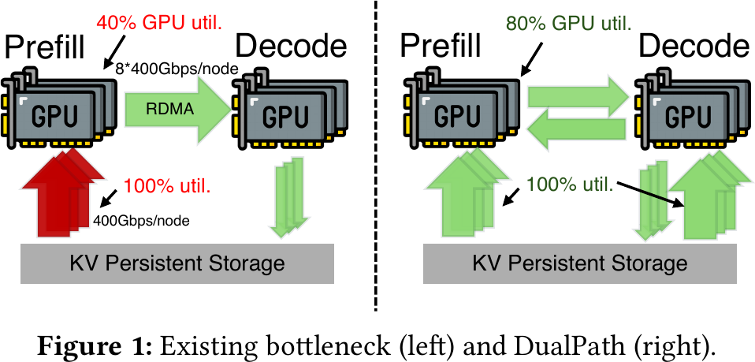

*图 1：传统路径把存储读取压在 PE 侧；DualPath 同时使用 PE、DE 两侧存储网卡。原论文 Fig. 1，PDF 第 2 页。图中的 40%/80% GPU 利用率是架构示意，不应当作独立实验结果。*

### 1.2 根因是什么

这不是简单的“存储网卡不够快”。论文识别的是三个条件叠加后的结构性失衡：

1. Agent 轨迹长、轮次多、每轮追加短。生产轨迹的平均上下文长度为 32.7K Token，平均追加长度为 429 Token，论文据此计算出 98.7% 的 KV 命中率。
2. GPU 算力增长快于网络带宽和 HBM 容量。新增 Token 的计算越来越快，历史 KV 的加载占比随之上升。
3. PD 分离后，PE 和 DE 的存储网卡属于不同节点，但现有读取路径只用 PE 侧网卡。与此同时，计算网络带宽更高，集体通信呈亚毫秒级突发，并非持续占满。

### 1.3 核心洞察是什么

因为命中 KV 最终既要参与 Prefill，又要成为 Decode 的初始状态，所以它不必总由 PE 侧先回源。系统可以让 DE 侧先从存储读取，再借计算网络把当前层 KV 传给 PE；这条新路径与传统 PE 读取路径并存，调度器按两侧负载选择路径。

资源变化可以概括为：

```text
PE 单侧存储网卡持续饱和
        ↓
PE/DE 两侧存储网卡共同回源 + 计算网络转运
        ↓
存储读取带宽从固定节点资源变成集群可调度资源
```

### 1.4 核心抽象是什么

DualPath 把一次 KV 读取表示成二选一的加载计划：

- **PE Read Path**：存储 → PE Host DRAM → PE HBM → DE Host DRAM；
- **DE Read Path**：存储 → DE Host DRAM → PE HBM，PE 只把新增 Token 的 KV 回传给 DE。

路径选择与 PE/DE 配对、存储读队列、GPU Token 负载一起由中央调度器决定。论文没有增加独立缓存层，而是增加了“读取位置 + 转运路径 + 计算放置”的联合调度能力。

### 1.5 四项关键方法速览

#### 方法一：用 DE 侧回源路径汇聚闲置存储带宽

- **问题**：所有命中 KV 都由 PE 节点读取，PE 存储网卡满载，DE 存储网卡闲置。
- **方法**：保留 PE 读取路径，同时增加“存储 → DE → PE”的读取路径；两条路径都按层把数据送入 PE 计算。
- **效果**：可用回源带宽从 PE 节点扩展到 PE 与 DE 节点总和，缓解 PE 侧排队。
- **关键证据**：消融实验中，在 Layerwise Prefill 之上加入双路径加载，JCT 相对 Basic 的平均降幅从 17.21% 扩大到 38.19%（原论文 Fig. 12，DS 660B、64K、1024/2048 Agents）。

#### 方法二：把 KV 搬运汇聚到计算网卡并使用硬件优先级隔离

- **问题**：额外 KV 流量会与专家并行 AllToAll、张量并行 ReduceScatter/AllGather 等前台通信争用 PCIe 和计算网络；亚毫秒突发又很难靠软件定时避让。
- **方法**：Host↔GPU 搬运也经 GPU 配对计算网卡发起 RDMA，所有 GPU 入出流量统一经过同一硬件仲裁点；模型通信进入高优先级 InfiniBand Virtual Lane，KV 流量进入低优先级通道。
- **效果**：KV 流量使用前台通信留下的带宽，硬件仲裁器优先保证模型通信。
- **关键证据**：附录微基准中，EP16 的 DeepEP dispatch 在每端口 20 GB/s 后台流量下从 131 μs 恶化到 877 μs；启用 VL 隔离后为 141 μs。该结果位于未同行评审的附录，应按附录证据使用。

#### 方法三：联合平衡 PE/DE 计算负载与存储读队列

- **问题**：只按 GPU 空闲度或轮询分配会把新路径再次压成热点。
- **方法**：以未完成 Token 数、请求数和节点存储读队列为输入，先选择 PE/DE，再选择读队列较短的一侧回源。
- **效果**：存储网卡流量和 GPU 工作量更均匀，降低最慢节点形成的同步空洞。
- **关键证据**：存储网卡 Max/Avg 从轮询的 1.53 降到 1.18；相应理论可达峰值利用率由 65.4% 提高到 84.7%。

#### 方法四：用计算配额限制 Prefill 批内注意力失衡

- **问题**：数据并行 Attention 后，各 GPU 必须同步进入 FFN；某卡承担的上下文更长时，其他卡会等待。
- **方法**：离线拟合 Attention 计算量与执行时间，按 300 ms 计算配额装填批次；最后一个请求超额时用 Chunked Prefill（分块首字预计算，即把长 Prompt 分块执行）截取合适的追加 Token 数。
- **效果**：批内 Attention 执行时间更接近，减少进入 FFN 前的等待。
- **关键证据**：论文在任务前 5% 阶段报告 Attention 执行时间 Max/Avg 最低约 1.06；后续低负载阶段该比值失去解释意义。

### 1.6 最重要的实验结果

- **离线 Agent rollout**：相对同一内部框架 Basic，DualPath 在 DS 660B 上最高提升 1.87×，在 DS 27B 上最高提升 1.78×。
- **在线服务容量**：在 TTFT（Time To First Token，首 Token 响应时间）≤4 s、TPOT（Time Per Output Token，每个输出 Token 生成耗时）≤50 ms 的条件下，DS 27B 和 DS 660B 的 Agent 到达率容量分别为 Basic 的 1.67×、2.25×；论文摘要给出的平均在线吞吐提升为 1.96×。
- **消融**：Layerwise Prefill、双路径加载、联合调度依次加入后，相对 Basic 的平均 JCT 降幅为 17.21%、38.19%、45.62%。这组结果直接说明双路径是主要增益来源，调度继续释放了一部分带宽。
- **大规模运行**：最多使用 1,152 GPU。2P4D 处理 2K Agents 的 JCT 为 3,167 s，48P96D 处理 48K Agents 的 JCT 为 3,201 s。它证明系统能按工作量同比扩大规模，但作者明确说明，未精调并行度和 P/D 比，因此没有证明大集群的单位成本效率优于多个小集群。

### 1.7 最大局限

论文最强结果成立在一组明确的基础设施和负载条件下：独立的计算网与存储网、每节点 8 张 Hopper GPU、每张 GPU 配 400 Gbps RDMA 计算网卡、另有 400 Gbps 存储网卡、3FS 能打满存储链路、高 KV 命中率、短追加和短生成。缺少独立双网、硬件优先级队列，或者前台通信长期占满计算网时，第二条路径可用的“剩余带宽”会明显收缩。

更重要的是，DualPath 的数据路径先把 KV 读入 Host DRAM，再经计算网卡搬入 GPU。它不满足本项目“正文数据绕过 Host DDR”的主路径目标，不能用来证明 Host CPU 零数据拷贝已经可行。

### 1.8 为什么与本项目相关

- **必要性证据**：论文独立确认，高命中 Agent 推理可能由 KV 存储 I/O 主导，而且固定的单侧回源会造成严重带宽失衡。
- **可行性证据**：把备用网卡和另一张网络组织成受调度的数据路径，可以提高端到端吞吐；硬件优先级队列能把前台模型通信与后台 KV 搬运隔开。
- **差异化空间**：论文没有处理国产 AI 硬件、异构互连、正文绕过 Host DDR、语义一致性、多卡协同回退、故障租约和 P99 混压门限，这些仍是本项目需要独立解决的问题。
- **剩余举证责任**：论文不能证明本项目 E3 全链路目标，也不能证明远端直读、NVMe SSD 与 NPU HBM 直达或微秒级动态选路已经在目标硬件上成立。

## 2. 为什么 Agent 推理会从计算受限转向 I/O 受限

### 2.1 长上下文、短追加让每轮工作量失衡

普通聊天的上下文和轮次相对有限。Agent 会持续调用终端、浏览器或 Python 工具，一条轨迹可能有几十到上百轮。新一轮 Prompt 包含此前完整上下文和少量工具输出，因此历史 KV 很多，新增计算很少。

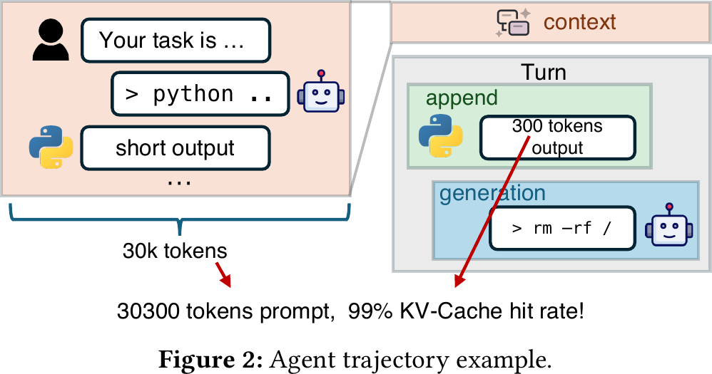

*图 2：30K 历史上下文只追加 300 Token 时，示意命中率约 99%。原论文 Fig. 2，PDF 第 3 页。*

论文的三组生产 Agent RL 轨迹各含 500 条 trajectory：

| 最大上下文 | 平均轮次 | 平均追加 Token | 平均生成 Token | 平均总 Token | 平均上下文 Token |
|---:|---:|---:|---:|---:|---:|
| 32K | 60 | 608 | 148 | 28,639 | 17,183 |
| 48K | 106 | 474 | 172 | 42,607 | 25,120 |
| 64K | 157 | 429 | 176 | 55,958 | 32,721 |

64K 轨迹中，平均上下文 32,721、追加 429，对应论文给出的 98.7% KV 命中率。这个数字说明每轮需要搬运的历史状态远大于新增计算量，并不表示提高缓存容量本身就一定有收益。

### 2.2 不同模型的 I/O/计算比差异很大

论文用 GB/PFLOP 表示加载历史 KV 与计算追加 Token 的比例。追加长度固定为 429 Token、上下文为 16K～64K 时，各模型相差一个数量级以上。

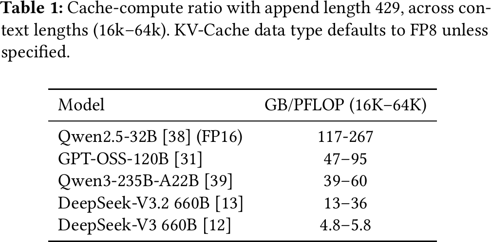

*图 3：不同模型的 Cache-compute ratio。原论文 Table 1，PDF 第 4 页。除 Qwen2.5-32B 使用 FP16 外，KV 默认使用 FP8。*

Qwen2.5-32B 的 117～267 GB/PFLOP 明显高于 DeepSeek-V3 的 4.8～5.8 GB/PFLOP。DualPath 在某个模型上有效，不代表同一倍数可以外推到另一种注意力结构或 KV 精度。

### 2.3 硬件演进继续放大不平衡

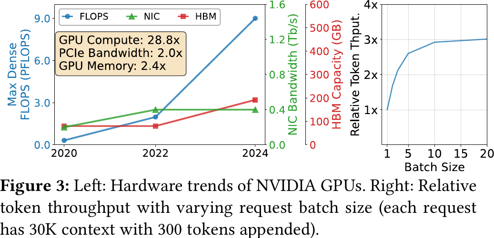

*图 4：左侧对比 GPU 算力、网卡带宽与 HBM 容量的代际增幅；右侧展示 30K 上下文、追加 300 Token 时相对吞吐随批量增长的变化。原论文 Fig. 3，PDF 第 4 页。*

论文称，从 Ampere 到 Blackwell，I/O-compute ratio 下降 14.4×。其物理含义是每单位计算能力可获得的网络带宽更少。HBM 容量增长也落后于计算能力，Layerwise Prefill 虽能扩大批量，却会让单位时间内需要加载的 KV 更多，从而把瓶颈进一步推向存储链路。

### 2.4 为什么“加一张更快的 PE 存储网卡”不够

单独扩容 PE 存储网卡有三点问题：

- 通用 GPU 集群的节点网络配置通常是标准化的，给 PE 定制更多南北向带宽会增加部署和运维成本；
- PE/DE 比例会随模型、上下文和业务负载变化，固定扩容容易在另一个阶段形成闲置；
- 集群已经有 DE 侧存储网卡和更高总带宽的计算网络，只是现有软件没有把它们纳入 KV 读取路径。

DualPath 因此选择重新分配已有资源，而不是只增加 PE 单点带宽。

## 3. 核心抽象与系统设计

### 3.1 双路径加载的完整数据流

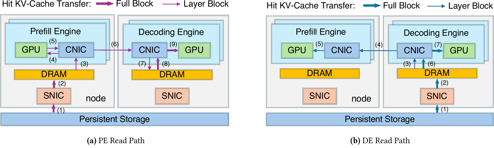

*图 5：PE Read Path 与 DE Read Path。原论文 Fig. 4，PDF 第 5 页。紫色表示 PE 读取，蓝色表示 DE 读取；粗线为 Full Block，细线为 Layer Block。*

#### PE 读取路径

1. 命中 KV 以 Full Block 从 3FS 读入 PE Host DRAM。
2. Prefill 每执行一层前，该层 KV 通过计算网卡辅助的 H2D 搬入 PE HBM。
3. PE 计算本轮新增 Token 的 KV。
4. 命中 KV 与新增 KV 合并后，经计算网络传入 DE Host DRAM。
5. DE 在 Decode 开始前再把完整 Prompt KV 搬入 HBM。

这条路径与传统 PD 分离接近。它的问题是命中 KV 先进入 PE，计算后又要传到 DE，PE 存储网卡承担全部回源。

#### DE 读取路径

1. 命中 KV 以 Full Block 从 3FS 读入 DE Host DRAM。
2. Prefill 执行某层前，DE 只把该层命中 KV 通过 RDMA 传给 PE HBM。
3. PE 完成该层新增 Token 的计算后，只把新增 KV 回传给 DE Host DRAM。
4. DE 把已有命中 KV 与新增 KV 组合起来，Decode 前一次性搬入 HBM。

这条路径省去了“命中 KV 从 PE 再完整传回 DE”的动作。代价是 DE Host DRAM、DE 计算网卡和 PE 计算网卡承担更多流量。

### 3.2 两种 Block 布局

论文使用两种物理布局：

- **Full Block** 保存某段 Token 的全部层 KV，用于与存储系统交互；
- **Layer Block** 只保存某段 Token 的一层 KV，用于 Layerwise Prefill 期间的 Host↔GPU 和 PE↔DE 流式传输。

附录说明，Layer Block 形状为 `[1, tokens, bytes]`，Full Block 形状为 `[layers, tokens, bytes]`，将各层 Layer Block 拼接即可得到 Full Block。这个设计把“存储需要连续大块”和“计算按层消费”分开，减少显式布局转换。

### 3.3 无瓶颈区间只是条件模型，不是实测保证

论文对 PE/DE 计算网卡、PCIe 和 DRAM 压力建模。设每节点有 `g` 张 GPU，每张 GPU 配带宽 `B` 的计算网卡，节点存储带宽为 `s×B`，Host 内存带宽为 `M`，得到 P/D 比的条件范围：

$$
\frac{s}{g-s}\le \frac{P}{D}\le
\min\left\{
\frac{g-2s}{s},
\frac{g-s}{2s},
\frac{M/(sB)-3}{2}
\right\}
$$

代入论文示例 `g=8`、`s=1`、`M≈500 GB/s`、`sB≈50 GB/s`，范围是：

$$
\frac{1}{7}\le \frac{P}{D}\le \frac{7}{2}
$$

这是**论文模型推导**，依赖以下前提：每个 GPU 与网卡共享合适的 PCIe leaf switch、任务已均衡、计算网络没有拥塞、存储读带宽被打满、DRAM 按论文的半双工流量模型估算。任何一个前提不成立，都不能直接套用这个范围。

### 3.4 状态和责任边界

| 组件 | 负责的状态/决策 | 是否在关键路径 | 主要风险 |
|---|---|---|---|
| Inference Engine | 每张 GPU 的 Prefill 或 Decode 执行、KV Block 生命周期 | 是 | GPU/Token 负载不均；HBM 不足 |
| Traffic Manager | 存储读写、Host↔GPU、PE↔DE 搬运和优先级 | 是 | PCIe/DRAM/CNIC 争用；低优先级饥饿 |
| Central Scheduler | PE/DE 配对、读取侧选择、批次装填 | 是 | 指标滞后、阈值失配、中心化扩展和故障 |
| 3FS | Full Block 持久化和读取 | 是 | 存储队列与元数据行为决定回源延迟 |

论文没有给出跨请求 KV 的语义版本、租约、Ready 状态和故障恢复协议。评测中，除 SGL(MC) 外，命中只发生在同一 trajectory 内，命中长度由客户端计算，并且不需要淘汰。这个设置有利于隔离 I/O 性能，但绕开了生产缓存目录和一致性问题。

## 4. 关键技术实现与作用机理

### 4.1 DE 侧回源与按层转运

#### 解决的问题

传统 PD 分离把命中 KV 的加载责任固定给 PE。PE 的存储网卡一旦满载，增加 DE 或提高 DE GPU 利用率也不能提高整体吞吐。

#### 核心方法与执行路径

DualPath 对每个请求选择 PE 或 DE 一侧回源。DE 路径先把 Full Block 放在 DE Host DRAM，再按层向 PE HBM 发送；PE 只把本轮新计算的 KV 回传。传输与 Layerwise Prefill 重叠。

#### 为什么有效

```text
优化前：PE SNIC 回源 N 字节，DE SNIC 空闲
优化后：PE/DE SNIC 分担 N 字节，DE 路径再使用计算网转运
```

数据总量没有凭空消失。系统把一部分流量从 PE 存储网卡迁到 DE 存储网卡和计算网络，收益来自消除单点饱和，而不是减少 KV 的字节数。

#### 论文证据、亮点与局限

消融中双路径加载贡献最大。P/D 比实验还显示，当 Basic 的 PE 节点数增加到具有相同可用存储带宽时，其性能会接近相应 DualPath 配置，这反过来支持“存储带宽是主瓶颈”的判断。

局限也很直接：计算网必须有足够空闲带宽；DE Host DRAM、PCIe 和计算网卡不能成为新瓶颈；高 KV 命中、短追加时收益更大。当前实现只让一个请求从 PE 或 DE 一侧读取，没有把同一请求拆到两侧并行回源，作者把它列为未来工作。

#### 对项目的意义

**需要改造后采用**。本项目可以把“经中继节点回源”加入查询与放置计划决策引擎（QueryPlan，即根据链路、存储、算力和上下文状态选择加载或重算路径的控制模块）的候选动作，但不能照搬 Host DRAM 中转。候选路径至少要记录：源介质、回源节点、转运链路、预计字节、目标可见性、Host DDR 是否被正文触碰，以及回退动作。

### 4.2 计算网卡汇聚与硬件优先级隔离

#### 解决的问题

DualPath 把 KV 流量引入计算网络和 PCIe。如果这些流量与模型执行通信平等竞争，专家并行、张量并行或上下文并行的短突发延迟会被放大，TPOT 可能恶化。

#### 核心方法与执行路径

1. 存储先把 KV 读入 Host DRAM。
2. Traffic Manager 不使用 CUDA Copy Engine 直接 H2D，而是向 GPU 配对计算网卡提交本地 RDMA Write。
3. 模型通信映射到高优先级 InfiniBand VL，KV 搬运映射到低优先级 VL。
4. 网卡和交换机按加权轮询仲裁。论文配置约 99.9% 带宽优先保障高优先级通道，低优先级保留少量份额以避免完全饿死。

#### 为什么有效

CUDA Copy Engine、GPUDirect Storage 和计算网卡原本由不同硬件单元发起，GPU 本身又缺少统一的 PCIe QoS 仲裁。DualPath 把 Host↔GPU 搬运也交给计算网卡，使所有 GPU I/O 经过同一个可配置优先级的硬件出口。前台短突发由硬件立即抢占服务，不依赖软件在微秒时间尺度猜测空隙。

#### 论文证据、亮点与局限

论文测得单次 `cudaMemcpyAsync` 提交约 5～7 μs，单次 RDMA Write Work Request 提交约 1 μs；Doorbell batching 还能摊薄提交成本。附录的 VL 微基准在每端口 20 GB/s 后台流量下把 DeepEP dispatch 从无隔离时的 877 μs 恢复到 141 μs，接近无后台的 131 μs。

这不等于“KV 流量没有代价”。99.9% 静态权重适合论文的前台短突发与后台弹性搬运；如果前台通信长期占满，低优先级 KV 会积压。以太网/RoCE 可用 PCP 和硬件队列表达同一原则，但论文没有实测 RoCE 下的 PFC、ECN、交换机缓冲和多租户行为。

#### 对项目的意义

**原则可直接采用，具体实现必须重做**。前后台服务质量保障策略（通过网卡硬件优先级和应用层动态退避，限制后台迁移对在线推理的影响）应保留硬件仲裁这一层；本项目面向 RoCE/国产网卡时，需要重新验证 DSCP/PCP 到硬件队列的映射、PCIe 共享路径、PFC/ECN 行为和 TPOT P99。论文支持“硬件 QoS 有必要”，不支持“固定 99.9% 权重适合所有负载”。

### 4.3 跨引擎配对与读取侧选择

#### 解决的问题

双路径只增加容量，不自动产生均衡。如果调度器持续选择同一组 PE、DE 或同一侧存储网卡，热点会换位置而不会消失。

#### 核心方法与执行路径

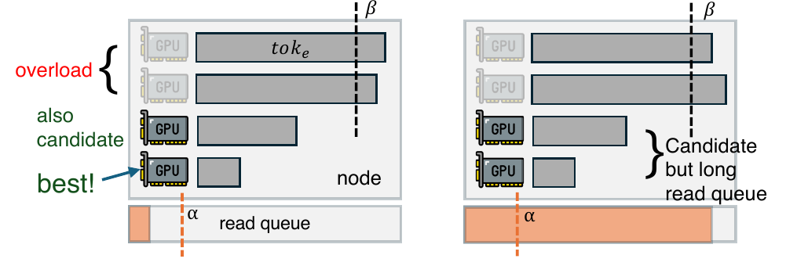

*图 6：PE 按未完成 Token 上限 β 和存储读队列阈值 α 分组。原论文 Fig. 5，PDF 第 7 页。*

1. 每个引擎组只有 Rank 0 与中央调度器交互，降低调度请求量。
2. PE 报告未完成请求数、未完成 Token 数和节点存储读队列长度。
3. 调度器先排除 Token 负载超过 β 的 PE，再优先选择读队列不超过 α 的节点；同类中选择 Token 最少的 PE。
4. DE 先跨组按总 Token 数分配，再在组内结合 HBM 剩余量、请求数和 Token 数选择具体 DE。
5. PE/DE 确定后，从存储读队列较短的一侧读取 KV。

阈值 α 是 3 秒可读取的 Token 数，β 是单 GPU 5 秒可处理的 Token 数，均离线画像得到。

#### 为什么有效

Token 数同时影响 Attention 计算量、KV 字节量和存储排队，作为一个低成本代理指标有工程价值。调度器又加入实际读队列长度，避免只看 Token 而忽略存储拥塞。

#### 论文证据、亮点与局限

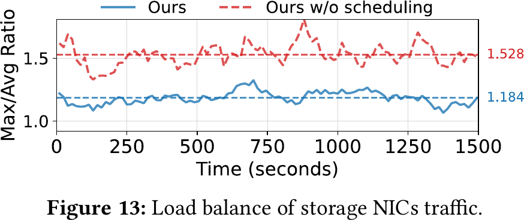

*图 7：加入调度后，存储网卡 Max/Avg 的均值由 1.528 降到 1.184。原论文 Fig. 13，PDF 第 11 页。*

调度把理论可达峰值存储带宽利用率从 `1/1.53=65.4%` 提高到 `1/1.18=84.7%`。这是由 Max/Avg 推出的派生值，不是网卡计数器直接测得的平均利用率。

阈值依赖离线画像，存储性能变化时不能自适应；Token 数也不能表达拓扑、分层介质、重传、优先级队列和突发 Incast。中央调度器的容错协议与一致性状态未展开。

#### 对项目的意义

**需要改造后采用**。论文的读队列和 Token 负载可以作为成本预估模型输入，但不应成为唯一依据。本项目还要加入链路实时带宽、路径队列、介质尾延迟、目标 HBM 水位、转换成本、前台截止时间和预测/实际路径偏差，并用反事实最优路径计算决策后悔值。

### 4.4 计算配额驱动的批内均衡

#### 解决的问题

在数据并行 Attention、同步 FFN 的执行方式下，不同 GPU 的 Attention 时间由各自请求上下文决定。最慢卡完成前，其余 GPU 只能等待。

#### 核心方法与执行路径

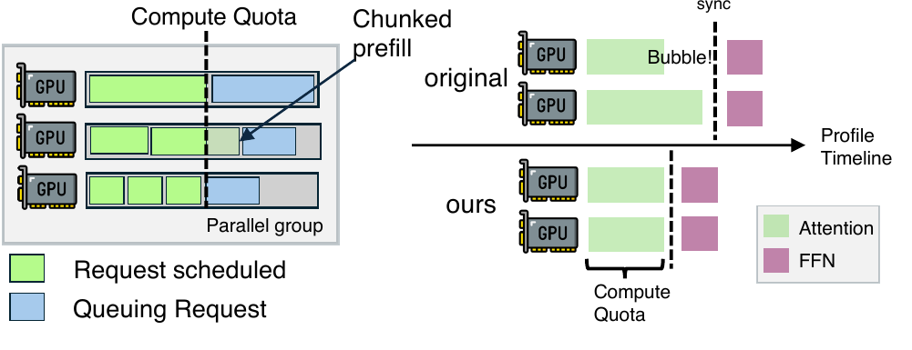

*图 8：计算配额限制批内 Attention 时间，必要时截断最后一个请求的 Prefill Token。原论文 Fig. 6，PDF 第 8 页。*

调度器把每个请求表示成 `(cached, bsz)`：`cached` 是已有 KV 的 Token 数，`bsz` 是本批需要新算 KV 的 Token 数。系统用离线拟合模型估算 Attention 执行时间，按 FIFO 加入请求，直到 300 ms 配额将被突破；最后一个请求通过二分搜索缩小 `bsz`，剩余部分留到下一个 Chunk。

#### 为什么有效

它约束的是每次同步点前的最长 Attention 时间，而不是简单限制请求个数。批内长上下文差距缩小后，其他 GPU 等待最慢卡的空洞随之减少。

#### 论文证据、亮点与局限

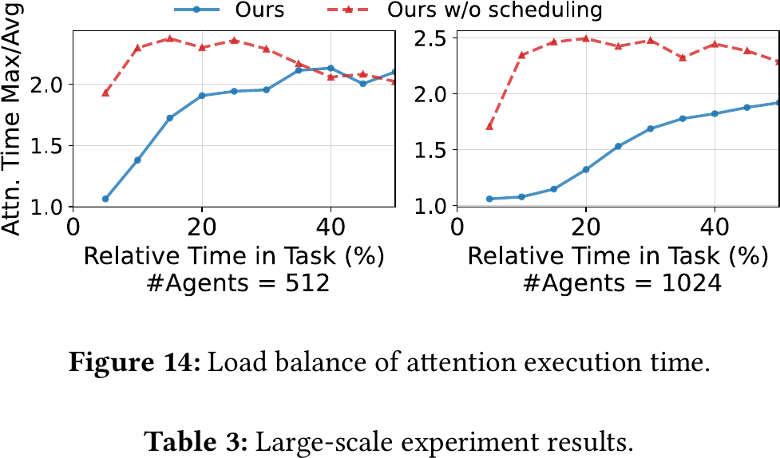

*图 9：512/1024 Agents 下加入调度前后的 Attention 执行时间 Max/Avg。原论文 Fig. 14，PDF 第 11 页。*

论文称任务前 5% 的 Max/Avg 最低约 1.06。图中后续阶段随着系统转为空载，比例本身不再有稳定含义，所以作者没有展示尾段。

这套估算依赖模型、并行配置和硬件画像。它没有处理画像漂移，也没有给出误差分布。300 ms 是论文配置，不是通用门限。

#### 对项目的意义

**启发为主**。本项目关心的是 KV 搬运、前台推理与多卡同步形成的完整流组，不能只按 Attention FLOPs 均衡。可借鉴“直接预测同步点前执行时间”的思路，把最慢必要子流、首层就绪时间和多卡状态同步耗时纳入批次预算。

## 5. 实验到底证明了什么

### 5.1 实验条件

| 类别 | 论文设置 |
|---|---|
| 集群 | 每节点 8×NVIDIA Hopper GPU、双 CPU；8×400 Gbps InfiniBand RDMA 计算网卡；1×400 Gbps 3FS 存储网卡；计算网与存储网物理隔离 |
| 存储 | 3FS，无内部 DRAM Cache，可打满 400 Gbps 存储网卡 |
| 模型 | DeepSeek-V3.2 660B（稀疏注意力 MoE）、内部 DS 27B、Qwen2.5-32B（GQA） |
| 内存 | DeepSeek 模型 DualPath 每节点 80 GB DRAM；SGL(MC) 每节点总计 1.5 TB；Qwen 32B DualPath 每节点 320 GB |
| 默认 P/D | DS 660B：2P4D；Qwen 32B：1P2D；DS 27B：1P1D |
| 并行 | DS 660B PE EP16、DE EP32；DS 27B 两侧 EP=DP=8；Qwen 的 DualPath/Basic/Oracle 为 DP=8，SGL(MC) 为 TP=8 |
| 离线负载 | 每组 500 条生产 Agent RL 轨迹，同时启动若干 Agent，测全部完成的 JCT |
| 在线负载 | Poisson 到达，轨迹从首轮回放到末轮；测 APS、TTFT、TTST、TPOT |
| 在线 SLO | TTFT≤4 s，TPOT≤50 ms；超过 SLO 的 TPOT/TTST 数据点不画出 |
| 软件 | 内部框架 + FlashMLA/DeepGEMM/DeepEP，约 5K 行改动；关闭推测解码 |

### 5.2 基线与可比性

- **Basic**：未修改的内部框架，是论文主要增益分母。
- **Oracle**：基于 DualPath，绕过磁盘读、D2H/H2D 和 PE↔DE KV 传输，表示零 I/O 开销的理论上界。
- **SGL(MC)**：SGLang commit `19089aa` + HiCache + Mooncake Store + 3FS + Mooncake Transfer Engine。

论文主动指出，内部框架与 SGL(MC) 实现不同，直接比较不公平，因此正式倍数主要报告 Basic→DualPath。还需注意：DS 27B 无 SGL(MC) 支持；SGL(MC) 在部分大配置运行报错；Qwen 32B 的 SGL(MC) 使用 TP=8，而内部框架使用 DP=8。报告不能据此声称 DualPath 以某个统一倍数击败 Mooncake/SGLang。

### 5.3 主张—证据对照

| 主张 | 实验 | 结果 | 能证明什么 | 不能证明什么 |
|---|---|---|---|---|
| PE 单侧存储带宽是主要瓶颈 | DS 27B 改变 P/D 比 | DualPath 平均 1.64×、最高 2.46×；同等可用存储带宽的配置性能接近 | 增加可用存储网卡与性能高度相关 | 不能证明计算网永不拥塞，也不能证明所有模型都存储受限 |
| 双路径是主要增益来源 | DS 660B、64K、1024/2048 Agents 消融 | +Layer −17.21% JCT；+DPL −38.19%；+Sched −45.62% | 双路径贡献超过仅 Layerwise Prefill，调度还有额外收益 | 不能把 45.62% 全部归给调度；各阶段是累加配置，不是独立正交消融 |
| 高命中、短追加时收益更大 | 追加/生成长度扫描 | 不同追加倍数下相对 Basic 1.82～1.99×；追加/生成变长后 Basic 接近 DualPath/Oracle | 收益受 I/O/计算比控制 | 不能外推到低命中普通聊天或长生成任务 |
| 在线容量提高且 TPOT 不明显恶化 | DS 27B/660B 在线 Poisson 到达 | APS 容量为 Basic 的 1.67×/2.25×；TPOT 曲线接近 Basic | 在论文 SLO 和负载下，额外路径未显示明显 Decode 干扰 | 超 SLO 的 TPOT/TTST 点未画出；没有 P99 分位数和 Qwen 在线结果 |
| 调度改善资源均衡 | 存储网卡与 Attention Max/Avg | SNIC 1.53→1.18；Attention 任务早期最低约 1.06 | 调度减小热点和同步空洞 | 不能证明所有时段或突发负载都均衡 |
| 可扩展到千卡规模 | 2P4D/2K 与 48P96D/48K；2P4D/0.4 APS 与 44P88D/8.8 APS | 离线 JCT 3,167 s vs 3,201 s；在线吞吐 22×且延迟接近 | 工作量与资源同比扩大时可以维持性能；调度器 CPU<10 核 | 没有证明大集群相对等成本小集群有额外效率收益 |

### 5.4 端到端离线结果

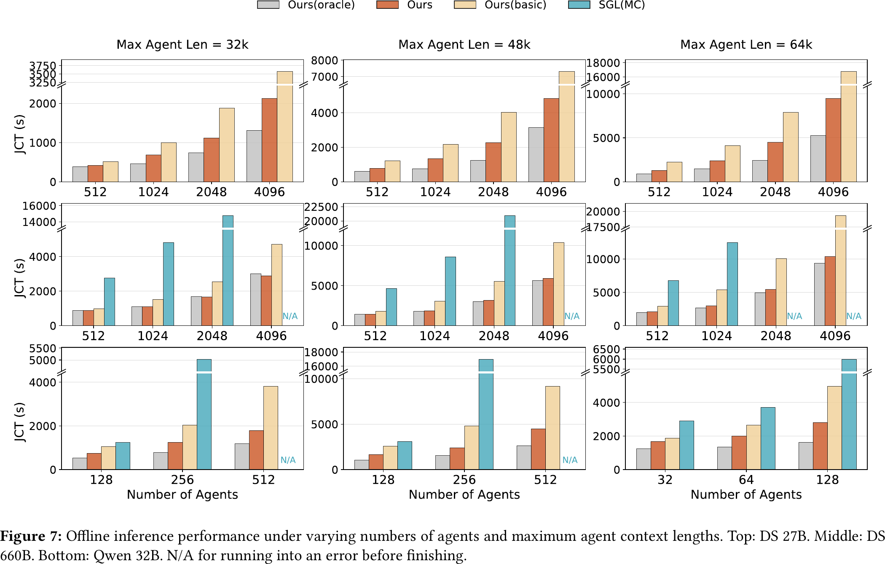

*图 10：DS 27B、DS 660B、Qwen 32B 在不同 Agent 数与最大上下文下的 JCT。原论文 Fig. 7，PDF 第 9 页。SGL(MC) 的 N/A 表示运行报错，不是性能为零。*

DualPath 在 Agents 更多、最大上下文更长时收益更明显。DS 660B 相对 Basic 最高 1.87×，DS 27B 最高 1.78×。Oracle 仍明显更快，说明双路径缓解了 I/O，但没有消除磁盘、Host↔GPU 和 PE↔DE 搬运成本。

### 5.5 P/D 比和负载形态敏感性

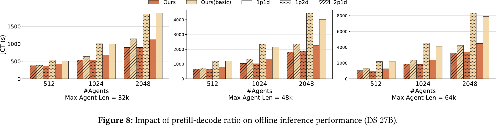

*图 11：DS 27B 在 1P1D、1P2D、2P1D 下的离线 JCT。原论文 Fig. 8，PDF 第 10 页。*

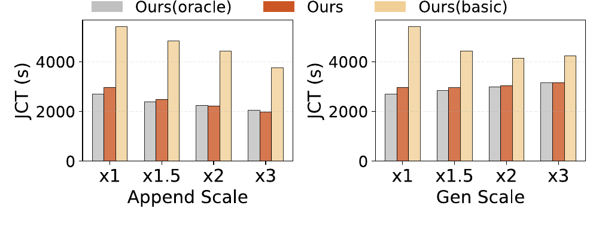

*图 12：DS 660B、64K、1024 Agents 下改变追加和生成长度。原论文 Fig. 9，PDF 第 10 页。*

P/D 比实验的平均加速为 1.64×、最高 2.46×。追加或生成变长时，新增计算占比上升，存储带宽不再是唯一主瓶颈，Basic 会逐步接近 DualPath。这组证据直接给出了适用边界：双路径依赖较高的 KV 加载/新增计算比，不能保证无条件加速。

### 5.6 在线 SLO 与消融

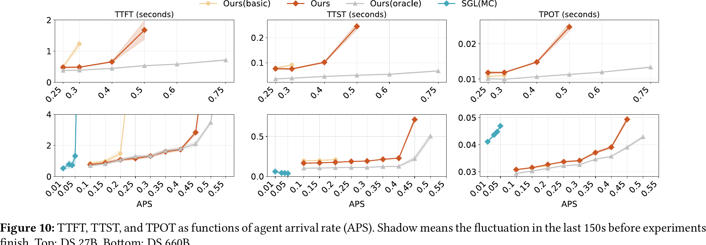

*图 13：DS 27B（上）和 DS 660B（下）随 Agent 到达率变化的 TTFT、TTST、TPOT。原论文 Fig. 10，PDF 第 11 页。阴影是实验结束前 150 s 波动范围。*

DS 27B 和 DS 660B 的 APS 容量分别提高 1.67×、2.25×。DualPath 的 TTST 与 Basic 接近，TPOT 曲线没有显示额外 Decode 开销。但图中超过 SLO 的 TPOT/TTST 点被省略，实验又在 TTFT 超过 4 s 或达到稳态时结束，因此这组图适合支持“SLO 内容量提高”，不适合支持“所有负载下尾延迟稳定”。

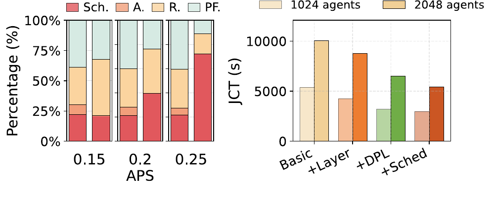

*图 14：左为 DS 660B 在线 TTFT 分解，右为离线消融。原论文 Fig. 12，PDF 第 11 页。`Sch.` 同时包含等待队列时间和调度器计算时间；后者低于 10 ms。*

Basic 的 TTFT 随 APS 增长主要恶化在排队部分；DualPath 通过增加可用回源带宽压低队列增长。消融结果进一步把收益主线定位到双路径与调度，而不是仅靠 Layerwise Prefill。

### 5.7 千卡规模结果

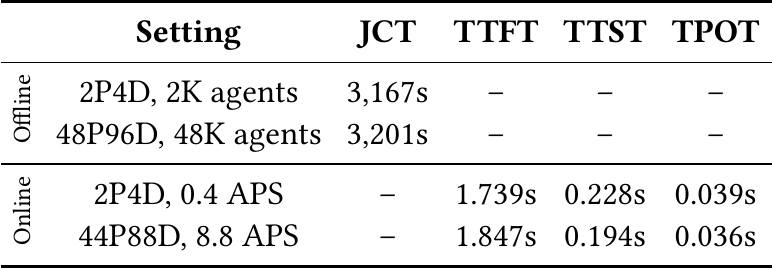

*图 15：2P4D/2K Agents 与 48P96D/48K Agents 的离线结果，以及 2P4D/0.4 APS 与 44P88D/8.8 APS 的在线结果。原论文 Table 3，PDF 第 11 页。*

大规模实验表明，资源扩大 24 倍、工作量也扩大 24 倍时，离线 JCT 基本不变；在线资源扩大约 22 倍，APS 也扩大 22 倍，TTFT/TTST/TPOT 接近。作者同时写明，因并行度和 P/D 比没有充分调优，这些实验没有显示相对于等成本小规模单元的额外 JCT 或服务容量收益。

## 6. 技术亮点与局限成对分析

| 技术点 | 亮点 | 限制价值的条件 |
|---|---|---|
| 双路径回源 | 直接利用 DE 侧闲置存储网卡，不要求升级 PE 单点硬件 | 依赖独立双网、计算网剩余带宽和可承受的 DRAM/PCIe 压力 |
| 计算网卡统一仲裁 | 把本地 H2D/D2H 也纳入硬件 QoS，解决软件无法追踪亚毫秒突发的问题 | 绑定 GPUDirect RDMA、InfiniBand VL 或等价硬件能力；静态 99.9% 权重可能导致 KV 积压 |
| 联合调度 | 同时考虑读队列、Token、HBM 和 PE/DE 配对，避免路径热点 | α/β 和执行时间模型都需离线画像；不能感知全部网络与存储状态 |
| Full/Layer Block | 存储按完整对象读写，计算按层流式消费，减少布局转换 | Layerwise Prefill 让 Block 数量增加到层数倍，对元数据和小 I/O 提交提出新要求 |
| 生产轨迹评测 | 覆盖 DS 660B、内部 27B、Qwen 32B 和最多 1,152 GPU | 命中限定在单 trajectory、客户端计算、无需淘汰；在线不含 Qwen 32B，工具调用等待被省略 |

## 7. 论文没有解决什么

### 7.1 没有给出 Host DDR 绕过路径

DualPath 的 PE/DE Buffer 都位于 Host DRAM。存储读取先落 DRAM，再由计算网卡搬入 GPU。论文优化的是网卡利用率和 QoS 仲裁，不是正文绕过 Host DDR。

### 7.2 没有处理跨请求语义兼容和租约

评测把缓存命中限制在同一 trajectory，并由客户端计算命中长度。模型版本、Tokenizer、Prompt 模板、LoRA、Ready 状态和租约有效性没有进入消费资格判断。跨用户共享缓存时，这些条件不能省略。

### 7.3 没有给出路径失败后的状态机

论文没有展开 DE 中继故障、PE/DE 重启、部分层已传输、RDMA 超时、存储重试和取消请求时如何回滚。双路径增加了中间状态，生产实现需要明确“已从存储读出”“PE 当前层可见”“DE 完整 Prompt 可见”等不同完成点。

### 7.4 没有验证 RoCE、多租户和 P99 混压

作者说明以太网可以使用 802.1Q PCP 和硬件队列，但实测基于 InfiniBand VL。论文没有覆盖 PFC/ECN、交换机共享缓冲、多租户队列、持续前台大流量和 TPOT P99。

### 7.5 没有在线调整 P/D 比和调度阈值

α、β、计算配额和并行配置都离线画像。作者把动态 P/D、模拟器或在线调节列为未来工作，大规模部署的 TTFT percentile 也仍有改进空间。

### 7.6 没有证明其他存储后端可获得同样结果

所有实验都使用 3FS，并强调其无内部 DRAM Cache、可打满 400 Gbps SNIC。其他 NVMe 池、对象存储或文件系统的元数据路径、排队策略、缓存和失败行为不同，不能直接套用倍数。

## 8. 对本项目的迁移判断

### 8.1 可直接采用的原则

1. **将回源位置纳入路径计划**：查询命中之后，还要决定从哪一侧、哪一介质、经哪条网络把 KV 送到执行设备。
2. **以硬件优先级保护前台通信**：应用层退避无法独自处理亚毫秒突发，网卡和交换机队列必须参与。
3. **同时记录计算与 I/O 负载**：只做缓存亲和或只做 GPU 负载均衡都不够。
4. **把存储布局与计算布局分开**：Full Block/Layer Block 的原则可迁移为连续数据块描述符和按层执行视图，不必复制论文的具体内存格式。

### 8.2 需要改造的部分

#### 将双路径扩展为多候选路径

本项目面对 HBM、NVMe SSD、远端显存和不同互连。路径计划不应只有 PE/DE 二选一，而应比较：本地已接入、拷贝到本地 HBM、远端直读、SSD 回源、经中继节点回源和本地重算。只有在“拉取与加载总开销 < 本地直接重算耗时”时才执行加载。

#### 用设备直达替换 Host DRAM 中转

URMA（通用远程直接内存访问，即用户态高性能 RDMA 驱动接口与通信协议）或 UBMEM（统一总线内存直通共享协议，即跨节点和异构设备共享内存地址空间的底层协议）若具备设备侧 DMA 能力，应优先验证存储/远端设备到 NPU HBM 的直达路径。DualPath Host DRAM Buffer 可以保留为兼容或降级方案，不能成为默认主路径。

#### 从静态权重改为前后台联合闭环

论文的 99.9% VL 权重是一个静态配置。本项目需要硬件队列与应用层动态退避共同工作：观察 TPOT P99、队列积压、重传和后台完成率，根据前台 SLO 调整低优先级预算，并保证恢复过程不会振荡。

#### 从 Token 代理升级为版本化成本模型

Token 数可以快速估算，但还要加入实测链路带宽、存储队列 P99、布局转换、目标 HBM 水位、优先级、首层就绪时间和错误重试。每次计划应记录预测路径与实际路径，才能判断模型误差和决策后悔值。

#### 补齐状态可见性与多卡一致动作

PE/DE 双路径引入至少三个完成状态：存储读取完成、当前层在 PE 可见、完整 Prompt KV 在 DE 可见。项目实现还需在 TP=8 等多卡并行中同步命中与回退动作，避免部分 Rank 开始加载、部分 Rank 已重算后进入集合通信。

### 8.3 不宜照搬的部分

- 不照搬 Host DRAM 作为所有路径的正文中转；它与项目的正文绕过 Host DDR 目标冲突。
- 不照搬 α、β 和 300 ms 计算配额；这些值只对应论文平台和模型。
- 不照搬中央 FIFO 调度器作为唯一控制面；需要评估故障、扩展和多租户隔离。
- 不把 99.9% 高优先级权重固化为生产常数。
- 不把“计算网当前无拥塞”当作架构前提；它只能是运行时观测和准入条件。
- 不用论文的 1.87×/1.96×替代本项目在国产 AI 硬件上的目标实测。

## 9. 对本项目立项的支持边界

### 9.1 必要性证据

论文独立支持以下问题判断：

- 高命中、短追加、多轮 Agent 负载会把瓶颈从新增计算推向 KV 存储 I/O；
- PD 分离后，固定 PE 单侧回源会浪费 DE 节点已有存储带宽；
- 仅按缓存命中调度不足以解决存储队列和计算负载失衡；
- KV 后台流量若缺少硬件队列隔离，会明显放大模型通信延迟。

这些证据说明，面向国产 AI 硬件的统一异构 KVCache 存储与调度底座需要把路径、负载和 QoS 放在同一个控制闭环里。

### 9.2 可行性证据

- 双路径把离线 JCT 平均降幅从 Layerwise Prefill 的 17.21%扩展到 38.19%，说明调动闲置回源带宽在端到端系统中可行。
- 联合调度把存储网卡 Max/Avg 从 1.53 降到 1.18，说明路径选择必须和资源负载一起决定。
- InfiniBand VL 微基准把后台干扰下的 DeepEP dispatch 从 877 μs 恢复到 141 μs，支持硬件优先级隔离这一原则。
- 1,152 GPU 运行和调度器 CPU<10 核说明该控制思路具备规模化实现基础，尽管论文没有证明等成本效率更高。

### 9.3 差异化与继续研发的空间

DualPath 聚焦“如何使用更多存储网卡”，本项目还要解决：

- 异构介质和异构链路的统一能力探测；
- 正文绕过 Host DDR 的设备直达；
- 远端直读与拷贝到本地 HBM 的适用边界；
- 模型、词表、模板、适配器、Ready 与租约的消费资格校验；
- 多卡命中、加载和回退的一致动作；
- RoCE/PFC/ECN 下前后台混压的 TPOT P99；
- 故障、取消、超时和部分完成状态的安全回退。

论文没有覆盖这些问题，因此它支持继续研发的必要性，但不证明本项目方案已经正确。

### 9.4 论文不支持的项目主张

| 项目主张 | DualPath 是否支持 | 原因 |
|---|---|---|
| Host CPU 零数据拷贝、正文绕过 Host DDR | 不支持 | 两条路径都先进入 PE/DE Host DRAM |
| NVMe SSD↔NPU HBM 直达 | 不支持 | 论文使用 3FS→Host DRAM→CNIC→GPU |
| 远端直读安全性与收益边界 | 不支持 | 论文把 KV 按层搬入 PE HBM，不是远端直接解引用 |
| 六维语义消费资格校验 | 不支持 | 命中限定在 trajectory 内，由客户端给出 |
| TP=8 多卡状态同步低于 100 μs | 不支持 | 论文没有评测该项目目标 |
| E3：TTFT 降低≥20%、QPS 提升≥10%、TPOT 干扰<3% | 不支持 | 论文硬件、基线、指标和负载不同，且未给出本项目三组公平混压 |
| RoCE 硬件 QoS 与动态拥塞控制 | 原理支持，结果不支持 | 论文只实测 InfiniBand VL，RoCE 仅作实现类比 |

### 9.5 立项支持结论

DualPath 对本项目的主要价值有两点：它确认了高命中 Agent 负载下存储 I/O 和网卡失衡是真实瓶颈；它用端到端实验说明，路径调度与硬件 QoS 可以把闲置网络资源转化为有效吞吐。它没有覆盖本项目最难的正文直达、异构硬件、语义安全、多卡一致与 P99 混压，因此更适合作为“问题真实、方向可行”的外部证据，而不是项目指标已经达成的证明。

## 10. 建议优先验证

### 10.1 PE 直读、DE 中继与设备直达的交叉点

- **假设**：在高命中、短追加场景下，DE 中继可缓解 PE 存储网卡饱和；具备设备直达时，绕过 Host DRAM 能进一步降低 TTFT 和 PCIe/DDR 压力。
- **变量**：上下文 8K～128K、追加 64～2K、命中率 50%～99%、P/D 比、SNIC/CNIC 带宽、前台通信占用。
- **基线**：PE 单侧回源、本地重算。
- **候选**：DE Host DRAM 中继、NVMe/远端设备→NPU HBM 直达、两侧拆分读取。
- **指标**：TTFT P50/P95/P99、QPS、TPOT P99、各链路字节、Host Payload Touch Bytes、首层就绪时间、重试和实际路径。
- **判定**：仅当加载总开销低于本地重算，且 TPOT 干扰满足项目门限时，路径才进入生产候选集。

### 10.2 InfiniBand VL 原理迁移到 RoCE 的有效性

- **假设**：硬件优先级队列可以隔离前台集合通信和后台 KV 搬运，但静态 99.9% 权重不是最优策略。
- **变量**：DSCP/PCP 映射、队列权重、ECN/PFC、后台流量、前台 AllToAll/AllReduce 模式、Incast 扇入数。
- **基线**：无队列隔离、静态限速。
- **候选**：硬件队列、硬件队列+应用层动态退避。
- **指标**：TPOT P99、集合通信 P99、PFC pause、ECN 标记、重传、后台有效吞吐和恢复时间。
- **判定**：后台实际负载对齐后，前台尾延迟和后台完成率同时满足门限，才说明隔离有效。

### 10.3 静态阈值与动态成本模型对比

- **假设**：α/β 静态阈值在存储抖动和突发到达下会增加错误选路，动态成本模型可以降低决策后悔值。
- **变量**：存储带宽抖动、队列深度、请求分布、P/D 比和 HBM 水位。
- **基线**：论文式静态 α/β 与最短读队列选择。
- **候选**：版本化硬件能力快照+在线队列+反事实最优校准。
- **指标**：决策延迟 P99、路径预测误差、错误加载率、后悔值、TTFT P99。
- **判定**：动态方案不能只提高平均值，还要在决策预算内降低高分位错误选路。

### 10.4 多卡同步与部分完成故障

- **假设**：双路径按层传输时，任一 Rank、路径或中继节点失败都可能让多卡进入不一致动作。
- **变量**：TP=2/4/8、失败层、RDMA 超时、DE 重启、取消时刻、部分 Block 可见。
- **基线**：无协调的各 Rank 独立回退。
- **候选**：多卡状态同步+统一回退+版本化完成点。
- **指标**：错误消费数、集合通信死锁、回退时间 P99、重复字节、泄漏对象和结果正确性。
- **判定**：错误消费必须为 0，所有 Rank 必须进入同一动作并在有界时间内结束或回退。

### 10.5 真实 Agent 工具间隔下的工作集与 SLO

- **假设**：工具调用间隔会拉长 trajectory 生命周期，使活跃 KV 工作集按到达率和 JCT 同时增长，DRAM Cache 命中收益下降，SSD 回源压力上升。
- **变量**：工具等待分布、Agent 到达率、轨迹轮次、淘汰策略和存储容量。
- **基线**：论文的零工具间隔回放。
- **指标**：活跃工作集、存储命中率、换入字节、TTFT/TPOT P99、Agent 完成率和单位时间有效请求数。
- **判定**：如果真实间隔使工作集和排队明显放大，应在容量模型和 E3 混压负载中保留该行为，不能使用零间隔结果替代。

## 附录 A：论文证据索引

| 论文主张/数据 | 位置 | 证据类别 | 使用边界 |
|---|---|---|---|
| 离线最高 1.87×、在线平均 1.96× | Abstract、§1、§10 | 实测汇总 | 内部框架 Basic 为主要分母；不同场景不能相乘 |
| 平均 157 轮、32.7K 上下文、429 追加、98.7% 命中 | §3、Table 2 | 生产轨迹统计+派生比率 | 代表论文 Agent RL 负载，不代表所有 Agent |
| 不同模型 4.8～267 GB/PFLOP | Table 1 | 模型/负载派生数据 | 上下文 16K～64K、追加 429、指定 KV 精度 |
| 双路径数据流 | §4.1、Fig. 4 | 论文设计事实 | 两条路径均使用 Host DRAM Buffer |
| P/D 无瓶颈区间 | §4.2、Eq. 1～9 | 论文模型推导 | 依赖拓扑、无拥塞、均衡和带宽假设；不是实测保证 |
| `cudaMemcpyAsync` 5～7 μs、RDMA WR 约 1 μs | §5.2 | 微基准 | 论文 Hopper/软件环境；提交开销不是端到端传输延迟 |
| α/β 与 300 ms 配额 | §6、Appendix A.3 | 实现配置 | 离线画像，不能跨平台复用 |
| 三阶段消融 17.21%/38.19%/45.62% | §7.5、Fig. 12 | 实测数据 | 累加配置，不能当独立正交贡献相加 |
| SNIC Max/Avg 1.53→1.18 | §7.5、Fig. 13 | 实测比率 | 65.4%→84.7%是由比率倒数得到的派生上限 |
| 1,152 GPU 大规模结果 | §7.6、Table 3 | 实测数据 | 资源和工作量同比放大；未证明等成本效率提升 |
| 69～681 GB 工作集 | §8.2 | 论文模型估算 | DS 660B、APS 0.1～0.45、零工具间隔评测 |
| VL 131→877→141 μs | Appendix A.5 | 附录微基准 | 附录未同行评审；InfiniBand，不是 RoCE 实测 |

## 附录 B：图片提取说明

- 使用 Poppler `pdftoppm` 将 14 页 PDF 以 300 DPI 渲染为 PNG。
- 使用 ImageMagick 按原论文图表边界裁切，保留坐标轴、图例、数据主体和必要图注。
- 本文嵌入 Figure 1～10、12～14 以及 Table 1、Table 3；没有对图内曲线、柱值、颜色或文字做重绘和修正。
- 图 1 的 GPU 利用率是作者在架构示意图中的标注；本文没有把它当作正式测量结果。
- 原论文附录明确声明 supporting material 未经过同行评审，附录中的模型细节、轨迹构造和 VL 微基准据此降低证据强度。
