# KVCodec（SIGCOMM 2026）：基于 GPU 原生视频编解码器的远程 KVCache 复用解构与项目启示

> 论文：Liang Mi, Weijun Wang, Jinghan Chen, Ting Cao, Haipeng Dai, Yunxin Liu. *Efficient Remote KV Cache Reuse with GPU-native Video Codec*. ACM SIGCOMM 2026. DOI: 10.1145/3789240.3829120  
> 原文：[同目录 PDF](<[SIGCOMM 2026] Efficient Remote KV Cache Reuse with GPU-native Video Codec.pdf>)  
> 代码：论文声明开源于 `https://github.com/mi150/KVCodec`，本报告未对仓库实现做独立审计。  
> 证据口径：文中的“论文事实”和“论文实测”来自原文；“分析判断”是基于机制与实验条件的推断；“项目建议”面向本项目，不代表论文结论。

## 1. 一页读懂论文

### 1.1 论文解决什么问题

KVCache（大模型注意力键值缓存，即在自回归生成过程中保存历史 Key 与 Value 激活状态、避免后续 Token 重复计算注意力的张量）可以跨请求复用相同前缀。缓存放在远端后，请求能否获益取决于一个朴素条件：传输、解码、恢复和接入的总耗时，必须低于本地重新执行 Prefill 的耗时。

在 100Gbps 以上 RDMA 网络中，直接拉取原始 KV 往往足够快；在大量中低端 GPU 配套的 1～40Gbps 以太网环境里，几十到数百 K Token 的 KV 传输成为 TTFT（Time To First Token，首 Token 响应时间）的主要开销。已有压缩方案也不理想：CacheGen 用 CUDA 核心解码，与推理争用计算和显存；ShadowServe 把解码卸载到 SmartNIC，隔离性较好，但引入专用硬件成本。

### 1.2 根因是什么

表面问题是“网络带宽不够”，根因其实有三层：

1. 原始 KV 体积大，低带宽网络无法在重算完成前把数据送达；
2. 通用熵编码没有充分利用 KV 张量在 Token、注意力头和层维度上的结构，压缩率不足；
3. 解压、恢复和调度仍位于推理关键路径。即使网络字节数下降，CUDA 竞争、队首阻塞和大块恢复产生的显存峰值仍会抵消收益。

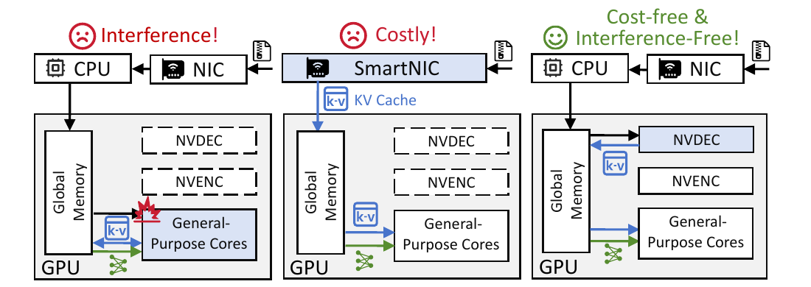

*图 1：三类压缩解码路径。KVCodec 使用 GPU 上独立于通用计算核心的 NVDEC/NVENC 视频编解码硬件。摘自原文 Fig. 1。*

### 1.3 核心洞察

现代 GPU 的视频编解码 ASIC 在大模型推理期间通常闲置。只要把 KV 张量重新排列成视频编解码器容易消除时空冗余的帧布局，就能用独立硬件完成高压缩比解码，避开 CUDA 核心竞争；再把网络传输、视频解码和张量恢复组织成异步流水，压缩路径才可能真正降低 TTFT。

### 1.4 核心抽象

KVCodec 把“压缩 KV 视频”作为远端 KV 的传输形态，并在 KV 管理器中增加一个独立拉取通道：

- 离线阶段把量化后的 KV 张量映射为 H.265 视频，按多种分辨率生成码流；
- 在线阶段根据请求是否需要远端 KV，将其放入独立等待队列；
- 拉取控制器按网络状态选择码流分辨率，重叠传输与 NVDEC 解码；
- 每解出一帧就恢复为 KV 张量并写入推理引擎的分页显存。

这项抽象新暴露了两个决策量：KV 张量到视频帧的布局，以及码流分辨率对应的“传输时间—解码时间”组合。前者决定压缩率，后者决定流水线空洞。

### 1.5 四项关键优化方法速览

#### 方法一：按 Token 连续性组织的编解码友好张量布局

- **问题**：直接把 KV 张量当字节流，或随意铺成视频帧，无法充分利用 H.265 的帧内与帧间预测；启用有损 DCT 和量化又会破坏模型所需的异常值信息。
- **方法**：跳过视频编码中的有损步骤，沿 Token 维切片，把相邻 Token 张量放在连续帧的相同位置；保持注意力头边界和头内元素顺序，并把三个连续层映射到三个颜色通道。
- **效果**：在论文模型上得到约 11.9×～12.5×压缩比，同时保持与其 INT8 量化基线相同的任务准确率。
- **边界**：“无损”只指 INT8 量化之后的 H.265 编码无损，不是相对原始浮点 KV 的逐比特无损。

#### 方法二：远端拉取请求与普通请求分队列调度

- **问题**：把需要远端拉取的请求和普通请求直接放入同一批次，会让普通请求等待网络与解压，形成队首阻塞。
- **方法**：增加 `waiting_for_KV` 队列和独立拉取控制器。需要远端 KV 的请求在后台完成拉取，普通请求继续按原调度策略进入运行队列。
- **效果**：网络等待从普通请求的前台执行路径移出；在论文设定的混合请求轨迹中，非复用请求 TTFT 相比 CacheGen 降低 77.1%。
- **边界**：论文仍为拉取请求预分配完整 KV 显存，容量压力可能反过来阻塞普通请求。

#### 方法三：按流水空洞选择视频分辨率

- **问题**：低分辨率码流更小，但不能充分利用 NVDEC 的块并行能力；高分辨率解码更快，网络传输却更慢。固定分辨率在带宽抖动时会产生流水空洞。
- **方法**：根据上一块的传输时间估计当前带宽，查表得到各分辨率的解码时延和切换代价，选择传输与解码时间最接近的分辨率。
- **效果**：示例中带宽从 6Gbps 降至 3Gbps 时切换到 240p，升至 4Gbps 后切换到 480p；相比固定 1080p，时间开销降低 21%，消融实验中的 TTFT 降低 20%。
- **边界**：带宽预测只使用上一块历史，查表也依赖设备、并发度和版本稳定，不能直接移植固定数值。

#### 方法四：逐帧恢复并立即写入分页显存

- **问题**：按 1.5K Token 的大块批量恢复会产生 1.5～2GB 临时缓冲，挤占推理显存并造成访存干扰。
- **方法**：视频帧一旦解出，回调函数立即完成轻量 reshape 与反量化，并写入预分配的分页 KV 槽位；参考帧数量限制在 4 帧以内。
- **效果**：单请求恢复缓冲约 50MB，连同参考帧的总解压缓冲低于 70MB；7 个视频块并发解码与恢复时，论文测得峰值 GPU 显存约 400MB。
- **边界**：数据流仍经过 Host 内存码流缓冲和 CPU 视频解析，不能直接满足本项目的 Host CPU 零数据拷贝（CPU 只下发控制指令、不参与正文数据搬运）要求。

### 1.6 最重要的实验结果

在 LWM-7B、Yi-34B、Llama3-70B，L20/H20/A100，以及 16Gbps 默认网络条件下，论文报告：

- 需要远端 KV 的请求，平均 TTFT 相比 Full Prefill、原始 KV 拉取、CacheGen 分别加速 13.63×、3.51×、1.52×；
- 与 CacheGen 相比，在 1～40Gbps、20K～200K 上下文扫描中，KVCodec 的 TTFT 加速为 1.29×～3.50×；
- 编解码友好布局相对 CacheGen 和 ShadowServe 的压缩比分别提高 2.17×、1.93×；
- 默认消融条件下，移除编解码友好布局后 TTFT 变为 1.6×，移除拉取感知调度后变为 1.3×。

这些数字来自不同实验，不能相乘，也不能当成任意模型、带宽和请求分布下的统一加速倍数。

### 1.7 最大局限

论文最强的在线结论是“远端已有压缩码流时如何高效拉取和解码”。它没有完成通用的在线编码闭环。A100 与 H20 没有 NVENC，回退到 CPU 后编码吞吐约 3Gbps，无法支撑 Prefill/Decode 分离或故障迁移中的实时 KV 生成速率。论文给出的 B200 八卡约 120Gbps 编码能力是硬件规格推算，不是本文平台上的实测结果。

### 1.8 与本项目的关系

| 判断维度 | 本文提供的外部证据 | 本文没有证明的内容 |
|---|---|---|
| 必要性 | 低带宽下原始 KV 拉取会失去复用收益；CUDA 解压和粗粒度恢复会引入新的关键路径与资源争用 | 国产 AI 硬件上相同瓶颈的绝对大小、E0～E3 阶段目标是否达成 |
| 可行性 | 独立硬件解码、拉取分队列、传输—解码自适应和逐帧恢复可以协同降低 TTFT | UBMEM/URMA 与国产 NPU 编解码单元上的端到端可行性 |
| 差异化 | 论文没有解决 Host CPU 零数据拷贝、语义一致性、租约、多卡同步、SSD 分层和混压 QoS | 本项目提出的 Direct-View、Copy-to-HBM、故障回退与多介质统一调度 |
| 剩余举证责任 | 适合将硬件编解码纳入“条件能力”，由动态成本模型决定是否启用 | 仍需用同一输入、基线和实际路径探针验证 TTFT、QPS、TPOT 及 Host Payload Touch Bytes |

因此，本报告把硬件编解码定位为远程 KV 传输的一条条件压缩路径。论文不支持把它设为默认主路径，也不能据此认定项目的零拷贝与端到端目标已经得到验证。

## 2. 为什么这个问题值得解决

### 2.1 远端复用不是命中即收益

Saved-Prefill（首字生成预计算节省，即利用已缓存 KV 避免重复计算 Prompt）本质上是“用存储和传输换计算”。设本地重算时间为 `T_recompute`，远端复用路径至少包含：

```text
T_fetch = T_directory + T_transfer + T_decode + T_restore + T_attach + T_sync
```

只有 `T_fetch < T_recompute` 时，缓存命中才转化为净收益。论文 Fig. 3 直观给出三种路径的适用区间：短上下文适合直接重算，高带宽区间适合原始 KV 拉取，低带宽和长上下文才是压缩复用的主要区域。

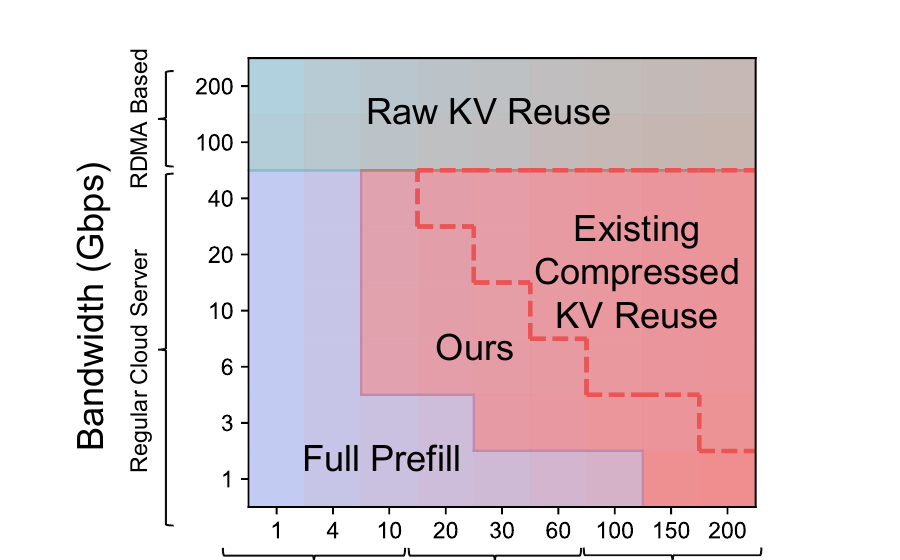

*图 2：Full Prefill、原始 KV 复用、压缩 KV 复用的适用区域。红色实线区域是 KVCodec，红色虚线是已有压缩方案。摘自原文 Fig. 3。该图来自 LWM-7B、2×H20 等特定条件，不能直接当成本项目边界。*

这一结果对工程决策比“压缩率越高越好”更有用。压缩路径增加了解码与恢复，网络节省必须覆盖新增计算、内存和排队开销。随着带宽升高，NVDEC 反而可能成为瓶颈，原始传输会重新占优。

### 2.2 现有方案为什么没把网络收益兑现为 TTFT

论文在 200K 上下文 LWM-7B、2×H20、真实请求轨迹上比较三类路径，网络带宽覆盖 TCP 1～40Gbps 和 RDMA 100/200Gbps。作者归纳出三个问题：

1. CacheGen 与 ShadowServe 把 KV 当通用字节流，压缩比不足，节省的传输时间无法稳定覆盖解码开销；
2. CacheGen 的 CUDA 解码与推理发生核函数切换和显存 I/O 竞争，论文测得 Prefill 增加 50%、Decode 增加 20%；解压 4K Token 还需预分配 5.5GB 显存，约为原 KV 的 2.7×；
3. LMCache 的整块同步拉取让 GPU 等待，Mooncake 的逐层异步拉取改善了重叠，但未处理网络抖动、NVDEC 资源池利用率和大块恢复的显存峰值。

KVCodec 因此没有停在“换一种压缩算法”。它把压缩布局、解码资源、调度队列和恢复粒度一起调整，目标是缩短完整拉取路径，而不是单独追求码流尺寸。

## 3. 核心抽象与系统设计

### 3.1 组件边界

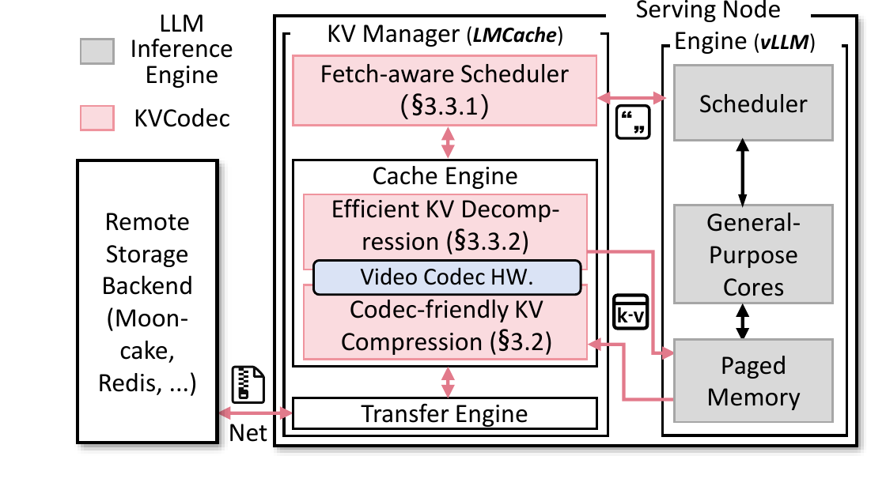

*图 3：KVCodec 作为 LMCache 后端接入 vLLM。粉色模块为 KVCodec，灰色模块为原推理引擎。摘自原文 Fig. 10。*

系统有三个主要模块：

- 编解码友好 KV 压缩器负责离线生成 H.265 码流；
- 拉取感知调度器负责区分普通请求与远端复用请求；
- 高效 KV 解压器负责网络传输、NVDEC 解码、逐帧恢复和写入分页显存。

论文原型基于 LMCache v0.3.7 与 vLLM v0.10.2，约 5K 行 Python、C++ 和 CUDA 代码。压缩使用 FFmpeg/NVENC，解码资源池基于 GStreamer `nvv4l2decoder`；C++ 解码管线通过 Pybind11 释放 Python GIL，逐帧回调执行张量恢复。

### 3.2 在线读取的数据路径

```text
远端压缩 KV 码流
  -> NIC 接收
  -> Host 内存 Bitstream Buffer
  -> CPU Video Parser
  -> NVDEC 熵解码与帧内/帧间预测
  -> GPU Global Memory 中的小型恢复缓冲
  -> 逐帧恢复和反量化
  -> vLLM Paged Memory
  -> 按层进入推理
```

这个路径把主要解码工作从 CUDA 通用核心移到了 NVDEC，但没有绕过 Host DDR。CPU 是否复制正文数据，论文没有给出 Host Touch 探针；Fig. 16 明确画出了 Host 内存码流缓冲和 CPU 视频解析，因此只能判断“减少 CUDA 计算竞争”，不能推导为“CPU 不接触正文数据”。

### 3.3 控制面与数据面的协同

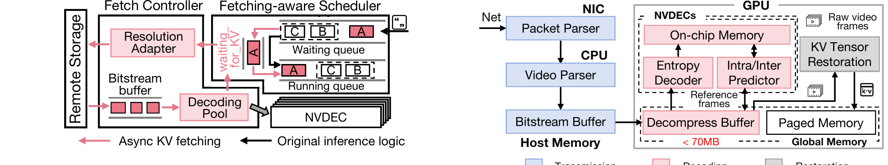

*图 4：左侧是请求队列和解码资源池控制流，右侧是 NIC、Host 内存、NVDEC 与分页显存之间的数据流。摘自原文 Fig. 15、Fig. 16。*

控制面负责请求分流、带宽估计、分辨率选择和 NVDEC 实例分配；数据面执行码流接收、视频解码与 KV 恢复。两者共同受三个物理约束：网络吞吐、聚合 NVDEC 解码吞吐、可用 HBM。任何一个资源达到上限，压缩路径都可能由收益变成负担。

## 4. 关键技术实现与作用机理

### 4.1 按 Token 连续性组织的编解码友好布局

#### 解决的问题

H.265 依靠帧内预测消除相邻像素冗余，依靠帧间预测消除连续帧冗余。KV 张量的原始形状是 `[token, layer, head_num, head_dim]`。如果直接按层铺成帧，或随意打乱注意力头内外的元素，语义相关的数据不会落在编解码器能够引用的位置，预测残差变大，视频编码退化成普通熵编码。

#### 核心方法与实现路径

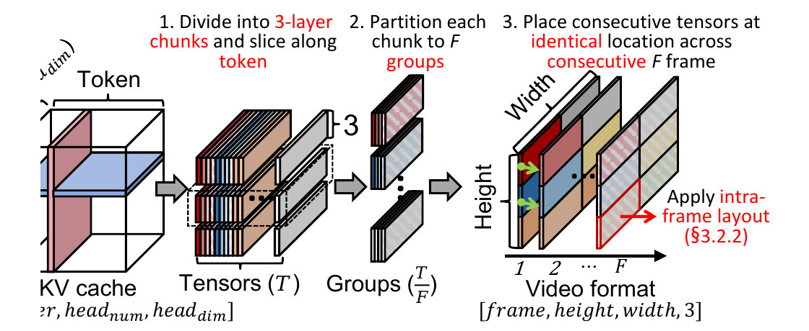

*图 5：跨帧布局。KV 沿 Token 维切分，三个层组成一组颜色通道，相邻 Token 张量放入连续帧的相同空间位置。摘自原文 Fig. 13。*

1. 将 KV 分成三个连续层的块，并沿 Token 维切片；
2. 把相邻 Token 切片放到连续视频帧的相同位置，使帧间预测能引用前序 Token；
3. 把层维映射到独立的 RGB/YUV 通道，避免层间低相似度污染预测；
4. 保持注意力头之间的边界和头内元素顺序，只搜索 `head_num × head_dim` 的几何铺排；
5. 使用 H.265 lossless 模式，跳过视频编码中的有损 DCT 与量化步骤。

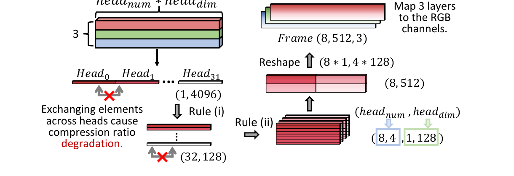

*图 6：帧内布局。跨注意力头交换元素会降低压缩率，因此搜索集中在保持头结构的几何重排。摘自原文 Fig. 14。*

原始搜索空间包含巨大的元素排列组合。论文用三条规则把 LWM-7B 的候选降到 35 种：不跨注意力头交换元素、保持头内顺序、不重新排列注意力头。最终离线搜索约 1.5 小时，得到 LWM-7B、Yi-34B、Llama-70B 的布局分别为 `(8, 512)`、`(8, 128)`、`(16, 64)`。

#### 为什么有效

资源变化是：

```text
无结构字节流或布局无关视频
  -> 暴露 Token 连续性与注意力头内局部性
  -> H.265 帧内/帧间预测残差下降
  -> 网络传输字节减少
```

论文测得，跨注意力头交换 50% 元素会使压缩比恶化 2.4×；打乱头内 50% 元素会让帧内预测数据量增加 17%。在消融中，跨帧布局相对单独量化平均增加 2.2×压缩收益，加入帧内布局后提升到 2.96×。

#### 代价与边界

- 压缩之前仍使用与 CacheGen、ShadowServe 相同的 INT8 量化。“H.265 无损”不能写成“相对 FP16/BF16 原始 KV 无损”；
- 布局按模型结构离线搜索。模型、注意力头配置或编解码器实现变化后，需要重新标定；
- 多分辨率码流意味着额外存储和编码成本，论文没有量化这部分容量放大；
- 当前方案假设 KV 已提前编码并存于远端，在线编码能力受 NVENC 数量限制。

#### 对项目的意义

分类：**条件迁移（ADAPT）**。可迁移的是“按硬件编码器的预测单元重新组织张量，同时保持模型语义边界”的原则。实际布局必须根据国产 NPU 的张量格式、硬件编解码单元、量化误差和 URMA/UBMEM 数据路径重新搜索，不能沿用论文的固定分辨率和 `(8, 512)` 等参数。

### 4.2 远端拉取请求与普通请求分队列调度

#### 解决的问题

现有调度器只看到“请求已经到达”，看不到“该请求还需远端拉取几十到数百 K Token 的 KV”。两类请求进入同一运行批次后，普通请求被迫等待拉取请求，网络抖动会直接放大为 TTFT 长尾。

#### 核心方法与实现路径

1. 调度器识别需要远端 KV 的请求；
2. 将其从普通等待队列转入 `waiting_for_KV`；
3. 独立线程和拉取控制器在后台执行传输、解码与恢复；
4. 普通请求继续进入原运行队列，不等待远端 KV；
5. 拉取完成后，目标请求再进入运行队列；满足逐层非阻塞条件时，也可以提前按层进入执行。

论文附录给出的逐层准入条件，本质上要求任意尚未缓冲的层在前一层计算结束前完成解码。这样可以边拉取边推理，但依赖对 Chunked Prefill（分块首字预计算，即把长 Prompt 切成多个块并与其他任务交织执行）与每层计算时间的稳定估计。

#### 为什么有效

```text
普通请求等待“远端拉取 + 解码 + 恢复”
  -> 拉取请求进入独立等待状态
  -> 普通请求只等待自身排队与计算
```

这项方法没有减少远端请求的数据量，也没有缩短单块解码时间。它改变的是阻塞关系和等待传播范围。

#### 论文证据与边界

在请求到达率 0.2 req/s、40K Token 为远端复用阈值、vLLM FCFS 调度的轨迹中，KVCodec 让非复用请求 TTFT 相比 CacheGen 降低 77.1%，相比 Full Prefill 降低 98%；TPOT（Time Per Output Token，每个输出 Token 的生成耗时）分别降低 35.4% 和 40%。这是特定轨迹与阈值下的端到端结果，不是单独调度器的纯收益，论文也说明其他组件共同减少了等待。

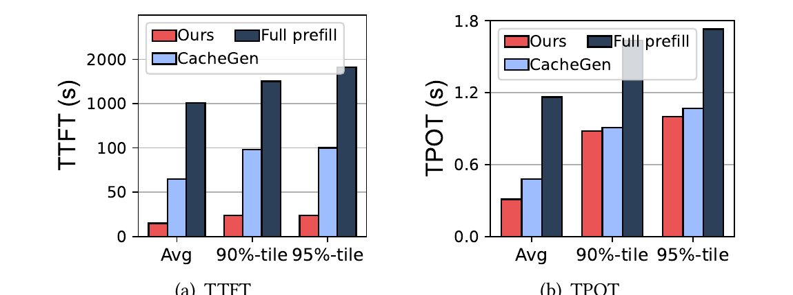

*图 7：混合轨迹下非复用请求的平均、P90 和 P95 TTFT/TPOT。摘自原文 Fig. 19。图中没有 P99。*

主要边界是显存准入。论文与 Mooncake、LMCache 一样，为拉取请求预分配完整 KV 显存。请求虽然离开了运行队列，却仍可能占用大量 HBM，容量压力下无法保证普通请求真正不受影响。

#### 对项目的意义

分类：**直接采用原则、重做实现（ADAPT）**。本项目的查询与放置计划决策引擎应显式区分“目录命中”“数据可用”“已接入计算”三种状态，避免远端拉取等待污染普通请求；但队列准入还要纳入 HBM 水位、租约、多卡状态同步和取消语义，不能只增加一个 `waiting_for_KV` 队列。

### 4.3 按流水空洞选择视频分辨率

#### 解决的问题

低分辨率把较少张量拼进一帧，码流小，网络传输快；但小帧不能充分利用 NVDEC 的 64×64 块并行，解码反而慢。1080p 解码快，码流更大。在动态网络上，固定选择任意一端都会让另一个阶段空等。

#### 核心方法与实现路径

1. 离线生成多个分辨率的同一 KV 码流；
2. 用上一视频块的传输时间预测当前可用带宽；
3. 对每个候选分辨率计算 `码流大小 / 预测带宽`；
4. 根据设备与解码池负载查表得到解码时延，并加入分辨率切换代价；
5. 选择传输与解码完成时间差最小的分辨率，减少流水空洞。

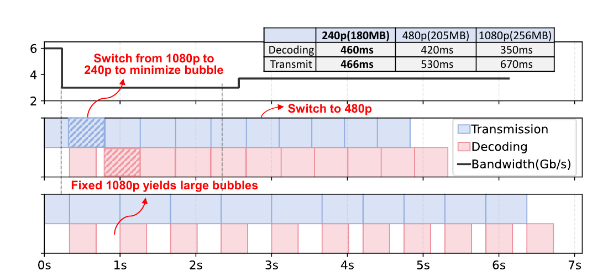

*图 8：带宽下降时从 1080p 切换到 240p，随后切换到 480p。上半部分为自适应策略，下半部分为固定 1080p。摘自原文 Fig. 17。*

#### 为什么有效

它没有改变数值精度，而是改变一帧承载多少 KV 张量，从而调节码流尺寸与解码并行度。调度目标也不是单独最小化传输或解码，而是让两个流水阶段尽量同时完成。

#### 论文证据与边界

Fig. 17 的带宽轨迹中，自适应分辨率比固定 1080p 节省 21% 时间。默认消融实验中，启用自适应后 TTFT 为 5.2s，相比关闭自适应改善 20%。论文还报告单视频块传输—解码流水延迟低于 400ms，远端复用后的 Prefill 计算低于 50ms。

边界包括：短历史带宽预测难以处理突发 Incast（多对一突发网络拥塞，即多个发送节点同时向单一接收节点发包造成交换机出口排队与丢包）；解码查表随设备、并发和驱动版本变化；分辨率切换会引入池内执行效率损失。生产系统还需考虑多请求公平性和前后台 QoS（Quality of Service，服务质量，即通过队列优先级和带宽控制保护在线请求）。

#### 对项目的意义

分类：**条件迁移（ADAPT）**。适合把“最小流水空洞”作为成本预估模型的一个子目标，但不能只优化分辨率。项目级决策还要比较原始直达、压缩传输、远端直读、拷贝到本地 HBM、SSD 回源和本地重算，并记录预测路径与实际路径。

### 4.4 逐帧恢复并立即写入分页显存

#### 解决的问题

按 Chunk 批量恢复会同时保留码流、参考帧、完整解码帧和待写入 KV 张量，形成瞬时显存峰值。压缩虽然省了网络字节，却可能压低推理 Batch 容量。

#### 核心方法与实现路径

KVCodec 让每个 NVDEC 实例形成独立解码管线。帧解码完成时，`On_frame_probe` 回调立即执行 reshape 与反量化，通过定制算子写入 vLLM 已分配的分页 KV 槽位。布局把参考帧控制在 4 帧以内，即便 2K 分辨率，参考帧内存也低于 20MB。

#### 为什么有效

```text
1.5K Token 大块恢复缓冲
  -> 单帧到达即恢复并释放
  -> 暂存生命周期和峰值字节数下降
```

#### 论文证据与边界

论文报告恢复缓冲从 1.5～2GB 降至约 50MB，总解压缓冲低于 70MB。七个视频块并发解码和恢复时，峰值 GPU 显存约 400MB；单次拉取中，NVDEC 预分配约 40MB，恢复阶段约 47MB。

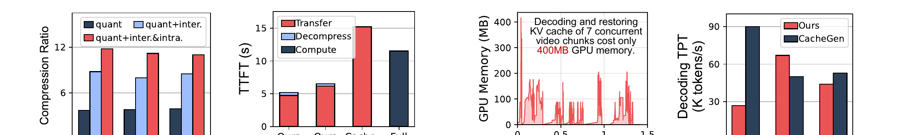

*图 9：从左到右分别为压缩组件消融、TTFT 分解、七块并发恢复显存和不同 GPU 的解码吞吐。摘自原文 Fig. 22～25。*

逐帧恢复仍有两个代价：目标分页显存需要提前预分配；轻量恢复回调虽然占用很少 CUDA 核心，但并非完全没有通用计算和 HBM 写流量。论文的“interference-free”特指 NVDEC 解码不占 CUDA 核心，不代表整个拉取路径没有内存干扰。

#### 对项目的意义

分类：**条件迁移（ADAPT）**。项目可借鉴“到达粒度与消费粒度对齐、解码后立即发布到目标位置”的做法，但应把 Host 内存缓冲替换为硬件允许的设备直达路径，并补齐 Ready、完整性、租约和多卡可见性条件后再允许消费。

## 5. 实验到底证明了什么

### 5.1 实验条件

| 项目 | 论文设置 |
|---|---|
| 模型 | LWM-7B（1M 上下文）、Yi-34B（200K）、Llama3-70B（128K） |
| 数据集 | L-Eval（3K～200K）、LV-Eval（16K～256K）、LongBench-V2（13K～167K） |
| GPU | L20 48GB / 3×NVDEC，H20 96GB / 7×NVDEC，A100 80GB / 5×NVDEC |
| 默认端到端条件 | H20、Yi-34B、16Gbps 网络 |
| 基线 | Full Prefill、原始 KV 拉取、CacheGen、ShadowServe、llm.265、KIVI、KVTC |
| 软件 | vLLM v0.10.2、LMCache v0.3.7、FFmpeg、GStreamer、C++/CUDA/Python 3.12 |
| 主要指标 | TTFT、TPOT、任务准确率、压缩比、解码吞吐、GPU 显存 |

### 5.2 结论—实验—边界对照

| 论文主张 | 最强实验 | 论文实测结果 | 能证明什么 | 不能证明什么 |
|---|---|---|---|---|
| 压缩远端复用在中低带宽长上下文中有更大适用区 | Fig. 3，1～40Gbps TCP、100/200Gbps RDMA，LWM-7B/2×H20 | KVCodec 的适用区域大于已有压缩复用 | 总开销必须按带宽和上下文长度选路 | 不能直接给出国产硬件的切换阈值 |
| KVCodec 降低远端复用请求 TTFT | Fig. 18，3 模型×3 GPU 配置 | 相比 Full Prefill、原始 KV、CacheGen 平均加速 13.63×、3.51×、1.52× | 整体设计在论文平台上有效 | 不能把 3.51×归因给单一组件，也不能外推到高带宽 RDMA |
| 不占 CUDA 核心的解码减少对普通请求的干扰 | Fig. 19，0.2 req/s、40K 复用阈值、FCFS | 非复用请求 TTFT 相比 CacheGen 降 77.1%，TPOT 降 35.4% | 分队列和独立解码资源能收缩等待传播 | 没有 P99、饱和负载、多租户或长期混压证据 |
| 布局提高压缩比而不降低任务准确率 | Fig. 20，3 模型×3 数据集 | 相比 CacheGen 压缩比 2.17×，归一化准确率不降 | H.265 无损步骤没有额外引入可见准确率损失 | 不能证明相对原始浮点 KV 逐比特无损 |
| 带宽升高后收益下降并存在切换点 | Fig. 21、Table 1 | 1～40Gbps 下相对 CacheGen 加速 1.29×～3.50×；八卡 L20/A100/H20 的估算切换点约 80/200/280Gbps | NVDEC 吞吐与压缩比共同决定收益边界 | Table 1 是模型化切换点，不是所有负载的通用门槛 |
| 各组件对最终收益均有贡献 | Fig. 22～24 消融 | 去掉布局 TTFT 变为 1.6×；去掉拉取感知调度变为 1.3×；自适应改善 20% | 压缩、调度和流水需要协同 | 消融条件固定为 2×A100、Yi-34B、16Gbps，不能代表全部平台 |

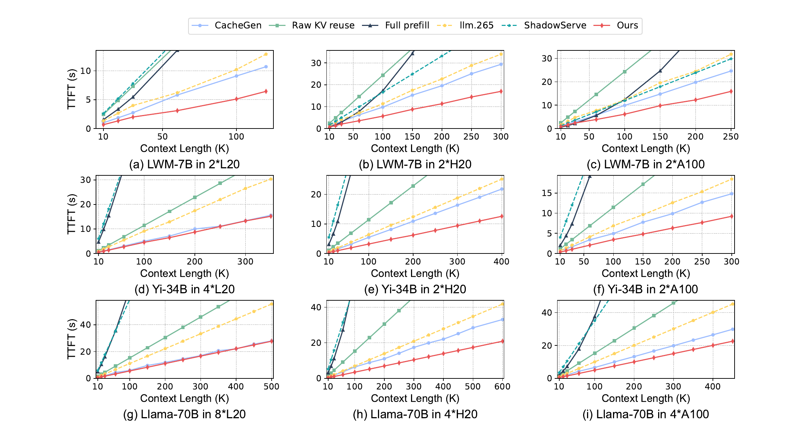

*图 10：三种模型、三类 GPU 配置下，TTFT 随上下文长度变化。摘自原文 Fig. 18。论文汇总的 3.51×是相对原始 KV 拉取的平均值，不是每个子图的固定比例。*

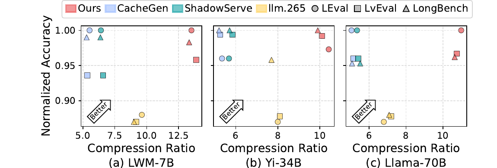

*图 11：三种模型上的归一化准确率与压缩比。摘自原文 Fig. 20。KVCodec 与 CacheGen、ShadowServe 共享 INT8 量化基线。*

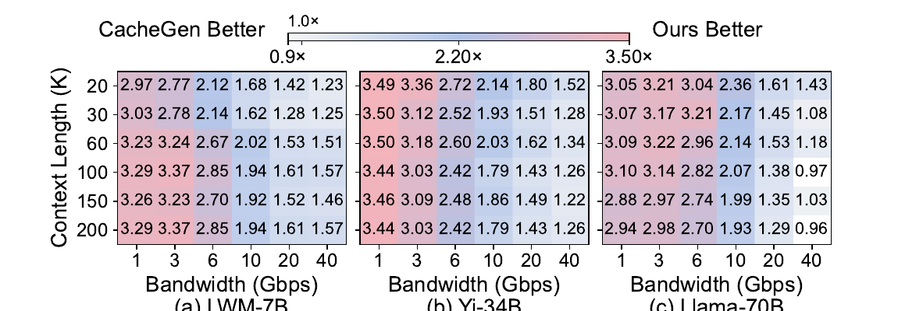

*图 12：单元格为 CacheGen TTFT / KVCodec TTFT。低带宽、长上下文通常更有利于 KVCodec；部分高带宽点低于 1，说明 CacheGen 更快。摘自原文 Fig. 21。*

### 5.3 基线公平性需要单独看

ShadowServe 的设计依赖 SmartNIC 解压。论文因缺少该硬件，把解压放到 Host CPU，导致其 TTFT 被 CPU 解压主导。因此“KVCodec 比 ShadowServe 快 8×”不能视为对 ShadowServe 原设计的等价复现比较。这个结果只说明在没有 SmartNIC、又把同一算法搬到 CPU 的条件下，ShadowServe 路径不合适。

Full Prefill 和原始 KV 拉取是必要的边界基线，但它们解决的问题不同：前者支付计算，后者支付网络。论文数字说明在给定带宽和上下文长度下 KVCodec 占优，不意味着压缩复用在短上下文或高带宽下始终最优。

## 6. 论文的亮点与局限

### 6.1 闲置专用硬件换取资源隔离

亮点在于资源选择，而不是“把张量伪装成视频”的形式。NVDEC 有独立计算和片上存储，解码不会像 CUDA 核函数那样抢占 SM。

局限也来自同一选择：不同 GPU 的 NVDEC 数量差异很大。论文测得 4×L20、2×H20、2×A100 的解码吞吐分别为 27K、67K、47K tokens/s，只相当于 CacheGen 的 0.3×、1.34×、0.88×。端到端仍可能占优，但 NVDEC 不是无限资源。

### 6.2 张量语义与视频预测单元对齐

论文没有简单调用 H.265，而是分析 Token 连续性、注意力头边界和层间相似度，找到能让预测器看到冗余的布局。这个部分有清楚的机制、消融和模型差异解释。

其局限是布局与模型结构、编解码器实现绑定。多分辨率副本还增加远端存储成本，论文没有给出编码时间、存储放大和版本更新的完整对账。

### 6.3 端到端流水而非单点压缩比

拉取感知调度、动态分辨率和逐帧恢复分别处理队首阻塞、网络抖动和显存峰值。各方法解决的问题不同，论文没有把它们混成一个“压缩模块”。

现有控制器对生产环境仍偏简单：带宽预测只看上一块，调度默认 FCFS 或平均分带宽，缺少优先级、租户配额、失败恢复和尾部时延约束。

### 6.4 与现有 KV 管理器低侵入集成

KVCodec 作为 LMCache 后端接入 vLLM，保留原生调度和分页显存接口，原型范围清楚。

低侵入也保留了既有约束：整份 KV HBM 预分配、Host 码流缓冲和 CPU 解析仍在路径上。它优化了压缩拉取，并未重建分布式 KV 对象的一致性与生命周期。

## 7. 论文没有解决什么

### 7.1 在线压缩闭环

PD 分离（Prefill 与 Decode 计算生成解耦架构，即把输入理解 Prefill 与逐 Token 生成 Decode 部署在不同节点）要求 Prefill 节点实时产生压缩 KV。A100/H20 无 NVENC 时，论文的 CPU 回退编码约 3Gbps，明显低于许多 KV 生成速率。B200 八卡约 120Gbps 是作者基于每卡四个 NVENC 的估算，需独立实测。

### 7.2 Host CPU 零数据拷贝

论文路径包含 Host 内存码流缓冲与 CPU 视频解析，没有 Host Payload Touch Bytes 探针，也没有 NVMe/NIC 到 GPU 解码单元的设备直达证据。它不能支持本项目的零拷贝完成判定。

### 7.3 语义一致性与故障语义

论文假设远端已经存在可复用且兼容的 KV，没有处理模型版本、Tokenizer、Prompt 模板、LoRA、Ready 位和租约的消费资格校验，也没有说明部分码流到达、节点失败、解码错误、取消和超时后的回滚。

### 7.4 多卡状态同步与分布式目录

评测使用多卡模型并行，但系统设计没有给出跨 Rank 命中状态同步、统一动作和死锁规避机制。远端对象发现、位置解析、租约更新与副本回收也依赖既有存储后端，不是 KVCodec 的解决范围。

### 7.5 生产级混压和安全隔离

论文报告平均、P90、P95，没有给出 P99 尾部时延，也没有在后台满载 I/O、多租户带宽竞争和节点故障下验证 SLO。作者还指出共享视频编解码硬件可能泄露上下文长度或拉取模式，完整安全分析留作后续工作。

## 8. 对本项目的启发

### 8.1 可以直接采用的原则

1. 远端命中不能直接触发加载。查询与放置计划必须比较“目录查询、传输、解码、恢复、接入和同步”与本地重算的总成本；
2. 需要远端数据的请求应有独立状态和准入条件，不能把网络等待传播给普通请求；
3. 硬件编解码应作为条件能力，Raw Direct（原始直达路径，即不依赖 DPU 与专用硬件压缩的基础 DMA 通路）必须始终可用；
4. 恢复粒度应尽量贴近计算消费粒度，避免大块临时缓冲挤占 HBM。

### 8.2 需要改造后迁移的部分

| 论文方法 | 底层原则 | 项目改造要求 | 验证重点 |
|---|---|---|---|
| H.265 编解码友好布局 | 让数据布局匹配硬件预测单元 | 针对国产 NPU 编解码能力、张量格式和量化误差重新搜索；增加模型与布局版本哈希 | 压缩比、准确率、编码/解码吞吐、版本兼容 |
| 动态分辨率 | 平衡相邻流水阶段，最小化空洞 | 纳入网络可用带宽、NVDEC/NPU 队列、HBM 水位、恢复开销和优先级；由成本预估模型统一决策 | 预测误差、实际路径、决策后悔值、P99 |
| 独立拉取队列 | 隔离远端等待传播 | 接入目录状态、消费资格、租约、取消和张量并行多卡状态同步 | 普通请求 TTFT/TPOT、饥饿、公平性、失败回退 |
| 逐帧恢复 | 缩短暂存生命周期 | 尝试 NIC/NVMe 到设备的直接 DMA；通过连续块描述符编译写入目标页，发布前完成完整性校验 | Host Touch、HBM 峰值、完成可见性、错误消费 |
| 解码资源池 | 聚合专用硬件吞吐 | 接入硬件能力矩阵和前后台 QoS，资源不足时切换原始传输或重算 | 饱和点、排队时延、切换时间、前台干扰 |

### 8.3 不应照搬的实现

- 不把 Host 内存 Bitstream Buffer 和 CPU Video Parser 固化为所有压缩路径的必经跳板；
- 不为所有远端命中请求无条件预分配完整 HBM；
- 不硬编码论文的 40K Token 阈值、分辨率查表和 L20/A100/H20 切换带宽；
- 不把“H.265 lossless”写成“原始 KV 数值无损”；
- 不用 ShadowServe 的 CPU 替代实验推导 SmartNIC 方案的真实优劣；
- 不把论文的平均 TTFT 加速当成本项目的 E3 端到端混压结果。

## 9. 对本项目立项的技术支撑

### 9.1 问题得到什么验证

论文独立确认了三个项目痛点确实存在：低带宽会让原始 KV 拉取失去净收益；压缩解码可能与在线推理争用通用计算和显存；远端拉取的队首阻塞会把网络抖动传给无关请求。这些证据支持项目继续建设“加载与重算动态判断”和“前后台服务质量保障”。

### 9.2 哪些技术方向获得可行性证据

论文在其平台上给出了以下可行性证据：

- 利用独立硬件单元承载编解码，可以把工作从通用 CUDA 核心移开；
- 张量布局与硬件编码预测单元协同，可以增加可消除的冗余；
- 把拉取请求置于独立状态，可以缩小等待传播范围；
- 根据两个流水阶段的耗时动态选择数据形态，可以降低带宽抖动造成的空洞；
- 逐帧恢复能降低临时显存峰值。

这些是方向性证据，不等同于本项目的实现已经被验证。

### 9.3 哪些空白支撑项目继续投入

KVCodec 没有覆盖本项目的主要差异化范围：面向国产 AI 硬件的 URMA（通用远程直接内存访问，即用户态高性能 RDMA 驱动接口与通信协议）与 UBMEM（统一总线内存直通共享协议，即跨节点和异构设备共享内存地址空间的底层协议）路径；Host CPU 零数据拷贝；Direct-View（远端直读，即跨节点直接读取远端显存 KV、不产生本地显存全量拷贝）与 Copy-to-HBM（通过 DMA 把远端 KV 搬入本地 HBM）的边界；SSD 分层；消费资格校验；租约与故障回退；张量并行多卡状态同步；全链路混压 QoS。

论文最适合支撑“为什么需要一个跨调度、传输和硬件能力的统一决策层”，而不是支撑“为什么必须采用视频编解码作为主路径”。

### 9.4 仍需项目独立举证的主张

- 目标国产硬件上，压缩路径是否比原始直达、远端直读、拷贝到 HBM 或本地重算更快；
- Host Payload Touch Bytes 是否严格为 0；
- 多卡命中、消费和回退是否保持一致且不发生集合通信死锁；
- 前台在线推理与后台满载 I/O 混压时，TTFT、QPS 与 TPOT 干扰是否达到 E3 目标；
- 编解码路径发生超时、码流损坏、节点故障和租约过期时，能否安全回退；
- 多分辨率副本的存储放大、编码成本和淘汰策略是否产生持续净收益。

### 9.5 立项判断

论文为项目提供了“必要性”和“条件可行性”证据：远程 KV 复用必须处理带宽、解码、调度和显存的联合瓶颈，闲置专用硬件可以成为其中一种有效资源。它同时强化了项目的动态选路立场：压缩路径有清楚的适用边界，高带宽或低 NVDEC 吞吐下会失去优势。

项目不应把 KVCodec 当成可直接移植的答案。更合理的定位是把硬件编解码接入硬件能力矩阵，作为原始直达、远端直读、拷贝到 HBM、SSD 回源和本地重算之外的一条候选路径，由统一成本模型和 QoS 决定是否启用。

## 10. 建议验证

只有结果会改变架构或路径选择的实验才列入下表。

| 验证项 | 假设 | 变量与基线 | 指标 | 通过/失败后的决策 |
|---|---|---|---|---|
| 编解码能力矩阵 | 目标 NPU 的独立编解码单元能在不抢占前台计算的情况下提供足够吞吐 | GPU/NPU 型号、编解码实例数、分辨率、并发；基线为 CUDA/NPU 通用核解码和原始传输 | 编码/解码 GB/s、tokens/s、HBM/DDR 峰值、前台 TPOT 干扰、功耗 | 达标才进入候选路径；否则保留 Raw Direct，不让条件硬件阻塞主线 |
| 压缩路径收益边界 | 在部分带宽与上下文区间，传输节省能覆盖解码、恢复和接入成本 | 1～200Gbps、10K～500K Token、复用率、量化方案；基线为本地重算、原始 KV、Direct-View、Copy-to-HBM | TTFT P50/P95/P99、QPS、实际字节、总路径时间 | 生成设备与负载相关的切换面，写入成本预估模型；若无稳定优势则不启用压缩路径 |
| Host CPU 零数据拷贝审计 | 压缩码流可以绕过 Host DDR，或 Host 只下发控制而不搬运正文 | Host Buffer 路径对比 NIC/SSD→设备直达路径 | Host Payload Touch Bytes、CPU 利用率、PCIe/DDR 流量、DMA 完成量 | 触碰字节不为 0 时，不得标记为零拷贝；决定是否需要设备直达解析与解码接口 |
| 多分辨率动态选择 | 统一成本模型比固定分辨率和“上一块带宽”策略更稳 | 固定 240p/480p/1080p、论文策略、项目策略；注入阶跃、突发和 Incast 带宽 | 流水空洞、选择错误率、后悔值、切换抖动、P99 TTFT | 若预测误差在突发流量下放大，应退化为保守固定档或原始直达 |
| 前后台混压 | 解码池、压缩传输和后台换入换出不会破坏前台 SLO | 纯前台、原始 Mooncake 混压、增强版混压；控制设备、负载和资源配额一致 | TTFT/QPS 相对原生基线，TPOT 干扰率、P99、失败率、公平性 | 以 E3 标准决定能否进入生产主路径；不达标则限流或降级 |
| 语义与故障闭环 | 压缩、多分辨率和逐帧发布不会放大错误消费风险 | 模型/Tokenizer/模板/LoRA 冲突、码流损坏、超时、节点宕机、租约过期 | 错误消费数、检测时延、回退成功率、多卡一致动作 | 任一错误 KV 被消费即失败；通过后才允许异步逐帧路径进入正式实现 |
| 在线编码闭环 | 目标硬件能以高于 KV 生成速率的吞吐完成实时编码 | Prefill 输出速率、NVENC/NPU 编码器数量、模型规模；CPU 回退作为基线 | 编码吞吐、排队时延、存储放大、前台干扰 | 不满足时只支持离线热点缓存，不把方案用于 PD 分离实时传输 |

## 附录 A：关键证据索引

| 证据 | 原文位置 | 类型 | 本报告用途 |
|---|---|---|---|
| GPU 原生编解码资源路径 | Fig. 1，PDF p1 / 印刷 p30 | 论文架构图 | 解释 CUDA、SmartNIC、NVDEC 三种资源路径 |
| 路径适用区 | Fig. 3，PDF p3 / 印刷 p32 | 论文模型与测量组合 | 说明压缩路径有带宽和上下文边界 |
| 总体架构 | Fig. 10，PDF p5 / 印刷 p34 | 论文架构图 | 解释 KVCodec 与 LMCache/vLLM 的边界 |
| 张量跨帧与帧内布局 | Fig. 13、14，PDF p6 / 印刷 p35 | 论文机制图 | 解释压缩率来自何处 |
| 拉取控制流与数据流 | Fig. 15、16，PDF p7 / 印刷 p36 | 论文架构图 | 识别独立队列、Host Buffer 与 NVDEC 路径 |
| 动态分辨率流水 | Fig. 17，PDF p8 / 印刷 p37 | 论文机制与示例测量 | 说明传输—解码空洞最小化 |
| 跨设备端到端 TTFT | Fig. 18，PDF p9 / 印刷 p38 | 论文实测 | 验证端到端收益及硬件差异 |
| 非复用请求时延 | Fig. 19，PDF p10 / 印刷 p39 | 论文实测 | 验证队首阻塞收缩，但仅到 P95 |
| 准确率—压缩比 | Fig. 20，PDF p10 / 印刷 p39 | 论文实测 | 限定“无损”口径 |
| 带宽敏感性与切换点 | Fig. 21、Table 1，PDF p10 / 印刷 p39 | 实测 + 模型推导 | 说明高带宽下收益收窄 |
| 组件消融与资源开销 | Fig. 22～25，PDF p11 / 印刷 p40 | 论文实测 | 分开验证布局、自适应、显存与吞吐 |
| 在线编码与安全限制 | Section 6，PDF p11～12 / 印刷 p40～41 | 论文讨论 + 作者估算 | 界定在线编码、预分配和侧信道风险 |

## 附录 B：一句话技术判断

KVCodec 的贡献不是“视频压缩能压 KV”这一句话，而是把 KV 张量结构、独立编解码硬件、请求调度和恢复粒度放进同一条端到端路径，并用实验说明它在中低带宽长上下文场景下能兑现 TTFT 收益；对本项目而言，这是一条值得纳入动态选路的条件压缩路径，不是替代零拷贝、语义一致性和多介质统一调度的完整方案。
