# KVServe（SIGCOMM '26）：面向服务状态的 KVCache 压缩与动态选路论文解构

> 论文：*KVServe: Service-Aware KV Cache Compression for Communication-Efficient Disaggregated LLM Serving*  
> 作者：Zedong Liu, Xinyang Ma, Dejun Luo, Hairui Zhao, Bing Lu, Wenjing Huang, Yida Gu, Xingchen Liu, Zheng Wei, Jinyang Liu, Dingwen Tao, Guangming Tan  
> 会议：ACM SIGCOMM 2026，Denver, CO, USA  
> DOI：10.1145/3789240.3829139  
> 原文：[同目录 PDF](<[SIGCOMM 2026] KVServe Service-Aware KV Cache Compression for Communication-Efficient Disaggregated LLM Serving.pdf>)

## 证据口径

本文只以原论文为论文事实与实验数据来源。为防止把论文结果误写成项目已有能力，全文使用以下标记：

- **论文事实**：论文明确描述的设计、实现或实验条件。
- **论文实测**：论文图表或正文报告的测量结果；结论只在对应模型、数据集、GPU 和限速条件下成立。
- **论文模型**：论文给出的公式、定理或模型推导，用于解释和预测系统行为，不等于实测结果。
- **分析判断**：根据系统机理做出的推断，不是作者的原话。
- **项目建议**：对面向国产 AI 硬件的统一异构 KVCache 存储与调度底座的迁移建议，需要独立实现和测量。
- **项目目标**：项目的验收指标，不是 KVServe 的实测结果。

本文中，KVCache 指大模型注意力键值缓存（大模型自回归生成过程中缓存的历史 Key 与 Value 激活状态张量，用于避免后续 Token 生成时重复计算注意力）。PD 分离指 Prefill 与 Decode 计算生成解耦架构（将输入理解阶段与逐字生成阶段部署在不同物理节点，通过网络传输 KVCache）。TTFT 指 Time To First Token（首字生成延迟），TPOT 指 Time Per Output Token（每个输出 Token 的生成耗时）。JCT 是 Job Completion Time，本文指一个会话片段的端到端完成时间。SLO 是 Service Level Objective，即服务延时等指标的目标约束。

---

## 1. 一页读懂论文

### 1.1 论文解决什么问题

解耦式大模型服务把 KVCache 从 GPU 内部状态变成跨网络或跨存储介质传输的大型数据载荷。压缩可以减少传输字节，但编码和解码本身也要占用 GPU 时间。当工作负载、有效带宽、时延 SLO 和质量底线变化时，同一套固定压缩配置可能从最优方案变成负优化。

论文真正要解的是：**如何在每个会话片段开始传输 KVCache 时，从多种压缩组合中选出满足质量与时延约束、且当前完成时间最短的配置。**

### 1.2 根因是什么

表面现象是 KVCache 太大、网络太慢。更深一层的原因有两个：

1. 压缩收益由“节省的通信时间”与“新增的编解码时间”之差决定，有明确的带宽交叉点。固定算法没有全局适用区间。
2. 现有方法将变换、量化和编码紧耦合在各自实现中，服务层既难以组合它们，也没有一个同时理解压缩比、编解码吞吐、任务质量和当前有效带宽的决策抽象。

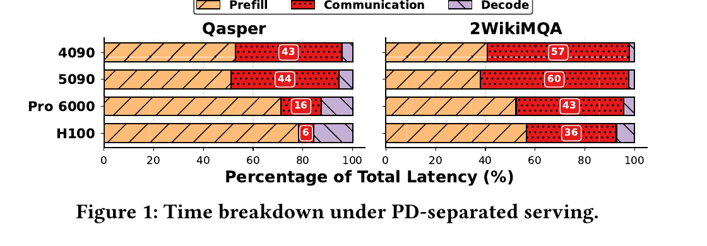

*图 1：原文 Fig. 1。Llama-3.1 在 Qasper 和 2WikiMQA 上执行 PD 分离时，不同 Prefill GPU 对应的通信时间占 JCT 的 6%～60%。这是问题存在性证据，不是 KVServe 加速结果。*

### 1.3 核心洞察与抽象

论文的核心洞察可以写成一句话：**既然压缩收益会随任务、有效带宽和服务约束改变，就不应把压缩方法固化在数据路径里，而应将它表示为可检索、可比较、可在线切换的服务配置。**

它建立了两组配套抽象：

- 压缩配置 `p = (cr, s, q)`：`cr` 是压缩比，`s` 是编码与解码的等效吞吐，`q` 是指定工作负载下的质量表现。
- 服务上下文 `c = (w, B, T_SLO, q_min)`：`w` 是工作负载类型，`B` 是竞争后的应用层有效带宽，`T_SLO` 是时延预算，`q_min` 是最低质量要求。

这个抽象将“选哪种压缩算法”改写为“在当前约束下选哪个可行配置”。

### 1.4 四项核心方法速览

#### 方法一：把压缩拆成可组合的变换、量化和编码流水线

- **问题**：KIVI、CacheGen、QuaRot 等方法的组件与参数接口彼此不兼容，服务层无法系统比较交叉组合。
- **方法**：将压缩统一为 `C(Q(T(X)))`，分别对应分布变换、位宽量化和码流编码；再将现有方法拆成可插拔模块。
- **效果**：固定算法变成可枚举的策略空间，离线搜索可以选出跨方法组合。

#### 方法二：用约束贝叶斯优化替代穷举画像

- **问题**：组件与精细参数的直积产生近 `10^4` 个候选，每个候选都做端到端质量评测时，穷举成本不可接受。
- **方法**：用高斯过程估计配置满足准确率门限的概率，将压缩比收益与不确定性合成采集函数，同时执行双向剪枝和早停。
- **效果**：用较少的昂贵评测构建“准确率—压缩比—编解码时延”三维 Pareto 候选集，把大量离线搜索成本从在线关键路径上移开。

#### 方法三：用带宽阈值和下包络做常数时间选路

- **问题**：在线请求不能对 Pareto 候选重新做完整性能测试，只按压缩比排名又会选中编解码过慢的配置。
- **方法**：先用解析模型计算每个配置的收益带宽阈值，排除按该模型预计比不压缩更慢的候选；再根据延时直线的下包络查表。
- **效果**：最优配置被化为随 `1/B` 分段常数的决策，论文给出 `O(1)` 选择开销。

#### 方法四：只在下包络相邻候选中学习在线残差

- **问题**：离线测得的编解码吞吐会受 GPU 负载、队列竞争和调度开销影响，解析模型无法长期与真实系统完全一致。
- **方法**：将解析模型的预测作为先验，只对当前最优配置及 1～2 个相邻配置运行轻量多臂机；用 EWMA 更新“实测 JCT 减预测 JCT”的残差，并为未预期 SLO 违约设置冷却。
- **效果**：在不重建全量性能模型的前提下跟踪运行时漂移，每次只比较 2～3 个候选。

### 1.5 最重要的实验结果

- **论文实测**：在 PD 分离场景中，KVServe 相对不压缩 BF16 与静态压缩基线取得最高 `9.13×` JCT 加速；在远程前缀缓存场景中，相对回退重算的路径取得最高 `32.8×` TTFT 降低。这两个数字来自不同场景，不能相乘。
- **论文实测**：Qwen2.5-7B-Instruct 的表 1 中，按工作负载选择的 KVServe-Aware 平均压缩比为 `8.28×`，六个任务的平均相对准确率为 `100.35%`。这个平均数不能推导出压缩普遍提高模型质量。
- **论文实测**：在 Qwen2.5-32B-Instruct + GSM8K 的消融中，完整离线搜索在 194 次迭代找到 `9.31×` 压缩比；去掉参数编码或探索—利用策略后只达到 `8.96×` 和 `8.53×`，去掉剪枝或早停则用完 300 次预算。
- **论文实测**：在带宽波动消融中，无在线控制器的配置延时峰值接近 `0.9 s`，完整 KVServe 稳定在约 `0.3 s`。

### 1.6 最大局限

KVServe 需要事先得到工作负载标签，离线画像也与模型、任务和硬件相关。它的解析模型把模型计算、编解码和传输写成加和关系，没有直接表达流水重叠、排队、多租户竞争、多卡组同步和容错。在它的限速实验中，网络带宽是发送端限速与 RoCE NIC 限速形成的，不等于生产集群中的 Incast（多对一突发网络拥塞）或前后台混压。

### 1.7 为什么与本项目相关

KVServe 独立支持了本项目的一个基本判断：**数据存在不等于数据值得拉取，压缩后字节更少也不等于端到端一定更快。** 决策必须同时看可用路径、实测有效带宽、转换成本、剩余时限和质量约束。

它为 QueryPlan（查询与放置计划决策引擎，根据链路、算力与上下文选择加载或重算路径）与 CostEvaluator（成本预估模型，在决策前预测加载、转换、接入与重算开销）提供了可迁移的数学结构，但没有证明本项目的具体软硬件路径和验收指标。

---

## 2. 为什么固定压缩策略会失效

### 2.1 KVCache 从本地状态变成通信载荷

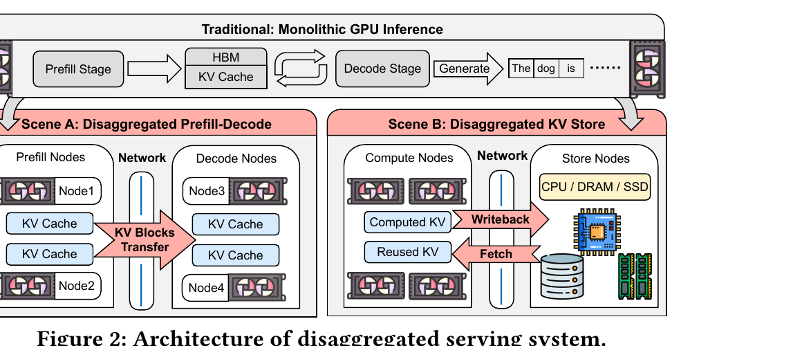

*图 2：原文 Fig. 2。左下是 PD 分离中 Prefill 节点到 Decode 节点的 KV 传输；右下是计算节点对远程 CPU/DRAM/SSD 存储节点的回写与拉取。*

**论文事实**：Llama-3.1-70B 在 128K Token 上下文下产生 `39.06 GB` KVCache。论文引用的 Qwen3-235B 场景估算显示，64 个 Prefill 节点处理 32K Token 请求时需要 `2.1 Tbps` KV 出口带宽。这里的第二个数字是论文引用的场景需求，不是 KVServe 测试平台的实测吞吐。

PD 分离和远程 KV 池的目的不同，但有同一个结果：KVCache 要经过一条可观测、可调度的数据边界。这正是压缩控制器可以插入的地方。

### 2.2 任务改变了准确率与压缩比排名

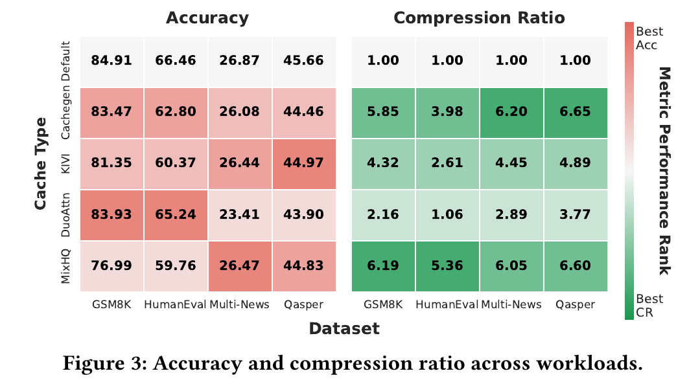

*图 3：原文 Fig. 3。同一压缩方法在 GSM8K、HumanEval、Multi-News 和 Qasper 上的准确率与压缩比排名明显变化。*

**论文实测**：KIVI 在 Qasper 准确率排名最好，在 GSM8K 和 HumanEval 却靠后；DuoAttention 在 GSM8K 和 HumanEval 表现好，在 Multi-News 和 Qasper 则最差。CacheGen 在 Multi-News 上压缩比为 `6.20×`，在 HumanEval 只有 `3.98×`，低于 MixHQ 的 `5.36×`。

这些数字只说明配置排名依赖任务，不说明服务系统能在没有任务标签的情况下自动识别工作负载。KVServe 把标签当作上游路由器的输出，并不研究分类器本身。

### 2.3 带宽决定压缩是加速还是减速

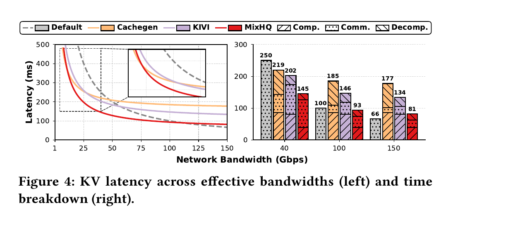

*图 4：原文 Fig. 4。左图显示 CacheGen、MixHQ 和 KIVI 的最优区间会随带宽切换；右图分解了编码、传输和解码时间。*

**论文实测**：CacheGen、MixHQ 和 KIVI 的收益带宽阈值分别约为 `50/55/110 Gbps`。超过各自阈值后，节省的传输时间不足以抵消编解码开销，压缩反而比 BF16 直接传输更慢。

**分析判断**：这张图是全文最有决策价值的证据。它否定了“压缩比越高就越快”的简化判断，也说明压缩必须进入动态成本决策，不能作为默认开启的数据面开关。

---

## 3. 核心抽象与系统设计

### 3.1 端到端三阶段架构

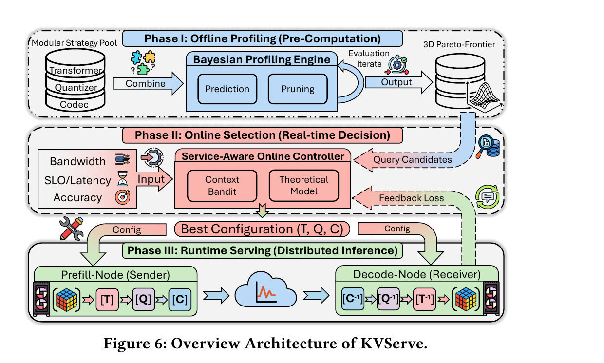

*图 5：原文 Fig. 6。上部是离线画像，中部是在线选择，下部是发送端与接收端的镜像编解码数据路径。*

KVServe 的控制面和数据面分为三个阶段：

1. **离线画像**：对指定模型和工作负载组合压缩组件，测量准确率、压缩比和编解码时延，保留三维 Pareto 前沿。
2. **在线选择**：读取工作负载、有效带宽、SLO 和准确率底线，用解析模型缩小候选，再用在线反馈校正。
3. **运行时执行**：发送端按变换 `T` 、量化 `Q` 、编码 `C` 顺序处理 KVCache，接收端按 `C^-1 → Q^-1 → T^-1` 恢复。论文在一个会话片段内保持压缩配置不变。

这个系统不在 Token 级关键路径上搜索全部压缩策略。它把昂贵搜索放到离线，在线只做约束过滤、区间查表和小规模学习。

### 3.2 约束优化模型

对某个压缩配置 `p`，论文将 JCT 写为：

$$
T_p(c)=T_{model}(w)+\frac{V}{s_p}+\frac{V}{B\,cr_p}
$$

不压缩时：

$$
T_0(c)=T_{model}(w)+\frac{V}{B}
$$

其中，`V` 是要跨边界搬运的 BF16 KV 字节数，`V/s_p` 合并了编码和解码时间，`V/(B cr_p)` 是压缩后通信时间。可行集同时约束 `T_p(c) <= T_SLO` 与 `q_p(w) >= q_min`，最后在可行集中最小化 JCT。

**论文模型**：将 `T_p < T_0` 化简可得收益带宽阈值：

$$
B_p^{*}=\left(1-\frac{1}{cr_p}\right)s_p
$$

只有当 `B < B_p*` 时，配置 `p` 在这个加和模型下才比不压缩更快。阈值与 `V` 无关，由压缩比和编解码等效吞吐决定。

**分析边界**：“与 `V` 无关”只是该线性模型中的代数结果。实际系统里，小对象的固定启动开销、分块、内存分配、编码并行度、队列等待和流水重叠都可能让 `s_p` 随 `V` 变化。项目不应把该阈值当成无条件的硬件定律。

### 3.3 状态与所有权

KVServe 有三类持久状态：

| 状态 | 所有者 | 用途 | 是否在请求关键路径 |
|---|---|---|---|
| 压缩组件与参数空间 | 模块化策略池 | 生成可枚举配置 | 否，主要在离线使用 |
| 准确率—压缩比—时延 Pareto 集 | 离线画像引擎 | 为每类工作负载和质量档位提供在线候选 | 被在线读取，不在线重算 |
| 每个带宽区间的 EWMA 残差、使用次数和冷却状态 | 在线控制器 | 修正离线预测与线上实测的偏差 | 是，但候选通常只有 2～3 个 |

论文没有详细讨论 Pareto 配置的分布、版本升级、发送端与接收端的能力协商失败，也没有把压缩配置与模型版本、Tokenizer、Prompt 模板和 LoRA 语义签名联合起来。这是从原型走向生产系统时必须补齐的边界。

---

## 4. 关键技术实现与作用机理

### 4.1 可组合压缩流水线与 MixHQ

#### 解决的问题

现有 KVCache 压缩方法往往把数据变换、量化粒度、异常值处理和码流编码固化在一套管线中。基线系统可以调某些参数，却难以交叉组合来自不同方法的组件。

#### 核心方法与执行路径

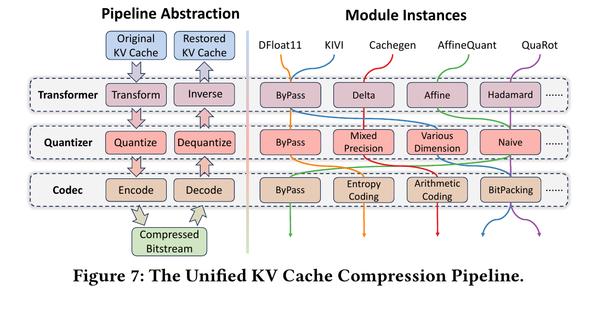

*图 6：原文 Fig. 7。左侧是 `Transformer → Quantizer → Codec` 抽象，右侧是 DFloat11、KIVI、CacheGen、AffineQuant 和 QuaRot 的组件映射。*

1. 变换器先改造 KV 分布，可选 Delta、Hadamard 或 Affine 变换。
2. 量化器降低位宽，可选不同量化维度、混合精度或朴素量化。
3. 编码器将量化后的数据转换为码流，可选 nvCOMP 支持的熵编码、算术编码或 BitPacking。
4. 接收端按相反顺序恢复，所以压缩配置是发送端和接收端的共同契约，不只是发送端的局部优化参数。

KVServe 新增的 MixHQ 先用重要性估计器将 KV Head 分为高、低重要性两组，再分别为高/低重要性 Key 和 Value 选择四个位宽 `(b_KH, b_KL, b_VH, b_VL)`。低重要性 Head 仍被保留，只是使用更低位宽，这与 DuoAttention 直接丢弃 Head 的做法不同。

#### 为什么有效

资源变化是：

`BF16 原始 KV 字节` → `变换与量化 GPU 开销 + 更少的网络字节 + 解码 GPU 开销`。

模块化本身不保证加速，它提供可搜索的操作空间。MixHQ 则用差异化位宽交换准确率和压缩比，尽量避免粗暴丢弃对长上下文检索有用的 Head。

#### 论文证据、亮点与局限

**论文实测**：在 Qwen2.5-7B-Instruct + GSM8K 的离线搜索中，引擎选中 `HK4-LK3-HV3-LV2`，在 `97%` 相对准确率约束下获得当时候选中最高压缩比。表 1 显示 KVServe-Aware 在六个任务上平均压缩比为 `8.28×`。

技术亮点是把异构算法变成组件接口，让系统可以把“组合”也当作搜索变量。它的主要代价是组合空间快速增大，而且每个组件都需要稳定、可测的设备内核实现。论文对 MixHQ 的 Head 重要性估计器着墨不多，这个估计器的泛化与稳定性仍要单独验证。

#### 对项目的意义

**ADAPT（需要改造）**：可以将压缩配置纳入项目已有布局与元素类型能力契约，但不宜直接照搬 CUDA/nvCOMP 组件。国产 NPU 上需要先实测设备侧变换、量化、编码与解码的吞吐、工作区大小和对前台 TPOT 的影响。

### 4.2 约束贝叶斯离线画像

#### 解决的问题

精细到模块和参数的搜索空间接近 `10^4`。论文的一次完整候选画像约需 15 分钟；如果穷举 4,000 多个候选，总成本约为 1,000 GPU 小时。

#### 核心方法与执行路径

1. 将类别参数做 One-Hot 编码，数值参数做 Min-Max 缩放，构成高斯过程可接受的混合参数空间。
2. 高斯过程只拟合最昂贵的准确率函数；压缩比与编解码吞吐由轻量算子测试获得。
3. 采集函数同时奖励高压缩比、满足准确率阈值的高概率，以及尚未探索区域的高不确定性。
4. 探索权重随迭代衰减，搜索从扩大覆盖逐步转向收敛。
5. 双向剪枝只在模块选择已固定、压缩激进度大致单调的可比配置内使用。满足准确率后剔除更低压缩比候选，严重不满足时剔除更激进候选；缓冲量 `epsilon` 用于避免因噪声过度剪枝。
6. 连续失败超过阈值或有效空间耗尽时早停，对所有准确率可行配置构建三维 Pareto 前沿。

#### 为什么有效

资源变化是：

`约 4,000 次全量端到端评测` → `少量高信息量采样 + 大量便宜算子测量 + 局部单调剪枝`。

贝叶斯优化不使单次准确率评测变快，它减少了需要做准确率评测的候选数量。

#### 论文证据、亮点与局限

**论文实测**：第 5.2.2 节报告一个代表性搜索在少于 80 次迭代、约 20 小时内收敛，相比约 1,000 小时穷举为 `50×` 开销降低。Fig. 16 的 Qwen2.5-32B-Instruct + GSM8K 消融使用不同的迭代结果：完整算法用 194 次迭代找到 `9.31×`。这两组数字不应合并成一个“固定 80 次搜索完成”的结论。

该方法的亮点是将质量测评与便宜的性能指标分开，把昂贵预算用在决策边界附近。局限也很明确：剪枝依赖局部单调性，均匀子集上的准确率需要能代表真实线上请求，新模型、新工作负载或新内核可能要重新画像。

#### 对项目的意义

**ADAPT（需要改造）**：项目可以使用 Pareto 候选表管理“原始直达、设备侧量化、设备侧压缩”等能力配置，但离线维度必须加入国产 NPU 型号、内核版本、拓扑、多卡并行度和前后台干扰。论文的三维 Pareto 表不足以直接承载这些条件。

### 4.3 带宽阈值与分段下包络选路

#### 解决的问题

即使离线只保留 Pareto 前沿，在线决策仍要同时处理质量、SLO、有效带宽和编解码开销。对所有候选每次重新评测不可行。

#### 核心方法与执行路径

1. 按准确率损失将候选分入质量档位，先依 `q_min` 排除质量不合格配置。
2. 对每个配置计算 `B_p*`，当前有效带宽高于该阈值时，直接排除这个压缩配置。
3. 令 `x=1/B`，则扣除模型计算并按 KV 字节归一化后，每个配置的延时是一条直线：截距是 `1/s_p`，斜率是 `1/cr_p`。
4. 所有直线的下包络给出不同带宽区间的最优配置；该结果可离线编译为分段查询表。

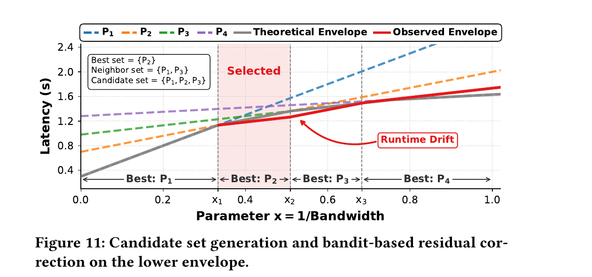

*图 7：原文 Fig. 11。灰线是理论下包络，红线是受运行时漂移影响的观测包络。在线学习只需查看当前最优段与相邻段。*

#### 为什么有效

资源变化是：

`请求到达后遍历大量配置` → `质量档位过滤 + 带宽阈值过滤 + 分段查表`。

这一方法利用了线性延时模型的几何结构。压缩比越高，延时直线斜率越小，低带宽时更有利；编解码越快，截距越小，高带宽时更有利。最优配置因而只在少数交叉点切换。

#### 论文证据、亮点与局限

**论文事实**：论文将解析选择开销写为 `O(1)`，并报告每次在线决策耗时小于 `1 ms`。

这是全文最干净的系统化结果：它不要求在线优化器去搜全局，只把离线结果编译成少量分段。局限在于，下包络依赖加和与线性假设。如果编码与传输可重叠，或多租户队列使有效带宽快速变化，理论切换点会偏移。

#### 对项目的意义

**DIRECTLY ADOPT（可直接采用的原则）**：先证明候选路径有净收益，再进入排名。这与本项目“拉取与加载总开销 < 本地直接重算耗时”的准入原则一致。

**ADAPT（需要改造）**：KVServe 公式可作为 CostEvaluator 的快速剪枝项，不应取代项目的完整成本模型。完整模型还要包含目录查询、权限与租约、排队、布局转换、多卡同步、接入可见性、内存工作区和对前台请求的干扰。

### 4.4 基于局部候选的在线残差校正

#### 解决的问题

离线测得的 `s_p` 与真实运行时不会完全一致。GPU 负载、压缩内核排队、通信竞争和框架调度都会产生残差。频繁重做离线画像不现实。

#### 核心方法与执行路径

1. 以质量档位与带宽区间为小环境，选出解析模型给出的最优配置及其 1～2 个下包络邻居。
2. 对候选 `p` 计算解析预测 `T_hat_p(c)`，每次执行后观测真实 JCT，得到残差 `delta = T_obs - T_hat_p(c)`。
3. 对每个候选使用 EWMA 更新残差，用“预测值 + 残差”作为修正后延时。
4. 使用 epsilon-greedy 在 2～3 个候选中选择；模型预测不满足 SLO 的配置不允许探索。
5. 某配置在最近 `M` 次使用中出现 `K` 次未预期 SLO 违约时，将其暂时移出候选；候选集为空时回退到保守默认配置。

#### 为什么有效

资源变化是：

`在线重新拟合全量延时模型` → `利用理论先验后只学习小规模残差`。

下包络将多臂机的探索空间压到 2～3 个配置，EWMA 可以跟踪缓慢漂移，冷却机制限制连续违约。

#### 论文证据、亮点与局限

**论文实测**：Fig. 16 的 20～40 秒带宽下降阶段中，无控制器方案延时峰值接近 `0.9 s`，无多臂机方案无法校正运行时偏差，完整 KVServe 的延时约为 `0.3 s`。

方法的亮点是不用黑箱学习取代可解释的系统模型，而是让学习只处理模型没有捕捉的小偏差。局限是 epsilon-greedy 仍然会主动探索，预测满足 SLO 不代表实际不违约。快速非平稳变化、带宽测量滞后或相邻假设失效时，真实最优配置可能不在局部候选里。

#### 对项目的意义

**ADAPT（需要改造）**：项目可以保留“解析成本模型 + 在线残差”的两层结构，但线上探索必须受硬件 QoS（服务质量，通过优先级队列与带宽保留减少后台大流量对前台请求的干扰）、剩余请求时限和多卡组统一决策限制。高风险低时限请求不宜参与探索。

---

## 5. 实验到底证明了什么

### 5.1 实验条件

| 维度 | 论文条件 |
|---|---|
| 实现基础 | vLLM 0.10.1；将压缩流水线注入 PD 分离通信路径；lm-eval-harness 用于质量评估 |
| 离线画像 GPU | 4× A100 40GB |
| Decode GPU | H100 |
| Prefill 硬件 | 2× RTX 4090 24GB（10 Gbps）；2× RTX 5090 32GB（10 Gbps）；2× RTX Pro 6000 96GB（50 Gbps）；2× H100 80GB（100 Gbps） |
| 模型 | Qwen2.5-7B-Instruct、Llama-3.1-8B-Instruct、Qwen2.5-32B-Instruct |
| 画像数据集 | GSM8K、HumanEval、Multi-News、Qasper |
| 未参与画像的数据集 | 2WikiMQA、HotpotQA |
| 网络条件 | 发送端 traffic shaping 与 RoCE NIC 限速；PD 场景覆盖 5～100 Gbps，前缀缓存场景覆盖 5～15 Gbps |
| 端到端基线 | Default(BF16)、CacheGen、KIVI；DuoAttention 主要出现在压缩比/准确率比较中 |

### 5.2 主张—证据对照

| 主张 | 最直接的实验 | 结果 | 它证明什么 | 它不证明什么 |
|---|---|---|---|---|
| KV 通信是解耦服务的重要开销 | Fig. 1，Llama-3.1 + Qasper/2WikiMQA，H100 Decode，多种 Prefill GPU | 通信占 JCT 的 6%～60% | 不同硬件与任务下通信可以成为主要开销 | 不证明所有部署都是网络受限 |
| 固定压缩会因任务与带宽失效 | Fig. 3、Fig. 4 | 方法排名随数据集改变；三类配置的收益阈值约 50/55/110 Gbps | 压缩需要服务状态感知 | 不证明这些阈值可直接搬到其他 GPU/NPU |
| 动态选择改善 PD 分离 JCT | Fig. 12、Fig. 13 | 最高 9.13×；5 Gbps 下 Llama-8B/Qwen-32B 分别约 5.6×/9.2× | 在论文的限速环境下，动态压缩能降低 JCT 且避免部分负优化 | 不证明真实多租户拥塞、P99 或 TPOT 不受干扰 |
| 动态选择改善远程前缀复用 TTFT | Fig. 14，Qwen2.5-32B + Pro 6000，5～15 Gbps | 2WikiMQA 最高 32.8×；HotpotQA 最高 11.8× | 在低带宽下，可行压缩配置能将原本回退重算的请求转成缓存命中 | 不证明它比所有远程 KVCache 系统更快；该图主要与 Default 和 CacheGen 对比 |
| 收益来自通信字节下降 | Fig. 15 | Default 通信占 82%/90%，KVServe 降至 6%/9% | 通信从主要开销转为次要开销 | 不证明编解码零开销，也不证明字节未经 Host 内存 |
| 离线与在线两类算法都有作用 | Fig. 16 | 完整搜索 194 次迭代找到 9.31×；带宽波动时完整控制器约 0.3 s | 参数编码、探索、剪枝、早停、解析控制和残差学习都影响结果 | 不能从单一消融推出各机制在所有模型上有同样收益 |

### 5.3 端到端与性能图

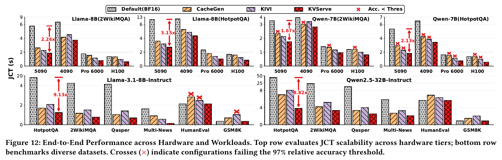

*图 8：原文 Fig. 12。红色交叉号表示该压缩配置不满足 97% 相对准确率阈值。最低 JCT 不能脱离质量约束解读。*

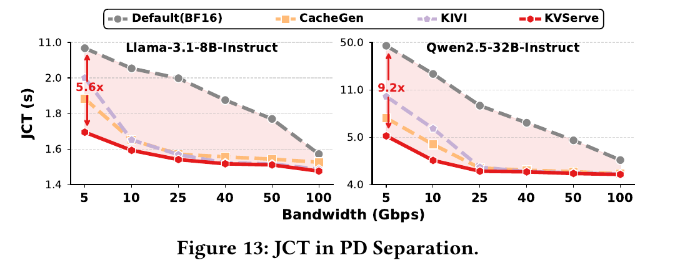

*图 9：原文 Fig. 13。高带宽时 KVServe 通过选择低开销配置逐渐接近 BF16，而静态压缩会出现负优化。*

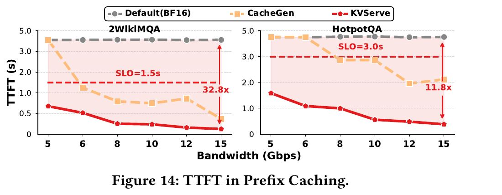

*图 10：原文 Fig. 14。CacheGen 在部分低带宽点无法找到满足 SLO 的配置而回退重算，KVServe 则在该评测区间保持可行。*

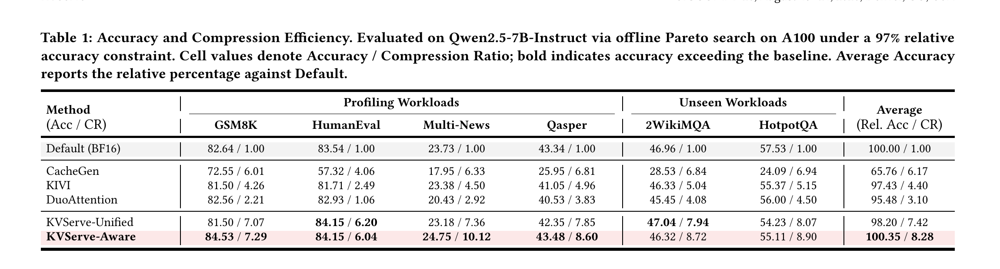

*表 1：原文 Table 1。实验使用 Qwen2.5-7B-Instruct，A100 离线 Pareto 搜索，相对准确率阈值为 97%。单元格数值是“准确率 / 压缩比”。*

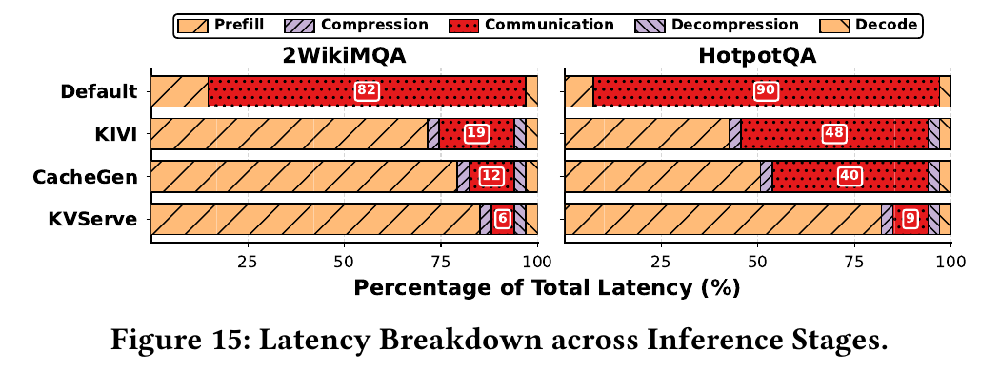

*图 11：原文 Fig. 15。在 2WikiMQA/HotpotQA 中，Default 的通信占比为 82%/90%，KVServe 为 6%/9%。*

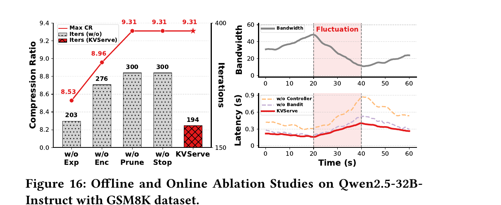

*图 12：原文 Fig. 16。左图是离线搜索消融，右图是 60 秒带宽波动下的在线控制消融。*

### 5.4 基线与可比性

1. **端到端对比不是完整产品系统对比**。论文在自己的 vLLM 集成中将 CacheGen 和 KIVI 核心算法作为流水线模块接入，这有利于控制对比变量，但不等于与对方完整系统的最优部署比较。
2. **DuoAttention 没有贯穿主要端到端图表**。它主要用于表 1 的质量/压缩比对比，Fig. 12～15 的端到端性能基线主要是 Default、CacheGen 和 KIVI。
3. **32.8× 的分母是回退重算路径**。这个结果证明在该条件下 KVServe 能把不可行的远程命中转为可行命中，不是对所有无压缩远程 KV 系统的普遍加速比。
4. **带宽由限速构造**。这适合验证带宽交叉点，但没有再现共享上行、多对一突发、丢包恢复和硬件优先级队列对 P99 的影响。

---

## 6. 技术亮点与局限成对分析

| 技术亮点 | 对应局限 |
|---|---|
| 将压缩重构为变换、量化、编码三段可组合流水线 | 组合数量呈乘法增长；组件版本、工作区和设备能力协商尚未形成完整生产协议 |
| 用三维 Pareto 前沿将离线高成本搜索与在线选择分开 | 每个模型、工作负载、质量档位与硬件内核组合都可能需要重新画像 |
| 从线性成本模型推导收益带宽阈值和分段下包络 | 模型忽略编码—传输—解码重叠、队列竞争、分块启动开销和多卡组完成时间 |
| 只在解析最优配置的邻域学习残差，控制开销很小 | 实际最优配置跨越多个包络区间时，局部候选可能找不到；epsilon-greedy 会带来真实探索风险 |
| MixHQ 用差异化位宽保留全部 Head，在论文任务上取得高压缩比 | Head 重要性估计的跨模型、跨请求稳定性缺少独立解构；质量评估主要是六个英文任务的任务准确率 |

---

## 7. 论文没有解决什么

### 7.1 没有解决语义兼容与错误消费

KVServe 把质量底线当作配置约束，但没有给出模型架构、Tokenizer 词表哈希、Prompt 模板、LoRA 适配器、就绪位与租约的联合消费校验。它也没有详细说明发送端和接收端如何防止压缩配置版本不一致。

### 7.2 没有证明 Host CPU 零数据拷贝

论文使用 GPU 压缩库与 vLLM 通信路径，但没有用 eBPF、PCIe 计数器或内存拷贝跟踪证明 Host Payload Touch Bytes 为 0。因此，不能把 Fig. 15 的通信占比下降写成主机内存绕过已经完成。

### 7.3 没有覆盖多卡一致决策

论文不讨论张量并行（TP）组内各卡的配置协商、压缩失败后的统一回退、部分解码成功与集合通信死锁。单个控制器的正确选择不自动等于 TP=8 多卡状态同步正确。

### 7.4 没有验证多租户 P99 与前后台混压

限速带宽可以验证平均性能随 `B` 的变化，无法代替共享网口、突发 Incast、后台换出、多流偏斜和硬件优先级队列下的 P99 测试。论文也没有报告压缩内核对前台 TPOT 的干扰率。

### 7.5 没有给出 Direct-View 的压缩态直读方法

Direct-View 是远端直读（直接通过高速总线跨节点读取远端显存 KV 数据，不产生本地显存完整拷贝）。KVServe 的接收端需要执行解码、反量化和逆变换，通常需要可写工作区与恢复后张量。这与不落地完整本地副本的远端直读语义存在冲突。除非注意力算子能直接消费压缩表示，否则 KVServe 更适合 Copy-to-HBM（拷贝到本地显存，通过 DMA 将远端 KV 数据搬运到本地 HBM）或远程存储回源路径。

---

## 8. 对本项目的迁移判断

### 8.1 可直接采用的原则

1. **净收益先于命中与压缩比**。先判断某路径是否比不压缩传输、本地重算或其他路径更快，再排名可行候选。
2. **使用有效带宽，不使用标称线速**。硬件能力矩阵（CapabilityMatrix，运行时探测各通信链路带宽、时延与支持能力的参数表）应同时保存静态能力与近期应用层 Goodput。
3. **将可解释模型与小规模在线校正分层**。解析模型守住不值得走的路径，在线统计只修正预测残差。
4. **策略配置是端到端数据契约**。发送端选择的变换、量化、编码及版本必须被接收端无歧义解码，不能只保存一个“已压缩”布尔位。

### 8.2 需要改造的部分

#### 将压缩配置纳入 QueryPlan

**项目建议**：在 QueryPlan 的路径候选中增加压缩配置引用，至少要能表达配置 ID/版本、变换类型、量化布局、编码器、预测压缩比、发送/接收吞吐、工作区大小、质量档位、预测路径与失败回退。这些是契约建议，不是论文已给出的项目数据结构。

#### 扩展 CostEvaluator，而不是替换它

**项目建议**：可将 `V/s + V/(B cr)` 放入压缩路径的快速预估，然后加上对象查询、排队、工作区申请、布局转换、多卡完成、可见性接入和干扰代价。每次实际执行后同时记录 Planned Path、Actual Path 和离线 Oracle Path，用于测量决策遗憾而非只看平均延时。

#### 将压缩兼容性放入布局与消费校验

ConsumeEligibility 是消费资格校验引擎（检查模型、Tokenizer、Prompt 模板、LoRA、Ready 就绪位和租约有效性）。**项目建议**：不应把压缩状态混成新的模糊语义维度，而应将压缩配置哈希、核版本、量化布局、元素类型和接收端能力纳入已有布局/版本兼容契约；六维语义校验仍负责“是不是同一份可消费内容”。

#### 将离线 Pareto 前沿改造为版本化能力库

**项目建议**：候选表至少按模型版本、NPU 型号、软件核版本、连接类型、传输方向、对象尺寸档、TP 并行度和前台负载分片。发布新核时先建立并验证新前沿，不应用在线多臂机为未知核版本补做全量安全验证。

### 8.3 不宜照搬的部分

1. **不把 `B_p*` 当作完整选路模型**。它不包括查询、排队、转换、多卡同步、接入和干扰。
2. **不对 Direct-View 默认开启需要解码落地的压缩**。这会将远端直读改造成隐式 Copy-to-HBM，破坏原路径语义。
3. **不直接搬运 CUDA/nvCOMP 绝对吞吐和 50/55/110 Gbps 阈值**。硬件、内存层次、算子调度和链路拓扑变化后，交叉点必须重测。
4. **不允许在严格 SLO 请求上无条件 epsilon-greedy 探索**。学习应在影子评估、低风险流量或有充足剩余时限的请求上进行。

---

## 9. 对本项目立项的支持边界

### 9.1 必要性证据

**论文独立验证的问题**：

- 解耦后 KVCache 传输可占 JCT 的 60%，通信优化有实际问题基础。
- 压缩配置的最优性依赖工作负载和有效带宽，静态配置会出现负优化。
- 只看目录命中或压缩比不足以做端到端选路，服务决策必须显式表达时延与质量约束。

这些证据支持本项目建设动态选路与成本预估的必要性，但不能用来证明项目已实现相应能力。

### 9.2 可行性证据

KVServe 支持两个可迁移原则：

1. 对高成本路径先离线画像，将决策结果压缩为可在线快速查询的 Pareto 表和分段区间。
2. 在线不重建黑箱模型，而是用有物理含义的成本模型守住收益边界，再用小规模残差修正跟踪偏移。

论文在 vLLM 中完成了端到端集成，并且报告在线决策小于 1 ms。这为“压缩也可以成为可调度路径”提供了原型层证据。

### 9.3 差异化与继续研发的空间

KVServe 留下的问题与本项目范围确有交集：

- UBMEM 是统一总线内存直通共享协议（支持跨节点与异构设备间直接共享内存地址空间），URMA 是通用远程直接内存访问（用户态高性能 RDMA 驱动接口与通信协议）。KVServe 没有验证压缩在这两类国产路径上的净收益与数据可见性。
- 它没有覆盖 Host CPU 零数据拷贝（CPU 只负责下发控制指令，不参与正文数据搬运，Host Payload Touch Bytes 为 0）、设备侧压缩与 DMA 直达的组合路径。
- 它没有解决 TP=8 多卡状态同步、消费兼容、租约容错、多级介质、P99 尾部时延和前后台混压。
- 它的数据路径需要在接收端解码，没有解决压缩表示与 Direct-View 语义的冲突。

这些差距说明本项目仍有独立工程范围，但不应把“论文没做”自动写成“本项目已能做好”。

### 9.4 论文不支持的项目主张

KVServe 不能独立证明以下项目主张：

- Host CPU 零数据拷贝已实现，或压缩后仍能保证 Host Payload Touch Bytes 为 0；
- UBMEM/URMA 路径在某个绝对带宽阈值下必然胜过本地重算；
- Direct-View 可以无需本地解码工作区地消费 KVServe 式压缩码流；
- 张量并行 TP=8 多卡状态同步耗时、P99 尾部时延、TPOT 干扰率和多租户隔离达标；
- **项目目标** E3 在真实两节点集群与前后台 I/O 混压下实现 TTFT 降低不少于 20%、QPS 提升不少于 10%、前台 TPOT 干扰率低于 3%。

### 9.5 立项支持结论

| 问题 | 结论 |
|---|---|
| 项目有没有真问题 | 有。KVServe 实测显示解耦后 KV 通信可占 JCT 的 60%，而且固定压缩有负优化区间。 |
| 动态成本决策有没有可行原型 | 有。带宽阈值、分段下包络与局部残差校正在 vLLM 集成中取得了端到端结果。 |
| 本项目还有没有差异化范围 | 有。国产设备侧内核、Host CPU 零数据拷贝、多卡一致、语义安全、分层介质、容错和混压 QoS 都未被论文解决。 |
| 还需要什么证据 | 需要在目标 NPU、UBMEM/URMA、真实多流拥塞和 TP 多卡环境中重测净收益边界，并完成语义与容错验证。 |

---

## 10. 建议优先验证

### 10.1 压缩净收益交叉点

- **假设**：每个压缩配置在目标 NPU 与链路上都存在可重复的收益边界。
- **变量**：对象尺寸、块大小、压缩组件、有效带宽、并发数、前台 GPU/NPU 负载、Copy-to-HBM/存储回源路径。
- **基线**：不压缩传输、固定压缩、动态选择、本地重算。
- **指标**：JCT/TTFT P50/P99、QPS、TPOT 干扰率、压缩比、编解码吞吐、工作区峰值、实测 Goodput、预测与实测误差。
- **判定**：动态决策在高带宽或小对象下必须能拦截负优化；其与离线 Oracle 的遗憾门限在测试前冻结。若不能稳定拦截，压缩不进入默认路径。

### 10.2 加和模型与异步流水的偏差

- **假设**：当编码、DMA 传输和解码重叠时，KVServe 的简化加和模型会系统性高估总时间；发生共享队列竞争时可能低估尾部时间。
- **变量**：同步执行/三段流水，单流/多流，独占链路/共享链路，前后台混压。
- **基线**：`T_model + T_encode + T_transfer + T_decode` 预测、实测关键路径、含队列的扩展模型。
- **指标**：分阶段时间线、重叠率、预测误差分位数、误选率、P99 决策遗憾。
- **判定**：若误差会改变交叉点或导致 SLO 路径误选，则 `B_p*` 只保留为粗剪枝，正式决策使用含队列、重叠和干扰的模型。

### 10.3 质量与压缩配置泛化

- **假设**：在一个英文任务上满足 97% 相对准确率的配置，不一定对中文、代码、Agent 工具调用与长文档检索都安全。
- **变量**：模型系列、Tokenizer、中英文任务、长上下文位置、压缩类型、质量档位、未见工作负载。
- **基线**：BF16 原始 KV、KVServe-Unified 式默认配置、任务感知配置。
- **指标**：任务准确率、生成一致性、长文档检索命中、困惑度、工具调用成功率和尾部失败样本。
- **判定**：画像样本不能覆盖的工作负载只能使用经过独立泛化验证的保守配置，否则使用不压缩路径。

### 10.4 设备侧编解码与 Host CPU 零数据拷贝

- **假设**：只有当压缩、解压和 DMA 数据路径全部留在设备侧时，压缩才不会破坏项目的 Host CPU 零数据拷贝目标。
- **变量**：设备侧编解码、CPU+DDR 编解码、不压缩 Raw Direct 路径；不同工作区与分块。Raw Direct 指不依赖 DPU 与专用压缩硬件、只依靠网卡/SSD DMA 直达的基础数据路径。
- **基线**：不压缩 Raw Direct，以及 CPU+DDR 中转方案。
- **指标**：Host Payload Touch Bytes、CPU 占用、DDR 带宽、PCIe/UBMEM/URMA 字节、NPU 时间、工作区峰值、TTFT/TPOT。
- **判定**：若正文数据需经 CPU/DDR 编解码，或设备侧压缩对 TPOT 干扰超过冻结门限，则压缩只作为条件路径，不得替代 Raw Direct 基线。

### 10.5 动态带宽、多卡和混压安全性

- **假设**：真实集群中的带宽变化快于会话片段，并且 TP 组内的最慢卡决定组完成时间；单卡平均值不足以做决策。
- **变量**：稳态限速、突发 Incast、前后台混压、TP 多卡偏斜、带宽测量窗口、EWMA 系数、探索率与冷却门限。
- **基线**：无压缩、静态压缩、只用解析模型、解析模型+影子残差、允许受控在线探索。
- **指标**：组完成时间、卡间偏斜、决策反转率、SLO 违约、P99 TTFT、TPOT 干扰率、冷却命中与回退正确性。
- **判定**：如果带宽测量滞后会造成频繁误选，将学习改为影子评估，正式路径使用带滞回的保守切换。只有当结果同时满足冻结的收益与干扰门限，才能进入 E3 全链路混压。

---

## 附录 A：论文证据索引

| 证据 | 位置 | 类别 | 对本文的用途 |
|---|---|---|---|
| 通信占 JCT 的 6%～60% | §1，Fig. 1，PDF 第 2 页 | 论文实测 | 证明问题存在 |
| 任务改变压缩方法排名 | §2.2，Fig. 3，PDF 第 3 页 | 论文实测 | 支持工作负载感知 |
| 三类压缩方法的收益阈值约 50/55/110 Gbps | §2.2，Fig. 4，PDF 第 3～4 页 | 论文实测 | 支持有效带宽感知与负优化拦截 |
| `p=(cr,s,q)`、`c=(w,B,T_SLO,q_min)` 与 JCT 公式 | §3，PDF 第 4～5 页 | 论文模型 | 构建论文的决策抽象 |
| 三阶段架构 | §4，Fig. 6，PDF 第 5 页 | 论文事实 | 解释离线、在线和数据面分工 |
| `C(Q(T(X)))` 流水线与 MixHQ | §5.1，Fig. 7，PDF 第 6 页 | 论文事实 | 解释可组合策略空间 |
| 约束贝叶斯搜索与三维 Pareto 前沿 | §5.2，Algorithm 1，Fig. 8～10，PDF 第 6～7 页 | 论文事实+实测 | 解释离线搜索与成本 |
| 收益带宽阈值与分段最优策略 | §6.1，Eq. 5～6，Theorem 6.1～6.2，PDF 第 8 页 | 论文模型 | 解释快速在线选路 |
| EWMA 残差、epsilon-greedy 与冷却 | §6.2，Eq. 7～8，PDF 第 8～9 页 | 论文事实 | 解释运行时漂移校正 |
| 多硬件/工作负载 JCT 与带宽敏感性 | §7.2，Fig. 12～13，PDF 第 10 页 | 论文实测 | 验证 PD 分离收益 |
| 前缀缓存 TTFT | §7.2，Fig. 14，PDF 第 10 页 | 论文实测 | 验证远程 KV 复用场景 |
| 质量与压缩比 | §7.3，Table 1，PDF 第 11 页 | 论文实测 | 限定质量门限与泛化范围 |
| 离线/在线消融 | §7.4，Fig. 16，PDF 第 11～12 页 | 论文实测 | 分离验证搜索组件与控制器作用 |

## 附录 B：图片提取说明

本文内嵌图片由 Poppler 将原 PDF 以 300 DPI 渲染后，使用 ImageMagick 按原始图表边界裁切。图内数据、坐标轴、图例和英文标题保持原样；本文只在图下添加中文解读，没有重绘或改写数据。
